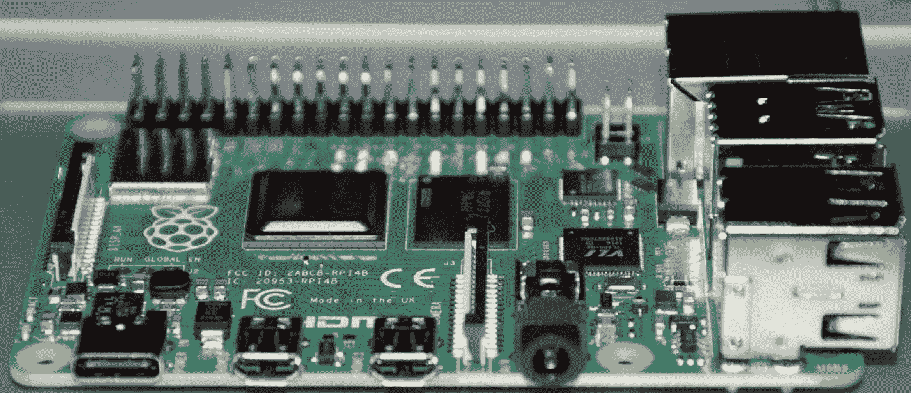
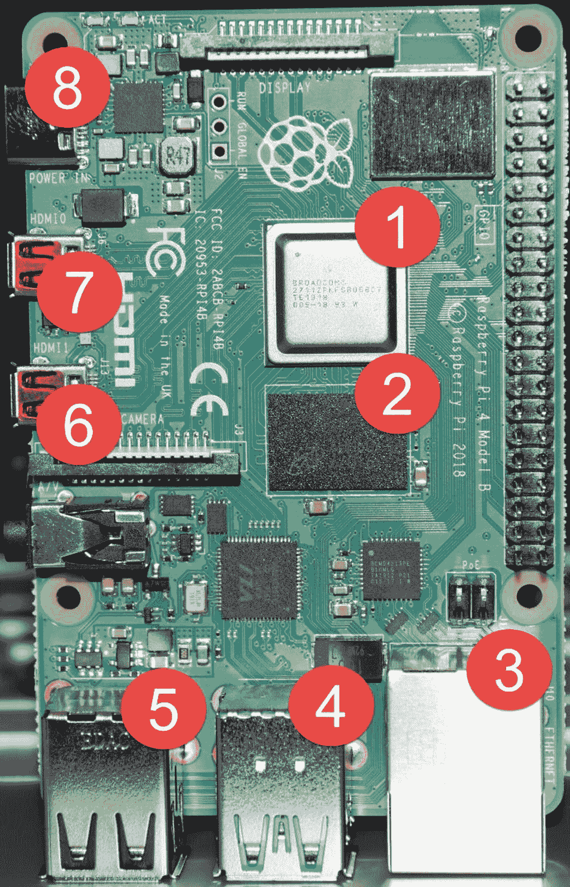
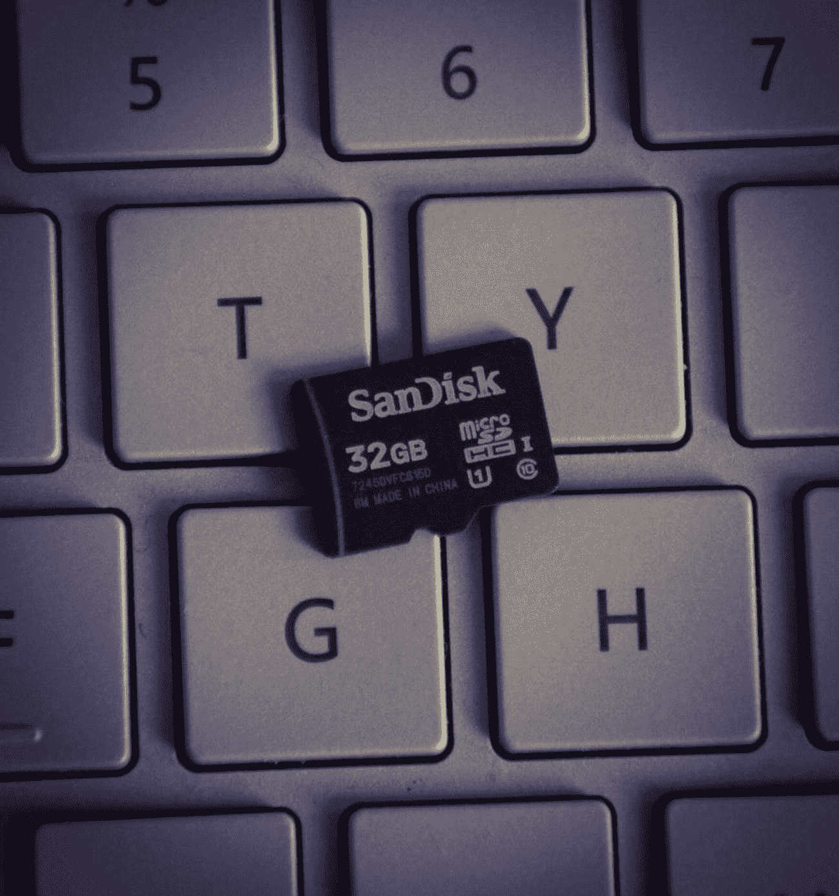
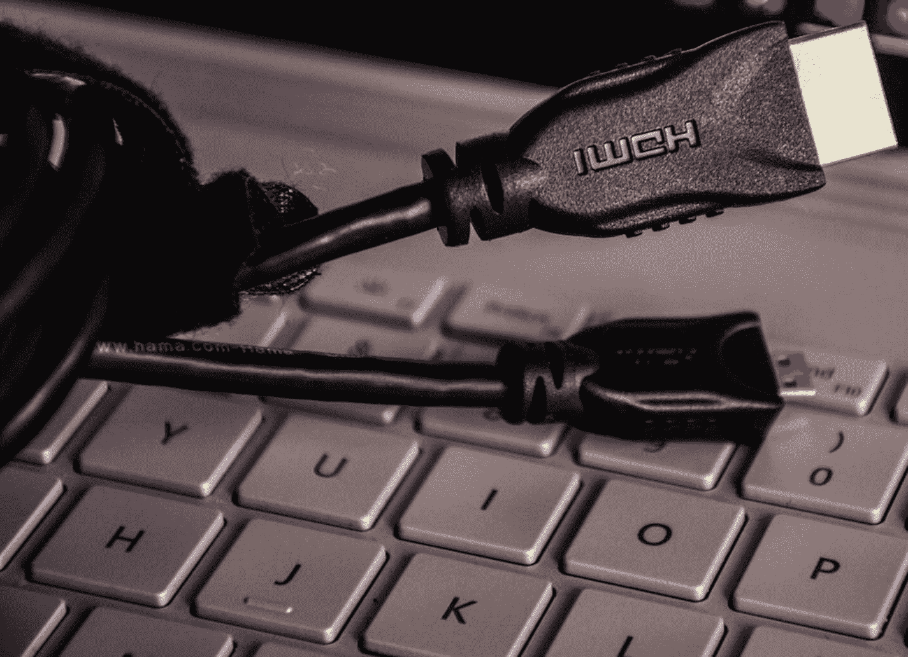
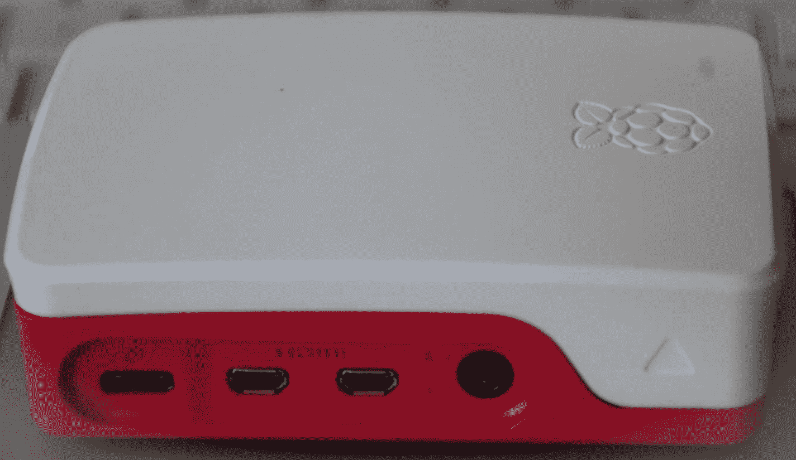
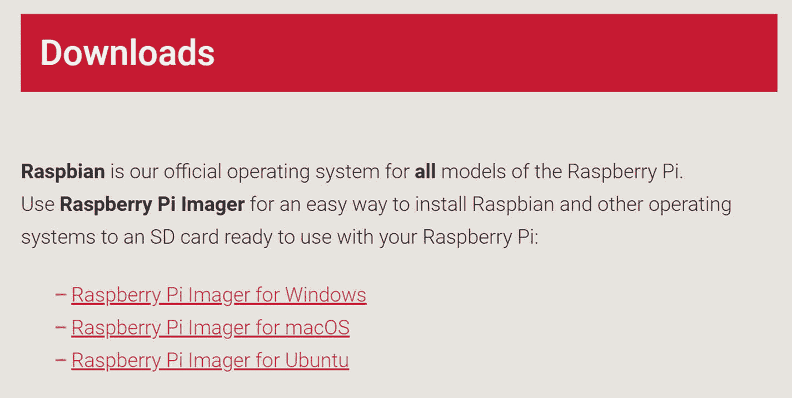
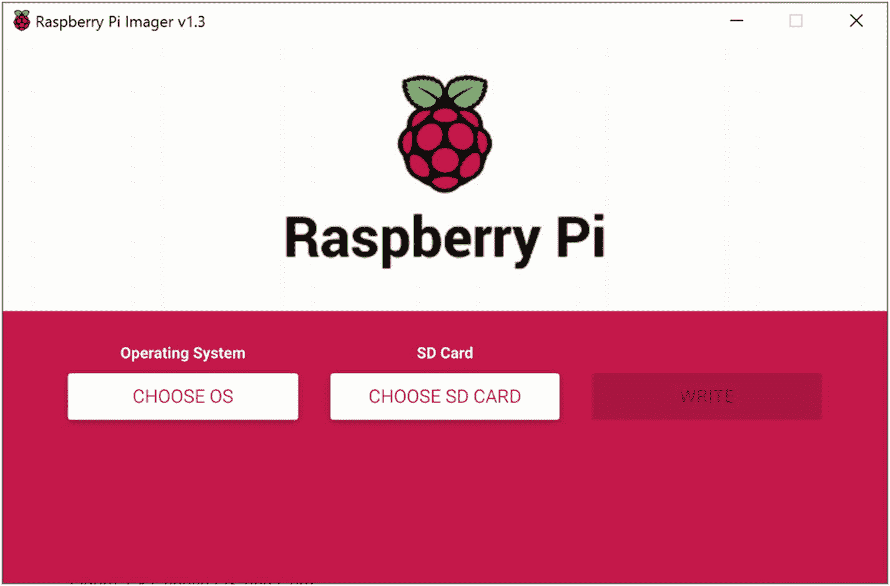
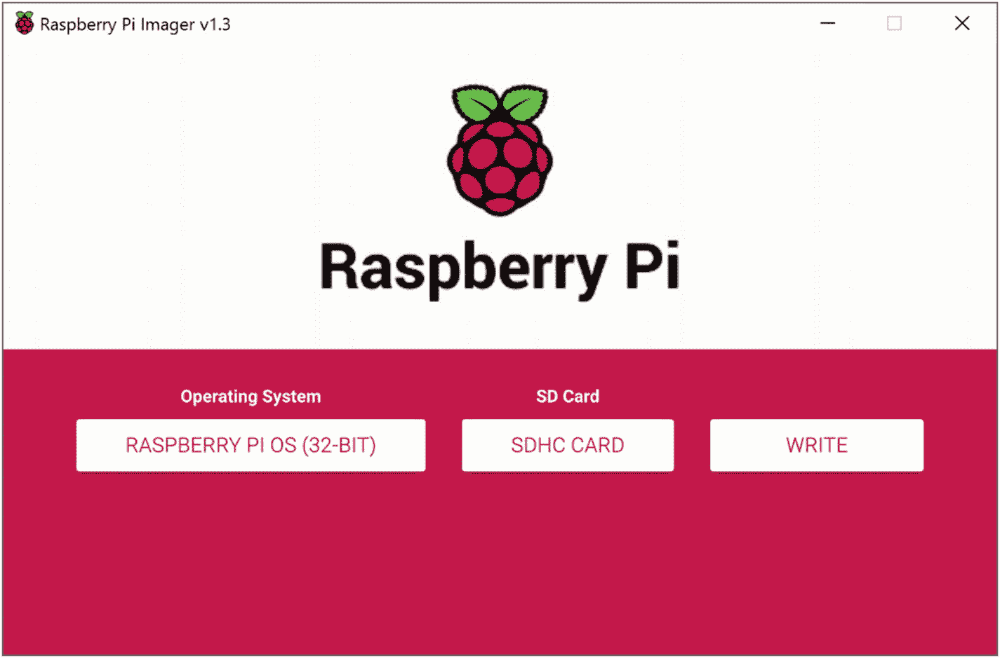
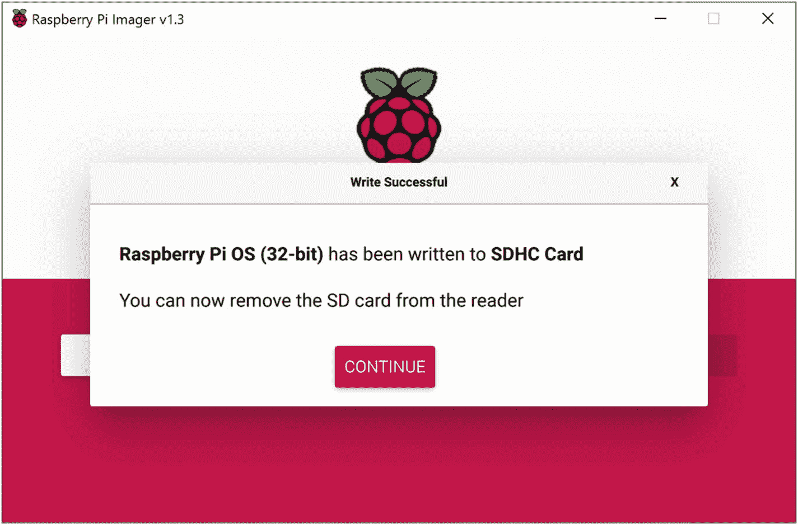

# 一、关于树莓派

欢迎来到第一章；我很高兴你在这里。在本章中，我们将讨论以下主题:

*   树莓派简介。

*   树莓派的历史。

*   关于树莓 Pi 4。

*   与 Raspberry Pi 4 搭配使用的配件。

*   Raspberry Pi 4 使用的操作系统。

*   如何安装操作系统？

让我们继续阅读。

## 关于树莓派

根据维基百科，计算机是一种可以通过计算机编程被指令自动执行一系列算术或逻辑运算的机器。当我说“计算机编程”时，我的意思是我们通过一组叫做*程序*的操作告诉计算机它需要做什么。

你可能会想，为什么我要在这里介绍计算机编程？原因是我会把树莓 Pi 设备叫做*小型机*。这个小装置的可能性是无限的。它可以执行各种各样的任务。

图 [1-1](#Fig1) 为树莓 Pi 基金会于 2019 年 6 月发布的树莓 Pi 4。

图 1-1

树莓 Pi 4

### 树莓派的历史

Raspberry Pi 是一台使用单板的微型计算机。它是由英国的树莓派基金会开发的。这个项目的最初动机是促进学校基础计算机科学的教学。树莓派的第一个版本于 2012 年 2 月 24 日发布。最新的树莓 Pi 版本是 RPI 4，截止到 2019 年。

我们可以在树莓 Pi 上运行许多操作系统；下面列出了其中一些:

*   Linux 操作系统

*   Windows 10 物联网核心(树莓 Pi 3 或 4 不支持)

*   Windows 10 ARM64

*   操作系统

*   NetBSD

到目前为止，Raspberry Pi 支持的最大内存是 4GB。它也有 1GB 和 2GB 的内存版本。

现在你对这个设备有了一个想法，你可能想知道它有多受欢迎。表 [1-1](#Tab1) 显示了过去几年售出的树莓 Pi 设备数量。

表 1-1

树莓派历年销量

<colgroup><col class="tcol1 align-left"> <col class="tcol2 align-left"></colgroup> 
| 

年

 | 

销售

 |
| --- | --- |
| Two thousand and fifteen | 五百万 |
| Two thousand and sixteen | 1100 万 |
| Two thousand and seventeen | 一千五百万 |
| Two thousand and eighteen | 一千九百万 |

### 关于树莓 Pi 4

据树莓 Pi 的创作者称，树莓 Pi 第 4 版是他们制作过的最先进、最高效的 Pi。以下是这种说法的一些理由:

*   双 4K HDMI 支持。

*   通过 USB 3.0 和千兆以太网实现快速数据传输。

*   静音节能。

*   许多变体，如 1GB、2GB 和 4 GB。

*   板载无线网络连接和蓝牙 5.0。

现在，我们来看看树莓派 4 的规格。

图 1-2

树莓 Pi 4 B 模型

以下是对图 [1-2](#Fig2) 中所示数字的解释:

1.  更强大的处理器。树莓 Pi 4 采用 Broadcom BCM2711 SoC，搭载 1.5GHz 64 位四核 ARM Cortex-A72 处理器。

2.  *RAM 选项。*使用 Raspberry Pi 4，您可以选择 1GB、2GB、4GB 或 8GB 内存，具体取决于您选择的型号。这在 Raspberry Pi 3 之前是不可能的，因为提供的最大 RAM 是 1GB。

3.  *千兆以太网支持。*老版本(树莓 Pi 3)容量只有 100Mbit。

4.  *两个额外的 USB 3 端口。*现在，您应该能够将数据传输速度提高 10 倍。祝转学愉快！。

5.  *两个 USB 2 端口。*

6.  *Micro HDMI 支持。* Raspberry Pi 4 提供双 4K 显示屏。我喜欢这个功能，因为现在我可以将两台显示器连接到我的 Pi 上。

7.  *微 HDMI。*

8.  *支持 USB C 电源。*这是第一款支持 USB Type C 设备的 Pi。

### 树莓 Pi 4 配件

如果你是从商店或网上单独购买一个树莓派，请记住，你不会得到任何配件。不过，你需要以下附件来使它工作。

图 1-3

32GB 存储卡

*   *存储卡。*必须有 SD 卡。您可以选择存储卡的大小。纯粹看你准备装哪个操作系统了。当您购买 SD 卡时，请确保您遵循这些指南。
    *   编写 Raspbian 映像的最小大小要求是 8GB，您可以在 4GB 中安装 Raspbian 的 Lite 映像。我一直推荐 16GB 或者 32GB 的存储卡，这样你就不用担心空间问题了(见图 [1-3](#Fig3) )。

    *   确保你买的是 10 级存储卡。卡的类别决定了卡的写入速度。类别 10 的写入速度为 10MB/s，类别 4 的写入速度为 4MB/s

图 1-4

5.1V/3A 电源适配器

*   你应该有一个 5.1V/3A 的电源适配器来给你的树莓 Pi 充电(见图 [1-4](#Fig4) )。

图 1-5

HDMI 电缆

*   您还需要一根微型 HDM 电缆将您的 Pi 连接到显示器(参见图 [1-5](#Fig5) )。

图 1-6

一个覆盆子 Pi 4 案例

*   尽管你并不特别需要一个箱子来装你的 Pi，我还是建议你买一个来保持它的安全和干净(见图 [1-6](#Fig6) )。

## 操作系统简介

Raspberry Pi 可以被视为一台小型机，所以我们需要一个操作系统来使用它。现在市面上有很多合适的操作系统。当你购买一个 Raspberry Pi 设备套件时，它可能已经在存储卡上安装了一个默认的操作系统，就是 Raspbian 操作系统。在本章中，我们将解释如何将 Raspbian 操作系统安装到存储卡上。

### Raspbian

Raspbian 是唯一一个由 Raspberry Pi 基金会支持的官方操作系统。你可以手动或者在 NOOBS 的帮助下安装 Raspbian 操作系统。顾名思义，NOOBS 是树莓 Pi 的一个简单的操作系统安装管理器。

### Windows 10 IoT

您可能已经知道，在物联网领域，我们将设备分为单应用设备和多应用设备。

当您使用一个应用将文件上传到云时，这是一个单个应用设备的示例。你的手机和智能手表就是多应用设备的好例子。我希望你明白我的意思。

同样，微软推出了两个版本的 Windows 10 物联网:

*   Windows 10 物联网核心。

*   Windows 10 物联网企业版。

表 [1-2](#Tab2) 列出了它们之间的区别。

表 1-2

Windows 10 物联网核心与 Windows 10 物联网企业

<colgroup><col class="tcol1 align-left"> <col class="tcol2 align-left"></colgroup> 
| 

Windows 10 物联网核心

 | 

Windows 10 物联网企业版

 |
| --- | --- |
| Windows 10 的一个版本 | Windows 10 的完整版本，它分享了全球 Windows 生态系统的所有优势 |
| 针对小型设备进行了优化 | 针对复杂解决方案进行了优化 |
| 收到的更新较少 | 接收比物联网核心更多的更新 |
| 单一应用支持，一次一个前台应用和一个支持后台应用 | 像传统 Windows 一样支持多应用 |
| 仅支持 UWP 用户界面 | 支持完整的 Windows 用户界面(UWP、WinForms 等。) |

### 关于 Windows 10 物联网核心

既然你已经了解了树莓 Pi 及其相关操作系统，那么是时候开始了解 Windows 10 物联网核心了。考虑到 Windows 10 物联网核心是 Windows 10 的一个版本，但它是为更小的设备(例如，Raspberry Pi)制作的。虽然是缩小版的 Windows 10，但也有很多不同之处。其中一些列在表 [1-3](#Tab3) 中，该表截至 2019 年 9 月更新。随着 Windows 10 物联网核心操作系统的更新，这些差异在未来的版本中可能不会相同。

表 1-3

Windows 10 与 Windows 10 物联网核心

<colgroup><col class="tcol1 align-left"> <col class="tcol2 align-left"></colgroup> 
| 

Windows 10

 | 

Windows 10 物联网核心

 |
| --- | --- |
| 支持 FileOpenPicker API | 不支持 FileOpenPicker API |
| 桌面 | 引导至操作系统中可用的默认应用 |
| 支持收件箱 Cortana | 不支持收件箱 Cortana |
| 更多支持的驱动程序 | 与 Windows 10 相比，支持的驱动程序更少 |
| 支持 Remove-AppxPackage PowerShell 命令 | 不支持 Remove-AppxPackage PowerShell 命令 |

### 安装 Raspbian 操作系统

在这一节中，我们将讨论在 Raspberry Pi 4 上安装 Raspbian 操作系统的方法。

#### 使用 Raspberry Pi 成像仪

Raspberry Pi 基金会创建了一个名为 Raspberry Pi Imager 的工具，它允许您轻松地将 Raspbian 写入 SD 卡。可以从树莓派官网下载，在 [`https://www.raspberrypi.org/downloads/`](https://www.raspberrypi.org/downloads/) 。进入网站后，只需根据您的操作系统选择要使用的成像仪。见图 [1-7](#Fig7) 。

图 1-7

选择要使用的成像仪

安装应用后，系统会要求您选择要安装的操作系统以及必须安装到哪个 SD 卡上。参见图 [1-8](#Fig8) 。

图 1-8

选择合适的操作系统和卡

请确保您已经格式化了 SD 卡；否则，在您单击“选择 SD 卡”按钮后，该卡将不会显示。值得一提的是，现在操作系统的名字是树莓 Pi OS 它以前叫拉斯扁。参见图 [1-9](#Fig9) 。

图 1-9

选择操作系统和 SD 卡后

现在点击写按钮。所选操作系统将被添加到 SD 卡中。图 [1-10](#Fig10) 显示了流程完成后您将看到的弹出窗口。

图 1-10

Raspbian 操作系统安装完成

#### 手动下载图像并写入

接下来的安装方式是从官网下载 OS 镜像( [`https://www.raspberrypi.org/downloads/`](https://www.raspberrypi.org/downloads/) )。图像在下载的 ZIP 存档文件中，文件超过 4GB。由于它使用 ZIP64 压缩这些文件，我们必须使用支持 ZIP64 的解压缩工具。以下是不同操作系统中支持的解压缩工具。

*   7 Zip: Windows。

*   解压器:Mac。

*   解压缩：Linux。

请注意，Windows XP 中的文件资源管理器不支持 ZIP64，但 Windows Vista 和更高版本支持。

解压缩文件后，您可以使用任何图像写入工具将该图像写入 SD 卡。我推荐使用 balenaEtcher，它可以在 Windows、Linux 和 macOS 上运行。如果您使用的是 balenaEtcher，您不必解压缩 Raspbian 图像，因为该工具支持直接从 zip 文件写入图像。您可以在 [`https://www.balena.io/etcher/`](https://www.balena.io/etcher/) 官网了解该工具的更多信息。

### 使用 NOOBS 安装操作系统

另一种在 SD 卡上安装 Raspbian 操作系统的方法是使用 NOOBS。你可以从 [`https://www.raspberrypi.org/downloads/`](https://www.raspberrypi.org/downloads/) 下载 NOOBS。NOOBS 的好处是它一般支持多种操作系统的安装，包括:

*   Raspbian.

*   Windows 10 物联网核心。

*   LibreElec。

*   -好的。

*   RISC 操作系统。

*   TLXOS。

*   银幕上的 OSE。

*   回收箱。

*   奥斯 MC 公司。

要设置 SD 卡，请按照以下步骤操作:

1.  格式化 SD 卡。

2.  从下载的 NOOBS 文件的解压文件夹中复制所有文件。确保您复制的是内容，而不是文件夹。

就这样。当您第一次启动设备时，它会要求您选择要安装的操作系统。

## 摘要

恭喜你，你已经看完了第一章！我相信你已经了解了这些主题。

*   树莓派是什么

*   Raspberry Pi 4 设备的规格以及您可以使用的配件

*   用于 Raspberry Pi 4 的操作系统

*   如何在树莓 Pi 4 上安装 Raspbian 操作系统

现在让我们进入下一章。