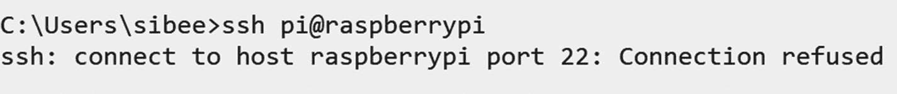
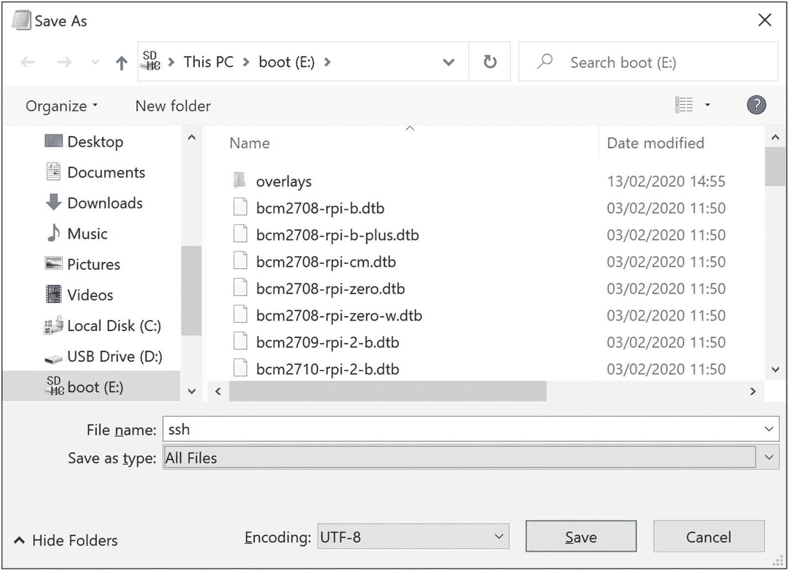
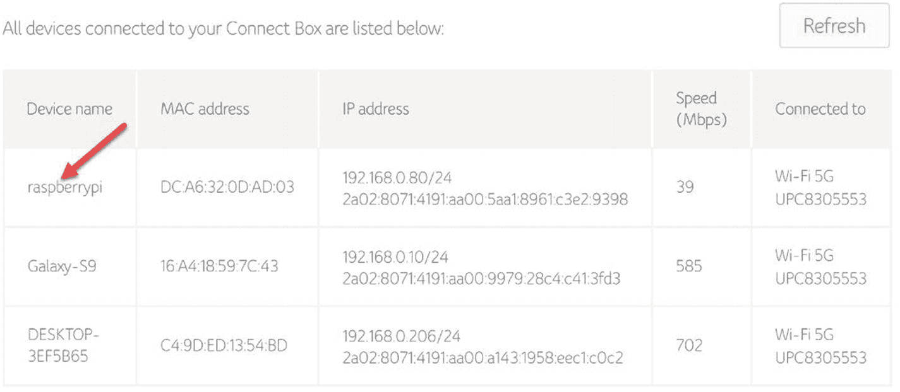
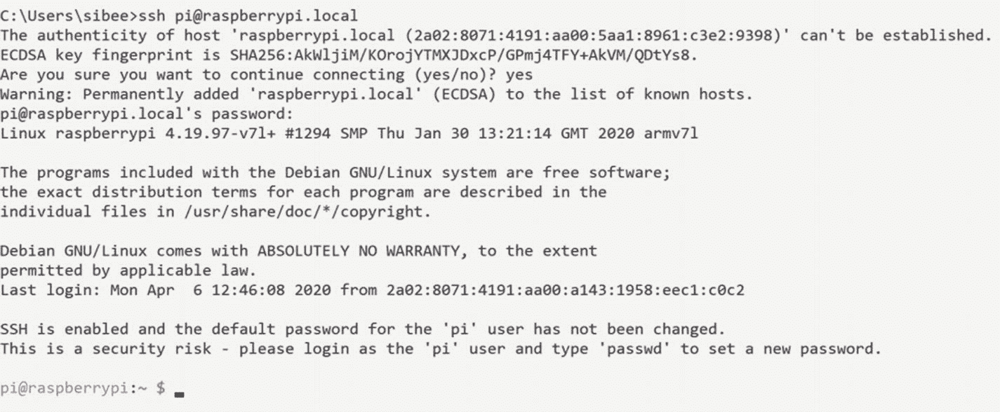
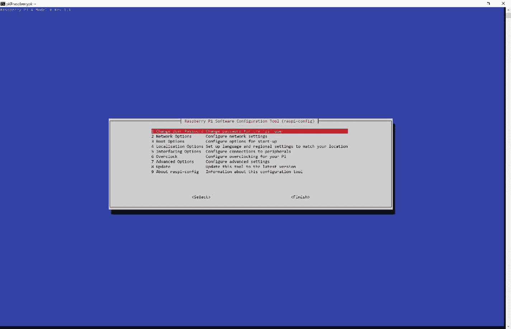
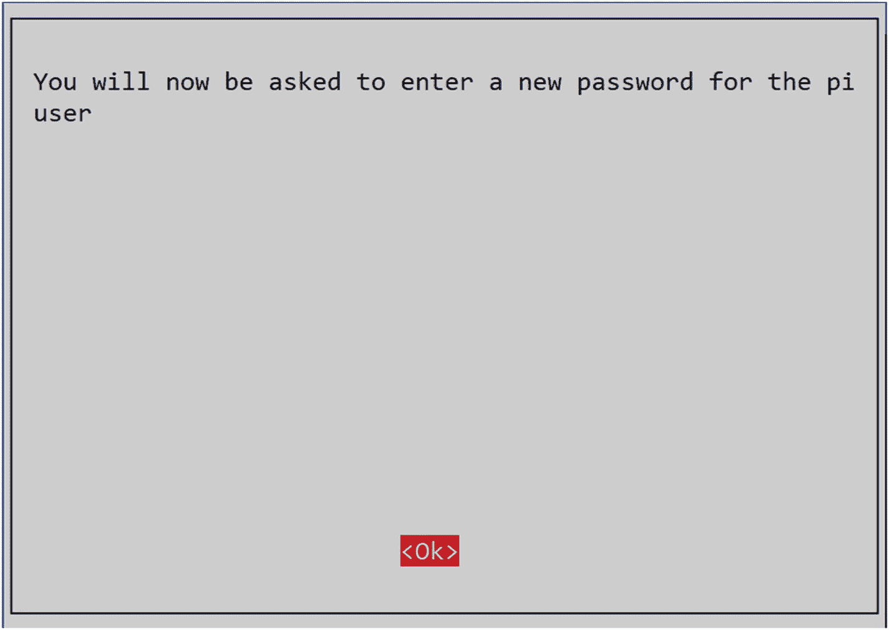
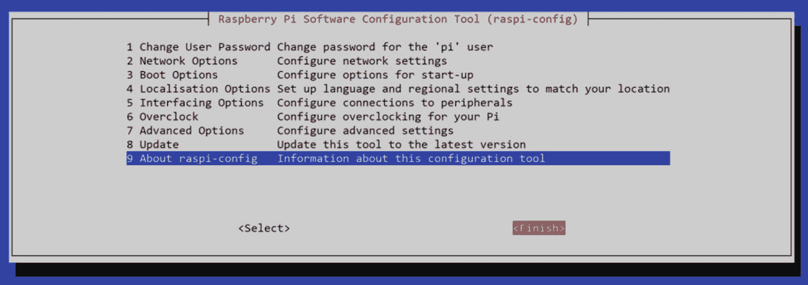

# 二、配置您的 Raspberry Pi

在本章中，您将学习如何为开发和部署设置您的 Raspberry Pi。准确地说，你将执行以下任务:

*   在 Raspberry Pi 上启用 SSH

*   将网络信息添加到 Pi，以便它可以连接到 Wi-Fi

*   将 Pi 连接到 Wi-Fi

*   通过 SSH 连接 Pi

虽然这些步骤听起来有点困难，但是如果你按照本章的说明去做，它们是很容易做到的。

## 启用 SSH

在开始学习如何启用 SSH 之前，最好先了解 SSH 是什么。关于 SSH 的要点如下:

*   SSH 代表安全外壳，是一种加密网络协议。

*   SSH 通过不安全的网络安全地使用网络服务。

*   执行的所有操作(如身份验证、命令、输出、文件传输等)都经过加密，以防止网络攻击。

以下是任何 SSH 连接中涉及的常见步骤。

1.  客户端尝试联系服务器并启动连接。在我们的例子中，我们在终端中执行这个任务。

2.  服务器发送公钥。

3.  接下来是谈判过程。一旦完成，安全通道将被打开。

4.  用户登录到服务器并执行他们想要执行的操作。

要手动连接和部署我们的应用到 Raspberry Pi 并允许远程登录，我们必须启用 SSH。如果我们不启用 SSH，就会得到错误`ssh: connect to host raspberrypi port 22: Connection refused`，如图 [2-1](#Fig1) 所示。



图 2-1

端口 22 连接被拒绝

要启用 SSH，请遵循以下步骤。



图 2-2

保存 SSH 文件

1.  运行记事本。

2.  单击文件➤另存为。

3.  请务必将“保存类型”选项设置为“所有文件”,以确保不将其保存为文本文件。默认情况下，记事本文件以. txt 扩展名保存。参见图 [2-2](#Fig2) 。

1.  将文件保存到 SD 卡的启动驱动器中。

2.  关闭文件。

如果您在 Mac 上运行，您可以在终端中直接运行此命令:

```cs
touch /Volumes/boot/ssh

```

## 启用 Wi-Fi 配置

在本节中，您将把 Raspberry Pi 连接到 Wi-Fi。有许多方法可以做到这一点；最简单的方法是遵循这些步骤。

1.  运行记事本。

2.  将以下代码粘贴到记事本文件中。不要忘记更改您的国家代码、网络名称和网络密码:

1.  单击文件➤另存为。

2.  请务必将“保存类型”选项设置为“所有文件”,以确保文件以给定的扩展名保存。默认情况下，记事本文件以. txt 扩展名保存。

3.  将文件命名为 wpa_supplicant.conf，并将其保存到 SD 卡的引导驱动器中。

4.  关闭文件。

```cs
        country=US
        ctrl_interface=DIR=/var/run/wpa_supplicant GROUP=netdev
        update_config=1
        network={
        ssid="NETWORK-NAME"
        psk="NETWORK-PASSWORD"
        }

```

如果您在 Mac 上运行，您可以使用这个命令来生成`wpa_supplicant.conf`文件:

```cs
touch /Volumes/boot/wpa_supplicant.conf

```

文件生成后，打开它并添加上面提到的代码。

## 检查 Pi 是否连接到 Wi-Fi

现在你已经做了足够的配置，所以你可以弹出 SD 卡并把它放回 Raspberry Pi。确保将电源线连接到 Pi，并等待一两分钟，以确保它连接到给定的网络。

要检查连接，您可以转到网络默认网关的 IP 地址。IP 地址通常是 192.168.1.1 或 192.168.0.1。只需在浏览器中键入 IP 地址，就会打开管理门户，您可以在其中设置 LAN、WAN、网络管理和其他选项。登录后，您可以看到所有连接到网络的设备。图 [2-3](#Fig3) 以我的路由器页面为例。



图 2-3

所有连接到 Wi-Fi 的设备

## 通过 SSH 连接树莓 Pi

现在设备已经配置好并连接到网络，您可以使用 SSH 连接 Pi。要做到这一点，你需要三样东西:

*   网络的主机名。

*   设备的用户名。

*   用户的密码。

默认情况下，树莓派的用户名是`Pi`，密码是`raspberry`，主机名是`raspberrypi.local`。打开任意命令工具，输入以下命令:

```cs
ssh pi@raspberrypi.local

```

您可能会看到以下警告:

```cs
"The authenticity of host 'raspberrypi.local (2a02:8071:4191:aa00:5aa1:8961:c3e2:9398)' can't be established.
ECDSA key fingerprint is SHA256:AkWljiM/KOrojYTMXJDxcP/GPmj4TFY+AkVM/QDtYs8.
Are you sure you want to continue connecting (yes/no)?"

```

您必须在此提供“是”。

在下一步中，将要求您键入用户 Pi 的密码。如果您提供正确的用户名和密码，并且连接成功，您将获得如图 [2-4](#Fig4) 所示的输出。



图 2-4

SSH 命令输出

既然您已经远程连接到设备，并且它在网络上，那么最好将用户密码更改为更安全的密码。通过在您创建的 SSH 会话中运行以下命令，您可以轻松地做到这一点:

```cs
sudo raspi-config

```

您将看到图 [2-5](#Fig5) 中的屏幕。



图 2-5

Raspberry Pi 配置窗口

现在选择更改密码选项。在下一个屏幕中选择确定，如图 [2-6](#Fig6) 所示。



图 2-6

更改密码警告窗口

您将被要求输入该用户的新密码。一旦你输入完毕，请按回车键。如果一切顺利，您应该会看到图 [2-7](#Fig7) 中的窗口。


图 2-7

密码更改成功窗口

一旦点击 OK 并按 Enter 键，将会加载下一个屏幕，如图 [2-8](#Fig8) 所示。单击“完成”按钮，然后按 Enter 键。



图 2-8

完成配置

## 摘要

在本章中，您学习了以下内容:

*   什么是 SSH 以及如何在 Raspberry Pi 设备上启用 SSH。

*   如何在树莓 Pi 设备上设置 Wi-Fi？

*   如何使用 SSH 远程连接一个 Raspberry Pi 设备？

*   如何更改 Pi 用户的默认密码？

我们有许多事情要做，还有一个应用要开发。让我们跳到下一章。