# 三、设置开发应用的先决条件

在前几章中，我们忙于设置树莓 Pi 设备。在这一章中，我们集中在设置我们的机器来创建一个定制的应用，这样我们就可以在我们的 Raspberry Pi 中部署和运行它。本章假设您已经设置了您的设备。如果你还没有，请阅读前两章。

我们将使用开发应用。NET Core，原因有几个:

*   它是一个开源的通用开发平台。

*   它可以用来为 Windows、macOS、Linux 和 ARM64 处理器创建应用。

*   它得到了社区的广泛支持和维护，因此有适用于云、物联网、机器学习等的框架。

*   它支持多种语言，如 C#、F#、C++和 Visual Basic .NET。

*   有好的文档可以帮助用户学习和使用它。

在这一章中，我假设你对这个话题有足够的了解。如果你不确定，可以看看 [`https://docs.microsoft.com/en-au/dotnet/core`](https://docs.microsoft.com/en-au/dotnet/core) 的一些文章。也可以在 [`https://github.com/dotnet/core`](https://github.com/dotnet/core) 尝试一些例子。您可以下载。净芯出自 [`https://dotnet.microsoft.com/download`](https://dotnet.microsoft.com/download) 。

值得一提的是，不支持 Pi 零和 Pi 1 模型。这是因为。NET Core JIT 依赖于`armv7`指令，它们在早期的 Pi 版本中是不可用的。

## 开发应用

为了开发应用，我们将使用 Visual Studio 代码。以下是我喜欢 Visual Studio 代码(VSCode)的一些原因:

*   它重量轻，功能强大。

*   它适用于 Windows、macOS 和 Linux。

*   它内置了对 JavaScript、TypeScript 和 Node.js 的支持。

*   它支持其他语言，这是由它的各种扩展提供的。

如果你对这些要点感兴趣，你可以在 [`https://code.visualstudio.com`](https://code.visualstudio.com/) 下载这个工具。

## 使用 WSL

首先，让我们讨论一下什么是 Linux 的 Windows 子系统(WSL)。WSL 的要点如下:

*   它允许开发者直接在 Windows 上运行 GNU/Linux 环境。

*   它包括许多命令行工具、实用程序和应用。

*   如果没有 WSL，您必须创建一个额外的 Linux VM 并在那里运行程序，这是一个很大的工作量。

### WSL 与 WSL2

WSL 的新版本是 WSL2。与 WSL 版本相比，它有很多优点。WSL2 具有更好的文件系统性能，并且使用最新的虚拟化技术。由于 WSL2 使用一个轻量级的实用 VM，它在启动时也使用较少的内存。

要安装 WSL2，您应该运行内部版本为 19041 或更高版本(2004 版)的 Windows 10。

您可以通过在命令窗口中运行`winver`命令来轻松确定您的 Windows 版本(按 Windows 键+R，然后键入`winver`)。你会看到一个类似于图 [3-1](#Fig1) 的屏幕。

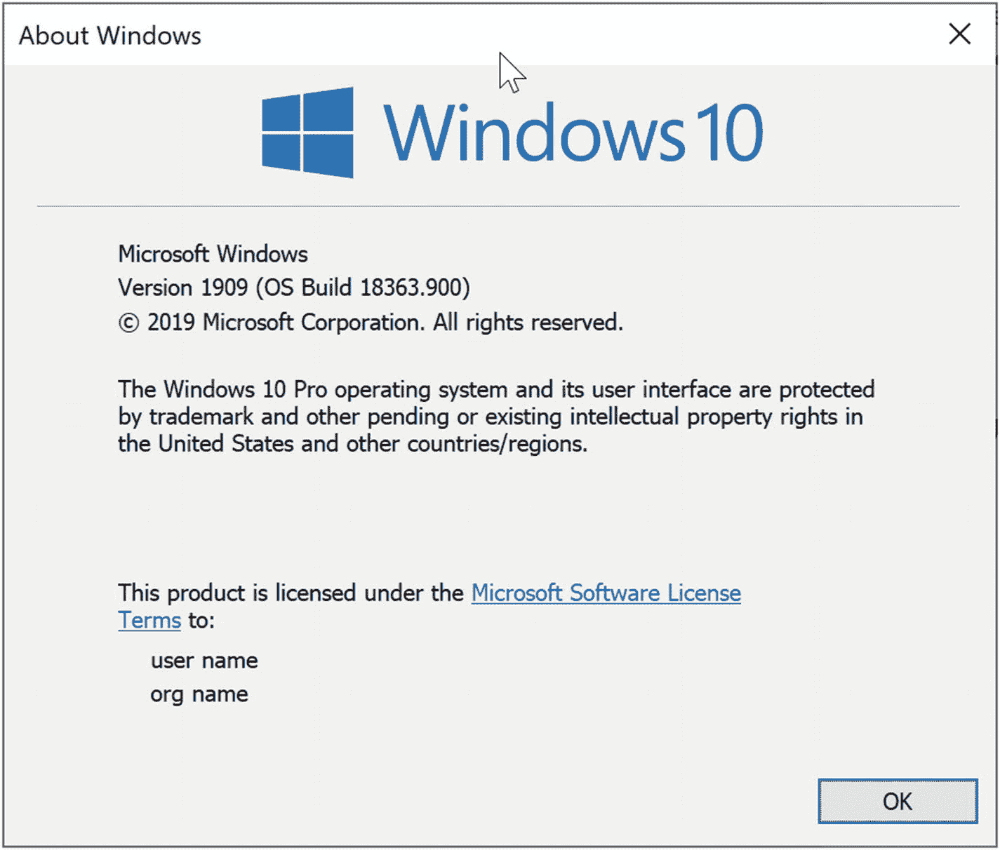

图 3-1

Windows 10 版本

如图 [3-1](#Fig1) 所示，我的 Windows 版本是 1909。我用的是 Surface Book 2，最新更新还不兼容(截至写这本书的时候)。

### 安装 WSL

在安装任何 Linux 发行版之前，必须启用名为 Windows Subsystem for Linux 的可选功能。为此，请以管理员身份在 PowerShell 中运行以下命令:

```cs
dism.exe /online /enable-feature /featurename:Microsoft-Windows-Subsystem-Linux /all /norestart

```

您应该会看到如图 [3-2](#Fig2) 所示的输出。

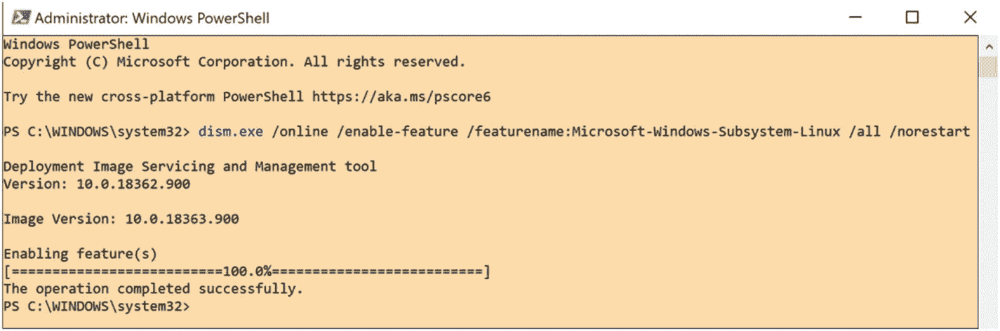

图 3-2

为 Linux 启用 Windows 子系统

如果您的系统满足安装 WSL2 所需的条件，您必须启用虚拟机平台功能。您可以通过运行以下 PowerShell 命令来实现这一点:

```cs
dism.exe /online /enable-feature /featurename:VirtualMachinePlatform /all /norestart

```

您还可以将 WSL2 设置为默认版本。当您安装一个新的 Linux 发行版时，这很方便。

```cs
wsl --set-default-version 2

```

在进行下一步之前，不要忘记重启机器。如果不重启，会出现图 [3-3](#Fig3) 所示的错误。

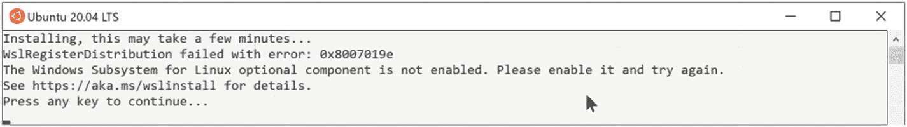

图 3-3

可选组件未启用

## 安装 Linux 发行版

我们将从微软商店安装 Linux 发行版。我推荐 Ubuntu 20.04 LTS，因为这是 Ubuntu 的最新版本。你既可以在浏览器中打开 [`https://aka.ms/wslstore`](https://aka.ms/wslstore) 网址，也可以搜索微软商店 app 然后搜索 Ubuntu(见图 [3-4](#Fig4) )。

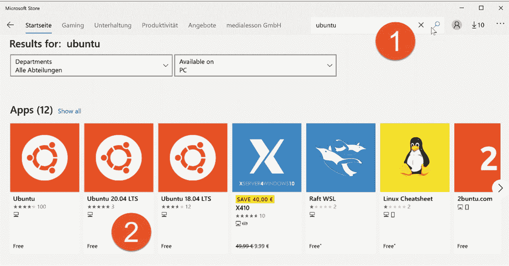

图 3-4

Microsoft 商店搜索结果

现在点击获取按钮，如图 [3-5](#Fig5) 所示。

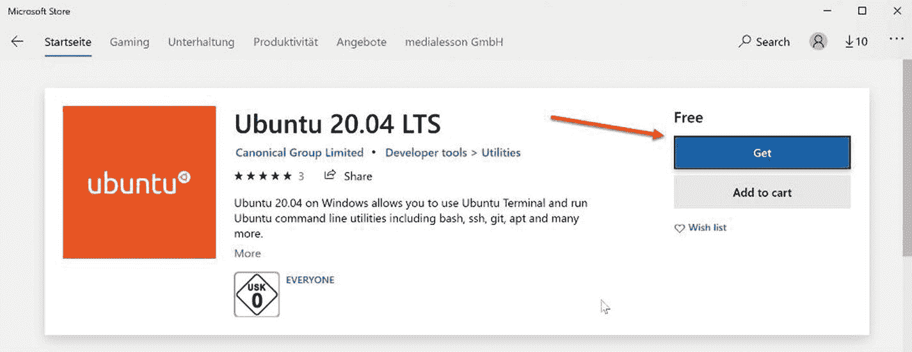

图 3-5

获取 Ubuntu

系统将开始下载 Ubuntu。该文件大约 500MB，因此下载可能需要几分钟时间，这取决于您的网络速度。安装完成后，您可以单击 Microsoft Store 中的启动按钮。

初始安装可能需要一些时间，命令屏幕会要求您输入建议的 UNIX 用户名。此用户名不需要与您的 Windows 用户名匹配。您可以在这里进行选择。

设置用户名后，您需要输入密码。当要求您重新输入密码时，请确保您输入了正确的密码。图 [3-6](#Fig6) 供您参考。

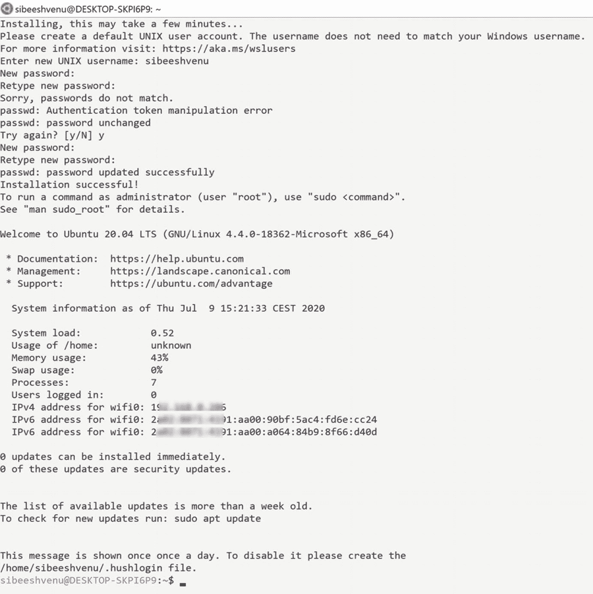

图 3-6

Ubuntu 安装屏幕

嘣，你已经成功地在 Windows 中为 Linux 设置了子系统！

## 设置与 Raspberry Pi 的连接

在本节中，您将执行以下任务:

*   创建新的 SSH 密钥。

*   将公钥复制到 Raspberry Pi。如果你不这样做，每次你将应用部署到 Raspberry Pi 时，系统都会要求你输入密码。

*   在 Raspberry Pi 上安装 Visual Studio 调试器，这是下一步需要的，因为您将部署您的应用。

本节假设你的树莓 Pi 被称为`raspberrypi.local`。您需要确保您可以通过 SSH 连接到 Raspberry Pi。如果您在 Linux 上，只需打开一个新的终端并键入以下命令。

```cs
ssh pi@raspberrypi.local

```

如果您使用的是 Windows，请在 Windows 搜索框中搜索关键字`wsl`，然后打开 WSL Run 命令来启动一个新的 Linux 终端命令提示符。打开提示符后，键入 **ssh pi@raspberrypi.local** 命令连接到您的 raspberrypi。

如果您使用的是 WSL1，将会收到以下错误:

```cs
ERROR: ssh: Could not resolve hostname raspberrypi.local: Name or service not known"

```

请注意，此问题已在 WSL2 中得到修复。要修复 WSL1 中的这个错误，您必须将主机名更改为 Raspberry Pi 的 IP 地址。要获取 IP 地址，运行`ping`命令，如图 [3-7](#Fig7) 所示。

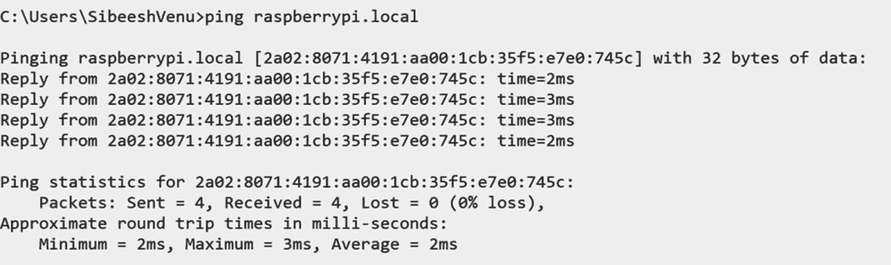

图 3-7

Ping raspberrypi.local

如您所见，`ping`命令显示了 IPV6 地址，但我们需要 IPV *4* 地址。为此，运行同样的命令，并在末尾加上`-4`。以下是该命令的外观:

```cs
ping raspberrypi.local -4

```

图 [3-8](#Fig8) 显示了结果。

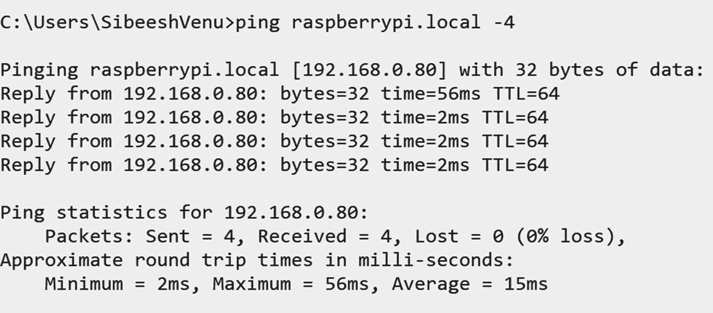

图 3-8

Ping raspberrypi.local IPV4

现在，将前面命令中的主机名改为 IP 地址。新命令应该如下所示:

```cs
ssh pi@192.168.0.80

```

接下来，更新 Raspberry Pi OS 并重启。

```cs
sudo apt update && sudo apt upgrade && sudo reboot

```

您应该会看到如图 [3-9](#Fig9) 所示的输出。

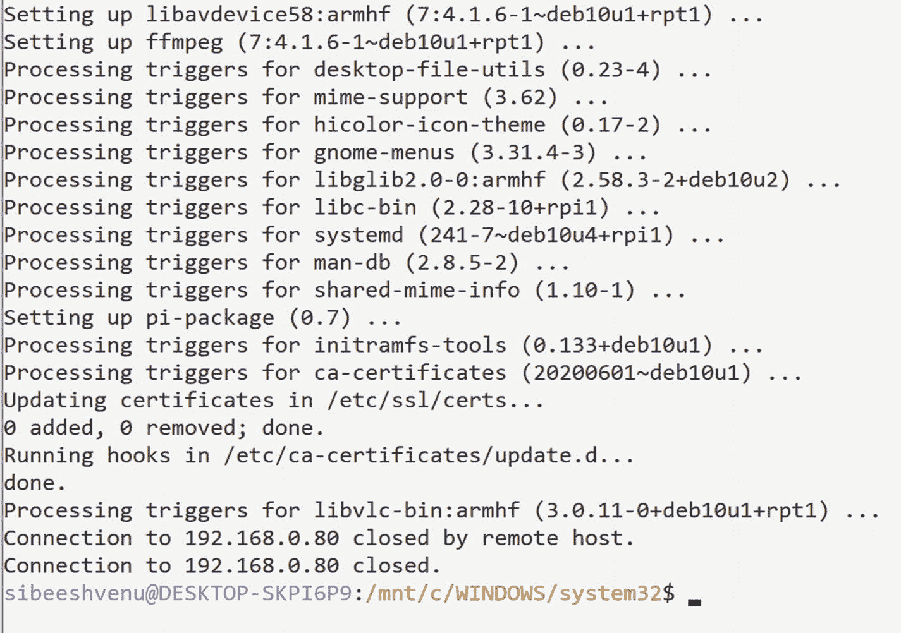

图 3-9

更新树莓 Pi 操作系统

我们现在需要生成一个新的 SSH 证书，并将公共证书复制到 Raspberry Pi。为此，我们将在同一个命令提示符下运行前面的命令。在运行该命令之前，首先确保您在当前用户的`home`目录中。默认情况下，命令提示符将在 Windows `System32`文件夹中打开。不建议您修改此文件夹。图 [3-10](#Fig10) 显示了我们运行`cd`命令的结果。

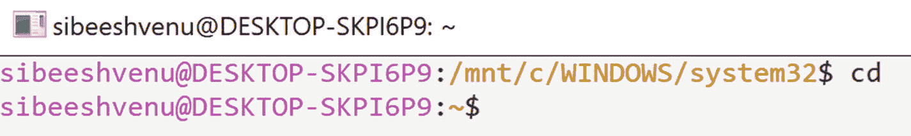

图 3-10

用户的主目录

现在您可以运行该命令:

```cs
ssh-keygen -t rsa && ssh-copy-id pi@192.168.0.80

```

您应该会看到图 [3-11](#Fig11) 中的输出。

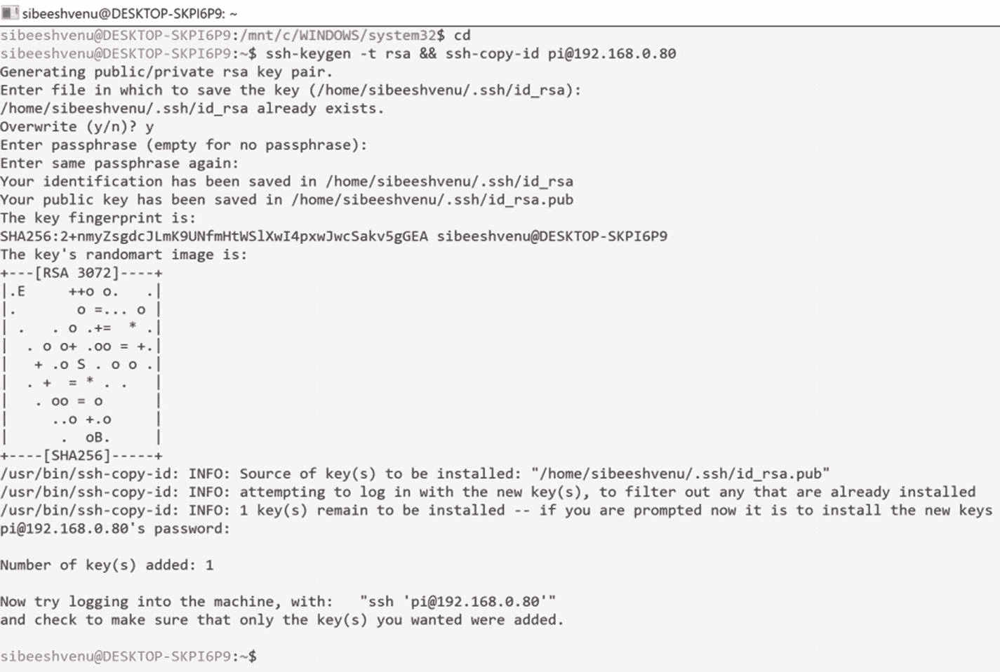

图 3-11

将 SSH 复制到 Raspberry Pi

安装 Visual Studio 代码。NET 调试器，您只需运行下面的命令。请记住，如果您运行的是 WSL2，您可以使用您的 Raspberry Pi 名称来代替 IP 地址。

```cs
ssh pi@192.168.0.80 "curl -sSL https://aka.ms/getvsdbgsh | bash /dev/stdin -r linux-arm -v latest -l ~/vsdbg"

```

您应该会看到图 [3-12](#Fig12) 中的输出。

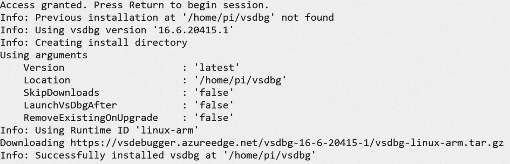

图 3-12

安装调试器

## 正在安装。Ubuntu 上的 NET Core

因为我们将创建一个. NET Core 应用，所以接下来我们需要安装 NET Core。去吧。NET Core 下载页面 [`https://dotnet.microsoft.com/download`](https://dotnet.microsoft.com/download) 并安装。NET Core SDK。如果你像我一样在 Windows 10 中运行 WSL，你需要在 Windows WSL Linux 发行版上安装 SDK。

首先，将 Microsoft 包签名密钥添加到可信密钥列表中，并添加包存储库。为此，请在 WSL 命令提示符下运行以下命令:

```cs
wget https://packages.microsoft.com/config/ubuntu/20.04/packages-microsoft-prod.deb -O packages-microsoft-prod.deb
sudo dpkg -i packages-microsoft-prod.deb

```

该命令将要求您键入用户密码。如果您忘记了密码，您可以打开一个新的命令窗口，并运行以下命令以 root 用户身份打开 WSL:

```cs
wsl --user root

```

现在，键入以下命令来更改用户密码。您将被要求键入新密码:

```cs
passwd sibeeshvenu

```

图 [3-13](#Fig13) 显示了该过程。

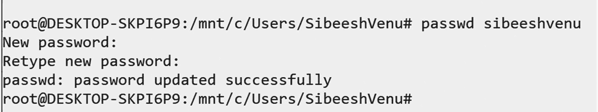

图 3-13

在 WSL 中更改用户密码

图 [3-14](#Fig14) 显示添加微软包签名密钥的输出。

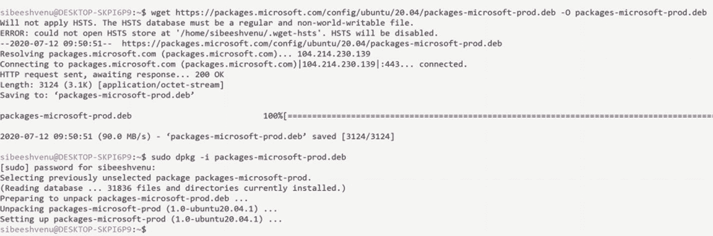

图 3-14

添加 Microsoft 包签名密钥

现在您可以安装。NET Core SDK，方法是运行以下命令。

```cs
sudo apt-get update; \
  sudo apt-get install -y apt-transport-https && \
  sudo apt-get update && \
  sudo apt-get install -y dotnet-sdk-3.1

```

如果您没有从终端得到任何错误，您就可以开始了。恭喜你！

## 摘要

在本章中，您学习了以下主题:

*   VSCode 是什么，为什么这么受欢迎。

*   什么是 WSL，为什么它很重要。

*   如何启用 WSL 以及 WSL1 和 WSL2 的区别。

*   如何在 Windows 10 上安装 Linux 发行版(Ubuntu)？

*   如何设置树莓 Pi 连接 Ubuntu？

*   如何安装。Ubuntu 上的 NET Core。

现在深呼吸，放松。你做得很好！这是喝杯咖啡休息一下的好时机。