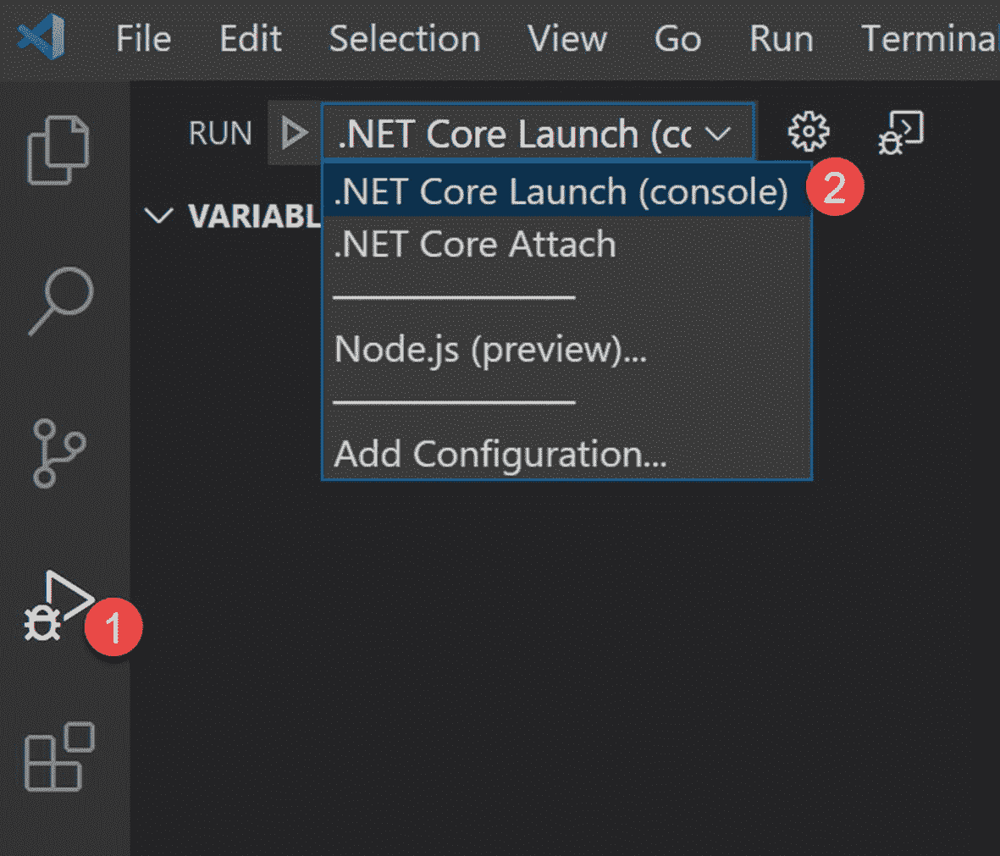

# 四、创建 .NET Core 应用并将其部署到 Raspberry Pi

在最后一章中，我们设置了我们的机器。在本章中，我们将创建一个. NET 核心应用，并将其部署到 Raspberry Pi。本章假设您遵循了第 [3](03.html) 章中提到的所有步骤。如果你不确定，请回顾那一章。

## 创建. NET 核心应用

只需运行两个命令，您就可以轻松地在 VSCode 中创建一个示例虚拟应用。稍后，我们将编辑该解决方案。听起来不错吧？如果是，打开一个新的终端并运行以下命令。

```cs
mkdir raspberrypi.net.core && cd raspberrypi.net.core

```

该命令将生成一个名为 [`raspberrypi.net`](http://raspberrypi.net) `.core`的新文件夹，并将当前工作目录更改为该新文件夹。这个`cd`命令也被称为`chdir`(改变目录)。

现在运行以下命令来生成一个新的解决方案。

```cs
dotnet new console --langVersion=latest && dotnet add package iot.device.bindings

```

如果一切顺利，它将执行以下操作:

*   创建一个空的控制台应用，因为我们在命令中提供了控制台模板。

*   执行一些创建后的动作，比如`dotnet restore`。

*   添加我们在命令中提供的包引用。这种情况下就是`iot.device.bindings`。这个`iot.device.bindings`包给了我们一组使用`system.device.gpio`与微控制器通信的设备绑定。

*   还原给定的包。

恢复完成后，所有需要的文件和引用都将在我们的解决方案中可用。样本输出如图 [4-1](#Fig1) 所示。


图 4-1

项目创建输出

让我们打开这个文件夹，看看生成了哪些文件；见图 [4-2](#Fig2) 。


图 4-2

创建的项目文件夹结构

你可以看到有一个文件夹叫做`obj`。这是存储临时目标文件和其他文件以创建最终库的地方。最终的库存储在名为`bin`的文件夹中，我们将在编译应用时解释这个文件夹。现在只需右键单击根文件夹，并在 Visual Studio 代码中打开它。如果您在右键菜单中没有看到“用代码打开”选项，那么解决这个问题最简单的方法就是重新安装 VSCode，并确保选中图 [4-3](#Fig3) 中所示的复选框。


图 4-3

应选择“用代码打开”选项

注意，您也可以从命令行工具本身运行`code .`。然后，Visual Studio 代码将在当前文件夹中打开该项目。

如果当你打开`Program.cs`文件时，你的 VSCode 显示一个弹出窗口说推荐使用 C# 扩展，那么继续安装它。见图 [4-4](#Fig4) 。


图 4-4

VSCode 的 C# 扩展

如果你想知道当你安装一个扩展时会发生什么，你可以在输出窗口中看到这个过程，如图 [4-5](#Fig5) 所示。


图 4-5

C# 扩展安装输出

现在是第一次运行应用的时候了。最简单的方法是按 F5 键；但是，您总是可以转到“运行”菜单，然后单击“开始调试”子菜单。如果它要求您选择环境，请选择。NET 核心。

在`.vscode`文件夹中会生成一个名为`launch.json`的文件。这是我们为应用设置调试选项的地方。您还可以看到在同一个文件夹中生成了另一个文件，名为`task.json`。该文件指定如何编译项目。我们将在下一节讨论这些文件。

如果一切顺利，您应该会在调试控制台中看到一条`"Hello World!"`消息。如果你不确定这个消息来自哪里，就看一下`Program.cs`文件。这是你的`Program.cs`文件的样子:

```cs
using System;

namespace raspberrypi.net.core
{
    class Program
    {
        static void Main(string[] args)
        {
            Console.WriteLine("Hello World!");
        }
    }
}

```

稍后您将重写这段代码。但是在这之前，您需要对 Visual Studio 代码进行一些更改。

## 正在安装 Visual Studio 代码远程 WSL 扩展

如果您曾经想知道如何从 VSCode 使用 Windows Subsystem for Linux (WSL)作为您的全职开发环境，Visual Studio Code Remote WSL extension 就是答案。它允许您使用基于 Linux 的环境，包括工具链和实用程序，并从 Windows 运行和调试基于 Linux 的应用。听起来不错吧？

如果在 VSCode 中打开项目时得到如图 [4-6](#Fig6) 所示的提示，请继续安装。


图 4-6

安装远程 WSL

也可以从 VSCode 中的扩展页面安装，如图 [4-7](#Fig7) 所示。


图 4-7

从扩展页面安装远程 WSL

安装完成后，重新打开 VSCode。如图 [4-8](#Fig8) 所示，如果提示“缺少所需资产”，选择“是”进行添加。


图 4-8

构建和调试所需的资产

项目应该已经在 VSCode 中打开，所以我们需要在 WSL 中打开它。为此，请按 F1 并开始在 WSL 中键入 Remote-WSL: Reopen。当您键入单词时，选项应该会出现，您可以选择它。如果项目没有在 VSCode 中打开，您可以通过键入并选择 Remote-WSL:New Window Using Distro 直接在 WSL 中打开它。参见图 [4-9](#Fig9) 。


图 4-9

在 WSL 中重新打开文件夹

这将在 WSL 中重新打开 VSCode，您应该会在您的 VSCode 中看到指示，如图 [4-10](#Fig10) 所示。


图 4-10

在 WSL Ubuntu 上编辑

## 重写应用

在本节中，我们重写了`Program.cs`文件来读取 Raspberry Pi 设备的 CPU 温度。这是您的文件的外观。

```cs
using System;
using Iot.Device.CpuTemperature;
using System.Threading;
namespace raspberrypi.net.core
{
    class Program
    {
        private static CpuTemperature rpiCpuTemp = new CpuTemperature();
        static void Main(string[] args)
        {
            while (true)
            {
                if (rpiCpuTemp.IsAvailable)
                {
                    Console.WriteLine($"The CPU temperature at { DateTime.Now } is { rpiCpuTemp.Temperature.Celsius }");
                }
                Thread.Sleep(1000)

;
            }
        }
    }
}

```

### 将应用部署到 Raspberry Pi

首先要做的是确保你的树莓派已经打开并连接到 Wi-Fi。我们将首先编辑`launch.json`文件。我们现在来谈谈那个文件。它包含名称、类型和请求等属性。这些是一个`launch.json`文件的强制属性。

#### 名称属性

该属性为您的配置提供了一个有意义的名称。在调试启动配置下拉菜单中找到，如图 [4-11](#Fig11) 所示。



图 4-11

启动 JSON 名称属性

#### 请求属性

目前(截至 2020 年 6 月)，`request`有两个支持值——`launch`和`attach`。解释`launch`和`attach`之间的区别的简单方法是将`launch`配置视为在 VSCode 附加到应用之前如何以调试模式启动应用的诀窍，而`attach`配置则是如何将 VSCode 的调试器连接到已经运行的进程的诀窍。

#### 类型属性

此属性设置用于此启动配置的调试器的类型。这要看环境。当您选择环境时，每个调试扩展都有不同的类型。例如，`node`类型用于内置节点调试器。

`launch.json`文件中的另一个重要属性是`preLaunchTask`。这将在调试会话开始之前启动任务。我们将在`task.json`文件中定义这个任务，并在这里使用这个任务名。

要将应用部署到 Raspberry Pi，我们必须为 Linux arm 编译这个应用，我们可以通过配置我们的 VSCode 来完成。我们使用`task.json`文件进行配置。一旦我们编译了应用，我们将使用 Rsync 把我们的程序复制到 Raspberry Pi。

#### Rsync 属性

有很多方法可以将文件从电脑传输到 Raspberry Pi。两种流行的方法是使用 SCP 和 Rsync。这两者之间有很大的不同。让我们来看看其中的一些:

*   SCP 代表安全复制协议。它通过执行简单的线性复制来读取源文件并写入目标。Rsync 也做同样的事情，但是使用了一个有效的算法和一些优化，使得传输更快。

*   Rsync 将检查文件大小和修改时间戳，以确保只复制更改或差异，而不仅仅是复制。这使得转移快了很多。同步源和目标上的文件也更容易。

*   如果传输被中断，Rsync 有一个恢复传输的选项，而 SCP 没有这个特性。

*   最后但同样重要的是，根据 2019 年维基百科上 OpenSSH 开发者的说法，SCP 协议已经过时，他们建议使用 Rsync 这样的现代协议。

请在 [`https://rsync.samba.org/`](https://rsync.samba.org/) 查看更多关于 Rsync 的信息。

让我们打开我们的`task.json`文件，用 Rsync 更新代码。该文件负责以下工作:

*   编译应用。

*   将代码复制到 Raspberry Pi(是的，我们使用 Rsync 来实现这个目的)。

现在您可以编辑`task.json`文件，如下所示。

```cs
{
    "version": "2.0.0",
    "tasks": [
        {
            "label": "RpiPublish",
            "command": "sh",
            "type": "shell",
            "problemMatcher": "$msCompile",
            "args": [
                "-c",
                "\"dotnet publish -r linux-arm -c Debug -o ./bin/linux-arm/publish ./${workspaceFolderBasename}.csproj && rsync -rvuz ./bin/linux-arm/publish/ pi@192.168.0.80:~/${workspaceFolderBasename}\"",
            ]
        }
    ]
}

```

这里，`RpiPublish`是我们的任务名，您可能已经注意到我们使用了`rsync -rvuz`命令。这会将文件从我们的计算机复制到树莓 Pi。

现在让我们使用`launch.json`文件中的这个任务。`launch.json`文件负责这些工作:

*   调用构建任务。

*   要求 Raspberry Pi 启动 Visual Studio 代码调试器。

*   加载应用。

最后，这就是你的`launch.json`文件的样子。

```cs
{
    "version": "0.2.0",
    "configurations": [
        {
            "name": "Rpi Publish and Debug",
            "type": "coreclr",
            "request": "launch",
            "preLaunchTask": "RpiPublish",
            "program": "~/${workspaceFolderBasename}/${workspaceFolderBasename}",
            "cwd": "~/${workspaceFolderBasename}",
            "stopAtEntry": false,
            "console": "internalConsole",
            "pipeTransport": {
                "pipeCwd": "${workspaceRoot}",
                "pipeProgram": "/usr/bin/ssh",
                "pipeArgs": [
                    "pi@192.168.0.80"
                ],
                "debuggerPath": "~/vsdbg/vsdbg"
            }
        }
    ]
}

```

注意，我在任何地方都使用了`pi@192.168.0.80`，因为我运行的是 WSL 版本 1。如果您运行的是 Linux 或者使用的是 WSL2，那么您应该将它改为`pi@raspberrypi.local`。

## VSCode 中的变量

你可以看到我们在`task.json`和`launch.json`文件中使用了`${workspaceRoot}`、`${workspaceFolder}`和`${workspaceFolderBasename}`变量。这些是 VSCode 的预定义变量。使用它们的语法是`${` `variablename` `}`。其他一些变量在表 [4-1](#Tab1) 中列出。

表 4-1

VSCode 变量

<colgroup><col class="tcol1 align-left"> <col class="tcol2 align-left"></colgroup> 
| 

变量名

 | 

描述

 |
| --- | --- |
| `${workspaceFolder}` | 在 VSCode 中打开的文件夹的路径 |
| `${workspaceFolderBasename}` | 在 VSCode 中打开的文件夹的名称，不带任何斜杠(`/`) |
| `${file}` | 当前打开的文件 |
| `${relativeFile}` | 当前打开的文件相对于`workspaceFolder` |
| `${relativeFileDirname}` | 当前打开的文件的`dirname`相对于`workspaceFolder` |
| `${fileBasename}` | 当前打开的文件的基本名称 |
| `${fileBasenameNoExtension}` | 当前打开的没有文件扩展名的文件的基本名称 |
| `${fileDirname}` | 当前打开的文件的`dirname` |
| `${fileExtname}` | 当前打开的文件的扩展名 |
| `${cwd}` | 启动时任务运行程序的当前工作目录 |
| `${lineNumber}` | 活动文件中当前选定的行号 |
| `${selectedText}` | 活动文件中当前选定的文本 |
| `${execPath}` | 正在运行的 VSCode 可执行文件的路径 |
| `${defaultBuildTask}` | 默认生成任务的名称 |

您还可以创建一个新任务来查看每个变量的值。因此，让我们在`task.json`文件中创建一个新任务。

```cs
{
            "label": "Echo VSCode Variables",
            "type": "shell",
            "command": "echo ${workspaceRoot} | echo   ${workspaceFolder} |echo ${workspaceFolderBasename}"
}

```

现在按 F1 键并输入 Tasks: Run Task。选择 Echo VSCode 变量和继续而不扫描输出选项。变量值将出现在终端中，如图 [4-12](#Fig12) 所示。


图 4-12

显示 VSCode 变量

## 从 Raspberry Pi 调试应用

请记住，您也应该在 WSL 中安装`ms-dotnettools.charp`扩展。见图 [4-13](#Fig13) 。


图 4-13

安装 ms-dotnettools 扩展

现在是运行应用并将其部署到 Raspberry Pi 的时候了。点击 Run 并在`Program.cs`中的任意一行添加一个断点。选择 Rpi 发布和调试配置，然后单击配置左侧的绿色图标。见图 [4-14](#Fig14) 。


图 4-14

如何调试

一旦你点击绿色图标，你会看到很多事情发生在终端。图 [4-15](#Fig15) 和 [4-16](#Fig16) 显示了调试会话的输出。


图 4-16

调试窗口控制台


图 4-15

调试窗口

## 摘要

哇，太棒了，对吧？在本章中，您学习了以下内容:

*   如何创建一个. NET 核心应用？

*   如何安装带有 WSL 扩展的 Visual Studio Code Remote？

*   如何读取树莓派设备的 CPU 温度？

*   如何将应用部署到 Raspberry Pi？

*   Rsync 是什么？

*   VSCode 中的变量。

*   如何在 VSCode 中调试运行在 Raspberry Pi 设备中的应用？

你对下一章感到兴奋吗？我迫不及待地想在那里见到你。