# 五、对我们的应用使用 Azure 物联网中心

在上一章中，您学习了如何读取您的 Raspberry Pi 设备的 CPU 温度并将数据写入控制台。计划是将这些数据发送到 Azure 物联网中心，因为这样做有很多好处。在本章中，您将创建一个 Azure 物联网中心，并让您的应用向其发送温度数据。

## 使用 Azure 物联网中心

Azure IoT Hub 是一项 Azure 服务，它可以帮助您将遥测数据(例如，我们从 Raspberry Pi 读取的 CPU 温度)从您的物联网设备摄取到云中进行存储和处理。它充当物联网应用和受管设备之间双向通信(从设备到云以及从云到设备)的中心枢纽。

一旦数据在云中，我们可以用它做很多事情。我们将在接下来的章节中讨论这些用途。在创建 Azure 资源之前，您应该有一个有效的 Azure 订阅。如果您没有订阅，不用担心，您可以免费创建一个。你所要做的就是进入 [`https://azure.microsoft.com/en-us/free/`](https://azure.microsoft.com/en-us/free/) ，点击开始免费按钮。您必须使用您的 Microsoft 帐户登录，或者注册一个新帐户。

### 创建 Azure 物联网中心

创建 Azure 物联网中心就像喝一杯水一样简单。哈哈，我是认真的。有两种方法可以创建它。

*   使用 Azure 云壳。

*   使用 Azure 门户。

我们将讨论这两个选项，以便您可以选择对您更方便的选项。

#### 使用 Azure 云外壳

要使用云外壳创建 Azure 服务，您必须登录您的 Azure 门户( [`https://portal.azure.com/`](https://portal.azure.com/) )并转到 [`https://shell.azure.com/`](https://shell.azure.com/) )。如果您的 Azure 门户中有多个目录，您将被要求选择一个目录。见图 [5-1](#Fig1) 。

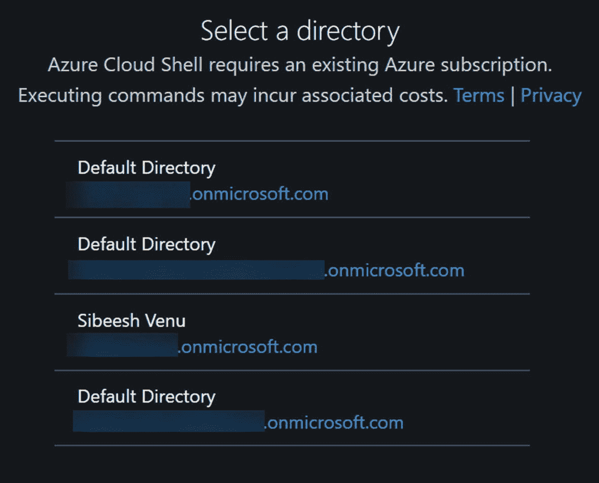

图 5-1

在 shell 中选择一个目录

单击目录将启动该过程。如果您收到消息说`"No storage account mounted"`，您将必须创建一个存储帐户。如果您想知道为什么需要一个存储帐户，它是用来保存这个 shell 的文件的。请注意，创建一个存储帐户每月会产生少量费用。在 [`https://azure.microsoft.com/en-us/pricing/details/storage/files/`](https://azure.microsoft.com/en-us/pricing/details/storage/files/) 随时可以看到定价详情。

默认订阅将在屏幕上被选中，但您也可以对此进行更改。单击“Show Advanced Settings”链接，在这里您可以设置正确的资源组、存储等。见图 [5-2](#Fig2) 。您可以使用现有资源或创建新资源。资源组只是共享相同生命周期、权限和策略的资源的集合。

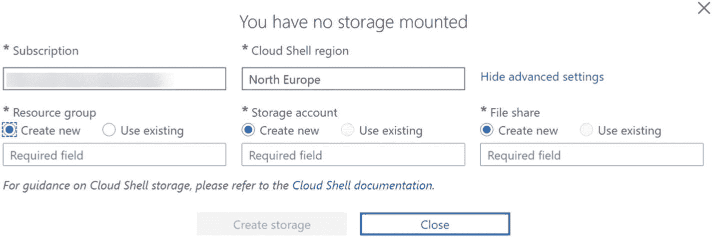

图 5-2

云外壳高级设置

填写完详细信息后，单击“创建存储”按钮。这将为你启动一个新的云壳，如图 [5-3](#Fig3) 所示。

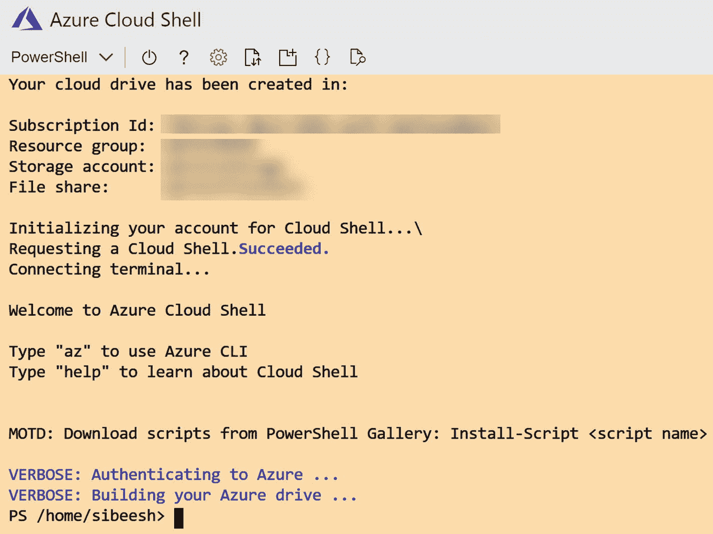

图 5-3

Azure 云壳首次登录

现在是时候运行命令来创建一个物联网中心了。将以下命令粘贴到 shell 中，并按 Enter 键。(记得将资源组名称更改为您在上一节中选择的名称。)

```cs
az iot hub create --name apressiothub --resource-group apressbook --sku S1

```

该命令将运行几分钟，shell 中将出现一个 JSON，其中包含您的物联网的所有详细信息。您也可以使用以下命令删除物联网集线器。

```cs
az iot hub delete --name apressiothub --resource-group apressbook

```

#### 使用 Azure 门户

登录 Azure Portal( [`https://portal.azure.com/`](https://portal.azure.com/) )，从主页点击+创建资源按钮。现在，在提供的搜索框中搜索关键字 IoT Hub。点击下一页的创建按钮(参见图 [5-4](#Fig4) )。

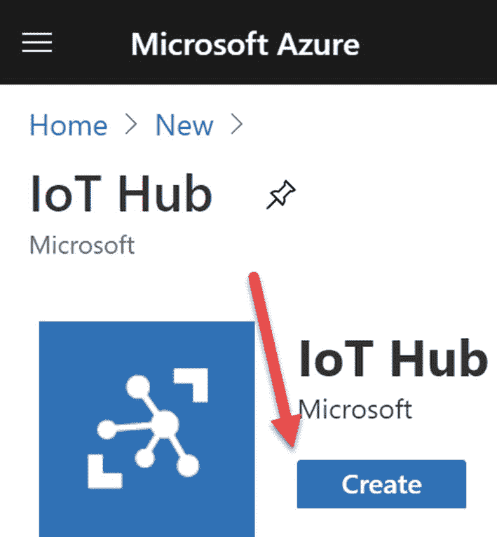

图 5-4

创建物联网中枢

这将重定向到您可以创建物联网中心的页面。第一步，将要求您选择您拥有的套餐。您可以在这里创建新的资源组，也可以选择现有的资源组。接下来，选择地区，并为您的物联网中心提供一个有效的名称。(请记住，您应该选择离您最近的地区。)嘣，你做到了！请参见图 [5-5](#Fig5) 以供参考。

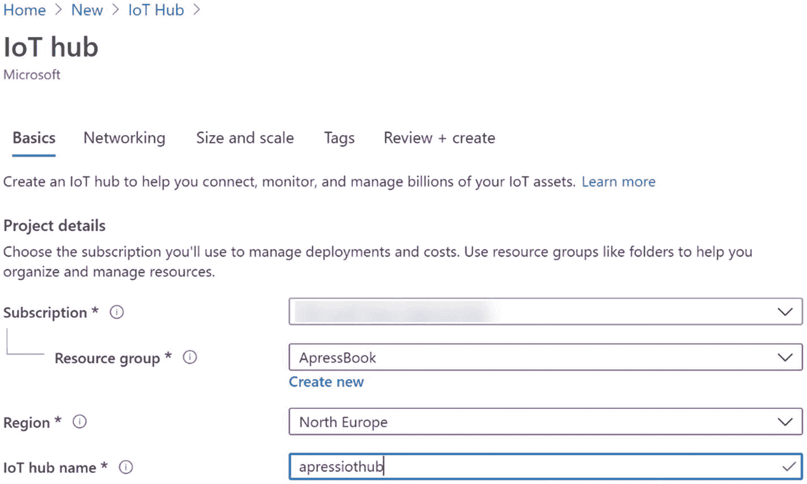

图 5-5

创建物联网中心，步骤 1

您可以单击“审阅+创建”按钮进入最后一步，或者单击“下一步”按钮。如果您单击“下一步”按钮，您将看到一个选项，用于选择您的物联网集线器应如何连接，是使用公共端点还是私有端点。参见图 [5-6](#Fig6) 。

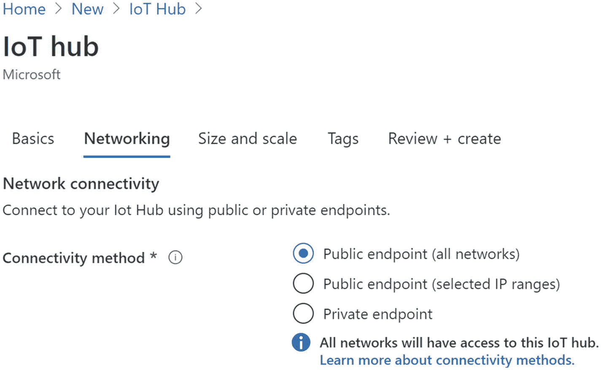

图 5-6

创建物联网中心，第二步联网

在下一步中，您将学习如何调整物联网中枢的大小和规模(参见图 [5-7](#Fig7) )。您应该确保选择正确的定价和规模级别。它们之间有一些显著的差异。例如，标准层支持所有功能，包括双向通信功能，而基本层仅提供功能的子集，不包括双向通信。同样值得一提的是，有了免费层，您每天只能发送 8，000 条消息，并且可以连接 500 台设备。每个 Azure 订阅只能在免费层创建一个物联网中枢。表 [5-1](#Tab1) 显示了支持的功能。

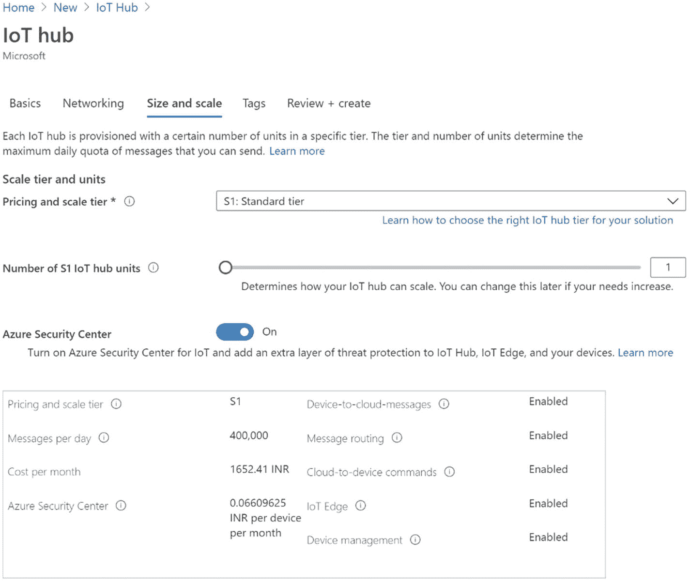

图 5-7

创建物联网枢纽，步骤 3 规模和规模

表 5-1

物联网枢纽层功能

<colgroup><col class="tcol1 align-left"> <col class="tcol2 align-left"> <col class="tcol3 align-left"></colgroup> 
| 

能力

 | 

基本层

 | 

免费/标准层

 |
| --- | --- | --- |
| 设备到云的遥测 | 是 | 是 |
| 每个设备的身份 | 是 | 是 |
| 消息路由、消息丰富和事件网格集成 | 是 | 是 |
| HTTP、AMQP 和 MQTT 协议 | 是 | 是 |
| 设备供应服务 | 是 | 是 |
| 监控和诊断 | 是 | 是 |
| 云到设备的消息传递 |   | 是 |
| 设备双胞胎、模块双胞胎和设备管理 |   | 是 |
| 设备流(预览) |   | 是 |
| 蔚蓝物联网边缘 |   | 是 |
| 物联网即插即用预览 |   | 是 |

物联网中心单元是每天每个单元允许的消息数量。这取决于定价层的选择。使用一个 S1 物联网中心单元，每天可以发送 40 万条消息。如果你想发送更多，你可以添加一个 S1 物联网中心单元，这将为你提供另外 40 万条消息。请记住，价格也会随着您选择的单位而增加。如果您选择自由层，此选项将不会启用。

Azure 安全中心是一个额外的威胁保护和安全层。这在空闲层上不可用。

高级设置下的设备到云分区将设备到云消息与消息的同时读者数量相关联。

一旦你选择了你想要的选项，点击下一步按钮，这会给你一个添加标签的选项，如图 [5-8](#Fig8) 所示。

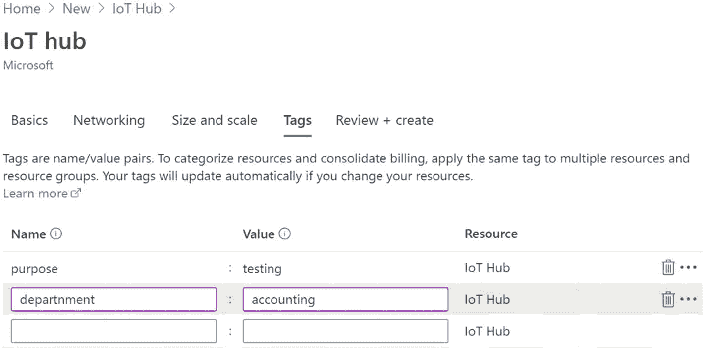

图 5-8

创建物联网中心，步骤 4 标签

标签是对资源和资源组进行分类并在计费中合并的名称/值对。您可以将相同的标记应用于多个资源和资源组。单击“下一步”按钮将显示一个屏幕，显示您选择的值。参见图 [5-9](#Fig9) 。

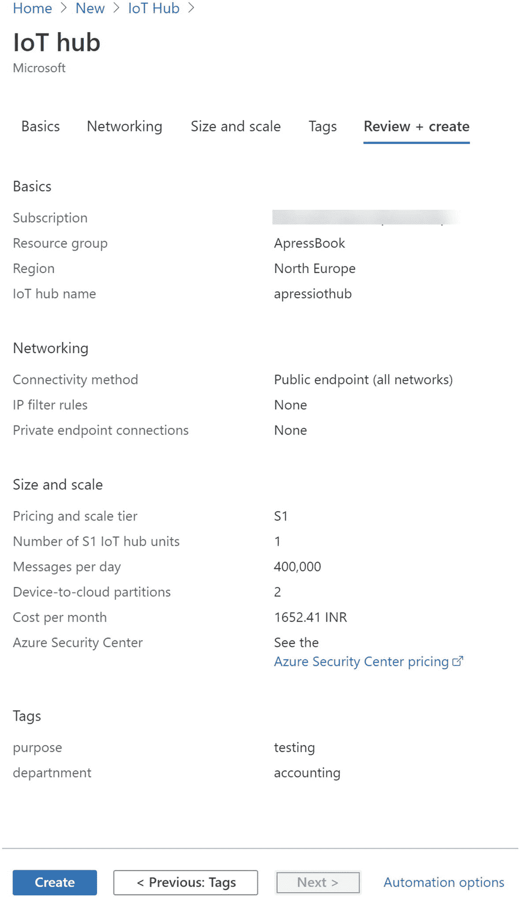

图 5-9

创建物联网中心，步骤 5 回顾和创建

现在单击创建按钮，这将初始化您的物联网中心。过一会儿，你的资源将准备好行动。

### 在物联网中心注册设备

设备必须先在物联网中心注册，然后才能连接。要创建设备，请转到您的物联网中心，然后转到物联网设备部分，如图 [5-10](#Fig10) 所示。

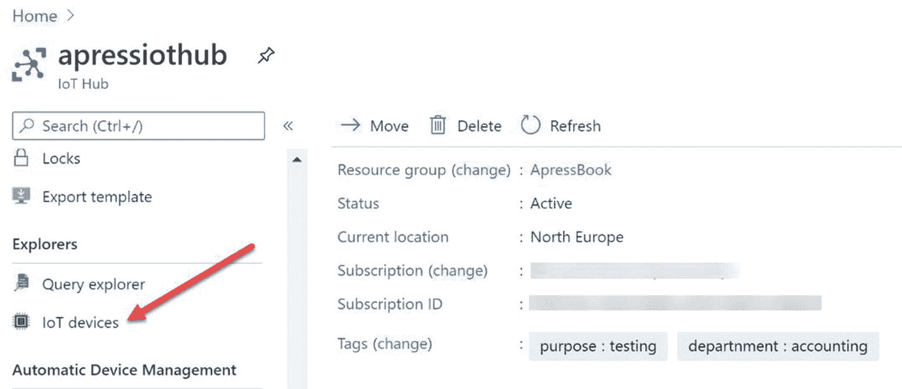

图 5-10

物联网设备菜单

现在单击顶部的+New 按钮，这将打开一个新页面，您可以在其中注册设备。见图 [5-11](#Fig11)

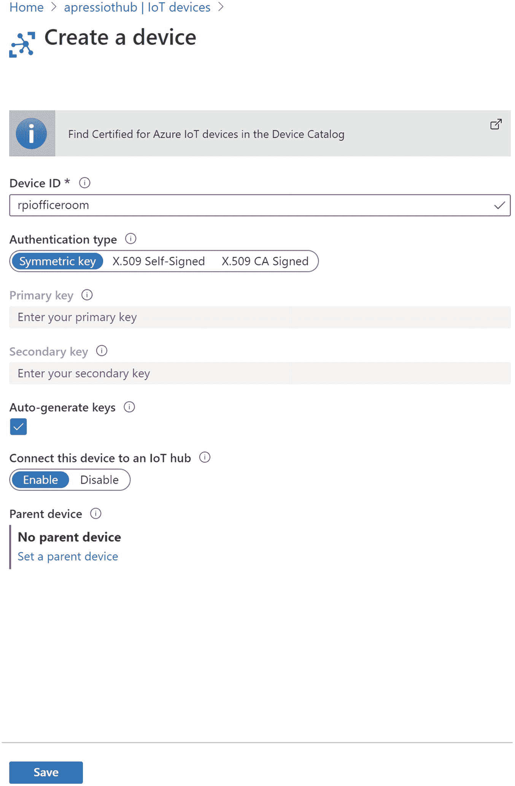

图 5-11

创建一个设备

这里，设备 ID 是您的设备的名称。它用于设备认证和访问控制。单击保存按钮将创建一个设备，页面将重定向到设备列表。

## 将 Raspberry Pi 连接到 Azure 物联网中心

要将您的 Raspberry Pi 连接到 Azure IoT Hub，您必须将名为`Microsoft.Azure.Devices.Client`的包添加到解决方案中。您可以通过运行以下命令来添加它。

```cs
dotnet add package Microsoft.Azure.Devices.Client

```

如果您现在检查您的`.csproj`文件，您应该看到包引用条目被添加到那里。

```cs
<PackageReference Include="Microsoft.Azure.Devices.Client" Version="1.27.0" />

```

如果没有链接到运行前面的命令，也可以在这里添加一个条目。它是双向的。

现在让我们为遥测数据创建一个模型类。我们将把这个类称为`DeviceData`，但是您可以随意给它取任何名称。我们现在在那个类中有三个属性。在您的应用中安装`Newtonsoft.Json`包，以便您可以轻松地序列化和反序列化您的数据。运行以下命令:

```cs
dotnet add package Newtonsoft.Json

```

这里是你的`DeveiceData`模型类应该如何看待这一点。

```cs
using Newtonsoft.Json;
namespace raspberrypi.net.core.Models
{
    public class DeviceData
    {
        [JsonProperty(PropertyName="temperature")]
        public double Temperature { get; set; } = 0;
        [JsonProperty(PropertyName="messageid")]
        public int MessageId { get; set; } = 0;
        [JsonProperty(PropertyName="deviceid")]
        public string DeviceId {get;set;} = Program.DeviceId;
    }
}

```

现在让我们重写程序，如下所示。

```cs
using System;
using System.Text;
using Iot.Device.CpuTemperature;
using System.Threading;
using System.Threading.Tasks;
using Microsoft.Azure.Devices.Client

;
using Newtonsoft.Json;
using raspberrypi.net.core.Models;

namespace raspberrypi.net.core
{
    class Program
    {
        private static CpuTemperature _rpiCpuTemp = new CpuTemperature();
        private const string _deviceConnectionString = "";
        private static int _messageId = 0;
        private static DeviceClient _deviceClient = DeviceClient.CreateFromConnectionString(_deviceConnectionString, TransportType.Mqtt);
        public const string DeviceId = "";

        static async Task Main(string[] args)
        {
            while (true)

            {
                if (_rpiCpuTemp.IsAvailable)
                {
                    await SendToIoTHub(_rpiCpuTemp.Temperature.Celsius);
                    Console.WriteLine("The device data has been sent");
                }
                Thread.Sleep(5000); // Sleep for 5 seconds
            }
        }

        private static async Task SendToIoTHub(double celsius)
        {
            string jsonData = JsonConvert.SerializeObject(new DeviceData()
            {
                MessageId = _messageId++,
                Temperature = celsius
            });
            var messageToSend = new Message(Encoding.UTF8.GetBytes(jsonData));
            await _deviceClient.SendEventAsync(messageToSend).ConfigureAwait(false);
        }
    }
}

```

`SentToIoTHub`方法负责通过使用`DeviceClient`中的`SendEventAsync`函数将`Message`数据发送到 Azure IoT Hub。注意这个`DeviceClient`是`Microsoft.Azure.Devices.Client`名称空间的一部分，所以一定要把它添加到`using`语句中。

现在我们只需要从 IoT Hub 更新连接字符串和设备 ID。转到您的物联网中心资源，然后单击资源管理器部分下的物联网设备菜单。您将看到您的设备列在页面上，如图 [5-12](#Fig12) 所示。

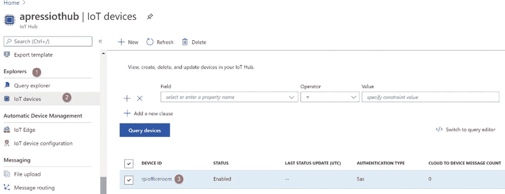

图 5-12

物联网设备列表

点击设备名称，查看该设备的所有信息页面，如图 [5-13](#Fig13) 所示。

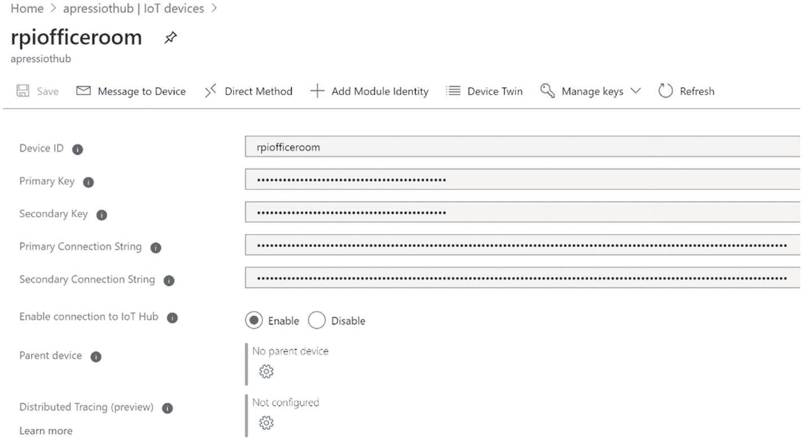

图 5-13

物联网设备属性

从这些属性中，您需要主连接字符串和设备 ID。您的连接字符串将如下所示:

```cs
HostName={YourIoTHubName}.azure-devices.net;DeviceId={YourDeviceId};SharedAccessKey={YourSharedAccessKey}

```

既然您已经用连接字符串和设备 ID 更新了程序，那么您所要做的就是运行构建任务。你还记得怎么做吗？只需按 F5 并确保您选择了 Rpi 发布和调试任务。

新程序将被重新部署到 Raspberry Pi，将附加调试器，并将运行应用。如果您仍然有调试器，它会遇到任何问题，您可以看到值。如果没有附加调试器，只需双击任一行的左侧，参见图 [5-14](#Fig14) 。

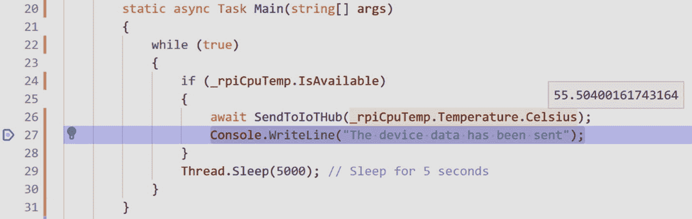

图 5-14

向物联网中枢调试屏幕发送数据

## 监控设备数据和物联网中心

为了监控数据通信，微软推出了一个名为 Azure IoT Tools 的惊人扩展。使用这个扩展，您可以做很多事情。首先，让我们安装它。参见图 [5-15](#Fig15) 。

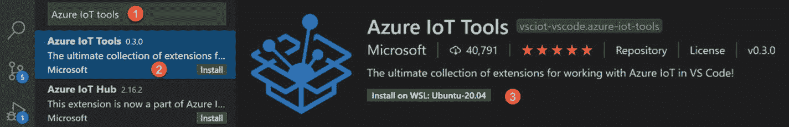

图 5-15

安装 Azure 物联网工具

一旦安装了扩展，就必须重新启动 VSCode 来加载它。完成后，您应该会看到类似图 [5-16](#Fig16) 的页面打开。

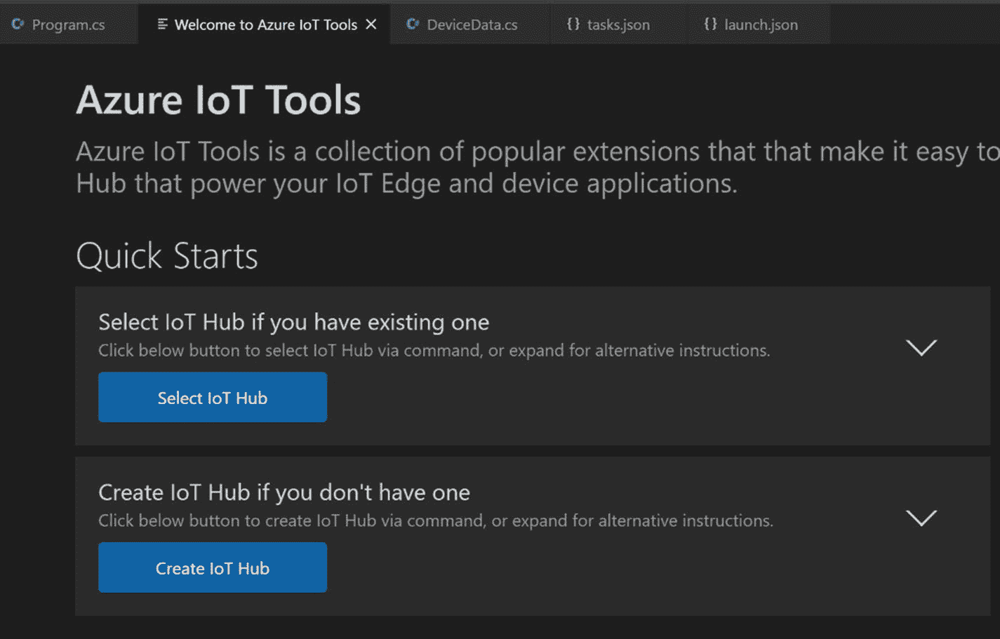

图 5-16

Azure 物联网工具首页

点击选择物联网中心按钮，并使用您的帐户登录。您将看到列出了您的所有订阅。现在选择创建物联网中心的 Azure 订阅，然后选择物联网中心。就这么简单。现在，您应该会在工具中看到您的物联网集线器设备。参见图 [5-17](#Fig17) 。

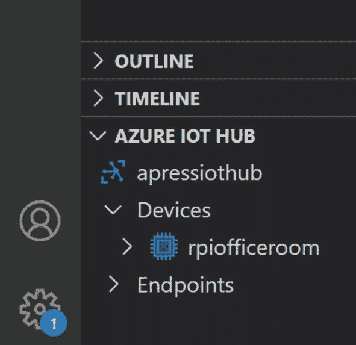

图 5-17

物联网集线器设备列表

也可以从 Azure 物联网中枢菜单中选择物联网中枢，如图 [5-18](#Fig18) 所示。

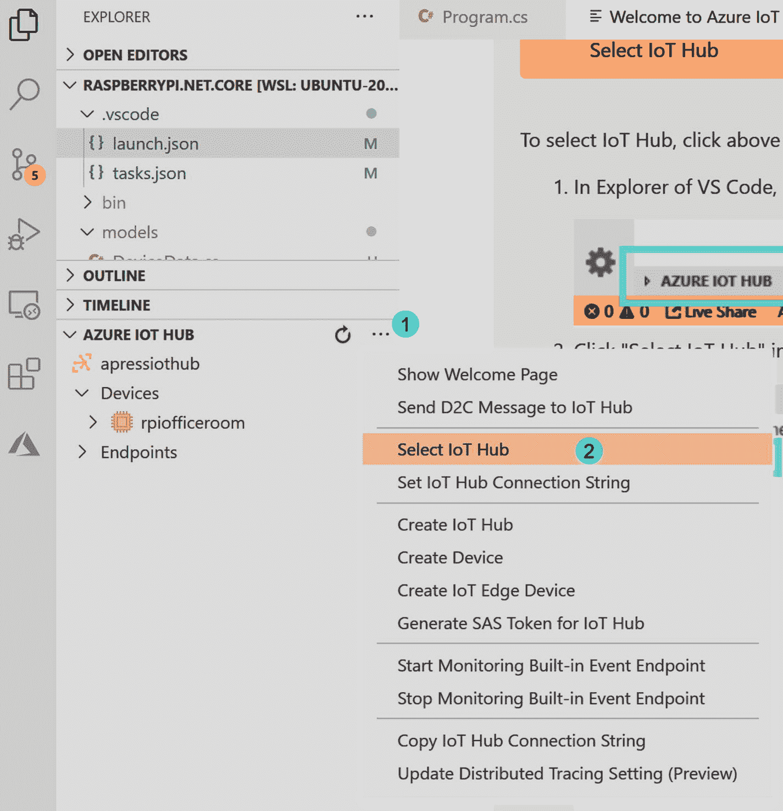

图 5-18

选择物联网中心

您可以使用该工具轻松地与设备进行交互。这里给出了一些选项:

*   向物联网中心发送 D2C 消息

*   向设备发送 C2D 信息

*   开始监控

现在，我们可以开始监控我们的设备。你怎么想呢?为此，您只需右键单击设备名称并选择开始监控内置事件端点菜单项(参见图 [5-19](#Fig19) )。

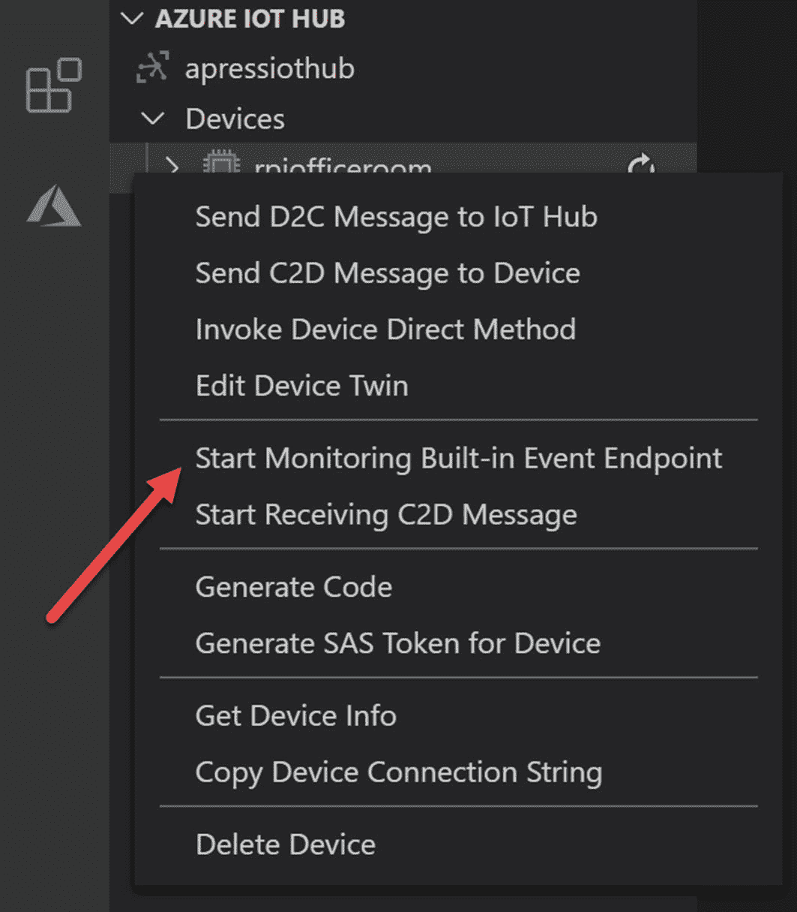

图 5-19

Azure 物联网中心工具选项

您应该在输出窗口中看到通信，如图 [5-20](#Fig20) 所示。

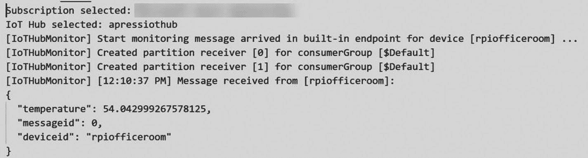

图 5-20

物联网集线器设备监控

## 添加自定义事件消息属性

您还可以在向 Azure IoT Hub 发送数据时添加自定义事件消息属性。让我们看看你是怎么做的。按如下方式更新您的`SendToIoTHub`功能:

```cs
private static async Task SendToIoTHub(double tempCelsius)
        {
            string jsonData = JsonConvert.SerializeObject(new DeviceData()
            {
                MessageId = _messageId++,
                Temperature = tempCelsius
            });
            var messageToSend = new Message(Encoding.UTF8.GetBytes(jsonData));
            messageToSend.Properties.Add("TemperatureAlert", (tempCelsius > _temperatureThreshold) ? "true" : "false");
            await _deviceClient.SendEventAsync(messageToSend).ConfigureAwait(false);
        }

```

确保添加一个名为`_temperatureThreshold`的新变量。

```cs
private const double _temperatureThreshold = 40;

```

现在按 F5 查看输出。您应该会看到 JSON 数据，如图 [5-21](#Fig21) 所示。

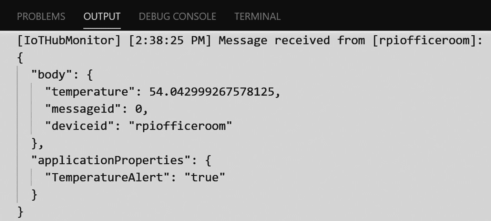

图 5-21

温度警报

哇，是不是很酷？。我希望你喜欢玩物联网中心。在后面的章节中，我们需要做很多事情。

## 摘要

在本章中，我希望你已经学会了以下几点:

*   Azure IoT Hub 是什么？

*   如何使用 Azure 云壳创建 Azure IoT Hub？

*   如何使用 Azure Portal 创建 Azure IoT Hub？

*   如何从连接 Azure IoT Hub。NET 核心应用？

*   如何使用 Azure 的物联网工具监控 Azure 物联网 Hub 通信？

还是继续玩物联网 Hub 吧。下一章见。