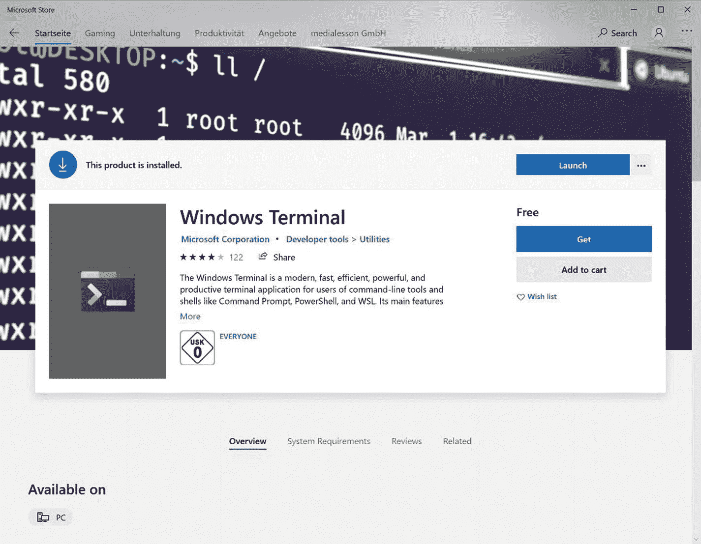
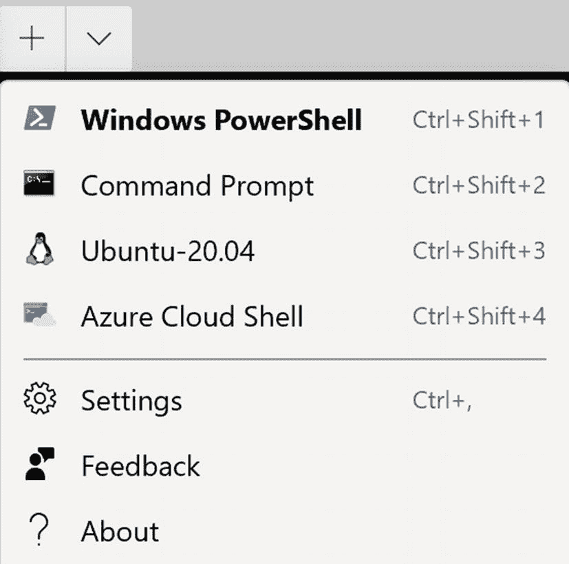
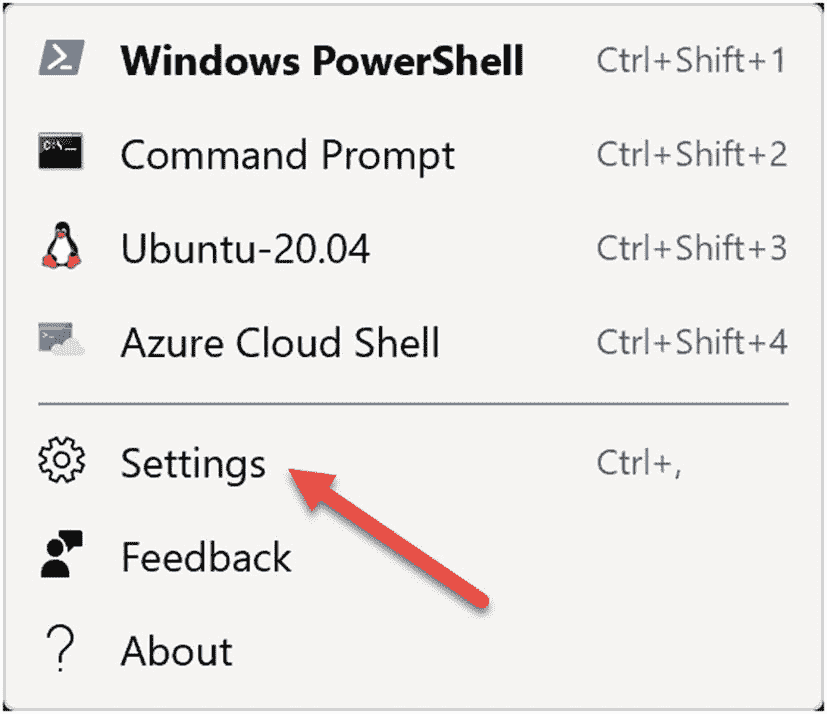
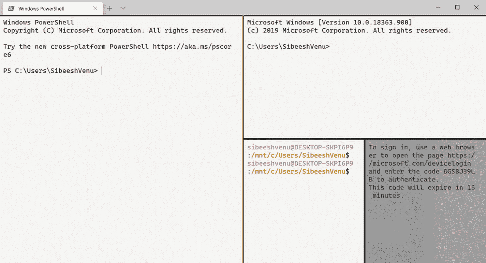
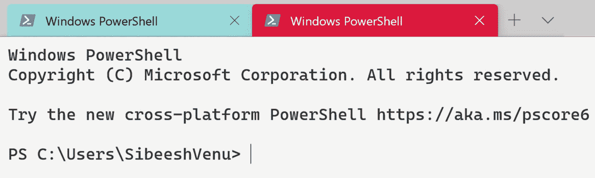

# 六、最后，您可以定制一个 Windows 终端

在前几章中，您使用了您的应用和物联网中枢。在这一章中，我想给你一个专业的提示——使用 Windows 终端命令行工具，你可以自定义它。是的，你没听错。在本章中，我将展示如何使用和定制这个工具。如果你对使用这个工具不感兴趣，可以跳过这一章。

## 使用 Windows 终端

Windows 终端是一个新的、快速的、现代的、高效的终端应用，适用于命令行工具和 Shell(如命令提示符、PowerShell 和 WSL)的用户。你可以很容易地从微软商店下载终端，如图 [6-1](#Fig1) 所示。



图 6-1

Windows 终端安装

### Windows 终端的主要功能

打开 Windows 终端后，您可以看到这个新命令行工具的全新外观。它有一个更新的用户界面和许多新功能，其中一些我们将在下面讨论。

#### 支持多个选项卡

新终端支持多个选项卡，每个选项卡都连接到一个命令行外壳或您选择的应用。见图 [6-2](#Fig2) 。



图 6-2

Windows 终端的多个标签

#### 支持表情符号、图标等

使用新的终端，您可以在您的窗口上显示文本字符、字形和符号，包括表情符号、电力线符号、图标等。

### 正在配置 Windows 终端

新终端为您提供了定制终端的选项，包括:

*   您使用的每个 shell/应用/工具都有多个配置文件。

*   为每个配置文件单独设置字体样式、颜色主题、背景和透明度。

配置存储在一个结构化的文本文件中，因此任何人都可以轻松地编辑它。要编辑设置文件(名为`settings.json`)，只需点击设置按钮，如图 [6-3](#Fig3) 所示。



图 6-3

Windows 终端设置

`settings.json`文件将在您的默认代码编辑器中打开。您应该会看到`profiles`部分，可能的名称有 Windows PowerShell、命令提示符、Ubuntu-20.04 或 Azure Cloud Shell。您可以随意编辑这些配置文件；例如，您可以编辑 Ubuntu-20.04 配置文件，如下所示:

```cs
{
                "guid": "{07b52e3e-de2c-5db4-bd2d-ba144ed6c273}",
                "hidden": false,
                "name": "Ubuntu-20.04",
                "source": "Windows.Terminal.Wsl",
                "background": "#fff",
                "startingDirectory":"\\\\wsl$\\Ubuntu-20.04\\home\\sibeeshvenu",
                "colorScheme": "Campbell"
            }

```

现在如果你打开 Ubuntu-20.04 shell，你会看到所有的设置都被更新了。请注意，起始目录也已经更改。

## Windows 终端预览版

还有一个 Windows 终端的预览版，计划在 2020 年 7 月发布。这个版本提供了许多其他功能。现在让我们来看看它们。

### 在 Windows 终端中打开文件夹

您可以右键单击任何文件夹并选择“在 Windows 终端中打开”,这将在您从文件资源管理器中选择的目录中使用您的默认配置文件启动 Windows 终端。

### 字体粗细支持

预览版支持字体粗细作为新的配置文件设置。`fontWeight`属性的可能值为`normal`、`thin`、`extra-light`、`light`、`semi-light`、`medium`、`semi-bold`、`bold`、`extra-bold`、`black`、`extra-black`，或者是与`OpenType`字体粗细的数值表示相对应的整数。将值放在引号中，如下所示:

```cs
"fontWeight": "normal"

```

### 支持将配置文件作为窗格打开

如果您想在当前窗口中以窗格形式打开一个配置文件，您只需按住 Alt 键，然后单击该配置文件。这将通过使用自动分割功能以窗格的形式打开配置文件。见图 [6-4](#Fig4) 。



图 6-4

Windows 终端的自动拆分窗格

### 更改选项卡颜色

要更改选项卡的颜色，只需右键单击选项卡并选择颜色，这将打开一个颜色菜单。然后你可以选择你想要的颜色。见图 [6-5](#Fig5) 。



图 6-5

Windows 终端选项卡颜色

### 重命名选项卡

还有一个重命名选项卡的选项。为此，只需右键单击选项卡并选择重命名选项卡。这会将您的选项卡标题更改为文本框，您可以在其中重命名该终端会话的选项卡。

## 摘要

你可以设计你的终端，这不是很酷吗？因此，在本章中，您学习了:

*   什么是 Windows 终端？

*   如何安装 Windows 终端？

*   Windows 终端的主要功能。

*   如何自定义 Windows 终端？