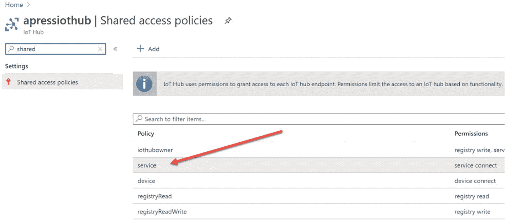

# 七、云到设备通信

在最后几章中，我们将数据从设备发送到 Azure IoT Hub，并使用 Azure IoT 工具监控数据。现在是时候讨论将消息或数据从云发送到设备了。在下列情况下，您可能需要这样做:

*   如果温度超过阈值，您可能需要确保室内温度平衡。你是怎么自动做到的？你可以从云端向设备发送指令，打开风扇和空调。

*   想象一下，你需要安装一个新的模块或公司更新，也许是在数百万台设备上。不可能在每台设备上手动执行此操作。相反，您可以将指令从云中发送到所有设备，这样每个设备都可以得到更新。

*   想象一下，当满足某些条件时，您的集成摄像头的物联网设备需要发送房间的照片。要做到这一点，你只需从集线器发送指令，设备就会监听它。

既然您知道了它为什么有用，那么让我们看看如何将数据从云发送到设备。

## 云到设备的通信选项

物联网中枢提供了三种从云端与设备通信的方式:

*   直接方法。

*   孪晶的理想特性。

*   云到设备的消息。

让我们来看一下这些方法。

### 直接方法

通过这些方法，您可以从云中调用设备上的直接功能。如果您需要立即确认结果，可以使用这种方法。这里给出了几个例子。

*   开灯或开风扇。

*   向用户发出警报或警告。

*   给入侵者拍照。

*   水箱水位低时启动电机。

直接方法表示与设备的请求-应答交互，类似于 HTTP 调用，它们会立即成功或失败。要配置直接方法，我们应该做的第一件事是为该方法创建一个处理程序。

如下重写`Main`方法。

```cs
static async Task Main(string[] args)
        {
            _deviceClient = DeviceClient.CreateFromConnectionString(_deviceConnectionString, TransportType.Mqtt);
            // Create a handler for the direct method call
            _deviceClient.SetMethodHandlerAsync(methodName, TurnOnLight, null).Wait();

            while (true)
            {
                if (_rpiCpuTemp.IsAvailable)
                {
                    await SendToIoTHub(_rpiCpuTemp.Temperature.Celsius);
                    Console.WriteLine("The device data has been sent");
                }
                Thread.Sleep(5000); // Sleep for 5 seconds

            }
        }

```

这里，方法名为`TurnOnLight`。

```cs
private const string methodName = "TurnOnLight";

```

您可以看到我们正在使用`SetMethodHandlerAsync`方法来创建处理程序。现在让我们按如下方式编写自定义处理程序:

```cs
private static Task<MethodResponse> TurnOnLight(MethodRequest methodRequest, object userContext)
        {
            Console.WriteLine("Here is the call from cloud to turn of the light!");
            var result = "{\"result\":\"Executed direct method: " + methodRequest.Name + "\"}";
            return Task.FromResult(new MethodResponse(Encoding.UTF8.GetBytes(result), 200));
        }

```

这里的想法是，我们注册的 hander 将调用这个任务方法。因为我们已经在使用物联网中枢工具，所以有一种简单的方法来调用这个直接方法。只需右击设备名称，点击调用设备直接方法菜单选项，如图 [7-1](#Fig1) 所示。


图 7-1

调用设备直接方法

这将给出一个文本框，您可以在其中输入方法名和有效负载(可选)。不要忘记输入您在处理程序中使用的相同方法名。给出信息后，按回车键。将调用`TurnOnLight`方法，您将得到类似于图 [7-2](#Fig2) 所示的输出。


图 7-2

执行的直接方法

还可以创建另一个应用，在那里触发这个动作，而不是使用 Azure IoT 工具。

#### 创建后端应用来调用直接方法

让我们创建一个名为`raspberrypi.net.core.backend`的新文件夹，并运行以下命令来创建一个新的控制台应用。见图 [7-3](#Fig3) 。


图 7-3

创建后端解决方案

```cs
dotnet new console --langVersion=latest && dotnet add package Microsoft.Azure.Devices

```

创建应用后，在单独的 VSCode 中打开它。我们将如下重写`Program.cs`文件。

```cs
using System;
using Microsoft.Azure.Devices;
using System.Threading.Tasks;

namespace raspberrypi.net.core.backend
{
    class Program
    {
        private static ServiceClient _serviceClient;
        private const string _deviceId = "rpiofficeroom";
        private const string methodName = "TurnOnLight";
        private const string _deviceConnectionString = "HostName=apressiothub.azure-devices.net;SharedAccessKeyName=service;SharedAccessKey=i2uJ9US+JaJQMDAGcwIkTYJ95JWDC7PT0O4zyCAW8dQ=";
        static async Task Main(string[] args)
        {

            _serviceClient = ServiceClient.CreateFromConnectionString(_deviceConnectionString);
            await InvokeDirectMethod(methodName);
            Console.WriteLine("Hello World!");
        }

        private static async Task InvokeDirectMethod(string methodName)
        {
            var invocation = new CloudToDeviceMethod(methodName)
            {
                ResponseTimeout = TimeSpan.FromSeconds(45)
            };
            invocation.SetPayloadJson("5");
            var response = await _serviceClient.InvokeDeviceMethodAsync(_deviceId, invocation);
            Console.WriteLine(response.GetPayloadAsJson());
        }

    }
}

```

注意，我们这里使用的连接字符串是服务连接字符串，而不是设备连接字符串。要获取服务连接字符串，请转到您的物联网中心，然后选择共享访问策略菜单选项。见图 [7-4](#Fig4) 。



图 7-4

服务连接字符串

我们所做的只是从 IoT Hub 服务连接字符串创建一个新的服务客户端，然后调用我们配置的设备方法。现在，让我们调试这两个应用。记得运行 WSL 中的第一个应用(`raspberrypi.net.core`)。

一旦我们运行了第一个应用，我们就可以将调试器放在`TurnOnLight`方法上。然后我们运行第二个应用(`raspberrypi.net.core.backend`)。

第二个应用将调用直接方法；第一个应用将通过处理程序触发该方法，然后返回响应。第二个应用接收响应并在控制台中显示它。正如您在图 [7-5](#Fig5) 中看到的，第一个应用也在接收有效载荷。


图 7-5

触发直接方法调试

图 [7-6](#Fig6) 显示了第二个应用的控制台。


图 7-6

直接方法调用的响应

### 孪晶的理想性质

这种类型的云到设备的通信支持长时间运行的命令，以将设备置于特定的期望状态。例如，更改发送遥测间隔。device twins 是一个 JSON 文档，其中保存了设备信息，比如元数据、配置和条件。Azure 物联网中心为您连接到物联网中心的每个设备维护一个设备孪生。由于我们已经在使用 Azure 物联网工具，我们可以很容易地在我们的 VSCode 中看到这个文件。右键单击你的设备名，选择编辑设备对，如图 [7-7](#Fig7) 所示。


图 7-7

编辑设备 twin

将加载一个名为`azure-iot-device-twin.json`的新 JSON 文件，该文件的内容如下所示:

```cs
{
    "deviceId": "rpiofficeroom",
    "etag": "AAAAAAAAAAE=",
    "deviceEtag": "NzgyOTM1NDc2",
    "status": "enabled",
    "statusUpdateTime": "0001-01-01T00:00:00Z",
    "connectionState": "Disconnected",
    "lastActivityTime": "2020-07-17T12:36:24.4328341Z",
    "cloudToDeviceMessageCount": 0,
    "authenticationType": "sas",
    "x509Thumbprint": {
        "primaryThumbprint": null,
        "secondaryThumbprint": null
    },
    "version": 2,
    "properties": {
        "desired": {
            "$metadata": {
                "$lastUpdated": "2020-07-14T10:47:29.8590777Z"
            },
            "$version": 1
        },
        "reported": {
            "$metadata": {
                "$lastUpdated": "2020-07-14T10:47:29.8590777Z"
            },
            "$version": 1
        }
    },
    "capabilities": {
        "iotEdge": false
    },
    "tags": {}
}

```

您可以使用设备双胞胎来:

*   存储设备特定的位置，例如，您的 Raspberry Pi 的位置。

*   报告设备的当前状态信息。

*   查询您的设备配置、状态或元数据。

*   在后端应用和设备应用之间同步长期运行的工作流的状态。例如，当后端应用执行要安装在设备上的固件更新，并且设备应用报告更新过程的阶段时。

你也可以在你的 Azure 门户中看到这个设备 twin JSON 数据。单击查询浏览器，然后从集合下拉列表中选择设备 Twin。然后点击运行按钮。请注意，默认查询是:

```cs
SELECT * FROM c

```

图 [7-8](#Fig8) 供您参考。


图 7-8

Azure 门户中的设备孪生

现在我们来讨论一下设备双胞胎的一些属性。

#### 报告的财产

在解决方案后端需要知道属性的最后一个已知值的情况下，可以使用`reported`属性。下面是一个`reported`属性的例子。让我们看看。

```cs
"reported": {
            "telemetryConfig": {
                "sendFrequency": "5m",
                "status": "success"
            },
            "batteryLevel": 55,
            "$metadata" : {...},
            "$version": 4
        }

```

这里，`batteryLevel`属性是设备应用报告的最后一次电池电量。

#### 期望的属性

下面是一个`desired`属性的例子:

```cs
"desired": {
            "telemetryConfig": {
                "sendFrequency": "5m"
            },
            "$metadata" : {...},
            "$version": 1
        }

```

后端解决方案用所需的配置值设置`desired`属性，以便设备应用可以读取它。例如，在前面的代码块中，`telemetryConfig`是所需的属性。如果设备已经连接，更改将立即生效，否则，在第一次重新连接时生效。设备应用可以在`reported`属性中报告状态，如下面的代码块所示。

```cs
"reported": {
            "telemetryConfig": {
                "sendFrequency": "5m",
                "status": "success"
            },
            "batteryLevel": 55,
            "$metadata" : {...},
            "$version": 4
        }

```

检查`status`属性。我希望这是对设备双胞胎的足够的介绍。让我们看看他们的行动。我们将更新我们之前创建的后端应用，但在此之前，让我们从 IoT Hub 获取一个新的连接字符串。回想一下，我们前面使用的连接字符串只有服务连接权限。

为此，我们需要一个既有服务连接又有注册表读取连接的连接字符串。要更改这一点，请转到您的物联网中心的共享访问策略部分，然后单击+添加按钮。参见图 [7-9](#Fig9) 。


图 7-9

服务连接和注册表读取权限

完成后，单击“创建”按钮。这将创建一个新策略。点击策略，获取主连接字符串，如图 [7-10](#Fig10) 所示。


图 7-10

具有服务连接和注册表读取权限的连接字符串

在后端应用中用新的连接字符串替换旧的连接字符串。注意，如果您不想更新这个连接字符串并弄乱旧的应用，您也可以用新的连接字符串创建一个新的控制台应用。

现在向注册表管理器添加一个新属性并初始化它。

```cs
private static RegistryManager _registryManager;
_registryManager = RegistryManager.CreateFromConnectionString(_deviceConnectionString);

```

现在让我们用需要更新的属性创建一个新函数。

```cs
private static async Task UpdateTwin()
        {
            var twin = await _registryManager.GetTwinAsync(_deviceId);
            var toUpdate = @"{
                tags:{
                    location: {
                        region: 'DE'
                    }
                },
                properties: {
                    desired: {
                        telemetryConfig: {
                            sendFrequency: '5m'
                        },
                        $metadata: {
                            $lastUpdated: '2020-07-14T10:47:29.8590777Z'
                        },
                        $version: 1
                    }
                }
             }";

            await _registryManager.UpdateTwinAsync(_deviceId, toUpdate, twin.ETag);
        }

```

正如您在代码块中看到的，我们正在用定制的配置值更新位置标签和所需的属性。我们下一步要做的就是从`Main`方法中调用这个方法。这就是现在的`Main`方法的样子。

```cs
static async Task Main(string[] args)
        {
            _serviceClient = ServiceClient.CreateFromConnectionString(_deviceConnectionString);
            _registryManager = RegistryManager.CreateFromConnectionString(_deviceConnectionString);
            await UpdateTwin();
            await InvokeDirectMethod(methodName);
            Console.WriteLine("Hello World!");
        }

```

因为我们已经设置了后端，所以是时候对设备应用进行一些更改了。打开应用，向`Main`函数添加所需的属性更改回调，如下所示。

```cs
// Set desired property update callback
            await _deviceClient.SetDesiredPropertyUpdateCallbackAsync(OnDesiredPropertyChangedAsync, null).ConfigureAwait(false);

```

现在让我们写回调函数。

```cs
private static async Task OnDesiredPropertyChangedAsync(TwinCollection desiredProperties, object userContext)
        {
            Console.WriteLine($"New desired property is {desiredProperties.ToJson()}");
            TwinCollection reportedProperties, telemetryConfig;
            reportedProperties = new TwinCollection();
            telemetryConfig = new TwinCollection();
            telemetryConfig["status"] = "success";
            reportedProperties["telemetryConfig"] = telemetryConfig;
            await _deviceClient.UpdateReportedPropertiesAsync(reportedProperties).ConfigureAwait(false);
        }

```

在回调函数中，我们将更新属性`reported`作为确认，并将状态值作为`success`传递。`UpdateReportedPropertiesAsync`函数将更新属性。

回到您的`main`方法，编写代码来设置`telemetryConfig`下的报告属性`sendFrequency`的初始值。

```cs
var twin = await _deviceClient.GetTwinAsync();
            Console.WriteLine($"Initial Twin: {twin.ToJson()}");

            TwinCollection reportedProperties, telemetryConfig;
            reportedProperties = new TwinCollection();
            telemetryConfig = new TwinCollection();
            telemetryConfig["sendFrequency"] = "5m";
            reportedProperties["telemetryConfig"] = telemetryConfig;

            await _deviceClient.UpdateReportedPropertiesAsync(reportedProperties).ConfigureAwait(false);
Console.WriteLine("Waiting 30 seconds for IoT Hub Twin updates...");
            await Task.Delay(3 * 1000);

```

这里，`sendFrequency`是`telemetryConfig` twin 集合的一个属性。下面是`Program.cs`类的完整代码:

```cs
using System;
using System.Text;
using Iot.Device.CpuTemperature;
using System.Threading;
using System.Threading.Tasks;
using Microsoft.Azure.Devices.Client;
using Newtonsoft.Json;
using raspberrypi.net.core.Models;
using Microsoft.Azure.Devices.Shared;

namespace raspberrypi.net.core
{
    class Program
    {
        private static CpuTemperature _rpiCpuTemp = new CpuTemperature();
        private const string _deviceConnectionString = "HostName=apressiothub.azure-devices.net;DeviceId=rpiofficeroom;SharedAccessKey=Zz4OyJO6odR5aLu6x9tzSpE8sUy3vBEfQThsRipN2WA=";
        private static int _messageId = 0;
        private static DeviceClient _deviceClient;
        private const double _temperatureThreshold = 40;
        public const string DeviceId = "rpiofficeroom";
        private const string methodName = "TurnOnLight";

        static async Task Main(string[] args)
        {
            _deviceClient = DeviceClient.CreateFromConnectionString(_deviceConnectionString, TransportType.Mqtt);
            // Create a handler for the direct method call
            _deviceClient.SetMethodHandlerAsync(methodName, TurnOnLight, null).Wait();
            // Set desired property update callback
            await _deviceClient.SetDesiredPropertyUpdateCallbackAsync(OnDesiredPropertyChangedAsync, null).ConfigureAwait(false);

            var twin = await _deviceClient.GetTwinAsync();
            Console.WriteLine($"Initial Twin: {twin.ToJson()}");

            TwinCollection reportedProperties, telemetryConfig;
            reportedProperties = new TwinCollection();
            telemetryConfig = new TwinCollection();
            telemetryConfig["sendFrequency"] = "5m";
            reportedProperties["telemetryConfig"] = telemetryConfig;

            await _deviceClient.UpdateReportedPropertiesAsync(reportedProperties).ConfigureAwait(false);
            Console.WriteLine("Waiting 30 seconds for IoT Hub Twin updates...");
            await Task.Delay(3 * 1000);

            while (true)
            {

                if (_rpiCpuTemp.IsAvailable)
                {
                    await SendToIoTHub(_rpiCpuTemp.Temperature.Celsius);
                    Console.WriteLine("The device data has been sent");
                }
                Thread.Sleep(5000); // Sleep for 5 seconds
            }
        }

        private static async Task OnDesiredPropertyChangedAsync(TwinCollection desiredProperties, object userContext)
        {

            Console.WriteLine($"New desired property is {desiredProperties.ToJson()}");
            TwinCollection reportedProperties, telemetryConfig;
            reportedProperties = new TwinCollection();
            telemetryConfig = new TwinCollection();
            telemetryConfig["status"] = "success";
            reportedProperties["telemetryConfig"] = telemetryConfig;
            await _deviceClient.UpdateReportedPropertiesAsync(reportedProperties).ConfigureAwait(false);
        }

        private static Task<MethodResponse> TurnOnLight(MethodRequest methodRequest, object userContext)
        {
            Console.WriteLine("Here is the call from cloud to turn of the light!");
            var result = "{\"result\":\"Executed direct method: " + methodRequest.Name + "\"}";
            return Task.FromResult(new MethodResponse(Encoding.UTF8.GetBytes(result), 200));
        }

        private static async Task SendToIoTHub(double tempCelsius)
        {

            string jsonData = JsonConvert.SerializeObject(new DeviceData()
            {
                MessageId = _messageId++,
                Temperature = tempCelsius
            });
            var messageToSend = new Message(Encoding.UTF8.GetBytes(jsonData));
            messageToSend.Properties.Add("TemperatureAlert", (tempCelsius > _temperatureThreshold) ? "true" : "false");
            await _deviceClient.SendEventAsync(messageToSend).ConfigureAwait(false);
        }
    }
}

```

现在在`OnDesiredPropertyChangedAsync`函数中放一个调试器，并运行设备应用。一旦它运行，运行您的后端应用。后端应用将更改属性，调试器将在回调函数中被调用。见图 [7-11](#Fig11) 。


图 7-11

where siredproperty changedas sync method 调试器

正如您在调试器窗口中看到的，我们从后端应用传递了这些值。现在，从 Azure 物联网工具中，右键单击设备名称并选择编辑设备 Twin 选项。您的`azure-iot-device-twin.json`文件现在应该是这样的:

```cs
{
    "deviceId": "rpiofficeroom",
    "etag": "AAAAAAAAAAY=",
    "deviceEtag": "NzgyOTM1NDc2",
    "status": "enabled",
    "statusUpdateTime": "0001-01-01T00:00:00Z",
    "connectionState": "Disconnected",
    "lastActivityTime": "2020-07-19T12:12:02.2900013Z",
    "cloudToDeviceMessageCount": 0,
    "authenticationType": "sas",
    "x509Thumbprint": {
        "primaryThumbprint": null,
        "secondaryThumbprint": null
    },
    "version": 11,
    "tags": {
        "location": {
            "region": "DE"
        }
    },
    "properties": {
        "desired": {
            "telemetryConfig": {
                "sendFrequency": "5m"
            },
            "$metadata": {
                "$lastUpdated": "2020-07-19T12:10:44.6185564Z",
                "$lastUpdatedVersion": 4,
                "telemetryConfig": {
                    "$lastUpdated": "2020-07-19T12:10:44.6185564Z",
                    "$lastUpdatedVersion": 4,
                    "sendFrequency": {
                        "$lastUpdated": "2020-07-19T12:10:44.6185564Z",
                        "$lastUpdatedVersion": 4
                    }

                }
            },
            "$version": 4
        },
        "reported": {
            "telemetryConfig": {
                "sendFrequency": "5m",
                "status": "success"
            },
            "$metadata": {
                "$lastUpdated": "2020-07-19T12:12:02.2743455Z",
                "telemetryConfig": {
                    "$lastUpdated": "2020-07-19T12:12:02.2743455Z",
                    "sendFrequency": {
                        "$lastUpdated": "2020-07-19T12:07:31.3467328Z"
                    },
                    "status": {
                        "$lastUpdated": "2020-07-19T12:12:02.2743455Z"
                    }
                }
            },
            "$version": 5
        }
    },
    "capabilities": {
        "iotEdge": false
    }
}

```

请注意`reported`属性中的`status`属性。哇，太棒了，对吧？让我们进入下一个环节。

### 云到设备的消息

这种方法用于向设备发送通知，并且是单向通信。请注意，这些功能中的大多数仅在物联网中心的标准层中可用。

为了发送云到设备的消息，我们使用面向服务的端点`/messages/devicebound`。设备将通过一个名为`/devices/{deviceid}/messages/devicebound`的特定于设备的端点接收消息。请注意，每个设备最多可以保存 50 条云到设备的消息。

这些设备可以拒绝来自云端的这类消息；在这种情况下，IoT Hub 会将其设置为 dead lettered 状态。设备也可以丢弃这些消息。然后，物联网中心会将消息放回队列中，状态为`Enqueued`。

介绍够了，让我们重写设备应用和后端应用。以下是步骤:

1.  后端应用发送云到设备的消息。

2.  设备应用接收云消息。

3.  设备应用发送交付反馈。

4.  后端应用接收交付反馈。

#### 发送云到设备消息

让我们在后端应用中创建一个名为`SendCloudToDeviceMessageAsync()`的函数，将云消息发送到设备。

```cs
private static async Task SendCloudToDeviceMessageAsync()
        {
            var message = new Message(Encoding.ASCII.GetBytes("This is a message from cloud"));
message.Ack = DeliveryAcknowledgement.Full; // This is to request the feedback
            await _serviceClient.SendAsync(_deviceId, message);
        }

```

这里，行`message.Ack = DeliveryAcknowledgement.Full;`请求我们的云到设备消息交付的反馈。不要忘记在你的`main`函数中调用这个函数。这就是你的`main`函数的样子:

```cs
static async Task Main(string[] args)
        {
            _serviceClient = ServiceClient.CreateFromConnectionString(_deviceConnectionString);
            _registryManager = RegistryManager.CreateFromConnectionString(_deviceConnectionString);
            await SendCloudToDeviceMessageAsync();
            await UpdateTwin();
            await InvokeDirectMethod(methodName);
            Console.WriteLine("Hello World!");
        }

```

#### 接收云到设备消息并发送反馈

后端现在能够发送云到设备的消息，所以让我们在设备应用中创建一个新的函数来接收这个消息。

```cs
private static async Task ReceiveCloudToDeviceMessageAsync()
        {
            while (true)
            {
                var cloudMessage = await _deviceClient.ReceiveAsync();
                if (cloudMessage == null) continue;
                Console.WriteLine($"The received message is: {Encoding.ASCII.GetString(cloudMessage.GetBytes())}");
                await _deviceClient.CompleteAsync(cloudMessage); // Send feedback
            }
        }

```

不要忘记在`main`方法中调用这个方法。让我们注释掉所有其他代码，这就是新的`main`方法的样子。

```cs
static async Task Main(string[] args)
        {
            _deviceClient = DeviceClient.CreateFromConnectionString(_deviceConnectionString, TransportType.Mqtt);
            // // Create a handler for the direct method call
            // _deviceClient.SetMethodHandlerAsync(methodName, TurnOnLight, null).Wait();
            // // Set desired property update callback
            // await _deviceClient.SetDesiredPropertyUpdateCallbackAsync(OnDesiredPropertyChangedAsync, null).ConfigureAwait(false);

            // var twin = await _deviceClient.GetTwinAsync();
            // Console.WriteLine($"Initial Twin: {twin.ToJson()}");
            // TwinCollection reportedProperties, telemetryConfig;
            // reportedProperties = new TwinCollection();
            // telemetryConfig = new TwinCollection();
            // telemetryConfig["sendFrequency"] = "5m";
            // reportedProperties["telemetryConfig"] = telemetryConfig;

            // await _deviceClient.UpdateReportedPropertiesAsync(reportedProperties).ConfigureAwait(false);
            // Console.WriteLine("Waiting 30 seconds for IoT Hub Twin updates...");
            // await Task.Delay(3 * 1000);

            // while (true)
            // {
            //     if (_rpiCpuTemp.IsAvailable)
            //     {

            //         await SendToIoTHub(_rpiCpuTemp.Temperature.Celsius);
            //         Console.WriteLine("The device data has been sent");
            //     }
            //     Thread.Sleep(5000); // Sleep for 5 seconds
            // }
            await ReceiveCloudToDeviceMessageAsync(); // Cloud to device receiver
        }

```

`ReceiveAsync()`函数在超时后返回`null`。当 app 接收到`null`时，应该会继续等待新消息。这就是为什么我们增加了一个条件来检查`cloudMessage`是否是`null`。

`CompleteAsync()`函数通知 IoT Hub 消息已被处理，可以安全删除。

#### 从设备接收反馈

我们已经看到了如何从设备发送云到设备的消息反馈，所以让我们学习如何在后端应用中接收反馈。下面的`ReceiveDeliveryFeedback()`函数完成了这项工作。

```cs
private static async Task ReceiveDeliveryFeedback()
        {
            var feedbackReceiver = _serviceClient.GetFeedbackReceiver();
            while (true)
            {
                var feedback = await feedbackReceiver.ReceiveAsync();
                if (feedback == null) continue;
                Console.WriteLine($"The feedback status is: {string.Join(",", feedback.Records.Select(s => s.StatusCode))}");
                await feedbackReceiver.CompleteAsync(feedback);
            }
        }

```

不要忘记将这个函数添加到`main`方法中。

### 演示应用

现在让我们运行我们的设备应用和后端应用。如果一切顺利，您应该会看到如图 [7-12](#Fig12) 和 [7-13](#Fig13) 所示的输出。图 [7-12](#Fig12) 来自设备应用，图 [7-13](#Fig13) 来自后端应用。


图 7-13

云到设备的消息反馈


图 7-12

云到设备消息

## 摘要

我希望你能够亲自理解这一章。在本章中，您学习了:

*   从云中与设备通信的方式。

*   直接方法是什么，如何实现？

*   什么是设备双胞胎，如何实现？

*   什么是云到设备的消息，如何实现它？

现在让我们进入下一章。