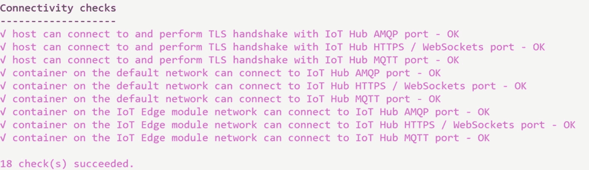

# 八、物联网边缘

在前几章中，您了解了设备和物联网集线器之间的双向通信。您也看到了演示中的动作。为了全面了解物联网中心，我们还需要讨论物联网边缘。因此，在本章中，我们涵盖以下主题:

*   什么是物联网边缘？

*   为什么这么受欢迎？

*   它是如何工作的？

你怎么想呢?感到兴奋吗？我们开始吧。

## 物联网边缘

Azure IoT Edge 是基于 Azure IoT Hub 构建的托管服务。通常，当我们将数据发送到云中时，工作负载发生在云中。但是在物联网边缘的帮助下，我们可以通过标准容器将这种工作负载转移到我们的设备上。这些工作负载可以是人工智能、你的业务逻辑，或者任何其他 Azure 或第三方服务。这样，与设备和云的通信受到限制，设备可以更快地对数据或变化做出反应。

### 物联网边缘运行时

物联网边缘运行时是程序的集合。这些程序将设备变成物联网边缘设备。简而言之，物联网边缘运行时组件使物联网边缘设备能够接收代码以在边缘运行并传达结果。

#### 物联网边缘模块

物联网边缘允许我们以模块的形式在边缘部署和管理业务逻辑。这些模块是物联网边缘管理的最小单元。它们可以包含任何 Azure 服务(如 Azure stream analytics)、第三方服务或您的代码。以下是模块的元素:

*   *模块镜像*是包含软件的包。

*   一个*模块实例*是在物联网边缘运行模块映像的计算单元；它由物联网边缘运行时启动。

*   一个*模块标识*是存储在物联网 Hub 中的一条信息；它与每个模块实例相关联。这条信息包括安全凭证。

*   一个*模块 twin* 是存储在物联网 Hub 中的 JSON 文档。它包含模块实例的状态信息。这可以包含元数据、配置和条件。

模块映像存在于云中，它们可以在不同的解决方案中更新、更改和部署。模块映像必须只处理一个目的。例如，不要创建一个具有人工智能和应用洞察能力的模块。每当新的模块映像部署到设备并由物联网边缘运行时启动时，都会创建一个新的模块实例。

每次 IoT Edge 运行时创建一个模块实例，它都会获得一个新的对应模块标识。这个身份取决于设备的身份和模块名称。例如，如果您的模块名称是`Logger`，并且您将它部署在`RpiOfficeRoom`设备上，那么对应的模块标识将是`/devices/RpiOfficeRoom/modules/Logger`。

每个模块实例都有其对应的模块孪生，我们可以用它来配置模块实例。模块 twin 也是一个 JSON 文档，就像设备 twin 一样，它存储模块信息及其配置。

#### 物联网边缘运行时的功能

物联网边缘运行时的职责如下:

*   在设备上安装和更新工作负载。

*   在设备上维护 Azure 物联网边缘安全标准。

*   确保物联网边缘模块始终运行。

*   向云报告模块健康状况，以便进行远程监控。

*   管理下游设备和物联网边缘设备之间的通信。

*   管理物联网边缘设备上模块之间的通信。

*   管理物联网边缘设备和云之间的通信。

## 创建物联网边缘设备

物联网边缘允许您远程管理设备上的代码。这使您更容易将更多的工作负载发送到边缘。首先，我们需要一个物联网中心，我们已经有了。我们需要创建一个物联网边缘设备。由于此设备的行为和管理方式不同，我们需要以不同的方式创建此设备。转到 Azure 门户中的物联网中心，然后单击物联网边缘部分。然后点击+添加一个物联网边缘设备，如图 [8-1](#Fig1) 。


图 8-1

添加物联网边缘设备

创建屏幕与普通物联网设备的屏幕相同，如图 [8-2](#Fig2) 所示。


图 8-2

创建物联网边缘设备

该设备将列在物联网边缘设备列表中。单击该列表以获取连接字符串。参见图 [8-3](#Fig3) 。


图 8-3

物联网边缘设备连接字符串

如图 [8-3](#Fig3) 所示，连接字符串列出了物联网集线器名称、设备 ID 和共享访问密钥，以进行身份验证。

## 在 Linux 系统上安装物联网边缘运行时

由于我们使用的是 Raspberry Pi，所以需要安装 IoT Edge 运行时。在安装容器运行时之前，使用以下命令注册 Microsoft 密钥和软件存储库提要。SSH 到您的 Raspberry Pi 并运行以下命令:

```cs
curl https://packages.microsoft.com/config/debian/stretch/multiarch/prod.list > ./microsoft-prod.list

```

现在通过运行以下命令将`./microsoft-prod.list`复制到`/etc/apt/sources.list.d/`:

```cs
sudo cp ./microsoft-prod.list /etc/apt/sources.list.d/

```

现在安装微软 GPG 公共密钥:

```cs
curl https://packages.microsoft.com/keys/microsoft.asc | gpg --dearmor > microsoft.gpg
sudo cp ./microsoft.gpg /etc/apt/trusted.gpg.d/

```

一旦完成，运行`sudo apt-get update`。图 [8-4](#Fig4) 显示了命令行输出。


图 8-4

物联网边缘设备先决条件

安装容器运行时的所有先决条件都准备好了，所以让我们安装莫比引擎(`mobyproject.org`)。值得一提的是，莫比引擎是 Azure IoT Edge 官方支持的唯一容器引擎。运行以下命令来安装`moby-engine`。

```cs
sudo apt-get install moby-engine

```

现在我们可以安装物联网边缘安全守护程序了。物联网边缘安全守护程序提供并维护边缘设备上的安全标准。它在每次启动时启动，并通过启动物联网边缘运行时的其余部分来引导设备。

按如下方式更新设备上的软件包列表:

```cs
sudo apt-get update

```

您可以通过运行以下命令来检查 IoT Edge 的可用版本。

```cs
apt list -a iotedge

```

你应该得到一个可用版本的列表，如图 [8-5](#Fig5) 所示。


图 8-5

物联网边缘可用版本

如果你想安装一个特定版本的安全守护进程，你可以在命令中提到它，以及`libiothsm-std`包的版本。

```cs
sudo apt-get install iotedge=1.0.9* libiothsm-std=1.0.9*

```

`sudo apt-get install iotedge`命令将安装最新版本的安全守护程序和`libiothsm-std`。

```cs
sudo apt-get install iotedge

```

在`/etc/iotedge/`安装物联网边缘后，命令窗口会显示更新配置文件的消息，如图 [8-6](#Fig6) 所示。


图 8-6

安装物联网边缘

该配置文件可在`/etc/iotedge/`获得。这是我们可以用来配置设备的文件。要查看该文件的内容，请运行以下命令。

```cs
sudo nano /etc/iotedge/config.yaml

```

有两种方法可以配置您的设备:

*   用手

*   自动地

由于我们只有一台设备，我们将使用手动资源调配。自动配置可以使用设备配置服务来完成，该服务将自动配置您的设备。图 [8-7](#Fig7) 显示了配置文件的外观。


图 8-7

物联网边缘配置文件

这个配置文件是一个`.yml`文件，所以间距和缩进非常重要。确保取消注释手动预配配置，并注释掉其他预配部分。参见图 [8-8](#Fig8) 。


图 8-8

物联网边缘手动配置

您需要使用来自 Azure 门户的物联网边缘设备连接字符串来更新`device_connection_string`的值。

```cs
# Manual provisioning configuration

provisioning:
  source: "manual"
  device_connection_string: "<ADD DEVICE CONNECTION STRING HERE>"

```

一旦用连接字符串更新了它，只需保存文件并关闭它(Ctrl+X，键入 Y，然后按 Enter)。

现在，通过运行以下命令重新启动守护程序。

```cs
sudo systemctl restart iotedge

```

如果您成功完成了配置，您可以通过运行以下命令来检查您的 IoT Edge 守护程序的状态。

```cs
systemctl status iotedge

```

如果一切顺利，您应该会看到图 [8-9](#Fig9) 中的输出。


图 8-9

物联网边缘状态

值得一提的是，您始终可以通过运行以下命令来检查守护程序日志:

```cs
journalctl -u iotedge --no-pager --no-full

```

您还可以通过运行`check`命令来排除物联网边缘设备的故障。它运行一系列配置和连接测试。

```cs
sudo iotedge check

```

前面的命令将检查配置和连接检查。其中一些如图 [8-10](#Fig10) 和 [8-11](#Fig11) 所示。



图 8-11

物联网边缘连通性检查


图 8-10

物联网边缘配置检查

如果您想要查看物联网边缘设备上的所有模块，您可以使用`list`命令:

```cs
sudo iotedge list

```

图 [8-12](#Fig12) 显示了模块列表。


图 8-12

物联网边缘模块列表

可以看到，此时只有一个模块在运行，就是`edgeAgent`。但是不要担心，一旦您进行了第一次部署，还会有其他模块。

## 将模块部署到物联网边缘设备

现在，您已经设置了您的物联网边缘设备，是时候从云中为其部署一些模块了。你准备好了吗？参见图 [8-13](#Fig13) 。


图 8-13

物联网边缘部署模块

如上所述，模块是作为容器实现的可执行包。登录到您的 Azure 门户，然后转到您创建的物联网中心。从左侧窗格的菜单中的自动设备管理下，选择物联网边缘，然后单击您创建的设备。参见图 [8-14](#Fig14) 。


图 8-14

物联网边缘自动部署模块

在下一个屏幕上，点击设置模块按钮，如图 [8-15](#Fig15) 所示。


图 8-15

物联网边缘设置模块

有两种方法可以将模块部署到物联网边缘设备:


图 8-16

物联网边缘集模块页面

*   使用容器注册表(参见图 [8-16](#Fig16)

*   使用物联网边缘模块

Azure 容器注册表存储和管理私有 Docker 容器映像。您可能已经使用过 Docker Hub ( [`hub.docker.com`](https://hub.docker.com/) )，它存储和管理公共 Docker 容器图像。要从 Azure 容器注册中心获取您的私有模块，您必须提供您的凭据。在凭证的帮助下，注册中心将检索具有匹配 URL 的模块。请注意，如果边缘代理找不到模块的容器注册表设置，它将报告错误代码`500`。

物联网边缘模块是一个 Docker 容器，您可以将其部署到物联网边缘设备。幸运的是，Azure Marketplace 的物联网边缘模块部分有足够多的预建模块( [`azuremarketplace.microsoft.com`](https://azuremarketplace.microsoft.com) )。在本节中，我们将使用市场上的一个传感器来模拟传感器并发送生成的数据。

点击+添加，然后在物联网边缘模块部分选择市场模块，如图 [8-17](#Fig17) 所示。


图 8-17

物联网边缘市场模块

加载物联网边缘市场模块后，搜索并添加模拟温度传感器模块(参见图 [8-18](#Fig18) )。


图 8-18

物联网边缘模拟模块

模拟温度传感器模块添加了所需的状态。点击下一步按钮设置路线，如图 [8-19](#Fig19) 所示。


图 8-19

物联网边缘添加模块

路由决定了消息如何在模块和物联网集线器之间传递。在路由的帮助下，如果需要，我们可以将数据发送给其他服务。正如您在图 [8-20](#Fig20) 中所看到的，这些路由是名称/值对，现在您应该可以在那里看到两条路由。一个是默认路由，将所有消息发送到物联网集线器。第二个是在添加模拟温度传感器模块时自动创建的。让我们检查一下这条路线的价值。

```cs
FROM /messages/modules/SimulatedTemperatureSensor/* INTO $upstream

```

完成后，单击下一步按钮。


图 8-20

模块路线

在下一个屏幕上，您可以预览 JSON 文件，该文件定义了部署到您的物联网边缘设备的所有模块。如果你想做些改变，现在是时候了。下面是 JSON 文件的例子。

```cs
{
    "modulesContent": {
        "$edgeAgent": {
            "properties.desired": {
                "modules": {
                    "SimulatedTemperatureSensor": {
                        "settings": {
                            "image": "mcr.microsoft.com/azureiotedge-simulated-temperature-sensor:1.0",
                            "createOptions": ""
                        },
                        "type": "docker",
                        "status": "running",
                        "restartPolicy": "always",
                        "version": "1.0"

                    }
                },
                "runtime": {
                    "settings": {
                        "minDockerVersion": "v1.25"
                    },
                    "type": "docker"
                },
                "schemaVersion": "1.0",
                "systemModules": {
                    "edgeAgent": {
                        "settings": {
                            "image": "mcr.microsoft.com/azureiotedge-agent:1.0",
                            "createOptions": ""
                        },
                        "type": "docker"
                    },
                    "edgeHub": {
                        "settings": {
                            "image": "mcr.microsoft.com/azureiotedge-hub:1.0",
                            "createOptions": "{\"HostConfig\":{\"PortBindings\":{\"443/tcp\":[{\"HostPort\":\"443\"}],\"5671/tcp\":[{\"HostPort\":\"5671\"}],\"8883/tcp\":[{\"HostPort\":\"8883\"}]}}}"
                        },
                        "type": "docker",
                        "status": "running",
                        "restartPolicy": "always"
                    }
                }
            }
        },
        "$edgeHub": {

            "properties.desired": {
                "routes": {
                    "route": "FROM /messages/* INTO $upstream",
                    "SimulatedTemperatureSensorToIoTHub": "FROM /messages/modules/SimulatedTemperatureSensor/* INTO $upstream"
                },
                "schemaVersion": "1.0",
                "storeAndForwardConfiguration": {
                    "timeToLiveSecs": 7200
                }
            }
        },
        "SimulatedTemperatureSensor": {
            "properties.desired": {
                "SendData": true,
                "SendInterval": 5
            }
        }
    }
}

```

您可以看到您已经添加的模块以及两个运行时模块— `edgeAgent`和`edgeHub`。完成审阅后，单击“创建”按钮。值得一提的是，当您向物联网边缘提交新部署时，不会有任何内容被推送到您的设备。相反，该设备会定期查询物联网集线器。如果发现更新的清单，它会从云中取出更新的模块映像，并开始在本地运行这些模块。

这个提交需要几秒钟，一旦完成，您将看到`"Successfully updated IoT Edge settings for device rpiedge"`通知。现在可以检查模块列表中的所有模块，如图 [8-21](#Fig21) 所示。


图 8-21

运行模块

## 查看已发送的邮件

由于我们有一个运行模块的物联网边缘设备，让我们通过 SSH 连接到该设备，查看发送的消息。参见图 [8-22](#Fig22) 。


图 8-22

设备中的新模块

要查看模拟器模块发送的消息，请使用以下命令。

```cs
sudo iotedge logs SimulatedTemperatureSensor -f

```

这将给出如图 [8-23](#Fig23) 所示的输出。


图 8-23

模拟器模块消息

这不是很酷吗？我们能够在我们的设备中使用一个模块，而不必专门配置那个模块。因此，在未来，我们可以轻松地根据需要添加任意多的模块，而无需考虑设备。

## 摘要

哇，你已经读完这一章了。我希望你已经从本章学到了以下主题:

*   什么是物联网边缘，使用它的好处是什么？

*   什么是物联网边缘运行时？

*   什么是物联网边缘模块？

*   物联网边缘运行时的功能。

*   如何创建物联网边缘设备？

*   如何在 Linux 系统上安装物联网边缘运行时？

*   如何将一个模块部署到物联网边缘设备，并看到数据被发送到物联网集线器？

下一章见。