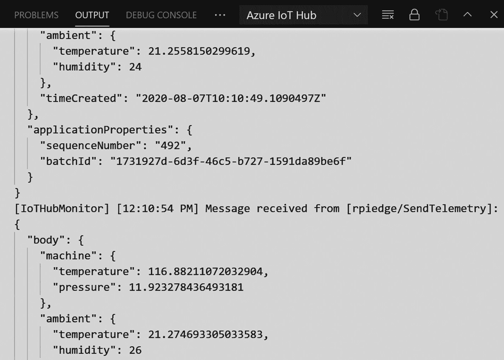

# 九、开发物联网边缘模块

在上一章中，您成功地将一个模块部署到您的物联网边缘设备，但是您使用了一个已经上市的模块。在本章中，你将学习如何开发和部署你自己的模块。听起来有趣吗？我迫不及待地想告诉你怎么做。我们开始吧。

## 先决条件

在我们开始之前，最好列出您需要的所有先决条件。像往常一样，我们将使用 Visual Studio 代码进行开发。我正在 Windows 电脑上开发该模块，旨在针对运行物联网边缘的 Linux 设备，即 Raspberry Pi。其他需要注意的事项包括:


图 9-1

Docker 切换到 Windows 容器

*   您的开发机器应该支持嵌套虚拟化。这是运行容器引擎所需要的。我们使用 Docker 桌面来开发容器。你可以使用 Docker Desktop 在 Linux 容器和 Windows 容器之间轻松切换(见图 [9-1](#Fig1) )。这使您能够为不同类型的物联网边缘设备创建模块。你可以从 Docker Hub ( [`docs.docker.com/docker-for-windows/install`](https://docs.docker.com/docker-for-windows/install) )安装 Docker Desktop。

*   您应该安装 Git，以便拉出由 OmniSharp 支持的模块模板包 C# 扩展。还记得我们在 Visual Studio 中添加了这个吗？

## 设置 VSCode

由于 Azure 物联网工具扩展，使用 VSCode 创建物联网解决方案从未如此简单。借助这一扩展，您可以使用给定的项目模板轻松创建项目，自动化部署，以及监控和管理物联网设备。转到 VSCode 中的扩展选项卡，安装 Azure 物联网工具(见图 [9-2](#Fig2) )。


图 9-2

Azure 物联网工具

一旦安装了扩展，转到视图菜单，然后单击命令调色板。搜索并选择 Azure:登录。Azure 将要求您使用现有的 Azure 帐户登录；请记住使用您创建 Azure 物联网中心时使用的帐户登录。

登录后，再次打开命令调板。搜索并选择 Azure 物联网中心:选择物联网中心，这将为您提供选择物联网中心的选项。完成后，您可以在 VSCode Explorer 中看到您的设备(选择 View ➤资源管理器)，如图 [9-3](#Fig3) 所示。


图 9-3

Azure 物联网浏览器

## 创建 Azure 容器注册表

本章旨在在任何 Docker 兼容的注册表中部署使用 Azure IoT 工具创建的模块的容器映像。在这个例子中，我们将使用 Azure 容器注册中心，但是您也可以使用 Docker Hub。现在让我们在 Azure 门户中创建一个 Azure 容器注册中心。搜索并创建容器注册服务。创建这个服务就像在 Azure 中创建其他服务一样简单。建议在同一资源组中创建资源。

所有 SKU 提供相同的编程能力；但是，选择较高的 SKU 将提供更高的性能和规模。表 [9-1](#Tab1) 显示了 SKU 之间的一些差异。

表 9-1

容器注册功能和差异

<colgroup><col class="tcol1 align-left"> <col class="tcol2 align-left"> <col class="tcol3 align-left"> <col class="tcol4 align-left"></colgroup> 
| 

能力

 | 

基础

 | 

标准

 | 

溢价

 |
| --- | --- | --- | --- |
| 每日价格 | $0.17 | $0.67 | $1.67 |
| 包含的存储(GiB) | Ten | One hundred | Five hundred |
| 为跨多个并发节点的 docker 拉入提供增强的吞吐量 |
| web 挂钩总数 | Two | Ten | Five hundred |
| 地理复制 | 不支持 | 不支持 | 支持 |
| 每个复制区域 1.667 美元 |

在这个例子中，我们将使用基本的 SKU。完成后，查看并创建资源。参见图 [9-4](#Fig4) 。


图 9-4

Azure 容器注册表

现在转到您刚刚创建的资源，并从位于 settings 下的菜单中单击访问键。在给定的页面中，启用 Admin 用户，这样您就可以使用注册表名称作为用户名，并使用生成的密码登录到您的容器注册表。参见图 [9-5](#Fig5) 。


图 9-5

容器注册管理访问

## 创建新项目

如前所述，使用物联网工具创建新项目非常容易。为此，请打开命令面板，搜索并选择 Azure IoT Edge:New IoT Edge Solution。按下 Enter 键后，它会要求您选择保存文件的文件夹，然后提供解决方案名称。我把它命名为`raspberrypi.edge`。当要求选择模块模板时，选择 C# 模块。你可以给你的模块起任何名字；我把这个例子命名为`SendTelemetry`。当您被要求提供模块的 Docker 映像存储库时，请提供您在 Azure 容器注册表的访问键部分看到的登录服务器值。它看起来类似于`apresscr.azurecr.io/sendtelemetry`。您可以随时在`module.json`文件中编辑该值。见图 [9-6](#Fig6) 。


图 9-6

图像存储库

创建解决方案后，转到模块。您将在那里看到`module.json`文件。看起来是这样的:

```cs
{
    "$schema-version": "0.0.1",
    "description": "",
    "image": {
        "repository": "apresscr.azurecr.io/sendtelemetry",
        "tag": {
            "version": "0.0.1",
            "platforms": {
                "amd64": "./Dockerfile.amd64",
                "amd64.debug": "./Dockerfile.amd64.debug",
                "arm32v7": "./Dockerfile.arm32v7",
                "arm32v7.debug": "./Dockerfile.arm32v7.debug",
                "arm64v8": "./Dockerfile.arm64v8",
                "arm64v8.debug": "./Dockerfile.arm64v8.debug",
                "windows-amd64": "./Dockerfile.windows-amd64"
            }
        },
        "buildOptions": [],
        "contextPath": "./"
    },
    "language": "csharp"
}

```

`modules`文件夹将包含所有模块。现在，只有一个模块，您可以在其中编写所有的主程序代码、模块元数据和 docker 文件。

`.env`文件存储容器注册中心的凭证。这些凭证将与您的物联网边缘设备共享，以提取集装箱图像。

要部署这些模块，我们需要部署清单文件。这个文件定义了将部署哪些模块，应该如何配置它们，以及它们如何相互通信以及如何与云通信。`deployment.template.json`和`deployment.debug.template.json`文件帮助创建这个清单文件。以下是这些文件的内容:

`deployment.debug.template.json`:

```cs
{
  "$schema-template": "2.0.0",
  "modulesContent": {
    "$edgeAgent": {
      "properties.desired": {
        "schemaVersion": "1.0",
        "runtime": {
          "type": "docker",
          "settings": {
            "minDockerVersion": "v1.25",
            "loggingOptions": "",
            "registryCredentials": {
              "apresscr": {
                "username": "$CONTAINER_REGISTRY_USERNAME_apresscr",
                "password": "$CONTAINER_REGISTRY_PASSWORD_apresscr",
                "address": "apresscr.azurecr.io"
              }
            }
          }

        },
        "systemModules": {
          "edgeAgent": {
            "type": "docker",
            "settings": {
              "image": "mcr.microsoft.com/azureiotedge-agent:1.0",
              "createOptions": {}
            }
          },
          "edgeHub": {
            "type": "docker",
            "status": "running",
            "restartPolicy": "always",
            "settings": {
              "image": "mcr.microsoft.com/azureiotedge-hub:1.0",

              "createOptions": {
                "HostConfig": {
                  "PortBindings": {
                    "5671/tcp": [
                      {
                        "HostPort": "5671"
                      }

                    ],
                    "8883/tcp": [
                      {
                        "HostPort": "8883"
                      }
                    ],
                    "443/tcp": [
                      {
                        "HostPort": "443"
                      }
                    ]
                  }
                }
              }
            }
          }
        },
        "modules": {
          "SendTelemetry": {
            "version": "1.0",
            "type": "docker",
            "status": "running",
            "restartPolicy": "always",
            "settings": {
              "image": "${MODULES.SendTelemetry.debug}",
              "createOptions": {}
            }

          },
          "SimulatedTemperatureSensor": {
            "version": "1.0",
            "type": "docker",
            "status": "running",
            "restartPolicy": "always",
            "settings": {
              "image": "mcr.microsoft.com/azureiotedge-simulated-temperature-sensor:1.0",
              "createOptions": {}
            }
          }
        }
      }

    },
    "$edgeHub": {
      "properties.desired": {
        "schemaVersion": "1.0",
        "routes": {
          "SendTelemetryToIoTHub": "FROM /messages/modules/SendTelemetry/outputs/* INTO $upstream",
          "sensorToSendTelemetry": "FROM /messages/modules/SimulatedTemperatureSensor/outputs/temperatureOutput INTO BrokeredEndpoint(\"/modules/SendTelemetry/inputs/input1\")"
        },
        "storeAndForwardConfiguration": {
          "timeToLiveSecs": 7200
        }
      }
    }
  }
}

```

`deployment.template.json`:

```cs
{
  "$schema-template": "2.0.0",
  "modulesContent": {
    "$edgeAgent": {
      "properties.desired": {
        "schemaVersion": "1.0",
        "runtime": {
          "type": "docker",
          "settings": {
            "minDockerVersion": "v1.25",
            "loggingOptions": "",
            "registryCredentials": {
              "apresscr": {
                "username": "$CONTAINER_REGISTRY_USERNAME_apresscr",
                "password": "$CONTAINER_REGISTRY_PASSWORD_apresscr",
                "address": "apresscr.azurecr.io"
              }
            }
          }

        },
        "systemModules": {
          "edgeAgent": {
            "type": "docker",
            "settings": {
              "image": "mcr.microsoft.com/azureiotedge-agent:1.0",
              "createOptions": {}
            }
          },
          "edgeHub": {
            "type": "docker",
            "status": "running",
            "restartPolicy": "always",
            "settings": {
              "image": "mcr.microsoft.com/azureiotedge-hub:1.0",
              "createOptions": {
                "HostConfig": {
                  "PortBindings": {
                    "5671/tcp": [
                      {
                        "HostPort": "5671"
                      }

                    ],
                    "8883/tcp": [
                      {
                        "HostPort": "8883"
                      }
                    ],
                    "443/tcp": [
                      {
                        "HostPort": "443"
                      }
                    ]
                  }
                }
              }
            }
          }
        },
        "modules": {
          "SendTelemetry": {
            "version": "1.0",
            "type": "docker",
            "status": "running",
            "restartPolicy": "always",
            "settings": {
              "image": "${MODULES.SendTelemetry}",
              "createOptions": {}
            }

          },
          "SimulatedTemperatureSensor": {
            "version": "1.0",
            "type": "docker",
            "status": "running",
            "restartPolicy": "always",
            "settings": {
              "image": "mcr.microsoft.com/azureiotedge-simulated-temperature-sensor:1.0",
              "createOptions": {}
            }
          }
        }
      }

    },
    "$edgeHub": {
      "properties.desired": {
        "schemaVersion": "1.0",
        "routes": {
          "SendTelemetryToIoTHub": "FROM /messages/modules/SendTelemetry/outputs/* INTO $upstream",
          "sensorToSendTelemetry": "FROM /messages/modules/SimulatedTemperatureSensor/outputs/temperatureOutput INTO BrokeredEndpoint(\"/modules/SendTelemetry/inputs/input1\")"
        },
        "storeAndForwardConfiguration": {
          "timeToLiveSecs": 7200
        }
      }
    }
  }
}

```

如您所见，`deployment.template.json`文件中有两个模块— `SendTelemetry`和`SimulatedTemperatureSensor`。注意，在创建部署清单时，registry credentials 部分中的用户名和密码的值来自于`.env`文件。另外值得一提的是，`.env`文件是 Git 忽略的。下面是`.gitignore`文件的内容:

```cs
config/
.env

```

`.env`文件中的凭证是自动创建的；但是，如果没有生成，您可以从 Azure 容器注册表中复制并粘贴用户名和密码。

将目标架构设置为 arm32v7，因为这里使用的是 Raspberry Pi 作为设备。为此，请打开命令面板，搜索并选择 Azure IoT Edge:为 Edge 解决方案设置默认目标平台。然后选择 arm32v7，如图 [9-7](#Fig7) 所示。


图 9-7

选择默认架构

现在，您应该在输出窗口中看到消息`"azure-iot-edge.setDefaultPlatform: The default platform is arm32v7 now."`。我们刚刚创建的解决方案包括物联网边缘模块的样本代码。示例代码演示了模块之间的通信是如何工作的。运行在设备上的物联网集线器将消息从一个模块的输出路由到一个或多个模块的输入。使用`$edgeHub`中配置的路线控制或执行该通信。您可以在`deployment.template.json`文件中看到`$edgeHub`的期望属性:

```cs
    "$edgeHub": {
      "properties.desired": {
        "schemaVersion": "1.0",
        "routes": {
          "SendTelemetryToIoTHub": "FROM /messages/modules/SendTelemetry/outputs/* INTO $upstream",
          "sensorToSendTelemetry": "FROM /messages/modules/SimulatedTemperatureSensor/outputs/temperatureOutput INTO BrokeredEndpoint(\"/modules/SendTelemetry/inputs/input1\")"
        },
        "storeAndForwardConfiguration": {
          "timeToLiveSecs": 7200
        }
      }
    }

```

如你所见，有两条路由——一条将`SendTelemtry`模块的输出发送到物联网集线器，另一条将`SimulatedTemperatureSensor`的输出发送到`SendTelemetry`模块的输入。每个路由都应该有一个源和接收器属性。我们还可以在路由中有一个`where`条件来过滤消息，但这是可选的。以下是路由的语法:

```cs
"$edgeHub": {
    "properties.desired": {
        "routes": {
            "route1": "FROM <source> WHERE <condition> INTO <sink>",
            "route2": "FROM <source> WHERE <condition> INTO <sink>"
        },
    }
}

```

`source`字段指定消息来自哪里。表 [9-2](#Tab2) 显示了信号源的可能值。

表 9-2

可能的源属性

<colgroup><col class="tcol1 align-left"> <col class="tcol2 align-left"></colgroup> 
| 

来源

 | 

描述

 |
| --- | --- |
| `/*` | 来自任何模块或叶设备的所有设备到云的消息或 twin 更改通知 |
| `/twinChangeNotifications` | 来自任何模块或叶设备的任何双重变化(报告的属性) |
| `/messages/*` | 由模块通过一些或没有输出，或者由叶设备发送的任何设备到云的消息 |
| `/messages/modules/*` | 模块通过一些或没有输出发送的任何设备到云的消息 |
| `/messages/modules/<moduleId>/*` | 由特定模块通过一些或没有输出发送的任何设备到云的消息 |
| `/messages/modules/<moduleId>/outputs/*` | 特定模块通过某些输出发送的任何设备到云的消息 |
| `/messages/modules/<moduleId>/outputs/<output>` | 由特定模块通过特定输出发送的任何设备到云的消息 |

以下是一个包含过滤器的路由示例:

```cs
FROM /messages/* WHERE NOT IS_DEFINED($connectionModuleId) INTO $upstream

```

所有来自模块的消息都包含一个名为`connectionModuleId`的系统属性，所以如果您想排除模块消息，可以使用这个查询和条件。

`sink`定义了消息发送到哪里。有几件事需要注意:

表 9-3

可能的接收器属性值

<colgroup><col class="tcol1 align-left"> <col class="tcol2 align-left"></colgroup> 
| 

水槽

 | 

描述

 |
| --- | --- |
| `$upstream` | 将消息发送到物联网中心 |
| `BrokeredEndpoint("/modules/<moduleId>/inputs/<input>")` | 将消息发送到特定模块的特定输入 |

*   只有模块和物联网集线器可以接收消息

*   信息不能被路由到其他设备

*   在`sink`属性中没有通配符选项

如果您查看位于`modules\SendTelemetry`文件夹中的`Program.cs`文件，您应该会看到一个名为`SetInputMessageHandlerAsync`的处理程序，当模块接收到一条消息时将会调用这个处理程序。

```cs
await ioTHubModuleClient.SetInputMessageHandlerAsync("input1", PipeMessage, ioTHubModuleClient);

```

方法为特定的输入注册一个新的委托。如果一个委托已经与输入相关联，它将被新的委托替换。下面是`Init`的方法:

```cs
static async Task Init()
        {
            MqttTransportSettings mqttSetting = new MqttTransportSettings(TransportType.Mqtt_Tcp_Only);
            ITransportSettings[] settings = { mqttSetting };

            // Open a connection to the Edge runtime
            ModuleClient ioTHubModuleClient = await ModuleClient.CreateFromEnvironmentAsync(settings);
            await ioTHubModuleClient.OpenAsync();
            Console.WriteLine("IoT Hub module client initialized.");

            // Register callback to be called when a message is received by the module
            await ioTHubModuleClient.SetInputMessageHandlerAsync("input1", PipeMessage, ioTHubModuleClient);
        }

```

如您所见，消息处理程序是`SetInputMessageHandlerAsync`方法的第二个参数。该消息处理器通过管道传输消息，并将事件发送到物联网设备。下面是`PipeMessage`的方法:

```cs
        static async Task<MessageResponse> PipeMessage(Message message, object userContext)
        {
            int counterValue = Interlocked.Increment(ref counter);

            var moduleClient = userContext as ModuleClient;
            if (moduleClient == null)
            {
                throw new InvalidOperationException("UserContext doesn't contain " + "expected values");
            }

            byte[] messageBytes = message.GetBytes();
            string messageString = Encoding.UTF8.GetString(messageBytes);
            Console.WriteLine($"Received message: {counterValue}, Body: [{messageString}]");

            if (!string.IsNullOrEmpty(messageString))
            {
                using (var pipeMessage = new Message(messageBytes))
                {
                    foreach (var prop in message.Properties)
                    {
                        pipeMessage.Properties.Add(prop.Key, prop.Value);
                    }

                    await moduleClient.SendEventAsync("output1", pipeMessage);

                    Console.WriteLine("Received message sent");
                }
            }
            return MessageResponse.Completed;
        }

```

`SendEventAsync`方法处理消息并设置一个输出队列(`output1`)来传递它们。由于我们已经浏览了文件和代码，现在我们可以尝试构建我们的解决方案并生成清单。在构建容器映像之前，我们必须使用 Azure 容器注册凭证执行 Docker 登录。在终端中运行以下命令(选择查看➤终端)。

```cs
docker login -u apresscr -p +sdF70FxKZ9C7NvyBZZHFDJHFPjBJ5EBa8M apresscr.azurecr.io

```

您现在应该在终端窗口中看到`Login Succeeded`消息。让我们在执行完`az login`之后登录 Azure 容器注册中心。当你运行`az login`命令时，它会要求你用你的 Azure 账户登录。完成之后，运行下面的命令。

```cs
az acr login -n apresscr

```

如果出现此错误:

```cs
 'az' is not recognized as an internal or external command, operable program or batch file

```

您需要安装 Azure CLI。该命令使用执行`az login`时创建的令牌。要构建解决方案，右键单击`deployment.template.json`文件，选择构建并推送物联网边缘解决方案，如图 [9-8](#Fig8) 所示。


图 9-8

选择构建和推送物联网边缘解决方案

这将运行 Docker 命令，您将能够在终端窗口中看到进度。构建和推送命令执行三种操作:

*   创建一个包含完整部署清单的 config 文件夹，该清单是根据部署模板中的信息构建的。

*   运行 Docker 构建，根据适合您的目标体系结构的 Docker 文件构建容器映像。因为我们将默认架构设置为 Arm32，所以它将使用`Dockerfile.arm32v7`docker 文件。

*   最后，它通过运行 Docker `push`命令将图像存储库推到容器注册表中。

我们还必须更改`Dockerfile.arm32v7`文件中的基本映像，因为我们使用的是 Windows 64 位机器，而我们的目标设备具有`arm32`架构。您可以通过运行以下命令轻松检查这一点:

```cs
pi@raspberrypi:~ $ uname -a
Linux raspberrypi 4.19.118-v7l+ #1311 SMP Mon Apr 27 14:26:42 BST 2020 armv7l GNU/Linux
pi@raspberrypi:~ $ uname -m
armv7l

```

如果`uname -m`命令说`armv7l`，就是 32 位。对我来说，是`arm71`。所以我必须在我的 64 位 Windows 主机上构建一个`arm32`容器映像，并在我的 Raspberry Pi 4 上使用它。幸运的是，您总是可以在 x64 机器上构建 arm32 和 arm64 映像，但是不能运行它们。

由于我们已经有了运行在 Raspberry Pi 上的设备，运行对我们来说不是问题。打开`Dockerfile.arm32v7`文件，将第一行从:

```cs
FROM mcr.microsoft.com/dotnet/core/sdk:3.1-buster-arm32v7 AS build-env

```

致:

```cs
FROM mcr.microsoft.com/dotnet/core/sdk:3.1-buster AS build-env

```

您的 docker 文件现在应该是这样的:

```cs
FROM mcr.microsoft.com/dotnet/core/sdk:3.1-buster AS build-env
WORKDIR /app

COPY *.csproj ./
RUN dotnet restore

COPY . ./
RUN dotnet publish -c Release -o out

FROM mcr.microsoft.com/dotnet/core/runtime:3.1-buster-slim-arm32v7
WORKDIR /app
COPY --from=build-env /app/out ./

RUN useradd -ms /bin/bash moduleuser
USER moduleuser

ENTRYPOINT ["dotnet", "SendTelemetry.dll"]

```

请注意，第一次运行可能需要一段时间，下次运行时会更快。在`config`文件夹中创建一个名为`deployment.arm32v7.json`的新文件；如果检查这个文件的内容，可以看到所有的凭证值都是从`.env`文件更新的。以下是生成的文件示例:

```cs
{
  "modulesContent": {
    "$edgeAgent": {
      "properties.desired": {
        "schemaVersion": "1.0",
        "runtime": {
          "type": "docker",
          "settings": {
            "minDockerVersion": "v1.25",
            "loggingOptions": "",
            "registryCredentials": {
              "apresscr": {
                "username": "apresscr",
                "password": "+sdF70FxKZGDGD9C7NvyBZZM2DPjBJ5EBa8M",
                "address": "apresscr.azurecr.io"
              }
            }
          }

        },
        "systemModules": {
          "edgeAgent": {
            "type": "docker",
            "settings": {
              "image": "mcr.microsoft.com/azureiotedge-agent:1.0",
              "createOptions": "{}"
            }
          },
          "edgeHub": {
            "type": "docker",
            "status": "running",
            "restartPolicy": "always",
            "settings": {
              "image": "mcr.microsoft.com/azureiotedge-hub:1.0",
              "createOptions": "{\"HostConfig\":{\"PortBindings\":{\"5671/tcp\":[{\"HostPort\":\"5671\"}],\"8883/tcp\":[{\"HostPort\":\"8883\"}],\"443/tcp\":[{\"HostPort\":\"443\"}]}}}"
            }
          }

        },
        "modules": {
          "SendTelemetry": {
            "version": "1.0",
            "type": "docker",
            "status": "running",
            "restartPolicy": "always",
            "settings": {
              "image": "apresscr.azurecr.io/sendtelemetry:0.0.2-arm32v7",
              "createOptions": "{}"
            }
          },
          "SimulatedTemperatureSensor": {
            "version": "1.0",
            "type": "docker",
            "status": "running",
            "restartPolicy": "always",
            "settings": {
              "image": "mcr.microsoft.com/azureiotedge-simulated-temperature-sensor:1.0",
              "createOptions": "{}"
            }
          }

        }
      }
    },
    "$edgeHub": {
      "properties.desired": {
        "schemaVersion": "1.0",
        "routes": {
          "SendTelemetryToIoTHub": "FROM /messages/modules/SendTelemetry/outputs/* INTO $upstream",
          "sensorToSendTelemetry": "FROM /messages/modules/SimulatedTemperatureSensor/outputs/temperatureOutput INTO BrokeredEndpoint(\"/modules/SendTelemetry/inputs/input1\")"
        },
        "storeAndForwardConfiguration": {
          "timeToLiveSecs": 7200
        }
      }
    }
  }
}

```

现在登录 Azure 门户，打开您创建的容器注册表资源。单击左侧窗格中的“存储库”菜单项。这将显示模块名称，即`sendtelemetry`。参见图 [9-9](#Fig9) 。


图 9-9

Azure 容器注册库

现在点击`sendtelemetry`存储库。你应该会看到你的图像有正确的版本号和标签，如图 [9-10](#Fig10) 所示。


图 9-10

发送遥测图像

如果你点击标签，你会看到你的清单图像的全部细节；参见图 [9-11](#Fig11) 。


图 9-11

发送遥测图像细节

您还可以更改这些容器映像的版本号。这将有助于您在每个版本中拥有一组独立的功能，并在将更改部署到生产环境之前，在一小组设备中测试这些功能。要更改这个版本号，打开模块文件夹中的`module.json`文件——在我们的例子中，它是`modules\SendTelemetry`文件夹——并将属性版本更新为新的版本号。见图 [9-12](#Fig12) 。


图 9-12

更改模块版本号

完成后，右键单击`deployment.template.json`文件并选择构建和推送物联网边缘解决方案。这将构建一个新的映像，并将其推送到容器注册表中。请注意，如果您不更改这个版本号，它将覆盖容器注册表中以前的映像。

完成后，转到您的存储库并刷新它。您应该会看到两个具有适当版本号的图像，如图 [9-13](#Fig13) 所示。


图 9-13

容器注册表中的新 docker 图像

## 将模块部署到设备

容器图像已经在我们的容器注册中心准备好了，所以是时候将它们部署到我们的设备上了。问题是，你准备好了吗？如果您准备好了，请确保您的设备已启动并正在运行。

转到 Visual Studio 代码资源管理器。在 Azure IoT Hub 下，展开设备菜单，这将列出您的所有设备。右键单击设备，选择【为单台设备创建部署】，如图 [9-14](#Fig14) 所示。


图 9-14

部署到设备

这将打开一个 Windows 资源管理器窗口。导航到`config`文件夹并选择`deployment.arm32v7.json`。现在，您应该在输出窗口中看到以下输出。

```cs
[Edge] Start deployment to device [rpiedge]
[Edge] Deployment succeeded.

```

这还会将 Azure Container 注册表凭据添加到您的物联网边缘设备的设置模块页面(选择物联网中心➤物联网边缘➤物联网边缘设备➤设置模块)。参见图 [9-15](#Fig15) 。


图 9-15

容器注册表凭据

现在，从 Azure IoT Hub 部分单击设备，然后单击刷新按钮。转到设备下的模块部分；您应该看到模块正在运行，如图 [9-16](#Fig16) 所示。


图 9-16

在物联网边缘设备上运行的模块

启动模块可能需要几分钟时间，因为 IoT Edge 运行时需要获取新的清单，然后从 Azure Container Registry 更新新的图像。

如果您注意到您的模块处于“后退”状态，请确保您正确设置了默认架构并相应地更新了 docker 文件。你也可以尝试重启 Docker 和 IoT Edge 服务。

```cs
sudo systemctl restart docker
sudo systemctl restart iotedge

```

## 查看设备消息

物联网工具扩展的一个惊人之处在于，你可以在一个地方看到所有东西。要查看设备消息，右击设备，选择开始监控内置事件端点，如图 [9-17](#Fig17) 所示。


图 9-17

查看设备消息

您现在应该在输出窗口中看到这些消息，如图 [9-18](#Fig18) 所示。



图 9-18

查看设备消息输出

您还可以 SSH 到您的 Raspberry Pi 并查看那里的日志。让我们现在做那件事。IoT Edge list 命令会显示设备中的所有模块，如图 [9-19](#Fig19) 所示。


图 9-19

物联网边缘列表

要查看日志，运行`iotedge logs SendTelemetry`命令。请注意，模块名称是区分大小写的。见图 [9-20](#Fig20) 。


图 9-20

发送遥测模块日志

## 摘要

我知道这是一个很长的章节。我希望您觉得它很有趣，并且您对以下主题有了很多了解:

*   创建物联网边缘模块的先决条件。

*   如何设置 Visual Studio 代码，用自定义模块构建物联网边缘解决方案？

*   如何创建 Azure 容器注册表？

*   如何创建新的 Azure 物联网边缘解决方案？

*   模块如何通过路由连接？

*   如何将模块部署到设备上？

*   如何查看来自设备的消息？

你准备好下一章了吗？拿杯咖啡或啤酒和我一起喝吧。我会在那里等你。