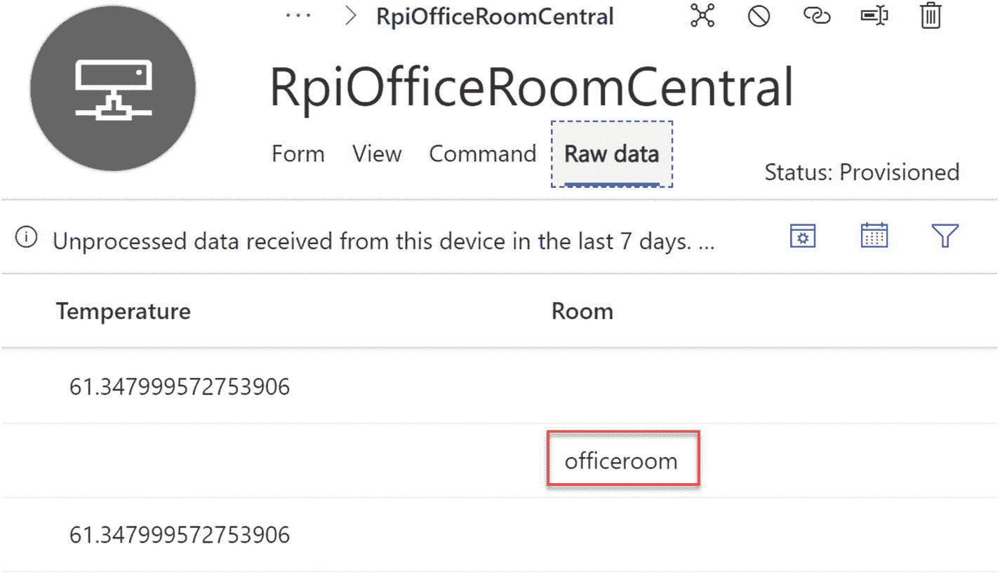

# 十、Azure 物联网中心

我们正接近这本书的结尾。在上一章中，您了解了很多关于物联网边缘的知识。在本章中，您将了解物联网中心、它是什么以及为什么需要它。如果你准备好了，让我们继续前进！

## Azure 物联网中心

对于物联网项目，一切都是关于连接事物和处理设备的数据。一旦我们得到数据，我们就把它显示在某个地方，这样我们每次都能很容易地检查它。这可以是一个使用 Angular，React JS，Vue JS，或者 ASP.NET MVC 等等的 web 应用。为了在 web 应用中获得实时更新，我们可以使用 Azure Signal R 服务。但是在本章中，我们将使用一个更简单的选项，这样我们就不必担心 web 应用了。我们将使用微软的 SaaS 产品，即 Azure IoT Central。

### 什么是 Azure IoT Central

Azure IoT Central 是微软的 SaaS 产品，可以降低开发、管理和维护企业级物联网解决方案的成本。它带有一个 Web 用户界面，允许您监控设备状况，创建规则，并轻松管理数百万台设备。有超过 30 种 Azure 服务与 Azure IoT Central 集成，这使得它非常用户友好。最终，从用户的角度来看，你需要的一切都在那里。你对建造一个感到兴奋吗？

### 物联网中心与物联网中心

虽然物联网中心构建于提供物联网中心的平台即服务之上，但两者之间存在某些差异:

*   Azure IoT Hub 是一种 PaaS 产品，可以安全地连接数百万台设备并进行扩展，而 IoT Central 是一种 SaaS 产品，可以大规模连接、管理和监控设备。我们获得了一个带有可定制用户界面的附加仪表板。我们将在接下来的章节中讨论这个 UI 的功能。

*   在 IoT Hub 中需要单独设置设备供应服务，但 IoT Central 有内置的设备供应服务。

*   物联网中心提供内置的事件中心、服务总线队列、服务总线主题和存储端点来导出数据。用户也可以使用消息路由来实现相同的功能。IoT Central 向 Azure Blob 存储、Azure 事件中心和 Azure 服务总线提供数据导出。

### 创建物联网中央应用

在 Azure 中创建一个物联网中心应用就像创建任何其他服务一样简单。转到 [`https://azure.microsoft.com/en-au/services/iot-central/`](https://azure.microsoft.com/en-au/services/iot-central/) ，点击构建解决方案按钮。这将把您重定向到 [`https://apps.azureiotcentral.com`](https://apps.azureiotcentral.com) ，在这里您可以使用您的 Microsoft 帐户登录。你应该会看到一些现成的模板可用于某些行业，如图 [10-1](#Fig1) 所示。


图 10-1

基于行业的物联网中央解决方案

让我们创建一个自定义应用。为此，只需单击创建自定义应用按钮。您也可以通过单击 Burger 菜单，然后选择 Build 菜单项来完成此操作。您应该会看到一个自定义模板，如图 [10-2](#Fig2) 所示。只要点击它。


图 10-2

定制物联网中央解决方案

您应该得到一个表单，您需要填写应用名称、定价计划、联系信息等。您可以选择免费计划，该计划将为您提供七天的免费服务。您还将有机会将您的计划转换为付费计划。

请记住，一旦试用期结束，您将无法恢复您的应用。在这种情况下，你必须创建一个新的应用，如果你选择免费以外的任何计划，你应该有一个有效的 Azure 订阅。填写完表单后，单击“创建”按钮。

现在是创建设备模板的时候了。设备模板定义连接到 Azure IoT Central 的设备的功能。点击应用设置下的设备模板菜单，如图 [10-3](#Fig3) 所示。


图 10-3

设备模板

单击+New 按钮将开始设置设备模板的过程。第一步是选择设备类型。选择物联网设备模板类型，如图 [10-4](#Fig4) 所示。


图 10-4

选择模板类型

单击 Next: Customize 按钮，并为您的设备模板取一个合适的名称。我把这个叫做`Raspberry Pi`。单击“下一步:检查”按钮，然后单击“创建”按钮。

下一步是创建一个*能力模型* *。*单击下一个屏幕上的 Custom 选项卡，因为您将从头开始构建功能模型。如果您已经有一个能力模型，您也可以导入它。在接下来的章节中，您将会看到如何导出一个功能模型。见图 [10-5](#Fig5) 。


图 10-5

创建自定义模板

现在，您可以将规范添加到新的设备模板中。为此，点击+添加接口按钮，然后选择自定义，如图 [10-6](#Fig6) 所示。


图 10-6

自定义界面

接口必须定义设备的功能。让我们从空白界面开始构建。在下一个屏幕上，我们将向我们的界面添加功能。我们设备的功能之一是它需要发送温度数据。点击+Add Capability 按钮，在表单上提供详细信息，如图 [10-7](#Fig7) 所示。


图 10-7

添加功能

设备的*属性*是一个常量值。当启动通信时，它将被发送到物联网中央应用。在这种情况下，我把我的覆盆子设备放在我的办公室。我家里只有一个办公室，可以打电话给物业`OfficeRoom`。在现实世界中，假设您的设备将发送您的汽车的位置，在这种情况下，您可以使用您的汽车号码创建属性，这是唯一的。要添加属性，再次点击+添加能力，将能力类型设置为`property`，如图 [10-8](#Fig8) 所示。


图 10-8

添加属性

该属性也可以是配置数据；例如，在我们最初的应用中，我们设置了警报的最高温度值。该值可以配置为一个属性。由于该值不是常数，属性值将被更改。这种属性称为“可写”

物联网中央应用的操作员向远程设备发送*命令*。可写属性和命令之间的唯一区别在于，可写属性仅限于单个值，而命令可以包含任意数量的输入字段。想象一下，你的设备在一辆汽车里，正在发送位置数据，物联网中央应用可以向设备发送命令，让你记得在一个位置停下来。或者它可以发送命令来拍照。如果打开请求选项，可以向命令中添加更多数据。我希望你明白了。点击+添加能力，将能力类型设置为`command`，如图 [10-9](#Fig9) 所示。


图 10-9

添加命令

完成后，单击保存按钮。添加功能后，就该创建设备可视化视图了。单击设备模板，然后选择新创建的设备模板。单击视图按钮。从给出的选项中，选择可视化设备，如图 [10-10](#Fig10) 所示。


图 10-10

可视化设备

在下一个屏幕上，选择我们之前创建的遥测功能。点击添加磁贴按钮，然后点击保存，如图 [10-11](#Fig11) 所示。


图 10-11

添加磁贴

点击视图，在右侧选择编辑设备和云数据，如图 [10-12](#Fig12) 所示。


图 10-12

编辑设备和云数据

从给定的表单中，选择您创建的属性，然后单击 Add Section 按钮。然后点击保存按钮。参见图 [10-13](#Fig13) 。


图 10-13

选择属性

完成后，您可以发布设备模板；您只能在发布设备模板后连接设备。值得一提的是，在发布之后，您只能对设备功能模型进行有限的更改。要修改接口，您必须创建一个新的接口。点击顶部的发布按钮，如图 [10-14](#Fig14) 所示。


图 10-14

发布设备模板

在发布之前，确保你没有一个没有任何功能的界面。图 [10-15](#Fig15) 是一个没有任何功能的示例界面。


图 10-15

没有功能的界面

发布过程完成后，您可以看到这些功能呈灰色显示，您将无法再对其进行编辑。您可以随时导出接口和设备模板以供将来使用。点按设备模板顶部的“导出”按钮。参见图 [10-16](#Fig16) 。


图 10-16

导出设备模板

这将使用您的设备模板名称生成一个 JSON 文件；我的情况是`Raspberry Pi.json`。以下是该文件的内容:

```cs
{
  "@id": "urn:apressIotCentral:RaspberryPi_6th:1",
  "@type": "CapabilityModel",
  "implements": [
    {
      "@id": "urn:apressIotCentral:RaspberryPi_6th:t2nevnx5f:1",
      "@type": "InterfaceInstance",
      "displayName": {
        "en": "Interface"
      },
      "name": "RaspberryPi_7fp",
      "schema": {
        "@id": "urn:apressIotCentral:RaspberryPi_7fp:1",
        "@type": "Interface",
        "displayName": {
          "en": "Interface"
        },
        "contents": [
          {
            "@id": "urn:apressIotCentral:RaspberryPi_7fp:Temperature:1",
            "@type": [
              "Telemetry",
              "SemanticType/Temperature"
            ],
            "description": {
              "en": "Temperature data"
            },
            "displayName": {
              "en": "Temperature"
            },
            "name": "Temperature",
            "schema": "double",
            "unit": "celsius"
          },
          {
            "@id": "urn:apressIotCentral:RaspberryPi_7fp:Room:1",

            "@type": "Property",
            "displayName": {
              "en": "Room"
            },
            "name": "Room",
            "writable": true,
            "schema": "string"
          },
          {
            "@id": "urn:apressIotCentral:RaspberryPi_7fp:TakeThePicture:1",
            "@type": "Command",
            "commandType": "synchronous",
            "durable": false,
            "request": {
              "@id": "urn:apressIotCentral:RaspberryPi_7fp:TakeThePicture:ImageType:1",
              "@type": "SchemaField",
              "displayName": {
                "en": "Image type"
              },
              "name": "ImageType",
              "schema": "string"
            },
            "displayName": {
              "en": "Take the picture"
            },
            "name": "TakeThePicture"
          }
        ]
      }
    }
  ],
  "displayName": {
    "en": "Raspberry Pi"
  },
  "@context": [
    "http://azureiot.com/v1/contexts/IoTModel.json"
  ]
}

```

### 创建设备

由于您已经创建了一个设备模板，现在是时候创建一个向 IoT Central 发送遥测数据的真实设备了。单击左侧菜单中的设备，然后单击您刚刚创建的设备模板。你现在应该看到一个+New 按钮，如图 [10-17](#Fig17) 所示。点击它。


图 10-17

创建一个设备

将会给你一张表格，让你输入设备的详细信息。确保模板类型与您最近创建的模板类型相同。设备名称只是一个唯一的名称；您可以在这里进行选择。设备 ID 是用于连接设备的唯一标识符。因为我们有一个将发送遥测数据的设备，所以对模拟设备问题选择“否”。点击创建按钮，如图 [10-18](#Fig18) 所示。


图 10-18

设备属性

完成后，将创建一个具有注册状态的新设备。

### 获取设备连接密钥

我们已经创建了一个设备，所以让我们获取连接密钥。单击右上角菜单上的连接按钮。这将打开一个设备连接弹出窗口。记下这些值，并记住将连接方法设置为共享访问签名(SAS)，如图 [10-19](#Fig19) 所示。


图 10-19

设备连接属性

### 创建向物联网中心发送遥测数据的设备应用

我们将创建一个设备应用，将遥测数据发送到物联网中心。让我们创建一个名为 [`raspberrypi.net`](http://raspberrypi.net) `.core.central`的新文件夹，并在文件夹中运行下面的命令。它将创建一个包含所有必需包的. NET 核心控制台应用:

```cs
dotnet new console --langVersion=latest && dotnet add package Iot.Device.Bindings && dotnet add package Microsoft.Azure.Devices.Client && dotnet add package Microsoft.Azure.Devices.Provisioning.Transport.Mqtt && dotnet add package Microsoft.Azure.Devices.Shared && dotnet add package Newtonsoft.Json && dotnet add package Microsoft.Azure.Devices.Provisioning.Transport.Http

```

创建项目后，用 VSCode 打开它，并用以下变量创建一个`.env`文件。

```cs
IDSCOPE="<Replace with your IoT Central ID Scope>"
CENTRAL_DEVICE_ID="<Replace with your IoT Central Devic ID>"
PRIMARY_KEY="<Replace with your IoT Central Primary key>"

```

不要忘记根据您收到的连接属性更新这些值。完成后，就可以开始写程序了。打开`Program.cs`文件，添加以下`using`语句:

```cs
using System;
using System.Text;
using System.Threading;
using System.Threading.Tasks;
using Iot.Device.CpuTemperature;
using Microsoft.Azure.Devices.Client;
using Microsoft.Azure.Devices.Provisioning.Client;
using Microsoft.Azure.Devices.Provisioning.Client.Transport;
using Microsoft.Azure.Devices.Shared;
using Newtonsoft.Json;

```

现在让我们从`.env`文件中获取所需的值，并添加一些其他变量。

```cs
        private static string idScope = Environment.GetEnvironmentVariable("ID_SCOPE");
        private static string centralDeviceId = Environment.GetEnvironmentVariable("CENTRAL_DEVICE_ID");
        private static string primaryKey = Environment.GetEnvironmentVariable("PRIMARY_KEY");
        private const string endPoint = "global.azure-devices-provisioning.net";
        private static CpuTemperature _temperature = new CpuTemperature();
        private static int _messageId = 0;

```

在我们开始编写`Main`程序之前，让我们编写一个可以注册设备的程序:

```cs
        private static async Task<DeviceRegistrationResult> RegisterDeviceAsync(SecurityProviderSymmetricKey security)
        {
            using var transportHandler = new ProvisioningTransportHandlerMqtt(TransportFallbackType.TcpOnly);
            var provDeviceClient = ProvisioningDeviceClient.Create(endPoint, idScope, security, transportHandler);
            return await provDeviceClient.RegisterAsync();
        }

```

该方法将使用设备供应服务注册当前设备，并将其分配给物联网集线器。如前所述，Azure IoT Central 在后台使用 IoT Hub。我们还需要一种可以向物联网中心发送遥测数据的方法。让我们编写这个方法:

```cs
        private static async Task SendMessage(DeviceClient deviceClient, double temperature)
        {
            var dataToSend = new Telemetry() { MessageId = ++_messageId, Temperature = temperature };
            var stringToSend = JsonConvert.SerializeObject(dataToSend);
            var messageToSend = new Message(Encoding.UTF8.GetBytes(stringToSend));
            await deviceClient.SendEventAsync(messageToSend).ConfigureAwait(false);
        }

```

这个方法对你来说可能很熟悉，因为它看起来和我们在最初几章中创建的方法一样。我们使用一个属性类来序列化数据。请记住，该属性类的名称应该是`Telemetry`，否则，由于型号名称不同，您将在物联网中央仪表盘中看到一些报告错误，因此该数据将属于未建模数据。

```cs
    class Telemetry
    {
        [JsonPropertyAttribute(PropertyName = "Temperature")]
        public double Temperature { get; set; } = 0;
        [JsonPropertyAttribute(PropertyName = "MessageId")]
        public int MessageId { get; set; } = 0;
    }

```

现在让我们编写`Main`方法，因为我们已经创建了所有的支持方法。

```cs
        static async Task Main(string[] args)
        {
            try
            {
                using var security = new SecurityProviderSymmetricKey(centralDeviceId, primaryKey, null);
                var deviceRegistrationResult = await RegisterDeviceAsync(security);
                if (deviceRegistrationResult.Status != ProvisioningRegistrationStatusType.Assigned) return;
                var auth = new DeviceAuthenticationWithRegistrySymmetricKey(deviceRegistrationResult.DeviceId,
                (security as SecurityProviderSymmetricKey).GetPrimaryKey());
                using var _deviceClient = DeviceClient.Create(deviceRegistrationResult.AssignedHub, auth, TransportType.Mqtt);
                while (true)
                {
                    if (_temperature.IsAvailable)
                    {
                        await SendMessage(_deviceClient, _temperature.Temperature.Celsius);
                    }
                    Thread.Sleep(3000);
                }

            }
            catch (System.Exception ex)
            {
                Console.WriteLine($"Hm, that's an error: {ex}");
            }
        }

```

正如您在代码中看到的，我们从设备注册结果中获得了`AssignedHub`。一旦我们得到它，我们就把遥测数据发送到中枢，就这么简单。现在，我们要做的就是在 Raspberry Pi 中运行我们的应用。为此，我们需要更新`.vscode`文件中的`launch.json`和`task.json`文件。

`Launch.json`文件:

```cs
{
    "version": "0.2.0",
    "configurations": [
        {
            "name": "Debug Publish, Launch, and Attach Debugger",
            "type": "coreclr",
            "request": "launch",
            "envFile": "${workspaceFolder}/.env",
            "preLaunchTask": "DebugPublish",
            "program": "~/${workspaceFolderBasename}/${workspaceFolderBasename}",
            "cwd": "~/${workspaceFolderBasename}",
            "stopAtEntry": false,
            "console": "internalConsole",
            "pipeTransport": {
                "pipeCwd": "${workspaceRoot}",
                "pipeProgram": "/usr/bin/ssh",
                "pipeArgs": [
                    "pi@192.168.0.80"
                ],
                "debuggerPath": "~/vsdbg/vsdbg"
            }

        },
        {
            "name": "Release Publish, Launch, and Attach Debugger",
            "type": "coreclr",
            "request": "launch",
            "preLaunchTask": "ReleasePublish",
            "program": "~/${workspaceFolderBasename}/${workspaceFolderBasename}",
            "cwd": "~/${workspaceFolderBasename}",
            "stopAtEntry": false,
            "console": "internalConsole",
            "pipeTransport": {
                "pipeCwd": "${workspaceRoot}",
                "pipeProgram": "/usr/bin/ssh",
                "pipeArgs": [
                    "pi@192.168.0.80"
                ],
                "debuggerPath": "~/vsdbg/vsdbg"
            }
        }
    ]
}

```

如您所见，我们在`launch.json`文件中使用了两个任务。让我们将它们添加到`task.json`文件中。

```cs
{
    "version": "2.0.0",
    "tasks": [
        {
            "label": "DebugPublish",
            "command": "sh",
            "type": "shell",
            "problemMatcher": "$msCompile",
            "args": [
                "-c",
                "\"dotnet publish -r linux-arm -c Debug -o ./bin/linux-arm/publish ./${workspaceFolderBasename}.csproj && rsync -rvuz ./bin/linux-arm/publish/ pi@192.168.0.80:~/${workspaceFolderBasename}\"",
            ]
        },
        {
            "label": "ReleasePublish",
            "command": "sh",
            "type": "shell",
            "problemMatcher": "$msCompile",
            "args": [
                "-c",
                "\"dotnet publish -r linux-arm -c Release -o ./bin/linux-arm/publish ./${workspaceFolderBasename}.csproj && rsync -rvuz ./bin/linux-arm/publish/ pi@192.168.0.80:~/${workspaceFolderBasename}\"",
            ]
        }
    ]
}

```

在 VSCode 中打开您的解决方案。按 F1 键，键入并选择 Remote-WSL:在 WSL 中重新打开文件夹。现在你所要做的就是按 F5 键，然后等着看奇迹。如果您在控制台中没有看到任何错误，那么您就可以开始了。恭喜你。现在转到您的物联网中心应用，并在那里找到遥测数据。单击您创建的设备。您现在应该看到设备状态为“已配置”，如图 [10-20](#Fig20) 所示。


图 10-20

设备已配置

从网格中单击设备名称，然后转到视图选项卡。你可以在那里的图表中看到遥测数据，如图 [10-21](#Fig21) 所示。


图 10-21

图表中的遥测数据

如果单击“原始数据”选项卡，您还应该能够看到原始数据。

### 测试属性和命令

还记得我们在创建设备模板时创建了一个可写属性和一个命令吗？现在，我们将继续努力。首先要为我们的可写属性`Room`创建一个处理程序。请记住，这只是一个虚拟场景，您可以想到任何实时场景，并以同样的方式实现它们。将以下代码添加到`Main`方法中。

```cs
_deviceClient.SetDesiredPropertyUpdateCallbackAsync(HandleSettingChanged, null).GetAwaiter().GetResult();
                     Console.WriteLine("Done");

```

您可能已经猜到了，我们现在需要创建处理程序。

```cs
        static async Task HandleSettingChanged(TwinCollection desiredProperties, object userContext)
        {
            var setting = "Room";
            if (desiredProperties.Contains(setting))
            {
                var roomChange = reportedProperties[setting] = desiredProperties[setting];
            }
            await _deviceClient.UpdateReportedPropertiesAsync(reportedProperties);
        }

```

我们还做了一些其他的改变。

*   为`DeviceClient`添加了一个私有变量

*   使用新创建的设备客户端变量

*   更新了`SendMessage`方法

最后，您的`Program.cs`文件应该是这样的:

```cs
using System;
using System.Text;
using System.Threading;
using System.Threading.Tasks;
using Iot.Device.CpuTemperature;
using Microsoft.Azure.Devices.Client;
using Microsoft.Azure.Devices.Provisioning.Client;
using Microsoft.Azure.Devices.Provisioning.Client.Transport;
using Microsoft.Azure.Devices.Shared;
using Newtonsoft.Json;

namespace raspberrypi.net.core.central
{
    public class Program
    {
        private static string idScope = Environment.GetEnvironmentVariable("ID_SCOPE");
        private static string centralDeviceId = Environment.GetEnvironmentVariable("CENTRAL_DEVICE_ID");
        private static string primaryKey = Environment.GetEnvironmentVariable("PRIMARY_KEY");
        private const string endPoint = "global.azure-devices-provisioning.net";
        private static CpuTemperature _temperature = new CpuTemperature();
        private static TwinCollection reportedProperties = new TwinCollection();
        private static int _messageId = 0;
        private static DeviceClient _deviceClient;
        static async Task Main(string[] args)
        {
            try

            {
                using var security = new SecurityProviderSymmetricKey(centralDeviceId, primaryKey, null);
                var deviceRegistrationResult = await RegisterDeviceAsync(security);
                if (deviceRegistrationResult.Status != ProvisioningRegistrationStatusType.Assigned) return;
                var auth = new DeviceAuthenticationWithRegistrySymmetricKey(deviceRegistrationResult.DeviceId,
                (security as SecurityProviderSymmetricKey).GetPrimaryKey());
                _deviceClient = DeviceClient.Create(deviceRegistrationResult.AssignedHub, auth, TransportType.Mqtt);
                _deviceClient.SetDesiredPropertyUpdateCallbackAsync(HandleSettingChanged, null).GetAwaiter().GetResult();
                     Console.WriteLine("Done");

                await SendMessage(_temperature.Temperature.Celsius);

            }

            catch (System.Exception ex)
            {
                Console.WriteLine($"Hm, that's an error: {ex}");
            }
        }

        private static async Task SendMessage(double temperature)
        {
            while (true)
            {
                if (_temperature.IsAvailable)
                {
                    var dataToSend = new Telemetry() { MessageId = ++_messageId, Temperature = temperature };
                    var stringToSend = JsonConvert.SerializeObject(dataToSend);
                    var messageToSend = new Message(Encoding.UTF8.GetBytes(stringToSend));
                    await _deviceClient.SendEventAsync(messageToSend).ConfigureAwait(false);
                }
                Thread.Sleep(3000);
            }
        }

        private static async Task<DeviceRegistrationResult> RegisterDeviceAsync(SecurityProviderSymmetricKey security)
        {
            using var transportHandler = new ProvisioningTransportHandlerMqtt(TransportFallbackType.TcpOnly);
            var provDeviceClient = ProvisioningDeviceClient.Create(endPoint, idScope, security, transportHandler);
            return await provDeviceClient.RegisterAsync();
        }

        static async Task HandleSettingChanged(TwinCollection desiredProperties, object userContext)
        {
            var setting = "Room";
            if (desiredProperties.Contains(setting))
            {
                var roomChange = reportedProperties[setting] = desiredProperties[setting];
            }
            await _deviceClient.UpdateReportedPropertiesAsync(reportedProperties);
        }
    }

    class Telemetry
    {
        [JsonPropertyAttribute(PropertyName = "Temperature")]
        public double Temperature { get; set; } = 0;
        [JsonPropertyAttribute(PropertyName = "MessageId")]
        public int MessageId { get; set; } = 0;
    }
}

```

现在运行您的应用，转到物联网中央设备部分。在“设备”页面上，转到“表单”选项卡，在给定的文本框中键入任何值。然后点击保存按钮。如果您已经在 handler 方法中启用了调试器，您现在应该会看到这些值，如图 [10-22](#Fig22) 所示。


图 10-22

可写属性值

返回设备页面上的“原始数据”选项卡；该属性应该有一个条目，如图 [10-23](#Fig23) 所示。



图 10-23

可写属性记录

您还应该在表单选项卡上看到一条消息，表明属性值已被接受，如图 [10-24](#Fig24) 所示。


图 10-24

表单选项卡消息

现在让我们执行`TakeThePicture`命令。和以前一样，这只是一个虚拟命令，向您展示流程。我们需要一个直接的方法处理程序来做到这一点。在`Main`方法中添加以下代码，就在发送遥测数据的方法之前。

```cs
_deviceClient.SetMethodHandlerAsync("TakeThePicture", CommandTakeThePicture, null).Wait();

```

和处理程序方法。

```cs
        private static Task<MethodResponse> CommandTakeThePicture(MethodRequest methodRequest, object userContext)
        {
            // Get the data from the payload
            var payload = Encoding.UTF8.GetString(methodRequest.Data);
            Console.WriteLine(payload);
            // Code to take the picture
            // Save in the given format
            // Return the image URL
            // Imagine that your device is setup with a camera
            //Acknowledge the direct method call
            string result = "{\"result\": \"Executed : " + methodRequest.Name + "\"}";
            return Task.FromResult(new MethodResponse(Encoding.UTF8.GetBytes(result), 200));
        }

```

现在返回到设备页面上的命令选项卡，并在文本框中输入值 PNG。单击运行按钮。您还可以在直接方法上放置一个调试器，以便您可以调试这些值。参见图 [10-25](#Fig25) 。


图 10-25

调试命令

您还可以在门户中查看命令的运行历史。进入命令页签，点击命令历史链接，如图 [10-26](#Fig26) 所示。


图 10-26

命令历史链接

哇，你刚刚遥控了你的设备。那不是很酷吗？

## 摘要

我喜欢写这一章，因为它包含了大量的实践工作。我希望你也有同样的感觉。在本章中，您学习了以下主题:

*   什么是 Azure IoT Central？

*   Azure IoT Hub 和 Azure IoT Central 有什么区别？

*   如何创建 Azure 物联网中央应用？

*   如何在 Azure IoT Central 中创建设备？

*   如何创建一个. NET 核心应用来向 Azure IoT Central 发送遥测数据？

*   如何从 Azure IoT Central 远程处理设备？