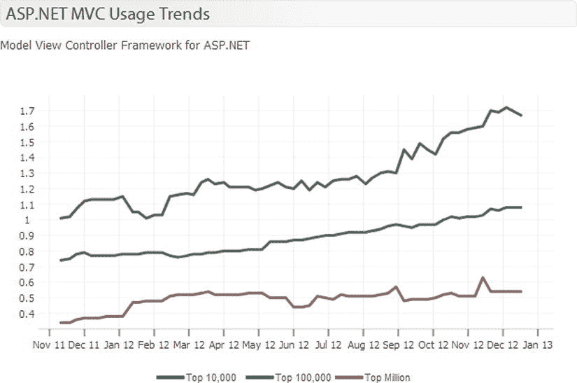

# 一、现代网络应用的需求

在世界各地，人们花在电脑上的时间越来越少，花在平板电脑和智能手机上的时间越来越多。这一趋势极大地改变了我们收集、分享和处理信息的方式。作为一名使用微软技术的 web 开发人员，您需要准确理解这对您的应用意味着什么。

现代网络应用是为后 PC 时代的需求而设计的。它可以部署到云基础架构，对不可靠的网络条件具有弹性，可从任何设备(在任何地方)访问，并提供美观且响应迅速的用户体验。

虽然现代 web 应用的基本原理保持不变，但最终用户消费和体验内容的方式已经发生了很大的变化。现代的 web 应用仍然使用 HTTP 和 HTTPS 来发送请求和接收响应，大多数 web 应用仍然使用 HTML 来表示。另一方面，移动设备、平板电脑和混合电脑(如微软 Surface Pro)的爆炸式增长使得触摸屏几乎和鼠标和键盘一样无处不在。社交媒体的流行催生了用户生成内容的大规模扩张，尖端的统计算法加上几乎无限的计算能力使这些内容变得相关。HTML5 和现代网络浏览器，如 Google Chrome 和 Internet Explorer 10，允许开发人员创建动态的、身临其境的用户界面，在复杂性和响应性方面与本地应用相媲美。

下面列出了现代 web 应用中越来越常见的特性和特征，以及本书中帮助您理解如何实现这些特性的参考方法。

*   *跨浏览器兼容性* : 应用体验在所有现代网络浏览器中保持不变，包括 Google Chrome、Mozilla Firefox、Internet Explorer 9 和 10、Safari 和 Opera。这本书里的所有食谱都是为跨浏览器工作而设计和测试的。
*   自适应设计:应用自动适应多种屏幕分辨率，从巨大的 30 英寸显示器到小巧的 3.4 英寸手机。这项技术在配方 11-1 中有所介绍。
*   *自然用户界面*:应用接受来自自然用户界面(NUI) 的输入，如触摸、语音、NFC、摄像机、GPS 和其他传感器。满足这一要求意味着你不仅要有合适的软件，还要有硬件来测试应用在这些设备上的运行情况，如配方 3-1 所述。
*   *社交网络整合* : 该应用与社交网络无缝交互。菜谱 12-1 和 12-2 展示了 Visual Studio 如何轻松地将您的网站与脸书集成在一起。
*   *云就绪*:应用可以使用基于云的基础设施并按需扩展，在需要时添加新的服务器，在流量下降时缩小规模。第 6 章描述了利用这些能力设计应用的架构技术。第 12 章描述了如何使用 Visual Studio 创建一个可以部署到 Windows Azure 的应用。
*   *弹性* : 应用可以适应具有挑战性的网络条件，在某些情况下，可以在断开连接的状态下工作。应用被设计为容许一个或多个子系统的故障，并且仍然以有限但可接受的容量运行。第 6 章讲述了如何设计系统来满足这个需求。Recipe 12-5 演示了如何使用 Windows Azure APIs 上的一些内置功能，在使用 Azure BLOB 存储的 ASP.NET MVC 4 应用中实现弹性文件上传。
*   *可扩展*:该应用可通过 RESTful APIs 进行扩展，其功能可由第三方开发者进行扩充。[第 11 章](11.html)展示了如何使用 ASP.NET Web API 来设计 RESTful 服务，以及如何使用 jQuery 和 Knockout 来消费它们。
*   *可靠*:应用是可靠的，支持部署前的多级自动化和手动测试。本书中的许多食谱不仅描述了如何使用 MVC 开发解决方案，还描述了如何测试它们。第九章完全致力于测试。
*   *可维护性*:应用易于维护，并且可以频繁无缝升级，服务中断最小。本书中的几个食谱考虑到了这一点。诀窍 1-5 展示了 Microsoft Web Deploy 如何简化您的部署过程。食谱 7-9 和 10-9 解释了如何使用 ASP.NET MVC 的区域特性来组织你的项目。
*   RESTful(RESTful):应用建立在已建立的标准和协议之上，利用网络优化设备、负载平衡器和监控包。第 11 章展示了使用 ASP.NET Web API 创建 RESTful web 服务。
*   *安全*:应用被设计成使用分层的对抗措施系统来保护自己免受不断发展的安全威胁。如果发生违规，只有受损的子系统会受到影响；机密和个人身份信息不会暴露。一些方法讨论了安全最佳实践，包括方法 3-11，它向您展示了如何使用 IIS 应用标识功能，以及方法 10-2 和 10-3，它演示了如何在创建自定义 HTML 助手时防止跨站点脚本攻击。
*   *可伸缩的*:应用应该能够支持成千上万的并发用户。配方 6-7 解释了如何为互联网规模设计一个 ASP.NET MVC 4 应用。第 8 章有几个例子演示如何使用。NET 基于任务的异步编程来创建高度可伸缩的应用。

虽然不是所有的应用都会实现这里列出的所有功能，但是随着框架的发展，这些功能变得更容易创建，消费者将会开始期待它们，就像汽车购买者期待卫星导航系统成为大多数新车的一个选项一样。

1-1.在微软平台上开发现代网络应用

微软 ASP.NET MVC 框架 4 是一个坚实的 web 应用框架，拥有不断增长的开发人员社区。框架及其附带的工具都在积极地开发和改进。如果你读过《名利场》2012 年 8 月刊中臭名昭著的反微软文章“微软失去的十年”，或者其他类似的文章，你可能会有这样的印象:微软有大麻烦了。虽然这篇文章不是不真实的，但它没有讲述事情的全部。

与一些媒体评论员暗示的相反，微软实际上处于一个相当好的位置。像 Kinect、Windows Phone 8、Windows 8、Skype、 Direct X 11、和 Windows Azure 这样的产品不仅与时俱进，而且正在开辟新的领域。微软可能是唯一一家拥有足够技术深度的供应商，可以从消费者领域(使用 Xbox 等技术)开始构建生态系统，并一直延伸到企业应用和服务器。

Windows 7 是历史上销售最快的桌面操作系统，Windows 8 在头几个月就卖出了 6000 多万份。Xbox 版 Kinect 保持着销售最快的消费产品的世界纪录，一年后，其销量超过任天堂的全新游戏机 100 万台。

凭借微软 Surface 和其他 Windows 8 平板电脑，微软为 iPad 和基于安卓系统的平板电脑创造了一个真正的挑战者。在移动领域，尽管 Windows Phone 7 销量不佳，但 Windows Phone 8 的表现好于预期，诺基亚在 2012 年假期销售了超过 440 万部 Lumia 智能手机。Windows 桌面操作系统仍然享有超过 90%的市场份额，即使有新的竞争者的冲击。Microsoft Office 仍然是全球绝大多数企业的标准生产力套件。

微软的 ASP.NET 是最流行的商业 web 应用框架，也是仅次于 PHP 的第二大流行的 web 应用框架。根据 BuiltWith ( `http://trends.builtwith.com/framework/ASP.NET`)的数据，超过 2000 万个公共网站使用 ASP.NET。

不幸的是，这不全是好消息。在过去的几年里，使用 ASP.NET 和 IIS 的网站数量已经慢慢地向南漂移。基于 Python 的 web 框架 Django CSRF 和 Ruby on Rails 等框架正在慢慢蚕食微软的市场份额。

ASP.NET 是一种垂死的技术吗？

ASP.NET 不是一种垂死的技术，而是一种正在经历变革的技术。在 MVC 框架出现之前，ASP.NET Web Forms 是 ASP.NET 的全部，现在不可否认的衰落了。虽然微软在继续支持和改进 WebForm，但趋势显然是朝着 ASP.NET MVC 框架发展。在 ASP.NET 平台整体下滑的同时，ASP.NET MVC 框架的使用增长了 110%。这一趋势中增长最快的是前 10，000 个最受欢迎的网站。

[图 1-1](#Fig1) 显示了一张由 T2 built with 制作的图表，描绘了一年内使用 ASP.NET MVC 的网站数量。它是基于 9000 多万个网站的统计数据。该图表有三个线形图，每个代表一组按受欢迎程度排名分组的网站。底线显示了排名前 100 万的网站的百分比增长。接下来的两行分别显示了前 100，000 个站点和前 10，000 个站点。

[图 1-1](#_Fig1) 。ASP.NETMVC 使用情况统计(来源:BuiltWith.com)

在 ASP.NET 4.5 和 MVC 框架 4 中，微软合并了它在 web 服务器技术和开发工具方面的创新，并吸收了从许多竞争的 web 开发技术中学到的经验。从 Ruby on Rails 开始，他们采用了页面路由、脚手架和“约定胜于配置”的哲学。

微软通过引入 Web API 回答了 Sinatra，它为创建 RESTful web 服务提供了一个简单的框架。Node.js 是一个相对较新的 web 开发框架，基于谷歌开源的 V8 JavaScript 运行时引擎，该引擎与谷歌 Chrome 浏览器内置的引擎相同。它已经在网站上取得了重大进展，因为它的事件驱动、非阻塞 I/O 模型使得设计高度可伸缩的应用变得更加容易。微软对 Node.js 的回应是在核心部分进行了一系列新的增强。NET 框架和新的 C# 语言特性，这些特性使得用 C# 进行异步编程几乎和同步编程一样简单。

当你把微软在 ASP.NET 和美国取得的进步结合起来。NET Framework 及其新的前端开发工具集，包括对 HTML5 的拥抱和对第三方开源 JavaScript 框架的包含(Kinect API、WinRT、XNA Studio 和 Expression Blend】、、，你开始看到一幅极具竞争力的现代开发栈的画面。

对微软网络技术的两个常见批评是，一切都是封闭的黑盒系统，以及 Visual Studio 太贵。这与它所竞争的平台形成了鲜明的对比，在这些平台上，大多数工具和框架都是开源的，开发工具也是免费的。

微软对这些批评的回应是在 CodePlex 上向社区开放 MVC 框架源代码，并扩展免费版 Visual Studio 的功能。微软还为学生、创业公司和小型企业创建了几个计划，为 Visual Studio、Windows Server 和 SQL Server 的商业版本授予免费许可证，并在某些情况下提供免费托管。

当你把所有这些放在一起时，微软平台和 ASP.NET MVC 框架为开发现代 web 应用提供了一个很好的基础。

1-2.通过食谱学习

不像大多数编程书籍都是被设计成一页一页按顺序阅读的，像这样的食谱可以让你按你希望的任何顺序阅读任何你需要的东西。每个食谱都是完全独立的，在大多数情况下，并不假设你已经阅读了书中的其他材料。偶尔，配方会相互引用，以尽量减少不必要的内容重复，但大多数情况下，引用的内容对于完成所描述的任务并不重要。

每个食谱分为三个部分。第一节是问题；这是你所面临的挑战，比如如何使用实体框架代码优先的方法(方法 7-6)创建一个 MVC 模型。第二部分，解决方案，在概念层面提供了解决方案的简要概述；通常限于一两段。讨论的大部分内容，包括源代码，将在“它是如何工作的”一节中介绍。

1-3.这本书的大纲

在前几章中，许多诀窍都集中在 ASP.NET 开发的基础上，ASP.NET MVC 架构，以及如何充分利用 Visual Studio。本书的其余部分讨论通过编写代码解决的需求。

[第二章](02.html):了解 ASP.NET MVC

在第 2 章中，你将找到帮助你理解微软开发生态系统的基础和 MVC 框架背后的基本概念的方法。菜谱讨论 MVC 模式(菜谱 2-3)；MVC、MVVM 和 MVP 之间的区别(配方 2-4)；以及 MVC 框架的架构(诀窍 2-6)。

详细描述了 MVC 框架的每个主要组件，包括模型(方法 2-7)、控制器和动作(方法 2-8)、页面路由(方法 2-9)和视图引擎(方法 2-10)。

配方 2-12 是 Razor 引擎新手的必读书目。它通过例子展示了每个 Razor 语法元素。在您开始开发时，它可以作为一个方便的备忘单。

本章的最后一个方法演示了如何安装另一个名为 Spark 的第三方视图引擎。

第三章:设置你的环境

[第 3 章](03.html)是一组解决设置您的开发环境的方法，包括选择要安装的 Windows OS 版本(方法 3-2)，设置用于开发的虚拟机(方法 3-5)，以及安装 Visual Studio 2012(方法 3-7)。

[第四章](04.html) : Visual Studio 2012 概述

第 4 章中的食谱详细介绍了 Visual Studio IDE。每种方法都有不同的功能，例如页面检查器(方法 4-8)、调试器(方法 4-9 和 4-10)和扩展管理器(方法 4-13)。配方 4-14 包含了 Visual Studio 键盘快捷键的完整列表。

[第 5 章](05.html):充分利用内置模板

ASP.NET MVCFramework 4 附带了许多丰富的模板——每个模板都包含许多文件和引用的程序集。第 5 章中的方法通过查看每个程序集和包含的 NuGet 包来剖析每个模板，并通过描述模板的作用以及如何使用它们来帮助实现您的解决方案。

第 6 章:用 ASP.NET MVC 设计应用

在第 6 章、中，菜谱从代码上退一步，从解决方案架构师的角度来看如何应用 MVC 框架。配方 6-1 描述了架构师的角色，以及为什么它对大型项目很重要。食谱 6-2 着眼于你是否应该建立一个新的解决方案或购买一个打包产品的决定。诀窍 6-3 讨论了部署到私有数据中心或公共云的决策。本章中的其他方法着眼于不同的场景，并描述了每个场景的参考架构。

[第七章](07.html):方案设计

本章着眼于为真实世界的部署配置 ASP.NET 成员资格提供者(方法 7-10)和设计一个具有实体框架的模型，以及提高应用启动性能(方法 7-7)，和将你的项目组织成区域(方法 7-9)。

Recipe 7-4 介绍了构建使用 Oracle 数据提供者实体框架的项目所需的内容，并演示了如何设置您的开发环境以连接到 Oracle 数据库。菜谱 7-6 展示了如何首先使用实体框架代码从 C# 类生成数据库。配方 7-3 显示了如何从 SQL Server 数据库创建实体模型。配方 7-5 显示了模型优先的方法。

第八章:使用 ASP.NET MVC 的异步编程

[第 8 章](08.html)带深入了解 ASP.NET MVC 的异步编程，以及微软互联网信息服务器(IIS) 7 和 8 是如何处理多线程的。与。NET 4.5，微软已经大大简化了异步编程。不幸的是，如果没有对这项技术的工作原理有一个明确的理解，使用它可能会导致难以诊断和修复的问题。这一章中的食谱给了你立即开始编程所需要的一切，它们还教授了该技术的架构、权衡和好处，以便你能更好地应用它。

菜谱 8-1 展示了如何使用基于任务的异步风格和`async`和`await`关键字创建一个异步动作。

菜谱 8-3 演示了如何从 MVC 控制器动作中异步消费 WCF 服务。菜谱 8-5 在幕后帮助你理解使用`async`和`await`关键字时 C# 编译器生成的代码。

本章的最后一个方法着眼于如何使用 IIS 中内置的报告功能来解决性能问题。它还通过比较多个性能测试的结果来查看负载下同步和异步操作之间的差异。

第 9 章:用 ASP.NET MVC 4 进行测试驱动开发

第 9 章是一个的集合，包含八个专用于单元测试的配方。菜谱 9-1 概述了如何创建一个测试策略，以及它如何能提高你的应用的质量。方法 9-2 着眼于使用 MS Test 为控制器动作创建单元测试。菜谱 9-3 演示了如何使用测试优先的方法构建 ASP.NET MVC 应用，并展示了如何使用 Visual Studio 内置的工具修改应用的可测试性。

食谱 9-6 和 9-7 讨论了 NUnit 单元测试框架，并演示了如何将它集成到 Visual Studio 中来测试 ASP.NET MVC 应用。方法 9-8 演示了使用 Moq 库创建一个模拟库。

第 10 章:从 WebForm 到 ASP.NET MVC

在第 10 章中，配方解决了日常任务，例如创建允许排序、过滤和分页的数据网格，并演示了如何使用 ASP.NET WebForm 完成这项技术，以及如何将 WebForm 代码转换成功能等同的 ASP.NET MVC 代码。本章包含数据列表(配方 10-1)、网格视图(配方 10-3 和 10-4)、主/详细视图(配方 10-5)和自定义验证(配方 10-6)的配方。

配方 10-7 是罗塞塔石碑，展示了 WebForm 母版页和 Razor 布局之间的差异。配方 10-8 描述了在 ASP.NET MVC 中创建向导的两种技术。

菜谱 10-9 展示了如何将 ASP.NET MVC 添加到现有的 Web Forms 项目中，以及如何修改 Visual Studio 项目文件以允许您访问项目中的 MVC 工具。

第 11 章:使用 jQuery、Knockout 和 Web API 创建现代用户体验

在第十一章、、、中，你卷起袖子编写客户端代码，与用 ASP.NET web API 构建的 Web 服务进行交互。菜谱显示了具有媒体查询的自适应呈现(菜谱 11-1)、用于分页和排序的客户端解决方案(菜谱 11-2)、具有敲除的双向数据绑定(菜谱 11-3)以及如何使用 Fiddler 2 调试 Web API(菜谱 11-5)。

第 12 章:移动、社交和云技术

在[第 12 章](12.html)中，方法涵盖了使用脸书(方法 12-1 和 12-2)，使用 Windows Azure(方法 12-3 到 12-6)，以及使用 jQuery Mobile 创建和测试移动 web 应用(方法 12-7 到 12-9)。

菜谱 12-2 展示了如何使用 ASP.NET 秋季更新中部署的新模板，该模板在 2012 年建筑大会上首次展示，用于创建脸书画布页面。

1-4.寻找你需要的食谱

如果像我们中的许多人一样，你有一份时间紧迫的白天工作，你的配偶想让你换尿布和倒垃圾，你并不总是有时间从头到尾读完一本书。你想要符合你当前需求的食谱。

这本书给了你几种找到你要找的东西的方法。目录列出了所有的食谱，索引可以让你找到特定主题的信息。如果你是一个完全的初学者，或者如果你是一个经验丰富的 WebForm 开发人员，这两者都不能告诉你应该看什么或者你需要什么。以下部分提供了一个按一般类别划分的食谱列表，这样你就可以找到最符合你需求的了。

推荐给 Web 开发新手的食谱

以下食谱最适合刚接触 web 开发的人，或者有一些 web 开发经验但不熟悉微软平台上的 web 开发的人。

*   2-1.了解微软开发生态系统
*   2-3.理解 MVC 模式
*   2-4.理解 MVC、MVVM 和 MVP 之间的区别
*   2-5.在 MVC 和 WebForm 之间做出选择
*   2-6.理解 ASP.NET MVC 框架架构
*   2-9.了解页面路由
*   2-8.了解控制器和动作
*   2-10.了解视图引擎
*   2-12.理解 Razor 语法
*   3-7.安装 Visual Studio 2012
*   3-8.为 Visual Studio 2010 安装 Visual Studio MVC 4 附加模块
*   3-9.安装 IIS
*   4-1.了解 Visual Studio
*   4-8.使用页面检查器排除 CSS 布局错误
*   4-10.了解 Visual Studio 的调试窗口
*   4-18.使用扩展管理器
*   5-1.选择 ASP.NET MVC 4 项目模板

推荐给有经验的 ASP.NET WebForm 开发人员的食谱

下面的食谱对那些希望学习 MVC 的有经验的 Microsoft Web Forms 开发人员来说是最有用的。对于希望将 WebForm 解决方案迁移到 MVC 框架的人来说，这些特别有用。

*   2-1.了解微软开发生态系统
*   2-3.理解 MVC 模式
*   2-4.理解 MVC、MVVM 和 MVP 之间的区别
*   2-5.在 MVC 和 WebForm 之间做出选择
*   2-6.理解 ASP.NET MVC 框架架构
*   2-9.了解页面路由
*   2-8.了解控制器和动作
*   2-10.了解视图引擎
*   2-12.理解 Razor 语法
*   4-8.使用页面检查器排除 CSS 布局错误
*   4-9.调试时使用页面检查器
*   5-1.选择 ASP.NET MVC 4 项目模板
*   5-3.创建带验证的简单表单
*   5-4.创建使用 Windows 身份验证的 Intranet 站点
*   9-3.理解测试驱动的开发策略
*   9-8.用最小订货量模拟仓库
*   10-1.使用 ASP.NET MVC 创建简单的数据列表
*   10-2.使用自定义 HTML 助手扩展创建多列数据列表
*   10-3.创建支持分页、排序和过滤的数据网格
*   10-4.创建允许内嵌编辑的数据网格
*   10-5.在 ASP.NET MVC 中创建一个主/细节视图
*   10-6.ASP.NET MVC 中的自定义验证器
*   10-7.从 ASP.NET WebForm 中的母版页转移到 Razor 中的布局页面
*   10-8.使用 ASP.NET MVC 创建多页向导
*   10-9.向 Web 窗体项目添加 MVC
*   11-2.创建无需整页回发即可分页和排序的数据网格

向架构师和技术负责人推荐的方法

下面的 配方对高级开发人员、解决方案架构师和技术主管最有用。这些方法侧重于构建您的应用，设计可伸缩性和性能，以及为大型团队配置您的开发环境。

*   2-3.理解 MVC 模式
*   2-4.理解 MVC、MVVM 和 MVP 之间的区别
*   2-6.理解 ASP.NET MVC 框架架构
*   3-11.配置应用池以使用应用标识
*   6-7.为互联网设计 ASP.NET MVC 应用
*   6-8.设计大规模的互联网应用
*   6-9.用 ASP.NET MVC 设计一个业务线应用
*   7-1.设计需要来自多个模型的数据的视图
*   7-2.使用局部视图构建复合用户界面
*   7-5.首先使用实体框架代码创建模型
*   7-9.使用区域来组织大型 ASP。MVC 项目
*   8-2.在一个动作方法中并行运行几个异步调用
*   8-6.了解 IIS 中的线程
*   9-1.使用测试来提高你的 ASP.NET MVC 应用的质量
*   9-3.理解测试驱动的开发策略
*   9-5.选择单元测试框架
*   9-8.用最小订货量模拟仓库
*   12-5.使用 Fiddler 2 帮助调试对存储模拟器的 Azure 调用

云开发者推荐食谱

对于希望创建新应用或将现有应用迁移到 Microsoft Windows Azure 平台的开发人员来说，以下方法很有帮助。

*   3-5.安装 Hyper-V 并设置虚拟机
*   3-6.使用 RDP 连接到远程开发机器
*   6-3.在公共云和私有数据中心之间做出选择
*   6-4.确定应用本地网络的规模
*   6-5.确定要部署的操作系统
*   6-8.设计大规模的互联网应用
*   12-3.设置您的开发以使用 Windows Azure
*   12-4.从 ASP.NET MVC 4 应用中存储和检索 Windows Azure 上的文件
*   12-5.使用 Fiddler 2 帮助调试对存储模拟器的 Azure 调用

为不熟悉 jQuery 和 Knockout 的开发人员推荐的食谱

如果您是来自 ASP.NET Web Forms 世界的开发人员，并且没有使用过 jQuery，这可能是您面临的最陡峭的学习曲线之一。尽管这本书绝不是详尽的 jQuery 参考资料，但它确实提供了几个配方，展示了该库在 MVC 开发环境中的一些关键功能。

Knockout.js 是客户端模板和数据绑定库，包含在几个现成的 Visual Studio MVC 项目模板中。因为这个库相对较新，还没有像其他一些库那样被广泛采用，所以我想您可能会发现下面的一组方法很有用。

*   4-8.使用页面检查器排除 CSS 布局错误
*   4-9.调试时使用页面检查器
*   4-10.了解 Visual Studio 的调试窗口
*   5-8.在使用 ASP.NET MVC 4 互联网模板创建的互联网站点上定制注册页面
*   11-1.使用 CSS 媒体查询创建自适应多栏布局
*   11-2.创建无需整页回发即可分页和排序的数据网格
*   11-3.使用 Web API 和 Knockout 实现双向数据绑定
*   11-4.为 API 控制器创建自定义路由
*   11-5.使用 Fiddler 调试 Web API
*   12-5.使用 HTML5、文件 API 和 Windows Azure Blob 存储在 ASP.NET MVC 应用中支持大文件上传
*   12-8.使用 jQuery Mobile 和 ASP.NET MVC 4 创建移动 Web 应用

1-5.代码样本

大多数食谱都附有相应的代码示例，可以从该书的网站上下载。只要有可能，这些配方都设计为与 Visual Studio 2012 的新运行配方功能一起工作。此功能允许 Visual Studio 生成特定于解决方案的代码。可以使用 NuGet 控制台安装它。这将允许您将特定的配方应用到您的项目中。

 **注意**你应该避免在没有阅读相关材料的情况下简单地剪切和粘贴代码样本。我知道您有一个截止日期，但是我保证如果您不理解您要粘贴到项目中的代码，您不仅会错过截止日期，而且可能会在应用中引入难以解决的问题。这不仅适用于本书中的代码示例，也适用于来自博客和论坛站点的代码。

以下是一些生活准则:

没有又快又脏这一说。只有肮脏。

走捷径几乎总是会导致以后的问题。

花点时间去理解你添加到项目中的代码。

关于示例数据库

为了补充本书中使用的代码示例，我加入了一个相当复杂的数据库，它由 30 多个表组成，包含数千条记录。这些数据是基于一个真实音乐合作网站的公开数据，这个网站被全世界成千上万的人使用。

从第 7 章的[开始，本书的许多示例中都使用了 sample 数据库。强烈建议您下载作为 SQL Server 备份文件分发的示例数据库，然后在运行 SQL Server 2005 或更高版本的开发数据库服务器上还原它。如果您无法访问数据库服务器，我已经提供了有关如何下载和安装 SQL Server Express 2012 的说明。SQL Server Express 是微软旗舰数据库服务器的免费版本，它提供了执行本书中的示例所需的所有功能。](07.html)

使用工具安装 SQL Server Express】

下列步骤解释了如何使用工具安装 SQL Server Express。

1.  转到`www.microsoft.com/en-us/download/details.aspx?id=29062`。
2.  下载`ENU\x64\SQLEXPRWT_x64_ENU.exe` (670MB)，或者`ENU\x86\SQLEXPRWT_x86_ENU.exe` (706MB)，如果你运行的是 32 位操作系统。
3.  运行安装程序。
4.  在“SQL Server 安装中心”窗口中，单击“新建 SQL Server 单机安装”或“向现有安装添加功能”。
5.  在“许可条款”屏幕上，勾选“我接受许可条款”复选框，然后单击“下一步”。
6.  在产品更新页面上单击下一步。
7.  在“功能选择”页面上，确保选择了“数据库引擎服务和管理工具-基本”。您可以取消选中 SQL Server 复制工具，因为不需要它们。然后，您可以单击下一步。
8.  在实例配置屏幕上，选择默认实例，并验证实例根目录是否适合您的计算机。例如，如果 C:驱动器上的空间不足，您可能希望为实例根选择另一个磁盘。单击下一步继续。
9.  在服务帐户屏幕上，大多数情况下，您可以接受默认设置。这将为 SQLServer 数据库引擎服务创建一个自动启动类型的服务帐户 NT Service\MSSQLServer。默认情况下，SQL Server Browser 服务是禁用的。出于安全原因，建议您保留此设置。
10.  在“数据库引擎配置”页上，建议您使用 Windows 身份验证模式的默认设置，这比混合模式更安全。您还应该通过单击“添加当前用户”按钮将自己添加到 SQL Server 管理员帐户。在数据目录中，调整适合您机器的设置。单击下一步继续。
11.  在错误报告屏幕上，单击下一步。
12.  此时，安装将继续进行。完成安装需要 5 到 20 分钟，这取决于您的计算机速度。
13.  在完成屏幕上，单击关闭按钮。

安装样本数据库

以下步骤解释了如何安装示例数据库。

1.  从 Apress 网站(`www.apress.com/9781430247739`)上的下载选项卡下载示例数据库备份文件。
2.  数据库备份文件位于共享文件夹下。将文件解压缩到本地硬盘上的某个位置。
3.  打开 SQL Server Management Studio。这是一个应该与 SQL Server 2012 一起安装的工具。
4.  当提示连接到服务器时，默认情况下应该选择您的本地计算机，并且应该选择 Windows 身份验证。单击“确定”进行连接。
5.  在 Microsoft SQL Server Management Studio 应用中，右键单击对象资源管理器中的“数据库”节点，然后选择“还原数据库”。
6.  在“恢复数据库”窗口的“源”下，选择“设备”，然后单击省略号按钮。
7.  在“选择备份设备”窗口中，选择“文件”作为备份媒体类型，然后单击“添加”按钮。
8.  浏览至解压数据库备份文件的位置，然后选择`Ch7SharedDatabase.bak`并点击确定。
9.  在选择备份设备窗口中单击确定。
10.  在“还原数据库”窗口中，数据库名称应设置为 Ch7SharedDatabase，并且应在“要还原的备份集”列表中检查最后一次完全备份。单击“确定”按钮开始恢复过程。
11.  完成后，将显示一条消息，说明数据库已成功还原。单击“确定”按钮关闭该消息。
12.  通过在 Microsoft SQL Server Management Studio 对象资源管理器中展开“数据库”节点，确认该数据库存在并且可以访问。

关于共享库

在第 7 章中，我讨论了几种创建模型的策略，这些模型使用来自后端数据库的数据。作为其中一个方法的结果，我们将使用实体框架模型优先技术将示例数据库映射到实体数据模型。

为了方便起见，我将这个库打包成了一个外部 DLL，它也可以在本书的代码示例的共享文件夹中找到。除了第 7 章中显示的代码之外，该库还有一些其他有用的实用程序，旨在使示例应用在视觉上更具吸引力。例如，不是打包 5000 个个人资料图片，而是将库修改为使用受约束的样本图像集，该样本图像集使用随机图像来替换与用户相关联的图像的 URL。