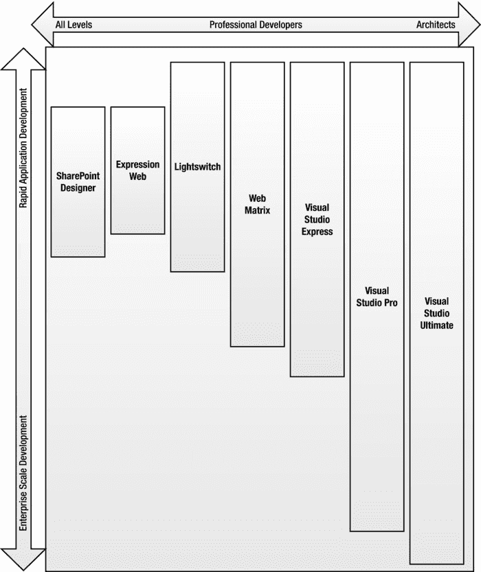
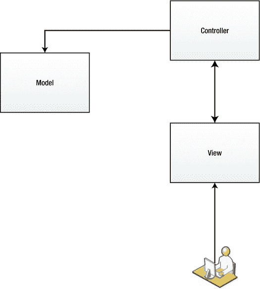
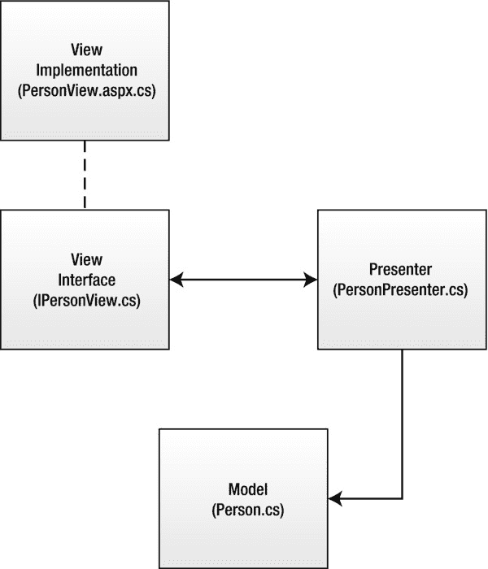
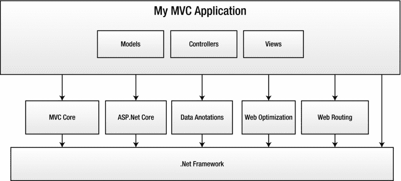
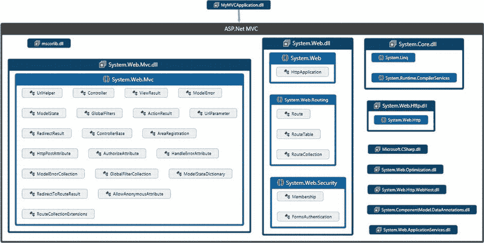
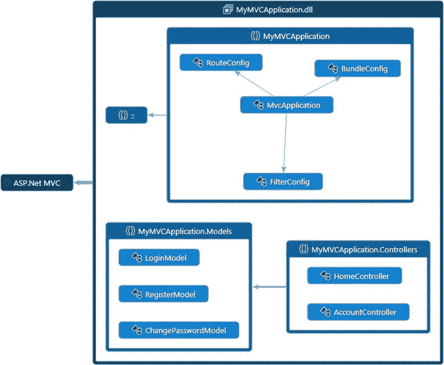
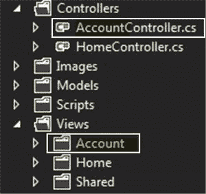
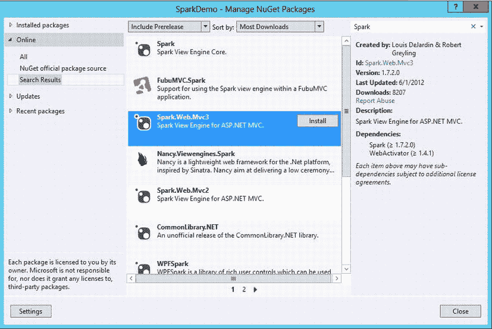
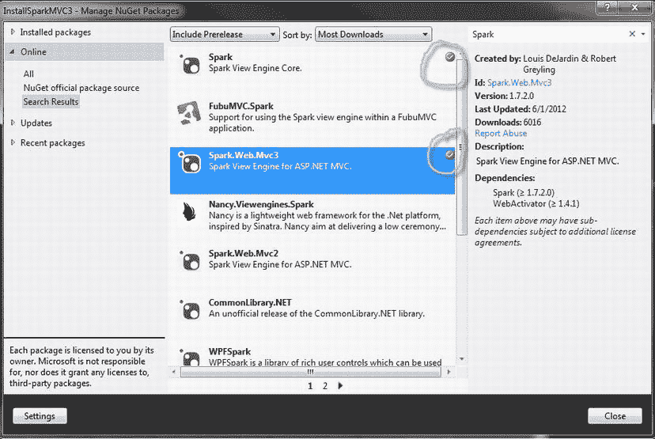

# 二、了解 ASP.NETMVC

2-1.了解微软 Web 开发生态系统

问题

您是 Microsoft 平台的新手，需要知道如何开始。你被无数的 产品所迷惑。你不知道是否应该使用 WebMatrix、LightSwitch、ASP.NET MVC、ASP.NET Web Forms、ASP.NET 网页、Napa 或 Silverlight。您希望了解所有这些工具，并确定您应该更多地了解哪个工具。

解决办法

过去几年来，微软开发人员产品的选择越来越多。当前的产品列表已经变得令人困惑，即使对于有经验的微软开发者来说也是如此。为了消除这种困惑，对平台有一个大致的了解是有帮助的，这些平台包括服务器、生产力套件、编程框架和语言。一旦您理解了平台和可以在其上创建的应用类型，您就可以探索开发工具，以了解每种工具如何应用于生态系统。

它是如何工作的

Microsoft web 开发生态系统通过利用 Windows 操作系统上的构件块来工作。这些构件块包括 Windows API(Win32)、组件对象模型(COM)、对象链接和嵌入(OLE)、组件服务(COM+)和微软。NET 框架。

建立在这些基础层之上的是微软的网络服务器互联网信息服务(IIS)。IIS 7 是对 web 服务器过去版本的完全重写，它提供了一个灵活的可扩展性模型，将它的功能划分为一组松散耦合的模块。

这种体系结构允许在需要时用定制版本替换任何组件，并允许微软和第三方独立软件供应商创建附加功能。IIS 7 附带了 40 多个模块，包括身份验证、响应压缩、配置和应用框架，如 ASP.NET。它们还提供了与旧版本 IIS 的向后兼容性，这允许旧的应用框架，如经典的 ASP。

除了微软开发的应用框架，IIS 还支持许多第三方和开源 web 平台，包括 PHP、CGI、Perl、Node.js、Ruby on Rails 和 Java 开发技术，如 J2EE。

微软开发平台和框架

本节介绍了微软开发的运行在 IIS 上的主要平台和框架 。

经典 ASP

Active Server Pages (ASP)是微软在 1998 年发布的 web 开发框架，是 Windows NT 4.0 Option Pack 的一部分。它取得了极大的成功，尽管它已经被 ASP.NET 取代，但它仍继续为成千上万的网站提供支持。它仍然可以安装在所有版本的 Windows Server 上，包括 Windows Server 2012。

ChiliSoft(后来被 Sun 收购，现在是 Oracle 的一部分)也在 Unix 和 Linux 系统上实现了 ASP。

经典 ASP 之所以受欢迎，是因为它非常简单易学。它允许开发者使用 VBScript 或 JavaScript 作为编程语言。

它的主要问题是，它将业务逻辑和表示混合在一起，经常导致应用变得无法维护。调试起来也非常困难。许多团队试图通过将业务逻辑放入用 C++或 VB 编写的 COM 组件中来弥补 ASP 的缺点。这种做法后来被微软在所谓的 Windows DNA 中正式推荐。

最终，Java 技术的兴起和日益复杂的业务需求导致了微软的发展。NET 和 ASP.NET，它们取代了经典的 ASP。

尽管经典 ASP 在 Windows Server 平台上仍然受到官方支持，但我不建议在新项目中使用它。

ASP.NET Web 窗体

ASP.NET 网络表单于 2002 年首次发布，现在已经是第七个版本了。十多年来，它一直是微软平台上使用的主要 web 开发技术。Web 窗体将 web 抽象化，并使用与 Windows 窗体编程非常相似的编程模型。它遵循的模型是，开发人员通过将文本框和下拉列表等控件拖到设计图面来设计屏幕，然后双击该控件在代码隐藏页上创建事件处理程序。例如，双击一个按钮将创建一个`OnClick`事件处理程序，当按钮被单击时，您可以在其中放置要执行的代码。

web 窗体的主要好处是，对于那些希望脱离胖客户端编程并开始构建 Web 应用的 VB 程序员来说，它很容易学习。它还通过表单验证控件和网站安全性等功能节省了开发人员的时间。

缺点是它是为 2002 年的 web 设计的，当时每一个 UI 操作都会导致向服务器的回发，这是可以接受的。他们在 2008 年发布了 ASP.NET Ajax，取得了一些成功，但试图创建丰富用户界面的开发人员可能会发现自己在与这个框架作战。

对于需要快速组装一个不需要高度复杂用户界面的小型应用的团队来说，WebForm 可能仍然是理想的选择。然而，随着 SharePoint 和 LightSwitch 等技术变得越来越复杂，以及业务流程管理系统等工具变得越来越流行，开发人员手工开发这些类型的系统的需求正在减少。

ASP.NET MVC

ASP.NET MVC 于 2009 年 3 月首次发布。它与 ASP.NET Web Forms 共享一个公共基础设施，但脱离了 Web Forms 世界的服务器控制、拖放范例，并为创建 Ajax 驱动的丰富的最终用户体验提供了一个更自然的模型。

ASP.NET 网络表单和 ASP.NET MVC 之间的详细比较在配方 2-5 中提供。

ASP.NET MVC 非常适合大多数 web 应用，也许是所有新开发的首选范例。ASP.NET MVC 要求开发人员投入时间去理解模型视图控制器(MVC)模式。与微软的其他一些框架相比，ASP.NET MVC 对于没有经验的开发者来说可能不那么容易学习。

ASP.NET 网页

ASP.NET 网页是一个简单的 web 开发框架，它提供了一种使用 WebMatrix IDE 创建定制 Web 应用的机制。它与 ASP.NET MVC 有一些共同的基础，包括页面路由和 Razor 视图引擎。虽然使用 ASP.NET 网页创建复杂的应用是可能的，但它不像 ASP.NET MVC 那样适合企业规模。

对于希望创建简单应用的有经验的开发人员来说，这可能是理想的选择。例如，假设您需要为您的垒球队创建一个网站，并希望公开一个击球率数据库。WebMatrix 的简单性使您可以比在 Visual Studio 中使用 MVC 做同样的应用更快地完成这项工作。ASP.NET 网页对于从事大型项目的开发团队来说不太理想。

对于企业开发者来说，ASP.NET 网页和网络矩阵是一个很好的原型工具。它的快速应用开发环境允许您快速组装一个演示，并将其部署到一个临时服务器上，在那里可以向最终用户进行演示。该项目稍后可以移植到 Visual Studio 和完整的 MVC 框架中，在那里您可以应用企业开发最佳实践并生成单元测试和其他推荐的工件。

灯开关

LightSwitch 是一个 RAD(快速应用开发)工具，它简化了以数据输入为中心的应用的创建。LightSwitch 的最初版本使用 Silverlight 来创建终端用户体验。它利用 Silverlight 丰富的数据绑定功能，用最少的代码或不用代码来创建数据驱动的应用。LightSwitch 应用既可以作为浏览器 Silverlight 应用运行，也可以作为在桌面上运行的浏览器外应用运行。最新版本支持 HTML5 和 Silverlight 中的项目输出。

对于非常简单的应用，LightSwitch 是一个很好的解决方案。它有几个主要的局限性，比如不能支持需要从多个数据库表中更新数据的表单，这使得它只能用于琐碎的“峰值和戳”应用。

开发

Silverlight 是一个富互联网应用(RIA) 工具，与 Adobe Flash 插件竞争。它主要用于网飞等网站创建丰富的媒体流体验。

尽管微软承诺在 2021 年之前继续支持 Silverlight，但微软的 RIA 策略已经转向 HTML5。Silverlight 与 HTML 相比仍有一些优势，例如能够在已经在 Internet Explorer 7 等浏览器上标准化的遗留企业桌面上运行，Internet Explorer 7 不支持 HTML5，JavaScript 性能也很差。它也优于 HTML5，因为它可以通过可扩展的编解码器框架和对 3D graphIC 的支持提供更丰富的流媒体体验。Silverlight 可以在浏览器之外运行，并被授予访问本地文件系统的权限。

我建议架构师和技术负责人避免在新的应用中使用 Silverlight。如果可能的话，他们应该选择 Ajax/HTML5 应用，或者考虑使用原生的 Windows 技术，比如 Windows Presentation Foundation(WPF)。如果使用 Silverlight，我建议在全浏览器窗口的 Silverlight 应用上使用“丰富岛”模型。“丰富岛”的一个例子是基于 Silverlight 的媒体播放器，它允许回放受数字版权管理(DRM)保护的内容。在全浏览器 Silverlight 应用中，整个用户体验都是在 Silverlight 中创建的。

平台

SharePoint 是微软最成功的产品之一。它提供了一个团队可以用来共享文件的门户，并具有文档和记录管理功能。它还为最终用户提供了使用 web 浏览器创建简单应用的能力，包括简单的表单和工作流。高级用户可以使用 SharePoint Designer 创建更高级的表单和工作流。

SharePoint 的基础是 ASP.NET Web 窗体、Windows Workflow Foundation 和其他微软技术。SharePoint 具有很强的可扩展性，开发人员可以在很多地方添加定制的功能。

一些公司已经采用 SharePoint 作为应用平台，许多团队可以将他们的自定义解决方案部署到共享的 SharePoint 基础结构上。在许多情况下，SharePoint 的增值功能可以显著减少创建解决方案所需的代码量。

使用 SharePoint 作为开发平台有几个缺点。最大的是产品的整体复杂性。跟踪 SharePoint 应用中的错误和性能问题可能会非常痛苦。在其他情况下，添加在其他 Microsoft web 技术中微不足道的功能将需要数周的时间来将 GUIDs 粘贴到 900 行的 XML 文件中，并且每次进行微小的更改时都必须重置 IIS。

SharePoint 可能是一个强大的工具，但是一定要对 SharePoint 开发有一个牢固的理解。此外，请确保您的应用使用了足够的本机 SharePoint 功能来抵消 SharePoint 生态系统中开发的复杂性。

对于 Office 2013，包括 SharePoint 2013 和 Office 365，微软创建了一个名为 Napa 的新应用模型代码，通过允许您使用 HTML、JavaScript 和 CSS 创建前端，并使用 C#、PHP 和 VB.NET 创建服务器端代码，简化了开发体验。新框架支持 RESTful APIs，允许您使用自己选择的平台开发服务，然后使用 Office JavaScript API 创建用户界面来使用您的服务。

图 2-1 显示了主要的微软网络开发工具和每个工具的目标受众。图表左侧列出的工具是为更广泛的受众设计的，包括相对非技术性的业务高级用户。右侧的工具是为专业开发人员和架构师设计的。

Microsoft Web 开发工具



[图 2-1](#_Fig1) 。微软网络开发工具矩阵

图 2-1 所示的图表区分了快速应用开发和企业级开发。在 RAD 方面，这些工具经过了优化，可以快速开发解决方案，但是对于创建高度可伸缩、可靠和可维护的应用来说，优化程度较低。在许多情况下，RAD 工具已经“足够好了”例如，如果您有一个客户，他想为他的小企业建立一个网站，除了他的营销资本之外，他还想在他的网站上收集一些客户信息。在这种情况下，像 WebMatrix 这样的工具将是一个很好的选择。另一方面，如果您正在为一家大型经纪公司开发交易大厅应用，您可能希望使用 Visual Studio 提供的更强大的工具集。Visual Studio 产品跨越了[图 2-1](#Fig1) 中图表的整个纵轴，因为它们允许开发人员针对整个微软堆栈。

表 2-1 列出了微软的各种可用于 web 开发的工具 ，每个工具的简要描述，以及撰写本文时产品的价格。

[表 2-1](#_Tab1) 。Microsoft Web 开发工具

  

在回顾了[表 2-1](#Tab1) 之后，你可以看到微软有大量不同价位的工具。本书中的大多数示例适用于 Visual Studio 2012 的所有版本，包括 Visual Studio Express 2012 for Web。

2-2.理解 MVC 框架版本之间的差异

问题

MVC 框架从一开始就经历了很多变动，而且似乎新版本发布的速度也在加快。您希望更好地理解 MVC 框架版本以及它们之间的差异。

解决办法

ASP.NET MVC 的第一个产品发布是在 2009 年 3 月。最初的版本提供了基本的管道:可扩展性模型和基于 ASP.NET 网络表单的视图引擎。

2010 年 3 月，第 2 版发布，包含了超过 15 个新特性，比如 API 改进和对 ASP.NET 4 的支持。MVC 3 于 2011 年 1 月发布。

MVC 3 引入了 Razor 视图引擎和许多其他特性，这些特性简化了视图的创建，使得维护关注点的分离变得更加容易。

2012 年 8 月，MVC 4 发布，同时发布的还有一大波微软产品，包括 Visual Studio 2012。MVC 4 包括一个用于创建 HTTP 服务的新框架，一种允许 MVC 应用基于用户代理更改所选视图的机制，到 Windows Azure 的无缝部署，以及捆绑和缩小，这可以通过减少客户端为呈现页面而发出的 HTTP 请求的数量和大小来提高性能。

它是如何工作的

ASP.NET MVC 框架最初是由微软在 2007 年 12 月作为社区技术预览版(CTP ) 发布的。

 **注意**CTP(微软版本命名约定术语)是一个非常粗略的预发布版本，通常只包括全部计划功能的一个子集。在 CTP 之后，微软通常会发布一个测试版。beta 版本之后通常会有一个或多个发布候选版本(RC ),这是产品的一个近乎完整的版本。最终版本被称为生产发布(RTM)，但有时也被称为网络发布(RTW)。

MVC 框架版本 1 的最终版本(RTM)于 2009 年 3 月 9 日作为 ASP.NET 3.5 的附加版本发布。第一个版本引入了页面路由等功能，它提供了干净的、搜索引擎友好的 URL，以及控制器类和基于 ASP.NET Web Forms 的视图引擎。新 MVC 框架的一个关键组件是它的可扩展性点，它允许用定制设计替换视图引擎等主要组件。

一年后，2010 年 3 月 10 日，微软发布了 MVC 框架的第二版。版本 2 可以和版本 1 一起安装，这样开发人员可以在同一台机器上开发 MVC 2 应用的同时维护现有的 MVC 1 应用。它还允许 web 服务器托管 MVC 1 和 MVC 2 应用，而不会引起任何问题。当您准备升级时，一个用于 MVC 的 Visual Studio 2010 外接程序提供了一个转换向导。MVC 框架的版本 2 是一个巨大的发布，有超过 15 个重要的新特性。最显著的新特性是

*   支持异步控制器。
*   支持数据注释属性。
*   模型验证程序提供者。
*   客户端验证。
*   模板标题。
*   许多 API 改进。
*   支持 ASP.NET 4 和 Visual Studio 2010。

2011 年 1 月 13 日，MVC 3 与一系列重要的新产品一起发布，包括 NuGet、IIS Express 7.5、Web Deploy 和 Web Farm Framework 2.0、Orchard 1.0 和 WebMatrix 1.0。

除了正常的安装包，微软还在 Apache 2.0 开源许可下发布了 MVC 框架的源代码。3.0 版本的主要特性包括

*   Razor 视图引擎。
*   不引人注目的 JavaScript。
*   与 jQuery UI 和 jQuery 验证插件的集成。
*   验证改进，包括远程验证。
*   实体框架代码优先支持。
*   部分页面输出缓存。
*   一个新的`ViewBag`，它用了。NET 4 的动态特性，允许后期绑定数据从控制器传递到视图。
*   页面路由不再是 MVC 框架的一部分；它成为核心 ASP.NET 堆栈的一部分。

MVC 3 最显著的新特性是 Razor 视图引擎。这从根本上改变了视图的构造方式。如果您来自 ASP.NET Web Forms 背景，这可能是您习惯的工作方式中最具破坏性的变化。好在 Razor 非常简单易学。大多数人能够在使用 Razor 的最初几周内“击败”学习曲线，并获得其简洁语法的生产力收益。

2012 年初，MVC 框架 4 的第一个测试版作为 Visual Studio 2012 测试版的一部分发布。2012 年 3 月，该框架的源代码——包括 Web API 和 Razor view 引擎——在 Apache 开源许可下发布。这是一个比 3.0 源代码许可证限制少得多的许可证，允许第三方修改源代码，甚至提交他们对项目的贡献。

2012 年 8 月，微软发布了 MVC 4 的最终版本。它作为 Visual Studio 2010 的可下载外接程序提供，默认情况下包含在 Visual Studio 2012 中。这是 MVC 框架的新版本首次作为 Visual Studio 主要版本的一部分发布。这是微软的一个明确标志，MVC 框架现在被认为是成熟和主流的。MVC 开发者社区兴趣和活动的增长是 ASP.NET MVC 现在已经准备好大规模采用的另一个标志。

ASP.NET 4 的主要新特性包括

*   ASP.NET Web API。
*   现代化的项目模板，采用先进的设计方法，如自适应渲染。
*   开发移动应用的大量新特性，包括移动项目模板。
*   一个新的“食谱”特性，允许 NuGet 包生成特定于项目的代码。
*   扩展了对异步编程的支持，包括对新的 Await 关键字的支持。
*   捆绑和缩小脚本和 CSS 文件。
*   一种显示模式功能，允许根据指定的标准使用单独的视图。例如，如果检测到 iPhone，则会提供针对该设备优化的视图。
*   支持 Windows Azure SDK。

2-3.理解 MVC 模式

问题

你想开始使用 ASP.NET MVC 框架，但是你不理解 MVC 模式以及为什么它是有益的。

解决办法

模型视图控制器(MVC)模式是许多软件系统中使用的一种流行的设计模式。Trygve Reenskaug 在 1978 年首次记录了这种模式，这与施乐 PARC 公司的一个项目有关，在该项目中，MVC 模式是为 Smalltalk-80 类库实现的。MVC 将一个软件模块分成三个不同的层，每个层都有一个特定的角色(见[图 2-2](#Fig2) )。



[图 2-2](#_Fig2) 。模型视图控制器

*   *模型*:模型表示数据。模型可以是简单的单个对象，也可以是包含许多对象集合的复杂类型。模型不应该包括实现细节。一个模型可能有许多关联的视图。
*   *视图*:视图通常代表一个绑定到模型的用户界面组件。视图可以显示数据并允许用户修改数据。视图应该总是反映模型的状态。
*   *控制器*:控制器通过定义用户界面如何对用户输入做出反应，为用户提供与系统交互的机制。它负责在视图和模型之间交换和解释消息。

它是如何工作的

除了定义各层本身，MVC 模式还提供了各层如何通信的规则。

允许的通信模式

*   用户可以与视图交互。
*   视图可以与控制器交互。
*   控制器可以与视图交互。
*   控制器可以与其他控制器通信。
*   控制器可以与模型通信。

受限通信模式

*   用户不能直接与控制器交互。
*   用户不能直接与模型交互。
*   视图不能与其他视图交互。
*   视图可能不会直接与模型交互。
*   模型不能与其他模型交互。

MVC 设计模式的好处

如果这是你第一次阅读 MVC 模式，你可能会对自己说，“为什么要用这种方法呢？这看起来像是很多额外的工作。”

第一个好处是您的视图和模型解耦了。这意味着您可以有许多与给定模型相关联的视图。例如，对于一个模型，每个 CRUD(创建、读取、更新、删除)操作可能有一个单独的视图。

*   显示记录但不允许更改记录的只读视图。
*   用于创建新记录的视图。
*   用于修改记录的视图。

事实上，Visual Studio 具有内置特性，可以简化遵循 MVC 模式的应用的创建。除了标准的 CRUD 视图之外，您可能还想创建针对特定设备的视图。也许您需要另一个视图，以 Excel 电子表格的形式返回数据。除了为人类创建的视图，您还可以提供由其他应用或客户端脚本访问的 web 服务。

第二个主要优点是视图/控制器解耦。这允许您在不改变视图的情况下改变应用响应用户输入的方式。它还允许在不改变应用响应用户输入的方式的情况下改变用户界面(视图)。在 web 应用中，用户界面的变化可能比业务规则更频繁。当用户界面由营销部门控制时尤其如此。通过将控制器逻辑从表示中分离出来，您可以根据市场需求经常调整页面布局，而不会无意中破坏您的业务逻辑。

使用 MVC 模式的另一个优点是分离关注点允许不同的团队成员关注应用中最符合他们各自技能集的部分。例如，很少有人既拥有使用 HTML 和 CSS 创建吸引人的前端界面的技能，又知道 C# 编程的复杂性。它还允许团队成员同时处理页面中他们各自的部分，因为代码和表示在不同的文件中。对于从事测试驱动开发的团队来说，MVC 模式非常适合创建自动化的单元测试。

使用 MVC 模式的其他技术

ASP.NET MVC 不是唯一使用 MVC 模式的产品，也不是第一个使用它的 web 开发框架。有成千上万的框架和应用实现了 MVC 模式。下面的列表描述了几种最流行的使用 MVC 模式的框架。

*   *苹果 iOS 开发*:如果你计划使用苹果 Xcode 为 iPhone 或 iPad 创建一个原生应用，你需要实现 MVC 模式。Xcode 采用拖放界面，允许您定义各种 UI 组件，然后将连接器拖到控制器上，以定义它与视图的关系。
*   Apache Struts:Apache Struts 于 2000 年 5 月首次发布，是一个开源框架，它扩展了 Java Servlet API，用于创建 Java 企业版 web 应用。Struts 可能是最成熟的基于 MVC 的应用框架。它已经在财富 500 强公司的数千个企业级应用中使用。
*   *Spring Framework* : Spring 是另一个 Java 框架，除了其控制容器的反转和面向方面的编程特性之外，还具有 MVC 框架的特点。Spring Framework 的 MVC 框架通过在 MVC 层之间提供更好的分离来解决 Apache Struts 中的架构缺陷。
*   Yii 是最流行的 PHP 框架之一。它以快速、安全和有据可查而著称。该框架有一个基于 web 的代码生成器，可以将数据库表转换成模型类。代码生成器还将生成 PHP 代码来执行遵循 MVC 模式的 CRUD 操作。然后，您可以修改生成的代码以满足您的需要。
*   *余烬*。 *js* : Ember.js 是一个 JavaScript MVC 框架和模板引擎。它支持 UI 绑定、组合视图，提供了 web 表示层，并且可以很好地与其他 JavaScript 库兼容。Ember 可以与服务器端 MVC 框架结合使用，将 MVC 的好处扩展到日益复杂的现代 web 应用表示层。
*   *Ruby on Rails* : Ruby on Rails 是一个流行的 MVC web 开发框架，被成千上万的网站所使用。在 Rails 中，模型被实现为维护模型和数据库之间关系的`ActiveRecord`。Ruby 方法名是根据数据库中的字段名自动生成的。视图由实现控制器的`ActionView`库和`ActionController`子系统实现。微软的 MVC 框架大部分是受 Ruby on Rails 的启发，包括它的动态数据搭建技术。在 Rails 中，scaffolding 基于模型定义生成应用的主要部分，包括模型类、表单、CSS 样式表和测试。

2-4.理解 MVC、MVVM 和 MVP 之间的区别

问题

除了 MVC 模式，你经常听说 MVVM 和 MVP，但是你对它们之间的区别和它们应该应用在哪里感到困惑。

解决办法

这三种模式——模型-视图-控制器(MVC)、模型-视图-展示者(MVP) 和模型-视图-视图模型(MVVM)——有许多相似之处，但也有很大的不同。这三种模式都有一个潜在的目标，那就是将视图从模型中分离出来。这三种模式都包含了模型和视图的概念。这两种模式的主要区别在于视图和模型之间传播变化的方式。视图模型、表示器和控制器都分担在视图和模型之间传递状态变化的责任，但是它们使用不同的机制来完成。

它是如何工作的

在 MVC 中，视图中触发的事件会导致在控制器上调用动作。在 MVC 框架中，这是通过由 ASP.NET 请求路由子系统将 HTTP 请求路由到适当的控制器来实现的。每个唯一的 URL 被映射到控制器中的一个特殊方法，称为*动作* 。在操作方法中，视图数据被处理，模型被更新。MVC 控制器还额外负责决定应该显示哪个视图。

在 MVP 模式中，演示者取代了控制者。演示者类似于控制器，因为它是唯一应该操作模型的实体。演示者与控制者在三个方面不同:

1.  它们不像控制器那样扮演交通警察的角色，而是由视图实例化。
2.  视图和演示者是完全解耦的，并通过接口进行通信。
3.  演示者代表视图处理所有 UI 事件。

MVP 模式通常由企业 ASP.NET Web 窗体开发人员使用，他们需要为他们的代码隐藏页面创建自动化单元测试，但是不想在 Web 服务器进程内部运行测试。通过将 Web 窗体页中定义的属性和事件建模到一个接口中，可以在运行单元测试时使用该页的模拟实现。[图 2-3](#Fig3) 显示了在 ASP.NET 网络表单应用中实现的 MVP 模式的概念图。



[图 2-3](#_Fig3) 。在 ASP.NET Web 窗体应用中实现的 MVP 模式

在 MVVM 模式中，双向数据绑定用于将视图中的状态变化传递给视图模型。在 WPF 和 Silverlight 等应用框架中，这是通过将视图模型设置为视图上的数据上下文来实现的。因为数据绑定是双向的，所以当视图模型的数据发生更改时，更新值会自动传播到视图，并且对视图的更改会自动传播到视图模型。

视图模型通常使用观察者模式，在这种模式下，每次修改公开的属性时都会触发一个事件，通知订阅者发生了变化。

这种模式的主要优点是，它不需要显式地编写代码(如`PersonNameTextbox.Text = myViewModel.Person.Name`)来用视图模型中的数据更新用户界面。它还消除了编写代码的必要性，比如用视图中最终用户所做的更改来更新模型。

在[第 12 章](12.html)的“客户端数据绑定”一节中，我将向你展示如何在你的客户端代码中使用 MVVM 模式。

2-5.在 MVC 和 WebForm 之间做出选择

问题

您是一名经验丰富的 ASP.NET WebForm 开发人员，已经使用 WebForm 好几年了。您被分配到一个新项目，该项目正在完成需求收集，您即将开始您的设计。您需要帮助来决定是继续使用 WebForm 还是深入 MVC。如果 MVC 在您的组织中还不是一个标准的开发框架，您可能需要向管理层或企业架构团队证明这个设计决策。

解决办法

我们在菜谱 2-1“理解微软 Web 开发生态系统”中简要讨论了 ASP.NET WebForm 和 MVC 在当前的食谱中，我们详细研究了每种方法的优点和缺点，并提出了 MVC 的理由。

首先，我不得不说 WebForm 给了我们很好的表现。我在许多成功的项目中使用过 WebForm。其中许多在最初部署近十年后仍在积极使用。所以我猜你可以说，没坏就别修。我想你也可以这样说 Windows XP。Windows XP 与 ASP.NET 网络表单几乎同时问世，而且像网络表单 Windows XP 一样，它被全世界数百万微软客户持续使用。事实上，许多组织都在坚持使用 Windows XP，尽管它现在已经是最新最好的三个版本了。另一方面，如果你还在使用 Windows XP，你就错过了 Windows 每个新版本带来的许多创新和生产力提高。您也无法利用硬件中的一些新改进，如 USB 3、多核 CPU 和超大容量硬盘。简单的事实是，尽管 Windows XP 和 ASP.NET Web Forms 都是好系统，但它们都是为不同的计算时代设计的。

它是如何工作的

没有技术是完美的。他们都有自己可以做得很好的地方，也有自己缺乏和可以改进的地方。本节真实地介绍了 WebForm 和 MVC，并讨论了它们各自的优缺点。

WebForm 优势

让我们从回忆 WebForm 的优点开始:

*   *庞大的人才库*:如果你正在组建一个新的团队，或者希望扩大现有的团队，那么找到熟悉 ASP.NET 网络表单的开发人员是相对容易的。对于 MVC 框架来说，这不一定是真的。
*   *熟悉的编程模型*:将 UI 组件拖动到设计图面上，然后双击它们来实现事件处理程序的编程模型，对于使用过 Visual Basic 等传统桌面技术的开发人员来说是很熟悉的。
*   *只需要有限的 HTML 和 JavaScript 知识*:开发人员不需要对 HTML、JavaScript 和 CSS 有很深的理解。大部分血淋淋的细节都被框架隐藏了。
*   大型控件库:它有一个巨大的 UI 组件库，叫做*控件*。从文本框到菜单的所有东西都只需拖放就能成为应用的一部分。
*   *简单* - *到* - *创建用户控件*:使用用户控件特性创建复合控件或自定义控件非常简单。
*   *简化的表单验证* :验证控件允许你创建用户友好的表单，在表单提交给服务器之前确保用户输入是正确的。如果用户不是人类，而是故意禁用 JavaScript 来绕过表单验证的人，验证控件会自动检查服务器上的输入。
*   导航和站点地图(sitemaps):站点地图提供者可以与面包屑控件相结合，为你的站点自动生成二级导航。
*   *关注点分离*:代码隐藏页面将 C# 代码与表示逻辑分离。
*   简单的 Ajax:ASP.NET Ajax 允许现代的客户端体验，同时保持 WebForm 提供的抽象层。

网络表单的缺点

前面的列表显示了 WebForm 有许多引人注目的特点。它如此受欢迎是有原因的。另一方面，随着网络的发展，许多使网络表单如此受欢迎的特征现在正成为它的弱点。

*   人才库拥有过时的技能组合:虽然找到知道 MVC 框架和 Razor 语法的人比找到知道 WebForm 的人更难，但另一方面，如果你试图创造一种全新的用户体验，WebForm 技能可能无法提供你所需要的。创造下一代网络体验的人们已经拥抱了网络，了解 HTML，热爱 JavaScript，并且可以使用 CSS 作为他们的画布。对于下一代的 web 开发人员来说，WebForm 的抽象是一种陌生的厌恶。另一方面，MVC 框架以其清晰的 HTML 输出和熟悉的开发模式(类似于其他流行的框架，如 Rails 和 Yii)将有一个更自然的过渡。
*   *拖拽* - *和* - *drop 编程模型相关性较低*:传统的 Visual Basic 拖拽编程模型虽然还活着，但已经不再欣欣向荣。大多数桌面开发者已经从 Win Forms 转移到 WPF 的 based UI 开发。基于 XAML 的桌面应用与 web 开发有很多共同之处，就像它们与 VB 编程一样。虽然您可以通过将控件拖放到设计图面来创建窗体，但是如果您正在创建具有任何复杂性的 UI，您将跳过 Visual Studio 中内置的设计器，而直接使用 Expression Blend 之类的工具，或者直接切换到代码视图。Windows 8 和 WinRT 通过允许使用 HTML5 和 JavaScript 创建 Windows 用户界面，将 Windows UI 范式进一步推向了 web 模型。因此，尽管 VB 编程模式还没有完全消亡，但它正在逐渐淡出人们的视野，转而支持基于 web 的方法。
*   *ASP* 。*网络控件不如现代客户端* - *端库*:WebForm 附带的 UI 小部件的大型库，几年前看起来像是这样的资产，现在也失宠了。jQuery 和其他网站免费提供的 JavaScript UI 库明显比 ASP.NET 提供的要好。它们渲染速度更快，不依赖于可怕的 ASP.NET 视图状态，而且非常漂亮。尽管许多控件在 ASP.NET 的最新版本中已经更新，但大多数仍然使用不推荐的呈现技术，如使用 HTML 表格进行布局。如果不是不可能，也很难从客户端代码对它们进行编程。
*   *ASP* 。与客户端框架相比，-**网络验证控件效率较低:ASP.NET 验证控件与其他客户端验证组件相比仍有一个优势，即它们可以验证输入的服务器端和客户端。但是，如果您使用最佳实践，比如保护您的后端代码免受 SQL 注入和跨站点脚本攻击，那么服务器端验证就不那么重要了。另一方面，客户端库(如 jQuery 验证插件)非常强大、灵活且易于使用。与 ASP.NET WebForm 中的五种内置验证类型相比，它提供了 19 种内置验证方法。jQuery 插件在某种程度上很容易扩展，而在 WebForm 中创建定制验证器可能是一项繁琐的任务，很难调试。此外，使用 ASP.NET 验证控件对表单进行验证所需的标记很麻烦，使得 HTML 难以阅读。如果您使用 ASP.NET Ajax 工具包验证扩展程序，这个问题会更加复杂。清单 2-1 显示了一个使用 ASP.NET 验证控件进行验证的简单表单。清单 2-2 显示了使用 jQuery 验证的相同表单。**

 ****[清单 2-1](#_list1)*** 。使用 Web 窗体验证控件向单个窗体元素添加验证规则的标记

```cs
<asp:TextBox ID="UserName" runat="server" MaxLength="50" CssClass="RegFormFields"
             ToolTip="User names may only contain numbers and letters and must begin with a letter.
Spaces are not allowed in user names." ></asp:TextBox>
<asp:RequiredFieldValidator ID="UserNameRequired" runat="server"
        ControlToValidate="UserName" ErrorMessage="User Name is required."
        ToolTip="User Name is required."
        ValidationGroup="CreateUserWizard1">*</asp:RequiredFieldValidator>
<cc2:ValidatorCalloutExtender
     ID="ValidatorCalloutExtender6"
     runat="server"
     CloseImageUrl="img/close.gif"
     Enabled="True"
     HighlightCssClass="highlight"
     TargetControlID="UserNameRequired"
     WarningIconImageUrl="img/alert-large.gif"
     Width="300px">
</cc2:ValidatorCalloutExtender>
<asp:RegularExpressionValidator
     ID="UserNameRegExValidator"
     runat="server"
     ControlToValidate="UserName"
     Display="None"
     ErrorMessage="User names may only contain numbers and letters and must start with a letter."
     Text="*"
     ValidationExpression="^([a-zA-Z])[\w]*$"></asp:RegularExpressionValidator>
<cc2:ValidatorCalloutExtender
     ID="ValidatorCalloutExtender8"
     runat="server"
     CloseImageUrl="img/close.gif"
     Enabled="True"
     HighlightCssClass="highlight"
     TargetControlID="UserNameRegExValidator"
     WarningIconImageUrl="img/alert-large.gif"
     Width="300px">
</cc2:ValidatorCalloutExtender>
```

***[清单 2-2](#_list2)*** 。HTML 助手将视图中的标记减少到只有几行。这种情况下的验证是作为模型上的数据注释来应用的。

```cs
@Html.TextBoxFor(m => m.UserName)
```

在[清单 2-3](#list3) 中，你可以看到由`Html.TextBoxFor`助手输出的 HTML 标记。请注意，它生成的代码包括 jQuery 验证所需的 HTML 属性。您可能还会注意到，所有的表单数据，包括`data-val-regex`属性的内容，都被编码了。这种编码有助于防止恶意用户使用跨站点脚本等技术攻击您的网站。

***[清单 2-3](#_list3)*** 。由清单 2-2 中的[所示的 HTML 助手呈现的 HTML](#list2)

`<input data-val="true" data-val-regex="User names may only contain numbers and letters and must start with a letter." data-val-regex-pattern="^([a-zA-Z])[\w]*$" data-val-required="The User name field is required." id="UserName" name="UserName" type="text" value="" />`

*   *代码隐藏页面通常会破坏关注点分离*:虽然训练有素的程序员可以创建干净的代码隐藏页面，但在许多情况下，开发人员会通过操纵代码隐藏页面中的用户界面来破坏关注点分离，甚至更糟——从代码隐藏中直接操纵数据库。这通常会导致庞大、脆弱、不可维护和不可测试的代码。
*   *视图状态* : Web Forms 使用了一个被称为*视图状态*的概念，其中一个隐藏字段包含所有服务器端控件的值，编码在一个大的讨厌的字符串中。此数据在每次回发时发送，这减慢了响应时间并增加了带宽使用率。对于使用控件(如网格视图)的页面，视图状态可能有数百千字节。
*   *客户端代码难以使用*:WebForm 生成的客户端代码难以阅读，也很难编写。首先，您拖到页面上的每个 UI 小部件都附加到一个 DLL，其中可能包含 20 个嵌入的脚本文件。在许多情况下，在一个页面上使用其中一个控件会导致所有 20 个脚本以`<script src="/ScriptResource.axd?d=JzFjHNVTNSRvxnyOuI_HmzgpeGgm-le_2DeNc7ub5pZUcy9A8M9scHh3p580Af72CFevs-15tBuSlQYGR8Y6jhCLDnQaQ1K84GPCFXjTaKWxU1eVzt8qVZ8mueqHNb4FDLOkRw2&amp;t=ffffffff8a8533f5" type="text/javascript"></script>`的形式出现在您的页面上。当 JavaScript 错误由于这些神秘文件中的某个内容而发生时，很难跟踪根本原因。
*   *客户端开发人员的另一个痛点是用于客户端元素*的自动命名约定:在默认设置下，您以`ctl00_LoginView1_LoginName1`的形式获得 id。对于嵌套的 UI 元素，情况更糟。ASP.NET 4 提供了一种机制来帮助解决这种情况，它允许您指定如何生成客户端 id。
*   *代码隐藏页面不能用自动化测试工具* ' *测试*:代码隐藏页面根本不是为这种场景设计的。没有简单的方法来抽象代码隐藏页面，以便可以使用单元测试框架。如果您计划对 WebForm 使用测试驱动开发(TDD)方法，您将会遇到困难。

总的来说，web Forms 过去的优势已经变成了它的弱点，它对 Web 的抽象使它与新一代 Web 开发人员格格不入，它紧密耦合的体系结构使它无法与现代敏捷编程技术一起使用。

WebForm 的另一个问题是，在阅读了食谱 2-1 之后，你可能会发现，在微软的堆栈中有更好的方法来构建快速的部门应用。例如，如果您需要创建一个 intranet 门户网站或一个简单的文件共享网站，其中包含用于审批和审阅的工作流，您可能需要考虑使用 SharePoint。如果您需要快速构建一个应用来替换您的部门当前使用的 Access 数据库，您可能需要考虑使用 LightSwitch。

对于许多剩余的用例，MVC 框架只是一个更好的选择。

因此，我们可以用 MVC 框架的积极属性来结束这个食谱，让我们从它的消极属性开始。

MVC 的缺点

*   *学习曲线*:如果你来自 WebForm，那么迁移到 MVC 会有一个相当长的学习曲线。不得不在截止日期前学习一项新技术，这一点都不好玩。
*   *更复杂的*:MVC 代码将组成一个页面的代码分成最少三个文件。如果你不打算做单元测试，也不喜欢 HTML 编码，MVC 可能不是最好的选择
*   *无拖放表单创建*:如果你使用 MVC 框架，你将手工编写你的 HTML。事实上，在使用 Razor 视图引擎时，Visual Studio 甚至没有为 MVC 视图提供可视化设计器。

对于大多数团队来说，学习曲线可能是最难逾越的障碍。在许多公司环境中，要记录的第一个需求是截止日期。客户不知道他们想要什么，但他们知道他们需要在 9 月 1 日前完成。不幸的是，对于开发者来说，这是不争的事实。总会有新技术出现，总会有第一个项目使用它。要记住的是这个决定的长期影响。成功的项目通常有五到十年的保质期。从全局来看，学习曲线所损失的时间是微不足道的。选择错误的框架(仅仅因为它是你所知道的)会产生重大影响——特别是当 WebForm 固有的问题暴露出来，应用需要在几年内重新编写的时候。

对于复杂性的缺点，我会把它归类为相对的。在项目过程中，一个 WebForm 代码已经发展成一个 5000 行的大灾难，维护起来比 MVC 框架强加给你的单独文件要复杂得多。

缺少拖放式表单创建和服务器控件只会损害表单的初始原型。如果您真的依赖于这个功能，还有其他的选择——比如在一个 HTML 编辑器(比如 Expression Web 或者 Visual Studio)中创建基本 HTML，然后将 HTML 代码复制到视图中。

MVC 优势

*   关注点的清晰分离。
*   完全控制 HTML。
*   完全可测试/可以使用 TDD。
*   易于创建的 REST APIs。
*   可以使用任何 JavaScript UI 框架。
*   干净的 HTML，没有视图状态或回发事件。
*   可扩展性框架为第三方开发者提供了许多增强框架的机会。
*   内置的脚手架允许快速创建可维护的数据输入表单。当与实体框架结合使用时，这提供了单点维护。

2-6.理解 ASP.NET MVC 框架架构

问题

你已经听说了很多关于 ASP.NET MVC 框架的事情，你渴望投入并开始编码，但是你不知道从哪里开始。你需要从 10，000 英尺的高度来看它是什么以及如何使用它。

解决办法

ASP.NET MVC 框架是一个 web 应用开发框架。NET 框架托管运行时环境和 ASP.NET 提供的核心基础设施。对于使用该框架创建的系统的用户，它提供了丰富的描述性 URL 和干净的客户端代码，可以在浏览器中快速下载和呈现。对于开发团队来说，它通过 Visual Studio 支持的快速应用开发提供了敏捷性，并通过使用架构最佳实践和经过验证的设计模式促进了稳定性和可维护性。

MVC 框架利用可靠的 MVC 模式来提供可测试性和关注点分离。

如果你不熟悉 MVC 模式或概念，比如“关注点分离”,不要担心——我们将在本章后面详细讨论这些。

在 MVC 框架中，ASP.NET 的 MVC 模式可以是任意的。NET 类。它通常被映射到某种持久性存储，比如数据库，但不是必须如此。该模型可以是简单的单个原始类型，也可以是具有许多嵌套类型集合的复杂数据结构。

ASP.NET MVC 视图是可以与模型相关联的服务器端模板。该视图由 ASP.NET 运行时引擎解释，以生成发送到 web 浏览器的 HTTP 响应。这通常以 HTML、CSS 和 JavaScript 的形式出现，但也可能是 XML——或者您需要发送给客户端的任何东西。

ASP.NET MVC 控制器很特别。从`System.Web.Mvc.Controller`类派生的. NET 类。控制器是将视图绑定到模型的粘合剂。它还负责在模型和视图之间交换数据。

Visual Studio 提供了项目模板和向导来帮助您入门，还提供了内置工具来帮助您创建新的控制器和视图，并将它们绑定到模型。

与 ASP.NET 的 web 窗体开发不同，MVC 并不试图抽象 Web。这种方法为开发人员提供了对呈现的前端代码的粗粒度控制。由于 web 不再是抽象的，为了充分利用 MVC，您或您团队中的某个人除了需要了解。NET 框架。

它是如何工作的

现在我们已经有了 10，000 英尺的视图，我们可以更深入一点，看看 MVC 框架架构。[图 2-4](#Fig4) 显示了一个 MVC 应用的高层架构。在图表的第一块，我们有您创建的定制应用代码。这包括您的模型、控制器和视图。在大多数应用中，我们还会有额外的、用户创建的组件，比如数据抽象层(DAL) 和持久层。



[图 2-4](#_Fig4) 。MVC 概念架构

图表的下一部分显示了 ASP.NET 和 MVC 框架的主要组件。

该架构的一个重要特征是组件的松散耦合。依赖结构非常扁平，组件之间没有层次结构。例如，MVC 框架组件并不直接依赖于 ASP.NET Core。在这本书的后面，我将展示这种架构如何使在 MVC 框架中应用 TDD 方法变得更加容易。

如果您碰巧有 Visual Studio 2012 Ultimate 的副本，您可以做一个有趣的练习，即使用架构浏览器功能来创建应用的依赖关系图。在[图 2-4](#Fig4) 中，我用一个内置模板生成了一个非常简单的 MVC 应用，然后使用 Architecture–Create Dependency Graph 命令来创建这个图。在 Visual Studio 中，图形是交互式的，允许您展开和折叠不同的组件。当您单击任何组件时，Visual Studio 都会绘制箭头，显示每个组件的依赖关系。

您还可以使用 Visual Studio 的对象资源管理器进行更深入的挖掘，查看每个程序集中所有可用的类和方法。

查看[图 2-4](#Fig4) ，您会看到以下组件:

*   。NET 框架程序集

*   *mscorelib* 。 *dll* :包含了许多。NET 框架，包括系统类型、反射、安全主体、集合和系统诊断。
*   *微软*。 *CSharp* : C# 语言构造。
*   *系统*。*核心* : LINQ 和运行时编译服务。

*   ASP.NET 议会

*   *系统*。 *Web* :包含`HttpApplication`类、Web 路由和安全提供者框架。
*   *系统*。*组件模型*。 *DataAnnotations* :提供一个声明式编程模型，允许您用动态数据搭建基础设施可以使用的属性来修饰模型。

*   MVC 特定程序集

*   *系统*。*网*。 *Http* :包含 MVC 框架的路由扩展。
*   *系统*。*网*。*优化*:包含用于捆绑和压缩 CSS 和 JavaScript 文件的库，以加快页面在客户端的下载和执行速度。
*   *系统*。*网*。 *Mvc* :包含基类和默认实现控制器、过滤器、动作结果和 Mvc 框架的其他核心功能。

在[图 2-5](#Fig5) 中，您可以看到来自[图 2-3](#Fig3) 的图，其中自定义代码部分被展开。这里，模板创建了两个控制器、三个模型和许多配置类，用于设置页面路由和绑定。



[图 2-5](#_Fig5) 。在 Visual Studio 中创建的 ASP.NET MVC 应用的依赖图的屏幕截图

图中未显示视图。默认情况下，视图是在第一次请求页面时编译的。如果包括这些，你会看到视图在图的顶部显示为一个单独的组件，而`System.Web.WebPages`在图的外部分组。

图 2-6 显示了使用 Visual Studio 创建的依赖图,它显示了使用 ASP.NET MVC 基本模板添加到项目中的组件之间的依赖关系。



[图 2-6](#_Fig6) 。基本 MVC 应用的依赖图

2-7.理解模型

问题

你知道*模型*是 MVC 中的 M，但是不确定它们与普通的 C# 类有什么不同。你想更好地理解什么是模型。

解决办法

MVC 框架可以使用任何。NET 类作为模型。如果你愿意，你甚至可以使用一个简单的原语作为你的模型。更常见的是，模型是一个包含许多复杂类型和类型集合的复杂类。

尽管您可以使用任何类，但是创建满足模型角色的类通常更好。虽然模型的主要功能是描述您的领域，但它也可以提供诸如计算、复杂验证逻辑和管理它所描述的实体的状态等功能。您不希望创建执行双重角色并将模型和控制器逻辑混合在一起的类。请参考诀窍 2-3——“理解 MVC 模式”——并回顾关于允许的通信模式的部分，以获得关于模型应该如何与你的应用交互的一般指导方针。

当您使用 Visual Studio 创建项目时，它会创建一个 Models 文件夹，根据您使用的模板，它可能会为您在该文件夹中放置几个模型。当您创建您的模型时，您可以遵循这个模式，或者，如果模型的复杂性允许的话，您可以将您的模型放在一个单独的项目中。

创建模型时，您可以使用几种模式。一些最流行的方法包括

*   创建简单的类。
*   创建复合类。
*   使用实体框架。

它是如何工作的

创建简单的类

如果您遵循 Visual Studio 团队使用的模式，您可以创建一组简单的类，没有复杂的类型,只包含公共属性和数据注释。例如，在 Internet 应用模板中，他们创建了一个文件`AccountModel.cs`，其中包含几个模型类。每个类只有足够的属性来支持与其一起使用的视图。每个属性都用一组数据注释来修饰。这些属性——当与 HTML 助手一起使用时——自动生成支持使用 jQuery 验证的表单验证所需的 HTML。[清单 2-4](#list4) 显示了 MVC 互联网应用模板中的注册页面的模型。

***[清单 2-4](#_list4)*** 。从 MVC Internet 应用模板注册模型

```cs
public class RegisterModel
    {
        [Required]
        [Display(Name = "User name")]
        public string UserName { get; set; }

        [Required]
        [DataType(DataType.EmailAddress)]
        [Display(Name = "Email address")]
        public string Email { get; set; }

        [Required]
        [StringLength(100, ErrorMessage = "The {0} must be at least {2} characters long.", MinimumLength = 6)]
        [DataType(DataType.Password)]
        [Display(Name = "Password")]
        public string Password { get; set; }

        [DataType(DataType.Password)]
        [Display(Name = "Confirm password")]
        [Compare("Password", ErrorMessage = "The password and confirmation password do not match.")]
        public string ConfirmPassword { get; set; }
    }
```

`RegisterModel`是一个非常简单的类，有四个属性。它使用数据注释将某些属性应用于每个属性。这种方法的优点是，诸如字段名(无论该字段是否为必填字段)和验证错误消息等信息可以保存在一个文件中，并在许多视图中使用。例如，如果这个模型有一个为 PC 设计的视图，另一个为平板电脑设计的视图，以及一个用于本机 iPhone 应用的 web API，那么信息可以统一应用于所有视图。

创建复合模型

如果像上一节中提到的简单模型不能满足您的视图的需要，您可以创建一个复合模型。当您显示的视图需要来自多个对象的数据时，此方法非常有用。如果您正在使用的现有库不能很好地映射到您的视图，它也可能很有用。在这种情况下，定义视图的外部库不在项目的模型文件夹中，而是在另一个项目中。

您可以添加一个引用外部库中一个或多个类的类，而不是尝试使用外部类作为您的模型或将随机对象塞入`ViewBag`。清单 2-5 展示了一个简单的模型例子，它描述了吉他盒中的物品。

***[清单 2-5](#_list5)*** 。WhatsInMyGuitarCaseModel

```cs
public class WhatsInMyGuitarCaseModel
{
    public List<GuitarPick> Picks { get; set; }
    public List<GuitarCable> Cables { get; set; }
    public Guitar MyGuitar { get; set; }
}
```

当查看这个例子时，一个问题可能会突然出现，因为外部类不使用数据注释，所以您不能从清单 2-4 中使用的声明性语法中受益。我们将在[第 7 章](07.html)的“设计模型”食谱中详细讨论这个和其他问题。

使用实体框架

定义模型的另一种方式是使用实体框架或另一种对象关系映射器(ORM) 来定义模型。使用这个选项，您的模型也连接到您的数据抽象层。实体框架提供了几种设计模型的方法。

*   *模型先行*:使用设计器定义一个模型，然后根据模型生成一个数据库。
*   *数据库优先*:基于数据库模式创建模型。
*   *Code first* :允许你使用一个普通的旧 C# 对象(POCO)作为模型，然后使用从 DbContext 派生的类将其连接到实体框架。

我们将在第 7 章中详细讨论这些选项。

2-8.了解控制器和动作

问题

你需要一些帮助来理解控制器在 ASP.NET MVC 应用中的角色。

解决办法

控制器是扩展`System.Web.Mvc.Controller` 的类。按照惯例，所有控制器都放在 MVC web 应用项目中一个名为`Controllers`的文件夹中。控制器内部有一个或多个返回`ActionResult`的方法。这些方法被称为动作。

控制器在 MVC 应用中提供了三个角色。

*   它选择应该显示什么视图。
*   通过充当视图和模型之间的中介，它允许视图和模型之间的清晰分离。
*   它在传递数据之前对数据进行处理。

它是如何工作的

确定要显示什么视图的过程可以通过多种方式完成。第一种是基于惯例和路由逻辑的组合。按照惯例，每个 MVC 项目都有一个`Views`文件夹。在`Views`文件夹中，有一个子文件夹与一个控制器的名称相匹配。例如，放置在使用 Internet 应用模板创建的 MVC 项目中的`AccountController.cs`文件有一个对应的名为`Account`的 views 文件夹。[图 2-7](#Fig7) 显示了`AccountController.cs` 及其对应的视图文件夹。



[图 2-7](#_Fig7) 。帐户控制器和相应的视图文件夹

帐户视图文件夹中有四个视图。每个视图都映射到`AccountController`类中的一个动作。例如，`Login`动作映射到文件`Login.cshtml`中定义的视图。当 ASP.NET 请求路由组件将给定的 URL 映射到操作时，除非操作中的逻辑另有说明，否则将显示文件名与操作的方法名匹配的视图。

用于确定应该显示什么视图的第二种方法，如清单 2-6 所示，是当一个动作方法内部的逻辑显式调用一个重定向方法并返回方法调用产生的`ActionResult`实例时。

***[清单 2-6](#_list6)*** 。来自 AccountController 的登录操作

```cs
[AllowAnonymous]
[HttpPost]
public ActionResult Login(LoginModel model, string returnUrl)
{
    if (ModelState.IsValid)
    {
        if (Membership.ValidateUser(model.UserName, model.Password))
        {
            FormsAuthentication.SetAuthCookie(model.UserName, model.RememberMe);
            if (Url.IsLocalUrl(returnUrl))
            {
                return Redirect(returnUrl);
            }
            else
            {
                return RedirectToAction("Index", "Home");
            }
        }
        else
        {
            ModelState.AddModelError("", "The user name or password provided is incorrect.");
        }
    }

    // If we got this far, something failed, redisplay form
    return View(model);
}
```

注意在`Login`动作的动作方法定义之前的属性。第一个属性——`[AllowAnonymous]`——告诉 ASP.NET 匿名用户可以执行这个方法。需要覆盖在类定义上设置的`[Authorize]`属性。`[HttpPost]`属性告诉路由引擎仅在请求中使用的 HTTP 动词是`POST`时才调用这个`Action`——除了可用的正确路由数据之外。这允许对一个`GET`请求调用一个单独的动作。

`Redirect(someUrl)`方法将任何 URL 作为参数并返回一个`ActionResult.`,这是一个强制浏览器重定向的`ActionResult`。

对`RedirectToAction("Index", "Home")`的调用将动作的名称和控制器的名称作为参数。它指示浏览器重定向到与指定的控制器和动作相对应的 URL。在这个例子中，它指示浏览器将 URL 重定向到`HomeController.`的`Index`动作，当我们使用`Redirect`或`RedirectToAction`时，ASP.NET MVC 不会直接返回一个视图。然后，浏览器会向该 URL 发出新的请求。

2-9.了解页面路由

问题

您了解 MVC 控制器的基本工作原理，但不确定 ASP.NET 路由引擎如何将 URL 映射到正确的控制器并执行适当的操作。

解决办法

ASP.NET MVC 路由系统使用路由表中列出的一系列规则来确定响应请求时执行哪个控制器和动作。路由引擎截获每个请求，并确定指定的 URL 是否与路由规则列表中的模式匹配。每个路由规则都包含可以匹配控制器、动作和任意数量变量的占位符。当发现某个 URL 与某个模式匹配时，路由引擎会尝试使用控制器来匹配占位符中的文本。如果找不到匹配，路由引擎将抛出错误。路由引擎还负责构造 URL，这些 URL 可用于创建对表单和 Ajax 调用中使用的正确控制器和动作的回调。

它是如何工作的

从 MVC 4 开始，Visual Studio 模板为每个项目添加了一个名为`App_Start`的文件夹。这个文件夹中有三个类。每个类都包含一个静态方法，每次 web 应用启动时都会从`global.asax`文件中调用这个方法。其中一个类`RouteConfig.cs`，包含应用的默认路由规则。这个文件的代码如清单 2-7 中的[所示。](#list7)

***[清单 2-7](#_list7)*** 。由 Visual Studio MVC Web 应用模板定义的路由

```cs
public static void RegisterRoutes(RouteCollection routes)
        {
            routes.IgnoreRoute("{resource}.axd/{*pathInfo}");

            routes.MapHttpRoute(
                name: "DefaultApi",
                routeTemplate: "api/{controller}/{id}",
                defaults: new { id = RouteParameter.Optional }
            );

            routes.MapRoute(
                name: "Default",
                url: "{controller}/{action}/{id}",
                defaults: new { controller = "Home", action = "Index", id = UrlParameter.Optional }
            );
        }
```

该方法的第一行添加了一个排除模式，告诉 ASP.NET 路由组件忽略所有以扩展名为`.axd`的文件名开头的路径。在 ASP.NET，`.axd`文件表示嵌入的资源请求，通常与包含图像和 JavaScript 文件等资源的 web 控件相关联。因为这些文件永远不会与控制器相关联，所以最好让路由引擎忽略它们。

下一行为 Web API 请求创建默认的路由规则。它为`"api/{controller}/{id}"`定义了一个路由模板，并将 id 参数声明为可选的。需要注意的重要一点是，对于 Web API 路由，我们使用`MapHttpRoute`而不是`MapRoute.`

最后一行为标准控制器创建了一个类似的路径。它为`"{controller}/{action}/{id}"`定义了一个路由模板，并将 id 参数声明为可选的。该路由模板指定了要使用的控制器和要为该路由调用的操作。

对于 API 请求，URL 模式遵循以下约定:

*   `/api/controllerName`:返回与控制器相关联的给定模型的所有项目的 API 结果。例如，对`/api/Account` URL 的 HTTP `GET`请求应该包含一个帐户列表。
*   `/api/controllerName/id`:返回特定项目的 API 结果。例如，`/api/Account/jciliberti` URL 应该只返回`jciliberti`账户的信息。注意，与标准路由不同，HTTP 路由不将`Action`作为参数。这是因为 API 动作被映射到 HTTP 动词，比如`GET`、`POST`、`DELETE`和`PUT`。我们将在第 11 章中了解更多关于 web API 的特性。

对于标准路线，除了控制器之外，还要指定一个动作。在某些情况下，HTTP 动词也可以在决定调用什么动作时发挥作用。

关于路由规则，需要注意的另一件重要事情是它们是按顺序处理的。第一个匹配 URL 的路由就是所使用的路由。匹配路由之后找到的任何路由都将被完全忽略。向路由标签添加路由时，请确保在常规路由之前添加特定路由。我们将在第 5 章中更详细地介绍这个主题。

2-10.了解视图引擎

问题

你可能听说过本书和其他媒体中使用的关于 MVC 的术语“视图引擎”,但是你并不真正理解它们是什么，以及它们如何适应 MVC 框架。

解决办法

MVC 框架有一个模块化的设计,允许每个模块被一个定制的实现替换或增强。在 MVC 的所有模块中，开发者最感兴趣的是视图引擎。社区已经创建了许多视图引擎。其中一些模仿了其他平台上流行的模板系统，还有一些是 ASP.NET 独有的。

它是如何工作的

视图引擎是 MVC 子系统，它定义了创作视图的表达语法，以及将服务器端模板转换为 HTML 标记的呈现引擎。MVC 4 附带了两个视图引擎，web forms ( `.aspx`)和 Razor ( `.cshtml`)。

每个视图引擎有三个主要功能组件。

*   *视图引擎类*:实现`IViewEngine`接口，提供定位视图模板的机制。
*   *视图类*:实现`IView`接口，并提供一个方法，将模板与来自当前上下文和模型的数据结合起来，以输出 HTML 标记。
*   *模板解析引擎*:解析模板，将视图编译成可执行代码。

在其他平台上，视图引擎有时被称为*模板引擎*。这是一个组件，它获取通常包含 HTML 标记和脚本混合的文本文件，解析该文件，然后执行文件中的代码来呈现结果。在不使用 MVC 模式的开发平台上，模板引擎是开发应用的主要接口。模板引擎的一个例子是经典的 ASP。

通过使视图引擎模块化，MVC 团队使得完全改变视图的构造和呈现方式而不影响基础设施的其余部分成为可能。例如，如果您安装了 NHaml 视图引擎，那么您可以用类似于在 Ruby on Rails 上创建 Haml 视图的方式来创建视图。

构成视图引擎的三个组件中的第一个组件是一个实现了`IViewEngine`接口的类。该接口在[清单 2-8](#list8) 中定义。

***[清单 2-8](#_list8)*** 。视图引擎界面

```cs
public interface IViewEngine
{
   ViewEngineResult FindPartialView(
      ControllerContext controllerContext,
      string partialViewName,
      bool useCache
   );

   ViewEngineResult FindView(
        ControllerContext controllerContext,
        string partialViewName,
        string masterName,
        bool useCache
   );

    void ReleaseView(ControllerContext controllerContext, IView view);
}
```

`IViewEngine`界面非常简单。它由三种方法组成。其中两个用于查找视图，最后一个用于从内存中释放视图。注意两个`Find`方法都包含一个`bool useCache`的参数。实现可以使用这种机制来允许视图引擎从高速缓存中拉出视图的先前渲染版本，使得它不需要被再次渲染。

有两种查找方法，一种用于查找视图，另一种用于查找局部视图。局部视图是可以嵌套在父视图中的普通视图。另一件要注意的事情是，方法定义之间唯一的区别是没有包含对`masterName`的扩充。两种方法都返回一种类型的`ViewEngineResult`。考虑到这一点，任何视图都可以作为局部视图。

视图类实现的第二个组件是`IView`接口(参见[清单 2-9](#list9) )。这个接口有一个名为`Render`的方法。

***[清单 2-9](#_list9)*** 。IView 界面

```cs
public interface IView
{
   void Render(
      ViewContext viewContext,
      TextWriter writer
   };
)
```

`ViewContext` 包含需要传递给模板解析引擎组件的所有数据，包括控制器上下文、表单上下文、HTTP 上下文、路由数据、视图数据和关于任何父动作的信息。

最后一个组件，模板解析引擎，没有实现任何预定义的接口。这使得开发者可以为所欲为。这个组件通常是三个组件中最复杂的，可能包含数百个类。如果您曾经试图创建自己的视图引擎，您将会把大部分时间花在这个组件上。

2-11.选择视图引擎

问题

你已经决定在你的下一个项目中使用 MVC。您听说有许多视图引擎可以与框架一起使用。您想知道哪些引擎可用，您应该为您的项目选择哪一个。您还想知道对您的组织来说，标准化特定的视图引擎是否更好，或者您是否应该总是选择最佳的视图引擎来满足特定的需求。

解决办法

自从 MVC 3.0 发布以来，微软和大多数开发社区都支持 Razor 视图引擎。它已经成为 ASP.NET MVC 开发事实上的默认。它也是 WebMatrix 的 ASP.NET 网页的首选视图引擎。对于大多数希望使用 MVC 开始一个新项目的人来说，Razor 视图引擎可能是最好的选择。将 MVC 2.0 应用移植到 MVC 4.0 的团队最好还是使用 Web Forms 视图引擎。我不建议在一个项目中混合多个视图引擎。这是因为这将使项目更难维护，并且需要团队成员了解两种视图引擎。

至于在企业范围内实现标准化，我确实相信让您的组织不仅在视图引擎上实现标准化，而且在编码标准和开发方法上实现标准化会带来实实在在的好处。虽然您可能会认为某个视图引擎可能比 Razor 更适合某个特定的问题，但是从长远来看，在大多数情况下，能够跨项目和跨组织移动团队成员将会获得更大的好处。它还创造了创建可在整个组织中使用的共享组件、库和文档的机会。例如，可以创建一个 corporate NuGet 存储库，然后创建一些命令来完成一些事情，比如将公司品牌应用到您的站点上。

这种方法的一个缺点是它可能会影响敏捷性，尤其是当您需要将新技术整合到标准中时。这个问题可以通过确保跨组织架构审查委员会每季度审查和更新标准来解决。同样重要的是有一个例外政策，允许团队在有足够的理由时尝试新的方法、技术和语言。例外政策应该鼓励创新，但不鼓励“简历驱动的发展”。简历驱动的开发是一种反模式，开发人员选择新技术要么是出于个人好奇，要么是因为他们希望能够将其添加到简历的技能部分，即使它确实符合项目的需求。

尽管 Razor 可以满足大多数人的需求，但它并不是唯一的游戏。事实上，视图引擎已经被创建来迎合许多编程风格和语言。接下来，我将描述许多更流行的视图引擎，它们的优缺点，以及使用它们最有意义的情况。

它是如何工作的

本节将帮助您理解一些主要视图引擎的优缺点。

Web 窗体视图引擎

Web Forms 视图引擎是 MVC 框架第一版中唯一受微软支持的视图引擎，也是 MVC 1.0 的默认引擎。它使用与常规 ASP.NET WebForm 相同的解析引擎和语法。

这种视图引擎的主要优点是它为有经验的 WebForm 开发人员所熟悉。它也是成熟和健壮的。默认情况下，当您安装 MVC 框架或使用默认情况下 MVC 附带的较新版本的 Visual Studio 时，它会与一组使用它的项目模板一起安装。它还具有强大的智能感知支持，并支持任何具有相关 CodeDom 提供程序的语言。这包括 Boo、C#、F#、Nemerle 和 VB.NET。

这个视图引擎的主要缺点是，由于它看起来像常规的 ASP.NET WebForm，它可能会带来一些旧习惯，特别是对于刚开始使用 MVC 的 WebForm 开发人员。例如，开发人员可以向页面添加 web 控件，而不是标准标记。在某些情况下，页面实际上可以编译，但它不会有预期的行为，因为 MVC 不支持大多数控件所依赖的页面生命周期。WebForm 视图引擎的另一个缺点是，它并不总是鼓励呈现格式良好的 HTML。虽然可以用任何视图引擎创建混乱的 HTML，但是 WebForm 引擎更倾向于创建一些人所谓的“标签汤”例如，嵌套的 HTML 表格和内嵌样式混合了随机插入的脚本标签和 JavaScript。

WebForm 的另一个弱点是与其他一些引擎相比，它相对冗长。在某些情况下，与 Razor 这样的引擎相比，您可能需要编写更多的代码来实现相同的目标。

Razor 视图引擎

如前所述，剃须刀现在是大多数人的首选。它最初随 MVC 框架 3.0 一起提供，并包含在 Visual Studio 的新版本中。以下是您可能希望选择该发动机作为您的标准的几个原因。

*   简单的语法:简洁、富于表现力、流畅、易学。解析器很聪明。它可以自动推断服务器端代码块，而不需要用特殊字符显式封装它们。
*   *支持 C* # *和 VB* 。*网*:服务器端代码块可以用 C# 或者 VB.NET 编写。
*   *强大的智能感知* : Visual Studio 为 Razor 提供了非常好的语句完成。
*   *自动 XSS 保护* : XSS 是黑客用来向你的应用注入代码的一种技术。Razor 通过对服务器端代码块发出的输出进行 HTML 编码来防范这种类型的攻击。
*   *布局页面*:这是一个类似于 WebForm 中母版页的概念。它允许您创建一个布局页面，其中包含需要在一组页面中可用的样板代码。
*   *单元可测试*:Razor 解析器和视图引擎可以直接在单元测试中实例化，而不会遇到缺少依赖等问题。这可以用来验证当测试模型被传入时，预期的 HTML 代码被输出。然而，这对嵌入页面中的任何 JavaScript 的单元测试没有帮助。
*   *大量示例代码*:你在网上和书中找到的大多数代码示例都有 Razor 中的示例。使用 Razor 而不是 Spark 这样不太受欢迎的引擎，你可能会更幸运地在谷歌上找到解决编码问题的方法。

Razor 唯一真正的缺点是，如果你来自 WebForm 世界，你需要花几个星期的时间编写代码才能搞清楚方向。对于 web 开发新手或 ASP.NET 新手来说，大多数人发现 Razor 比 Web Forms 更容易学习。

火花视图引擎

在 Razor 被微软选为默认视图引擎之前，Spark 视图引擎在 WebForm 的流行替代品方面仅次于它。Spark 引擎试图让 HTML 而不是服务器代码块占据主导地位。它允许服务器代码无缝地适应 HTML。它是一个成熟的引擎，也是现有的备选视图引擎中功能最丰富的一个。

Spark 引擎的一个优点是它允许创建清晰易读的视图。它的绑定功能可能会从您的视图中删除所有内联代码。它避免使用转义字符，将所有语言结构放入 HTML 元素和属性中。例如，`if`语句可以写成如下形式:

```cs
<if condition="Model.HasNextPage">
...
</if>
```

如果您曾经使用过 Cold Fusion(Macromedia 创建的一个旧的服务器端模板引擎)，Spark view engine 语法引擎会感觉非常熟悉。

对 Spark 的唯一主要批评是很难区分服务器端模板逻辑和普通 HTML。当与设计师一起工作时，这可能会引起头痛。

你可以在`http://sparkviewengine.com`了解更多关于 Spark view 引擎的信息。

本章后面有一个例子，展示了如何给你的项目添加 Spark。

NHaml

NHaml (发音为搪瓷)是 Ruby on Rails 的 Haml 视图引擎的. NET 端口。Haml 是 HTML 抽象标记语言的缩写，旨在取代 PHP 和经典 ASP 等内联模板系统。与大多数视图引擎不同，这种标记根本不需要使用尖括号。相反，它依赖于缩进的级别来确定元素和代码块的开始位置。Haml 的主要原则是“标记应该是漂亮的”有句话说，情人眼里出西施，但是对于许多 Rails 开发人员来说，Haml 是一个无价的工具。

尽管 NHaml 是 Haml 的一个端口，但实际的语法差别很大。在。NET 版本中，除了使用%符号来指定元素之外，NHaml 还利用了作为 MVC 框架一部分的 HTML 助手。

NHaml 的主要好处是标记非常紧凑，一旦你习惯了，就很容易阅读。在 MVC 目前可用的所有视图引擎中，NHaml 可以说是最紧凑的。

如果您需要将 Rails 项目移植到 MVC，NHaml 端口是一个很好的选择。尽管大多数视图不能开箱即用，但这是一个调整语法而不是完全重写的问题。

不幸的是，除了基本的语法荧光笔外接程序，Visual Studio 中对 NHaml 的支持有限。没有 IntelliSense，NHaml 的用户群体相对较小。

你可以在`http://code.google.com/p/nhaml/`找到更多关于 NHaml 的信息。

你可以从`http://haml.info/`获得更多关于原 Haml 的信息。

其他视图引擎

下面列出了其他一些可供下载的视图引擎。

*   *贝尔维尤*:使用没有任何附加标签或语法的纯 HTML，使用类似 CSS 的语法将动态内容注入 HTML。贝尔维尤仍处于原型阶段，根据作者的说法，它“包含黑客”更多关于贝尔维尤的信息可以找到`www.ope.ag/Bellevue/Page/intro`。
*   *Brail*:Brail 是单轨项目的一个端口，它被设计成使用 Boo 编程语言。Boo 是一种新的面向对象的静态类型语言，具有受 Python 启发的语法。更多关于 Brail 的信息可以在`http://mvccontrib.codeplex.com/wikipage?title=Brail&ProjectName=mvccontrib`找到。

关于 Boo 的信息可以在`http://boo.codehaus.org`找到。

*   Hasic :一个为热爱 Visual Basic 的人设计的视图引擎。它本质上把你的视图变成了 VB.NET 类，并把 VB.NET XML 文本用于页面标记。更多关于 Hasic 的信息可以在`www.assembla.com/wiki/show/hasic`找到。
*   *NDjango* :基于流行的基于 Python 的模板引擎 Django 的视图引擎，但是使用 F# 而不是 Python。对于函数式编程爱好者来说，这可能是一个不错的选择。更多关于 NDjango 的信息可以在`http://ndjango.org/index.php?title=NDjango_Home`找到。
*   *sharp tiles*:Java server Pages 标准标记库(JSTL)的部分端口。它适用于 ASP.NET 和单轨列车。它也可以用作独立的模板引擎。SharpTiles 是快速的、可测试的，并且提供了组件的高可用性。更多关于 SharpTiles 的信息可以在`www.sharptiles.org`找到。

2-12.理解 Razor 语法

问题

您决定为您的新项目使用 Razor 视图引擎，但是被新的语法所吓倒。在开始编码之前，您可能希望牢固掌握基础知识 。

解决办法

Razor 被设计成易于学习。它建立在您的 HTML 和 C# 知识的基础上，并包括用于向页面添加变量和代码块的简单语法。演示 razor 语法的最简单的方法是使用一系列简短的例子带您浏览基本的语法元素。这一节将作为一个基本的剃刀底漆。更高级的例子在整本书中被提出。

它是如何工作的

在这一节中，我们回顾 Razor 中使用的主要语法元素。

变量

要将变量 包含到视图中，只需在变量名前加上@符号。

```cs
<span>It is now @DateTime.Now</span>
```

这段代码在页面上打印日期和时间。

控制语句

清单 2-10 显示了一个简单的 if-else 语句 。请注意，缺少显式代码块分隔符。Razor 的智能解析器能够从 HTML 中自动确定服务器端脚本块。

***[清单 2-10](#_list10)*** 。如果语句

```cs
@if (Model.MyGuitar.HasWhammyBar)
    {
        <span>My Guitar has a @Model.MyGuitar.WhammyBarType Whammy Bar</span>
    }
    else
    {
        <span>No Whammy bars on this guitar</span>
    }
```

在这个语句中，Razor 引擎不仅能够检测到`if`语句，还能够检测到嵌入在`<span> t` ag 中的变量。

环

[清单 2-11](#list11) 显示了一个简单的循环语句 T3。这一次，我展示了我的吉他盒中的电缆列表。

***[清单 2-11](#_list11)*** 。foreach 语句

```cs
<ol>
@foreach(var cable in Model.Cables)
{
    <li>
        Brand : @cable.Vendor<br />
        Type : @cable.ConnectorType<br />
        Length : @cable.Length

    </li>
}
</ol>
```

在这个例子中，我们看到无序列表的开始标记是在循环之外定义的；关于我们的电缆的数据显示在回路内部。在 Visual Studio 中使用 Razor 的奇妙之处在于，智能感知体验类似于在`.cs`文件中工作。它自动确定 cable 变量属于`GuitarCable`类型，并自动建议可用的成员。

HTML 助手

MVC 框架附带了许多 HTML 助手 ，它们与模型上定义的数据注释一起工作，以显著减少您的解决方案所需的代码量。

[清单 2-12](#list12) 显示了来自`Register`视图的代码，该视图带有互联网应用模板。

***[清单 2-12](#_list12)*** 。使用 HTML 助手简化表单创建

```cs
@using (Html.BeginForm()) {
    @Html.ValidationSummary()

    <fieldset>
        <legend>Registration Form</legend>
        <ol>
            <li>
                @Html.LabelFor(m => m.UserName)
                @Html.TextBoxFor(m => m.UserName)
            </li>
            <li>
                @Html.LabelFor(m => m.Email)
                @Html.TextBoxFor(m => m.Email)
            </li>
            <li>
                @Html.LabelFor(m => m.Password)
                @Html.PasswordFor(m => m.Password)
            </li>
            <li>
                @Html.LabelFor(m => m.ConfirmPassword)
                @Html.PasswordFor(m => m.ConfirmPassword)
            </li>
        </ol>
        <input type="submit" value="Register" />
    </fieldset>
```

示例的第一行显示了`@using(Html.BeginForm()).`的用法。`@using`语句是一个包装器，可以与具有开始和结束标记的帮助器一起使用。在这种情况下，它呈现 HTML 表单的开始和结束标记。

`@Html.ValidationSummary`助手生成代码，显示由 jQuery 验证或控制器完成的验证创建的验证摘要。

`@Html.LabelFor`和`@Html.TextBox`将 Lambda 表达式作为参数。HTML helper 使用反射从修饰`RegisterModel`的数据注释中提取数据，并将它们与传递给 Lambda 表达式的对象中包含的数据组合起来，生成一个表单元素。为此，必须向指定验证规则的模型中添加数据注释。

清单 2-13 中的 HTML 代码是作为清单 2-12 中[的结果输出的。](#list12)

***[清单 2-13](#_list13)*** 。清单 2-12 中的 Razor 标记生成的 HTML 代码

```cs
<form action="/Account/Register" method="post"><div class="validation-summary-valid" data-valmsg-
summary="true"><ul><li style="display:none"></li>
</ul></div>    <fieldset>
        <legend>Registration Form</legend>
        <ol>
            <li>
                <label for="UserName">User name</label>
                <input data-val="true" data-val-required="The&#32;User&#32;name&#32;field&#32;is&#32;required."
id="UserName" name="UserName" type="text" value="" />
            </li>
            <li>
                <label for="Email">Email address</label>
                <input data-val="true" data-val-required="The&#32;Email&#32;address&#32;field&#32;is&#32;required."
id="Email" name="Email" type="text" value="" />
            </li>
            <li>
                <label for="Password">Password</label>
                <input data-val="true" data-val-length="The&#32;Password&#32;must&#32;be&#32;at
&#32;least&#32;6&#32;characters&#32;long." data-val-length-max="100" data-val-length-min="6"
data-val-required="The&#32;Password&#32;field&#32;is&#32;required."
id="Password" name="Password" type="password" />
            </li>
            <li>
                <label for="ConfirmPassword">Confirm password</label>
                <input id="ConfirmPassword" name="ConfirmPassword" type="password" />
            </li>
        </ol>
        <input type="submit" value="Register" />
    </fieldset>
</form>
```

代码块

代码块 是视图中只包含 C# 代码而不包含标记的部分。在代码块内部，必须遵循项目编程语言的所有规则。例如，对于 C# 项目，每个语句的末尾都需要一个分号。

代码块以`@{`开始，以`}`结束。代码块中的代码行数没有预定义的限制。请记住，我们应该添加到视图中的唯一代码是视图逻辑。在视图中不应执行计算或操纵模型。代码块的例子如[清单 2-14](#list14) 所示。

***[清单 2-14](#_list14)*** 。代码块的示例

```cs
@{
    ViewBag.Title = "Details";
}
```

显式代码块

尽管 Razor 很聪明，但当我们做一些愚蠢的事情，比如试图在 HTML 属性中使用变量时，它会变得混乱。例如，假设您有一个使用`productId`作为文件名的图像。

```cs

```

在这种情况下，Razor 将无法识别出`@model.ProductId`是一个变量名，并错误地呈现变量名而不是值。

这可以通过用一组括号将变量括起来来纠正。

```cs

```

显式标记

有时，您可能希望在代码中混入纯文本。如果没有尖括号，Razor 很难找到代码块的结尾。为了解决这个问题，Razor 团队发明了`@:`和`<text>`块。`@:`符号用于单行显式标记。`<text>`用于多行标记。清单 2-15 中的[显示了一个显式标记](#list15)T5 的例子。

***[清单 2-15](#_list15)*** 。显式标记的示例

```cs
@if(12==12){
    @: I have @Model.Picks.Count in my guitar case
};
<text>
Only the best guitar players play @Model.MyGuitar.Model
    and we know who we are.
</text>
```

该语法允许代码块与显式标记混合。

需要注意的是，清单 2-16 中显示的标记将会失败。

***[清单 2-16](#_list16)*** 。无效显式标记的示例

```cs
@if(12==12){
    @: I have @Model.Picks.Count in my guitar case};
```

因为`@:`符号声明这一行的所有内容都是标记，所以`"};`被呈现为标记，并且页面会有一个验证错误，因为`if`语句缺少一个右括号。

评论

每种编码语言都需要一种添加注释的方式。在 Razor 中，我们使用下面的语法来创建一个注释 :

```cs
@* This is my comment. *@
```

符号之间的所有代码和标记都被注释掉了。当您希望向代码中添加注释，但不希望它出现在发送给客户端的标记中时，这很有用。

2-13.安装替代的视图引擎

问题

在您当前的项目中有一系列的挑战，使用不同的视图引擎可以更好地应对这些挑战。您已经做了一些研究，发现 Spark view 引擎最能满足您的需求。现在您需要知道如何将视图引擎添加到您的项目中。

解决办法

要使用 Spark view 引擎，首先需要在 Visual Studio 中创建一个 ASP.NET MVC 项目。然后您可以使用 NuGet 包管理器将 Spark 添加到您的项目中。一旦添加了 Spark，您需要修改您的配置来应用 Spark 的设置，并将 Spark 添加到项目的`application_start`方法中的 MVC 视图引擎集合中。一旦完成了这些，你就可以开始使用 Spark 而不是 Razor 或 ASPX 来创建你的新视图了。

它是如何工作的

本节提供了如何在 Visual Studio 2012 中开始使用 Spark 的分步说明。

1.  启动 Visual Studio，并使用 Ctrl+Shift+N 键盘快捷键启动“新建项目”对话框。
2.  在新建项目对话框中，选择 ASP.NET MVC 4 Web 应用模板，并将项目命名为 **SparkDemo** 。
3.  在选择模板屏幕上，选择基本模板，保持 Razor 视图引擎处于选中状态。因为 Visual Studio 没有 Spark 的内置模板，所以您需要使用一种内置模板类型。在这个例子中选择了 Razor，因为它比 ASPX 模板更容易修改以用于 Spark。单击“确定”创建您的项目。Visual Studio 会处理该请求几分钟，直到您的项目准备就绪。
4.  在解决方案资源管理器中，右击“引用”，然后选择“管理 NuGet 包”。
5.  On the left-hand side, expand the Online node and select “NuGet official package source”. Once the list of packages appears, click in the search box and type **Spark**. After a few moments, the list should show something like [Figure 2-8](#Fig8).

    

    [图 2-8](#_Fig8) 。在 NuGet 找到火花

6.  Select the Spark.Web.Mvcx package that matches your project type. If you are targeting MVC 4, you need to choose the Spark.Web.MVC4 package. Click Install. If all goes well, it should see a message stating that you have successfully installed the package. Green check marks appear next to the packages that you have installed. Notice, as shown in [Figure 2-9](#Fig9), that in addition to Spark.Web.MVC4, the Spark view engine core has also been added to your project.

    

    [图 2-9](#_Fig9) 。安装 Spark 后获取

7.  关闭 NuGet 包管理器。现在，您可以使用解决方案资源管理器来查看 Spark NuGet 包对项目所做的更改。如果在解决方案资源管理器中展开“引用”节点，请注意程序集`Spark`和`Spark.Web.MVC`已经添加到项目中。在`App_Start`文件夹的`Views\Shared`文件夹中有一个名为`_global.spark`的文件。
8.  In order for ASP.NET MVC to use the Spark view engine, it must be added to the application’s view engine list. To do this, open the `global.asax.cs` file by double-clicking `global.asax` in Solution Explorer. Change the `Application_Start()` method to look like [Listing 2-17](#list17).

    ***[清单 2-17](#_list17)*** 。将 Spark View 引擎添加到 Application_Start()

    ```cs
    //using statements removed for brevity
    using Spark.Web.Mvc;

    namespace Ch2.R_13SparkDemo
    {
        public class MvcApplication : System.Web.HttpApplication
        {
            protected void Application_Start()
            {
                AreaRegistration.RegisterAllAreas();
                ViewEngines.Engines.Add(new SparkViewFactory());
                FilterConfig.RegisterGlobalFilters(GlobalFilters.Filters);
                RouteConfig.RegisterRoutes(RouteTable.Routes);
                BundleConfig.RegisterBundles(BundleTable.Bundles);
            }
        }
    }
    ```

    向`Global.aspx.cs`添加了两行代码。第一个变化是添加了对`Spark.Web.MVC`的引用。第二个将一个新的`SparkViewFactory`添加到视图引擎列表中。

9.  Next, you need to modify the `web.config` file so that it adds a configuration section for any configuration settings you wish to make for the Spark engine. To do this double-click, `web.config` from Solution Explorer and modify it to look like [Listing 2-18](#list18).

    ***[清单 2-18](#_list18)*** 。添加配置节

    ```cs
    ...
    <configSections>
        ...
        <section name="spark" type="Spark.Configuration.SparkSectionHandler, Spark"/>
    </configSections>
     <spark>
     	<compilation debug="true"/>
     	<pages automaticEncoding="true">
      <namespaces>
      <add namespace="System"/>
      <add namespace="System.Collections.Generic"/>
      <add namespace="System.Linq"/>
      <add namespace="System.Web.Helpers" />
      <add namespace="System.Web.Mvc" />
      <add namespace="System.Web.Mvc.Ajax" />
      <add namespace="System.Web.Mvc.Html" />
      <add namespace="System.Web.Optimization" />
      <add namespace="System.Web.Routing" />
      <add namespace="System.Web.WebPages" />
      </namespaces>
     	</pages>
     </spark>
    ...
    ```

    [清单 2-18](#list18) 为 Spark 添加了一个配置，并添加了一些设置，比如启用调试模式和启用所有动态输出的自动 HTML 编码。此设置有助于防止恶意用户将有害的客户端代码注入您的站点。它还添加了一组名称空间，这些名称空间将自动包含在您的所有视图中。可以在 Spark 网站(`http://sparkviewengine.com/documentation/`)上找到可能设置的完整列表。

10.  你现在可以开始创建你的网站。对于这个例子，我们将创建一个简单的 Hello World 站点。为此，首先通过右键单击解决方案资源管理器中的`Controllers`文件夹来创建 Home 控制器。从弹出菜单中选择添加新控制器。将控制器名称改为 **HomeController** 。选择空的 MVC 控制器模板，然后单击 Add 按钮。扩展`Controller`的新类将被添加到项目中。该类将包含一个名为`Index`的方法。
11.  现在你可以创建你的第一个 Spark 视图了。为此，右键单击`Views`文件夹，然后选择添加新文件夹。将文件夹命名为 **Home** 。右键单击刚刚创建的文件夹，然后选择 Add  View。将视图命名为**索引**。请注意，在“查看引擎”下拉列表中，没有 Spark 选项。事实上，Visual Studio 中根本没有对 Spark 的内置支持。取消选中“使用布局或母版页”复选框。这确保了新视图包含样本 HTML，包括`html`、`head`和`body`标签。单击添加按钮。Visual Studio 创建一个新文件`Index.cshtml`，并为您打开该文件。
12.  删除模板添加到文件中的任何 Razor 代码，然后在解决方案资源管理器中右键单击该文件，并将其从`Index.cshtml`重命名为**索引**。**火花**。在“您确定吗”复选框中单击“是”。ASP.NET MVC 使用文件扩展名来决定使用哪个视图引擎来处理文件。
13.  Modify `Index.spark` so that it looks like [Listing 2-19](#list19), and then press the F5 key. After a few moments, your web browser will open, showing the simple web page you just created.

    ***[清单 2-19](#_list19)*** 。指数.火花

    ```cs
    <!DOCTYPE html>
    <html>
    <head>
        <meta name="viewport" content="width=device-width" />
        <title>Hello World Spark</title>
    </head>
    <body>
        <div>
            Hello World from the Spark View Engine
            <br />
            The current time in our data center is : ${DateTime.Now}.
        </div>
    </body>
    </html>
    ```

从这个例子中，您可以看到使用另一个视图引擎是相对容易的。在某些情况下，Spark 等视图引擎可能更适合您的项目。不幸的是，对于大多数未得到微软官方支持的视图引擎，您将无法在 Visual Studio 中获得丰富的体验。

从这个配方中需要注意的一件重要的事情是，除了视图的创建和语法，项目的其他方面，比如控制器的创建，都没有改变。*