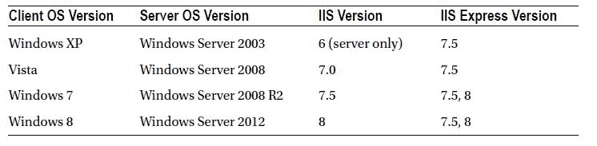
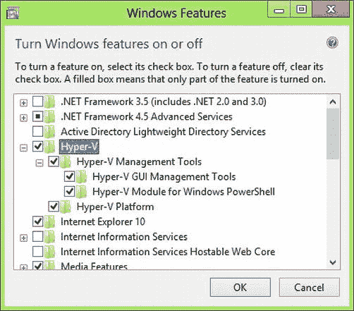

# 三、设置您的环境

3-1.获得理想的开发人员硬件

问题

您是 Microsoft 开发的新手，想知道入门需要什么。您不确定您当前的计算机是否适合开发人员。如果您需要升级，您如何向管理层证明该硬件的成本是合理的？

解决方案

理想的开发机器有强大的多核 CPU、快速而丰富的磁盘驱动器和大量的 RAM 连接到多个大型平板显示器上；并且需要一个足够强大的显卡来驱动它们。

作为一名 ASP.NET MVC 开发人员，你正在编写运行在服务器或云中的软件。您创建的软件有一天可能会被成千上万的人使用，它可能会成为您公司的重要资产。你用来创建和测试这个软件的工具将比典型的文字处理器或网页浏览器对你的电脑提出更高的要求。对于某些开发活动，您可能需要在虚拟机中同时运行几个操作系统。您的开发工具将有许多窗口和工具栏，并且您经常需要同时处理许多打开的文档。为了避免引入出现在产品中但无法在开发人员机器上重现的错误，您的开发环境应该尽可能与您的部署环境相匹配。

企业根据投资回报(ROI)做出技术购买决策。为了证明您理想的开发人员硬件，您需要编写一个商业案例，展示如何通过更好的开发人员生产力来实现 ROI。

它是如何工作的

拥有一台合适的开发机器是开发人员成功的一个重要因素。如果您在运行错误操作系统的功能不足的机器上进行开发，并且在该环境上没有适当的权限，那么您和您的团队可能会浪费大量时间来对抗您的环境。

贵公司提供给销售人员的低成本机器不一定适合开发人员。如果距离你上次升级电脑已经过去了五年，那么你现在使用的电脑可能也不是最合适的。

为开发人员选择合适的硬件并不困难。根据 PayScale`(www.payscale.com)`,. NET 开发人员的平均年薪约为 87，000 美元。假设你一周工作五天，每天工作八小时，这将算出大约每小时 42 美元。如果拥有合适的开发硬件每天可以为您节省两个小时，那么您的公司每周可以节省 420 美元。对于一个计划耗时六个月的大型项目，您可以节省超过 10，000 美元。由于为您的销售人员购买的笔记本电脑与合适的开发人员机器之间的价格差不到 500 美元，因此您的公司批准硬件升级应该是理所当然的，尤其是对于高级开发人员和架构师而言，他们的时薪可能远远超过 42 美元。

以下是您可以添加到非标准硬件采购合理性建议 中的一些其他内容:

*   您的部署目标是具有双六核超线程 CPU 和 128 GB RAM 的 64 位服务器。您计划使用高级的异步和并行编程技术，但是在您当前的机器上无法正确调试。
*   您的部署目标是 64 位操作系统。对于笔记本电脑上当前的 32 位操作系统，您不可能知道垃圾收集在消耗大量内存时会如何影响您的应用。
*   您希望使用 Visual Studio 的性能分析工具，但是分析的结果在您当前的环境中是不确定的。

拥有合适的硬件是开发人员工具箱的重要组成部分。它让你保持动力，让你更快地完成工作。贵公司中做出硬件采购决策的人可能不知道您的特殊要求。在大多数情况下，要求得到你需要的东西不会有什么坏处。他们能做的最糟糕的事情就是说不。

如果你是一个购买自己硬件的独立开发人员，前面提到的增加也适用于你的预算。唯一不同的是，这个等式变成了在给定的时间内你能完成多少个项目。如果有什么不同的话，那就是如果您正在从事固定价格的项目，这一点对您来说更加重要。

显影机硬件

在你拿出你的证明文件 之前，你需要详细说明你的开发机器。

你需要做的第一个决定是买台式电脑还是笔记本电脑。嗯，在一个完美的世界里，答案应该是，“是的！请每样一个。”在微软和谷歌这样的公司，这实际上是标准问题。如果你必须选择，对我们大多数人来说，笔记本电脑是最好的选择。与同等的台式机相比，笔记本电脑功能更弱，价格更高，但它们带给您的灵活性是值得的。如果你的雇主允许你在家工作，那就更是如此。

笔记本电脑应该有一个兼容的坞站，一个好的显卡，快速的 CPU，大量的磁盘空间和内存，还应该有一个高清显示屏。

对于 CPU 来说，你应该优先考虑功率而不是电池寿命。在大多数情况下，您在连接笔记本电脑的情况下进行编码。如果您使用英特尔处理器，这意味着至少要有酷睿 i5，但四核 i7 是最好的。节省的两个小时中的大部分将来自于点击 F5 和让你的页面出现在屏幕上之间的较短时间。强大的 CPU 是这个等式的主要部分。

大量的 RAM 也很重要，尤其是如果你打算在本地运行一个或多个虚拟机的话。4gb 是绝对的最小值，但如果可以的话，尽量获得 12GB 或更多。

磁盘空间是下一个主要问题。这就是台式机的伟大之处。许多高端台式机都内置了 RAID 控制器。在理想情况下，您应该有一个 250GB 的 SSD 作为系统驱动器，三个 1TB 的驱动器配置为 RAID 5。在笔记本电脑上，你应该选择一个既有 SSD 又有标准硬盘的选项。通过使用固态硬盘，启动时间明显加快。在运行 Windows 8 的固态硬盘笔记本电脑上，冷启动时间不到 7 秒。当你考虑到许多公司机器的启动时间长达三分钟这一事实时，这是令人惊讶的。除了内置硬盘之外，通过 USB 3 或 Thunderbolt 连接外置硬盘也是不错的选择。你可以花不到 150 美元买到 4TB 的外置硬盘。这些是归档虚拟机和备份电脑的理想选择。即使您有足够的网络存储，您的网络管理员也不会乐意看到您通过局域网复制 200GB 的 VHD。

笔记本电脑不需要美观。这是一台用来完成工作的机器，而不是用来给当地咖啡店的咖啡师留下深刻印象的。你不应该在意你的电脑是否难看，但你应该关注整体的构建质量。你的高端笔记本电脑如果每次打喷嚏就坏掉，那就没用了。

触摸屏

另一个在 Windows 电脑上越来越普遍的功能是触摸屏。在过去，这是一个新奇的事情，即使是买了触摸屏的 PC 的人也从来没有实际使用过触摸部分。Windows 8 改变了这一切。随着微软 Surface 和数百款其他触摸友好的 Windows 8 设备上市，数百万台 ipad 和 1 亿部智能手机和 iPod touch 设备，你几乎可以保证有人会使用触摸优先的设备访问你的应用。如果您正在开发一个将通过互联网向公众公开的应用，可能会有大量的触摸用户。

你是否应该在你的开发机器上有一个触摸屏与你花多少时间开发用户界面组件有关。我的经验是，如果你花超过 30%的时间开发用户界面组件，你应该有一个触摸设备。这并不一定意味着你的主显影盒有触摸屏。你可以有一个辅助设备，比如 iPad 或类似的设备，用于完整性检查，确保你的应用在只触摸或触摸优先的用例中可用。

显示

最后但同样重要的是你的展示。对于笔记本电脑本身，我推荐 15 英寸的显示屏。17 英寸的屏幕还可以，但在我看来，17 英寸的笔记本电脑携带起来太笨重了。除了笔记本电脑显示器，您还应该有一个支持两个外部显示器的扩展坞。请务必小心，确保连接器是 DVI 或 DisplayPort。这是获得显示器全分辨率所必需的。VGA 端口根本不能满足高分辨率显示器的需求。

在理想情况下，你应该有两台 24 英寸的 1080p 高清显示器。您将一个监视器用于 Visual Studio 的最大化，而另一个监视器用于其他所有内容。

[图 3-1](#Fig1) 显示了一个理想的开发人员工作站。它包括一个为两台 24 英寸显示器供电的高功率台式机。左侧有一个运行 Windows 8 的三星 Series 7 Slate 的 MS Build 版。在右边，有一台旧的笨重的笔记本电脑运行着标准的公司机器映像。


[图 3-1](#_Fig1) 。一个“完美世界”的开发者设置

拥有两个大显示屏可以为您的所有窗口提供大量空间。它能让你拥有一切你需要的东西。它节省了大量的时间，而这些时间经常被浪费在寻找特定的窗口上。

触摸屏计算机允许您在应用的用户界面上进行一些基本的触摸兼容性测试。

拥有笨重的笔记本电脑是完美世界设置场景的重要组成部分。它可以帮助你避免可怕的“但它在我的机器上有效”综合症。这是一个常见的问题，测试人员有时用户会发现您的应用有问题，但是开发人员无法在开发机器上重现这个问题。购买一台最近退役的旧笔记本电脑应该不难。一种替代物理笔记本电脑的方法是让虚拟机运行桌面映像。拥有额外的笔记本电脑是有益的，因为除了给你一个准确的测试 PC，它还提供了额外的屏幕空间。

除了这里显示的内容之外，您还可以在数据中心运行许多虚拟机，用于特定的任务，例如在旧的 web 浏览器上进行测试。

与发送到 QA(质量保证)相比，开发人员发现并当场修复的每个 bug 都节省了几个小时的额外工作，在 QA(质量保证)中，它需要被记录下来，并返回给您进行验证，等等。

鼠标和键盘

优质的鼠标和键盘通常是开发人员工作站中被忽视的组件。它们应该符合人体工程学，长时间使用舒适。应避免使用无线外设，而应使用插入坞站或 USB 集线器的有线设备。无线键盘需要的电池似乎总是在最糟糕的时候没电。它们还会受到干扰，这可能会导致打字错误和延迟。

摘要

总结一下我们到目前为止讨论的所有内容，[表 3-1](#Tab1) 显示了一份硬件清单 要交给你的经理。

[表 3-1](#_Tab1) 。硬件库存清单

| 量 | 项目 | 描述 |
| --- | --- | --- |
| one | 开发人员笔记本电脑 | CPU:英特尔四核 i7 12GB 内存 250GB 固态硬盘和 500GB 标准硬盘 15 英寸显示屏 USB 3 或 Thunderbolt 支持触摸屏(可选)8 点或更多电容式触控 Windows 8 专业版 64 位 |
| one | 系泊部位 | 支持 2 个 DVI 或 DisplayPort 用于外部显示器 |
| Two | 液晶显示器 | 24 英寸，1920 ×1080 高清显示屏 |
| one | 外置硬盘 | 2TB–4TB，支持 USB 3 或 Thunderbolt |
| one | 测试笔记本电脑 | 公司标准制造(质量应等同于该领域最差的机器) |
| one | USB 键盘 | 符合人体工程学的全尺寸键盘，长时间使用舒适 |
| one | USB 鼠标 | 带有可编程额外按钮的鼠标(您可以在 Visual Studio 中将它们配置为映射到热键) |

3-2.为您的开发机器选择操作系统

问题

在理想情况下，您的开发人员机器使用与您的生产服务器相同的操作系统和配置 。不幸的是，这并不总是可能的。例如，如果您正在将应用部署到 Windows Azure，则没有在桌面上安装 Azure 的选项。您可能遇到的另一个问题是，您要支持运行在多个不同版本的 Windows Server 上的多个应用。您可能还在开发桌面甚至 Windows 8 风格的应用。开发商该怎么做？您需要知道应该在您的开发机器上运行哪个操作系统。

解决办法

这个大问题的解决方案是操作系统虚拟化。有几个产品允许您在 Windows 上同时运行几个操作系统作为虚拟机。但是，你仍然需要选择一个主机操作系统。作为一名 ASP.NET MVC 开发人员，Windows 8 Professional 可能是您开发机器上主机操作系统的最佳选择。

它是如何工作的

Windows 8 是首款内置虚拟机管理程序的桌面操作系统。微软的 Hyper-V 已经可以在 Windows Server 上使用，现在也可以在桌面 Windows 上使用。虚拟机管理程序允许您在本地桌面计算机上以接近原始硬件的速度运行虚拟机。过去，您可以使用 VMWare Workstation、Virtual PC 或 Oracle VirtualBox 获得类似的功能。Hyper-V 的不同之处在于，与用户模式应用(如虚拟 PC)相比，您的虚拟机更接近于金属运行，并且产生的 I/O 开销更低。

如果您无法运行 Windows 8，次佳选择是在 Windows 7 或 Mac OS 上运行 VMWare Workstation。尽管 VMWare Workstation 运行在用户模式下，这意味着它是一个运行在 Windows 之上的应用，但它确实为硬件辅助虚拟化提供了强大的支持，甚至可以运行 3D 图形。

几乎在所有情况下，您都应该为您的开发环境使用虚拟机。以下是原因:

*   您可以拥有开发环境的虚拟化版本，其操作系统与您维护的所有系统的部署目标的配置相匹配。
*   在您经历开发的各个阶段时，有时您需要试验一些有风险的组件和配置，这些组件和配置可能会损害您的机器。Hyper-V 和 VMWare 都具有快照功能。使用快照，您可以在给定时间拍摄机器的照片，然后在以后还原到该点。例如，在开始 SharePoint 安装之前，您拍摄一个快照。在安装过程中，您按错了按钮。SharePoint 会失控，对您的机器造成极大的破坏。您可以从快照恢复，而不是从头开始重建您的整个机器，一切都会恢复正常。快照的另一个重要用途是测试安装程序。您可以运行安装程序，验证它不起作用，修复问题，回滚到快照，然后重试。
*   为团队的所有成员提供一致的开发人员机器映像。VMWare 和 Hyper-V 都支持创建机器模板。这允许您使用项目所需的所有工具创建基础映像。当一个新的团队成员加入进来时，您可以启动一个新的虚拟机，让他或她几乎立即高效工作。
*   跨不同版本的 Internet Explorer 进行测试。因为不可能在同一台计算机上同时安装两个版本的 Internet Explorer，所以使用虚拟机可以解决这个问题。这种技术也可以用于 MS Office 或其他具有相同限制的工具。
*   虚拟机还具有使用虚拟硬件(如网卡和 iSCSI)的独特能力。例如，使用 iSCSI，您可以创建需要共享存储的 Windows 服务器群集。如果没有虚拟化，您将需要为 SAN 产品包(如 EMC PowerPath)购买昂贵的专业硬件和软件许可。
*   大多数公司都在虚拟化他们的生产服务器。这使得您的代码很有可能最终被部署到虚拟机上。在几乎与生产环境相同的环境中开发和测试代码，可以减少部署应用时遇到的问题。

我建议您设置您的开发环境来尽可能模拟生产。下面是一个虚拟机设置示例。

*   RAM: 4GB
*   中央处理器:2
*   磁盘 1: C:系统 60GB
*   磁盘 2: E:日志 10GB
*   磁盘 3: F:数据 30GB
*   操作系统:Windows Server 2012 标准版

3-3.在 IIS Express、IIS 8 和 Visual Studio 开发服务器之间进行选择

问题

当你使用 ASP.NET MVC 开发一个 web 应用时，你需要一个本地的 web 服务器来测试和调试你的应用。Visual Studio 为您提供了几种选择，包括它自己的内置开发服务器、IIS Express 或 IIS 的完整版本。你需要知道你应该使用哪种网络服务器，以及它们之间的区别。

解决方案

Internet Information Services(IIS)的完整版本应该几乎总是您开发环境的首选。虽然 Visual Studio 2012 附带了一个名为 IIS Express 的轻型 IIS 版本和功能更差的 Visual Studio 开发服务器，但这两个版本都缺少一些功能，并且有一些限制。您可能还会发现，一些在 IIS Express 上运行良好的东西在部署到生产环境时会失败。

它是如何工作的

根据您选择的项目模板，Visual Studio 2012 默认为 IIS Express 或 Visual Studio 开发服务器。IIS Express 8 与 Visual Studio 2012 捆绑在一起，默认情况下作为安装的一部分进行安装。对于 Visual Studio 的早期版本，IIS Express 可以单独下载和安装。尽管这些轻量级 web 服务器的功能不如完整版的 IIS，但它们在以下场景中非常有用:

*   您正在 Windows XP 上开发 ASP.NET 应用。如果您的公司仍然强迫您在 Windows XP 上开发，并且您没有访问虚拟开发环境的权限，那么您别无选择，只能使用 ASP.NET 开发服务器或 IIS Express 7.5，因为 Windows XP 不支持 IIS 的完整版本。
*   您公司的安全策略禁止在桌面计算机上安装 web 服务器，或者不允许用户对他们的计算机进行管理访问。由于 IIS Express 不作为服务运行，并且不需要管理权限，因此您仍然可以使用它，而不会违反您公司的策略。
*   您需要让多个用户在同一台计算机上独立工作。
*   您很懒，只想进行 F5 调试，而不需要担心配置 web 服务器。
*   您没有开发计算机的管理权限。

由于所列出的情况并不少见，而且许多开发团队都受到这些限制的困扰，所以 Microsoft 已经付出了一些努力来提供一个基于 IIS 的开发服务器，它支持许多代码功能，但消除了在桌面上运行 web 服务器的管理负担和潜在的安全问题。

其他开发人员确实需要 IIS 的全部功能，尤其是开发复杂应用的团队。

[表 3-2](#Tab2) 显示了 IIS 和 IIS Express 的主要区别。最重要的区别是流程模型以及对应用池和应用身份的支持。这些都是非常重要的差异，它们会影响应用在部署时的行为。除了琐碎的应用，我强烈建议在您的开发机器上使用完整版本的 IIS。

[表 3-2](#_Tab2) 。IIS 和 IIS Express 之间的主要区别

| 特征 | （同 ImmigrationInspectors 移民检查） | 服务器 |
| --- | --- | --- |
| 部署方法 | Windows 功能 | 包含在 WebMatrix 和 Visual Studio 2012 中。也可以独立下载。 |
| 支持的 Windows 版本 | Windows Vista、Windows 7、Windows 8 以及 Windows Server 的所有版本 | Windows XP 之后的所有版本 |
| 对非管理员的支持 | 不 | 是 |
| 支持的协议 | 对 HTTP、TCP、命名管道和 Microsoft 消息队列的 HTTP、HTTPS、WebDAV、FTP 和 WCF 支持 | HTTP、HTTPS 和 WCF 支持 HTTP |
| IIS 扩展支持 | 支持数百个 IIS 插件，包括平滑媒体流、搜索引擎优化工具包等等。 | IIS Express 有两个内置的扩展。一个用于快速 CGI，另一个用于 URL 重写。无法安装其他加载项。 |
| 过程模型 | 使用 Windows 进程激活服务(WAS) | 开发人员通常通过在 Visual Studio 中开始调试会话来启动该过程。 |
| 支持应用池 | 是 | 在最终用户的上下文中运行。它不使用应用池。 |

如果可能的话，运行 IIS 的完整版本会给你更一致的结果，并帮助你避免“但是它在我的机器上工作”的症状。至于 Windows Vista，Windows 客户端现在可以在其本地桌面上安装 IIS。[表 3-3](#Tab3) 显示了客户端操作系统如何映射到服务器版本。我还列出了可以安装在每个客户端操作系统上的 IIS Express 版本。

[表 3-3](#_Tab3) 。客户端操作系统版本以及相关的服务器和 IIS 版本



3-4.填充您的开发工具箱

问题

一旦您的开发服务器/工作站准备就绪，您需要安装您的开发工具。您需要知道哪些工具需要安装在您的工作站上。

解决办法

以下是推荐用于 MVC 开发的工具列表。

*   *Visual Studio 2012* :对于大多数开发者来说，专业版应该足够了。学习微软开发的学生和其他人可以使用 Visual Studio 2012 Express for Web。
*   *谷歌 Chrome* :用于测试跨浏览器兼容性。

*   *Chrome Web 开发者工具*:有用的开发者工具栏。
*   Firebug Lite :类似 Firefox 的 Firebug，但没那么好。

*   *Mozilla Firefox* :用于测试跨浏览器兼容性。

*   Firefox 的 Firebug 插件:必不可少的调试工具。
*   *Web Developer add-on* :一个为开发者提供许多有用工具的工具栏。
*   YSlow add-on:由 Yahoo 开发的一个工具，用于帮助诊断客户端性能问题。

*   Fiddler 2 :调试客户端代码必不可少的 web 代理。
*   *Wireshark* :网络协议分析器。如果您需要深入了解应用的网络相关问题，Wireshark 允许您监控计算机上的所有网络接口，并检查单个网络数据包。
*   *IIS* :微软的 web 服务器。这是一项需要启用的 Windows 功能。
*   *SQL Server* :您应该在本地机器上有一个 SQL Server 的本地副本，在那里您可以随意操作数据和修改模式，而不会影响其他团队成员。您的团队还应该有一个专用的 SQL Server 来进行集成测试。根据您的需要，SQL Server Express 应该完全适合您的本地开发环境，除非您需要使用 Express 上没有的功能。
*   Evernote 或 OneNote:记录笔记并与团队成员分享的方式是一种重要的交流工具，也是记录事情的有用方式。
*   Notepad ++ :一个自由文本编辑器，为许多不同类型的文件提供颜色编码。
*   Komodo Edit :自由文本编辑器，支持多种文件类型和编程语言，包括 CoffeeScript、PHP、Python、Ruby、HTML5 和 JavaScript。
*   *Windows Sysinternals tools* :一套令人惊叹的工具，最初由 Mark Russinovich 于 1996 年创建，但一直在不断更新和改进。
*   远程桌面连接管理器(Remote Desktop Connection Manager):一个控制台，帮助你管理与许多远程计算机的连接。
*   经典的开始菜单:对于那些运行 Windows 8 但没有开始菜单的人来说，这个应用在你的屏幕上增加了一个 Windows XP 风格的开始菜单。它包括许多自定义菜单的选项，包括更改用于开始菜单的图形，以及创建自定义主题。
*   这是另一个用于 Windows 8 的开始菜单插件。Start8 没有像经典的开始菜单一样重新创建 Windows XP 开始菜单体验，而是将开始菜单的概念与 Windows 8 开始屏幕相结合。
*   *VirtualCloneDrive*:Windows 7 的一个实用程序，允许你挂载 ISO 镜像。如果您订阅了 MSDN，并且经常下载 ISO 或 IMG 格式的微软产品，这将会很有帮助。

3-5.安装 Hyper-V 并设置虚拟机

问题

您希望在本地计算机上运行 Windows Server ，但是出于各种原因，您仍然需要安装 Windows 的桌面版本。您认为虚拟化是答案，但您不确定如何设置它。

解决方案

有两种方法可以解决这个问题。

*   在本地 PC 上运行 VMWare Workstation、Virtual Box 或 Hyper-V。
*   设置专用的 VMWare 或 Hyper-V 服务器，并使用远程桌面访问虚拟机。

如果您可以访问 Hyper-V 或 VMWare 服务器，在服务器硬件上创建虚拟机比本地虚拟机有一些优势。这些优势包括运行大量机器的能力，创建具有更多 CPU 和本地可用内存的更大机器，以及虚拟机可以一直运行的事实。由于虚拟机一直在运行，您可以随时使用远程桌面来访问它。不幸的是，并不是所有的开发团队都能访问 Hyper-V 服务器或集群。在某些情况下，您可能具有访问权限，但由于环境由另一个组管理，因此您可能在管理服务器、拍摄和恢复快照、附加 ISO 映像以安装软件以及执行其他常见任务时遇到困难。

解决此问题的方法是在本地开发计算机上运行虚拟机。这种方法的主要优点是，您可以完全控制环境，可以随意拍摄和恢复快照，并且由于机器是在本地运行的，因此不会有网络延迟引起的问题。这种方法确实需要你有一台相当大的有大量内存的电脑。

如果您运行的是 Windows 8，您可以选择安装 Hyper-V，它可以为您提供几乎裸机的性能，可能是桌面上性能最好的虚拟机选项。它也是 Windows 的一部分，因此您不需要购买任何额外的软件。

工作原理

在本节中，我将讨论安装和配置 Hyper-V 虚拟机管理程序，以及设置运行 Windows Server 2012 的虚拟机。如果您运行的不是 Windows 8，您将无法理解本部分的内容。Hyper-V 的替代品可以在旧版本的 Windows、Mac OS 和 Linux 上运行。其中，Oracle 的 VirtualBox 是一个不错的选择，因为它相当健壮，几乎可以在任何硬件上运行，并且是免费的。安装 VirtualBox 的分步说明可以在 VirtualBox 网站的`https://www.virtualbox.org/manual/ch01.html#intro-installing`找到。

逐步安装 Hyper-V

Hyper-V 是 Windows 8 Pro 的内置功能。它在基于 ARM 的 Windows 8 版本 WinRT 中不可用，在以前版本的 Windows 上也不可用。运行 Hyper-V 的系统要求如下:

*   支持二级地址转换(SLAT)的 64 位系统。此功能在所有当前版本的英特尔和 AMD 处理器上都可用，但如果您的电脑较旧，则可能不可用。
*   64 位 Windows 8 专业版或 Windows Server 2012。
*   4GB 内存(实际上，您应该有 12GB 或更多)。

由于 Hyper-V 是一项 Windows 功能，您可以使用“打开和关闭 Windows 功能”应用来安装它。要在 Windows 8 上实现这一点，请按键盘上的 Windows 键，然后键入 turn fe。在搜索边栏上，轻按或点按“设置”以在设置中搜索。你的屏幕看起来应该类似于图 3-2 。


[图 3-2](#_Fig2) 。搜索设置

在搜索结果部分，您会看到打开或关闭应用的功能。轻按或点按应用以启动它。

点击应用后，Windows 切换到桌面模式，出现 Windows 功能框。在 Windows 功能应用中，单击 Hyper-V。单击最外面的节点会自动选择所有子组件。展开节点以确认所有子组件都被选中，如图 3-3 所示。



[图 3-3](#_Fig3) 。Windows 功能应用

单击“确定”按钮开始安装。

几分钟后，向导会通知您安装完成。您可能需要重新启动工作站。

Windows 完成重启后，您应该会在开始屏幕上看到两个新的磁贴:Hyper-V 管理器和 Hyper-V 虚拟机。为了避免下次需要运行 Hyper-V 时搜索开始屏幕，右键单击(如果有触摸屏，则向下滑动)Hyper-V 管理器磁贴，然后单击固定到任务栏。你的屏幕应该类似于[图 3-4](#Fig4) 。


[图 3-4](#_Fig4) 。将应用固定到桌面任务栏

Hyper-V 图标现在固定在桌面的任务栏上。Windows 8 任务栏与 Windows 7 中引入的任务栏相同，它将快速启动工具栏与任务栏结合在一起。

现在我们已经安装了 Hyper-V，我们需要创建我们的开发人员机器映像。

您首先需要的是操作系统的 ISO 映像。ISO 映像是包含 CD 或 DVD 内容的文件。如果您为一家大公司工作，他们可能有一个自定义版本的 Windows Server，除了基本的 Windows 安装之外，还有标准的安装管理工具和配置。如果这是可用的，你应该使用它。目标是使您的开发机器尽可能像生产机器一样。

如果您没有特定于公司的 Windows Server 版本，但订阅了 MSDN，则可以从 MSDN 网站下载该映像。

在这个例子中，我使用的是微软最新的服务器操作系统 Windows Server 2012。澄清一下，ASP.NET MVC 不需要 Windows Server 2012，可以在任何支持。NET 框架 4.5。

下载完 ISO 文件后，您需要使用 Hyper-V 管理器创建一个新的虚拟机。单击我们之前创建的 Hyper-V 管理器图标以打开 Hyper-V。Hyper-V 管理器屏幕，如图 3-5 中的[所示，分为三个主要部分，包括一个服务器列表窗格、一个包含虚拟机信息的内容区域，以及一个包含可对选定虚拟机执行的操作列表的操作窗格。左侧是一个树形视图，列出了所有 Hyper-V 服务器。全新安装后，Hyper-V 管理器仅列出您的本地计算机。通过右键单击 Hyper-V 管理器并选择连接到另一台计算机，可以将其他计算机添加到此列表。](#Fig5)


[图 3-5](#_Fig5) 。Hyper-V 管理员

如果您单击本地服务器，您会在“虚拟机”下的中间部分看到一个计算机列表。由于您尚未创建任何虚拟机，因此不会显示任何内容。

创建虚拟交换机

在创建第一个虚拟机之前，您需要创建一个虚拟交换机来为您的虚拟机启用网络连接。虚拟交换机是基于软件的第 2 层网络设备。它允许您的虚拟机通过映射到安装在 PC 上的网络适配器来连接到物理网络。还可以使用此功能创建仅可由连接到交换机的其他虚拟机访问的专用网络。

要创建虚拟交换机，请单击虚拟交换机管理器。。。，位于“动作”面板上。这将打开虚拟交换机管理器对话框。

在虚拟交换机管理器对话框的右侧，确保为您希望创建什么类型的交换机选择了外部？复选框。外部交换机允许您的虚拟机访问网络，就像它是您网络上的物理机一样。单击创建虚拟交换机按钮。

在虚拟交换机属性对话框中，将交换机命名为 **ExternalSwitch1** 。在注释字段中，输入**连接到外部网络**。

在这个演示中，我将在三星 7 系列平板电脑上创建虚拟机，这是一款基于 Windows 8 专业版的平板电脑。由于这台电脑是移动的，我可能会在许多没有有线网络的地方使用这台虚拟机。因此，我正在利用 Windows 8 上 Hyper-V 的一个新功能，该功能允许我为外部网络选择 Wi-Fi 适配器。在您的机器上，您可以选择任何可用的网络适配器。

保持其余的默认设置，使您的屏幕看起来类似于[图 3-6](#Fig6) ，然后点击 OK 按钮。Hyper-V 将开始配置您的新适配器。


[图 3-6](#_Fig6) 。使用 Hyper-V 虚拟交换机管理器创建虚拟交换机

一个弹出框可能会通知您此更改可能会中断网络连接。如果出现提示，请单击是。

几分钟后，设置被应用，窗口关闭。

现在您已经创建了一个交换机，让我们继续创建虚拟机。在操作面板上，单击新建并选择虚拟机。

将显示新建虚拟机向导。在开始之前页面上单击下一步。

在“名称”字段中，输入 ASP.NET MVC 开发机器。或者，您可以单击“将虚拟机存储在不同的位置”复选框，并选择一个具有足够磁盘空间的位置。您应该选择一个至少有 30GB 可用空间的位置。如果拍摄大量快照，虚拟机所需的空间可能会非常大。在这个例子中，我使用一个 USB 3 1TB 的外部硬盘作为我的虚拟机位置。该组态画面是图 3-7 中[所示的](#Fig7)。


[图 3-7](#_Fig7) 。指定虚拟机的名称和位置

在指定名称和位置屏幕上单击下一步。

对于启动内存，至少需要 2GB。如果您选中“为此虚拟机使用动态内存”复选框，Hyper-V 会自动调整为该虚拟机分配的内存量。例如，如果我为虚拟机分配了 2GB 的 RAM，但实际上只分配了其中的一小部分，Hyper-V 会欺骗虚拟机，使其认为它仍然有 2GB 可用，但会悄悄地窃取一些未分配的 RAM，并将其分配给其他正在运行的虚拟机或主机本身。分配内存配置屏幕如图 3-8 中的[所示。](#Fig8)


[图 3-8](#_Fig8) 。指定启动内存

在分配内存页面上单击下一步，继续配置网络。

 **注意**与虚拟 PC 等用户模式虚拟化技术相比，运行 Hyper-V 的一个不同之处在于，一旦安装了 Hyper-V 角色，主机操作系统实际上就被虚拟化了，并在虚拟机管理程序之上运行。主机虚拟机确实有一些特殊的权利，可以以其他虚拟机不能的方式与硬件对话，但它仍然是一个虚拟机。因此，当启用动态内存时，Hyper-V 实际上可能会从您的虚拟机中取出未使用的内存，并将其交给主机。

对于连接，选择 ExternalSwitch1，我们创建的交换机。单击“下一步”继续连接虚拟硬盘。

在 Connect Virtual Hard Disk 屏幕上，我们将磁盘的名称更改为 **MVCSystem** ，并将大小更改为 60GB。该磁盘将动态扩展，因此它将只占用它实际需要的物理空间。您应该注意到默认选项是使用新的。vhdx 格式。此格式与旧版本的 Hyper-V 不兼容，如果您认为可以将此虚拟机用于旧版本的 Hyper-V，请选择“以后连接虚拟磁盘”。[图 3-9](#Fig9) 显示了连接虚拟硬盘配置屏幕。


[图 3-9](#_Fig9) 。连接虚拟硬盘

单击 Finish 按钮开始创建虚拟机。几分钟后，您的虚拟机就创建好了，您应该会看到它列在 Hyper-V 管理器的虚拟机部分下。

 **注意**关于虚拟硬盘，需要注意的一件有趣的事情是，从 Windows 7 开始，vhd 可以安装到物理机器上，就像连接到系统的任何其他硬盘一样使用。

接下来，我们向您的虚拟机添加硬盘。我们这样做是为了让我们的新服务器符合我们的生产服务器规格。我们将创建两个驱动器:一个 E:驱动器，包含我们的 IIS、SQL Server 和应用日志文件；和一个 F: drive，其中包含我们的应用文件和数据。

在 Hyper-V 管理器中，右键单击您的虚拟机并选择设置。。。从弹出菜单中。看看您可以更改的设置。您可以调整内存和处理器的数量和类型，添加 IDE 和 SCSI 控制器，创建 COM 端口，甚至更改 BIOS 设置。

要向虚拟机添加额外的磁盘驱动器，请在设置窗口的左窗格中单击硬件下的 IDE 控制器 0，然后在选中硬盘驱动器的情况下单击添加，如图[图 3-10](#Fig10) 所示。


[图 3-10](#_Fig10) 。添加附加硬盘

在新硬盘屏幕上，确保 IDE 控制器 1 的位置设置未被使用。如果是，选择列表中的下一个位置。在“媒体”部分，确保选择了“虚拟硬盘”，然后单击“新建”按钮。

遵循向导，保留默认值。在 Specify Name and Location，将磁盘命名为**aspmvclogs . vhdx**，并指定我们保存系统驱动器的同一文件夹。在“配置磁盘”页面上，将大小设置为 10GB。

重复前面的步骤，但是这次选择 IDE 控制器 1，位置 1，将磁盘命名为 **ASPMVCData.vhdx** ，并将磁盘的大小配置为 30GB。如果您认为您的数据需要额外的空间，请随意添加。请记住，此设置的目标是与您考虑的生产相匹配。

安装操作系统

既然您已经创建了虚拟机并添加了硬盘，现在就可以开始安装操作系统了。要安装操作系统，首先需要将包含 Windows Server 2012 的 ISO 映像安装到 DVD 驱动器上。要在 IDE 控制器 1 下执行此操作，请选择 DVD 驱动器。在媒体下，选择图像文件。单击浏览。。。然后选择您的 ISO 文件。设置对话框应类似于图 3-11 中的[。](#Fig11)


[图 3-11](#_Fig11) 。将 ISO 镜像安装到光盘驱动器

单击确定。应用更改，窗口关闭。

在 Hyper-V 管理器控制台中，单击您的虚拟机并选择连接。。..一个黑屏窗口显示一条消息，让您知道虚拟机处于关闭状态。

在“虚拟机连接”窗口工具栏的左侧，单击绿色的开始按钮启动您的计算机。虚拟机从光盘启动，并开始 Windows 安装过程。

几分钟后，安装程序开始。当系统提示选择要安装的操作系统版本时，请确保使用 GUI 安装服务器。我们的开发环境需要 GUI。单击下一步。

当询问你想在哪里安装 Windows 时，选择驱动器 0，如图[图 3-12](#Fig12) 所示。


[图 3-12](#_Fig12) 。选择 Windows 系统卷

安装开始后，大约需要一个小时才能完成。然后，系统会提示您创建管理密码。

输入密码后，Windows 将完成安装，并最终显示登录屏幕。

登录 Windows 并尝试打开 Internet Explorer 以验证您是否具有网络连接。

虽然您可以继续使用 Hyper-V 虚拟机连接(HVVMC)应用，但如果您使用远程桌面客户端进行连接，您将拥有更多功能。HVVMC 有一些优势，比如控制特殊的 Windows 键，允许你观看机器启动，但是 RDP 允许你允许 VM 使用你的两个显示器，并且支持更多的颜色和更高的屏幕分辨率。

一旦连接上，您可以对服务器配置进行一些更改，使其更容易用作您的开发环境。这些任务包括:

*   进入磁盘管理，并为您在前面创建的其他磁盘驱动器分配驱动器号。这应该符合您的生产机器规格。在本例中，我使用 C 表示驱动器 0，E 表示驱动器 1，F 表示驱动器 2。如果您愿意，可以利用 Windows Server 2012 对 GUID 分区表磁盘和 ReFS 文件系统格式的支持。
*   在系统属性的高级选项卡下，打开性能选项对话框。从其“高级”选项卡中，选择“调整程序以获得最佳性能:。这使得 Visual Studio 等应用可以在服务器操作系统上更好地运行。
*   配置 Windows Update。如果您的公司有服务器修补解决方案(而不是 Windows Update ),如 Lumension，请确保安装并配置了该解决方案。
*   关闭 IE 增强的安全配置。您可以从服务器管理器中完成此操作。单击本地服务器，然后在属性下，单击 IE 增强的安全配置旁边的链接。这个设置对于生产服务器很有用，但是对于开发机器来说限制太多了。

3-6.使用 RDP 连接到远程开发机器

问题

您已经在 Hyper-V 中创建了一个新的虚拟机，并且希望使用远程桌面连接到该虚拟机。您已经将计算机名称输入到 RDP 客户端，但是它无法连接。你需要解决这个问题，这样你才能工作。

解决方案

默认情况下，Windows Server 是安全的。这意味着当您第一次设置您的服务器时，几乎所有东西都被禁用，包括远程桌面。您需要启用远程访问，然后才能使用 RDP 访问虚拟机。

它是如何工作的

若要启用此功能，请从 Hyper-V 管理器控制台连接到您的计算机。登录，然后点击 Windows 键。这将打开 Windows 8 开始屏幕。键入 remote，然后单击搜索窗格上的设置。点击“允许远程访问您的计算机”(参见[图 3-13](#Fig13) )。


[图 3-13](#_Fig13) 。使用 Windows Server 2012 开始屏幕查找允许远程访问小程序

“系统属性”小程序显示在桌面上，并选中了“远程”选项卡。单击“允许远程连接到这台计算机”。将弹出一个警报，通知您将启用新的防火墙例外。单击确定。

然后单击系统属性小程序上的确定。

现在您已经允许 RDP，您可以连接。自 Windows 7 以来，RDP 客户端已经有了一些实质性的改进。Windows 8 版本针对触控进行了优化，因此移动管理员可以使用平板电脑等触控设备轻松管理服务器。它还能够自动检测连接质量，并根据需要调整体验。如果您使用带有多台显示器的系统(从 Windows 7 开始)，远程桌面客户端允许您使用所有显示器进行远程会话。要启用此功能，请单击“显示”选项卡，然后将显示配置栏滑动到最右侧，使其显示为全屏。然后，您可以单击“将我的所有显示器用于远程会话”复选框。

3-7.安装 Visual Studio 2012

问题

您是 Microsoft 开发新手，从未安装过 Microsoft 开发工具。你需要一些帮助来启动和运行。

解决方案

安装 Visual Studio 实际上非常容易。开始之前，你需要做几个决定。

1.  您希望安装哪个版本的 Visual Studio？
2.  您想将其安装在本地计算机上还是虚拟机上？

如果您刚开始从事 Microsoft 开发，Visual Studio Express for Web 可能是您的最佳选择。在第 2 章中，有几个详细介绍微软开发者生态系统的方法。如果您还没有阅读这一章，我建议您在选择产品之前先阅读一下。

在方法 3-1 中，我讨论了在本地操作系统上安装虚拟机的优点。在大多数专业开发场景中，虚拟机方法是首选，但这两种方法都有效。如果您刚刚开始，在本地计算机上安装 Visual Studio 可能会容易得多。

它是如何工作的

在安装 Visual Studio 2012 之前，请确保您的系统符合要求。

支持的操作系统

*   Windows 7 (x64 和 x86)
*   Windows 8 (x64 和 x86)
*   视窗服务器 2008 R2
*   Windows Server 2012

请注意，不支持 Windows XP、Windows Server 2003、Windows Vista 和 Windows Server 2008。

硬件要求

*   1.6 GHz 或更快的处理器
*   1GB 内存(如果在虚拟机上运行，则为 1.5GB)
*   10GB 的可用磁盘空间
*   5400 rpm 硬盘
*   运行于 1024 × 768 或更高分辨率的支持 DirectX 9 的显卡

请注意对兼容 DirectX 9 的视频卡的要求。这可能会排除一些低端的商务笔记本电脑。1.6 GHz 的要求可能意味着 Visual Studio 在一些激进的节能模式下表现不佳，这些模式在一些笔记本电脑上配置为延长电池寿命。为了避免这些问题，请确保在接通电源时将电源设置调整到最佳性能。此外，尽管最低 RAM 要求是 1GB，但实际上您需要至少 4GB 的 RAM 才能工作。在大多数情况下，Visual Studio 不是您运行的唯一应用。

使用 Web 平台安装程序安装 Visual Studio

若要安装 Visual Studio 2012 Express for Web，请使用要安装该产品的计算机访问以下网页:`www.microsoft.com/visualstudio/11/en-us/downloads#express-web`。

安装页面上有两个主要选项:使用 Web 平台安装程序或下载 ISO 映像文件。Web 平台安装程序允许您安装各种工具，包括 WebMatrix、Azure SDK 和数百个其他免费工具和库。如果您不想使用 Web 平台安装程序，或者如果您想要在多台计算机上配置自动安装，ISO 文件会很有用。

在本练习中，我们将使用 Web 平台安装程序。

单击安装链接后，会下载一个小的可执行文件。根据您使用的浏览器，在安装程序启动之前，您可能需要单击一个或多个警告链接。

可执行文件启动后，如果 Web Platform Installer (WebPI)未安装或过期，它会提示您安装或更新 WebPI。WebPI 更新后，它会提示您开始安装 Visual Studio。

 **注意**如果在运行 IE10 时，系统提示您选择一个程序来打开该文件，IE10 可能已经重命名了该文件，因此它以 _EXE 而不是. EXE 结尾。这是 Internet Explorer 中的一项新“功能”，有助于保护您免受可能从不可信来源下载的可执行程序的攻击。要解决此问题，请退出“选择程序”对话框，然后重命名该文件，使其以. EXE 结尾。

安装向导的第一个屏幕应该显示您即将安装 Visual Studio Express for Web with Windows Azure SDK。单击安装。下一个屏幕显示将要安装的项目列表。单击“我接受”以确认您接受许可条款。

安装大约需要 15 分钟。完成后，它会显示产品及其安装位置的屏幕详细信息。您可以单击“完成”按钮继续。然后，您可以退出 Web 平台安装程序。

对于 VS Express for Web，您现在应该在开始屏幕(Windows 8)或开始菜单的文件夹中有一个新项目。首次启动应用后，Visual Studio 可能需要一两分钟来加载您的设置。完成后，您可以查看 Visual Studio 起始页，其中有指向文档和教程的访问链接，或者创建一个新项目。

3-8.为 Visual Studio 2010 安装 Visual Studio MVC 4 附加模块

问题

您是 Visual Studio 2010 的用户，不想升级，或者您正在使用不支持 Visual Studio 2012 的操作系统，但希望在您的下一个项目中使用 MVC Framework 4 。你需要知道如何升级 Visual Studio，让它可以支持 MVC 框架的新版本。

解决办法

Visual Studio 2012 并不是 Visual Studio 中唯一支持 web 开发的版本。它在 Visual Studio 2010 中也受支持。可以使用 Web 平台安装程序(WebPI)下载和安装它。如果您安装了 WebPI，您可以从 Windows 开始菜单启动它。否则，您可以从`www.asp.net/mvc/mvc4.`下载最新的安装包

可以使用 Web 平台安装程序或通过独立的安装程序来执行安装。MVC 4 可以与旧版本的 MVC 并行安装。

它是如何工作的

在安装 MVC 4 Tools for Visual Studio 之前，请确保已经删除了任何旧版本的 MVC 4 框架或工具。这只适用于老版本的 MVC 4，比如测试版或候选发布版。将新版本的 MVC 4 与旧版本的 MVC(比如 MVC 3)并行安装是完全没问题的。MVC 4 安装程序还要求在安装之前安装 Visual Studio 2010 Service Pack 1 或 Visual Web Developer Studio Express 2010 with Service Pack 1。如果缺少这些先决条件，WPI 将在安装过程中添加它们。

如果您从 WebPI 安装产品，您可以使用屏幕左上角的搜索框来搜索 MVC 4。找到 ASP.NET MVC 4 安装程序(Visual Studio 2010)，然后单击添加按钮。然后，您可以单击屏幕底部的安装按钮。

在“先决条件”屏幕上，确认您正在安装正确的软件包，然后单击“我接受”按钮。安装大约需要 15 到 20 分钟，这取决于您的计算机和网络连接的速度。

安装完成后，您可以关闭 WebPI 并打开 Visual Studio。如果您创建了一个新项目，您将会看到 ASP.NET MVC 4 Web 应用的一个新项目类型。

3-9.安装 IIS

问题

您希望针对将在生产中使用的同一版本的 IIS 开发代码。Visual Studio 附带了 IIS Express，但由于这并不完全相同，因此某些功能在生产中的工作方式可能会有所不同。

解决方案

IIS 是 Windows 操作系统的一项功能，可以使用“控制面板”中的“添加 Windows 功能”小程序进行安装。我将展示为 Windows 7 和 Windows 8 服务器安装 IIS 的过程。

它是如何工作的

Windows 7 上的 IIS 7.5

IIS 7.5 是 Windows 7 和 Windows Server 2008 R2 附带的 IIS 版本。可以使用打开或关闭 Windows 功能小程序来安装它。在执行这些任务之前，请确保您的 Windows 安装介质可用。要在 Windows 7 上启动安装程序，请单击开始按钮并键入 **Windows 功能**(参见[图 3-14](#Fig14) )。


[图 3-14](#_Fig14) 。如何在 Windows 7 上找到添加或删除功能小程序

单击打开或关闭 Windows 功能启动小程序。

 **注意**Windows 8 上 IIS 8 的 IIS 安装过程与 Windows 7 几乎完全相同，唯一不同的是找到添加或删除功能小程序的过程。在这两种情况下，搜索都是通过首先点击 Windows 键并键入 **Windows 功能**来启动的。不同之处在于，在 Windows 8 上，你有一个开始屏幕，而不是开始菜单，你需要点击或点击屏幕左侧搜索下的设置按钮，才能在搜索结果中包括 Windows 设置。

在 Windows 功能列表中找到 Internet 信息服务，并确保选择了以下组件:

*   网络管理工具:你需要这个来管理 IIS。在大多数情况下，您需要的只是 IIS 管理控制台。但是，如果您正在迁移现有应用或编写需要与 IIS 6 兼容的应用，则需要包括 IIS 6 元数据库兼容性。此类别中的其他工具包括 WMI 兼容性和 IIS 6 脚本工具。和往常一样，您应该只安装您需要的东西。您安装的组件越多，所需的系统资源就越多，服务器上的攻击面就越大。
*   ASP.NET:你需要这个来支持 MVC(模型-视图-控制器)开发。
*   ISAPI 扩展:你需要它来支持经典模式下的 ASP.NET。
*   *性能特点*:提供内容压缩支持。
*   *安全*:提供多种认证机制。

[图 3-15](#Fig15) 显示了 Windows 功能，打开或关闭 Windows 功能屏幕 部分选择了互联网信息服务功能。


[图 3-15](#_Fig15) 。在 Windows 7 上启用 IIS 7.5

单击“确定”开始安装。如果出现提示，请插入 Windows 安装光盘或浏览到等效文件，如安装的 ISO 文件。

Windows Server 2012 上的 IIS 8

在 Windows Server 2012 上，微软为我们带来了新的服务器管理器应用。这个新的应用允许管理员和开发人员从一个方便的用户界面管理服务器组。在这里，我将向您展示如何使用这个工具向您的开发服务器添加应用角色。

当您登录到 Windows Server 时，默认情况下会打开服务器管理器。如果没有，您可以通过单击任务栏上的快捷方式来启动它。[图 3-16](#Fig16) 显示了服务器管理器如何出现在典型的 Windows 服务器安装中。


[图 3-16](#_Fig16) 。Microsoft Windows Server 2012 服务器管理器

在服务器管理器仪表板上，单击“配置此本地服务器”部分下的“添加角色和功能”。

这将启动添加角色和功能向导。

点击开始之前页面，选择基于角色或基于功能的安装，如图[图 3-17](#Fig17) 所示，然后点击下一步。


[图 3-17](#_Fig17) 。选择基于角色的功能安装

在下一个屏幕上，系统会提示您选择服务器。Windows Server 2012 引入的一项新功能是能够一次在多台服务器上安装服务和角色。例如，如果您有一个由五台前端服务器组成的 web 场，您可以创建一个服务器组，并使用服务器管理器一次性管理所有服务器。在我们的开发服务器的例子中(如图 3-18 所示)，我们只需要管理一台服务器。选择您的服务器，然后单击下一步。


[图 3-18](#_Fig18) 。在添加角色和功能向导中选择要管理的服务器

在下一个屏幕上，选择要安装的服务器角色。我们将安装应用服务器角色，它包括 IIS 以及对 ASP.NET 的支持。IIS 是一个模块系统，它允许您非常具体地指定要安装哪些组件。从安全性和性能的角度来看，只安装您需要的功能非常重要。这降低了安装在计算机上的可能被黑客利用的潜在漏洞的数量，并减少了消耗系统资源的组件数量。[图 3-19](#Fig19) 显示了选择应用服务器角色的选择服务器角色屏幕。


[图 3-19](#_Fig19) 。选择应用服务器角色

单击下一步。您将进入“功能”选项卡。如果您的应用需要其他功能，如旧版本的。NET 框架，您可以使用此屏幕来添加它们。许多应用使用的一些常见功能是消息队列、SMTP、Windows Identity Foundation 和 Media Foundation。如果您不熟悉这些功能，可以单击该功能的名称，该功能的描述将显示在右侧面板上。在本练习中，我们不会安装任何附加功能。不要选中此屏幕上的任何框。单击下一步。

在应用服务器角色屏幕上再次单击下一步。然后，您可以选择希望在角色服务屏幕上安装应用角色的哪些组件。除了 IIS，我们还将添加分布式事务支持、WS-Atomic 事务支持和 HTTP 激活。我将在本书的后面向您展示如何使用这些特性。选中您需要的功能旁边的框。当您点击 Web 服务器角色时，您会看到一个类似于[图 3-20](#Fig20) 的弹出窗口，通知您将安装附加功能。单击添加要素关闭窗口。


[图 3-20](#_Fig20) 。确认提示

单击 Windows Process Activation Services 后，您会收到一个类似的弹出窗口。也在此对话框中单击添加要素。当你完成后，你的屏幕应该看起来类似于[图 3-21](#Fig21) 。


[图 3-21](#_Fig21) 。为应用服务器角色选择角色服务

因为我们选择了 WS-Atomic Transactions 组件，所以在向导的下一阶段，我们被提示导入一个 SSL 证书，这是这个特性所需要的。选择创建自签名证书选项。自签名证书对于开发非常有用。对于生产部署，您可以使用来自可信证书颁发机构(如 VeriSign)的证书，或者如果您的应用运行在您的 intranet 上，您可以使用来自公司颁发机构的证书。

在开发的早期阶段包括 SSL 证书等安全考虑是非常重要的。我见过开发团队在应用部署到生产环境之前，从来没有使用 SSL 测试过应用，这导致了一些重大问题。

在信息屏幕中单击下一步，进入角色服务页面。除了已经选择的项目之外，选择应用初始化和 WebSocket 协议。这些组件位于应用开发类别下。选择角色服务屏幕如[图 3-22](#Fig22) 所示。

我将在本书的后面演示如何使用这些特性。


[图 3-22](#_Fig22) 。为 Web 服务器角色选择角色服务

应用初始化允许您在应用开始预热缓存和预编译页时运行代码，以便在部署或服务器重新启动后，最初访问应用的一些人不会觉得应用的性能很差。

WebSocket 协议是 IIS 的一项新功能，它允许您创建实时交互，如聊天应用，而无需使用轮询等技术。

单击“下一步”按钮，进入确认页面。检查将要安装的所有服务。该列表应该包括您选择的所有角色和功能，以及它们可能具有的任何依赖关系。单击“安装”按钮开始安装过程。如果您愿意，可以关闭窗口，让任务在后台完成。

3-10.将您的 MVC 项目配置为使用 IIS 而不是 IIS Express

问题

您已经在开发计算机上安装了 IIS，但是当您创建新项目时，Visual Studio 仍在使用 IIS Express 或 Visual Studio 开发服务器。您希望使用 IIS 的完整版本，以便您的开发机器更适合生产。您需要将项目配置为使用完整版本的 IIS。

解决办法

与 Visual Studio 中的所有项目模板一样，MVC 项目模板默认使用 Visual Studio Development Server 或 IIS Express。如果要使用 IIS 的完整版本，需要更改项目的配置。

为此，请在 Visual Studio 中打开 MVC 项目。确保以管理员身份运行 Visual Studio。您需要在提升的权限下运行，以便对 IIS 进行更改。默认情况下，Windows 使用一种称为用户帐户控制的功能，该功能使您执行的大多数操作都在较低的安全上下文中运行。这有助于防止您无意中安装恶意应用，如病毒和间谍软件。要以管理员身份运行应用，您可以右键单击该应用的图标，然后选择以管理员身份运行。

它是如何工作的

如果您尚未创建项目，可以通过从 Visual Studio 的“文件”菜单中选择“新建项目”,然后从可用的模板中选择“ASP.NET MVC 4 Web 应用”来创建一个项目。

[图 3-22](#Fig22) 显示新建项目对话框。在屏幕左侧的 Visual C# 下，选择 Web。这将筛选出现在中心窗格中的项目模板，以便只显示 c# ASP.NET 应用项目。请注意，您可以在几个项目类型之间进行选择，包括 ASP.NET Web 窗体、MVC 3、MVC 4、动态数据实体 Web 应用、AJAX 服务器控件、AJAX 服务器控件扩展器、服务器控件和一个空的 ASP.NET 项目。选择 ASP.NET MVC 4 Web 应用，并在 name 字段中为该应用命名。[图 3-23](#Fig23) 显示了默认名称，MvcApplication1。将项目名称更改为**mvcapplicationiis。**


[图 3-23](#_Fig23) 。在 Visual Studio 2012 中创建新的 ASP.NET MVC 4 项目

在“位置”字段中，您应该选择一个不在您的个人用户目录下的位置。我们需要配置 IIS 来访问该路径。它正在不同的安全上下文下运行。我个人倾向于创建一个目录结构，类似于解决方案在生产中的部署方式。例如，如果您的生产服务器标准版在 E:驱动器上安装 web 应用，您应该选择一个路径，如 E:\ WebRoot \ MVC plication 1。

在“解决方案名称”中，输入解决方案的名称。确保选中“为解决方案创建目录”复选框，然后单击“确定”。

现在你可以看到新的 ASP.NET MVC 项目对话框，它显示了项目模板的列表。这些模板包括空模板、基本模板、互联网应用、内部网应用、移动应用和 Web API。我们将在第 5 章中详细介绍项目模板。选择基本模板，并确保在视图引擎对话框中选择 Razor 视图引擎。不要选中“创建单元测试项目”。你的屏幕看起来应该类似于[图 3-24](#Fig24) 。单击“确定”创建您的项目。


[图 3-24](#_Fig24) 。选择 ASP.NET MVC 4 项目模板

创建解决方案后，您应该会看到在解决方案资源管理器中创建的项目文件。若要访问项目的设置页，请在解决方案资源管理器中右击 web 应用项目节点，并从弹出菜单中选择“属性”。属性页如图[图 3-25](#Fig25) 所示。


[图 3-25](#_Fig25) 。项目的 Web 设置屏幕

出现项目的“属性”窗口。在页面左侧，单击“Web”以查看 Web 属性页。向下滚动到服务器部分，并单击使用本地 IIS Web 服务器。如果出现警告您使用 LocalDB 的窗口，请单击 Cancel。

 **注** LocalDB 是专门为开发者创建的简单数据库。不幸的是，默认情况下，访问该数据库的每个用户帐户都有一个私有实例，其他用户无法访问。因此，无法从 IIS 访问在 Visual Studio 中您的用户上下文下创建的数据库，IIS 在应用池标识下运行。为了解决这个问题，您可以创建一个共享的 LocalDB 实例，或者使用另一个数据库引擎，比如 SQL Server Express。

默认情况下，Visual Studio 尝试在根网站下创建虚拟目录。在许多情况下，这种设置是好的，但是在一些情况下，虚拟目录可能不适合您的需要。以下面的为例:

*   您的应用可能需要使用自定义绑定。在 IIS 中，绑定是协议、IP 地址、端口，有时还有主机名的组合。绑定在站点级别设置，影响站点下的所有虚拟目录和应用。
*   您的应用可能需要与父站点不同的自动启动首选项，并且您可能希望启用预加载功能。预加载功能允许 IIS 应用在工作进程启动后立即初始化。这可以显著减少第一个请求的响应时间。作为开发人员，您可能需要定制这个特性，以便除了加载依赖项(如。NET 框架并执行 ASP.NET 应用的实时编译，您可以将数据加载到应用的缓存中。应用初始化是通过 WebPI 作为 IIS 7.5 的一个插件提供的，并且是作为 IIS 8 的一个角色服务提供的。
*   您的应用使用 SSL 双向身份验证，并且您希望为特定的 URL 配置一个证书。SSL 证书在站点级别绑定。
*   您的应用使用某种 URL 处理，当站点的根目录显示为子目录时，其行为可能会略有不同。如果你是防御性编程，你的应用应该能够考虑这两种情况；但是从浏览器以及在单元测试中测试功能是很好的。
*   您不希望您的应用显示为子目录。

如果您希望偏离默认设置，创建一个新的根网站而不是虚拟目录，您可以继续按照本示例进行操作。如果虚拟目录满足您的需要，请单击“创建虚拟目录”按钮。IIS 在默认网站下创建一个新的虚拟目录，并在 IIS 中创建新的应用。

 **注意** IIS 配置是有层次组织的。站点是一个根容器，其中有几个应用和虚拟目录。除了绑定之外，站点配置还可以包含日志记录、失败请求跟踪的配置设置，以及限制，例如站点中包含的应用可以使用的带宽量。

一个站点必须至少有一个作为根的应用。应用负责交付内容和提供服务。除了根之外，站点还可以有许多其他应用，每个应用都可以配置为属于单独的应用池，用于将站点相互隔离。他们可以运行不同版本的。NET 框架并在不同的安全上下文下运行。

应用可以包含一个或多个虚拟目录。虚拟目录是与物理目录相关联的路径，物理目录可以位于同一台机器上，也可以位于远程服务器上。应用要求定义包含应用内容的根虚拟目录。虚拟目录可以添加到应用中，以便内容可以从几个物理位置包含在应用中。

让我们从创建一个可以用于我们项目的假域名开始。虽然这不是必需的，而且使用本地主机、回送地址(127.0.0.1)或计算机的实际 IP 地址来访问应用是完全可以的，但使用友好的 DNS 名称来访问开发网站是有益的。例如，您可能在开发机器上配置了几个根网站，并且希望通过端口 80 访问所有这些网站。在这种情况下，您需要在 IIS 中配置站点绑定，以使用主机头并在您的 PC 上创建主机条目，或者如果可能，添加 DNS 条目。

假设您无法访问 DNS 服务器，您可以通过在我们的 Hosts 文件中创建一个新条目来欺骗您的计算机。

要从“开始”菜单执行此操作，请键入记事本。当**记事本**出现在列表中时，右击它并选择以管理员身份运行。现在我们已经在提升权限模式下运行了记事本，我们可以使用文件菜单浏览到以下位置:

```cs
C:\Windows\System32\Drivers\etc
```

因为这个目录中没有文本文件，所以它看起来是空的。在文件类型下拉列表中，选择“`All Files (*.*)`”。对话框现在看起来应该类似于图 3-26 。选择主机，然后单击打开。


[图 3-26](#_Fig26) 。在记事本中打开主机文件

Windows DNS 系统用于将友好的名字如**Apress.com**转换成互联网 IP 地址，它使用主机文件作为在出去查询 DNS 服务器之前的第一个地方。因此，您可以想出任意的主机名，并将它们映射回环回地址。环回地址是一个特殊的 IP 地址，它总是表示您的本地机器。

将以下条目添加到您的主机文件中:

```cs
::1 dev.mvcapp1.apress.com
```

在这一行中，我们使用 IPV6 符号作为环回地址，并为该地址创建一个友好的名称(`dev.mvcapp1.apress.com`)。这个友好的名称只在我们的机器上有效。

保存宿主文件并关闭记事本。

回到 Visual Studio，将项目 URL 字段修改成如图 3-27 所示的样子。


[图 3-27](#_Fig27) 。Visual Studio 中的项目 URL

不要单击“创建虚拟目录”按钮。单击此按钮将使用默认设置在网站的根目录下创建一个新的虚拟目录。如果另一个虚拟目录映射到此位置，将会引发错误。在任何情况下，出于本练习的目的，我们将手动配置 web 站点，以便可以使用前面创建的主机条目将它绑定到根应用。

打开 Internet 信息服务(IIS)管理器。你可以通过点击键盘上的 Windows 键并输入 **IIS 管理器**来实现。确保选择了 Internet 信息服务(IIS)管理器，然后按 Enter 键启动该应用。

在左侧面板中，展开您的服务器。然后右键点击站点，在弹出菜单中选择添加网站，如图[图 3-28](#Fig28) 所示。


[图 3-28](#_Fig28) 。在 Internet 信息服务(IIS)管理器中添加网站

在 hostname 框中，输入我们破解 Hosts 文件时得到的假 DNS 名称。输入 mvcapp1 作为“场地名称”。对于物理路径设置，请浏览到您的项目目录。当你完成后，添加网站窗口应该看起来类似于[图 3-29](#Fig29) 。


[图 3-29](#_Fig29) 。添加网站，步骤 2

单击“确定”创建网站。

现在您已经创建了网站，您可以返回到 Visual Studio 并保存项目的设置。现在，您的网站正在使用 IIS，您需要执行一些额外的配置，以便让您的网站再次工作。更多信息见配方 3-11。

3-11.配置应用池以使用应用标识

问题

您已经在 IIS 中创建了一个新网站，并且有了用于调试的 MVC 项目，但是当您尝试调试它时，Visual Studio 返回了一个错误。当你直接在网络浏览器中打开网站时，你会看到一个类似于[图 3-30](#Fig30) 的错误页面。


[图 3-30](#_Fig30) 。预期错误消息

解决方案

该页未显示，Visual Studio 无法调试该页，因为尚未正确配置 IIS 应用池标识。我们将为我们的网站创建一个新的应用池，并确保它有适当的执行权限。

它是如何工作的

打开 IIS 管理器。展开服务器节点，然后单击您的网站。在窗口右侧的操作窗格上，单击高级设置。

记下应用的应用池名称。高级设置页面如图[图 3-31](#Fig31) 所示。


[图 3-31](#_Fig31) 。查找应用池名称

点击取消关闭窗口。

在“连接”面板上，单击“应用池”。应用池列表出现在主窗格中。找到您的应用池。它可能有一些毛病。

1.  它使用了错误的版本。NET 框架。
2.  它使用经典的托管管道模式。
3.  它使用网络服务作为其身份。

我们现在将纠正这些错误。

单击应用池名称将其选中。在操作窗格中，单击高级设置。

在“高级设置”对话框中，进行以下更改:

*   改变。NET Framework 版本升级到 4.0。
*   将托管管道模式更改为集成模式。
*   将流程模型标识属性更改为 ApplicationPoolIdentity。

当你完成时，高级设置屏幕应该看起来像[图 3-32](#Fig32) 。


[图 3-32](#_Fig32) 。应用池高级设置

单击确定保存您的设置。

打开您的 web 浏览器，导航到您的站点，验证它是否正常工作。现在，您已经准备好开始开发您的解决方案了。

3-12.将 Visual Studio 配置为以管理员身份自动启动

问题

您的应用使用的是 IIS 的完整版本。为了调试应用，Visual Studio 需要在提升的权限下运行。您总是忘记以管理员身份启动 Visual Studio。你希望有一种方法可以设置成自动完成这项工作。

解决办法

Windows 有几个功能允许为旧版操作系统设计的程序继续在最新版本上工作。可以利用这些功能中的一个来创建一个快捷方式，它总是以管理员身份启动 Visual Studio。

它是如何工作的

若要配置此设置，假设您已经将 Visual Studio 的快捷方式固定到任务栏上，请右键单击该快捷方式。在跳转列表中，找到启动 Visual Studio 的图标，并右击该图标。然后从弹出菜单中选择属性。

在快捷方式属性对话框中，选择兼容性选项卡。在“权限级别”下，选择“以管理员身份运行该程序”。单击确定保存您的设置。


图 3-33。设置兼容性设置

从现在开始，无论何时从修改后的快捷方式启动 Visual Studio，它都将以管理员身份运行。根据您的用户帐户控制设置，每次启动 Visual Studio 时，可能会提示您一条警告消息。如果收到警告消息，请单击“是”。

3-13.设置 LocalDB 的共享实例

问题

您已经将 Visual Studio 配置为使用 IIS，现在您的应用不再能够连接到 Visual Studio 中的 LocalDB 实例。如果您将项目切换回使用 Visual Studio Development Server，则可以连接，并且所有工作都按设计进行。当您切换到 IIS 时，它会失败，Visual Studio 会继续提示您切换到 SQL Server Express。您不想使用 SQL Server Express，因为您喜欢 LocalDB 的简单性。您想知道为什么会失败，以及如何纠正这个问题。

解决办法

IIS 无法连接到您的 LocalDB 实例但 Visual Studio Development Server 可以的原因是，默认情况下，LocalDB 会创建一个私有数据库实例，该实例只能由创建它的用户访问。当您使用 Visual Studio 开发服务器运行应用时，服务器在您的用户上下文下运行，并且可以访问数据库。因为 IIS 是在不同的用户帐户下运行的，所以它不能访问数据库，即使它使用的是相同的连接字符串。

您可以用两种方法纠正这个问题。第一种方法是将 IIS 工作进程更改为在您的帐户下运行。一般来说，这不是一个好主意，因为您的用户帐户在您的服务器上拥有比 IIS 应用池标识通常拥有的更广泛的访问权限，这可能会导致您在部署应用之前不会发现的错误。第二个选项是使用 LocalDB 命令行应用与本地计算机上的所有用户共享 LocalDB 实例，然后修改 web.config 文件来访问它。

它是如何工作的

该过程的第一步是在您的计算机上为 LocalDB 实例创建共享。为此，请以管理员身份打开一个命令窗口。在 Windows 8 的桌面上，将鼠标放在屏幕的左下角，直到看到开始图标。右键单击以显示超级用户菜单，然后选择命令提示符(Admin)。

在 Windows 7 上，从“开始”菜单中键入 Comm。当您看到“命令提示符”出现在“应用”下时，右键单击它并选择“以管理员身份运行”。

在用户帐户控制提示中单击是，然后在命令窗口中输入清单 3-1 中的代码。

***[清单 3-1](#_list1)*** 。创建共享的 LocalDB 实例

```cs
Sqllocaldb share v11.0 SHARED_LOCAL_DB
```

LocalDB 通过确认实例是作为共享数据库创建的来响应，并显示一条消息，如:`private LocalDB instance v11.0 shared with the shared name: SHARED_LOCAL_DB`。

`v11.0`是默认情况下为您的用户帐户创建的 LocalDB 实例的专用名称。`SHARED_LOCAL_DB`是您的数据库实例的共享名，现在您机器上的任何帐户都可以访问它。

下一步是修改 web.config 文件中的连接字符串，使其类似于清单 3-2 中的。

***[清单 3-2](#_list2) 。*** Web.config 文件共享 LocalDB 的连接字符串

```cs
<connectionStrings>
    <add name="DefaultConnection" providerName="System.Data.SqlClient" connectionString="Data Source=(LocalDb)\.\SHARED_LOCAL_DB;Initial Catalog=aspnet-Chapter3-20120630230638;Integrated Security=SSPI;AttachDBFilename=|DataDirectory|\aspnet-Chapter3-20120630230638.mdf" />
  </connectionStrings>
```

粗体代码显示了对连接字符串所做的更改。最后一步是授予 IIS 帐户访问 LocalDB 的权限。为此，首先需要启动实例。这可以通过连接到它来完成，这是使用 Visual Studio 2012 的数据库浏览器来完成的。

在 Visual Studio 中，使用 Ctrl+Alt+S 键盘快捷键打开“数据库连接”窗口。

右键单击默认连接，然后单击修改连接。在修改连接对话框中，单击确定。如果您尚未创建数据库，它将询问您是否要现在创建它。如果出现提示，请单击是。

既然已经创建了数据库，我们可以将 IIS 帐户作为用户添加到数据库中。为此，创建一个类似于清单 3-3 的查询，然后点击工具栏上的 Execute 按钮。

***[清单 3-3](#_list3) 。*** 向您的 LocalDB 实例授予 IIS 应用池身份权限

```cs
create login [IIS APPPOOL\myappname] from windows;
exec sp_addsrvrolemember N'IIS APPPOOL\myappname', sysadmin
```

现在，您应该能够运行您的应用了。验证您可以连接到 LocalDB。