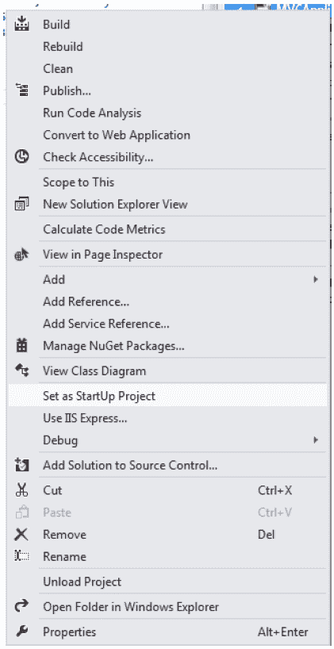
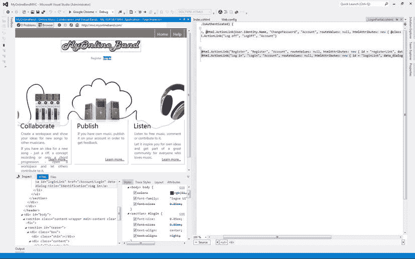

# 四、Visual Studio 2012 概述

4-1.了解 Visual Studio 2012

问题

您刚刚安装了 Visual Studio，您完全被它众多的工具栏和菜单淹没了。你想要一个简单的解释，说明它都做了什么，哪些特性与 ASP.NET MVC 开发人员最相关。

解决办法

Visual Studio 是一个集成开发环境(IDE ),它提供了为 Windows Server、Web 应用、Windows 客户端、Windows 应用商店、Windows Phone 和 Windows Azure 创建解决方案的工具。对于 ASP.NET MVC 框架开发人员，Visual Studio 提供了以下特性:

*   智能代码编辑器，理解 C# 和 VB.NET 等托管语言的语言语法，以及 JavaScript 和 CSS 等 web 标准。它还理解项目中使用的 API(包括您可能已经创建的 API)，并在您键入时自动完成您的代码。代码编辑器通过对关键字、变量名和文本进行颜色编码，并在编写代码时自动设置代码格式，使代码更具可读性。代码编辑器还会在您键入时检测语法错误，并帮助您检测和删除代码中的错误。
*   一个强大的调试引擎，允许您在代码中前进和后退，检查变量值，设置断点和在即时窗口中执行代码。调试器允许您使用 IIS Express(内置的轻量级 web 服务器)或 IIS 的完整版本。它还允许您附加和调试远程服务器上的进程。
*   一个可扩展的模板和加载项库，可用于快速启动项目并提高工作效率。

它是如何工作的

在其核心，Visual Studio 是一个复合应用框架。它提供了一个带有占位符的外壳，用于停靠子窗口、菜单和工具栏。用户界面分为六个主要区域。

*   *菜单*:标准的窗口菜单，允许你进入应用的许多区域。
*   *工具栏*:一组工具栏(停靠在菜单下)，提供对许多常用功能的快速访问。
*   *左窗格*:通常包含工具箱，通常填充有可以拖动到设计图面的 UI 组件。可能还包含服务器资源管理器，它允许您连接到本地网络上的应用和数据库服务器。
*   *中央窗格*:包含 C# 文件、Razor 视图等打开的文档。也可能包含属性页。
*   *右窗格*:包含解决方案资源管理器和属性窗口。
*   *底部窗格*:包含编译器输出窗口和错误列表。

在某些方面，Visual Studio 就像一个简单的操作系统，允许多个应用一起运行。Visual Studio 的每个版本都附带了一组不同的插件应用。可以使用扩展管理器向 Visual Studio 添加其他插件应用，也可以使用第三方安装程序加载它们。

Express edition 和 Ultimate edition 共享相同的内核，但通过插件进行区分。这种架构使得 Visual Studio 不仅可以用于开发 web 应用，还可以用于开发任何编程语言的任何软件。

我们现在将详细查看这五个部分中的每一个，讨论每个部分中的默认窗口和工具栏，以及它们是如何在 ASP.NET MVC 开发中使用的。

围绕用户界面的一圈

图 4-1 显示了加载了 MVC 4 项目的 Visual Studio 2012 旗舰版。从上到下，从左到右，我将指出主要的用户界面元素。


[图 4-1](#_Fig1) 。Visual Studio 旗舰版使用深色主题并加载了 MVC 项目

最上面是标题栏。它告诉我们解决方案的名称和它当前运行的用户上下文。[图 4-1](#Fig1) 显示解决方案名称为 MVCApplicationIIS，Visual Studio 运行在管理员的上下文中。标题栏右侧是快速启动搜索框。该功能的作用非常类似于 Windows 7 开始菜单上的搜索框。如果在搜索框内单击或使用 Ctrl + Q 键盘快捷键,“快速启动”栏将变为活动状态，并开始侦听输入。当您键入时，它会搜索 Visual Studio 的菜单、选项和打开的文档列表，并返回与您的结果匹配的项目列表。按 Enter 键会自动启动搜索结果中出现的第一个项目。

例如，如果您想查看 Visual Studio 起始页，请按 Ctrl + Q，然后键入**起始页**。搜索框下方会出现匹配项目的列表。当您键入附加字符以缩小搜索范围时，项目会从列表中删除。如果您经常使用此功能，它会记住您选择的项目，并自动将它们放在列表的顶部。

在[图 4-2](#Fig2) 中，你可以看到在输入几个搜索字符后，开始页面被选中。


[图 4-2](#_Fig2) 。使用快速启动

从标题栏往下是菜单栏。在地形学的庆祝活动中，Visual Studio 用无数的菜单选项向我们尖叫。

根据几十年来的 Windows 用户界面标准，列出的第一个菜单是文件菜单。对于大多数菜单项，其具体内容会根据 IDE 中当前具有焦点的窗口或项目而有所不同。FILE 包含用于保存文件、创建新项、加载文件和解决方案以及打印的命令。

下一项是 EDIT，除了标准的剪切、复制和粘贴命令之外，它还有几个搜索和代码导航实用程序以及高级格式化命令。

“视图”菜单包含所有可用窗口和工具栏的列表。我们将在本章的后面详细讨论其中的一些项目。

“项目”菜单包含影响当前活动项目的命令列表。在一个解决方案中，您可能有许多项目。当您在解决方案资源管理器中选择项目或项目项，或者包含项目项的编辑器窗口获得焦点时，项目将变为活动状态。“项目”菜单允许您将项目添加到项目中，访问项目的属性页，以及管理项目的 NuGet 包。

“生成”菜单与“项目”菜单一样，只与活动项目或解决方案相关。选择解决方案后，生成命令将应用于整个解决方案，而不是单个项目。“生成”菜单包含用于编译项目、运行代码分析和部署解决方案的命令。Visual Studio 速成版上没有“生成”菜单。

“团队”菜单包含与 Microsoft TEAM Foundation Server(TFS)相关的命令，后者是一个源代码管理和工作项跟踪系统。它提供了健壮的源代码控制系统功能，例如检出/检入、版本控制、分支和合并以及冲突解决。TFS 还提供项目管理能力、需求管理、测试用例管理和缺陷跟踪。所有这些功能都与源代码控制集成在一起。它还与 SharePoint、SQL Server Analysis Server(SSAS)和 SQL Server Reports Server(SSRS)集成，提供了一个包含团队文档、活动工作项和显示项目进度的报告的项目仪表板。

SQL 菜单包含允许您连接到 SQL Server 数据库并执行诸如架构比较和运行查询等操作的命令。SQL 菜单在 Visual Studio Express 上不可用。

“工具”菜单包含用于连接数据库和服务器、管理库包和扩展以及自定义 Visual Studio 的命令。它还允许您启动工具，如 WCF 配置编辑器和方便的创建 GUID 工具。

“测试”菜单包含用于运行自动化单元测试、调试单元测试和修改测试设置的命令。

ARCHITECTURE 菜单是 Premium 和 Ultimate 版独有的，它允许访问 Visual Studio 的体系结构建模工具。

“分析”菜单提供对 Visual Studio 的性能分析、并发可视化工具、静态代码分析和代码度量工具的访问。该菜单也是高级版和旗舰版的专属菜单。

“窗口”菜单允许您停靠、浮动、隐藏和重新排列所有 Visual Studio 窗口。我最喜欢的命令是自动全部隐藏。这将折叠所有 Visual Studio 窗口，将所有屏幕空间都用于代码。

“帮助”菜单使您可以访问所有 Visual Studio、C# 和 MVC 框架文档。根据您的设置，它可以利用 MSDN 图书馆的本地副本，或者只是链接到互联网上的 MSDN 内容。

Visual Studio 2012 旗舰版的标题栏、菜单栏和工具栏如图[图 4-3](#Fig3) 所示。


[图 4-3](#_Fig3) 。调试模式下的 Visual Studio 终极菜单和工具栏

工具栏

在 Visual Studio 2012 中，微软大幅改变了工具栏的外观。它已经用扁平的纯色图标取代了过去版本中使用的彩色图标。他们还去除了工具栏周围的斜面和其他视觉眩光，以创造一个无缝齐平的外观。他们还努力隐藏潜在的不必要的工具栏，以便为代码窗口提供额外的空间。

[图 4-4](#Fig4) 显示了 Visual Studio 2012 和它的前身 Visual Studio 2010 并排在一起。

显示的工具栏取决于当前获得焦点的文档类型。菜单栏的正下方是标准工具栏。编辑某些类型的文档时，特定于该文档类型的工具栏会出现在标准工具栏的下方或右侧。


[图 4-4](#_Fig4) 。Visual Studio 2012 和 2010 并存

[图 4-5](#Fig5) 显示了 Visual Studio 2012 Ultimate edition 上的默认工具栏布局，其中一个. CS 文件在文档窗格中处于活动状态。在这个视图中，有四个工具栏，包括标准工具栏，文本编辑器工具栏，以及工作项跟踪工具栏。在标准工具栏上，最左边的项目是一对文档历史导航按钮。它们的工作方式类似于网络浏览器上的按钮，允许您导航到上次打开的文档。如果您关闭了该文档，Visual Studio 会重新打开它。当您打开许多文档，并且需要在其中的几个文档之间来回移动时，这是非常方便的。


[图 4-5](#_Fig5) 。Visual Studio 2012 标准工具栏

工具栏上的下一个按钮是“新建项目”按钮，随后是“打开项目”和“保存”按钮。“开始调试”按钮看起来像绿色的“播放”按钮，允许您对其进行配置，以便可以使用任何已安装的 web 浏览器。[图 4-5](#Fig5) 显示的是默认的 Internet Explorer。如果您单击当前选定浏览器名称右侧的向下箭头，将显示可用 web 浏览器的下拉列表。

图 4-5 中显示的下一个工具栏是文本编辑器工具栏。默认情况下，只有当代码文件(如. CS 文件)在文档窗格中处于活动状态时，此工具栏才会出现。它包含以下按钮:

*   *显示快速信息*:显示打开的代码文件中当前活动对象的语法信息。您也可以通过将鼠标悬停在项目上来查看相同的信息。
*   *在建议和标准完成模式*之间切换:启用时，按回车键总是在文本编辑器的当前位置插入一个新行。禁用时(默认)，按 Enter 键会根据您键入时自动显示的 IntelliSense 覆盖中的选定值，自动完成您键入的任何代码。
*   *注释掉选中的行*:点击该按钮将编辑器中选中的文本变成代码注释。
*   *取消选中行的注释*:点击此按钮，从选中行中删除代码注释标记。
*   *在当前行切换书签*:对于导航大型代码文件非常有用。通过使用此项，您可以将书签放在您正在处理的代码段上。创建几个书签后，您可以使用下两个按钮在它们之间来回移动。

如果您正在使用 Microsoft 的 Team Foundation Server 源代码管理和工作项跟踪系统，并且您当前连接到一个团队项目，则工作项跟踪工具栏将出现在其他工具栏的右侧。此工具栏允许您创建新的工作项(如错误和任务)、搜索工作项或打开团队项目 SharePoint 门户网站。

像大多数 Microsoft 产品一样，工具栏可以完全根据您的需要进行定制。例如，如果您觉得工作项跟踪工具栏没有用，可以移除它并添加其他更能满足您需要的工具。您还可以在现有工具栏中添加和删除按钮，甚至创建自己的自定义工具栏。

左窗格

左侧是包含工具箱和服务器资源管理器的窗格。在 Web 窗体中，工具箱包含可以拖动到设计图面的服务器控件列表。当使用 Razor 视图引擎时，没有 web 服务器控件，也没有设计器。没错，用 Razor 进行 MVC 视图开发，Visual Studio 中没有所见即所得的拖放式设计图面。

在没有服务器控件的情况下，工具栏中出现的都是标准的 HTML 输入元素。您可以将它们从工具箱拖到编辑器窗口，以插入组成元素的 HTML 标记。

服务器资源管理器是另一个通常位于左侧面板的工具。它允许您连接到数据库和服务器。对于数据库，它允许您查看和编辑表、视图、存储过程，甚至数据库图表。它在 Visual Studio 中提供了一些与 SQL Server Management Studio 相同的功能。这包括用于创建和编辑表定义的可视化编辑器、查询编辑器和允许您编辑数据的数据网格。

服务器资源管理器还允许您查看所连接的服务器的许多管理方面。您可以查看事件日志、管理类，包括磁盘卷和网络适配器、消息队列、性能计数器，甚至正在运行的服务。该工具让您无需离开 Visual Studio 就能深入了解服务器的核心，从而节省了您的时间。例如，如果您的程序将日志项写入消息队列，您可以使用服务器资源管理器来验证消息是否按预期写入。

包括服务器资源管理器在内的所有窗口和工具栏都可以被移除。未停靠的窗口可以移动到任何地方，如果您使用多个显示器，甚至可以移动到另一个屏幕。它可以调整大小、最大化、关闭或停靠到 Visual Studio 中的另一个位置。[图 4-6](#Fig6) 显示了服务器资源管理器被移除并展开。在可以访问的对象树的数据连接下，您可以看到一个到数据库的连接。


[图 4-6](#_Fig6) 。服务器资源管理器未停靠

在“服务器”下，您可以看到可用的对象，包括服务器上运行的 Windows 服务。

在[图 4-6](#Fig6) 的右上角，可以看到右击标题栏时出现的弹出菜单。以下命令可用:

*   *浮动*:取消当前窗口的停靠。
*   *Float All* :这个命令只在通常包含代码编辑器的中央窗格中有效。它不仅会移除当前的选项卡式文档，还会移除整个选项卡式文档容器。当您在一个连接到多个显示器的系统上工作，并且希望对所有代码窗口使用一个显示器，而对 Visual Studio 使用另一个显示器时，这非常有用。
*   *停靠*:停靠浮动窗口。不幸的是，它并不总是将窗口重锁到原来的位置。
*   *停靠为选项卡式文档*:将窗口作为选项卡式文档停靠在中央窗格。
*   *自动隐藏*:该命令自动隐藏一个停靠窗口，沿停靠区域的外边缘最小化。最小化的窗口可以通过单击最小化的标题栏来展开。当窗口失去焦点时，它会自动再次最小化。当在小屏幕上工作或使用低分辨率的投影仪时，这非常有用。
*   *隐藏*:关闭窗口。如果您想再次查看该窗口，您需要使用“查看”菜单重新打开它。

中央窗格

中央窗格是 Visual Studio 的主舞台区域。它包含所有打开的文档，并允许您使用位于区域顶部的选项卡在它们之间导航。

图 4-7 显示了 Visual Studio 选项卡式文档窗格的一些主要特性。在这个截图中，`_Layout.cshtml`文件被钉住。当文档被锁定时，它总是可见的，并停留在窗口的左侧。您可以固定尽可能多的有用文档。要锁定文档，请将鼠标放在选项卡上。它会高亮显示，并且一个看起来像图钉的小图标会出现在关闭图标的左侧。单击大头针图标，您的文档将被钉住。执行与此相反的过程来取消固定文档。


[图 4-7](#_Fig7) 。Visual Studio 2012 中的选项卡式文档

如果您打开的文档多于选项卡式文档窗格顶部显示的选项卡，您可以通过单击窗格右上角的小向下箭头来访问剩余的文档。这将向您显示打开的文档列表。

图 4-7 中还显示了屏幕分割工具。它允许您一次查看一个文档的两个部分。

Visual Studio 2012 包括一个新的文件预览功能，当在解决方案资源管理器窗口中选择一个文档时，该功能会在预览选项卡中打开该文档。预览选项卡与选项卡式文档窗格的右侧对齐；它们激活时有紫色标签。一次只能预览一个文档。“预览”选项卡的内容将被下一个选定的文档替换。通过右键单击选项卡并从弹出菜单中选择“保持选项卡打开”,可以将预览的文档升级为打开的文档。

解决方案浏览器

解决方案资源管理器是所有解决方案项目和文件的树形视图。您可以使用解决方案资源管理器打开文件进行编辑，将文件签入和签出源代码管理，将新文件和文件夹添加到项目中，以及浏览类的成员。自 Visual Studio 2010 以来，解决方案资源管理器中添加了几个新的生产力功能。如果您安装了 Visual Studio Power Tools pack，可能会对其中的一些功能很熟悉。图 4-8 中的屏幕截图显示了加载了 ASP.NET MVC 应用的解决方案资源管理器。[图 4-8](#Fig8) 显示了集成类查看器如何允许你深入到一个文件的内容。


[图 4-8](#_Fig8) 。解决方案浏览器

解决方案资源管理器的工具栏有三组工具。第一组由后退、前进和主页按钮组成。这些按钮与“搜索解决方案浏览器”框一起使用。后退和前进按钮允许您在搜索结果之间来回导航。Home 按钮清除搜索并返回到解决方案浏览器的默认视图。

下一组按钮影响解决方案资源管理器中显示的内容，与搜索结果无关。该组中的第一个按钮允许您根据两个条件之一筛选解决方案资源管理器中显示的内容。默认筛选器将只显示从源代码管理中签出后修改过的文件。第二个过滤器选项的目的是只显示当前打开的文件。当您有大量打开的文件，并且很难使用选项卡式文档窗格在它们之间导航时，这是一个很好的功能。

本节中的“下一步”按钮将解决方案资源管理器与活动文档同步。在应用了筛选器或折叠元素的情况下，单击此按钮将展开折叠的节点并选择解决方案资源管理器中的活动文档。该部分中还有刷新按钮，用于更新显示内容，以包括对文件系统的更改。“全部折叠”按钮折叠整个解决方案资源管理器树结构。本节中的最后一个按钮显示或隐藏存在于文件系统的解决方案目录中但不包含在项目中的文件。

在工具栏的最后一部分，有两个按钮。第一个按钮看起来像扳手，显示所选项的属性窗口。最后一个按钮打开“预览所选项目”功能。启用此选项后，当单击某个项目时，它会出现在选项卡式文档窗口中，但其选项卡位于窗格的右侧。如果您使用的是 Visual Studio 2012 Ultimate Edition，则有一个额外的工具栏按钮可用，单击该按钮会生成所选文档的依赖关系图。

解决方案资源管理器的真正强大之处在于树视图本身。右键单击树视图中的项目可以找到许多功能。例如，右击解决方案文件可以访问可以在整个解决方案中执行的命令菜单。右键单击某个项目会显示可对该项目执行的命令列表。根据您使用的 Visual Studio 版本和安装的外接程序，出现的项数会有所不同。[图 4-9](#Fig9) 显示了在解决方案资源管理器中右击一个项目后可用的命令。



[图 4-9](#_Fig9) 。项目的解决方案资源管理器弹出菜单

另一个不错的新特性是新的解决方案浏览器视图菜单项。它会打开一个新的解决方案资源管理器窗口，从选定的项开始显示树的一部分。然后，您可以停靠这个新视图，以便可以轻松地在项目树之间切换。当您有包含数千个项目的解决方案时，这变得非常有用。这将为您节省大量时间，否则您会浪费在浏览解决方案资源管理器上。

底部窗格

在 Visual Studio 的快速浏览中，最后要讨论的是底部窗格。本节包含两个主要项目。输出窗格，包含编译器输出以及您的程序可能使用`Debug.Write`语句生成的诊断数据。另一个窗口是错误列表。它显示所有编译器错误和警告，以及活动窗口中 JavaScript、HTML 和 CSS 文件的错误警告。

如果处于调试模式，底部窗格包含许多调试窗口，如局部变量、监视和即时窗口。调试窗口将在配方 4-9 中详细讨论。

4-2.更改 Visual Studio 菜单的样式

问题

对于 Visual Studio 2012，微软在 IDE 中添加了一些 Windows 8 风格的样式。其中一个变化是菜单文本全部用大写字母。你和你的团队真的很不喜欢这种视觉风格，觉得它让人分心。您希望菜单像在以前版本的 Visual Studio 中一样显示。

解决办法

凭借 Visual Studio 2012，微软对用户界面进行了某种程度上的彻底改造。对于许多老兵来说。NET 开发者来说，这种变化有点无所适从。虽然 Visual Studio 本身不是 Windows Store 应用，但它确实借鉴了一些基本的设计原则，例如 chrome 上的内容、简单的平面外观以及对排版的强调。社区中的许多人对一些设计选择表示失望。到目前为止，“全大写”菜单招致了最多的批评。尽管这是一个愚蠢的美学问题，你很可能会习惯，但它确实给菜单栏增加了额外的像素，而且会分散注意力。幸运的是，Visual Studio Gallery 中有几个允许您更改这种外观的扩展。

在可用的扩展中，我发现 Visual Studio 2012 的 VSCommands 效果最好。除了允许您修改菜单栏使用正常的大写，它还允许您隐藏菜单栏在一起。如果选择此选项，您可以将其设置为仅当鼠标悬停在工具栏和标题栏之间时才显示菜单，或者您可以将其完全隐藏，并在需要时使用键盘上的 Alt 键显示菜单。后一种设置类似于 Internet Explorer 和 Firefox 的默认设置。

它是如何工作的

要安装 Visual Studio 2012 的 VSCommands ,请执行以下步骤:

1.  从“工具”菜单中，单击“扩展和更新”。
2.  在左侧边栏中，单击在线。默认情况下，选择 Visual Studio Gallery。
3.  在“搜索 Visual Studio 库”文本框(位于“扩展和更新”对话框的右上角)中，键入 **VSCommands** 。
4.  单击下载按钮安装加载项。
5.  重新启动 Visual Studio。

安装外接程序后，您需要对其进行配置以更改您的菜单样式。重新启动 Visual Studio。从工具菜单中，选择虚拟命令选项。这是由 VSCommands 扩展创建的新菜单项。在 IDE 增强功能下，单击主菜单。然后，您可以将默认设置(全部大写)更改为句子大小写。[图 4-10](#Fig10) 显示了 VSCommands 配置屏幕。


[图 4-10](#_Fig10) 。VSCommands 设置

在本例中，菜单是隐藏的，只能通过按 Alt 键并将菜单大小写设置为句子大小写来显示。注意图 4-10 中的菜单栏是隐藏的。

4-3.更改 Visual Studio 配色方案

问题

您发现默认的配色方案让您觉得不舒服，并且您更喜欢 Visual Studio 的另一种整体外观。

解决办法

Visual Studio 附带了两种颜色主题:亮和暗。灯光主题是默认设置，以白色背景下的灰色和黑色地形为特征。深色主题本质上是浅色的反义词，背景是深色，文字是浅色。

它是如何工作的

我们换个主题吧。从工具菜单中，选择选项。在选项对话框中，展开环境，然后单击常规。在视觉体验下，可以更改颜色主题，如图[图 4-11](#Fig11) 所示。


[图 4-11](#_Fig11) 。更改 Visual Studio 颜色主题

除了主题之外，Visual Studio 还提供了 100 多个选项来定制几乎每个编辑器和窗口的颜色。在环境选项的字体和颜色部分，你会发现一系列可配置的属性。这些设置会覆盖主题中的设置。重要的是要注意，即使切换到另一个主题，你的颜色选择将保持不变。在某些情况下，这使得文本难以阅读。幸运的是，Visual Studio 有一个安全机制，允许您通过单击“字体和颜色”屏幕上的“使用默认值”按钮来恢复原始主题。

4-4.安装供脱机使用的 Visual Studio 文档

问题

您需要在一个访问互联网受限的地方工作，但仍然需要访问关于 Visual Studio、C#、MVC 框架和。NET 类库。

解决办法

首次安装 Visual Studio 时，您可以选择是将帮助存储在本地计算机上，还是使用 MSDN.com 上的联机帮助。如果选择默认设置，一些核心文档将存储在本地，但其余的将联机存储。对于大多数人来说，在线版本的帮助是最佳的，因为它不断保持最新，并由许多博客、论坛和文章扩充。仅在线选项也为您节省了几千兆字节的磁盘空间。但是，如果您知道您将在 Internet 连接受限的位置工作，您可以执行以下步骤在本地计算机上安装 MSDN 文档。

1.  从 Visual Studio 帮助菜单中，选择添加和移除帮助内容。
2.  将显示 Microsoft 帮助查看器窗口。如果您连接到互联网，您可以选择在线作为安装源。如果没有 Internet 连接，将需要 Visual Studio 安装介质。
3.  对于本地存储路径，请选择一个有足够空间的磁盘位置。整个库将需要几千兆字节的磁盘空间。
4.  通过单击“添加”操作，选择要在本地安装的文档。当您添加选择时，它们将出现在“待定更改”部分。在窗口的底部，一个计数器将显示所需的磁盘空间和可用空间。你应该只下载你需要的。对于 ASP.NET MVC 开发人员，推荐使用以下软件包:

*   NET Framework 4.5(默认为本地)
*   Visual Studio 2012 基础(默认为本地)
*   Java Script 语言
*   Visual Basic 和 Visual C#
*   SQL Server 2012 联机丛书
*   模式与实践 Web 开发
*   模式和实践服务开发

推荐包的总大小约为 4.8GB。

5.单击更新开始下载。

下载完这些包后，您将能够通过 Visual Studio 帮助菜单访问它们。当您安装的内容有可用的更新时，help viewer 应用会通知您。在您参加任何无法访问互联网的活动之前，最好打开帮助查看器并更新您的内容。例如，在您乘坐 15 个小时的飞机从纽约飞往香港之前，请确保您的备用笔记本电脑电池已充电，并且您的帮助文档是最新的，以便在飞行过程中提高效率。

4-5.重置默认 Visual Studio 窗口布局

问题

您不小心关闭了 Visual Studio 中的一些窗口,并且无法将它们放回原来的位置。您希望将 Visual Studio 还原到其原始设置。

解决办法

与配色方案一样，Visual Studio 有一个后备解决方案，可以将窗口布局重置为默认设置。

它是如何工作的

要将布局重置为默认位置，请从窗口菜单中选择重置窗口布局。Visual Studio 将提示您确认是否确实要移除所有自定义设置并返回到默认设置。单击是按钮。几分钟后，您的设置将被恢复。

4-6.创建自定义工具栏

问题

您已经安装了几个外接程序，并且经常使用主工具栏上没有的 Visual Studio 功能。您想要创建一个自定义工具栏，让您快速方便地访问这些功能。

解决办法

Visual Studio 的菜单和工具栏是非常可定制的。您可以添加自定义工具栏和菜单，或更改现有工具栏和菜单的内容。

它是如何工作的

为了演示这个特性，我们将添加一个自定义工具栏，每当我们在编辑器中打开 Razor 视图时，这个工具栏就会出现。在工具栏上，我们将添加显示页面检查器的按钮、CSS 属性、文档大纲按钮和第三方插件(JavaScript 解析器扩展)的按钮。

若要编辑 Razor 视图的 Visual Studio 布局，请打开 Razor 视图并在其中单击以确保它是活动窗口。Razor 视图应该位于 MVC 解决方案的 views 文件夹中；他们有一个`.cshtml`文件扩展名。

请注意，HTML 编辑器工具栏现在出现在编辑器上方。如果您有宽屏监视器，您可以拖动工具栏，使其出现在主工具栏的旁边，而不是下面。现在，您已经准备好添加新工具栏了。

1.  从“工具”菜单中，单击“自定义”。
2.  在自定义对话框中，单击新建。在新建工具栏对话框中，输入 **Razor Tools** ，然后点击确定。剃刀工具现在在工具栏列表中显示为选中状态。
3.  单击命令选项卡，然后单击工具栏将其选中。
4.  从下拉列表中选择剃刀工具。控件列表将为空。
5.  单击添加命令。
6.  选择查看作为类别，然后选择页面检查器，然后单击确定。
7.  重复此操作以添加其他命令。[图 4-12](#Fig12) 显示了自定义对话框，其中页面检查器和一些额外的第三方控件被添加到工具栏中。[图 4-13](#Fig13) 显示了工具栏在 Visual Studio 中的样子。


[图 4-12](#_Fig12) 。创建自定义工具栏

[图 4-12](#Fig12) 显示了定制对话框中完整的剃刀工具配置。工具栏包含一个到 JS 解析器的链接，JS 解析器是一个第三方插件，可以简化大型复杂 JavaScript 文件的导航。它还包含指向文档大纲工具、CSS 属性窗口、页面检查器和拆分工具的链接。

4-7.导航大型 Razor 视图或 HTML 文件

问题

你有一个由数百个元素组成的大视图。浏览此页面很困难。您希望有更好的方式来浏览文件。

解决办法

Visual Studio 有一个内置的文档大纲工具。该工具基于 HTML 元素生成文档的轮廓，以树形视图格式显示。

它是如何工作的

单击树视图中的元素将导航到文档中的该元素，并在代码窗口中突出显示它。[图 4-13](#Fig13) 显示了停靠在左侧窗格的文档大纲工具和停靠在选项卡式文档窗格的`Contact.cshtml`视图。


[图 4-13](#_Fig13) 。文档大纲工具

右窗格被隐藏。在文档大纲中选择了一个`SPAN`元素，并且在文档中选择了相应的元素。

您可以通过其他窗口子菜单下的查看菜单打开文档大纲窗口。

在配方 4-6 中，我们演示了如何创建一个自定义工具栏，其中包括一个到该功能的快速链接。在图 4-13 中，该功能的快捷方式已被添加到自定义工具栏中。

4-8.使用页面检查器排除 CSS 布局错误

问题

您正在对布局问题进行故障诊断。您已经将样式应用到元素中，但是它并没有像您预期的那样运行。您需要查看 Razor 代码的 HTML 输出，以了解应用了哪些样式。因为定义样式的代码分布在几个样式表中，所以这个问题很难解决。

解决方案

页面检查器是 Visual Studio 2012 所有版本附带的新工具。该工具通过突出显示有助于呈现网页的选定部分的所有代码，帮助开发人员解决布局问题。页面检查器允许您在集成的浏览器窗口中查看 MVC 视图的渲染输出，然后通过单击选择页面上的特定元素。一旦选择了某个元素，该工具将打开解决方案中组成页面的所有文件，并自动突出显示每个文件中参与呈现所选部分的代码。页面检查器还显示发送到 web 浏览器的动态生成的 HTML，以及与页面的选定部分相关的所有 CSS 样式规则。

您可以通过在解决方案资源管理器中右击视图并在页面检查器中选择“视图”来打开页面检查器。

它是如何工作的

Visual Studio 页面检查器的功能类似于大多数主流浏览器的开发人员工具中的检查元素功能。例如，在 Firefox 中，如果右键单击网页上的某个元素并从弹出菜单中选择 Inspect Element，就会显示一个元素检查覆盖图。与 Visual Studio 页面检查器一样，Firefox Inspect 元素特性将显示 HTML 标记和样式规则。它还允许您查看计算的样式。虽然 Firefox Inspect 元素功能与页面检查器功能重叠，但它也有一个主要缺点:它不了解组成元素的服务器端代码。[图 4-14](#Fig14) 显示了运行中的 Firefox Inspect 元素特性。


[图 4-14](#_Fig14) 。Firefox Inspect 元素特性

在屏幕顶部，您可以看到所选元素的清晰轮廓，元素标记显示在标注气泡中的元素下方。沿着浏览器窗口的底部，您可以看到元素层次结构，这允许您通过父元素向后导航。窗口右侧是一个框，显示定义元素样式的 CSS 代码。请注意，它既显示内联样式，也显示外部文件中定义的样式。被覆盖的样式会被删除。

如果我们使用静态 HTML 而不是 ASP.NET MVC，Firefox 的特性可能已经解决了我们的问题。它向我们展示了样式规则`border`应用于`Main2a.css`文件中的`img`元素和`.imgNormal`类 中的内联样式。我们清楚地看到在`.imgNormal`中定义的规则已经覆盖了应用于`img`的规则。尽管这是很有价值的见解，Firefox 并没有告诉我是什么服务器端文件生成了内联样式。事实上，Firefox 并不知道这个页面是动态生成的。它不知道 ASP。NET 的捆绑特性合并并压缩了几个 CSS 文件。它将向您显示在合并和缩小的 CSS 文件中定义样式的位置，但不知道样式是在哪个服务器端 CSS 文件中定义的。

另一方面，Visual Studio 页面检查器知道您的动态页面。它知道哪些视图被调用，也知道绑定。它甚至知道你在视图中使用的 HTML 助手。

页面检查器先决条件

运行页面检查器有几个先决条件。如果您的系统没有正确配置或者没有安装先决条件，页面检查器会很高兴地通知您缺少的依赖项。页面检查员的要求包括:

*   Internet Explorer 9 或更高版本。
*   必须禁用 Internet Explorer 增强的安全配置。对于基于 Windows Server 的操作系统，默认情况下启用此功能。您可以从服务器管理器中禁用它。单击本地服务器，然后在属性下，单击 IE 增强的安全配置旁边的链接。这个设置对于生产服务器很有用，但是对于开发机器来说限制太多了。
*   必须在项目的`Web.config`文件或 PageInspector 中启用调试。ServerCodeMappingSupport 必须添加到`Web.config`文件的应用设置部分。
*   页面检查器程序集必须部署到开发计算机的全局程序集缓存(GAC)中。这应该在您安装 Visual Studio 时就已经完成了。
*   如果您的项目配置为使用本地 IIS web 服务器，则 IIS 辅助进程必须配置为使用。NET 4。如果您使用的是 IIS Express 或 Visual Studio 开发服务器，还必须验证它们是否正在运行。NET 版本 4。
*   该项目必须使用 ASPX 或 Razor 版本 2 或更高版本。页面检查器不支持 MVC 3。您需要升级您的项目，以便利用此功能。
*   正在分析的 URL 必须映射到当前解决方案中的项目。

使用页面检查器

若要开始使用页面检查器，请在解决方案资源管理器中右击一个视图，然后选择“在页面检查器中查看”。您也可以从“视图”菜单中选择“其他窗口–页面检查器”来打开它。

当页面检查器打开时，它将停靠在 Visual Studio 的左侧面板中。在大多数显示器上，这将使页面检查器太窄而没有用。您可能需要隐藏解决方案资源管理器并手动调整页面检查器窗口的大小，以便轻松访问页面检查器中所有可用的 UI 元素。或者，如果您有第二台显示器，您可以右键单击页面检查器的标题栏，然后选择“浮动”来浮动窗口。然后将它拖到第二个显示器屏幕上，并根据需要调整大小。

[图 4-15](#Fig15) 显示页面检查器中 MyOnlineBand 的首页。



[图 4-15](#_Fig15) 。页面检查器

在[图 4-15](#Fig15) 中，登录链接已被选中进行检查。在页面检查器左下角的 HTML 框架中，显示了页面的完整呈现输出，并突出显示了所选元素的标记。我们可以清楚地看到该元素生成的输出。

```cs
<a id = "loginLink" href = "/Account/Login" data-dialog-title = "Identification" > Log in</a>
```

页面检查器的 HTML 框架包含发送到浏览器的整个动态生成的 HTML。如果您在 Internet Explorer 中打开页面并查看源代码，您会看到相同的标记。您可以展开和折叠 HTML 元素组，并且当检查模式 启用时，您可以单击一个 HTML 元素，它的渲染视觉输出将出现在浏览器窗口中。此窗口对于确保 HTML 输出按预期呈现非常有用。

页面检查器的左下框架中还有文件查看器。如果您单击“文件”选项卡，将显示组成该页面的视图和部分视图的列表。如果单击页面名称，文档将在代码编辑器中打开。

页面检查器的真正威力在于它对服务器端代码的了解。在[图 4-15](#Fig15) 所示的例子中，当在检查器中选择链接时，`_LoginPartial.cshtml` 局部视图自动以预览模式打开，生成输出的源代码自动高亮显示。这个很厉害。只需点击一下，我不仅可以看到 HTML 输出，还可以看到正在执行的 Razor 代码。在这个例子中，我看到下面的代码是从`_LoginPartial.cshtml` 局部视图中调用的:

```cs
@Html.ActionLink("Log in", "Login", "Account", routeValues: null, htmlAttributes: new
{ id = "loginLink", data_dialog_title = "Identification" })
```

左下角是 Styles 框架，它显示了已经应用于所选元素的 CSS 规则。与 Firefox 示例一样，被覆盖的规则被划掉。每个样式规则旁边都有一个复选框。如果取消选中特定的样式规则，它将不再应用于浏览器窗口中加载的页面。这在调试布局问题时非常有用。[图 4-16](#Fig16) 显示页面检查器的样式框 。它显示了影响登录链接的所有样式规则。您可以清楚地看到，内联样式已经应用于元素，而几个继承的样式被忽略。


[图 4-16](#_Fig16) 。页面检查器的样式框架

除了主样式查看器，页面检查器的右下框架还有一个跟踪样式工具、一个布局查看器和一个属性查看器。

追踪样式工具类似于样式查看器，但允许您按属性向下钻取。例如，如果您试图解决某个元素的背景色问题，可以打开样式跟踪工具并找到背景色属性。然后，您可以展开节点，查看影响所选元素背景颜色的所有样式规则。

布局查看器显示了所选元素上计算的 CSS 属性的图形框模型。该工具显示元素的偏移量、边距、边框、填充和尺寸。

属性查看器列出了所有已经应用于所选元素的 HTML 属性。除了查看当前设置之外，此工具还允许您编辑属性值并添加更多属性。更改会立即显示在页面检查器的浏览器中。这很有帮助，因为它允许您快速试验属性设置，而无需保存和重新加载页面。

4-9.调试时使用页面检查器

问题

您怀疑自定义 HTML 助手扩展中的缺陷在某些情况下会导致布局问题。当您开始调试时，您希望能够使用页面检查器作为您的默认浏览器。

解决办法

Visual Studio 2012 允许您选择计算机上安装的任何浏览器作为调试的默认浏览器。此外，您还可以选择页面检查器作为您的调试浏览器。在 Visual Studio 主工具栏上，选择“开始调试”按钮旁边的下拉列表，然后选择“页面检查器”。

它是如何工作的

如[图 4-17](#Fig17) 所示，Visual Studio 允许您使用安装在计算机上的任何浏览器进行调试。从 Visual Studio 的标准工具栏中，单击“开始调试”按钮右侧的向下箭头，然后从下拉列表中选择“页面检查器”。然后，您可以点按按钮或按键盘上的 F5 键，在页面检查器中开始调试。

这有助于调试可能源于服务器端代码的客户端布局问题。不幸的是，客户端 JavaScript 调试功能只适用于 Internet Explorer。此外，在页面检查器中调试时，JavaScript 断点不会被命中。


[图 4-17](#_Fig17) 。选择页面检查器作为调试浏览器

在编写定制的 HTML 助手时，这个特性提供了很多好处。HTML helper 调试起来可能有些棘手，因为您通常混合了 C# 代码、Razor 或 ASPX 标记以及客户端 CSS 和 HTML。通过将页面检查器用作调试浏览器，您可以逐句通过您的 HTML 帮助器代码，并确保它生成您期望的输出。然后，您可以继续遍历视图逻辑，直到呈现页面，然后使用追踪样式工具和属性查看器来检查呈现的输出如何影响页面布局。

4-10.了解 Visual Studio 的调试窗口

问题

您可能想观察在应用执行期间变量值如何变化。您不确定如何在 Visual Studio 中使用调试窗口，并且您想了解每个窗口的功能以及它们如何协同工作。

解决办法

Visual Studio 有五个主要的调试窗口:局部变量窗口、监视窗口、调用堆栈窗口、即时窗口和输出窗口。

局部变量窗口显示了当前范围内的所有变量。它显示变量的名称、当前值和变量的类型。对于复杂类型 ，值显示为对象树。您可以展开树来检查对象中包含的嵌套类型的值。

如果有一个包含许多变量的复杂页面，在“局部变量”窗口中跟踪一个值会变得很麻烦。监视窗口通过允许您为特定变量“添加监视”来帮助解决这个问题。

调用堆栈窗口允许您查看当前堆栈中的函数。它显示函数的名称和编写函数的编程语言。“调用堆栈”窗口可以配置为显示附加信息，如字节偏移量、行号、参数名和模块名。它还允许您在对函数的特定调用中插入断点。

即时窗口允许您在断点的当前上下文中执行代码。您可以在程序中输入在该时刻有效的任何代码。该语句将在您键入**回车**时执行。

它是如何工作的

Visual Studio 有一个强大的调试器。它允许您在所有服务器端代码中设置断点，包括您的模型、视图和控制器。如果使用 Internet Explorer 作为默认浏览器进行调试，可以在 JavaScript 文件中设置断点。Visual Studio 还允许您调试 SQL Server——存储过程、本机代码、GPU 代码、DirectX 图形、Silverlight 应用和 WCF 服务。虽然您不太可能需要在 ASP.NET 项目中调试 GPU 或 DirectX 图形，但在许多情况下，您可能需要执行一个页面，该页面从控制器类开始，调用 SQL Server 数据库中的存储过程，将数据从 SQL Server 复制到模型中，在视图中显示数据，然后允许用户使用客户端 JavaScript 和 Silverlight 与该数据进行交互。Visual Studio 调试器允许您从头到尾逐步执行此页面。它允许您在程序流的任何地方设置断点，并深入应用状态的细节。

 **提示** Visual Studio 不允许你同时调试 JavaScript 和 Silverlight。启用 Silverlight 调试器时，会忽略脚本文件中的断点。如果您遇到需要在同一个页面上调试 Silverlight 和 JavaScript 的情况，有一个解决方法。您可以在脚本文件中想要中断的代码行上方包含一个调试器命令。您将收到一条警告消息，通知您发生了未处理的异常(脚本断点),并且需要管理权限才能调用实时调试器。然后，您可以在新的 Visual Studio 窗口中逐句通过 JavaScript 代码。

调试项目的第一步是设置断点。断点是您希望调试器在代码中暂停应用执行的地方。设置断点最常用的方法是单击代码编辑器窗口左侧的边距。您也可以使用“调用堆栈”窗口或“新建断点”对话框来设置断点。当由于一行中有多个语句而无法在目标代码上设置断点时，有时需要这些替代方法。

一旦你的断点被设置，你可以通过右击断点来编辑它(如图[图 4-18](#Fig18) )。断点弹出菜单允许您删除断点、禁用断点、更改断点的位置，并提供了许多选项，可以更改断点何时会导致调试器暂停应用的执行。


[图 4-18](#_Fig18) 。“编辑断点”弹出式菜单

您可以通过单击主工具栏上的“开始调试”按钮或按键盘上的 F5 键来开始调试。启动调试器后，它将在 web 浏览器中打开您的应用。调试器将自身附加到 IIS 工作进程、web 浏览器(如果使用 Internet Explorer)以及 SQL Server 数据库(如果已配置)。当遇到断点时，它将暂停执行。

在图 4-19 中，我们可以看到运行中的可视化调试器。在本例中，它暂停了 HomeController 中一个名为 DbTest 的操作方法的执行。在代码编辑器中，调试器将突出显示要执行的当前代码行。断点以红色突出显示，要执行的行以黄色突出显示。通过将鼠标放在变量上，可以直接在代码编辑器中查看当前视图中的变量值。


[图 4-19](#_Fig19) 。Visual Studio 调试窗口

[图 4-19](#Fig19) 也显示了本地窗口。在这个例子中，它显示了两个变量——`proj`,这是一个定制类型，以及`ViewBag`,这是一个包含在所有控制器动作中的动态类型。`ViewBag`变量在[图 4-19](#Fig19) 中没有显示，因为`proj`已经展开，将`ViewBag`推到了滚动线下方。因为`proj`是一个复杂类型，所以它的值显示为一个树形视图。树状视图已经展开，可以查看变量的内容。

在即时窗口中，我们可以输入在当前上下文中可执行的任何代码。在[图 4-19](#Fig19) 中，在即时窗口中输入`proj.DateCreated`，当按下回车键时，显示值“4/12/2012”。

“即时”窗口不限于打印变量。你也可以调用方法和改变对象的值。当您希望了解输入的变化将如何影响正在调试的操作时，这可能会很方便。

另一个值得一提的特性是能够将鼠标固定在代码窗口的弹出窗口上。这允许您在调试时使鼠标悬停时出现的弹出窗口始终可见。在调试并在断点处停止时(在中断模式下)，将鼠标悬停在您希望锁定的变量上。在弹出窗口的右侧，单击大头针图标。然后，您可以单击双向下箭头图标来查看或输入关于该变量的注释。完成后，它看起来类似于[图 4-20](#Fig20) 。


[图 4-20](#_Fig20) 。在复杂类型上固定中断模式可行弹出窗口

当变量超出范围时，例如在初始化变量之前的下一个调试会话开始时，固定弹出窗口将显示在最后一个调试会话期间分配给它的最后一个值。在复杂类型的情况下，您可以展开每个变量，然后单独锁定每个成员。在[图 4-20](#Fig20) 中，除了主`pizza`变量`pizza.toppings`之外，还固定了它的一个成员，以便为每个调试会话显示多个级别。

4-11.设置条件断点

问题

您正在调试循环内部发生的问题。您认为只有当某个变量被设置为超出预期范围的值时，才会出现意外行为。您在循环中设置了一个断点，但是在遍历一个与您怀疑的条件相匹配的对象之前，需要遍历 100 多次循环。这是一个极其耗时的过程。你需要找到更好的方法。

解决办法

Visual Studio 调试器有一个很棒的特性叫做*条件断点* 。若要使用此功能，请通过在代码窗口左侧的空白处单击来创建一个新断点。断点将显示为红点。右键单击红点，并从弹出菜单中选择条件…。在“断点条件”对话框中，选中“条件”复选框，在文本框中输入表达式，然后单击“确定”。现在，只有当条件为真时，断点才是热的。

它是如何工作的

“条件断点”对话框有两个选项。第一个是当指定的条件为真时中断。例如，假设我们有一个动作方法，它遍历数百个数字，并打印出一个指定数字是奇数还是偶数的语句。你有一个 if 语句，它打印出一个语句，当计数达到 50 时，你已经完成了一半。您希望设置一个条件断点，仅在计数等于 50 时暂停执行。

为此，请执行以下操作。

1.  单击要放置断点的代码行旁边的左边距。
2.  右键单击新断点，并从弹出菜单中选择“条件”。
3.  在对话框中，输入`i==50`并确保选择“为真”选项。
4.  单击“确定”，然后按 F5 键调试应用。

现在应该只命中断点一次。

用于创建断点条件的第二个选项是在“条件”文本框中指定一个变量名作为表达式，然后单击“已更改”选项。例如，假设您有一个在`i==50`时更新名为`isHalfDone`的变量的代码路径。每次变量发生变化时，您都希望看到它的变化。在这种情况下，可以创建断点，然后在条件文本框中添加带有`isHalfDone`的断点条件，如图[图 4-21](#Fig21) 所示。调试器应该只在`isHalfDone`变量被修改的地方停止循环迭代。


[图 4-21](#_Fig21) 。设置条件断点

这是一个简化的例子，但它应该能让您大致了解该特性是如何工作的。当您有一个可以在代码中的几个地方更新的全局变量，并且您需要确定哪一个变量导致写入了错误的值时，这是非常有用的。

4-12.使用输出窗口

问题

虽然能够暂停程序的执行并单步执行代码是一个非常强大的功能，但这也是一项非常耗时的工作。比起手动一行一行地执行，您更愿意将某些数据输出到日志窗口中，以便以后进行分析。

解决办法

Visual Studio 输出窗口可以成为调试工具集的强大成员。当您调试应用时，输出窗口会自动改变其行为，以便显示调试器的输出。您可以通过两种方式将消息路由到调试器:

*   修改源代码以包含对系统的调用。诊断.调试名称空间。
*   设置向输出窗口发送消息的断点条件。

它是如何工作的

使用系统。诊断.调试命名空间

`System.Diagnostics.Debug`名称空间有许多有用的方法，可以用来帮助调试过程。其中最强大的是`Debug.WriteLine`和`Debug.Assert`方法。许多著名的。NET 编码专家，包括 John Robbins 和 Juval Lowy，都是使用这种技术的热情拥护者。在他的《为微软调试应用》一书中。NET 和微软视窗系统(微软出版社，2010)，John Robbins 称断言是“你的开发武库中最重要的主动编程工具。”经常听到 Juval Lowy 说，可以通过代码中使用的断言数量来判断应用代码的质量。在他的 IDesign C# 编码标准中，Lowy 指出所有的假设都应该被断言，并且应用中每五行代码中就有一行应该是断言。

`Debug.Assert`方法有四个重载，所有重载都将导致布尔值的条件作为第一个参数。附加参数可用于添加描述条件的消息。如果布尔条件返回 false，断言将失败，并且除了您添加到断言中的消息之外，还会将断言发生位置的堆栈跟踪写入输出窗口。

`Debug.WriteLine`语句用于记录关于方法执行的信息。记录的语句分为正常(表示预期的应用流)或错误(表示错误情况)两类。

[清单 4-1](#list1) 显示了一个动作方法，它使用`Debug.WriteLine`和`Debug.Assert`向输出窗口发送关于程序执行的消息。在对`Project.Load`方法进行调用之后，会进行一个`Debug.Assert`调用。断言的假设是`proj`对象已经初始化。如果这个假设为假，那么断言消息将被记录到输出窗口。

***[清单 4-1](#_list1)*** 。使用 Debug 的示例。维护

```cs
public ActionResult DbTest()
{
   Debug.WriteLine("Attempting to load project data.", "Normal");
   try
   {
      Project proj = Project.Load(121);
      Debug.Assert(proj != null, "The project object was not initialized");
      if (proj != null)
      {
          ViewBag.Message = proj.Description;
Debug.WriteLine("Project loaded and the description has been written to the view bag.", "Normal");

      }
   }
   catch
   {
      Debug.WriteLine("An error occurred.", "Error");
   }
   return View();
}
```

[清单 4-2](#list2) 显示了写入输出窗口的消息。在`Debug.Writeline`和`Debug.Assert`调用中明确设置的消息以粗体显示。

***[清单 4-2](#_list2)*** 。输出窗口中 Assert 和 Writeline 语句的结果

```cs
Normal: Attempting to load project data.
A first chance exception of type 'System.InvalidOperationException' occurred in System.dll
A first chance exception of type 'System.FormatException' occurred in mscorlib.dll
A first chance exception of type 'System.InvalidCastException' occurred in System.Data.dll
---- DEBUG ASSERTION FAILED ----
---- Assert Short Message ----
The project object was not initialized
---- Assert Long Message ----

   at MyOnlineBandMVC.Controllers.HomeController.DbTest() in g:\WorkingFolder\MyOnlineBand 5\MyOnlineBandMVC\MyOnlineBandMVC\Controllers\HomeController.cs:line 26
   at lambda_method(Closure , ControllerBase , Object[] )
   at System.Web.Mvc.ReflectedActionDescriptor.Execute(ControllerContext controllerContext, IDictionary'2 parameters)
   at System.Web.Mvc.ControllerActionInvoker.InvokeActionMethod(ControllerContext controllerContext, ActionDescriptor actionDescriptor, IDictionary'2 parameters)
   at
   ...[Content ommitted for brevity]
   at System.Web.Hosting.PipelineRuntime.ProcessRequestNotificationHelper(IntPtr rootedObjectsPointer, IntPtr nativeRequestContext, IntPtr moduleData, Int32 flags)
   at System.Web.Hosting.PipelineRuntime.ProcessRequestNotification(IntPtr rootedObjectsPointer, IntPtr nativeRequestContext, IntPtr moduleData, Int32 flags)

Normal: Project loaded and the description has been written to the view bag.
```

使用"当点击"将报表 打印到输出窗口

创建断点后，可以更改它的行为，这样就可以让调试器将所需信息写入输出窗口，而不是暂停程序执行。要启用此功能，请执行以下步骤。

1.  右键单击断点，并从弹出菜单中选择“命中时...”。
2.  确保选中打印消息:和继续执行复选框。根据需要修改消息。
3.  单击确定。断点现在将显示为菱形，而不是圆形。

[图 4-22](#Fig22) 显示了默认设置下的当断点被命中时对话框。当断点被命中时，它将把函数名、线程 id 和线程名打印到输出窗口。


[图 4-22](#_Fig22) 。当命中断点时对话框

命中断点时有自己的一组关键字，可用于创建表达式。表达式可以包括纯文本、一个或多个特殊关键字以及用花括号括起来的 C# 表达式。

例如，如果您不关心函数的名称或您在哪个线程上，您可以将默认表达式替换为如下内容:

```cs
The value of proj.DateCreated is {proj.DateCreated}
```

清单 4-3 显示了一个例子，当使用点击功能时，调试器将发送什么到输出窗口。粗体的第一行显示了默认表达式的输出。第二个是前面的示例表达式的结果。

***[清单 4-3](#_list3)*** 。在输出窗口中使用 When Hit 表达式的结果

```cs
Normal: Attempting to load project data.
Function: MyOnlineBandMVC.Controllers.HomeController.DbTest(), Thread: 0x22BC Worker Thread
...
'w3wp.exe' (Managed (v4.0.30319)): Loaded 'C:\Windows\assembly\GAC_MSIL\Microsoft.VisualStudio.Debugger.Runtime\11.0.0.0__b03f5f7f11d50a3a\Microsoft.VisualStudio.Debugger.Runtime.dll'
The value of proj.CreateDate is "4/12/2012"
```

4-13.使用扩展管理器查找和安装 Visual Studio 的加载项

问题

您想了解如何使用 Visual Studio 扩展和更新管理器 ，并且想知道应该安装哪些扩展。

解决办法

扩展管理器是一个工具，它允许您为 Visual Studio 查找并安装外接程序。你可以把它想象成 Visual Studio 的应用商店。要从工具菜单启动扩展管理器，请选择扩展和更新。

初始视图显示了您当前已经安装的更新列表。如果外接程序有可用的更新，您会收到通知并有机会升级。

您可以通过单击“联机”按钮并深入到 Visual Studio Gallery 来搜索新的加载项。有数以千计的扩展可用。这些扩展包括 Visual Studio 项目模板、示例、控件、SDK 和工具。

它是如何工作的

尽管您不需要使用扩展管理器来管理您的 Visual Studio 扩展，但是出于几个原因，这是一个好主意。

1.  很方便。你有一个地方去管理你所有的扩展，查看扩展的评论，并且在大多数情况下，你可以一键安装附加组件。
2.  当对已安装的扩展进行更新时，Visual Studio 会向您发出警告，并为您提供升级选项。警报将一直存在于系统托盘中，直到解除。
3.  如果您注意到 Visual Studio 在安装外接程序后表现出意外行为或开始表现不佳，您可以很容易地看到已安装的扩展，并很容易地禁用它们。
4.  除了 Microsoft Visual Studio Gallery 之外，还可以建立一个自定义存储库，仅允许下载批准的加载项。

在从图库安装附加组件之前，有一些事情需要记住。

*   许多扩展是由社区创建的，有些是由个人开发者支持的。如果你和你的团队依赖于一个扩展，你可能无法获得支持。
*   在安装扩展之前，请阅读评论并注意评级。您还应该记下出版商。您需要单击“更多信息”链接，这将打开 Visual Studio Gallery 网站上的扩展信息页。
*   任何人都可以向画廊提交扩展。Microsoft 不对图库中任何扩展的质量进行测试、认证或做出任何声明。
*   如果您正在安装多个扩展，请注意它们可能从未一起测试过。您可能会发现这样的情况:两个扩展在单独安装时都得到了大量的正面评价，并且运行良好，但在一起安装时会导致 Visual Studio 运行缓慢，有时还会挂起。假设两个外接程序都希望更改代码窗口中同一项的颜色。
*   添加到 Visual Studio 中的扩展越多，加载时间就越长，占用的内存也就越多。

您应该只安装解决特定问题的扩展。不要安装你真的不需要的扩展。如果您没有使用扩展，请禁用它。例如，如果您安装了 Matthew Manela 的代码片段设计器，并使用它创建了几个代码片段，但不打算在不久的将来创建任何其他代码片段，则应该禁用它。

MVC 开发的有用扩展

表 4-1 列出了一些对 ASP.NET MVC 开发有用的扩展。这绝不是一份详尽的清单。新的扩展一直在增加。在安装扩展之前，一定要经常检查它并阅读评级和评论。

[表 4-1。](#_Tab1)对 MVC 开发人员有用的 Visual Studio 模板


T2】

4-14.Visual Studio 键盘快捷键

问题

您希望拥有一个包含 Visual Studio 中所有最有用的键盘快捷键的备忘单。

解决办法

Visual Studio 中有数百种键盘快捷键。除了默认的快捷方式集，Visual Studio 还允许您创建自己的快捷方式。记住一些最常用命令的快捷方式可以减少点击菜单的时间，从而提高你的工作效率。

它是如何工作的

微软善意地汇编了一份详尽的键盘快捷键列表，可在`http://msdn.microsoft.com/en-us/library/da5kh0wa%28v=vs.110%29.aspx`(或`http://tinyurl.com/6lv8vp4`)获得。

下表列出了最有用的快捷方式。

调试

| **键盘快捷键** | **描述** |
| F5 | 开始调试。 |
| 控制 + F5 | 不调试就启动应用。 |
| Shift + F5 | 停止当前调试会话。 |
| F10 | 越过命令。在调试模式下，将移动到本地方法中代码的下一步。它将单步执行外部方法中的代码，除非外部代码包含断点。 |  |  |
| 控制 + F10 | 在中断模式下，将从当前语句到当前光标位置的语句继续执行代码。 |  |  |
| F11 | 站出来指挥。在调试模式下，只要调试符号可用，即使下一个可执行代码行是在另一个程序集中定义的，它也会移动到代码的下一步。 |  |  |
| F9 | 在代码编辑器中的当前行创建或移除断点。 |  |  |
| 控制 + B | 显示“新断点”对话框窗口。 |  |  |
| 控制 + Alt + B | 显示“断点”对话框窗口，该窗口允许您查看和编辑当前解决方案中定义的所有断点。 |  |  |

测试

以下快捷键使用称为*和弦*的复杂键盘快捷键。它们是一系列的击键组合。它们被标为[键 1]、[键 2]。

| **键盘快捷键** | **描述** |
| Ctrl + R，Ctrl + A | 调试解决方案中的所有测试。 |
| 控制 + R，控制 + C | 调试当前类中的所有测试。 |
| Ctrl + R、t 组合键 | 在当前上下文中运行所有测试。 |
| 控制 + R， 控制 + T | 调试当前上下文中的所有测试。 |
| 控制 + R， 控制 + D | 调试当前结果集中已检查的所有测试。 |
| 控制 + R，F | 运行当前结果集中不使用调试器检查的所有测试。 |

帮助

| **键盘快捷键** | **描述** |
| 子一代 | 显示与当前具有焦点的用户界面元素相关的帮助主题。 |

窗口管理

| **键盘快捷键** | **描述** |
| Shift + Alt + Enter | 切换全屏模式。 |
| 控制 + F4 | 关闭当前打开的文档。 |
| Ctrl + Shift + F6 | 移动到下一个文档。 |

构建并保存

| **键盘快捷键** | **描述** |
| Ctrl + Shift + B | 构建解决方案。 |
| Ctrl + Break | 取消构建。 |
| Ctrl + S | 保存当前文档。 |
| Ctrl + Shift + S | 保存所有文档。 |

项目

| **键盘快捷键** | **描述** |
| Ctrl + Shift + N | 新项目 |
| 控制 + N | 新文件 |
| Ctrl + Shift + O | 打开项目或解决方案。 |
| Ctrl + O | 打开文件。 |
| 控制 + M， 控制 + C | 创建新的控制器。 |
| Ctrl + Shift + A | 添加新项目。 |
| Shift + Alt + A | 添加现有项目。 |
| Shift + Alt + C | 添加新的类项目。 |