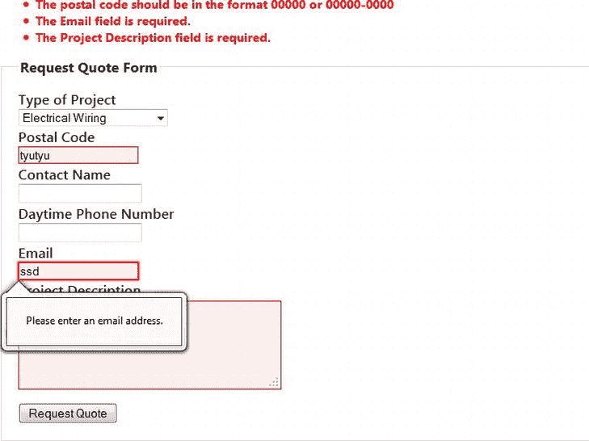

# 五、充分利用内置模板

5-1.选择 ASP.NET MVC4 项目模板

问题

你即将开始一个新的 ASP.NET MVC 项目。您已经打开了 Visual Studio 并选择了 ASP.NET MVC 4 作为您的项目类型。现在，您将看到一个屏幕，其中列出了几个模板。你不确定选择哪一个，它们之间的主要区别是什么。

解决办法

Visual Studio 模板通过包含基本的网站结构、布局页面和常用的 JavaScript 库，为您的项目提供了一个起点。模板的名称清楚地表明了每个模板的用途以及应该如何使用它们。例如，如果您需要创建一个带有表单登录和注册的面向互联网的应用,请使用互联网应用模板。如果您正在构建一个业务线应用(LOB) ,它将部署在您公司的本地 intranet 上，那么使用 Intranet 应用模板。

它是如何工作的

ASP.NET MVC 4 自带 6 个内置的 Visual Studio 模板:空、基本、内网应用、内网应用、移动应用、Web API。下面是每个模板的快速分类以及在哪里使用它们。

*   *空*:裸机 MVC 项目。用于不需要授权和不需要带验证的表单的项目。非常适合需要对营销资本等内容提供只读访问的项目。
*   *基本*:类似于 Empty，但是增加了 jQuery 和验证支持。对于创建使用匿名身份验证和需要基本输入表单的应用来说，这是一个很好的模板。
*   *内部网应用*:提供一个应用结构，包括几个默认的控制器、模型和视图。它还提供了有关如何在 IIS 中启用 Windows 身份验证的说明。公司业务线应用的完美起点。
*   *互联网应用*:提供一个应用结构，包括用于家庭和账户设置的控制器和视图。它有注册和登录视图。它被配置为使用通用提供程序，并被配置为进行表单身份验证。
*   *Web API* :提供一个应用结构，该结构包括一个`Values`控制器，该控制器创建一个简单的 RESTful API，并为每个 HTTP 动词:`GET`、`POST`、`PUT`和`DELETE`提供动作。它还包括一个主控制器和相应的视图，给出了 ASP.NET Web API 的简要说明。
*   *移动应用*:创建一个针对移动设备的项目，像互联网模板一样，有一个使用表单认证的帐户控制器。

空模板

空模板是最基本的模板。它附带了一组文件夹，这些文件夹构成了一个基本的应用结构，包括以下内容:

*   应该包含你的应用的所有控制器类。
*   应该包含你的应用的模型。
*   `Views`:应该包含你的观点。
*   `App_Start`:包含用于应用初始化的静态类。
*   `App_Data`:可以包含 SQL Express 或其他基于小文件的数据库的数据文件。一般来说，使用 web 服务器本地存储数据时需要小心。如果您需要向外扩展，或者如果您有意外的数据量，您可能会遇到问题。

这些文件夹是所有 MVC 模板共有的。与大多数其他模板一样，空模板不包含`Scripts`和`Content`目录。

在`App_Start`文件夹中有两个 C# 文件:`FilterConfig.cs`和`RouteConfig.cs`。两者都包含静态助手类，它们在`Global.asax`文件的`Application_Start()`方法中被调用，该文件继承自 ASP.NET 网络表单，定义了在应用的整个生命周期中触发的大量事件。`Application_Start()`方法在应用启动时被调用，通常执行应用初始化任务。在我们的空 MVC 应用模板中，`Application_Start()`方法调用所需的`RegisterAllAreas`方法和在`App_Start`文件夹中定义的两个静态初始化方法。

[清单 5-1](#list1) 展示了来自`global.asax`的`Application_Start()`方法。`Application_Start()`中的第一行调用了`AreaRegistration.RegisterAllAreas().`，这是一个必需的方法，它向 MVC 引擎注册了应用中定义的所有区域。在 ASP.NET MVC 中，`Areas`是一种将大型 MVC 应用分割成更易管理的子系统的方法。

[***清单 5-1。***](#_list1) Global.asax 应用 _ 启动方法

```cs
public class MvcApplication : System.Web.HttpApplication
{
    protected void Application_Start()
    {
        AreaRegistration.RegisterAllAreas();

        FilterConfig.RegisterGlobalFilters(GlobalFilters.Filters);
        RouteConfig.RegisterRoutes(RouteTable.Routes);
    }
}
```

第二行调用`FilterConfig.RegisterGlobalFilters`方法，该方法在清单 5-2 中的[文件中定义。该方法向 MVC 引擎注册全局过滤器。过滤器提供了一种在调用动作方法之前或之后插入处理逻辑的机制。全局过滤器是可以应用于 MVC 应用中所有动作方法的过滤器。](#list2)

清单 5-1 中[的最后一行调用`RouteConfig.RegisterRoutes`。此方法定义了应用使用的路由。在 MVC 中，路由用于定义应用的 URL 结构。](#list1)

[清单 5-2](#list2) 显示了`FilterConfig.cs`文件的内容。它用一个静态方法定义了一个类:`RegisterGlobalFilters`。在空的项目模板中，这个方法注册了一个名为`HandleErrorAttribute`的过滤器。

[***清单 5-2。***](#_list2)App _ Start 文件夹中的 FilterConfig.cs

```cs
public class FilterConfig
{
   public static void RegisterGlobalFilters(GlobalFilterCollection filters)
   {
     filters.Add(new HandleErrorAttribute());
   }
}
```

`HandleErrorAttribite`过滤器为每个动作方法添加了默认的错误行为，在出现错误的情况下，它将试图显示一个名为 error 的视图——该视图应该位于项目的`/Views/Shared`文件夹中。由于该视图在空模板中不存在，将显示一条默认错误消息，解释如何在`Web.config`文件中配置自定义错误。还应该注意，ASP.NET MVC 应用的默认行为是，当从本地 web 服务器查看页面时，显示一条详细的错误消息。因此，您将看到详细的错误信息，而不是自定义页面。

包括空模板在内的所有 MVC 模板都有的另一个元素是包含了`packages.config`。Visual Studio 的 NuGet 包管理器使用该文件来跟踪项目中安装的 NuGet 包。

在[清单 5-3](#list3) 中，显示了`packages.config` 的内容。它是一个 XML 文件，包含项目中由 NuGet 管理的程序集列表。NuGet 包管理器允许您搜索和包含。NET 组件和 JavaScript 库。此外，它还为您提供了一种简单的方法来保持这些文件及其依赖项是最新的。在 NuGet 之前，开发人员需要在互联网上搜寻一个组件，下载它，有时还要编译它，然后将它作为引用添加到项目中。NuGet 简化了这个过程。

***[清单 5-3](#_list3) 。*** 清空项目的 Package.config

```cs
<?xml version="1.0" encoding="utf-8"?>
<packages>
  <package id="Microsoft.AspNet.Mvc" version="4.0.20710.0" targetFramework="net45" />
  <package id="Microsoft.AspNet.Razor" version="2.0.20710.0" targetFramework="net45" />
  <package id="Microsoft.AspNet.WebApi" version="4.0.20710.0" targetFramework="net45" />
  <package id="Microsoft.AspNet.WebApi.Client" version="4.0.20710.0" targetFramework="net45" />
  <package id="Microsoft.AspNet.WebApi.Core" version="4.0.20710.0" targetFramework="net45" />
  <package id="Microsoft.AspNet.WebApi.WebHost" version="4.0.20710.0" targetFramework="net45" />
  <package id="Microsoft.AspNet.WebPages" version="2.0.20710.0" targetFramework="net45" />
  <package id="Microsoft.Net.Http" version="2.0.20710.0" targetFramework="net45" />
  <package id="Microsoft.Web.Infrastructure" version="1.0.0.0" targetFramework="net45" />
  <package id="Newtonsoft.Json" version="4.5.6" targetFramework="net45" />
</packages> 
```

配置文件中列出的每个包都包含一个 id，它是一个唯一的值，应该与包存储库中的条目相匹配。它还包括版本和目标框架。目标框架通常与项目的目标框架相同。对于 MVC 4，目标框架永远是。净 4.5。

您不应该直接修改该文件。它由 NuGet 包管理器管理。为了查看为项目安装了哪些包，浏览是很有用的。查看此信息的另一种方法是在解决方案资源管理器中右击项目节点或 References 文件夹，然后从弹出菜单中选择 Manage NuGet Packages ...。在 NuGet 窗口中，单击已安装的软件包。这将向您显示已安装软件包的列表。您可以单击每个包并阅读其描述。

我们现在将简要地看一下空模板中包含的每个包。这些包是所有 MVC 项目的核心组件，包含在其他模板中。了解他们每个人做什么会让你对框架有更深的理解。

*   Json.NET:这个包提供了转换的序列化机制。NET 对象与 JavaScript 对象表示法(JSON)之间的相互转换。尽管中有内置的 JSON 序列化程序。NET 框架，MVC 团队选择了 Json.NET，因为它比微软的实现更快，功能更丰富。除了基本的序列化功能，它还提供了手动读写 JSON 的 LINQ 到 JSON 功能，以及将 XML 转换为 JSON 和将 JSON 转换为 XML 的功能。
*   *微软。NET Framework 4 HTTP 客户端库*:提供发送、接收和处理 HTTP 消息的接口。这对于从服务器端代码中使用 RESTFul 服务是必不可少的。
*   微软 ASP.NET MVC 4:MVC 框架的主要运行时引擎。将它作为一个 NuGet 包包含在内允许您独立地升级项目。
*   微软 ASP.NET Razor 2:包含 ASP.NET 网页的核心运行时组件，包括 Razor 视图引擎。
*   微软 ASP.NET Web API:允许你在 MVC 框架基础设施之上创建 RESTFul 服务。包括了三个附加库，因为微软 ASP.NET Web API 依赖于它们。这些包括微软 ASP.NET Web API 客户端库、微软 ASP.NET Web API 核心库和微软 ASP.NET Web API Web 主机。
*   *微软 ASP.NET 网页 2* :包含 ASP.NET MVC 和 ASP.NET 网页共享的程序集。这个包依赖于微软 ASP.NET 剃刀 2 和`Microsoft.Web.Infrastructure`。
*   *微软。Web.Infrastructure* :允许您在运行时动态注册 HTTP 模块。

基本模板

在空模板的基础上，基本模板为您的应用添加了基础结构。这包括`Script`和`Conten` t 的目录。它还添加了一个包含`_Layout.cshtml`和`Error.cshtml`文件的`Shared`文件夹(在`Views`文件夹下)。在 Views 文件夹下，模板添加了 _ `ViewStart.cshtml`文件，该文件将`Shared/_Layout.cshtml`设置为项目的默认页面模板。它还添加了额外的 NuGet 包。

正如上一节所讨论的，`Error.cshtml`是默认的定制错误页面，由`ErrorHandelAttribute`全局过滤器使用。您可以修改此文件，以便在出现错误时为最终用户创建更丰富的登录页面。

让 Razor 引擎知道默认布局页面的位置。Razor 布局页面提供了一个定义模板的地方，这些模板将包含您的 web 应用的所有样板文件结构，包括页面标题和导航。如果您熟悉 ASP.NET Web 窗体，布局概念与母版页具有相同的基本功能。[清单 5-4](#list4) 显示了 _`ViewStart.cshtml`T5 的内容。这是一个非常简单的文件，只有一行将布局属性设置为`_Layout.cshtml`。

[***清单 5-4。***](#_list4) _ViewStart.cshtml

```cs
@{
    Layout = "∼/Views/Shared/_Layout.cshtml";
} 
```

`_Layout.cshtml`为您的网站定义默认页面模板。它定义了几个区域，这些区域是用于查看特定内容的占位符。它还可以用来包含默认的脚本库和 CSS。[清单 5-5](#list5) 显示了基本模板中包含的`_Layout.cshtml`文件。

[***清单 5-5。***](#_list5) _Layout.cshtml 来自基本模板

```cs
<!DOCTYPE html>
<html>
<head>
    <meta charset="utf-8" />
    <meta name="viewport" content="width=device-width" />
    <title>@ViewBag.Title</title>
    @Styles.Render("∼/Content/css")
    @Scripts.Render("∼/bundles/modernizr")
</head>
<body>
    @RenderBody()

    @Scripts.Render("∼/bundles/jquery")
    @RenderSection("scripts", required: false)
</body>
</html> 
```

让我们看看[清单 5-5](#list5) 中的代码。虽然这是一个非常简单的布局页面，但它告诉了我们很多关于 MVC 团队的设计哲学。它还向您介绍了一些布局页面概念，以及一些新的 HTML5 功能。

在第一行，我们看到`<!DOCTYPE html>`。这是一个 HTML 声明，它告诉浏览器文档是由哪个版本的 HTML 规范编写的。在这种情况下，它告诉浏览器我们的页面正在使用 HTML5。如果您曾经使用过 HTML，您可能对 DOCTYPE 声明很熟悉，但可能会对 HTML5 的简单性感到惊讶。在规范的过去版本中，DOCTYPE 包含了对托管在`W3.org`的 DTD 的引用。很高兴看到标准化委员会最终听取了以写代码为生的人的意见，而不是屈服于妥协的诱惑。这是历史上第一个正常人可以真正记住的文档类型。

下一个感兴趣的标签是`<meta name="viewport" content="width=device-width"/>.`这个标签首先在 iPhone 上使用，告诉手机默认情况下它应该在页面上平移和缩放到哪里。标签(如清单 5-5 中的[所示)将设置页面的宽度以匹配设备的宽度。一旦您将控制器和相应的视图添加到项目中，您就可以通过使用设备仿真器访问您的站点或者通过更改浏览器窗口的大小来测试这一点。内容将充满移动设备的屏幕，并且不应该要求用户使用缩放手势来使其可读。](#list5)

清单 5-5 的下一部分介绍了一些基本的 Razor 代码。在`title`标签中，您可以看到一个 Razor 表达式，它在开始和结束标题标签之间打印`@ViewBag.Title`的内容。`ViewBag` 是一个*动态方法包* ，是可以在运行时添加和删除属性和方法的对象。`Title`是动态属性。这不是一个特别的名字。你可以很容易地称它为`PageTitle`或者任何你想要的名字，它的功能完全一样。在使用`_Layout.cshtml`的视图中，您可以在控制器中设置`@ViewBag.Title`的值，或者在视图中使用代码块。

`@Styles.Render`和`@Scripts.Render`使用 ASP.NET 4.5 的捆绑和缩小功能。这两种方法都允许您传入已经注册为应用初始化序列的一部分的集合包。它将获取包中定义的所有脚本和 CSS 标签，将它们合并到一个文件中，然后通过删除不需要的空白和注释来缩小它们——使变量名更短。

`@RenderBody()`是包含视图正文的占位符。接下来是对`@Scripts.Render`的额外调用，它将 jQuery 包添加到 pace 中。最后一个 Razor 标记是对`@RenderSection`的调用。这将为您的视图创建一个可选部分，您可以在其中添加额外的客户端 JavaScript 代码。

基本模板包含空模板中使用的所有 NuGet 包，并添加了以下内容:

*   实体框架:微软推荐的数据访问技术，包括强大的对象关系映射特性。该模板使用框架的第 5 版，其中包括对代码优先开发的内置支持和对枚举的支持。
*   jQuery : jQuery 是 web 上最流行的 JavaScript 框架之一。它简化了许多复杂的客户端编程任务，包括遍历 HTML 文档对象模型、事件处理和动画。
*   *jQuery UI(组合库)*:基于 jQuery 构建的开源 JavaScript 库，包含数据输入小部件、动画效果、主题支持等用户界面组件。
*   *jQuery 验证*:简化客户端表单验证的 jQuery 插件。
*   knockoutjs :一个 JavaScript 库，使用 MVVM 模式来简化动态用户界面的创建，代码简洁，易于维护。
*   *微软 ASP.NET 通用提供者核心库*:为 SQL Server 2005 年及以后的所有版本提供支持，包括 LocalDB。此外，通用提供程序与 Windows Azure 兼容，旨在允许开发人员在传统 SQL Server 和云托管版本之间轻松切换。通用提供程序与 ASP.NET 2.0 中引入的 SQL 提供程序所使用的数据库模式不向后兼容。
*   *微软 ASP.NET 网页优化框架*:为捆绑和缩小提供基础设施。
*   *微软 jQuery 非介入式 Ajax 和微软 jQuery 非介入式验证*:一个 jQuery 插件，帮助开发不需要使用内联 JavaScript 的页面。这些插件有助于在您的客户端代码中实施关注点分离。
*   Modernizr :帮助您利用 HTML5 和 CSS 3，同时保持与旧浏览器的兼容性。
*   *Web grease*:ASP.NET Web 优化框架用来优化 JavaScript 和 CSS 文件的组件。它还有许多命令行实用程序，可以通过 NuGet 命令窗口访问。

当加在一起时，基本模板由 37 个组成。NET 程序集和七个 JavaScript 库。看到这里，你可能会说，“哇。我甚至还没有开始我的项目，它就已经很臃肿了。”另一方面，您拥有大量高质量的基础设施代码，不再需要编写和维护。您还有权删除不需要的包；只需使用 NuGet 包管理器。

在`App_Start`文件夹里面，基础模板又增加了一个文件:`BundleConfig.cs`。该文件定义了应由 ASP.NET Web 优化框架捆绑和压缩的脚本和 CCS 文件。[清单 5-6](#list6) 显示了`BundleConfig.cs`的内容。它类似于`App_Start`目录中的其他文件。它有一个具有单一静态方法的类:`RegisterBundles`。当从`Global.asax`调用该方法时，`BundleCollection`作为参数被传入。

[***清单 5-6。***](#_list6) BundleConfig.cs 来自基本模板

```cs
public class BundleConfig
{
    // For more information on Bundling, visit http://go.microsoft.com/fwlink/?LinkId=254725
    public static void RegisterBundles(BundleCollection bundles)
    {
        bundles.Add(new ScriptBundle("∼/bundles/jquery").Include(
                    "∼/Scripts/jquery-{version}.js"));

        bundles.Add(new ScriptBundle("∼/bundles/jqueryui").Include(
                    "∼/Scripts/jquery-ui-{version}.js"));

        bundles.Add(new ScriptBundle("∼/bundles/jqueryval").Include(
                    "∼/Scripts/jquery.unobtrusive*",
                    "∼/Scripts/jquery.validate*"));

        // Use the development version of Modernizr to develop with and learn from. Then, when you're
        // ready for production, use the build tool at http://modernizr.com to pick only the tests you need.
        bundles.Add(new ScriptBundle("∼/bundles/modernizr").Include(
                    "∼/Scripts/modernizr-*"));

        bundles.Add(new StyleBundle("∼/Content/css").Include("∼/Content/site.css"));

        bundles.Add(new StyleBundle("∼/Content/themes/base/css").Include(
                    "∼/Content/themes/base/jquery.ui.core.css",
                    "∼/Content/themes/base/jquery.ui.resizable.css",
                    "∼/Content/themes/base/jquery.ui.selectable.css",
                    "∼/Content/themes/base/jquery.ui.accordion.css",
                    "∼/Content/themes/base/jquery.ui.autocomplete.css",
                    "∼/Content/themes/base/jquery.ui.button.css",
                    "∼/Content/themes/base/jquery.ui.dialog.css",
                    "∼/Content/themes/base/jquery.ui.slider.css",
                    "∼/Content/themes/base/jquery.ui.tabs.css",
                    "∼/Content/themes/base/jquery.ui.datepicker.css",
                    "∼/Content/themes/base/jquery.ui.progressbar.css",
                    "∼/Content/themes/base/jquery.ui.theme.css"));
    }
}
```

总共定义了六个束。第一个调用为 jQuery 库创建了一个包。第二个为 jQuery UI 库创建一个包。第三个为微软不引人注目的 Ajax 和不引人注目的验证库添加了包。在运行时，它将创建一个新文件，其中包含合并库的缩小版本。接下来，为 Modernizr 库创建了一个包，这有助于提供与不兼容 HTML5 的 web 浏览器(如 Internet Explorer 8)的向后兼容性。这后面跟着一个捆绑包是给`site.css`的。这是用于模板的主样式表。最后一条语句获取 jQuery UI 默认主题使用的每个 CSS 文件。

在`Content`目录中，您可以找到`site.css`文件以及 jQuery UI 使用的 CSS 文件。

Intranet 应用模板

Intranet 应用模板建立在基本模板的基础上。它包括 Basic 所做的所有文件、文件夹和 NuGet 包。

在您创建项目并第一次打开它之后，您会看到一个`readme.txt`文件，它解释了如何在您的网站上启用 Windows 身份验证。如果不遵循这些说明，当您尝试运行应用时，将会看到拒绝访问的消息。

内部网应用模板包括一个在`HomeController.cshtml`文件中定义的家庭控制器。该控制器包括三种动作方式:`Index()`、`About()`和`Contact().`，动作方式在`Views\Home`目录下有三种对应的视图:`Index.cshtml`、`About.cshtml`和`Contact.cshtml`。

`_Layout.cshtml`比基本模板中的要复杂一点。它从相同的构造开始，但是添加了一些样板文件，包括一个带有导航的标题和一个“Hello”消息，该消息使用`@User.Identity.Name`从当前安全上下文中获取用户的登录名。

模板中还包含一个`Images`目录。它包含视图中使用的所有图像和图标。

互联网应用模板

互联网应用模板建立在内部网应用模板之上。它在`/Controllers/AccountController.cs`文件中添加了一个名为 Account Controller 的附加控制器，以及一组视图和部分视图，以对应于`AccountController`中定义的动作。它还有一个在`/Models/AccountModel.cs`文件中定义的模型，由控制器和视图使用。这将创建一个完整的网站，该网站具有基于窗体的登录和使用 Microsoft 窗体身份验证的注册页面，通用提供程序配置为使用 SQL Server LocalDB。

`AccountController`利用了多种技术，比如使用数据注释和 HTML 帮助器，这些帮助器创建与 jQuery 验证库一起工作的代码，以自动向表单添加验证。我们将在配方 5-8 和 5-10 中详细讨论这些技术。

除了表单身份验证之外，Internet 应用模板还支持许多针对 open OpenID 和 OAuth 的第三方身份验证提供程序。这允许您使用外部认证提供商，包括微软 LiveID、Twitter、脸书和谷歌。添加到`App_Start`文件夹中的是一个名为`AuthConfig.cs`的文件，它允许您为您的站点配置这些服务的使用。帐户控制器已经实现了关联和取消关联帐户所需的大部分集成代码。外部身份验证提供者的核心基础设施包含在一系列 NuGet 包中。

Web API 模板

Web API 模板类似于基本模板，但是增加了一个扩展`ApiController`的控制器。它还提供了一个 home 控制器，其中包含一些指向 Web API 教程的链接。

清单 5-7 显示了 Web API 模板`ApiController`中的代码。注意在类声明中，该类扩展了`ApiController`类，而不是`Controller`类。同样，action 方法中的 return 语句不返回`ActionResults`。`Get()`方法返回一个`IEnumerable<string> and Get(int id)`字符串。事实上，操作方法可以返回任何。网络类型。框架会自动将结果序列化为请求的格式，可以是 SOAP 或 JSON。Web API 控制器中使用的方法名称不是任意的。它们中的每一个都被映射到一个相应的 HTTP 动词。例如，`Get()`动作是对 URL `/api/`值的 HTTP `GET`请求。使用 REST 的约定，期望该方法用一个值列表来响应。

[***清单 5-7。***](#_list7) 值控制器

```cs
public class ValuesController : ApiController
{
    // GET api/values
    public IEnumerable<string> Get()
    {
        return new string[] { "value1", "value2" };
    }

    // GET api/values/5
    public string Get(int id)
    {
        return "value";
    }

    // POST api/values
    public void Post(string value)
    {
    }

    // PUT api/values/5
    public void Put(int id, string value)
    {
    }

    // DELETE api/values/5
    public void Delete(int id)
    {
    }
}
```

移动应用模板

移动应用模板与互联网应用模板非常相似，因为它共享基本的站点结构。主要的区别是视图的实现，它简化了为小屏幕定制的内容。jQuery Mobile 增强了视图和。这提供了可与原生应用相媲美的移动体验。与项目中包含的其他 JavaScript 库一样，jQuery Mobile 已经作为一个 NuGet 包添加。

5-2.使用 ASP.NET MVC 4 空模板创建一个简单的网站

问题

你自愿为当地慈善机构创建一个网站。他们希望该网站与他们一直使用的传单相似。该网站将向公众开放，不需要认证。您将不会使用 jQuery UI，也不会创建任何定制表单。你想让搜索引擎尽可能地访问这个页面。您认为空项目模板符合您的需要。创建项目后，您需要帮助创建页面分类和设置页面路由。

解决办法

使用空模板创建新的解决方案。添加一个名为**joeybellammemorialfund**T2 的控制器。然后添加三种操作方法，包括以下内容:

*   `Index`:首页。
*   `TrickyTray`:显示即将到来的棘手托盘的信息。
*   显示关于即将到来的牛排晚宴活动的信息。

接下来，创建与操作方法相对应的视图，然后添加适当的内容。因为内容是静态的，所以您不需要为这个项目创建模型。

它是如何工作的

以下是创建简单网站的逐步说明。这个食谱的完整代码可以在网站上找到。

创建项目

要创建您的网站:

1.  打开 Visual Studio。从文件菜单中，选择新建项目。
2.  在“新建项目”对话框中，选择 ASP.NET MVC 4 项目模板(如果它可见)。否则，在新项目对话框右上角的搜索框中，键入**ASP.NET MVC 4 c#**。然后单击 ASP.NET MVC 4 Web 应用项目模板。Visual Studio 会记住您选择了此模板，并在您下次创建项目时将其作为默认项目模板列表的一部分显示。
3.  接下来，为您的项目命名，并为您的解决方案分配一个名称和位置。
4.  在新 ASP.NET MVC 4 项目窗口中，选择空模板。确保选择的视图引擎是 Razor。单击“确定”按钮创建项目。

 **注意**对于这本书，我使用下面的约定来命名与食谱相关的 Visual Studio 项目。对于项目名称，我使用以下约定:

`Ch<chapter number>.R<recipe number>.<Short Name>`

对于该配方，溶液名称为`Ch5.R2.SimpleWebApp`。

解决方案名称仅由章节号和配方号组成，省略了项目名称。

创建控制器

创建控制器的第一步是考虑我们的 URL 方案。因为我们的控制器和动作的名字将会出现在 URL 中，所以在命名它们时考虑一下是很重要的。

由于我们希望这个项目易于搜索引擎找到，我们希望在 URL 的名称中使用关键字。对于网站的 URL，慈善机构已经购买了域名`JBMF-NJ.org`。Goggle 等网络搜索引擎通过一种复杂的算法对搜索结果进行排序，这种算法可以确定哪些项目先出现。一个重要的因素是域名。域名中的关键词对搜索排名有重大影响。拥有本地化的搜索结果非常重要。由于该慈善机构位于新泽西州，因此在域名中添加州缩写很有帮助。该慈善机构的首字母缩写也在域名中。谷歌分析发现，大多数人用慈善机构的首字母缩写搜索它。其他人使用慈善机构的全称进行搜索。为了适应这些搜索，我们希望慈善机构的全称——乔伊·贝拉纪念基金——出现在我们简单网站的所有 URL 中。为了满足这个需求，我们将控制器命名为`JoeyBellaMemorialFundController`。您也可以选择通过修改`App_Start`文件夹中的`RouteConfig.cs`文件来创建自定义路线。

要创建控制器:

1.  在解决方案资源管理器中，右击“控制器”文件夹，然后选择“新建”，再选择“控制器”。或者，使用 Visual Studio Ctrl+M、Ctrl+C 键盘快捷键 chord。为此，请按下 Ctrl 键，然后键入 **M** ，再键入 **C** 。将出现“添加控制器”对话框。
2.  重命名控制器**joeybellammemorialfundcontroller**。
3.  单击“添加”按钮创建控制器。
4.  Visual Studio 将创建控制器类，并添加一个名为`Index()`的动作方法。
5.  添加两个额外的动作名称:`TrickyTray`和`BeefSteakDinner`。

控制器类应该看起来像清单 5-8 中的。

[***【清单 5-8】***](#_list8)【joybellmemorial & controller . cs

```cs
public class JoeyBellaMemorialFundController : Controller
{
    //
    // GET: /JoeyBellaMemorialFund/

    public ActionResult Index()
    {
        return View();
    }

    //
    // GET: /JoeyBellaMemorialFund/TrickyTray
    public ActionResult TrickyTray()
    {
        return View();
    }

    //
    // GET: /JoeyBellaMemorialFund/BeefSteakDinner
    public ActionResult BeefSteakDinner()
    {
        return View();
    }

}
```

在这个例子中，我放置了注释来显示对应于每个动作的 URL。这些注释不是必需的，但可能会有所帮助。因为这是一个非常简单的网站，所以我们不会在控制器内部进行任何处理。我们将只返回一个`ActionResult`，它对应于一个视图。这是通过调用`Controller.View()`方法来完成的。

创建视图

现在我们已经创建了控制器并添加了动作，我们需要为每个动作创建视图。第一步是在项目的视图目录下创建一个与控制器同名的新子文件夹。为了符合惯例，我们将该文件夹命名为`JoeyBellaMemorialFund`。

1.  在解决方案资源管理器中，右击“视图”文件夹，然后从弹出菜单中选择“添加”和“文件夹”。该文件夹将以重命名模式出现在“视图”文件夹下。键入控制器名称，然后按 Enter。如果您不小心单击了重命名文件夹，可以通过右键单击文件夹并从弹出菜单中选择重命名来重命名文件夹。
2.  您现在需要创建视图。右键单击新创建的文件夹，选择添加，然后选择查看。
3.  在添加视图对话框中，输入**索引**作为视图名称。取消选中“使用布局或母版页”,并确保选择了 Razor 视图引擎。
4.  单击添加按钮。Visual Studio 将创建视图并打开它进行编辑。
5.  重复这个过程，为 TrickyTray 和 BeefSteakDinner 创建另外两个视图。
6.  按键盘上的 F5 键编译应用，并在默认的 web 浏览器中启动它。
7.  您将在默认页面上看到 404(未找到)错误。这是意料之中的，因为我们没有更改默认路由来使用我们的控制器。验证页面在我们在控制器中绘制的 URL 上是可用的(例如，`/JoeyBellaMemorialFund/BeefSteakDinner`)。如果没有修改视图，每个视图都将显示为空白页面。每个视图上的`Table`标签中指定的标题应该出现在浏览器标签名称中。
8.  关闭浏览器窗口并返回 Visual Studio。如果您运行的是除 Internet Explorer 之外的 web 浏览器，您需要点击调试工具栏上的停止按钮来停止调试。

修改默认路由

为了在用户进入网站根目录时调用我们的索引操作，我们需要更改路由引擎的配置，以便 joeybellammemorialfundcontroller 是默认的。

1.  打开`App_Start/RouteConfig.cs`文件。修改第二个路由 MapRoute 方法，以便默认控制器被重命名为**joeybellammemorialfund**。当你完成后，它应该看起来像清单 5-9 中的[。](#list9)
2.  按 F5 键验证默认路由是否按预期工作。因为您没有向索引视图添加任何内容，所以它将显示一个空白网页。

[***清单 5-9。***](#_list9) 在 RouteConfig.cs 文件中更改默认路由

```cs
public class RouteConfig
{
    public static void RegisterRoutes(RouteCollection routes)
    {
        routes.IgnoreRoute("{resource}.axd/{*pathInfo}");

        routes.MapHttpRoute(
            name: "DefaultApi",
            routeTemplate: "api/{controller}/{id}",
            defaults: new { id = RouteParameter.Optional }
        );

        routes.MapRoute(
            name: "Default",
            url: "{controller}/{action}/{id}",
            defaults: new {controller = "JoeyBellaMemorialFund", action = "Index", id = UrlParameter.Optional }
        );
    }
}
```

应该注意的是，由于默认的路由配置，实际上有三条可能的路由通向您的主页:

*   这是你的网站的根 URL。找到的第一个匹配该 URL 的路由是`Default`。此路由要求 URL 的第一部分与控制器的名称相匹配。由于这个 URL 中不存在任何数据，所以它将其映射到默认控制器，该控制器已被配置为使用 JoeyBellaMemorialFund。因为它也缺少一个动作，所以它将使用默认的`Index`动作。
*   `\JoeyBellaMemorialFund`:这个 URL 将匹配控制器名称，但是因为它缺少动作，所以它将被映射到`Index`默认动作。
*   `\JoeyBellaMemorialFund\Index`:在这种情况下，由于 URL 匹配控制器和动作名称，所以它会像您所期望的那样被路由。

现在，您可以将内容添加到视图中了。由于这个解决方案只需要静态内容，所以您可以添加任何满足您需求的 HTML、CSS、Flash 或 Silverlight 和 JavaScript。即使您没有使用数据库来动态创建，您仍然可以从使用 MVC 框架特性(如布局页面和局部视图)中受益，从而使您的网站更易于维护。

5-3.使用 ASP.NET MVC 4 基本模板创建一个带验证的简单表单

问题

你哥是个电工，刚创业，胜利照明。他委婉地提醒你，三年前的夏天他帮你安装了起居室的顶灯，然后请你帮他为他的公司创建一个网站。他想要一个主页，提供关于他的业务的基本信息，以及一个潜在客户可以填写以请求报价的表单。因为你白天有工作，不想在接下来的三个周末写代码，所以你需要找到一个快速创建网站的方法，包括一个带验证的表单。

解决办法

由于这个网站非常简单并且对公众开放，但是需要一些基础设施来处理表单验证，所以您选择了基本模板。创建项目后，您添加一个带有几个动作的家庭控制器:

*   `Index`:首页。
*   `RequestAQuote`:托管报价申请表。
*   `ThankYou`:请求报价后显示感谢信息。
*   你的家庭控制器的一个额外的动作方法来处理你的`RequestAQuote`表单的`POST`条件。

除了控制器之外，您还需要为使用数据注释的每个操作和模型名称创建视图。

它是如何工作的

在这个菜谱中，我们将创建一个使用数据注释和 HTML 帮助器的模型，自动将这个表单与 jQuery 验证关联起来。这种设计将允许您用最少的代码创建表单。

创建项目

第一步是创建 Visual Studio 项目 。

1.  打开 Visual Studio。从文件菜单中选择新建项目。
2.  在“新建项目”窗口中，展开 C#，单击“Web ”,然后单击“ASP.NET MVC 4 Web 应用”项目模板。
3.  为项目和解决方案命名，然后单击"确定"。
4.  在新 ASP.NET MVC 4 项目窗口中，选择基本模板。确保选择的视图引擎是 Razor。单击“确定”按钮创建项目。

创建家庭控制器

现在项目已经创建，您需要添加`HomeController` ，它将包含主页和请求报价表单的操作。

1.  在 Visual Studio 中单击控制器节点，然后使用 Visual Studio Ctrl+M、Ctrl+C 键盘快捷键 chord 创建一个新的控制器。
2.  在添加控制器对话框窗口中，将控制器命名为 **HomeController** 。
3.  单击添加按钮。
4.  添加`Index()`、`RequestAQuote()`和`ThankYou()`的动作。
5.  创建一个额外的`RequestAQuote`动作，但是用`[HttpPost]`属性来修饰它。
6.  用`HttpPost`属性修改`RequestAQuote`的主体，以便它将用户重定向到`ThankYou`动作。

当你完成后，控制器应该看起来像清单 5-10 中的。

[***清单 5-10。***](#_list10) 家庭控制器

```cs
public class HomeController : Controller
{
    //
    // GET: /Home/ and Website Root

    public ActionResult Index()
    {
        return View();
    }

    //
    // GET: /Home/RequestAQuote

    public ActionResult RequestAQuote()
    {
        return View();
    }

    //
    // POST: /Home/RequestAQuote

    [HttpPost]
    public ActionResult RequestAQuote(FormCollection collection)
    {
        try
        {
            // TODO: Add insert logic here

            return RedirectToAction("ThankYou");
        }
        catch
        {
            return View();
        }
    }

    //
    // GET: /Home/ThankYou

    public ActionResult ThankYou()
    {
        return View();
    }
}
```

作为一个占位符，我们传递了一个`FormCollection`作为`HttpPost RequestAQuote.`的参数，您可以在创建一个自定义模型类后更改它以使用它。占位符是必需的，因为在控制器类中(与所有 C# 类一样)，不能有两个方法具有相同的名称和参数。使用 Ctrl+Shift+B 键盘快捷键来构建解决方案。

创建模型

您现在需要创建模型 。由于这些数据不会保存到数据库中，而只是通过电子邮件发送，所以我们可以使用一个简单的。NET 类。我们将使用数据注释来描述每个字段的显示名称和验证需求。

1.  在解决方案资源管理器中，右击"模型"文件夹。单击添加，然后单击类别。
2.  在 Add New Item 窗口中，将类名更改为 **RequestAQuoteModel** ，然后单击 Add 按钮。
3.  修改`RequestAQuoteModel`类，使其看起来像清单 5-11 中的[。](#list11)

[***清单 5-11。***](#_list11)requestaquotemodel . cs

```cs
public class RequestAQuoteModel
{
    public string ProjectType { get; set; }

    public string ZipCode { get; set; }

    public string ContactName { get; set; }

    public string Email { get; set; }

    public string DayTimePhone { get; set; }

    public string ProjectDescription { get; set; }
}
```

这个班没什么特别的。目前，它只是一个简单的。NET 类和一些属性。

修改`HomeController`中的`RequestAQuote`动作，以便传入`RequestAQuoteModel`类。家庭控制器现在应该看起来像清单 5-12 中的[。](#list12)

[***清单 5-12。***](#_list12) HomeController 修改后使用的型号

```cs
using System.Web.Mvc;
using Ch5.R5_3.BasicFormValidation.Models;

namespace Ch5.R5_3.BasicFormValidation.Controllers
{
    public class HomeController : Controller
    {
        ...

        //
        // POST: /Home/RequestAQuote

        [HttpPost]
        public ActionResult RequestAQuote(RequestAQuoteModel quote)
        {
            try
            {
                // TODO: Add insert logic here

                return RedirectToAction("ThankYou");
            }
            catch
            {
                return View();
            }
        }

        //
        // GET: /Home/ThankYou

        public ActionResult ThankYou()
        {
            return View();
        }
    }
}
```

我对清单 5-12 中的[做了一些修改。首先，为项目的名称空间`Model`添加了一个`using`语句。第二，`RequestAQuote`的`POST`动作现在以`RequestAQuoteModel`为参数。最后，对`RedirectToAction`的调用被修改为在表单提交后将用户发送到感谢页面。](#list12)

创建视图

这个项目需要创建三个视图:一个`Index`视图将作为网站的主页，一个`RequestAQuote`视图将托管请求输入表单，一个`ThankYou`视图将在表单提交后显示。

1.  在解决方案资源管理器中，右击“视图”文件夹。单击添加，然后单击新建文件夹。将新文件夹命名为 **Home** 。
2.  右键单击主文件夹，单击添加，然后单击查看。
3.  在添加视图窗口中，将视图名称更改为**索引**。确定“使用布局或母版页”已被选中。
4.  单击“添加”按钮创建视图。
5.  对`RequestAQuote and ThankYou`视图重复步骤 1-4。
6.  Change the contents of `Index.cshtml` to look like [Listing 5-13](#list13).

    [***清单 5-13***](#_list13) 。Index.cshtml

    ```cs
    @{
    ViewBag.Title = "Victory Lighting Design & Electrical Design";
    }
    <h2>Victory Lighting Design & Electrical Design</h2>
    You need an electical work? We make you an offer you can't refuse.<br />                

    @Html.ActionLink("Request a free quote.","RequestAQuote");
    ```

7.  更改`RequestAQuote.cshtml`的内容，使其看起来像清单 5-14 中的[。](#list14)
8.  按 F5 键编译并启动您的项目。验证单击“请求免费报价链接”是否会打开表单。尝试提交一个表单，看看会发生什么。

清单 5-13 是一个非常简单的主页。在一个真实的页面上，你会花时间让这个页面看起来更专业。然而，为了这个食谱的目的，我们不会。由于这是一个布局页面，为了设置页面标题，我们需要设置`ViewBag.Title`属性。还有一个到`RequestAQuote`页面的链接。在这个例子中，`Html.ActionLink` HTML 助手用于创建链接。`Html.ActionLink`助手有几个重载。对于这个例子，我们传入两个参数:第一个包含我们希望在链接上显示的文本，第二个是我们希望链接到的操作。由于此重载没有指定控制器，它将假定该操作在当前控制器中。`Html.ActionLink` 的其他可能的重载允许您指定一个控制器、路由数据和 HTML 属性来添加到呈现的锚标签中。

使用`Html.ActionLink`助手的主要优点是，如果您决定改变页面路由以使用不同的 URL 方案，您不必担心更新所有的链接。第二个好处是它们可以帮你节省一些打字的时间。

[***清单 5-14。***](#_list14)request aquote . cs html

```cs
@model Ch5.R5_3.BasicFormValidation.Models.RequestAQuoteModel
@{
    ViewBag.Title = "Request a Free Quote";
    List<string> ProjectTypes = new List<string>();
    ProjectTypes.Add("Electrical Wiring");
    // add additional drop down list items here
}

<h2>Request A Quote</h2>
@using (Html.BeginForm()){
    @Html.ValidationSummary()
    <fieldset>
        <legend>Request Quote Form</legend>
        <ol>
            <li>
                @Html.LabelFor(m=>m.ProjectType)
                @Html.DropDownListFor(m=>m.ProjectType, new MultiSelectList(ProjectTypes))
            </li>
            <li>
                @Html.LabelFor(m=>m.ContactName)
                @Html.TextBoxFor(m=>m.ContactName)
            </li>
            <li>
                @Html.LabelFor(m=>m.DayTimePhone)
                @Html.TextBoxFor(m=>m.DayTimePhone)
            </li>
            <li>
                @Html.LabelFor(m=>m.Email)
                @Html.TextBoxFor(m=>m.Email)
            </li>
            <li>
                @Html.LabelFor(m=>m.ProjectDescription)
                @Html.TextBoxFor(m=>m.ProjectDescription)
            </li>
        </ol>
        <input type="submit" value="Request Quote" />
    </fieldset>

}
```

清单 5-14 显示了请求反馈表。表单的第一行是对模型的引用。通过将我们的视图绑定到模型，Visual Studio 将允许我们对模型使用 IntelliSense，这使得键入稍微容易一些。接下来，一个代码块设置页面的标题，并创建一个保存下拉列表选项的`List`。有许多方法可以创建这个列表，比如作为模型的一部分或者在控制器内部。由于在这个特定的实例中列表是静态的，并且我只有一个视图，所以将这段代码放在 Razor 代码块中可能没问题。如果额外的视图需要相同的项目列表，或者如果您需要从数据库中提取值，那么您应该考虑重构这段代码，以便将它移动到模型中。

下一位或 Razor 代码将对`Html.BeginForm()`的调用包装在`@using(){}`块中。这种简写方法确保了`Html.EndForm()`方法被调用。

接下来，使用一系列的`@Html.LabelFor`和`@Html.TextBoxFor`语句来创建表单。使用 HTML 助手将允许我们在模型上使用数据注释来提供关于如何呈现字段的许多细节。`LabelFor`和`TextBoxFor` HTML 助手遵循类似的模式。

如果您不熟悉 C# 中的 LINQ 和 lambda 表达式的使用，HTML 帮助器使用的语法可能会令人困惑。为了解释它，我们将分解在`RequestAQuote`视图中使用的一些表达式。Lambda 表达式是创建匿名函数的速记语法。

lambda 运算符的左边("`=>")`)是参数列表。lambda 的右边是函数体。在表达式`@Html.TextBoxFor(m=>m.DayTimePhone)`中，调用了传递 lambda 表达式`m=>m.DayTimePhone.`的 HTML 助手`TextBoxFor`。`m`表示传递给视图的模型，并且是在`@model`指令中指定的类型。模型类型由编译器自动推断，不需要显式设置。Visual Studio 的 IntelliSense 引擎也将推断类型，并将为 lambda 右侧的`m`变量的属性提供自动完成功能。用于 lambda 左侧的变量名不必是`m`。事实上，它可以是任何合法的变量名；`m`按惯例使用。

在 lambda 的右侧，`TextBoxFor`方法期望模型的一个属性。在运行时，`TextBoxFor`方法将使用反射来获取作为参数传递的关于模型和属性的信息。然后，它使用这些数据创建 HTML 输入元素以及几个自定义数据属性。自定义数据属性是 HTML5 中的一个新特性，它允许在 HTML 元素中添加以`data-`开头的属性。然后，这些数据属性被视为与元素相关的数据的存储容器。添加这些数据不会影响显示。

`@Html.DropDownListFor`是在[清单 5-14](#list14) 中使用的稍微复杂一点的 HTML 助手示例。在这种情况下，不仅要传入属性，还要传入包含下拉列表值的`MultiSelectList`。这个方法有几个多载，可让您指定哪些属性用於值和显示文字。在本例中，我们将传入一个既用于显示名称又用于显示值的字符串。

向模型添加数据属性

如果您现在运行这个项目，您会发现它缺少了一些功能。没有表单验证，标签与用 camel case 书写的属性名称相匹配。另一个问题是项目描述文本框被呈现为输入元素而不是文本区域。因为我们使用 HTML 助手来呈现表单，所以这两个问题都可以使用数据属性来纠正。打开`RequestAQuoteModel.cs` 并修改它，使它看起来像[清单 5-15](#list15) 。

[***清单 5-15。***](#_list15) 带有数据属性的 RequestAQuoteModel

```cs
using System.ComponentModel;
using System.ComponentModel.DataAnnotations;

namespace Ch5.R5_3.BasicFormValidation.Models
{
    public class RequestAQuoteModel
    {
        [Required]
        [DisplayName("Type of Project")]
        public string ProjectType { get; set; }

        [Required]
        [DataType(DataType.PostalCode)]
        [RegularExpression(@"^\d{5}$|^\d{5}-\d{4}$", ErrorMessage="The postal code should be in the format 00000 or 00000-0000")]
        [DisplayName("Postal Code")]
        public string ZipCode { get; set; }

        [StringLength(50,MinimumLength=2)]
        [DisplayName("Contact Name")]
        public string ContactName { get; set; }

        [Required]
        [DataType(DataType.EmailAddress)]
        public string Email { get; set; }

        [DataType(DataType.PhoneNumber,ErrorMessage="Please provide the phone number area code first in the format (000) 000-0000")]
        [DisplayName("Daytime Phone Number")]
        public string DayTimePhone { get; set; }

        [Required]
        [DisplayName("Project Description")]
        [StringLength(5000, MinimumLength = 10)]
        [DataType(DataType.MultilineText)]
        public string ProjectDescription { get; set; }
    }
}
```

在[清单 5-15](#list15) 中，添加了许多数据验证属性。属性描述显示名称、每个属性的最小和最大长度、数据类型，甚至描述预期格式的正则表达式。如果您运行该项目并再次尝试该表单，您会注意到一些事情已经发生了变化。首先，表单标签现在反映了表单中`DisplayName`属性的值。项目描述仍然呈现为输入字段，验证仍然不起作用。为了纠正这些问题，我们需要对视图进行一些调整。打开`RequestAQuote.cshtml` ，修改成[清单 5-16](#list16) 。

[***清单 5-16。***](#_list16) 更改 RequestAQuote.cshtml 使其提供验证

```cs
...
<!-- content removed for brevity -->
@using (Html.BeginForm()){
    @Html.ValidationSummary()
    <fieldset>
        <legend>Request Quote Form</legend>
        <ol>
            <li>
                @Html.LabelFor(m=>m.ProjectType)
                @Html.DropDownListFor(m=>m.ProjectType, new MultiSelectList(ProjectTypes))
            </li>
            <li>
                @Html.LabelFor(m=>m.ZipCode)
                @Html.EditorFor(m=>m.ZipCode)
            </li>
            <li>
                @Html.LabelFor(m=>m.ContactName)
                @Html.EditorFor(m=>m.ContactName)
            </li>
            <li>
                @Html.LabelFor(m=>m.DayTimePhone)
                @Html.EditorFor(m=>m.DayTimePhone)
            </li>
            <li>
                @Html.LabelFor(m=>m.Email)
                @Html.EditorFor(m=>m.Email)
            </li>
            <li>
                @Html.LabelFor(m=>m.ProjectDescription)
                @Html.EditorFor(m=>m.ProjectDescription)

            </li>
        </ol>
        <input type="submit" value="Request Quote" />
    </fieldset>

}

@section scripts{
     @Scripts.Render("∼/bundles/jqueryval")
}
```

在[清单 5-16](#list16) 中，粗体代码已经被修改以启用验证。视图的最后几行包括为 jQuery 验证定义的脚本包和微软的不引人注目的验证库。要启用验证，只需添加这个脚本文件。表单的另一个变化是用`EditorFor`替换了`TextFor` HTML 助手，这是一个 HTML 助手，它使用模型中定义的数据类型属性来确定如何呈现字段。因为`ProjectDescription`属性是用`[DataType(DataType.MultilineText)]`装饰的，所以它现在被渲染为`textarea`元素。因为 email 字段是用`[DataType(DataType.EmailAddress)]`修饰的，所以它现在被呈现为具有“email”类型属性的输入元素。电子邮件是 HTML5 中一种新的表单属性类型。现代浏览器会自动验证输入的是电子邮件地址。因为旧的浏览器不认为“email”是 input 元素的有效属性值，所以它们退回到文本框默认值。

剩余的属性被呈现为`<input type="text" ...`，即使其中一些已经用数据类型属性修饰过。这是因为 ASP.NET 知道没有与数据类型匹配的 HTML 输入类型。例如，邮政编码需要一个正则表达式属性来支持验证。

[清单 5-17](#list17) 显示了 ASP.NET 为`RequestAQuote.cshtml`渲染的 HTML 片段。请注意添加到表单输入元素的自定义数据属性。您可能还会注意到，电子邮件字段现在是“电子邮件”类型。

[***清单 5-17。***](#_list17) 为 RequestAQuote.cshtml 呈现的 HTML

```cs
<li>
<label for="ZipCode">Postal Code</label>
<input class="text-box single-line" 
data-val="true"  
data-val-regex="The postal code should be in the format 00000 or 00000-0000" data-val-regex-pattern="^\d{5}$|^\d{5}-\d{4}$"  
data-val-required="The Postal Code field is required."  
id="ZipCode" 
name="ZipCode" 
type="text" 
value="" />
</li>
...
<label for="Email">Email</label>
<input class="text-box single-line" data-val="true" data-val-required="The Email field is required." id="Email" name="Email" type="email" value="" />
</li>
<li>
<label for="ProjectDescription">Project Description</label>
< textarea class="text-box multi-line" data-val="true" data-val-length="The field Project Description must be a string with a minimum length of 10 and a maximum length of 5000." data-val-length-max="5000" data-val-length-min="10" data-val-required="The Project Description field is required." id="ProjectDescription" name="ProjectDescription">
</textarea>

</li>
```

[图 5-1](#Fig1) 显示了正在运行的表单验证。请注意，电子邮件地址的验证与验证的其余部分不匹配。该错误由 Firefox 自动呈现，因为我们已经指定了电子邮件输入类型。您可以在屏幕顶部看到验证摘要。



[图 5-1](#_Fig1) 。实践中的表单验证

如果您对 HTML5 表单验证的默认行为和样式不满意，您有两个主要选择。第一种方法是根本不使用它们，回过头来使用基于正则表达式的验证，就像处理邮政编码字段一样。这也向后兼容旧的浏览器。另一种选择是使用 CSS 样式化覆盖层，使其与验证标记的其余部分保持一致。例如，要删除无效电子邮件字段的粗线和阴影，您可以在您的`site.css`文件中为`input:invalid`选择器添加样式，并将其更改为匹配为`.input-validation-error`定义的样式。对于弹出消息，这有点复杂，因为每个浏览器的设计都略有不同。在撰写本文时，Google Chrome 是唯一一个有修改弹出窗口样式的方法的浏览器。它允许您为两个特定于 WebKit 的伪元素创建 CSS 声明:`::-webkit-validation-bubble-message`，它表示气泡的主体，以及`::-webkit-validation-bubble-arrow`，它用于标注箭头。

5-4.使用 ASP.NET MVC 4 内部网模板创建一个使用 Windows 身份验证的内部网站点

问题

你需要创建一个托管在你的内部网的网站，你需要使用 Windows 认证，这样办公室工作人员就可以无缝地访问你的应用，而不会被提示输入凭证。

解决办法

要创建使用 Windows 身份验证的站点，您只需使用 Intranet 应用模板创建一个新项目。创建网站后，您需要修改网站，以便禁用匿名身份验证并启用 Windows 身份验证。

它是如何工作的

对于这个菜谱，我们首先需要在 Visual Studio 中创建项目，然后配置互联网信息服务(IIS ) 。该方法假设您在开发计算机上安装了完整版本的 IIS 和 Windows 身份验证功能，并且运行的是 Windows 8 专业版或 Windows 7 专业版、企业版或旗舰版。Windows 身份验证模块不适用于 Windows 家庭版。如果您使用的是 Windows 客户端或 Windows 服务器的专业版或企业版，但尚未安装 IIS，请参考制作方法 3-9，了解有关设置 IIS 的说明。IIS Express 不附带 IIS Windows 身份验证模块。

创建项目

创建您的网站:

1.  以提升的权限打开 Visual Studio。从文件菜单中，选择新建项目。为了使用 IIS，您必须以提升的权限运行 Visual Studio。为此，请通过右键单击“开始”菜单或“开始”屏幕中的图标来启动 Visual Studio，并选择“以管理员身份运行”。
2.  在新建项目对话框内的搜索框中键入**ASP.NET MVC 4 c#**，然后单击 ASP.NET MVC 4 Web 应用项目模板。
3.  在"新建项目"对话框中，为项目命名，并为解决方案分配一个名称。单击“确定”继续。
4.  在“新建 ASP.NET MVC 4 项目”窗口中，选择 Intranet 应用模板。确保选择的视图引擎是 Razor。单击“确定”按钮创建项目。
5.  在解决方案资源管理器中，右击您的项目并选择“属性”。
6.  项目属性编辑器将显示为选项卡式文档。单击左侧导航栏上的“web”以访问 Web 设置。
7.  在“服务器”下，确保选择了“使用本地 IIS Web 服务器”,并且未选中“使用 IIS Express”。
8.  如果您收到一条弹出消息，告诉您需要使用 SQL Server Express，请选中“此项目不再询问我”复选框，然后单击“取消”按钮。如果需要，您可以稍后手动配置。
9.  单击“创建虚拟目录”按钮，在根网站下创建新的虚拟目录。
10.  按 Ctrl+F5 运行您的项目。确认您收到拒绝访问的消息。
11.  打开 Internet 信息服务(IIS)管理器。你可以通过按下 Windows 键并输入 **IIS** 来实现。在 Windows 8 上，您需要从屏幕右侧的类别中单击设置。
12.  在 IIS 管理器中，展开屏幕左侧“连接”下的“站点”节点。展开默认网站节点，然后单击新的虚拟目录。
13.  在 IIS 部分下，双击身份验证，这应该是 IIS 管理器的功能视图中 IIS 部分下的第一个图标。
14.  单击匿名身份验证，然后单击屏幕右侧操作下的禁用。
15.  单击 Windows 身份验证，然后在操作窗格上单击启用。
16.  刷新网站。现在应该会提示您输入 Windows 凭据。输入之后，您应该能够看到欢迎页面。

或者，如果您想创建一个新网站而不是虚拟目录，请按照方法 3-10 中的说明在 IIS 中设置一个新网站。参见配方 3-11 配置应用池。

5-5.使用 Web.config 文件配置 Windows 身份验证

问题

您正在大型 web 服务器场上部署 web 应用，并且不想在所有 web 服务器上手动配置 Windows 身份验证。您希望能够在`Web.config`文件中控制 IIS 设置，而不是通过 IIS。

解决办法

Microsoft 有几个有助于管理 web 场配置的解决方案，包括 IIS 共享管理、PowerShell commandlets 和创建自动化安装程序的能力。虽然 IIS 共享配置是管理服务器场的一种非常强大的方法，但是您的支持组织可能还没有做好准备。其他两个选项简化了设置，但是仍然需要在所有服务器上运行。许多开发人员喜欢使用`Web.config`文件来控制 IIS 配置的某些方面。

这个解决方案需要两个步骤:

1.  让管理员解锁`applicationHost.config`文件中的配置部分。
2.  修改应用根目录中的`Web.config`文件。

它是如何工作的

IIS 的默认配置是锁定的。在机器级别应用的一组规则防止许多 IIS 设置在下游`Web.config`文件中被覆盖。控制这些设置的主文件是`applicationHost.config`文件。您可以在以下路径找到该文件:

```cs
%windir%\system32\inetsrv\config\applicationHost.config
```

 **警告**如果你在编辑这个文件时出错，你将会破坏你机器上的所有网站。建议您在进行任何更改之前备份该文件。

在他们无限的智慧中，微软已经使它不可能在 Visual Studio 中加载这个文件。如果你直接进入并试图在 Visual Studio 中打开`applicationHost.config`,你会失望的。Visual Studio 将拒绝打开该文件，事实上，甚至会在浏览对话框中隐藏该文件。要编辑这个文件，您需要一个在提升模式下运行的好的文本编辑器(比如记事本)。从开始菜单，在搜索框中键入**记事本**，然后右键单击记事本图标并选择以管理员身份运行。在 Windows 8 上，过程类似，但您需要在开始屏幕中右键单击该文件，然后在底部工具栏中单击以管理员身份运行。

记事本打开后，键入 Ctrl+O 访问“打开”对话框。确保在“文件类型”对话框中选择了“所有文件”，然后打开该文件。使用 Ctrl+F 快捷键显示查找对话框，并搜索 **anonymousAuthentication** 。修改文件，使其看起来像[清单 5-18](#list18) 。

[***清单 5-18。***](#_list18) 修改 ApplicationHost.config 文件

```cs
<sectionGroup name="security">
                <section name="access" overrideModeDefault="Deny" />
                <section name="applicationDependencies" overrideModeDefault="Deny" />
                <sectionGroup name="">
                    <section name="anonymousAuthentication" overrideModeDefault="Allow" />
                    <section name="basicAuthentication" overrideModeDefault="Deny" />
                    <section name="clientCertificateMappingAuthentication" overrideModeDefault="Deny" />
                    <section name="digestAuthentication" overrideModeDefault="Deny" />
                    <section name="iisClientCertificateMappingAuthentication" overrideModeDefault="Deny" />
                    <section name="windowsAuthentication" overrideModeDefault="Allow" />
                </sectionGroup>
                <section name="authorization" overrideModeDefault="Allow" />
                <section name="ipSecurity" overrideModeDefault="Deny" />
                <section name="isapiCgiRestriction" allowDefinition="AppHostOnly" overrideModeDefault="Deny" />
                <section name="requestFiltering" overrideModeDefault="Allow" />
            </sectionGroup>
```

请注意，`anonymousAuthentication`和`windowsAuthentication`的配置设置已被修改。`overrideModeDefault`属性已从拒绝更改为允许。您现在可以将设置添加到`Web.config`文件中。

[清单 5-19](#list19) 展示了如何在`Web.config`文件中配置 Windows 认证。

[***清单 5-19。***](#_list19) 修改 Web.config 文件

```cs
...
<system.webServer>
    <validation validateIntegratedModeConfiguration="false" />
   <security>
 	  <>
                <anonymousAuthentication enabled="false" />
                <windowsAuthentication enabled="true"/>  
 	  </>
   </security>
  </system.webServer>
...
```

以下是在做出这种改变之前你应该注意的一些事情。

*   与您的信息安全实践成员交谈，让他们知道您正在考虑做出这一改变。如果允许其他人将代码上传到同一组 web 服务器，可能会有安全隐患。
*   请与您的系统管理团队联系，确保没有组策略对象(GPO)覆盖您的配置。许多组织使用 GPO 来锁定生产服务器。每次重新启动服务器时都会应用这些设置。如果有一个 GPO 强制执行分区锁定，您会发现您的应用在下次重新启动后将无法运行。IIS 将会启动，但是当您尝试在浏览器中加载应用时，您将会看到一条错误消息，抱怨配置错误。如果您不确定是否有 GPO，请在进行更改后重新启动服务器，以确保应用仍能运行。

5-6.使用 Internet 应用模板创建使用表单身份验证的 Internet 网站

问题

您需要创建一个将向互联网公开的应用。您希望您的应用的某些部分只能由注册用户访问。要实现这一点，您需要一个注册页面、一个登录页面以及一种用户管理其密码的方式。

解决办法

你很幸运！ASP.NET MVC 互联网应用模板给你所有这一切开箱即用，无需写一行代码。只需打开 Visual Studio 并使用互联网模板创建一个新项目——您就有了一个良好的开端。

它是如何工作的

首先，您需要创建项目。为此，执行以下操作。

1.  打开 Visual Studio，从文件菜单中选择新建项目。
2.  在“新建项目”窗口中，展开 C#，单击“Web ”,然后单击“ASP.NET MVC 4 Web 应用”项目模板。
3.  为项目和解决方案命名，然后单击"确定"。
4.  在“新建 ASP.NET MVC 4 项目”窗口中，选择 Internet 应用模板。确保选择的视图引擎是 Razor。单击“确定”按钮创建项目。

了解表单认证

大多数面向公众的互联网应用都有某种注册形式，允许新成员注册网站。然后他们有一个基于 HTML 的表单，允许他们用用户名和密码登录。自从 web 出现以来，开发人员一直在他们的应用中从头开始创建这种功能。这个想法可能有成千上万的实现。不幸的是，许多这样的定制安全框架已经导致了数以千计的安全漏洞，数以百万计的密码被泄露，金钱被盗，名誉受损。虽然您可以开发自己的安全性，但这通常不是一个好主意，而且从 ASP.NET 2.0 开始，几乎完全没有必要。

Microsoft Forms 身份验证实现有两个主要组件组成:`FormsAuthenticationModule` 和 ASP.NET 提供者模型。

`FormsAuthenticationModule`是一个 HTTP 模块，处理发送到 IIS 的每个请求。这不仅包括对 ASP.NET MVC 控制器动作的调用，还包括图像和其他静态项目。该模块知道应用的哪些部分需要密码，哪些部分对公众开放。它检查传入的请求，查看用户是否经过身份验证，内容是否受到限制，以及用户是否是被授权访问特定资源的安全角色的成员。如果未经验证的用户试图访问受限资源，`FormsAuthenticationModule`会将用户重定向到已配置的登录页面。

下面列出了`FormsAuthenticationModule`启用受限资源访问的步骤。

1.  从 web 浏览器向受限页面发送请求。
2.  IIS 返回一个 HTTP 302 重定向到已配置的登录页面，查询字符串中包含原始请求页面的 URL。
3.  用户填写登录表单并提交它。表单提交是一个 HTTP `POST`请求，除了用户名和密码之外，还会发布原始的 URL。这个`GET`请求必须通过安全连接发送，否则密码将以明文形式发送。使用`POST`而不是`GET`也很重要，否则用户名和密码会出现在 IIS 日志中。
4.  服务器将用户名和密码传递给成员资格提供者，后者根据数据源对其进行验证。
5.  服务器生成一个授权 cookie，并将其作为 HTTP 302 重定向发送回客户端，这向浏览器指示文件已被临时移动，并提供重定向 URL。
6.  然后，客户端浏览器使用授权 cookie 向最初请求的页面发出新的请求。
7.  服务器将 cookie 传递给`FormsAuthenticationModule`，然后它将创建一个通用的 Principle 对象，表示用户的安全上下文，并将其附加到 HTTP 上下文。

对于发送到服务器的每个请求，重复步骤 6 和 7。

了解 ASP.NET 提供商模式

从 ASP.NET 2.0 开始，微软引入了提供商的概念。这些提供者基于一种模式，这种模式允许 API 的实现独立于 API 本身。在微软的提供者模型中，这是通过让提供者从抽象基类派生来实现的。ASP.NET 将这种提供者模式用于几个可插拔组件，包括:

*   *会员提供者*:启用注册、密码管理、用户账户管理。
*   *角色提供者*:与成员资格提供者配合使用，实现基于角色的授权。
*   *站点地图提供者*:用于创建站点内容的地图，这有助于创建导航面包屑和菜单。
*   *会话状态提供者*:在 ASP.NET 应用中使用，在用户会话期间将特定用户的信息保存在内存中。
*   *Profile Provider* :允许在网站上存储用户的个性化信息。
*   缓存:允许 ASP.NET 缓存机制被替换为其他实现，如 App Fabric 缓存服务。

对于 ASP.NET 的表单身份验证，成员资格提供者和角色提供者是需要理解的最重要的组件。这些提供者实现站点注册和授权所需的典型业务逻辑。ASP.NET 还通过提供大量可以拖动到页面上的服务器控件，使提供者易于使用。在 MVC 世界中，没有服务器控件。相反，Microsoft 提供了一个丰富的示例，说明如何开始使用 Internet 应用模板中的提供程序。

提供者模型将接口与实现分开。它允许您交换后端，而无需更改任何应用代码。Microsoft 已经与使用 Active Directory 和 SQL Server 的提供商一起实现了几个最常见的解决方案。您也可以实现自己的提供者。

您的应用当前使用的提供者是由项目的`Web.config`中的配置以及系统范围的配置文件决定的。对于 Internet 应用模板，Microsoft 使用 SQL Server 提供程序，并将它们配置为将其数据存储在 LocalDB 实例中。该设置继承自位于`<systemdrive>\Windows\Microsoft.NET\Framework\v4.0.30319\Config`的根`Web.config`文件。数据库连接字符串在应用根目录的`Web.config`中被覆盖。相关设置如[清单 5-19](#list19a) 所示。

[***清单 5-19。***](#_list19a) 默认 Web.config 为互联网模板的相关章节

```cs
<connectionStrings>
    <add name="DefaultConnection" 
         connectionString="Data Source=(LocalDb)\v11.0;Initial Catalog=aspnet-InternetRTM-20120903142944;Integrated Security=SSPI;AttachDBFilename=|DataDirectory|\aspnet-InternetRTM-20120903142944.mdf" 
         providerName="System.Data.SqlClient" />
  </connectionStrings>
...
<authentication mode="Forms">
   <forms loginUrl="∼/Account/Login" timeout="2880" />
</authentication>
...
  <entityFramework>
    <defaultConnectionFactory type="System.Data.Entity.Infrastructure.LocalDbConnectionFactory, EntityFramework">
      <parameters>
        <parameter value="v11.0" />
      </parameters>
    </defaultConnectionFactory>
  </entityFramework>
```

`Web.config`文件的第一个相关部分是连接字符串部分。它定义了一个名为`DefaultConnection`的连接，该连接使用`System.Data.SqlClient`提供程序连接到 LocalDB 数据库。LocalDB 将其数据存储在一个文件中，该文件存储在`aspnet-InternetRTM-20120903142944.mdf`文件`.`中。实际的文件名由 Visual Studio 根据您的项目名生成，后跟一个唯一的数字标识符。

在早期版本的 ASP.NET 中，您需要使用一个实用程序来创建具有正确模式的 ASP.NET 数据库。在 ASP.NET 4 中，当您第一次使用数据库时，提供程序会自动创建数据库。当您第一次创建应用时，不存在数据库。一旦运行了应用并执行了诸如尝试登录或注册之类的操作，就为您创建了带有所需模式元素的数据库。

一旦创建了数据库，您就可以使用 Visual Studio 来浏览和修改它。默认情况下，此数据库文件在 Visual Studio 中是隐藏的。若要在解决方案资源管理器中查看该文件，可以单击“显示所有文件”按钮。如果希望浏览数据库，可以检查架构，并使用 Visual Studio 服务器资源管理器或 Visual Studio SQL Server 对象资源管理器浏览和编辑数据。

若要打开服务器资源管理器，请使用 Ctrl+Alt+S 键盘快捷键。然后，您应该会看到数据连接下列出了`DefaultConnection(yourprojectname)`。

下一个感兴趣的项目是身份验证元素。它将身份验证模式设置为 Forms 身份验证，并指定登录 URL 和超时。当用户访问网站的受限部分时，他们将被重定向到在`loginUrl`属性中指定的 URL。这个 URL 应该显示一个表单，提示用户输入用户名和密码。`timeout`属性描述了身份验证 cookie 过期之前的时间(分钟)。如果您保留互联网模板生成的值，cookie 将在两天内有效。

 **注意**使用集成模式配置的 IIS 时，`Web.config`文件的认证段完全独立于`system.webServer`段。可以将该站点配置为要求在 IIS 级别进行 Windows 身份验证，并将其配置为在 ASP.NET 进行窗体身份验证。结果将是用户被认证两次。Windows 身份验证将允许用户访问 IIS，然后窗体身份验证将提供应用所需的身份验证。

`Web.config`文件中缺少成员和角色提供者配置。由于没有添加任何值，网站将继承根`Web.config`文件中设置的值。如果您想修改您的应用以使用其他提供程序，如微软 ASP.NET 通用提供程序，您可以使用 NuGet 包管理器将其添加到您的项目中。当你安装这个包的时候，它会自动将需要的程序集添加到你的应用中，并修改你的应用的`Web.config`文件来包含必要的设置。

了解账户控制器

如果您运行该应用，您会注意到它包含注册、登录和更改密码的表单。所有这些功能都包含在`AccountController`中。`AccountController`使用在`Models\AccountModels.cs`文件中定义的模型。它有七个关联视图和三个局部视图。在`AccountModel.cs`中，你会发现几个类，它们在大多数情况下直接对应于视图。

为了理解这是如何工作的，我们将查看组成站点注册的代码。我们将从检查在`Models\AccountModel.cs`中定义的`RegisterModel`类开始。这个类如清单 5-20 中的[所示。](#list20)

[***清单 5-20。***](#_list20) 注册模型类

```cs
public class RegisterModel
{
    [Required]
    [Display(Name = "User name")]
    public string UserName { get; set; }

    [Required]
    [StringLength(100, ErrorMessage = "The {0} must be at least {2} characters long.", MinimumLength = 6)]
    [DataType(DataType.Password)]
    [Display(Name = "Password")]
    public string Password { get; set; }

    [DataType(DataType.Password)]
    [Display(Name = "Confirm password")]
    [Compare("Password", ErrorMessage = "The password and confirmation password do not match.")]
    public string ConfirmPassword { get; set; }
}
```

该类由四个用数据批注修饰的属性组成。批注指定属性是否是必需的、字段的显示名称以及验证逻辑和错误消息。

在`Views\Account\Register.cshtml`文件中，这些属性由`@Html.xxxFor`助手方法使用，如[清单 5-21](#list21) 所示。

[***清单 5-21。***](#_list21) 注册. cshtml

```cs
@model Internet.Models.RegisterModel

@{
    ViewBag.Title = "Register";
}

<hgroup class="title">
    <h1>@ViewBag.Title.</h1>
    <h2>Create a new account.</h2>
</hgroup>

@using (Html.BeginForm()) {
    @Html.AntiForgeryToken()
    @Html.ValidationSummary()

    <fieldset>
        <legend>Registration Form</legend>
        <ol>
            <li>
                @Html.LabelFor(m => m.UserName)
                @Html.TextBoxFor(m => m.UserName)
            </li>
            <li>
                @Html.LabelFor(m => m.Password)
                @Html.PasswordFor(m => m.Password)
            </li>
            <li>
                @Html.LabelFor(m => m.ConfirmPassword)
                @Html.PasswordFor(m => m.ConfirmPassword)
            </li>
        </ol>
        <input type="submit" value="Register" />
    </fieldset>
}

@section Scripts {
    @Scripts.Render("∼/bundles/jqueryval")
}
```

HTML 助手使用反射来读取数据注释中的信息。然后，他们使用这些信息生成带有属性的 HTML，这些属性可以与 jQuery 验证和微软的非介入式验证库结合使用，在客户机上实现验证逻辑。此外，数据注释—结合 ASP.NET MVC 框架—也在服务器上执行验证。您可以在浏览器中禁用 JavaScript，然后尝试在不提供任何值的情况下提交注册表单。您将看到表单将数据发送回服务器，页面返回 HTML 格式的验证错误消息。

在[清单 5-21](#list21) 中另一个有趣的项目是包含了`@Html.AntiForgeryToken()`。这个助手函数与`ValidateAntiForgeryToken`过滤器协同工作，防止跨站点请求伪造(CSRF) 攻击。CSRF 攻击被认为是现代 web 应用面临的最大威胁之一。

在 CSRF 攻击中，坏人利用了您使用基于 cookie 的表单认证这一事实。在大多数情况下，它使用社会工程策略来欺骗用户提交来自黑客网站的表单。表单将数据提交给网站上的控制器。只要用户上次登录到您的站点时设置的身份验证 cookie 仍然有效，就可以使用表单 post 来修改您的网站上的数据。这通常针对用户帐户数据。在一个广为人知的案例中，它被用来利用一个银行网站将钱从用户的账户转移到黑客控制的账户。

`ValidateAntiForgeryToken`过滤器的工作原理是向使用`@Html.AntiForgeryToken()`助手和 cookie 的表单添加一个隐藏字段。表单域和 cookie 都被命名为 _ `_RequestVerificationToken`,并且包含相同的值。提交表单帖子时，过滤器会验证 cookie 和表单域是否存在，以及它们是否包含匹配的值。

到目前为止，我们已经看到了相当标准的 MVC 代码，这些代码与表单验证和 ASP.NET 成员资格提供程序没有太大关系。与成员资格提供者交互的所有逻辑都可以在控制器中找到。清单 5-22 显示了`Controllers\AccountController.cs` 文件的缩略版本。

[***清单 5-22。***](#_list22)account controller . cs

```cs
namespace Internet.Controllers
{

    [Authorize]
    public class AccountController : Controller
    {

        //
        // this section has been removed for brevity
        //

        [AllowAnonymous]
        public ActionResult Register()
        {
            return View();
        }

        //
        // POST: /Account/Register

        [HttpPost]
        [AllowAnonymous]
        [ValidateAntiForgeryToken]
        public ActionResult Register(RegisterModel model)
        {
            if (ModelState.IsValid)
            {
                // Attempt to register the user
                try
                {
                    WebSecurity.CreateUserAndAccount(model.UserName, model.Password);
                    WebSecurity.Login(model.UserName, model.Password);
                    return RedirectToAction("Index", "Home");
                }
                catch (MembershipCreateUserException e)
                {
                    ModelState.AddModelError("", ErrorCodeToString(e.StatusCode));
                }
            }

            // If we got this far, something failed, redisplay form
            return View(model);
        } 

        //
        // This section has been removed for brevity
        //

    }
}
```

在[清单 5-22](#list22) 中，有趣的代码行用粗体突出显示。第一行有趣的内容是包含了`[Authorize]`属性。在 ASP.NET WebForm 中，您可以通过将带有相关授权规则的`Web.config`文件放在您站点的子目录中，来指定您的应用的哪些部分对普通的未授权用户可用，哪些部分只对成员开放。在 MVC 中，目录结构是动态的，基于您的`App_Start/RouteConfig.cs`文件中定义的路由规则。因此，没有子目录来放置配置文件。需要另一种方法。解决方案是一组动作过滤器，可以应用于整个 MVC 控制器类或单个动作方法。动作过滤器在概念上类似于 HTTP 模块，因为它可以将逻辑插入到处理管道中，但是与模块不同，动作过滤器仅适用于控制器内部的动作。在本例中，[【T3]属性应用于整个控制器。它声明该控制器中的所有操作都要求对用户进行身份验证。

您可能会问自己[ `Authorize]`属性是如何知道用户已经过身份验证的。这就是`FormsAuthenticationModule` 的用武之地。正如本菜谱前面所讨论的，模块将检查每个请求，以验证有效令牌的存在。如果找到了令牌，模块将构造一个通用的 Principle 对象，并将其放在应用上下文中。

Authorize 过滤器中的代码可以访问 HTML 上下文，不仅可以看到用户已登录，还可以看到用户是哪个角色的成员。如果用户没有通过身份验证，或者通过了身份验证，但没有被授权访问所请求的操作，MVC 框架将返回一个 HTTP 302 状态代码和一个 location 头，其中包含登录页面的 URL，并以查询字符串的形式附加了您试图请求的页面。然后，网络浏览器使用这些信息自动将您重定向到`Web.config`文件中列出的登录页面。

向下浏览[清单 5-22](#list22) ，您可以看到注册有两个动作:一个`GET`动作向用户返回一个空的注册表单，一个`POST`动作处理表单数据。这两个动作都用`[AllowAnonymous]`属性来修饰。该属性覆盖了类级别[ `Authorize]`属性，并允许匿名访问动作。

在`POST`动作中，你看到一个对`ModelState.IsValid` 的调用。`ModelState`类被绑定到模型，并可以使用数据注释来验证模型是否满足指定的标准。对于经验丰富的 ASP.NET WebForm 开发人员来说，这可能看起来很像`Page.IsValid`属性，但是它更强大，因为它绑定到一个可以用于多视图的模型。

在突出显示的行中，我们看到正在调用的`WebSecurity.CreateUserAndAccount`方法。这是内置于 ASP.NET 网页中的`SimpleMembership`安全提供程序的一部分。成员资格提供者和角色提供者的`SimpleMembership`构建在核心 ASP.NET 抽象基类之上。它调用已配置的成员资格提供程序。它们包含创建用户、管理密码和验证登录的业务逻辑。

5-7.修改互联网网站以使用定制的 SQL Server 数据库

问题

您已经使用互联网应用模板创建了一个新网站，并且运行良好。现在你需要将它部署到互联网上，并期望一旦营销活动全面展开，就会有成千上万的人注册。虽然 LocalDB 对于原型开发很方便，但是您希望使用运行在专用 SQL Server 机器上的完整版本的 SQL Server 进行生产。

解决办法

首先，您需要在您的数据库服务器上创建一个 ASP.NET 数据库，或者将 ASP.NET 模式添加到一个现有的数据库中。完成后，您需要修改应用的配置文件，以使用新的数据库而不是 LocalDB。

它是如何工作的

首先，您需要用 ASP.NET 数据库模式创建一个数据库。有几种方法可以做到这一点，包括备份数据库，然后在另一台计算机上还原它，让 SQL Server Manager 编写数据库脚本，然后在目标服务器上运行脚本，使用 web deploy 将数据迁移到生产环境，或者使用 aspnet_regsql.exe 工具。

一旦数据库准备就绪，我们就可以更改`Web.config`文件。这似乎是一个简单的任务，但是有一些小事情可能会让你吃惊。

使用 aspnet_regsql.exe 创建 aspnet 架构

创建该模式的最佳方法在很大程度上取决于您对数据库所做的更改的数量。如果你刚刚开始你的项目，最好的方法是使用 aspnet_regsql.exe 工具。如果不再需要模式，该工具还可以将其从数据库中删除。要运行该工具，请执行以下步骤。

1.  通过按键盘上的 Windows 键，键入 **Visual Studio Com** ，然后单击 Visual Studio 命令提示符图标，打开 Visual Studio 命令提示符。
2.  在命令窗口中输入 **aspnet_regsql.exe** ，然后点击确定。
3.  在 ASP.NET SQL Server 安装向导中:

*   在欢迎屏幕上单击下一步。
*   在“选择安装选项”屏幕上，选择“为应用服务配置 SQL Server ”,然后单击“下一步”按钮。
*   在“选择服务器和数据库”屏幕上，输入 SQL Server 的名称或 IP 地址，然后输入所需的凭据。
*   在数据库下拉列表中，您可以:(a)接受`<default>`，这将创建一个名为 aspnetdb 的数据库，(b)选择一个现有的数据库，或者(c)键入您想要的新数据库的名称。
*   单击下一步。确认您的设置，然后再次单击下一步。

您可以通过使用 Visual Studio 中的 SQL Server 对象资源管理器或使用 SQL Server 管理器查看数据库来确认数据库已创建。

了解 Machine.config 中的默认设置

在改变`Web.config`之前，你需要明白的一件事是，所有的`Web.config`文件都是机器层次结构的一部分。为了简化单个项目中的`Web.config`文件，微软已经冒昧地将许多默认设置移动到位于`%WINDIR%\Microsoft.Net\Framework\v4.0.30319\Config`目录中的 Machine.config 文件和根`Web.config`文件中。

 **注意**在 64 位版本的 Windows 上，你会发现两个框架文件夹:Framework，包含了 32 位版本的二进制文件。NET Framework 和 Framework64，后者包括 64 位版本。在需要修改这些文件的情况下，您需要了解要编辑文件的哪个版本。除非您已将网站配置为在 32 位模式下运行，否则 64 位框架将用于 IIS 中承载的应用。

在大多数情况下，我不建议修改这些文件，但是您可能想看一看它们以了解它们里面有什么。例如，[清单 5-23](#list23) 显示了 Machine.config 文件中的`connectionStrings`设置。

[***清单 5-23。***](#_list23) Machine.config 连接字符串

```cs
<connectionStrings>
        <add name="LocalSqlServer" 
connectionString="data source=.\SQLEXPRESS;Integrated Security=SSPI;AttachDBFilename=|DataDirectory|aspnetdb.mdf;User Instance=true" 
providerName="System.Data.SqlClient"/>
    </connectionStrings>
```

因为您的应用的配置文件继承了`machine.config`文件中的设置，所以这个连接字符串会自动包含在您的配置中。虽然这种联系可能实际上不会伤害任何东西，但它可能不是你所需要的。

在`machine.config`中包含了一些默认的提供者，如[清单 5-24](#list24) 所示。

[***清单 5-24。***](#_list24) 提供者在 Machine.config 文件中

```cs
<system.web>
        <processModel autoConfig="true"/>
        <httpHandlers/>
        <membership>
            <providers>
                <add 
                        name="AspNetSqlMembershipProvider" type="System.Web.Security.SqlMembershipProvider, System.Web, Version=4.0.0.0, Culture=neutral, PublicKeyToken=b03f5f7f11d50a3a" 
                        connectionStringName="LocalSqlServer" 
                        enablePasswordRetrieval="false" 
                        enablePasswordReset="true" 
                        requiresQuestionAndAnswer="true" 
                        applicationName="/" 
                        requiresUniqueEmail="false" 
                        passwordFormat="Hashed" 
                        maxInvalidPasswordAttempts="5" 
                        minRequiredPasswordLength="7" 
                        minRequiredNonalphanumericCharacters="1" 
                        passwordAttemptWindow="10" 
                        passwordStrengthRegularExpression=""
                />
            </providers>
        </membership>

        <profile>
            <providers>
                <add 
                        name="AspNetSqlProfileProvider" 
                        connectionStringName="LocalSqlServer" 
                        applicationName="/" 
                        type="System.Web.Profile.SqlProfileProvider, System.Web, Version=4.0.0.0, Culture=neutral, PublicKeyToken=b03f5f7f11d50a3a"
                />
            </providers>
        </profile>

        <roleManager>
            <providers>
                <add 
                        name="AspNetSqlRoleProvider" 
                        connectionStringName="LocalSqlServer" 
                        applicationName="/" 
                        type="System.Web.Security.SqlRoleProvider, System.Web, Version=4.0.0.0, Culture=neutral, PublicKeyToken=b03f5f7f11d50a3a"
                />
                <add 
                        name="AspNetWindowsTokenRoleProvider" 
                        applicationName="/" 
                        type="System.Web.Security.WindowsTokenRoleProvider, System.Web, Version=4.0.0.0, Culture=neutral, PublicKeyToken=b03f5f7f11d50a3a"
                />
            </providers>
        </roleManager>
    </system.web> 
```

[清单 5-24](#list24) 显示在 machine.config 中，有成员、角色和概要文件的提供者。所有的配置文件设置都使用`connectionString`部分指定的连接字符串。您应该注意成员资格提供程序的设置。这些决定了您的登录和注册工作的许多细节，以及密码如何存储在您的数据库中。如果需要，所有这些设置都可以在您的应用的`Web.config`文件中被覆盖。如果您对默认设置满意，则不需要包括任何附加配置。

修改您的 Web.config 文件

现在我们已经了解了机器配置文件中的内容，我们可以修改应用的配置，以使用前面创建的数据库。

1.  在 Visual Studio 中打开您的项目。打开您的`Web.config`文件。
2.  使用`<connectionStrings>`部分中的`<clear/>`命令删除您可能从 Machine.config 继承的任何连接字符串。
3.  更改连接字符串，使其指向所需的数据库。当你完成后，它应该看起来类似于清单 5-25 。
4.  修改默认提供者，使它们看起来像清单 5-26 中的[。](#list26)
5.  保存您的项目，然后按 F5 键验证它是否按预期工作。
6.  使用 Visual Studio 中的 SQL 对象资源管理器验证数据是否已保存到正确的数据库中。

[***清单 5-25。***](#_list25)web . config 文件的 connectionStrings 部分

```cs
<connectionStrings>
         <clear/> 
    <add name="connstr" 
                 providerName="System.Data.SqlClient" 
                 connectionString="Data Source=reallymassivedatabaseserver;Initial
Catalog=aspnetdb;Integrated Security=True;Connect Timeout=15;Encrypt=False;
TrustServerCertificate=False" />
  </connectionStrings>
```

清单 5-26 中[的第一个变化是包含了`<clear/>`。它移除可能从 machine.config 和其他配置文件继承的任何连接字符串。通过包含它，我们知道我们添加的连接字符串是集合中唯一的一个，并消除了连接到不正确数据源的可能性。](#list26)

接下来，修改连接字符串以指向所需的数据库。如果您在记住连接字符串的语法方面有困难，获得它的一个简单方法是使用 Visual Studio 的 SQL Server 对象资源管理器。您可以通过执行以下操作来获取连接字符串。

1.  通过从“视图”菜单中选择 SQL Server 对象资源管理器或使用 Ctrl+\、Ctrl+S 键盘快捷键来打开它。
2.  在 SQL Server 对象资源管理器工具栏中，单击“添加 SQL Server”图标。
3.  输入服务器名称或从下拉列表中选择，然后选择验证方法。如果需要，请输入适当的凭据。
4.  该服务器现在应该出现在 SQL Server 对象资源管理器中。展开“服务器”和“数据库”节点，找到要连接的数据库。
5.  右键单击数据库，并从弹出菜单中选择属性。
6.  “属性”窗口停靠在右侧面板上。连接字符串被列为属性之一。您可以在属性内部单击，使用 Ctrl+A 键盘快捷键选择全部，然后使用 Ctrl+C 进行复制。
7.  然后，您可以将其粘贴到`Web.config`文件中连接字符串条目的`connectionString`属性中。

在我们继续之前，我们将快速浏览一下连接字符串的属性,以便您理解它们。

*   *数据源*:数据库服务器的名称。如果连接到本地数据库，可以使用句点作为数据源名称(" . ")
*   *初始目录*:您希望连接的单个数据库的名称。如果不包括这一点，您的应用将需要在其代码中指定一个数据库名称。
*   *集成安全性*:允许您在连接到数据库时使用 Windows 身份验证。如果设置为 false，则必须在连接字符串中指定用户名和密码。使用 Windows 身份验证是最佳做法，比使用 SQL Server 身份验证安全得多。它还提供了在配置文件中没有明文密码的好处。使用集成安全性时，需要确保应用池使用的帐户对数据库具有适当的权限。
*   *连接超时*:在终止连接并抛出错误之前，应用等待数据库服务器响应的时间，以秒为单位。
*   *Encrypt* :如果设置为 true，SQL Server 在与服务器通信时将使用 SSL 加密。此设置要求在 SQL Server 上安装有效的证书。当连接到远程数据源时，比如存储在 SQL Azure 中的数据源，您应该总是使用 SSL。
*   *TrustServerCertificate* :设置为 true 时，将绕过验证证书的安全检查。在用于验证证书的机制由于防火墙规则而无法成功的情况下，可能需要这样做。证书验证步骤有助于保护您的应用免受“中间人”攻击。只有在必须设置或根本不使用 SSL 时，才应该使用此设置。

[清单 5-26](#list26) 显示了一个定制的提供者配置。在默认配置中，Visual Studio 使用一组新的提供程序，称为*通用提供程序*。在此配置中，默认提供程序已被替换为传统的 SQL Server 提供程序，并且`connectionStringName`已被设置为自定义连接字符串。

[***清单 5-26。***](#_list26) 供应商配置

```cs
<membership defaultProvider="SqlProvider">
      <providers>
 	  <clear/>
 	  <add name="SqlProvider" 
     type="System.Web.Security.SqlMembershipProvider, System.Web,
Version=4.0.0.0, Culture=neutral, PublicKeyToken=b03f5f7f11d50a3a" 
         connectionStringName="connstr" 
         enablePasswordRetrieval="false" 
         enablePasswordReset="true" 
         requiresQuestionAndAnswer="false" 
         requiresUniqueEmail="false" 
         maxInvalidPasswordAttempts="5" 
         minRequiredPasswordLength="6" 
         minRequiredNonalphanumericCharacters="0" 
         passwordAttemptWindow="10" 
         applicationName="/" />
      </providers>
    </membership>
    <roleManager>
      <providers>
 	  <clear/>
 	  <add connectionStringName="connstr" 
     applicationName="/" name="AspNetSqlRoleProvider" 
     type="System.Web.Security.SqlRoleProvider, System.Web, Version=4.0.0.0, Culture=neutral, PublicKeyToken=b03f5f7f11d50a3a" />
   </providers>
    </roleManager> 
```

通用提供程序旨在提供更广泛的兼容性，但代价是消除了对 SQL Server 功能的依赖，这些功能可能并不适用于所有数据库类型。通用提供程序与旧版 SQL Server 提供程序不向后兼容，并且具有不同的数据库架构。主要区别如下:

*   有了新的通用提供程序，您不再需要使用 aspnet_regsql.exe 来创建您的架构。从积极的方面来看，这很方便，可以为你节省大约两分钟的额外工作。它会在您第一次访问时为您创建模式。这样做的缺点是，为了执行 DDL 命令，您的服务帐户需要提升对数据库的权限。这打破了最小特权的安全概念，如果攻击者碰巧在您的应用中遇到 SQL 注入漏洞，这将允许他随意删除和创建表。
*   通用提供程序不使用存储过程。有些人可能会说，有了 SQL Server 2012 这样的现代查询优化器，这不再是一个大的性能问题。然而，存储过程确实提供了一些不可否认的好处:

*   预编译的 SQL 语句和执行计划。
*   通过限制用户对某些过程的访问，而不是授予对表和视图的广泛读取权限，提高了安全性。
*   减少客户端和数据库服务器之间的网络使用。
*   允许增量性能优化，而无需编写自己的 SQL 提供程序。

*   通用提供程序不使用视图。
*   模式不再以 aspnet_ 作为表名的前缀。这种变化也很不幸，因为不再容易区分 ASP.NET 提供者使用的表和数据库中的其他表。

5-8.在使用 ASP.NET MVC 4 互联网模板创建的互联网站点上定制注册页面

问题

您已经使用 Internet 应用模板创建了一个新的应用，但是需要在注册表中添加一些自定义字段。您正在使用默认的成员资格提供者，并且需要了解如何在不编写定制提供者的情况下定制这个特性。

解决办法

要定制注册表单，您需要更改几个文件——包括帐户模型、注册视图和控制器。您还需要创建一个自定义机制来存储您正在收集的任何附加用户信息。

它是如何工作的

虽然该模板在大多数自定义应用中提供了一个很好的起点，但它不太可能满足您的所有要求。在许多情况下，你需要收集比用户名和电子邮件地址更多的用户信息。第一个设计挑战是如何存储附加信息。解决这个问题有几种可能的方法:

*   编写自定义成员资格提供程序或扩展内置提供程序，以便它保存所有附加用户数据。
*   使用配置文件提供程序以名称/值对格式存储附加字段。
*   使用成员资格提供程序来跟踪用户名、密码和电子邮件，然后创建自定义对象来存储您的附加信息。

在这三种选择中，您可能会发现自定义对象将为您提供最大的灵活性，并且最容易实现。概要文件提供程序适合于存储用户偏好信息，但是对于一般需求来说，使用起来很麻烦。

在这个例子中，我们将为一个音乐家的合作网站创建一个注册表单。作为初始注册的一部分，您希望收集附加信息，例如新用户演奏的乐器类型。该网站将使用外部 SQL Server 数据库，由于我们希望确保我们的自定义对象和成员资格数据库表不会失去同步，所以我们希望使用`System.Transactions TransactionScope`功能，这需要运行 Microsoft 分布式事务处理协调器(MSDTC) 服务。

第一步是添加一个新的 Visual Studio 项目来保存自定义对象的解决方案。

1.  在解决方案资源管理器中，右击解决方案名称。选择添加，然后从弹出菜单中选择新建项目。
2.  在“添加新项目”对话框中，选择“类库”作为项目类型。将库命名为 **MusicCollaborationLib** ，然后单击确定。
3.  在解决方案资源管理器中，右击 Class1.cs 并将其重命名。
4.  右击 MusicCollaborationLib 项目。选择添加，然后选择新建文件夹。将新文件夹命名为**域**。
5.  右键单击域文件夹，选择添加，然后选择类。命名类别**艺术家**。为另一个名为**技能**的职业重复上述步骤。
6.  在项目下创建另一个文件夹，并将其命名为 **Repository** 。
7.  创建一个名为 **IArtistRepository** 的新接口和一个名为 **SampleArtistRepository** 的类。
8.  修改新文件，使它们看起来像清单 5-27 。
9.  在解决方案资源管理器中右击网站项目中的 References 文件夹。选择添加引用。
10.  在引用管理器中，单击解决方案并选择 MusicCollaborationLib。
11.  单击确定。
12.  修改`AccountModel`，如[清单 5-28](#list28) 所示。
13.  修改`AccountController`，如[清单 5-29](#list29) 所示。
14.  修改`Register.cshtml`文件，如[清单 5-30](#list30) 所示。
15.  修改连接字符串`Web.config`文件，如[清单 5-31](#list31) 所示。

清单 5-27 显示了一个非常简单的类库，它有一个存储库接口和一个模拟实现。在您的实际应用中，您有一个将它存储在数据库中的实现。创建一个模拟实现可能会有所帮助，但是在大多数情况下，您会使用一个模拟框架(比如 RhinoMock)来帮助实现。为了简单起见，在这个例子中，我们使用一个具有硬编码值的类。

[***清单 5-27。***](#_list27) 自定义类库

```cs
//Artist.cs
namespace MusicCollaborationLib.Domain
{
    public class Artist
    {
        public string FirstName { get; set; }
        public string LastName { get; set; }
        public Skill PrimarySkill { get; set; }
    }
}

//Skill.cs
namespace MusicCollaborationLib.Domain
{
    public class Skill
    {
        public string SkillName { get; set; }
        public int SkillLevel { get; set; }
    }
}

// IArtistRepository.cs
using MusicCollaborationLib.Domain;
namespace MusicCollaborationLib.Repository
{
    public interface IArtistRepository
    {
        Artist Create(Artist artist);
        void Delete(int id);
        Artist GetArtist(int id);
        IEnumerable<Artist> GetArtists();
    }
}

//SampleArtistRepository.cs
namespace MusicCollaborationLib.Repository
{
    public class SampleArtistRepository: IArtistRepository
    {
        #region IArtistRepository Members

        public Artist Create(Artist artist)
        {
            return new Artist { FirstName = "John", LastName = "Ciliberti", PrimarySkill = new Skill {  SkillLevel=11, SkillName="Guitar"} };
        }

        public void Delete(int id)
        {
            //code to delete artist
        }

        public Artist GetArtist(int id)
        {
            return new Artist { FirstName = "John", LastName = "Ciliberti", PrimarySkill = new Skill { SkillLevel = 11, SkillName = "Guitar" } };
        }

        public IEnumerable<Artist> GetArtists()
        {
            //code that returns a list of artists 
            return new List<Artist>();
        }

        #endregion
    }
}
```

在[清单 5-28](#list28) 中，一个额外的只读属性被添加到注册模型中——它将保存我们的新站点成员演奏的主要乐器的信息。此外，还创建了一个名为`InstrumentItem`的新类来保存条目，这些条目将用于填充 Register 视图中的下拉列表。仪器项目属性的`Get`方法包含下拉列表的值。

添加了数据注释。这将用于表单数据的客户端和服务器端验证。

[***清单 5-28。***](#_list28) 修改 AccountModel.cs

```cs
public class RegisterModel
    {
        [Required]
        [Display(Name = "User name")]
        public string UserName { get; set; }

        [Required]
        [Display(Name = "Email address")]
[RegularExpression(@"^([0-9a-zA-Z]([-.\w]*[0-9a-zA-Z])*@([0-9a-zA-Z][-\w]*[0-9a-zA-Z]\.)+[a-zA-Z]{2,9})$",
ErrorMessage="Please enter a valid email address")]
        public string Email { get; set; }

        [Required]
        [StringLength(100, ErrorMessage = "The {0} must be at least {2} characters long.", MinimumLength = 6)]
        [DataType(DataType.Password)]
        [Display(Name = "Password")]
        public string Password { get; set; }

        [DataType(DataType.Password)]
        [Display(Name = "Confirm password")]
        [Compare("Password", ErrorMessage = "The password and confirmation password do not match.")]
        public string ConfirmPassword { get; set; }

        [Required]
        [Display(Name = "Primary Instrument")]
        public string SelectedPrimaryInstrument { get; set; }

        public IEnumerable<InstrumentItem> InstrumentItems
        {
            get {
                return new List<InstrumentItem>
                {
                    new InstrumentItem{ Text="Please Select", Value=""},
                    new InstrumentItem{ Text="Bass Guitar", Value="Bass Guitar"},
                    new InstrumentItem{ Text="Clarinet", Value="Clarinet"},
                    new InstrumentItem{ Text="DJ", Value="DJ"},
                    new InstrumentItem{ Text="Drums", Value="Drums"},
                    new InstrumentItem{ Text="Flute", Value="Flute"},
                    new InstrumentItem{ Text="Guitar", Value="Guitar"},
                    new InstrumentItem{ Text="Harmonica", Value="Harmonica"},
                    new InstrumentItem{ Text="Keyboards", Value="Keyboards"},
                    new InstrumentItem{ Text="Lyricist", Value="Lyricist"},
                    new InstrumentItem{ Text="Producer", Value="Producer"},
                    new InstrumentItem{ Text="Saxophone", Value="Saxophone"},
                    new InstrumentItem{ Text="Songwriter", Value="Songwriter"},
                    new InstrumentItem{ Text="Trumpet", Value="Trumpet"},
                    new InstrumentItem{ Text="Vocal", Value="Vocal"}, 

                };
            }
        }
    }
```

在清单 5-29 中，我们对控制器做了一些改动。在 Register 动作的`GET`版本中，我们传递了一个模型的副本，它包含了我们用来填充下拉列表的列表。由于我们需要在初始 get 请求时将数据传递给 Register 视图，因此需要将模型传递给视图。

对于`POST`动作，我们做了几个关键的改动。首先，添加了`ValidateAntiForgeryToken` 属性。这是一项安全功能，当与反跨站点脚本结合使用时，攻击对策可以帮助防止跨站点请求伪造攻击。建议您尽可能使用这些技术。

在方法体本身中，我们首先使用`ModelState.IsValid` 来验证模型状态。如果任何提交的表单数据失败，我们在模型的数据注释中规定的验证测试将返回 false。在这种情况下，用户被送回注册视图，在那里他们可以看到错误消息。

接下来，我们初始化一个`MembershipCreateStatus` 变量。我们将使用它作为`Membership.CreateUser`方法的输出参数。我们可以稍后检查这个变量的值，看看注册是否成功。

此操作将修改两组表。第一个是由 ASP.NET 成员资格提供者更新的数据库表；第二个是由我们的自定义对象完成的。因为我们希望在出现故障时回滚所有数据库更改，所以我们将所有保存操作包装在一个`TransactionScope`中。这确保了两个 SQL Server 调用都包含在事务中，并且如果发生错误，所有更改都将回滚。

由于我们的事务涉及多个对象，`System.Transaction`会将此问题上报给 MSDTC。为了实现这一点，MSDTC 服务必须正在运行。默认情况下，此服务不运行，需要使用服务应用启动。在 Windows 8 上，这也可以使用任务管理器上的服务选项卡来启用。

还需要注意的是，MSDTC 仅适用于 SQL Server 提供程序，与 LocalDB 不兼容。

对于`CreateUser`方法调用本身，我们传入绑定到用户填写的表单数据的模型数据，包括用户名、密码和电子邮件地址。对于我们的表单，我们没有使用问答密码，所以我们为两者都传递 null 值。如果成员资格提供者被配置为使用`Web.config`文件中的`enablePasswordReset="true`和`requiresQuestionAndAnswer="true"`，则问题和答案可以与密码重置功能一起使用。对于我们的配置，这两个值都设置为 false。

创建用户后，我们测试`CreationStatus`变量以确保帐户创建成功。然后，我们创建自定义的 Artist 对象，并用模型中的数据填充它。然后，我们使用 SampleArtistRepository 中的 Create 方法来保存艺术家数据。

最后一步是创建用户的身份验证 cookie，并将他或她重定向回主页。

[***清单 5-29。***](#_list29) 对账户控制者的变更

```cs
[AllowAnonymous]
public ActionResult Register()
{
    var model = new RegisterModel();

    return View(model);
}

[AllowAnonymous]
[HttpPost]
[ValidateAntiForgeryToken]
public ActionResult Register(RegisterModel model)
{
    if (ModelState.IsValid)
    {
        // Attempt to register the user
        MembershipCreateStatus createStatus;
        using (TransactionScope scope = new TransactionScope())
        {
            Membership.CreateUser(model.UserName,
                model.Password,
                model.Email,
                passwordQuestion: null,
                passwordAnswer: null,
                isApproved: true,
                providerUserKey: null,
                status: out createStatus);
            IArtistRepository artistManager = new SampleArtistRepository();

            if (createStatus == MembershipCreateStatus.Success)
            {
                Artist artist = new Artist
                {
                    PrimarySkill = new Skill
                    {
                        SkillName = model.SelectedPrimaryInstrument,
                        SkillLevel = 5
                    }
                };
                artistManager.Create(artist);
                scope.Complete();
                FormsAuthentication.SetAuthCookie(model.UserName, createPersistentCookie: false);
                return RedirectToAction("Index", "Home");
            }
            else
            {
                ModelState.AddModelError("", ErrorCodeToString(createStatus));
            }
        }
    }

    // If we got this far, something failed, redisplay form
    return View(model);
}
```

下拉列表已添加到[清单 5-30](#list30) 中的注册表中。我们使用`Html.DropDownListFor` HTML 助手来完成这项工作。像大多数助手一样，它使用 lambda 表达式将视图中的 HTML 对象绑定到模型数据。`Html.DropDownListFor`方法中的委托有两个参数:`m.SelectedPrimaryInstrument`和`Model.InstrumentItems`。它将项呈现为下拉列表中的列表项，如果在作为第二个参数传递的 IEnumerable 中找到了第一个参数传递的项，则 if 会将选定的 HTML 属性添加到该元素中。

[***清单 5-30。***](#_list30) 对 Register.cshtml 进行了修改

```cs
@using (Html.BeginForm()) {
    @Html.ValidationSummary()
    @Html.AntiForgeryToken()
    <fieldset>
        <legend>Registration Form</legend>
        <ol>
            <li>
                @Html.LabelFor(m => m.UserName)
                @Html.TextBoxFor(m => m.UserName)
            </li>
            <li>
                @Html.LabelFor(m => m.Email)
                @Html.TextBoxFor(m => m.Email)
            </li>
            <li>
                @Html.LabelFor(m=>m.SelectedPrimaryInstrument)
                @Html.DropDownListFor(m => m.SelectedPrimaryInstrument, new SelectList(Model.InstrumentItems, "Value", "Text"))
            </li>
            <li>
                @Html.LabelFor(m => m.Password)
                @Html.PasswordFor(m => m.Password)
            </li>
            <li>
                @Html.LabelFor(m => m.ConfirmPassword)
                @Html.PasswordFor(m => m.ConfirmPassword)
            </li>
        </ol>
        <input type="submit" value="Register" />
    </fieldset>
}
@section Scripts {
    @Scripts.Render("∼/bundles/jqueryval")
}
```

如果您运行该应用，您应该看到带有下拉列表的修改后的注册表单。您可以尝试在字段中输入无效数据，并观察它的反应。此示例不将自定义对象与成员资格提供程序对象相链接。当成员资格提供程序创建用户时，会生成一个唯一的密钥。您可以使用`MembershipUser.ProviderUserKey`属性查询这个值。

如果这是一个真实的系统，您需要向 Artist 对象添加一个 id 字段，然后用`ProviderUserKey`填充它。`SQLServerMembership`提供程序为该字段使用 SQL Server `UniqueIdentifier`数据类型。

为了方便开发人员，Microsoft 将网站配置为使用 SQL Server LocalDB 来存储应用的数据。虽然这对于开始来说很好，但是在部署应用时，您将无法使用这个数据库。

幸运的是，更改项目使用的数据库非常容易。您只需修改 Web.config 文件中的连接字符串，使其指向 SQL Server 数据库。[清单 5-31](#list31) 显示了 Web 的`connectionStrings`部分。配置修改为在本地机器上安装的默认 SQL Server 实例上使用名为`Ch5.R5-8`的数据库。

[***清单 5-31。***T5】修改了 Web.config 文件中的连接字符串](#_list31)

```cs
<connectionStrings>
    <add name="DefaultConnection" 
         connectionString="Data Source=.;Initial Catalog=Ch5.R5-8;Integrated Security=True;" 
         providerName="System.Data.SqlClient" />
  </connectionStrings>
```

如果 web 服务器上没有本地运行的数据库服务器，您可以替换“.”用远程服务器的名称在`Data Source`属性中指定。若要对远程服务器使用集成安全性，您需要将网站的应用池使用的标识更改为 NETWORK SERVICE，然后授予服务器的域帐户在数据库服务器上所需的权限。