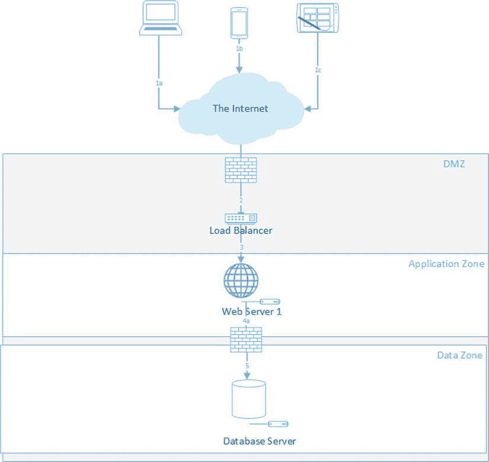

# 六、使用 ASP.NET MVC 设计应用

本章将使用菜谱来介绍几个架构概念。本章第一部分的食谱将带你了解一些需要在项目早期做出的关键决策点。食谱的其余部分将关注一些常见用例的参考体系结构。这些解决方案既包括传统的 web 应用架构，也包括使用云服务的更现代的方法。

6-1.理解架构师的角色

问题

你刚刚开始审查一个新项目的需求 。这个项目的范围比你过去做过的其他项目都要大，但是你有信心利用你作为 ASP.NET MVC 开发人员的技能来解决这个问题。但是，该项目的业务发起人不确定您提议的方法，因此决定引入一名软件架构师来帮助指导该项目的设计。您以前从未与架构师一起工作过，因此您想了解他扮演什么角色，以及他与高级开发人员或技术领导有何不同。

解决办法

在信息技术的世界里,“架构师”这个术语的使用相当松散。组织中不同级别的不同角色的许多人都自称是架构师。软件架构师的官方定义以及他或她所扮演的角色因组织而异。当你在各种互联网工作论坛上查看架构师职位的工作列表时，你会看到这一点。各种定义之间的共同线索是，架构师是整体设计的核心。根据您的技能组合和在组织中的级别，可能是一个子系统、一个数据库、一个企业级应用、一个网络，甚至是整个公司的 IT 战略。一些公司正在创建非技术架构角色，例如业务架构师和服务架构师。这些非技术角色专注于设计业务流程，而不是技术。技术角色的职称包括解决方案架构师，企业架构师，信息架构师，基础架构架构师，甚至云架构师。

出于本章的目的，这些方法将集中在*解决方案架构师*的领域。解决方案架构师负责软件系统的总体设计。解决方案架构师与业务分析师一起工作，以获得对系统需求的总体理解。然后，他们确定应该用于系统的技术，设计系统的物理拓扑，并就详细设计咨询主要开发人员。

因为这本书关注的是微软技术，所以这里介绍的解决方案将以微软为中心，重点是使用 ASP.NET MVC 的基于 web 的解决方案。

它是如何工作的

来自世界各地的许多人带着急切的好奇心观看了曼哈顿下城的重建工作。从早期的概念图到比例模型 ，奠基，然后最后，一座世界贸易中心在纽约市的天际线上浮现。

自从工地开始建设以来，已经过去了十多年，仍然有数百名工人夜以继日地工作在看起来如此庞大和复杂以至于不可能完成的事情上。你能想象这样一个项目在没有熟练建筑师的规划和设计工作的情况下进行吗？单单钢铁工人和木匠的技能就足以完成这样一个项目吗？

大多数解决方案架构师从开发人员开始他们的职业生涯，但是许多来自其他 IT 领域，例如系统管理员和网络工程角色。大多数人并不是从建筑师开始他们的职业生涯，而是在五到十年后毕业进入这个角色。解决方案架构师通常不编写产品代码。如果架构师真的编写代码，通常是为了概念验证项目，这将教会他们关于一项技术的足够多的知识，以理解它是否适合提议的用途。

架构师需要接受最新技术 的培训，以便了解哪些工具可用以及应该如何使用它们。他们的知识是广泛的，而不是深刻的，但大多数人在特定的专业领域有更深的知识。例如，以微软为中心的 IT 部门可能倾向于雇佣除了一般的架构技能之外，对 ASP.NET MVC 有深入了解的架构师。

除了软件开发技术，解决方案架构师还应该对网络拓扑、服务器、存储技术和安全设备(如入侵检测和防御系统)有广泛的了解。解决方案架构师必须发展强大的书面和口头沟通技能，并具有专业的外表和风度。解决方案架构师可能会成为企业架构师，他们的角色将会扩大，他们将作为 IT 执行人员的顾问，帮助制定整体 IT 战略。

解决方案架构师和开发主管的区别

一个*开发主管*，也被称为技术主管，是项目团队中最资深的开发人员。他或她负责详细的系统设计，包括 API 设计、领域模型、数据库和项目结构。技术领导可能参与编码，但在大多数情况下，它是一个次要角色，大部分时间花在执行管理功能上。开发主管通常一次只负责一两个项目。相比之下，一个解决方案架构师可能会同时被分配到许多项目中。解决方案架构师的大部分时间花在项目的开始阶段，但是他或她通常会参与咨询，在某些情况下，还会参与故障排除活动。

开发主管通常与一个业务部门保持一致，并且拥有与该组织相关的领域知识。解决方案架构师通常是集中式 IT 组织中多功能共享服务组的一部分。这两种角色越来越多地被外部化，但在大多数情况下，在岸顾问比离岸角色更受青睐。角色是否被外部化与架构师和开发领导与业务的紧密程度以及领域知识对他们的工作职能的重要性有很大关系。

在较小的组织中，解决方案架构师和开发主管之间的界限可能会很模糊——由一个人同时担任这两个角色。较小的组织可能没有足够的工作来证明全职解决方案架构师的合理性。在大多数情况下，他们会引入外部资源来填补这一缺口，尤其是在某个技术领域存在技能缺口的情况下。例如，如果一个组织是 ASP.NET MVC 的新手，他们可能会引入一个架构顾问来帮助制定第一个项目，同时与内部员工进行知识转移。

其他架构师角色

随着体系结构角色的发展，一些专门化已经开始出现。表 6-1 列出了架构师角色的不同变化。

[表 6-1](#_Tab1) 。架构角色

| 作用 | 描述 | 流行 |
| --- | --- | --- |
| 基础设施架构师 | 关注网络基础设施、虚拟化、存储技术和其他 IT 基础设施。随着 IT 基础架构发展到包括公共云和私有云技术，这一角色可能会被更名为云架构师。在以微软为中心的 IT 部门，技能可能包括 Windows Server、Microsoft Exchange、Windows Azure 和 Active Directory。 | 高的 |
| 信息架构师 | 侧重于信息管理和协作。拥有数据仓库、数据可视化、非结构化数据分析管理方面的技能。在 Microsoft 商店中，了解 Microsoft SQL Server、Microsoft SharePoint、Microsoft SQL Server 主数据管理、Microsoft SQL Server Reporting Services、Microsoft PowerPivot 和 Microsoft SQL Server Analysis Services(SSAS)。 | 中等 |
| 企业架构 | 从整体角度对组织的技术资产有深刻的理解。通过对新兴技术的研究以及对组织流程和数据的深入了解，帮助制定技术战略。应该对整个微软软件基础设施有广泛的了解，包括像 ASP.NET MVC 这样的技术。 | 中等 |
| 服务架构师 | 创建与技术产品集成的业务服务。这个角色不太关注技术。 | 新兴的 |
| 业务架构师 | 侧重于建立对业务结构的理解。这不是一个技术性的角色。 | 新兴的 |

6-2.理解购买或制造决策

问题

给你一个系统的一组需求 ，这个系统将管理发生在你公司许多地方的建筑项目的合同。看了需求，似乎要解决的问题并不是贵公司独有的。你需要知道你是应该提议一个定制系统还是在市场上寻找一个打包产品。

解决办法

市场上几乎有你能想到的所有常见商业问题的产品。购买和部署通常比从头定制开发系统更经济。在某些情况下，您可以找到一个软件即服务(SaaS)提供商，它不仅提供解决方案，还托管解决方案。在其他情况下，您可以构建一个由一个或多个供应商产品组成的解决方案，您可以将这些产品与基于 ASP.NET MVC 的定制解决方案集成在一起。

决定是购买还是建造的第一步是了解你的目标市场。对于示例用例，可能有几个适合的产品类别 。一旦你缩小了产品类别，你需要对该领域的产品做一些研究，并确定谁是产品领导者。产品细分市场的成熟度很重要，因为不成熟的产品细分市场往往不稳定。你不希望从一个可能在一年内倒闭的供应商那里购买产品。在某些情况下，您可以从 Gartner 和 Forrester 等公司购买研究报告。一旦您将供应商名单缩小到三家或更少，您就可以将产品带到您的实验室来看看它们的性能如何。

根据您的实验室分析和论文研究，您将能够就是构建还是购买，以及如果购买，您更喜欢哪个供应商提供建议。

它是如何工作的

许多开发人员和架构师习惯于使用舒适的东西，而不是需要的东西。这种行为有时被称为金锤反模式。当你只有一把锤子时，一切看起来都像钉子。您需要注意的是，定制的 web 应用并不是解决所有问题的最佳方案。很多时候，如果你有一个共同的业务问题，就会有很多解决方案。以下是一些常见问题的示例，对于这些问题，您几乎不应该构建自定义解决方案 :

*   博客
*   内容管理系统
*   维基网
*   客户关系管理系统(CRM)
*   批量电子邮件系统
*   企业单点登录系统

对于每一种类型的系统，都有数百种现成的解决方案，包括开源的商业解决方案、Outlook 和 SharePoint 等产品的插件以及 SaaS 解决方案。每种编程语言和平台都有解决方案。其中大多数都是高度可配置和可定制的。在大多数情况下，自定义解决方案的实施和维护效率较低且成本较高。

当系统需求对贵公司的业务模式来说是独特的，或者在建议的系统对贵公司获得竞争优势至关重要的情况下，您应该推动定制的 ASP.NET MVC 解决方案。

在某些情况下，从市场上选择一个使用熟悉平台如 ASP.NET 开发的产品可能是有利的。如果您和您公司的其他人很了解这项技术，它可以使平台更容易部署、维护和故障排除。如果产品提供了扩展点，您和您的团队将更容易利用它们。

但是，你要注意不要让系统平台完全蒙蔽了你的判断。有很多用 Java 和其他语言写的精品。最后，产品的选择应该基于产品满足您需求的程度。

了解细分市场

这个过程的第一步是清楚地理解需求。如果业务需求文档太模糊，要求澄清。与业务分析师交谈，解释您对需求的理解。确保你做对了。其他需要注意的是矛盾的或者不合逻辑的业务需求。许多设计缺陷可以追溯到需求。作为架构师，您通常是第一个以实际的方式看待需求的人。你的工作是把它从抽象中提取出来并转化为设计。当你看到缺点时，你需要指出它们。

回到问题陈述中的用例，您知道您工作的是一家大型企业或政府机构，有许多物理位置。你知道在许多不同的地方有许多建设项目。您还知道，企业正在寻找一种方法来管理与各种建筑承包商的合同。这个问题的解决方案会提高你公司的整体竞争力吗？贵公司管理建筑项目的业务流程是否如此独特，以至于没有其他公司会有类似的要求？答案最有可能是，“没有。”

根据需求，您可以找到两类符合您需求的项目。第一个是通用合同管理系统。您发现这是一个项目领域，随着许多成熟的供应商提供高度可配置的解决方案，其中一些可以与您公司的企业资源规划(ERP)系统集成。坏消息是，大多数系统的价格远远高于客户的预算，更好的系统配置起来非常复杂，您需要支付额外的专业服务费用，让他们的顾问为您安装。第二个产品类别更适合管理建筑合同。这一领域的问题是，它是一个小得多的市场，而且该领域的供应商不像企业合同管理领域那样成熟。在十家左右的供应商中，您可以缩小范围，选择两家最符合您要求的供应商，它们似乎都有稳定的财务状况和技术。

将产品带入实验室

即使你能够购买一份研究报告，有时将每种产品带回家进行测试仍然是有利的。许多产品在纸面上看起来很棒，可能演示得很好，但是除非你把它们带到实验室，进行彻底的成分分析，否则没有办法真正知道你得到的是什么。在适用的情况下，您应该始终推动这种类型的分析。如果产品是由企业选择的，这一点尤其正确。商业用户通常根据用户体验(UX)和配色方案来选择产品。您的组件分析的目标如下:

*   *确保产品可在您的环境中部署*。例如，如果该产品只能在 Firefox 14 或更好的版本上工作，但您的公司已经在 IE 6 上实现了标准化，这可能是一个问题。另一方面，如果该产品只在 Windows 2000 上工作，而 Windows 2000 已经停止支持多年，那么该产品可能会有更大的问题。
*   *确保产品受支持*。许多产品需要像 JBoss 这样的 Java 应用服务器。如果 JBoss 是自动为您安装的，并且 JBoss 的更新是由供应商作为正常修补过程的一部分提供的，这可能没问题。另一方面，如果 JBoss 需要手动安装，并且需要单独维护，那么您将需要定义一个过程来完成这项工作。也有可能你的公司有一个 Java 应用服务器标准。该软件是否经过认证，可以在您的标准平台上运行？
*   *在技术堆栈中寻找奇怪的不匹配*。如果你看到一些组件是用经典的 ASP 编写的，其他部分使用 PHP，还有一部分使用 Ruby 并附带一些 Java，那么这个系统的架构可能很糟糕。
*   *了解应用的通信模式*。如果软件需要来自防火墙外部的入站连接，您的公司可能有禁止这种模式的政策。
*   *关注性能*。应用运行是否很差，即使数据量很小，没有并发性？如果是，你认为它在生产中会如何运行？您应该总是从供应商那里获得应用的可伸缩性统计数据。您需要了解每个前端服务器可以支持多少并发用户。例如，如果他们的每台服务器只能支持 20 个用户，而系统需要支持 20，000 个用户，那么您可能需要考虑另一种产品。

退回到定制开发

有时，即使一个细分市场中有许多供应商，在以下情况下，您仍然可以证明定制开发优于软件购买:

*   没有一家供应商能够满足您的需求，定制产品以满足您的需求的成本会比开发自己的产品更高。
*   套餐的价格大大超出了计划预算，你只需要套餐提供的一小部分功能。许多供应商的软件包可能满足您的要求，但超出了您的需要。
*   如果你在一家大型企业工作，有可能没有一家供应商曾经与你这样规模的公司合作过，并且没有能力满足你的要求。
*   您的组织比供应商产品的设计有更严格的安全要求。例如，对于 SaaS 提供商，您的信息安全策略可能需要 ISO 27001 认证。
*   满足您要求的供应商是由一个开发人员在他母亲的地下室里经营的。玩笑归玩笑，您应该只选择那些在支持像您这样规模的组织方面有良好记录的供应商。您需要非常自信地知道，一旦您的服务投入生产，供应商可以为您提供支持。

供应商解决方案失败的例子很多。引入错误的产品会带来灾难，尤其是如果产品很贵的话。即使您的管理层正在努力推动基于供应商的解决方案，如果该解决方案是错误的，请坚持您的建议。以诚实和不带偏见的方式记录每种方法的利弊，以此来支持你的建议。

6-3.在公共云和私有数据中心之间做出选择

问题

在与客户讨论可能的部署场景 时，您被问到是否认为应该将应用部署到云中。客户似乎认为云是“神奇的”,通过使用它，应用将能够自动做各种事情。您需要知道公共云部署是否是一个好主意，以及如何向客户解释这一决策的好处和风险。

解决办法

在大多数情况下，云产品是否合适取决于两个因素:数据隐私和成本 。对于数据隐私和安全，亚马逊和微软都有可靠的产品，但在某些情况下，限制在第三方存储机密客户信息的合同义务可能会限制你使用云服务。从成本角度来看，云提供商只会根据您使用的内容向您收费，而且由于他们购买和部署了如此大量的硬件，因此他们的单价会因规模经济而降低。在某些情况下，重用现有资产可能更具成本效益，但在大多数情况下，云供应商会更便宜。云供应商还提供按需扩展的能力，并创造无限存储容量和计算能力的假象。

随着云供应商的发展和成熟，许多阻碍企业向云迁移的担忧已经烟消云散。如果您的客户对云部署和系统需求持开放态度，风险概况和成本核算是有意义的；您应该考虑将应用部署到云中。

它是如何工作的

像信息技术中的许多流行词一样，“云”这个术语的含义已经被地球上几乎每一个技术供应商劫持和扭曲。正因为如此,“云”这个术语被用来描述服务、硬件平台甚至存储设备。许多服务提供商称他们的产品为“云”举例来说，苹果公司称其将你的文件和设置存储在苹果服务器上的能力为“iCloud”该术语还用于描述私有托管的虚拟机集群、外部数据中心中的托管解决方案以及供应商数据中心中托管的完整应用。

大多数云服务可以分为三种服务模式:托管服务称为基础设施即服务(IaaS) ，公共托管的 API 称为平台即服务(PaaS) ，以及外部托管的软件解决方案，或软件即服务(SaaS) 。从基于 ASP.NET MVC 开发定制软件解决方案的人的角度来看，当客户询问潜在的云部署时，他们通常会考虑 IaaS 或 PaaS 部署——可能来自 Amazon AWS 的 IaaS 或 Microsoft Azure 的 PaaS。

微软最近成为 IaaS 提供商，将基于 Hyper-V 技术 的虚拟机添加到他们的 Azure 产品组合中。亚马逊也一直在扩大其服务。除了成熟的 IaaS 服务之外，亚马逊现在还提供简单队列服务(SQS)、弹性地图缩减(EMR)和简单工作流服务(亚马逊 AWS)。亚马逊和微软并不是这个领域的唯一玩家。其他供应商包括 Rackspace、Nirvanix、Google、IBM、Flexscale 和 Force.com。

在 PaaS 和 IaaS 之间选择

根据 Gartner 的文章“随需应变:从容量到能力”(`www.gartner.com/id=1508715`)，一家典型公司 50%到 80%的 IT 预算都花在基础架构配置和运营上。在某些组织中，订购硬件、分配资源以安装硬件、机架安装和布线、安装操作系统以及服务器配置和修补的过程有时可能需要数周甚至数月时间。一旦设置好服务器，就需要花费额外的时间来配置路由器、防火墙和负载平衡器。在 IaaS 解决方案中，整个硬件配置工作流程已经为您完成。一个门面已经建成，掩盖了这种复杂性，并给人以无限的计算能力的错觉。曾经需要数周时间的服务器配置过程现在只需点击一个按钮即可完成。如果你遇到意外的流量高峰，亚马逊的 Auto Scaling 和 Paraleap Technologies 的 AzureWatch for Windows Azure 等服务可以自动创建新的实例来满足需求，然后在不再需要时取消供应。

如果您正在移植现有的代码库，IaaS 解决方案可能是最好的选择。IaaS 供应商为您提供计算能力、虚拟机管理程序集群和网络基础设施。您可以完全控制虚拟机，并且可以安装您需要的任何软件。Amazon 和 Microsoft 都允许您使用基于 web 的管理工具创建自定义机器映像和创建新机器。对于这两种 IaaS 产品，您有责任为您机器上安装的所有软件(包括操作系统)购买许可。您还负责修补操作系统，监控磁盘空间和内存不足等情况，并捕获和删除恶意软件。

另一方面，PaaS 解决方案抽象出了传统操作系统的概念。您不再需要担心服务器补丁和升级。您创建并打包您的软件，然后将它部署到适当的角色。您的软件可以使用存储服务、关系数据库服务、队列和由提供商的 API 提供的其他服务。有了 Windows Azure，ASP.NET MVC 4 角色将允许您只需进行较小的配置更改即可部署大多数 ASP.NET MVC 应用。如果您需要更多容量，您不再需要启动一个全新的操作系统—您只需要启动应用的另一个实例。在 IaaS 世界中，您可能需要考虑服务如何实现负载平衡。在 Amazon 上，你可能需要启动一个弹性负载平衡的实例，这是另一个收费服务，用来管理你的流量路由。在 PaaS 世界中，这是为您管理的，并包含在价格中。PaaS 的缺点是您无法控制环境。您可能在利用某些无法在 web 或 worker 角色上运行的第三方工具时遇到问题。另一个风险是，如果您在特定于某个云产品的 API 上投资过多，可能会使从服务中迁移变得困难。

也可以同时使用 PaaS 和 IaaS 来创建混合解决方案。例如，您可以通过购买订阅并在 Azure 上添加几个虚拟机角色来托管自定义 SharePoint 配置，从而使用微软的 IaaS 产品。然后，您可以使用多个 web 和 SQL 角色来托管 ASP.NET MVC 应用，该应用使用 web 部件或 SharePoint 应用(如果您使用的是 SharePoint 2013)呈现在 SharePoint 上。如果您预计您的 SharePoint 站点将需要承载大量文档，您可以使用远程 BLOB 存储提供程序，如 Metalogix StoragePoint，它可以将 BLOB 存储卸载到 Windows Azure BLOB 存储。

6-4.确定应用的本地网络规模

问题

给你一个系统的需求 。商业赞助者估计这项新服务每天将吸引 1 万到 2 万名访问者，并且这个数字将在两年内显著增长。公司的安全政策要求每个应用都被隔离在自己的专用虚拟网络(PVLAN) 中。有人问你网络应该有多大。您的网络管理员在电子邮件中询问您是否需要/28 网络或/27 网络。希望您在下一次状态会议之前提供答案。

解决办法

在许多项目中，你需要做的第一个架构决策是确定网络的规模。这大致可以解释为应用专用网络所需的唯一 IP 地址的最大数量，加上为网关和其他网络服务保留的额外地址。通过首先确定在应用生命周期的最初几年中需要部署的服务器数量，然后乘以 2，可以估算出每台服务器上安装的用于备份的额外网络适配器的数量。

它是如何工作的

在人类世界中，当人们需要开车去一个他们从未去过的房子时，他们通常需要两条信息:街道地址和如何到达那里的方向。在 IP 网络中，你有一个类似的概念，但是你使用 IP 地址而不是街道地址，并且不使用谷歌地图，你使用一个叫做路由表的东西。

当您的网络团队设计您的网络时，他们得到了一组有限的地址。如果地址池管理不当，地址池可能会干涸，如果不先从网络中移除现有设备，他们将无法为新设备提供 IP 地址。为了减少所需的唯一 IP 地址的数量，并降低路由表的复杂性，他们使用了一种称为*网络地址聚合*的技术。网络地址聚合 最常用的方法叫做无类域间路由(CIDR) 。

考虑到这一点，您可能需要以/xx 的格式向网络管理员提供一个地址空间聚合类型，其中 xx 是 IP 地址网络部分的位数。这种符号叫做*路由前缀掩码* 。

为了避免在深入的 TCP/IP 讨论中迷失方向，[表 6-2](#Tab2) 显示了路由前缀掩码如何转换为 PVLAN 中的主机数量。

[表 6-2](#_Tab2) 。使用 CIDR 地址空间聚合

| 可用主机地址 | 路由前缀掩码 |
| --- | --- |
| Sixteen | /28 |
| Thirty-two | /27 |
| Sixty-four | /26 |
| One hundred and twenty-eight | /25 |
| Two hundred and fifty-six | /24 |
| Five hundred and twelve | /23 |
| One thousand and twenty-four | /22 |
| Two thousand and forty-eight | /21 |
| Four thousand and ninety-six | /20 |

如[表 6-2](#Tab2) 所示，每次减小前缀掩码的大小，可用主机地址的数量就会增加一倍。

回头看看问题陈述中的需求，您预计每天会有 1 万到 2 万的访问者，并且在两年内会有显著的增长。以此为基准，您需要估计并发用户的峰值数量，然后确定一台服务器可以支持多少并发用户。

让这变得棘手的是，增长预测通常只是基于客户期望的高层次估计，通常过于乐观。过高的估计会导致您浪费宝贵的 IP 地址，并增加网络管理员的复杂性。另一方面，低估可能会导致日后的消防演习，在这种情况下，您需要创建一个更大的 PVLAN，然后将您的应用迁移到其中。这是大量的工作，很可能会导致停机。你需要做的是给自己一个缓冲。如果服务增长迅速，您应该能够预测 IP 地址池何时会耗尽，并相应地进行规划。

如果服务做得很好，你的峰值是每天 20，000 个访问者，并且流量在接下来的两年里增加两倍，你每天将有 60，000 个访问者。如果您的服务以美国的客户为目标，并且大多数访问将发生在工作时间，那么当您对美国的四个时区进行补偿时，您可以根据每天 12 小时来估计平均并发率。在您的活动期间，平均每小时大约有 5，000 名用户。

下一个需要整合到你的评估中的统计数据是每次就诊的平均时间。对于每小时 5000 个用户中的每一个，他们会在网站上停留多长时间？对于这个估计，您需要查看需求文档中的用例。根据您正在开发的服务类型，这可能需要几秒到 45 分钟。

为了进行评估，让我们假设每次访问的平均时间是 5 分钟。基于这个比率，应用的平均并发率大约是 5000/(60/5)或 416.6。不幸的是，你的流量不会总是一致的，你会遇到流量高峰。你可能有一个每日峰值，比如说许多用户每天下午 5 点和 6 点左右登录。你也可能会遇到季节性高峰，比如在假期前后，平均每天的游客数量会增加两倍，达到 18 万人。基于这些数字，您可以构建一个完美的风暴场景，其中 180，000 个高峰季节用户中的 50%都在您的高峰流量时段登录。令人欣慰的是，时区的魔力将把这个峰值分散在四个小时的时间段内。这给你(180000/2)/4=22500。

概括地说，在部署您的服务两年后的某个时间点，如果服务像客户期望的那样受欢迎，并且流量在两年期间增加了两倍，您将面临大约 22，000 个并发访问者的流量高峰，持续大约四个小时。当然，所有这些都是高水平的估计。因为你不是通灵者，你没有办法确定。在大多数情况下，你的客户甚至得不到他们期望的十分之一的流量。对于这项附加工作，由于我们只是试图确定我们将需要的 IP 地址的数量(而不是订购服务器)，因此可以采用乐观的估计。

6-5.确定部署哪个操作系统

问题

作为一名开发人员，您喜欢站在最前沿。Windows Server 2012 对微软来说是一个巨大的发布。这可能是自 Windows 2000 Server 以来 Windows Server 生态系统最重大的变化。您的应用即将上线，但服务器团队尚不支持 Windows Server 2012 。您应该推动管理层允许您在 2012 年部署，还是应该让步，继续使用 Windows Server 2008 R2 版？

解决办法

一般来说，在可能的情况下，您应该始终选择最新版本的服务器操作系统，该操作系统已经过验证，并且完全受您公司的服务器操作人员的支持。这将有助于确保您的软件将是稳定和安全的。除非您的软件依赖于新的 Windows 功能，否则您不应该强制迁移到最新版本。在这种情况下，您仍然应该与您的服务器操作团队合作，在部署之前验证服务器构建。您应该避免部署操作系统的测试版和发布候选版本。

它是如何工作的

部署新系统时，使用最新版本的操作系统有几个好处 。在微软的世界里，它保证你将有四年的主流操作系统支持和另外五年的扩展支持。它还可以确保您的应用有最好的基础，允许您利用平台上的新功能。

匆忙部署最新的双边投资条约也有危险。首先，你有可能成为第一个发现最新漏洞的微软客户。当您致电 Microsoft 支持部门时，您可能会惊讶地发现他们在知识库中没有针对您的问题的修复程序。事实上，他们不知道如何解决你的问题，但他们会给你开一张提供高级服务的罚单，以此来打消你的疑虑。几个星期后，你可能会被告知他们有一个“修补程序”可以解决你的问题。客观地说，Windows Server 2008 R2 SP 1 包含 970 个修补程序 和安全更新。换句话说，自该操作系统推出以来，微软已经纠正了 970 个错误。这些错误中有许多是由微软的客户发现的。这些错误修复的完整列表，以及关于它们的知识库文章的链接，可以在微软下载网站`www.microsoft.com/en-us/download/details.aspx?id=269`上找到。

大多数组织都有一个标准的服务器构建过程，其中可能包括一个自定义的 Windows installer 。这确保了操作系统以一致和可支持的方式部署。它还简化了安装过程。在某些情况下，该过程可以完全自动化，尤其是在服务器构建与虚拟化相结合的情况下。由于您的组织需要一个月左右的时间来准备、测试和构建定制服务器，因此您很可能无法在操作系统发布当天获得最新操作系统的定制版本。考虑到这一点，在可能的情况下，您应该规划您的部署，以符合您公司的操作系统发布周期。

最佳实践是在您的服务器和开发平台上消费服务，而不是编写定制代码。您必须编写的代码越少，您需要维护的代码就越少，并且您可以更快地进入市场。有时新版本的 Windows 会提供一种功能，可以节省你几个月的编码时间。如果你打算使用这个新功能，你需要提前计划。让您的服务器运营团队知道您的计划。如果他们提前知道您需要新版本的 Windows Server，他们可能会优先准备一个与您的项目计划相一致的版本。

依赖一个新的预发布特性是有风险的。有时，Windows 预发行版本中的功能可能无法在最终版本中使用。在定义项目章程时，您需要确保在风险登记簿中考虑了这些风险，并且您有一个现实的意外情况。

6-6.记录您的架构

问题

你已经考虑了所有的设计决策，现在需要记录你的架构。你不确定是否需要学习 UML 或者是否应该买一个昂贵的绘图工具 。

解决办法

当创建你的图 时，UML 会很有帮助，但不是必需的。最终，您应该遵循您的公司所采用的任何文档标准。如果你的公司没有制定文档标准，那么你应该努力使你的图表简单易懂。

记录系统的一个常用技术是使用架构视图的概念。使用这种方法，您将把您的架构文档分割成几个部分，每个部分强调系统的一个独特方面。这些部分可以包括企业架构上下文、架构约束、原则和假设、逻辑视图、接口视图、物理视图和部署视图。

它是如何工作的

出于本章的目的，我们将关注企业架构上下文视图、物理视图和部署视图。这些视图显示了应用如何部署在基础设施上，以及它如何与企业中的其他系统集成。

UML 与自由式

通用建模语言(UML)可能是一种有效的交流设计的方式，但它不是记录设计的唯一方式。敏捷软件开发宣言的一个关键原则是，“个人和交互胜过过程和工具。”从这个角度来看，用来创建你的设计的工具和方法没有你的设计如何有效地传达给你的目标受众重要。UML 的好处是基于这样一个假设，即由于它的普遍性，每个人都熟悉它的约定，并且它的图表不需要太多的解释。这种假设的问题在于，情况并不总是如此。在许多组织中，很大一部分开发人员和 IT 人员没有接触过 UML，大多数业务用户可能从未听说过它。如果您的组织是这种情况，UML 会是表达您的设计的最佳格式吗？

即使您组织中的人没有接受过 UML 的培训，您仍然可以从业界在定义 UML 规范方面投入了大量精力这一事实中受益。人们对图表的类型和其中使用的符号进行了大量的思考。正因为如此，许多 UML 图不需要任何特殊的培训就可以很容易地阅读和理解。

另一方面，自由格式的文档有时效果更好。例如，如果您需要使用 PowerPoint 幻灯片向一组业务用户或管理人员展示您的设计，很多时候 UML 图会太复杂。在这种情况下，一个简化的并且可能是彩色的图可能比 UML 图更有效。

建模和文档工具

有许多工具可用于记录应用和网络架构。这些工具在价格和功能上差别很大。我建议对其中的几个工具进行评估，以确定哪个工具最适合您的需求。下面列出了一些你可能要考虑的工具:

*   OpenText ProVision :一个非常强大的工具，它将您的所有图表存储在一个 SQL 数据库中，并允许您创建整个企业的地图，可以从不同的角度查看，不仅与技术相关，还与功能相关。它还可以洞察应用之间的依赖关系。例如，如果您打算淘汰或更换一个系统，可以使用预配来创建报告，显示哪些系统依赖于它以及集成的性质。供应的缺点是它的定价和学习曲线。在使用资源调配创建任何有用的报告之前，还需要做大量的前期工作。
*   Sparx Systems Enterprise Architect:另一款强大的工具，支持端到端建模，并提供基于服务器的存储库选项。安装简单，下载 38MB。它还提供了从图中生成代码的工具。学习起来也有些复杂，但它的定价比开放文本更合理。
*   IBM Rational Rhapsody :提供 UML 图表、代码生成和模拟。这是一款功能丰富的成熟产品。它集成了 IBM 的全套需求管理和建模工具。它还能够与 Visual Studio 集成，在 Visual Studio 中可以生成 Windows Workflow Foundation 应用。缺点是复杂、学习曲线和价格。
*   *微软 Visual Studio 旗舰版* :提供 UML 图表、类图的代码生成，以及从现有代码生成图表。它不提供往返生成，这意味着如果您从图中生成代码，然后修改代码，那么图将不会被更新。它还提供了图层图表功能，允许在构建期间根据设计验证代码。当与 Team Foundation Server 一起使用时，关系图可以与工作项链接，这些工作项可以与签入源代码管理系统的代码关联。缺点是它在价格范围上不如竞争产品成熟，只有拥有 VS 旗舰版或 VS 高级版的团队成员可以查看图表。
*   Microsoft Visio :如果您订阅了 MSDN，Microsoft Visio 也包含在内。Visio 附带了几个用于创建网络和软件图表的模板和模具集。Visio 模具是可在您的图表中使用的可扩展图表组件。除了包含的模板之外，web 上还有许多模板，包括最常见网络硬件的模板。Visio 2013 包括对 UML 2.4、业务流程模型表示法 2.0 和 Windows 工作流基础 4.0 的支持。当与 Microsoft SharePoint 结合使用时，远程团队成员可以实时协作处理文档。缺点是它不像其他一些解决方案那样健壮。例如，它不像 Open Text 和 IBM 解决方案那样，有一个全面的端到端企业架构文档的服务器端解决方案。
*   免费的，基于网络的，易于使用的。不需要安装或注册。使用 mxGraph JavaScript 图表库构建。它非常适合创建基本的图表。允许您在本地 PC 上将图表保存为 XML 文件。它不提供任何高级特性，比如代码生成。

建筑视图

当记录你的架构时，可读性和简单性对于让你的设计易于理解是很重要的。实现这一点的一个方法是创建几个图表，每个图表显示系统的一个独特的视图。这些视图中的第一个是物理视图。这是一个高级图表，显示了您的应用是如何在网络上进行物理部署的。[图 6-1](#Fig1) 显示了一个面向互联网的应用，它由两个 web 服务器组成，通过一个专用的硬件设备和一个专用的数据库服务器进行负载平衡。

[图 6-1](#_Fig1) 。简单互联网应用的物理视图

图 6-1 告诉了我们很多关于设计的信息。它显示该应用将被部署到 DMZ，并可通过互联网由 PC、平板电脑和智能手机访问。它显示流量通过外部防火墙路由到负载平衡器。负载平衡器然后将流量路由到两个 web 服务器。在设计阶段的早期，您不知道 web 服务器的名称，可以使用通用名称，如 Web Server 1。稍后，在部署服务器之后，占位符名称可以替换为真实的服务器名称和 IP 地址。[图 6-1](#Fig1) 还显示了在 web 服务器和数据库之间还有另一个防火墙，并且应用只有一个数据库服务器。

该图没有告诉我们服务器上运行的是什么类型的软件。它也没有提供太多关于网络基础设施的细节。它也不告诉或显示正在使用哪些端口或协议。

图 6-2 显示了一个 UML 部署图。这描述了与图 6-1 中[相同的系统，但是重点在于部署了什么而不是部署在哪里。它显示了运行 web 浏览器的个人计算机正在使用 HTTP 协议与运行 IIS 8 的 web 服务器进行通信。它还显示了一个名为“sample web app”的组件，这是一个运行在 IIS 8 执行环境中的 ASP.NET MVC 应用。该图还显示 web 服务器连接到一个数据库服务器，该服务器也运行在一个虚拟机上。数据库服务器的操作系统是 Windows Server 2012 标准版，它运行的是 SQL Server 2012 Web 版数据库系统。名为 SampleDB 的数据库正在 SQL Server 2012 执行上下文中运行。](#Fig1)

注意[图 6-2](#Fig2) 只显示了一个网络服务器，而不是两个，如图[图 6-1](#Fig1) 。这是因为图表的目的是显示每个服务器角色上部署了哪些组件，而不是网络拓扑。这对于两台服务器都很好，但是在这种情况下，我选择不这样做，因为 web 角色中的所有服务器都有相同的组件。此外，在有许多 web 服务器的情况下，试图将它们都放在一个图表上是不切实际的。

图 6-2 中还省略了用于通信的端口号。同样，这是风格、个人偏好或组织文档标准的问题——添加端口号是正确的。在这种情况下，我倾向于在这里省略这些信息，并将其包含在显示网络拓扑的图表中。

[图 6-2](#_Fig2) 。UML 部署图

图 6-2 中[的 UML 部署图由*节点*组成，用 3D 方框表示。在](#Fig2)[图 6-2](#Fig2) 中，父节点是一个被`<<device>>`原型声明所隐含的设备。原型的正下方是描述它的属性。在这种情况下，显示的是设备名称 webserver01，后跟冒号和服务器描述。嵌套在设备内部的是另一个描述操作系统的节点。在操作系统内部，您可以看到 web 服务器节点。web 服务器和操作系统是节点符号专门化的例子。另一种表达方式是显示服务器的 OS 类型和属性，而不是执行环境节点。

UML 规范还提供了显示安装了哪些软件组件和工件的约定。一个组件通常用来描述一个概念性的软件元素，比如子系统。在本例中，“sample web app”是组件。如果您愿意，您可以添加更多的细节来显示“示例 web 应用”是由几个构件组成的。一个*工件*是一个可部署的组件。它可能是一个`.dll`，一个 web 部署包，甚至是一个`.aspx`或`.cshtml`页面。许多建模工具——如 Provision——允许文档是交互式的，因此用户可以在许多层中导航，而不是以静态图的形式显示。例如，在图 6-2 中，你可以双击“sample web app”组件来查看组成它的各种工件。

[图 6-3](#_Fig3) 。自由形式的文档展示了应用如何适应企业

图 6-3 显示了一个应用如何适应企业整体架构的例子。这个图表完全是抽象的。它不显示服务器或网络。它将每个应用显示为一个简单的框，框中有一个名称，然后有箭头指向每个框，指示一个依赖层次结构。在本例中，部署了一个新的应用:电子商务应用。它依赖于电子邮件营销、库存、发票和供应商管理。电子邮件营销依赖于 CRM。CRM、供应商管理和发票都依赖于 ERP 系统。这种类型的文档非常有价值，尤其是当系统需要升级或更换时。想想这个例子中的 ERP 系统。如果必须更换 ERP 系统，哪些系统会受到影响？

6-7.为互联网设计 ASP.NET MVC 应用

问题

你已经得到了一个需要暴露在互联网上的系统的需求。商业赞助者估计，新的服务每天将吸引几千个访问者，并且这个数字将在两年内显著增长。您的客户不允许他的系统数据存储在异地，这限制了您使用公共云供应商，如 Amazon 或 Microsoft。您需要知道系统应该如何构建。

解决办法

为了使应用可以访问互联网，需要将其部署在一个通常称为 DMZ 的网段中。DMZ 是一个无人区，位于受保护的企业内部网和开放的互联网之间。在 DMZ 内部，应用通常被分割成单独的私有虚拟局域网(PVLAN)。一个 PVLAN 中的服务器将无法访问其他 PVLAN 中的服务器，除非使用路由器上的访问控制列表(ACL)明确允许访问。这种设计将限制一个受到危害的应用将 DMZ 中的其他应用暴露给攻击。

应用的应用服务器和数据库服务器应该用防火墙分开。SQL Server 和应用服务器之间的通信是加密的。为了增加安全性，您可以将 SQL Server 配置为侦听非标准端口。使用非标准端口有助于防止攻击，例如来自 SQL Slammer 蠕虫的攻击。

应用服务器可以被虚拟化，并被配置为位于网络负载平衡器之后。可以根据需要添加额外的前端服务器。

它是如何工作的

在部署服务器之前，您需要准备好基础设施。作为一名开发人员或架构师，您可能不会直接参与网络的设置或服务器的架装和布线，但可能会参与服务器大小、数量和配置的决策。

然后，您需要确定需要多少个前端 web 服务器，是部署独立的 SQL 服务器还是集群，以及是否需要任何额外的服务器来完成诸如排队和批处理之类的实用程序角色。您还需要确定磁盘空间；磁盘配置的类型；以及是使用本地存储、网络连接存储(NAS)还是存储区域网络(SAN)。

在设计您的服务时，您应该假设它需要在多个 web 服务器上运行，即使您在初始启动时部署到一个前端服务器。记住这一点，您不应该依赖任何本地机器资源。您不应该将数据保存到本地硬盘。您还应该避免使用会话变量。默认情况下，会话状态存储在本地计算机上分配给应用进程的内存中。如果用户在下一次请求时被发送到另一台机器，则会话数据将不可用。这可以通过使用专用的会话状态服务器或在 SQL Server 中存储会话数据来缓解，但这些选项都有自己的缺点。您还需要注意缓存的使用。不要假设您在上一次请求中写入缓存的值将在下一次请求中可用。即使用户被发送到同一台机器上，ASP.NET 也有可能刷新了缓存，因为该进程的内存不足。

参考架构

在问题陈述中，客户声称他们预计每天会有几千名访客。让我们假设业务分析师已经将估计值细化到每天 2，000 到 3，000 个访问者。在这些用户中，大约有 50%是未注册用户，他们只是浏览网站寻找信息。剩下的 50%将用于登录和执行事务。大约 5%的人将运行流程密集型报告功能。大多数用户将来自北美。该服务的使用将在下午 4 点左右达到高峰，估计最大并发率为 200 个用户。web 应用主要只是从数据库中提取数据，进行一些小的数据操作，并将数据作为 JSON 发送到客户端，客户端 JavaScript 执行大部分呈现功能。客户可以忍受适度的停机时间，并且不需要高可用性。

基于这些信息，一个基本的两层 web 应用应该足以满足需求。从纯容量的角度来看，甚至可以将数据库托管在同一台服务器上，但是出于安全原因，当服务被公开给 Internet 时，数据库服务器不应该与 web 服务器位于同一台机器上。

尽管最初只部署一个 web 服务器，但它被放置在硬件负载平衡器之后，以便在需要时可以水平扩展。web 和数据库层都将被虚拟化，这意味着它们将在虚拟机而不是专用物理硬件中运行。对于初始部署，web 服务器将被分配一个 CPU 和 2GB 的 RAM。这可能看起来很低，但是根据需求，应该比这个应用所需的要多。如果发现应用需要额外的 RAM，虚拟机基础架构允许轻松升级 RAM 和 CPU。

这种设计有以下好处:

*   在大多数生产部署中，虚拟机管理程序环境是集群化的，并且*能够无缝地将您的虚拟机迁移到另一台物理机，而不会有任何停机时间*。此功能为您的应用提供冗余，并防止单个硬件事件禁用您的服务。
*   在大多数生产部署中，*虚拟机管理程序环境将虚拟硬盘存储在存储区域网络(SAN* )上。这为应用的存储提供了额外的冗余。
*   成本大大降低。物理机需要数据中心的空间。如果您购买物理机，除了服务器的初始成本之外，您还需要为该空间支付经常性成本。使用虚拟机，您只需支付一小部分成本。
*   *更绿了*。总体而言，虚拟机的功耗低于物理机。当不再需要虚拟机时，不需要将它们送到垃圾填埋场。
*   *虚拟机可以按需扩展*。在短暂停机的情况下，虚拟机可以轻松添加 RAM 和 CPU。在我们的示例中，如果用户数量增加一倍，可以在几分钟内增加额外的 CPU 和 RAM。
*   *降低软件许可成本*。许多供应商根据物理内核的数量来计算软件许可证的成本。许多新服务器配置了两个 CPU 插槽，每个插槽有六个核心。如果您实际上并不需要所有的处理能力，这可能是一种巨大的金钱浪费。

[图 6-4](#_Fig4) 。小型 web 应用参考架构

[图 6-4](#Fig4) 显示了 web 应用参考架构的物理视图。主要通信路径在[表 6-3](#Tab3) 中解释。此图的目的是展示应用如何部署在网络上，并说明它用于通信的端口和协议。这种类型的图表对网络团队和安全团队的成员以及开发和质量保证(QA)都很有用。它忽略了详细的网络信息，如网络硬件、路由器和交换机的型号。除非专门为您的应用部署了专用的网络硬件，否则通常不需要这种详细程度。

[表 6-3](#_Tab3) 。参考架构中使用的通信路径如图[图 6-4](#_Fig4) 所示

T2】

服务器配置

参考架构由两个服务器组成:一个 web 服务器和一个数据库服务器。两台服务器都是虚拟化的，并且运行在 Hyper-V 或 VMWare 群集上。服务器的冗余由虚拟机基础架构提供。VMWare 有一种叫做 VMotion 的技术。它允许您的虚拟机在主机之间移动，而在可访问性方面没有明显的差距。微软有一个类似的功能，叫做实时迁移。由于所有虚拟机映像都存储在 SAN 上，因此虚拟机基础架构还为存储提供了一定级别的高可用性和冗余。

表 6-4。Web 服务器的服务器配置

| 操作系统: | Windows Server 2012 标准版 |
| --- | --- |
| 随机存取存储器: | 2GB |
| 中央处理器: | 1 个 CPU |
| 磁盘配置: | c:(系统)40GB，E:(日志)4GB，F:(数据)30GB |
| 安装的软件: | IIS 8 Web 部署管理器防病毒软件 |

表 6-5。数据库服务器的服务器配置

| 操作系统: | Windows Server 2012 标准版 |
| --- | --- |
| 随机存取存储器: | 4GB |
| 中央处理器: | 2 个 CPU |
| 磁盘配置: | c:(系统)60GB，E:(日志)10GB，F:(数据)60GB |
| 安装的软件: | Microsoft SQL Server 2012 Web 版防病毒软件 |

6-8.设计大规模的互联网应用

问题

你的委托人有大计划。他们刚刚从天使投资人那里获得了资金，并准备开始开发最新的大型社交应用。他们正在计划超级碗广告，品牌怪物卡车，甚至考虑雇用一些有吸引力的女人在下一次大型技术贸易展上分发 t 恤。他们期望每秒有数百万用户和数千笔交易。你被聘为建筑师。你需要一些关于如何设计这个解决方案的指导。

解决办法

对于一家希望大规模瞄准消费者的初创公司来说，公共云供应商将是最佳选择。如果您的客户可以根据需要扩展解决方案，并且只支付他需要的费用，他将能够在一个坚实的基础上开始，而不需要进行大量的前期资本投资。

为了处理潜在的大量事务，您需要从多个角度解决问题。这包括以下内容:

*   在内容交付网络(CDN)上缓存静态内容，如图像、CSS 和脚本文件。
*   使用分布式缓存减少冗余的 SQL Server 调用。
*   采用排队机制来帮助您在交易高峰时保持响应。
*   设计数据层，以便除了主数据库之外，还有几个只读副本可用于处理大量读取请求。
*   使用 BLOB 存储服务来处理任何大型对象的存储，例如可能上传到该服务的文档、图像、音频和视频。
*   将应用分为 web 层和应用层，以便轻松、适当地进行扩展。
*   采用与自动缩放组件协同工作的监控系统，以便应用可以自动缩放。
*   尽可能保持服务器软件的简单，尽可能将复杂的 UI 呈现逻辑推送到客户端。

它是如何工作的

在决定基于公共云的架构后，下一个重大决策将是是使用平台即服务(PaaS)产品，还是仅将云用于基础架构。如果您计划使用 ASP.NET MVC 构建您的应用，PaaS 产品可能是最佳选择，因为它允许您向外扩展，而无需管理 Microsoft Windows Server 的许可。

微软和亚马逊都为 ASP.NET 开发者提供了坚实的产品。微软有 Azure，它包含了 ASP.NET MVC 的一个专门角色。亚马逊提供了一项名为 AWS Elastic Beanstalk 的服务，这是一个基于领先的 IaaS 解决方案的 PaaS 解决方案。Amazon 对 PaaS 领域有点陌生，尽管它支持微软开发技术，但它对微软堆栈变化的响应不如 Azure。

参考架构

[图 6-5](#Fig5) 显示了在公共云中托管的大规模 web 应用的独立于供应商的参考架构。[表 6-6](#Tab6) 详细解释了通信路径。

[图 6-5](#_Fig5) 。高容量 web 应用的参考体系结构

[表 6-6](#_Tab6) 。[图 6-5](#_Fig5) 中使用的通信路径

6-9.使用 ASP.NET MVC 设计业务线应用

问题

你被指派构建一个新的人力资源应用，该应用将取代贵公司的绩效管理系统。该系统将通过年度目标设定和审查流程来指导员工及其管理层。它需要支持贵公司的 30，000 名员工，并处理评审提交截止日期期间出现的流量高峰。每个评估期内，员工最多可以上传 40 份文档。所有数据必须保留七年。您需要知道系统应该如何构建。

解决办法

对于该解决方案，您将在公司防火墙的安全保护下部署您的应用，并通过 Active Directory 管理对系统的访问。您还将使用 Active Directory 来检索有关员工和经理关系的信息。您的应用将被部署到运行 ASP.NET MVC 应用的两个虚拟机和数据库集群配置中的两个物理服务器上。

它是如何工作的

对于此应用，一年中大部分时间的使用都是名义上的——所有的使用都在与年度审核周期相对应的高峰时段出现。这种使用模式对于业务线应用来说并不少见。诸如此类的应用是云部署的完美候选。由于您只需为您在云模型中使用的资源付费，因此在一年的大部分时间里，系统资源可以缩减到最低限度，然后在高峰时再次增加。不幸的是，由于隐私和安全问题，许多公司还没有准备好迁移到公共云。然而，这些公司仍然可以通过虚拟化获得一些成本优势。借助虚拟化技术，即使在利用率较低的淡季，每台虚拟机上的 RAM 配置为 4GB，虚拟机管理程序也会使用透明页面共享、膨胀和交换等技术从虚拟机中回收已分配但未使用的内存。

对于前端 web 服务器 和应用服务器角色来说，虚拟机几乎总是您的首选。虚拟化提供了物理硬件无法实现的多功能性和成本节约。对于数据库服务器 ，这个选择并不总是那么简单。数据库面临的一些挑战包括高 I/O 利用率、更大的磁盘空间和内存需求，以及水平扩展选项有限。虽然现代虚拟化环境可以为您提供近乎裸机的性能，但服务器的 I/O 资源由许多来宾操作系统共享这一事实意味着 I/O 繁重的数据库会降低整个节点的性能。如果数据库需要大量磁盘空间，还会减少可以使用 SAN 上存储阵列的虚拟机数量，从而对 Hyper-V 群集的成本效益产生负面影响。可以通过配置虚拟机使用直接磁盘访问而不是虚拟硬盘文件来缓解这一问题。通过直接磁盘访问，虚拟机磁盘被映射到物理卷，而不是使用共享卷上的文件。直接访问卷的问题在于，可以为虚拟机管理程序群集配置的数量有限。

考虑到这些挑战，虽然对中小型数据库进行虚拟化可能是可行的，但对于利用率很高的大型数据库来说，这可能不是最佳设计。在这个示例用例中，系统将存储大量与审核流程相关的文档，并需要在高峰负载期间处理大量事务。因此，尽管有可能将数据库部署到虚拟机上，但潜在的成本节约并不值得承担数据库服务器性能不足可能导致的性能问题的风险。

由于这是整个公司都在使用的高规格应用，如果在使用高峰期发生停机，将会导致重大中断。为了减少长时间停机的可能性，有必要减少系统设计中的任何单点故障。因此，数据库被配置为主动/被动数据库集群。在主动/被动配置中，一台服务器配置为主动并处理所有查询，另一台服务器是被动的，不处理查询。两台服务器共享一个逻辑磁盘驱动器。如果主动服务器(节点) 出现故障，集群服务将故障转移到被动节点。

参考架构

[图 6-6](#Fig6) 显示了部署到企业内部网的业务线应用的参考架构。

[图 6-6](#_Fig6) 。企业业务线应用的参考架构

[图 6-6](#Fig6) 所示的通信路径在[表 6-7](#Tab7) 中有详细描述。

[表 6-7](#_Tab7) 。参考架构中使用的通信路径如图[图 6-6](#_Fig6) 所示

| 步骤 | 港口 | 草案 | 描述 |
| --- | --- | --- | --- |
| one | Four hundred and forty-three | 安全超文本传输协议 | HTTPS 请求由各种端点在标准端口上发起，这些端点可能包括 PC、平板电脑和智能手机。客户端和负载平衡器之间的所有流量都通过 SSL 传输。 |
| 密钥分发中心 | Eighty-eight | 三氯苯酚 | 系统使用 Kerberos 进行身份验证。当应用被配置为使用 Kerberos 时，服务器使用 SPNEGO 协议来确定浏览器是否支持它。如果支持，客户端会联系域控制器上的密钥分发中心。在一系列步骤中，域控制器验证用户的凭据，并向客户端发送服务票。这个服务票被传递给服务器，服务器对票进行解密，并验证用户是否有权访问应用。然后，IIS 为用户创建一个访问令牌，该令牌将在所有未来的请求中使用。 |
| Two | Eighty | 超文本传送协议 | 流量已通过硬件负载平衡器。如果这是一个现代负载平衡器，如 F5 本地流量管理器(LTM)，它将配备 SSL 加速功能。SSL 流量在 LTM 终止，只有 HTTP 流量被发送到平衡的 web 服务器。这种设计简化了证书管理并卸载了 SSL 解密。 |
| three | (TDB) | 总溶解固体（Total dissolved solids 的缩写） | web 服务器使用自定义端口打开到 SQL Server 的多个连接。SQL Server 使用表格数据流(TDS)协议发送和接收信息。防火墙已配置为仅允许特定端口上来自 web 服务器的流量。默认情况下，SQL Server 使用 TCP 端口 1433，但建议使用非标准端口来保护您的数据库免受潜在蠕虫和其他可能利用 SQL Server 中潜在零日安全漏洞的威胁。零日漏洞是应用中可被利用的缺陷，攻击者可以利用它来破坏当前没有补丁的系统。数据库是一个使用 SAN 存储其数据的集群。服务器通常通过主机保护区(HPA)卡使用光纤连接来连接到 SAN。 |

服务器配置

参考架构由四台服务器组成:两台 web 服务器和两台数据库服务器。这两台 web 服务器都是虚拟化的，并且运行在 Hyper-V 或 VMWare 群集上。服务器的冗余由虚拟机基础架构提供。VMWare 有一种叫做 VMotion 的技术。它允许您的虚拟机在主机之间移动，而在可访问性方面没有明显的差距。微软有一个类似的功能，叫做实时迁移。由于所有虚拟机映像都存储在 SAN 上，因此虚拟机基础架构还为存储提供了一定级别的高可用性和冗余。数据库服务器是物理的。对于这个应用，可以使用中型服务器。

表 6-8。Web 服务器的服务器配置

| 操作系统: | Windows Server 2012 标准版 |
| --- | --- |
| 随机存取存储器: | 4GB |
| 中央处理器: | 2 个 CPU |
| 磁盘配置: | c:(系统)40GB，E:(日志)4GB，F:(数据)30GB |
| 安装的软件: | 用于分布式缓存的 IIS 8 Web 部署管理器防病毒软件 Windows Server 应用结构 |

表 6-9。数据库服务器的服务器配置

| 操作系统: | Windows Server 2012 标准版 |
| --- | --- |
| 随机存取存储器: | 24GB |
| 中央处理器: | 2 个六核 CPU，如英特尔至强 5600 系列 |
| 连接的磁盘配置: | c:(系统)120GB |
| SAN 配置: | e:(日志)120GB X2 RAID 1，F:(数据)1.3 TB，使用配置为 Raid 0+1 的 6 个 500GB 驱动器，G:(临时数据库)120GB X2 RAID 1 |
| 安装的软件: | Microsoft SQL Server 2012 标准版防病毒软件 |

数据库服务器已针对高 I/O 吞吐量进行了配置。磁盘子系统的设计使得每个逻辑驱动器都使用单独的物理磁盘阵列。这种设计最大限度地增加了可用磁盘轴的数量，从而增加了可以并发执行的 I/O 操作的数量。

E:驱动器用于 SQL Server 事务日志，并针对写入进行了优化。数据驱动器配置为使用 RAID 0+1 配置，该配置提供快速读/写操作，但需要更多磁盘。在本例中，它使用六个 500GB 的驱动器，这将产生大约 1.3TB 的可用磁盘空间。

另一个驱动器专用于写入密集型的 TempDB。设计磁盘子系统时，您应该始终尝试为事务日志和数据驱动器使用单独的物理驱动器，以便 SQL Server 可以同时写入这两个驱动器。

数据库服务器有两个 CPU 插槽，每个插槽有六个核心。英特尔至强系列支持超线程，这将导致总共 24 个逻辑 CPU。服务器还装载了 24GB 的内存。通常建议为每个 CPU 内核分配 2GB 的 RAM。

使用这种配置，SQL Server 应该可以避免许多常见的性能瓶颈，包括 CPU、内存和 I/O。

6-10.配置 SQL Server 使用自定义端口

问题

从 2003 年开始，利用微软的 SQL Server 中的缓冲区溢出漏洞的病毒和蠕虫引起了大量引人注目的安全问题，造成了广泛的破坏。其中最具破坏性的是 SQL Slammer 蠕虫。允许该蠕虫传播的错误早已被纠正，但这并不意味着新的、未被发现的错误没有潜伏在 SQL Server 代码中。默认情况下，SQL Server 在端口 1433 上侦听传入的查询。由于未来的蠕虫和病毒很可能使用默认配置作为攻击媒介，许多公司都使用 SQL Server 的备用端口。您希望遵循这一实践，并且需要知道如何配置 SQL Server 和您的客户端应用 。

解决办法

若要更改 SQL Server 使用的默认端口，必须使用 SQL Server 配置管理器来更改 SQL Server 使用的 TCP 端口。在客户端配置中，您必须在连接字符串中指定端口号。

它是如何工作的

安装 SQL Server 后，默认情况下，通过 TCP 的通信被禁用。如果应用服务器与数据库服务器不在同一台计算机上，则必须使用 SQL Server 配置管理器启用 TCP 协议。

要更改此设置，您必须执行以下步骤 。

1.  点击键盘上的 Windows 键，开始键入 **SQL Server 配置管理器**。当项目出现在程序列表中时，单击它以打开配置管理器。
2.  在 SQL Server 配置管理器的控制台窗格中，展开 SQL Server 网络配置，然后展开[实例名]的协议。确保您没有选择 32 位版本。
3.  双击 TCP/IP。如果 TCP/IP 被禁用，请启用它，然后单击 IP 地址选项卡。
4.  单击列出的每个地址，将端口号更改为所需的端口。

确保将端口更改为低于 49151 的未使用端口。49152 和 65535 之间的端口是 Windows 用于服务器到服务器 RPC 通信的动态端口。您应该参考以下文档，以帮助确保您没有将您的应用配置为使用通用端口号，这可能会导致冲突 :

*   `www.iana.org/assignments/port-numbers`:显示常用服务和端口号。
*   `http://support.microsoft.com/kb/929851`:讨论 Windows 8 和 Windows Server 2012 的默认动态端口范围。

客户端配置

配置第三方应用时，它会尝试使用默认的 SQL Server 端口与数据库通信。如果您已将 SQL Server 设置为在备用端口上运行，这些产品的安装将会失败。要纠正这种情况，您必须在产品安装过程中指定端口号。大多数第三方应用安装程序使用的通用约定是在服务器名称后附加一个逗号，后跟端口号。例如“我的服务器名，1440”。

在某些情况下，安装人员不会理解这种约定。您可以通过使用 SQL Server 2012 之前版本的 SQL Server 客户端配置实用工具或 SQL Server 2012 的 SQL Server 配置管理器创建别名来解决此问题。您可以将别名配置为使用默认端口。

对于 SQL Server 2012，这可以通过执行以下步骤来完成。

1.  点击键盘上的 Windows 键，开始键入 **SQL Server 配置管理器**。当项目出现在程序列表中时，单击它以打开配置管理器。
2.  在 SQL Server 配置管理器的控制台窗格中，展开 SQL Native Client 11.0 配置。对于 SQL Server Management Studio 等应用，您还需要为 SQL Native Client 11.0 配置(32 位)配置一个别名。
3.  右键单击别名并选择新建别名。
4.  请提供别名。这是您将在 ASP.NET MVC 应用的连接字符串中使用的名称。输入您的自定义端口号和 SQL Server 的名称。
5.  单击确定。

现在，您应该能够使用别名连接到服务器了。当您有一个不能或不想更改配置的应用，但数据库需要移动到新的服务器时，这种技术也很有用。在这种情况下，您可以使用旧的服务器名称作为别名。