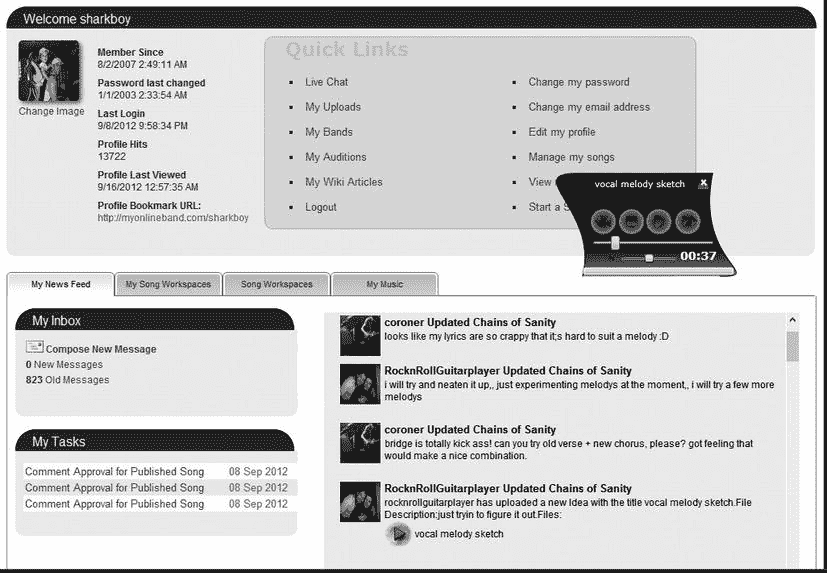
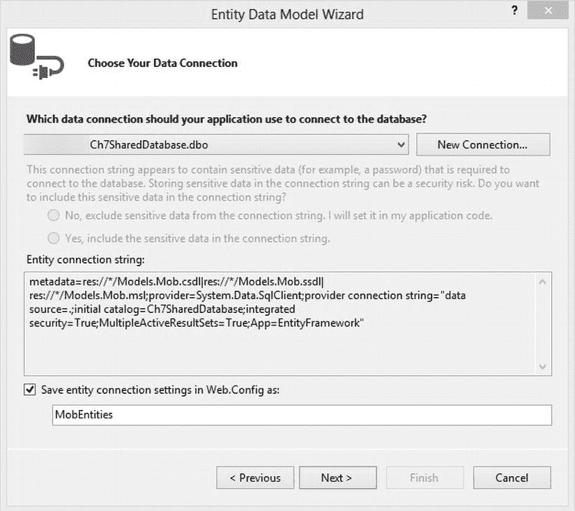
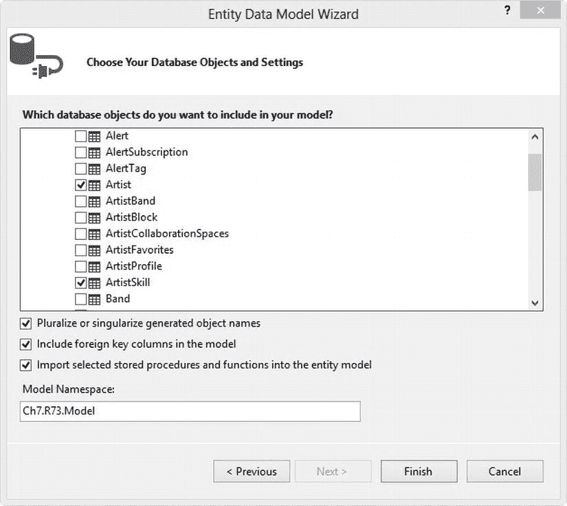
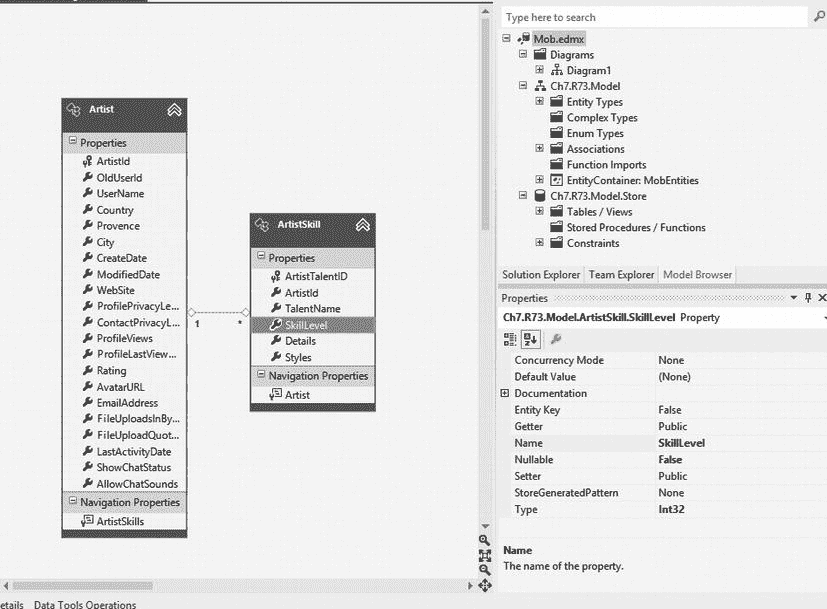
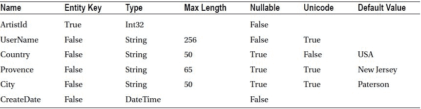
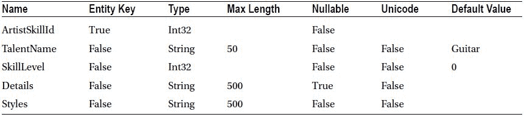
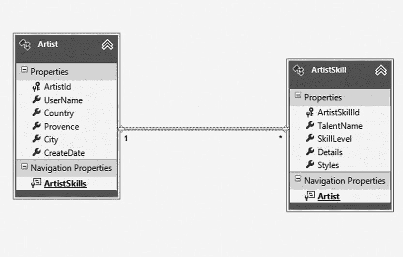
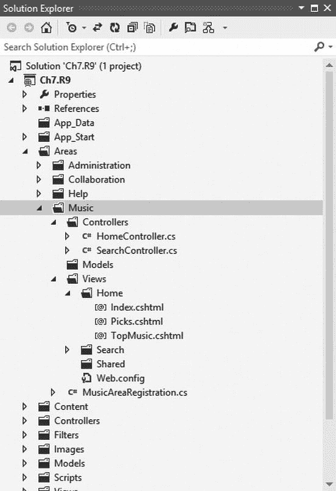
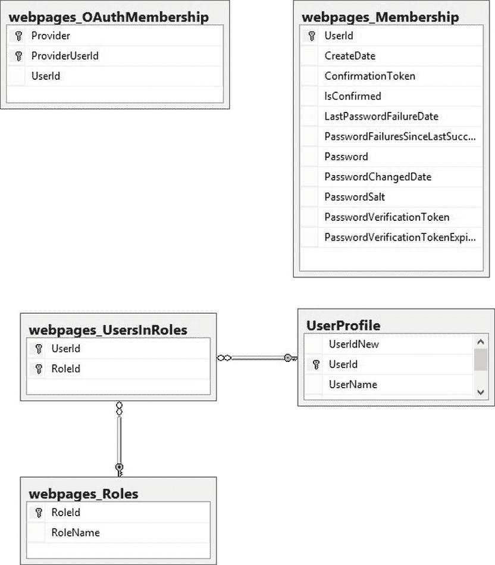

# 七、解决方案设计

7-1.设计需要来自多个模型的数据的视图

问题

你必须设计一个复杂的视图,包含来自许多来源的数据。您希望使用强类型视图，以便可以利用 Visual Studio 中的 IntelliSense。您想要为您的模型使用一个现有的类库，但是它是由许多类组成的。您看不到向视图添加多个模型的方法。你想知道最好的方法是什么。

解决办法

有三种可能的方法来解决这个问题。一个是在 MVC 项目的`Model`文件夹中定义一个新模型，它是一个组合，包含了视图所需的所有数据源。另一种方法是创建几个局部视图，每个视图都有自己的模型，然后将它们混合在一个超级视图中。

第一种方法的优势是它非常适合您的用例，您可以适应可能只出现在您的视图中的唯一数据关系。不利的一面是，您将无法重用该模型，并且最终可能会在多个地方重复代码，例如数据注释。如果您预见到在应用的几个地方使用局部视图，第二种方法会更有吸引力。

第三种方法不是通过服务器端代码将数据发送到视图，而是通过 Web API 使数据可用，然后让页面上的脚本块调用服务并在客户端呈现用户界面。如果除了您的 web 应用之外，您还希望支持移动设备和 Windows 应用商店应用，那么这种方法非常有效。它还提供了获得可伸缩性的额外好处，因为您将呈现逻辑推送到客户端。这种方法的缺点是会导致大量难以维护和测试的客户端代码。使用客户端 MVC 框架和单元测试库可以部分缓解这个问题。

它是如何工作的

许多应用需要使用其他领域的模型。NET 项目甚至第三方库。在单个 Visual Studio 项目文件中创建整个解决方案是不切实际的，尤其是在与团队合作时。

MVC 编程模型规定每个视图只与一个模型相关联。您不能有多个模型。这让许多有非 MVC 编码经验的开发人员非常困惑。最好的理解是，ASP.NET MVC 应用是表示层的一部分。考虑到这一点，您的模型代表了视图所需的数据，并且在许多情况下可能与您的领域模型不同。

为了演示这是如何工作的，我们将展示一个音乐家协作网站的示例用户仪表板页面。该页面显示了关于该艺术家的几条信息，包括新闻提要、个人消息提醒、待办事项列表、通过基于 HTML 的媒体播放器展示的歌曲列表以及该艺术家已经开始或参与的协作空间列表。它还显示统计数据，包括个人资料视图和歌曲播放。

对于这个配方，我们将实现一个复合模式，其中大多数业务逻辑和数据访问代码都是在外部项目中定义的。在我们的模型中，我们将引用外部库并创建一个充当包装器的自定义类。然后，我们将基于这个模型创建一个强类型视图。

正如解决方案一节中所讨论的，这是解决这个问题的三种可能方法之一。其他方法是使用局部视图，如方法 7-2 所述，以及使用 JavaScript 对 RESTful web 服务进行多次调用，如方法 11-7 所示。

创建项目

对于这个例子，我们将使用 ASP.NET MVC 4 互联网应用模板。要使用此模板创建项目，请执行以下步骤:

1.  打开 Visual Studio 2012，并在开始屏幕中单击新建项目链接。
2.  在“新建项目”窗口中，选择 C # ASP.NET MVC 4 Web 应用模板。如果您以前没有使用过此模板，您可以使用位于窗口右上角的搜索框来查找它。
3.  为项目命名，选择一个位置，并提供解决方案名称。本书中的例子遵循 Ch <chapter number="">的惯例。R <recipe number="">为项目名，并使用默认的解决方案名。在这个例子中，项目被命名为`Ch7.R1`。</recipe></chapter>
4.  单击确定。在选择模板屏幕上选择 Internet 应用。确保选择了 Razor 视图引擎。
5.  单击“确定”创建项目。

添加外部类库

这个解决方案引用了一个外部类库。如果您想继续学习，可以从 Apress 网站下载代码。还包括一个示例数据库，可用于示例。数据库作为 SQL Server 备份文件分发。如果您希望使用它，您将需要通过使用 SQL Server Management Studio 或命令行来还原数据库。例如，要将备份恢复到名为`MVCExampleDB`的新数据库，您可以在命令行中键入以下内容:

```cs
sqlcmd -S . -Q "RESTORE DATABASE MVCExamplesDB FROM DISK ='G:\MVCBook\Shared\SharedAPI.bak'"
```

如果您不熟悉该程序，请参考位于`http://msdn.microsoft.com/en-us/library/ms177429.aspx`的微软文档。

若要将外部库添加到您的解决方案中，请在“解决方案资源管理器”中右击您的解决方案节点，并从弹出菜单中选择“添加”，然后选择“现有项目”。从下载的源代码中，浏览到`\Chapter7\Ch7.SharedAPI\Ch7.SharedAPI`文件夹，选择`Ch7.SharedAPI.csproj`，点击打开。

一旦将共享 API 项目添加到解决方案中，您就需要将它添加为对您的 Internet 应用项目的引用。为此，右击 Internet 应用项目的项目节点，并从弹出列表中选择“添加引用”。在引用管理器窗口中，单击左侧面板中的解决方案节点，然后选中`Ch7.SharedAPI`项目旁边的框。单击“确定”添加引用。

 **注意**确保复选框被选中。单击项目名称来选择它不会选中复选框。如果未选中该复选框，引用将不会添加到您的项目中。

设置数据库连接字符串

`Ch7.SharesAPI`项目使用实体框架，并要求将特殊格式的连接字符串添加到互联网应用项目的`Web.config`中。为此，从`Ch7.SharedAPI`项目打开`App.config`文件，并从`connectionStrings`部分定位`MobEntities`连接串。当实体数据模型被添加到项目中时，`App.config`中的连接字符串是由 Visual Studio 自动创建的。复制此连接字符串。

一旦连接字符串被复制，在您的 Internet 应用项目中打开`Web.config`文件，找到`connectionStrings`部分，并将连接字符串粘贴到模板中包含的连接字符串之后。单击 Visual Studio 工具栏上的“保存”按钮保存更改。完成后，连接字符串部分应该看起来类似于[清单 7-1](#list1) 。

[***清单 7-1。***](#_list1)web . config 文件中的实体框架连接字符串

```cs
<connectionStrings>
    <add
name="DefaultConnection"
connectionString="Data Source=(LocalDb)\v11.0;Initial Catalog=aspnet-Ch7.R7_1-
20120911084121;Integrated Security=SSPI;AttachDBFilename=|DataDirectory|\aspnet-Ch7.R7_1-
20120911084121.mdf"
providerName="System.Data.SqlClient" />

<add
name="MobEntities"

connectionString="metadata=res://*/Mob.csdl|res://*/Mob.ssdl|res://*/Mob.msl;provider=System.Data.
SqlClient;provider connection string=&quot;data source=.;initial catalog=Ch7SharedDatabase;integrated
security=True;MultipleActiveResultSets=True;App=EntityFramework&quot;"

providerName="System.Data.EntityClient" />
  </connectionStrings>
```

在[清单 7-1](#list1) 中，连接字符串使用`data source=.`。点是一种缩写，表示本地计算机上的默认 SQL Server 实例。如果本地计算机上没有安装 SQL Server 实例，则需要相应地调整此设置。`Initial catalog`属性已被配置为使用`Ch7SharedDatabase`。为了正确工作，我假设您已经通过从源代码提供的备份文件中恢复数据库来安装了这个数据库。除了练习所需的模式之外，数据库还包含对测试示例有用的示例数据。

更改帐户控制器使用的连接字符串

由于该解决方案将使用内置的帐户控制器，它是 Internet 解决方案模板的一部分，因此我们需要修改默认的连接字符串，以便它与应用的其余部分使用相同的数据库。默认情况下，它指向一个`LocalDb`实例，该实例创建一个存储在应用的`App_Data`文件夹中的数据库文件，该文件夹是在第一次运行应用时创建的。

修改`Web.config`文件的连接字符串部分，使其看起来类似于[清单 7-2](#list2) 。

[***清单 7-2。***](#_list2) 为 Web.config 中的 DefaultConnection 定制连接字符串

```cs
<add
    name="DefaultConnection"
    connectionString="data source=.;Initial Catalog=Ch7SimpleMembership;Integrated Security=SSPI;"
    providerName="System.Data.SqlClient"
    />
```

在[清单 7-2](#list2) 中，数据源已经更改为“.”并且`Initial Catalog`已经改为`Ch7SimpleMembership`。由于数据库不再使用本地文件，不再需要属性`AttachDBFileName`了。

在我们可以转移到模型之前，我们还需要对项目做一个更改。我们需要更改简单成员资格提供程序的初始化参数，以便它能够使用外部库使用的自定义用户表。默认情况下，`SimpleMembershipProvider`与 ASP.NET MVC 4 互联网应用模板一起安装。它与帐户控制器协同工作，为用户提供注册、使用 ASP.NET 表单身份验证登录以及与第三方身份提供者集成的能力。

修改简单的成员初始化器

要修改简单提供者的初始化以使用我们的定制表，打开`Filter/ InitializeSimpleMembershipAttribute.cs`文件并修改它的`SimpleMembershipInitializer`子类，看起来像[清单 7-3](#list3) 。

[***清单 7-3。***](#_list3)initializesimplemembershipattribute . cs 修改为使用自定义用户配置文件表

```cs
private class SimpleMembershipInitializer
{
    public SimpleMembershipInitializer()
    {

        try
        {
            WebSecurity.InitializeDatabaseConnection("DefaultConnection", "Artist", "ArtistId",
"ArtistDisplayName", autoCreateTables: true);
        }
        catch (Exception ex)
        {
           throw new InvalidOperationException("The ASP.NET Simple Membership database could not be initialized. For more information, please see http://go.microsoft.com/fwlink/?LinkId=256588 ", ex);
        }
       }
}
}
```

我们已经更改了数据连接初始化代码，以便它将使用我们的自定义表。现在，当我们使用任何`WebSecurity` API 调用(如`WebSecurity.CreateUserAndAccount`)时，我们的`Artist`表将用于存储用户名和唯一标识符。我们的自定义表将是简单成员资格提供程序使用的其他表中使用的标识符的来源。

创建模型

我们的仪表板页面模型将从几个来源提取数据。主要来源是来自外部库的`Artist`实体。这是一个大而复杂的实体，有许多导航属性将实体链接到数据模型中的相关实体。第二个来源是新闻提要主题列表。新闻提要基于网站中的数据，但是已经被反规范化为一个为阅读而优化的模式。此外，它将包含来自 ASP.NET 会员提供商的数据。

清单 7-4 中的第一个版本非常简单。它公开了两个属性:一个用于艺术家对象，另一个用于我们的新闻提要。

[***清单 7-4。***](#_list4) 第一版 ArtistDashboard 模型

```cs
public class ArtistDashboardModel
{
  public Artist Artist { get; set; }
  public List<Alert> NewsFeed { get; set; }
  public DateTime PasswordLastChangedDate { get; set; }
}
```

虽然这可行，但也有一些问题。首先，由于没有应用数据注释，所以需要在应用的其他地方添加所有文本，比如标签、验证规则和任何其他定制。

这种类型的设计会导致视图中有许多内联代码块和其他糟糕的实践，这会使您的应用更难测试和维护。

第二个问题是它有些不完整，缺少许多元素的数据，比如定制 URL 和消息——包括可能需要传递给视图的错误消息。

第三个问题是，这个模型只公开了`Artist`实体，并期望所有需要的信息都可以通过它的导航属性来访问。尽管这是可能的，但您可能最终需要在视图中编写 LINQ 查询来访问所有数据。您应该避免在视图中执行 LINQ 查询或任何其他类型的数据访问操作。

更好的方法是设计一个更适合视图需求的模型。[清单 7-5](#list5) 显示了`ArtistDashboardModel`的版本 2。

[***清单 7-5。***](#_list5)ArtistDashboardModel 版本 2

```cs
public class ArtistDashboardModel
{
   public List<Alert> NewsFeed { get; set; }
   public List<CollaborationSpace> CollaborationSpaces { get; set; }
   public List<PlaylistItem> ArtistSongs { get; set; }
   public List<Task> Tasks { get; set; }

   [Display(Name = "Member Since")]
   public DateTime AccountCreatedDate { get; set; }

   [Display(Name = "Password last changed")]
   public DateTime PasswordLastChangedDate { get; set; }

   [Display(Name = "Profile Hits")]
   public long ProfileViews { get; set; }
 `[Display(Name = "Profile Last Viewed")]`
   `public DateTime ProfileLastViewedDate { get; set; }`

   `[Display(Name = "Profile Bookmark")]`
   `public string ProfileBookmark { get; set; }`

   `public string AvatarURL { get; set; }`

   `public string ArtistName { get; set; }`

   `public string ErrorMessage { get; set; }`
`}`
```

 `在更新版本中，属性或`Artist`实体已经被扩展，并且数据注释已经被添加到其中的几个中。数据标注中的信息将在视图中用于显示属性的标签。该模型包含三个列表，它们将在视图上用于显示数据网格。

重构模型的另一个优点是，即使我们扩展了它，我们也简化了它。由于不再包含复杂的`Artist`实体及其许多导航属性，您不再需要详细了解整个数据模型来创建控制器。事实上，现在您已经在模型中公开的数据和您需要向视图公开的数据之间建立了直接的联系。

创建艺术家控制器

在我们的应用中，Artist 控制器的`Index`动作将是用户登录后看到的第一个屏幕。我们修改了账户控制器的`Login`动作，将它重定向到这个页面，而不是家庭控制器的`Index`动作。修改后的`Login`动作如[清单 7-6](#list6) 所示。

[***清单 7-6。***](#_list6) 定制版账户控制器的登录动作

```cs
public ActionResult Login(LoginModel model, string returnUrl)
{
 if (ModelState.IsValid && WebSecurity.Login(model.UserName, model.Password, persistCookie: model.RememberMe))
   {
   if (null == returnUrl)
   {
      return RedirectToAction("Index", "Artist");
   }
   else
   {
      return RedirectToLocal(returnUrl);
   }
}
// If we got this far, something failed, redisplay form
ModelState.AddModelError("", "The user name or password provided is incorrect.");
return View(model);
}
```

`Login`动作现在首先检查返回 URL 是否已经被添加到查询字符串中。如果用户在尝试访问受限页面后被重定向到登录页面，就会发生这种情况。这允许用户在登录后被重定向到该页面。如果没有 URL，我们将把用户重定向到艺术家控制器的`Index`动作。艺术家控制器如[清单 7-7](#list7) 所示。

[***清单 7-7。***](#_list7) 艺术大师

```cs
public class ArtistController : Controller
{
  MobEntities m_context = new MobEntities();

  [Authorize(Roles="Artist")]
  public ActionResult Index()
  {
    ArtistDashboardModel model = new ArtistDashboardModel();
    try
    {
      int artistId = WebSecurity.CurrentUserId;
      var userDataCollection = from d in m_context.Artists
                               where d.ArtistId == artistId
                               select new
                               {
                                  d.CreateDate,
                                  d.LastActivityDate,
                                  d.Messages.Count,
                                  d.ProfileViews,
                                  d.Tasks,
                                  d.UserName,
                                  d.ProfileLastViewDate,
                                  d.AvatarURL,
                                  defaultPlaylist =
                                   d.PlayLists.Where(p => p.IsDefaultPlaylist == true)
                                };
       var userData = userDataCollection.FirstOrDefault();

       var workspaces =
           from w in m_context.ArtistCollaborationSpaces.Where(e => e.ArtistId == artistId)
           select w.CollaborationSpace;

       model.AccountCreatedDate = userData.CreateDate;
       model.ArtistName = userData.UserName;
       model.ProfileLastViewedDate = userData.ProfileLastViewDate.Value;
       model.ProfileBookmark = string.Concat(SharedConfig.ApplicationURL, "/",
             userData.UserName);
       model.ProfileViews = userData.ProfileViews;
       model.AvatarURL = userData.AvatarURL;
       model.PasswordLastChangedDate =
         WebSecurity.GetPasswordChangedDate(WebSecurity.CurrentUserName);

       model.NewsFeed = m_context.GetUserAlerts(artistId).ToList();

       model.Tasks = userData.Tasks.ToList();
       model.CollaborationSpaces = workspaces.ToList();
       model.ArtistSongs = userData.defualtPlaylist.FirstOrDefault().PlaylistItems.ToList();
     }
     catch (Exception e)
     {
       model.ErrorMessage = @"Sorry. Something dreadful has occurred. Please accept our sincerest
                              apology.";
     }

     return View(model);
  }

  protected override void Dispose(bool disposing)
  {
    m_context.Dispose();
    base.Dispose(disposing);
  }

}
```

Artist 的`Index`动作依赖于登录用户的信息来查询数据库。因此，我们需要确保用户在访问它之前已经登录。我们还需要确保只有艺术家角色的成员才能访问它，因为该页面将包含一些受限信息。为了实现这一点，该操作用 Authorize 属性修饰，roles 参数指定 Artist 角色是必需的。

接下来，我们实例化一个新的`ArtistDashboardModel`对象。在对象创建时，它不绑定到任何数据，主要包含`null`值。在将对象传递给视图之前，控制器代码的其余部分将填充该对象。

我们首先需要的是艺术家的唯一标识符。对定制用户表使用`SimpleMembershipProvider`的一个限制是，您不能再使用任何典型的 ASP.NET 成员资格提供者 API 调用。您与成员资格提供者的交互现在被限制在`WebMatrix.WebData.WebSecurity`类中可用的方法。我们使用`WebSecurity.CurrentUserId`，它返回一个整数。我们将这个值缓存在一个名为`artistId`的变量中。需要注意的是，`WebSecurity.CurrentUserId`方法会在每次被调用时查询数据库。

现在我们有了一个`artistId`，我们可以用它来查询所需的`Artist`数据。第一个操作查询`Artist`实体。它取回关于艺术家的几条信息和一些关于查看他的个人资料的人数的统计信息。它还获得了收件箱中的邮件数、分配的任务列表和默认播放列表中的歌曲列表。

接下来，我们得到艺术家已经开始或参与的协作空间的列表。然后，我们使用查询返回的数据来填充模型的第一组属性。对于`PasswordLastChangedDate`属性，我们需要通过调用`WebSecurity.GetPasswordChangedDate`从成员资格提供者获取数据。这是必需的，因为数据是由提供者管理的，并且不在实体数据模型中映射。然后，我们对`DbContext`进行其他几次调用，以填充新闻提要、任务列表和任务。

一旦模型的所有赋值都完成，我们通过调用`return View(model)`将数据传递给视图。

最终的结果，如图 7-1 所示，是一个有点复杂的视图，混合了 JavaScript、HTML 和 Silverlight 来呈现结果。因为我们使用了强类型模型，所以创建视图被简化了，因为我们有完整的 IntelliSense 支持。智能感知的使用大大减少了由键入错误导致的错误数量。



[图 7-1](#_Fig1) 。艺术家索引视图显示来自多个来源的数据

在[图 7-1](#Fig1) 中，您可以看到显示在左上方的主要艺术家档案数据。收件箱和任务数据显示在左下角，新闻提要显示在右下角。其余数据隐藏在几个选项卡中。

7-2.使用局部视图构建复合用户界面

问题

你必须设计一个复杂的视图,包含来自许多来源的数据。您希望使用强类型视图，以便可以利用 Visual Studio 中的 IntelliSense。您希望在应用的其他部分重用该视图的可视元素。

解决办法

这个问题的最佳解决方案是创建几个局部视图，每个视图都有自己的模型，然后将它们组合成一个复合视图。这将满足创建复杂视图的需求，并允许您在应用的其他部分使用局部视图。

它是如何工作的

对于这个例子，我们将使用一个 API，它是在另一个项目中定义的外部库的一部分。然后，我们将为我们需要创建的每个局部视图创建模型，然后是局部视图本身。最后，我们将创建一个使用所有局部视图的复合视图。

创建项目

对于这个例子，我们将使用 ASP.NET MVC 4 互联网应用模板。要使用此模板创建项目，请执行以下步骤:

1.  打开 Visual Studio 2012，并在开始屏幕中单击新建项目链接。
2.  在“新建项目”窗口中，选择 C # ASP.NET MVC 4 Web 应用模板。如果您以前没有使用过此模板，您可以使用窗口右上角的搜索框来查找它。
3.  为项目命名，选择一个位置，并提供解决方案名称。本书中的例子遵循 Ch <chapter number="">的惯例。R <recipe number="">为项目名，并使用默认的解决方案名。在这个例子中，项目被命名为`Ch7.R2`。</recipe></chapter>
4.  单击确定，然后在选择模板屏幕上选择 Internet 应用。确保选择了 Razor 视图引擎。
5.  单击“确定”创建项目。

添加外部类库

这个解决方案引用了一个外部类库。如果您想继续学习，可以从 Apress 网站下载代码。还包括一个示例数据库，可用于示例。数据库作为 SQL Server 备份文件分发。如果您希望使用它，您将需要通过使用 SQL Server Management Studio 或命令行来还原数据库。如果您不熟悉该程序，请参考位于`http://msdn.microsoft.com/en-us/library/ms177429.aspx`的微软文档。

1.  若要将外部库添加到您的解决方案中，请在解决方案资源管理器中右击您的解决方案节点，选择“添加”，然后从弹出菜单中选择“现有项目”。从下载的源代码中，浏览到`\Chapter7\Ch7.SharedAPI\Ch7.SharedAPI`文件夹，选择`Ch7.SharedAPI.csproj`，点击打开。
2.  一旦将共享 API 项目添加到解决方案中，您就需要将它添加为对您的 Internet 应用项目的引用。为此，右击 Internet 应用项目的项目节点，并从弹出列表中选择“添加引用”。在引用管理器窗口中，单击左侧面板中的解决方案节点，然后选中`Ch7.SharedAPI`项目旁边的框。单击确定进行添加。

更改连接字符串

该项目将使用两个连接字符串:一个是我们添加到项目中的外部库所需要的，另一个是成员资格提供程序所使用的。要修改连接字符串，打开`Web.config`文件并修改它们，看起来类似于[清单 7-8](#list8) 。

[***清单 7-8。***](#_list8) 在 Web 中修改连接字符串。配置

```cs
<connectionStrings>
    <add
    name="DefaultConnection"
    connectionString="data source=.;Initial Catalog=Ch7SharedDatabase;Integrated Security=SSPI;"
    providerName="System.Data.SqlClient"
    />
    <add name="MobEntities"
connectionString="metadata=res://*/Mob.csdl|res://*/Mob.ssdl|res://*/Mob.msl;provider=System.Data.SqlClient;providerconnection string=&quot;data source=.;initialcatalog=Ch7SharedDatabase;integrated security=True;MultipleActiveResultSets=True;App=EntityFramework&quot;" providerName="System.Data.EntityClient" />
  </connectionStrings>
```

在本例中，我们修改了默认连接，使其不再使用本地文件，而是使用本地 SQL Server 实例。我们还添加了一个名为`MobEntities`的实体框架连接字符串。这是外部库所要求的。

修改简单的成员初始化器

由于该项目使用的是 Internet 应用模板，因此它被设置为使用 ASP.NET 简单成员资格提供程序，该程序允许您定义一个自定义的用户表，而不是像大多数其他提供程序那样将该信息保存在单独的用户表中。为此，它需要在使用之前运行一些初始化代码。

对于 Internet 应用模板，通过将`InitializeSimpleMembershipAttribute`应用到`AccountController`类，确保在对提供者进行任何调用之前运行初始化代码。`InitializeSimpleMembershipAttribute`是一个动作过滤器，在`Filters/InitializeSimpleMembershipAttribute.cs`文件中定义。

在这个菜谱中，我们使用一个名为`Artist`的定制表作为我们的用户表。我们将用户 id 存储在名为`ArtistId`的列中。用户名将被存储在一个名为`UserName`的栏目中。为了让简单成员资格提供者使用我们的定制表，我们需要修改初始化代码，如清单 7-9 中的[所示。](#list9)

[***清单 7-9。***](#_list9) 用自定义表初始化简单成员资格提供程序

```cs
[AttributeUsage(AttributeTargets.Class | AttributeTargets.Method, AllowMultiple = false, Inherited = true)]
    public sealed class InitializeSimpleMembershipAttribute : ActionFilterAttribute
    {
        private static SimpleMembershipInitializer _initializer;
        private static object _initializerLock = new object();
        private static bool _isInitialized;

        public override void OnActionExecuting(ActionExecutingContext filterContext)
        {
            // Ensure ASP.NET Simple Membership is initialized only once per app start
            LazyInitializer.EnsureInitialized(ref _initializer, ref _isInitialized, ref _initializerLock);
        }

        private class SimpleMembershipInitializer
        {
            public SimpleMembershipInitializer()
            {

                try
                {
                    WebSecurity.InitializeDatabaseConnection("DefaultConnection", "Artist",
                    "ArtistId", "UserName", autoCreateTables: true);

                }
                catch (Exception ex)
                {
                    throw new InvalidOperationException("The ASP.NET Simple Membership
database could not be initialized. For more information, please see http://go.microsoft.com/fwlink/?LinkId=256588 ", ex);
                }
            }
        }
    }
```

创建模型

在这个例子中，我们将创建一个使用四个模型的复合视图，一个新闻提要、一个歌曲播放列表、一个协作工作区列表和一个艺术家简介卡。在我们的解决方案中，每个模型都将被放在自己的类文件中，该文件位于`models`文件夹下。要添加类，在解决方案资源管理器中右键单击`models`文件夹，选择 add，然后选择 Class。在添加新项目窗口中，将第一个文件命名为 **ArtistInfoModel.cs** 。对`NewsFeedModel.cs`、`SongCollaborationWorkspaceModel.cs`和`SongPlaylistModel.cs`重复此过程。

完成后，修改文件，使其看起来像清单 7-10 中的[。](#list10)

[***清单 7-10。***](#_list10) 车型为局部视图

```cs
//
// SongCollaborationWorkspaceListModel.cs
//
public class SongCollaborationWorkspaceListModel
{
        [Display(Name = "Number of Workspaces Found: ")]
        public int NumberofMatchingWorkspaces { get; set; }
        public List<CollaborationSpace> CollaborationSpaces { get; set; }
}

//
// SongPlaylistModel.cs
//
public class SongPlaylistModel
{
        [Display(Name = "Number of Songs Found: ")]
        public int NumberofMatchingSongs { get; set; }
        public List<PlaylistItem> ArtistSongs { get; set; }
}

//
// NewsFeedModel.cs
//
public class NewsFeedModel
    {
        public List<Alert> NewsFeed { get; set; }
        public string Message { get; set; }
    }

//
// ArtistInfoModel.cs
//
public class ArtistInfoModel
    {
        [Display(Name = "Member Since")]
        public DateTime AccountCreatedDate { get; set; }

        [Display(Name = "Password last changed")]
        public DateTime PasswordLastChangedDate { get; set; }

        [Display(Name = "Profile Hits")]
        public long ProfileViews { get; set; }

        [Display(Name = "Profile Last Viewed")]
        public DateTime ProfileLastViewedDate { get; set; }

        [Display(Name = "Member Since")]
        public string ProfileBookmark { get; set; }

        public string AvatarURL { get; set; }

        public string ArtistName { get; set; }
    }
```

清单 7-10 中的代码非常简单。每个文件都包含一个声明许多公共属性的类。在需要的地方，我们为一些属性添加了数据注释，这些属性将与`@Html.LabelFor` HTML 帮助器一起使用，为每个数据项呈现标签。

创建局部视图

下一步是创建局部视图。局部视图是设计为包含在父视图中的常规视图。使用局部视图有两种方法。在一种方法中，父视图可以使用`@Html.Partial`助手方法加载部分内容，该方法指示视图引擎加载内容，而不呈现来自任何布局页面的内容。在这个设计中，当调用`@Html.Partial("∼/Views/Partials/_MyPartialView.cshtml",Model`时，模型作为参数传递给局部视图。如果你使用这个策略，你将需要创建一个复合模型，就像我们在配方 7-1 中所做的那样。

在这个例子中，我们使用第二种方法，即调用`@Html.Action`助手。这将执行另一个控制器动作，并将输出注入父页面。

创建局部视图时，为了保持一致性，遵循规定的命名约定非常重要。在局部视图的命名约定中，文件名以下划线开头，以`Partial`为后缀。例如，`ArtistInfo`的局部视图将被命名为`_ArtistInfoPartial.cshtml`。

虽然下划线在 MVC 框架中没有技术上的分支，但它在 ASP.NET 网页中有重要意义——这是该公约的发源地。后缀`Partial`告诉其他开发人员该文件旨在作为局部视图。

 **注**在 ASP.NET 网页中，文件名以下划线开头的文件不会直接提供给用户。这有助于消除可能出现的可用性或安全性问题，这些问题可能是由于用户无意或恶意地以非预期和未经测试的方式使用视图而引起的。在 ASP.NET MVC 中，用户根本不能直接访问`.cshtml`文件，不管它的前缀是什么。另一方面，ASP.NET MVC 允许直接访问返回局部视图的动作。如果用户能够确定 URL，这允许他们直接浏览局部视图。如果您希望避免这种情况，您必须用[ `ChildActionOnly` ]属性来修饰 action 方法。

在这个例子中，由于所有的局部视图都将使用一个控制器 Artist 控制器，我们将在`Views`下创建一个名为`Artist`的新文件夹。然后，我们将在该文件夹中创建局部视图。如果局部视图用于一般用途，比如作为布局页面的一部分，我们会把它放在`Views\Shared`文件夹中。

要创建局部视图，首先在解决方案资源管理器中右键单击`Views`文件夹，选择添加，然后选择新建文件夹，在`Views`文件夹下创建一个名为**艺术家**的新文件夹。新文件夹将出现在解决方案资源管理器中，并被选中进行重命名。改名为**艺人**。

右键单击新创建的文件夹，选择添加，然后从弹出菜单中选择查看。将视图命名为 **Index** ，确保选择了 Razor 视图引擎并选中了“使用布局或母版页”,然后单击 Add 按钮。

这将创建索引视图，我们将使用它作为父视图来托管我们的子视图。

接下来，再次右键单击`Artist`文件夹，选择添加，然后选择查看。这一次，命名为`view_ArtistInfoPartial`,并选中 Create as Partial 复选框。单击添加按钮。新的局部视图应添加到项目中。请注意，新文件完全是空的。当您单击“创建为分部”复选框时，您是在告诉 Visual Studio 不要包含它在创建视图时通常包含的任何普通样板代码。

创建名为 _ `NewsFeedPartial.cshtml`、_ `SongCollaborationWorkspacePartial.cs`、_ `SongPlaylistPartial.cs`和`_NoDataPartial.cs`的附加局部视图。

`_NoDataPartial.cs`将用于找不到数据的情况。

现在，修改它们，使它们包含少量指示局部视图名称的文本。在增加任何额外的复杂性之前，我们将使用它来执行快速冒烟测试。

创建 ArtistController

对于这个例子，我们将创建一个名为`ArtistController`的控制器。它将包含局部视图和父视图的动作，父视图将作为一个容器。

要创建 Artist 控制器，右键单击解决方案资源管理器中的`Controllers`文件夹，选择 Add，然后选择 controller。在添加控制器对话框中，将控制器命名为 **ArtistController** ，并从模板下拉列表中选择空 MVC 控制器。单击添加按钮创建新的控制器。

即使我们选择了空模板，Visual Studio 仍然添加了一个名为 Index 的操作方法。保留索引方法“不变”,再增加四个动作方法，分别命名为`ArtistInfo`、`NewsFeed`、`SongCollaborationWorkspace`和`SongPlaylist`。

修改每个新创建的操作方法，使其包含一个返回局部视图的语句。为此，使用`PartialView`方法并传入局部视图的名称，排除文件扩展名作为参数。例如，对于`ArtistInfo`方法，您将调用`return PartialView("_ArtistInfoPartial")`。

当你完成了这一步，你的控制器应该看起来像清单 7-11 中的[。](#list11)

[***清单 7-11。***](#_list11) 艺术家控制器

```cs
public class ArtistController : Controller
    {
        //
        // GET: /Artist/

        public ActionResult Index()
        {
            return View();
        }

        public ActionResult ArtistInfo()
        {
            return PartialView("_ArtistInfoPartial");
        }

        public ActionResult NewsFeed()
        {
            return PartialView("_NewsFeedPartial");
        }

        public ActionResult SongCollaborationWorkspace()
        {
            return PartialView("_SongCollaborationWorkspacePartial");
        }

        public ActionResult SongPlaylist()
        {
            return PartialView("_SongPlaylistPartial");
        }

    }

```

在 Index.cshtml 中添加对分部视图的引用

`Index.cshtml`将作为局部视图的容器。它将结合所有信息创建一个仪表板页面，一旦艺术家登录到网站，就会显示给她。

为了添加对局部视图的引用，我们将使用`Html.Action` HTML 助手，它将动作的名称作为参数，并根据动作的路由信息呈现一个带有`HREF`属性的 HTML 锚标记。当你完成后，`Artist/Index.cshtml`应该看起来像清单 7-12 中的[。](#list12)

[***清单 7-12。***](#_list12) Artist/Index.cshtml 参考部分观点

```cs
@{
    ViewBag.Title = "Index";
}

<h2>Welcome @Profile.UserName</h2>
<h3>Artist Information</h3>
@Html.Action("ArtistInfo","Artist")
<br />
<h3>Your music</h3>
@Html.Action("SongPlaylist")

<br />
<h3>News Feed</h3>
@Html.Action("NewsFeed")

<br />
<h3>Song Collaboration Spaces that you have started or have contributed to</h3>
@Html.Action("SongCollaborationWorkspace")
```

此时，我们应该能够运行一个快速测试来验证所有的局部视图都显示在我们的索引页面中。为此，请单击 Visual Studio 工具栏中的“开始调试”按钮。浏览器打开并加载主页后，在网络浏览器中导航至`/Artist`。期望看到您之前添加到每个局部视图中的所有标题。

您还应该能够使用为每个视图设置的控制器操作直接浏览局部视图。尝试导航到`/Artist/ArtistInfo`。您应该会看到添加到视图中的文本，而没有来自布局页面的任何内容。

连接数据

既然我们已经创建了模型、控制器、父视图和部分视图，现在我们需要把它们放在一起。

由于四个局部视图需要连接到一个数据库，我们需要做的第一件事是建立一个数据库连接。视图将使用一个依赖于实体框架的外部库作为它们的主要数据源。为了创建对这个数据库连接的引用，我们将创建一个`MobEntities`上下文的实例，它是一个实体框架`DbContext`对象，充当数据库的代理。它将跟踪对数据实体的更改，并允许您以类似批处理的方式将更改保存回数据库。它还允许您通过 LINQ 查询来查询数据库。`MobEntities`实现了`IDisposable`接口。当你不再使用它时，确保把它处理掉是很重要的。在本例中，这是通过覆盖美工控制器上的`Dispose`方法，然后调用上下文上的`Dispose`方法来实现的，如[清单 7-13](#list13) 所示。

[***清单 7-13。***](#_list13) 凌驾于一个控制器之上的处置

```cs
// Create the DBContext object as a global member variable
MobEntities m_context = new MobEntities();
//...
//bunch of actions that use the context
//...

// Override dispose and call the Dispose method on the DBContext object
protected override void Dispose(bool disposing)
{
   m_context.Dispose();
   base.Dispose(disposing);
}
```

您可能想做的一件事是将`DbContext`的实例化包装在 action 方法内的`Using`块中。不幸的是，这是行不通的，因为在视图中使用`DbContext`之前，您就已经将其处理掉了。这将导致一个`IllegalOperationException`。

因为我们想要显示的数据是针对登录用户的，所以我们需要确保动作方法只能由经过身份验证的用户访问。为了实现这一点，我们将向`Index`动作添加`Authorize`属性。我们还需要确保授权用户处于适当的安全角色。我们可以通过对`Authorize`属性声明使用命名参数`Roles`来做到这一点，如[清单 7-14](#list14) 所示。

[***清单 7-14。***](#_list14) 修改索引动作，使其仅限于艺术家角色的成员

```cs
[Authorize(Roles = "Artist")]

public ActionResult Index()
{
   return View();
}
```

接下来，我们开始修改用于局部视图的动作，从`ArtistInfo`动作开始。首先，我们将通过添加`ChildActionOnly`属性来防止局部视图被直接访问。一旦应用了该属性，只有通过调用父视图中的`Html.Action`或`Html.RenderAction`才能调用该动作。

然后我们将创建模型的一个实例，`ArtistInfoModel`。这个对象将保存我们将传递给`_ArtistInfoPartial`视图的数据。

然后，我们使用`WebSecurity.CurrentUserId`来获取登录用户的唯一标识符。该值将用于查询我们的数据源，以获得关于当前用户的所需信息。

一旦创建了上下文，我们就可以使用它来创建查询。在这种情况下，由于我们只需要来自`Artist`实体的一些数据，我们将把结果保存为匿名类型。匿名类型是由编译器创建的一个类，它公开了我们的查询所需的属性。

新创建的匿名类型被封装在一个名为`userDataCollection`的`IQueryable`中。要访问它，我们调用`userDataCollection.FirstOrDefault()`。如果查询已经找到结果，`FirstOrDefault()`将返回暴露的匿名类型的第一个实例；否则，它将返回该类型的默认值。像我们的对象这样的可空类型和引用类型的默认值是`null`。因此，在尝试访问对象的属性之前检查`null`值以避免`NullReferenceException`是很重要的。

如果我们对`null`的测试失败了，我们通过返回`_NoDataPartial`视图的`PartialViewResult`并传入一个字符串作为它的模型来处理这个情况。

 **提示**让你的观点尽可能简单。通过建立一个特殊的局部视图来处理无数据的情况，我们可以省去在视图中添加服务器端控制逻辑的麻烦。这将使视图更容易维护，也更容易让设计人员使用。

一旦我们确保我们的查询结果包含一个值，我们就可以将结果分配给我们的模型。对于最后一个属性`PasswordLastChangedDate`，我们需要一个只能从成员资格提供者那里访问的值。我们通过调用`WebSecurity.GetPasswordChangedDate`方法来访问它。

最后，我们使用与无数据条件相同的技术来处理任何潜在的错误条件。同样，我们将返回一个`PartialView`结果，并作为模型传递给它一个字符串。这种技术将允许视图的其余部分被呈现，但是它将显示错误消息传递一个字符串来代替页面的正常输出。

[清单 7-15](#list15) 显示了修改后的`ArtistInfo`动作。

[***清单 7-15。***](#_list15) 来自 ArtistController 的 ArtistInfo 动作

```cs
[ChildActionOnly]
        public ActionResult ArtistInfo()
        {
            ArtistInfoModel model = new ArtistInfoModel();
            int artistId = WebSecurity.CurrentUserId;
            try
            {

                var userDataCollection = from d in m_context.Artists
                                         where d.ArtistId == artistId
                                         select new
                                         {
                                             d.CreateDate,
                                             d.LastActivityDate,
                                             d.ProfileViews,
                                             d.Tasks,
                                             d.UserName,
                                             d.ProfileLastViewDate,
                                             d.AvatarURL
                                         };
                var userData = userDataCollection.FirstOrDefault();
                if (userData != null)
                {
                    model.AccountCreatedDate = userData.CreateDate;
                    model.ArtistName = userData.UserName;
                    model.ProfileLastViewedDate = userData.ProfileLastViewDate.Value;
                    model.ProfileBookmark = string.Concat(SharedConfig.ApplicationURL, "/",
userData.UserName);
                    model.ProfileViews = userData.ProfileViews;
                    model.AvatarURL = userData.AvatarURL;
                    model.PasswordLastChangedDate =
WebSecurity.GetPasswordChangedDate(WebSecurity.CurrentUserName);
                }
                else
                {
                    return PartialView("_NoDataPartial", "Error occurred.");
                }

            }
            catch (Exception)
            {
                //TODO: Log exception
                model.ErrorMessage = "Sorry could not access the data.";
            }
            return PartialView("_ArtistInfoPartial",model);
        }
```

此时，您可以调试您的应用，以确保它能够编译，并且在您访问`Artist/Index`时没有运行时错误。

接下来，我们将向`NewsFeed`动作添加代码，以便它返回所需的数据。这将有一个类似于`ArtistInfo`动作的设置，除了我们将使用一个映射函数以一个`Alert`实体列表的形式获得一个结果集。因为我们正在处理这个结果集中的许多记录，而不是单个实体，所以我们在从映射函数调用返回的`ObjectResult`上调用`ToList()`方法。映射函数是实体框架允许您的代码调用数据库中的存储过程的方式。

修改后的`NewsFeed`动作如[清单 7-16](#list16) 所示。

[***清单 7-16。***](#_list16)artist controller 中的新闻订阅动作

```cs
[ChildActionOnly]
public ActionResult NewsFeed()
{

  NewsFeedModel model = new NewsFeedModel();
  int artistId = WebSecurity.CurrentUserId;
  try
  {
    var obj = m_context.GetUserAlerts(artistId);
    if (obj != null )
    {
      model.NewsFeed = obj.ToList();
    }
    if(model.NewsFeed.Count()==0)
    {
      return PartialView("_NoDataPartial", "Sorry, no matching stories found.");
     }

    }
    catch
    {
       //TODO: Log exception
                return PartialView("_NoDataPartial", "Sorry could not access the data.");
    }
    return PartialView("_NewsFeedPartial", model);
}
```

为了验证这个查询是否有结果，我们首先通过调用`obj.ToList()`创建一个`List<Alert>`对象。然后我们使用列表中的`Count()`方法来验证我们至少有一条记录。您希望调用列表对象上的`Count`方法，而不是`ObjectResult`。对`ObjectResult`对象的计数将导致一个错误，通知你一个查询的结果只能被枚举一次。

对于其余的操作，我们将使用 LINQ 查询返回与艺术家相关的工作区和歌曲列表。修改后的`SongPlaylist`和`SongCollaborationWorkspace()`动作如[清单 7-17](#list17) 所示。

[***清单 7-17。***](#_list17) 美工控制器的 SongPlaylist 和 SongCollaborationWorkspace()动作

```cs
[ChildActionOnly]
public ActionResult SongCollaborationWorkspace()
{
  SongCollaborationWorkspaceListModel model = new SongCollaborationWorkspaceListModel();
  int artistId = WebSecurity.CurrentUserId;
  try
  {

    var workspaces = from w in m_context.ArtistCollaborationSpaces.Where(e => e.ArtistId ==
                     artistId)
    select w.CollaborationSpace;
    if (workspaces != null && workspaces.Count() > 0)
    {
      model.CollaborationSpaces = workspaces.ToList();
    }
    else
    {
      return PartialView("_NoDataPartial", "No workspaces found.");
    }
 }
 catch
 {
   //TODO log error
    return PartialView("_NoDataPartial", "An error occurred.");
  }
    return PartialView("_SongCollaborationWorkspacePartial",model);
}

[ChildActionOnly]
public ActionResult SongPlaylist()
{
   SongPlaylistModel model = new SongPlaylistModel();
   int artistId = WebSecurity.CurrentUserId;
   try
   {
      var playlistitems = from a in m_context.PlaylistItems
                          where (a.PlayList.ArtistId == artistId)
                          && (a.PlayList.IsDefaultPlaylist == true)
                          orderby a.DisplayOrder
                          select a;
       if (null != playlistitems && playlistitems.Count() > 0)
       {
           model.ArtistSongs = playlistitems.ToList();
       }
       else
       {
           return PartialView("_NoDataPartial", "No songs found.");
       }

      }
      catch
      {
         //TODO log error
         return PartialView("_NoDataPartial", "An error occurred.");
      }
      return PartialView("_SongPlaylistPartial",model);
}
```

从局部视图访问模型数据

这个例子的最后一部分展示了如何从每个局部视图中的模型访问数据。对于这些示例，HTML 代码已经过简化，这样您就可以查看数据访问代码，而无需浏览所有标记。

对于`_NoDataPartial`，总共有两行代码。第一行声明模型是一个字符串。第二行打印出 HTML `DIV`标签中的字符串。注意所用的外壳。在模型声明中，`@model`是小写的。在所有其他情况下，模型中的 M 都是大写的。`_NoDataPartial`的代码如[清单 7-18](#list18) 所示。

[***清单 7-18。***](#_list18)_ nodata partial . cs html

```cs
@model string

<div class="NoDataFound">@Model</div>
```

对于视图的其余部分，我们使用一个`@foreach`语句来遍历结果集的内容并显示所需的值。`_NewsFeedPartial.cshtml`的代码如[清单 7-19](#list19) 所示。为了简洁起见，本节省略了其余的视图，但是可以从本书的网站下载代码示例。

[***清单 7-19。***](#_list19)_ newsfeedpartial . cs html

```cs
@model Ch7.R7_2.Models.NewsFeedModel
<div id="NewsPaneLeft">
    <div id="NewsWrapper">
        @foreach(var item in Model.NewsFeed){
        <div class="NewsItem">
            <a href="#">
                <span class="NewsItemImage">
                        
                    </span>
                    <span class="NewsItemContent">
                        <h3>@item.Headline</h3>
                        @item.Summary
                    </span>
            </a>
        </div>
        }
    </div>
 </div>
```

7-3.首先使用实体框架数据库创建模型

问题

您有一个现有的数据库，您希望将其公开为 ASP.NET MVC 应用。你希望能够尽快向你的客户展示一个工作原型。

解决办法

当与实体框架数据库优先的方法结合时，MVC 框架允许您非常快速地为您的应用创建一个功能性的原型。首先需要从数据库中生成一个实体数据模型，编译 MVC 应用，然后使用脚手架模板创建控制器和强类型视图。然后，您可以定制您的应用来满足您的需求。

它是如何工作的

若要创建项目，请打开 Visual Studio，选择“文件”,然后从“文件”菜单中选择“新建项目”。选择 ASP.NET MVC 4 模板，为您的解决方案提供一个名称和位置，然后点击 OK 按钮。

在新的 ASP.NET MVC 4 项目窗口中，选择最适合您需求的项目类型。对于本例，我们将使用基本模板。单击确定。Visual Studio 将为您创建项目。

创建模型

若要创建模型，请在 Visual Studio 解决方案资源管理器中右击项目文件夹，选择“添加”，然后从弹出菜单中选择“新建项”。在“添加新项”窗口的左侧面板中，选择“数据”以将列出的项目模板过滤为仅与数据相关的项目类型。在中央窗格中，选择“ADO.NET 实体数据模型”,并为模型命名。在这个例子中，我将模型命名为`MobEntities`。准备就绪后，单击添加按钮。Visual Studio 将启动实体数据模型向导。

在实体数据模型向导选择模型内容屏幕中，选择“从数据库生成”图标，然后单击下一步。将出现“选择您的数据连接”屏幕。

在“选择您的数据连接”屏幕上，将提示您从可用连接的下拉列表中选择一个数据连接。如果在使用 Visual Studio 之前已经连接到包含您的架构的数据库，则该连接应该出现在列表中。如果这是您第一次，您需要单击“新建连接”按钮。

如果您需要创建新的连接，您需要在“连接属性”窗口中填写所需的信息。可以输入“.”(本地计算机上默认 SQL Server 实例的简写表达式)表示服务器名称字段，如果您要连接到 SQL Server 的本地实例。如果需要连接到本地 SQL Express 实例，可以使用`.\SQLExpress`。这是 SQL Express 在安装时创建的命名实例的默认名称。或者，您可以使用下拉列表，该列表显示本地网络上的服务器列表。如果用户界面在你点击下拉列表后锁定，不要担心，这是正常的。对话框完成端口扫描后，用户界面将再次响应。

如果要连接到 SQL Server 以外的数据库管理系统，则需要从数据库供应商处下载适当的驱动程序，并验证他们是否提供了与 ADO.NET 实体框架一起工作的提供程序。

选择服务器后，可以在“选择或输入数据库名称”框中选择要连接的数据库。对于这个例子，我们将使用一个名为`Ch7SharedDatabase`的数据库。这个数据库可以在该书的网站上下载。

选择数据库后，使用“测试数据库连接”按钮来验证与 SQL Server 数据库的连接。单击“确定”继续。

创建连接后，您可以从下拉列表中选择它。确保选中了“在 Web.config 中保存实体连接设置”复选框。然后输入您希望出现在`Web.config`文件中的连接字符串的名称。单击下一步。选择您的数据连接屏幕如[图 7-2](#Fig2) 所示。



[图 7-2](#_Fig2) 。为您的数据模型选择数据库连接

单击“下一步”后，将出现“选择数据库对象和设置”屏幕。该屏幕将允许您选择您希望在模型中包含的数据库对象。如果选中“表”复选框，数据库中的所有表都将被选中。如果要缩小选择范围，可以将鼠标悬停在“表”( Tables)节点上时，通过单击该复选框左侧出现的箭头来展开该节点。

在本练习中，我们将展开“表”节点和“DBO 模式”节点，然后从数据库中选择以下表:

*   `Artist`
*   `ArtistSkill`

选择表格后，在此屏幕上查看其余设置。对象选择窗口下有三个复选框。第一个复选框“生成对象名称的复数或单数”决定了在模型生成的代码中如何命名对象。如果这个框保持选中，Visual Studio 将生成一个名为`Artist`的实体和另一个名为`ArtistSkill`的实体。它还将为这些对象创建集合，如果针对您的模型编写 LINQ 查询，这些集合将是可用的。例如，要从模型中查询艺术家对象的列表，您可以编写一个类似于:`var userDataCollection = from d in m_context.Artists select d;`的 LINQ 查询。

下一个复选框允许您决定是否要在数据库模型中包含外键列。如果除了*导航属性*之外还选中了此选项，该属性由实体框架使用，允许您跨表访问相关数据，模型将包含父记录的唯一标识符作为子实体的属性。这将为您节省大量工作，因为您不需要创建对象关系，您可以只使用外键值。

最后一个复选框“Import selected stored procedures and functions into the entity model”会将任何选定的存储过程作为映射函数导入到模型中。这允许您直接从模型中调用存储过程，并可以选择让过程返回实体列表。

对于模型命名空间，选择。您希望用于此模型的. NET 命名空间。对于这个例子，我们将使用`Ch7.R73.Model`。

[图 7-3](#Fig3) 显示了选择你的数据库对象和设置屏幕。



[图 7-3](#_Fig3) 。为您的实体数据模型选择对象

单击完成按钮。Visual Studio 将生成您的模型。

 **警告**Visual Studio 的实体框架组件中存在一个错误，当`.edmx`文件位于解决方案的子文件夹中时，该错误会阻止您在对模型进行更改后重新生成模型代码。该问题是一个已知问题，已记录在位于`http://entityframework.codeplex.com/workitem/453`的 codeplex 工作项中。这个问题的解决方法是将`.edmx`文件移动到项目文件夹的根目录。

完成后，`.edmx`文件将作为实体图出现在 Visual Studio 主窗口中。如果单击某个实体，可以看到它的属性。您也可以单击每个表的属性名来查看它的名称和使用的访问修饰符的类型。如果愿意，您可以修改这些值。

如果单击连接这两个表的线条，可以看到这两个表之间关系的详细信息。除了图视图之外，您还可以使用模型资源管理器来查看和修改您的模型的细节。[图 7-4](#Fig4) 显示了 Visual Studio 生成的模型图。



[图 7-4](#_Fig4) 。实体数据模型向导生成的模型

创建控制器

既然我们的模型已经创建，下一步将是编译项目。在项目编译完成之前，Visual Studio 将无法显示模型创建的新 C# 类型。若要编译项目，请从“生成”菜单中选择“生成解决方案”。

构建完成后，在解决方案资源管理器中右键单击`Controllers`文件夹，选择 Add，然后选择 New Controller。

在添加控制器对话框窗口中，将控制器命名为 **ArtistController** 。在 Scaffolding options 下，使用 Entity Framework 选择具有读/写操作和视图的 MVC 控制器。对于模型类，选择艺术家(Ch7。R7_3)，对于数据上下文类，选择 MobEntities (Ch7。R7_3)。确保在视图下拉列表中选择 Razor，然后单击添加。

 **注意**如果你从 Visual Studio 得到一个错误，通知你`Artist`类不是`MobEntities`的一部分，你可能在 Visual Studio 中遇到了一个 bug。解决方法是关闭 Visual Studio，然后重新打开它。

当 Visual Studio 完成时，它将创建六个新文件。在控制器目录中，有一个`ArtistController.cs`。该文件将包含八个操作。这些操作包括 Index，它提供了所选列表中所有项目的列表；Details，显示特定项目的详细信息；创建，允许您创建新记录；Edit，它提供了一个编辑记录的表单；和删除，允许您删除记录。已经为`GET`和`POST`创建了创建、编辑和删除操作。动作的`GET`版本将显示数据输入表单，而`POST`将保存更改。

除了控制器之外，在`Views`文件夹下，已经为`Artist`创建了一个新的子文件夹，并且已经添加了五个新的视图，与每个动作相对应。

查看网站

在我们可以查看网站之前，我们需要修改`App_Start`文件夹中的`RouteConfig.cs`文件，以便默认路径指向艺术家控制器而不是家庭控制器。由于我们没有创建家庭控制器，所以在调试应用时，我们会看到一个 HTTP 404 错误。要纠正这一点，更改`RouteConfig.cs`文件，使其看起来像清单 7-20 中的[。](#list20)

[***清单 7-20。***](#_list20) 修改后的 RouteConfig 以艺术家为默认控制器

```cs
public static void RegisterRoutes(RouteCollection routes)
        {
            routes.IgnoreRoute("{resource}.axd/{*pathInfo}");

            routes.MapRoute(
                name: "Default",
                url: "{controller}/{action}/{id}",
                defaults: new { controller = "Artist", action = "Index", id = UrlParameter.Optional }
            );
        }
```

完成此更改后，按键盘上的 F5 键以调试模式启动网站。当网站打开时，您会看到一个有点笨拙的列表。这是因为代码生成器默认包含所有属性。因为`Artist`实体有 20 个属性，所以列表水平滚动。这远不是一个最佳的用户界面。您可以通过打开`Artist/Index.cshtml`文件并删除不想显示的字段来纠正这个问题。执行此操作时，请确保删除表格标题列和数据列。`Artist/Index.cshtml`文件的更新版本如[清单 7-21](#list21) 所示。

[***清单 7-21。***](#_list21) 修改脚手架进行索引查看

```cs
@model IEnumerable<Ch7.R3.Artist>

@{
    ViewBag.Title = "Index";
}

<h2>Index</h2>

<p>
    @Html.ActionLink("Create New", "Create")
</p>
<table>
    <tr>

        <th>
            @Html.DisplayNameFor(model => model.UserName)
        </th>
        <th>
            @Html.DisplayNameFor(model => model.CreateDate)
        </th>

        <th>
            @Html.DisplayNameFor(model => model.ProfileViews)
        </th>

        <th>
            @Html.DisplayNameFor(model => model.FileUploadsInBytes)
        </th>
        <th>
            @Html.DisplayNameFor(model => model.FileUploadQuotaInBytes)
        </th>

        <th></th>
    </tr>

@foreach (var item in Model) {
    <tr>

        <td>
            @Html.DisplayFor(modelItem => item.UserName)
        </td>

        <td>
            @Html.DisplayFor(modelItem => item.CreateDate)
        </td>

        <td>
            @Html.DisplayFor(modelItem => item.ProfileViews)
        </td>
        <td>
            @Html.DisplayFor(modelItem => item.FileUploadsInBytes)
        </td>
        <td>
            @Html.DisplayFor(modelItem => item.FileUploadQuotaInBytes)
        </td>
        <td>
            @Html.ActionLink("Edit", "Edit", new { id=item.ArtistId }) |
            @Html.ActionLink("Details", "Details", new { id=item.ArtistId }) |
            @Html.ActionLink("Delete", "Delete", new { id=item.ArtistId })
        </td>
    </tr>
}

</table>
```

您不需要停止调试器或重新编译代码来更改视图。这允许您对视图进行更改，然后在浏览器中查看更改，同时仍处于调试模式。如果您在做出更改后刷新页面，您将立即在浏览器中看到修改。

浏览网站时，您可以从主列表导航到允许您查看、编辑和删除记录的页面。您也可以创建新记录。

在大多数情况下，对于生产应用来说，您不能开箱即用地做到这一点，但是它确实给了您一个很好的起点。

7-4.首先使用 Oracle 使用实体框架数据库创建模型

问题

您正在从事一个需要连接到 Oracle 数据库服务器的 ASP.NET MVC 项目。您想使用实体框架，但不确定是否可行。

解决办法

Oracle 提供了自己的实体框架提供商。通过使用 Oracle Developer Tools for Visual Studio 搜索 **ODAC，可以从 Oracle 网站下载 Visual Studio 所需的组件和插件。**

一旦安装了这个包，您就可以使用实体数据模型向导从您的 Oracle 数据库生成一个模型。

它是如何工作的

Oracle 为提供了许多工具。NET 开发人员，包括一个加载项 Visual Studio 2012。最重要的工具集包含在名为 ODTwithODAC1120xxx 的包中。此包装包括以下内容:

*   面向 Visual Studio 的 Oracle 开发人员工具(ODT)
*   Oracle 数据访问组件(ODAC)
*   Oracle 数据提供程序。NET 4 和。网络 2
*   适用于 ASP.NET 协议 4 和 ASP.NET 协议 2 的 Oracle 数据提供商
*   Oracle 数据库扩展。网
*   用于 Microsoft 事务服务器的 Oracle 服务
*   Oracle SQL *Plus
*   Oracle SQL Instant Client

除了 ODT。除了. NET 之外，Oracle 还提供了其他一些工具。NET 开发人员，包括 Oracle Database 11g 速成版和 Oracle SQL Developer。Oracle Express Edition 数据库是 Oracle 数据库引擎的免费轻量级版本。它可以安装在开发人员工作站上。一般来说，拥有应用数据库的本地实例是很有帮助的，您可以出于开发目的对其进行完全的管理控制。

Oracle SQL Developer 是一个用于创建和管理 Oracle 数据库和包的 IDE。这对使用 Oracle 数据库非常有帮助。它允许您创建无法使用 Visual Studio 创建的用户、表空间和其他专有 Oracle 构造。

 **注**甲骨文开发者工具。NET 不能与 Visual Studio 速成版一起使用。

获取并安装 Oracle 数据库和工具

Oracle 工具是免费的，可以从 Oracle 网站下载。该网站要求您注册并登录，然后才允许您下载软件包。Oracle 数据库组件的 Windows 下载可在`www.oracle.com/technetwork/database/windows/downloads/index.html`找到。

每个包大约有 300MB，以 ZIP 文件的形式分发。将文件下载到硬盘上的临时目录，然后解压缩。虽然可以从 ZIP 文件夹运行安装程序，但我通常不建议这样做。由于解压缩过程需要几分钟，所以很难判断安装程序是否已经启动。

您可以通过导航到解压缩每个包时创建的文件夹，然后启动`setup.exe`文件来启动安装程序。安装文件启动一个向导，引导您完成安装程序包。

 **提示**即使您有一个专用的 Oracle 开发数据库服务器，在许多情况下，在您的开发机器上运行一个本地 Oracle 实例也是有益的。对于大多数开发人员来说，Oracle Database Express Edition(XE)是最合适的，因为它的尺寸相对较小。

启动安装程序后，您可以执行以下步骤来安装 ODT。

1.  在欢迎屏幕上单击下一步。
2.  指定清单目录，然后单击下一步。Oracle 安装程序使用此目录来跟踪您的 PC 上安装了哪些 Oracle 产品。
3.  确保选择了 Oracle Client 11.2.x 的 Oracle 数据访问组件，然后单击下一步。
4.  在安装位置屏幕上，指定 Oracle 配置文件(Oracle Base)和软件文件的路径。单击下一步。
5.  安装您需要的应用组件。如果您只进行 ASP.NET MVC 开发，您可以取消选中 OLE DB providers 和 Oracle Services for Microsoft Transaction Services。请确保 Oracle 数据提供程序。NET、Oracle Providers for ASP.NET 和 Oracle Developer Tools for Visual Studio。或者，您可以安装 Visual Studio 2010 和 2012 的文档。单击下一步。
6.  记下列出的脚本的位置。这些脚本可用于在 Oracle 数据库上安装 ASP.NET 成员资格提供程序模式。单击下一步。
7.  在 Oracle Developer Tools for Visual Studio 屏幕上，选择 Visual Studio 2012，然后单击下一步。
8.  在摘要页面上，确认您的设置，然后单击安装开始安装。
9.  安装完成后，向导将再次提醒您创建模式所需的脚本的位置。如果您在第 6 步中忘记记下这一点，现在就记下。单击退出关闭。

安装完成后，您应该在开始屏幕(或开始菜单)上有一些新工具。

为远程 Oracle 服务器创建别名

如果您连接到远程 Oracle 数据库，您需要在您的`tnsnames.ora`文件中创建一个别名，以便连接到您的数据库。如果您使用本地连接，可以跳过这一步。

`tnsnames.ora`文件允许您为可能需要连接的各种 Oracle 数据库创建易于记忆的名称。作为 ODT 安装程序的一部分安装的 Oracle 客户端的默认安装不包括`tnsnames.ora`文件，但它为您提供了一个示例文件。示例文件位于您的 Oracle 安装文件夹下，如果您使用默认设置，该文件夹将位于`<drive letter>:\app\<user name>\product\11.2.0\client_2\Network\Admin\Sample`中。

您可以使用记事本打开此示例文件。它为您提供了一个示例条目，并为您的第一个条目提供了一个模板。[清单 7-22](#list22) 显示了为运行 Oracle Database 11g Express Edition 的远程 Oracle 实例创建的别名示例。

[***清单 7-22。***](#_list22) 定义了别名的 Tnsnames.ora 文件

```cs
HappyOracleDB =
  (DESCRIPTION =
    (ADDRESS = (PROTOCOL = TCP)(HOST = 192.168.1.15)(PORT = 1521))
    (CONNECT_DATA =
      (SERVER = DEDICATED)
      (SID = xe)
    )
  )
```

在本例中，我创建了一个名为 HappyOracleDB 的别名。数据库位于 IP 地址为 192.168.1.15 的服务器上。它运行在默认的 Oracle 端口 1521 上。

创建别名后，您需要将文件保存到 Oracle 客户端的`Network\Admin`文件夹中。这应该在`Sample`文件夹的父目录中。

从 Oracle 数据库创建实体数据模型

打开 Visual Studio，从起始页中单击“新建项目”。在列出模板类别的左窗格中单击“窗口”，然后从可用模板列表中选择“类库”。虽然您可以直接在 ASP.NET MVC 项目中创建您的实体数据模型，但是在大多数情况下，最好在一个单独的类库中定义它。使用单独的类库使您可以在其他项目中重用该模型，并且通过帮助您避免需要将更改合并到源代码管理系统中的 Visual Studio 项目文件来帮助团队开发方案。

为项目命名。对于这个例子，我将使用名称`Ch7.R4.DAL`。单击“确定”按钮创建项目。

项目创建后，删除`Class1.cs`,因为它不会被使用。在解决方案资源管理器中删除文件后，右击项目节点，选择“添加”，然后选择“新建项”。在“添加新项”窗口中，从左窗格中选择数据类别，然后从模板列表中选择“ADO.NET 实体数据模型”。为模型命名，然后单击 Add 按钮。对于这个例子，我将文件命名为`ODT.edmx`。

在“实体数据模型向导”窗口中，选择“从数据库生成”选项，然后单击“下一步”。

在实体数据模型向导的“选择您的数据连接”页上，单击“新建连接”。默认情况下，选择 SQL Server 数据库。将连接类型更改为 Oracle 数据库(Oracle ODP。NET)，单击“更改”按钮。在“更改数据源”屏幕上，选择 Oracle 数据库，然后选择 Oracle Data Provider for。NET 作为您的数据提供者。单击确定。

在数据源名称字段中，选择您在`tnsnames.ora`文件中定义的别名名称，或者如果您连接到本地实例，则保留默认值。

根据您的 Oracle 服务器的配置方式，您可以选择 Windows 集成身份验证，或者指定要用于您的应用的用户帐户的用户名和密码。如果您已经在计算机上安装了本地实例，并且没有创建任何其他用户，则可以使用 Oracle 管理帐户“SYSTEM”进行连接该帐户的密码在您执行安装时设置。

保留角色和连接名称的默认值，然后使用 Test Connection 按钮来验证您的连接性。如果您的连接性测试失败，请确保您的`tnsnames.ora`文件具有正确的值，并且防火墙设置允许您的开发人员机器在端口 1521 上连接到您的数据库机器。

如果连接成功，请单击“确定”按钮。

如果您使用用户名和密码连接到数据库，Visual Studio 将警告您在连接字符串中有潜在的敏感信息。单击“是，在连接字符串中包含敏感数据”请参阅配方 7-8，了解如何加密连接字符串。为您的连接设置提供一个名称，然后单击下一步。

 **提示**我不建议在你的代码中设置重要的配置值，比如数据库密码。这样做将使你的代码在生产中很难改变。还有其他方法可以用来保护连接字符串，比如使用`aspnet_regiis`命令行实用程序来加密`Web.config`文件的连接字符串部分。在代码中设置密码是不安全的。任何拥有您编译的程序集的人都有可能使用诸如 JetBrains DotPeek 之类的工具来反编译您的应用并搜索包含密码的代码。

在“选择您的数据库对象和设置”屏幕中，选择您希望包含在实体数据模型中的模式对象。

选择表格后，在此屏幕上查看其余设置。对象选择窗口下有三个复选框。第一个复选框“生成对象名称的复数化或单数化”决定了在模型生成的代码中如何命名对象。例如，如果此框保持选中状态，Visual Studio 将生成一个名为 Artist 的实体。它还将为这些对象创建集合，如果针对您的模型编写 LINQ 查询，这些集合将是可用的。例如，要从模型中查询艺术家对象的列表，您可以编写一个类似于:`var userDataCollection = from d in m_context.Artists select d;`的 LINQ 查询。

下一个复选框允许您决定是否要在数据库模型中包含外键列。如果除了导航属性之外还选中了此项，则模型还会将父记录的唯一标识符作为子实体的属性。

最后一个复选框“Import selected stored procedures and functions into the entity model”会将任何选定的存储过程作为映射函数导入到模型中。这将允许您直接从模型中调用存储过程，并且可以选择让过程返回一个实体列表。

对于模型命名空间，选择。您希望用于此模型的. NET 命名空间。对于这个例子，我们将使用`Ch7.R4.Model`作为模型名称空间。

单击“完成”按钮创建您的模型。您的模型将显示为图表。按下 F6 键构建您的应用。

将实体数据模型添加到 ASP.NET MVC 应用中

现在，您已经创建了您的实体数据模型，您可以将它用于 ASP.NET MVC 应用。要使用基本模板创建项目，请执行以下步骤:

1.  打开 Visual Studio 2012，并在开始屏幕中单击新建项目链接。
2.  在“新建项目”窗口中，选择 C # ASP.NET MVC 4 Web 应用模板。如果您以前没有使用过此模板，您可以使用窗口右上角的搜索框来查找它。
3.  为项目命名，选择一个位置，并提供解决方案名称。本书中的例子遵循 Ch <chapter number="">的惯例。R <recipe number="">为项目名，并使用默认的解决方案名。在这个例子中，项目被命名为`Ch7.R74`。</recipe></chapter>
4.  单击确定，然后在选择模板屏幕上选择基本。确保选择了 Razor 视图引擎。
5.  单击“确定”创建项目。
6.  创建项目后，右击解决方案资源管理器中的解决方案节点，并选择“添加现有项目”。
7.  在添加现有项目窗口中，浏览到`Ch7.R4.DAL`文件夹并选择`Ch7.R4.DAL.csproj`，然后单击打开按钮。
8.  右键单击`Ch7.R4`项目节点并选择 Add Reference。
9.  在添加引用窗口中，展开解决方案节点并选中`Ch7.R4.DAL`旁边的框。
10.  通过按 F6 键构建解决方案。

创建用户界面来查看、编辑、创建和删除 Oracle 数据库中的记录

该方法的最后一步将使用 Visual Studio 创建一个脚手架，用于查看、编辑、创建和删除 Oracle 数据库中的记录。这可以使用本节中概述的步骤来完成。

1.  从`Ch7.R4.DAL`文件夹中打开`App.config`文件，并为您的 Oracle 连接复制连接字符串。
2.  打开`Ch7.R4`项目中的`Web.Config`文件，并将连接字符串粘贴到其连接字符串部分。
3.  在`Ch7.R4`项目中，右键单击解决方案资源管理器中的`Controllers`文件夹，并从弹出窗口中选择 Add 和新的控制器。
4.  在添加控制器窗口中，将控制器命名为 **ArtistController** 。通过使用模板下拉框中的实体框架，选择具有读/写操作和视图的 MVC 控制器。对于模型类，选择艺术家。对于数据上下文类，选择实体。
5.  确保在视图下拉列表中选择 Razor，然后单击添加按钮。
6.  一旦该过程完成，Visual Studio 将创建一个新的控制器和一组五个视图，为 Artist 表上的创建、读取、更新和删除(CRUD)操作提供一个基本的用户界面。

按 F5 键调试您的应用。因为您没有创建 Home 控制器，所以您需要在 URL 后面添加“Artist ”,以便查看生成的界面。您应该能够编辑和查看 Oracle 数据库中的信息。然后，您可以编辑 Visual Studio 创建的文件，并使用 CSS 设置它们的样式。

7-5.首先使用实体框架模型创建模型

问题

您需要启动一个新项目，但尚未创建数据库。您希望从设计实体模型开始。您还想使用可视化工具。

解决办法

除了帮助您设计应用的域模型之外，Visual Studio 附带的实体框架建模工具还可以用来生成数据定义语言(DDL)代码，以便创建您的数据库。DDL 是结构化查询语言(SQL)标准的子集，用于定义数据库的结构。

您可以通过向项目中添加新的 ADO.NET 实体数据模型并选择 Empty Model 选项来创建新的实体模型。然后，您可以继续使用该工具来设计您的模型。准备就绪后，您可以右键单击模型的背景并选择 Generate Database from Model 来创建一个可用于创建数据库的脚本。

它是如何工作的

对于这个例子，我们将首先创建一个空的解决方案，然后向其中添加两个项目。第一个项目将是一个类库，将包含我们的实体数据模型，第二个将包含我们的 ASP.NET MVC web 应用。虽然您可以直接在 ASP.NET MVC 项目中创建您的实体数据模型，但是在大多数情况下，最好在一个单独的类库中定义它。使用单独的类库使您可以在其他项目中重用该模型，并通过帮助您避免将更改合并到源代码管理系统中的 Visual Studio 项目文件中，从而有助于团队开发。

创建解决方案

创建解决方案；

1.  打开 Visual Studio，从起始页中单击“新建项目”。在列出模板类别的左侧窗格中，展开“其他项目类型”节点，然后单击“Visual Studio 解决方案”。从模板列表中选择空白溶液。
2.  为解决方案命名。对于这个例子，我将使用名称`Ch7.R5`。单击“确定”按钮创建项目。
3.  创建解决方案后，右击解决方案资源管理器中的解决方案节点，然后选择添加和新建项目。从模板列表中选择类库模板，并将项目命名为 **Ch7。R5.DAL** 。
4.  创建项目后，在解决方案资源管理器中，右击项目节点并选择“添加”，然后选择“新建项”。在“添加新项目”窗口中，从左窗格中选择数据类别，然后从模板列表中选择“ADO.NET 实体数据模型”。给模型起个名字。对于这个例子，我将文件命名为`EDM.edmx`。选择空模型选项，然后单击添加按钮。
5.  现在，选项卡式文档区域中应该会显示一个空图。

向模型中添加实体

现在您已经创建了一个模型，您可以开始向它添加实体了。这样做；

1.  如果工具箱不可见，请从 Visual Studio 视图菜单中选择工具箱。工具箱将显示四个项目:指针，它允许您在您的模型上选择和定位项目；关联，它允许你定义"有一个"实体之间的关系；实体，它允许您创建新的实体对象；和继承，这允许你在实体之间创建“是”的关系。
2.  若要创建第一个实体，请单击工具箱中的实体项，在按住鼠标左键的同时，将其拖到设计图面上，然后松开鼠标按钮。一个名为 Entity1 的新实体将出现在模型上。要重命名新实体，请双击其标题。命名实体**艺术家**。
3.  要使用图表向您的模型添加一个属性，右键单击`Artist`实体，选择 Add New，然后从弹出窗口中选择 Scalar Property。将新的属性命名为**用户名**。新属性已创建为字符串类型，这是默认设置。要修改`UserName`属性，在图中右键单击它并选择 Properties。“属性”窗口将停靠在“解决方案资源管理器”窗口下。将最大长度值改为 **256** ，并将其 Unicode 值设为 **true** 。

使用这种技术，添加一些其他属性到艺术家模型中——以[表 7-1](#Tab1) 中的值为指导。

[表 7-1](#_Tab1) 。艺术家实体的属性



添加完属性后，添加第二个实体，并将其命名为 **ArtistSkill** 。重命名其 id 字段 **ArtistSkillId** ，然后根据[表 7-2](#Tab2) 中的值创建其属性。不要用引号将默认值括起来。

[表 7-2](#_Tab2) 。ArtistSkill 实体的属性



现在我们已经创建了表，我们可以在它们之间创建一个关系。为此，请单击工具箱中的关联工具。当您将鼠标悬停在图表上时，您的光标现在应该看起来像关联图标。单击`Artist`实体，然后单击`ArtistSkill`实体。图中会出现一条连接两个实体的线。在线的`Artist`侧出现“1”，在`ArtistSkill`侧出现“*”。这表明了一个`Artist`和`ArtistSkill`之间的一对多关系。换句话说，一个艺术家可能有很多技能。

 **注意**不需要在子表中显式定义外键字段。当设计器生成 SQL 代码来创建数据库时，它将根据关系自动添加字段。

当你完成后，你的模型应该看起来类似于[图 7-5](#Fig5) 。



[图 7-5](#_Fig5) 。完整的模型

通过单击 Visual Studio 工具栏中的“全部保存”图标保存项目。

从模型创建数据库

现在我们已经创建了实体数据模型，我们可以用它来创建数据库。这是一个两步过程，首先我们创建一个脚本，然后对数据库执行它。

从模式创建 SQL Server 数据库；

1.  右键单击模型图中的任意位置，或者右键单击模型资源管理器中的任意位置。从弹出菜单中选择从模型生成数据库。
2.  在生成数据库向导中，单击新建连接按钮。
3.  在“连接属性”窗口中，确保数据源是 Microsoft SQL Server。如果没有，请单击“更改”按钮，从“更改数据源”窗口中选择 SQL Server，然后选择。“数据提供程序”下拉列表中的 SQL Server . NET Framework 数据提供程序。单击确定返回到连接属性窗口。
4.  可以输入“.”(本地计算机上默认 SQL server 实例的简写表达式)表示服务器名称字段，如果您要连接到 SQL Server 的本地实例。如果需要连接到本地 SQL Express 实例，可以使用`.\SQLExpress`。这是 SQL Express 在安装时创建的命名实例的默认名称。或者，您可以使用下拉列表，该列表将显示本地网络上的服务器列表。
5.  因为我们要创建一个新的数据库，所以不要从下拉列表中选择一个数据库，而是键入一个您希望用于您的数据库的名称，然后单击 OK。
6.  Visual Studio 会告诉您该数据库不存在，并询问您是否希望创建它。单击是。
7.  单击是关闭连接属性窗口，并返回到生成数据库向导。在向导的“选择您的数据连接”页面上，勾选“将`App.Config`中的实体连接设置另存为:”复选框，然后单击“下一步”。
8.  将显示向导的摘要和设置页面。您可以在“将 DDL 另存为”文本框中保留默认值。查看工具生成的脚本。它应该定义两个表，并在它们之间创建一个外键关系。
9.  单击“完成”按钮关闭向导。Visual Studio 会将新的`.sql`文件添加到您的项目中，并为您打开它。该脚本应该类似于清单 7-23 中的[。](#list23)

[***清单 7-23。***](#_list23) SQL Server DDL 代码从您的实体数据模型中生成

```cs

-- --------------------------------------------------
-- Entity Designer DDL Script for SQL Server 2005, 2008, and Azure
-- --------------------------------------------------
-- Date Created: 09/21/2012 01:49:31
-- Generated from EDMX file: G:\WorkingFolder\MVCBook\Chapter7\Ch7.R5\Ch7.R5.DAL\EDM.edmx
-- --------------------------------------------------

SET QUOTED_IDENTIFIER OFF;
GO
USE [NewDatabase];
GO
IF SCHEMA_ID(N'dbo') IS NULL EXECUTE(N'CREATE SCHEMA [dbo]');
GO

-- Creating table 'Artists'
CREATE TABLE [dbo].[Artists] (
    [ArtistId] int IDENTITY(1,1) NOT NULL,
    [UserName] nvarchar(256)  NOT NULL,
    [Country] nvarchar(50)  NOT NULL,
    [Provence] nvarchar(65)  NULL,
    [City] nvarchar(50)  NULL,
    [CreateDate] datetime  NOT NULL
);
GO

-- Creating table 'ArtistSkills'
CREATE TABLE [dbo].[ArtistSkills] (
    [ArtistSkillId] int IDENTITY(1,1) NOT NULL,
    [TalentName] nvarchar(50)  NOT NULL,
    [SkillLevel] int  NOT NULL,
    [Details] nvarchar(500)  NULL,
    [Styles] nvarchar(500)  NOT NULL,
    [Artist_ArtistId] int  NOT NULL
);
GO

-- --------------------------------------------------
-- Creating all PRIMARY KEY constraints
-- --------------------------------------------------

-- Creating primary key on [ArtistId] in table 'Artists'
ALTER TABLE [dbo].[Artists]
ADD CONSTRAINT [PK_Artists]
    PRIMARY KEY CLUSTERED ([ArtistId] ASC);
GO

-- Creating primary key on [ArtistSkillId] in table 'ArtistSkills'
ALTER TABLE [dbo].[ArtistSkills]
ADD CONSTRAINT [PK_ArtistSkills]
    PRIMARY KEY CLUSTERED ([ArtistSkillId] ASC);
GO

-- --------------------------------------------------
-- Creating all FOREIGN KEY constraints
-- --------------------------------------------------

-- Creating foreign key on [Artist_ArtistId] in table 'ArtistSkills'
ALTER TABLE [dbo].[ArtistSkills]
ADD CONSTRAINT [FK_ArtistArtistSkill]
    FOREIGN KEY ([Artist_ArtistId])
    REFERENCES [dbo].[Artists]
        ([ArtistId])
    ON DELETE NO ACTION ON UPDATE NO ACTION;

-- Creating non-clustered index for FOREIGN KEY 'FK_ArtistArtistSkill'
CREATE INDEX [IX_FK_ArtistArtistSkill]
ON [dbo].[ArtistSkills]
    ([Artist_ArtistId]);
GO

-- --------------------------------------------------
-- Script has ended
-- --------------------------------------------------
```

此时，已经创建了新的数据库，但是还没有向其中添加任何对象。只创建了脚本。要在数据库中创建模式，请单击“执行”按钮，该按钮位于代码编辑器窗口正上方工具栏中的选项卡下。将弹出一个连接到服务器窗口。单击连接按钮。窗口将关闭，片刻之后，您将看到 Visual Studio 的消息窗口状态“命令成功完成”

将实体数据模型添加到 ASP.NET MVC 应用中

现在您已经创建了您的实体数据模型，您可以在 ASP.NET MVC 应用中使用它。要使用基本模板创建项目，请执行以下步骤:

1.  在解决方案资源管理器中右击解决方案节点，选择"添加"，然后选择"新建项目"。
2.  在“新建项目”窗口中，选择 C # ASP.NET MVC 4 Web 应用模板。
3.  将项目命名为 **Ch7。R5.Web** 。
4.  单击确定，然后在选择模板屏幕上选择基本。确保选择了 Razor 视图引擎。
5.  单击“确定”创建项目。
6.  创建项目后，右击解决方案资源管理器中的解决方案节点，并选择“添加现有项目”。
7.  右键单击`Ch7.R5.Web`项目节点并选择 Add Reference。
8.  在添加引用窗口中，展开解决方案节点并选中`Ch7.R5.DAL`旁边的框。
9.  通过按 F6 键构建解决方案。

现在，您可以在控制器和视图中引用该模型。

7-6.首先使用实体框架代码创建模型

问题

您刚开始了一个新项目，但还没有创建数据库。您喜欢使用普通的 C# 对象(POCO ),但是您不喜欢实体框架的代码优先和模型优先策略所使用的代码生成概念。另一方面，您不希望手工编写所有的数据访问代码，并且您希望利用实体框架中的一些特性。

解决办法

从 Entity Framework 版开始，提供了代码优先的方法作为模型优先和数据库优先策略的替代方法。对于代码优先，数据库是从 C# 类中生成的。没有`.edmx`文件，也没有生成的类。

它是如何工作的

对于这个例子，我们将首先创建一个空的解决方案，然后向其中添加两个项目。第一个项目将是一个类库，将包含我们的类库，第二个将包含我们的 ASP.NET MVC web 应用。虽然您可以直接在 ASP.NET MVC 项目中创建您的类，但在大多数情况下，最好在一个单独的类库中定义它。使用单独的类库使您可以在其他项目中重用该模型，并通过帮助您避免将更改合并到源代码管理系统中的 Visual Studio 项目文件中，从而有助于团队开发。

创建解决方案

打开 Visual Studio，从起始页中单击“新建项目”。在列出模板类别的左窗格中，展开“其他项目类型”节点，然后单击“Visual Studio 解决方案”。从模板列表中选择空白溶液。

为解决方案命名。对于这个例子，我将使用名称`Ch7.R6`。单击“确定”按钮创建项目。

创建解决方案后，右击解决方案资源管理器中的解决方案节点，选择“添加”，然后选择“新建项目”。从模板列表中选择类库模板，并将项目命名为 **Ch7。R6 .图书馆**。

创建项目后，在解决方案资源管理器中，右键单击`Class1.cs`并选择 Delete。出现提示时，单击确定。

添加您的类

对于这个例子，我们的模型将由两个类组成:`Artist`和`ArtistSkill`。第一类将代表一个录音艺术家，第二类将代表该艺术家所拥有的技能。这些类本身将是普通的 C# 类。不需要特定于实体框架的代码。

1.  向您的解决方案添加一个新文件夹，并将其命名为 **Entities** 。
2.  右键单击该文件夹，选择添加，然后选择类。
3.  在 Add New Item 窗口中，将文件命名为`Artist.cs`，然后单击 Add 按钮。
4.  对第二个类重复这个过程，将文件命名为`ArtistSkill.cs`。

修改文件，使其看起来像清单 7-24 中的。

[***清单 7-24。***](#_list24) 你的类库

```cs
namespace Ch7.R6.Library.Entities
{
 ///
// Artist.cs
//

    public partial class Artist
    {
        public Artist()
        {
            this.Country = "USA";
            this.Provence = "New Jersey";
            this.City = "Paterson";
            this.ArtistSkills = new HashSet<ArtistSkill>();
        }

        public int ArtistId { get; set; }
        public string UserName { get; set; }
        public string Country { get; set; }
        public string Provence { get; set; }
        public string City { get; set; }
        public DateTime CreateDate { get; set; }
        public DateTime ModifiedDate { get; set; }
        public string WebSite { get; set; }

        public virtual ICollection<ArtistSkill> ArtistSkills { get; set; }
    }
}
namespace Ch7.R6.Library.Entities
{

///
/// ArtistSkill.cs
///
public partial class ArtistSkill
    {
        public ArtistSkill()
        {
            this.TalentName = "\"Guitar\"";
            this.SkillLevel = 0;
        }

        public int ArtistSkillId { get; set; }
        public string TalentName { get; set; }
        public int SkillLevel { get; set; }
        public string Details { get; set; }
        public string Styles { get; set; }

        public virtual Artist Artist { get; set; }
    }
}
```

创建数据库上下文

到目前为止，您已经创建了两个普通的 C# 类。这些类本身不了解任何数据库，也没有办法保存它们的值。为了启用这个功能，我们首先需要向项目添加一个对实体框架的引用。一旦添加了引用，我们就可以创建一个扩展了`DbContext`类的类。

将最新版本的实体框架添加到项目中；

1.  在解决方案资源管理器中右击" References "文件夹，然后选择"管理 NuGet 包"。
2.  从列表中选择`EntityFramework`，然后点击安装按钮。如果在列表中没有看到，请使用搜索框查找。如果出现提示，请单击许可接受窗口上的我接受按钮。实体框架所需的所有程序集都将添加到您的项目中。
3.  既然已经添加了`EntityFramework`，现在您可以创建您的`DBContext`类了。为此，首先在项目的根目录下创建一个新文件夹，并将其命名为**上下文**。右键单击文件夹，选择添加，然后选择新建类。给这个类命名 **ArtistContext.cs** 。

修改该类，使其看起来像清单 7-25 中的。

[***清单 7-25。***](#_list25) 气韵类

```cs
using Ch7.R6.Library.Entities;
using System.Data.Entity;

namespace Ch7.R6.Library.Context
{
    public class ArtistContext : DbContext
    {

        public DbSet<Artist> Artists { get; set; }
        public DbSet<ArtistSkill> ArtistSkills { get; set; }
    }
}
```

首先，我们将名称空间`System.Data.Entity`和`Ch7.R6.Library.Entities`添加到文件中。然后我们将该类的访问修饰符改为`public`，这样它就可以在程序集之外被访问。已经修改了`ArtistContext`类来扩展`DbContext`。通过这样做，我们将这个简单的类转换成了后端数据存储的代理，并使它实现了存储库和工作单元模式。

在类的主体中有两个公共属性，它们公开了一个由`Artist`和`ArtistSkill`组成的`DbSet`集合。一个`DbSet`类表示上下文中给定类型的实体的集合。它允许从后端数据库中查询、更新和删除数据。

从开发人员的角度来看，我们刚刚把一对持久的无知的 C# 类变成了一个几乎全功能的数据访问层。

创建数据库

您的`DbContext`类是您的代码用来与其持久性存储进行通信的代理。`DbContext`使用的后端存储由以下两种情况之一决定:您在代码或配置中显式提供的连接字符串，或者如果没有提供任何内容，则根据其类名和名称空间动态生成连接字符串。

在[清单 7-25](#list25) 中，我们没有传递任何信息告诉它使用什么连接，因此没有实体框架连接字符串被添加到`App.config`。您的`DbContext`类将使用代码优先的约定连接方法。约定指定它将尝试连接到本地计算机上运行的 SQL Express 实例。然后它会寻找一个名为`Ch7.R6.Library.Context.ArtistContext`的数据库。如果这个数据库不存在，`DbContext`类将尝试创建它。如果您要硬编码连接字符串，它看起来会类似于清单 7-26 。

[***清单 7-26。***](#_list26) 连接字符串[清单 7-25](#list25) 将按照惯例使用

```cs
Server=.\SQLExpress;Integrated Security=True;Initial Catalog=Ch7.R6.Library.Context.ArtistContext
```

但是，当您使用 NuGet 将 EntityFramework 版本 5 的引用添加到您的项目中时，包将向您的`App.config`文件添加一个条目，该条目将覆盖默认的连接字符串，用一个使用 SQL Server 2012 LocalDB 的连接字符串替换它。LocalDB 的实际版本号在`entityFramework`部分下的`App.Config`文件中提供。如果你打开`App.config`文件，即`Ch7.R6.Library`项目，你应该会看到类似于清单 7-27 中的条目。

[***清单 7-27。***](#_list27) 实体框架默认连接工厂设置来自 App.config

```cs
<entityFramework>
    <defaultConnectionFactory type="System.Data.Entity.Infrastructure.LocalDbConnectionFactory, EntityFramework">
      <parameters>
        <parameter value="v11.0" />
      </parameters>
    </defaultConnectionFactory>
  </entityFramework>
```

`defaultConnectionFactory`设置告诉实体框架应该使用哪个类来生成连接字符串。nu get package-imposed 配置将默认设置`SqlConnectionFactory`替换为`LocalDbConnectionFactory`。这些类的不同之处在于它们的默认行为以及它们通过配置接受的参数。例如，`SqlConnectionFactory`将创建使用`.\SQLExpress`作为连接字符串的服务器名称属性的连接，除非这个值被修改`SqlConnectionFactory`的`BaseConnectionString`属性所覆盖。

如果您同意这样做，并且希望使用 LocalDB 数据库，那么您不需要再做任何事情来创建您的数据库。它将在第一次调用`ArtistContext`的构造函数时自动创建。如果您想使用另一个数据库，您将需要通过代码、配置或两者的组合来更改它。

在这个例子中，我们将使用组合方法，在我们的配置文件中定义一个连接字符串，然后修改我们的`ArtistContext`类，这样它将使用这个连接字符串。

首先，我们将定义一个连接字符串并将其添加到我们的`App.config`文件中，如[清单 7-28](#list28) 所示。

[***清单 7-28。***](#_list28) 给 App 添加连接字符串。配置文件

```cs
<connectionStrings>
<add name="DefaultConnection"
         providerName="System.Data.SqlClient"
         connectionString="Server=.;Integrated Security=True;Initial Catalog=Ch7_R6;MultipleActiveResultSets=True"
         />
<connectionStrings/>
```

该连接字符串使用本地计算机上运行的默认 SQL Server 实例，并将使用名为`NewDatabase`的数据库。我们还启用了多活动结果集(MARS)特性。这允许通过一个连接同时执行多个批处理。该设置是实体框架所必需的。

现在我们有了一个连接字符串，我们需要修改`ArtistContext`类的构造函数，这样它就可以使用它了。为此，修改`ArtistContext`，如[清单 7-29](#list29) 所示。

[***清单 7-29。***](#_list29) ArtistContext 修改为使用 DefaultConnection 连接字符串

```cs
public class ArtistContext : DbContext
{
    public ArtistContext() : base("name=DefaultConnection")
    {
    }
    public DbSet<Artist> Artists { get; set; }
    public DbSet<ArtistSkill> ArtistSkills { get; set; }
}
```

在[清单 7-29](#list29) 中，我们添加了一个构造函数，它调用`DbContext`基本构造函数并传入一个命名的连接字符串。

在当前设置下，如果我们不做任何其他事情，简单地创建我们的`ArtistContext`类的一个实例将在我们的本地 SQL Server 默认实例上创建一个名为`NewDatabase`的新数据库，并添加两个带有我们的类中定义的字段的表。

数据库迁移

第一次创建新数据库时默认的`DbContext`行为是一个非常好的特性。如果您正在编写一个需要连接到本地 SQL Server 的 Windows 客户端应用，这可能正是您所需要的。LocalDB 非常适合这种情况，尤其是当不止一个用户使用计算机时，每个用户都希望保留自己的设置。

然而，web 开发人员有一系列不同的问题。我们的系统不断受到攻击的威胁。因此，应用用来连接数据库的用户帐户应该具有有限的权限。这就是所谓的最小特权原则。如果您的应用帐户拥有生产数据库的管理权限，那么您将面临巨大的风险。开发人员所犯的一个错误就是留下一个 SQL 注入漏洞。熟练的攻击者可以使用您的 web 应用随意创建和删除数据库和表。

记住这一点，您不应该允许生产系统上的 web 应用访问创建和删除数据库。在大多数情况下，还应该限制它创建和删除数据库对象，如表、索引、存储过程和用户帐户。在部署应用之前，您的数据库和所需的模式应该已经存在。对生产中的应用(包括其数据库)的更改应该在一个组织良好的更改控制流程下执行。

幸运的是，实体框架团队有一个称为数据库迁移的内置机制，它允许您控制对系统所做的更改。

数据库迁移特性可以使用 NuGet 控制台来启用，它使用数据库中的元数据自动创建一组类，以同步类库和数据库之间的更改。它还允许您更改这些类，以便您可以精确控制所做的任何更改。

支持数据库迁移

要启用数据库迁移，首先需要显示 NuGet 控制台。要做到这一点；

1.  从 Visual Studio 菜单中，选择查看其他窗口包管理器控制台。
2.  软件包管理器控制台将停靠在代码编辑器窗口下方的底部中央窗格中打开。
3.  要启用代码迁移，请在提示符下输入以下命令，然后按 enter 键执行它:

    ```cs
    Enable-Migrations
    ```

包管理器将检查您的项目是否包含一个`DbContext`类，然后检查它是否针对一个现有的数据库。完成后，它会告诉您您的项目启用了代码优先迁移。它会在你的项目中添加一个名为`Migrations`的新文件夹，并在该文件夹中添加一个名为`Configuration`的类，如清单 7-30 中的[所示。](#list30)

[***清单 7-30。***T5】configuration . cs](#_list30)

```cs
internal sealed class Configuration : DbMigrationsConfiguration<Ch7.R6.Library.Context.ArtistContext>
    {
        public Configuration()
        {
            AutomaticMigrationsEnabled = false;
        }

        protected override void Seed(Ch7.R6.Library.Context.ArtistContext context)
        {
            //  This method will be called after migrating to the latest version.

            //  You can use the DbSet<T>.AddOrUpdate() helper extension method
            //  to avoid creating duplicate seed data. E.g.
            //
            //    context.People.AddOrUpdate(
            //      p => p.FullName,
            //      new Person { FullName = "Andrew Peters" },
            //      new Person { FullName = "Brice Lambson" },
            //      new Person { FullName = "Rowan Miller" }
            //    );
            //
        }
    }
}
```

该类由一个将`AutomaticMigrationsEnabled`属性设置为 false 的构造函数组成。启用此设置后，NuGet `Update-Database`命令将要求创建迁移脚本，以便对数据库进行更改。使用 NuGet `Add-Migration`命令可以为您自动创建迁移脚本。禁用自动迁移后，您可以更好地控制数据库的变化。您还拥有对数据库所做更改的记录，以及降级的能力。

如果您正处于开发的初始阶段，并且正在进行许多更改，自动迁移功能会很有帮助，因为您可以使数据库与代码更改保持同步，而无需为每个更改创建特定的迁移。

`Seed`方法负责在模式更新后用一些样本数据重新填充数据库。您可以对一些值进行硬编码，如示例所示，或者您可以编写更复杂的代码，例如可以从文本文件或电子表格中导入数据。

创建您的首次迁移

现在已经启用了数据库迁移，您可以使用`Add-Migration`和`Update-Database`命令来修改模式和播种数据库。

每个迁移都应该有一个名称，以帮助您理解每个迁移的作用。要创建您的第一个迁移，请在软件包管理器控制台中输入以下命令:

```cs
Add-Migration ArtistCreate
```

当该命令运行时，包管理器将通知您它正在创建您当前代码的第一个模型的快照，它将使用该快照来计算下次迁移时对您的模型的更改。

它将在`Migrations`文件夹中创建一个新文件，该文件包含一个唯一标识符，后跟一个下划线，然后是您为迁移指定的名称。它创建的类将由两个方法组成:`Up()`和`Down()`。`Up()`方法是创建或修改模式的代码。`Down()`方法是将数据库降级到运行迁移之前的状态所需的步骤。生成的代码如[清单 7-31](#list31) 所示。

[***清单 7-31。***](#_list31) 气韵迁移

```cs
namespace Ch7.R6.Library.Migrations
{
    using System;
    using System.Data.Entity.Migrations;

    public partial class ArtistCreate : DbMigration
    {
        public override void Up()
        {
            CreateTable(
                "dbo.Artists",
                c => new
                    {
                        ArtistId = c.Int(nullable: false, identity: true),
                        UserName = c.String(),
                        Country = c.String(),
                        Provence = c.String(),
                        City = c.String(),
                        CreateDate = c.DateTime(nullable: false),
                    })
                .PrimaryKey(t => t.ArtistId);

            CreateTable(
                "dbo.ArtistSkills",
                c => new
                    {
                        ArtistSkillId = c.Int(nullable: false, identity: true),
                        TalentName = c.String(),
                        SkillLevel = c.Int(nullable: false),
                        Details = c.String(),
                        Styles = c.String(),
                        Artist_ArtistId = c.Int(),
                    })
                .PrimaryKey(t => t.ArtistSkillId)
                .ForeignKey("dbo.Artists", t => t.Artist_ArtistId)
                .Index(t => t.Artist_ArtistId);

        }

        public override void Down()
        {
            DropIndex("dbo.ArtistSkills", new[] { "Artist_ArtistId" });
            DropForeignKey("dbo.ArtistSkills", "Artist_ArtistId", "dbo.Artists");
            DropTable("dbo.ArtistSkills");
            DropTable("dbo.Artists");
        }
    }
}
```

请注意，`Down()`方法完全删除了表，这将删除表中的所有数据。

 **提示**总是检查你的迁移代码。尽管实体框架团队在代码生成器方面做得很好，但它并不完美。有时您可能需要调整代码，以便它创建您需要的数据库对象。

此时，尽管脚手架已经生成，但还没有执行。如果您注意到您遗漏了一些东西，需要对您的模型进行更改，您可以进行更改，然后运行`Add-Migration <migration number>_ArtistCreate`来重新生成脚手架。

运行迁移

要运行迁移，您可以使用 NuGet 管理器控制台中的`Update-Database`命令。它现在将使用您的`ArtistContext`构造函数中指定的连接字符串。如果连接成功，它将验证数据库是否存在。在这种情况下，由于我们没有创建数据库，它将使用服务器对新数据库的默认设置自动为我们创建数据库。一旦创建了数据库，它将使用迁移的`Up`方法中的代码来生成创建数据库对象所需的 DDL 代码。

如果您想查看该命令生成的 SQL 代码，您可以使用`-verbose`方法。这将显示为每次迁移运行的所有 SQL 命令。

退出迁移

如果您想要取消某个特定的迁移，您可以调用`Update-Database`并使用`-TargetMigration`标志传递您想要恢复的迁移的名称。如果您希望取消所有迁移并重新开始，您可以为`-TargetMigration`名称传入 0。

要回顾这是如何工作的，首先要对模型进行一些修改，以包含第二次迁移。

因为我们最初的模型没有使用任何数据注释来指定字符串值的最大长度，所以最终的数据库使用`varchar(MAX)`作为每一列的数据类型。这可能不是一个好主意，因为使用它会导致性能下降，应该只在需要存储超过 8000 个字符的值时使用它。另一个错误是，因为我们没有另外指定，所以所有的列都被创建为可空。为了纠正这一点，我们将修改`Artist`类，使其看起来像清单 7-32 中的[。我们也将对`ArtistSkill`表进行类似的修改。](#list32)

[***清单 7-32。***](#_list32) 用数据标注指定最大值的艺术家类

```cs
using System;
using System.Collections.Generic;
//.. other using statement ommitted for brevity
using System.ComponentModel.DataAnnotations;

namespace Ch7.R6.Library.Entities
{

    public partial class Artist
    {
        public Artist()
        {
            this.Country = "USA";
            this.Provence = "New Jersey";
            this.City = "Paterson";
            this.ArtistSkills = new HashSet<ArtistSkill>();
        }

        public int ArtistId { get; set; }

        [MaxLength(256)]
        [Required]
        public string UserName { get; set; }

        [MaxLength(50)]
        [Required]
        public string Country { get; set; }

        [MaxLength(65)]
        public string Provence { get; set; }

        [MaxLength(50)]
        public string City { get; set; }

        [Required]
        public DateTime CreateDate { get; set; }

        [Required]
        public DateTime ModifiedDate { get; set; }

        [MaxLength(255)]
        public string WebSite { get; set; }

        public virtual ICollection<ArtistSkill> ArtistSkills { get; set; }
    }
}
```

在对`Artist`类进行了必要的更改之后，我们可以创建另一个迁移来记录这些更改。要在软件包管理器控制台中执行此操作，请键入

```cs
Add-Migration MaxLengthAndRequiredFields
```

您将看到一个由几个`AlterColumn`语句组成的新迁移。要更新您的数据库，您可以再次运行`Update-Database`命令。这将使用 check 来查看需要运行哪些迁移，然后按顺序逐一执行它们。由于我们只添加了一个迁移，因此将只运行一个迁移。这一次当您运行`Update-Database`时，使用`-verbose`标志，以便您可以看到生成的 SQL 命令。

如果使用 SQL 管理器或 Visual Studio 的数据库资源管理器打开数据库，应该会看到应用于数据库的更改。

首次运行`Update-Database`命令时，数据库迁移会创建一个名为`__MigrationHistory`的新系统表。该表有三列:`MigrationId`、`Model`和`ProductVersion`。`MigrationId`字段包含一个惟一的标识符，它与 Visual Studio 中创建的相关迁移文件的名称相匹配。`Model`列存储了模型的二进制版本，其中包括所有与数据上下文相关的类。实体框架使用它来比较模型代码的当前版本和迁移历史中存储的内容，以确定兼容性。`ProductVersion`跟踪的版本。NET 框架和实体框架来生成迁移。

为了回滚这最后的更改，我们可以在包管理器控制台中运行下面的命令，如清单 7-33 所示。

[***清单 7-33。***](#_list33) 恢复到特定的迁移级别

```cs
Update-Database -verbose -TargetMigration 201209221819161_ArtistCreate
```

软件包管理器控制台将通知您它正在恢复迁移`201209221915330_MaxLengthAndRequiredFields`，然后显示`ALTER TABLE`语句来撤销更改。如果您现在查看数据库，您会看到所有的列都恢复了`varchar(MAX)`数据类型，并再次允许`NULL`。

要完全删除自我们启动以来对数据库所做的所有更改，您可以在包管理器控制台中运行清单 7-34 中的命令。

[***清单 7-34。***](#_list34) 恢复所有迁移

```cs
Update-Database -verbose -TargetMigration 0
```

您将看到自我们开始以来创建的所有表和索引都已被删除。`__MigrationHistory`也被删除了。

您可以通过不带参数运行`Update-Database`来添加回所有的更改。这将运行项目的`Migrations`文件夹中的所有迁移。

促进生产变革

在大多数组织中，开发人员不能直接进入生产环境。通常有某种变更控制过程，开发人员在其中创建变更单，然后附上包含所需变更的脚本。

为了适应这种需求，代码优先迁移 NuGet 命令包括一个用于`Update-Database`命令的`-Script`开关。当使用`-Script`时，将会创建一个 SQL 脚本，并且不会对数据库采取任何操作。[清单 7-35](#list35) 创建一个新的 SQL 脚本并在 Visual Studio 中打开它。

[***清单 7-35。***](#_list35) 生成一个包含你所有迁移代码的脚本

```cs
Update-Database -Script
```

该命令为您的所有迁移生成一个脚本，包括创建`__MigrationHistory`表并为每个迁移插入数据的脚本。

如果您不想包含所有的迁移，您可以添加两个额外的命令行开关:`SourceMigration`，这是我们迁移的起点，以及`-TargetMigration`，这是要实现的最新迁移。[清单 7-36](#list36) 显示了使用两个开关的软件包管理器控制台命令。

[***清单 7-36。***](#_list36) 生成包含多次迁移的脚本

```cs
Update-Database -Script -SourceMigration:$InitialDatabase -
TargetMigration:"MaxLengthAndRequiredFields"
```

`$InitialDatabase`是一个变量，表示数据库在任何迁移之前的初始状态。通过将`-SourceMigration`设置为它，我们说要包括自我们开始以来的所有迁移。`-TargetMigration`命令开关告诉我们包含在更新中的最后一次迁移。

如果您想生成一个只包含用于`MaxLengthAndRequiredFields`迁移的代码的脚本，您可以修改您的命令，看起来像[清单 7-37](#list37) 。

[***清单 7-37。***](#_list37) 生成针对特定迁移的脚本

```cs
Update-Database -Script -SourceMigration:"ArtistCreate" -TargetMigration:"MaxLengthAndRequiredFields"
```

对于迁移，我们使用`ArtistCreate`作为源，使用`MaxLengthAndRequiredFields`作为目标。这将导致只有`MaxLengthAndRequiredFields`的代码被添加到脚本中。

实体框架代码 First database migration 是一个强大的特性，使得代码优先开发模式成为一个有吸引力的选择。不幸的是，Code First 仍然缺少一些基本的功能，比如对存储过程的支持。这一功能有望包含在目前仍在开发中的 Entity Framework 6 中。

7-7.提高应用启动性能

问题

您的新应用已经部署到生产环境中。一些用户抱怨性能。您访问该应用，发现它运行顺利，正如您所料。在做了一些研究后，您发现抱怨性能问题的用户倾向于在应用空闲几个小时后的清晨访问应用。

解决办法

互联网信息服务器(IIS) 被设计用于管理可能运行数百个网站和应用的网络服务器。为最大化活动应用可用的内存量而添加的优化之一是卸载非活动应用，并在第一次访问时重新加载它们。第一个访问该应用的人将体验到性能下降。如果 ASP.NET 页面需要编译，或者需要使用通常缓存的数据查询数据库，这个问题会更加严重。

你可以做几件事来解决这个问题。一种是修改应用的配置，防止它被卸载。如果这个解决方案不能提供足够的缓解，那么可以结合一些技术，比如创建一个预热脚本，在进程开始时填充缓存，然后预编译视图。

它是如何工作的

我们应该看看是否可以通过阻止应用在超时时被卸载来解决这个问题。这是建议的最简单的解决方案，可以通过修改互联网信息服务(IIS)管理器中的一些设置来实现，如下所示:

1.  通过点击键盘上的 Windows 键并键入 **IIS** 来打开 IIS 管理器。Internet 信息服务管理器图标应该出现在匹配应用的列表中。单击它以启动 IIS 管理器。
2.  如果您不知道应用正在使用哪个应用池，请在 IIS 管理器的“连接”窗格中找到您的站点，然后单击您的站点将其选中。在操作窗格中，选择高级设置。在“高级设置”窗口中，记下应用池。单击取消关闭窗口。
3.  在 IIS 管理器的“连接”窗格下，单击“应用池”。找到您的 web 应用正在使用的应用池，然后单击它以选择它。
4.  在操作窗格中，单击高级设置。
5.  在“流程模型”部分下，找到空闲超时的属性。将该值更改为 **0** 。值为 0 表示无论进程空闲多长时间，都不应关闭该进程。
6.  向上滚动回“常规设置”部分，找到“启动模式”属性。将该值设置为始终运行。这将确保应用会在服务器启动时启动。

IIS 中更改的两个设置确保了该进程将在服务器启动时启动，并且该进程不会进入睡眠状态。

7-8.加密 Web.config 文件中的连接字符串

问题

您使用的数据库不允许您使用 Windows 集成身份验证，这要求您将数据库用户名和密码放在配置文件中。您公司的安全准则限制文件中存在未加密的用户凭据。您需要找到一种方法来加密这些信息，而不破坏您的应用或更改您的数据访问代码。

解决办法

ASP.NET IIS 注册工具是附带的命令行工具。NET 框架。它包含一个选项，允许您为特定应用加密配置文件的各个部分。

它是如何工作的

ASP.NET IIS 注册工具(`aspnet_regiis.exe`)为 ASP.NET 执行许多功能，包括在 IIS 中启用 ASP.NET，为 ASP.NET SQL 提供程序在 SQL 数据库中安装模式，以及加密配置文件的部分等其他功能。

在安装了 Visual Studio 的计算机上，运行该工具的最简单方法是使用 Visual Studio Developer 命令提示符。这是用相关路径初始化的命令行实例。在这种情况下，您可以打开命令提示符并键入`aspnet_regiis -?`来查看可用选项的列表。如果向下滚动，您会发现有一整节专门介绍配置加密选项。

在通常不会安装 Visual Studio 的服务器上，您需要键入完整的路径，即 % `SYSTEMROOT%\Microsoft.NET\Framework64\v4.0.30319\aspnet_regiis`。

ASP.NET IIS 注册工具有几个选项用于加密全部或部分配置文件。加密该部分最常用的方法是使用机器密钥。为此，作为部署的一部分，在生产服务器上执行清单 7-38 中的命令。

[***清单 7-38。***](#_list38) 加密 Web.config 文件的连接字符串部分

```cs
%SYSTEMROOT%\Microsoft.NET\Framework64\v4.0.30319\aspnet_regiis -pef "connecti onStrings"
"G:\WorkingFolder\MVCBook\Chapter7\Ch7.R8\Ch7.R8" -prov DataProtectio
nConfigurationProvider
```

与`-pe`选项一样，`-pef`选项允许您指定文件名，而不是需要由 IIS 解析的相对路径。从我的经验来看，这似乎是最可靠的方法。`-prov`指定使用哪个加密提供者。如果省略，默认情况下将使用 RSA 提供程序。

运行该命令后，您的`Web.config`文件的连接字符串部分的内容将被包含一个`<cipherValue>`的`<cipherData>`元素所替换，该元素包含加密的连接字符串，如[清单 7-39](#list39) 所示。

[***清单 7-39。***](#_list39) 运行 aspnet_regiis -pef 后 Web.config 的 connectionString 部分

```cs
<connectionStrings configProtectionProvider="DataProtectionConfigurationProvider">
    <EncryptedData>
      <CipherData>
        <CipherValue>AQAAANCMnd8BFd[cipher value shortened to save space]</CipherValue>
      </CipherData>
    </EncryptedData>
  </connectionStrings>
```

要解密文件，您可以使用带有`-pdf`选项的`aspnet_regiis`。此选项不需要提供者参数。它能够自动确定这一点。[清单 7-40](#list40) 显示了解密命令的语法。

[***清单 7-40。***](#_list40) 使用 aspnet_regiis 解密连接字符串

```cs
%SYSTEMROOT%\Microsoft.NET\Framework64\v4.0.30319\aspnet_regiis -pdf "connecti
onStrings" "G:\WorkingFolder\MVCBook\Chapter7\Ch7.R8\Ch7.R8" -prov DataProtectio
nConfigurationProvider
```

运行该命令后，`Web.config`文件应该恢复正常。您需要解密该文件才能对其进行编辑。在大多数情况下，如果您需要在您的生产系统上执行这个任务，您应该将该命令放在一个`.bat`文件中，以减少键入错误的可能性，并稍微改善您的服务器管理员的生活。

7-9.使用 Areas 来组织一个大型 ASP。MVC 项目

问题

您正在设计一个由几个子系统组成的有点复杂的 ASP.NET MVC 应用。您希望每个主要子系统都有一个家庭控制器。因为不可能有两个同名的控制器，所以您一直在用诸如`ArtistHomeController`、`HelpHomeController`、`MusicHomeController`等名称创建控制器。您已经创建了新的路由规则来维护您的 URL 结构，但是随着项目的增长，您发现这个过程很麻烦。你正在寻找一种更好的方法来组织你的项目。

解决办法

ASP.NET MVC 有一个被称为区域的概念，它允许你为每个子系统定义单独的 MVC 文件夹结构。通过右键单击应用的项目节点，然后选择“添加”和“区域”,可以在 Visual Studio 中轻松创建新区域。

它是如何工作的

区域通过将站点的子部分分成功能独立的部分来帮助您组织站点。在本例中，我们将展示一个音乐家协作社区网站，该网站将其功能划分为协作、音乐、艺术家档案、管理和查找帮助等区域。每个区域都有自己的家庭控制器以及特定于每个区域的控制器。

创建项目

对于这个例子，我们将使用 ASP.NET MVC 4 互联网应用模板。要使用该模板创建项目，请执行以下步骤:

1.  打开 Visual Studio 2012，并在开始屏幕中单击新建项目链接。
2.  在新建项目窗口中选择 C # ASP.NET MVC 4 Web 应用模板。如果您以前没有使用过此模板，您可以使用窗口右上角的搜索框来查找它。
3.  为项目命名，选择一个位置，并提供解决方案名称。本书中的例子遵循 Ch <chapter number="">的惯例。R <recipe number="">为项目名，并使用默认的解决方案名。在这个例子中，项目被命名为`Ch7.R9`。</recipe></chapter>
4.  单击确定，然后在选择模板屏幕上选择 Internet 应用。确保选择了 Razor 视图引擎。
5.  单击“确定”创建项目。

创建新区域

若要创建新区域，请在解决方案资源管理器中右键单击 ASP.NET MVC 项目的项目节点，然后选择“添加”和“区域”。

在添加区域窗口中，输入您的区域名称`Administration`。单击“添加”按钮创建区域。重复这个过程，为`Collaboration`、`Help`和`Music`创建额外的区域。

对于您创建的每个区域，Visual Studio 将在您的应用的根目录下创建一个名为`Areas`的新文件夹。它还会在`Areas`文件夹下为您创建的每个区域创建子文件夹。当你完成后，你的项目看起来应该类似于[图 7-6](#Fig6) 。



[图 7-6](#_Fig6) 。显示使用区域组织的站点结构的解决方案资源管理器

在你的每个`Areas`文件夹中，你有一个相似的结构——就像在网站的根目录中一样——有用于`Models`、`Controllers`和`Views`的文件夹。就像在你的站点的根目录中，`Views`文件夹下有一个名为`Shared`的子文件夹。与根目录不同的是，`Areas\<your area name>\Views\Shared`文件夹是空的。`Views`文件夹也缺少`_Layout.cshtml`并且不包含`_ViewStart.cshtml`。

每个区域将包含一个区域注册类。例如，在`Areas\Administration`文件夹中，您会找到一个名为`AdministrationAreaRegistration.cs`的文件。这个文件包含一个类，它扩展了`AreaRegistration`类并覆盖了它的`AreaName`属性和`RegisterArea`方法。

清单 7-41 中的[显示了`AdministrationAreaRegistration`类。](#list41)

[***清单 7-41。***](#_list41) 该区域注册类别为行政区域

```cs
namespace Ch7.R9.Areas.Administration
{
    public class AdministrationAreaRegistration : AreaRegistration
    {
        public override string AreaName
        {
            get
            {
                return "Administration";
            }
        }

        public override void RegisterArea(AreaRegistrationContext context)
        {
            context.MapRoute(
                "Administration_default",
                "Administration/{controller}/{action}/{id}",
                new { action = "Index", id = UrlParameter.Optional }
            );
        }
    }
}
```

这个类的主要功能是注册您所在区域的路线。根据您的要求，您可以编辑此文件并创建其他路线来满足您的应用的需要。模板提供的路径为您的区域创建了一个默认路径，该路径类似于应用根目录的默认路径。

在`Global.asax`(参见[清单 7-42](#list42) )中，调用了作为所有 Visual Studio ASP.NET MVC 模板一部分的`AreaRegistration.RegisterAllAreas()`。这个方法使用反射来发现应用中从`AreaRegistration`类派生的所有类，然后执行它们的`RegisterArea`方法。

[***清单 7-42。***](#_list42) 区域内注册 Global.asax

```cs
protected void Application_Start()
{
  AreaRegistration.RegisterAllAreas();

  WebApiConfig.Register(GlobalConfiguration.Configuration);
  FilterConfig.RegisterGlobalFilters(GlobalFilters.Filters);
  RouteConfig.RegisterRoutes(RouteTable.Routes);
  BundleConfig.RegisterBundles(BundleTable.Bundles);
  AuthConfig.RegisterAuth();
 }
```

关于[清单 7-42](#list42) 需要注意的一件重要事情是方法被调用的顺序。由于`AreaRegistration.RegisterAllAreas`在`RouteConfig.RegisterRoutes`之前被调用，在`AreaRegistration.RegisterAllAreas`注册的路由将首先出现在路由表中。因为路由引擎将返回在路由表中找到的第一个匹配，所以在`RouteConfig`类中定义的路由可能会被覆盖。

如果您有多个区域，`RegisterAllAreas`将按字母顺序调用每个区域的`RegisterArea`方法。在本例中，区域注册按以下顺序调用:管理、协作、帮助和音乐。在需要调试页面路由问题的情况下，了解这一点很有帮助。

向每个区域添加家庭控制器

根据这个配方的问题陈述，使用区域的驱动力之一是拥有多个`HomeControllers`的能力。从 C# 的角度来看，这可以通过将`HomeControllers`放在单独的名称空间中来实现。但是，即使有单独的名称空间，ASP.NET MVC 在解析到正确类型的路径时也会有问题。区域帮助我们解决这个问题。

要将`HomeController`添加到管理员区域，右键单击管理员区域的`Controllers`文件夹，选择 add，然后选择 Controller。在添加控制器窗口中，将控制器命名为 **HomeController** ，并在脚手架选项下，选择空的 MVC 控制器模板。单击添加创建控制器。一个名为`HomeController.cs`的新类文件将被添加到控制器目录中。它将包含一个名为`HomeController`的类，该类是从`System.Web.Mvc.Controller`派生而来的。它将包含一个名为`Index`的方法。

对其他区域重复此过程。

为每个区域添加索引视图

我们现在需要创建视图来匹配我们每个区域中的每个`HomeControllers`。为此，从管理区域开始，右键单击`Views`文件夹，选择添加，然后选择新建文件夹。将新文件夹命名为 **Home** 。

右键单击`Home`文件夹，选择添加，然后选择查看。在添加视图窗口中，将视图命名为 **Index** ，并保留其余的默认设置。单击添加创建视图。

对其余区域重复此过程。

此时，您应该能够调试应用了。为此，请按 F5 键。几分钟后，一个浏览器窗口将打开并显示您的网站。

不幸的是，你看到的不是 HTML 和 CSS 的杰作，而是 ASP.NET 错误页面。错误信息显示在[列表 7-43](#list43) 中。

[***清单 7-43。***](#_list43) 根网页上的错误信息

```cs
[InvalidOperationException: Multiple types were found that match the controller named 'Home'. This
can happen if the route that services this request ('{controller}/{action}/{id}') does not specify namespaces to search
for a controller that matches the request. If this is the case, register this
route by calling an overload of the 'MapRoute' method that takes a 'namespaces' parameter.

The request for 'Home' has found the following matching controllers:
Ch7.R9.Areas.Administration.Controllers.HomeController
Ch7.R9.Areas.Collaboration.Controllers.HomeController
Ch7.R9.Areas.Help.Controllers.HomeController
Ch7.R9.Areas.Music.Controllers.HomeController
Ch7.R9.Controllers.HomeController
```

ASP.NET 抱怨说，它发现多个控制器匹配给定的路线，它不知道使用哪一个。它不会给我们错误的控制器，而是抛出一个错误。幸运的是，它还告诉我们如何纠正这个问题。

修改默认路由以允许多个家庭控制器

为了纠正[清单 7-43](#list43) 中显示的错误，我们需要修改`App_Start\RouteConfig.cs`中定义的默认路由，以便路由指定路由名称以及控制器名称。我们将通过使用`namespaces:`命名参数添加一个值来做到这一点，如[清单 7-44](#list44) 所示。

[***清单 7-44。***](#_list44) 对默认路线进行了修改

```cs
public class RouteConfig
    {
        public static void RegisterRoutes(RouteCollection routes)
        {
            routes.IgnoreRoute("{resource}.axd/{*pathInfo}");

            routes.MapRoute(
                name: "Default",
                url: "{controller}/{action}/{id}",
                defaults: new { controller = "Home", action = "Index", id = UrlParameter.Optional},
                namespaces: new[] { "Ch7.R9.Controllers" }
            );
        }
    }
```

完成更改后，按 F5 键开始调试应用。这次，我们看到了我们的主页。现在，请尝试使用以下适用于您所在地区的 URL:

*   `http://localhost:<port>/Administration/Home`
*   `http://localhost:<port>/Collaboration/Home`
*   `http://localhost:<port>/Help/Home`
*   `http://localhost:<port>/Music/Home`

所有的网址应该工作。但是，您可能会注意到，他们没有使用布局页面。这是因为每个区域中的视图目录缺少`_ViewStart.cshtml`文件。该文件定义了本地`Views`文件夹中所有视图的默认布局页面。如果你希望所有区域的所有视图都使用与父站点相同的布局页面，你需要将`_ViewStart.cshtml`文件复制到每个区域的所有视图目录中。

首先，如果您没有这样做，请关闭浏览器窗口以停止调试。Visual Studio 不允许您在调试模式下向项目中添加新文件。接下来，复制`_ViewStart.cshtml`文件。为此，右键单击父站点的 Views 目录中的`_ViewStart.cshtml`文件，然后选择 Copy。最后，右键单击每个区域中的`Views`文件夹，然后选择粘贴。

如果您按 F5 键，然后浏览到所有区域，您将看到所有页面现在都使用布局页面。

修改布局页面中的导航以包含指向区域的链接

我们的新网站几乎准备好了。最后一步是修改网站的主要导航，以包括到我们新区域的链接。为此，打开`Views\Shared\_Layout.cshtml`。在页面中间，您会发现一组三个操作链接。向这个部分添加三个新链接，这样它看起来就像清单 7-45 。

[***清单 7-45。***](#_list45) 修改 _Layout.cshtml 以在区域中包括到家庭控制器索引动作的链接

```cs
<header>
 <div class="content-wrapper">
  <div class="float-left">
    <p class="site-title">
@Html.ActionLink("your logo here", "Index", "Home", new { area = "" },null )
   </p>
   </div>
   <div class="float-right">
     <section id="login">
        @Html.Partial("_LoginPartial")
     </section>
     <nav>
       <ul id="menu">
        <li>@Html.ActionLink("Home", "Index", "Home", new { area = "" },null )</li>
        <li>@Html.ActionLink("Collaboration", "Index", "Home", new { area = "Collaboration" },null )</li>
        <li>@Html.ActionLink("Music", "Index", "Home", new { area = "Music" },null) </li>
        <li>@Html.ActionLink("Contact", "Contact", "Home", new { area = "" },null )</li>
        <li>@Html.ActionLink("About", "About", "Home", new { area = "" },null )</li>
        <li>@Html.ActionLink("Help", "Index", "Home", new { area = "Help" },null )</li>
       </ul>
     </nav>
   </div>
  </div>
</header>
```

请注意，[清单 7-45](#list45) 中的所有链接都已被修改，以包括额外路线值的额外参数。这个`ActionLink`方法的重载也接受一个设置为`null`的 HTML 属性参数。

在每种情况下，我们都传入一个新的匿名类型，它有一个名为`area`的属性。为了在主站点上为控制器创建链接，我们将 area 属性设置为一个空字符串；否则，我们指定区域的名称。

7-10.使用简单成员资格提供程序禁用自动表创建

问题

ASP.NET MVC 4 Internet 应用模板使用简单成员资格提供程序及其帐户控制器。默认情况下，第一次运行项目并访问由提供程序提供的功能时，会为您创建所有数据库对象。不幸的是，贵公司的安全策略禁止 web 应用使用的服务帐户对数据库拥有 create-table 权限。您需要禁用自动表创建，并为 DBA 提供脚本来生成所需的模式。

解决办法

简单的成员资格提供程序旨在使开发人员的工作变得更容易。启用默认设置后，开发人员无需担心安装数据库模式，甚至可以配置完全自定义的用户表，而无需编写任何 SQL 语句。但是，如果不允许网站服务帐户创建新的数据库表，则需要手动创建架构。

若要编写架构脚本，您可以首先在非生产环境中运行项目，并拥有生成所需对象所需的权限。然后，您可以使用 SQL Server Management studio 为这些表生成 SQL 脚本。

它是如何工作的

默认情况下，简单成员资格提供程序使用 Internet 应用模板进行配置。它被设置为在第一次使用时创建所需的数据库。初始化成员资格提供程序时，它会创建成员资格提供程序所需的四个表。此外，Internet 应用模板还创建了一个名为`UserProfile`的表。该模板还包括一个在`Models\AccountModels.cs`文件中定义的`UserProfile`类，并被设置为使用实体框架。

`UserProfile`类及其实体框架伙伴如[清单 7-46](#list46) 所示。

[***清单 7-46。***T5】account models . cs 中的 UserProfile 类](#_list46)

```cs
public class UsersContext : DbContext
    {
        public UsersContext()
            : base("DefaultConnection")
        {
        }

        public DbSet<UserProfile> UserProfiles { get; set; }
    }

[Table("UserProfile")]
    public class UserProfile
    {
        [Key]
        [DatabaseGeneratedAttribute(DatabaseGeneratedOption.Identity)]
        public int UserId { get; set; }
        public string UserName { get; set; }
    }
```

`UserProfile`类有两个字段:`UserId`和`UserName`。这个类用一个`Table`属性修饰，这个属性将它指定为一个持久类，并将它映射到一个名为`UserProfile`的数据库表。`UserId`字段由两个属性修饰:`Key`属性和`DatabaseGeneratedAttribute`。属性告诉实体框架,`UserId`字段是一个主键，也是一个标识列。标识列是 SQL Server 表中的特殊字段，它会自动填充一个整数，每个新记录增加一个整数。

在`AccountModel.cs`文件中还定义了`UserContext`类。`UserContext`源于`DbContext`。它包含一个名为`UserProfiles`的属性，这是一个绑定到`UserProfile`类的`DbSet`。

`DbContext`是实体框架必不可少的一部分。它结合了工作单元和存储库模式，允许您跟踪对一组对象所做的更改，然后将更改保存到数据库中。`UserContext`类管理`UserProfile`类的实例。它在帐户控制器中用于加载和保存对在`DefaultConnection`中配置的数据库中的`UserProfile`表的更改。`DefaultConnection`是在`Web.config`中定义的连接字符串，默认配置为使用 SQL Server LocalDB，并将其数据存储在项目的`App_Data`文件夹中的`.mdb`文件中。

将`SimpleMembershipProvider`与传统的`SQLServerMembershipProvider`区别开来的一个关键特性是它能够使用定制的用户表。它允许您使用简单成员资格提供程序使用的同一数据库中的任何表。它还允许您根据自己的喜好定制表格。例如，如果您想要扩展为用户概要捕获的数据，您可以修改数据库中的表，然后将相应的字段添加到`UserProfile`类中。你也可以完全使用另一张桌子。您不需要将表命名为 **UserProfile** 。事实上，唯一的要求是该表包含一个用于`UserId`和`UserName`的列，T3 必须是一个整数，而`varchar`应该是一个。默认情况下，`UserName`字段被定义为`nvarchar(56)`。使用这种数据类型不是强制性的，但可能是一个好主意，特别是如果您希望允许在用户名中使用 Unicode 字符，如中文字母表中的字母。

可以使用`WebSecurity.InitializeDatabaseConnection`方法定制用户表、主键字段和用户名字段的名称。在互联网应用模板中，这在`InitializeSimpleMembershipAttribute`动作过滤器中被调用。这是一个应用于账户控制者`([InitializeSimpleMembership])`的操作过滤器。它确保成员资格提供程序已经初始化，如果不存在所需的数据库表，默认情况下将创建这些表。[清单 7-47](#list47) 显示了对`Filters\InitializeSimpleMembershipAttribute.cs`文件中`WebSecurity.InitializeDatabaseConnection`的调用。

[***清单 7-47。***](#_list47) 初始化简单会员提供者

```cs
[AttributeUsage(AttributeTargets.Class | AttributeTargets.Method, AllowMultiple = false, Inherited = true)]
    public sealed class InitializeSimpleMembershipAttribute : ActionFilterAttribute
    {
        private static SimpleMembershipInitializer _initializer;
        private static object _initializerLock = new object();
        private static bool _isInitialized;

        public override void OnActionExecuting(ActionExecutingContext filterContext)
        {
            // Ensure ASP.NET Simple Membership is initialized only once per app start
            LazyInitializer.EnsureInitialized(ref _initializer, ref _isInitialized, ref _initializerLock);
        }

        private class SimpleMembershipInitializer
        {
            public SimpleMembershipInitializer()
            {
                Database.SetInitializer<UsersContext>(null);

                try
                {
                    using (var context = new UsersContext())
                    {
                        if (!context.Database.Exists())
                        {
                            // Create the SimpleMembership database without Entity Framework
migration schema
                            ((IObjectContextAdapter)context).ObjectContext.CreateDatabase();
                        }
                    }

                    WebSecurity.InitializeDatabaseConnection("DefaultConnection", "UserProfile",
         "UserId", "UserName", autoCreateTables: true);
                }
                catch (Exception ex)
                {
                    throw new InvalidOperationException("The ASP.NET Simple Membership
database could not be initialized. For more information, please see http://go.microsoft.com/fwlink/?LinkId=256588 ", ex);
                }
            }
        }
    }
```

`InitializeSimpleMembershipAttribute`延伸`ActionFilterAttribute`。动作过滤器允许您将代码注入 ASP.NET MVC 页面执行生命周期。`InitializeSimpleMembershipAttribut` e 实现了一个`OnActionExecuting`方法。当控制器类用`InitializeSimpleMembershipAttribute`修饰时，`OnActionExecute`内的代码将在每次调用控制器中的动作方法时运行。因为它已经被添加到帐户控制器中，所以调用它的任何操作都将执行代码。

在`OnActionExecuting`内部，对`LazyInitializer.EnsureInitialized`进行调用。该方法检查传入其`Target`参数的方法类是否已经初始化。它确保了`SimpleMembershipInitializer`类中的代码在每个应用生命周期中只执行一次。

`SimpleMembershipInitializer`类执行大部分工作。它在`UserContext`类上调用`Database.SetInitialzer`。这为`UserContext`设置了一个数据库初始化策略。由于`null`作为其策略参数被传递，因此使用默认策略`CreateDatabaseIfNotExist`。在这一点上，已经制定了一项战略，但没有创造任何东西。

接下来，在一个`try/catch`块中，创建一个`UserContext`类的实例，并调用`context.Database.Exists()`来验证数据库的存在。如果数据库不存在，将在此时创建。这只会创建数据库。它不添加模式。因为它们没有捕获任何特定的异常，所以任何抛出的错误都会被捕获，然后作为`InvalidOperationException`重新抛出。此时出现错误的常见原因可能是权限问题或`Web.config`文件中的配置问题。

最后，调用`WebSecurity.InitializeDatabaseConnection`。如果简单成员资格提供程序不存在，该方法将为其创建模式，并将创建在`userTableName`参数中指定的表。如果该表已经存在，它将不会修改它。如果它不存在，它将使用指定的名称创建一个新表，并使用在`userIdColumn`和`userNameColumn`参数中指定的列名向表中添加两列。

 **注意** `WebSecurity.InitializeDatabaseConnection`在创建模式时不使用`AccountModels.cs`文件中定义的`UserProfile`类。修改`UserProfile`不会改变简单成员资格提供者初始化时创建的表的定义。它只使用指定的值创建用户 id 和用户名。如果您需要更改用户配置文件表的定义，您必须手动更改或使用方法 7-6 中描述的 NuGet 数据迁移功能。

`WebSecurity.InitializeDatabaseConnection`方法有五个参数。参数在[表 7-3](#Tab3) 中解释。

[表 7-3](#_Tab3) 。网络安全。解释了 InitializeDatabaseConnection 参数

| 参数名称 | 数据类型 | 描述 |
| --- | --- | --- |
| 连接字符串 | 线 | 将用于成员资格提供程序的连接字符串的名称。 |
| 用户表名 | 线 | 包含用户配置文件信息的数据库表的名称。互联网应用模板使用`UserProfile`，但是您可以使用您希望的任何表格。 |
| 用户 id 列 | 线 | 用作主键的列的名称。该列必须是`int`数据类型。不支持对传统 SQL Server 提供程序使用`UniqueIdentifier`。 |
| useNameColumn | 线 | 用户名列的名称。该列可以是任何字符串数据类型，如`varchar`或`nvarchar`。 |
| 自动创建表格 | 弯曲件 | 如果设置为`true`，允许创建所需的数据库表。它不会创建数据库。数据库必须存在，否则方法调用将失败。 |

修改 InitializeSimpleMembershipAttribute，使其不再创建或修改数据库

从理论上讲，如果简单成员资格提供程序所需的对象存在，代码就不会修改数据库。

如果您仍然觉得有必要或被安全要求删除任何可能创建或修改您的数据库模式的代码，您可以通过修改`InitializeSimpleMembershipAttribute` 来这样做，使它看起来像[清单 7-48](#list48) 。

[***清单 7-48。***](#_list48)SimpleMembershipInitializer 修改后，它将不再创建或修改您的数据库

```cs
private class SimpleMembershipInitializer
        {
            public SimpleMembershipInitializer()
            {

                try
                {
                    WebSecurity.InitializeDatabaseConnection("DefaultConnection", "UserProfile",
"UserId", "UserName", autoCreateTables: false );
                }
                catch (Exception ex)
                {
                    throw new InvalidOperationException("The ASP.NET Simple Membership database could not be initialized. For more information, please see http://go.microsoft.com/fwlink/?LinkId=256588 ", ex);
                }
            }
        }
```

在[清单 7-48](#list48) 中，验证数据库是否存在，如果不存在就创建数据库的代码已经被完全删除。对`WebSecurity.InitializeDatabaseConnection`方法调用进行了修改，如果表不存在，它就不再创建表。它仍然会验证这些表是否存在，如果没有找到这些表，就会抛出一个`InvalidOperationException`。

手动创建模式

由于不再会自动为您创建模式，您将需要自己创建它。幸运的是，这个模式非常简单。除了您定义的用于存储用户配置文件信息的表之外，它还包含四个表。[图 7-7](#Fig7) 显示了使用 ASP.NET MVC 互联网应用模板中的默认设置生成的模式。



[图 7-7](#_Fig7) 。ASP.NET 网页简单成员资格提供程序模式

如您所见，该模式真的像宣传的那样简单。通常由提供者的初始化代码生成的所有表格都带有前缀`webpages_`。为用户配置文件和角色表提供了引用完整性约束，但为成员资格表省略了引用完整性约束。

网页 _OAuthMembership

`webpages_OAuthMembership` 表记录用户与第三方会员提供商的关系。它包含三列，分别跟踪提供者名称、来自提供者的用户 id 和来自`UserProfile`表的用户 id。[清单 7-49](#list49) 显示了创建这个表格所需的数据库脚本。

[***清单 7-49。***](#_list49) 网页 _OAuthMembership 创建表格脚本

```cs
CREATE TABLE webpages_OAuthMembership
(Provider nvarchar(30) NOT NULL,
ProviderUserId nvarchar(100) NOT NULL,
UserId int NOT NULL,
PRIMARY KEY (Provider, ProviderUserId))
```

网页 _ 会员资格

`webpages_Membership` 表包含允许用户登录网站的所有信息，但登录名除外，它存储在用户简档表中。它存储密码的哈希版本、密码盐和包含验证令牌的列数，这些验证令牌用于重置密码和验证用户帐户。Internet 应用模板中添加了一个用于执行密码重置的实现，但没有提供用于帐户确认的实现。[清单 7-50](#list50) 显示了`webpages_Membership`的`CREATE TABLE`脚本。

[***清单 7-50。***](#_list50) 网页 _ 会员创建表格脚本

```cs
CREATE TABLE [dbo].[webpages_Membership]
(
        [UserId] [int] NOT NULL  PRIMARY KEY,
        [CreateDate] [datetime] NULL,
        [ConfirmationToken] [nvarchar](128) NULL,
        [IsConfirmed] [bit] NULL DEFAULT 0,
        [LastPasswordFailureDate] [datetime] NULL,
        [PasswordFailuresSinceLastSuccess] [int] NOT NULL DEFAULT 0,
        [Password] [nvarchar](128) NOT NULL,
        [PasswordChangedDate] [datetime] NULL,
        [PasswordSalt] [nvarchar](128) NOT NULL,
        [PasswordVerificationToken] [nvarchar](128) NULL,
        [PasswordVerificationTokenExpirationDate] [datetime] NULL,
)
```

网页 _ 角色

`webpages_Roles`表是一个简单的表，它跟踪角色的名称，并使用一个标识列作为其主键。`webpages_Roles`的`CREATE TABLE`脚本如[清单 7-51](#list51) 所示。

[***清单 7-51。***](#_list51) 网页 _ 角色创建表格脚本

```cs
CREATE TABLE webpages_Roles
(
  RoleId  int NOT NULL PRIMARY KEY IDENTITY,
  RoleName nvarchar(256)NOT NULL UNIQUE
)
```

web pages _ userid 非政府组织

`webpages_UserInRoles` 表在您的用户配置文件表中定义的用户和您定义的安全角色之间创建一个关系。简单成员资格提供程序使用这种关系来强制实施授权规则以及可应用于控制器和操作的授权属性。该表由两列组成，它们是用户配置文件表和角色表的外键。`CREATE TABLE`脚本如[清单 7-52](#list52) 所示。

[***清单 7-52。***](#_list52) 网页 _ 用户角色创建表格脚本

```cs
CREATE TABLE webpages_UsersInRoles (
                        UserId                                  int                 NOT NULL,
                        RoleId                                  int                 NOT NULL,
                        PRIMARY KEY (UserId, RoleId),
                        CONSTRAINT fk_UserId FOREIGN KEY (UserId) REFERENCES [UserProfile]([UserId]),
                        CONSTRAINT fk_RoleId FOREIGN KEY (RoleId) REFERENCES webpages_Roles(RoleId) )
```

通过使用本节中提供的`CREATE TABLE`脚本，您可以轻松地创建所需的模式，而不需要您的应用在生产中拥有`CREATE TABLE`权限。

此处未显示的是`UserProfile`表。此表已被省略，因为对于大多数应用，它将需要为您的应用定制。请注意，如果您使用的表名或 id 列不同于 Internet 应用模板中提供的实现，您将需要修改清单 7-52 中的代码，以反映外键约束定义中正确的表名和列名。`