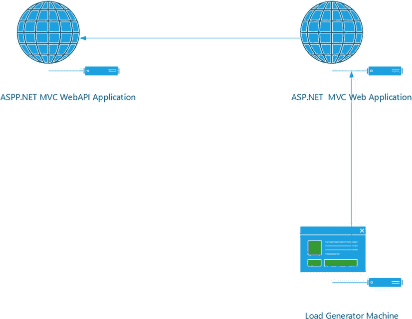
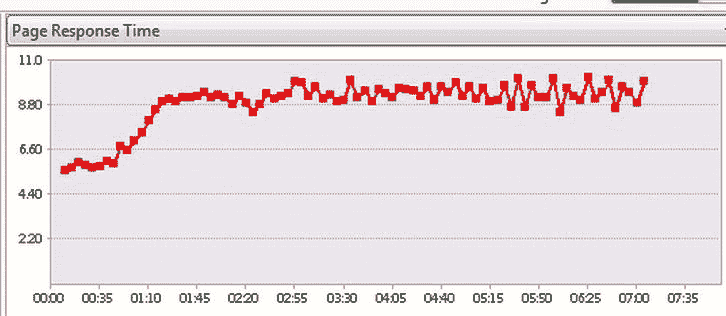

# 八、ASP.NET MVC 异步编程

8-1.使用异步操作

问题

您有一个应用，它大部分时间都在响应，但偶尔会运行缓慢，有时会完全停止。在做了一些分析之后，您发现了应用的变慢和由您的一个控制器调用的远程 web 服务的性能之间的相关性。奇怪的是，即使远程 web 服务只被应用的一部分使用，整个应用都会受到速度下降的影响。使用互联网服务管理器的活动请求报告(见方法 8-7)，您会注意到许多请求停留在`beginrequest`状态。你需要了解如何解决这个问题。

解决办法

缓慢的 web 服务调用阻塞了应用工作进程中的线程。如果线程被阻塞的时间太长，就需要创建新的线程来处理传入的请求。可以创建的线程数量以及 CLR 线程池注入新线程的速度都有限制。当超过这些限制时，新的请求会排队。如果队列大小超过其限制，或者并发执行请求的数量超过允许的最大值，IIS 将开始拒绝服务不可用的新请求(HTTP 503 代码)。这样做的结果是，您的应用将性能不佳，最终可能会失败。

如果阻塞是由高延迟远程调用引起的，有时可以通过使调用慢速服务的操作方法异步来缓解这个问题。在 ASP.NET MVC 的过去版本中，这是通过创建从`AsyncController`类派生的控制器来实现的。对于 ASP.NET MVC 4，微软通过创建使用`async` 和`await`关键字的合适的动作方法，允许你利用一种更简单的方法来执行异步操作。

它是如何工作的

要将同步动作方法转换为异步动作方法，需要执行以下步骤:

1.通过在访问修饰符后添加关键字`async`来修改动作方法的声明。关键字`async`告诉 C# 编译器这是在一个异步方法中。

2.将方法的返回类型更改为`Task<T>`，其中`T`是您希望方法返回的类型。例如，如果您希望您的操作方法返回一个字符串，您可以将它改为使用`Task<string>`。

3.使用`await`关键字调用异步方法。因为。NET 4.5 中，许多类已经更新为包含使用在。NET 4.0。

 **注意**在大多数情况下，基于任务的异步方法名称会有一个`Async`后缀，比如在`HttpClient.GetStringAsync`方法中。对于像`WebClient`这样的职业来说，可能没有这么简单。例如，`WebClient`已经有了许多带有`Async`后缀的方法，这些方法使用了旧的异步模式。由于微软不想打破向后兼容性，他们最终创建了实现基于任务的模式的新方法。例如，`WebClient`有三个版本的`DownloadData`方法。它有一个名为`DownloadData`的同步版本，`DownloadDataAsync`用于基于回调的异步模式，`DownloadDataTaskAsync`用于基于任务的异步版本。

清单 8-1 显示了一个普通的 Web API 动作方法。对于给定的 id，它返回一个`PlaylistModel`对象，如果提供的 id 在预期范围之外，则返回`null`。对于这个例子，让我们想象一下`PlaylistRepository`连接到一个非常慢的后端服务器，平均需要 5 秒钟返回一个结果。由于`Get`动作是同步的，它的线程将被阻塞，直到`GetAllPlaylists`方法返回。

[***清单 8-1。***](#_list1) 同步动作法

```cs
// GET api/playlist/5
public  PlaylistModel Get(int id)
{
  List<PlaylistModel> list = PlaylistRepository.GetAllPlaylists();

  if (id < list.Count)
  {
    return list[id];
  }
  else
  {
    return null;
   }
}
```

[清单 8-2](#list2) 显示了转换成异步版本的相同方法。该方法的结果与同步版本相同，感知的响应时间也是如此。从通过 web 浏览器使用该服务的最终用户的角度来看，什么都没有改变。需要理解的一件重要事情是，如果执行`GetAllPlaylistAsync`方法需要 5 秒钟，那么在`GetAllPlaylistAsync`完成之前，`Get`动作不会移动到下一行。不同之处在于，异步版本在等待`GetAllPlaylistAsync`方法返回时不会像同步版本那样阻塞线程。这允许 IIS 在等待时使用该线程执行其他工作。

[***清单 8-2。***](#_list2) 异步版动作方法见[清单 8-1](#list1)

```cs
public async Task<PlaylistModel> Get(int id)
{
            List<PlaylistModel> list = await  PlaylistRepository.GetAllPlaylists Async();

            if (id < list.Count)
            {
                return list[id];
            }
            else
            {
                return null;
            }
}
```

在[清单 8-2](#list2) 中，第一个变化是在`public`访问修饰符后添加了`async`关键字。然后返回类型从`List<` PlaylistModel `>`变为`Task<List<PlaylistModel>>`。最后一步是移除对`PlaylistRepository.GetAllPaylists`的调用，并替换为对方法`PlaylistRepository.GetAllPlaylistsAsync`的`async`版本的调用。

您应该记住的一点是，即使代码看起来很简单，但它之所以简单只是因为 C# 编译器正在为您编写复杂的代码。为[清单 8-1](#list1) 和[清单 8-2](#list2) 生成的 CLR 中间语言代码之间存在显著差异。这种差异的代价是轻微的性能损失，这取决于您的应用，当您的应用处于负载状态时，这种损失可能会放大。出于这个原因，您不应该让所有的代码都是异步的，而是应该在性能成本被使用非阻塞 IO 调用的好处所抵消的地方应用这种技术。

通常，如果您的应用使用同步方法运行良好，就不要更改它。另一方面，如果您确实发现了类似于这个菜谱的问题陈述中描述的性能问题，您可以尝试这种技术。这项技术是否会给你带来回报取决于你的应用。

如果你想在使用`async`和`await`关键字时更深入地了解 C# 编译器内部发生了什么，我推荐阅读食谱 8-5 和 8-6。

8-2.在一个动作方法中并行运行几个异步调用

问题

您的控制器中有一个 action 方法,它需要从几个远程服务器获取数据。你总共需要打五个电话，每个电话大约需要 1 秒钟。因此，您的页面平均需要 5 秒钟来响应，这不符合您的性能要求。您希望并行运行这些任务，以便您的页面可以更快地呈现。

解决办法

要解决这个问题，您可以触发任意数量的异步操作，并将每个结果保存为一个任务。然后你可以使用`Task.WhenAll`方法同时等待每个`Task`。

它是如何工作的

`Task.WhenAll`方法要么接受一个由`Task`对象组成的数组，要么接受一个由`Task`组成的`IEnumerable`作为参数，当所有的`Tasks`完成后，它将返回一个数组。数组返回类型将与任务封装的类型相匹配。清单 8-3 中的例子显示了三个独立的 web 服务调用被并行发送。

[***清单 8-3。***](#_list3) 使用 Web 客户端并行下载三个网页

```cs
public async Task<ActionResult> CallThreeServicesAsync()
{
    Task<string> t1, t2, t3;

    using (WebClient webClient = new WebClient())
    {
        Uri uri1 = new Uri(string.Format(webserviceURL, 1));
         t1 = webClient.DownloadStringTaskAsync(uri1);
    }
    using (WebClient webClient = new WebClient())
    {
        Uri uri2 = new Uri(string.Format(webserviceURL, 2));
         t2 = webClient.DownloadStringTaskAsync(uri2);
    }
    using (WebClient webClient = new WebClient())
    {
        Uri uri3 = new Uri(string.Format(webserviceURL, 3));
         t3 = webClient.DownloadStringTaskAsync(uri3);
    }

    string[] results = await Task.WhenAll(new Task<string>[] { t1, t2, t3 });
    ViewBag.Results = results;

    return View();
}
```

为了在动作方法中使用任何基于任务的异步调用，您需要做的第一件事是使用`async`关键字将该方法标记为异步。接下来，您需要将动作的返回类型从`ActionResult`更改为`Task<ActionResult>`。

对于这个例子，我们使用`WebClient.DownloadStringTaskAsync`方法异步调用三个 web 服务。这个方法将一个 URL 作为参数，并返回一个`Task<String>`。在基于任务的 API 中，通过将`Task`指定为泛型类型来指定它的返回类型。在这个例子中，我们使用了`string`类型，因为我们将检索一个 JSON 编码的字符串并在视图中打印出来。该视图的代码可以在本书的代码示例中找到，可以从本书的网站下载。

注意，每个下载`Task`都有自己的`WebClient` ，而不是由一个实例进行所有调用。这是必需的，因为单个`WebClient`不支持并发 I/O 操作。如果您尝试使用单个`WebClient`对象，您将得到以下错误消息:

```cs
[InvalidOperationException: An asynchronous module or handler completed while an asynchronous operation was still pending.]
```

另一个需要注意的重要事情是，你需要使用`DownloadStringTaskAsync`方法，而不是`DownloadStringAsync`。后者用于中引入的异步编程模式。净 3.5。它要求创建一个单独的回调方法。

此时，我们还没有对 web 服务执行任何调用。我们只提供了说明，描述了我们想要执行什么工作，以及我们期望返回什么类型的数据。

为了执行这一系列的`DownloadStringTaskAsync`，我们调用`Task.WhenAll`，传递给它一个新的数组，这个数组用之前声明的三个`Task`对象初始化。这个方法将在所有异步方法完成后完成，并返回一个字符串数组，因为使用了一个数组`Task<string>`。

[清单 8-4](#list4) 显示了一个稍微复杂一点的例子，这里不是传入一组固定的`Task`对象，而是创建一个`Task<byte[]>`的`List`，然后填充到循环体中。在每次循环迭代中，使用`WebClient DownloadDataTaskAsync`方法下载一个资源。`DownloadDataTaskAsync`类似于`DownloadStringTaskAsync`方法，它将 URL 作为参数并返回页面内容。不同之处在于，它不是返回字符串，而是以字节数组的形式返回数据。在需要下载二进制数据(如图像或音乐文件)的情况下，可以使用这种方法。最后，调用`WhenAll`，并将`IEnumerable`作为参数传递。`WhenAll`方法调用返回一个二维`byte`数组。

[***清单 8-4。***](#_list4) 用 WhenAll 带 IEnumerible

```cs
public async Task<ActionResult> CallTenServicesAsync()
{
   List<Task<byte[]>> dataTasks = new List<Task<byte[]>>();

   for (int i = 0; i < 10; i++)
   {
      using (WebClient webClient = new WebClient())
      {
         Uri uri = new Uri(string.Format(webserviceURL, i));
         dataTasks.Add(webClient.DownloadDataTaskAsync(uri));
      }
   }

   byte[][] allBytes = await Task.WhenAll(dataTasks);

   ViewBag.totalLength = allBytes.Sum(w => w.Length);

   return View();
}
```

查看[清单 8-3](#list3) 和[清单 8-4](#list4) ，您可能已经注意到传递给`Task.WhenAll`的所有`Tasks`都是同一类型。这是一个要求。如果试图传入混合类型，代码将无法编译。这多少有些不方便。因为您正在调用几个服务，所以它们可能会有不同的返回类型。

有几个策略可以用来解决这个问题。第一个类似于清单 8-3 中的[，代码调用 RESTful web 服务并接收 JSON 编码字符串形式的结果。I/O 操作完成后，您可以使用 JSON 序列化程序，比如 Newtonsoft 中的那个。Json 将 JSON 文本转换成 C# 对象。另一种策略是使用某个返回类型的`IEnumerable<Task>`而不是`Task`。在这种情况下，您将无法将`await`操作的结果直接传递到数组中，如清单 8-3](#list3) 和清单 8-4[中的](#list4)[所示。相反，你需要对每个操作的结果进行转换，如清单 8-5](#list3) 所示。

[***清单 8-5。***](#_list5) 使用任务。当所有任务具有不同的返回类型时

```cs
public async Task<ActionResult> GetPhotoAndComments()
{
  List<Task> tasks = new List<Task>();

  using (WebClient webClient = new WebClient())
  {
     Uri uri1 = new Uri(PhotoCommentServiceURL);
     tasks.Add(webClient.DownloadStringTaskAsync(uri1));
  }

  using (WebClient webClient = new WebClient())
  {
     Uri uri2 = new Uri(DynamicImgServiceUrl);
     tasks.Add(webClient.DownloadDataTaskAsync(uri2));
  }
  await Task.WhenAll(tasks);

  ViewBag.PhotoComments = ((Task<string>)tasks[0]).Result;
  string imageBase64 = Convert.ToBase64String(((Task<byte[]>)tasks[1]).Result);
  string imageSrc = string.Format("data:image/jpeg;base64,{0}", imageBase64);
  ViewBag.Photo = imageSrc;

  return View();
}
```

在[清单 8-5](#list5) 中，我们正在等待两个`Tasks`。第一个将调用一个 web 服务来检索一张照片的评论列表，并将返回一个字符串。第二个调用将检索图像数据，并具有字节数组的返回类型。在`await`调用之后，每个操作的结果被写入每个任务的`Result`属性。显式强制转换用于将结果写入`ViewBag`。

然后，图像数据被转换为 Base64 编码的字符串，这样它就可以在视图中的图像元素的`src`属性中用作数据 URI。

8-3.从 MVC 4 项目中消费 WCF 服务

问题

您的应用要求您使用您正在集成的第三方应用的 WCF 服务。您需要为这个服务创建一个代理,这样您就可以从控制器内部调用它。

解决办法

要使用项目中的 WCF 服务，首先向项目添加一个服务引用，然后使用生成的代理类调用该服务。

它是如何工作的

尽管 WCF 服务不再是很酷的新事物，但是在很多情况下，您仍然需要创建和使用它们，比如当您与不支持 RESTful 接口的系统交互时，或者与需要高级 web 服务技术(比如基于 WS-Transactions 规范的跨服务事务)的系统交互时。

当您将服务引用添加到项目中时，Visual Studio 将自动使用服务模型配置节更新项目的`Web.config`,该配置节包含服务地址和消息格式等信息。它还将生成一个代理类，您可以在代码中使用它来调用服务。

设置您的服务

消费 WCF 服务的技术有些简单。

1.  在 Visual Studio 中打开项目，右击解决方案资源管理器中的“引用”节点，然后选择“添加服务引用”。
2.  在地址文本框中输入服务的 URL。它的格式应该类似于`https://serviceurl/services/myservice.svc`。
3.  单击开始按钮。服务列表将出现在服务框中。如果列出了多个服务，请选择您想要的服务。
4.  在“名称空间”文本框中，输入要用于生成的代理类的名称空间。
5.  单击“高级”按钮。请注意，“允许生成异步操作”和“生成基于任务的操作”是默认选中的。这允许您使用中引入的新的基于任务的异步编程模型。NET 4.0。如果您不打算异步调用 web 服务，您应该取消选中此框，因为它会缩小生成的代理类的大小。
6.  如果您正在使用另一个 MVC 4 项目的服务，取消选中“重用引用程序集中的类型”。如果您保持选中此项，对`Newtonsoft.Json`的引用将导致错误发生，并且不会生成您的代理类。
7.  单击确定关闭高级对话框，然后再次单击确定创建服务引用。稍后，服务引用将被添加到您的项目中。
8.  您现在可以访问该服务，如清单 8-6 和清单 8-7 所示。

异步调用 WCF 服务

清单 8-6 展示了如何使用同步方法调用服务。[清单 8-7](#list7) 显示了一个异步的例子。

[***清单 8-6。***](#_list6) 从控制器调用 WCF 服务

```cs
using Ch8.R4.ServiceReference1;

//other using statements removed for brevity

public ActionResult CallWCFService()
{
   PlaylistServiceClient client = new PlaylistServiceClient();
   PlaylistModel[] playlistArray = client.GetAllPlayLists();
   return View(playlistArray);
}
```

[***清单 8-7。***](#_list7) 使用基于任务的异步方法从控制器调用 WCF 服务

```cs
public async Task<ActionResult> CallWCFServiceAsync()
{
   PlaylistServiceClient client = new PlaylistServiceClient();
   PlaylistModel[] playlistArray = await client.GetAllPlayLists Async ();
   return View(playlistArray);
}
```

在`CallWCFService`动作中，我们首先创建代理类的一个新实例`PlaylistServiceClient`。这是 Visual Studio 在将我们的 WCF 服务添加为服务引用时为其生成的类。然后我们调用`GetAllPlayLists()`，它同步调用 WCF 服务并返回一个`PlaylistModel`对象数组。在创建服务引用时，Visual Studio 也生成了`PlaylistModel`。生成类所需的所有信息都可以从服务元数据中获得。服务元数据根据 Web 服务定义语言(WSDL)标准进行格式化。

清单 8-6 和清单 8-7 中的代码摘录非常相似。它们之间的区别用粗体字强调。首先，`async`关键字被添加到方法签名中，返回类型被封装在任务中。此任务用作跟踪异步调用状态的状态机。

在`CallWCFServiceAsync`动作中，`GetAllPlayLists`调用已经被替换为异步调用。`await`关键字被放在赋值操作符和 web 服务调用之间。`await`关键字标记了 web 服务调用完成时执行将恢复的位置。

从最终用户的角度来看，清单 8-6 中的代码和清单 8-7 中的代码在行为上没有变化。仍然只有一个请求和一个响应。如果 web 服务需要 5 秒钟才能完成，最终用户仍然需要等待至少 5 秒钟的响应。使用`async`版本的好处是，在我们等待服务结果时，它会释放线程并允许它执行其他工作，而不是阻塞线程。

使用 Task 并行执行几个 WCF 调用。等待句柄集都已收到信号

[清单 8-8](#list8) 显示了使用`Task.WhenAll`并行执行的几个异步 WCF 调用。

[***清单 8-8。***](#_list8) 使用任务。当所有与 WCF 服务

```cs
public async Task<ActionResult> CallWCFWithWaitAll()
{
  PlaylistServiceClient client = new PlaylistServiceClient();
  Task<PlaylistModel> task1 = client.GetPlayListAsync(1);
  Task<PlaylistModel> task2 = client.GetPlayListAsync(2);
  Task<PlaylistModel> task3 = client.GetPlayListAsync(3);
  PlaylistModel[] playlistArray =
    await Task.WhenAll(new Task<PlaylistModel>[] { task1, task2, task3 });
            return View(playlistArray);
 }
```

在 Web.config 中修改 WCF 配置

在许多情况下，由 Visual Studio 创建的默认 WCF 客户端配置可以满足您的需要，但是在许多情况下可能需要进行调整。当您添加服务引用时，Visual Studio 假设您想要使用最不复杂和最兼容的绑定——`basicHttpBinding`。这种绑定在行为和功能上非常类似于传统的 ASMX web 服务。

清单 8-9 展示了一个应用的`Web.config`文件中一些自定义 WCF 设置的例子。在本例中，我们更改了两个设置:我们增加了该客户端可以接收的最大消息大小，并且我们允许我们的 WCF 客户端接受来自该服务的 cookies。在添加服务引用时，[清单 8-9](#list9) 中示例配置的其余部分是由 Visual Studio 创建的。

[***清单 8-9。***](#_list9) Web.config 文件修改为 WCF 客户端配置

```cs
<system.serviceModel>
  <bindings>
    <basicHttpBinding>
      <binding name="BasicHttpBinding_IPlaylistService"
               maxReceivedMessageSize="2097152"
               allowCookies="true " />
    </basicHttpBinding>
  </bindings>
  <client>
    <endpoint address=" http://localhost/WebAPIForLoadTest/WcfServices/PlaylistService.svc "
      binding="basicHttpBinding"
      bindingConfiguration="BasicHttpBinding_IPlaylistService"
      contract="ServiceReference1.IPlaylistService"
      name="BasicHttpBinding_IPlaylistService" />
  </client>
</system.serviceModel>
```

所有 WCF 配置都包含在`system.serviceModel`配置部分。从……开始。在. NET 4.0 中，微软通过将 WCF 的许多通用设置移到系统级配置文件中来简化配置。这最小化了您的责任，因此您只需要担心您想要使用的绑定以及服务被分配给哪个端点。

在配置的绑定部分，您可以配置`basicHttpBinding`的设置，或者如果您愿意，可以使用其他绑定，如`wsHttpBinding`、`netMsmqBinding`或自定义绑定。在本例中，我们更改了两个设置:

*   `maxReceivedMessageSize` :此设置限制传入消息的大小，以帮助防止拒绝服务攻击。它的默认值 65，536 字节通常太小，甚至无法处理一般的结果集。此设置可向上调整至 2，147，483，647 字节(2GB)。建议不要将该设置设置得比需要的大。在[清单 8-9](#list9) 中，它被配置为接受高达 2MB 的内存。
*   `allowCookies` :此设置在使用可能使用 cookies 的 ASMX web 服务时非常有用。包含此设置可确保从远程服务器发送的 cookies 与对该服务的每个后续请求一起发送。

在 WCF 中，绑定是一组预定义的通信方面，您可以将其应用于特定的端点。例如，`basicHttpBinding`指定应用将通过 HTTP 或 HTTPS 进行通信，并且它将使用文本或 MTOM 编码。另一方面，`NetMsmqBinding`支持微软消息队列服务(MSMQ)作为传输。

8-4.使用缓存提升基于任务的异步通信的性能

问题

您已经实现了一个服务，该服务需要使用基于任务的异步编程风格进行许多后端服务调用。您注意到，在负载情况下，服务器使用的内存和 CPU 比您最初预期的要多。

解决办法

在基于任务的异步模式中使用的`Task`对象像模板一样工作，当被编译时，生成相对复杂的中间语言代码，包括一个状态机，用于跟踪每个任务的生命周期。对于负载较轻的 web 应用和典型的客户端应用开发场景，使用`Tasks`增加的额外重量是微不足道的。但是，在每分钟处理数千个请求的服务器应用上，这些对象的数量会消耗内存并给垃圾收集器带来更多工作，从而成为一种负担。

在某些情况下，这个问题可以通过重用一组包含预设值的静态`Task`对象来缓解。这减少了运行时需要创建的对象数量，从而提高了应用的性能。通过缓存网络操作的结果，可以进一步提高性能，从而避免对缓存中已有项目的冗余请求。

它是如何工作的

在这个例子中，我创建了一个网站，允许您输入 IP 地址范围，然后使用`System.Net.NetworkInformation.Ping`类告诉您哪些 IP 地址是可用的。这是一个有点做作的例子，因为很难想象这样一个服务会在高容量的条件下使用，但是它服务于演示这种技术的目的。

要创建这个例子，首先打开 Visual Studio，使用带有 Razor 视图引擎的基本模板创建一个新的 ASP.NET MVC 4 web 应用。一旦创建了项目，执行以下步骤:

1.  右键单击`Models`文件夹并选择添加类。将新类命名为 **IpScannerModel** ，并将其修改为类似于清单 8-10 中的[。](#list10)
2.  右键单击`Views`文件夹并选择添加新文件夹。将文件夹命名为 **Home** 。
3.  右键单击刚刚创建的`Home`文件夹。选择添加视图。将视图命名为 **IpScanner** 。取消选中布局页面复选框，确保选择 Razor 视图引擎，然后单击添加。修改视图，使其看起来像清单 8-11 中的[。](#list11)
4.  右键单击`Controllers`文件夹，单击添加，然后单击控制器。将控制器命名为 **HomeController** ，并确保选择了空的 MVC 控制器。单击添加按钮。修改控制器，使其看起来像清单 8-12 中的[。](#list12)

 **警告**软件开发中最大的原罪之一是过早优化——对代码进行更改以避免尚未体验到的潜在性能问题。在大多数情况下，这是一种浪费，甚至可能是有害的，因为您给代码增加了不必要的复杂性(甚至可能是错误)。像本食谱中所展示的技术应该只用于解决已经确定的特定问题。

模型

本例中的模型是一个复杂类型，由一个具有两个属性的`IpRange`对象组成:起始 IP 地址和结束 IP 地址。它还包括一个包含 IP 地址列表的`String`的`List`。该模型如[清单 8-10](#list10) 所示。

[***清单 8-10。***](#_list10)IPScannerModel

```cs
using System.Collections.Generic;
using System.ComponentModel;
using System.ComponentModel.DataAnnotations;

namespace Ch8.R4.Models
{
    public class IPScannerModel
    {
        public IPRange RangeToScan
        {
            get;
            set;
        }

        private List<string> _IpList = null;
        public List<string> IpList
        {
            get
            {
                if (null==_IpList)
                {
                    _IpList = new List<string>();
                }
                return _IpList;
            }
            set
            {
                _IpList = value;
            }
        }
    }

    public class IPRange
    {
        [Required]
        [DisplayName("Start Address")]
        [RegularExpression(ipAddressRegEx,
         ErrorMessage = "Must be a valid IP Address.")]
        public string StartAddress
        {
            get;
            set;
        }
        [Required]
        [DisplayName("End Address")]
        [RegularExpression(ipAddressRegEx,
         ErrorMessage = "Must be a valid IP Address.")]
        public string EndAddress
        {
            get;
            set;
        }
        private const string ipAddressRegEx = @"^(25[0–5]|2[0–4][0–9]|[0–1]{1}[0–9]{2}|[1–9]{1}
[0–9]{1}|[1–9])\.(25[0–5]|2[0–4][0–9]|[0–1]{1}[0–9]{2}|[1–9]{1}[0–9]{1}|[1–9]|0)\.(25[0–5]|2[0–4]
[0–9]|[0–1]{1}[0–9]{2}|[1–9]{1}[0–9]{1}|[1–9]|0)\.(25[0–5]|2[0–4][0–9]|[0–1]{1}[0–9]{2}|[1–9]{1}[0–9]{1}|[0–9])$";
    }

}
```

请注意，`IpRange`类正在使用数据注释。这些注释随后在视图中与 HTML helper 方法和 jQuery 验证结合使用，以提供客户端表单验证。

为了简单起见，我们使用正则表达式来验证 IP 地址。字符串常量用于存储正则表达式。这减少了在数据注释中插入这个令人不快的字符串的需要，从而增强了可读性。它还允许在一个地方定义字符串，这增加了可维护性。

使用正则表达式不是验证 IP 地址的最佳方式。这个特殊的表达式仍然允许输入无效的地址。对于这种情况，更好的解决方案是自定义验证器。配方 10-5 中提供了一个自定义验证程序的示例。

景色

该视图由一个表单组成，允许您输入 IP 地址范围并单击一个按钮来启动扫描。这是一个使用`IPScannerModel`的强类型视图。它还包括 jQuery 验证脚本包，因此可以利用模型中的数据注释。它包括几个`if`语句，这些语句隐藏可用的 IP 地址列表，直到单击 Scan IP Range 按钮。如果没有找到结果，它将通知用户在所选范围内没有可用的地址。IPScanner 视图的代码如[清单 8-11](#list11) 所示。

[***清单 8-11。***](#_list11) IPScanner.cshtml

```cs
@model Ch8.R4.Models.IPScannerModel
@{
    ViewBag.Title = "IP Address Scanner";
}

<h2>IP Address Scanner</h2>
Use this tool to show available IP Addresses in our lab.
@using (Html.BeginForm(new { ReturnUrl = ViewBag.ReturnUrl })) {
     @Html.ValidationSummary(false, "The start address and end address are required and both must be valid IP Addresses.")
<fieldset>
    <legend>Enter an Ip Address Range to scan</legend>
    <ol>
       <li>
        @Html.LabelFor(a=> a.RangeToScan.StartAddress)
        @Html.TextBoxFor(a => a.RangeToScan.StartAddress)
        </li>
    <li>
        @Html.LabelFor(a=> a.RangeToScan.EndAddress)
@Html.TextBoxFor(a => a.RangeToScan.EndAddress)
    </li>
        </ol>
    <input type="submit" value="Scan IP Range" />
</fieldset>
}
@if ((Model!=null))
{
    if ((Model.IpList != null) && (Model.IpList.Count > 0)){
        <div>
             The following IP Addresses are availible
         </div>
<ul>
@foreach (var item in Model.IpList)
{
    <li>
        @item
    </li>
}
</ul>
    }
else{
         <div>
             No Ip Addresses are available in the range provided
         </div>
     }
}

@section Scripts {
    @Scripts.Render("∼/bundles/jqueryval")
}
```

视图从模型绑定声明开始。这将视图绑定到`Ch8.R4.Models.IpScannerModel`。然后我们将标题`ViewBag.Title`设置为 Ip 地址扫描器。布局页面使用它来设置页面的 HTML title 元素。

接下来，我们使用`Html.BeginFrom`助手创建开始和结束 HTML 表单元素，并将表单动作设置为`ViewBag.Return` URL。这是一个由 MVC 框架自动设置的值。它将包含当前控制器操作的 URL，除非您在控制器中覆盖该值。默认情况下，该方法会将表单的 method 属性设置为“post”。有了这个设置，当点击提交按钮时，它将调用用`HomeController`中的`[HttpPost]`属性修饰的`IpScanner`动作。

`@Html.ValidationSummary`助手用于在页面上显示验证错误。

在接下来的几行代码中，我们使用`@Html.LabelForm`和`@Html.Textbox`作为生成表单元素和相关属性的方法。特殊属性会自动添加到呈现的 HTML 中，jQuery 验证库可以使用这些属性。表单的最后一个输入是一个 submit 按钮，其文本为“Scan IP Range”。

在结束`fieldset`之后，我们使用一个结束花括号来关闭我们用`BeginForm`助手开始的表单。

除了表单之外，这个视图也用于显示结果。为此，我们添加一个 Razor 控制语句来检查模型的存在。如果模型为空，则不会呈现任何内容。如果模型有一个值，它假设模型包含一个有效的`IpList`，然后将其呈现为一个无序列表。

最后，我们包括 jQuery 验证脚本包。这将为 jQuery 验证库所需的所有 JavaScript 文件生成脚本引用，jQuery 验证库用于客户端表单验证。

控制器

控制器由两个动作组成。一个是针对`GET`操作，它只是返回视图而不执行任何处理。第二个是用于获取 IP 范围并使用它生成 IP 地址列表的`POST`操作。然后，它通过使用`System.Net.NetworkInformation.Ping`类中的功能检查每个地址是否都在使用中。它结合使用异步通信和缓存来显著减少处理时间。`HomeController`的`IpScanner`动作如[清单 8-12](#list12) 所示。

[***清单 8-12。***](#_list12) HomeController 类 IpScanner HTTPPost 操作

```cs
...
using System.Net.NetworkInformation;
...
[HttpPost]
public async Task<ActionResult> IPScanner(IPScannerModel model)
{
 if (ModelState.IsValid)
 {
    model.IpList = generateListFromRange(model.RangeToScan);
    List<Task<PingReply>> taskList = new List<Task<PingReply>>();
    Dictionary<string, Task<PingReply>> cache = getDictionaryFromCache();
    foreach (var item in model.IpList)
    {
      Task<PingReply> reply;
      if (!areResultsInCache(item, cache, out reply))
      {
        Ping pingSender = new Ping();
        reply = pingSender.SendPingAsync(item);
        cache.Add(item, reply);
       }
       taskList.Add(reply);
    }
    HttpContext.Cache.Insert("CachedPingReply",
                              cache,
                              null,
                              DateTime.UtcNow.AddMinutes(10),
                              TimeSpan.Zero);

    PingReply[] results = await Task.WhenAll(taskList);
    model.IpList = updateStatus(model.IpList, results);
    }
    else
    {
       ModelState.AddModelError("", "Please enter a valid IP Address range.");
    }
    return View(model);
}
```

当表单被提交时，清单 8-12 中的[动作将被执行。执行的第一个操作验证模型中的数据是否有效。这是一种备份机制，防止表单在绕过客户端验证的情况下被处理，比如在用户禁用了 JavaScript 的情况下。](#list12)

像 JavaScript 验证一样，服务器端验证基于已经应用于模型的数据注释。`ModelState.IsValid`属性由框架使用数据注释自动计算。您不需要编写额外的代码。

接下来，我们使用`generateListFromRange`本地助手方法，尝试从模型的`RangeToScan`属性中的数据生成一个 IP 地址列表。`RangeToScan`属性包含一个`IpRange`类的实例。模型的`RangeToScan`属性应该用表单中的数据填充，因为它的两个文本框被绑定到模型的`RangeToScan.StartAddress`和`RangeToScan.EndAddress`属性。

接下来，我们开始为一系列异步网络操作做准备，方法是创建一个`Task`对象列表，这些对象将跟踪每个 ping 操作的状态，如果操作成功完成，则返回一个`PingReply`对象。

我们还从缓存中抓取了一个以前执行的任务列表。这些存储在一个`Dictionary`中，它使用 IP 地址作为键，使用任务`PingResult`作为值。

然后，我们遍历 IP 地址列表，并准备好`System.Net.NetworkInformation.Ping`类向每个主机发送互联网控制消息协议(ICMP)回应请求包。此时，我们没有执行`Ping`操作，而是定义了我们想要执行的任务。

我们不是为每个操作创建一个新的`Task`对象，而是检查缓存中是否有一个。每次工具运行时，它都会缓存产生的`Task`对象。这减少了需要创建和销毁的`Task`对象的总数。我们通过使用另一个本地助手方法`areResultsInCache`来实现这一点，如果该项存在，它将返回`true`，然后提供缓存的副本作为输出参数。如果它返回`false`，我们准备一个异步 ping 操作，并分配一个新的`Task`对象来跟踪它的状态。我们还将新的`Task`对象添加到缓存中，以供将来可能的操作使用。

在我们退出`for`循环后，我们更新缓存，使其包含任何可能添加的新 IP 地址。

这里使用的`Cache.Insert`方法允许我们添加或更新缓存中的值。缓存本身是为每个应用域创建的专用集合类型。

`Cache.Insert`方法有几种变体。本例中使用的版本中的第一个参数是对象的名称。这可以是任何字符串。下一个参数是您希望插入的对象。在本例中，我们插入了一个包含 IP 地址结果的键/值的`Dictionary`对象。第三个参数用于一个`CacheDependency`对象，这是一个由缓存系统监控的文件或缓存键。如果在指定的依赖项上检测到更改，对象将自动从缓存中移除。因为我们在这个例子中没有使用依赖项，所以我们简单地传入了`null`。接下来的两个参数指定项目在被删除之前应该在缓存中保留多长时间。对于我们的例子，我们希望使用 10 分钟的绝对时间。为滑动过期参数传递`TimeSpan.Zero`表明我们希望在十分钟内删除对象，而不管该项最后一次被访问是什么时候。

最后，在所有的异步操作都准备好之后，我们使用`Task.WhenAll`方法向每个主机发送 ICMP 数据包。我们使用`await`关键字来标记一旦`taskList`中的所有任务完成后执行将恢复的位置。

一旦等待的任务完成，结果将被存储到一个`PingReply`对象数组中。我们通过使用`updateStatus`本地助手方法来处理这些信息，以查看哪些结果有成功的回复。`updateStatus`方法将为 ping 请求无法到达的每个 IP 地址返回一个`string`对象列表。

然后，我们将这个列表传递给模型，并返回带有更新模型的`ViewResult`。

在这个例子中，我们将控制器逻辑分解成几个子程序。这样做是为了使代码更容易阅读和维护。第一个私有方法如清单 8-13 所示。

[***清单 8-13。***](#_list13)home controller generateListFromRange 助手

```cs
private List<string> generateListFromRange(IpRange iPRange)
{
  if (iPRange != null)
  {

    string ipTemplate =
      string.Concat
      (
       iPRange.StartAddress.Substring(0,(iPRange.StartAddress.LastIndexOf(".")+1)), "{0}"
      );

    int start, end;
    start =
      Convert.ToInt32
      (
       iPRange.StartAddress.Substring( (iPRange.StartAddress.LastIndexOf(".")+1))
       );

   end =
    Convert.ToInt32
    (
     iPRange.EndAddress.Substring((iPRange.EndAddress.LastIndexOf(".")+1))
    );

 List<string> ipp = new List<string>();
 for (int i = start; i <= end; i++)
 {
     ipp.Add(string.Format(ipTemplate, i));
 }
 return ipp;
}
return null;
}
```

如[清单 8-13](#list13) 所示的`generateListFromRange`私有方法将一个`IpRange`对象作为参数。它验证该对象不是`null`，然后进行一些字符串操作，根据`StartAddress`属性的前三个八位字节为 IP 地址范围创建一个模板。例如，如果起始地址是 192.168.1.1，则模板应该是 192.168.1。{0}.

如果您是一名精明的开发人员，您可能会发现这段代码中所做的假设存在许多问题，但是请记住，为了这个示例，这一点已经被故意简化了。要使这段代码可以投入生产，至少需要添加一些额外的验证逻辑，以确保起始地址和结束地址共享相同的三个八位字节。

接下来，我们声明两个整型变量`start`和`end`。然后，我们结合使用`Convert.ToInt32`方法和`String.Substring`方法，将`IpRange`变量中每个 IP 地址的最后一个八位字节转换成一个整数。

然后，我们使用一个`for`循环在起始和结束地址之间为每个可能的 IP 地址创建一个字符串。

当循环完成时，返回列表。

在`IPScanner`动作中使用的第二个助手方法是`areResultsInCache`，如[清单 8-14](#list14) 所示。该方法获取一个`IpAddressProperties`对象，并将其与缓存中的对象进行比较。如果找到匹配，它将返回`true`，然后返回匹配的对象作为输出参数。

[***清单 8-14。***](#_list14) HomeController 是 ResultsInCache 辅助方法

```cs
private bool areResultsInCache(string item,
                               Dictionary<string, Task<PingReply>> cache,
                                 out Task<PingReply> reply)
{
  if (cache != null)
  {
    return cache.TryGetValue(item, out reply);
  }
  else
  {
    reply = null;
    return false;
  }
}
```

在[清单 8-14](#list14) 中，我们检查缓存参数中传递的`Dictionary`对象是否为`null`。如果缓存是`null`，那么我们返回`false`，并将输出参数设置为`null`。

如果缓存确实存在，我们使用它的`TryGetValue`方法从集合中提取对象。如果该项存在，该方法返回`true`，匹配的对象被赋给输出参数。如果没有找到，该方法返回`false`，输出参数设置为`null`。

在`IPScanner`动作中使用的另一个私有助手方法是`getDictionaryFromCache`，如[清单 8-15](#list15) 所示。该方法检查缓存中是否存在`"CachedPingReply" Dictionary`，如果不存在，则创建它。然后它返回`Dictionary`。

[***清单 8-15。***](#_list15)getDictionaryFromCache 助手

```cs
private Dictionary<string, Task<PingReply>> getDictionaryFromCache()
{
  Dictionary<string, Task<PingReply>> cache;
  if (HttpContext.Cache["CachedPingReply"] != null)
  {
    cache = (Dictionary<string, Task<PingReply>>)HttpContext.Cache["CachedPingReply"];
  }
  else
  {
    cache = new Dictionary<string, Task<PingReply>>();
  }
  return cache;
}
```

在`IPScanner`动作中使用的最后一个助手方法是`updateStatus`，如[清单 8-16](#list16) 所示。这个方法用于过滤掉回复我们 ping 请求的 IP 地址。由于我们的`IPScanner`动作的目标是确定哪些 IP 地址是可用的，所以我们不关心有响应的地址，而是那些没有响应的地址。

[***清单 8-16。***](#_list16)home controller updateStatus Helper 方法

```cs
private List<string> updateStatus(List<string> list, PingReply[] results)
{
  foreach (var item in results)
  {
    if (item.Status == IPStatus.Success)
    {
      list.RemoveAll(s => s == item.Address.ToString());
    }
   }
 return list;
}
```

现在应用已经构建好了，您可以试用它了。首先尝试 192.168.1.1 到 192.168.1.10 这样的小 IP 范围。注意页面返回需要多长时间。第一次运行时，应该需要 10 到 15 秒。下一次尝试，结果几乎是立竿见影的。这是因为结果已被缓存，不再需要发出 ping 请求。用更大数量的请求再试一次，比如 192.168.1.1 到 192.168.1.100。请注意，这将比第一次尝试花费更长的时间，但时间的增加并不是权宜之计。这是因为它异步执行请求。

8-5.使用 IL 反汇编器查看 C# 编译器生成的代码

问题

您已经开始使用新的。NET 异步编程模式，并且喜欢它相对于其他编程模式的简单性。但是，您希望更好地理解编译器生成的代码，以便改进异步方法的设计。

解决办法

有几种工具可用，包括。NET IL 反汇编工具，它随。NET 框架。它允许您对编译后的。NET 程序集并浏览 IL 代码。一些工具。比如 ILSpy，。NET Reflector 和 JetBrains dotPeek 允许您更进一步，从反汇编的中间语言代码中实际生成 C# 代码。

它是如何工作的

当你建立你的。NET 应用，编译器生成中间语言(IL)。这种架构为开发人员提供了编程语言的选择，并允许编译后的代码在任何安装了正确版本的公共语言运行时的 Windows 机器上运行。

当。NET 汇编需要执行时，实时(JIT) 编译器会把 IL 转换成机器码。然后可以执行机器代码。

要查看这一过程，您可以使用。NET IL 反汇编工具。这是附带的工具。NET 框架。它允许您打开. NET 程序集，并以人类可读的格式查看编译器生成的中间语言代码。即使您不想直接编辑这段代码，查看这段代码也是一个有趣的练习，可以增加您对 C# 编译器和。NET 框架。

我在这里包含了一个简短的教程来演示异步方法和同步方法生成的 IL 之间的差异。

1.  打开 Visual Studio，使用空模板创建一个新的 MVC 4 应用。
2.  通过右键单击`Controllers`文件夹并选择 Add 和控制器来添加一个新的 Web API 控制器。
3.  在添加控制器对话框中，将控制器命名为 **NormalController** 。选择空的 API 控制器模板，然后单击 Add 创建文件。我们使用 Web API，因为从 IL 的角度来看，代码不太复杂。
4.  使用步骤 2 和 3 中描述的方法创建第二个空 Web API 控制器，但是将这个控制器命名为 **AsyncController** 。
5.  Enter the code from [Listing 8-17](#list17) into NormalController. Enter the code from [Listing 8-18](#list18) into AsyncController. The two examples are functionally equivalent and return an integer with the value of 1.

    [***清单 8-17。***](#_list17)normal controller . cs

    ```cs
    public class NormalController : ApiController
    {
     public int Get()
     {
        int i = 1;
        return i;
     }
    }
    ```

    [***清单 8-18。***](#_list18)async controller . cs

    ```cs
    using System.Threading.Tasks;
    ...
    public class AsyncController : ApiController
    {
      public async Task<int> Get()
      {
        int i = await Task.FromResult<int>(1);
        return i;
       }
    }
    ```

6.  通过按键盘上的 F6 键或从“生成”菜单中选择“生成解决方案”来生成项目。
7.  打开开发人员命令提示符。这是命令窗口的特殊快捷方式。它包括到所有。NET 框架工具。
8.  在命令窗口中输入 **ildasm** 。
9.  一旦 IL 反汇编程序应用打开，使用 File 菜单浏览到您的 MVC 应用的 BIN 目录，并为您的应用选择程序集。默认情况下，这将是您的应用的名称。
10.  一旦打开，伊尔 DASM 将显示所有的伊尔包括在您的装配。如果您展开程序集的节点，然后展开控制器节点，您应该会看到两个控制器。
11.  如图[图 8-1](#Fig1) 所示展开控制器的节点，并注意它们之间的差异。对于从[清单 8-18](#list18) 生成的代码，将会有一个值类`<Get>d_0`。现在您可以展开这个节点并检查这个类的内部工作方式。双击`MoveNext`方法。这包含了操作方法的大部分操作。即使您不是 IL 方面的专家，也应该对使用异步操作时所需的开销有所了解。简单地说，它不是魔法，也不是免费的。


[图 8-1](#_Fig1) 。IL DASM 显示了为同步和异步方法生成的 IL 之间的差异

使用 JetBrains dotPeek

如果你发现 IL 代码很难理解，不要对自己太苛刻。IL 不一定要被人类阅读——除了。NET 框架开发团队。为了更好地理解正在发生的事情，您可以使用 ILSpy 或 dotPeek 等工具，通过将 IL 转换为 C# 代码，对您的代码进行完整的逆向工程。这将向您展示如果不使用新的异步框架，您将不得不编写的 C# 代码。

在这个例子中，我们将使用由 JetBrains 开发的免费反编译器 dotPeek。JetBrains 最出名的是。NET 重构产品 ReSharper。该工具可以从 JetBrains 网站(`www.jetbrains.com/decompiler/`)下载。

下载完工具后，您需要安装它。然后，您可以通过单击开始屏幕上的图标(或开始菜单上的图标)来启动它。

为了更好地了解 C# 编译器在使用带有`async`和`await`关键字的基于任务的异步编程时生成的代码，我们将创建一个简单的命令行应用。

1.  打开 Visual Studio，并从起始页中选择“新建项目”。
2.  在“新建项目”窗口中，选择 Windows，然后选择控制台应用。
3.  为项目命名，然后单击“确定”。
4.  Modify the code to match [Listing 8-19](#list19), and then build the application.

    [***清单 8-19。***](#_list19) 《瓦萨普世界应用》

    ```cs
    class Program
    {
      static void Main(string[] args)
      {
       sayWassup();
      }
      private static void sayWassup()
      {
        Console.WriteLine("Wassup...... World");
       }
    }
    ```

清单 8-19 中的代码非常简单。它包含一个名为`sayWassup`的方法，该方法在 Main 方法内部被调用。如果你不熟悉这个术语，“Wassup”在美国是“你好”的意思

现在您已经构建了项目，您可以使用 dotPeek 对其进行逆向工程。打开 JetBrains dotPeek ，然后点击 dotPeek 工具栏上的打开。浏览到项目的输出文件夹。在`debug\bin`目录中会有一个`.exe`文件。

从汇编资源管理器中选择您的应用，然后单击工具栏上的“显示编译器生成的代码”按钮。你现在应该在主窗口中看到你的应用。它看起来类似于清单 8-20 中的[。](#list20)

[***清单 8-20。***](#_list20) 使用 dotPeek 对 Wassup World 应用进行逆向工程

```cs
internal class Program
{
    public Program()
    {
      base.\u002Ector();
    }

    private static void Main(string[] args)
    {
      Program.sayWassup();
    }

    private static void sayWassup()
    {
      Console.WriteLine("Wassup...... World");
    }
}
```

请注意，除了通过显式包含默认构造函数而显得稍微冗长之外，[清单 8-20](#list20) 与[清单 8-19](#list19) 几乎相同。

为了理解使用`async`关键字时 C# 编译器生成的代码，我们现在将转换`Wassup`方法以包含异步编程基础设施。为此，修改该方法，使其看起来像[清单 8-21](#list21) 。

[***清单 8-21。***](#_list21) 异步 Wassup

```cs
class Program
{
  static void Main(string[] args)
  {
    sayWassup().Wait();
  }
  private async static Task sayWassup()
  {
    Console.WriteLine("Wassup...... World");
  }

}
```

我们在`sayWassup`方法中添加了`async`关键字，并将其返回类型从`void`更改为`Task`。请注意，因为没有返回类型，所以不需要使任务通用化。

在 Main 方法中，`Task.Wait()`方法被添加到`sayWassup`调用中。这是必需的；否则，应用将在异步任务有机会完成之前退出。

编译程序。请注意，您将得到一个编译器警告，通知您因为您没有向您的方法添加一个`await`操作符，所以它将同步运行。换句话说，即使我们将这个方法标记为`async`，它的行为也不会改变。

返回 dotPeek，并通过在装配资源管理器中再次单击它来重新加载装配。注意变化。`AsyncStateMachine`属性已经被添加到您的`sayWassup`方法中，这将它与实现`IAsyncStateMachine`接口的`<sayWaasup>d__0`结构相关联。您的方法体已经被包装在该结构的`IAsyncStateMachine.MoveNext()`方法中——只是它被一个`try` / `catch`块和对负责维护您的任务状态的`AsyncTaskMethodBuilder`的大量调用所包围。完整的 dotPeek 反编译如清单 8-22 所示。

[***清单 8-22。***](#_list22)dotPeek 反向工程的 Wassup World 异步版

```cs
// Type: CH7.R7_5.Program
// Assembly: CH7.R8-5, Version=1.0.0.0, Culture=neutral, PublicKeyToken=null
// Assembly location: G:\WorkingFolder\MVCBook\Chapter7\CH7.R8-5\CH7.R8-5\bin\Release\CH7.R8-5.exe

using System;
using System.Diagnostics;
using System.Runtime.CompilerServices;
using System.Runtime.InteropServices;
using System.Threading.Tasks;

namespace CH7.R7_5
{
  internal class Program
  {
    public Program()
    {
      base.\u002Ector();
    }

    private static void Main(string[] args)
    {
      Program.sayWassup().Wait();
    }

    [AsyncStateMachine(typeof (Program.\u003CsayWassup\u003Ed__0))]
    [DebuggerStepThrough]
    private static Task sayWassup()
    {
      Program.\u003CsayWassup\u003Ed__0 stateMachine;
      stateMachine.\u003C\u003Et__builder = AsyncTaskMethodBuilder.Create();
      stateMachine.\u003C\u003E1__state = −1;
      stateMachine.\u003C\u003Et__builder.Start<Program.\u003CsayWassup\u003Ed__0>(ref stateMachine);
      return stateMachine.\u003C\u003Et__builder.Task;
    }

    [CompilerGenerated]
    [StructLayout(LayoutKind.Auto)]
    private struct \u003CsayWassup\u003Ed__0 : IAsyncStateMachine
    {
      public int \u003C\u003E1__state;
      public AsyncTaskMethodBuilder \u003C\u003Et__builder;

      void IAsyncStateMachine.MoveNext()
      {
        try
        {
          Console.WriteLine("Wassup...... World");
        }
        catch (Exception ex)
        {
          this.\u003C\u003E1__state = −2;
          this.\u003C\u003Et__builder.SetException(ex);
          return;
        }
        this.\u003C\u003E1__state = −2;
        this.\u003C\u003Et__builder.SetResult();
      }

      [DebuggerHidden]
      void IAsyncStateMachine.SetStateMachine(IAsyncStateMachine param0)
      {
        this.\u003C\u003Et__builder.SetStateMachine(param0);
      }
    }
  }
}
```

8-6.了解 IIS 中的线程

问题

您想更详细地了解 ASP.NET 如何管理它的线程，以及这如何影响 IIS 在负载下响应请求的能力。您还想了解使用异步操作会如何影响应用的伸缩能力。

解决办法

web 服务器的工作是监听传入的请求，确定如何处理这些请求，然后满足这些请求。IIS 根据机器上可用的逻辑 CPU 数量来确定它应该尝试并同时处理的请求数量。默认情况下，该值设置为 5000。在具有两个 CPU 的虚拟机上，这将允许 10，000 个并发请求。如果请求的数量超过了 IIS 一次可以处理的数量，它会将请求排队。如果队列的大小超过了其配置的限制，IIS 将开始拒绝新的请求，并以 HTTP 503 状态代码作为响应，这意味着服务器太忙。

在 ASP.NET 应用中使用异步操作在某些情况下会有所帮助，但在其他情况下，它可能会使事情变得更糟。从 ASP.NET 4.0 开始，并发限制基于并发请求的数量，而不是线程的数量。记住这一点，您应该集中精力使请求的持续时间尽可能短。在这方面，使用 async 模式很有帮助，因为它能够一次处理几个对后端服务器的调用，这在某些情况下会导致更快的整体响应时间。然而，在极端负载下，由于异步调用比同步调用需要更多的开销，垃圾收集`Task`对象的开销会使性能比同步处理工作负载时更差。

它是如何工作的

在深入线程模型之前，有必要先深入了解互联网信息服务器的架构组件。IIS 有几个核心层，包括协议侦听器、超文本传输协议栈、万维网发布服务和 Windows 进程激活服务(WAS) 。所有附加功能都是通过模块提供的。

HTTP.sys

您的 web 服务器的可伸缩性由几个因素决定，包括 RAM 的数量、CPU 的数量及其功率、磁盘 I/O 吞吐量和网络容量。操作系统的主要工作是管理这些资源。应用和操作系统之间的中介是一个内核模式驱动程序，称为 HTTP.sys.

作为内核模式驱动程序，HTTP.sys 可以不受限制地访问硬件。它可以执行任何 CPU 指令并访问任何内存地址。内核模式驱动程序不需要在用户模式和内核模式之间转换，这使得它们在执行某些类型的任务时非常快。作为内核模式驱动程序的缺点是，如果 HTTP.sys 崩溃，整个服务器都会随之崩溃。幸运的是，微软已经投资使 HTTP.sys 既稳定又安全，因此由 HTTP.sys 引起的崩溃很少发生。

HTTP.sys 在 IIS 体系结构中有两个主要角色。首先，它是 web 上最常用协议的默认协议监听器:HTTP 和 HTTPS。作为协议侦听器，HTTP.sys 负责处理特定于协议的请求，然后将这些请求传递给其他 IIS 组件进行进一步处理。HTTP.sys 还扮演超文本传输协议栈的角色。在这个角色中，HTTP.sys 执行缓存、排队、预处理和一些低级别的安全过滤。

HTTP.sys 既是 IIS 的重要组件，也是 Windows 网络子系统的核心部分。对于 IIS，HTTP.sys 提供了以下功能:

*   *HTTP 和 HTTPS 协议*的协议监听器，它接收传入的请求，然后将它们传递给其他 IIS 模块进行处理。
*   *内核模式缓存*，允许它响应对缓存资源的请求，而无需切换到用户模式。这允许 IIS 以最小的系统资源开销快速响应缓存的请求。
*   *内核模式请求处理*，它允许 HTTP.sys 将请求转发到正确的工作进程，而不需要上下文切换。
*   内核模式排队机制，当工作进程太忙而无法接受新请求时，它会做出响应。

HTTP.sys 使得 IIS 在处理静态资源请求时非常高效。在初始请求静态资源时，如果服务器使用网络连接存储(NAS) ，HTTP.sys 将需要从磁盘或通过网络获取文件。将文件初始加载到内存中通常非常快，但是比直接从内存中对同一静态资源的后续请求要慢得多。

静态资源的瓶颈通常是将资源下载到客户端。为了最大化并发下载的数量，IIS 使用了一个异步 I/O API，称为输入/输出完成端口(IOCP) 。IIS 有一个专用的线程池来处理 I/O 和管理 IOCP 队列。从 Windows Server 2008 上的 IIS 7 开始，IOCP 得到了改进，从而减少了所需的上下文切换次数。这一变化极大地提高了可伸缩性。

 **提示**即使在 Windows Server 2008 及更高版本中改进了 I/O 完成端口处理，大量缓慢的下载仍然可以使最大的服务器停机。为了减轻这种影响，您应该考虑将一些静态资源移动到专用的 web 服务器角色或内容交付网络。当微软预计会有大量下载时——例如当 Windows 8 通过 TechNet 和 MSDN 向合作伙伴提供时——他们会与 Akamai 签订合同，后者提供一个专门提供静态内容的全球服务器网络。

万维网出版服务

万维网发布服务(W3SVC) 负责管理 HTTP.sys 的配置，并在新请求准备好进行处理时向 Windows Process Activation Service(WAS)发送通知。在 IIS 的早期版本中，W3SVC 还负责管理工作进程。从 Windows Server 2008 上的 IIS 7.0 开始，此功能被委托给 was。

W3SVC 的另一个重要功能是收集特定于 HTTP 的性能计数器数据。这包括请求数量、队列大小、经典 ASP 等计数器。请记住，如果服务关闭或未安装，您将无法收集性能数据。

Windows 进程激活服务(WAS)

IIS 7.0 中引入的最大架构变化之一是将工作进程管理委托给 was。WAS 开发的主要驱动因素之一是需要能够在 IIS 内处理对非 HTTP 协议侦听器的请求。Windows Communication Foundation(WCF)，这是在。NET 3.0 提供了一个编程模型，允许服务开发人员使用除 HTTP 之外的其他协议。这包括 TCP、命名管道和微软消息队列(MSMQ)服务。

在引入之前，使用这些通信信道之一需要创建自己的主机服务。虽然 WCF 为您提供了一些基类作为服务的起点，但是您无法从诸如进程健康监控和快速故障保护等功能中受益，除非您自己提供这些功能。

使用 IIS 7.0 和更高版本，在安装 Windows Communication Foundation 非 HTTP 激活和 Windows 进程激活功能后，可以在 IIS 中承载您的 WCF 组件。

WAS 由三个主要部分组成:

*   *配置管理器*:从`applicationhost.config`文件中读取 web 应用和应用池的配置信息。
*   *进程管理器*:管理应用池和工作进程之间的映射。在工作进程尚未启动的情况下，进程管理器将创建一个新进程。
*   *非托管监听器适配器接口*:为非 HTTP 协议监听器提供接口，向 WAS 发送激活请求。

模块

除了 HTTP.sys、W3SVC 和 WAS 的核心处理能力之外，IIS 中的所有其他功能都是由模块提供的。这包括安全性、ISAPI 支持、GZIP 压缩、FastCGI、缓存、日志和诊断。从 ASP.NET MVC 开发人员的角度来看，最重要的是托管支持模块，这些模块为将在 IIS 请求管道中执行的托管代码提供支持。

这一职责由两个模块分担:

*   ManagedEngine ( `webengine.dll`):指向 IIS 管道中托管代码的主要集成点。
*   ConfigurationValidationEngine(`validcfg.dll`):当使用以集成模式运行的应用池时，验证 ASP.NET`Web.config`文件中模块和处理程序声明的配置。

这个集成点被用来通过托管模块提供附加功能。ASP.NET 包括几个现成的托管模块，提供表单身份验证、会话支持和 URL 映射等功能。您还可以创建自己的模块和处理程序，这些模块和处理程序不仅可以应用于您的应用，还可以应用于服务器上运行的其他应用，包括那些没有运行 ASP.NET 的应用。事实上， *MSDN 杂志*有一篇文章展示了如何创建一个使用 ASP.NET 表单认证模块(`http://msdn.microsoft.com/en-us/magazine/cc135973.aspx`)的 PHP 应用。此外，同样的机制也可以应用于静态文件，如图像、CSS 样式表和 pdf。

 **注**该功能仅在集成管道模式下可用。在经典模式下，模块只处理托管代码，如 ASP.NET 页面。此外，使用经典模式时，诸如身份验证之类的过程会在托管代码上执行两次。每个请求首先由 IIS 管道进行身份验证，然后由 ASP.NET 管道重新进行身份验证。

ASP.NET 的 IIS 请求处理

现在，您已经对 IIS 有了基本的了解，我们可以开始研究这个体系结构如何影响您的应用了。下面的列表将带您浏览集成处理管道，并尝试说明各层是如何组合在一起的。它将显示每个需要 ASP.NET 引擎处理的请求至少有三个线程切换。这包括从 HTTP.sys 到 ASP.NET，然后到公共语言运行库(CLR)的转换。

1.  启动时，HTTP.sys 查询所请求 URL 的配置数据。WAS 配置管理器组件读取`applicationhost.config`信息并将其提供给 W3SVC，W3SVC 是 HTTP.sys 的侦听器适配器。W3SVC 然后使用该信息来配置 HTTP.sys。
2.  用户发起对托管在您的服务器上的 ASP.NET 页面的请求。该请求由协议监听器接收。由于这是一个 HTTP 请求，因此由 HTTP.sys 处理。HTTP.sys 会将请求发送到订阅的 I/O 完成端口队列。WAS 使用一个专用的线程池来处理队列。默认情况下，这个线程池可以使用每个可用处理核心多达 250 个线程和多达 1000 个 I/O 完成线程。
3.  如果配置数据与 URL 关联的工作进程尚未启动，WAS 将创建一个新的`w3wp.exe`实例来托管工作进程。
4.  在工作进程内部，ASP.NET 检查有多少请求正在被处理。如果超过默认限制 5000，请求将被放入队列中。如果队列大小超过 1000 的限制，那么请求将被拒绝，并返回 503 错误。您可以使用正在执行的请求和排队的请求性能计数器来监视这两个值。如果请求的是静态文件，或者可以从缓存中处理，ASP.NET 将完成请求，并在 IIS I/O 完成端口上发布结果。对于其他请求，ASP.NET 将请求发送到 CLR 线程池。
5.  然后，CLR 将执行该请求。您的代码在这里运行。从 ASP.NET 4.0 开始，在 IIS 集成模式下运行应用时，不再有线程数量的限制。线程池的大小被自动管理。您可以通过配置来覆盖它，但不建议这样做。在 IIS 集成模式下，ASP.NET 作为 IIS 模块运行。对于经典模式，它作为 ISAPI 过滤器运行，并且除了兼容层造成的性能损失之外，还受到该模型的限制。
6.  当 CLR 执行完请求后，它将响应发送到 HTTP.sys，然后 http . sys 将响应发送到 IIS I/O 完成端口。
7.  用户收到响应。

作为开发人员，唯一可以控制线程处理方式的地方是在 step 7 中。因此，使用异步操作对可伸缩性的实际影响有限。在许多情况下，尽管 CLR 需要创建更少的线程来处理您的请求，这对性能有积极的影响，但它也需要分配额外的对象，最终需要通过垃圾回收来清理这些对象。垃圾收集可能是一个非常昂贵的过程。那个。NET 垃圾收集进程在需要运行第 2 代收集(GC2)时会暂时挂起所有线程。作为开发人员，您的部分工作应该是减少创建的对象数量，并确保它们被快速取消引用。这是为了在升级到 GC2 之前清理它们。

何时使用异步操作方法

在应用中使用异步操作有两种常见的用例。第一个是帮助缓解高网络延迟服务的大流量峰值，以及需要调用多个后端服务的低流量到中等流量的站点。

到目前为止，异步操作最有效的用途是在低到中等负载下，需要在单个操作方法中并行进行许多后端调用。使用这种技术，如果您必须调用三个服务，每个需要大约 2 秒的时间返回，您仍然可以有大约 2 秒的响应时间。与相同方法的同步版本相比，异步版本的执行速度要快得多。但是，当负载较重时，与异步方法相关联的额外处理和垃圾收集开销实际上会使服务的性能比同步版本差，在同步版本中，一次进行一个网络调用。

另一个例子是当你有一个巨大的流量高峰，你的工作进程在一个缓慢的后端等待。理论上，异步操作应该是有帮助的。使用同步方法，可以在并发请求和处理它们的工作线程之间实现一对一的比例。随着工作负载的增加，线程池将需要增加以满足需求。CLR 有一个内置的节流器，限制它每秒创建大约两个新线程。如果您每秒收到三个请求，处理每个请求需要 2 秒钟——并且大部分时间都花在等待 I/O 上，那么使用异步操作方法可以帮助您通过释放现有线程而不是阻塞它们来处理峰值。然而，如果持续的高流量，在您的`Task`对象上带有句柄的 I/O 完成端口可能会导致您的许多`Task`对象被提升到垃圾收集级别 2 (GC2)。这种情况会导致严重的性能问题，甚至使 web 应用完全没有响应。

性能测试结果

作为本章研究的一部分，我创建了一组使用异步动作方法的简单应用，然后对它们进行了负载测试。结果表明，使用异步控制器操作可以带来很大的好处，但前提是您的后端有很高的延迟，并且您的机器有足够的资源。

被测试的代码

测试的目的是证明这样一个理论，即当您的应用需要与慢速后端服务通信时，您可以通过使用异步操作来提高可伸缩性。如果这个理论被证明是正确的，我还想知道每台服务器可以支持多少额外的用户。

该测试包括两个新的 Visual Studio 项目:

*   一个调用后端服务的简单 web 应用
*   在返回响应之前包含五秒钟延迟的远程 web 服务

对于 web 应用，我使用基本模板创建了一个新的 ASP.NET MVC 应用，并添加了一个带有以下两个动作的`HomeController`:

*   索引:使用异步通信来调用后端
*   Index2:使用同步通信来调用后端

我设置了应用，这样我就可以为每个请求配置后端调用的数量。在许多应用中，您可能需要多次调用后端数据库或 web 服务来呈现单个页面。清单 8-23 中的[显示了`HomeController`的代码。](#list23)

[***清单 8-23。***](#_list23) HomeController 为慢速 Web 应用

```cs
public class HomeController : Controller
{
   private static string webserviceURL = ConfigurationManager.AppSettings["WebserviceUrl"];
   private  static int numberOfCalls =
          int.Parse(ConfigurationManager.AppSettings["NumberOfBackendCalls"]);

   public async Task<ActionResult> Index()
   {
     int size = 0;
     size = await CallWebServiceAsync();
     ViewBag.RequestSize = size;
     return View();
   }

  static async Task<int> CallWebServiceAsync()
   {
    int totalLength = 0;
    List<Task<byte[]>> dataTasks = new List<Task<byte[]>>();
    for (int i = 0; i < numberOfCalls; i++)
    {
       using (WebClient webClient = new WebClient())
       {
         Uri uri = new Uri(string.Format(webserviceURL, i));
         dataTasks.Add(webClient.DownloadDataTaskAsync(uri));
       }
    }
    byte[][] allBytes = await Task.WhenAll(dataTasks);
    foreach (byte[] ar in allBytes)
       totalLength = ar.Length;

   return totalLength;
  }

  public ActionResult Index2()
  {
    int size = 0;
    size = CallWebService();

    ViewBag.RequestSize = size;
    return View();
  }
  static int CallWebService()
  {
   int totalLength = 0;
   using (WebClient webClient = new WebClient())
   {
      for (int i = 0; i < numberOfCalls; i++)
      {
        Uri uri = new Uri(string.Format(webserviceURL, i));
        var data = webClient.DownloadData(uri);
        totalLength += data.Length;
       }
    }
    return totalLength;
   }

}
```

在`Web.config`文件的 App Settings 部分，web 服务的 URL 是用数字标识符的占位符设置的。根据传递的参数，您将获得不同的数据集返回。

对于 web 服务应用，我从 ASP.NET MVC 应用 Web API 模板开始。为了让测试更真实一点，我添加了一个简单的存储库类，它生成样本数据并由 web 服务返回，如清单 8-24 所示。然后创建了两个 API 控制器，一个使用异步版本，另一个使用同步版本。

[***清单 8-24。***](#_list24) 播放列表库

```cs
public static class PlaylistRepository
    {
        public static async Task<List<PlaylistModel>> GetAllPlaylistsAsync()
        {
            await Task.Delay(5000);
            return _GetAllPlayLists();
        }

        public static List<PlaylistModel> GetAllPlayLists()
        {
            Thread.Sleep(5000);
            return _GetAllPlayLists();
        }

        private static List<PlaylistModel> _GetAllPlayLists()
        {
            List<PlaylistModel> pl = new List<PlaylistModel>();

            for (int i = 0; i < 50; i++)
            {
                PlaylistModel item = new PlaylistModel();
                item.PlayListName = string.Concat("Playlist ", i);
                for (int j = 0; j < 10; j++)
                {
                    SongModel song = new SongModel
                    {
                        AlbumName = "Test",
                        PublishedDate = DateTime.Now.AddYears(−i),
                        SongArtist = new ArtistModel
                        {
                            ArtistHomePageUrl = " http://apress.com ",
                            ArtistName = string.Concat("Artist ", j, "-", i),
                            ArtistThumbnailImageUrl = string.Empty
                        },
                        SongOrder = j,
                        Title = string.Concat("Song ", j, "-", i)
                    };
                    item.Songs.Add(song);
                }
                pl.Add(item);
            }
            return pl;
        }
    }
```

清单 8-23 中的存储库类包含三种方法:

*   `_GetAllPlaylists`:一个私有方法，生成 50 个`PlaylistModel`对象的列表，并将它们作为列表返回。
*   `GetAllPlaylists`:使用`Thread.Sleep`阻塞线程 5 秒，然后调用`_GetAllPlaylists`返回播放列表列表。
*   `GetAllPlaylists`:使用`Task.Delay(5000)`暂停方法执行 5 秒钟，不阻塞线程。然后它调用`_GetAllPlaylists`返回一个播放列表列表。

每个 API 控制器都有一个接受整数作为参数的`Get`动作。这将从存储库生成的列表中选取一个项目。

负载测试设置

负载测试是使用 Visual Studio 旗舰版创建的。它由两个场景组成。一个场景浏览来自 ASP.NET web 应用的同步页面，另一个场景称为异步页面。

ASP.NET MVC 网站和 Web API 应用被部署到两个不同的虚拟机上，这两个虚拟机运行部署在两个独立的物理计算机上的 Windows Server 2012。在最初的测试中，两个虚拟机都有两个 CPU 和 2GB 的内存。负载生成器被托管在一个单独的机器上，该机器具有 2 个 CPU 和 4GB 的 RAM。

图 8-2 中的图表显示了试验的实验室配置。



[图 8-2](#_Fig2) 。负载测试配置

Web 应用的测试结果

在运行第一轮测试后，发现当 web 应用被配置为每个请求进行一次后端调用时，同步版本总体上快了大约 5 %,并且两次测试都在大约 200 个虚拟用户时达到最大值，然后响应时间从 5 秒(由于人为延迟，这是预期的)一直跳到大约 45 秒甚至更多。MVC web 应用机器上的 CPU 使用率非常高。

接下来，我向 ASP.NET MVC web 应用虚拟机添加了另外两个 CPU，并添加了性能计数器来监视分页。类似的结果再次被记录下来，但是这次同步版本以更大的优势胜出。这可能是由于 CPU 数量从两个增加到四个，可以并发处理的请求数量增加了一倍。由于在同步版本中线程和请求之间有一对一的比率，并且 CLR 对它可以创建的新线程的数量有一个内置的限制，这导致了一些内置的限制，降低了应用处理新请求的速度。

在异步版本中，由于线程没有被阻塞，现有的线程可以用来处理新的请求。正因为如此，IIS 承担了更大的工作负载，而队列工作却少得多。这给系统资源带来了额外的压力，尤其是内存。该系统基本上是资源不足，因此陷入停顿。

然后我把网络服务器的内存提升到 8GB。在这种配置下，当使用异步版本的控制器时，我确实看到了积极的结果。CPU 仍然很高，但是比之前的测试低了大约 3 %;异步版本的响应时间要好得多。

[图 8-3](#Fig3) 和 [8-4](#Fig4) 显示了两种测试之间的响应时间对比。


[图 8-3](#_Fig3) 。后端速度较慢的同步操作的页面响应时间



[图 8-4](#_Fig4) 。后端速度较慢的异步操作的页面响应时间

图 8-3 中的图表显示了当使用动作的同步版本时，web 应用的响应时间(以秒为单位)。在测试的前 3 分钟，负载从 10 个用户增加到 250 个用户，每 10 秒增加 10 个新用户。响应时间峰值为 37 秒，大多数请求需要 24 秒左右。

ASP.NET 请求排队计数器平均约有 150 个请求排队。在整个测试过程中，web 服务器上的 CPU 使用率大约为 50%。

图 8-4 中的图表显示了异步动作的结果。在这个测试中，即使将上升时间压缩到大约 1 分钟，服务器也能够保持同步，并且只增加了 2 秒的额外响应延迟。与同步版本不同，响应时间在某种程度上是一致的，大多数响应需要大约 9 秒。在大多数测试中，ASP.NET 请求排队计数器小于 10，但是第 2 代收集的时间、GC 和数量的百分比要高得多。在整个测试过程中，CPU 利用率非常高，平均利用率超过 90%。CPU 统计如图[图 8-5](#Fig5) 所示。


[图 8-5](#_Fig5) 。异步操作的 CPU 利用率

当使用异步操作时，线程被阻塞的时间更少，而工作的时间更多。这将导致更高的吞吐量和非常高的 CPU 利用率。

Web API 应用的结果

用于负载测试的 web 应用被设置为向 Web API 应用发送一个或多个请求。发送的后端请求数量由`Web.config`文件中的一个可配置参数决定。对于第一组测试，这被配置为请求和后端调用之间的比率为 1:1。对于这个测试，Web API 做得很好，几乎没有性能问题。当这个值更改为那个值时，每个请求会进行十次后端调用。Web API 控制器的同步版本变得没有响应，CPU 接近 100 %,大多数请求停留在管道的开始请求阶段。

在对 Web API 应用进行调整以便只使用异步版本之后，它不仅能够承受负载，而且 CPU 利用率非常低。在高峰时，它处理超过 2500 个当前请求，并且看起来它可以处理更多。

与拥有 4 个 CPU 和 8GB RAM 的 web 服务器相比，用于 Web API 的服务器只有 2 个 CPU 和 1GB RAM。

为什么与 MVC 相比，使用异步操作对 Web API 应用的好处要大得多？

在运行了大约 15 次测试并查看了性能计数器数据之后，似乎应该归咎于垃圾收集器。我看到 Gen1 和 Gen2 垃圾收集之间的比率非常低，并且有大量的分配。我还看到了 GC 中的%时间和 CPU 峰值之间的相关性。我没有在 Web API 应用上看到同样的问题。

Web API 应用没有看到相同问题的原因是因为它的延迟是使用`Task.Delay`人为引起的。它有大量的分配，但是因为没有引用它们，所以它们在第 0 代垃圾收集清理中被清理掉了。这不是 MVC 应用的情况，因为它的延迟是由一个真正的服务调用而不是一个`Task.Delay`引起的。当你打一个真正的网络电话时，很多事情都在幕后进行。`Task.Delay`不做实际工作。

经验教训

从这项工作中吸取了三个主要经验教训:

1.  在大多数情况下，异步操作比普通操作更慢，也更耗费资源。
2.  在您的操作访问高延迟后端的情况下，使用异步操作会有很大的好处——但前提是您有足够的系统资源来抵消它们较高的资源消耗。
3.  对于需要调用慢速后端服务的系统，测试使用异步操作来提高可伸缩性的有效性是没有用的。

那个。NET 基于任务的异步编程 API 是一个强大的工具，它使得曾经很难的编程风格对于几乎所有级别的开发人员来说都很容易使用。为了成功地使用它，了解它在幕后是如何工作的以及它的局限性是很有帮助的。您仍然应该对大多数代码使用同步编程风格，并保留。NET 基于任务的异步编程，当你知道会有可衡量的好处。如果您预计负载会很重，请确保使用负载测试工具来验证您是否得到了预期的结果。修改您的基础设施以弥补您的可伸缩性限制。

8-7.使用 Internet 信息服务(IIS)请求监控和跟踪

问题

您的任务是解决公司 web 服务器的间歇性问题。您一直在使用 Windows 应用事件日志、IIS 日志，并且一直在观察性能计数器，但是您仍然觉得您遗漏了一些东西。您希望能够实时了解服务器上发生的事情。

解决办法

许多附加组件可用于 Internet 信息服务管理器，允许您查看 IIS 工作进程的实时活动。其中包括 IIS 请求监视器工具。它允许您查看关于当前正在执行的请求的详细信息，并可以让您了解当应用性能不佳时正在访问哪些页面。

它是如何工作的

IIS 请求监视是一个可选组件，不是 IIS 管理工具默认安装的一部分。如果您的服务器版本中没有包含附加组件，您需要咨询您的服务器管理员来安装它们。

如果您有服务器的管理权限，可以使用 Web 平台安装程序来安装它们。

正在安装 IIS 请求监视

在 Windows Server 上安装 Web 服务器角色时，您可以通过使用 Web 平台安装程序或将其添加为角色服务来安装请求监控工具。

要安装 IIS 请求监视和跟踪工具，请按键盘上的 Windows 键，然后键入 **Web Platform** ，启动 Web Platform 安装程序。Web 平台安装程序应该出现在“开始”菜单上(如果运行的是 Windows Server 2012 或 Windows 8，则出现在“开始”屏幕上)。单击 Web 平台安装程序图标以启动它。

Web Platform Installer 加载完成后，在搜索框内单击，并键入 **IIS:** ，然后按 Enter 键。Web 平台安装程序将显示 IIS 的可用扩展列表。

向下滚动列表，直到看到 IIS:Tracing。如果组件尚未安装，添加按钮将出现在屏幕右侧。单击添加按钮。“添加”按钮上的文本将变为“删除”。

向下滚动列表，直到看到 IIS:请求监视器。如果尚未安装，请单击其“添加”按钮。

如果出现提示，单击窗口底部的安装按钮，然后单击我接受按钮。Web 平台安装程序应该立即开始安装过程。

该过程完成后，单击“完成”按钮。然后，您可以单击退出按钮关闭 Web 平台安装程序。

使用请求监控工具

一旦安装了请求监视工具，就可以从 IIS 管理器内部访问它。要访问它，请打开 IIS 管理器，并在“连接”窗格中单击服务器节点。

在 IIS 类别下的中心面板中找到标记为 Worker Processes 的图标，如图[图 8-6](#Fig6) 所示。请注意，此图标仅在您单击服务器节点时出现。如果选择了“地点”或其子节点，则该选项不可用。


[图 8-6](#_Fig6) 。在 IIS 管理器中定位工作进程图标

双击工作进程图标。这将把您带到工作进程屏幕。该屏幕显示了服务器上当前活动的所有工作进程的报告。它列出了应用池名称、其进程 id、其运行状态、分配给该进程的 CPU 时间百分比、分配给该进程的内存量以及当前使用的内存量。

当您在托管多个 web 应用的服务器上遇到性能问题时，此屏幕非常有用。它应该允许您查看哪些应用池消耗了最多的系统资源。

工人进程屏幕如[图 8-7](#Fig7) 所示。它显示了一个只有一个活动工作进程的服务器，这对于专用于单个应用的服务器来说很常见。在这个屏幕截图中，该进程没有消耗很多资源。


[图 8-7](#_Fig7) 。IIS 管理器中的工作进程屏幕

如果双击工作进程或单击一次，然后从“操作”面板中单击“查看当前请求”,您将导航到“请求”页面。此页面将显示当前进程中运行时间超过 1 秒的所有请求。运行时间不到一秒钟的请求不会显示。如果您查看此页面时没有看到任何数据，请不要惊慌。如果您看不到数据，最可能的原因是您的应用运行平稳，所有请求都在不到一秒的时间内完成。

[图 8-8](#Fig8) 显示了一个服务器上的请求屏幕，其中有十个并发请求已经执行了超过 1 秒钟。查看监视器，我可以看到有人从 IP 地址 192.168.1.7 向同一个 URL 反复发送多个请求。我还可以看到请求在`ManagedPipelineModule`中处于`ExecuteRequestHandler`管道模块状态。这表示代码正在由执行。我页面上的. NET 代码。


[图 8-8](#_Fig8) 。IIS 管理器中的请求屏幕

在[图 8-8](#Fig8) 中，我还可以看到大部分请求已经执行了 5 秒以上。因为我从 Worker Processes 屏幕上知道没有 CPU 时间被分配给这个 Worker 进程，所以一定有什么东西阻塞了这个页面，比如一个缓慢的后端请求。

这是很好的信息。我现在知道是哪个页面导致了这个问题，以及有什么东西阻塞了。网页上的. NET 代码。我现在确切地知道在哪里寻找下一阶段的故障诊断。

在方法 8-1 中，我们有一个问题陈述，在这个陈述中，我们使用这个工具来识别许多请求都停留在`BeginRequest`状态。这表明 IIS 正在执行其最大数量的请求，并开始对新请求进行排队。我们知道这一点，因为`BeginRequest`状态是请求处理过程中发生的第一个事件。此时，服务器正在创建请求，我们编写的任何代码都不太可能被阻塞。

您可以通过使用性能监视器检查本机队列性能计数器中的 ASP.NET 请求来确认这一假设。如果假设是正确的，那么您应该在请求监视器中获得与性能计数器中类似数量的带有`BeginRequest`状态的条目。

然后，您将查看哪些请求正在执行，以及它们处于哪种状态。例如，如果您看到大量请求处于`AuthenticateRequest`状态，这可能表明您的身份验证子系统有问题。

当您在`ExecuteRequestHandler`状态中看到许多对`ManagedPipelineModule`的请求时，那么问题很可能存在于您的代码中。如果在这一步中你看到的大部分是同一个页面，那么你可以缩小你的关注范围。如果您看到许多不同的页面处于这种状态，可能是一般的资源限制导致了您的问题。很多时候，答案是你需要扩展你的基础设施，而不是修改你的代码。