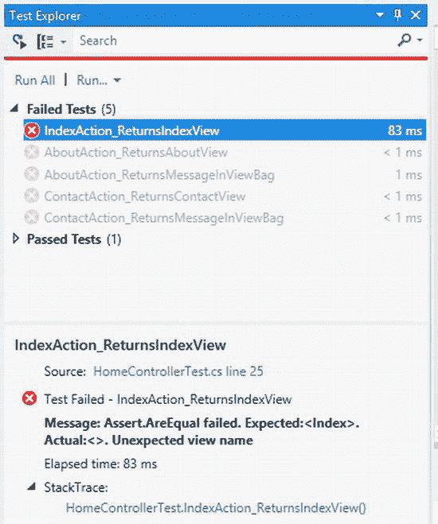
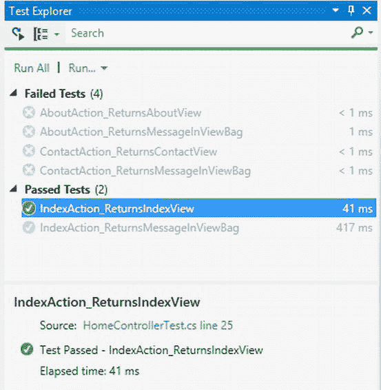
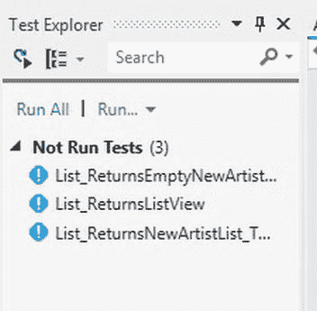
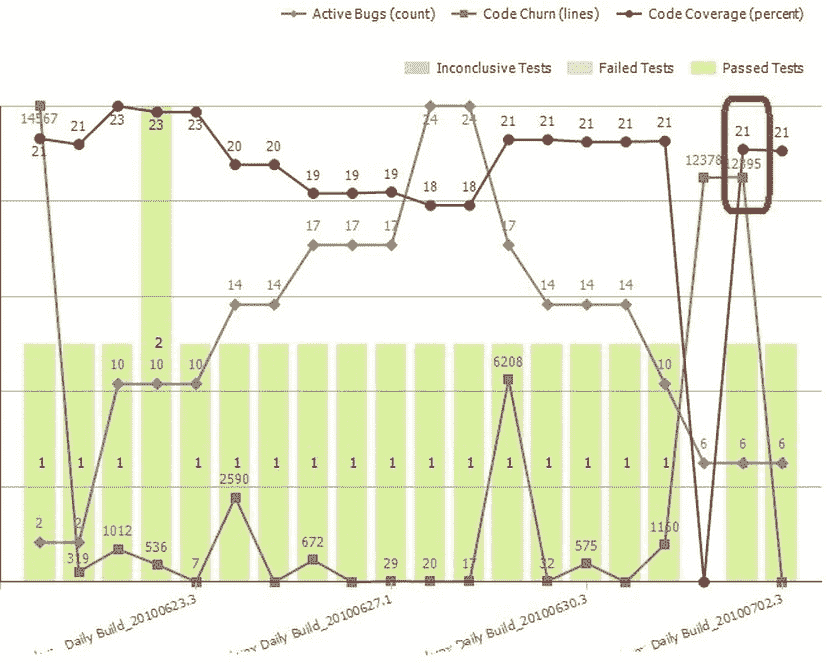

# 九、使用 ASP.NET MVC 4 的测试驱动开发

9-1.使用测试来提高你的 ASP.NET MVC 应用的质量

问题

您所在的组织没有遵循正式的应用测试策略。在大多数情况下，测试是由开发人员点击完成的应用并验证它是否按预期工作来执行的。在某些情况下，你可能有一个专门的 QA 为你做这个基本的点击测试。

不幸的是，你发现这个策略在几个层面上都失败了。首先，它依赖于一个完全手动的过程，这个过程非常耗时，并且可能只覆盖应用代码的一小部分。这个过程会让您的最终用户发现许多潜在的错误。第二，在大多数情况下，您是在开发周期的后期发现问题的，这使得诊断、纠正和部署问题更加困难和昂贵。最后，这种策略大大增加了实现后续版本的风险和复杂性，因为需要端到端的手工回归测试。

解决办法

进入生产代码的错误的成本很难衡量。如果一个 bug(或两者的结合)导致客户流失和销售额下降，这一点尤其正确。虽然不可能防止所有缺陷进入生产环境，但是您可以通过实施全面的质量控制策略来显著提高应用的质量。这个策略应该由单元测试、静态代码分析、同行代码评审、集成测试和性能测试组成，并以手工测试和客户反馈计划结束。

它是如何工作的

成功的质量保证(QA)策略应该集中于在开发过程中尽可能早地发现应用中的问题。有些人甚至认为 QA 应该从需求收集阶段开始，在这个阶段，考虑不周甚至矛盾的需求可以在提交给架构师之前得到纠正或消除。架构师和技术负责人是下一道防线。他们应该在设计过程中运行需求文档中定义的每个用例，并确保设计能够满足应用的需求。他们还负责确保应用以易于测试的方式设计。

假设业务分析师、架构师和技术领导已经正确地完成了他们的工作，那么应用质量的大部分责任就落在了开发人员的肩上。开发人员负责编写符合组织标准的高质量代码，编写尽可能多地覆盖代码的单元测试，并提醒技术负责人设计中可能存在的缺陷。开发人员还负责识别应用中可能引发异常的部分，并适当地捕捉和记录异常。

单元测试

一个*单元测试*是一个简单的程序，它允许你独立地测试代码的特定部分。单元测试应该是独立的、快速的，并且测试一个非常具体的测试用例。它们应该通过点击按钮来执行，而不需要测试人员的任何额外输入。它们还应该支持自动运行，或者单独运行，或者作为一组测试的一部分运行。这些自动化的单元测试可以作为每夜构建或者持续集成过程的一部分。如果处理得当，单元测试应该覆盖大部分生产代码。你的产品代码被单元测试覆盖的数量被称为它的*代码覆盖率* 。

单元测试并不是一个新概念。自从人们开发基于组件的应用以来，它就一直存在。在单元测试框架普及之前，大多数单元测试要么是作为命令行应用创建的，要么是作为简单的用户界面创建的。如今，大多数单元测试都是使用框架编写的，这些框架减少了每个测试需要编写的代码量，并提供了 API 来简化测试执行和结果聚合的自动化。这些框架通常与名为*测试运行器*的工具捆绑在一起，这些工具有助于自动化测试执行和检查测试结果。

流行的单元测试框架包括:

*   MS 测试(MS Test):作为微软 Visual Studio 质量工具框架一部分的测试框架。它包含在 Visual Studio 2012 的所有版本中。
*   NUnit 最初是作为基于 Java 的 JUnit 框架的一个端口创建的，现在已经变得非常流行，并且被大多数人使用。使用测试优先开发的. NET 开发人员。它还拥有丰富的附加组件生态系统，并兼容许多第三方测试运行程序。
*   *xUnit.net*:xUnit 由 NUnit 的原始开发者创建，是围绕测试驱动开发(TDD) 的概念专门设计的，并与几个测试运行器框架一起工作，包括 ReSharper、CodeRush 和 test-driven。
*   MbUnit:一个单元测试框架。NET 构建在 Gallio 自动化平台之上。

所有这些工具都提供了相似的核心功能，但在实现细节和风格上有所不同。如果你想了解更多关于这些工具的信息，你可以参考食谱 9-5，“选择一个单元测试框架”

Visual Studio 提供了一个集成的测试运行器，它可以与前面提到的许多框架一起使用。

代码覆盖率工具

代码覆盖工具是一个软件组件，它可以检查一组单元测试，并确定测试中有多少代码是由测试执行的。一些工具，如 Visual Studio 内置的工具，可以识别单元测试未覆盖的生产代码，并通过在编辑器中突出显示未覆盖的代码向开发人员提供可视化反馈。

Microsoft 在 Visual Studio Premium 和 Ultimate 版本中包含了一个集成的代码覆盖率工具。如果您使用的不是 Visual Studio 的这些顶级版本，有几个第三方代码覆盖率工具可供使用。NET 开发人员。它们包括 JetBrains dotCover、NCrunch 和 NCover。

集成测试

即使您使用单元测试覆盖了 100%的代码，当单元一起运行时，事情仍然很可能不会像预期的那样工作。此外，单元测试集中在你的类库和控制器动作上，并不覆盖你的视图中的代码。集成测试填补了这一空白。对于 ASP.NET MVC 应用，集成测试通常在 web 浏览器层执行。

解决这个问题的一种方法是让测试人员手动验证 web 应用中的每个屏幕都能正常工作。这是一个耗时的手动过程，通常由专门的 QA 团队在应用生命周期的后期执行。如果您想更频繁地执行集成测试，比如作为每夜构建过程的一部分，手工人工测试可能是不实际的。

另一种越来越流行的方法是自动化集成测试。对于 ASP.NET MVC 应用，这通常是浏览器自动化的形式。Visual Studio 高级版和终极版有一个内置的自动化浏览器测试工具。这就是所谓的编码 UI 测试。这个特性允许您记录在您的应用中执行的操作，同时选择您希望测试跟踪的页面元素。例如，如果在提交表单后，您希望页面元素指示数据已成功保存，那么您可以创建一个断言来测试该元素的值。一旦完成记录，您就可以生成可由 Visual Studio 的内置测试运行程序执行的代码。

如果您没有使用 Visual Studio Premium 或 Ultimate，有几个开源和商业的第三方替代产品。这些工具包括:

*   WatiN ( `http://watin.org`):一个受基于 Ruby 的 Watir 启发的测试自动化工具。像这个类别中的其他工具一样，它模拟了人类驾驶 web 浏览器。它支持基于 Ajax 的网站，甚至可以记录截图。使用 NuGet 可以很容易地将 WatiN 添加到测试项目中。它有一个相对简单且易于理解的语法。
*   轻量级测试自动化框架 ( `http://ltaf.codeplex.com`):一个专门为 ASP.NET 应用设计的开源自动化框架。它是由 ASP.NET QA 团队开发的。
*   *SeleniumHQ* ( `http://seleniumhq.org`):一套工具，可以跨许多平台自动化浏览器，并生成许多编程语言的脚本。作为. NET 开发人员，您可以使用 Selenium IDE，这是一个 Firefox 插件，允许您在 Firefox web 浏览器中记录测试场景。然后，您可以将 Selenium 2.0 WebDriver 用于。NET，它可以从 NuGet 获得，用于创建与 Microsoft test runner 兼容的测试。

静态代码分析

*静态代码分析工具*他们可以自动选择诸如安全漏洞、资源泄漏和不当使用`P/Invoke`等问题。它们可以确保您的代码与组织的命名约定相匹配，并且可以检测拼写错误的方法和变量名。

Visual Studio 2012 的所有版本(测试专业版除外)都包含一个内置的静态代码分析工具。可以在每个项目的属性页中配置代码分析。代码分析属性页允许您为每个生成自动运行代码分析。您可以通过从“生成”菜单中选择“运行代码分析”来运行代码分析。

Visual Studio 附带了许多预定义的规则集。默认情况下，每个项目都选择 Microsoft Managed Minimum Rules 规则集。使用默认规则集，违反规则会导致编译警告。每个警告都包含一个指向帮助页面的链接，该页面描述了规则并解释了如何更正问题。

如果愿意，您可以选择另一个规则集或选择几个预定义的规则集。您还可以创建自己的规则集和规则抑制列表，以抑制特定违规的警告消息。

除了 Visual Studio 中的静态代码分析工具之外，市场上还有许多其他工具，包括:

*   Parasoft dotTEST ( `parasoft.com`):除了对等代码审查和单元测试框架之外，还包括一个静态代码分析工具。
*   *HP Fortify 静态代码分析器(* `hpenterprisesecurity.com` *)* :一个专注于代码安全性方面的代码分析器。它比微软的内置代码分析工具更深入，更先进。它被许多美国银行、美国军方和世界顶级会计公司使用。
*   *Armorize CodeSecure(*`armorize.com`*)*:类似于惠普的 Fortify，CodeSecure 专注于被测代码的安全方面。

如果您计划使用静态代码分析，那么最好在项目的早期就开始使用它，并在整个开发过程中持续使用它。如果您将此留到项目结束时，您可能会对工具检测到的缺陷数量感到不愉快的惊讶。

同行代码审查

另一种已知的提高代码质量的技术是形式化的同行代码评审过程。在*同行代码评审*中，开发人员在应用发布给 QA 之前评审彼此的代码。代码审查可以帮助识别错误，可以帮助提高代码库的可读性和可维护性，并增加团队成员之间的协作。

众所周知，同行代码评审也能提高质量，因为它对开发人员有生理上的影响。当开发人员知道代码会被同行甚至是他们的上级审查和检查时，他们会花额外的时间来提高代码的质量。

另一方面，如果同行评审过程处理不当，会导致浪费时间，并引起开发人员之间的不满，他们在提出批评时可能不够尊重。

同行评审过程不一定需要任何专门的工具。然而，一些供应商已经创建了一个工具来帮助代码评审，记录评审的发生，并记录度量来评估它的有效性。这些工具中包括 Visual Studio Team Foundation Server(TFS)。使用 TFS 代码评审工具，您可以向一个或多个团队成员发送评审请求。如果团队成员接受了评审请求，他们可以对您的新代码和最后一个签入源代码控制的版本进行并行比较。审阅者可以对特定的代码块和整个文件进行注释，也可以提供审阅的总体注释。注释存储在 TFS 中，并且与给定的变更集相关联。在 TFS 中，变更集是一组源文件、工作项和其他工件，它们作为签入的一部分被修改。

如果您的团队不使用 TFS，市场上还有其他工具，包括:

*   SmartBear:一个集成了 TFS、Perforce、Git 和其他源代码控制产品的同行评审和协作工具。
*   *Atlassian Crucible* :基于 web 应用的代码评审产品，集成了 Subversion、Git、Mercurial、CVS 和 Perforce 源代码控制系统。

负载测试

*负载测试*或*压力测试*是观察应用在繁重的用户负载下表现如何的过程。许多在正常情况下运行良好的应用在负载下可能会失败。某些情况(如导致数据库死锁、过量磁盘 I/O 的代码，或者是资源泄漏的结果，如非托管线程或数据库连接)可能很难用其他方法检测到。

在负载测试中，通常使用浏览器插件记录一个或多个测试用例。该插件将记录页面导航、表单输入、查询字符串和从服务器发送的 cookies。然后，它使用这些信息生成一个脚本。测试人员可以修改这个脚本并参数化某些值，比如表单输入，这样在不同的模拟用户会话之间就会有变化。

例如，如果您希望模拟许多不同的用户登录到您的网站，您可以使用浏览器插件记录导航到您的网站，然后使用登录表单输入用户名和密码。然后，您可以修改生成的脚本，以便可以用文件或数据库表中的数据替换用户名和密码。

Visual Studio 旗舰版有一个内置的负载测试工具。它允许您创建一个或多个 web 性能测试，为单独的场景生成一个脚本。然后，您可以组合这些方案来创建负载测试。在负载测试中，您可以定义分配给每个场景的虚拟用户数量，选择要包括在模拟中的 web 浏览器，以及网络连接类型。

9-2.使用 MS 测试为控制器动作创建单元测试

问题

由于您是自动化单元测试的新手，您不确定如何创建测试，需要测试什么，或者如何知道测试何时成功。您希望从一个尽可能简单的例子开始，这样您就可以对创建单元测试的整个过程有一个基本的了解。

解决办法

假设项目最初是在没有任何单元测试的情况下创建的，那么您必须做的第一件事就是创建一个单元测试项目。在该项目中，您将为每个控制器创建一个测试类。对于控制器类中的每个动作，每个测试类都应该有一些测试。您应该测试以确保

1.  控制器正在返回正确的视图。
2.  传递给视图的数据内容与预期的一样。

它是如何工作的

在本练习中，我们将使用 ASP.NET MVC 互联网模板创建一个新项目，并为开箱即用的控制器创建单元测试。这是为了让您对创建测试的整个过程有一个基本的了解。这个例子故意避开了复杂的主题，这些主题将在本章的其他食谱中详细介绍。

向解决方案中添加单元测试项目

首先，我们将启动 Visual Studio 并使用以下步骤创建一个新项目:

1.  打开 Visual Studio 并从“文件”菜单中选择“新建项目”。
2.  在新建项目屏幕上，选择 ASP.NET MVC 4 Web 应用。将项目命名为 **Ch9。R2.Web** 和解决方案 **Ch9。R2** 。然后单击确定。
3.  在新 ASP.NET MVC 4 项目窗口中，选择基本模板。确保选择了 Razor 视图引擎。
4.  勾选“创建单元测试项目”复选框，并接受默认名称 Ch9.R2.Web.Tests。

探索测试项目

Visual Studio 创建的测试项目自动添加了几个资产。在项目的引用中，它添加了 20 多个程序集，包括您的 web 应用、Microsoft Visual Studio Quality Tools 单元测试框架、核心。NET 系统程序集，以及 ASP.NET MVC 框架使用的许多程序集。应该注意的是，对于这个示例，您实际上并不需要所有这些程序集。

它还创建了一个名为`Controllers`的文件夹，其中包含一个名为`HomeControllerTests`的类。

在`HomeControllerTests.cs`里面，你会发现三种测试方法。这是 web 应用项目和测试项目中的`HomeController`中的控制器动作之间的一对一关系。

我们知道这是一个包含测试方法的测试类，因为类声明用一个`TestClass`属性修饰，方法用`TestMethod`属性修饰。

在每个测试方法的主体中，有一个创建`HomeController`实例的 Arrange 部分，一个执行控制器动作的 Act 部分，以及一个使用测试框架断言命令来验证每个测试的 Assert 部分。

清单 9-1 显示了生成的测试类。

[***清单 9-1。***](#_list1) 测试由 Visual Studio 的互联网模板生成的代码

```cs
using Ch9.R2.Web.Controllers;
using Microsoft.VisualStudio.TestTools.UnitTesting;
using System.Web.Mvc;

namespace Ch9.R2.Web.Tests.Controllers
{
    [TestClass]
    public class HomeControllerTest
    {
        [TestMethod]
        public void Index()
        {
            // Arrange
            HomeController controller = new HomeController();

            // Act
            ViewResult result = controller.Index() as ViewResult;

            // Assert
            Assert.AreEqual("Modify this template to jump-start your ASP.NET MVC application.",
result.ViewBag.Message);
        }

        [TestMethod]
        public void About()
        {
            // Arrange
            HomeController controller = new HomeController();

            // Act
            ViewResult result = controller.About() as ViewResult;

            // Assert
            Assert.IsNotNull(result);
        }

        [TestMethod]
        public void Contact()
        {
            // Arrange
            HomeController controller = new HomeController();

            // Act
            ViewResult result = controller.Contact() as ViewResult;

            // Assert
            Assert.IsNotNull(result);
        }
    }
}
```

为 HomeController 运行生成的测试

Visual Studio 有几个功能，允许您查看给定项目的可用测试，执行测试，然后检查结果。为了了解这些特性是如何工作的，我们将构建解决方案，然后执行测试，如下所示:

1.  从 Visual Studio“生成”菜单中，选择“生成解决方案”。
2.  如果测试资源管理器不可见，通过选择 TestWindowsTest Explorer 打开它。
3.  测试资源管理器将显示分类在“不运行测试”下的三个测试。每个测试都有一个蓝色图标，表示它还没有运行。
4.  若要运行测试，请单击“测试资源管理器”窗格左上角的“全部运行”链接。
5.  这三项测试都应该通过。您应该会在每个测试名称旁边看到绿色的勾号图标。

增强 HomeController 的测试

`HomeController`由三个简单的动作组成。它们每个都向`ViewBag`添加数据并返回一个视图。生成的单元测试确保`Index`视图在其`ViewBag`的`Message`属性中包含正确的值，并且`About`和`Contact`动作不会返回空值`ViewResult`。

虽然从模板生成的代码为您提供了一个基本的入门基础，但它们并不是真正彻底的测试。首先，tests 方法的名称不太具有描述性。您无法知道在每个方法中测试的是什么条件。这些方法也过于简化，没有涵盖代码的关键方面，比如返回正确视图的操作。

 **提示**当编写单元测试时，建议您给测试方法起一个描述性的名字。这对于使您的测试易于维护和检查您的测试结果非常有帮助。当测试失败时，您应该能够很容易地判断出哪里出错了。测试应该非常具体。您应该为每个断言创建一个测试。您应该避免为每个测试方法添加一个以上的断言。更多信息见制作方法 9-4。

我们现在将重命名测试，并为每个操作添加一个额外的测试。当我们完成时，每个动作将有两个测试:一个验证它是否返回正确的视图，另一个验证`ViewBag`是否包含预期的值。为此，您需要执行以下操作:

1.  重命名索引测试方法**IndexAction _ ReturnsMessageInViewBag**。
2.  创建第二个名为**IndexAction _ returns index view**的测试方法。
3.  更改方法体以包含一个`Assert.Fail`调用。这允许代码编译，并提醒我们需要完成测试。
4.  为`HomeController`中的每个动作创建类似的测试方法。当你完成后，你的`HomeControllerTest`类应该看起来像[清单 9-2](#list2) 。

[***清单 9-2。***](#_list2) 空空如也

```cs
using Ch9.R2.Web.Controllers;
using Microsoft.VisualStudio.TestTools.UnitTesting;
using System.Web.Mvc;

namespace Ch9.R2.Web.Tests.Controllers
{
    [TestClass]
    public class HomeControllerTest
    {
        [TestMethod]
        public void IndexAction_ReturnsMessageInViewBag()
        {
            // Arrange
            HomeController controller = new HomeController();

            // Act
            ViewResult result = controller.Index() as ViewResult;

            // Assert
            Assert.AreEqual("Modify this template to jump-start your ASP.NET MVC application.",
                     result.ViewBag.Message);
        }

        [TestMethod]
        public void IndexAction_ReturnsIndexView()
        {
            Assert.Fail("Test not complete");
        }

        [TestMethod]
        public void AboutAction_ReturnsMessageInViewBag()
        {
            Assert.Fail("Test not complete");
        }

        [TestMethod]
        public void AboutAction_ReturnsAboutView()
        {
            Assert.Fail("Test not complete");
        }

        [TestMethod]
        public void ContactAction_ReturnsMessageInViewBag()
        {
            Assert.Fail("Test not complete");
        }

        [TestMethod]
        public void ContactAction_ReturnsContactView()
        {
            Assert.Fail("Test not complete");
        }
    }
}
```

使用 Shift+F6 键盘快捷键，或者在解决方案资源管理器中右击测试项目节点并选择“生成”,来生成测试项目。项目生成后，Visual Studio 应该会自动检测您的测试，然后在测试资源管理器窗口中显示它们。如果没有显示测试资源管理器，请从 Visual Studio 的主菜单中选择 TestWindowsTest Explorer 来打开它。测试资源管理器将停靠在左窗格中，它将显示到目前为止已经创建的所有测试。

单击测试资源管理器窗口顶部的“全部运行”链接。测试将在后台运行。测试完成后，每个测试旁边会出现一个错误图标，表示测试失败，因为该方法断言没有结果。

测试以确认操作返回正确的视图

我们现在将编辑测试，以便它们每个都验证`HomeController`中代码的特定方面。我们将从测试方法`IndexAction_ReturnsIndexView`开始。该方法将验证`HomeController`的`Index`动作返回正确的动作结果。我们将验证操作结果不为空，并且视图名为`Index`。

在大多数情况下，测试方法应该遵循排列、动作和断言(AAA)模式。在该方法的 Arrange 部分，我们通过定义变量来执行设置，这些变量包括我们希望传递给被测代码的输入和预期结果。在代码的 *Act* 部分，我们使用在 Arrange 部分定义的输入来执行测试中的代码。最后，我们通过将我们的实际结果与我们在代码的 Arrange 部分中定义的预期结果进行比较来断言我们的假设。

为了在`IndexAction_ReturnsIndexView`中实现这个模式，我们将首先创建一个名为`expected`的`string`变量，并将其设置为我们期望的视图名称`Index`。接下来，我们将创建一个`HomeController`的实例。这两行代码定义了我们的测试方法的 Arrange 部分。

接下来，通过执行`HomeController`的`Index`方法实现 Act 部分，并将动作结果写入名为`result`的变量。

单元测试中的最后一行代码使用`UnitTesting.Assert.AreEqual`方法将结果与我们的预期值进行比较。当使用`Assert.AreEqual`方法时，您应该总是将期望值作为第一个参数，将实际值作为第二个参数。最终的测试方法如[清单 9-3](#list3) 所示。

[***清单 9-3。***](#_list3)IndexAction _ ReturnsIndexView 测试方法

```cs
[TestMethod]
public void IndexAction_ReturnsIndexView()
{
  //Arrange
  string expected = "Index";
  var homeController = new HomeController();

  //Act
  var result = homeController.Index() as ViewResult;

  //Assert
  Assert.AreEqual(expected, result.ViewName,"Unexpected view name");
}
```

要重新运行测试，我们需要首先构建解决方案。然后，我们可以在 Test Explorer 窗口中右键单击`IndexAction_ReturnsIndexView`测试，并从弹出菜单中选择 Run Selected Tests。这将导致测试失败，如图 9-1 中的[所示。](#Fig1)



[图 9-1](#_Fig1) 。测试资源管理器中显示失败的测试

测试资源管理器为我们提供了失败测试的详细信息。首先，它向我们显示了`IndexAction_ReturnsIndexView`测试失败了，测试花了 83 毫秒才完成。如果单击失败的测试，测试资源管理器将提供有关测试失败原因的详细信息，包括文件名和行号、从测试断言创建的消息以及显示失败中涉及的每个方法的堆栈跟踪。单击堆栈跟踪中的链接将在 Visual Studio 中打开关联的代码。

现在我们知道我们的测试失败了，我们需要找出原因，然后对测试中的代码或者测试本身进行修正。首先应该引起您注意的是测试资源管理器中显示的断言消息:

```cs
Message:Assert.AreEqual failed. Expected:<Index>. Actual<>.
```

这告诉我们，我们的视图名是一个空字符串，而不是预期的“Index”值。这个测试结果可能有点令人惊讶，因为当我们运行应用时，我们可以看到返回了正确的视图。如果我们的代码可以工作，为什么我们的测试会失败？

不幸的是，这种不匹配是由于我们在`HomeController`中的`Index`动作在返回`ViewResult`时没有显式地指定视图名称。因此，`ViewName`属性永远不会被设置。当值为 null 或空时，MVC 框架将使用反射从动作名称中派生出视图名称。我们的测试没有遵循同样的逻辑，而是依赖于`ViewResult.ViewName`属性的值。因为这个值从未被设置过，所以我们的测试失败了。

那么我们应该如何解决这个问题呢？我们应该在单元测试中实现 ASP.NET MVC 惯例逻辑吗？如果你这样做了，那么你就违反了保持单元测试尽可能简单的规则。一个更好的解决方案是修改`HomeController`以便`Index`动作显式地设置视图的名称。

[清单 9-4](#list4) 显示了修改后的`Index`动作，将硬编码的视图名作为参数传递给`View`方法。

[***清单 9-4。***](#_list4) 索引动作修改为包含硬编码视图名称

```cs
public ActionResult Index()
{
   ViewBag.Message = "Modify this template to jump-start your ASP.NET MVC application.";

   return View("Index");
}
```

在构建解决方案并运行测试之后，测试应该会通过。结果如[图 9-2](#Fig2) 所示。



[图 9-2](#_Fig2) 。IndexAction_ReturnsIndexView 现在通过

我们需要完成的下一个测试是`AboutAction_ReturnsMessageInViewBag`。在这个测试中，我们将验证名为 Message 的对象是否存在，以及是否设置了正确的值。为了测试动态类型的`ViewBag`属性的值，您需要在您的测试项目中添加对`Microsoft.CSharp`程序集的引用——如果它不存在的话。

为此，请在解决方案资源管理器中右击“引用”文件夹，然后选择“添加引用”。确保选择了程序集和框架节点，然后使用搜索程序集文本框来搜索`Microsoft.CSharp`。找到后，双击选择它，然后单击确定。

接下来，修改`AboutAction_ReturnsMessageInViewBag`测试方法，使其类似于[清单 9-5](#list5) 。

[***清单 9-5。***](#_list5) 完成 IndexAction _ ReturnsMessageInViewBag 测试方法

```cs
[TestMethod]
public void AboutAction_ReturnsMessageInViewBag()
{
   //Arrange
   string expected = "Your app description page.";
   var homeController = new HomeController();

   //Act
   var result = homeController.About() as ViewResult;

   //Assert
   Assert.AreEqual(expected, result.ViewBag.Message, "ViewBag message incorrect");
}
```

从测试资源管理器中单击“全部运行”。您现在应该看到两个通过的测试。其余的测试将显示为失败，因为我们还没有实现它们。

继续修改`HomeController`中剩余的动作，以便它显式地将视图名称作为参数传递，然后使用在[清单 9-4](#list4) 和 [9-5](#list5) 中应用的相同技术完成剩余的测试。

当您完成这些之后，您应该能够运行所有的测试并成功通过。

9-3.理解测试驱动的开发策略

问题

您听说过很多关于测试优先和测试驱动开发的事情，但是不确定这种方法是否适合您。您想了解这些策略是关于什么的，以及如何将它们应用到 ASP.NET MVC 开发中。

解决办法

在大多数开发方法中，开发人员会编写大量代码，然后如果他们有时间，可能会编写一些单元测试。测试是开发过程的一部分，但是它通常集中在集成测试上，并且发生在开发生命周期的末尾。

另一方面，测试驱动开发是一种完全不同的思考代码的方式。测试不是事后的想法，它们是设计过程的前端和中心。在 TDD 中，您总是为您的代码创建测试。如果你发现很难孤立地测试你的代码，你可以重构它。项目的设计会发生变化，以便于测试。测试驱动您的应用设计和开发周期。在所有单元测试都通过之前，不要将代码签入源代码管理。

在*测试优先开发* (TFD) 方法论中，这个概念更进了一步。测试是在您编写产品代码之前编写的。虽然这种实践可能出现在 TDD 中，但并不总是如此。在 TFD 中，您在解决方案中创建的第一个代码是您的单元测试。您将首先编写足够的存根代码来允许程序编译。然后您运行您的测试，这将失败。接下来，实现您的生产代码。一旦您的所有测试都通过了，您就可以重构来提高您的产品代码和测试的可读性和可维护性。

它是如何工作的

在这一节中，我们将使用测试优先的方法创建一个简单的 ASP.NET 应用。我们将从创建一个新的 Visual Studio ASP.NET MVC 项目和一个相关的测试开始。然后，我们将使用我们正在测试的 MS 测试框架和控制器动作创建一个测试类。

要求

所有的软件应用都是从需求开始的。对已完成的项目有一个明确的理解是很重要的。对于这个例子，我们需要创建一个管理应用，允许我们查看和编辑已经在我们的音乐协作系统中注册的录音艺术家的信息。

该新应用应满足以下要求:

*   应用需要是安全的。如果未经授权的用户访问该系统界面，可能会造成极大的损害。
*   作为管理员，您需要查看新艺术家的列表，以确保所有新帐户都符合网站的服务条款。
*   作为管理员，您需要删除违反服务条款的帐户，以便从网站中删除攻击性材料和未经请求的广告。
*   作为管理员，您需要能够确认您确实想要删除选定的帐户，这样您就不会意外删除有效的帐户。
*   作为管理员，您应该看到一个确认屏幕，确认删除成功，以便您可以在删除失败时采取措施。

创造设计

根据要求，我们的首要任务是安全性。安全研究人员发现，最有效的设计遵循具有许多控制级别的分层方法。为此，我们的第一道防线将是创建一个单独的 web 应用来托管我们的管理界面。这允许应用的这一部分暴露在防火墙后面，不太可能暴露给黑客。作为我们部署的一部分，该应用将使用 Windows 身份验证，并通过访问控制列表(ACL)锁定。在生产中，站点还将使用 SSL 来保护传输中的数据，并验证它们是否连接到有效的服务器。

这种设计也将开发人员从编写代码来处理认证或授权的大部分责任中解放出来。

下一组需求大致描述了一组屏幕，这些屏幕将列出新艺术家，查看每个艺术家的详细信息，然后允许管理员删除艺术家记录并确认删除成功。

为了满足这个需求，我们创建了一个高级设计，它由一个新的 ASP.NET MVC 应用和一个我们称之为`ArtistAdminController`的控制器组成。该控制器将有四个动作:

*   `List`:显示新艺人列表。
*   `Review`:显示艺术家的详细信息，包含允许管理员删除记录或返回列表的按钮。
*   `DeleteConfirm`:显示删除确认消息，允许管理员确认或取消删除。
*   `DeleteCompleted`:显示删除确认消息的视图。
*   `DeleteFailed`:显示一个显示失败消息的视图，包括管理员可以用来帮助解决问题的错误细节。

创建项目

下面的步骤将使用空模板创建一个新的 ASP.NET MVC 项目，以及一个相关的单元测试项目。

1.  打开 Visual Studio。从 Visual Studio 的主菜单中选择 File  New  Project。
2.  选择 ASP.NET MVC 4 Web 应用模板，将项目命名为 **Ch9。R3.Web** ，选择一个合适的位置，将解决方案命名为 **Ch9。R3** 。单击确定。
3.  在新建 ASP.NET MVC 项目对话框中，选择空模板，确保 Razor 视图引擎被选中，并勾选“创建一个单元测试项目”复选框。保留测试项目名称的默认值，应该是 Ch9。R3.Web.Tests，以及测试框架，应该是 Visual Studio 单元测试。单击确定。

完成后，您应该有一个包含两个项目的解决方案:`Ch9.R2.Web`，它包含您的 web 应用，和`Ch9.R3.Web.Tests.`

展开测试项目上的“引用”节点。除了对 web 应用项目的引用之外，还添加了许多其他程序集。特别是有提到`Microsoft.VisualStudio.QualityTools.UnitTestFramework`。该程序集包含支持单元测试的类。

添加测试类

因为我们使用测试优先的方法，我们将创建的第一件事是我们的单元测试。如果您从未进行过这种风格的开发，那么当您还没有创建要测试的代码时就创建一个测试可能会显得很奇怪。

由于我们还没有编写代码，我们需要参考我们的设计来决定要编写哪些测试。根据设计，我们将有一个名为`ArtistAdminController`的控制器。因为我们将在 web 项目的`Controllers`文件夹中创建控制器，所以我们将在测试项目中重复这个结构。这将有助于保持我们的测试类有组织并且易于维护。

要在测试项目中创建`Controllers`文件夹，在解决方案资源管理器中右键单击它的项目节点，并选择 Add  New Folder。新文件夹将在解决方案资源管理器中以重命名模式显示。将文件夹命名为**控制器**，然后按回车键。

要向您的项目添加新的测试，右键单击`Controllers`文件夹，单击 add，然后单击 New Unit Test。一个名为 UnitTest1 的新单元测试将被添加到项目中。通过在解决方案资源管理器中右击测试并选择“重命名”来重命名测试。重命名类**artadmincontrollertests**并按回车键。当询问您是否要对代码元素“UnitTest1”的所有引用执行重命名时，请单击“是”。

在代码编辑器窗口中，你会看到名为`ArtistAdminControllerTests`的新测试类，如[清单 9-6](#list6) 所示。

[***清单 9-6。***](#_list6)Visual Studio 创建的新测试类

```cs
using System
using Microsoft.VisualStudio.TestTools.UnitTesting;

namespace Ch9.R2.Web.Tests.Controllers
{
    [TestClass]
    public class ArtistAdminControllerTests
    {
        [TestMethod]
        public void TestMethod1()
        {
        }
    }
}
```

注意，这个类已经用`TestClass`属性修饰过了。这告诉 MS Test 这个类包含测试。当您生成解决方案时，Visual Studio 的集成测试运行器将使用反射来检查包含此属性的每个类，以查找测试。找到的所有测试都将显示在测试资源管理器窗口中。

创建测试方法

既然我们已经创建了测试类，我们可以开始为每个测试用例添加测试方法。因为我们的设计声明我们将有五个动作，我们可以从删除`TestMethod1`开始，然后在类中为每个动作定义区域。这有助于保持测试的组织性。在每个区域内，我们将为每个用例创建一个测试。每个测试名称将以动作的名称开始。这将帮助我们识别测试资源管理器中的测试。

命名测试的另一种方法是为每个动作创建一个子类。两种命名方案都有效，但是子类化方法越来越受欢迎，因为它产生了更短、更易读的方法名，并且更容易重构。这种方法的缺点是，如果您使用的是 Visual Studio 的内置测试运行器，那么在测试资源管理器中区分测试方法可能会更加困难，因为没有显示类名。另一方面，如果您使用的是第三方测试运行程序，比如 NUnit 附带的测试运行程序，那么测试是基于类层次结构组织在一个树形视图中的。

修改后的测试类如[清单 9-7](#list7) 所示。

[***清单 9-7。***](#_list7)artadmincontrollertests 修改为包含每个提议的控制器动作的区域

```cs
namespace Ch9.R2.Web.Tests.Controllers
{
    [TestClass]
    public class ArtistAdminControllerTests
    {
        #region List Action

        #endregion

        #region ReviewAction

        #endregion

        #region DeleteConfirm

        #endregion

        #region DeleteCompleted

        #endregion

        #region DeleteFailed

        #endregion
    }
}
```

此时，您可以构建您的解决方案，以确保一切都能编译。

接下来，我们将添加测试方法，从我们的`List`动作的测试开始。首先，让我们考虑一下从数据库中检索条目列表时可能的执行路径。您将有您的主用例，其中返回一个或多个结果。您可能会遇到找不到结果的情况。除此之外，配置的更改可能会导致操作返回错误的操作结果。也有可能您将不正确的模型传递给视图。

我们将首先为主要用例创建一个测试。为此，在`List Action`区域中添加一个名为`List_ReturnsNewArtistList_ToListView`的测试方法。该方法必须是公共的，有一个 void 返回类型，并且用`TestMethod`属性修饰，如[清单 9-8](#list8) 所示。向您的测试方法添加注释来标记每个逻辑部分的开始也是一个很好的实践。每个测试应该有三个主要部分:

*   *Arrange* :设置您将在测试中使用的对象以及包含预期结果的变量。
*   *动作*:执行被测试的动作。
*   *断言*:验证结果。

[***清单 9-8。***](#_list8)List _ ReturnsNewArtistList _ tolist view 测试方法

```cs
#region List Action
[TestMethod]
public void ListAction_ReturnsNewArtistList_ToListView()
{
  //arrange

  //act

 //assert

}
#endregion
```

既然我们已经为第一个测试添加了一个 stub 方法，我们可以遵循这个模式，为其他执行路径和错误条件创建额外的测试。在`List Action`区域内添加以下测试:

*   这个测试验证我们正在返回正确的视图。
*   `List_ReturnsEmptyNewArtistList_ToListView`:这个测试验证我们发送了一个消息，表明没有找到数据。

请注意，每个测试都关注一个特定的用例。每个用例都会在我们的控制器操作中产生一个特定的执行路径。还要注意的是，测试的方法名非常冗长且具有描述性。

如果您生成项目，这三个测试将出现在测试资源管理器中。如果测试资源管理器不可见，您可以通过从 Visual Studio 的主菜单中单击 TestWindowsTest Explorer 来打开它。它看起来应该类似于[图 9-3](#Fig3) 。



[图 9-3](#_Fig3) 。编译测试项目后，测试将出现在测试资源管理器中

如果您单击测试资源管理器中的 Run All 链接，您会注意到您的所有测试都通过了。您的测试通过了，因为您还没有添加任何断言。这并不理想，因为如果代码以其当前的形式被签入到源代码控制中，另一个开发人员(甚至是您)可能不知道测试还没有完成，并且可能错误地认为这个功能是好的。为了避免这种情况，您不应该签入一个不完整的测试。

 **提示**如果您遇到需要在测试完成前签入代码的情况，您应该添加一个`Assert.Inconclusive`方法，并显示一条消息，表明测试仍在进行中。不确定的测试在测试资源管理器中显示为跳过的测试，并带有警告图标。或者，你可以使用`Assert.Fail`而不是`Assert.Inconclusive`。这将导致测试在测试资源管理器中显示为失败，这将使您不可能错过未完成的测试。

一般来说，你应该避免签入未完成的代码，而应该使用一种替代方法，比如 TFS 的搁置功能。这允许您将代码更新到服务器，而无需将其添加到源代码树中。

接下来，我们需要将代码添加到我们的测试方法中。对于`ReturnsListView`测试方法，我们将通过首先创建一个保存预期值的变量来安排测试。接下来，我们创建一个`ArtistAdminController`的实例。对于测试的 Act 部分，我们将执行控制器的 List 方法，并将动作的`ViewResult`写入一个局部变量。最后，在 assert 部分，我们将比较动作结果中的视图名称和我们的预期值。我们将使用`Assert.AreEqual`方法来验证匹配。产生的`ReturnsListView`如[清单 9-9](#list9) 所示。

[***清单 9-9。***](#_list9) 返回列表查看测试方法

```cs
[TestMethod]
public void ReturnsListView()
{
  //arrange
  string expected = "List";
  ArtistAdminController controller = new ArtistAdminController();

  //act
  var result = controller.List() as ViewResult;

  //assert
  Assert.AreEqual(expected, result.ViewName);
}
```

我们现在有了一个几乎完整的测试，但是还有一些问题。首先，代码不会被编译，因为`ArtistAdminController`类还没有被创建。编写这个测试也有些痛苦，因为我们没有 Visual Studio 的 IntelliSense 为我们提供方法名称建议。为了避免这个问题，您可以在 web 应用项目中为`ArtistAdminController`创建一个存根。

为此，在解决方案资源管理器中，右键单击`Controllers`文件夹并选择添加，然后选择控制器。命名控制器，并确保选择了空的 MVC 控制器模板，然后单击 Add。

`ArtistAdminController`将出现在代码编辑器窗口中。将索引操作重命名为`List`，然后保存文件。在`ArtistAdminControllerTest`文件中，为`Ch9.R2.Web.Controllers`添加一个 using 语句。构建您的解决方案。在测试浏览器中，右键单击`ReturnsListView`测试，然后选择 Run Selected Test。测试应该会失败。

返回到 web 应用项目中的`ArtistAdminController`。修改它，以便在调用控制器的`View`方法时,“List”作为视图名被显式传递。当 MVC 框架执行你的控制器时，如果`ViewName`属性为空，它将使用当前动作的名称来代替`ViewName`。因为您的测试代码没有这样做，您的测试将会失败，因为`ViewResult.ViewName`属性将会为空。

我们没有修改您的测试来模拟框架的行为，而是更改控制器，以便它显式地传递视图名称。这是我们测试应用的需求如何改变我们编写产品代码的方式的第一个例子。修改后的`List`动作如[清单 9-10](#list10) 所示。

[***清单 9-10。***](#_list10)ArtistAdminController 修改为通过 ReturnsListView 测试

```cs
//
// GET: /ArtistAdmin/List
public ActionResult List()
{
  return View ("List");
}
```

再次构建解决方案，运行`List_ReturnsListView`测试。这一次，测试应该会通过。你们中的一些人可能认为这个测试通过了，尽管我们还没有创建一个名为`List`的视图。虽然可以创建检查视图是否存在的单元测试，但通常不会这样做，因为这需要预编译视图，并且依赖于使用会损害单元测试独立性的子系统。测试这种行为的更好的方法是在集成测试中，例如可以使用 Visual Studio 的编码 UI 测试创建的集成测试。

现在我们的第一个测试通过了，我们可以把注意力转向`List_ReturnsNewArtistList_ToListView`测试了。为了通过这个测试，我们需要验证包含一组`Artist`对象的模型正在被传递给`ViewResult`。然而，在我们编写这个测试之前，我们需要解决一些问题。首先，我们需要定义什么是`Artist`对象。第二，我们需要想出一些方法来测试`List`动作的行为，当它从外部数据源获取数据而不实际调用外部数据源时。

在这个例子中，我们的项目将利用另一个代码库。从数据库中检索艺术家数据的类型和代码包含在一个外部程序集中。我们可以通过在 web 应用中添加对外部库的引用来解决第一个问题。然后，我们将需要创建一个间接层，当在测试中使用它时，允许用它的模拟实现替换外部依赖。

我们将通过为存储库创建一个接口来做到这一点。然后，我们将创建一个使用外部 API 实现该接口的类。我们的控制器类的构造函数将被修改，以便它接受我们的接口实例作为参数。在测试类中，我们将使用一个 mocking 框架来创建一个假类，它可以用来代替使用外部 API 与后端数据库通信的实现。

你可以看到，使用测试驱动的方法对我们的设计有很大的影响。

添加对共享库的引用

如前一节所述，我们将利用一个外部库，该库包含满足我们需求所需的类型。该库使用实体框架从 SQL Server 数据库中检索数据。

这个项目和相关的数据库包含在共享文件夹中，源代码可以从本书的网站下载。还包括一个数据库备份文件，您可以将该文件还原到 SQL Server 的本地运行实例。该数据库包含数千条记录，您可以使用这些记录来测试本书中的示例。

要在 web 应用项目中添加对外部库的引用:

1.  右键单击`Ch9.R3.Web`项目的项目节点，并选择 Add Reference。
2.  单击浏览按钮，打开文件浏览器对话框。导航至`<booksource code directory>\Shared\References`并选择`SharedAPI.dll`并点击添加。
3.  在引用管理器窗口中单击确定。
4.  打开`Web.config`文件并添加连接字符串部分，以匹配[清单 9-11](#list11) 中所示的示例。

[***清单 9-11。***](#_list11) 对 Web.config 进行了修改

```cs
<connectionStrings>
      <add
      name="DefaultConnection"
      connectionString="data source=.;Initial Catalog=Ch7SharedDatabase;Integrated Security=SSPI;"
      providerName="System.Data.SqlClient"
    />
      <add name="MobEntities"
connectionString="metadata=res://*/Mob.csdl|res://*/Mob.ssdl|res://*/Mob.msl;provider=System.Data.SqlClient;provider connection string=&quot;data source=.;initial catalog=Ch7SharedDatabase;integrated security=True;MultipleActiveResultSets=True;App=EntityFramework&quot;"
           providerName="System.Data.EntityClient" />
  </connectionStrings>
```

为存储库定义接口

我们现在将创建一个存储库接口，我们将使用它在外部库和控制器之间创建一个抽象层。理想情况下，您应该将存储库定义为库项目的一部分，以便它可以在几个项目中重用。然而，在这种情况下，让我们假设我们正在处理一个我们不能直接修改的黑盒第三方组件。由于我们的管理工具的需求相对简单，我们决定创建一个接口以及一个简单的存储库实现来满足我们的特定需求。我们将把这个存储库添加到我们的`Models`文件夹中。

要创建存储库接口，请执行以下操作:

1.  右键单击`Ch9.R3.Web`项目中的`Models`文件夹，选择 Add，然后选择 New Item。
2.  在“添加新项”窗口中，选择“接口”。在名称字段中，输入 **IArtistRepository.cs** ，然后点击添加。以大写字母 I 作为接口名称的前缀是一个由来已久的命名约定和最佳实践。
3.  Modify the `IArtistRepository.cs` file to look like [Listing 9-12](#list12).

    [***清单 9-12。***](#_list12)iartistrepository . cs

    ```cs
    using Ch7.SharedAPI;
    using System.Collections.Generic;

    namespace Ch9.R3.Web.Models
    {
        public interface IArtistRepository
        {
            IEnumerable<Artist> GetNewArtistList();
            Artist GetArtistDetails(int id);
            void DeleteArtist(int id);
        }
    }
    ```

修改 ArtistAdminController 以支持依赖注入

我们不想在单元测试中做的一件事是调用数据库。除了使我们的单元测试变得缓慢之外，对数据库的调用可能不会给我们一致的结果，而我们可以在测试中可靠地断言这些结果。当您的测试失败时，您将无法知道失败是由数据库中的数据更改引起的还是由您的逻辑问题引起的。

在[清单 9-9](#list9) 中，我们创建了一个简单的单元测试，它创建了我们控制器的一个实例，然后调用`List`方法。如果将`List`方法修改为调用一个后端数据库，测试也将尝试对后端进行同样的调用。

这个问题的解决方案是用实现相同接口的另一个组件替换控制器中用于调用数据库的组件。这个替换组件有时被称为存根，它将总是返回与您在测试的排列部分提供的结果相同的结果。为了实现这一点，控制器需要一种允许您注入存根的方式。这通常是通过创建一个允许其依赖项作为参数提供的构造函数来实现的。这种技术被称为*依赖注入*。

对于我们的`ArtistAdminController`，我们将通过创建一个新的构造函数来实现这一点，该构造函数将`IArtistRepository`的一个实例作为参数。清单 9-13 中的[显示了`ArtistAdminController`的更新版本。](#list13)

[***清单 9-13。***](#_list13)artisadmincontroller 修改了一个新的构造函数，它接受一个 IArtistRepository 实例作为参数

```cs
using Ch7.SharedAPI;
using Ch9.R3.Web.Models;
...

namespace Ch9.R3.Web.Controllers
{
    public class ArtistAdminController : Controller
    {
        IArtistRepository m_repository;

        public ArtistAdminController(IArtistRepository repository)
        {
            m_repository = repository;
        }

        //
        // GET: /ArtistAdmin/List
        public ActionResult List()
        {
            return View("List");
        }

    }
}
```

清单 9-13 中的第一个变化是添加了一个成员变量来保存存储库的一个实例。然后我们可以创建一个新的构造函数，它将一个`IArtistRepository`实例作为参数。现在，您应该能够构建 web 项目了。

实现 ReturnsNewArtistList _ tolist view 测试

创建了接口并修改了控制器以支持依赖注入后，您现在可以实现`ReturnsNewArtist_ToListView`测试了。您需要做的第一件事是将对 SharedAPI 程序集的引用添加到测试项目中。这是测试引用程序集中定义的类型所必需的。

接下来，您需要创建一个`IArtistRepository`接口的具体实现，您可以将它传递给控制器的构造函数。Visual Studio Ultimate edition 有一个简化这项任务的特性，它允许您生成一个假类，该类允许您插入只包含执行测试所需代码的存根实现。如果您没有 Visual Studio 旗舰版，有几个免费的插件可以执行相同的功能，如 Rhino Mocks 和 Moq。有关使用最小起订量的更多信息，请参考配方 9-8。

我们需要伪造的`IArtistRepository`接口驻留在`Ch9.R3.Web`集合中。要创建假货，请在解决方案资源管理器中展开测试项目的“引用”节点，然后右键单击`Ch9.R2.Web`程序集并选择“添加假货程序集”。过一会儿，一个名为`Ch9.R3.Web.Fakes`的新装配将被添加到引用列表中。此外，一个`Fakes`文件夹将被添加到项目中，它也包含对刚刚创建的`Fakes`程序集的引用。

我们现在可以实现`ReturnsNewArtistList_ToListView`测试，如清单 9-14 中的[所示。](#list14)

[***清单 9-14。***](#_list14) 使用假的艺术资料库返回艺术列表 _ 列表视图

```cs
[TestMethod]
public void ReturnsNewArtistList_ToListView()
{
   //arrange
   IArtistRepository mockArtistRepository =
       new Ch9.R3.Web.Models.Fakes.StubIArtistRepository
       {
           GetNewArtistList = () => { return new List<Artist>{
             new Artist{ CreateDate= new DateTime(2012,5,1),
                         UserName="TestUser1",
                         EmailAddress = "TestUser1@myonlineband.com",
                         ArtistId = 1,
                         WebSite = " http://cnn.com "
                         }
                        };}
        };
   ArtistAdminController controller = new ArtistAdminController(mockArtistRepository);

   //act
   var result = controller.List() as ViewResult;

   //assert
   var model = (List<Artist>) result.ViewData.Model;
   CollectionAssert.AllItemsAreInstancesOfType(model, typeof(Artist));
}
```

在`ReturnNewArtistList_ToListView`测试的排列部分，我们通过使用 Fakes 提供的一个名为`StubIArtistRepository`的实现创建了一个`IArtistRepository`的实例。Fakes 框架允许我们注入自己在`IArtistRepository`中定义的`GetNewArtistList`方法的实现。对于我们的测试，我们正在验证当`GetNewArtistList`返回一个或多个记录时的行为。我们通过在 Fakes 实现中返回一个艺术家记录来模拟这种情况。

接下来，我们创建一个`ArtistAdminController`的实例，并将`mockArtistRepository`作为构造函数参数传入。

在测试的 Act 部分，我们调用了`List`动作，并试图将结果作为`ViewResult`保存到结果变量中。

在断言部分，我们使用`CollectionAssert.AllItemsAreInstancesOfType`方法验证传递给`ViewData`的模型包含了一个`Artist`对象的集合。

为了编译代码，您还需要修改`ReturnsListView`测试，这样它也可以向承包商传递一个模拟。因为我们只是验证`ReturnsListView`方法是否返回了正确的视图，所以对存根的需求是最小的。测试的更新版本显示在[清单 9-15](#list15) 中。

[***清单 9-15。***](#_list15) ReturnListView 更新为返回嘲笑 IArtistInterface

```cs
[TestMethod]
public void ReturnsListView()
{
  //arrange
  IArtistRepositoryfakeArtistRepository =
                    new Ch9.R2.Web.Models.Fakes.StubIArtistRepository { };
  string expected = "List";
  ArtistAdminController controller = new ArtistAdminController(fakeArtistRepository);

  //act
  var result = controller.List() as ViewResult;

  //assert
  Assert.AreEqual(expected, result.ViewName);

}
```

请生成解决方案，然后再次尝试运行测试。`ReturnsNewArtistList_ToListView`现在失败了，因为在控制器动作中没有设置模型。

修改列表操作以通过 ReturnsNewArtistList _ tolist view 测试

`ReturnsNewArtistList_ToListView`测试失败。这是因为它期望一个包含一组`Artist`对象的模型，但是这个模型是`null`。

要纠正这一点，修改`List`动作，如[清单 9-16](#list16) 所示，其中`List`动作现在调用存储库并返回一个`List<Artist>`集合。

[***清单 9-16。***](#_list16) 列表动作使用了 IArtistRepository

```cs
public ActionResult List()
{
   List<Artist> artists = m_repository.GetNewArtistList() as List<Artist>;
   return View("List", artists);
}
```

如果您构建解决方案并再次运行测试，您会发现`ReturnsNewArtistList_ToListView`测试现在通过了。这里我们证明了价值单元测试是好的。我们已经通过添加正确的模型重构了代码，但是我们的原始测试仍然通过了——这表明我们对项目的更改似乎没有破坏东西。

实现 ReturnsEmptyNewArtistList _ tolist view 测试

我们将为 List 动作实现的最后一个测试是`ReturnsEmptyNewArtistList_ToListView`测试。在这个测试用例中，我们期望当列表中没有找到项目时，页面会发送一条消息通知管理员没有找到新的艺术家。为了实现这个测试，我们将再次使用 Fakes 程序集来创建一个存根来为我们的`IArtistRepository`传递。对于这个测试，我们将创建一个返回空列表的`GetNewArtist`方法版本。`ReturnsEmptyNewArtistList_ToListView`测试如[清单 9-17](#list17) 所示。

[***清单 9-17。***](#_list17)ReturnsEmptyNewArtistList _ tolist view 测试

```cs
[TestMethod]
 public void ReturnsEmptyNewArtistList_ToListView()
 {
    //arrange
    string expectedViewBagMessage="No New Artists Found";
    IArtistRepository fakeArtistRepository =
        new Ch9.R2.Web.Models.Fakes.StubIArtistRepository
    {
         GetNewArtistList = () =>
         {
           return new List<Artist>();
         }
   };
    ArtistAdminController controller = new ArtistAdminController(fakeArtistRepository);

    //act
    var result = controller.List() as  ViewResult;

    //assert
    Assert.AreEqual(expectedViewBagMessage, result.ViewBag.Message)
   }
}
```

如果您构建您的解决方案并运行测试，您会注意到`ReturnsEmptyNewArtistList_ToListView`现在像预期的那样失败了。您现在必须修改`List`动作，以便它实现正确的行为。

修改列表操作以通过修改列表操作以通过 ReturnsNewArtistList _ tolist view 测试

如果你一直关注这个例子，你应该会看到一个模式的出现。我们编写测试，测试失败，我们调整产品代码，使其通过测试，然后继续下一个测试。为了让`ReturnsNewArtistList_ToListView`通过，我们必须向列表控制器添加一些逻辑来检查从存储库返回的列表是否包含任何记录。如果没有找到记录，我们将在`ViewBag`中传递一条消息。更新后的列表动作如[列表 9-18](#list18) 所示。

[***清单 9-18。***](#_list18) 列表视图修改通过 ReturnsNewArtistList _ ToListView 测试

```cs
public ActionResult List()
{
   List<Artist> artists = m_repository.GetNewArtistList() as List<Artist>;
   if (artists == null || artists.Count == 0)
   {
      ViewBag.Message = "No New Artists Found";
   }
   return View("List", artists);
}
```

如果我们构建了解决方案并运行了测试，现在一切都应该通过了。我们看到我们更改的代码解决了问题，并且没有导致回归。你可以看到，当我们在此基础上进行构建时，尽管工作量很大，但随着你的项目变得越来越复杂，这项工作将会带来越来越多的回报。另一件要考虑的事情是我们在调试器上花费的时间会减少多少。

我们现在可以为列表视图创建一个框架结构，并验证它是否可以在浏览器中工作。

添加列表视图

要创建`List`视图，在代码编辑器的`ArtistAdminController`中，右键单击列表动作并选择 Add View。确保选择了 Razor 视图引擎，并且未选中“创建强类型视图”复选框，然后单击“添加”。

一个名为`ArtistAdmin`的新文件夹将被添加到 web 应用项目的`Views`文件夹下。一个名为`List.cshtml`的新视图将被添加到文件夹中。修改视图，使其包含一些显示列表的基本标记，如[清单 9-19](#list19) 所示。

[***清单 9-19。***](#_list19) 列表视图

```cs
@model List<Ch7.SharedAPI.Artist>
@{
    ViewBag.Title = "New Artists";
}

<h2>Here is a list of new Artists</h2>
@ViewBag.Message
<table>
    <thead>
        <tr>
            <th>User Name</th>
            <th>Email</th>
            <th>Website</th>
            <th>Create Date</th>
      </tr>
    </thead>

@foreach (var item in Model)
{
    <tr>
        <td>@item.UserName</td>
        <td>@item.EmailAddress</td>
        <td>@item.WebSite</td>
        <td>@item.CreateDate</td>
    </tr>

}
</table>
```

首先，添加`@model List<Ch7.SharedAPI.Artist>`使列表视图具有强类型。然后我们添加一些基本的标记，在一个表格中显示艺术家的列表。

如果我们运行项目并导航到`/ArtistAdmin/List`，我们将看到以下错误消息:

```cs
No parameterless constructor defined for this object.
```

我们看到这个错误的原因是因为当我们将构造函数添加到控制器时，我们覆盖了 MVC 框架所需的默认构造函数。您现在需要修改`ArtistAdmin`控制器来包含一个无参数的构造函数。您还需要传入一个具体的存储库实例。为此，您需要创建一个实现`IArtistRepository`的类。然后，您需要将无参数的构造函数添加到`ArtistAdmin`控制器中，并确保正确的实现被传入。

实现 IArtistRepository 接口

接下来，我们将创建一个类来实现我们将在控制器内部使用的接口。创建存储库接口:

1.  右键单击`Ch9.R3.Web`项目中的 Models 文件夹，选择 Add，然后选择 New Class。
2.  在“添加新项”窗口中，确认选择了“类”。在名称字段中，输入**sharedapiartistrepository . cs**，然后单击添加。
3.  Modify the `SharedAPIArtistRepository.cs` so that it implements both `IArtistRepository` and `IDisposable`. Implementing `IDisposable` allows us to dispose of our Entity Framework model when the EF version of the repository is used in the controller. When you are done, the file should look like [Listing 9-20](#list20).

    [***清单 9-20。***](#_list20)sharedapiartistrepository . cs

    ```cs
    public class SharedAPIArtistRepository : IArtistRepository, IDisposable
    {
            private MobEntities m_context;

            public void Dispose()
            {
                if (m_context != null)
                {
                    m_context.Dispose();
                }
            }

            public SharedAPIArtistRepository()
            {
                m_context = new MobEntities();
            }

            public IEnumerable<Artist> GetNewArtistList()
            {
                //last 20 Artist records created
                var newArtists = (from m in m_context.Artists
                                  orderby m.CreateDate descending
                                  select m).Take(20);
                return newArtists.ToList<Artist>();
            }

            public Artist GetArtistDetails(int id)
            {
                var artist = m_context.Artists.Find(id);
                return artist;
            }

            public void DeleteArtist(int id)
            {
                m_context.DeleteArtist(id);
            }
        }
    ```

清单 9-20 中的库创建了一个私有成员变量来保存用于与数据库对话的 DBContext 对象。上下文在存储库的构造函数中初始化，并在存储库的 Dispose 方法中处理。`GetNewArtistList`方法使用 LINQ 查询来检索根据`CreateDate`属性添加的最后 20 条记录。剩下的方法是 API 公开的功能的直接包装器。

向 ArtistAdminController 添加无参数构造函数

我们需要执行的最后一步是将无参数构造函数添加到`ArtistAdminController`中。这一增加如清单 9-21 所示。

[***清单 9-21。***](#_list21) 更新后的 ArtistAdminController

```cs
public class ArtistAdminController : Controller
    {
        IArtistRepository m_repository;
        public ArtistAdminController() : this(new SharedAPIArtistRepository()) { }
        public ArtistAdminController(IArtistRepository repository)
        {
            m_repository = repository;
        }

        //
        // GET: /ArtistAdmin/List
        public ActionResult List()
        {
            List<Artist> artists = m_repository.GetNewArtistList() as List<Artist>;
            if (artists == null || artists.Count == 0)
            {
                ViewBag.Message = "No New Artists Found";
            }
            return View("List", artists);
        }

    }
```

在做出这一更改后，再次尝试浏览`ArtistAdmin/List`以验证页面是否按预期工作。

作为一个练习，您应该尝试按照“它是如何工作的”一节开始时指定的要求来完成这个应用。如果您遇到困难，可以在本书网站上的可下载资料中看到完整的源代码。

9-4.为单元测试定义命名约定

问题

对于您参与的最近几个项目，开发人员对于如何命名他们的测试项目、测试类和测试方法并不一致。这通常会导致混乱，并使单元测试更难维护。您希望创建一个标准命名约定，以便在所有项目中使用。您希望遵循一个众所周知的最佳命名惯例。

解决办法

虽然在这个行业中可能会有一些变化，但是大多数执行测试驱动开发(TDD)或者类似方法的公司都采用了类似的方法来命名他们的测试。这些约定通常在许多语言和测试框架中使用。如果处理得当，它将使理解每个测试做什么以及它与什么代码相关联变得容易。

它是如何工作的

在命名测试项目时，您应该使用三种惯例。这些包括测试项目、测试类和测试方法的命名约定。

命名您的测试项目

在项目级别，测试项目名称应该遵循`[project name].Tests`的模式。例如，如果您有一个名为`SomeNamespace.SomeProject.Web`的项目，那么测试项目应该被命名为`SomeNamespace.SomeProject.Web.Tests`。您应该为解决方案中的每个项目创建一个测试项目。

这应该清楚地表明测试项目`SomeNamespace.SomeProject.Web.Tests`包含了对`SomeNamespace.SomeProject.Web`的测试——甚至是对项目团队的新人。

命名您的测试类

在测试项目中，您应该为您希望测试的生产代码项目中的每个类创建一个类。测试类名应该遵循模式`[class name]Tests`。例如，如果您有一个名为`MyClass`的类，您将创建一个名为`MyClassTests`的测试类。

命名您的测试方法

对于方法来说，测试方法的名字应该由三个不同的部分组成，包括被测试方法的名字，你正在测试的状态或者条件，以及预期的结果。

例如，假设您有一个计算器应用。计算器有一个`Add`方法，它将任意数量的`float`值作为参数，并返回一个 double 值。该方法有三个业务规则，这些规则决定了它将如何响应诸如作为参数传递的负值、作为参数传递的 NaN 值以及不传递参数等条件。

当负数作为参数传递时，该方法将抛出一个`InvalidOperationException`。为了测试这个条件，我们将创建一个名为`Add_NegativeValue_ThrowsInvalidOperationException`的测试方法。下划线用于分隔方法名的三个部分。`Add`是被测代码的名字(CUT)，`NegativeValue`是我们正在测试的状态或条件，`ThrowsInvalidOperationException`是预期的结果。

在不测试任何特定条件的情况下，比如为总是返回相同的`ViewResult`的控制器动作编写测试时，可以省略名称中的状态或条件部分。例如，如果我们有一个名为`About`的控制器动作，它总是为`About`视图返回一个`ViewResult`，您可以将其命名为`About_ReturnsAbout`。这个方法名的问题是，当我们描述`About`控制器动作或`About`视图时，它是不清楚的。为了避免这种混淆，您应该明确指出每一个。比如`AboutAction_ReturnsAboutView`。

另一种受使用 NUnit 的开发人员欢迎的方法是在测试类中为每个被测试的方法创建子类。如果使用此方法，则不需要在测试方法名称中包含方法名称。不幸的是，这个方法在 Visual Studio 的 test runner 中工作得不是很好，因为它不显示类名。它对 NUnit 工作得很好，因为它的测试运行器不仅显示类名，还使用树视图显示测试方法，这允许您扩展和联系每个子类。有关使用 NUnit 创建测试的更多信息，请参见配方 9-7。

9-5.选择单元测试框架

问题

您的团队已经决定开始使用测试驱动的开发方法，但是您不确定哪个单元测试框架适合您。您知道 Visual Studio 中有一个内置的单元测试框架，但您不确定是否应该使用它或转移到第三方框架，如 xUnit.net、n unit 或 MbUnit。

解决办法

Visual Studio 2012 有一个内置的单元测试框架(MS Test)和一个测试运行器，它提供了一个启动测试和查看结果的用户界面。这为您提供了开箱即用所需的一切。然而，许多团队发现微软的框架不如第三方的框架，如 NUnit 和 xUnit.net。例如，由于 MS Test 的许多功能是作为 Visual Studio 的一部分紧密耦合和许可的，因此它要求您在构建服务器上安装 Visual Studio。

幸运的是，在 Visual Studio 2012 中，微软已经使使用其他框架代替 MS Test 变得更容易，同时保持了能够从 ide 内部执行一切的优势。

它是如何工作的

在决定选择单元测试框架之前，您需要知道哪些框架是可用的，以及它们的主要优缺点。在本节中，我们将简要回顾微软的 MS Test、NUnit、xUnit.net 和 MbUnit。我们将从语法的简单性、功能、社区支持、文档和工具方面对它们进行比较。

MS 测试

MS Test 是 Visual Studio 2012 附带的单元测试框架。MS Test 的主要优点是它与 IDE 完全集成，并且在您安装 IDE 时已经安装并准备就绪。

句法

MS Test 的语法使用起来相对简单，但是有些人会认为不如竞争框架中提供的那么优雅。测试类和方法使用许多属性类来标记。测试结果通过使用断言方法向测试运行程序注册。清单 9-22 中显示了一个 MS 测试语法的示例。该示例展示了许多实际的测试属性。一些属性，比如`TestInitializeAttribute`和`ClassInitializeAttribute`，允许在测试执行之前运行初始化代码。同样，`ClassCleanupAttributes`和`TestCleanupAttribute`允许代码清理资源。

其他属性类可以用来将元数据应用到测试方法中，如清单 9-22 中的`IndexAction_Is5PM_June_ReturnsDayModel_SoundEffectSummerDay`测试所示。元数据，例如测试的描述、与测试相关的 TFS 区域和迭代、测试所有者以及测试类别，都可以应用到测试中。Visual Studio 用户界面目前不使用这些属性，但是一些团队已经在自定义构建脚本中使用了这些属性，这些脚本可以在 TFS 中自动创建工作项，并使用属性值将它们分配给开发人员。

[***清单 9-22。***](#_list22) MS 测试语法示例

```cs
[TestClass]
public class MSTestControllerTests
{

  [ClassInitialize]
  public static void RunOnceBeforeAnyofTheTestsInThisClass(TestContext context)
  {
 // this runs once when the class is instantiated before any tests are run.
  }

  [TestInitialize]
  public void RunBeforeAllTestsInClass)
  {
 // run before the test to allocate and configure resources
        // needed. Will be run for each test in the class.
  }

  [TestMethod]
  [CssProjectStructure("UserExperience")]
  [CssIteration("Iteration 1")]
  [Description(@"Tests to verify that when it is 5PM in June that the
            the Summerday sound effect wil be played")]
  [Owner("John")]
  [TestCategory("Controller Tests")]
  public void IndexAction_Is5PM_June_ReturnsDayModel_SoundEffectSummerDay()
  {
    //arrange
    string expected = "SummerDay";
    MSTestController controller = new MSTestController(new DateTime(2012,6,1,17,0,0));
    //act
    var result = controller.Index() as ViewResult;
    var model = result.ViewData.Model as DayModel;
    Assert.IsNotNull(model, "Incorrect model, expected DayModel");
    Assert.AreEqual(expected, model.SoundEffect);
   }

  [TestMethod]
  [ExpectedException(typeof(ApplicationException))]
  public void IndexAction_Is3PM_Feb292016_ThrowsApplicationException()
  {
    //arrage
    MSTestController controller = new MSTestController(new DateTime(2016,2,29,17,0,0));
    //act
    controller.Index();
   }

  [TestMethod]
  [Ignore]
  public void IndexAction_Is3PM_June_ReturnsDayModel_SceenSummerDay()
  {
    //arrange
    MSTestController controller = new MSTestController(new DateTime(2012, 6, 1, 14, 0, 0));
    string expected = "SummerDay";
    //act
    var result = controller.Index() as ViewResult;
    var model = result.ViewData.Model as DayModel;
    Assert.IsNotNull(model, "Incorrect model, expected DayModel");
    Assert.AreEqual(expected, model.SceneName);
  }

[TestCleanup]
 public void RunsAfterEachTestClassasCompleted()
 {
   //runs afer each test in a test class.
   // can be used to clean up resources from the test
 }

 [ClassCleanup]
 public static void  RunAfterAllTestsInTestClassHaveCompleted()
 {
    //use to clean up any resources left over from the test
 }

}
```

文档和社区支持

MS Test 有几个官方的文档来源，包括 Visual Studio 的集成帮助、MSDN 和许多微软博客。还有相当多的社区内容，包括个人博客和论坛回复。有关 MS Test 的其他信息可以在许多书籍中找到，包括由约阿希姆·罗斯伯格和马蒂亚斯·奥劳森(Apress，2012)编写的 *Pro 应用生命周期管理与 Visual Studio 2012* 第二版和 *Pro。Stephen Ritchie 的 NET 最佳实践*(a press，2011)。

MS Test 作为 Visual Studio 的一部分，以及一个大型开发人员社区，受到 Microsoft 的完全支持。

工具作业

MS 测试的工具是 Visual Studio 和 Visual Studio Team Foundation Server(TFS)。当 MS Test 与 TFS 和 MSBUILD 一起使用时，单元测试可以集成到每夜的构建中，TFS 可以生成显示构建质量统计的报告，如图 9-4 所示。



[图 9-4](#_Fig4) 。构建质量报告显示来自单元测试的统计数据

N 单位

NUnit 是 Microsoft .NET 最流行的单元测试框架之一。它最初是作为 JUnit Java 单元测试框架的一个端口创建的。在框架的版本 2 中，它被重写以更好地匹配测试。NET 应用。

句法

NUnit 语法相对简单。像 MS Test 一样，测试类和方法使用许多属性类来标记。清单 9-23 中显示了一个 NUnit 语法的例子。该示例展示了许多实际的测试属性。一些属性，比如`Setup`和`TestFixtureSetuUp`，允许在测试执行之前运行初始化代码。同样，`TearDown`和`TestFixtureTearDown`允许代码清理资源。

[***清单 9-23。***](#_list23) NUnit 语法举例

```cs
using System;
using System.Collections.Generic;
using System.Linq;
using System.Text;
using System.Threading.Tasks;
using NUnit.Framework;
using Ch9.R7.Web.Controllers;
using System.Web.Mvc;
using Ch9.R7.Web.Models;

namespace Ch9.R7.Web.Tests.Controllers
{
    [TestFixture]
    [Category("SampleTestClass")]
    public class NUnitTestControllerTests
    {

        [TestFixtureSetUp]
        public void Init(TestContext context)
        {
            // this runs once when the class is instantiated before any tests are run.
        }

        [SetUp]
        public void RunBeforeAllTestsInClassAssembly()
        {
            // run before the test to allocate and configure resources
            // needed. Will be run for each test in the class.add code that will run before any
// code in the entire
            //test assembly is executed
        }

        [Test, Explicit]
        public void IgnoredUnlessExplicitlySelectedFoRunning()
        {
            //ignored unless it is explicitly selected for running
            //If encountered in while running tests
            //the test runner will treats  as ignored.
            //The progress bar turns yellow  test listed as not run
        }

        [Test]
        [Platform(Exclude = "Mono,Unix,Linux")]
        public void DontRunIfOnUnix()
        {
            //specifies to include or exclude on certian platforms
            // Case insensitive, multiple values seperated by commas
            // full list of platforms provided here
            // http://www.nunit.org/index.php?p=platform&r=2.2.10
        }

        [Test]
        [Category("UserExperience")]
        [Description(@"Tests to verify that when it is 5PM in June that the
            the Summerday sound effect wil be played")]
        public void IndexAction_Is5PM_June_ReturnsDayModel_SoundEffectSummerDay()
        {
            //arrange
            string expected = "SummerDay";
            NUnitTestController controller = new NUnitTestController(new DateTime(2012, 6, 1, 17, 0, 0));
            //act
            var result = controller.Index() as ViewResult;
            var model = result.ViewData.Model as Da yModel;
            Assert.IsNotNull(model, "Incorrect model, expected DayModel");
            Assert.AreEqual(expected, model.SoundEffect);
        }

        [Test]
        [ExpectedException(typeof(ApplicationException))]
        public void IndexAction_Is3PM_Feb292016_ThrowsApplicationException()
        {
            //arrage
            NUnitTestController controller = new NUnitTestController(new DateTime(2016, 2, 29, 17, 0, 0));
            //act
            controller.Index();
        }

        [Test]
        [Ignore]
        public void IndexAction_Is3PM_June_ReturnsDayModel_SceenSummerDay()
        {
            //arrange
            NUnitTestController controller = new NUnitTestController(new DateTime(2012, 6, 1, 14, 0, 0));
            string expected = "SummerDay";
            //act
            var result = controller.Index() as ViewResult;
            var model = result.ViewData.Model as DayModel;
            Assert.IsNotNull(model, "Incorrect model, expected DayModel");
            Assert.AreEqual(expected, model.SceneName);
        }

        [TearDown]
        public void RunsAfterEachTestClassasCompleted()
        {
            //runs afer each test in a test class.
            // can be used to clean up resources from the test
        }

        [TestFixtureTearDown]
        public static void RunAfterAllTestsInTestClassHaveCompleted()
        {
            //use to clean up any resourses left over from the test
        }

    }

}
```

文档和社区支持

NUnit 拥有强大的社区支持和简单但全面的文档。官方文档可在`www.nunit.org/index.php?p=docHome&r=2.2.10`获得。有成千上万的博客页面、论坛和其他资源专门用于 NUnit。

工具作业

NUnit 附带了一个测试运行器 GUI 和一个命令行实用程序。除了标准下载选项之外，NUnit 还提供 NuGet 下载。

通过 Visual Studio 扩展管理器中的第三方外接程序，可以实现与 Visual Studio 的完全集成。

9-6.下载和安装 NUnit

问题

你对 NUnit 有很多积极的看法，你想把它作为你的单元测试框架。您想知道如何下载它并将其配置为与 Visual Studio 一起工作。

解决办法

NUnit 是免费的，可以在`http://nunit.org`下载。下载 MSI 软件包后，您可以按照安装向导进行安装。然后，您可以使用 Visual Studio 扩展管理器下载 Visual Studio 扩展，以在 Visual Studio 中提供完全集成的 NUnit 支持。

它是如何工作的

您需要做的第一件事是从 NUnit 网站下载最新的安装包。您可以通过以下方式做到这一点:

1.  前往`http://nunit.org`
2.  单击下载链接。
3.  在下载页面上，选择“win”下载包。
4.  单击该链接会将 MSI 软件包下载到您的计算机上。

运行 NUnit 安装程序

下载完成后，双击 NUnit.msi 包启动安装程序。在 NUnit 安装欢迎屏幕上，单击下一步。在最终用户许可协议屏幕上，选中“我接受条款…”复选框(当然是在阅读协议之后)。

在选择安装类型屏幕上，选择典型。这将安装除 NUnit 和 PNUnit Runner 的单元测试之外的所有东西，pn Unit Runner 允许您运行并行分布式测试。

在“准备安装”屏幕上，单击“安装”按钮开始安装。如果使用帐户控制出现提示，请单击是。

在安装向导的“已完成”页面上，单击“完成”关闭安装程序窗口。

向 Visual Studio 的测试资源管理器添加对 NUnit 的支持

虽然许多开发人员更喜欢使用 NUnit 的 UI，但是如果您希望 NUnit 能够与 Visual Studio 的测试资源管理器一起工作，您可以下载并安装 NUnit 测试适配器，该适配器在 Visual Studio 扩展和更新管理器中提供。

要安装 NUnit 测试适配器，请单击 Visual Studio 主菜单中的“工具”,然后单击“扩展和更新”。单击扩展和更新管理器窗口中的 Online 节点，然后搜索 NUnit。

单击 NUnit 测试适配器旁边的下载按钮。在撰写本文时，这个插件还处于测试阶段，但是改进的速度很快。几分钟后，将出现下载和安装窗口。单击安装按钮。安装完成后，重新启动 Visual Studio。

安装了适配器后，使用 NUnit 创建的单元测试现在可以在构建测试时被测试资源管理器发现。Visual Studio 将显示它找到的所有测试，而不管使用的是什么框架。您还可以在 Visual Studio 中运行测试并查看测试结果。

测试适配器没有将 NUnit 注册为第三方单元测试框架。因此，当您创建一个新的 ASP.NET 项目时，当您选择创建一个新的单元测试项目时，NUnit 不会作为一个选项出现。

9-7.使用 NUnit 为控制器动作创建单元测试

问题

您的团队已经决定使用 NUnit 单元测试框架作为单元测试标准。您想了解如何使用它来测试控制器动作。

解决办法

NUnit 是第三方组件，这意味着它不是 Visual Studio 附带的。如果您想使用它，您必须首先下载并安装它，如配方 9-5 所示。

一旦 NUnit 及其测试适配器安装在您的 PC 上，您就可以通过向您的解决方案添加一个类库项目，然后添加对 NUnit 程序集的引用来使用它。然后，您可以使用 NUnit 编写测试。

它是如何工作的

在本练习中，我们将从一个基于 ASP.NET MVC 互联网模板的现有项目开始，并为开箱即用的控制器创建单元测试。这是为了让您对创建测试的整个过程有一个基本的了解。

为您的解决方案创建单元测试项目

首先，我们将启动 Visual Studio 并打开一个现有的 ASP.NET MVC 项目，该项目没有任何与之相关联的单元测试。如果您已经从本书的网站下载了源代码，那么您可以加载位于`Chapter9\Before\Ch9.R7`目录中的示例项目。如果你愿意，你也可以使用 ASP.NET MVC 基本模板创建一个新的项目。

打开项目后，在解决方案资源管理器中右键单击解决方案节点，然后选择“添加”和“新建项目”。在“新建项目”窗口中，单击左侧面板上 Visual C# 节点下的“Windows”选项，然后选择“类库”项目模板。将项目命名为`Ch9.R7.Web.Tests`,然后单击 OK。

一个新的类库项目应该已经添加到您的解决方案中，名为`Class1`的类将在代码编辑器窗口中打开。

接下来，您将需要添加一个对您的 ASP.NET MVC 项目的引用，以及对一些所需类型的引用，比如`System.Web.Mvc`。

若要向项目中添加引用，请右击测试项目中的“引用”文件夹，然后选择“添加引用”。在引用管理器窗口中，单击左侧窗格中的项目，然后选中左侧窗格中`Ch9.R7.Web`旁边的框，单击框架，然后使用搜索程序集文本框找到`System.Web.Mvc`，并选中`System.Web.Mvc 4.0`左侧的框。您还需要将 NUnit 程序集添加到项目中。来搜索 NUnit，然后检查 nunit.framework。

单击“确定”将这三个引用添加到您的测试项目中。

为 HomeController 创建测试

`HomeController`由一个动作组成。该操作检查当前的数据和时间，然后返回一个包含要在页面上使用的主题和声音效果的模型。

在解决方案资源管理器中删除文件 Class1.cs。该文件将被移除，并在代码编辑器中自动关闭。

向您的测试项目添加一个名为**控制器**的新文件夹。向文件夹中添加一个新的类文件，并将其命名为`HomeControllerTests.cs`。

将`Public`评估修改器添加到`HomeControllerTests`类中。接下来，将 using 语句添加到名称空间`Ch9.R7.Web.Controllers`和`System.Web.Mvc`的文件开头。然后为`NUnit.Framework`添加一个 using 语句。

创建一个名为`IndexAction_ReturnsIndexView()`的新公共方法。当你完成后，你的测试类应该看起来类似于清单 9-24 。

[***清单 9-24。***](#_list24) 使用 NUnit 进行单元测试

```cs
using Ch9.R7.Web.Controllers;
using NUnit.Framework; // This is used in place of the MS version
using System.Web.Mvc;

namespace Ch9.R7.Web.Tests.Controllers
{
    [TestFixture]
    public class HomeControllerTests
    {
        [Test]
        public void IndexAction_ReturnsIndexView()
        {
            //arrange
            string expected = "Index";
            HomeController controller = new HomeController();

           // act
            var result = controller.Index() as ViewResult;

            //assert
            Assert.AreEqual(expected ,result.ViewName);
        }
    }
}
```

构建您的解决方案。几分钟后，您的测试应该会出现在测试资源管理器中。您可以在测试资源管理器中单击“全部运行”按钮来运行测试。

如果您使用过 MS Test，语法应该非常相似。通过用`TestFixtureAttribute`修饰这个类，它被识别为一个测试类。使用`TestAttribute.`识别测试方法

9-8.用 Moq 模拟仓库

问题

您正在运行 Visual Studio 2012 Professional，需要为使用连接到后端数据库的 repository 类的控制器创建单元测试。您希望能够在不执行任何 SQL Server 代码的情况下测试该控制器。因为您没有运行 Visual Studio 旗舰版，所以您没有在 Visual Studio 中创建模拟的内置支持。您需要知道如何安装第三方模拟库，并使用它来模拟存储库。

解决办法

有几个免费的第三方模仿库，可以使用 NuGet 包管理器轻松地添加到测试项目中。假设存储库是从一个接口派生的，并且控制器被设置为允许依赖注入，一旦 mock 库被添加到您的测试项目中，您就可以使用它来创建一个存储库的 mock，然后使用一个硬编码的结果集来模拟您的测试所需的条件。

对于这个菜谱，我选择了 Moq——一个免费的. NET 开源模仿框架。它提供了一个简单直接的方法来创建模仿。在它是如何工作的一节中，我们将逐步完成创建一个 ASP.NET MVC 项目和相关测试项目的过程。然后，我们将创建一个简单的存储库接口，并设置一个控制器来使用它。

在测试项目中，我们将使用 NuGet 来安装 Moq。然后，我们将编写一些使用 Moq 来模拟存储库的测试。

它是如何工作的

在本练习中，我们将创建一个简单的网站，为一家大公司的企业架构团队成员返回用户配置文件。该项目将使用基本的 MVC 模板和 MS 测试单元测试框架。要创建项目，请执行以下操作:

1.  打开 Visual Studio。从文件菜单中选择新建项目。
2.  在“新建项目”对话框中，选择 ASP.NET MVC 4 模板。将项目命名为 **Ch9。R8.Web** 并将解决方案命名为 **Ch9。R8** 。单击“确定”继续。
3.  在新 ASP.NET MVC 4 项目窗口中，选择基本模板。确保选择了 Razor 视图引擎。勾选“创建单元测试项目”复选框。保留默认名称`Ch9.R8.Web.Tests`，然后点击确定。

创建存储库

本例中使用的存储库将由三个数据类、一个接口和一个存根组成，它们最终将被实现，以便它使用实体框架与后端数据库进行通信。在本练习中，不会创建实际的完整实现。

首先，我们将定义我们的实体类，如下所示:

1.  在解决方案资源管理器中，右击 web 应用项目中的“模型”文件夹，选择“添加”，然后选择“类”。
2.  在 Add New Item 窗口中，确保选择了类模板，将文件命名为 **ArchitectProfileModels** ，然后单击 Add。
3.  Modify the new file so that it resembles [Listing 9-25](#list25).

    [***清单 9-25。***](#_list25) 实体模型与知识库一起使用

    ```cs
    using System.Collections.Generic;
    using System.Data.Entity;

    namespace Ch9.R8.Web.Models
    {

        public class Architect
        {
            public int ArchitectId { get; set; }
            public string FirstName { get; set; }
            public string LastName { get; set; }
            public string Department { get; set; }
            public string Country { get; set; }
            public List<Project> Projects { get; set; }
        }

        public class Project
        {
            public int ProjectId { get; set; }
            public string ProjectName { get; set; }
            public List<Document> Documents { get; set; }
        }

        public class Document
        {
            public int DocumentId { get; set; }
            public string DocumentTitle { get; set; }
            public string URL { get; set; }

        }

        public class ArchitectContext : DbContext
        {
            public DbSet<Architect> Architects { get; set; }
        }
    }
    ```

4.  接下来，我们将为存储库定义一个接口。为此，右键单击 Models 文件夹，选择 Add，然后选择 New Item。
5.  在添加新项目窗口中，在窗口右上角的搜索框中键入 **Inter** 。选择接口模板。将该接口命名为**iarchitectorepository . cs**，然后点击 Add。
6.  Modify the new code file so that it looks like [Listing 9-26](#list26).

    [***清单 9-26。***](#_list26) 建筑仓库界面

    ```cs
    using System.Collections.Generic;
    using System;

    namespace Ch9.R8.Web.Models
    {
        public interface IArchitectRepository : IDisposable
        {
            List<Architect> GetArchitectList();
            Architect GetArchitectDetails(int id);
            void Create(Architect architect);
            void Update(Architect architect);
            void Delete(int id);
            void Save();
        }
    }
    ```

7.  最后，我们将找出一个最终将使用实体框架与后端数据库对话的实现。为此，右键单击模型文件夹，选择添加，然后选择类。
8.  在 Add New Item 窗口中，确保选择了类模板，将**文件命名为 EFArchitectRepository.cs** ，然后单击 Add。
9.  在文件中，在类声明后键入**iarchitectorepository**。
10.  After you are done typing, a small pop-up menu will appear under the interface name. Click it and choose Implement Interface IArchitectRepository. The file will look like [Listing 9-27](#list27). Note that calling any of the methods will throw a `NotImplementedException`. This is okay for now.

    [***清单 9-27。***](#_list27) 档案库

    ```cs
    using System;
    using System.Collections.Generic;

    namespace Ch9.R8.Web.Models
    {
        public class EFArchitectRepository : IArchitectRepository
        {
            public List<Architect> GetArchitectList()
            {
                throw new NotImplementedException();
            }

            public Architect GetArchitectDetails(int id)
            {
                throw new NotImplementedException();
            }

            public void Create(Architect architect)
            {
                throw new NotImplementedException();
            }

            public void Update(Architect architect)
            {
                throw new NotImplementedException();
            }

            public void Delete(int id)
            {
                throw new NotImplementedException();
            }

            public void Save()
            {
                throw new NotImplementedException();
            }

            public void Dispose()
            {
                throw new NotImplementedException();
            }
        }
    }
    ```

创建建筑师控制器和视图

现在我们已经为存储库创建了一个接口和一个存根，我们可以开始处理控制器了。我们将只构建足够的控制器来编译代码。然后我们将继续编写我们的测试。

要添加控制器:

1.  从 Visual Studio 主菜单中，选择 Build 构建解决方案。
2.  右键单击 web 应用项目中的控制器节点，选择添加，然后选择控制器。
3.  在添加控制器窗口中，将控制器命名为 **ArchitectController** ，并选择“具有读/写操作和视图的 MVC 控制器，使用实体框架”模板。选择 Architect 作为模型类，选择`ArchitectContext`作为数据上下文类。确保选择 Razor 视图引擎，然后单击添加。
4.  Visual Studio 应该已经创建了带有几个查看、更新和删除架构师的操作的新控制器。

在这一点上，我们已经剔除了大部分需要的功能，但是没有任何功能。为了使控制器可测试，我们还需要做几个步骤。然后我们可以继续创建测试。

第一步是修改 Visual Studio 为我们的控制器生成的代码。我们将删除直接调用实体框架的代码，代之以对存储库的调用。我们还将添加一个构造函数，它将存储库的一个实例作为参数，并显式定义一个无参数的构造函数，将存储库设置为`EFArchitectRepository`的一个实例。完整的代码应该看起来像清单 9-28 中的[。用粗体突出显示的代码是为支持测试而做的更改。](#list28)

[***清单 9-28。***](#_list28) 生成控制器类修改后支持测试

```cs
using Ch9.R8.Web.Models;
using System.Web.Mvc;

namespace Ch9.R8.Web.Controllers
{
    public class ArchitectController : Controller
    {
        //using a repository rather the Entity Framework
        private IArchitectRepository m_Repository;

        //this constructor is required for testing
        public ArchitectController(IArchitectRepository respository)
        {
            m_Repository = respository;
        }

        //constructor required by MVC Framework
        // uses the EFArchitectRepository as the default controller
        public ArchitectController() : this(new EFArchitectRepository()){}

        public ActionResult Index()
        {
            return View("Index", m_Repository.GetArchitectList());
        }

        public ActionResult Details(int id = 0)
        {
            Architect architect = m_Repository.GetArchitectDetails(id);
            if (architect == null)
            {
                return HttpNotFound();
            }
            return View("Details",architect);
        }

        public ActionResult Create()
        {
            return View("Create");
        }

        [HttpPost]
        public ActionResult Create(Architect architect)
        {
            if (ModelState.IsValid)
            {
                m_Repository.Create(architect);
                m_Repository.Save();
                return RedirectToAction("Index");
            }

            return View("Create", architect);
        }

        public ActionResult Edit(int id = 0)
        {
            Architect architect = m_Repository.GetArchitectDetails(id);
            if (architect == null)
            {
                return HttpNotFound();
            }
            return View("Edit", architect);
        }

        [HttpPost]
        public ActionResult Edit(Architect architect)
        {
            if (ModelState.IsValid)
            {
                m_Repository.Update(architect);
                m_Repository.Save();
                return RedirectToAction("Index");
            }
            return View("Edit", architect);
        }

        public ActionResult Delete(int id = 0)
        {
            Architect architect = m_Repository.GetArchitectDetails(id);
            if (architect == null)
            {
                return HttpNotFound();
            }
            return View("Delete", architect);
        }

        [HttpPost, ActionName("Delete")]
        public ActionResult DeleteConfirmed(int id)
        {
            m_Repository.Delete(id);
            m_Repository.Save();
            return RedirectToAction("Index");
        }

        protected override void Dispose(bool disposing)
        {
            if (disposing)
            {
                m_Repository.Dispose();
            }
            base.Dispose(disposing);
        }
    }
}
```

创建测试类

现在我们已经有了足够的控制器逻辑，我们可以编写一些单元测试来验证功能。

1.  在测试项目中，右击项目节点，选择添加，然后选择文件夹。将新文件夹命名为**控制器**。
2.  右键单击`Controllers`文件夹，选择添加，然后选择类。
3.  在添加新项对话框中，确认选择了类模板，并将该类命名为**architectcontrollertests . cs**。
4.  Inside the class, add a public access modifier to the class and decorate it with the `TestClass` attribute. You will need to add a using statement to include `Microsoft.VisualStudio.TestTools.UnitTesting`. The modified class should look like [Listing 9-29](#list29).

    [***清单 9-29。***](#_list29) 类转换为测试类

    ```cs
    using Microsoft.VisualStudio.TestTools.UnitTesting;

    namespace Ch9.R8.Web.Tests.Controllers
    {
        [TestClass]
        public class ArchitectControllerTests
        {
        }
    }
    ```

5.  为索引操作定义一个区域。这些区域将帮助我们保持测试类的组织性。
6.  在该区域内，创建一个名为**IndexAction _ returns index view**的新方法，并用 Test Method 属性修饰它。此方法将验证操作是否返回正确的视图。
7.  创建名为**IndexAction _ no data _ ViewBagMessageNoData**的第二个方法。该方法将在找不到数据时测试条件。
8.  创建名为**IndexAction _ ModelIsTypeOfArtistList**的第三个方法。该方法将在找到记录时确认功能。它还将验证是否返回了正确的模型类型。
9.  创建最后一个方法，并将其命名为**IndexAction _ 1 architect found _ viewbagnumberfoundmessage 1 found**。它将验证另一个显示找到的记录数量的动态属性值。
10.  In the body of each test method, place a call to Assert.Fail. This will prevent unfinished tests from passing or being skipped. The failed tests will remind us to complete the work. The four methods should look like [Listing 9-30](#list30).

    [***清单 9-30。***](#_list30) 测试方法存根

    ```cs
    #region Index Action
    [TestMethod]
    public void IndexAction_ReturnsIndexView()
    {
      Assert.Fail("Incomplete Test Method");
    }

    [TestMethod]
    public void IndexAction_NoData_ViewBagMessageNoData()
    {
      Assert.Fail("Incomplete Test Method");
    }

    [TestMethod]
    public void IndexAction_ArchitectsFound_ModelContainsArtistList()
    {
      Assert.Fail("Incomplete Test Method");
    }
    [TestMethod]
    public void IndexAction_1ArchitectFound_ViewBagNumberFoundMessage1Found()
    {
      Assert.Fail("Incomplete Test Method");
    }
    #endregion
    ```

将 Moq 添加到测试项目中

为了防止我们的测试调用数据库，这三个都需要使用一个模拟对象。在我们创建模拟和完成测试方法之前，我们需要将 Moq 添加到我们的测试项目中。

幸运的是，使用 NuGet，很容易将 Moq 添加到您的项目中，并使其保持最新。添加起订量:

1.  右键单击测试项目中的“引用”节点，然后选择“管理 NuGet 包”。
2.  在窗口右上角的在线搜索文本框中，输入 **Moq** 。过了一会儿，最小起订量应该会出现在包装列表中。
3.  单击 Install 按钮，将 Moq 添加到您的测试项目中。
4.  关闭包管理器。

实现 IndexAction_ReturnsIndexView 测试

这是最简单的测试。因为我们在这种情况下测试的只是返回正确的视图，所以我们不需要为 Moq 对象提供任何设置。在 Moq 中，设置是您定义实现行为的方式。

使用 Moq 实施该测试方法需要以下步骤。

1.  Add using statements for the following namespaces:

    a.`Ch9.R8.Web.Controllers`:访问控制器所需。

    b.`Ch9.R8.Web.Models`:实体类型和存储库接口需要。

    c.`Moq`:Moq 库必选。

    d.`System.Web.Mvc`:访问`ViewResult`等类时需要，测试中会用到。

2.  使用`new Mock<IArchitectRepository>()`创建一个`IArchitectRepository`的模拟实例。
3.  创建一个`ArchitectController`实例，将模拟对象作为参数传递给`ArchitectController`构造函数。通过模拟对象的 object 属性可以访问`IArchitectRepository`实例。
4.  Complete the test by executing the controller’s Index action and then using assertions to validate the result. The completed example should look like [Listing 9-31](#list31).

    [***清单 9-31。***](#_list31)IndexAction _ ReturnsIndexView 测试方法使用 Moq

    ```cs
    [TestMethod]
    public void IndexAction_ReturnsIndexView()
    {
       // arrange
       string expected = "Index";
       var mock = new Mock<IArchitectRepository>();
       ArchitectController controller = new ArchitectController(mock.Object);

       // act
       ViewResult result = controller.Index() as ViewResult;

        // assert
        Assert.IsNotNull(result);
        Assert.AreEqual(expected, result.ViewName);
    }
    ```

为了创建模拟对象，我们使用了`Moq.Mock<T>`。这就创建了一个对作为`T`传入的任何接口的模拟。在这个测试方法中，我们创建了一个新的`Mock<IArchitectRepository>`，它自动创建了一个`IArchitectRepository`的实现，并将其存储在它的`Object`属性中。由于我们没有告诉 Moq 我们希望这个实现如何表现，它将简单地为所有具有返回值的方法返回 nulls，并且它将为具有 void 返回类型的方法创建空实现。这对于这个测试来说没问题，因为我们只是测试是否设置了正确的视图名称。我们希望在所有情况下都能得到同样的看法。

单击测试资源管理器中的“全部运行”按钮。现在应该通过，其余的应该失败。

实现 IndexAction _ no data _ ViewBagMessageNoData 测试

在这个测试中，我们验证了当对`GetArchitectList`的调用没有返回结果时，一个名为`NoDataFoundMessage`的动态属性将以值“No architects found”写入`ViewBag`。这个测试要求我们为我们的 Moq 对象提供一些设置。在这个实例中，我们需要确保`IArchitectRepository GetArchitectList`方法返回一个空的`List<Architect>`集合。

要执行此测试:

1.  创建一个名为**的`string`期望**，并提供值“没有找到架构师”。
2.  使用`new Mock<IArchitectRepository>()`创建一个`IArchitectRepository`的模拟实例。
3.  调用模拟对象上的 Setup 方法，并对其进行配置，以便`GetArchitectList`方法将返回一个空的`List<Architect>`。
4.  创建一个`ArchitectController`实例，将模拟对象作为参数传递给`ArchitectController`构造函数。通过模拟对象的 object 属性可以访问`IArchitectRepository`实例。
5.  Complete the test by executing the controller’s Index action and then using assertions to validate the result. The completed example should look like [Listing 9-32](#list32).

    [***清单 9-32。***](#_list32)IndexAction _ no data _ ViewBagMessageNoData 使用 Moq

    ```cs
    [TestMethod]
    public void IndexAction_NoData_ViewBagMessageNoData()
    {
       // arrange
       string expected = "No architects found.";
       var mock = new Mock<IArchitectRepository>();
       mock.Setup(a => a.GetArchitectList()).Returns(new List<Architect>());
       ArchitectController controller = new ArchitectController(mock.Object);

       // act
       ViewResult result = controller.Index() as ViewResult;
       string actual = result.ViewBag.NoDataFoundMessage as string;

       // assert
       Assert.AreEqual(expected, actual);
    }
    ```

`Setup`方法`Mock`将 lambda 表达式作为参数。`Setup`方法允许我们为特定的方法或属性提供一个实现。在这种情况下，我们为`GetArchitectList`提供设置，然后声明它将通过调用 Returns 方法返回一个空的`List<Architect>`集合。

如果我们运行测试，它会失败并显示消息:

```cs
Result Message: Assert.AreEqual failed. Expected:<No architects found.>. Actual:<(null)>.
```

为了纠正这个问题，我们需要修改`Index`动作，以便它检查是否从对`GetArchitectList`的调用中找到任何结果，如果没有，填充`ViewBag NoDataFoundMessage`。`Index`动作的修改版本如[清单 9-33](#list33) 所示。

[***清单 9-33。***](#_list33) 指标动作修改为通过测试

```cs
public ActionResult Index()
{
  List<Architect> architects = m_Repository.GetArchitectList();
  if (architects == null || architects.Count < 1)
  {
     ViewBag.NoDataFoundMessage = "No architects found.";
  }
  return View("Index",architects);
}
```

重构后的方法首先验证`architects`对象不为空。在尝试访问对象的任何属性之前，应该始终检查对象是否不为空。然后我们检查`count`属性，看它是否小于 1。如果是这样，我们将`NoDataFoundMessage`属性添加到`ViewBag`中，并将其值设置为“没有找到架构师”。

如果我们再次运行测试，`IndexAction_NoData_ViewBagMessageNoData`和`IndexAction_ReturnsIndexView`都通过了。

实现 IndexAction _ ModelIsTypeOfArtistList 测试

该测试将验证视图结果的模型属性包含正确的类型。在这种情况下，我们希望模型是`List<Architect>`类型的。要执行此测试:

1.  使用`new Mock<IArchitectRepository>()`创建一个`IArchitectRepository`的模拟实例。
2.  调用模拟对象上的 Setup 方法，并对其进行配置，以便`GetArchitectList`方法将返回一个空的`List<Architect>`。
3.  创建一个`ArchitectController`实例，将模拟对象作为参数传递给`ArchitectController`构造函数。
4.  Complete the test by executing the controller’s `Index` action, and then use the `Assert.IsInstanceOf` method to validate the type of the Model property. The completed example should look like [Listing 9-34](#list34).

    [***清单 9-34。***](#_list34)IndexAction _ ModelIsTypeOfArtistList 使用 Moq

    ```cs
    [TestMethod]
    public void IndexAction_ModelIsTypeOfArtistList()
    {
      // arrange
      var mock = new Mock<IArchitectRepository>();
      mock.Setup(a => a.GetArchitectList()).Returns(new List<Architect>());
      ArchitectController controller = new ArchitectController(mock.Object);

      // act
      ViewResult result = controller.Index() as ViewResult;

      // assert
      Assert.IsInstanceOfType(result.Model,typeof(List<Architect>));
    }
    ```

如果您运行所有的测试，现在所有的都应该通过了，除了`IndexAction_1ArchitectFound_ViewBagNumberFoundMessage1Found`，它仍然没有被实现。

实现 IndexAction _ 1 architectfound _ viewbagnumberfoundmessage 1 found 测试

对于本系列的最后一个测试，我们将再次使用 Moq 来创建一个`GetArchitectList`方法的实现。然而，这一次我们不仅要创建集合，还要传入一条记录。

要执行此测试:

1.  创建一个名为**的`string`期望**，并提供值“发现 1 个架构师”。
2.  使用`new Mock<IArchitectRepository>()`创建一个`IArchitectRepository`的模拟实例。
3.  调用模拟对象上的 Setup 方法，并对其进行配置，以便`GetArchitectList`方法将返回一个包含一条记录的`List<Architect>`集合。
4.  创建一个`ArchitectController`实例，将模拟对象作为参数传递给`ArchitectController`构造函数。
5.  调用控制器的`Index`动作，并将结果存储在`result`变量中。
6.  尝试从名为`ViewBag.NumberFoundMessage`的动态`ViewBag`属性中获取一个字符串值，并将结果写入名为`actual`的变量中。
7.  Complete the test by using the `Assert.AreEqual` method to validate that the strings `expected` and `actual` are equal. The completed example should look like [Listing 9-35](#list35).

    [***清单 9-35。***](#_list35)index _ 1 体系结构平台和 _ viewbagnumberfoundmessage 1 找到测试

    ```cs
    [TestMethod]
    public void IndexAction_1ArchitectFound_ViewBagNumberFoundMessage1Found()
    {
       // arrange
       string expected = "1 architects found.";
       var mock = new Mock<IArchitectRepository>();
       mock.Setup(a => a.GetArchitectList()).Returns(
                  new List<Architect>()
                  {
                     new Architect { ArchitectId = 1 }
                  }
                 );
      ArchitectController controller = new ArchitectController(mock.Object);

      // act
      ViewResult result = controller.Index() as ViewResult;
      string actual = result.ViewBag.NumberFoundMessage as string;

      // assert
      Assert.AreEqual(expected, actual);
    }
    ```

对于这个语句，我们提供了一个`GetArchitectList`方法的实现，它返回一个包含单个`Architect`的`List`。列表的内容使用 C# 速记语法内联声明。当使用这种方法时，一定要使用缩进来使代码可读。

当我们运行这个测试时，它会失败。要纠正这一点，我们必须修改 Index 动作来检查条件，然后向`ViewBag.NumberFoundMessage`提供一个值。索引动作的更新版本如清单 9-36 所示。

[***清单 9-36。***](#_list36) 索引动作更新，将 NumberOfFound 属性添加到 ViewBag

```cs
public ActionResult Index()
{
  List<Architect> architects = m_Repository.GetArchitectList();
  if (architects != null)
  {
     if (architects.Count < 1)
     {
        ViewBag.NoDataFoundMessage = "No architects found.";
     }
     else
     {
        ViewBag.NumberFoundMessage =
               string.Format("{0} architects found.", architects.Count);
     }
   }
     return View("Index",architects);
}
```

如果你再次运行所有的测试，它们应该都通过。

使用 Mock 来验证方法已经被调用

在前面的例子中，我们使用了 Mock object 的 Setup 和 Return 方法来模拟返回值的方法调用。你可以看到这是多么有用。如果我们正在测试以确保一个返回 void 的方法已经被调用了呢？既然它不返回值，我们如何验证呢？

Moq 对这个问题的回答是`Mock.Verify`法。`Verify`的语法与`Setup`相似，它接受一个 lambda 表达式作为参数。像设置方法一样，您可以调用`mock.Verify(a => a.Method(parameter))`，其中`mock`是给定类型的模拟对象，a 是由模拟创建的接口实例，参数是您希望传递的值。

如果没有使用给定的参数调用该方法，`Verify`将抛出一个`Moq.MockException`,并显示如下消息:

```cs
Expected invocation on the mock at least once, but was never performed: a => a.Create(.architect)
```

为了演示这一点，让我们为`ArchitectController`的 HTTP POST `Create`方法创建一些测试。这个方法需要一个`Architect`对象作为参数。然后检查`ModelState`是否有效，如果有效，它将调用`IArchitectRepository`上的`update`和`save`方法。

对于我们的第一个测试，我们将验证当我们有一个有效的模型时，重定向是否如预期的那样发生。

要执行此测试:

1.  创建一个名为**的`string`期望**并提供值“索引”。
2.  使用`new Mock<IArchitectRepository>()`创建一个`IArchitectRepository`的模拟实例。
3.  创建一个`Architect`对象的新实例。您不需要填充任何属性，因为在运行您的操作时不会发生测试模型验证。
4.  创建一个`ArchitectController`实例，将模拟对象作为参数传递给`ArchitectController`构造函数。
5.  用我们在步骤 3 中创建的`Architect`对象作为参数调用控制器的`Create`动作，并将结果存储在`result`变量中。因为我们期望重定向返回类型，所以它应该被转换成一个`RedirectToRouteResult`对象。
6.  断言结果值不是`null`。如果 Create 操作返回一个 ViewResult 而不是一个`RedirectToRouteResult`，那么结果将是 null，测试将会失败。
7.  Complete the test by using the `Assert.AreEqual` method to validate that the strings `expected` and `result.RouteValues["action"]` are equal. The completed example should look like [Listing 9-37](#list37).

    [***清单 9-37。***](#_list37) 验证你被重定向到正确的动作

    ```cs
    #region Create(Architect architect)
    [TestMethod]
    public void CreatePostAction_ModelStateValid_RedirectToIndexView()
    {
      // arrange
      string expected = "Index";
      var mock = new Mock<IArchitectRepository>();

      Architect architect = new Architect();
      ArchitectController controller = new ArchitectController(mock.Object);

      // act
      RedirectToRouteResult result = controller.Create(architect) as RedirectToRouteResult ;

      // assert
      Assert.IsNotNull(result);
      Assert.AreEqual(expected, result.RouteValues["action"]);
    }
    #endregion
    ```

这个测试验证了我们被正确地重定向了，但是它没有告诉我们存储库的保存和更新方法是否被调用了。我们的下一个测试将使用 Moq 的 Validate 方法来检查每个方法至少被调用过一次。

要执行此测试:

1.  使用`new Mock<IArchitectRepository>()`创建一个`IArchitectRepository`的模拟实例。
2.  创建一个`Architect`对象的新实例。
3.  创建一个`ArchitectController`实例，将模拟对象作为参数传递给`ArchitectController`构造函数。
4.  用我们在步骤 3 中创建的`Architect`对象作为参数调用控制器的`Create`动作，并将结果存储在`result`变量中。
5.  在步骤 1 中创建的模拟对象上调用`Verify`，并向`IArchitectRepository Create`传递一个调用。
6.  Call `Verify` again and pass in a call to `IArchitectRepository Save`. The completed example should look like [Listing 9-38](#list38).

    [***清单 9-38。***](#_list38) 使用 Moq 验证

    ```cs
    [TestMethod]
    public void CreatePostAction_ModelStateValid_UpdateAndSaveAreCalled()
    {
      // arrange
      var mock = new Mock<IArchitectRepository>();
      Architect architect = new Architect();
      ArchitectController controller = new ArchitectController(mock.Object);

      // act
      RedirectToRouteResult result = controller.Create(architect) as RedirectToRouteResult;

      // assert
      mock.Verify(a => a.Create(architect));
      mock.Verify(a => a.Save());
    }
    ```

最后一个测试演示了如何模拟模型验证错误。在`Create`动作中，当模型验证失败时，我们不保存更改，而是返回当前视图，而不是重定向到`Index`动作。为了测试这一点，我们需要向控制器的模型状态添加一个验证错误，然后验证它是否返回正确的操作。

要执行此测试:

1.  创建一个名为**预期为**的字符串变量，并提供值“Create”。
2.  使用`new Mock<IArchitectRepository>()`创建一个`IArchitectRepository`的模拟实例。
3.  创建一个`Architect`对象的新实例。
4.  创建一个`ArchitectController`实例，将模拟对象作为参数传递给`ArchitectController`构造函数。
5.  使用`controller.ModelState.AddModelError`方法向`ModelState`添加一个错误。
6.  用我们在步骤 3 中创建的`Architect`对象作为参数调用控制器的`Create`动作，并将结果存储在`result`变量中。
7.  对步骤 1 中创建的模拟对象调用 Verify，并传递对`IArchitectRepository` Create 的调用。
8.  Call Verify again and pass in a call to `IArchitectRepository` Save. The completed example should look like [Listing 9-39](#list39).

    [***清单 9-39。***](#_list39) 模拟模型验证错误

    ```cs
    [TestMethod]
    public void CreatePostAction_ModelStateNotValid_ReturnCreateView()
    {
       // arrange
       string expected = "Create";
       var mock = new Mock<IArchitectRepository>();

       Architect architect = new Architect();
       ArchitectController controller = new ArchitectController(mock.Object);
       controller.ModelState.AddModelError("FirstName", "FirstName is required");

       // act
       ViewResult result = controller.Create(architect) as ViewResult;

       // assert
       Assert.IsNotNull(result);
       Assert.AreEqual(expected, result.ViewName);
    }
    ```

如果您构建您的解决方案，然后运行所有测试，所有七个测试都应该通过。使用这里展示的技术，您可以完成 Architect 控制器所需的其余测试。

完整的示例可以在本书网站上的可下载示例中找到。