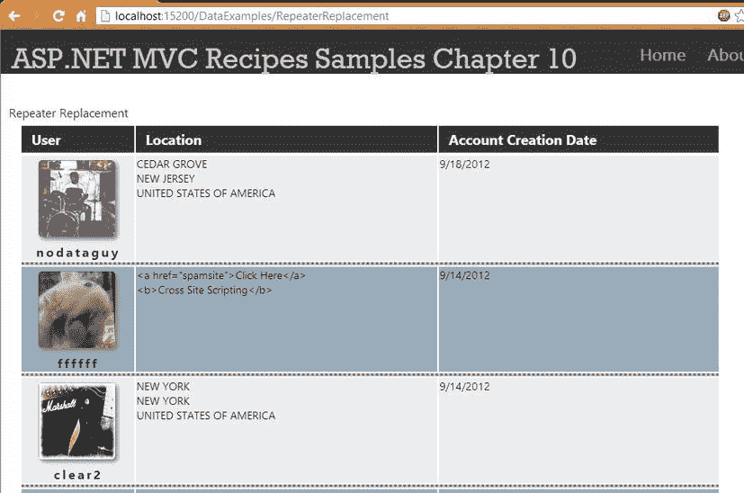
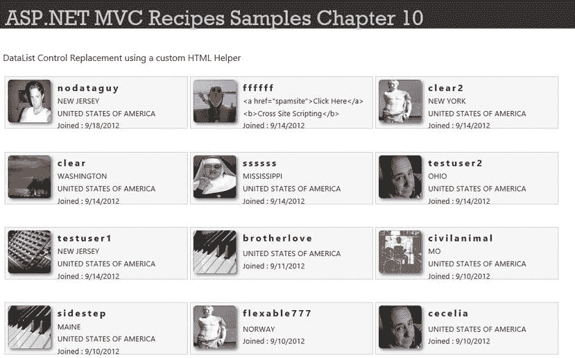
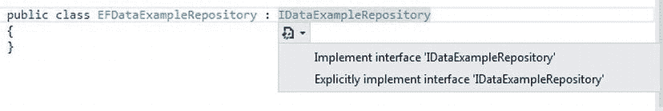
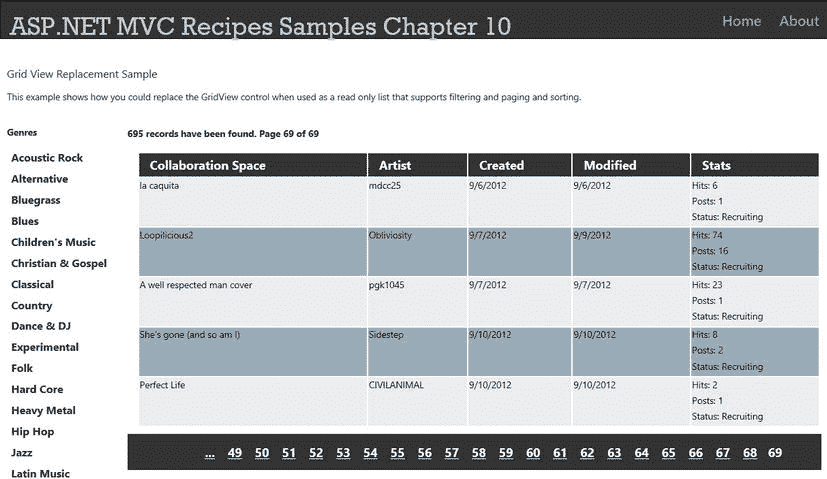
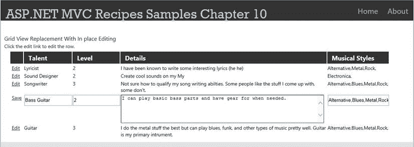
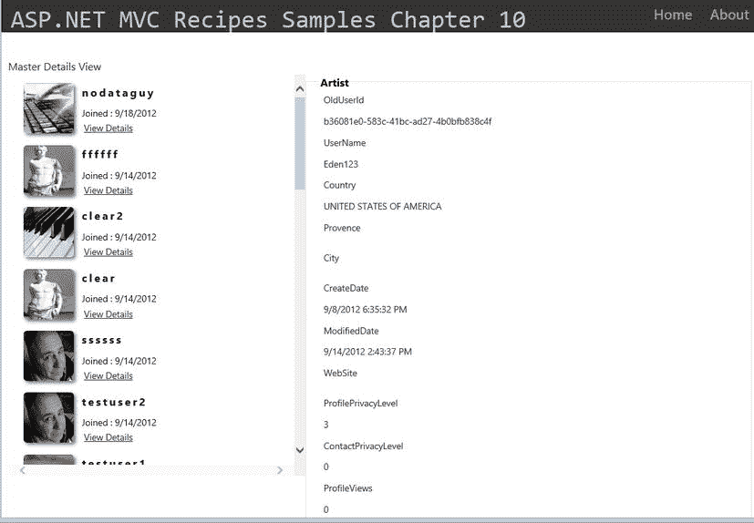
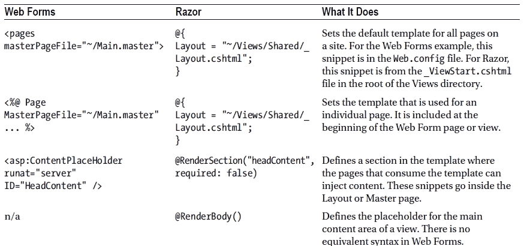
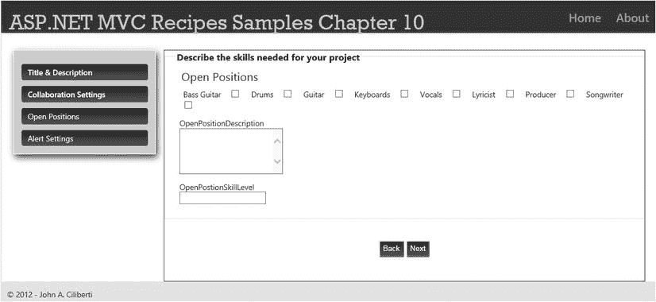
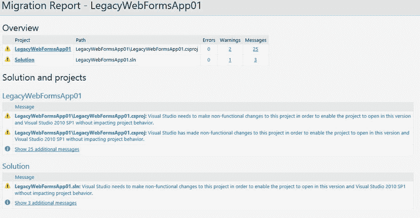

# 十、从 WebForm 转移到 ASP.NET MVC

10-1.使用 ASP.NET MVC 创建一个简单的数据列表

问题

您是一名经验丰富的 ASP.NET Web Forms 开发人员，在过去，当您需要构建一个简单的数据驱动列表时，您会使用 ASP.NET`Repeater`控件。你是 ASP.NET MVC 的新成员。您被要求实现一个页面，该页面将显示在您公司的网站上注册的最后 20 名新成员的列表。你可能想知道使用 ASP.NET MVC 4 的正确方法。如果可能的话，您希望利用一些现有的代码。

解决办法

在 ASP.NET 网络表单中，`Repeater`控件是框架自带的数据控件中最不复杂的。它允许您为页眉、页脚、数据项和分隔符定义模板。要使用它，您需要将相关的 HTML 标记与 ASP.NET 数据绑定语句一起放在每个部分中。如果您想在将数据写入页面之前检查数据，以便显示条件标记，那么您可以实现像`ItemDataBound`这样的事件处理程序。

在 ASP.NET MVC 中，服务器端控件的概念已经被否决了。为了实现与 ASP.NET`Repeater`控件的功能等效，除了页面标记(包括 HTML、JavaScript 和 CSS)之外，还需要使用 Razor 循环语句、HTML 助手和 Razor 变量形式的服务器端代码组合。

它是如何工作的

在这一节中，您将首先在一个典型的 WebForm 场景中演示一个`Repeater`控件，然后展示如何使用带有 Razor 视图引擎的 ASP.NET MVC 来重新创建该功能。

ASP.NET 网页表单控件

这个例子使用了一个`Repeater`控件来显示最近 20 个注册了网站的用户的信息。像许多真实的生产代码一样，这个例子使用一个 HTML 表来定义列表的结构。它还使用内联 CSS 和不推荐使用的 HTML 属性来定义背景颜色和元素之间的间距。

该示例使用`Repeater`控件的`HeaderTemplate`属性来定义表格的初始结构。然后使用`ItemTemplate`和`AlternatingItemTemplate`来显示数据。项目模板几乎完全相同，只是应用于每个项目的表格行的背景颜色不同。一个`SeparatorTemplate`用于创建一个空的表格行，暗灰色背景设置为 1 像素高。`FooterTemplate`用于完成表格结构。这个例子有一点不同于大多数遗留代码，那就是在数据绑定表达式中使用了`ItemType`属性和`Item`变量。`ItemType`属性是 ASP.NET 4.5 中添加到 Web 窗体的新构造，它允许您在创作 Web 窗体页面时使用 IntelliSense。它还提供了比以前的 WebForm 版本中引入的其他数据绑定语法样式更简单的语法。`Repeater`控件如[清单 10-1](#list1) 所示。

***[清单 10-1](#_list1) 。*** 在 Web 窗体应用中使用 Repeater 控件

```cs
<asp:Repeater ID="ArtistsRepeater"
        runat="server"
        ItemType="Ch7.SharedAPI.Artist"
        OnItemDataBound="ArtistsRepeater_ItemDataBound">
        <HeaderTemplate>
            <table width="95%" cellpadding="5" cellspacing="5">
        <thead>
            <tr>
                <th>
                    User
                </th>
                <th>
                    Location
                </th>
                <th>
                    Account Creation Date
                </th>
            </tr>
        </thead>
        </HeaderTemplate>
        <ItemTemplate>
            <tr bgcolor="#AAAAAA" valign="top">
            <td width="150px">
                <asp:Image Height="100px" Width="100px"
                    ImageUrl="<%# Item. AvatarUrlSample %>"
                    AlternateText="<%# Item. UserName %>" runat="server" />
                <br />
                <asp:HyperLink NavigateUrl="/<%# Item.UserName %>"
                    Text="<%# Item. UserName %>"
                    runat="server"
                    ID="ProfileHyperLink"></asp:HyperLink>
            </td>
            <td width="150px">
               <asp:Label ID="LocationLabel" runat="server"></asp:Label>
            </td>
            <td>
                <%# Item. CreateDate.ToShortDateString()%>
            </td>
            </tr>
        </ItemTemplate>
        <AlternatingItemTemplate>
            <tr bgcolor="#EEEEEE" valign="top">
            <td width="150px">
                <asp:Image ID="Image1" Height="100px"
                     Width="100px"
                    ImageUrl="<%# Item. AvatarUrlSample %>"
                    AlternateText="<%# Item. UserName %>"
                    runat="server" />
                <br />
                <asp:HyperLink ID="ProfileHyperLink"
                    NavigateUrl="/<%# Item. UserName %>"
                    Text="<%# Item. UserName %>"
                    runat="server"></asp:HyperLink>
            </td>
            <td width="150px">
                <asp:Label ID="LocationLabel" runat="server"></asp:Label>
            </td>
                <td>
                    <%# Item. CreateDate.ToShortDateString()%>
                </td>
            </tr>
        </AlternatingItemTemplate>
        <SeparatorTemplate>
            <tr>
                <td colspan="3"
                    style="background-color:#DDDDDD; height:1px;"></td>
            </tr>
        </SeparatorTemplate>
        <FooterTemplate>
             </table>
        </FooterTemplate>
    </asp:Repeater>
```

在代码隐藏页面中，页面加载事件处理程序将`Repeater`控件的`DataSource`属性设置为 LINQ 查询的结果，然后调用 Repeater 的`DataBind`方法。这会导致执行一个循环，最终生成显示在 web 浏览器中的数据和标记的组合。清单 10-2 中的[显示了`Page_Load`事件。](#list2)

***[清单 10-2](#_list2) 。**T5【Repeater 控件数据源被设置在 Page_Load 事件处理程序中*

```cs
protected void Page_Load(object sender, EventArgs e)
{
  using (MobEntities context = new MobEntities())
  {
    //last 20 Artist records created
    var newArtistsQuery = (from m in context.Artists
                          orderby m.CreateDate descending
                          select m).Take(20);
    List<Artist> newArtistsList = newArtistsQuery.ToList<Artist>();

    ArtistsRepeater.DataSource = newArtistsList;
    ArtistsRepeater.DataBind();
  }
}
```

代码隐藏页面还为`Repeater`控件实现了`ItemDataBound`事件处理程序。事件处理程序接受两个参数，`sender`是对生成事件的对象的引用，`RepeaterItemEventArgs`包含关于绑定到特定行的数据的信息。在事件处理程序中，检查当前的`DataItem`,看是否为组成位置的任何属性设置了值。然后使用一个`StringBuilder`对象将来自`City`、`Provence`和`Country`属性的数据与一些标记组合起来。调用`StringBuilder.ToString`来创建字符串值，该字符串值被写入`LocationLabel`的 text 属性(在`Repeater`控件的两个项目模板中定义)。`ItemDataBound`事件处理程序如[清单 10-3](#list3) 所示。

***[清单 10-3](#_list3) 。**T5 用于 Repeater 控件的 ItemDataBound 事件处理程序*

```cs
protected void ArtistsRepeater_ItemDataBound(object sender, RepeaterItemEventArgs e)
{
  if (e.Item.ItemType == ListItemType.Item || e.Item.ItemType == ListItemType.AlternatingItem)
  {
     Artist currentItem = e.Item.DataItem as Artist;
     Label locationLabel = e.Item.FindControl("LocationLabel") as Label;
     if (currentItem != null && locationLabel!=null)
     {
        StringBuilder builder = new StringBuilder();
        if (!String.IsNullOrEmpty(currentItem.City))
        {
          builder.Append(currentItem.City);
            builder.Append("<br/>");
         }
         if (!String.IsNullOrEmpty(currentItem.Province))
         {
           builder.Append(currentItem.Province);
           builder.Append("<br/>");
         }
         if (!String.IsNullOrEmpty(currentItem.Country))
         {
           builder.Append(currentItem.Country);
         }
         locationLabel.Text = builder.ToString();
     }
  }
}
```

在此示例中，代码隐藏页扮演了几个角色。首先，它以类似于 MVC 控制器的方式操作模型，然后将其传递给表示层。它还在`Item_DataBound`事件处理程序中实现表示逻辑，将数据和标记结合起来，然后将值写入一组页面元素。

将 Repeater 示例迁移到 ASP。使用 Razor 的 MVC

将一个`Repeater`的控制代码移植到 ASP.NET MVC 是一个有点简单的过程。最简单的方法是将代码从 WebForm 的`Page_Load`事件移到控制器动作中。然后，您可以将 WebForm 代码迁移到视图中的 Razor 语法。让我们一步一步地完成这个过程，然后一旦这个例子起作用了，我们就可以重构这个页面，这样它就可以受益于 ASP.NET MVC 提供的增强的可测试性和更清晰的关注点分离。同时，我们还可以清理标记，以便用更现代的技术替换内联样式和过时的标记。

查找该食谱的代码示例

打开位于附带代码的`Chapter10\Ch10.MvcExamples\Before`文件夹中的 Visual Studio 解决方案。一旦项目被加载，在解决方案资源管理器中展开`Controllers`文件夹，然后通过双击打开`DataExamplesController.cs`文件。文件打开后，定位`RepeaterReplacement`控制器动作。

要访问 Web 窗体示例的代码，请打开 Visual Studio 的第二个实例，然后打开在`Chapter10\Ch10.WebFormsExamples`中找到的项目。在示例 Web 窗体项目中，在解决方案资源管理器中展开`DataControlsExamples`文件夹，然后双击`RepeaterExample.aspx`将其打开。您可以右键单击代码编辑器中打开的`.aspx`文件中的任意位置，并选择 View Code 来打开 Repeater 示例的代码隐藏页面。

 **注意**本章中的大多数例子都在位于`Chapter10\Ch10.MvcExamples`文件夹中的单个 Visual Studio 项目中。完成的示例在`Chapter10\Ch10.MvcExamples\After`文件夹中。如果你想了解每个食谱，你可以使用`Chapter10\Ch10.MvcExamples\Before`中的项目作为每个部分练习的起点。

将 Page_Load 事件中的逻辑迁移到控制器操作

由于来自 ASP.NET Web Forms 项目的 LINQ 查询可以被重用，启动和运行的最快方法是从`RepeaterExample.aspx.cs`中的`Page_Load`事件处理程序复制代码，然后将其粘贴到 MVC 项目的`DataExampleController.cs`文件中的`RepeaterReplacement`动作中。

粘贴代码后，您会注意到有几行代码带有红色的下划线，表示有错误。第一个错误是没有识别出`MobEntities`和`Artist`对象。要解决这个问题，你可以点击代码编辑器里面的`MobEntities`类名，然后点击弹出的小菜单。这将显示可用来解决错误的选项列表。使用 Ch7 选择。SharedAPI 选项将`Using`语句添加到代码项目中。这将解决第一组错误。

接下来的两个错误是因为对象`ArtistRepeater`在当前上下文中不存在。由于我们没有在 ASP.NET MVC 中使用`Repeater`控件，我们可以删除引用该控件的两行代码。为了将查询结果传递给视图，更改 return 语句，以便将`newArtistList`作为参数传递给`View`方法。

还有一个问题。因为我们已经在一个`Using`语句中包装了我们的`MobEntities`对象，所以它将在视图呈现之前被处理掉。当您试图从视图中访问模型数据时，这将导致错误。为了解决这个问题，我们将把`MobEntities`声明分解成一个全局成员变量，并在控制器的构造函数中初始化它。重命名变量 **m_context** 以表明它是一个成员变量。还要覆盖构造函数的`Dispose`方法，以确保尽快释放上下文，这将把我们的数据库连接返回到连接池。您应该注意到 MVC 控制器使用了`IDisposable`的“终结器”实现，它接受`bool`参数 disposing。`DataExampleController`如[清单 10-4](#list4) 所示。

***[清单 10-4](#_list4) 。*** 数据示例控制器的 RepeaterReplacement 动作

```cs
using Ch7.SharedAPI;
//..statements removed for brevity
MobEntities m_context = new MobEntities();

public ActionResult RepeaterReplacement()
{
  //last 20 Artist records created
  var newArtistsQuery = (from m in m_context.Artists
                          orderby m.CreateDate descending
                          select m).Take(20);
  List<Artist> newArtistsList = newArtistsQuery.ToList<Artist>();

  return View(newArtistsList);
}

protected override void Dispose(bool disposing)
{
   if (disposing)
   {
      if (m_context != null)
       m_context.Dispose();
   }
   base.Dispose(disposing);
}
```

将 WebForm 标记迁移到 Razor 视图

从 Web 窗体迁移标记代码并不有趣，尤其是如果代码是由 Visual Studio 设计器的早期版本创建的。在大多数情况下，除了将 ASP.NET 控件转换为常规的 HTML 元素，您还需要重构代码，将内联样式移动到一个单独的文件中。

另一个挑战是如何处理以前在`ItemDataBound`事件处理程序中的代码。在某些方面，它可以被认为是视图逻辑，因为它改变了描述用户位置的内容在页面上的显示方式。你也可以很容易地说，这段代码是在修改一个包含一个名为`Location`的属性的模型。从另一个角度来看，您确实有一个位置属性，但它是一个计算属性，包含来自城市、普罗旺斯和国家的数据。如果它是视图逻辑，那么它属于作为一系列控制语句实现的视图。如果您正在操纵模型，您应该在控制器中这样做。如果它是一个计算属性，您可以将这个逻辑放在模型中。诀窍在于，如果您采用后一种方法，您应该排除包含 HTML break 标记的需要，以便保持关注点的分离。

对于这个例子，我们将采用第一种方法(它认为这是一个视图逻辑问题)。但是我们将创建一个连接一组字符串的 HTML 助手，而不是求助于内联控制语句。如果字符串为 null 或空，将被跳过。如果找到一个值，它将输出后跟 HTML break 标记的字符串。对于集合中的最后一个字符串，将不添加换行符。

这种方法将 HTML 标记排除在控制器逻辑之外，增加了代码重用，并提高了视图的可读性和可维护性。另一个优点是 HTML 助手易于测试，而视图中的内联控制语句则不容易测试。

要创建 HTML 助手，在 MVC Web 解决方案中，右键单击`Ch10.Shared.Helpers`项目，选择 Add，然后选择 Class。在“添加新项”对话框中，确保选择了类模板，并将文件名更改为`Ch10ListHelpers.cs`。在文件内部，首先将类指定为静态类，然后创建一个名为`ConcatProperties`的新方法，如[清单 10-5](#list5) 所示。`ConcatProperties`是一个扩展方法，可以通过调用`@Html.ConcatProperties`来访问。`@Html`变量是所有 MVC 视图中都可用的`HtmlHelper`类的一个实例。

这个方法使用了`params`关键字，它允许我们在参数列表中添加任意数量的字符串。通过使用它，我们镜像了`String.Concat`方法，这将使开发人员更容易学习使用这个助手，因为它遵循一个熟悉的模式。它还增加了 helper 方法的灵活性，使其更具可重用性。

***[清单 10-5](#_list5) 。*** 自定义 HTML 助手 CompositePropertyExtension.cs

```cs
public static class Ch10Helpers
{
  public static MvcHtmlString ConcatProperties(this HtmlHelper helper, params string[] text)
  {
    if (text != null)
    {
      StringBuilder builder = new StringBuilder();
      for (int i = 0; i < text.Length; i++)
      {
        if (!string.IsNullOrEmpty(text[i]))
        {
          builder.Append(AntiXssEncoder.HtmlEncode(text[i],true));
          if (i < text.Length - 1)
          {
             builder.Append("<br/>");
          }
        }
       }
       return MvcHtmlString.Create(builder.ToString());
      }
      return MvcHtmlString.Empty;
    }
}
```

关于清单 10-5 中的[，需要注意的一件重要事情是它返回了`MvcHtmlString`的类型。为了在视图中使用时保留您添加的 HTML 标记](#list5)，这是必要的。ASP.NET MVC 将自动 HTML 编码所有字符串，以帮助消除跨站脚本漏洞。当使用`MvcHtmlString`类型时，视图引擎将假设字符串已经被编码，并且不会尝试再次编码。记住这一点，当编写自定义助手时，一定要使用`AntiXssEncoder.HtmlEncode`来编码任何可能从用户输入中创建的字符串。

 **注意**`AntiXssEncoder`类似于`HttpUtility.HtmlEncode`方法，它会对数据中的 HTML 进行编码，以便在浏览器中显示为普通文本。这可以防止恶意用户创建的潜在有害输入在另一个用户的浏览器会话中执行。这些方法的不同之处在于`AntiXssEncoder`使用一种“白名单”方法，这种方法对除了已知安全的字符之外的所有字符进行编码。另一方面，`HttpUtility.HtmlEncode`使用“黑名单”方法，只对字符`<`、`>`、`&`和`"`进行编码。有几种技术可用于绕过简单的黑名单并发起成功的跨站点脚本攻击。`AntiXssEncoder`正式成为根据微软模式和实践创建的第三方库的一部分。从 ASP.NET 4.5 开始，它不包含在系统中。Web，但是可以从系统访问。Web.Security.AntiXss 命名空间。

为了使用您的定制助手，您需要在 MVC 项目的 Views 目录下的`Web.config`文件中添加一个名称空间条目。这将使这个扩展和您在这个名称空间中定义的所有其他扩展对您的所有视图都可用。确保您正在对 views 文件夹中的`Web.config`文件进行更改，而不是对站点根目录中的文件进行更改。对`Web.config`的更改显示在[清单 10-6](#list6) 中。

***[清单 10-6](#_list6) 。*** 向 Views/Web.config 文件添加命名空间

```cs
<system.web.webPages.razor>
    <host factoryType="System.Web.Mvc.MvcWebRazorHostFactory, System.Web.Mvc, Version=4.0.0.0,
Culture=neutral, PublicKeyToken=31BF3856AD364E35" />
    <pages pageBaseType="System.Web.Mvc.WebViewPage">
      <namespaces>
        <add namespace="System.Web.Mvc" />
        <add namespace="System.Web.Mvc.Ajax" />
        <add namespace="System.Web.Mvc.Html" />
        <add namespace="System.Web.Optimization"/>
        <add namespace="System.Web.Routing" />
        <add namespace="Ch10.Shared.Helpers" />
      </namespaces>
    </pages>
  </system.web.webPages.razor>
```

接下来，您将构建视图。首先，您可以从 Web Forms 项目的`RepeaterExample.aspx`页面获取代码，并将其粘贴到您的视图中。然后你需要移除`asp:Repeater`标签及其子标签，比如`HeaderTemplate`和`FooterTemplate`。接下来，将所有其他的 ASP.NET 控件标签，比如`asp:HyperLink`标签，转换成常规的 HTML 元素。您也可以删除`AlternatingItemTemplate`中包含的所有内容。这个已经不需要了。

一旦移除了所有的 WebForm 控件引用，您就应该将`@model`声明添加到类型`List<Ch7.SharedAPI.Artist>`的页面顶部。然后，您可以围绕表体创建一个`foreach`循环。在循环内部，将 WebForm 数据绑定标签转换为 Razor 变量。例如，您可以将`<%# Item.UserName %>`转换为`@item.UserName`。您将使用您创建的 HTML 助手来代替包含位置的 label 控件。当你完成后，你的视图应该看起来类似于清单 10-7 。此时，您的视图应该是功能性的。您应该通过在调试器中启动您的项目并导航到`DataExamples/RepeaterReplacement`来测试它。

***[清单 10-7](#_list7) 。*** 使用从 WebForm 项目粘贴的内容中派生的代码创建的视图

```cs
@model List<Ch7.SharedAPI.Artist>
@{
    ViewBag.Title = "Repeater Replacement";
}

<h2>@ViewBag.Title /h2>

<table width="95%" cellpadding="5" cellspacing="5">
    <thead>
        <tr>
            <th>User
            </th>
            <th>Location
            </th>
            <th>Account Creation Date
            </th>
        </tr>
    </thead>
    @foreach(var item in Model){
    <tr bgcolor="#AAAAAA" valign="top">
        <td width="150px">
            
            <br />
            <a href="/@item.UserName"
                id="ProfileHyperLink">@item.UserName</a>
        </td>
        <td width="150px">
            @Html.ConcatProperties(item.City, item.Province, item.Country)
        </td>
        <td>@item.CreateDate.ToShortDateString()
        </td>
    </tr>
    <tr>
        <td colspan="3"
            style="background-color: #DDDDDD; height: 1px;"></td>
    </tr>
    }
</table>
```

 **注意**当你编辑视图时，Visual Studio 的 IntelliSense 特性应该在你的视图中为`@Html HtmlHelper`实例输入后显示的属性和方法列表中显示你的定制 HTML 助手扩展方法。如果没有看到扩展方法，请确保添加了对包含帮助器扩展的项目的引用，并重新生成了 web 项目。如果在将名称空间添加到您的`Web.config`文件之前，您已经在编辑器中打开了视图，请关闭并重新打开视图。

在你的视图中重构 HTML

从 Web 窗体项目复制的 HTML 不符合 HTML5。事实上，它实际上违反了不止九条规则。此外，由于修订后的标记删除了`AlternatingItemTemplate`，Web Forms 版本中的替代行颜色已经丢失。

视图中的其他一些地方使用了内联 CSS 样式。尽管这是完全合法的 HTML，但出于可维护性和性能原因，这不是最佳实践。如果你是一个经验丰富的 WebForm 开发人员，你很可能对 CSS 只有粗略的了解。这是因为 WebForm 抽象出了 HTML，并不一定强迫你使用它。虽然 Web 窗体不阻止您使用外部 CSS，但围绕它的工具，尤其是 Visual Studio 的早期版本，鼓励使用内联样式，并使使用外部样式表变得更加困难。

为了纠正这些问题，让我们首先把不赞成使用的 HTML 属性和内联样式分解到一个单独的 CSS 文件中。

要向项目中添加新的 CSS 文件，请在解决方案资源管理器中右键单击`Content`文件夹，然后选择 new 和 Style Sheet。在“为项目指定名称”对话框中，将项目命名为 **GridStyles** 。单击“确定”创建文件。新的样式表将在代码编辑器窗口中打开。接下来，打开`App_Start/BundleConfig.cs`并修改`"∼/Content/css"`，如[清单 10-8](#list8) 所示。如果您只打算一次使用一组样式，那么您可以通过使用 HTML `<link rel="stylesheet">`标签将它显式地包含在页面中。在这些情况下，您将创建一个可用于所有网格类型输出的样式，以便网格在整个站点中具有一致的外观。通过将 CSS 文件添加到包中，其内容将被压缩并与包中列出的其他文件组合在一起。这将导致更小和更快的整体下载，这将增加你的页面的初始加载体验。

***[清单 10-8](#_list8) 。*** 对 BundleConfig.cs 的修改

```cs
bundles.Add(new StyleBundle("∼/Content/css").Include(
                "∼/Content/site.css" ,
                "∼/Content/GridStyles.css"
            ));
```

接下来，在`GridStyles.css`中添加新的样式，它将定义网格的外层，在当前的 HTML 中，它被实现为一个`Table`元素、一个网格行、一个交替网格行、一个头像图像和一个分隔网格行。完成的样式表应该看起来像清单 10-9 中的[。](#list9)

***[清单 10-9](#_list9) 。*** GridStyles.css

```cs
.grid {
    background-color: #fff;
    margin: 5px 0 10px;
    padding-left: 5px;
    width: 95%;
}
    .grid td {
        color: #717171;
        color: #1a1a1a;
        vertical-align: top;
    }

    .grid th {
        background-color: #333;
        color: #fff;
        font-size: large;
        font-weight: bolder;
        padding-bottom: 5px;
        padding-left: 13px;
        padding-top: 5px;
        text-align: left;
    }

.SeparatorRow td {
    background-color: #C0C0C0;
    border-style: dotted none none none;
    color: #717171;
    height: 1px;
    margin: 0px;
    padding: 0px;
}

.imgColumn {
    text-align: center;
    width: 100px;
}

.odd {
    background-color: #ebeced;
}

.even {
    background-color: #99acb9;
}

.AvatarImage {
    -moz-border-radius: 5px;
    -webkit-border-radius: 5px;
    border-radius: 5px;
    -webkit-box-shadow: 3px 3px 7px #777;
    -moz-box-shadow: 3px 3px 7px #777;
    box-shadow: 3px 3px 7px #777;
    height: 100px;
    margin: 5px;
    width: 100px;
}

.ProfileLink {
    font-size: 12pt;
    font-weight: bolder;
    letter-spacing: 0.2em;
    text-decoration: none;
    text-transform: lowercase;
}
```

清单 10-9 中的 CSS 代码对 WebForm 示例中的样式进行了实质性的升级。这种样式利用了一些较新的浏览器功能，例如框阴影，它创建了投影效果和边框半径，可用于圆角的方形元素。与使用内嵌样式相比，将样式信息移出 HTML 有几个好处，包括:

*   视图更容易阅读和维护。
*   因为视图的视觉方面是在一个地方定义的，所以很容易在不影响功能的情况下对站点的外观和感觉进行全局更改。
*   由于 HTML 被简化，总体下载量较小。
*   客户端缓存的优势。
*   您可以使用媒体查询来根据屏幕大小大幅更改页面布局。

 **提示**如果您计划在 Visual Studio 中进行大量 CSS 编码，我强烈推荐您安装 Web Essentials 2012 外接程序，它是免费的，可以使用 Visual Studio 扩展和更新管理器下载和安装。这在使用 CSS 3 构造如`box-shadow`时尤其有用。只需点击一下，它就可以添加所有缺少的特定于供应商的元素版本，比如`-webkit-box-shadow`和`-moz-box-shadow`。

在 ASP.NET MVC 和一般的现代 web 开发中，理解 CSS 和 JavaScript 是不可避免的。第 11 章对此主题进行了更深入的报道。既然已经定义了样式，我们可以将它们应用到我们的视图中。[清单 10-10](#list10) 显示了利用样式的更新视图。

***[清单 10-10](#_list10) 。**T5】重构的 RepeaterReplacement.cshtml*

```cs
@model List<Ch7.SharedAPI.Artist>
@{
    ViewBag.Title = "Repeater Replacement";
}
<h2>Repeater Replacement</h2>
<table class="grid" >
    <thead>
        <tr>
            <th>User
            </th>
            <th>Location
            </th>
            <th>Account Creation Date
            </th>
        </tr>
    </thead>
    @foreach (var item in Model)
    {
        <tr>
            <td class="imgColumn" >
                
                <br />
                <a href="/@item.U serName" class="ProfileLink" >@item.UserName</a>
            </td>
            <td>@Html.ConcatPropert ies (item.City, item.Province, item.Country)</td>
            <td>@item.CreateDate.ToShortDateString()</td>
        </tr>
        <tr class="SeparatorRow">
            <td colspan="3"></td>
        </tr>
    }
</table>
```

请注意清单 10-10 中的代码与清单 10-1 中的[相比，是多么的清晰和容易阅读。所有的样式都已经从视图中移出，只剩下基本的标记和数据绑定表达式。运行项目并检查新版本的外观。您会注意到，尽管它在视觉上有所改进，但仍然缺少交替行着色。停止调试并返回 Visual Studio。](#list1)

为了纠正这个问题，让我们利用 jQuery 库的一些功能。这个库包含了几乎所有的 ASP.NET MVC 模板，并且是 ASP.NET MVC 开发的一个基本组件。

在视图的底部，添加如[清单 10-11](#list11) 所示的代码。这个简短的脚本使用 jQuery 的`odd`和`even`选择器来选择视图中所有偶数编号的表行，除了那些带有`SeparatorRow`类的行，然后向它们添加`even` CSS 类。在下一行中，它对奇数行执行类似的操作。最终结果是我们的网格有交替的颜色。与原始版本相比，这是一个很好的变化，原始版本中相同的标记重复了两次，但是使用了不同的内联样式来表示表格行的背景颜色。

***[清单 10-11](#_list11) 。*** 使用 JQuery 向表格中添加交替项目样式

```cs
@section scripts{
    <script>
        $(function () {
            $("tr:not(.SeparatorRow):even").addClass("even");
            $("tr:not(.SeparatorRow):odd").addClass("odd");
        });
    </script>
}
```

在 jQuery 代码中，我们在`$()`内部定义了一个函数；构建。这是 jQuery 中的一个简写形式，用来指定一旦 DOM 被加载，我们希望执行什么代码。在函数内部，我们使用 jQuery 的选择器语法来选择文档中所有的`tr`元素，除了那些分配了`.SeparatorRow`类的元素。然后，我们选择该子集中偶数编号的项目，并向它们添加`even` CSS 类。然后，我们对奇数行执行类似的操作。

可测试性重构

此时，您只需签入代码，就可以收工了。然而，如果你这样做了，你将会忽略 ASP.NET MVC 的一个主要优点:可测试性。您将为其创建测试的第一个项目是自定义 HTML 助手。即使您没有遵循测试驱动的开发方法，仍然建议您为您的助手编写测试。这是因为在大多数情况下，助手将被重用。助手中的错误可能会产生广泛的影响，因为该问题会存在于使用它们的所有页面视图中。

要为您的助手创建测试，右键单击`Ch10.Shared.Helpers.Tests`项目并选择 Add  Class。将新类命名为**ConcatPropertyHelpersTests**。

本例中使用的`Ch10.Shared.Helpers.Tests`项目包含了对 NUnit 单元测试框架的引用。要使用这个框架，您需要将它安装在您的开发机器上。设置说明在配方 9-4 中。

为了测试 HTML 帮助器，您需要将以下程序集添加到测试项目中:

*   系统。网
*   系统。Web.MVC
*   Ch10。共享.助手

一旦您添加了程序集，您就可以为每个用例添加测试方法。您应该添加测试来考虑所有可能的代码路径，以验证代码是否按预期运行。对于这个助手，您将测试六个可能的用例。

1.  作为参数传递的三个字符串值。预期的输出将是三个变量，除了最后一个元素之外，每个变量前面都有一个 break 标记`<br/>`。
2.  三个字符串值作为参数传递，但其中一个值为空。应该忽略 null 项，并且不应该添加 break 标记。
3.  传入了一个空参数。在这种情况下，应该返回一个空字符串。
4.  作为参数传递的一个字符串值。这里，返回的字符串前面不应有 break 标记。
5.  一个空字符串作为参数传递。这应该与 null 值的行为类似，返回一个空字符串。
6.  最后，包含一些 HTML 的单个项目。对于这一个，元素应该被编码。

最终结果的一部分如清单 10-12 中的[所示。您可以通过查看从本书的网站下载的示例代码来查看完整的示例。](#list12)

***[清单 10-12](#_list12) 。*** 用 NUnit 单元测试 HTML 助手

```cs
using NUnit.Framework;
using System.Web.Mvc;
using System.Web.Security.AntiXss;
using Ch10.Shared.Helpers;

namespace Ch10.Shared.Helpers.Tests
{
    [TestFixture]
    public class ConcatPropertyHelpersTests
    {
        [Test]
        public void ConcatProperty_threeValuesNONulls_ReturnsThreeValuesseperatedByLineBreaks()
        {
            // Arrange
            HtmlHelper helper = new HtmlHelper(new ViewContext(), new ViewPage());
            //act
            string expected = "A<br/>B<br/>C";
            string actual = helper.ConcatProperties("A", "B", "C").ToString();
            //Assert
            Assert.AreEqual(expected, actual);
        }
//
// other tests ommited for brevity
//
        [Test]
        public void ConcatProperty_StringContainsHtml_ReturnsHtmlEncodedStringNoBR()
        {
            // Arrange
            HtmlHelper helper = new HtmlHelper(new ViewContext(), new ViewPage());
            string expected = AntiXssEncoder.HtmlEncode("<b>A</b>",true);
            //act
            string actual = helper.ConcatProperties("<b>A</b>").ToString();
            //Assert
            Assert.AreEqual(expected, actual);
        }
    }
}
```

下一个可测试的项目是控制器。为此，我们将把 LINQ 查询从控制器中移出，放到我们的`Models`文件夹中的一个存储库类中。这个类将实现一个接口，该接口定义调用所需数据的方法。该接口将允许我们在单元测试中使用模拟框架，用模拟实现替换对数据库的调用，模拟实现总是返回一组预定义的值。

修改后的`DataExampleController.cs`文件如[清单 10-13](#list13) 所示。关于为控制器创建单元测试的详细教程在第 9 章的[中。](09.html)

***[清单 10-13](#_list13) 。*** DataExampleController 修改为支持单元测试

```cs
using Ch10.Mvc.Web.Models;
using Ch7.SharedAPI;
using System.Collections.Generic;
using System.Web.Mvc;

namespace Ch10.Mvc.Web.Controllers
{
    public class DataExamplesController : Controller
    {
        private IDataExampleRepository m_repository;
        public DataExamplesController(IDataExampleRepository repository)
        {
            m_repository = repository;
        }
        public DataExamplesController()
            : this(new EFDataExchangeRepository())
        {
        }
        //
        // GET: /DataExamples/

        public ActionResult Index()
        {
            return View("Index");
        }

        public ActionResult RepeaterReplacement()
        {
            List<Artist> newArtistsList = m_repository.GetNewArtistList();
            return View("RepeaterReplacement", newArtistsList);
        }

        protected override void Dispose(bool disposing)
        {
            if (disposing)
            {
                if (m_repository != null)
                    m_repository.Dispose();
            }
            base.Dispose(disposing);
        }

    }
}
```

第一个变化是添加了两个构造函数。一个构造函数获取一个实现了`IDataExampleRepository`接口的对象的实例。第二个构造函数不接受任何参数，但是调用第一个构造函数，传入一个`EFDataExampleRepository`的实例。第二个构造函数将被 MVC 框架调用。另一个变化是删除了用于`MobEntities`数据上下文的全局成员变量，取而代之的是一个用于存储库的成员变量。存储库在`RepeaterReplacement`中被用来获取将被传递给视图的`Artists`列表。我们还修改了对`View`的调用，以便显式地传递视图的名称。为了编写一个单元测试来验证控制器是否调用了正确的视图，这是必需的。最后一次代码更改修改了 dispose 方法。它现在调用存储库上的`Dispose`,而不是对象上的`MobEntities`。

最终的结果应该看起来像图 10-1 ，它显示了这个例子在 Chrome 浏览器中的样子。



[图 10-1](#_Fig1) 。ASP.NET MVC 中完成的简单数据列表

10-2.使用自定义 HTML 助手扩展创建多列数据列表

问题

您正在使用 ASP.NET MVC 4 构建一个新的应用。您要求以四列格式显示一个项目列表。作为一名经验丰富的 ASP.NET WebForm 开发人员，您通常会使用一个`DataList`控件来完成这项工作。你想知道如何使用 ASP.NET MVC 和 Razor 视图引擎做同样的事情。您希望尽可能重用现有代码。

解决办法

这个问题有几种可能的解决方法。一种是遵循方法 10-1 中使用的方法，在视图中定义一个 HTML 表。这种方法的问题是，您需要在您创建的具有类似需求的每个页面中重复这种逻辑。

另一种方法是在视图中使用一个`foreach`循环，将模板输出为一系列 HTML 无序列表中的列表项(`<ul>`)。然后，您可以使用 CSS 和 JavaScript 根据用户显示器的分辨率动态调整显示的列数。这个非常酷的技术在[第 11 章](11.html)的食谱 11-1 中有展示。这种方法的唯一问题是，它不支持所有的传统浏览器，并且在 IE 9 之前的 Internet Explorer 版本上运行会有些慢。

第三种方法，如本例所示，是创建一个 HTML 助手，让您指定需要创建的列数，然后让您为在局部视图中定义的每一列指定模板。

它是如何工作的

从直接的生产力角度来看，很难否认将`DataList`控件拖动到 WebForm、指定所需列的方向和数量，然后将列表绑定到数据源的简单性。由于这个原因，ASP.NET WebForm 继续流行，特别是在公司环境中，截止日期通常是第一个记录的需求。

一旦你学会了正确的技术，并且建立了一个定制的 HTML 助手库来帮助你的设计，你就可以用 ASP.NET MVC 来创造类似的效率。除了拥有高效的开发人员体验之外，您还可以获得干净的 HTML 和增强的可测试性的优势。

这个菜谱将首先展示如何在 ASP.NET WebForm 中创建一个多列数据列表，然后展示如何使用 ASP.NET MVC 创建一个功能相当的设计。如果您希望继续学习，可以使用两个 Visual Studio 解决方案，它们可以从本书的网站上下载。WebForm 解决方案在`Chapter10\Ch10.WebFormsExamples`中，完整的 MVC 版本在`Chapter10\Ch10.MvcExamples\After`中。在`Chapter10\Ch10.MvcExamples\Before`文件夹中还有一个项目的不完整版本。

使用 ASP.NET Web 窗体 DataList 控件

ASP.NETWeb 窗体`DataList`控件与`Repeater`控件非常相似，因为它将遍历数据源中的项目并输出指定模板的内容。`Repeater`和`DataList`的主要区别在于整个输出被包装在一个 HTML 表中。然后，它使用其`RepeatColumns`和`RepeatDirection`中的值来确定如何围绕内容包装表格行和表格列。

[清单 10-14](#list14) 展示了一个用于输出网站用户列表的`DataList`控件的例子。列表中的每个项目都有一个个人资料图像、一个用户名、一个到用户个人资料页面的链接以及关于他们位置的信息。`DataList`控件的`RepeatColumns`已被设置为 2，而`RepeatDirection`被设置为水平。这将在一个包含三列的表格中输出列表中的项目。每隔三个项目，将创建一个新行。在最后一行，如果该行中的项目少于三个，它将创建空列来完成该行。

***[清单 10-14](#_list14) 。*** DataList 控件示例

```cs
<asp:DataList ID="NewArtistDataList"
    runat="server"
    RepeatColumns="3"
    RepeatDirection="Horizontal"
    CellSpacing="3"
    ViewStateMode="Disabled">
        <ItemTemplate>
            <a href="/<%#Eval("UserName")%>">
                <div class="evenbox">
                    <div class="ImageDiv">
                        "
                             class="AristImage"
                             alt="Click Image to view full profile" />
                    </div>
                    <div class="ContentDiv">
                        <ul>
                            <li>
                                <%#Eval("UserName")%>
                            </li>
                            <li><%#Eval("Provence")%></li>
                            <li><%#Eval("Country")%>   </li>
                            <li>Joined :
                                <time><%#Eval("CreateDate","{0:d}")%></time>
                            </li>
                        </ul>
                    </div>
                </div>
            </a>
        </ItemTemplate>
</asp:DataList>
```

清单 10-14 中的[代码示例使用了 ASP.NET 2.0 引入的数据绑定`#Eval`语法。这种语法提供了单向数据绑定，并允许您提供一些内联的字符串格式，比如使用`#Eval("CreateDate","{0:d}")`，其中创建的数据字段使用默认的日期和时间格式进行格式化。](#list14)[清单 10-14](#list14) 使用了一些现代技术，包括 HTML5 语义标签和有序列表而不是嵌套表格。外部样式表用于格式化项目，为列表创建一个有吸引力的外观。

`DataList`控件的`ViewStateMode`属性已经被设置为`Disabled`。这大大减少了下载的大小，从而缩短了页面的加载时间。`ViewStateMode`属性是作为 ASP.NET 4 的一部分引入的。如果您仍然在任何项目中使用 WebForm，我强烈建议您尽可能使用该属性。在这个控件中不使用`ViewState`的副作用是，在回发中，除非重新应用数据绑定，否则控件中的所有内容都将丢失。

清单 10-15 中的`DataList`示例的代码隐藏页面非常简单。它调用外部库返回 list 和`Artist`对象，然后将 list 设置为`DataList`控件的`DataSource`属性。然后它调用`DataList`控件的`DataBind`属性。

***[清单 10-15](#_list15) 。*** DataList 代码隐藏页面

```cs
public partial class DataListExample : System.Web.UI.Page
    {
        protected void Page_Load(object sender, EventArgs e)
        {
            using (MobEntities context = new MobEntities())
            {
                var newArtistsQuery = (from m in context.Artists
                                       orderby m.CreateDate descending
                                       select m).Take(20);
                List<Artist> newArtistsList = newArtistsQuery.ToList<Artist>();

                NewArtistDataList.DataSource = newArtistsList;
                NewArtistDataList.DataBind();
            }
        }
    }
```

将 DataList 控件迁移到 ASP.NET MVC

如解决方案部分所述，您将创建一个定制的 HTML 助手，它将允许您在实现具有多列需求的视图时更有效率。HTML 助手将把一个`ICollection`数据源和一个局部视图的路径作为参数。然后，您可以使用诸如`@Html.RenderTemplateAsColumns(SomeList,` `"/SomePartialView", 3)`这样的语法调用这个帮助器方法。数字参数是列的数量。

这种方法的一个问题是，您需要在单独的文件中定义项目的布局。这没那么糟糕，但是它确实增加了一些小的复杂性。另一方面，这种技术允许您的视图非常简单。它还允许在多种场景中重用模板的局部视图和 HTML 助手。例如，在您的主页上，您可以有一个一列的实例，并在另一个页面上显示一个三列视图，该视图可能具有更大的列布局和相同的数据。

创建 RenderTemplateAsColumns 帮助器

创建 HTML 助手，在 Ch10。Mvc 解决方案，右键单击`Ch10.Shared.Helpers`项目节点。选择新建，然后选择类别。将新类命名为 **Ch10ColumnHelpers.cs** 。在新的类文件中，更改类文件的签名，使其成为`public`和`static`。在类的主体内部，创建一个名为 **RenderTemplateAsColumns** 的新静态方法，该方法返回`MvcHtmlString`的类型。根据需要，在文件的顶部添加`Using`语句。

编写 HTML helper 方法时，使用`MvcHtmlString`返回类型很重要。如果没有，Razor 引擎会自动对输出进行 HTML 编码。

扩展方法将执行几个动作。首先，它将验证输入，以确保数据源不为 null 或空，并且`numberOfColumns`参数在可接受的范围内。如果测试失败，它将抛出一个异常。

接下来，该扩展将进行一些计算，以找出输出的结构。您需要知道表格行数、项目总数以及需要为最后一行创建的额外列数。例如，如果您总共有二十个项目，并且想要有三列，那么您将需要创建总共七行，并且需要在最后一行创建一个空列，以便保持一致的布局。

执行完计算后，创建开始表格标记，然后开始遍历项目。当您在集合中循环时，记录已经呈现的表列数。一旦该计数达到该行的项目数，关闭现有行并创建另一行。

在每个专栏中，你需要注入你的内容。由于您希望为我们的模板使用局部视图，您可以简单地调用`Partial` helper 方法，该方法将视图和模型的名称作为参数，然后将编译后的视图作为输出返回。

最后，一旦到达最后一行，如果需要的话，将空列追加到最后一行，然后关闭表。

您会发现这个`RenderTemplateAsColumns`助手扩展的初始设计的一个问题是很难进行单元测试，因为使用`Html.Partial`扩展会产生耦合。有几种方法可以解决这个问题。例如，您可以使用一个模仿框架(比如 RhinoMock)创建一个`ViewContext`的模仿实现。另一个选择是传递一个额外的参数，该参数接受一个具有与`Html.Partial`相同签名的委托。这也将为使用您的助手扩展的开发人员提供额外的灵活性。

对于不需要灵活性的开发人员来说，为了使事情简单，您可以创建省略此委托参数的方法的第二个版本。[清单 10-16](#list16) 显示了`GetStringFromPartial`的委托定义。它接受一个表示视图名称的字符串和一个表示模型的对象，并返回一个`MvcHtmlString`对象。这是与`Html.Partial`方法相同的签名。

***[清单 10-16](#_list16) 。*** RenderTemplateAsColumns 视图中使用的帮助器扩展

```cs
using System;
using System.Collections;
using System.Text;
using System.Web.Mvc;
using System.Web.Mvc.Html;

namespace Ch10.Shared.Helpers
{
  public delegate MvcHtmlString GetStringFromAction(string viewName, object model);

  //..
}
```

[清单 10-17](#list17) 显示了一个不需要使用委托参数的`RenderTemplateAsColumns`助手扩展版本。这将使在视图中使用稍微容易一些，但是需要开发人员在局部视图中定义模板。这个版本的方法简单地调用第二个版本，并使用对`GetStringFromAction`委托参数的`helper.Partial`调用。

***[清单 10-17](#_list17) 。*** 视图中使用的 RenderTemplateAsColumns 助手扩展

```cs
public static MvcHtmlString RenderTemplateAsColumns(this HtmlHelper helper,
            ICollection items,
            string partialViewName,
            int numberOfColumns)
{
   return RenderTemplateAsColumns(helper,
                                  items,
                                  partialViewName,
                                  numberOfColumns,
                                  helper.Partial ,);
}
```

[清单 10-18](#list18) 显示了包含实际实现的方法版本。注意，它包括一个名为`getStringMethod`的附加参数，该参数接受委托`GetStringFromPartial`。

***[清单 10-18](#_list18) 。*** RenderTemplateAsColumns 带有 GetStringFromPartial 参数的帮助器扩展

```cs
public static MvcHtmlString RenderTemplateAsColumns(this HtmlHelper helper,
            ICollection items,
            string partialViewName,
            int numberOfColumns,
            GetStringFromAction getStringMethod
          )
        {
            //validate input
            if (numberOfColumns < 1)
            {
                throw new ArgumentOutOfRangeException("numberOfColumns");
            }
            if (items == null)
            {
                throw new ArgumentNullException("items");
            }

            if (items == null || items.Count > 0)
            {

                StringBuilder builder = new StringBuilder();
                int columnsInRow = 1;
                int rowsDone = 0;
                int numberOfItemsDone=0;
                int numberOfExtraColumnsInLastRow;

                //calculate the needed table structure
                int numberOfRows = items.Count / numberOfColumns;

                //Create the opening table tag
                builder.Append("<table>");

                //Create the rows and columns
                foreach (var item in items)
                {
                    if (columnsInRow == 1)
                    {
                        builder.Append("<tr>");
                    }

                    builder.Append("<td>");
                    builder.Append(getStringMethod(partialViewName,item));
                    builder.Append("</td>");
                    bool isLastItem = (items.Count==numberOfItemsDone+1);

                    if ((columnsInRow == numberOfColumns) || isLastItem)
                    {
                        if (isLastItem)
                        {
       numberOfExtraColumnsInLastRow = numberOfColumns - columnsInRow;
                            builder.Append( RenderExtraColumns(numberOfExtraColumnsInLastRow));
                        }
                        builder.Append("</tr>");
                        columnsInRow = 1;
                        rowsDone++;
                    }
                    else
                    {
                        columnsInRow++;
                    }

                    numberOfItemsDone++;
                }

                // create the closing table tag
                builder.Append("</table>");

                return MvcHtmlString.Create(builder.ToString());
            }

            return MvcHtmlString.Empty;
        }
```

当你在开发你的 HTML 助手扩展时，你应该抓住机会在工作中优化你的代码。你应该尽量避免的一件事是一个方法包含数千行代码。可读性对于可维护性至关重要，你应该尽可能地让代码易于理解。[清单 10-19](#list19) 显示了一个从原始方法中分解出来的 helper 方法，它将一个整数作为参数，然后返回一个字符串，该字符串包含 HTML TD 标签对的开始和结束的匹配数目。在修订之前，人们可能不太清楚这个循环在做什么。现在您知道它负责呈现最后一整行之后剩余的额外列。

***[清单 10-19](#_list19) 。*** 渲染多余的栏目

```cs
private static string RenderExtraColumns(int numberOfExtraColumnsInLastRow)
{
   if (numberOfExtraColumnsInLastRow > 0)
   {
       StringBuilder builder = new StringBuilder();
       for (int i = 0; i < numberOfExtraColumnsInLastRow; i++)
       {
           builder.Append("<td></td>");
       }
       return builder.ToString();
     }
     return string.Empty;

}
```

编写单元测试

使用定制 HTML 助手的一个主要优点是，您可以编写一组单元测试，覆盖代码的每一个可能的执行路径。用手工测试在合理的时间内完成这项工作几乎是不可能的。如果您将同样的逻辑写入您的视图，即使不是不可能，也是非常困难的。即使有 HTML 助手，如果在设计中没有预先考虑，它们也很难测试。

在`RenderTemplateAsColumns`的例子中，您特别创建了一个版本的方法，允许您传递一个任意的方法来为模板生成字符串输出。这省去了在每个测试方法中创建一个需要传入`HtmlHelper`构造函数的`ViewContext`对象的模拟实现的麻烦。

您将为这个助手创建的前两个测试(如清单 10-20 所示)将确保异常按预期抛出。对于这两个测试，您都要传递字符串“foo”作为视图的名称。您没有传递委托。然后添加第二个测试，该测试确实通过了委托。这似乎是多余的，因为它们最终都调用相同的代码，但是如果将来实现发生变化，额外的测试可以防止意外的错误。

***[清单 10-20](#_list20) 。*** NUnit 测试 RenderTemplateAsColumns 方法，验证抛出的异常

```cs
[ExpectedException(ExpectedException = typeof(ArgumentNullException))]
public void RenderTemplateAsColumns_NullCollection_ThrowsException()
{
    // Arrange
    HtmlHelper helper = new HtmlHelper(new ViewContext(), new ViewPage());

    //act
    helper.RenderTemplateAsColumns(null, "foo", 3);
    //Assert
}

[Test]
[ExpectedException(ExpectedException = typeof(ArgumentNullException))]
public void RenderTemplateAsColumnsDelegate_NullCollection_ThrowsException()
{
  // Arrange
  HtmlHelper helper = new HtmlHelper(new ViewContext(), new ViewPage());

  //act
  helper.RenderTemplateAsColumns(null, "foo", 3, helper.Partial);
  //Assert

}
```

下一组测试将验证 helper 在被传递给一个包含不同列数的字符串集合时的行为。您将在 line 中以 lambda 表达式的形式传入一个`GetStringFromPartial`委托的实现。这样，您就不需要依赖外部文件来获取模板内容。

清单 10-21 显示了这些方法中的一个，它测试了一个包含三列的五个字符串的集合。预期的结果是创建一个包含两行、每行三列的表。最后一行的最后一列应该为空。虽然不可能为测试的每个可能的输入和输出建模，但是您应该为所有已知的代码路径创建额外的测试。例如，您可能希望创建一个测试来显示一个案例，其中有九个项目和三列，但没有添加额外的列。

***[清单 10-21](#_list21) 。*** 单元测试验证额外的列是否如预期的那样被创建

```cs
[Test]
public void RenderTemplateAsColumns_5StringsCollection3Columns_OneExtraColumn()
{
  // Arrange
  HtmlHelper helper = new HtmlHelper(new ViewContext(), new ViewPage());
  List<string> strings = new List<string> { "1", "2", "3","4","5"};

  //note: there are no line breaks here in the actual code
  MvcHtmlString expected =
  MvcHtmlString.Create( "<table><tr><td><b>1</b></td><td><b>2</b></td><td><b>3</b></td>
</tr><tr><td><b>4</b></td><td><b>5</b></td><td></td></tr></table>");

  //act
  MvcHtmlString actual =helper.RenderTemplateAsColumns(strings, (a, b) => {
            return   MvcHtmlString.Create(String.Format("<b>{0}</b>", b)); },
            "foo",
             3);
  //Assert
  Assert.AreEqual(expected.ToString(), actual.ToString());

}
```

您应该注意到，在断言中，`ToString`方法在两个`MvcHtmlString`对象上都被调用。这是因为即使两个`MvcHtmlString`对象的输出是相同的，但对象本身并不相同。如果你用`AreEqual`或`AreSame`来比较`MvcHtmlString`，两者都会返回`false`。另一方面，当您使用`ToString`方法时，两个输出将指向同一个不可变的字符串对象，从而返回`true`。

添加控制器逻辑

本例中的控制器逻辑非常简单。在这种情况下，它已经进行了可测试性重构，对数据上下文的所有 LINQ 查询都被分解到一个存储库中。控制器类有一个私有成员变量来保存存储库，该变量是在其构造函数中设置的。控制器的代码如清单 10-22 中的[所示。](#list22)

***[清单 10-22](#_list22) 。*** 数据示例控制器数据列表替换动作

```cs
public class DataExamplesController : Controller
{
  private IDataExampleRepository m_repository;
  public DataExamplesController(IDataExampleRepository repository)
  {
    m_repository = repository;
  }

  public DataExamplesController()
            : this(new EFDataExchangeRepository())
  {
  }

  public ActionResult DataListReplacement()
  {
    List<Artist> newArtistsList = m_repository.GetNewArtistList();

    return View("DataListReplacement", newArtistsList);
  }

  //
  //other actions removed for brevity

  protected override void Dispose(bool disposing)
  {
     if (disposing)
     {
        if (m_repository != null)
            m_repository.Dispose();
     }
     base.Dispose(disposing);
  }

}
```

构建视图

由于 HTML 助手要求模板放在一个单独的视图中，我们实际上需要创建两个视图。`DataListReplacement.cshtml`中包含的第一个视图如[清单 10-23](#list23) 所示。它调用`Html.RenderTemplateAsColumns`并传递模型，这是一个`Artist`对象的`List`，一个包含我们将用作模板的局部视图名称的字符串，最后是我们希望显示的列数。

***[清单 10-23](#_list23) 。**T5】datalist replacement . cs html*

```cs
@model List<Ch7.SharedAPI.Artist>
@{
    ViewBag.Title = "DataList Replacement";
}

<h2>DataList Control Replacement using a custom HTML Helper</h2>
@Html.RenderTemplateAsColumns(Model, "_ArtistPartial", 3)
```

接下来，需要创建局部视图。为此，右键单击`Views/DataExamples`文件夹，并选择添加视图。在添加视图对话框窗口中，将视图命名为 **_ArtistPartial** 。确保选择了 Razor 视图引擎。选中创建为局部视图复选框。准备就绪后，单击 Add 按钮创建视图。创建视图后，它将出现在代码编辑器窗口中。

若要创建视图的正文，请从 Web Forms 项目中获取 ItemTemplate 的内容并将其粘贴进去。然后，您需要进行一些调整，使其符合 Razor 视图语法。完成的部分应该看起来像清单 10-24 中的[。](#list24)

***[清单 10-24](#_list24) 。***\u\u\u\u\uà

```cs
@model Ch7.SharedAPI.Artist
<a href="/@Model.UserName">
    <div class="evenbox">
        <div class="ImageDiv">
            
        </div>
        <div class="ContentDiv">
            <ul>
                <li class="ProfileLink">@Model.UserName</li>
                <li>@Model.Province</li>
                <li>@Model.Country</li>
                <li>Joined :
                <time>@String.Format("{0:d}", Model.CreateDate)</time>
                </li>
            </ul>
        </div>
    </div>
</a>
```

清单 10-24 中显示的模板针对 Windows 8 平板电脑和 iPads 等触摸优先体验进行了优化。它使整个图块成为触摸目标。触摸或点击互动程序上的任意位置，将导航至艺术家的个人资料页面。其余的魔术发生在 CSS 样式表中。

使用 CSS 完成演示文稿

有三个可能的地方可以定义 CSS。第一种是通过创建内联样式。使用内联样式不是一个好的做法，通常会导致难以维护的设计、重复，最终导致整个站点的视觉不一致。

第二个添加样式的地方是文档的 head 部分。您应该将此限制为特定于页面的样式，并且不能在站点的任何其他地方使用。然而，在大多数情况下，您应该在外部样式表中定义您的样式。在页面将返回动态结果的情况下，您应该始终使用外部 CSS 文件。这是因为即使第一次访问时有额外的下载，如果用户多次访问这个页面，他们将受益于使用样式的缓存版本。

在这种情况下，这里使用的所有样式被分成两个文件:`Site.css`文件和`GridStyles.css`文件。`Site.css`文件包含站点范围内使用的样式，而`GridStyles.css`只用于需要某种数据列表的页面。来自`GridStyles.css`文件的相关样式如[清单 10-25](#list25) 所示。

***[清单 10-25](#_list25) 。*** 用于列的样式

```cs
/*used for Data List from GridStyles.css*/
.ProfileLink {
    font-size: 12pt;
    font-weight: bolder;
    letter-spacing: 0.2em;
    text-decoration: none;
    text-transform: lowercase;
}
.evenbox {
    background-color: #f4f5f5;
    font-size: 10pt;
    border: 1px solid #ccc;
    width: 320px;
    height: 90px;
    color: #333;
}

.oddbox {
    border: 1px solid #ccc;
    background-color: #ebeced;
    font-size: 10pt;
    width: 320px;
}

.ImageDiv {
    float: left;
    -moz-backface-visibility: hidden;
    -webkit-backface-visibility: hidden;
    backface-visibility: hidden;
}

.ContentDiv {
    float: left;
    padding: 5px;
    -moz-backface-visibility: hidden;
    -webkit-backface-visibility: hidden;
    backface-visibility: hidden;
}

    .ContentDiv ul {
        list-style-type: none;
        margin: 0;
        padding: 0;
    }

    .ContentDiv li {
        padding: 2px;
    }
.AristImage {
    height: 75px;
    width: 75px;
    -webkit-box-shadow: 3px 3px 7px #777;
    -moz-box-shadow: 3px 3px 7px #777;
    box-shadow: 3px 3px 7px #777;
    -moz-border-radius: 5px;
    -webkit-border-radius: 5px;
    border-radius: 5px;
    margin: 5px;
}
```

这些样式指定了每个单幅图块的尺寸，并添加了一些视觉效果，如投影和圆角。这个例子还展示了 CSS 的一个更烦人的方面。这是为一些新兴的 CSS 3.0 特性添加特定于供应商的属性的要求。随着世界上更多的人升级到符合标准的现代网络浏览器，这种需求将会逐渐消失。

所有这些工作的结果，正如在 Chrome 网络浏览器中呈现的，在[图 10-2](#Fig2) 中显示。



[图 10-2](#_Fig2) 。RenderTemplateAsColumns HTML 帮助器的输出

尽管创建自定义助手花费了一些精力，但是您将能够在项目中的许多地方重用它，并且可能在将来的项目中重用，这一事实使得它是值得的。

10-3.创建支持分页、排序和过滤的数据网格

问题

可以说，ASP.NET Web Forms`DataView`控件是大多数人的饭碗。以网络为中心的开发商店。许多应用都有需要分页、排序和过滤支持的页面。在 WebForm 中，这很简单，只需将一个`DataView`控件从工具箱拖到设计画布上，然后添加一些声明性的数据绑定语句。

你最终说服你的老板允许你使用 ASP.NET MVC 和 Razor 来做你的下一个项目，却发现没有`DataView`控件可以拖动。你需要弄清楚如何做到这一点，并在下一次状态会议之前得到一个工作原型。

解决办法

数据网格是一种定义良好的模式。有数百种商业和开源产品可以完成这项工作。事实上，在现代 web 浏览器中，这些解决方案的性能可以像本机客户端应用一样流畅和交互。以下网站提供了一些很好的例子:

*   剑道界面(`http://demos.kendoui.com/web/grid/index.html`)
*   jqwidgets(“t0”)

如果你不想投资一个商业产品，或者如果你发现产品提供的比你需要的多得多，你可以在 ASP.NET MVC 中使用 HTML 助手和动作过滤器的组合实现一些基本的、类似网格的功能。

您将在“它是如何工作的”一节中回顾这样一个解决方案。

它是如何工作的

这个例子首先看一个使用 WebForm 的基本数据网格实现。接下来，我将向您展示如何使用 MVC 框架创建类似的行为。在这个过程中，我们将清理原始实现的一些问题，并将其转换成可读性更好、更容易测试的东西。

Web 窗体 GridView 控件

这是一个改编自真实项目的有趣例子，但是为了保护罪犯，变量名被改变了。本例中的 WebForm 页面包含一个协作空间列表。它利用了由`GridView`控件提供的排序和分页功能。此默认功能允许通过单击列标题对网格中的数据进行排序，并在网格底部提供页码，允许您在结果集的页面之间移动。该页面还被设计为通过在 URL 上传递查询字符串参数来允许过滤和排序。

GridViewExample.aspx

示例页面分为两个部分:包含类别列表的导航面板和显示工作区信息的数据网格。

页面左侧是类别列表。如果单击类别链接，数据网格将按选定的类别进行筛选。类别链接列表被实现为一个 WebForm`Repeater`控件。该`Repeater`控件如[清单 10-26](#list26) 所示。

***[清单 10-26](#_list26) 。***GridView example . aspx 中的 Repeater 控件用来过滤 GridView 中的项目

```cs
[some content ommited for brevity]
<nav id="SideBar" class="float-left leftColumn">
   <ul>
    <asp:Repeater ID="CategoriesRepeater" runat="server">
      <ItemTemplate>
        <li>
          <li>
            <a
            href="/DataControlExamples/GridViewExample.aspx?filter=<%# Eval("GenreLookUpId")%>">
                  <%# Eval("GenreName")%>
            </a>
           </li>
       </ItemTemplate>
    </asp:Repeater>
   </ul>
</nav>
```

默认情况下，`GridView`控件会自动为记录集中的每一列创建 HTML 表格列。虽然对于早期的原型和简单的结果集来说，这是一个很好的特性，但是在大多数情况下，您需要提供自己的项模板，如本例所示。

为了禁用自动列生成，`AutoGenerateColumns`属性已经被设置为`false`。一旦禁用了此功能，您将需要手动定义想要包含在网格中的字段。

如果通过定义一个`ObjectDataSource`并将其设置为`GridViews DataSource`属性，以声明方式将数据源分配给一个`GridView`，排序和分页会自动为您处理。然而，对于本例，您将从 LINQ 到实体查询的结果中填充`GridView`，这是在代码隐藏页面中完成的。因此，您需要手动创建事件处理程序，以编程方式实现排序和分页。已经使用`OnPageIndexChanging`和`OnSorting`属性设置了事件处理程序。

对于大多数的`GridView`列，已经创建了`TemplateField`控件。这使得网格内部的布局更加灵活。每个字段定义一个`SortExpression`属性。当它被设置为非空字符串时，该列的列标题被设置为将执行回发的`LinkButton`控件，该控件触发`OnSorting`事件，所提供的字符串被绑定到事件的`GridViewSortEventArgs.SortExpression`参数。其余的`GridView`属性已经使用一个皮肤文件作为应用主题的一部分进行了设置，该主题已经应用于网站。[清单 10-27](#list27) 显示了使用定制模板字段的`GridView`控件。

***[清单 10-27](#_list27) 。***GridView example . aspx 中的 GridView 控件

```cs
<h2><asp:Label
         ID="ProjectsFoundLabel" runat="server" Text="50 projects found"></asp:Label>
    </h2>
    <div id="main" class="float-right rightColumn">
        <asp:GridView ID="WorkspaceGridView"
                      runat="server" Width="100%"
                      AutoGenerateColumns="False"
                      GridLines="None"
                      OnPageIndexChanging=" WorkspaceGridView_PageIndexChanging"
                      OnSorting=" WorkspaceGridView_Sorting"
                      AllowPaging="True"
                      EmptyDataText="Cannot find any projects that match your criteria."
          >
                <Columns>
                    <asp:TemplateField SortExpression="ProjectName" HeaderText="Project" >
                        <ItemTemplate>
                           <a
href="/MusicianCollaboration/SongWorkspace/<%# Eval("CollaborationSpaceId") %>"
                               title="Click here to view project."
                               class="CollaborationSpaceTitle">
                            <%# Eval("Title") %></a><br />
                            <%# Eval("Description")%>
                        </ItemTemplate>
                    </asp:TemplateField>
                    <asp:TemplateField HeaderText="Artist" SortExpression="Artist">
                        <ItemTemplate>
                          <a href="<%# Eval("WebSite")%>"><%# Eval("UserName")%>
                            <br />
                            " class="AristImage"
                                 alt="Click the image to view this artist's profile"
                             />
                           </a>
                        </ItemTemplate>
                    </asp:TemplateField>
                    <asp:TemplateField SortExpression="DateCreated" HeaderText="Created">
                        <ItemTemplate>
                            <%# Eval("CreateDate")%>
                        </ItemTemplate>
                    </asp:TemplateField>
                    <asp:TemplateField HeaderText="Updated" SortExpression="DateModified">
                        <ItemTemplate>
                            <asp:Label ID="Label1" runat="server"
                             Text='<%# Bind("ModifiedDate") %>'></asp:Label>
                        </ItemTemplate>
                    </asp:TemplateField>
                    <asp:TemplateField HeaderText="Stats" SortExpression="Stats">
                        <ItemTemplate>
                            <ul class="ItemList">
                            <li>
                                Hits: <asp:Label ID="HitsLabel"
                                      runat="server"
                                      Text='<%# Bind("NumberViews") %>'
                                      ></asp:Label>
                            </li>
                            <li>
                                Posts: <asp:Label ID="PostsLabel"
                                        runat="server"
                                        Text='<%# Bind("NumberComments") %>'
                                         ></asp:Label>
                            </li>
                            <li>
                                Status: <asp:Label
                                         runat="server"
                                         ID="Label2"
                                         Text='<%# Bind("Status") %>'></asp:Label>
                            </li>
                        </ul>
                        </ItemTemplate>
                    </asp:TemplateField>
                </Columns>
            </asp:GridView>
            </div>
```

GridViewExample.aspx.cs 代码隐藏页

`GridViewExample.aspx.cs`文件首先在其`Page_Load`事件中填充包含数据的`GridView`控件和包含过滤器的`Repeater`控件。由于每次排序和分页操作都需要调用加载数据并将其绑定到网格的逻辑，所以它被封装在一个叫做`loadData`的方法中。已经创建了一个类似的方法来加载类别。这两个调用都封装在一个`if`语句中，该语句检查页面是否因为回发而加载。在这种情况下，我们不想重新运行数据库查询，因为可能不需要它。`Page_Load`事件如[清单 10-28](#list28) 所示。

***[清单 10-28](#_list28) 。**T5 gridvewexample . aspx . cs 中的 Page_Load 事件处理程序*

```cs
protected void Page_Load(object sender, EventArgs e)
{
   if (!IsPostBack)
   {
      loadData();
      loadCategories();
   }
}
```

在`Page_Load`事件之后是为`WorkspaceGridView`控件的`PageIndexChanging`和`Sorting`事件定义的事件处理程序。这两种方法都相对简单，并且将繁重的工作交给了`loadData`方法。在`WorkspaceGridView_PageIndexChanging`事件中，`PageIndex`属性被设置为`GridViewPageEventArgs`的`NewPageIndex`属性。一旦设置好，就调用`loadData`方法。这里可以看出`GridView`的一个致命缺陷。每次前进到新页面时，网格视图将加载整个数据集，然后移动到数据页面的第一条记录。这是非常浪费的，并且在处理大型数据集时会抑制性能。尽管有可能解决这个问题，但是`GridView`控件并没有使这个过程变得简单。

对于`WorkspaceGridView_PageIndexChanging`事件，首先将页面索引设置为 0，然后将`SortExpression`属性设置为在`GridViewSortEventArgs.SortExpression`属性中发送的值。然后再次调用`loadData`方法。这些事件如[清单 10-29](#list29) 所示。

***[清单 10-29](#_list29) 。***workspace GridView 事件处理程序

```cs
protected void WorkspaceGridView_PageIndexChanging(object sender, GridViewPageEventArgs e)
{
  WorkspaceGridView.PageIndex = e.NewPageIndex;
  loadData();
}

protected void WorkspaceGridView_Sorting(object sender, GridViewSortEventArgs e)
{
   WorkspaceGridView.PageIndex = 0;
   SortExpression = e.SortExpression;
   loadData();
}
```

清单 10-30 显示了两个自定义属性的定义。`SortExpression`属性将其值存储在页面的视图状态中。这允许值在回发之间保持不变。当用户在页面之间单击时，需要此属性来保持排序顺序。第二个属性使用查询字符串来获取筛选器表达式的值。在这种情况下，我们使用唯一的 id 按照音乐流派过滤我们的列表。属性的代码显示在[清单 10-30](#list30) 中。

***[清单 10-30](#_list30) 。*** 属性为排序和过滤表达式

```cs
private string SortExpression
{
   get
   {
      if (ViewState["SortExpression"] != null)
      {
        return ViewState["SortExpression"].ToString();
      }
      return string.Empty;
    }
    set
    {
      ViewState.Add("SortExpression", value);
    }
}

private int GenreFilterExpressions
{
  get
  {
    if (Request.QueryString["filter"] != null)
    {
       int genreNum = 0;
       Int32.TryParse(Request.QueryString["filter"],out genreNum);
       return genreNum;
    }
    return 0;
  }
}
```

最后，我们得到填充`GridView`和`Repeater`控件的数据访问方法。首先，创建一个`MobEntities`类的实例，它代表应用的数据访问层。这是基于本书大部分使用的相同的共享代码库。因为我们是全局定义这个对象，所以我们需要确保它在页面被释放时被释放。我们通过覆盖`Page`类的`Dispose`方法来做到这一点。

一旦创建了这个对象，我们就可以调用许多 helper 方法来获取页面所需的数据。第一个是`loadCategories`方法。这是一个非常简单的方法，它调用一个数据上下文来检索类别名称和 id 的列表，然后将结果绑定到`Repeater`控件，如[清单 10-31](#list31) 所示。

***[清单 10-31](#_list31) 。***load categories 方法

```cs
MobEntities m_DataContext = new MobEntities();

public override void Dispose()
{
   if (m_DataContext != null)
       m_DataContext.Dispose();
       base.Dispose();
}

private void loadCategories()
{
  var categories = from c in m_DataContext.GenreLookUps
                   orderby c.GenreName
                   select new { c.GenreName , c.GenreLookUpId};
            CategoriesRepeater.DataSource = categories.ToList();
            CategoriesRepeater.DataBind();
 }
```

现在我们来看一下`loadData`方法。这种方法使用有点复杂的 LINQ 查询来获得工作区列表。该查询连接数据上下文中几个对象的数据。本例中使用的实体模型基于[第 7 章](07.html)中所示的同一数据库。在这个库的初始版本中，实体数据模型是从数据库中生成的。它使用默认设置，将`tinyint` SQL 数据类型映射到 C# `byte`数据类型。为了使查询更具可读性，我们定义了几个`byte const`变量，我们将在查询中使用它们来代替它们的数字等价物。

基本查询中选择的字段是必需的，以便允许运行筛选表达式。LINQ 查询被分成三个独立的调用。第一个调用创建查询的基本结构，过滤掉不需要的数据，然后将结果集选择为新的匿名类型。

如果在`FilterExpression`属性中找到了一个过滤表达式，那么将针对第一个查询的结果运行第二个 LINQ 查询，以将结果集限制为指定类别中的工作区。

接下来，运行一个分组查询来消除在多个类别的工作空间中出现的重复结果。这里使用 group-by 而不是 distinct 子句，因为每条记录的类别 id 的差异使得每一行都是唯一的。

接下来，对排序表达式进行检查。如果找到了排序表达式，那么另一个 LINQ 语句会添加排序条件。

此时，还没有向数据库发送任何查询。LINQ 语句所做的就是生成查询。

下一行代码将查询结果写入一个`IList`。在这种情况下，我们必须使用接口而不是特定的植入，因为我们使用的是匿名类型。然后列表被设置为`WorkspaceGridView`的数据源，然后调用`WorkspaceGridView.DataBind`方法。

最后，页面上的标签会根据找到的记录数进行更新。清单 10-32 中的[显示了`loadData`方法。](#list32)

***[清单 10-32](#_list32) 。***load data 方法

```cs
private const byte PROJECT_STATUS_CANCELED = 6;
private const byte PROJECT_STATUS_PUBLISHED = 4;
private const byte PROJECT_STATUS_ONHOLD = 5;

private void loadData()
{
   var collabSpacesQuery = from a in m_DataContext.CollaborationSpaces
                                     join o in m_DataContext.CollaborationSpaceGenres
                                     on a.CollaborationSpaceId equals o.CollaborationSpaceId
                                     join p in m_DataContext.ArtistCollaborationSpaces
                                     on a.CollaborationSpaceId equals p.CollaborationSpaceId
                                     where a.Status != PROJECT_STATUS_CANCELED &&
                                     a.Status != PROJECT_STATUS_ONHOLD &&
                                     a.Status != PROJECT_STATUS_PUBLISHED &&
                                     a.AllowPublicView == true &&
                                     p.IsCreator == true
                                     select new
                                     {
                                         a.CollaborationSpaceId,
                                         a.CreateDate,
                                         a.Description,
                                         a.LastPostDate,
                                         a.ModifiedDate,
                                         a.NumberComments,
                                         a.NumberViews,
                                         a.RestrictContributorsToBand,
                                         a.Status,
                                         a.Title,
                                         o.GenreLookUpId,
                                         p.Artist.UserName,
                                         p.Artist.WebSite,
                                         p.Artist.AvatarURL
                                     };

            if (GenreFilterExpressions>0)
            {
                collabSpacesQuery = from a in collabSpacesQuery
                                    where a.GenreLookUpId == GenreFilterExpressions
                                    select a;
            }
            //get rid of duplicates
            collabSpacesQuery = from a in collabSpacesQuery
                                group a by a.CollaborationSpaceId into u
                                select u.FirstOrDefault();

            if (!string.IsNullOrEmpty(SortExpression))
            {
                switch (SortExpression)
                {
                    case "DateCreated":
                        collabSpacesQuery = from a in collabSpacesQuery
                                            orderby a.CreateDate
                                            select a;
                        break;
                    case "DateModified":
                        collabSpacesQuery = from a in collabSpacesQuery
                                            orderby a.ModifiedDate
                                            select a;
                        break;
                    case "ProjectName":
                        collabSpacesQuery = from a in collabSpacesQuery
                                            orderby a.Title
                                            select a;
                        break;
                    case "Artist":
                        collabSpacesQuery = from a in collabSpacesQuery
                                            orderby a.UserName
                                            select a;
                        break;
                    case "Stats":
                        collabSpacesQuery = from a in collabSpacesQuery
                                            orderby a.NumberViews
                                            select a;
                        break;

                }

            }
 IList list = collabSpacesQuery.ToList();
 WorkspaceGridView.DataSource = list;
 WorkspaceGridView.DataBind();
 ProjectsFoundLabel.Text =
   string.Format("{0} Active collaboration spaces found.", list.Count);
}
```

快速浏览一下这段代码，可以发现很多重构的机会。当我们将代码移植到 MVC 框架时，我们将抓住机会这样做。

创建 MVC 网格基础设施

由于 ASP.NET MVC 不使用 ASP.NET 服务器控件，我们将需要一个不同的策略来复制 Web 窗体示例中显示的功能。我们的解决方案应该尽可能地可重用，并包含 MVC 概念，如干净的 HTML 和关注点分离。

如果查看供应商提供的一些网格类型的控件，您通常会看到两种创建支持分页和排序的网格的方法。一方面，您有一个以客户端为中心的方法，几乎整个用户界面都是使用 JavaScript 创建的。在这种类型的设计中，服务器的唯一职责是通过 web 服务提供数据。这是一个不错的方法，因为它会给你的大多数客户一个很好的体验。但是，如果您不打算购买商业产品，构建 JavaScript 网格控件可能是一项艰巨的任务。ASP.NET MVC 框架在这种类型的设计中没有提供太多的优势。事实上，对于许多产品和框架，您可以使用来自任何后端服务器技术的 RESTful 服务。这种技术在配方 11-2 中显示。

另一种方法是使用服务器端代码来创建网格。在这种类型的策略中，ASP.NET MVC 可以发挥很大的优势。它要求您创建一些基础结构来启用分页和排序，因为它不是默认内置的。

重构数据访问代码

每当您从现有系统移植代码时，您都应该花一些时间来解决技术债务。技术债务是一个术语，指的是糟糕的设计选择，通常是为了满足最后期限而做出的妥协。如果你不解决技术债务，你会把问题从旧系统传播到新系统。

我们要纠正的第一项是 LINQ 表达式中常量的使用。实体框架的过去版本不支持`enum`类型。这需要开发者想出替代的解决方案，比如使用常量——正如清单 10-32 中所做的。

在 Entity Framework 5 中，将数值转换成`enum`非常简单。这可以通过在 Visual Studio 中打开实体模型，然后右击要转换的属性来完成。然后，您可以从弹出式菜单中选择“转换为枚举”并提供所需的值。

下一个变化是将数据访问代码分解到一个存储库类中。这对于 Web 窗体编程和 ASP.NET MVC 来说都是一个好主意。它使您的代码隐藏页面和控制器不那么复杂，更易于维护和测试。它还促进了代码重用。任何存储库设计的第一步都应该是创建一个接口。大多数情况下，接口应该从`IDisposable`派生。这将允许使用您的存储库的开发人员使用熟悉的模式，比如在 using 块中包装对存储库的调用。清单 10-33 显示了存储库类的接口，它封装了数据访问逻辑。对于这个例子，接口是在 MVC 项目的`Models`文件夹中创建的。它使用了几个模型类，包括文件`DataExampleModel.cs`中定义的`CollaborationSpaceSearchResult`和`WizardModels.cs`中定义的`OpenPositionsNeeded`。对于更复杂的应用，您可能希望在单独的程序集中定义它。

***[清单 10-33](#_list33) 。*** 数据访问代码被重构成一个存储库

```cs
public interface IDataExampleRepository: IDisposable
{
  List<Artist> GetNewArtistList();
  Artist GetArtistDetails(int id);
  IList<CollaborationSpaceSearchResult> GetActiveCollaborationSpaces(int page,
            int count,
            string sortExpression,
            int categoryId,
            bool useDefaultSort,
            out int resultsFound);
   IList<GenreLookUp> GetGenreLookupList();

   List<ArtistSkill> GetArtistSkills(int artistId);
   void UpdateSkill(ArtistSkill skill);
   void CreateSkill(ArtistSkill skill);
   void DeleteSkill(int artistSkillId);

   void CreateAds(OpenPositionsNeeded openPositionsNeeded);

   void Save();

   void CreateCollaborationSpace(CollaborationSpace collaborationSpace);
}
```

既然接口已经设计好了，我们可以创建一个从它派生的新类。对于这个例子，我们将在`Models`文件夹中创建 repository 类。您可以右键单击`Models`文件夹，选择 New，然后选择 Class。将该类命名为 **EFDataExampleRepository** 。

在代码编辑器窗口中创建并打开类后，在类声明的同一行中键入 **IDataExampleRepository** 。完成键入后，您会注意到 Visual Studio 在前几个字符下面覆盖了一个小菜单图标。点击菜单，选择实现接口 IDataExampleRepository，如图[图 10-3](#Fig3) 所示。



[图 10-3](#_Fig3) 。允许 Visual Studio 创建实现接口的方法存根

单击菜单项后，Visual Studio 将为方法创建存根，它实现了`IDataExampleRepository`和`IDisposable`接口。每种方法的主体都会抛出一个`NotImplementedException`。

网格示例将填充一个`GetActiveCollaborationSpaces`方法的实现。我们将把这个方法基于 Web Forms 示例中的代码，但是为了便于维护，我们对它进行了重构。这个方法的清理版本如清单 10-34 所示。LINQ 表达式的主要变化以粗体突出显示。

***[清单 10-34](#_list34) 。**T5 EFDataExampleRepository 的 GetActiveCollaborationSpaces 方法*

```cs
MobEntities m_context = new MobEntities();
public void Dispose()
{
  if (m_context != null)
      m_context.Dispose();
}

public IList<CollaborationSpaceSearchResult>
    GetActiveCollaborationSpaces(int page,
             int count,
             string sortExpression,
             int categoryId,
             bool sortDecending,
             out int resultsFound
         )
{
    var collabSpacesQuery = from a in m_context.CollaborationSpaces
          join o in m_context.CollaborationSpaceGenres
          on a.CollaborationSpaceId equals o.CollaborationSpaceId
          join p in m_context.ArtistCollaborationSpaces
          on a.CollaborationSpaceId equals p.CollaborationSpaceId
          where a.Status != CollaborationSpaceStatus.Canceled &&
            a.Status != CollaborationSpaceStatus.OnHold &&
            a.Status != CollaborationSpaceStatus.Published &&
            a.AllowPublicView == true &&
            p.IsCreator == true
            select new CollaborationSpaceSearchResult ()
            {
                CollaborationSpaceId = a.CollaborationSpaceId,
                CreateDate = a.CreateDate,
                Description= a.Description,
                LastPostDate= a.LastPostDate,
                ModifiedDate = a.ModifiedDate,
                NumberComments = a.NumberComments,
                NumberViews = a.NumberViews,
                RestrictContributorsToBand = a.RestrictContributorsToBand,
                Status = a.Status,
                Title = a.Title,
                GenreLookUpId = o.GenreLookUpId,
                UserName = p.Artist.UserName,
                WebSite = p.Artist.WebSite,
                AvatarURL = p.Artist.AvatarURL
            };
     if (categoryId > 0)
     {
        collabSpacesQuery = from a in collabSpacesQuery
                            where a.GenreLookUpId == categoryId
                            select a;
     }

     //get rid of duplicates and sort
     collabSpacesQuery = (from a in collabSpacesQuery
                         group a by a.CollaborationSpaceId into u
                         select u.FirstOrDefault());

     // First round trip to the database that runs a query to
     // get the count
     resultsFound = collabSpacesQuery.Count();

     int skip = getSkip(page, count);

     // second round trip to the database retieves (count) 10 records
     collabSpacesQuery = collabSpacesQuery.OrderBy(
             sortExpression).Skip(skip).Take(count);
     return collabSpacesQuery.ToList<CollaborationSpaceSearchResult>();
}

private int getSkip(int page, int count)
{
  if (page < 2)
  {
     return 0;
  }
  else
  {
     return page * count;
  }
}
```

自 Web Forms 版本以来，您对此查询进行了四项重大更改:

*   你用`enums`代替了常量的使用。这简化了程序员的生活，增加了可读性。这种改变需要对实体模型进行改变。
*   您没有使用匿名类型，而是在单独的类文件中创建了显式类型。需要这种改变有两个原因。首先，在运行时，Razor 视图在匿名类型的定义中没有可见性，如果您试图在视图中引用该类型的属性，将会抛出一个解析错误。第二个原因是，使用常规类极大地简化了该查询的第三次更改中使用的技术。
*   在这个查询的 Web Forms 版本中，您使用了一个助手方法来查看`SortExpression`属性的值，然后根据该值执行不同的 LINQ 查询来对列表进行排序。在这个版本中，您使用一个定制的扩展方法，允许您将一个字符串(而不是一个表达式)作为`OrderBy`子句传递。这极大地减少了该页面需要维护的代码量。它还增加了灵活性，使得在视图级别添加额外的排序选项变得容易，而不需要在控制器或存储库中进行额外的更改。不利的一面是，它增加了属性名输入错误的可能性，从而导致运行时错误。
*   最重要的是，您已经向查询添加了`Skip`和`Take`修饰符。这使得 LINQ 可以创建数据库查询，只返回呈现特定页面所需的行数。这与 WebForm 有很大的不同，在 WebForm 中，即使只需要 20 行，也要将整个结果集返回给 Web 服务器。
*   因为您不再拉回整个记录集，所以您需要添加另一个查询，通过调用`collabSpacesQuery.Count()`来获得计数。

 **提示**哪些 LINQ 语句触发了对数据库的调用并不总是显而易见的。如果您不确定 LINQ 到实体正在做什么，使用 SQL Monitor 之类的工具是一个很好的做法，SQL Monitor 是 SQL Server 工具的一部分。SQL Monitor 允许您查看针对数据库运行的查询。如果您注意到运行的查询比预期的多，您可能需要对代码进行调整。

OrderBy 扩展方法

清单 10-34 中使用的一个小魔术是使用一个定制的 LINQ 扩展，它将一个字符串作为参数，然后使用它让 LINQ 将一个排序子句附加到它生成的 SQL Server 查询中。

为了创建这个定制扩展，我们将向`Ch10.Shared.Helpers`项目添加一个名为 `LinqExtensions.cs`的新类文件。在其中，我们将创建一个静态类，包含一个名为`OrderBy<T>`的扩展方法。

这个方法将使用`System.Linq.Expression`库中的类来创建一个表达式。你可以把这看作是一种冗长的、语法上的、不加糖的动态生成表达式的方式，你通常会使用内联 lambda 表达式来创建这个表达式。然后，我们将结合反射使用该表达式来调用本机 LINQ `OrderBy`方法，并将表达式作为参数传递。该代码如[清单 10-35](#list35) 所示。

***[清单 10-35](#_list35) 。*** 创建一个使用该系统的 LINQ 分机。用于动态创建表达式的 Linq.Expression 库

```cs
using System;
using System.Linq;
using System.Linq.Expressions;
using System.Reflection;
namespace Ch10.Shared.Helpers
{
    public static class LinqExtentions
    {
        //This is the extention that you call in your LINQ code
        public static IOrderedQueryable<T> OrderBy<T>(
            this IQueryable<T> source,
            string property)
        {
            return ApplyOrder<T>(source, property, "OrderBy");
        }

        //this method creates the expression and the uses
        // reflection to construct a method call
        // breaking out into an second method allows us to create varaitions
        // that can use other methods such as OrderByDescending
        static IOrderedQueryable<T> ApplyOrder<T>(
                                IQueryable<T> source,
                                 string property,
                                 string methodName)
        {
            string[] props = property.Split('.');
            Type type = typeof(T);
            ParameterExpression arg = Expression.Parameter(type, "x");
            Expression expr = arg;
            foreach (string prop in props)
            {
                // use reflection to get metadata for
                // the object we wish to sort by
                PropertyInfo pi = type.GetProperty(prop);
                expr = Expression.Property(expr, pi);
                type = pi.PropertyType;
            }
            //Create the Lambda expression
            Type delegateType =
              typeof(Func<,>).MakeGenericType(typeof(T), type);
            LambdaExpression lambda =
              Expression.Lambda(delegateType, expr, arg);

            // use reflection to call the sort method using the
            // Lambda expression
            object result = typeof(Queryable).GetMethods().Single(
                    method => method.Name == methodName
                            && method.IsGenericMethodDefinition
                            && method.GetGenericArguments().Length == 2
                            && method.GetParameters().Length == 2)
                    .MakeGenericMethod(typeof(T), type)
                    .Invoke(null, new object[] { source, lambda });
            return (IOrderedQueryable<T>)result;
        }

    }

}
```

除了对协作站点的查询，我们的页面还需要来自查找表的流派列表。这是通过封装在来自`EFDataExampleRepository`的`GetGenreLookupList`方法中的一个简单的 LINQ 表达式来完成的，如[清单 10-36](#list36) 所示。

***[清单 10-36](#_list36) 。**T5 EFDataExampleRepository 中的 GetGenreLookupList 方法*

```cs
public IList<GenreLookUp> GetGenreLookupList()
{
  var categories = from c in m_context.GenreLookUps
                             orderby c.GenreName
                             select c;
  return categories.ToList();
}
```

创建模型

在这个例子中，您将创建一个新的类作为模型。如果您已经下载了示例代码，您可以在文件`Models\DataExampleModels`中找到这个类。该模型由两个类组成。第一个是`CollaborationSpaceSearchResult`，代表网格中的每一行数据。它取代了 Web 窗体示例中使用的匿名类型。第二个类`CollaborationSpaceSearchResultModel`，包含一个`CollaborationSpaceSearchResult`对象列表和一个`GenreLookUp`对象列表。`GenreLookUp`类型在`Ch7.SharedAPI`总成中定义。

模型中的其余项目表示页面的状态，包括找到的搜索结果的数量、当前页码、筛选器表达式和使用的排序表达式。这两个类都显示在[清单 10-37](#list37) 中。

***[清单 10-37](#_list37) 。**数据网格中使用的*模型示例

```cs
using Ch7.SharedAPI;
using System;
using System.Collections.Generic;

namespace Ch10.Mvc.Web.Models
{

    public class CollaborationSpaceSearchResult
    {
        public int CollaborationSpaceId { get; set; }
        public DateTime CreateDate { get; set; }
        public string Description { get; set; }
        public DateTime ? LastPostDate { get; set; }
        public DateTime ModifiedDate { get; set; }
        public int NumberComments { get; set; }
        public int NumberViews { get; set; }
        public bool RestrictContributorsToBand { get; set; }
        public CollaborationSpaceStatus Status { get; set; }
        public string Title { get; set; }
        public int GenreLookUpId { get; set; }
        public string UserName { get; set; }
        public string WebSite { get; set; }
        public string AvatarURL { get; set; }

    }
    public class CollaborationSpaceSearchResultModel
    {
        public IList<CollaborationSpaceSearchResult>
                  CollaborationSpaceSearchResults { get; set; }
        public IList<GenreLookUp> GenreLookUpList { get; set; }
        public int NumberOfResults{get;set;}
        public string ResultsDescription { get; set; }
        public int ItemsPerPage { get; set; }
        public int CurrentPage { get; set; }
        public string SortExpression { get; set; }
        public int CategoryId { get; set; }
        public int TotalPages
        {
            get
            {
                if (ItemsPerPage != 0)
                {
                    return NumberOfResults / ItemsPerPage;
                }
                return 0;
            }
        }
    }
}
```

创建控制器

随着大部分繁重的工作转移到存储库类，控制器逻辑有些简单化。需要注意的一点是，作为参数传递给控制器的所有基本类型都被设置为可空的(`int ?)`)。这是必需的，以便 MVC 数据绑定器可以将空值赋给绑定到空字段的属性。如果您不使您的基本类型可为空，那么如果缺少参数，将会发生运行时错误。

方法体中的前几行代码检查可空类型是否有值，如果没有，则赋一个默认值。然后我们创建一个`CollaborationSpaceSearchResultModel`模型类的实例。该类取代了 Web 窗体示例中使用的匿名类型。此外，该模型采用了在 Web 窗体代码隐藏示例中正式表示为属性的附加数据。这包括当前的排序表达式和可能已应用的任何筛选器。在创建了模型的实例之后，我们就可以调用存储库了。然后，查询的结果用于填充模型。`GridViewReplacement`控制器动作如[清单 10-38](#list38) 所示。

***[清单 10-38](#_list38) 。*** 控制器动作，允许排序和过滤

```cs
public ActionResult GridViewReplacement(int? Page,
                                        string SortExpression,
                                        bool? Accending,
                                        int? CategoryId)
{
   //Set defualt values for all optional  parameters
   int page = Page ?? 1;
   string sortExpression = string.IsNullOrEmpty(SortExpression) ? "CreateDate" : SortExpression;
   bool useDefaultSort = Accending.HasValue ? Accending.Value : true;
   int categoryId = CategoryId.HasValue ? CategoryId.Value : 0;
   int resultsFound=0;

   // set up model
   CollaborationSpaceSearchResultModel model = new CollaborationSpaceSearchResultModel();

   model.CollaborationSpaceSearchResults =
   m_repository.GetActiveCollaborationSpaces(page,
                                             10,
                                             sortExpression,
                                             categoryId,
                                             useDefaultSort,
                                             out resultsFound);

            model.GenreLookUpList = m_repository.GetGenreLookupList();
            model.NumberOfResults = resultsFound;
            model.CurrentPage = page;
            model.ItemsPerPage = 10;
            model.CategoryId = categoryId;
            model.SortExpression = sortExpression;
            return View("GridViewReplacement", model);
}

```

创建视图

该视图分为两个部分。屏幕左侧是音乐流派列表。单击流派名称将过滤网格中的项目。页面的其余部分由网格本身组成。

视图是强类型的，类型为 `Ch10.Mvc.Web.Models.CollaborationSpaceSearchResultModel`，如[清单 10-37](#list37) 所示。在标题和指令之后，创建了一个 ID 为`SideBar`的`NAV`元素。这个元素包含流派列表。它有两个关联的 CSS 类，`float-left`和`leftColumn`。您可以使用 HTML `class`属性将多个 CSS 类应用于一个元素，每个类名用空格分隔。

网格被放置在一个`DIV`元素中。这个`DIV`元素也有多个关联的样式。应用的样式使网格浮动到“流派”列表的右侧，并指定列的尺寸。

在表中，首先定义的是标题。每个头使用`Html.ActionLink`助手创建一个到`GridViewReplacement`动作的链接，但是使用不同的排序参数。这些链接还包括一个记录当前页面的页面参数。使用动作链接而不是标准的 HTML 链接几乎总是一个好主意。这样，如果您想更新您的路由表，使页码和排序表达式包含在 URL 而不是查询字符串中，您可以通过在`RouteConfig.cs`文件中添加一个路由来轻松完成。

在表头之后，`foreach`语句遍历记录集，呈现表行中的每一项。该视图如清单 10-39 所示。

***[清单 10-39](#_list39) 。*** 网格替换视图

```cs
@model Ch10.Mvc.Web.Models.CollaborationSpaceSearchResultModel
@{
    ViewBag.Title = "Grid View Replacement Sample";
}

<h2>@ViewBag.Title</h2>
<p>
    This example shows how you could replace the GridView control when used as a read only list that supports filtering and
paging and sorting.
</p>
<h3>@Model.ResultsDescription</h3>

<nav id="SideBar" class="float-left leftColumn">
    <h4>Genres</h4>
    <ul class="Facet ItemList">
        @foreach (var item in Model.GenreLookUpList)
        {
            <li>
                @Html.ActionLink(item.GenreName, "GridViewReplacement", new {CategoryId=item.GenreLookUpId, Page=1, SortExpression=Model.SortExpression })
            </li>
        }
    </ul>
</nav>
<div id="main" class="float-right rightColumn">
    <h4>@Model.NumberOfResults records have been found. Page @Model.CurrentPage of
@Model.TotalPages</h4>
    <table class="grid FullWidth">
        <tr>
            <th>@Html.ActionLink("Collaboration Space", "GridViewReplacement", new
{CategoryId=Model.CategoryId, Page=1, SortExpression="Title" })</th>
            <th>@Html.ActionLink("Artist", "GridViewReplacement", new {CategoryId=Model.
CategoryId, Page=1, SortExpression="UserName" })</th>
            <th>@Html.ActionLink("Created", "GridViewReplacement", new {CategoryId=Model.
CategoryId, Page=1, SortExpression="CreateDate" })</th>
            <th>@Html.ActionLink("Modified", "GridViewReplacement", new {CategoryId=Model.
CategoryId, Page=1, SortExpression="ModifiedDate" })</th>
            <th>@Html.ActionLink("Stats", "GridViewReplacement", new {CategoryId=Model.
CategoryId, Page=1, SortExpression="NumberViews" })</th>
        </tr>
        @foreach (var item in Model.CollaborationSpaceSearchResults)
        {
            <tr>
                <td>@item.Title</td>
                <td>@item.UserName</td>
                <td>@item.CreateDate.ToShortDateString()</td>
                <td>@item.ModifiedDate.ToShortDateString()</td>
                <td>
                   <ul class="ItemList">
                            <li>
                                Hits: @item.NumberViews
                            </li>
                            <li>
                                Posts: @item.NumberComments
                            </li>
                            <li>
                                Status: @item.Status
                            </li>
                        </ul>

                </td>
            </tr>
        }
    </table>
    <nav class="Pager">
    @Html.CreateNumericPager(Model.NumberOfResults, Model.ItemsPerPage, Model.CurrentPage)
    </nav>
</div>
@section scripts{
    <script>
        $(function () {
            $("tr:even").addClass("even");
            $("tr:odd").addClass("odd");
        });
    </script>
}
```

清单 10-39 (粗体突出显示)中最后一行有趣的代码使用了一个名为`CreateNumericPager`的 HTML 助手来生成页码 URL，它允许您浏览结果集的页面。这是一个定制的 HTML 帮助器，它获取结果数、每页的项目数和当前页面，然后使用它们来生成适当的操作链接。

创建数字寻呼机

为了方便数据网格上的分页，您需要为用户提供一种在页面之间导航的方式。`CreateNumericPager`助手创建一个一次最多显示 20 个链接的页面。此外，它还显示指向页面列表的第一页和最后一页的链接。棘手的部分是显示适当的链接，这取决于用户正在查看列表中的哪个页面。例如，如果您在第 1 页，您将需要看到第 1 页到第 20 页的链接。如果你在第 15 页，你可能想看第 6 页到第 26 页的链接。

如果只显示一页结果，您可能希望隐藏页面导航器。如果显示的结果少于 20 页，您可能希望隐藏第一页和最后一页的链接。

第一个问题很容易解决。您可以将结果总数与页面上的项目数进行比较。如果每页的项目数小于或等于页数，那么您将返回一个空字符串。

下一个有趣的逻辑是确定需要显示的第一页和最后一页。这段代码已经被分解到助手方法`getStartPage`和`getEndPage`中。一旦有了这些值，就可以使用一个循环来创建链接列表，该列表输出为一个无序列表。链接本身是通过使用另一个叫做`buildActionLink`的助手方法创建的。`CreateNumericPager`扩展方法如[清单 10-40](#list40) 所示。

***[清单 10-40](#_list40) 。*** 数字寻呼机 HTML 助手

```cs
public static MvcHtmlString CreateNumericPager(this HtmlHelper helper,
                                               int totalNumResults,
                                               int itemsPerPage,
                                               int currentPage)
{
   if (totalNumResults <= itemsPerPage)
   {
      //no pager needed
      return MvcHtmlString.Empty;
   }
   else
   {
      int numberOfPages = totalNumResults / itemsPerPage;
      int maxNumberOfPagesShown = 20;
      bool showFirstAndLast = numberOfPages > maxNumberOfPagesShown;
      int startPage = getStartPage (numberOfPages, currentPage);
      int endPage = getEndPage (numberOfPages, currentPage, startPage);

      StringBuilder builder = new StringBuilder();
      builder.Append("<ul>");
      if (showFirstAndLast && startPage>1)
      {
        builder.Append("<li>");
        builder.Append( buildActionLink(helper, "...", 1));
        builder.Append("</li>");
      }

      for (int i = startPage; i <= endPage; i++)
      {
        string PageLinkText = i.ToString();
        builder.Append("<li>");
        if (i != currentPage)
        {
          builder.Append( buildActionLink(helper, PageLinkText, i));
        }
        else
        {
           builder.Append(i);
        }
        builder.Append("</li>");

      }

     if (showFirstAndLast && (endPage!= numberOfPages))
     {
        builder.Append("<li>");
        builder.Append( buildActionLink(helper, "...", numberOfPages));
        builder.Append("</li>");
     }

        builder.Append("</ul>");
        return MvcHtmlString.Create(builder.ToString());
   }
}
```

[列出 10-41](#list41) 展示了`getStartPage`和`getEndPage`方法。在`getStartPage`方法中，你首先检查当前页面。如果它大于 10，则通过使起始页比当前页少 9 页，将当前页放在列表的中间附近。如果您接近列表的末尾，您需要确保起始页在结束页之后 20 页。这可以防止我们创建不存在的页面链接。最后，如果你在前十页中的一页，你将总是从第一页开始计数。

结束页面的计算不太复杂。您可能会认为您可以在起始页上添加 20，然后就完成了。不幸的是，这是行不通的，因为如果你只有 16 页的结果，并且你从第一页开始，你将会创建 4 个额外的链接到不存在的页面。`getEndPage`通过检查你计算的最后一页是否大于总页数来解决这个问题。如果是这样，它将减去超额。

在`getEndPage`方法中的最后检查确定你是否在最后十页中的一页。在这种情况下，您需要始终显示所有剩余的页面。

***[清单 10-41](#_list41) 。*** 获取第一页和最后一页

```cs
private static int getStartPage(int numberOfPages, int currentPage)
{
  int minToDisplay = 1;
  if (currentPage > 10 )
  {
     minToDisplay = currentPage - 9;
  }
  if(currentPage > (numberOfPages - 10) && (numberOfPages>20))
  {
     minToDisplay = numberOfPages - 20;
  }
  return minToDisplay;
}

private static int getEndPage(int numberOfPages, int currentPage, int startPage)
{
  int maxToDisplay =startPage + 19;
  if (maxToDisplay > numberOfPages)
  {
    maxToDisplay = maxToDisplay - (maxToDisplay - numberOfPages);
  }
  if ((currentPage > numberOfPages - 10) && (startPage!=1))
  {
    maxToDisplay = numberOfPages;
  }
  return maxToDisplay;
}
```

最后一点是用来创建动作链接的方法。因为我们在一个 HTML 助手扩展方法中，我们不知道我们需要链接到什么控制器动作。幸运的是，我们可以通过检查我们的`HtmlHelpe` r 实例的`ViewContext`属性的`RouteData`集合来获得这些信息。调用`helper.ViewContext.RouteData.Values["action"]`给我们当前动作的名称。然后，我们可以使用该值来构造动作链接。

此外，因为我们使用查询字符串来保存网格的状态，所以我们需要将现有的查询字符串值复制到我们构建的每个链接中。为此，我们首先使用`HasKeys`方法检查查询字符串中是否有值。如果找到了键，这个方法返回`true`。然后，我们使用现有的查询字符串值来构建链接的查询字符串。`buildActionLink`方法如清单 10-42 中的[所示。](#list42)

***[清单 10-42](#_list42) 。*** 构建动作链接 HTML 帮助器

```cs
private static string buildActionLink(HtmlHelper helper,
                                      string linkText,
                                      int pageParam)
{
  if (helper.ViewContext.HttpContext.Request.QueryString.HasKeys())
  {
     string sort =
        helper.ViewContext.HttpContext.Request.QueryString["SortExpression"];
     string categoryId =
        helper.ViewContext.HttpContext.Request.QueryString["CategoryId"];
     return helper.ActionLink(linkText,
                    helper.ViewContext.RouteData.Values["action"].ToString(),
                    new {
                         SortExpression = sort,
                         CategoryId = categoryId,
                         Page = pageParam }).ToString();
                         }
   else
   {
     return helper.ActionLink(linkText,
                    helper.ViewContext.RouteData.Values["action"].ToString(),
                    new {
                         Page=pageParam}).ToString();
                         }
    }   
}
```

所有这些努力的最终结果可以在[图 10-4](#Fig4) 中看到，它显示了 695 条记录的结果集的第 69 页上的网格。



[图 10-4](#_Fig4) 。具有分页、排序和过滤功能的数据网格

10-4.创建允许内嵌编辑的数据网格

问题

从 WebForm 背景来看，您通常使用一个`GridView`控件来实现允许行内编辑的网格。您可能想了解如何使用 ASP.NET MVC 来实现这一点。

解决办法

由于 ASP.NET MVC 框架不使用像`GridView`控件这样的服务器控件，您将需要创建这个功能。幸运的是，在一些 HTML 助手的帮助下，这是一个相对简单的实现，需要以下步骤:

1.  创建一个模型，表示您希望在网格视图中查看和编辑的数据。或者，您可以使用外部库中定义的类或实体。
2.  创建一个 HTML 帮助器，当选择一行进行编辑时，它将封装用可编辑行替换只读行。
3.  创建将显示可编辑网格的视图。

作为另一种选择，您可以将本方法中显示的技术与方法 10-3 结合起来，创建一个支持编辑、过滤、排序和分页的完整数据网格解决方案。

它是如何工作的

除了允许您拥有一个具有分页和排序功能的只读数据网格，ASP.NET Web Forms`GridView`控件还允许您选择一行进行编辑，对行中的数据进行更改，然后保存更改。为了在 ASP.NET MVC 中复制这一功能，您将需要创建一个模型，该模型不仅表示需要显示的数据，还允许您指定选择哪一行。您还需要跟踪模型中的更改，以便可以对已经更改的行进行更改。

您还应该创建一些可以在几个页面上使用的可重用组件。这将通过消除对一些条件逻辑的需要来简化您的视图，同时提高您的生产力和应用的可维护性。

对于本例，您将创建几个 HTML helper 扩展，这些扩展将检查是否选择了某一行，如果选择了某一行，则使用适合该字段数据类型的编辑器替换显示。

HTML 助手

就地编辑助手的逻辑非常简单。您将创建一个助手方法来匹配现成的`xxxFor`助手方法。例如，对于`EditorFor`方法，您将创建一个`DataGridEditorFor`方法。每个帮助器将接受两个参数:一个`bool`值，指示该项是否被选中，以及一个表达式，表示您希望显示或编辑的字段。

如果您希望了解这个示例，请打开从本书网站下载的代码示例中的代码示例。在 `Chapter10\Ch10.MvcExamples\Before\Ch10.Mc`文件夹中有一个不完整的项目版本。完整版本可以在`Chapter10\Ch10.MvcExamples\After\Ch10.Mc`中找到。

打开项目后，右键单击`Ch10.Shared.Helpers`节点，选择添加类。将该类命名为 **EditInPlaceHelpers** 。因为这个类将包含扩展方法，所以它必须被声明为`public static class`。每个方法还必须声明为`public`和`static`，并且将返回一个`MvcHtmlString`。为了让我们遵循内置 HTML 助手扩展使用的模式，我们的方法签名需要遵循以下格式:

```cs
xxxxFor<TModel, TProperty>(this HtmlHelper<TModel> helper,
            Expression<Func<TModel, TProperty>> expression) where TModel : class
```

这个难看的签名是允许 HTML 帮助器被强类型化的魔法。`TModel`表示我们传递给助手的类型，`TProperty`是我们正在评估的类的属性。每个助手中包含的`this HtmlHelper<TModel> helper`告诉编译器将扩展添加到哪个类中。expression 参数允许传递 lambda 表达式，而不是静态属性。这增加了额外的灵活性。

在 helper 方法的主体中，首先检查`isSelected`参数的值。如果设置为`true`，调用`EditorFor`，一个内置的 HTML 助手。这个助手将为在`expression`属性中传递的属性呈现适当的 HTML 输入类型。如果`isSelected`为假，那么使用内置的`DisplayFor`助手将属性呈现为文本。

完成的类如清单 10-43 所示。

***[清单 10-43](#_list43) 。**T5【编辑位置】助手*

```cs
using System;
using System.Linq.Expressions;
using System.Web.Mvc;
using System.Web.Mvc.Html;

namespace Ch10.Shared.Helpers
{
    public static class EditInPlaceHelpers
    {

        // returns the default editor for the property when isSelected
        // is true
        public static MvcHtmlString DataGridEditorFor<TModel, TProperty>
                             (this HtmlHelper<TModel> helper,
                              bool isSelected,
                              Expression<Func<TModel, TProperty>> expression)
                              where TModel : class
        {
            if (isSelected)
            {
              return
                MvcHtmlString.Create(helper.EditorFor(expression).ToString());
            }
            else
            {
              return
                MvcHtmlString.Create(helper.DisplayFor(expression).ToString());
            }
        }

        // returns a text box for the property when isSelected
        // is true
        public static MvcHtmlString DataGridTextBoxFor<TModel, TProperty>
                            (this HtmlHelper<TModel> helper,
                             bool isSelected,
                             Expression<Func<TModel, TProperty>> expression)
                             where TModel : class
        {
            if (isSelected)
            {
              return
                MvcHtmlString.Create(helper.TextBoxFor(expression).ToString());
            }
            else
            {
              return
                MvcHtmlString.Create(helper.DisplayFor(expression).ToString());
            }
        }

       // returns the default editor for the property when isSelected
       // is true
       public static MvcHtmlString DataGridTextAreaFor<TModel, TProperty>
                            (this HtmlHelper<TModel> helper,
                            bool isSelected,
                            Expression<Func<TModel, TProperty>> expression)
                            where TModel : class
        {
           if (isSelected)
           {
              return
               MvcHtmlString.Create(helper.TextAreaFor(expression).ToString());
           }
           else
           {
              return
               MvcHtmlString.Create(helper.DisplayFor(expression).ToString());
           }
        }

    }
}
```

模型

解决方案的模型包含一个由实体数据模型从项目使用的库中定义的`ArtistSkill`对象的列表。它还跟踪哪个项目被选中，并包含一个 helper 方法，该方法允许测试查看当前项目是否被选中。这对于简化视图逻辑是必要的。要创建模型，右键单击`Ch10.Mvc.Web`项目中的`Models`文件夹，并选择 Add  Class。将该类命名为**InlineEditingArtistSkillListModel**。完整的模型如清单 10-44 所示。

***[清单 10-44](#_list44) 。*** InlineEditingModel

```cs
using Ch7.SharedAPI;
using System.Collections.Generic;

namespace Ch10.Mvc.Web.Models
{
    public class InlineEditingArtistSkillListModel     {
        public int SelectedRow { get; set; }
        public List<ArtistSkill> ArtistSkillList { get; set; }
        public bool IsSelected(ArtistSkill item)
        {
            if (item == null)
                return false;
            return item.ArtistTalentID == SelectedRow;
        }
    }
}
```

控制器

控制器需要两个动作来支持编辑结果的显示和处理。第一个动作支持 HTTP `GET`并包含一个名为`Selected`的可选参数，该参数需要是可选的，因为在页面首次加载时不会选择任何项目。

该示例使用了位于`Models`文件夹中的存储库。存储库公开了与这个练习相关的两个方法。第一个函数`GetArtistSkill`返回由`Id`参数指定的给定艺术家的`ArtistSkill`对象列表。它还包含一个更新技能的方法，该方法将一个`ArtistSkill`对象作为参数。为了让这个例子不那么复杂，`GET`动作使用了硬编码的`Id`参数。

动作的 HTTP `POST`版本，如[清单 10-45](#list45) 所示，将一个`FormCollection`作为参数。不幸的是，这种方法不能利用模型绑定，因为在模型中的属性名称和从视图返回的表单字段名称之间没有精确的匹配。因此，我们需要执行额外的工作，将输入字段映射到属性名。

***[清单 10-45](#_list45) 。***gridviewreplacementswithinplaceediting 控制器动作

```cs
public ActionResult GridViewReplacementWithInplaceEditing(int? Selected)
{
    //hard code artistId for this example
    var skills = m_repository.GetArtistSkills(2);
    var model = new InlineEditingArtistSkillListModel();
    model.ArtistSkillList = skills;
    if (Selected.HasValue)
    {
      model.SelectedRow = Selected.Value;
    }
    return View("GridViewReplacementWithInplaceEditing", model);
}

[HttpPost]
public ActionResult GridViewReplacementWithInplaceEditing(FormCollection collection)
{
  ArtistSkill skill = new ArtistSkill();
  skill.ArtistId = Int32.Parse(collection["item.ArtistId"]);
  skill.ArtistTalentID = Int32.Parse(collection["item.ArtistTalentID"]);
  skill.TalentName = collection["item.TalentName"];
  skill.SkillLevel = Int32.Parse(collection["item.SkillLevel"]);
  skill.Details = collection["item.Details"];
  skill.Styles = collection["item.Styles"];
  m_repository.UpdateSkill(skill);
  return RedirectToAction("GridViewReplacementWithInplaceEditing");
}
```

景色

视图被强烈绑定到`Ch10.Mvc.Web.Models.InlineEditingModel`类型。它包括标准的`@using(Html.BeginForm())`和`@Html.ValidationSummary()`，将网格表包装成 HTML 形式，并提供一个显示验证错误的区域。

在网格内部，`foreach`语句遍历模型的`ArtistSkillList`属性中的每条记录。HTML 助手扩展用于创建我们的字段。

对于网格中的第一列，我们使用一个条件语句来决定是显示一个保存表单的链接，还是显示一个更新视图的 selected 属性的链接。对于编辑链接，我们使用一个标准的`ActionLink`，但是对于保存链接，我们创建了一个锚标记，当点击时它将提交表单。对于保存链接用例，我们还包括几个隐藏字段，这样我们就有了更新该字段所需的其余数据。

视图的最后是对`@Scripts.Render("∼/bundles/jqueryval")`的调用，它为我们的表单提供了验证逻辑。视图如清单 10-46 所示。

***[清单 10-46](#_list46) 。***gridviewreplacementswithinplaceediting 控制器动作

```cs
@model Ch10.Mvc.Web.Models.InlineEditingArtistSkillListModel

@{
    ViewBag.Title = "Grid View Replacement With In place Editing";

}

<h2>Grid View Replacement With In place Editing </h2>
Click the edit link to edit the row.
 @using(Html.BeginForm()){
     @Html.ValidationSummary()
<table class="grid">
    <tr>
        <th>

        </th>
        <th>
            Talent
        </th>
        <th>
            Level
        </th>
        <th>
            Details
        </th>
        <th>
            Musical Styles
        </th>
    </tr>

@foreach (var item in Model.ArtistSkillList) {
    <tr>
        <td>
            @if(Model.IsSelected(item)){
               <a href="#" onclick="document.forms[0].submit()">Save</a>
                @Html.HiddenFor(modelItem => item.ArtistId)
                @Html.HiddenFor(modelItem => item.ArtistTalentID)
            }
            else
            {
            @Html.ActionLink("Edit", "GridViewReplacementWithInplaceEditing", new { Selected=item.ArtistTalentID })
            }
        </td>
        <td>
            @Html.DataGridTextBoxFor(Model.IsSelected(item),modelItem => item.TalentName)
        </td>
        <td>
            @Html.DataGridEditorFor(Model.IsSelected(item),modelItem => item.SkillLevel)
        </td>
        <td>
            @Html.DataGridTextAreaFor(Model.IsSelected(item),modelItem => item.Details)
        </td>
        <td>
            @Html.DataGridEditorFor(Model.IsSelected(item),modelItem => item.Styles)
        </td>
    </tr>
}

</table>
}

@section Scripts {
    @Scripts.Render("∼/bundles/jqueryval")
}
```

最后一点细节是样式化表单和表格所需的样式表信息。它位于文件`Content/GridStyle.css`中。本章中的几个示例使用了该文件。为这个例子专门添加的 CSS 选择器如[清单 10-47](#list47) 所示。样式只针对分配了 CSS 类网格的表的表列中的`textarea`、`text`和`number`输入类型。它使表单字段伸展以填充表格行的整个水平空间，并用细的蓝色边框勾勒出字段的轮廓。

***[清单 10-47](#_list47) 。*** 内容中的 CSS 样式/GridStyle.css

```cs
.grid {
    background-color: #fff;
    margin: 5px 0 10px;
    padding-left: 5px;
    width: 95%;
}
    .grid td {
        color: #1a1a1a;
        vertical-align: top;
    }

    .grid td textarea {
        width:98%;
        border-width:2px;
        height: 3em;
        border-color:lightblue;
    }

        .grid td input[type="text"], .grid td input[type="number"] {
            border: 2px solid lightblue;
            width: 98%;
            height: 2em;
        }
```

这项工作的最终结果可以在[图 10-5](#Fig5) 中看到。这里我们看到总共有 5 行，第 4 行被选中。请注意 Level 列是如何呈现为新的 HTML5 数字类型的。单击上下箭头将改变数值。细节栏已经被渲染成一个文本区域，并且根据[清单 10-47](#list47) 中设置的样式，比其他栏稍微厚一点。



[图 10-5](#_Fig5) 。带就地编辑的数据网格

10-5.在 ASP.NET MVC 中创建一个主/细节视图

问题

在 WebForm 世界中，创建一个主/详细视图页面有点简单，它显示一个项目列表，并允许您单击列表中的一个项目来查看关于它的详细信息。现在您正在使用 MVC，您想要创建类似的功能。

解决办法

尽管 ASP.NET MVC 没有使用控件的概念，但是重新创建这个功能还是很简单的。基本步骤如下:

*   创建一个由一个`List`和一个选定对象组成的模型。
*   设计一个视图，该视图由创建项目表的循环和显示项目详细信息的部分组成。在项目表中，有一个允许用户选择项目的链接。单击该链接会触发一个控制器操作，该操作会更新模型的选定对象属性。
*   创建一个控制器操作，该操作将对象的唯一标识符作为可选参数，然后如果该参数有值，则使用匹配的详细信息记录更新模型。

它是如何工作的

我们将首先回顾一个基于 WebForm 的解决方案，然后在 ASP.NET MVC 中创建等效的功能。

WebForm 中的主细节示例

在 Web 窗体中，无需编写一行 C# 代码就可以以声明方式创建主/详细视图。首先创建一个新的 WebForm 页面，然后定义两个`ObjectDataSource`控件。`ObjectDataSource`控件要求一个对象包含一个 select 方法，它可以调用该方法来获取所需的项目。在这个例子中，它是通过创建一个简单的数据源来完成的，如清单 10-48 所示。存储库公开了一个包含所选艺术家姓名的属性和两个方法。一个方法`GetNewArtistList`返回一列`Artist`对象，另一个方法`GetArtistDetails`返回单个`Artist`对象。

***[清单 10-48](#_list48) 。**T5 用于 ObjectDataSource 对象的简单存储库类*

```cs
using Ch7.SharedAPI;
using System;
using System.Collections.Generic;
using System.Linq;

namespace Ch10.WebFormsExamples.Web.ObjectDataSources
{
    public class ExampleDataSource : IDisposable
    {
        MobEntities m_context = new MobEntities();

        public String ArtistName { get; set; }
        public List<Ch7.SharedAPI.Artist> GetNewArtistList()
        {
            //last 10 Artist records created
            var newArtistsQuery = (from m in m_context.Artists
                                   orderby m.CreateDate descending
                                   select m).Take(10);
            List<Artist> newArtistsList = newArtistsQuery.ToList<Artist>();
            return newArtistsList;
        }

        public Artist GetArtistDetails(int id)
        {
            return m_context.Artists.Find(id);
        }

        public void Dispose()
        {
            if (m_context != null)
                m_context.Dispose();
        }
    }
}

```

在 WebForm 页面中，我们可以创建两个`ObjectDataSource`控件。两者都将使用`ExampleDataSource`类作为它们的`TypeName`属性，但是对`SelectMethod`属性使用不同的方法。

在`ObjectDataSource`中，我们定义了一个映射到`GetArtistDetails`方法的`Id`参数的`SelectParameter`。然后我们可以将一个`GridView`控件和一个`DetailsView`控件拖到 WebForm 页面，然后将它们的`DataSourceID`属性拖到`DataSourceControls`的`ID`中。在`GridView`控件中，我们将`DataKeyNames`属性设置为`ArtistId`属性。

现在剩下要做的就是将这两个控件包装在 HTML section 标记中，我们用 CSS 来定义页面的布局。

完成的页面如[清单 10-49](#list49) 所示。链接`ListView`和`DetailsView`控件的代码以粗体突出显示。

***[清单 10-49](#_list49) 。**T5】masterdetailsview . aspx*

```cs
//some code removed for brevity
<asp:Content ID="Content3" ContentPlaceHolderID="MainContent" runat="server">
    <asp:ObjectDataSource ID="ObjectDataSourceList"
        runat="server"
        SelectMethod="GetNewArtistList"
        TypeName="Ch10.WebFormsExamples.Web.ObjectDataSources.ExampleDataSource">
    </asp:ObjectDataSource>
    <asp:ObjectDataSource ID="ObjectDataSourceDetail"
        SelectMethod="GetArtistDetails"
        TypeName="Ch10.WebFormsExamples.Web.ObjectDataSources.ExampleDataSource"
        runat="server">
        <SelectParameters>
            <asp:ControlParameter
                 ControlID="GridView1"
                 Name="id"
                 PropertyName="SelectedValue"
                 Type="Int32" />
        </SelectParameters>
    </asp:ObjectDataSource>
    <section class="MasterList">
        <asp:GridView ID="GridView1" runat="server"
                      DataSourceID="ObjectDataSourceList"
                      AutoGenerateColumns="False"
                      DataKeyNames="ArtistId">
            <Columns>
                <asp:CommandField ShowSelectButton="True" />
                <asp:BoundField DataField="UserName" HeaderText="User Name" />
                <asp:BoundField DataField="Country" HeaderText="Country" />
                <asp:BoundField DataField="Provence" HeaderText="Provence" />
                <asp:BoundField DataField="CreateDate" HeaderText="Create Date" />
            </Columns>
        </asp:GridView>
    </section>
    <section class="DetailsList">
                <h3>Details</h3>
        <asp:DetailsView ID="DetailsView1"
            runat="server"
            Height="50px"
            Width="125px"
            DataSourceID="ObjectDataSourceDetail"
            EmptyDataText="Please select a record">

        </asp:DetailsView>
    </section>
</asp:Content>
```

此时，您可以按 F5 并运行您的项目。页面会起作用。不需要编写额外的代码。

在 ASP.NET MVC 中创建主/细节视图

转换过程的第一步是获取存储库逻辑，并将其移动到 MVC 应用。在大多数情况下，这些代码不需要修改。该书网站上的示例代码包含在`EFDataExchangeRepository.cs`文件中，该文件可以在`Models`文件夹中找到。

除了存储库之外，还需要一个单独的模型类来保存数据列表和所选项。该模型还有一个单独的属性，用于保存所选艺术家的`id`。这个模型的代码显示在[清单 10-50](#list50) 中。

***[清单 10-50](#_list50) 。*** MasterDetailsModel.cs

```cs
namespace Ch10.Mvc.Web.Models
{
    public class ArtistMasterDetailsModel
    {
        public Artist SelectedArtist { get; set; }
        public int SelectedArtistId { get; set; }

        public List<Artist> ArtistList { get; set; }
    }
}
```

在`DataExamplesController`类中，有一个新的控制器动作叫做`ArtistMasterDetailsView`。这个操作需要一个可选参数，`SelectedItemId`。该动作创建一个模型类的实例，然后用调用存储库的结果填充它的`ArtistList`属性。如果`SelectedItemId`包含一个值，它不会进行单独的数据库调用，而是简单地使用`Artist`列表上的`Find`方法，然后将该对象存储到模型的`SelectedArtist`属性中。`MasterDetailsView`动作如[清单 10-51](#list51) 所示。

***[清单 10-51](#_list51) 。**T5 data example controller . cs 中的 MasterDetailsView 动作*

```cs
public ActionResult MasterDetailsView(int ? SelectedItemId)
{
   List<Artist> newArtistsList = m_repository.GetNewArtistList();
   var model = new MasterDetailsModel();
   model.ArtistList = newArtistsList;
   if (SelectedItemId.HasValue)
     {
       model.SelectedArtist =
           newArtistsList.Find(a => a.ArtistId == SelectedItemId.Value);
                model.SelectedArtistId = SelectedItemId.Value;
     }

  return View("MasterDetailsView", model);
}
```

拼图的最后一块是风景。为了节省一些代码，您可以使用 Visual Studio 的脚手架生成特性，使用 Details 模板创建一个视图:

1.  在解决方案资源管理器中右键单击`Views/DataExample`文件夹。选择添加视图。
2.  在添加视图窗口中，将视图命名为 **MasterDetailsView** 。确保选择了剃刀引擎。
3.  单击“创建强类型视图”复选框。选择 Artist 作为您的模型类。即使我们将使用`MasterDetailsModel`作为模型类，我们也需要使用`Artist`类来生成必要的搭建。
4.  选择详细信息脚手架模板。确保选择了“使用布局或母版页”,并且“母版页”文本框为空。
5.  单击添加按钮。Visual Studio 将创建您的新视图以及详细视图的脚手架。
6.  在代码编辑器中，更改视图中的第一行代码，使其引用`MasterDetailsModel`而不是`Artist`。
7.  然后，您需要用`model.SelectedArtist.[SomePropertyName]`替换`model.[SomePropertyName]`的所有实例。使用 Visual Studio 的查找和替换功能可以很容易地做到这一点。
8.  在文件开头的`<h2>...</h2>`标签之后，定义一个区域来保存你的列表。然后，您可以将代码添加到使用`foreach`循环来创建项目列表的部分中。要启用项目选择，使用表的一个列中的`Html.ActionLink` HTML 帮助器创建一个链接，返回到以`SelectedItemId`作为参数的`MasterDetailsView`动作。
9.  因为除非已经选择了艺术家，否则您不想看到这个视图的细节，所以将脚手架生成的代码包装在一个检查模型的`SelectedArtistId`属性的值的`if`语句中。

[清单 10-52](#list52) 显示了`MasterDetailsView`的相关部分。

***[清单 10-52](#_list52) 。**T5】master detailsview . cs html*

```cs
@model Ch10.Mvc.Web.Models.ArtistMasterDetailsModel
@{
    ViewBag.Title = "Master Details View";
}
<h2>@ViewBag.Title</h2>
<section id="ArtistMasterList" class="float-left MasterList">
    <table class="grid">
        @foreach (var item in Model.ArtistList)
        {
            <tr>
                <td>

                    <div class="ImageDiv float-left">
                        
                    </div>
                    <div class="ContentDiv float-right">
                        <ul>
                            <li class="ProfileLink">@item.UserName</li>
                            <li>@item.Province</li>
                            <li>@item.Country</li>
                            <li>Joined :
                <time>@String.Format("{0:d}", item.CreateDate)</time>
                            </li>
                            <li>@Html.ActionLink("View Details","MasterDetailsView", new{ SelectedItemId=item.ArtistId})</li>
                        </ul>
                    </div>
                </td>
            </tr>
        }
    </table>
</section>
<section id="ArtistDetails" class="float-right DetailView ">
@if(Model.SelectedArtistId>0){
<fieldset>
    <legend>Artist</legend>

    <div class="display-label">
         @Html.DisplayNameFor(model => model.SelectedArtist.OldUserId)
    </div>
    <div class="display-field">
        @Html.DisplayFor(model => model.SelectedArtist.OldUserId)
    </div>

    <div class="display-label">
         @Html.DisplayNameFor(model => model.SelectedArtist.UserName)
    </div>
    <div class="display-field">
        @Html.DisplayFor(model => model.SelectedArtist.UserName)
    </div>
<!-- Lots of other properties here -->
</fieldset>
}
</section>

```

该视图的结果如[图 10-6](#Fig6) 所示。在屏幕的左侧，您可以看到艺术家列表。对于每个艺术家，都有一个查看详细信息链接。当您单击该链接时，所选项目会显示在屏幕右侧。



[图 10-6](#_Fig6) 。大纲/细节视图

10-6.ASP.NET MVC 中的自定义验证器

问题

在 WebForm 中，您创建了自定义验证 组件，允许您验证复选框是否已被选中。这是必需的，因为在默认情况下，ASP.NET Web 窗体`RequiredFieldValidator`控件不能应用于`CheckBox`控件。现在您已经将您的项目转移到 ASP.NET MVC，您已经注意到添加一个`Required`数据注释到您的具有`bool`数据类型的模型的属性中，并没有达到使属性成为视图上的一个字段的预期效果。您可能想了解 ASP.NET 的 MVC，相当于 ASP.NET 的 WebForm 定制验证器。

解决办法

`System.ComponentModel.DataAnnotations`库包括一个名为`CustomValidation`的属性类。该属性可以在属性级别或类级别应用。它允许您指定一个方法名，该方法名返回一个`ValidationResult`对象，该对象要么指示成功验证，要么指示错误。

它是如何工作的

在 WebForm 世界中，实际上有两种方法可以创建定制的验证器。第一种是使用`CustomValidator`控件。与基于数据注释的版本不同，您需要将服务器端方法的名称传递给这个控件，然后在服务器端实现验证。除了服务器端验证逻辑之外，如果希望在回发之前在浏览器中验证属性，还需要在浏览器中定义一个 JavaScript 方法，并将控件配置为在验证时调用客户端代码。

如果你想创建一个可重用的自定义验证控件，你可以通过创建一个扩展 `System.Web.UI.WebControls.BaseValidator`控件的类来实现。清单 10-53 中的[显示了一个自定义控件的例子，该控件验证一个复选框已经被勾选。](#list53)

***[清单 10-53](#_list53) 。*** 一个可以在 WebForm 中使用的自定义验证控件

```cs
namespace Ch10.WebFormsExamples.ControlLibrary
{
    [DefaultProperty("Text")]
    [ToolboxData("<{0}:RequiredFieldValidatorForCheckBox runat=server></{0}:RequiredFieldValidatorForCheckBox>")]
    public class RequiredFieldValidatorForCheckBox : BaseValidator
    {
        private CheckBox _listctrl;

        public RequiredFieldValidatorForCheckBox()
        {
            base.EnableClientScript = false;
        }

        protected override bool ControlPropertiesValid()
        {
            Control ctrl = FindControl(ControlToValidate);

            if (ctrl != null)
            {
                _listctrl = (CheckBox)ctrl;
                return (_listctrl != null);
            }
            else
                return false;  // raise exception
        }

        protected override bool EvaluateIsValid()
        {
            return _listctrl.Checked;
        }

    }
}
```

使用 Custom Validation 属性在 ASP.NET MVC 中进行自定义验证

在这个例子中，通过将`CustomValidation`属性应用于模型类中的一个属性，您将添加验证逻辑来验证一个复选框已经被选中。此外，您将在类级别应用另一个`CustomValidation`属性。这个验证器将验证一组复选框中至少有一项被选中。

清单 10-54 显示了这个视图。注意，除了对`jqueryval`脚本包和验证摘要 HTML 帮助器的引用之外，不需要显式的验证代码。

***[清单 10-54](#_list54) 。*** 一个 Razor 视图，消耗模型中定义的自定义验证

```cs
@model Ch10.Mvc.Web.Models.CustomValidationModel

@{
    ViewBag.Title = "Index";
}
@Html.ValidationSummary()
@ViewBag.SuccessMessage
@using(Html.BeginForm()){
<h2>Custom Validation Example</h2>
<fieldset>
    <legend>Try and Submit</legend>
   <div> @Html.CheckBoxFor(a => a.IMustBeChecked) @Html.LabelFor(a=>a.IMustBeChecked)</div>
    <section class="RelatedFieldSection">
        <p>Please check one or more of the boxes below.</p>
        <div> @Html.CheckBoxFor(a => a.AtLeastOneShouldBeCheckedOne) @Html.LabelFor(a=>a.AtLeastOneShouldBeCheckedOne)</div>
        <div> @Html.CheckBoxFor(a => a.AtLeastOneShouldBeCheckedTwo) @Html.LabelFor(a=>a.AtLeastOneShouldBeCheckedTwo)</div>
        <div> @Html.CheckBoxFor(a => a.AtLeastOneShouldBeCheckedThree) @Html.LabelFor(a=>a.AtLeastOneShouldBeCheckedThree)</div>
    </section>
    <div><input type="submit" /></div>
</fieldset>
}
@section Scripts {
    @Scripts.Render("∼/bundles/jqueryval")
}
```

与此视图相关联的控制器操作不包含任何验证逻辑。它只是验证`ModelState.IsValid`属性是否被设置为`true`。在尝试对发布的数据执行任何操作之前，您应该始终验证该属性的值。控制器逻辑如[清单 10-55](#list55) 所示。

***[清单 10-55](#_list55) 。*** 使用包含自定义验证的模型的控制器

```cs
namespace Ch10.Mvc.Web.Controllers
{
    public class FormsController : Controller
    {
        //
        // GET: /Forms/

        public ActionResult Index()
        {
            return View();
        }

        [HttpPost]
        public ActionResult Index(CustomValidationModel model)
        {
            if (ModelState.IsValid)
            {
                ViewBag.SuccessMessage = "The form is valid";
            }
            else
            {
                ViewBag.SuccessMessage = "The form is not valid";
            }
            return View("Index", model);
        }

    }
}
```

模型类是所有奇迹发生的地方。`CustomValidationModel`包含四个属性。第一个是`IMustBeChecked`，它有一个业务规则，要求它总是被选中。一个常见的例子是“我接受条款和条件”复选框，许多应用要求您在使用前检查该复选框。接下来的三个属性——`AtLeastOneShouldBeCheckedOne`、`AtLeastOneShouldBeCheckedTwo`和`AtLeastOneShouldBeCheckedThree`——有一个业务规则，规定必须至少选择其中一个。

`IMustBeChecked`属性具有以下属性:

```cs
[CustomValidation(typeof(CustomValidationModel), "ValidateIMustBeCheckedTrue")].
```

传递给它的第一个参数指定。包含验证方法的. NET 类型。即使这些方法与正在验证的属性存在于同一个类中，这也是必需的。第二个参数指定方法的名称。

`CustomValidationModel`类也用一个`CustomValidation`属性来修饰。在这种情况下，它指定调用`ValidateAtLeastOneIsChecked`方法。

在`CustomValidationModel`类中定义的每个验证方法都有一个返回类型`ValidationResult`。在验证为真的情况下，返回`ValidationResult.Success`静态属性。对于失败的情况，验证方法返回一个用错误消息初始化的新的`ValidationResult`实例。每个验证方法都有两个参数。第一个是应用了属性的对象。`ValidateIMustBeCheckedTrue`方法接受一个`bool`类型作为它的第一个参数，以匹配它所修饰的属性的类型。对于`ValidateAtLeastOneIsChecked`，第一个参数保存了类`CustomValidationModel`的一个实例。每个方法的第二个参数是一个`ValidationContext`对象，它包含关于被验证对象的元数据。

整个类如清单 10-56 所示。

***[清单 10-56](#_list56) 。**T5】customvalidationmodel . cs*

```cs
namespace Ch10.Mvc.Web.Models
{
    [CustomValidation(typeof(CustomValidationModel),
                      "ValidateAtLeastOneIsChecked")]
    public class CustomValidationModel
    {
        //this Required attribute does not work which is why the cus tom
        // validator is required
        [Required( ErrorMessage="This box must be checked")]
        [CustomValidation(typeof(CustomValidationModel),
             "ValidateIMustBeCheckedTrue")]
        [Display(Name="I Must Be Checked")]
        public bool IMustBeChecked { get; set; }

        [Display(Name = "You can check me")]
        public bool AtLeastOneShouldBeCheckedOne { get; set; }

        [Display(Name = "Or Me")]
        public bool AtLeastOneShouldBeCheckedTwo { get; set; }

        [Display(Name = "And even me")]
        public bool AtLeastOneShouldBeCheckedThree { get; set; }

        public static ValidationResult ValidateIMustBeCheckedTrue(bool value,
         ValidationContext vContext)
        {
            if (value)
            {
                return ValidationResult.Success;
            }
            return new ValidationResult("IMustBeChecked must be set to true");
        }

        public static ValidationResult
          ValidateAtLeastOneIsChecked(CustomValidationModel cvm,
          ValidationContext vContext)
        {
          if (cvm.AtLeastOneShouldBeCheckedOne ||
              cvm.AtLeastOneShouldBeCheckedTwo ||
              cvm.AtLeastOneShouldBeCheckedThree)
          {
              return ValidationResult.Success;
          }

          return
            new ValidationResult("At lease one of checkboxes must be checked");
        }

    }
}
```

10-7.从 ASP.NET 网络表单中的母版页转移到 Razor 中的布局页面

问题

您有一个在 ASP.NET Web Forms 中创建的网站，您想将其转换为 ASP.NET MVC。尽管如果您使用 ASPX 视图引擎而不是 Razor，这将是一个更容易的迁移，但是您确实喜欢 Razor 提供的简单语法，并且喜欢如果需要的话可以在视图中使用 C# 代码的事实。

您正在移植的站点大量使用了母版页。在一些情况下，您嵌套了母版页。在站点的主母版页中，您在显示或隐藏导航元素的代码隐藏中执行逻辑。您想知道如何用 Razor 将所有这些功能移植到 ASP.NET MVC 框架中。

解决办法

布局页面相当于母版页的 Razor 视图引擎。两者都提供了创建可以应用于许多视图的页面布局模板的能力，但方式略有不同。像母版页一样，Razor 提供了嵌套布局页面的能力。Razor 对嵌套的唯一主要限制是在父布局页面中定义的部分不能在使用子布局页面的视图中访问。

布局页面和 Razor 页面没有代码隐藏。如果您需要执行影响布局页面的代码，您可以使用`Html.RenderAction`创建可以嵌入到布局页面中的局部视图。这允许部分页面拥有独立于父页面的模型和控制器。

它是如何工作的

将母版页转换为布局实际上是用 Razor 语法替换 ASPX 语法。[表 10-1](#Tab1) 显示了 WebForm 元素和它们的 Razor 等价物。

[表 10-1。](#_Tab1) ASPX 母版页元素及其 Razor 等价物


T2】

在 Razor 中嵌套布局页面

嵌套布局页面与普通布局页面非常相似，除了它包含一个`Layout=`指令。就像父布局页面一样，嵌套页面需要调用`RenderBody`一次。嵌套布局页面也可以定义节。`RenderBody`指令为视图的主要内容区域定义了一个占位符。

[清单 10-57](#list57) 显示了一个嵌套的布局页面，它派生自一个名为`_Layout.cshtml`的主布局页面。这与`_ViewStart.cshtml`中指定的布局页面相同。即使这是站点的默认布局，您仍然需要显式地包含对它的引用。

***[清单 10-57](#_list57) 。*** 嵌套布局页面示例

```cs
@{
    Layout = "∼/Views/Shared/_Layout.cshtml";
}

<h2>Article About Nested Layout</h2>
<article class="main-content">
    @RenderBody()
</article>
```

这个简单的布局使用`Layout`指令引用父元素，然后定义一个标题和一个新文章。因为这个子布局没有明确引用父布局中定义的任何部分，所以整个主体将在父布局的`@RenderBody`中输出。

希望使用此布局的视图可以像引用普通布局页面一样引用它。[清单 10-58](#list58) 显示了使用[清单 10-57](#list57) 中布局的视图。

***[清单 10-58](#_list58) 。*** 查看消费嵌套布局页面

```cs
@{
    ViewBag.Title = "NestedLayout";
    Layout = "∼/Views/Shared/_NestedLayout.cshtml";
}

<h3>Inside Nested Layout Page Body</h3>
```

这种技术的一个更复杂的例子将在配方 10-8 的后面部分中给出。

10-8.使用 ASP.NET MVC 创建多页面向导

问题

您被分配到一个新项目，该项目需要将几个表单从一个遗留的 ASP.NET WebForm 应用移植到一个基于 ASP.NET MVC 4 的使用 Razor view 引擎的新应用。创建遗留项目的开发人员似乎有点喜欢 ASP.NET 向导控件，项目的业务所有者希望继续保留这一功能。你会想知道这在 ASP.NET MVC 中是如何实现的。

解决办法

有两种方法可以重现 MVC 中所需的功能。第一个也可能是最好的解决方案是使用 JavaScript 创建一个向导的假象。这个方法要求将整个表单加载到一系列 HTML 容器中，这些容器使用 CSS 样式隐藏起来。当用户点击下一步按钮时，使用 JavaScript 隐藏和显示表单部分。当单击向导的“完成”按钮时，向导中的数据才会发送到服务器。

第二种方法是以服务器为中心的解决方案，其中表单被 提交给服务器以在向导的页面之间移动。这种方法可能更类似于 Web 窗体向导控件。不幸的是，这种方法的实现工作量相当大。我会避免使用这种技术，除非您正在处理的表单过于复杂，无法包含在一个页面中。这种技术的一个很好的例子是 TurboTax 这样的应用。在 TurboTax 应用中，用户可能需要遵循多达 40 个向导步骤来完成纳税申报。以 JavaScript 为中心的应用方法是不实际的，因为它需要预先下载大量的代码。JavaScript 的另一个问题是很难保护你的知识产权。如果您的应用使用专有的计税引擎，这为您提供了竞争优势，您可能不希望它被下载到客户端，任何人都可以看到它，包括您的竞争对手。

它是如何工作的

本节研究了两种解决方案。第一个实际上是一个使用 JavaScript 在向导屏幕之间切换的表单。第二种是传统的多页面方法。在这两种情况下，向导将允许艺术家为音乐家的协作网站创建新的歌曲协作工作区。向导有四个不同的步骤:

1.  定义工作区的标题和描述。
2.  为工作区应用规则，例如允许谁投稿以及工作区是否可以被普通公众查看。
3.  寻求项目所需的帮助。这允许艺术家为一组通常需要的技能创建分类广告。例如，歌手/歌曲作者创建的工作空间可能会寻求吉他手、鼓手和贝斯手的帮助。
4.  确定当项目或评论被添加到工作区时艺术家是否想要被提醒。

使用 JavaScript 创建多页向导

JavaScript 解决方案基于五个文件:

*   `Controller\WizardController.cs`:包含显示表单、处理表单结果和显示向导完成页面的三个控制器动作。
*   `Models\WizardModel.cs`:包含型号。
*   `Views\Wizard\OnePageWizard.cshtml`:包含整个多部分形式。
*   `Scripts\MVCWizard.js`:包含向导页面所需的 JavaScript。
*   `Content\Wizard.css`:包含向导中使用的样式。

控制器

我们列表中的第一个文件`WizardController.cs`(在列出 10-59 的[中显示)很简单。第一个动作只是显示表单。第二个操作验证模型状态是否有效，保存表单数据，然后重定向到完成的页面。最后一个操作方法只是显示完成的页面。这个控制器使用了一个存储库类，这个类已经在本章的例子中使用过了。](#list59)

***[清单 10-59](#_list59) 。**T5】wizard controller . cs*

```cs
IDataExampleRepository m_repository = new EFDataExchangeRepository();

public ActionResult OnePageWizard()
{
   WizardModel model = new WizardModel();
   return View(model);
}

[HttpPost]
public ActionResult OnePageWizard(WizardModel model)
{
  if (ModelState.IsValid)
  {
     m_repository.CreateCollaborationSpace(model.NewWorkspace);
     m_repository.CreateAds(model.NeededSkills);
     m_repository.Save();
     return RedirectToAction("OnePageWizardFinish");
  }
     return View(model);
}

public ActionResult OnePageWizardFinish()
{
  return View();
}
```

模型

可以在`Models\WizardModel.cs`文件中找到的模型类也很简单。它实际上定义了两个类，如[清单 10-60](#list60) 所示。第一个类`WizardModel`，是将在控制器和视图中使用的类。第二个类是`OpenPositionsNeeded`，它为未平仓头寸定义了一个结构，并包含一组`bool`属性。存储库代码使用该对象来创建未平仓头寸对象，然后将这些对象保存到数据库中。

***[清单 10-60](#_list60) 。*** 巫师模型. cs

```cs
using Ch7.SharedAPI;
using System.Collections.Generic;
using System.ComponentModel.DataAnnotations;

namespace Ch10.Mvc.Web.Models
{
    public class WizardModel
    {
        public WizardModel() { }
        public WizardModel(List<WizardStep> wizardSteps)
        {
            NewWorkspace = new CollaborationSpace();
        }
        public CollaborationSpace NewWorkspace { get; set; }
        public string OpenPositionDescription{get;set;}
        public int OpenPostionSkillLevel{get;set;}
        public OpenPositionsNeeded NeededSkills { get; set; }
        public bool RegisterForAlerts { get; set; }
    }

    public class OpenPositionsNeeded
    {
        [Display( Name="Bass Guitar")]
        public bool BassGuitar { get; set; }

        public bool Drums { get; set; }

        public bool Guitar { get; set; }

        public bool Keyboards { get; set; }

        public bool Vocals { get; set; }

        public bool Lyricist { get; set; }

        public bool Producer { get; set; }

        public bool Songwriter { get; set; }

    }
}
```

景色

这个配方的视图由三个文件组成。还有视图本身，包含在`Views\Wizard\OnePageWizard.cshtml`文件中。它包含您通常在视图中看到的所有数据绑定语句。事实上，如果去掉 JavaScript 和 CSS，这个页面看起来就像一个长表单。

第二重要的文件是`Scripts\MVCWizard.js`。该脚本文件包含在向导页面之间移动的逻辑，以及确保只显示正确的按钮和在页面之间触发验证的逻辑。另一个重要的元素是`Content\Wizard.css`文件。通常，CSS 文件并不重要，但是在以客户端为中心的应用中，它们扮演着重要的角色。例如，将向导页面初始化为最初不显示的 CSS 文件。

走过`OnePageWizard.cshtml`，你会看到它被强类型化到`Ch10.Mvc.Web.Models.WizardModel`。然后，它包含一个标题内容部分，这样它可以将`/Content/Wizard.css`放入文档的标题部分。通常，最佳实践是将所有样式链接标签放在 HTML 文档的头部分。因为这个部分通常是在布局页面中定义的，所以您需要定义一个允许您在视图的标题中插入内容的部分。

视图的下一部分定义了出现在屏幕左侧的主要导航。这个导航元素允许用户在向导的各个页面之间来回跳转。该部分中使用的每个链接都调用一个名为`ShowWizardStep`的 JavaScript 函数，该函数将一个整数作为参数。为了保持关注点的分离，点击事件的绑定在`MVCWizard.js`文件中完成。整数表示向导中您希望跳转到的页面。`OnePageWizard.cshtml`的第一段如[清单 10-61](#list61) 所示。

***[清单 10-61](#_list61) 。*** OnePageWizard.cshtml 第 1 部分

```cs
@model Ch10.Mvc.Web.Models.WizardModel

@{
    ViewBag.Title = "One Page Wizard";
}
@section headContent{
    <link rel="stylesheet" href="/Content/Wizard.css" />
}

<div class="WizardOuter">
    <nav class="float-left WizardSidebar btn_box_shadow">
        <ul>
            <li class="step" id="WizardStep_0">Title &amp; Description</li>
            <li class="step" id="WizardStep_1">Collaboration Settings</li>
            <li class="step" id="WizardStep_2">Open Positions</li>
            <li class="step" id="WizardStep_3">Alert Settings</li>
        </ul>
    </nav>
```

向导窗体是视图的下一部分。因为我们需要从客户端代码中操作表单，所以应该给它一个显式的`id`。尽管我们可以使用表单的索引器(比如`documents.forms[0]`)来访问表单，但这通常不是一个好主意，因为另一个表单可能会被添加到布局页面中，或者使用 JavaScript 被注入到文档中。通过给表单一个`id`，我们可以防止它引起问题。为了使用`BeginForm`助手来完成这个任务，我们需要为表单动作指定控制器和动作，然后是表单方法。然后，我们可以通过创建一个新对象并以名称/值对的形式给它赋值来定义我们想要添加的 HTML 属性。添加`new { id = "WizardForm0" }`会导致助手向表单标签添加一个值为`"WizardForm0"`的`id`属性。

一旦创建了表单，就用一个`WizardStep_Div_x`的`id`将每个向导步骤包装在一个`div`标签中，其中`x`是向导步骤的索引。每个向导步骤还包含 CSS 类`WizardStep`。每个向导步骤内部都是相当典型的 Razor 标记。`OnePageWizard.cshtml`的表单部分在[清单 10-62](#list62) 中。

***[清单 10-62](#_list62) 。*** OnePageWizard.cshtml 第二部分

```cs
<section class="WizardForm float-right">
        @using (Html.BeginForm("Wizard",
                               "OnePageWizard",
                               FormMethod.Post,
                               new { id = "WizardForm0" }))
        {

            <div id="WizardStep_Div_0" class="WizardStep">
                <h2>Title And Description</h2>
                <fieldset>
                    <legend>Describe your project</legend>
                    <div>
                        @Html.LabelFor(a => a.NewWorkspace.Title)
                        <br />
                        @Html.TextBoxFor(a => a.NewWorkspace.Title)
                    </div>
                    <div>
                        @Html.LabelFor(a => a.NewWorkspace.Description)
                        <br />
                        @Html.TextAreaFor(a => a.NewWorkspace.Description)
                    </div>
                </fieldset>

            </div>

            <div id="WizardStep_Div_1" class="WizardStep">
                <h2>Collaboration Settings</h2>
                <fieldset>
                    <legend>
                      Describe the collaboration rules for your project
                    </legend>

                    <div>
                        @Html.LabelFor(a =>
                          a.NewWorkspace.AllowContributorsToPublish)
                        <br />
                        @Html.CheckBoxFor(a =>
                          a.NewWorkspace.AllowContributorsToPublish)
                    </div>
                    <div>
                        @Html.LabelFor(a => a.NewWorkspace.AllowPublicView)
                        <br />
                        @Html.CheckBoxFor(a => a.NewWorkspace.AllowPublicView)
                    </div>
                    <div>
                      @Html.LabelFor(a =>
                        a.NewWorkspace.RestrictContributorsToBand)
                        <br />
                      @Html.CheckBoxFor(a =>
                        a.NewWorkspace.RestrictContributorsToBand)
                    </div>
                </fieldset>
            </div>

            <div id="WizardStep_Div_2" class="WizardStep">
                <fieldset>
                    <legend>
                       Describe the skills needed for your project
                    </legend>
                    <h2>Open Positions</h2>
                    <div class="CheckBoxGroup">
                        @Html.EditorFor(a => a.NeededSkills)
                    </div>
                    <div>
                        @Html.LabelFor(a => a.OpenPositionDescription)
                        <br />
                        @Html.TextAreaFor(a => a.OpenPositionDescription)

                    </div>
                    <div>
                        @Html.LabelFor(a => a.OpenPostionSkillLevel)
                        <br />
                        @Html.EditorFor(a => a.OpenPostionSkillLevel)
                    </div>
                </fieldset>
            </div>
            <div id="WizardStep_Div_3" class="WizardStep">
                <fieldset>
                    <legend>
                      Describe the skills needed for your project
                    </legend>
                    <h2>Alert Options</h2>
                    <div>
                        @Html.LabelFor(a => a.RegisterForAlerts)
                        <br />
                        @Html.EditorFor(a => a.RegisterForAlerts)
                    </div>
                </fieldset>
            </div>
```

`OnePageWizard.cshtml`的最后部分包含后退、下一步和完成按钮。像侧边栏导航链接一样，Back 和 Next 调用 JavaScript 函数。另一方面，Finish 按钮是一个 submit 按钮，它将表单发送回服务器。

在 Scripts 部分，您会看到已经添加了许多脚本文件。第一个是 jQuery 验证脚本，大多数 MVC 4 表单都需要它。接下来是 jQuery UI 库，用于为向导页面转换添加动画。最后，包含了`MVCWizard.js`文件。这是一个自定义的 JavaScript 文件。粗体代码调用一个脚本函数，该函数在文档加载后初始化向导。它使用 jQuery `$()`函数。当页面的文档对象模型(DOM)完成加载时，调用此函数。初始化函数完成后，点击事件使用 jQuery `on`函数绑定到导航按钮，如[清单 10-63](#list63) 中的粗体文本所示。`on`函数将事件处理程序绑定到选择器中指定的一个或多个项目。

***[清单 10-63](#_list63) 。*** OnePageWizard.cshtml 第三部分

```cs
<section class="WizardButtons">
                <input type="button" value="Back" id="BackButton"/>
                <input type="button" value="Next" id="NextButton" />
                <input type="submit" value="Finish" id="FinishButton" />
            </section>

        }

    </section>

</div>

@section Scripts {
    @Scripts.Render("∼/bundles/jqueryval")
    @Scripts.Render("∼/bundles/jqueryui")
    <script src="/Scripts/MVCWizard.js"></script>
<script>
 $(function (){
   WizardInit(4);
   $("#WizardStep_0").on('click', function (event) { ShowWizardStep(0); });
   $("#WizardStep_1").on('click', function (event) { ShowWizardStep(1); });
   $("#WizardStep_2").on('click', function (event) { ShowWizardStep(2); });
   $("#WizardStep_3").on('click', function (event) { ShowWizardStep(3); });
   $("#BackButton").on('click', function (event) { WizardBack(); });
   $("#NextButton").on(‘click', function (event) { WizardNext(); });
  }
  );
 </script>
}
```

大部分前端功能都是在`MVCWizard.js`内部定义的。这个文件包含了许多函数来显示和隐藏向导步骤，并管理显示哪些按钮。在第一个函数`ShowWizardStep`中，字符串`#WizardStep_`与全局变量`m_CurrentStep`相结合，为对应于当前所选步骤的链接创建一个 jQuery 选择器。然后使用 jQuery 函数`removeClass`从元素中移除`selected` CSS 类。使用 jQuery hide 函数隐藏当前活动的向导页面也采用了类似的技术。然后，它将`selected` CSS 类添加到被单击的按钮，并使用 jQuery `show`方法显示新的向导步骤。然后它调用本地函数`ShowHideButtons`。这会查看当前步骤，然后根据上下文显示或隐藏后退、下一步和完成按钮。例如，我们不需要向导第一页上的后退按钮。

在`WizardNext`函数中，我们首先针对向导表单调用 jQuery 非介入式验证`valid()`函数。这将导致在当前向导页面上执行客户端验证。`WizardBack`功能与`WizardNext`功能相同，但方向相反。jQuery validation 非常智能，不会验证 CSS display 属性设置为`none`的项目，因此只评估当前向导页面上的字段。如果验证成功，如在`ShowWizardStep`中，侧边栏按钮中的样式被操作。然后，它使用 jQuery UI 库提供的 jQuery slide 函数的重载。这导致窗体从左向右滑动，然后从屏幕上消失。然后，它使用 JavaScript 函数链传递一个内联函数，该函数在第一个动画完成后执行。这个内联函数执行第二个动画，使新的向导步骤滑入。

最后一个有趣的函数是`WizardInit`，它初始化向导。它将当前向导步骤设置为 0，并隐藏后退和完成按钮。整个`MVCWizard.js`如[清单 10-64](#list64) 所示。

***[清单 10-64](#_list64) 。*** MVCWizard.js

```cs
var m_CurrentStep, m_TotalSteps, m_CanShowFinish;

function ShowWizardStep(wizardStepNumber) {
    $("#WizardStep_" + m_CurrentStep).removeClass("selected");
    $("#WizardStep_Div_" + m_CurrentStep).hide();
    $("#WizardStep_" + wizardStepNumber).addClass("selected");
    $("#WizardStep_Div_" + wizardStepNumber).show();
    m_CurrentStep = wizardStepNumber;
    ShowHideButtons();
}

function WizardNext() {
    if ($("#WizardForm0").valid()) {
        $("#WizardStep_" + m_CurrentStep).removeClass("selected");
        $("#WizardStep_Div_" + m_CurrentStep).hide("slide", { direction: "right" },
            function () {
                $("#WizardStep_" + m_CurrentStep).addClass("selected");
                m_CurrentStep = m_CurrentStep + 1;
                $("#WizardStep_Div_" + m_CurrentStep).show("slide", { direction: "left" });
                ShowHideButtons();
            });
    }

}

function WizardBack() {
    $("#WizardStep_" + m_CurrentStep).removeClass("selected");
    $("#WizardStep_Div_" + m_CurrentStep).hide("slide",{direction: "left"},
        function () {
            m_CurrentStep = m_CurrentStep - 1;
            $("#WizardStep_" + m_CurrentStep).addClass("selected");
            $("#WizardStep_Div_" + m_CurrentStep).show("slide", { direction: "right" });
            ShowHideButtons();
        });

}

function ShowHideButtons() {
    if (m_CurrentStep == 0)
        $("#BackButton").hide();
    else
        $("#BackButton").show();

    if (m_CurrentStep == (m_TotalSteps - 1))
        $("#NextButton").hide();
    else
        $("#NextButton").show();
    if (m_CurrentStep > 2)
        m_CanShowFinish = true;
    if (m_CanShowFinish == true)
        $("#FinishButton").show();
    else
        $("#FinishButton").hide();
}

function WizardInit(numberOfSteps) {
    m_CurrentStep = 0;
    m_TotalSteps = numberOfSteps;
    m_CanShowFinish = false;
    $("#WizardStep_0").addClass("selected");
    $("#WizardStep_Div_0").show();
    $("#BackButton").hide();
    $("#FinishButton").hide();

}
```

拼图的最后一块是 CSS 文件。在[清单 10-65](#list65) 中突出显示的是 JavaScript 文件中使用的样式。`WizardStep`类应用于组成向导步骤的所有`div`标签。它被设置为默认情况下不显示它们。这是一个重要的设置。如果您不这样做，并试图使用 JavaScript 来改变这种样式，这些项目可能会在页面上出现几秒钟，直到 DOM 完全加载并且 JavaScript 运行。

您可能感兴趣的另一项技术是将 CSS 渐变应用于多个元素，包括侧边栏按钮。请注意，仍然需要专门调用每个浏览器的标准实现。IE 10 中唯一不需要浏览器专用版本的浏览器。CSS 渐变是 CSS 3 中引入的新特性，它们只在新的浏览器中有效。网上有几个免费工具可以帮助你使用这些技术。值得注意的是，IE 10 团队创建了一个 CSS 渐变背景制作工具(`http://ie.microsoft.com/testdrive/Graphics/` `CSSGradientBackgroundMaker/Default.html`)作为开发者网站上演示的一部分。

***[清单 10-65](#_list65) 。**T5】wizard . CSS*

```cs
.WizardStep{
    display:none;
}
.selected {
    font-weight:600;
}

    .WizardSidebar li ,
    .WizardSidebar a,
    .WizardSidebar a:hover,
    .WizardButtons a,
    .WizardButtons input[type="button"],
    .WizardButtons input[type="submit"]{
        bac kground-color: #6F868C; /*legacy*/
        background-image: -moz-linear-gradient(bottom, #555 0%, #222 100%); /*firefox*/
        background-image: -o-linear-gradient(bottom, #555 0%, #222 100%); /*opera*/
        background-image: -webkit-gradient(linear, left bottom, left top, color-stop(0, #555), color-stop(1, #222)); /*Safari*/
        background-image: -webkit-linear-gradient(bottom, #555 0%, #222 100%); /*Chrome11*/
        background-image: linear-gradient(to top, #555 0%, #222 100%); /*IE10*/
        padding: 0.4em;
        margin: 10px 0 0 0;
        -moz-border-radius: 3px 4px;
        -webkit-border-radius: 3px 4px;
        border-radius: 3px 4px;
        text-decoration: none;
        color:#fff;

    }

.WizardSidebar {
    padding: 1em;
    width: 20%;
    min-width: 200px;
    min-height: 130px;
}

    .WizardSidebar ul {
        list-style: none;
        margin: 0;
        padding: 0;
        cursor: pointer;
    }
.WizardButtons {
    width: 20%;
    margin: 2em auto 0 auto;
    text-align: center;
    vertical-align:bottom;
    position:relative;
    bottom:0;
}

```

创建真正的多页表单

尽管 JavaScript 示例在许多情况下都工作得很好，但有时您需要一个真正的多页表单。这通常发生在表单非常复杂并且有多条路径的时候。例如，根据步骤 1 中采取的操作，您可能需要一个额外的步骤。

在此版本的解决方案中，您将为向导中的每一页创建一个单独的控制器操作。嵌套布局将用于包含任何需要在视图之间共享的 UI 元素。您还将创建一个向导模型可以继承的基类。T2】

模型

基类可以包含关于向导本身状态的所有数据，而派生类可以包含业务对象的属性。这包括当前向导步骤、可用步骤列表、是否显示“后退”和“完成”按钮，以及在步骤之间移动的一些基本逻辑。

服务器端向导的基类如清单 10-66 所示。

***[清单 10-66](#_list66) 。**T5】wizard base . cs*

```cs
using System;
using System.Collections.Generic;
using System.Linq;
using System.Web;

namespace Ch10.Mvc.Helpers.Models
{
    public class WizardModelBase
    {
        public WizardModelBase() { }
        public WizardModelBase(List<WizardStep> wizardSteps)
        {
            WizardSteps = wizardSteps;
            ShowWizardSteps = true;
        }

        public int CurrentStepIndex { get; set; }
        public bool AllowFinish { get; set; }

        public string CurrentStep(int step)
        {
            if (step == CurrentStepIndex)
                return "selected";
            else
                return "step";
        }

        public bool ShowBackButton
        {
            get
            {
                //hide on first step and on finished page
                return CurrentStepIndex > 0 && (CurrentStepIndex!=WizardSteps.Count - 1);
            }
        }

        public bool ShowWizardSteps { get; set; }

        public bool ShowNextButton
        {
            get
            {
                return WizardSteps != null &&
                    WizardSteps.Count != 0 &&
                    CurrentStepIndex != WizardSteps.Count - 1;
            }
        }

        public WizardStep FinishAction {
            get
            {
                if (WizardSteps != null)
                    return WizardSteps[WizardSteps.Count - 1];
                else
                    return null;
            }
        }
        public List<WizardStep> WizardSteps { get; set; }
        public WizardStep LastWizardStep
        {
            get
            {
                if (WizardSteps != null)
                {
                    if (CurrentStepIndex == 0)
                        return WizardSteps[0];
                    else
                        return WizardSteps[CurrentStepIndex - 1];
                }
                return null;
            }
        }

        public WizardStep NextWizardStep
        {
            get
            {
                if (WizardSteps != null)
                {
                    if (CurrentStepIndex == (WizardSteps.Count-1))
                        return WizardSteps[CurrentStepIndex];
                    else if((CurrentStepIndex == (WizardSteps.Count - 1)) &&
                        CurrentStepIndex==0)
                        return WizardSteps[CurrentStepIndex];
                    else
                        return WizardSteps[CurrentStepIndex + 1];
                }
                return null;
            }
        }
    }

    public class WizardStep
    {
        public int StepIndex { get; set; }
        public string Action { get; set; }
        public string Controller { get; set; }
        public string Title { get; set; }
        public bool IsCurrentStep { get; set; }
        public bool HideOnSideNavigation { get; set; }
    }
}
```

这个基类的主要思想是抽象出向导的许多规则，例如显示哪些按钮，当单击下一个按钮时发生什么动作，以及是否应该显示完成按钮。

[清单 10-67](#list67) 中显示的`WizardModel`继承自`WizardBase`。然后，它添加了几个类似于 JavaScript 版本的向导中使用的类的属性。

***[清单 10-67](#_list67) 。*** 向导模型更新为派生基类

```cs
public class WizardModel : WizardModelBase
{
  public WizardModel() { }
  public WizardModel (List<WizardStep> wizardSteps) : base(wizardSteps)
  {
    NewWorkspace = new CollaborationSpace();
  }
  public CollaborationSpace NewWorkspace { get; set; }
  public string OpenPositionDescription{get;set;}
  public int OpenPostionSkillLevel{get;set;}
  public OpenPositionsNeeded NeededSkills { get; set; }
  public bool RegisterForAlerts { get; set; }
}
```

控制器

[清单 10-68](#list68) 显示了`Wizard`控制器类。对于每个向导步骤，它都包含一个针对 HTTP `GET`的操作和一个针对 HTTP `POST`的操作。每一个都有一个`GET`版本，允许用户通过向导外部的链接从任何页面启动向导。如果您希望禁用此行为并强制用户从向导的第一页开始，只需删除这些操作。

每个方法调用一个本地帮助器方法:`GetSteps`。这个方法返回一个`WizardStep`对象的集合。向导中的每个步骤都有一个对象。在与`WizardModelBase`相同的文件中定义了`WizardStep`类型。它包含与每个向导步骤相关的动作和控制器名称，以及一个表示该步骤是否为当前步骤的`bool`值。

像本章中的大多数一样，这个控制器使用`EFDataExchangeRepository`类从后端数据库中检索和保存数据。向导中的每一步都会传递整个模型。这是维护步骤之间的状态所必需的。为了实现这一点，模型的所有属性必须在每个页面上由一个可见的表单字段或一个隐藏的表单字段来表示。名为`GetSteps`的助手方法用于定义向导的步骤。对于每个步骤，我们定义一个步骤索引、一个标题、它是否应该显示在主导航中，以及该步骤的操作和控制器。`WizardController`如[清单 10-68](#list68) 所示。

***[清单 10-68](#_list68) 。*** 向导控制器类

```cs
public ActionResult TitleAndDescription()
{
    WizardModel model = new WizardModel(GetSteps(0));
    model.CurrentStepIndex = 0;
    return View(model);
}
[HttpPost]
public ActionResult TitleAndDescription(WizardModel model)
{
    model.CurrentStepIndex = 0;
    model.WizardSteps = GetSteps(1);
    return View(model);
}

public ActionResult CollaborationSettings()
{
    WizardModel model = new WizardModel(GetSteps(1));
    model.CurrentStepIndex = 1;
    return View(model);
}

[HttpPost]
public ActionResult CollaborationSettings(WizardModel model)
{
    model.CurrentStepIndex = 1;
    model.WizardSteps = GetSteps(1);
    return View(model);
}

public ActionResult OpenPositions()
{
    WizardModel m_model = new WizardModel(GetSteps(2));
    m_model.CurrentStepIndex = 2;
    return View(m_model);
}
[HttpPost]
public ActionResult OpenPositions(WizardModel model)
{
    model.CurrentStepIndex = 2;
    model.WizardSteps = GetSteps(2);
    return View(model);
}

[HttpPost]
public ActionResult AlertSettings(WizardModel model)
{
    model.CurrentStepIndex = 3;
    model.WizardSteps = GetSteps(3);
    return View(model);
}

IDataExampleRepository m_Repository = new EFDataExchangeRepository();
public ActionResult WizardCompleted()
{
    WizardModel m_model = new WizardModel(GetSteps(4));
    m_model.CurrentStepIndex = 4;
    m_model.ShowWizardSteps = false;
    //save data here
    if (ModelState.IsValid)
    {
        m_repository.CreateCollaborationSpace(m_model.NewWorkspace);
        m_repository.CreateAds(m_model.NeededSkills);
        m_repository.Save();
    }
    return View(m_model);
}

private List<WizardStep> GetSteps(int currentStepIndex)
{
    var steps = new List<WizardStep>(){
    new WizardStep{
        Action="TitleAndDescription",
        Controller="Wizard",
        IsCurrentStep= (0==currentStepIndex),
        StepIndex=0,
        Title="Title &amp; Description "
    },
    new WizardStep{
        Action="CollaborationSettings",
        Controller="Wizard",
        IsCurrentStep=(1==currentStepIndex),
        StepIndex=1,
        Title="Collaboration Settings"
    },
    new WizardStep{
        Action="OpenPositions",
        Controller="Wizard",
        IsCurrentStep=(2==currentStepIndex),
        StepIndex=2,
        Title="Open Positions"
    },
    new WizardStep{
        Action="AlertSettings",
        Controller="Wizard",
        IsCurrentStep=(3==currentStepIndex),
        StepIndex=3,
        Title="Alert Settings"
    },
    new WizardStep{
        Action="WizardCompleted",
        Controller="Wizard",
        IsCurrentStep=(4==currentStepIndex),
        StepIndex=4,
        Title="Wizard Completed",
        HideOnSideNavigation=true
    }
    };
    return steps;
}
```

用于向导的自定义 HTML 助手

多页表单的一个问题是，您需要更改 HTML 表单的 action 属性以指向正确的操作。您可以为每个按钮角色使用一组 HTML 助手扩展来实现这一点。每个按钮都呈现为一个 HTML 锚标记，该标记调用一个 JavaScript 函数，该函数在将表单作为 HTTP `POST`提交之前修改表单动作以指向正确的控制器动作。大部分逻辑驻留在`createPostBackLink`方法中。这个方法首先使用助手视图上下文中的`RouteData.Route`对象的`GetVirtualPath`方法来获取目标动作的 URL。然后，它使用字符串格式函数来生成超链接。清单 10-69 中的[显示了`WizardHelpers`助手类。](#list69)

***[清单 10-69](#_list69) 。*** HTML Helper 扩展方法，用于创建将回发到目标表单的动作链接

```cs
using System;
using System.Web.Mvc;
using System.Web.Routing;

namespace Ch10.Shared.He lpers
{
    public static class WizardHelpers
    {
        public static MvcHtmlString WizardBackButton(this HtmlHelper helper,
                                             string actionName,
                                             string controller)
        {
            if (validateAC(actionName, controller))
            {
                return createPostBackLink(helper, "Back", actionName, controller);
            }
            return MvcHtmlString.Empty;
        }

        public static MvcHtmlString WizardNextButton(this HtmlHelper helper,
                                              string actionName,
                                              string controller)
        {
            if (validateAC(actionName, controller))
            {
                return createPostBackLink(helper, "Next", actionName, controller);
            }
            return MvcHtmlString.Empty;
        }

        public static MvcHtmlString WizardFinishButton(this HtmlHelper helper,
                                                string actionName,
                                                string controller)
        {
            if (validateAC(actionName,controller))
            {
                return createPostBackLink(helper, "Finish", actionName, controller);
            }
            return MvcHtmlString.Empty;
        }

        public static MvcHtmlString WizardSideButton(this HtmlHelper helper,
                                              string text,
                                              string actionName,
                                              string controller)
        {
            if (validateAC(actionName, controller))
            {
                return createPostBackLink(helper, text, actionName, controller);
            }
            return MvcHtmlString.Empty;
        }

        private static MvcHtmlString createPostBackLink(HtmlHelper helper,
                                              string text,
                                              string actionName,
                                              string controller)
        {
            string actionUrl = helper.ViewContext.RouteData.Route.GetVirtualPath(
                    helper.ViewContext.RequestContext,
                    new RouteValueDictionary {
                      { "controller", controller },
                      { "action", actionName } }).VirtualPath;

            return MvcHtmlString.Create(
                String.Format(@"<a href=""#"" onclick=""WizardSubmit('{0}')"">{1}</a>",
                               actionUrl, text));
        }

        private static bool validateAC(string a, string c)
        {
            if (!String.IsNullOrEmpty(a) && !String.IsNullOrEmpty(c))
            {
                return true;
            }
            return false;
        }
    }

}
```

景色

向导的视图分为几个文件。第一部分是包含向导的大部分基础结构的局部视图。每个向导步骤都有一个附加视图。

局部视图可用于任意数量的向导，它不包含任何特定于创建工作空间的内容。局部视图绑定到`WizardModelBase`类，并且不知道子类的属性。`_WizardLayout.cshtml`的主要工作是为视图步骤之间的移动提供导航和一些用户界面元素。嵌套布局页面`_WizardLayout.cshtml`如[清单 10-70](#list70) 所示。

***[清单 10-70](#_list70) 。**T5【嵌套布局 _WizardLayout.cshtml*

```cs
@model Ch10.Mvc.Helpers.Models.WizardModelBase
@{
    Layout = "∼/Views/Shared/_Layout.cshtml";
}
@section headContent{
    <link  rel="stylesheet" href="/Content/Wizard.css" />
    <script src="/Scripts/MVCWizard.js"></script>
}
@using(Html.BeginForm()){
    @Html.HiddenFor(a => a.ShowWizardSteps);
    @Html.HiddenFor(a => a.CurrentStepIndex);
     @Html.ValidationSummary(true)
 <div class="WizardOuter">
     @if(Model.ShowWizardSteps){
<nav class="float-left WizardSidebar btn_box_shadow">
    <ul>
        @foreach (var step in Model.WizardSteps) {
        if (!step.HideOnSideNavigation)
        {
         <li
             class="@Model.CurrentStep(step.StepIndex)">
             @Html.WizardSideButton(step.Title, step.Action,step.Controller)

         </li>
        }
    }
    </ul>
</nav>
     }
    <section class="WizardForm float-right">
        @RenderBody()

        <section class="WizardButtons">
    @if (Model.ShowBackButton) { @Html.WizardBackButton(Model.LastWizardStep.Action, Model.LastWizardStep.Controller); }
    @if (Model.ShowNextButton) { @Html.WizardNextButton(Model.NextWizardStep.Action, Model.NextWizardStep.Controller); }
    @if (Model.AllowFinish) { @Html.WizardFinishButton(Model.FinishAction.Action, Model.FinishAction.Controller); }

</section>
    </section>
</div>

}

@section Scripts {
    @Scripts.Render("∼/bundles/jqueryval")
}
```

每个视图使用嵌套布局页面`_WizardLayout.cshtml`作为其布局页面。这使得视图非常简单明了。清单 10-71 显示了一个向导页面。

需要注意的一点是，因为在 ASP.NET MVC 中没有`ViewState`的概念，所以需要将其余 objects 元素的状态存储在隐藏字段中，以防止它们在回发时丢失。如果您有大量的字段，这可能会有些麻烦。或者，您可以在每次发布时将向导内容存储到临时存储库中，从临时存储中检索所有值，并在最后一步写入永久存储。

***[清单 10-71](#_list71) 。*** 标题和描述查看

```cs
@model Ch10.Mvc.Web.Models.WizardModel
@{
    ViewBag.Title = "TitleAndDescription";
    Layout = "∼/Views/Shared/_WizardLayout.cshtml";
}

<h2>Title And Description</h2>
<fieldset>
    <legend>Describe your project</legend>
    <div>
        @Html.LabelFor(a=> a.NewWorkspace.Title)
        <br />
        @Html.TextBoxFor(a=> a.NewWorkspace.Title)
    </div>
    <div>
        @Html.LabelFor(a=> a.NewWorkspace.Description)
        <br />
        @Html.TextAreaFor(a=> a.NewWorkspace.Description)
    </div>
</fieldset>
<div class= "HiddenWizardFields">
    @Html.HiddenFor(a=>a.NewWorkspace.Al lowContributorsToPublish)
@Html.HiddenFor(a=>a.NewWorkspace.AllowPublicView)
@Html.HiddenFor(a=>a.NewWorkspace.RestrictContributorsToBand)
    @Html.EditorFor(a => a.NeededSkills);
</div>
```

向导的最终产品如[图 10-7](#Fig7) 所示。它显示了向导的“未结头寸”步骤。



[图 10-7](#_Fig7) 。向导页面

JavaScript 和服务器端版本的向导具有相同的外观和感觉。唯一的区别是，由于 JavaScript 版本不需要对每个向导步骤进行回发，因此它对最终用户的响应更快。JavaScript 版本还支持在向导步骤之间移动时的幻灯片动画。

JavaScript 版本的缺点是，在单击 Finish 按钮之前，不会向服务器回发任何内容。这可能会导致一些问题，例如，如果 web 浏览器意外关闭，或者在用户打字时遭遇大飓风并断电，用户的所有数据都会丢失。在服务器版本中，可以利用每个向导步骤之间的回发在服务器上保存数据。然而，要做到这一点，数据模型需要被设计成能够容忍不完整的记录。您可能还需要想办法从系统中删除任何闲置时间过长的不完整记录。

10-9.向 Web 窗体项目添加 MVC

问题

您计划对 Web 窗体应用进行重大升级。在新版本中，您希望利用 ASP.NET MVC 框架提供的模式和功能，但是由于您的应用非常庞大和复杂，您将无法进行全面升级。

您希望使用 ASP.NET MVC 4 开发新功能，同时尽可能保留现有代码。您还想使用 Razor 视图引擎，因为您真的很喜欢这个新语法。

解决办法

对于一个大型复杂的 Web 窗体应用，一次性升级通常是不实际的。如果除了迁移到 MVC 之外，您还计划迁移到 Razor 视图引擎，那么这可能是一个特别复杂的任务。创建一个混合应用，允许站点的大部分内容保留在 WebForm 中，同时在 MVC 中创建新的功能，这是解决这个问题的一种方法。不幸的是，这最终会导致长期的维护挑战。

如果您计划进行这样一个项目，混合解决方案应该被认为是暂时的，现有的功能是使用 WebForm 编写的——或者逐步淘汰，或者随着时间的推移进行升级。我不建议将混合应用作为长期策略。

您可以通过完成以下步骤来创建混合解决方案:

1.  升级 Web 窗体项目以支持。净 4.5。升级后，检查应用并纠正您发现的任何错误或警告。
2.  使用 NuGet 包管理器，通过 ASP.NET MVC 4 nu get 包将所需的程序集添加到您的项目中。
3.  根据 ASP.NET MVC 4 的要求修改项目的`Web.config`文件。
4.  在您的项目下创建一个子文件夹来包含所有新的 MVC 内容。稍后将为该文件夹定义一个区域。这将有助于保持应用组织良好，并防止 WebForm 和 MVC 内容混杂在一个目录中，这会导致可维护性问题。
5.  在新文件夹下创建 MVC 文件夹结构。
6.  创建一个`App_Start`文件夹，为注册、区域、路由、捆绑创建 C# 类文件。
7.  修改您的`Global.asax.cs`文件，以便在项目开始时注册所需的 MVC 组件。
8.  将 MVC 4 所需的 JavaScript 文件(包括 jQuery 和 jQuery 验证)添加到解决方案中的适当节点。

它是如何工作的

在开始迁移之前，您应该考虑使用混合应用的一些缺点。如果您选择 Razor 作为您的视图引擎，您将需要维护 ASPX 母版页和 Razor 布局页面。对于共享组件，如 web 用户控件和 web 自定义控件，您可能还会有重复工作。您可能最终需要创建自定义的 HTML 助手来填补功能空白。如果你使用 ASPX 视图引擎而不是 Razor，这种努力是可以避免的。对于视图引擎来说，ASPX 仍然是一个可行的选择，在这种情况下应该认真考虑，特别是如果迁移是在可能跨越一年或更长时间的许多开发迭代中计划的话。

如果您计划进行一次完整的迁移，并且希望迁移到 Razor，那么您应该为额外的工作做好计划——并且现实地设定您的客户的期望。

您应该记住的另一件事是，混合应用应该是暂时的。随着时间的推移，您应该计划整个项目的端到端转换，逐步淘汰过时的功能，并在需要对 WebForm 页面进行重大修改时将这些页面升级到 MVC。作为一名企业架构师，我看到了许多自主开发的第三方解决方案。根据我的经验，混合架构的是最难升级和维护的。这些相同的应用往往有可靠性和稳定性问题。

将项目升级到目标。NET 4.5

ASP.NET MVC 4 需要最新版本的。NET 框架。升级过程的第一步应该是升级项目。如果您可以访问最新版本的 Visual Studio，并且使用以前的版本开发项目，那么现在也是升级解决方案的好时机。下面的步骤描述了如何升级在 Visual Studio 2010 中创建的以为目标的项目。NET 3.5 到 Visual Studio 2012 中的 ASP.NET 4.5。

1.  打开 Visual Studio 2012。从文件菜单中，选择打开项目解决方案。
2.  浏览到[第 10 章](10.html)样本文件夹，并找到`LegacyWebFormsApp01-before`文件夹。
3.  Select `LegacyWebFormsApp01.sln`, and then click the Open button. Since this project was created using an earlier version of Visual Studio, Visual Studio 2012 will perform a migration on the project and then display a migration report that describes the changes it made. A migration report is shown in [Figure 10-8](#Fig8). In this case, there are no errors but a number of warnings and messages. On a real legacy project, you are likely to have many more warnings. It is generally a good idea to read the migration report and understand the changes that have been made.

    

    [图 10-8](#_Fig8) 。从 Visual Studio 2010 升级的解决方案的迁移报告

4.  查看迁移报告后，您应该尝试在调试器中运行项目，并检查功能，看是否遇到任何错误。在这种情况下，一切都很好，但如果您正在升级一个大型项目，这可能不是真的。如果你发现问题，你应该在进入下一步之前改正它们。
5.  一旦您审查了您的应用并纠正了任何问题，下一步就是更改。将. NET Framework 升级到 4.5 版:
    *   a.在解决方案资源管理器中右键单击 **LegacyWebFormsApp01** 项目，并选择 Properties。属性页将出现在 Visual Studio 主窗口中。
    *   b.选择。NET Framework 4.5 作为目标框架。
    *   c.在“目标框架更改”对话框中单击“是”按钮。这警告您，通过更改目标框架，您可能会中断项目，并且需要手动修复中断的部分。
6.  更改目标框架后，解决方案中任何打开的窗口都将关闭，解决方案资源管理器中的“引用”节点将展开。这是 Visual Studio 告诉你“嘿，我已经在你的项目中添加和修改了一些程序集引用！”如果您单击任何程序集，您将看到它们已升级到 4.0 版本。即使你的目标是 4.5，4.0 在大多数情况下仍然是正确的版本。
7.  构建您的解决方案(按下 F6 键)并检查编译错误和警告。在示例项目中，您不会得到任何错误或警告，但是在实际项目中可能不会这样。如果您确实发现了错误，您应该在这一点上纠正它们。对于一个真实的项目，这可能需要大量的工作。
8.  运行项目并检查运行时错误和其他可能的回归。在这个示例项目中，没有问题，但是在真实的项目中可能不是这样。

添加 MVC 框架组件

ASP.NET MVC 框架有许多必需的程序集，必须添加到项目中。幸运的是，微软已经创建了一个 NuGet 包，它将为您添加所有需要的程序集。要安装 NuGet 软件包:

1.  右击解决方案资源管理器中的 References 文件夹。选择管理 NuGet 包。
2.  单击左侧窗格中的 Online 节点，然后在搜索框中键入 **MVC** 。
3.  找到微软 ASP.NET MVC 4 包。选择它并单击安装按钮。可能会提示您接受一个或多个许可协议。
4.  对以下 NuGet 包重复上述步骤。默认情况下，这些包包含在大多数 ASP.NET MVC 4 模板中，如果您希望使用诸如验证和优化之类的特性，这些包是必需的:

*   框架
*   jquery validation-jquery 验证
*   Json.NET
*   jQuery UI(组合库)
*   实现现代化
*   Microsoft jQuery 非介入式验证
*   WebGrease
*   微软 ASP.NET 网站优化
*   微软优化—捆绑

5.构建解决方案并验证没有错误

修改您的 Web.config 文件

ASP.NET MVC 模板包含了对`Web.config`文件的添加，它支持诸如非介入式验证等特性，并添加了您在大多数视图中需要的默认名称空间。由于 NuGet 包没有添加这些设置，您需要手动添加它们。添加这些设置的一种方法是使用 ASP.NET MVC 4 模板创建一个单独的项目，然后将这些设置复制到 Web Forms 项目的`Web.config`文件中。对于本例，您将移植为本章创建的其他示例之一的设置，并添加`appSettings`和`namespaces`的条目。在此示例中，您将不会修改任何默认连接字符串、实体框架和身份验证设置。当您移植现有项目时，您很可能已经有了所需的设置。清单 10-72 显示了所需的变化。

***[清单 10-72](#_list72) 。*** 对 Web.config 文件的修改

```cs
<?xml version="1.0" encoding="utf-8"?>
<configuration>
  <connectionStrings />
  <appSettings>
    <add key="webpages:Version" value="2.0.0.0" />
    <add key="webpages:Enabled" value="false" />
    <add key="PreserveLoginUrl" value="true" />
    <add key="ClientValidationEnabled" value="true" />
    <add key="UnobtrusiveJavaScriptEnabled" value="true" />
  </appSettings>
  <system.web>
    <compilation debug="true" targetFramework="4.5" />
    <authentication mode="Windows" />

    <pages controlRenderingCompatibilityVersion="3.5" clientIDMode="AutoID" >
      <namespaces>
        <add namespace="System.Web.Helpers" />
        <add namespace="System.Web.Mvc" />
        <add namespace="System.Web.Mvc.Ajax" />
        <add namespace="System.Web.Mvc.Html" />
        <add namespace="System.Web.Optimization" />
        <add namespace="System.Web.Routing" />
        <add namespace="System.Web.WebPages" />
      </namespaces>
    </pages>
  </system.web>

  <runtime>
    <assemblyBinding >
     <dependentAssembly>
        <assemblyIdentity name="System.Web.Helpers" publicKeyToken="31bf3856ad364e35" />
        <bindingRedirect oldVersion="1.0.0.0-2.0.0.0" newVersion="2.0.0.0" />
      </dependentAssembly>
      <dependentAssembly>
        <assemblyIdentity name="System.Web.Mvc" publicKeyToken="31bf3856ad364e35" />
        <bindingRedirect oldVersion="1.0.0.0-4.0.0.0" newVersion="4.0.0.0" />
      </dependentAssembly>
      <dependentAssembly>
        <assemblyIdentity name="System.Web.WebPages" publicKeyToken="31bf3856ad364e35" />
        <bindingRedirect oldVersion="1.0.0.0-2.0.0.0" newVersion="2.0.0.0" />
      </dependentAssembly>
      <dependentAssembly>
        <assemblyIdentity name="WebGrease" publicKeyToken="31bf3856ad364e35" culture="neutral"
        />
        <bindingRedirect oldVersion="0.0.0.0-1.3.0.0" newVersion="1.3.0.0" />
      </dependentAssembly>
    </assemblyBinding>
  </runtime>
</configuration>
```

进行更改后，您应该运行项目并执行另一个冒烟测试，以确保不会遇到任何运行时错误或意外行为。

向您的项目添加 MVC 工具

您可能已经注意到，即使在将 MVC 程序集和文件夹添加到项目中之后，Visual Studio 也不会提供任何通常与 MVC 项目相关联的普通菜单项。例如，如果右键单击`Controllers`文件夹，您将看不到添加控制器菜单项。这将使得创建 MVC 对象更多的是手工操作。

幸运的是，这可以通过编辑项目文件并向解决方案文件的`ProjectTypeGuids`元素添加所需的 GUIDs 来轻松纠正。

通常，我们不直接编辑解决方案和项目文件，而是让 Visual Studio 为我们管理这些文件。但是，在极少数情况下，例如当文件中有错误而 Visual Studio 无法打开它时，或者如果我们想要更改 Visual Studio 用户界面无法完成的内容，我们可以打开该文件并手动更改设置。

要修改项目文件:

1.  在解决方案资源管理器中，右键单击`LegacyWebFormsApp01`项目并从菜单中选择 Unload Project。该项目将被标记为不可用。
2.  再次右键单击项目并选择编辑`LegacyWebFormsApp01.csproj`。项目文件将在代码编辑器中打开。
3.  找到`ProjectTypeGuids`元素。每个 Visual Studio 项目都有一个或多个与之关联的项目类型。每个 GUID 标识一个特定的项目类型或子类型。对于这个项目，您将看到 GUIDs `{fae04ec0-301f-11d3-bf4b-00c04f79efbc}`，它代表 C#，以及`{349C5851-65DF-11DA-9384-00065B846F21}`，它是 Web 应用项目类型。
4.  要获得 MVC 4 项目类型的 GUID，您可以为使用 MVC 4 模板创建的项目打开一个文件。你会看到，除了 Web 应用和 C # GUIDs，还有一个额外的`{E3E379DF-F4C6-4180-9B81-6769533ABE47}` GUID，代表 MVC 4 项目。项目类型 GUIDs 的完整列表及其含义位于 Windows 注册表的 HKEY _ 当前 _ 用户\软件\ Microsoft \ visual studio \ 11.0 _ Config \ Projects 项下。
5.  Modify the `ProjectTypeGuids` element of the `LegacyWebFormsApp01.csproj` project to look like [Listing 10-73](#list73). Do not add line breaks. They have been added here for readability purposes.

    ***[清单 10-73](#_list73) 。***legacywebformsapp 01 . csproj 带有修改的 ProjectTypeGuids 元素

    ```cs
    <ProjectGuid>{1AADC6B3-E831-4582-8103-F838B9B2F801}</ProjectGuid>
        <ProjectTypeGuids>
           {E3E379DF-F4C6-4180-9B81-6769533ABE47};
           {349c5851-65df-11da-9384-00065b846f21};
           {fae04ec0-301f-11d3-bf4b-00c04f79efbc}
        </ProjectTypeGuids>
        <OutputType>Library</OutputType>
    ```

6.  完成更改后，保存文件并关闭它。
7.  右键单击项目文件，然后选择“重新加载项目”。
8.  如果右键单击项目文件夹，区域应该出现在添加菜单下。

设置区域、路线、过滤器和捆绑注册

Web Forms 项目中缺少的另一个东西是一个名为`App_Start`的目录，它默认包含在每个 ASP.NET MVC 4 项目模板中。它包含一组静态类，当 web 应用启动时，这些类将在`Global.asax.cs`中被调用。这些方法注册了 MVC 文件使用的默认路径、区域、过滤器和优化包。

虽然不需要`App_Start`文件夹，您可以直接在`Global.asax.cs`文件中编写注册路线的代码，但这是一个很好的约定，它将使您与使用 ASP.NET MVC 4 模板创建的其他项目和使用新的 Web Forms 模板创建的项目保持一致。

要添加文件:

1.  在解决方案资源管理器中右击项目节点，然后选择"添加文件夹"。
2.  将新文件夹命名为 **App_Start** 。
3.  右键单击`App_Start`文件夹，并选择添加类。
4.  在 Add New Item 窗口中，将文件命名为 **RouteConfig.cs** ，然后单击 Add 按钮。
5.  重复步骤 3 和 4，为`BundleConfig.cs`和`FilterConfig.cs`创建类文件。
6.  Modify the `BundleConfig.cs` file to look like [Listing 10-74](#list74).

    ***[清单 10-74](#_list74) 。*** 将 BundleConfig 文件添加到 Web Forms 项目中

    ```cs
    using System.Web.Optimization;

    namespace LegacyWebFormsApp01.App_Start
    {
        public class BundleConfig
        {
            public static void RegisterBundles(BundleCollection bundles)
            {
                bundles.Add(new ScriptBundle("∼/bundles/jquery").Include(
                            "∼/Scripts/jquery-{version}.js"));

                bundles.Add(new ScriptBundle("∼/bundles/jqueryui").Include(
                            "∼/Scripts/jquery-ui-{version}.js"));

                bundles.Add(new ScriptBundle("∼/bundles/jqueryval").Include(
                            "∼/Scripts/jquery.unobtrusive*",
                            "∼/Scripts/jquery.validate*"));

                bundles.Add(new ScriptBundle("∼/bundles/modernizr").Include(
                            "∼/Scripts/modernizr-*"));

                bundles.Add(new StyleBundle("∼/Content/css").Include("∼/Content/site.css"));

                bundles.Add(new StyleBundle("∼/Content/themes/base/css").Include(
                            "∼/Content/themes/base/jquery.ui.core.css",
                            "∼/Content/themes/base/jquery.ui.resizable.css",
                            "∼/Content/themes/base/jquery.ui.selectable.css",
                            "∼/Content/themes/base/jquery.ui.accordion.css",
                            "∼/Content/themes/base/jquery.ui.autocomplete.css",
                            "∼/Content/themes/base/jquery.ui.button.css",
                            "∼/Content/themes/base/jquery.ui.dialog.css",
                            "∼/Content/themes/base/jquery.ui.slider.css",
                            "∼/Content/themes/base/jquery.ui.tabs.css",
                            "∼/Content/themes/base/jquery.ui.datepicker.css",
                            "∼/Content/themes/base/jquery.ui.progressbar.css",
                            "∼/Content/themes/base/jquery.ui.theme.css"));
            }
        }
    }
    ```

     **提示**通过创建一个空的 MVC 4 项目，然后将从该模板创建的文件复制到您的 Web Forms 项目中，您可以省去创建这些文件的一些手工工作。然后，您需要调整用于匹配 Web 窗体项目的命名空间。

7.  Modify the `FilterConfig.cs` to look like [Listing 10-75.](#list75)

    ***[清单 10-75](#_list75) 。*** FilterConfig.cs 添加到 Web Forms 项目

    ```cs
    using System.Web.Mvc;
    namespace LegacyWebFormsApp01.App_Start
    {
        public class FilterConfig
        {
            public static void RegisterGlobalFilters(GlobalFilterCollection filters)
            {
                filters.Add(new HandleErrorAttribute());
            }
        }
     }
    ```

8.  Modify `RouteConfig.cs` to look like [Listing 10-76](#list76). Note that the route definition requires the `MVCArea` directory name. We are also using a custom controller name rather than the one normally used with the ASP.NET MVC templates.

    ***[清单 10-76](#_list76) 。*** 路由配置. cs

    ```cs
    using System.Web.Mvc;
     using System.Web.Routing;

     namespace LegacyWebFormsApp01.App_Start
     {
        public class RouteConfig
        {
            public static void RegisterRoutes(RouteCollection routes)
            {
                routes.IgnoreRoute("{resource}.axd/{*pathInfo}");

                routes.MapRoute(
                    name: "Default",
                    url: "MVCArea/{controller}/{action}/{id}",
                    defaults: new { controller = "NewFeature",
                              action = "Index", id = UrlParameter.Optional }
                );
            }
        }
     }
    ```

9.  在早期的 ASP.NET WebForm 模板中，默认情况下不包含`Global.asax`文件。在一个真正的遗留项目中，如果它没有被包含，您将需要添加一个。如果没有包含，在解决方案资源管理器中右键单击项目文件夹并选择 Add  New Item。
10.  在“添加新项”窗口中，找到全局应用类的模板，选择它，然后单击“添加”按钮。
11.  Modify the `Application_Start` method to look like [Listing 10-77](#list77).

    ***[清单 10-77](#_list77) 。*** 应用 _ 启动

    ```cs
    using LegacyWebFormsApp01.App_Start;
    using System.Web.Mvc;
    using System.Web.Optimization;
    using System.Web.Routing;

    namespace LegacyWebFormsApp01
    {
        public class Global : System.Web.HttpApplication
        {

            protected void Application_Start()
            {
                AreaRegistration.RegisterAllAreas();
                FilterConfig.RegisterGlobalFilters(GlobalFilters.Filters);
                RouteConfig.RegisterRoutes(RouteTable.Routes);
                BundleConfig.RegisterBundles(BundleTable.Bundles);
            }

        }
    }
    ```

创建一个区域

现在您已经建立了所有需要的基础设施，您可以开始向项目添加 MVC 控制器了。您将使用区域来隔离 MVC 代码和 WebForm 代码，这将有助于保持项目的可维护性。

1.  在解决方案资源管理器中右击项目节点。选择添加区域。
2.  将这个区域命名为 **NewFeatures** ，然后点击 Add 按钮。这将在项目的根目录下添加一个名为`Areas`的新文件夹；在它里面，您应该会看到一个名为`NewFeatures`的文件夹。在`NewFeatures`里面是典型的 MVC 项目结构。
3.  要创建在 MVC 页面中使用的布局页面，右键单击`Areas\NewFeatures\Views\Shared`文件夹并选择 Add  View。
4.  在添加视图窗口中，将视图命名为 **_Layout** 。确保选择了 Razor 视图引擎。取消选中使用布局或母版页复选框。
5.  单击添加按钮。

向该区域添加控制器

现在您已经创建了您的区域，您现在可以像平常一样向它添加控制器和视图。

1.  右键单击`Areas/NewFeatures/Controllers`文件夹。单击添加，然后单击控制器。
2.  在添加控制器窗口中，将控制器命名为 **Feature01Controller** 。选择空的 MVC 控制器模板，然后单击 Add。新的控制器将在代码编辑器窗口中打开。
3.  要为生成的`Index`动作创建视图，右键单击`Index`动作内的任意位置，并从菜单中选择 Create View。
4.  保留`Index`作为视图名称。确保选择了 Razor 视图引擎，并选中使用布局或母版页复选框。

现在，您应该能够访问新的控制器了。单击主工具栏上的调试按钮开始调试。转到网站的根目录，验证您仍然可以访问 web 窗体页。输入以下 URL 来访问新控制器:`/NewFeatures/Feature01/`。您应该会看到一个空白页。如果您看到配置错误，请转到下一节。

ASP.NET Web 工具 2012.2 更新中的错误的变通办法

如果您已经安装了 ASP.NET Web 工具 2012.2 更新，当您向 ASP.NET MVC 项目添加区域时，您可能会在 Visual Studio 中遇到导致配置错误的回归。这种错误在常规的 MVC 项目和混合项目中都有发生，比如这个配方中描述的项目。

如果您成为这个 bug 的受害者，当试图访问该区域内的操作时，您将会看到以下错误消息:

```cs
Description: An error occurred during the processing of a configuration file required to service
this request. Please review the specific error details below and modify your configuration file
appropriately.

Parser Error Message: An error occurred creating the configuration section handler for
system.web.webPages.razor/pages: The given assembly name or codebase was invalid. (Exception from
HRESULT: 0x80131047)
```

该错误是由 Visual Studio 用来在您的区域的文件夹内生成`Web.config`文件的模板的问题引起的，该模板在引用`System.Web.WebPages.Razor`程序集时分配了不正确的版本号。

要纠正这个问题，请打开您所在区域根目录下的`Web.config`文件。在本例中，它是位于`Areas\NewFeatures\Views`中的文件。修改文件，如[清单 10-78](#list78) 所示。

***[清单 10-78](#_list78) 。*** 纠正 Visual Studio 模板生成代码中的 Web.config 错误

```cs
<configuration>
  <configSections>
    <sectionGroup name="system.web.webPages.razor"
           type="System.Web.WebPages.Razor.Configuration.RazorWebSectionGroup, System.
Web.WebPages.Razor, Version= 2.0.0.0 , Culture=neutral, PublicKeyToken=31BF3856AD364E35">

      <section name="host" type="System.Web.WebPages.Razor.Configuration.HostSection, System.
Web.WebPages.Razor, Version= 2.0.0.0 , Culture=neutral, PublicKeyToken=31BF3856AD364E35" requirePermission="false" />

      <section name="pages" type="System.Web.WebPages.Razor.Configuration.RazorPagesSection,
System.Web.WebPages.Razor, Version= 2.0.0.0 , Culture=neutral, PublicKeyToken=31BF3856AD364E35" requirePermission="false" />

    </sectionGroup>
  </configSections>
```

做出更改后，一切都应该如预期的那样工作。每次向站点添加新区域时，您都需要这样做。