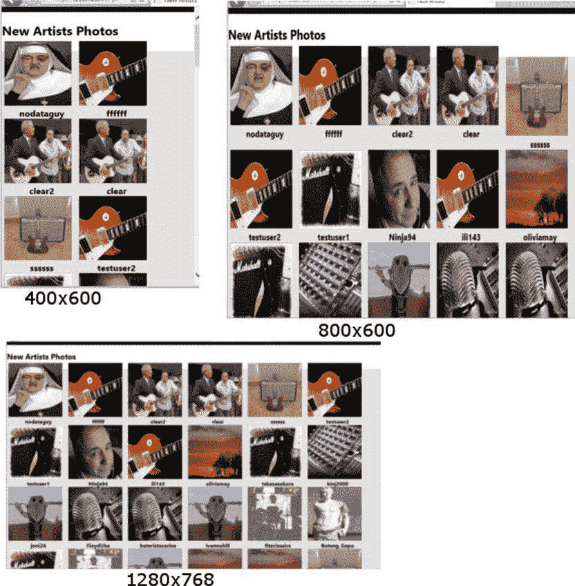
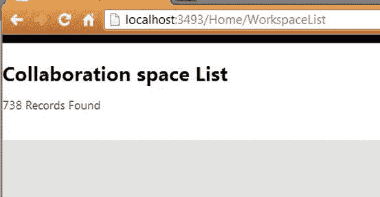
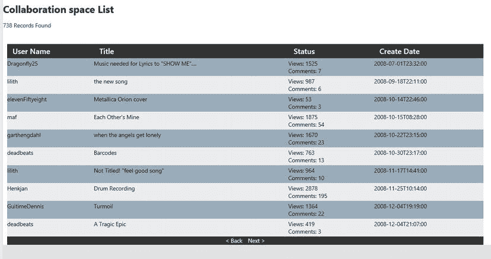
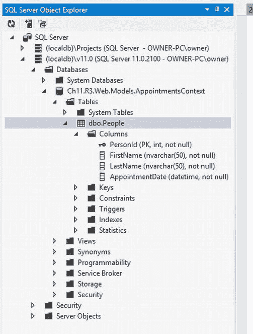
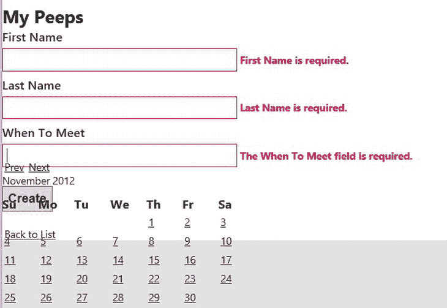
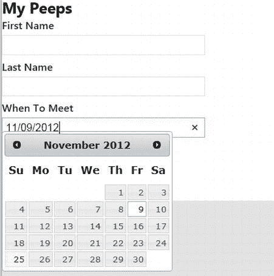
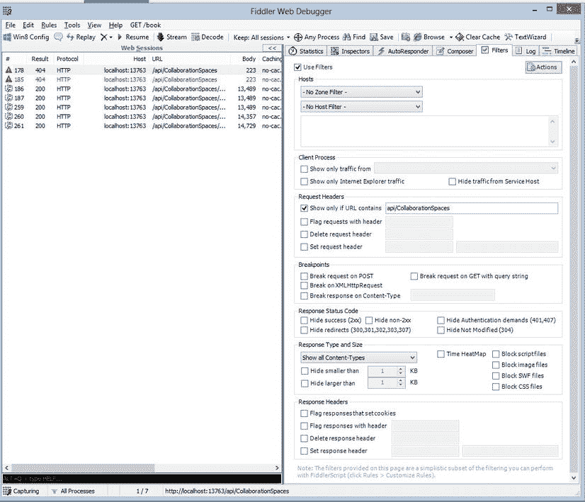
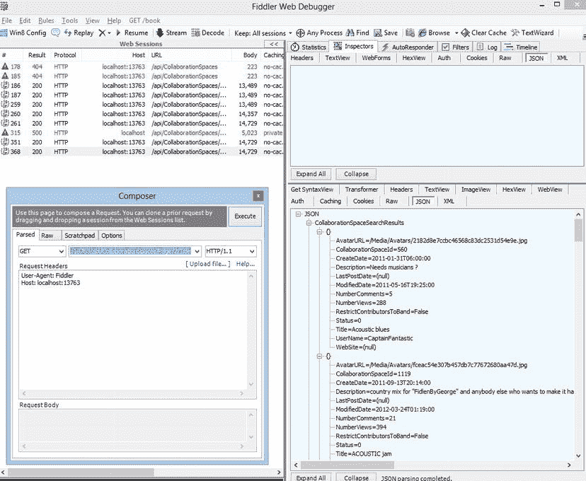

# 十一、使用 jQuery、Knockout.js 和 Web API 创建现代用户体验

11-1.使用 CSS 媒体查询创建自适应多栏布局

问题

您需要创建一个以多列格式显示照片列表的视图。它需要在多种设备上支持多种屏幕分辨率，包括 24 英寸显示器的个人电脑、微软 Surface RT 等平板电脑以及谷歌 Nexus 4 等智能手机。您希望能够创建一个适用于所有这些应用的视图，并且可以在需要时上下扩展和减少列数。

解决办法

最简单的方法是让你的服务器端代码呈现有序列表中的项目，然后使用 CSS3 媒体查询和其他自适应呈现技术来实现基于屏幕分辨率和尺寸的图像缩放。

它是如何工作的

所有现代网络浏览器，包括大多数移动设备上的浏览器，都支持一个叫做媒体查询的概念。*媒体查询*允许您确定用于访问网站的设备类型，以及它的一些功能，包括屏幕分辨率和支持的颜色数量。您可以使用这些信息来定制页面的视觉样式，以最适合您的设备的功能。

例如，如果用户使用 Nook 或 Kindle 等电子阅读器访问你的博客，你可能需要将你的配色方案改为使用更高对比度的配色方案。您可能还想修改页面的宽度，以便内容可以轻松地适应较小的屏幕。

另一方面，如果一个用户在一台大屏幕的 PC 上访问你的站点，并且浏览器被最大化，你可以使用媒体查询来用有用的内容填充通常未被使用的空白空间。

为了演示这项技术，我们展示了一个简单的照片页面。根据屏幕分辨率或浏览器窗口的大小，本例将有 2 到 10 列。它还会根据相同的参数动态改变图像的大小。该解决方案增加了在调整浏览器窗口大小时实时更改列数和图像大小的功能。

型号

这个解决方案使用一个外部程序集，该程序集使用实体框架与后端数据库通信。它基于配方 7-5 所示的例子。为了简化控制器逻辑并允许更容易的单元测试，所有的数据访问代码都被分解到一个简单的存储库类中，如清单 11-1 所示。

[***清单 11-1。***](#_list1)

```cs
public class EFArtistRepository : IArtistRepository
{
   private MobEntities m_context = new MobEntities();
   public IList<Artist> GetNewArtists()
   {
       var results = (from a in m_context.Artists
                      where a.ProfilePrivacyLevel == 0
                      orderby a.CreateDate descending
                      select a).Take(40);
        return results.ToList<Artist>();
   }

        ∼ EFArtistRepository()
        {
            Dispose(false);
        }
        public void Dispose()
        {
            Dispose(true);
            GC.SuppressFinalize(this);
        }
        protected virtual void Dispose(bool disposing)
        {
            if (disposing)
            {

                if (m_context != null)
                    m_context.Dispose();
            }
        }
}
```

清单 11-1 中的代码非常简单。它由一个方法组成，`GetNewArtists`。这个方法返回最近 40 个在网站上创建帐户的人的数据。

控制器

这个例子中的控制器也非常简单。像本书中的许多例子一样，它使用存储库模式和构造器注入模式来实现可测试性。关于这些模式的更多信息可以在第 7 章和第 9 章[中找到。](09.html)

控制器由两个动作组成。 `Index`动作除了返回主页之外什么也不做，没有控制器逻辑。 `NewArtists`动作从存储库中获取艺术家列表，然后将其传递给`NewArtists`视图。控制器如[清单 11-2](#list2) 所示。

[***清单 11-2。***](#_list2) 家庭控制器

```cs
public class HomeController : Controller
{

  public HomeController(IArtistRepository rep)
  {
    m_repository = rep;
  }
  public HomeController() : this (new EFArtistRepository()){}

   IArtistRepository m_repository;

  public ActionResult NewArtists()
  {
    IList<Artist> artists = m_repository.GetNewArtists();

    return View("NewArtists", artists);

  }
}
```

视图

观点也很简单。它首先使用`@model`指令将自己与`Artist`对象列表关联起来。然后，它使用一个名为`headercontent`的部分，这允许它在文档头中包含一个名为`Multicolumn.css`的 CSS 文件。

文件的其余部分是一个简单的`for`循环，包装在一个被分配了 CSS 类`DynamicColumns`的`DIV`中。代码遍历模型的`Artist`集合中的对象，并构建一个 HTML 无序列表。这通常显示为项目符号列表。

在每个列表项标签中有一个带有 CSS 类`AvatarImage`的 image ( `img`)标签，它被另一个带有 CSS 类`ImageDiv`的`DIV`所包裹。图像下方是艺术家的名字，它被包裹在一组`h3`标签中。

代码如[清单 11-3](#list3) 所示。CSS 类名以粗体突出显示。

[***清单 11-3。***](#_list3) NewArtist.cshtml

```cs
@model List<Ch7.SharedAPI.Artist>
@{
    ViewBag.Title = "New Artists";
}
@section headercontent{
    <link href="∼/Content/Multicolumn.css" rel="stylesheet" />
}
<h2>New Artists Photos</h2>

<div class=" DynamicColumns ">
    <ul>
        @foreach (var item in Model)
        {
            <li>
                <div class=" ImageDiv ">

                    
                    <h3>@item.UserName</h3>
                </div>
            </li>
    }
    </ul>
</div>
```

CSS

如果没有应用任何样式，我们的示例将显示为一个简单的图像列表。这个例子中的 CSS 是这个节目的主角。它独自将这个简单的代码转换成一个动态网格。CSS 代码的第一位(见[清单 11-4](#list4) )显示了`DynamicColumns`类的样式。第一个选择器将`list-style:none`设置为任何`UL`元素，这些元素可能嵌套在一个`DIV`元素中，并被分配了`DynamicColumns`类。这将删除项目列表中的项目符号。同样在这个相同的定义中，`UL`标签被设置为`display:inline`。这将删除通常放置在列表后面的换行符。

在下一个选择器中，`display:inline`被应用于`LI`元素。此设置防止每个列表项出现在自己的行上。

最后，为嵌套在带有`DynamicColumns`类的容器中的`H3`标签添加一个定义。这种样式移除了通常应用于`H3`标签的边距，并将文本居中对齐。

[***清单 11-4。***](#_list4) Multicolumn.css 动态列类

```cs
.DynamicColumns {
margin:10px;
}
.DynamicColumns ul {
     list-style:none;
         display:inline;
}

.DynamicColumns li{
     display:inline;
}

.DynamicColumns h3 {
    text-align: center;
    margin:0;
}
```

接下来，我们为`AvatarImage`和`ImageDiv`添加类选择器。在我们的例子中应用于图像元素的`AvatarImage`类使用百分比而不是固定的宽度来定义图像的尺寸。它还在每个图像周围添加了一个固定的五像素边距。如果将高度和宽度设置为 90%，剩余的 10%会在图像周围创建适量的空间。100%时，它们会彼此齐平。`ImageDiv`类选择器使图像向左浮动，然后将图像宽度设置为屏幕宽度的 40%。这将调整每个图像的大小，使其几乎占据屏幕的一半，从而创建两列。选择器如[清单 11-5](#list5) 所示。

[***清单 11-5。***](#_list5) Multicolumn.css 头像图片和 ImageDiv 类

```cs
.AvatarImage {
    height: 90%;
    width: 90%;
}

.ImageDiv {
    float: left;
    width: 40%;
}
```

到目前为止显示的所有 CSS 样式都可以在所有浏览器上工作。这些技术是众所周知的，并在数以千计的网站上使用。使用这种技术，您可以通过调整 `ImageDiv`类上的`width`属性的百分比来增加和减少显示的列数。例如，如果要显示三列而不是两列，可以将宽度设置为 30%。

如果您使用目前显示的 CSS 并运行应用，您会注意到，如果您将浏览器缩小到尽可能小的宽度，图像看起来会很好。然而，如果你将浏览器最大化，图像看起来会被拉长和像素化。

如果您能够动态地改变`ImageDiv`类的`width`属性的百分比，以便随着画布变大，会出现更多的列，那就更好了。

这正是我们使用 CSS 媒体查询要做的。在[清单 11-6](#list6) 中定义了五个媒体查询。每个都使用语法`@media all and (max-width: [max number]px) and (min-width: [min number]px)`。该声明指出，对于屏幕尺寸在[最大数量]和[最小数量]之间的所有设备类型，应用以下样式。在每个媒体查询中，我们重新定义了。`ImageDiv`选择器。随着屏幕变大，每个图像占屏幕的百分比会减少。这允许更多的图像出现在一行中。对于最小的屏幕，每行只会出现两个图像。宽度超过 701 像素后，得到三个图像。在窗口最大化的 1080p 或更好的显示器上，你将得到每行 20 个。

[***清单 11-6。***](#_list6) 使用媒体查询来动态改变 ImageDiv 的宽度

```cs
@media all and (max-width: 700px) and (min-width: 500px) {
    .ImageDiv {
        width: 30%;
    }
}

@media all and (max-width: 1200px) and (min-width: 701px) {
    .ImageDiv {
        width: 20%;
    }
}

@media all and (max-width: 1500px) and (min-width: 1201px) {
    .ImageDiv {
        width: 15%;
    }
}

@media all and (max-width: 1800px) and (min-width: 1501px) {
    .ImageDiv {
        width: 10%;
    }
}

@media all and (max-width: 20000px) and (min-width: 1801px) {
    .ImageDiv {
        width: 5%;
    }
}
```

[图 11-1](#Fig1) 显示了三种不同尺寸的页面。



[图 11-1](#_Fig1) 。出现在各种分辨率中的布局变化

支持的网络浏览器

CSS 媒体查询虽然得到了广泛的支持，但仍然是一项相对较新的技术。许多浏览器，如 Internet Explorer 8，不支持它们。在决定是否使用这种技术之前，您应该知道哪些浏览器支持它，哪些不支持。

表 11-1 列出了各种主要的网络浏览器，以及浏览器从哪个版本开始支持 CSS 媒体查询。

[表 11-1](#_Tab1) 。完全支持 CSS 媒体查询的浏览器

| 浏览器 | 支持的最低版本 | 操作系统 |
| --- | --- | --- |
| 微软互联网浏览器 | Nine | Windows 7、Windows 8、Windows Phone |
| Mozilla Firefox | Three point five | Windows、Mac、Linux |
| Android 版 Mozilla Firefox | Fifteen | 机器人 |
| 铬合金 | Four | Windows，Mac |
| 安卓版 Chrome 浏览器 | Eighteen | android 4.4 |
| Safari | Four | Windows、Mac、iOS |
| 歌剧 | Nine point six | Windows、Linux、Mac |
| 迷你歌剧 | Five | 安卓、黑莓、iOS |
| 安卓〔t0〕 | Two point one | 机器人 |
| 黑莓浏览器 | Seven | 黑莓 7，黑莓 10 |

如果有大量用户使用不支持的浏览器，要提供相同的体验，需要付出一定的努力。

如果你的网站有类似于全球平均水平的浏览器使用统计数据，那么 15%到 20%的用户在使用不支持的浏览器，比如 IE 7。有几种策略可以用来处理不支持的浏览器:

1.  *使用一组固定的柱子*。如果 90%的观众使用不支持的浏览器，媒体查询可能不适合你。
2.  *使用条件样式表* 。 Internet Explorer 5 及更高版本可以理解`<!--[if lt IE] 9> do this <![endif]-->.`格式的条件语句，这允许您指定标记，包括只能在 IE 8 及更早版本的浏览器中呈现的 HTML 链接语句。其他浏览器会将标记解释为注释掉，并忽略它。
3.  *使用 IE 聚合填充* 。一个*多填充*是旧版本浏览器的一个变通方法。它们通常用 JavaScript 实现。它们允许您使用 CSS 3.0 样式规则，而无需在样式表中编写特定于 IE 的变通方法。聚合填充可用于其他不受支持的浏览器，但并不常见。在 IE 6、IE 7 和 IE 8 中支持 CSS 媒体查询的一个很好的 polyfill 可以在`https://github.com/scottjehl/Respond`获得。但是，如果只有一小部分用户使用不支持的浏览器，使用 polyfill 可能是最好的策略。

要应用聚合填充，可以从网站下载该文件，将其包含在项目的脚本文件夹中，然后在视图中包含对该文件的引用。

添加聚合填充后，不受支持的浏览器现在将正确呈现页面。

如果您决定使用像 respond.js 这样的库，请验证您是从可信任的来源下载文件，并且该解决方案已经过社区审查。

11-2.创建无需整页回发即可分页和排序的数据网格

问题

您有一个需求，以类似网格的布局显示记录列表。你公司新的用户体验指南指出，你应该让用户停留在页面上，尽可能避免全文回发。在过去，您已经使用一个`GridView`控件和一个更新面板的组合在 ASP.NET WebForm 中创建了解决方案。你想知道使用 ASP.NET MVC 的同等技术。

解决方案

在这个解决方案中，我们将使用 ASP.NETWeb API 的组合来创建一个 RESTful Web 服务，它将允许我们从服务器获取 JSON 格式的数据页面。然后，我们将使用 jQuery 和 Knockout 的组合在客户机上呈现用户界面。当用户请求一个新的数据页面时，将向服务器发出一个 web 服务调用。

Knockout 是一个紧凑的 JavaScript 库，提供依赖跟踪和声明性数据绑定。

当收到响应时，客户端对象数组将被更新。然后，页面将使用淘汰库自动更新数据网格。然后我们将添加一些 CSS 动画来给页面过渡添加一些闪光。

它是如何工作的

这个解决方案使用 ASP.NET MVC 4 Web API 模板。该模板包含了所有需要的 JavaScript 库，并提供了一些样板代码来开始使用 web 服务。执行以下操作来创建项目:

1.  打开 Visual Studio。从文件菜单中选择新建项目。
2.  在“新建项目”窗口中，选择 ASP.NET MVC 4 Web 应用模板。将项目命名为 **Ch11。R2.Web** 并将该解决方案命名为 **Ch11。R2** 。单击确定。
3.  在新建 ASP.NET MVC 4 项目页面上，选择 Web API 模板。确保 Razor 视图引擎被选中，然后勾选“创建一个单元测试项目”复选框。保留默认的测试项目名称`Ch11.R2.Web.Tests`并点击 OK。
4.  接下来，添加对包含数据访问代码的外部程序集的引用。如果你遵循了安装本书代码示例的说明，可以在第一章的[中找到，你应该在代码示例目录的根目录下有一个名为`Shared\References`的文件夹。在那个文件夹中，有一个`SharedAPI.dll`文件。在解决方案资源管理器中右键单击`References`文件夹，然后浏览到该文件，添加对此文件的引用。勾选文件名旁边的框，然后单击确定。](01.html)
5.  Since the SharedAPI.dll connects to an external database, you will need to add the connection string to your `Web.config` file in order to use it. An example connection string is shown in [Listing 11-7](#list7). This connection string assumes that you are connecting to a database on your local developer machine.

    [***清单 11-7。***](#_list7) 使用共享库所需的 Web.config 连接字符串

    ```cs
    <connectionStrings>
     <add
       name="DefaultConnection"
       connectionString="data source=.;Initial Catalog=Ch7SharedDatabase;Integrated Security=SSPI;"
       providerName="System.Data.SqlClient"
        />

    <add name="MobEntities"

    connectionString="metadata=res://*/Mob.csdl|res://*/Mob.ssdl|res://*/Mob.msl;provider=System.Data.SqlClient;provider connection string=&quot;data source=.;initial catalog=Ch7SharedDatabase;integrated security=True;MultipleActiveResultSets=True;App=EntityFramework&quot;"
               providerName="System.Data.EntityClient" />
      </connectionStrings>
    ```

6.  添加对一个程序集的引用，该程序集包含一组在[第 10 章](10.html)中创建的 HTML 助手扩展。这个名为`Ch10.Shared.Helpers.dll`的程序集也包含在`Shared\References`文件夹中。

模型和知识库

我们现在将创建一个可以用来访问数据的存储库。虽然不要求使用存储库类，但这是一个好主意。使用存储库模式允许我们保持控制器逻辑简单，并使控制器更容易单独测试。在控制器中，我们将使用依赖注入模式，这样我们就可以在单元测试中使用模拟存储库。这种技术允许我们只测试控制器逻辑，而不需要担心数据访问代码。可以设置单独的测试来测试存储库。首先，我们将为我们的存储库创建接口:

1.  右键单击 web 应用项目中的`Models`文件夹，并选择 Add  New Item。
2.  在“添加新项目”窗口中，搜索并选择接口模板。将接口命名为**iajaxdatagridepository**，然后单击 Add。
3.  Modify the new file so that it defines a single method called `GetActiveCollaborationSpaces`that returns an `IList` of `CollaborationSpaceSearchResult` objects. The method should accept the parameters for the current page, the number of items per page, a sort expression, and an output parameter that will contain the number of items found. In addition to defining the `GetActiveCollaborationSpaces` method, the interface should also inherit `IDisposible`. This makes it easier for developers to clean up after unmanaged resources like database connections. The resulting interface should look like [Listing 11-8](#list8).

    [***清单 11-8。***](#_list8)iajaxdatagridepository

    ```cs
    using System;
    using System.Collections.Generic;

    namespace Ch11.R2.Web.Models
    {
        public interface IAjaxDataGridRepository : IDisposable
        {

            IList<CollaborationSpaceSearchResult> GetActiveCollaborationSpaces(
                int page,
                int count,
                string sortExpression,
                out int resultsFound);
        }
    }
    ```

此时，代码不会编译，因为我们需要定义`CollaborationSpaceSearchResult`类，如下所示:

1.  右键单击`Models`文件夹，并选择添加类。将新的类文件命名为 **AjaxDataGridModels.cs** 。
2.  将 using 语句添加到`Ch7.SharedAPI`的类中。这个命名空间是在我们之前添加的程序集中定义的。
3.  定义`CollaborationSpaceSearchResult`，如[清单 11-9](#list9) 所示。

[***清单 11-9。***](#_list9)CollaborationSpaceSearchResult 类

```cs
using Ch7.SharedAPI;
using System;
using System.Collections.Generic;

namespace Ch11.R2.Web.Models
{

    public class CollaborationSpaceSearchResult
    {
        public int CollaborationSpaceId { get; set; }
        public DateTime CreateDate { get; set; }
        public string Description { get; set; }
        public DateTime ? LastPostDate { get; set; }
        public DateTime ModifiedDate { get; set; }
        public int NumberComments { get; set; }
        public int NumberViews { get; set; }
        public bool RestrictContributorsToBand { get; set; }
        public CollaborationSpaceStatus Status { get; set; }
        public string Title { get; set; }
        public string UserName { get; set; }
        public string WebSite { get; set; }
        public string AvatarURL { get; set; }

    }
}
```

除了`CollaborationSpaceSearchResult`类，我们还需要一个类作为我们的模型。这个类将包括一个`CollaborationSpaceSearchResult`对象列表和许多其他属性，这些属性将跟踪视图的各种元素，比如当前页码和排序表达式。结果应该类似于[清单 11-10](#list10) 。

[***清单 11-10。***](#_list10) 协作空间搜索模式

```cs
public class CollaborationSpaceSearchResultModel
{
  public IList<CollaborationSpaceSearchResult> CollaborationSpaceSearchResults { get; set; }
  public int NumberOfResults{get;set;}
  public string ResultsDescription { get; set; }
  public int ItemsPerPage { get; set; }
  public int CurrentPage { get; set; }
  public string SortExpression { get; set; }
  public int TotalPages
  {
    get
    {
      if (ItemsPerPage != 0)
      {
        return NumberOfResults / ItemsPerPage;
      }
        return 0;
     }
   }
}
```

既然已经定义了存储库接口和模型，我们可以创建一个`IAjaxDataGridRepository`的实现。该实现将利用在`Ch7.SharedAPI`汇编中定义的库从数据库中检索数据。它还利用了库`Ch10.Shared.Helpers`中定义的 LINQ 扩展。这个扩展允许我们使用一个字符串来创建一个排序表达式，如下:

1.  通过在解决方案资源管理器中右键单击`Models`文件夹并选择 Add  Class 来创建新的类文件。
2.  将新类命名为**efajaxdatagridrepository . cs**。
3.  在新的类文件中，通过在类名后键入**:iajaxdatagridepository**来指示该类将实现`IAjaxDataGridRepository`。
4.  完成键入后，Visual Studio 会在`IAjaxDataGridRepository`中的`I`下面加下划线。如果您将鼠标悬停在下划线上，将会出现一个小菜单图标。点击按钮显示菜单，选择实现接口‘iajaxdatagridepository’。Visual Studio 将为方法`GetActiveCollaborationSpaces`和`Dispose`创建方法存根。
5.  为了正确实现除公共`Dispose`方法之外的`IDisposable`接口，实现该方法的一个受保护的虚拟版本，该版本采用一个名为`disposing`的`bool`参数。您还应该创建一个可用于释放非托管资源的析构函数。在析构函数内部，调用该方法的受保护虚拟版本，并将`disposing`参数设置为`false`。在 public dispose 方法中，调用该方法的受保护虚拟版本，将`disposing`参数设置为`true`，并通过调用`GC.SuppressFinalize(this)`告诉垃圾收集器不要调用该类的当前实例的终结器。
6.  接下来，创建我们之前引用的`Ch7.SharedAPI`集合中定义的 `MobEntities`类的全局实例。当`disposing`参数被设置为`true`时，确保它在我们的`Dispose`方法的受保护虚拟版本中被处理。
7.  在`GetActiveCollaborationSpaces`方法中，创建一个 LINQ 查询，该查询将返回带有所需页面和排序的结果集。

实现如清单 11-11 所示。

[***清单 11-11。***](#_list11) 知识库实现

```cs
using Ch10.Shared.Helpers;
using Ch7.SharedAPI;
using System;
using System.Collections.Generic;
using System.Linq;

namespace Ch11.R2.Web.Models
{
    public class EFAjaxDataGridRepository : IAjaxDataGridRepository
    {
        MobEntities m_context = new MobEntities();

        public IList<CollaborationSpaceSearchResult> GetActiveCollaborationSpaces(
            int page,
            int count,
            string sortExpression,
            out int resultsFound)
        {
            var collabSpacesQuery = from a in m_context.CollaborationSpaces
                                    join p in m_context.ArtistCollaborationSpaces
                                    on a.CollaborationSpaceId equals p.CollaborationSpaceId
                                    where a.Status != CollaborationSpaceStatus.Canceled &&
                                    a.Status != CollaborationSpaceStatus.OnHold &&
                                    a.Status != CollaborationSpaceStatus.Published &&
                                    a.AllowPublicView == true &&
                                    p.IsCreator == true
                                    select new CollaborationSpaceSearchResult()
                                    {
                                        CollaborationSpaceId = a.CollaborationSpaceId,
                                        CreateDate = a.CreateDate,
                                        Description = a.Description,
                                        LastPostDate = a.LastPostDate,
                                        ModifiedDate = a.ModifiedDate,
                                        NumberComments = a.NumberComments,
                                        NumberViews = a.NumberViews,
                                        RestrictContributorsToBand =
                                          a.RestrictContributorsToBand,
                                        Status = a.Status,
                                        Title = a.Title,
                                        UserName = p.Artist.UserName,
                                        WebSite = p.Artist.WebSite,
                                        AvatarURL = p.Artist.AvatarURL
                                    };

            resultsFound = collabSpacesQuery.Count();

            int skip = getSkip(page, count);
            if (String.IsNullOrEmpty(sortExpression))
            {
                sortExpression = "CreateDate";
            }
            collabSpacesQuery = collabSpacesQuery.OrderBy(sortExpression).Skip(skip).Take(count);

            return collabSpacesQuery.ToList<CollaborationSpaceSearchResult>();
        }

        private int getSkip(int page, int count)
        {
            if (page < 2)
            {
                return 0;
            }
            else
            {
                return page * count;
            }
        }

        ∼EFAjaxDataGridRepository()
        {
            Dispose(false);
        }
        public void Dispose()
        {
            Dispose(true);
            GC.SuppressFinalize(this);
        }
        protected virtual void Dispose(bool disposing)
        {
            if (disposing)
            {

                if (m_context != null)
                    m_context.Dispose();
            }
        }
    }
}
```

控制器

到目前为止，模型和存储库代码与您在本书中看到的其他例子非常相似。在这个模型中，不需要做什么特别的事情来实现 Ajax 驱动的丰富用户界面。

然而，对于控制器，设计需要改变。为了支持丰富的用户体验，我们需要将控制器逻辑分成两个类。第一个是 Web API 控制器。这个控制器的主要工作与您构建的其他控制器没有什么不同。它允许用户与模型进行交互。发生变化的是更新视图的机制。这个类将从`ApiController`基类派生而来。

第二个控制器将担任内容交付的角色。在这种情况下，它只包含足够的逻辑来传递视图。它将从`Controller`类派生而来。

Web API 控制器

我们将从 API 控制器开始。当我们创建项目时，Web API 模板向项目添加了一个名为`ValuesController`的控制器。这个控制器包括匹配每个 HTTP 动词的动作— `GET`、`POST`、`PUT`和`DELETE`。当使用 RESTful 编程风格时，按照惯例，每个动词都与一个相应的 CRUD 操作相关联。有关 REST 的更多信息，请参考配方 11-8。

在这个配方中，我们将只实现一个读操作和一个单独的动作。我们将重命名这个类，以便它更好地匹配我们的业务案例。使用下面的步骤，您可以将模板中包含的 API 控制器转换成一个满足该配方需要的控制器。

1.  在解决方案资源管理器中的`Ch11.R2.Web`项目的控制器节点下找到文件。右键单击它并选择重命名。
2.  重命名文件**CollaborationSpacesController**。
3.  当提示对`ValuesController`的所有引用执行类似的重命名时，单击是。
4.  打开`CollaborationSpacesController.cs`文件，为`Ch11.R2.Web.Models`添加一条 using 语句。
5.  删除文件中的所有操作。
6.  用签名`CollaborationSpaceSearchResultModel Get(int? Page, string SortExpression)`创建一个新动作。
7.  Modify the contents of this action, as shown in [Listing 11-12](#list12).

    [***清单 11-12。***](#_list12) 协作空间控制器

    ```cs
    public class CollaborationSpacesController : ApiController
    {

      IAjaxDataGridRepository m_repository = new EFAjaxDataGridRepository();

      // GET api/CollaborationSpaces?Page=1&SortExpression=CreateDate
      public CollaborationSpaceSearchResultModel Get(
               int? Page,
               string SortExpression)  {
         int resultsFound;
         int page = Page ?? 1;
         string sortExpression = SortExpression ?? "CreateDate";
         var model = new CollaborationSpaceSearchResultModel();
         model.CollaborationSpaceSearchResults =
              m_repository.GetActiveCollaborationSpaces(
                    page,
                    10,
                    SortExpression,
                    out resultsFound);
         model.NumberOfResults = resultsFound;
         model.ItemsPerPage = 10;
         model.CurrentPage = page;
         model.SortExpression = sortExpression;
         return model;
      }

    }
    ```

     **提示**使用 C# 零合并操作符。这种技术提供了一种非常简洁的方法来检查一个`null`值，然后提供一个值。这种技术显示在[清单 11-10](#list10) 中。在这里，我们测试可空的`Page`是否有值，如果有，将一个`int`变量页赋值为 1。语法`int page= Page??1`相当于写`int page = Page.HasValue ? Page.Value : 1`。

8.  在测试项目中，找到文件`Controllers\ValuesControllerTests.cs`，并将文件重命名为**collaborationspacescontrollertests . cs**`.`
9.  重命名测试文件**CollaborationSpacesControllerTests**，然后删除除`GET.`之外的所有测试方法，注释掉`GET`方法。我们将在后面的步骤中编写我们的测试。现在，我们将注释掉这个测试方法，以便解决方案可以编译。
10.  通过从 Visual Studio“生成”菜单中选择“生成解决方案”,确认没有语法错误。

清单 11-12 中的动作有两个参数。第一个是页码，第二个是 `SortExpression`，它应该包含结果排序所依据的列的名称。 `Page`参数可以为空。这允许从路线中无错误地省略该参数。当`Page`参数为`null`时，我们返回结果集的第一页。`SortExpression`参数的默认值为 `CreateDate`。

若要验证是否可以访问 API 控制器，请单击 Visual Studio 主工具栏中的“开始调试”按钮。该网站的主页将显示在您的浏览器中。将 URL 与服务的路径附加在一起，这将是`/api/CollaborationSpaces`。如果您使用的是 Internet Explorer，浏览器会提示您下载或打开文件。如果这样做，您将会看到该文件包含一条错误消息，指出它无法将 URL 与控制器匹配。

您看到错误的原因是因为没有为页面和排序定义带有默认参数的路线。为了让它工作，您需要以查询字符串的形式为两个参数指定值；比如`/api/CollaborationSpaces?Page=1&SortExpression=CreateDate`。如果您想为 API 控制器启用默认值，您将需要在`/App_Start/WebApiConfig.cs`文件中添加一个新的路由定义，如[清单 11-13](#list13) 所示。关于如何创建自定义 API 路线的详细说明和解释在配方 11-9 中。

[***清单 11-13。***](#_list13) 自定义 API 路由

```cs
using System;
using System.Collections.Generic;
using System.Linq;
using System.Web.Http;

namespace Ch11.R2.Web
{
    public static class WebApiConfig
    {
        public static void Register(HttpConfiguration config)
        {
            config.Routes.MapHttpRoute(
            name: "PagingApi",
            routeTemplate: "api/{controller}/Page/{Page}/{SortExpression}",
            defaults: new
            {
             Page = 0,
             SortExpression = "CreateDate"
            }
            );
            config.Routes.MapHttpRoute(
                name: "DefaultApi",
                routeTemplate: "api/{controller}/{id}",
                defaults: new { id = RouteParameter.Optional }
            );
        }
    }
}
```

在进行这一更改并重新编译代码后，如果您输入完整的 URL，包括查询字符串(例如，`http://localhost:3493/api/CollaborationSpaces/Page/1`)，Internet Explorer 将提示您下载一个文件，但这次它应该包含 JSON 格式的请求数据。如果你使用的是 Chrome，它会返回相同的数据，但是是 XML 格式的。

查看和调试 Web API 响应的输出的另一种技术显示在 Recipe 11-10 中，它描述了如何使用 Fiddler 4 Web 代理应用。如果您使用 Fiddler 4，您会看到 Internet Explorer 和 Chrome 在提交请求时使用略有不同的 HTTP 头，这导致了不同的格式。根据请求中提供的`HTTP Accept`头，Web API 支持返回 XML 或 JSON 。

内容控制器

用于传递内容的控制器动作不需要复杂。对于这个例子，我们将向 home 控制器添加一个名为`WorkspaceList`的动作。这个控制器将简单地返回一个`ViewResult`。它的视图不会是强类型的。事实上，视图和控制器都不需要了解模型。它们只是一种内容交付机制。

要创建`WorkspaceList`动作，请执行以下操作:

1.  打开`HomeController.cs`文件。
2.  Add a new action method, as shown in [Listing 11-14](#list14).

    [***清单 11-14。***](#_list14) 工作区列表动作

    ```cs
    public ActionResult WorkspaceList()
    {
      return View();
     }
    ```

3.  通过在代码编辑器中右键单击方法名并选择 Add View，为`WorkspaceList`动作创建相应的视图。
4.  在“添加视图”窗口中，确认默认值如下，然后单击添加:
    *   a.视图名称:工作空间列表
    *   b.视图引擎:剃刀
    *   c.创建强类型视图:未选中
    *   d.创建为局部视图:未选中
    *   e.使用布局或母版页:选中

为你的 API 控制器创建单元测试

当你开发你的控制器时，你也应该为它们创建单元测试。这个过程的第一步是将一个模拟的存储库实现传递到控制器的构造函数中。您可以通过定义一个接受对象实例的构造函数来实现这一点，该构造函数将`IAjaxDataGridRepository`实现为一个参数。您还需要创建一个 MVC 框架可以使用的无参数构造函数。这项技术在[第 9 章](09.html)中有详细解释。[清单 11-15](#list15) 显示了修改了构造函数的`CollaborationSpacesController`。

[***清单 11-15。***](#_list15) 构造函数创建支持构造函数注入

```cs
IAjaxDataGridRepository m_repository;

public CollaborationSpacesController(IAjaxDataGridRepository respository)
{
  m_repository = respository;
}

//constructor required by MVC Framework
// uses the EFArchitectRepository as the default controller
public CollaborationSpacesController() : this(new EFAjaxDataGridRepository()) { }
```

这个修改允许我们使用库的模拟实现来测试控制器。对于这个例子，我们将使用 Moq 框架。配方 9-8 给出了一个详细的例子，说明如何使用 Moq 来测试一个使用存储库的控制器。

Web API 控制器和常规控制器的一个很大的区别是 API 控制器可以返回任何 C# 类型。它们不像常规控件那样返回`ActionResult`。在某些方面，这使得为 API 控制器编写测试变得相对简单。[清单 11-16](#list16) 显示了对`CollaborationSpacesController` Get 动作的测试。它使用 Moq 库创建一个模拟库的实例，并将其传递给控制器的构造函数。然后它调用 Get 动作，并使用测试框架的`Assert`函数来验证模型包含了预期的信息。

[***清单 11-16。***](#_list16) 验证路线参数默认值的单元测试

```cs
using Ch11.R2.Web.Controllers;
using Ch11.R2.Web.Models;
using Microsoft.VisualStudio.TestTools.UnitTesting;
using Moq;

namespace Ch11.R2.Web.Tests.Controllers
{
    [TestClass]
    public class CollaborationSpaceControllerTests
    {
        [TestMethod]
        public void Get_PageNullSortNull_ReturnPage1SortedByCreateDate()
        {
            // Arrange
            var mock = new Mock<IAjaxDataGridRepository>();
            CollaborationSpacesController controller =
                new CollaborationSpacesController(mock.Object);

            // Act
            CollaborationSpaceSearchResultModel result = controller.Get(null, null);

            // Assert
            Assert.AreEqual(1, result.CurrentPage);
            Assert.AreEqual("CreateDate", result.SortExpression);

        }

        // Other tests go here
    }
}
```

通过使用这种技术，我们可以编写覆盖所有预期用例的测试。

工作区列表视图

`WorkspaceList`视图将由三个文件组成:

*   `Views/Home/WorkspaceList.cshtml`:视图本身。
*   `Scripts/Home/WorkspaceList.cshtml.js`:包含视图的客户端脚本。
*   `Content/Home/WorkspaceList.css`:该视图特有的样式信息。

您需要创建每个所需的文件，然后在视图中添加对它们的引用，如下所示:

1.  右键单击脚本节点，并选择添加新文件夹。
2.  将新文件夹命名为 **Home** 。
3.  右键单击`Home`文件夹，选择添加新项目。
4.  在“添加新项目”窗口中，通过在搜索框中键入 **JavaScript** 来搜索文件模板。找到模板后，选择 JavaScript 文件。
5.  将文件命名为 **WorkspaceList.cshtml.js** ，然后单击 Add。

按照类似的过程在 C `ontent/Home`文件夹中创建`WorkspaceList.css`，但是在创建文件时，选择样式表模板。

除了这三个定制文件，页面还使用了 JavaScript 库 jQuery、Knockout.js 和 Knockout.Mapping.

jQuery 将用于与后端 web 服务通信，并将 JSON 数据绑定到客户端模型。击倒对手。映射会将从 web 服务调用接收的数据转换成可用于 Knockout.js 的类型，这将提供声明性数据绑定和模板。

在这三个 JavaScript 库中，JQuery 和 Knockout.js 默认包含在 Web API Visual Studio 模板中。击倒对手。不包括映射，必须使用 NuGet 包管理器添加映射，如下所示:

1.  在解决方案资源管理器中右击"引用"节点，然后选择"管理 NuGet 包"。
2.  确保选择了在线类别，然后使用搜索框查找 Knockout.Mapping。
3.  单击软件包旁边的安装按钮。该包将添加到项目中。
4.  单击“关闭”按钮关闭“管理 NuGet 包”窗口。

 **提示**当开始一个大量使用客户端脚本库(如 jQuery 和 Knockout.js)的新项目时，你应该经常检查以确保你有最新版本的 NuGet 包。为此，请在解决方案资源管理器中右键单击 web 应用项目的“引用”节点，然后选择“管理 NuGet 包”。在“管理 NuGet 包”窗口中，单击“更新”节点。任何过期的包都会在这里列出。您可以通过单击每个软件包的更新按钮来更新它们。

在`WorkspaceList.cshtml`文件中，包含脚本部分。在解决方案资源管理器中展开脚本节点，然后将文件`knockout-2.2.0.js`(或当前版本)拖到脚本部分。重复`knockout.mapping-latest.js`和`Home/WorkspaceList.cshtml.js`的程序。当你完成后，脚本部分应该看起来像[清单 11-17](#list17) 。

[***清单 11-17。***](#_list17) 添加到 WorkspaceList.cshtml 的脚本引用

```cs
@section scripts{
    <script src="∼/Scripts/knockout-2.2.0.js"></script>
    <script src="∼/Scripts/knockout.mapping-latest.js"></script>
    <script src="∼/Scripts/Home/WorkspaceList.cshtml.js"></script>
}
```

请注意脚本文件的列出顺序。按照这个顺序列出它们很重要，因为它们相互依赖。

页面加载后的数据绑定

当创建传统的 MVC 视图时，数据绑定发生在服务器上，数据和其余的页面标记一起被发送到客户端。在 Ajax 风格的页面中，只发送页面标记。因此，当页面第一次加载时，它不包含任何数据。如果不希望这样，可以采用混合方法，在服务器端呈现初始数据页面，并在初始请求时与标记一起发送。然而，对于这个例子，我们演示的是一种纯 Ajax 方法。

为了用数据填充页面，我们将使用 jQuery 的 Ajax 功能来调用我们的 Web API，然后将 JSON 结果转换成 JavaScript 数组。jQuery 的`$.getJSON`让这变得非常容易。`$.getJSON`需要两个参数。第一个是您想要调用的服务的 URL，第二个是在 web 服务调用成功完成时执行的函数。按照惯例，大多数 JavaScript 程序员将内联定义函数。

在我们的完成函数中，我们需要动态生成一些 HTML 代码来显示我们的数据。在 Knockout 发明之前，您可能已经通过遍历 JavaScript 对象数组并使用`document.write` 语句输出内容来实现了这一点。如果您曾经编写过这种类型的代码，您就会知道这并不理想。

谢天谢地，Knockout.js 库为我们做了所有这些艰苦的工作。您需要做的就是在视图中使用普通的 HTML 定义一个模板，并添加一些`data-bind`属性。然后调用 Knockout 的`applyBinding`方法。唯一棘手的地方是 Knockout.js 要求其绑定表达式中使用的数据包装在一个`ks.observable`对象容器中。该容器跟踪对数据所做的更改，并使 Knockout.js 保持 UI 与数据同步。

再说一次，我们很幸运。击倒对手。映射库包含一个`ko.mapping.fromJS`函数，它接受一个 JavaScript 对象并将其转换为可观察对象。

清单 11-18 中显示了一个例子。这个例子的美妙之处在于只需要编写很少的代码。

[***清单 11-18。***](#_list18)workspace list . cshtml . js 页面加载代码

```cs
$(function () {
    $.getJSON("/api/CollaborationSpaces/Page/1",
        function (data)
{
            var viewModel = ko.mapping.fromJS(data);
            ko.applyBindings(viewModel);
        }
    );
});
```

在[清单 11-13](#list13) 的第一行，我们调用 jQuery `$()`函数。这个函数将在页面的 DOM 加载后立即执行。在早期版本的 jQuery 中，您需要使用`$(document).ready`来获得相同的行为，但是现在已经没有必要了。

在`$()`中，我们定义了另一个调用`$.getJSON`的函数。它将 URL `/api/CollaborationSpaces/Page/1`作为参数，返回包含 20 行 JSON 格式数据的结果集。`$.getJSON`的第二个参数是成功回调函数。在这种情况下，我们内联实现该函数。这个内联函数接受一个名为`data—`的参数，这个 JavaScript 对象是由`$.getJSON`函数从 JSON 结果中创建的。

在成功回调中，我们首先使用`ko.mapping.fromJS`来创建一个可观察到的淘汰。然后我们调用`ko.applyBindings`将数据绑定到视图。

向视图添加绑定标记

既然我们已经设置了数据绑定代码，它将在文档完成加载后立即触发，我们需要向视图中添加一些 HTML 元素来绑定数据。

要将数据绑定到 HTML 元素，您可以使用 HTML5 `data-*`属性语法来指定您正在绑定的数据以及您希望绑定到当前 HTML 元素的哪个属性。让我们首先添加一个 HTML `span`元素，它将包含找到的结果的数量。我们将 JSON 的`NumberOfResults`属性绑定到`span`元素的`text`属性，如下:

1.  在代码编辑器中打开`WorkspaceList.cshtml`文件。
2.  在`h2`元素后添加一个 span 元素。
3.  向 span 元素添加以下属性:`data-bind="text: NumberOfResults"`。
4.  类型**记录在`span`元素后找到**。
5.  完成的标记应该看起来像清单 11-19 中的[。](#list19)

[***清单 11-19。***](#_list19) 在 Span 元素上使用数据绑定

```cs
@{
    ViewBag.Title = "Collaboration space List";
}

<h2>@ViewBag.Title</h2>
<p><span id="ItemsFound" data-bind="text: NumberOfResults"></span> Records Found</p>
<br />

@section scripts{
    <script src="∼/Scripts/knockout-2.2.0.js"></script>
    <script src="∼/Scripts/knockout.mapping-latest.js"></script>
    <script src="∼/Scripts/Home/WorkspaceList.cshtml.js"></script>
}
```

如果保存文件并刷新页面，您应该会看到如图[图 11-2](#Fig2) 所示的文本。



[图 11-2](#_Fig2) 。显示记录的数量

接下来，我们将添加数据网格。为此，我们首先定义一个包含标题行的 HTML 表格。然后我们创建一个行模板。最后，我们将模板绑定添加到表中，该表将通过 JSON 结果中的`CollaborationSpaceSearchResults`数组进行循环。对标题行使用`THEAD`标记很重要；否则，标题将无法正常显示。

HTML 表格由普通的 HTML 组成，如清单 11-20 所示。

[***清单 11-20。***](#_list20) 表格定义

```cs
<table>
    <thead>
        <tr>
            <th>User Name</th>
            <th>Title</th>
            <th>Status</th>
            <th>Create Date</th>
        </tr>
    </thead>
</table>
```

接下来，我们为行添加模板。Knockout.js 模板由带有数据绑定属性的 HTML 标记组成，这些属性包装在带有类型属性`"text/html"`的脚本标签中。模板还需要一个 ID，稍后我们将在表的数据绑定表达式中使用它。行模板如清单 11-21 中的[所示。绑定的标记以粗体文本突出显示。](#list21)

[***列表 11-21。*T4**](#_list21)行模板

```cs
<script id="CollaborationSpaceTemplate" type="text/html">
    <tr>
        <td data-bind="text: UserName"></ td>
        <td data-bind="text: Title "></td>
        <td>
            Views:    <span data-bind="text: NumberViews" ></span><br />
            Comments: <span data-bind="text: NumberComments" ></span>
        </td>
        <td data-bind="text: CreateDate" ></td>
    </tr>
</script>
```

这个难题的最后一块是表的数据绑定。它使用稍微复杂一点的绑定语法将表绑定到模板。与其他绑定一样，您将向 table 元素添加一个`data-bind`属性。在绑定中，您指定您想要使用模板绑定，然后在花括号中，您指定模板的名称，后跟与`CollaborationSearchResults`数组绑定的`foreach`绑定表达式。[清单 11-22](#list22) 显示了添加了绑定语法的表格定义。

[***清单 11-22。***](#_list22) 表格定义与数据绑定

```cs
<table data-bind="template: {name: 'CollaborationSpaceTemplate', foreach: 
CollaborationSpaceSearchResults}">
    <thead>
        <tr>
            <th>User Name</th>
            <th>Title</th>
            <th>Status</th>
            <th>Create Date</th>
        </tr>
    </thead>
</table>
```

如果您运行该项目，您应该会看到数据的第一页。

向网格添加分页

为了让用户在数据页面之间导航，您需要添加一些用户界面元素来促进这一点。在这个例子中，我们将使用位于网格下方的简单的后退和前进按钮。

当用户在页面之间移动时，他们需要跟踪当前页面和正在使用的排序表达式。排序功能将在下一节中添加。

为此，我们将在`WorkspaceList.cshtml.js`文件中添加一些全局变量。然后我们将添加一个名为`Move`的新函数。该函数将调用服务来检索下一页数据，然后将结果重新绑定到网页。`Move`函数将一个数字作为参数。该数字可以是正数，也可以是负数。要向前移动一页，您可以调用`Move(1)`。要搬回来，可以叫`Move(-1`。当我们这样做的时候，我们还可以重构代码，这样所有的后端调用都被转移到一个名为`getData`的方法中。更新后的 JavaScript 文件如[清单 11-23](#list23) 所示。

[***清单 11-23。***](#_list23)workspace list . cshtml . js 中的 Move 函数

```cs
var CurrentSort="CreateDate";
var CurrentPage=1;

function getData() {
    $.getJSON("/api/CollaborationSpaces/Page/" + CurrentPage + "/" + CurrentSort,
        function (data) {
            togglePageButtons(data);
            var viewModel = ko.mapping.fromJS(data);
            ko.applyBindings(viewModel);
        }
        );
}
$(function () {
    getData();
});
function Move(pages) {
    CurrentPage = CurrentPage + pages;
    getData();
}

function togglePageButtons(data) {
    if (data) {
        if (data.CurrentPage == 1) {
            $("#back").hide();
        }
        else {
            $("#back").show();
        }

        if (data.CurrentPage == (data.NumberOfResults / data.ItemsPerPage)) {
            $("#next").hide();
        }
        else {
            $("#next").show();
        }
    }
}
```

除了`Move`功能，我们还增加了 `togglePageButtons`。这个函数使用从 web 服务调用返回的数据来确定当前页面和页面总数。当我们在第一页时，它使用这个信息隐藏后退按钮，如果我们在最后一页时，隐藏下一步按钮。

在视图中，我们将更新表格定义，使其包含后退和前进按钮的页脚部分。修改后的表格定义如[清单 11-24](#list24) 所示。

[***清单 11-24。***](#_list24) 带分页的表增加了

```cs
<table data-bind="template: {name: 'CollaborationSpaceTemplate', foreach: CollaborationSpaceSearchResults}" class="grid">
    <thead>
        <tr>
            <th>User Name</th>
            <th>Title</th>
            <th>Status</th>
            <th>Create Date</th>
        </tr>
    </thead>
    <tfoot>
        <tr>
            <td colspan="4" class="Pager">
                <span id="back" onclick="Move(-1)">&lt; Back</span>
                <span id="next" onclick="Move(1)">Next &gt;</span>
            </td>
        </tr>
    </tfoot>
</table>
```

如果您运行项目，您现在应该能够在数据页面之间移动。

添加排序

最后一点功能允许用户通过单击网格的列标题来更改数据的排序方式。为此，我们将为`WorkspaceList.cshtml.js` 添加一个名为`Sort`的新函数。`Sort`函数将包含排序表达式的字符串作为参数。`Sort`功能如[清单 11-25](#list25) 所示。

[***清单 11-25。***](#_list25) 向 WorkspaceList.cshtml.js 添加排序功能

```cs
function Sort(column) {
    CurrentSort = column;
    CurrentPage = 1;
    getData();
}
```

再次需要更新`WorkspaceList.cshtml`中的表格定义，以便每个标题列都是一个可点击的链接。每个都有一个`onclick`事件来调用`Sort`函数。更新后的表格如清单 11-26 中的[所示。](#list26)

[***清单 11-26。***](#_list26)workspace list . cs html

```cs
<table data-bind="template: {name: 'CollaborationSpaceTemplate', foreach: CollaborationSpaceSearchResults}" class="grid">
    <thead>
        <tr>
            <th> <a href="#UserName" onclick="Sort('UserName')">User Name</a></ th>
            <th> <a href="#Title" onclick="Sort('Title')">Title</a></ th>
            <th> <a href="#NumberComments" onclick="Sort('NumberComments')">Status</a ></th>
            <th> <a href="#CreateDate" onclick="Sort('CreateDate')">Create Date</a> </th>
        </tr>
    </thead>
    <tfoot>
        <tr>
            <td colspan="4" class="Pager">
                <span id="back" onclick="Move(-1)">&lt; Back</span>
                <span id="next" onclick="Move(1)">Next &gt;</span>
            </td>
        </tr>
    </tfoot>
</table>
```

如果运行此页面，您应该能够对数据进行排序和分页。

改善用户体验

在这一点上，即使数据网格是功能性的，它也不是用户友好的或者有吸引力的。第一个问题是，在排序或分页时，它没有显示任何正在发生的事情的迹象。当您在本地机器上开发和测试时，页面会加载得很快，您可能不会注意到这是一个问题。然而，在生产中，当人们远程访问时，网络延迟通常会导致用户在数据加载前等待几秒钟。最佳做法是给用户一些提示，说明页面正在等待。

对于这个例子，我们将使用一个包含文本“正在加载…”的`DIV`元素在每个 web 服务调用的开始，我们将显示文本块。装载完成后，我们会把它藏起来。为此，我们将清单 11-27[中所示的标记](#list27)添加到`WorkspaceList.cshtml`中，就在表格下方。

[***清单 11-27。***](#_list27) 添加数据加载指示器

```cs
<div id="LoadingDiv">Loading. . .</div>
```

为了实现显示和隐藏，我们将更新每个调用 web 服务的 JavaScript 函数。[清单 11-28](#list28) 显示了更新后的`Sort`函数。

[***清单 11-28。***](#_list28) 排序功能更新为显示和隐藏装载指示器

```cs
function getData() {
    $.getJSON("/api/CollaborationSpaces/Page/" + CurrentPage + "/" + CurrentSort,
        function (data) {
            togglePageButtons(data);
            var viewModel = ko.mapping.fromJS(data);
            ko.applyBindings(viewModel);
            $("#LoadingDiv").hide();
        }
        );
}
function Move(pages) {
    CurrentPage = CurrentPage + pages;
    $("#LoadingDiv").show();
    getData();
}

function Sort(column) {
    $("#LoadingDiv").show();
    CurrentSort = column;
    CurrentPage = 1;
    getData();
}
```

现在，每当页面获取数据时，加载指示器都会短暂显示。

我们的网格需要的下一个重要的东西是风格。应该修改样式表，以便为表格添加底纹和格式。然后需要将对样式表的引用添加到视图中。CSS 文件引用通常被添加到 HTML 文档的头部分。因为这个页面使用了一个布局页面，并且不包含自己的标题部分，所以我们必须首先在布局页面中定义一个部分，然后在视图中包含这个部分。[清单 11-29](#list29) 显示了添加到`_Layout.cshtml`中的新部分，而[清单 11-30](#list30) 显示了添加到页面中的 CSS 引用。

[***清单 11-29。***](#_list29) 向 Views/Shared/_Layout.cshtml 添加一个部分

```cs
<!DOCTYPE html>
<html>
<head>
    <meta charset="utf-8" />
    <meta name="viewport" content="width=device-width" />
    <title>@ViewBag.Title</title>
    @Styles.Render("∼/Content/css")
    @RenderSection("header", required: false)
    @Scripts.Render("∼/bundles/modernizr")
</head>
<body>
    <header>
    <div class="content-wrapper">
        <div class="float-left">
            <p class="site-title">
            <a href="∼/">Web API Demo</a></p>
        </div>
    </div>
</header>
    @RenderBody()

    @Scripts.Render("∼/bundles/jquery")
    @RenderSection("scripts", required: false)
</body>
</html>
```

[***清单 11-30。***](#_list30) 引用 Home/WorkspaceList.cshtml 中的 CSS 文件

```cs
@{
    ViewBag.Title = "Collaboration space List";
}
@section header{
    <link href="∼/Content/Home/WorkspaceList.cshtml.css" rel="stylesheet" />
}

<h2>@ViewBag.Title</h2>
<p><span id="ItemsFound" data-bind="text: NumberOfResults"></span> Records Found</p>
<p>Page <span id="PageNumber" data-bind="text: CurrentPage"></span></p>
<br />

<table data-bind="template: {name: 'CollaborationSpaceTemplate', foreach: CollaborationSpaceSearchResults}" id="DataGrid" class="grid">
    <thead>
        <tr>
            <th><a href="#UserName" onclick="Sort('UserName')">User Name</a></th>
            <th><a href="#Title" onclick="Sort('Title')">Title</a></th>
            <th><a href="#NumberComments" onclick="Sort('NumberComments')">Status</a></th>
            <th><a href="#CreateDate" onclick="Sort('CreateDate')">Create Date</a></th>
        </tr>
    </thead>
    <tfoot>
        <tr>
            <td colspan="4" class="Pager">
                <span id="back" onclick="Move(-1)">&lt; Back</span>
                <span id="next" onclick="Move(1)">Next &gt;</span>
            </td>
        </tr>
    </tfoot>
</table>
<div id="LoadingDiv">Loading. . .</div>
<script id="CollaborationSpaceTemplate" type="text/html">
    <tr>
        <td data-bind="text: UserName"></td>
        <td data-bind="text: Title"></td>
        <td>
            Views:    <span data-bind="text: NumberViews"></span><br />
            Comments: <span data-bind="text: NumberComments"></span>
        </td>
        <td data-bind="text: CreateDate"></td>
    </tr>
</script>

@section scripts{
    <script src="∼/Scripts/knockout-2.2.0.js"></script>
    <script src="∼/Scripts/knockout.mapping-latest.js"></script>
    <script src="∼/Scripts/Home/WorkspaceList.cshtml.js"></script>
}
```

我们需要做的最后一件事是给表格行添加交替的颜色。jQuery 使这项工作变得非常简单。在样式表中，我们将为奇数和偶数行创建样式，如清单 11-31 所示。

[***清单 11-31。***](#_list31)Content/Home/workspace list . cs html . CSS

```cs
.grid {
    background-color: #fff;
    margin: 5px 0 10px 10px;
    padding-left: 5px;
    width: 95%;
}
    .grid td {
        color: #1a1a1a;
        vertical-align: top;
    }

    .grid td textarea {
        width:98%;
        border-width:2px;
        height: 3em;
        border-color:lightblue;
    }

        .grid td input[type="text"], .grid td input[type="number"] {
            border: 2px solid lightblue;
            width: 98%;
            height: 2em;
        }

    .grid th {
        background-color: #333;
        color: #fff;
        font-size: large;
        font-weight: bolder;
        padding-bottom: 5px;
        padding-left: 13px;
        padding-top: 5px;
        text-align: left;
    }
    .grid th a{color: #fff; text-decoration:none;}

.odd {
    background-color: #ebeced;
}

.even {
    background-color: #99acb9;
}

.Pager {
    list-style-type: none;
    width: 100%;
    text-align: center;
    background-color: #333;
    padding: 1px;
}

    .Pager td {
        display: inline;
        font-size: large;
        font-weight: bolder;
        padding-left: 13px;
        text-align: left;
        color: #fff;
    }

        .Pager span {
            color: #fff;
            cursor: pointer;
            padding:5px;
        }
```

在 JavaScript 文件中，我们将创建一个函数，使用 jQuery 的偶数和奇数选择器将偶数样式应用于所有偶数行，将奇数样式应用于奇数行。对于包含在 `THEAD`和`TFOOT`中的`TR`元素，样式表中的设置会覆盖添加的类中的设置。如果不是这样，我们就需要修改 jQuery 选择器来包含这些表行的异常。

然后，在每个 web 服务调用完成后，我们调用`stripe`函数，以便可以应用颜色。[清单 11-32](#list32) 显示了`stripe`函数的定义和修改后的`getData`函数，现在在绑定被应用后调用它。

[***清单 11-32。***](#_list32) 条纹功能

```cs
function stripe() {
    $("tr:even").addClass("even");
    $("tr:odd").addClass("odd");
}

function getData() {
    $.getJSON("/api/CollaborationSpaces/Page/" + CurrentPage + "/" + CurrentSort,
        function (data) {
            togglePageButtons(data);
            var viewModel = ko.mapping.fromJS(data);
            ko.applyBindings(viewModel);
            stripe();
            $("#LoadingDiv").hide();
        }
        );
}
```

[图 11-3](#Fig3) 所示为成品。



[图 11-3](#_Fig3) 。已完成示例的截图

11-3.使用 Web API 和 Knockout 实现双向数据绑定

问题

您正在 Ajax 风格的应用中开发一个表单。您希望能够保存数据并更新表单，而无需进行完全回发。此外，您希望以半连接的方式工作，以便优化网络资源的使用。

解决办法

实现 Ajax 类型的表单可以给最终用户更好的体验，但是这比创建服务器端表单要多得多。幸运的是，jQuery、Knockout 和其他库可以简化这个过程。理解这些库并有效地使用它们可以节省您无数的工作时间，并允许您创建丰富的跨浏览器可维护的解决方案。

在本食谱中，您将执行以下操作:

*   定义一个简单的模型，首先使用实体框架代码与和后端数据库进行通信。
*   利用。NET 的数据注释来定义数据库的结构，并为客户端验证逻辑提供基础。
*   创建一个 API 控制器，为模型提供读、写、更新和删除功能。该示例将仅演示读取、写入和更新功能，但也可以轻松地进行修改以执行删除。
*   创建一个使用 jQuery 和 Knockout 的视图，以提供丰富的浏览器内应用体验。
*   演示高级功能，如如何使用挖空绑定处理程序来应用自定义格式。

工作原理

这个解决方案使用 ASP.NET MVC 4 Web API 模板。该模板包括许多必需的 JavaScript 库，并提供样板代码来开始使用 web 服务。执行以下操作来创建项目:

1.  打开 Visual Studio。从文件菜单中选择新建项目。
2.  在“新建项目”窗口中，选择 ASP.NET MVC 4 Web 应用模板。将项目命名为 **Ch11。R3.Web** 并将该解决方案命名为 **Ch11。R3** 。单击确定。
3.  在新建 ASP.NET MVC 4 项目页面上，选择 Web API 模板。确保选择了 Razor 视图引擎，并且没有选中“创建单元测试项目”复选框。单击确定。

创建模型

我们将实现一个表示约会列表的简单模型。每份记录都包括你要见的人的一些基本信息，还包括约会的日期。要创建模型，请完成以下步骤:

1.  右键单击`Models`文件夹，并选择添加类。
2.  将文件命名为 **AppointmentModels.cs** 。
3.  在类文件中定义一个名为`Person`的类。
4.  向该类添加四个属性:
    *   `a.  PersonId`:使用`int`数据类型，代表用户的唯一标识符。它将被用作数据库的主键。
    *   `b.  FirstName` : A `string`代表人的名字。
    *   `c.  LastName`:表示人的姓的一个`string`。
    *   `d.  AppointmentDate`:一个可空的`DateTime`值，表示您希望何时与此人会面。
5.  因为我们计划使用这个类来定义一个数据库表，首先使用实体框架代码，我们将需要使用数据注释来定义后端的结构。如果没有注释，Code First 将求助于使用缺省值，如字符串值的`varchar(max)`数据类型。要使用数据注释，为`System.ComponentModel.DataAnnotations`名称空间添加一个 using 语句，然后添加以下属性:
    *   a.为除`PersonId`之外的每个属性添加一个`Required`属性。使用属性的`ErrorMessage`参数来添加当值被省略时您希望向用户显示的消息。
    *   b.向`FirstName`和`LastName`属性添加一个`MaxLength`属性。实体框架将使用此处指定的值来定义 SQL Server 中字段的长度。如果省略该属性，字段将被创建为`Varchar(max)`。设置每个字符，使其最大长度为 50 个字符。
    *   c.给`FirstName`、`LastName`和`AppointmentDate`增加`Display`属性。该值将作为每个字段的标签显示在视图中。
6.  因为我们将使用 Web API 在客户端之间发送和接收数据，所以我们还需要为类定义包含一个`DataContract`属性，为每个属性包含`DataMember`属性。如果我们省略了`DataContract`属性并将`Required`属性应用于模型中的任何值类型，JSON 序列化组件中的一个限制将抛出非法操作异常。要添加属性，请执行以下操作:
    *   a.通过在解决方案资源管理器中右键单击`References`文件夹并选择 Add Reference，将对`System.Runtime.Serialization` 程序集的引用添加到项目中。单击“组件”节点，然后搜索`System.Runtime.Serialization`。勾选该程序集的复选框，然后单击“确定”按钮。
    *   b.将用于名称空间的 using 语句添加到文件中。
    *   c.应用属性，如[清单 11-33](#list33) 所示。

[***清单 11-33。***](#_list33)peopliwouldiketomeet 模型

```cs
using System;
using System.ComponentModel.DataAnnotations;
using System.Runtime.Serialization;

namespace Ch11.R3.Web.Models
{
    [DataContract]
    public class Person
    {
        [DataMember(IsRequired = true)]
        public int PersonId { get; set; }

        [Required(ErrorMessage ="First Name is required.")]
        [MaxLength(50)]
        [Display(Name="First Name")]
        [DataMember(IsRequired = true)]
        public string FirstName{get;set; }

        [Required(ErrorMessage ="Last Name is required.")]
        [MaxLength(50)]
        [Display(Name = "Last Name")]
        [DataMember(IsRequired = true)]
        public string LastName { get; set; }

        [Display(Name = "Appointment Date")]
        [DataType(DataType.DateTime)]
        [Required]
        [DataMember(IsRequired = true)]
        public DateTime  AppointmentDate{get;set;}
    }

}
```

创建数据上下文

为了首先使用实体框架代码，我们需要定义一个数据上下文类。为此，我们将定义一个扩展`System.Data.Entity.DbContext`的类。这个类将包含一个名为`People`的`public`属性。执行以下操作将该类添加到项目中:

1.  右键单击`Models`文件夹，并选择添加类。
2.  将类命名为 **AppointmentsContext** 。
3.  完成的类应该看起来像清单 11-34 中的[。](#list34)

[***清单 11-34。***](#_list34) 西洋镜

```cs
using System.Data.Entity;

namespace Ch11.R3.Web.Models
{
    public class AppointmentsContext : DbContext
    {
        public DbSet<Person> People { get; set; }
    }
}
```

创建数据库

为了创建数据库，我们将使用几个可以通过 NuGet 包管理器控制台执行的 command let。有关使用该技术的更多信息，请参考配方 7-6。

要创建数据库，请执行以下操作:

1.  通过单击查看其他窗口程序包管理器控制台打开程序包管理器控制台。
2.  从“生成”菜单中，选择“生成解决方案”。
3.  在控制台中，运行命令`Enable-Migrations`。请注意，如果您在 Visual Studio 中打开了多个项目，您将需要使用`Enable-Migration -ProjectName Ch11.R3.Web`来指定项目名称。您应该会看到一个名为`Configuration`的类文件在代码编辑器窗口中打开。您可以关闭此文件。
4.  命令完成后，输入命令 **Add-Migration "First"** 。一个`Migrations`文件夹和类将被添加到项目中。应该在代码编辑器中打开一个类文件。它应该包含一个名为`Up`的方法，该方法包含一个用于创建人员表的`CreateTable`操作。它还应该包含一个删除表格的`Down`操作。如果您没有看到这一点，而是有空的`Up`和`Down`方法，请确保在运行`Add-Migration`命令之前首先构建您的项目。
5.  运行`Update-Database`命令创建数据库并添加人员表。数据库将使用项目的`Web.config`文件中定义的默认连接，该连接将指向 LocalDB 实例。该操作的结果是，将在与您的名为`Ch11.R3.Web.Models.AppointmentsContext`的用户帐户相关联的 LocalDB 实例下创建一个新数据库，其中包含一个名为`People`的表。[图 11-4](#Fig4) 显示了 Visual Studio SQL Server 对象资源管理器中的这个数据库。



[图 11-4](#_Fig4) 。Visual Studio 中显示的实体框架创建的数据库

创建 API 控制器

Visual Studio 可以基于模型类及其关联的 dbContext 来搭建 API 控制器。使用这个特性，您可以为您的 API 快速生成样板代码，这些代码可以对您的数据存储执行创建、读取、更新和删除(CRUD) 操作。生成的代码还会填充`HttpResponseException`以应对情况，比如当您试图更新数据源中不存在的记录时。即使您计划将数据访问代码分解到存储库中，生成的代码仍然是一个很好的起点。以下步骤解释了如何使用脚手架生成 API 控制器:

1.  在解决方案资源管理器中右键单击控制器节点，并选择添加控制器。
2.  命名控制器**任命控制器**。使用实体框架模板选择具有读/写操作的 API 控制器。
3.  对于模型类，选择 Person。如果在列表中没有看到该类，请确保您已经编译了项目。
4.  对于数据上下文类，选择`AppointmentsContext`。
5.  单击“添加”创建该类。在这个练习中，我们将只使用`GET`和`POST`方法。这些方法生成的代码如[清单 11-35](#list35) 所示。

[***清单 11-35。***](#_list35) 偷窥控制器

```cs
namespace Ch11.R3.Web.Controllers
{
    public class AppointmentController : ApiController
    {
        private AppointmentsContext db = new AppointmentsContext();

        // GET api/Appointment
        public IEnumerable<Person> GetPeople()
        {
            return db.People.AsEnumerable();
        }

        //other methods . . .

        // POST api/Appointment
        public HttpResponseMessage PostPerson(Person person)
        {
            if (ModelState.IsValid)
            {
                db.People.Add(person);
                db.SaveChanges();

                HttpResponseMessage response =
                   Request.CreateResponse(HttpStatusCode.Created, person);

                response.Headers.Location =
                 new Uri(Url.Link("DefaultApi", new { id = person.PersonId }));
                return response;
            }
            else
            {
                return Request.CreateResponse(HttpStatusCode.BadRequest);
            }
        }

        //delete method ommited

      protected override void Dispose(bool disposing)
        {
            db.Dispose();
            base.Dispose(disposing);
        }
    }
}
```

生成的代码遵循 REST(表述性状态转移)架构风格。每个方法都与一个相应的 HTTP 动词相关联。使用这个 API，我们可以创建一个客户端状态机，通过操作之间的链接显示进度。注意，在`POST`方法中，URL 被添加到响应头中。客户端可以使用这个链接来定位我们刚刚创建的记录。

虽然这段代码很好，但它并没有完全解决本食谱开头提到的问题。我们希望有一个部分连接的应用，允许用户创建和修改许多记录，然后批量更新服务器。

虽然您可以按原样使用 API，让客户机遍历记录，并对每个记录进行单独的 API 调用，但从网络的角度来看，这不是很有效。在许多现代系统中，这一点非常重要，因为用户可能正在使用平板电脑等电池寿命有限的移动设备，并且可能通过计量连接进行通信。

在记录中循环还会产生这样的风险:如果用户的连接速度很慢，他们可能会在操作完成之前停止操作。这将导致一些记录不被更新。

更好的解决方案是修改`POST`方法，使其接受一个`IEnumerable<Person>` ，而不仅仅是一个`Person`。这将允许在单个网络调用中更新所有记录。您甚至可以更进一步，对更新和删除都使用单个方法，并检查每个记录的`PersonId`属性的值，以确定它是新记录还是需要更新的现有记录。

然而，通过这样做，您将打破 REST 惯例，在`POST`方法中组合更新和创建操作。事实上，更准确的说法是这是一个 RPC 风格的操作。如果您正在开发一个公共 API，您应该避免这种模式。但是，如果 API 仅用于您的页面，这种技术可能是一个很好的折衷。您将获得使用原始 HTTP 的大部分优势，同时减少所需的网络操作数量。修改后的`POST`方法如[清单 11-36](#list36) 所示。

[***清单 11-36。***](#_list36) 修改版的 PostPerson 更名为 PostPerson】

```cs
// POST api/Peeps
public HttpResponseMessage PostPeople( IEnumerable<Person> people )
{
    if (ModelState.IsValid && people!=null)
    {
       //loop through the collection
       // if PersonId ==0 it is a new record otherwise update existing
       foreach (var person in people)
       {
          if (person.PersonId == 0)
          {
              db.People.Add(person);
          }
          else
          {
              db.Entry(person).State = EntityState.Modified;
          }
       }
       try
       {
              db.SaveChanges();
       }
       catch (DbUpdateConcurrencyException)
       {
              return Request.CreateResponse(HttpStatusCode.NotFound);
       }
       //return updated people collection in the response
       HttpResponseMessage response =
           Request.CreateResponse(HttpStatusCode.OK, people );
       return response;
    }
else
{
       return Request.CreateResponse(HttpStatusCode.BadRequest);
}
}
```

添加其他第三方 JavaScript 库

在我们开始构建我们的视图之前，我们需要添加几个额外的库来填补客户端编程模型中的一些空白，包括:

*   *moment.js* : 这个库包括几个在浏览器中处理日期的有用扩展。由于 JavaScript 没有任何原生日期格式化函数，这个库将有助于以人类友好的方式显示日期。
*   *knockout.mapping* : 这个库简化了将普通 JavaScript 对象包装成 Knockout observables 的过程。Knockout observable 提供了允许在客户端进行双向数据绑定的魔力。

为了添加这些库，我们将使用 NuGet 包管理器。

1.  右键单击“引用”节点，然后选择“管理 NuGet 包”。
2.  点击管理 NuGet 包窗口中的在线节点，搜索 **knockout** 。
3.  选择 knockout.mapping，然后单击安装按钮。
4.  安装完成后，搜索 **moment.js** 。
5.  选择 moment.js，然后单击安装按钮。

创建新的捆绑包

既然我们已经向您的项目添加了几个将一起使用的库，那么创建一个新的脚本包可能是个好主意。脚本包在几个方面很有帮助。首先，它们可以帮助防止 NuGet 包更新破坏您的页面。例如，如果您将`Knockout2.2.0.js`拖到您的页面，然后更新包，使其使用`Knockout2.2.1.js`，您的页面将会中断，因为原始文件将被删除。您可以通过使用`Knockout-{version}.js`定义捆绑包来解决这个问题。这将自动在您的页面中包含正确的版本。然而，你应该小心。如果项目的脚本目录中有多个版本的库，它将使用找到的第一个版本。例如，如果您有`knockout.2.1.0.js`和`knockout.2.2.0.js`，那么捆绑包将使用`knockout.2.1.0.js`。因此，最好使用 NuGet 管理第三方 JavaScript 库，并且一次只安装一个版本的库。

捆绑包的另一个优点是，当处于发布模式时，它会自动缩小和合并捆绑包中包含的脚本。

要创建包含 Knockout、knockout.mapping 和 moment.js 的新束，请执行以下操作:

1.  打开文件`App_Start/BundleConfig.cs`。
2.  创建一个名为**∾/bundles/knockout**的新包，如[清单 11-37](#list37) 所示。

[***清单 11-37。***](#_list37) 新捆绑

```cs
bundles.Add(new ScriptBundle("∼/bundles/knockout").Include(
                        "∼/Scripts/knockout-{version}.js",
                        "∼/Scripts/knockout.mapping-latest.js",
                        "∼/Scripts/moment.js"));
```

创建视图

下一步是创建视图。该视图将被分割成以下三个文件:

*   `Views\Home\Appointments.cshtml`:包含 HTML 标记。
*   `Content\Home\Appointments.css`:包含 CSS 样式表。
*   `Scripts\Home\Appointments.js`:这包含了视图逻辑，允许视图与 web 服务通信。

执行以下操作来创建视图:

1.  Open `Controllers/HomeController.cs` and create a new action, as shown in [Listing 11-38](#list38).

    [***清单 11-38。***](#_list38) 带预约动作的家庭控制器

    ```cs
    public ActionResult Appointments ()
    {
      return View();
     }
    ```

2.  右键单击`Appointments`动作并在弹出菜单中选择添加视图。
3.  在“添加视图”对话框中，确保选择 Razor 作为视图引擎，并选择“创建强类型视图”。
4.  选择`Person`作为模型类，为脚手架模板创建。
5.  Make sure Use a Layout or Master Page is selected, and then click Add.

    生成的代码为新的项目表单添加了基本的必需功能。它使用 HTML 助手来创建表单字段、标签和验证逻辑，这些都是在模型的数据注释中定义的。生成的代码如[清单 11-39](#list39) 所示。

    [***清单 11-39。***](#_list39) 从脚手架生成的视图

    ```cs
    @model Ch11.R3.Web.Models.Person

    @{
        ViewBag.Title = "Appointments";
    }

    <h2>Peeps</h2>

    @using (Html.BeginForm()) {
        @Html.ValidationSummary(true)

        <fieldset>
            <legend>Person</legend>

            <div class="editor-label">
                @Html.LabelFor(model => model.FirstName)
            </div>
            <div class="editor-field">
                @Html.EditorFor(model => model.FirstName)
                @Html.ValidationMessageFor(model => model.FirstName)
            </div>

            <div class="editor-label">
                @Html.LabelFor(model => model.LastName)
            </div>
            <div class="editor-field">
                @Html.EditorFor(model => model.LastName)
                @Html.ValidationMessageFor(model => model.LastName)
            </div>

            <div class="editor-label">
                @Html.LabelFor(model => model.AppointmentDate)
            </div>
            <div class="editor-field">
                @Html.EditorFor(model => model.AppointmentDate)
                @Html.ValidationMessageFor(model => model.AppointmentDate)
            </div>

            <p>
                <input type="submit" value="Create" />
            </p>
        </fieldset>
    }

    <div>
        @Html.ActionLink("Back to List", "Index")
    </div>

    @section Scripts {
        @Scripts.Render("∼/bundles/jqueryval")
    }
    ```

6.  在视图的 scripts 部分，为我们之前创建的`jqueryui`包和淘汰包添加引用。您还应该添加对`/Scripts/Home/Appointments.js`的引用。更新后的脚本部分如[清单 11-40](#list40) 所示。请注意添加脚本的顺序。这很重要。必须按照依赖关系的顺序添加它们。

[***清单 11-40。***](#_list40) 添加脚本包

```cs
@section scripts{
    @Scripts.Render("∼/bundles/jqueryui")
    @Scripts.Render("∼/bundles/jqueryval")
    @Scripts.Render("∼/bundles/knockout")
    <script src="∼/Scripts/Home/Peeps.js"></script>
}
```

如果您按 F5 开始调试，然后导航到`/Home/Appointments`，您应该会看到这个表单。单击创建按钮应该会触发表单验证。

因为我们在模型中将`AppointmentDate`字段标记为`[DataType(DataType.DateTime)]`，所以该字段也将被验证，以确保输入可以被转换为日期。为了使输入更容易，我们将使用 jQueryUI 日期选择器。与大多数 jQueryUI 用户界面扩展一样，日期选择器可以通过一行 JavaScript 应用于普通的 HTML `INPUT`元素。执行以下操作来添加此功能:

1.  在解决方案资源管理器中右键单击脚本节点，并选择添加新文件夹。
2.  将文件夹命名为 **Home** 。
3.  右键单击`Home`文件夹并选择添加 JavaScript 文件。
4.  将文件命名为 **Peeps.js** 。
5.  添加一个 JavaScript 函数，该函数将在页面的文档对象模型加载后执行，如[清单 11-41](#list41) 所示。

[***清单 11-41。***](#_list41) 向 WhenToMeet 输入元素添加日期选择器

```cs
$(function () {
    $("#AppointmentDate").datepicker();
});
```

现在已经添加了，单击日期字段将自动显示一个日历，并且不允许在文本框中输入文本。由于我们没有添加`jqueryui`所需的任何样式，然而，日历将缺少背景，看起来通常没有吸引力，如图[图 11-5](#Fig5) 所示。



[图 11-5](#_Fig5) 。脚手架生成的表格

为了纠正格式问题，我们将向页面添加`jqueryui`样式的包，如下所示:

1.  Since the layout page did not contain a section for adding content to the header, we will need to define a section. To do this, open the file `Views\Shared\_Layout.cshtml` and add a section definition, as shown in [Listing 11-42](#list42).

    [***清单 11-42。***](#_list42) 向 _layout.cshtml 添加标题部分

    ```cs
    <!DOCTYPE html>
    <html>
    <head>
        <meta charset="utf-8" />
        <meta name="viewport" content="width=device-width" />
        <title>@ViewBag.Title</title>
        @Styles.Render("∼/Content/css")
        @ RenderSection("header", required: false)
        @Scripts.Render("∼/bundles/modernizr")
    </head>
    <body>
        @RenderBody()

        @Scripts.Render("∼/bundles/jquery")
        @RenderSection("scripts", required: false)
    </body>
    </html>
    ```

2.  使用视图中的 header 部分，并添加对`jqueryui`主题文件的引用。
3.  为将用于页面的 CSS 文件添加 link 语句。我们稍后将创建这个 CSS 文件。标题部分如[清单 11-43](#list43) 所示。
4.  您还可以修改页面标题，然后在`h2`标签中使用它。如果它们包含相同的内容，这是一个很好的技巧。
5.  Delete the Back to List link since it is not needed.

    [***清单 11-43。***](#_list43)peeps . cshtml 中的表头部分

    ```cs
    @model Ch11.R3.Web.Models.Person
    @{
        ViewBag.Title = "My Appointments";
    }
    @section header{
            @Styles.Render("∼/Content/themes/base/css")
        <link href="∼/Content/Home/Appointments.css" rel="stylesheet" />
    }
    <h2>@ViewBag.Title</h2>
    <!-- More code here -->
    ```

做出这些改变后，如果你刷新页面，日历现在应该有默认的`jqueryui`样式，如图 11-6 所示。



[图 11-6](#_Fig6) 。应用了 jQueryUI 默认主题的日历

因为我们希望视图能够允许用户在向服务器提交更改之前添加和修改一组记录，所以我们需要添加一个网格来显示每条记录，并允许选择记录进行编辑。因为我们都需要让人们知道页面正在等待服务器操作，比如保存或加载，所以我们还添加了一个包装在`DIV`标签中的加载指示器。

网格将使用淘汰模板。关于模板如何工作的完整解释，请参考配方 11-2。它由四列组成，第一列包含一个编辑链接。为了将页面分成两列，表格和表单都被包装在 HTML section 标记中。更新后的标记显示在[清单 11-44](#list44) 中。

[***清单 11-44。***](#_list44) 使用挖空模板绑定添加网格

```cs
@model Ch11.R3.Web.Models.Person
@{
    ViewBag.Title = "My Appointments";
}
@section header{
        @Styles.Render("∼/Content/themes/base/css")
    <link href="∼/Content/Home/Appointments.css" rel="stylesheet" />
}
<h2>@ViewBag.Title</h2>
    <div id="LoadingDiv">Loading . . .</div>
<div id="ContainerDiv">
<section id="PeepsList">

    <table data-bind="template: {name: 'PeepsTemplate', foreach: People}" class="grid">
        <thead>
            <tr>
                <th></th>
                <th>First Name</th>
                <th>Last Name</th>
                <th>Date</th>
            </tr>
        </thead>
    </table>

    <script id="PeepsTemplate" type="text/html">
    <tr>
        <td><a href="#" class="edit" data-bind="click: $parent.selectItem">Edit</a> </td>
        <td data-bind="text: FirstName"></td>
        <td data-bind="text: LastName"></td>
        <td data-bind="dateString: AppointmentDate, datePattern: 'MM/DD/YYYY'"></td>
    </tr>
</script>
</section>

<!-- Other Code here -->
```

为了让页面的布局看起来像预期的那样，我们需要向`Peeps.css`文件添加几个样式。如果您还没有这样做，创建`Peeps.css`。

1.  在解决方案资源管理器中右键单击`Content`节点，并选择 Create  New Folder。
2.  将文件夹命名为 **Home** 。
3.  右键单击新文件夹并选择添加样式表。
4.  将新样式表命名为 **Appointments.css** 。
5.  Inside `Appointments.css`, define styles for the HTML elements `PeepsList`, `PeepsForms`, and `ContentDiv`. In CSS (and jQuery) we can select a page element by its ID property by prefixing the CSS selector with a #. The completed style sheet is shown in [Listing 11-45](#list45).

    [***清单 11-45。***](#_list45) 约会视图的样式表

    ```cs
    #PeepsList {
        width: 400px;
        float: left;
        margin-right: 15px;
        margin-left: 15px;
    }
    #PeepsForm {
        width:600px;
        float:right;
        margin-right: 15px;
        margin-left: 15px;
    }

    #PeepsForm ul {
        list-style:none;
    }

    #ContainerDiv {
        display: none;
    }
    ```

创建客户端视图模型

为了启用带有 Knockout 的客户端数据绑定，我们需要创建一个客户端视图模型供其绑定。在某些情况下，比如在 Recipe 11-2 中，这可以通过使用 knockout.mapping 库中可用的`ko.mapping.fromJS`命令将从服务器返回的 JSON 结果包装在 Knockout `observableArray`中来完成。然而，在这种情况下，这是行不通的，因为我们从没有数据开始。为了完成这一功能，我们还需要向视图模型添加功能。这在 JSON 上是做不到的。

视图模型将由两个 JavaScript 类组成。第一个是一个`Person`类，它将镜像我们的服务器端模型中的`Person`类。这显示在[清单 11-46](#list46) 中。

[***清单 11-46。***](#_list46) 脚本/Home/Appointment.js 中的 JavaScript 人物模型

```cs
function Person(FirstName, LastName, AppointmentDate)
{
    var self = this;
    self.FirstName = ko.observable(FirstName);
    self.LastName = ko.observable(LastName);
    self.PersonId = 0;
    self.AppointmentDate = ko.observable(AppointmentDate);
}
```

在客户端人员模型中，我们将对象的每个属性定义为`ko.observable`。这允许它们被数据绑定。

接下来，我们定义一个名为`PeopleModel` 的 JavaScript 类。该类将充当页面的视图模型，并将附加到包含在页面标记中的绑定。这个类将由一组我们称之为`People`的`Person`对象组成。`People`将绑定到网格。视图模型还将包含另一个名为`NewPerson`的`Person`对象，它将被绑定到表单。`NewPerson`对象将被设置为指向数组中的第一个对象。因为我们使用了可观测量，这就产生了一个有趣的效果。当对表单中的项目进行更改时，这些更改会自动应用到网格中的第一个项目。这是因为网格的第一行和表单绑定到同一个可观察对象。`PeopleModel`如[清单 11-47](#list47) 所示。

[***清单 11-47。***](#_list47) 脚本/Home/Appointment.js 中的 PeopleModel

```cs
function PeopleModel(People)
{
    var self = this;
    self.People = ko.observableArray([new Person("", "", "")]);
    self.NewPerson = ko.observable(self.People()[0]);
}
```

既然我们已经定义了这个类，我们给我们在[清单 11-41](#list41) 中创建的 DOM ready 函数添加一行代码，这将创建这个类的一个实例并把它赋给名为`viewModel`的变量，如[清单 11-48](#list48) 所示。

[***清单 11-48。***](#_list48) 当 DOM 准备好时创建 PeopleModel 的实例

```cs
$(function () {
    $("#AppointmentDate").datepicker();
    var viewModel =  new PeopleModel();

});
```

使用约会 Web API

接下来，我们将向 DOM ready 函数添加代码，该函数将尝试使用对 API/Appointments 服务上的`GET`方法的 API 调用来加载现有项目的列表。如果找到数据，它会将数据添加到视图模型中。它还会显示装载指示器，然后在服务呼叫完成后隐藏它。这显示在[清单 11-49](#list49) 中。

[***清单 11-49。***](#_list49) 更新 DOM 加载功能

```cs
$(function () {
    $("#AppointmentDate").datepicker();
    var viewModel =  new PeopleModel();
    $.getJSON("/api/Appointments",
        function (data) {
            if (data && data.length > 0) {
                viewModel.SetPeopleFromJSON(data);
            }
            ko.applyBindings(viewModel);

            $("#LoadingDiv").hide();
            $("#ContainerDiv").show();
        });
});
```

清单 11-50 使用了一个添加到`PeopleModel`类的助手函数，名为`SetPeopleFromJSON`。这个函数使用 knockout.mapping 将 Web API 调用返回的数据包装在一个 Knockout observable 集合中。然后它创建一个新的空的`Person`对象，并使用 JavaScript `unshift`函数将其添加到数组的开头。然后我们将`NewPerson`元素设置为新创建的空`Person`对象。

[***清单 11-50。***](#_list50)SetPeopleFromJSON

```cs
function PeopleModel(People) {
//. . .other code
self.SetPeopleFromJSON = function (jsData) {
        self.People = ko.mapping.fromJS(jsData);
        self.People.unshift(
                new Person("", "", "")
            );
        self.NewPerson(self.People()[0]);
    }
}
```

添加使用敲除点击绑定的按钮

接下来，我们将修改页面上按钮的功能，这样它们将触发 JavaScript 事件，而不是回发到服务器。为此，我们将首先移除 Submit 按钮以及周围的`P`元素。然后，我们将添加两个输入按钮，并为按钮的点击事件添加绑定表达式。按钮的更新标记显示在[清单 11-51](#list51) 中。

[***清单 11-51。***](#_list51)appointments . cs html 中带有点击绑定的新表单按钮

```cs
@model Ch11.R3.Web.Models.Person
@{
    ViewBag.Title = "My Appointments";
}
@section header{
        @Styles.Render("∼/Content/themes/base/css")
    <link href="∼/Content/Home/Appointments.css" rel="stylesheet" />
}
<h2>@ViewBag.Title</h2>
    <div id="LoadingDiv">Loading . . .</div>
<div id="ContainerDiv">
<section id="PeepsList">
  <!-- Grid code shown in Listing 11-44 goes here -->
</section>
<section id="PeepsForm">
    <form id="NewPersonForm">
    <fieldset>
        <legend title="Peeps Form"></legend>
        <ul>
            <!-- Other form fields shown here -->
            <li>
                <input type="button" data-bind='click: addPerson' value="Add" />
                <input type="button" data-bind='click: saveAll' value="Save To Server" />
            </li>
        </ul>

    </fieldset>
        </form>
</section>

</div>

@section scripts{
    @Scripts.Render("∼/bundles/jqueryui")
    @Scripts.Render("∼/bundles/jqueryval")
    @Scripts.Render("∼/bundles/knockout")
    <script src="∼/Scripts/Home/Appointments.js"></script>
}
```

按钮的绑定语句被绑定到需要在`PeopleModel`类中定义的函数。使用绑定而不是普通的 `onclick`属性的优点是，由于我们使用了绑定，函数将能够访问`PeopleModel`实例的当前上下文。有了这些可用的状态信息，就不需要向函数传递参数，这使得函数调用不那么麻烦。

接下来，我们需要添加函数本身。第一个函数`addPerson`使用 jQuery 验证来确保表单数据有效。它通过调用`$("#NewPersonForm").valid()`来做到这一点。如果表单有效，该函数返回`true`。如果为假，将返回`false`并显示验证消息。如果表单有效，它创建一个新的`ko.observable(person)`，并使用`ko.observableArray`的`unshift`函数将其添加到`People`数组的开头。然后将`NewPerson`属性分配给这个新对象。`addPerson`功能如[清单 11-52](#list52) 所示。

[***清单 11-52。***](#_list52)addPerson 函数

```cs
function PeopleModel(People) {
    var self = this;
    self.People = ko.observableArray([new Person("", "", "")]);
    self.NewPerson = ko.observable(self.People()[0]);

    self.addPerson = function () {
        if ($("#NewPersonForm").valid()) {
            self.People.unshift(
                new Person("", "", "")
            );
            self.NewPerson(self.People()[0]);
        }
    };

}
```

第二个函数 `saveAll`，调用`/api/Appointments` API 的`POST`方法，并将`People`数组的全部内容传递给它。注意，它使用 jQuery `ajax`函数，并将内容类型设置为`application/json; charset=utf-8`，将`dataType`设置为`jsonData`。这让 Web API 知道我们正在向它传递 JSON 数据，并将使它调用其 JSON 反序列化组件，该组件将 JSON 转换为方法签名所需的. NET 对象。

如果返回成功代码，将执行在`$.ajax`调用中内联定义的成功函数。这个`success`函数期望数据将包含一个更新版本的`People`数组，该数组具有从 SQL Server 分配的惟一标识符。如果出现错误，我们将向 JavaScript 控制台添加一个简单的日志条目。稍后我们将添加更健壮的错误处理。`saveAll`功能如[清单 11-53](#list53) 所示。

[***清单 11-53。***](#_list53) 带 SaveAll 功能的 PeopleModel

```cs
function PeopleModel(People) {
    var self = this;
    self.People = ko.observableArray([new Person("", "", "")]);
    self.NewPerson = ko.observable(self.People()[0]);

    self.addPerson = function () {
        if ($("#NewPersonForm").valid()) {
            self.People.unshift(
                new Person("", "", "")
            );
            self.NewPerson(self.People()[0]);
        }
    };

    self.saveAll = function () {
        if (self.People && self.People().length > 0) {

            var jsonData = ko.toJSON(self.People);
            $.ajax({
                url: "/api/peeps",
                type: "POST",
                data: jsonData,
                dataType: "json",
                contentType: "application/json; charset=utf-8",
                success: function (data) {
                    self.SetPeopleFromJSON(data);
                },
                error: function () {
                    console.log('fail!');
                }
            });
        }
    };

}
```

使用 HTML 助手添加挖空绑定

让这个表单正常工作的下一件事是向表单添加绑定。MVC HTML 助手允许我们使用语法`@Html.xxxFor(a => a.Propertyname, new { htmlAttribute="value"})`向表单元素添加各种 HTML 属性。您会发现这样做的一个问题是，由于`data-bind`属性包含一个破折号，这是一个 C# 操作符，尝试使用这种技术添加一个`data-bind`属性将会失败，并出现语法错误。幸运的是，从 MVC 2 开始，这个问题得到了解决，现在当你需要添加一个包含破折号的属性时，你可以用下划线代替破折号。在运行时，HTML 助手会自动将下划线转换成破折号。例如，`WhenToMeet`属性的绑定表达式可以添加如下:

```cs
@Html.TextBoxFor(a => a.WhenToMeet, new { data_bind="value: NewPerson().WhenToMeet, valueUpdate:'afterkeydown'"}).
```

这里我们用`data_bind`替换`data-bind`，MVC 会自动将其转换成正确的标记。需要注意的一点是，`Html.EditorFor`方法没有这个功能，所以我们必须使用`Html.TextBox`来代替。

这个绑定的另一个特点是它添加了一个值为`'afterkeydown'`的`valueUpdate:`参数。这将在每次击键时更新底层对象的值以及绑定到该对象的所有其他页面元素。如果不添加此项，则仅在焦点离开当前 input 元素后才会更新该值。因此，对表单所做的更改可以立即看到；否则，您将看不到更改，直到您将焦点设置到另一个表单域。更新后的表单标记如[清单 11-54](#list54) 所示。

[***清单 11-54。***](#_list54) 包含数据绑定属性的表单标记

```cs
<section id="PeepsForm">
    <form id="NewPersonForm">
    <fieldset>
        <legend title="Peeps Form"></legend>
        <ul>
            <li>
                <label>@Html.LabelFor(a => a.FirstName)</label>
                @Html.TextBoxFor(a => a.FirstName,
                   new { data_bind="value: NewPerson().FirstName, valueUpdate:'afterkeydown'"})

                @Html.ValidationMessageFor(a=>a.FirstName,null)
            </li>
            <li>
                <label>@Html.LabelFor(a => a.LastName)</label>
                @Html.TextBoxFor(a => a.LastName,
                     new { data_bind="value: NewPerson().LastName, valueUpdate:'afterkeydown'"})
                @Html.ValidationMessageFor(a=>a.LastName,null)
            </li>
            <li>
                <label>@Html.LabelFor(a => a.AppointmentDate)</label>
                @Html.TextBoxFor(a => a.AppointmentDate,
                   new { data_bind="value: NewPerson().AppointmentDate,
                        valueUpdate:'afterkeydown'"})
                @Html.ValidationMessageFor(a=>a.WhenToMeet,null)
            </li>
            <li>
                <input type="button" data-bind='click: addPerson' value="Add" />
                <input type="button" data-bind='click: saveAll' value="Save To Server" />
            </li>
        </ul>

    </fieldset>
        </form>
</section>
```

使用$parent 关键字将点击绑定到子对象

接下来，我们需要允许编辑添加到列表中的项目。为此，我们将向已添加到模板中的编辑链接添加一个点击绑定。一个棘手的问题是，因为表被绑定到视图模型的子对象，所以它不能访问根中定义的函数。不过，这可以通过在绑定中使用 Knockout 的`$parent`关键字来解决。`$parent`允许我们访问绑定树中的下一级。因为我们的对象只有两个层次，所以另一个选择是使用`$root`。`$root`关键字将始终允许您访问嵌套对象层次结构中的顶层对象。然而，在大多数情况下，`$parent`是更好的选择，因为如果在对象层次结构中引入了额外的级别，就不需要重新编码绑定。清单 11-55 中显示了更新后的绑定。

[***清单 11-55。***](#_list55) 模板更新与点击绑定添加到编辑链接

```cs
<section id="PeepsList">

    <table data-bind="template: {name: 'PeepsTemplate', foreach: People}" class="grid">
        <thead>
            <tr>
                <th></th>
                <th>First Name</th>
                <th>Last Name</th>
                <th>Date</th>
            </tr>
        </thead>
    </table>

    <script id="PeepsTemplate" type="text/html">
    <tr>
        <td><a href="#" class="edit" data-bind="click: $parent.selectItem"> Edit</a></td>
        <td data-bind="text: FirstName"></td>
        <td data-bind="text: LastName"></td>
        <td data-bind="test: AppointmentDate"></td>
    </tr>
</script>
</section>
```

因为这个绑定期望一个名为`selectItem`的函数存在于视图模型中，所以我们需要将它添加到`PeopleModel`类中。对于这个函数，我们可以利用视图模型上下文，并将视图模型的`NewPerson`属性设置为此。该属性表示当前被绑定的项，在本例中是一个与单击编辑按钮的行相关联的 person 对象。`selectItem`功能的代码如[清单 11-56](#list56) 所示。

[***清单 11-56。***](#_list56) 选择项功能

```cs
function PeopleModel(People) {
. . .

  self.selectItem = function () {
        self.NewPerson(this);
  }
. . .

}
```

我们现在应该能够运行代码示例了。因为我们没有保存任何数据，所以第一次运行时该表将是空的。当您键入第一条记录时，您会注意到文本会随着您的键入出现在表格中。如果您单击 Add 按钮，您将看到旧记录在列表中下移，现在您键入的内容将出现在新行中。添加几行后，使用表格中的编辑链接选择一行。它应该立即出现在表单中。

如果您单击“保存到服务器”按钮，工作图标应该会出现几秒钟，最终您会看到一条消息，说明信息已保存。如果刷新页面，您将会看到表格中已经填充了您保存的记录。

创建剔除绑定处理程序来格式化日期

可惜数据格式显示的是 2013-02-01T12:10:23 的 ISO 格式。这不是显示日期的最用户友好的方式，因为 JavaScript 和 knockout 都没有任何好的内置解决方案来显示日期，我们需要通过创建一个利用 moment.js 的`format`函数的 knockout 绑定处理程序来自己解决问题。

要定义一个新的绑定处理程序，需要以`ko.bindingHandlers.myBindingHandlerName`的格式定义一个新函数。在绑定处理程序中，可以定义两个函数:`update`和`init`。当一个绑定第一次应用到一个元素时，调用`init`函数。它可以用来设置绑定的初始状态，注册事件处理程序以及在生命周期的这个状态下您可能需要做的其他事情。第二个函数 update 在第一次应用绑定时调用，每次更新相关的可观察值时调用。它用于更新绑定所应用到的 DOM 元素。更新函数接受几个参数，包括:

*   `element`:正在应用绑定的 DOM 元素。在我们的例子中，这将是 TD 元素。
*   `valueAccessor` : 一个可以用来获取当前模型属性值的 JavaScript 函数。在我们的例子中，这将是当前项目的`AppointmentDate`属性。
*   `allBindingsAccessor` : 一个 JavaScript 函数，允许您访问模型的所有属性。
*   `viewModel` : 当前数据项。如果绑定在根上，这将是传递给`ko.applyBindings`的模型。在嵌套绑定中，比如本例中使用的`foreach`绑定，它被设置为当前对象。在我们的例子中，这将是`People`数组。

该功能如清单 11-57 所示。添加了注释来逐行解释代码是如何工作的。注意，在这种情况下，我们没有实现`init`函数，因为不需要它。

[***清单 11-57。***](#_list57) 使用敲除装订处理器

```cs
ko.bindingHandlers.dateFormat = {
    update: function (element, valueAccessor, allBindingsAccessor, viewModel) {
        var value = valueAccessor(),
            allBindings = allBindingsAccessor();

        // unwrap to get value stored in the obserable
        var valueUnwrapped = ko.utils.unwrapObservable(value);

        // if no patten is passed then use mmm d, yyyy as the default
        var pattern = allBindings.datePattern || 'mmmm d, yyyy';

        // if not data is found, return empty string
        if (valueUnwrapped == undefined || valueUnwrapped == null || valueUnwrapped =="") {
            $(element).text("");
        }
        else {
            //use moment.js create a date object  from the value passed
            var date = moment(valueUnwrapped, "YYYY-MM-DDTHH:mm:ss");

            //apply the formatted text to the text property of the element
            $(element).text(moment(date).format(pattern));
        }
    }
}
```

要使用这个绑定处理程序，我们需要修改`AppointmentDate`的绑定，如[清单 11-58](#list58) 所示。我们现在不调用`data-bind="text:.."`，而是使用数据- `bind="dateFormat: "`，这是我们在[清单 11-57](#list57) 中创建的绑定处理程序的名称，来传递格式字符串，我们指定`datePattern: 'MM/DD/YYYY'`。我们可以通过`allBindingsAccessor`函数在绑定处理程序的更新函数中使用它。

[***清单 11-58。***](#_list58) 使用 dateString 绑定处理程序修改绑定

```cs
<section id="PeepsList">

    <table data-bind="template: {name: 'PeepsTemplate', foreach: People}" class="grid">
        <thead>
            <tr>
                <th></th>
                <th>First Name</th>
                <th>Last Name</th>
                <th>Date</th>
            </tr>
        </thead>
    </table>

    <script id="PeepsTemplate" type="text/html">
    <tr>
        <td><a href="#" class="edit" data-bind="click: $parent.selectItem">Edit</a> </td>
        <td data-bind="text: FirstName"></td>
        <td data-bind="text: LastName"></td>
        <td data-bind="dateFormat: AppointmentDate, datePattern: 'MM/DD/YYYY' "></td>
    </tr>
</script>
</section>
```

当这个示例在浏览器中运行时，日期应该以预期的格式显示。然而，有一个问题。单击“编辑”按钮时，日期会以 ISO 格式显示。这是因为它仍然使用没有任何日期格式功能的值绑定。如果您将表单中的绑定更新为类似于清单 11-59 的形式，您会发现不仅日期没有被格式化，而且基本值也不再被更新。

[***清单 11-59。***](#_list59) 向约会日期字段添加 dateString 绑定

```cs
<li>
  <label>@Html.LabelFor(a => a.AppointmentDate)</label>
         @Html.TextBoxFor(a => a.AppointmentDate,
    new { data_bind="dateString: NewPerson().AppointmentDate, valueUpdate:'afterkeydown',
                  datePattern: 'MM/DD/YYYY'"})
         @Html.ValidationMessageFor(a=>a.AppointmentDate,null)
</li>
```

为了纠正这一点，我们需要更新我们的自定义绑定，以便它更新下划线的可观察对象。我们将从向自定义绑定添加一个`init`函数开始。在其中，我们将首先检查绑定元素是否是一个`input`类型。如果是这样，我们将注册一个事件处理程序，只要元素的绑定属性发生变化，该事件处理程序就会触发。在事件处理程序的主体中，我们将更新可观察的值。

在更新函数中，我们还需要检查它是否是一个`input`元素类型。如果是，我们将更新`value`属性的内容，而不是`text`属性的内容。我们还添加了一个名为`isEmpty` 的辅助函数来帮助识别空值。更新后的`dateString`绑定显示在[清单 11-60](#list60) 中。

[***清单 11-60。***](#_list60) 更新 dateString 自定义绑定以支持输入元素

```cs
ko.bindingHandlers.dateString = {
    init: function (element, valueAccessor, allBindingsAccessor) {
        if (element.tagName == "INPUT") {
            //register event to update the observable when value changes
            ko.utils.registerEventHandler(element, "change", function () {
                var observable = valueAccessor();
                observable($(element).val());
            });
        }

    },
    update: function (element, valueAccessor, allBindingsAccessor, viewModel) {
        var value = valueAccessor(),
            allBindings = allBindingsAccessor();
        var valueUnwrapped = ko.utils.unwrapObservable(value);
        var pattern = allBindings.datePattern || 'mmmm d, yyyy';
        if (isEmpty(valueUnwrapped)) {
            if (element.tagName == "INPUT") {
                $(element).val("");
            }
            else {
                $(element).text("");
            }

        }
        else {
            var date = moment(valueUnwrapped);
            if (element.tagName == "INPUT") {
                $(element).val(moment(date).format(pattern));

            }
            else {
                $(element).text(moment(date).format(pattern));
            }

        }
    }
}

function isEmpty(obj) {
    if (typeof obj == 'undefined' || obj === null || obj === '') return true;
    if (typeof obj == 'number' && isNaN(obj)) return true;
    if (obj instanceof Date && isNaN(Number(obj))) return true;
    return false;
}
```

更新后的自定义绑定现在应该可以正常工作了。

使用剔除阵列过滤器

虽然此时大多数客户端代码似乎都在工作，但是您可能已经注意到，在某些情况下，当您单击 Save To Server 按钮时，服务器会抛出异常。如果您在 Web API 代码中为`PostPeople` 方法设置一个断点，您将看到`ModelState.IsValid`为假，这将导致返回一个 `BadRequest`状态代码。导致这个错误的原因是，当我们添加一个新项目时，客户端代码将一个空的 Person 对象放入`People`数组。当单击 Save To Server 按钮时，整个数组被上传到服务器，包括空对象。处理空项时，会引发错误，因为它违反了应用于模型的数据验证属性中定义的规则。

要解决这个问题，我们需要从上传到服务器的数组中删除空行。Knockout 提供了一些有用的数组函数，可以简化这个过程。其中就有`ko.utils.arrayFilter`函数。`arrayFilter`有两个参数。第一个是我们希望处理的可观察数组。第二个是一个函数，它将一个数组项作为参数，应该为匹配我们正在测试的条件的记录返回`true`。为了纠正我们的问题，我们将进行测试，看看我们的对象是否设置了所需的值。不完整的记录将从上传中删除。更新后的`saveAll`功能如[清单 11-61](#list61) 所示。

[***清单 11-61。***](#_list61) 更新了删除不完整记录的 saveAll 功能

```cs
self.saveAll = function () {
       if (self.People && self.People().length > 0) {
           var filtered = ko.utils.arrayFilter(self.People(),
              function (person)
              {
                  return ((!isEmpty(person.LastName())) &&
                      (!isEmpty(person.FirstName())) &&
                      (!isEmpty(person.AppointmentDate()))
                      );
              }
                  );
           var jsonData = ko.toJSON( filtered );
           $.ajax({
               url: "/api/Appointments",
               type: "POST",
               data: jsonData,
            dataType: "json",
            contentType: "application/json; charset=utf-8",
            success: function (data) {
                self.SetPeopleFromJSON(data);

            },
            error: function (data) {
                console.log(data);

            }
        });
    }
};
```

使用自定义绑定使消息出现和淡出

在本例中，我们要演示的最后一件事是，一旦保存操作完成，我们如何使用自定义绑定来显示消息。我们的想法是，不要只显示“Updated Successfully ”(更新成功)的消息，而是在用户编辑附加记录时，让该消息淡入，然后慢慢淡出，如下所示:

1.  Add a new property called `Message` to the `PeopleModel` class, as shown in [Listing 11-62](#list62).

    [***清单 11-62。***](#_list62) 消息属性

    ```cs
    function PeopleModel(People)
    {
        var self = this;
        self.People = ko.observableArray([new Person("", "", "")]);
        self.NewPerson = ko.observable(self.People()[0]);
        self.Message = ko.observable("");
        // other properties and functions. . .
    }
    ```

2.  Add a new custom binding called **message**. The binding will contain an update function that will act as a wrapper for the Knockout `text bindingHandler`. It will first use standard jQuery animation functions to hide the element if it is currently visible, and then fade it in. It will then slowly fade out the message over a four-second period. The custom binding is shown in [Listing 11-63](#list63).

    [***清单 11-63。***](#_list63) 消息自定义绑定

    ```cs
    ko.bindingHandlers.message = {
        update: function (element, valueAccessor) {
            $(element).hide();
            // call to built in text binding handler
            ko.bindingHandlers.text.update(element, valueAccessor);
            $(element).fadeIn();
            $(element).fadeOut(4000);
        }
    };
    ```

3.  Add a new `DIV` element to the `Appointment` view and bind it to the `Message` property that you added to your view model in step 1 using the custom binding you created in step 2\. The HTML markup is shown in [Listing 11-64](#list64).

    [***清单 11-64。***](#_list64)appointments . cshtml 中的 Message DIV 元素

    ```cs
    <h2>@ViewBag.Title</h2>
        <div id="LoadingDiv">Loading . . .</div>
        <div id="MessageDiv" data-bind="message: Message"></div>
    ```

现在，在每次服务器更新后，您应该会看到消息淡入，然后慢慢淡出。

清单 11-65 显示了完整的`Appointment.js`文件。

[***清单 11-65。***](#_list65) 已完成的约会. js 文件

```cs
/// <reference path="../jquery-1.8.2.intellisense.js" />
/// <reference path="../moment.js" />
/// <reference path="../knockout-2.2.0.js" />

function Person(FirstName, LastName, AppointmentDate) {
    var self = this;
    self.FirstName = ko.observable(FirstName);
    self.LastName = ko.observable(LastName);
    self.PersonId = 0;
    self.AppointmentDate = ko.observable(AppointmentDate);
}

function PeopleModel(People)
{
    var self = this;
    self.People = ko.observableArray([new Person("", "", "")]);
    self.NewPerson = ko.observable(self.People()[0]);
    self.Message = ko.observable("");
    self.addPerson = function () {
        if ($("#NewPersonForm").valid()) {
            self.People.unshift(
                new Person("", "", "")
            );
            self.NewPerson(self.People()[0]);
        }
    };

    self.SetPeopleFromJSON = function (jsData) {
        self.People = ko.mapping.fromJS(jsData);
        self.People.unshift(
                new Person("", "", "")
            );
        self.NewPerson(self.People()[0]);
    }

    self.selectItem = function () {
        self.NewPerson(this);
    }

    self.saveAll = function () {
        if (self.People && self.People().length > 0) {
            var filtered = ko.utils.arrayFilter(self.People(),
               function (person)
               {
                   return ((!isEmpty(person.LastName())) &&
                       (!isEmpty(person.FirstName())) &&
                       (!isEmpty(person.AppointmentDate()))
                       );
               }
                   );
            var jsonData = ko.toJSON(filtered);
            $.ajax({
                url: "/api/Appointments",
                type: "POST",
                data: jsonData,
                dataType: "json",
                contentType: "application/json; charset=utf-8",
                success: function (data) {
                    self.SetPeopleFromJSON(data);
                    self.Message("Updated Successfully");
                },
                error: function (data) {
                    console.log(data);
                    self.Message("Updated Failed");
                }
            });
        }
    };

}

$(function () {
    $("#AppointmentDate").datepicker();
    var viewModel =  new PeopleModel();
    $.getJSON("/api/Appointments",
        function (data) {
            if (data && data.length > 0) {
                viewModel.SetPeopleFromJSON(data);
            }
            ko.applyBindings(viewModel);

            $("#LoadingDiv").hide();
            $("#ContainerDiv").show();
        });
});

ko.bindingHandlers.dateString = {
    init: function (element, valueAccessor, allBindingsAccessor) {
        if (element.tagName == "INPUT") {
            //register event to update the observable when value changes
            ko.utils.registerEventHandler(element, "change", function () {
                var observable = valueAccessor();
                observable($(element).val());
            });
        }

    },
    update: function (element, valueAccessor, allBindingsAccessor, viewModel) {
        var value = valueAccessor(),
            allBindings = allBindingsAccessor();
        var valueUnwrapped = ko.utils.unwrapObservable(value);
        var pattern = allBindings.datePattern || 'mmmm d, yyyy';
        if (isEmpty(valueUnwrapped)) {
            if (element.tagName == "INPUT") {
                $(element).val("");
            }
            else {
                $(element).text("");
            }

        }
        else {
            var date = moment(valueUnwrapped);
            if (element.tagName == "INPUT") {
                $(element).val(moment(date).format(pattern));

            }
            else {
                $(element).text(moment(date).format(pattern));
            }

        }
    }
}

ko.bindingHandlers.message = {
    update: function (element, valueAccessor) {
        $(element).hide();
        ko.bindingHandlers.text.update(element, valueAccessor);
        $(element).fadeIn();
        $(element).fadeOut(4000);
    }
};

function isEmpty(obj) {
    if (typeof obj == 'undefined' || obj === null || obj === '') return true;
    if (typeof obj == 'number' && isNaN(obj)) return true;
    if (obj instanceof Date && isNaN(Number(obj))) return true;
    return false;
}
```

11-4.为 API 控制器创建自定义路线

问题

您有一个接受一个或多个路由参数的 API 控制器。您希望能够接受每个参数的默认值，并拥有一个对开发人员更友好的 RESTful 界面，不需要查询字符串参数。

解决办法

为了解决这个问题，您需要在`App_Start/WebApiConfig.cs`文件中添加路线。Web API 路由类似于普通路由，但是是单独定义和处理的。Web API 的路由存储在`HttpConfiguration.Routes`集合中。您使用`HttpConfiguration.Routes.MapHttpRoute`扩展方法添加新的路由。这个方法有几个指定的参数，包括:

*   `name:`路线的名称。必须是独一无二的。
*   `routeTemplate:`用于生成 URL 的格式字符串，可以包括静态字符串、控制器名称和路由参数的组合。一个值得注意的遗漏是动作名，它是使用 HTTP 动词而不是 URL 来分配的。
*   `defaults:`一个可选参数，允许你指定缺省值，如果在路线模板中定义的一个或多个路段不包括在内，可以使用该缺省值。
*   `constraints:`一个可选参数，允许您限制可包含在路线参数中的字符串。

它是如何工作的

让我们首先看看 Visual Studio Web API 模板中包含的默认路径。当您创建一个新的 Web API 项目时，一个名为`WebApiConfig.cs`的文件被添加到`App_Start`文件夹中。在这个文件中，定义了一条单独的路线，如清单 11-66 中的[所示。](#list66)

[***清单 11-66。***](#_list66) 默认 Web API 路由设置

```cs
public static class WebApiConfig
{
  public static void Register(HttpConfiguration config)
  {
     config.Routes.MapHttpRoute(
         name: "DefaultApi",
         routeTemplate: "api/{controller}/{id}",
         defaults: new { id = RouteParameter.Optional }
        );
  }
}
```

有了这个路由定义，您可以使用如下 URL 访问控制器:

*   `http://website/api/controllerName`
*   `http://website/api/controllerName/12`
*   `http://website/api/controllerName/12?SomeOtherRouteParam=value`
*   `http://website/api/controllerName?$filter=fieldName%20eq'value` `'`

第一个 URL 将匹配默认路由，并且不包括可选的`Id`参数。第二个 URL 包含了`Id`参数。第三个 URL 包括`Id`参数和添加到查询字符串中的一个附加参数。最后一个 URL 添加了 OData 参数。

*OData* 是一组标准的查询字符串参数，允许您使用 URIs 查询和修改数据。为了在 Web API 中使用 OData，您必须使用 NuGet 在项目中包含`Microsoft.AspNet.WebApi.Odata`库，创建一个返回`IQueryable`、的动作，并用 `Queryable`属性标记您的动作。

添加自定义路线

在菜谱 11-2 中，我们创建了一个 Ajax 驱动的数据网格，它使用 Web API 返回一个项目列表。为了允许排序和分页，控制器有两个通过查询字符串传递的路由参数。在本例中，我们将添加一个路由，使排序参数成为 URL 的一部分，并向排序参数添加一个约束，以便只传递某些值。

 **注意**为数据的过滤和排序提供参数的更标准的方法是使用 OData。

在[清单 11-67](#list67) 中，我们添加了一条名为`PagingApi`的新路线。在这个路由中，我们添加了一个静态字符串`/Page`来区分这个路由和`DefaultApi`路由。然后我们为`SortExpression`添加一个参数。两个参数都有默认值。

[***清单 11-67。***](#_list67) 添加自定义路线

```cs
config.Routes.MapHttpRoute(
            name: "PagingApi",
            routeTemplate: "api/{controller}/Page/{Page}/{SortExpression}",
    defaults: new
    {
        Page = 1,
        SortExpression = "CreateDate"
    }
);
```

添加此路由后，我们现在可以使用以下 URL 来访问服务:

*   `http://website/api/controllerName/Page/1`
*   `http://website/api/controllerName/Page/1/CreateDate`

当前实现的一个问题是，它允许将任意字符串用作排序参数。如果我们想要约束字段排序的依据，我们可以修改这个路由来包含一个约束。[清单 11-68](#list68) 显示了带有约束的`PagingApi`路线，该约束将可能的排序表达式限制为三个字段:`CreateDate`、`NumberComments`和`Title`。我们还确保只有数值用于`Page`路线参数。如果违反了任何一个约束，将返回 HTTP 404。需要注意的一点是，在为`SortExpression`创建约束时，所有的字段名都必须是小写的。这是必需的，因为在执行比较时，约束会将 URL 参数转换为所有小写字符。修改后的路线定义如[清单 11-68](#list68) 所示。

[***清单 11-68。***](#_list68) 给分页 Api 路径添加约束

```cs
public static void Register(HttpConfiguration config)
{
   config.Routes.MapHttpRoute(
       name: "PagingApi",
       routeTemplate: "api/{controller}/Page/{Page}/{SortExpression}",
       defaults: new
       {
        Page = 0,
        SortExpression = "CreateDate"
       },
       constraints: new
       {
        Page = @"\d+",
        SortExpression= "title|createdate|numbercomments"
       }
);
```

可以创建两种主要类型的管线约束。你可以使用一个正则表达式，如[清单 11-68](#list68) 所示。你可以将约束定义理解为:“路线参数`Page`应该与正则表达式`"\d+"`匹配。”

如果需要比正则表达式更复杂的东西，可以使用实现了 `IHttpRouteConstraint`接口的对象。这个接口定义了一个方法`Match`。MVC 框架包括一个实现，开箱即用的`HttpMethodConstraint`、、。这允许您将路由限制为单个 HTTP 动词。创建自己的实现也很简单。

为定制路线创建单元测试

创建自定义路由的一个问题是，如果没有正确测试，它们可能会导致难以诊断的问题。这些问题难以解决的原因并不是因为布线困难，更多的是因为你在做一些与自定义布线无关的事情时可能会遇到 bug。

为了减少发生这种情况的可能性，强烈建议您为您的自定义路线创建单元测试。为了测试清单 11-68 中定义的路线，我们将创建四个测试。我们将验证路由是否与正确的控制器匹配，以及路由约束是否如预期的那样起作用。

在我们编写测试之前，我们需要修改 web 应用项目中的`global.asax`文件，以便在`WebApiConfig.cs`中定义的路由可以在我们的单元测试中使用，如下所示:

1.  在`Ch11.R2.Web`项目中，在代码编辑器中打开`Global.asax.cs`。
2.  在`Global.asax.cs`文件中，创建一个名为`RegisterRoutes`的`public static`方法，它接受一个`HttpConfiguration`对象和一个`RouteCollection`。虽然我们不需要`RouteCollection`对象来测试 API 路由，但是我们在这里添加了它们，这样我们也可以测试常规路由。
3.  在`RegisterRoutes`方法中添加对`WebApiConfig.Register`和`RouteConfig.RegisterRoutes`方法的调用，并向它们传递与它们自己的参数相匹配的路由配置对象。
4.  Next, add a call to this method inside the `Application_Start` method. We are replacing the two existing calls added to the project from the template. The modified `global.asax.cs` file is shown in [Listing 11-69](#list69).

    [***清单 11-69。***](#_list69) Global.asax.cs 修改为简化测试路线

    ```cs
    public class WebApiApplication : System.Web.HttpApplication
    {

            // added to enable unit testing of routes
            public static void RegisterRoutes(RouteCollection routes, HttpConfiguration config)
            {
                WebApiConfig.Register(config);
                RouteConfig.RegisterRoutes(routes);

            }

            protected void Application_Start()
            {
                AreaRegistration.RegisterAllAreas();
                RegisterRoutes(RouteTable.Routes, GlobalConfiguration.Configuration);
                FilterConfig.RegisterGlobalFilters(GlobalFilters.Filters);
                BundleConfig.RegisterBundles(BundleTable.Bundles);
            }
    }
    ```

5.  在`Ch11.R2.Web.Tests`项目中创建一个名为 **RouteTests.cs** 的新类。
6.  在新类中，为`Microsoft.VisualStudio.TestTools.UnitTesting`、`System.Net.Http`、`System.Web.Http`和`System.Web.Routing`添加 using 语句。
7.  用`TestClass`属性修饰该类。
8.  添加一个名为**PagingApiRoute _ title sorch expression _ is match**的新方法，并用`TestMethod`属性修饰它。
9.  Set up the method by creating empty `HttpConfiguration` and `RouteCollection` objects, as shown in [Listing 11-70](#list70).

    [***清单 11-70。***](#_list70) 清空 HttpConfiguration 和 RouteCollection 对象

    ```cs
    var config = new HttpConfiguration();
    var routes = new RouteCollection();
    ```

10.  Add the routes by calling the `WebApiApplication.RegisterRoutes` method with the `HttpConfiguration` and `RouteCollection` objects passed as parameters, as shown in [Listing 11-71](#list71).

    [***清单 11-71。***](#_list71) 添加航线

    `WebApiApplication.RegisterRoutes(routes, config);`

11.  Create a `RouteData` object that contains the Web API routes by calling `config.Routes.GetRouteData`. This method takes an `HttpRequestMessage` object as a parameter. When we create this object, we can specify the HTTP method as well as the URL, as shown in [Listing 11-72](#list72).

    [***清单 11-72。***](#_list72) 调用 GetRouteData

    ```cs
    var apiRouteData =
                    config.Routes.GetRouteData(new HttpRequestMessage(HttpMethod.Get,
                        " http://someurl/api/CollaborationSpaces/Page/2/Title "));
    ```

    [清单 11-73](#list73) 。显示了到目前为止完成的测试类。

    [***清单 11-73。***](#_list73) 验证包含页码和排序表达式的 URL 是否有匹配路由的单元测试

    ```cs
    using Microsoft.VisualStudio.TestTools.UnitTesting;
    using System.Net.Http;
    using System.Web.Http;
    using System.Web.Routing;

    namespace Ch11.R2.Web.Tests
    {
        [TestClass]
        public class RouteTests
        {
            [TestMethod]
            public void PagingApiRoute_TitleAsSortExpression_IsMatch()
            {
                //arrange
                var config = new HttpConfiguration();
                var routes = new RouteCollection();
                WebApiApplication.RegisterRoutes(routes, config);

                //act
                var apiRouteData =
                    config.Routes.GetRouteData(new HttpRequestMessage(HttpMethod.Get,
                        " http://someurl/api/CollaborationSpaces/Page/2/Title "));

                //assert
                Assert.IsNotNull(apiRouteData);

            }
        }
    }
    ```

    如果没有为在`HttpRequestMessage`对象中指定的 URL 找到路由，`GetRouteData`将返回`null`。这个测试只告诉我们找到了一个匹配。它没有告诉 is 是否匹配正确的路由。

12.  Add a test method that verifies that an invalid sort expression is used and verifies that no matching route will be found. It should resemble [Listing 11-74](#list74).

    [***清单 11-74。***](#_list74)【pagingapirateroute _ foassortexpression _ isnotmatch】

    ```cs
    [TestMethod]
    public void PagingApiRoute_FooAsSortExpression_IsNotMatch()
    {
        var config = new HttpConfiguration();
        var routes = new RouteCollection();
        WebApiApplication.RegisterRoutes(routes, config);

        var apiRouteData =
            config.Routes.GetRouteData(new HttpRequestMessage(HttpMethod.Get,
                " http://someurl/api/CollaborationSpaces/Page/2/Foo "));

                Assert.IsNull(apiRouteData);

            }
    ```

13.  Add another test to validate the constraint that requires that the `Page` parameter be numeric. It should resemble [Listing 11-75](#list75).

    [***清单 11-75。***](#_list75)【pagingapirateroute _ foaspage _ isnotmatch】

    ```cs
    [TestMethod]
    public void PagingApiRoute_FooAsPage_IsNotMatch()
    {
        var config = new HttpConfiguration();
        var routes = new RouteCollection();
        WebApiApplication.RegisterRoutes(routes, config);

        var apiRouteData =
            config.Routes.GetRouteData(new HttpRequestMessage(HttpMethod.Get,
                " http://someurl/api/CollaborationSpaces/Page/Foo/Title "));

    Assert.IsNull(apiRouteData);

    }
    ```

14.  Add one more test to verify that the correct controller is returned by the route. It should resemble [Listing 11-76](#list76).

    [***清单 11-76。***](#_list76)【pagingapirateroute _ collaborative aces _ controller match】

    ```cs
    [TestMethod]
    public void PagingApiRoute_CollaborationSpaces_ControllerMatch()
    {
       var config = new HttpConfiguration();
       var routes = new RouteCollection();
       WebApiApplication.RegisterRoutes(routes, config);

       var apiRouteData =
           config.Routes.GetRouteData(new HttpRequestMessage(HttpMethod.Post,
               " http://someurl/api/CollaborationSpaces/Page/1/Title "));

       Assert.IsNotNull(apiRouteData);
       Assert.AreEqual("CollaborationSpaces", apiRouteData.Values["controller"]);

       }
    ```

 **注意**对于 Web API 路由，路由数据中没有指定动作。这是因为在 Web API 中，动作与 HTTP 动词相关联，而不是与路由信息相关联。

11-5.使用 Fiddler 调试 Web API

问题

您已经使用 ASP.NET MVC Web API 开发了一个服务，并且需要一个独立于浏览器的方法来检查结果。您希望能够摆弄 HTTP 变量，比如 HTTP 方法、URL 和查询字符串参数，然后以用户友好的方式检查输出。

解决办法

这个问题的解决方案是使用 HTTP 代理应用，比如 Fiddler。HTTP 代理是一种拦截浏览器和服务器之间发送的数据的软件。Fiddler 是免费的，被广泛使用。NET 开发人员。它具有广泛的功能集，不仅可以用于调试 web 应用，还可以用于调试 Windows 应用商店应用。

提琴手可以从`www.fiddler2.com`下载。

工作原理

一旦安装了 Fiddler，您只需运行它就可以使用它来调试您的 web 应用。默认情况下，Fiddler 会监听所有网络适配器的 HTTP 流量。使用任何打开的浏览器，您都可以看到您提出的每个请求。如果您运行的是 Windows 8，除了浏览器请求之外，您还可以看到 Windows 8 应用发出的所有请求，例如对您的 live tiles 的更新。

应用过滤器

虽然能够访问所有这些信息很好，但这会使您的调试任务更加困难，因为您需要搜索所有的请求数据来找到您想要的东西。这个问题的一个解决方案是使用过滤器。

要应用过滤器，请阅读以下内容:

1.  Fiddler 用户界面分为两个主要面板。左侧是 Web 会话列表。它包含通过代理传递的所有 HTTP 请求的列表。右侧是几个选项卡式窗口，包括统计、检查器、自动响应器、编写器、过滤器、日志和时间线。要访问过滤器，单击过滤器选项卡。
2.  若要启用过滤器，请单击“使用过滤器”复选框。
3.  若要添加一个筛选器，将只显示您正在调试的控制器，请在“请求标题”下，选中“仅当 URL 包含时显示”复选框，然后输入您要调试的服务的部分路径。
4.  从“过滤器”选项卡右上角的“操作”菜单中，选择“立即运行过滤器集”。这将应用过滤器。屏幕截图如[图 11-7](#Fig7) 所示。



[图 11-7](#_Fig7) 。在 Fiddler 中设置过滤器

使用作曲者

尽管可以在 Web 浏览器中发送 Web API 请求，但通常需要在使用您的服务的视图的上下文中运行它。在许多调试用例中，这工作得很好；然而，在其他时候，单独调试服务是有益的。执行以下操作来使用 Fiddler 测试 API 控制器的`Get`动作:

1.  Fiddler's composer 在 Fiddler UI 的右侧是一个选项卡式文档。单击选项卡进行访问。
2.  单击编写器选项卡后，将选择编写器的已解析选项卡。此屏幕允许您选择要使用的 HTTP 动词、URL 和 HTTP 协议版本。较大的文本框允许您创建自定义 HTTP 头和请求正文。
3.  确保在下拉列表中选择了`GET`，然后输入您的服务的 URL，包括协议和端口；比如`http://localhost:13763/api/CollaborationSpaces/Page/2/Title`。
4.  单击执行按钮执行请求。除非出现错误，否则您应该会在 Web Sessions 窗口中看到请求和 200 响应。

使用 JSON Inspector 查看您的结果

虽然在大多数情况下，只查看 HTTP 响应的状态代码和大小是有用的，但是您还需要查看响应体的内容。当使用 Web API 时，响应通常是 JSON 格式的。虽然可以使用任何文本编辑器阅读 JSON，但是如果已经对其进行了解析和格式化，阅读起来会容易得多。如果您需要对 web 服务进行多次调用，然后查看每次调用的结果，您可以撕下 Composer 选项卡，使它出现在自己的窗口中，然后导航到 JSON 检查器来查看结果，如下所示:

1.  如果未选择，请单击“编写器”选项卡。单击选项选项卡。
2.  在“用户界面选项”下，单击“撕下”按钮。作曲家将在新窗口中打开。
3.  单击“检查员”选项卡查看可用的检查员。
4.  单击顶部和底部窗格中的 JSON 检查器。顶部窗格将显示发送的任何 JSON 数据，底部窗格将显示接收的数据。
5.  在“Web 会话”窗口中，单击仍可用的任何以前提出的请求。JSON 数据将以树形结构出现。
6.  尝试从编写器窗口执行新请求。新请求将被自动选择并显示在查看器中。本次练习的结果如[图 11-8](#Fig8) 所示。



[图 11-8](#_Fig8) 。在 Fiddler 中查看 JSON 输出