# 十二、移动，社交，云技术

12-1.使用脸书作为你的 MVC 网站的身份提供者

问题

您计划创建一个面向互联网的 web 应用，要求您的客户注册并登录以执行某些功能。由于您的大多数客户都有一个脸书帐户，您希望能够让他们使用该帐户登录到您的网站。您还希望允许没有脸书帐户的客户在您的网站上创建一个本地帐户。您需要您的网站的本地登录和脸书登录无缝地工作。

解决办法

ASP.NET MVC 4 互联网应用模板包括使用脸书作为身份提供者所需的代码库和样板代码。模板中包含的`SimpleMemberShipProvider` 也允许常规注册。它甚至提供了基本的表单，允许您的客户将他们的脸书登录与您的站点相关联。

要使用它，你需要从脸书获得一个应用 ID。这要求您首先创建一个脸书帐户(如果您还没有)。然后，您需要注册开发者计划并创建一个应用。创建您的脸书应用后，您将获得一个令牌。使用令牌，您可以对模板中包含的文件进行一些小的更改，集成就完成了。

它是如何工作的

我们将开始使用 ASP.NET 互联网应用模板创建一个新的 Visual Studio 项目:

1.  打开 Visual Studio，从文件菜单中选择新建项目。
2.  在“新建项目”窗口中，选择 ASP.NET MVC 4 Web 应用模板。
3.  将项目命名为 **Ch12。R1.Web** 和解决方案 **Ch12。R1** 。选择适当的位置，然后单击“确定”按钮。
4.  在“新建 ASP.NET MVC 4 项目”窗口中，选择 Internet 应用模板。确保 Razor 视图引擎被选中，并且“创建单元测试项目”复选框保持未选中状态。单击确定按钮。
5.  项目将被创建，并且`HomeController.cs`将在代码编辑器窗口中打开。关闭此文件。
6.  在解决方案资源管理器中右击"引用"节点，然后选择"管理 NuGet 包"。
7.  在“管理 NuGet 包”窗口中，单击“更新”节点。检查列表，如果 DotNetOpenAuth 的任何包没有数据，就更新它们。如果可能的话，最好保持所有的包都是最新的；但是现在，我们将只担心我们的解决方案所需要的包。这些库保持最新很重要，因为最新版本中可能包含安全补丁。要更新软件包，请单击 DotNetOpenAuth OpenID Core 的更新按钮。这将自动更新任何依赖包。
8.  在解决方案资源管理器中展开`App_Start`节点，双击`AuthConfig.cs`将其打开。
9.  取消对`OAuthWebSecurity.RegisterFacebookClient`代码的注释。请注意，`appId`和`appSecret`有两个空字符串。在我们创建脸书应用后，我们需要从脸书获得这些信息。
10.  由于我们只计划与脸书整合，我们可以删除其他评论。您也可以右击代码文件上的任意位置，选择“组织使用”,然后选择“移除和排序”。剩下的唯一 using 语句将用于`Microsoft.Web.WebPages.OAuth`。`AuthConfig.cs`的代码如[清单 12-1](#list1) 所示。

[***清单 12-1。***](#_list1) AuthConfig.cs

```cs
using Microsoft.Web.WebPages.OAuth;

namespace Ch12.R1.Web
{
    public static class AuthConfig
    {
        public static void RegisterAuth()
        {

            OAuthWebSecurity.RegisterFacebookClient(
                appId: "",
                appSecret: "");

        }
    }
}
```

创建脸书账户

为了创建脸书登录应用，您需要有一个脸书帐户。如果您已经有帐户，您可以跳过这一部分，转到“创建新的脸书应用”部分如果您没有脸书帐户，您可以按照以下步骤创建一个:

1.  打开网络浏览器，导航至*Facebook.com*。
2.  在主页上，使用注册表注册。系统会提示您输入姓名、电子邮件地址、密码、性别和生日。单击注册按钮继续。
3.  检查您的电子邮件中的验证消息，然后单击电子邮件中的链接以完成注册。
4.  现在，跳过设置过程的下三个步骤，这三个步骤允许您查找或邀请朋友使用您的新脸书帐户进行连接。

创建新的脸书应用

脸书提供了几种应用开发模型，包括:

*   *页面的标签应用* : 这个模型将在脸书浏览器应用的上下文中运行。这些应用可以由画布页面、社交渠道和分析组成。画布页包含应用的用户界面。社交渠道——包括搜索、通知和新闻报道——允许应用被发现和推广。分析让您深入了解应用的使用情况。
*   *Facebook.com 上的应用* : 这类似于页面上的标签应用，但在这种模式下，整个应用都托管在脸书上。这不同于标签应用模式，在这种模式下，你负责托管你的内容。
*   *移动网络应用*:脸书为 iOS、Android 和移动网络浏览器提供构建移动应用的 SDK。
*   *脸书网站* : 脸书网站提供社交插件，如赞按钮、集成登录、个性化和分析。对于这个菜谱，我们需要使用脸书为网站创建登录集成。

任何拥有经过验证的有效脸书帐户的人都可以创建脸书应用。一旦你有了脸书帐户，下一步就是注册成为开发者:

1.  打开网页浏览器，导航至*Facebook.com*，然后登录。
2.  登录后，导航至`http://developers.facebook.com`。为此，您可以滚动到页面底部并单击开发者链接，或者在浏览器中手动输入 URL。手动选项可能是最好的，因为脸书会在您滚动时加载额外的数据，这可能会使您难以滚动到底部。
3.  Once on the Developers page, click the Register Now button in the top-right corner of the page.

    a.如果您尚未验证您的帐户，系统可能会提示您进行验证。这一步可能需要使用您的手机。你将被要求输入你的手机号码，然后脸书会给你发一条短信。短信将包含一个确认码，您必须在脸书网站的文本框中输入该确认码。然后，您可以通过在 web 浏览器的地址栏中输入`http://developers.facebook.com`导航回开发者页面。

4.  At this point, you should see a screen similar to [Figure 12-1](#Fig1). Tick the “I accept the Facebook Platform Policy” check box, and then click the Continue button.

    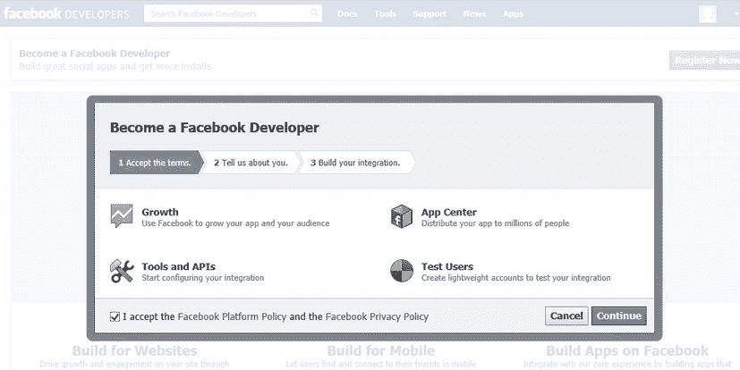

    [图 12-1](#_Fig1) 。脸书开发者注册页面

5.  接下来，将要求您回答一个快速调查，您可以跳过该调查。
6.  在最后一步中，您会收到一条消息，上面写着“耶！你现在是脸书的开发者了。”
7.  单击完成按钮关闭弹出窗口。
8.  Now that you are an official Facebook developer, you need to add the Facebook developer’s application to your account. To do this, from the Facebook home page, type **Developer** into the Facebook search bar. Click the Facebook Developers app, as shown in [Figure 12-2](#Fig2).

    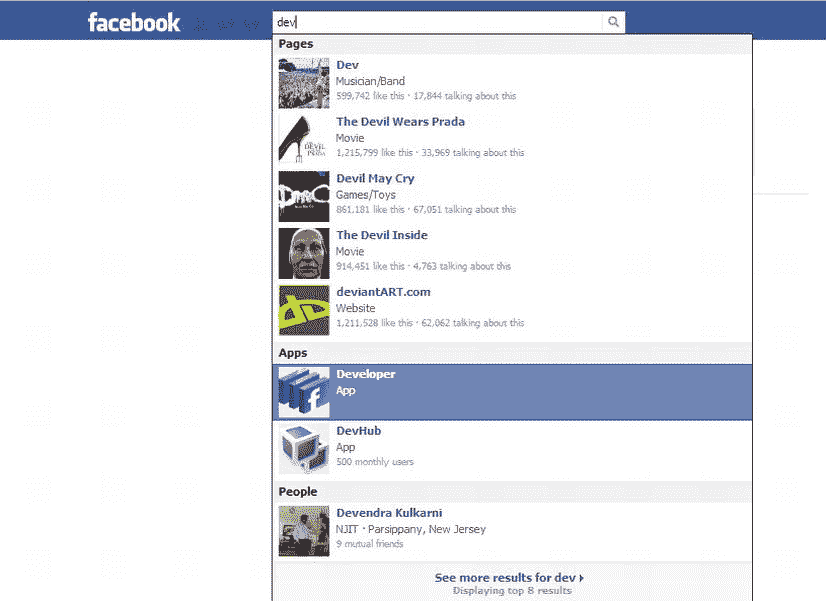

    [图 12-2](#_Fig2) 。添加开发者应用

9.  按照说明向开发人员帐户授予您的脸书帐户所需的权限。
10.  在应用页面上，单击页面右上角的创建新应用按钮。
11.  给应用命名。您可以将名称空间留空。不要勾选虚拟主机复选框。
12.  填写所需的验证码，然后点按“继续”。
13.  在新页面上，选中“选择你的应用如何与脸书集成”下的“使用脸书登录的网站”
14.  输入用于登录重定向的 URL。由于我们没有部署在互联网上的网站，我们需要创建一个域名，然后将其添加到我们的主机文件中，以便我们可以测试此功能。这需要是一个唯一的网址，没有被任何其他脸书帐户使用。比如，*johnfacebooktest123.apress.com*。对于这个食谱的其余部分，我将使用 URL `http://aspnetmvcrecipes.apress.com`。
15.  Click the Save Changes button to save the changes. Make note of the App ID and App Secret that have been created for your new Facebook application. The values that you will use are inside the `AuthConfig.cs` file. The screen should look similar to [Figure 12-3](#Fig3).

    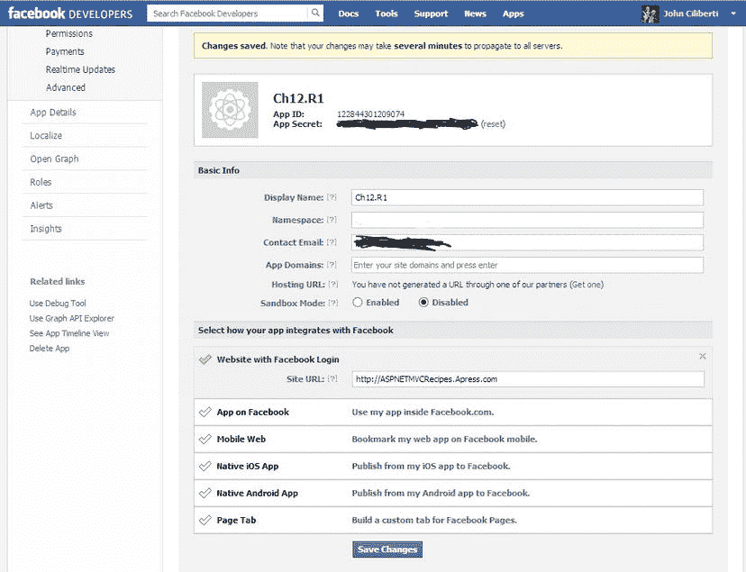

    [图 12-3](#_Fig3) 。你的脸书申请页面

配置和测试您的站点

在这个菜谱的前面，我们修改了`AuthConfig.cs`文件，因此`OAuthWebSecurity.RegisterFacebookClient`不再被注释掉，并且我们删除了一些不需要的代码。然后，我们创建了一个脸书帐户和一个脸书应用。在接下来的步骤中，我们将从脸书应用中获取应用 ID 和应用秘密，并使用它来完成对`OAuthWebSecurity.RegisterFacebookClient`的调用。然后，我们将配置项目和我们的开发环境，以便我们可以测试单点登录。

1.  在 Visual Studio 中，在代码编辑器中打开`AuthConfig.cs`。
2.  从脸书的应用管理页面复制应用 ID 和应用密码。将代码粘贴到`AuthConfig.cs`中代码的适当位置。完成的文件将看起来像清单 12-2 中的[。请注意，您将需要输入从您的脸书应用页面生成的值来替换`appId`和`appSecret`。](#list2)

[***清单 12-2。***](#_list2) AuthConfig 带有来自脸书网站的代码

```cs
using Microsoft.Web.WebPages.OAuth;

namespace Ch12.R1.Web
{
    public static class AuthConfig
    {
        public static void RegisterAuth()
        {
            //Replace the appId and appSecret with values
            // given to you from Facebook as shown in
            // Figure12-3
            OAuthWebSecurity.RegisterFacebookClient(
                appId: "122844301209074",
                appSecret: "21f37502f363da9bbc0ae0a2a59d5509");

        }
    }
}
```

如果您在调试器中编译并运行您的站点，它应该可以编译。如果你点击登录链接，你现在应该在使用另一个服务登录部分看到一个脸书按钮，如图[图 12-4](#Fig4) 所示。

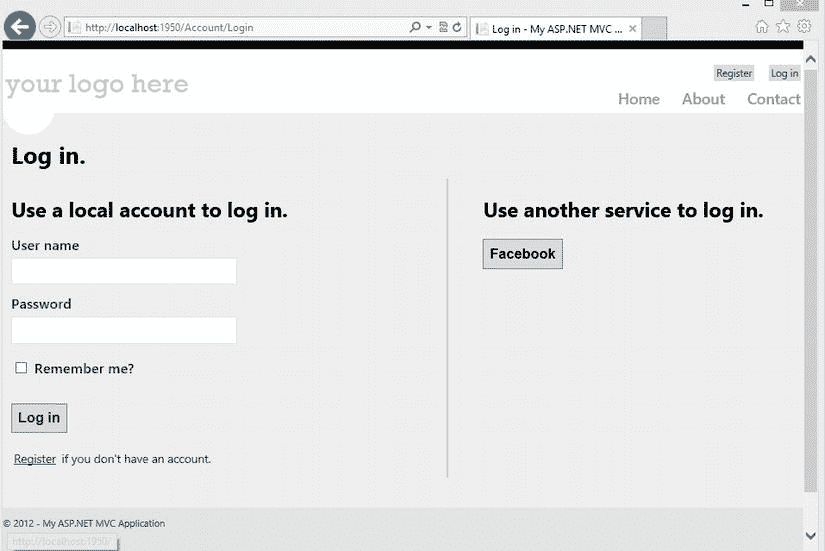

[图 12-4](#_Fig4) 。你的网站上的脸书链接网站

如果你点击脸书按钮，你会得到一个错误信息。您看到这条消息的原因是因为您的脸书应用正在等待 URL `http://aspnetmvcrecipes.apress.com`，而您正在浏览站点`http://localhost:1950`。因为脸书发现你来自的 URL 和它设置重定向到的 URL 之间有差异，它抛出一个错误。出于安全原因，脸书只会将您重定向到您在应用管理页面中指定的 URL。

纠正这个问题最简单的方法是用`http://localhost:1950`替换您之前在脸书的应用配置页面上输入的 URL。因为这个地址只在客户端使用，所以您实际上可以进行一些基本的测试。但是，如果脸书试图使用这个 URL 进行任何服务器端调用，就会出现问题，因为它调用的是自己。如果您或其他人试图从另一台没有运行该站点的机器上登录该站点，这也会导致问题。

另一种选择是在宿主文件中添加一个条目。主机文件是一个位于`Windows\System32\Drivers\etc`目录中的文本文件。在向远程服务器发送 DNS 查询之前，Windows DNS 客户端检查该文件以查看它是否包含所请求的 URL 的匹配项。您可以使用这个文件覆盖 DNS，这样地址`http://aspnetmvcrecipes.apress.com`将指向您的本地计算机。然而，这个选项需要额外的设置。关于如何操作的说明，请参考配方 3-10。

解决 URL 不匹配问题后，您可以运行项目并重试。当您这次点击脸书按钮时，您将被带到脸书登录页面，如图[图 12-5](#Fig5) 所示。

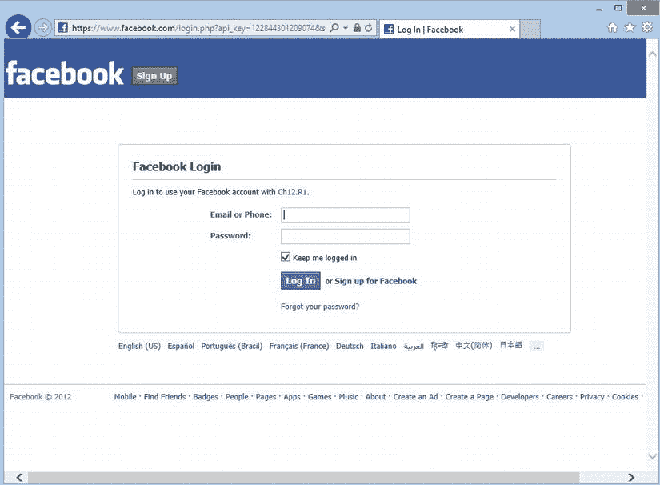

[图 12-5](#_Fig5) 。脸书登录页面

登录后，你会被带到一个页面，该页面提供了关于该应用的信息，包括谁可以看到该应用在你的墙上发布的帖子。我们应用的屏幕如图 12-6 所示。

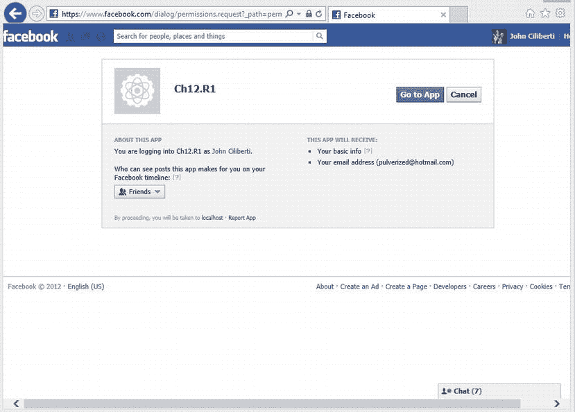

[图 12-6](#_Fig6) 。申请信息页面

脸书让你知道它将与应用共享你的一些基本信息，包括你的电子邮件地址。它还允许您指定该应用可能张贴到您的墙上的项目的隐私级别。如果您不愿意向应用提供这些信息，可以单击“取消”按钮；否则，您可以单击转到应用按钮。

单击转到应用按钮后，您将返回到您创建的站点，系统会提示您提供用户名。默认情况下，会填写您在脸书上使用的电子邮件地址。如果您愿意，您可以编辑这个值并用您认为合适的值替换它。单击注册按钮后，您将被重定向到主页。

此时，记录已经被添加到由成员资格提供者管理的几个数据库表中，包括、`webpages_OAuthMembership`、`webpages_Membership`和`UserProfile`表。关于这个模式和 ASP.NET 网页简单会员提供者的更多信息可以在配方 7-10 中找到。

12-2.用 ASP.NET MVC 创建脸书画布页应用

问题

您希望创建一个简单的脸书应用，显示来自您的网站的一些信息，并允许脸书用户在他们的脸书墙上共享这些信息。

解决办法

ASP.NET 网络工具 2012.2 更新在 2012 年 10 月的构建大会上首次发布，它包含一个新的 Visual Studio 模板，可以帮助您开始创建一个脸书画布应用。该更新可从 ASP.NET 网站(`www.asp.net/vnext`)下载。更新将只需要几分钟的时间来安装，它不会破坏任何现有的应用。它只是对工具的更新，并不改变 ASP.NET 运行时。

一旦安装了更新，当您创建一个新的 ASP.NET MVC 4 项目时，包括脸书应用在内的几个新模板都将可用。

由于此项目类型创建了与*Facebook.com*的集成，您将需要一个脸书帐户，并在他们的配置文件中安装开发人员应用。

它是如何工作的

本节要求您首先安装 ASP.NET Web 工具 2012.2 更新。一旦应用了这个更新，您就可以通过执行以下步骤来创建一个脸书画布应用:

1.  打开 Visual Studio，并从起始页中单击“新建项目”链接。
2.  选择 ASP.NET MVC 4 Web 应用作为项目模板。
3.  将项目命名为 **Ch12。R2.Web** 和解决方案 **Ch12。R2** ，然后点击确定按钮。
4.  在新建 ASP.NET MVC 4 项目页面上，选择脸书应用模板。
5.  确保选择了 Razor 视图引擎，然后单击“确定”按钮。
6.  Visual Studio 将创建项目并打开`HomeController.cs`和`readme.txt`，其中包含一个链接，指向如何配置模板的说明。关闭`readme.txt`文件，检查`HomeController.cs`中的代码，如[清单 12-3](#list3) 所示。

[***清单 12-3。***](#_list3) 来自脸书应用模板的 HomeController.cs

```cs
using System.Collections.Generic;
using System.Linq;
using System.Threading.Tasks;
using System.Web.Mvc;
using Microsoft.AspNet.Mvc.Facebook;
using Microsoft.AspNet.Mvc.Facebook.Client;
using Ch12.R2.Web.Models;

namespace Ch12.R2.Web.Controllers
{
    public class HomeController : Controller
    {
        [FacebookAuthorize("email", "user_photos")]
        public async Task<ActionResult> Index(FacebookContext context)
        {
            if (ModelState.IsValid)
            {
                var user = await context.Client.GetCurrentUserAsync<MyAppUser>();
                return View(user);
            }

            return View("Error");
        }

        // This action will handle the redirects from FacebookAuthorizeFilter when
        // the app doesn't have all the required permissions specified in the
        // FacebookAuthorizeAttribute.
        // The path to this action is defined under appSettings (in Web.config) with the key
        // 'Facebook:AuthorizationRedirectPath'.
        public ActionResult Permissions(FacebookRedirectContext context)
        {
            if (ModelState.IsValid)
            {
                return View(context);
            }

            return View("Error");
        }
    }
}
```

注意，该文件包含两个引用了`Microsoft.AspNet.Mvc.Facebook`和`Microsoft.AspNet.Mvc.Facebook.Client`的 using 语句。这些名称空间来自包含的脸书 NuGet 包，它是 Outercurve Foundation 为脸书创建的 C# SDK。它是一个开源项目，目前托管在 GitHub 上。这个 SDK 的完整文档可以在`http://csharpsdk.org`上找到。您还应该注意到，它使用的是异步编程风格，从可伸缩性的角度来看，这在处理可能偶尔会经历延迟的外部 web 服务时是有益的。异步编程风格在第 8 章的[中有详细描述。](08.html)

`Index`动作用`FacebookAuthorize`属性修饰，该属性声明应用需要访问脸书用户的电子邮件地址和用户照片。这用于让脸书 API 知道应用需要访问哪些特性。当用户将您的应用添加到他们的个人资料时，脸书会提醒用户这些需求。默认情况下，脸书将允许您访问用户的公共信息以及他们的好友列表。公共信息可以包括以下字段:

*   编号
*   名字
*   名字
*   姓氏
*   环
*   用户名
*   性别
*   当地的

如果您的应用需要关于用户的更多信息，您将需要在 `FacebookAuthorize`属性中添加额外的字段作为字符串。这可以包括扩展的配置文件属性。在`http://developers.facebook.com/docs/reference/login/extended-profile-properties`中可以找到这些属性的列表。

`Index`动作将一个`FacebookContext`对象作为参数。`FacebookContext`对象包含一个`Facebook.FacebookClient`的实例。此客户端是脸书 web 服务的代理类。在验证了`ModelState.IsValid`属性被设置为`true`后，`Index`动作调用`FacebookContext`的`Client.GetCurrentUserAsync`方法。这将试图获取当前用户的信息，并将其传递给`MyAppUser`对象。该类在文件`Models/MyAppUser.cs`中定义，如[清单 12-4](#list4) 所示。记下代码中包含的注释以进行解释。

[***清单 12-4。***](#_list4)myapp user 对象

```cs
using Microsoft.AspNet.Mvc.Facebook;
using Newtonsoft.Json;

// Add any fields you want to be saved for each user and specify the field name in the JSON
// coming back from Facebook
// go to the link below for a full list of fields.
// http://go.microsoft.com/fwlink/?LinkId=273889

namespace Ch12.R2.Web.Models
{
    public class MyAppUser
    {
        public string Id { get; set; }
        public string Name { get; set; }
        public string Email { get; set; }

        [JsonProperty("picture")] // This renames the property to picture.
        [FacebookFieldModifier("type(large)")] // This sets the picture size to large.
        public FacebookConnection<FacebookPicture> ProfilePicture { get; set; }

        // This sets the size of the friend list to 8,
        // remove it to get all friends.
        [FacebookFieldModifier("limit(8)")]
        public FacebookGroupConnection<MyAppUserFriend> Friends { get; set; }

        // This sets the size of the photo list to 16,
        // remove it to get all photos.
        [FacebookFieldModifier("limit(16)")]
        public FacebookGroupConnection<FacebookPhoto> Photos { get; set; }
    }
}
```

让我们从创建脸书画布应用的地方开始。

7.打开`Web.config`文件并定位`appSettings`部分。为了启动项目，您需要填写三个值。这些值包括`Facebook:AppId`、`Facebook:AppSecret`和`Facebook:AppNamespace`。要获取这些值，您需要在 web 浏览器中打开脸书并创建一个新的脸书应用。`Web.config`还包含属性`Facebook:AuthorizationRedirectPath`和`Facebook:VerifyToken:User`的设置。`Facebook:AuthorizationRedirectPath`，指定授权完成后，脸书会将您重定向到的路径。您不需要修改该字段。

8.登录你的脸书账户，在网站顶部的搜索框中输入 **dev** 。选择开发者应用。如果您的个人资料中没有安装此应用，您需要这样做。否则，将显示脸书开发者仪表板页面。

9.单击脸书应用仪表板页面右上角的创建新应用按钮。

10.将 app 命名为 **Ch12。R2** 并提供唯一的名称空间名称。对于这个例子，我使用的是`apress_asp_recipes`。你不能用它作为你的名字空间，因为我已经取了它。不要勾选免费虚拟主机。

11.点击继续按钮，然后填写所需的验证码表格。这是一种安全措施，使机器人更难填写表格来垃圾邮件系统。

12.在您的应用页面上，复制您的应用 ID 和应用安全密钥。

13.启用沙盒模式复选框。如果选中，只有开发人员可以访问您的应用。

14.单击“保存”按钮保存对脸书应用的更改，然后返回 Visual Studio。

15.在 Visual Studio 中，返回到`Web.config`文件并粘贴从脸书页面复制的值。您的`Web.config`文件现在应该类似于[清单 12-5](#list5) 。在进入下一步之前，请务必保存您的更改。

[***清单 12-5。***](#_list5) Web.config

`<appSettings>`

`<add key="webpages:Version" value="2.0.0.0" />`

`<add key="webpages:Enabled" value="false" />`

`<add key="PreserveLoginUrl" value="true" />`

`<add key="ClientValidationEnabled" value="true" />`

`<add key="UnobtrusiveJavaScriptEnabled" value="true" />`

**< add key= "脸书:AppId " value = " 458947667497087 "/>**

**< add key= "脸书:app secret " value = " 573999 e 60566 db 72 c 386 B4 b40 b 914080 "/>**

**< add key= "脸书:app namespace " value = " apress _ ASP _ recipes "/>**

`<add key="Facebook:AuthorizationRedirectPath" value="Home/Permissions" />`

`<add key="Facebook:VerifyToken:User" value="" />`

`</appSettings>`

16.接下来，您需要将画布 URL 添加到您的脸书页面。这是脸书应用将调用来显示您的内容的 URL。对于本例，您将使用作为模板的一部分创建的 ASP.NET 网站的主页。默认情况下，Visual Studio 对新项目使用 IIS Express，并在随机端口号上启动每个站点。出于开发目的，您将使用这个生成的 URL 作为画布页面。打开项目的属性页，然后单击“Web”选项卡。在 web 上，复制项目 URL 字段中的值。

17.返回网页浏览器中的脸书应用页面，在“选择您的应用与脸书的集成方式”下，单击脸书应用选项。

18.将您的项目 URL 粘贴到画布 URL 栏中。保存您的更改。

19.通过单击“调试”按钮运行项目。几分钟后，您应该会看到一个类似于图 12-7 所示的页面。

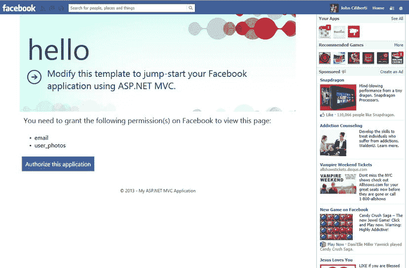

[图 12-7](#_Fig7) 。脸书申请确认页面

20.单击授权此应用按钮。如果您运行的是 Internet Explorer，Visual Studio 中的 JavaScript 调试器将在出现 JavaScript 错误时中断，该错误指出访问被拒绝。单击继续按钮跳过错误。抛出这个错误是因为脸书使用 SSL，而您的画布页没有。

21.接下来，你会看到一个请求你许可的页面，如图[图 12-8](#Fig8) 所示。

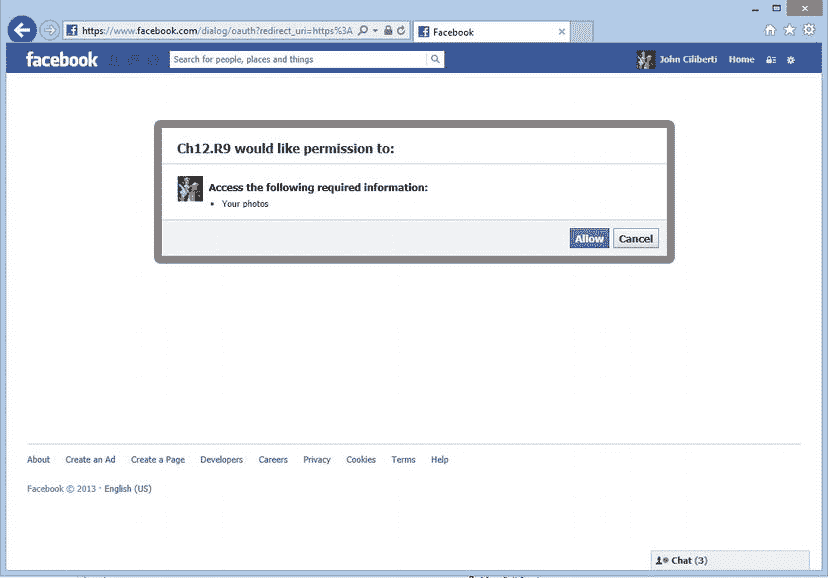

[图 12-8](#_Fig8) 。脸书请求许可

22.在您跳过错误之后，您将在脸书页面上看到一个错误，说明该页面无法显示。同样，这是正常的，是由于您没有在 IIS Express 中使用 SSL 造成的。在屏幕底部，有一个 Internet Explorer 弹出横幅，警告您只显示安全内容。单击“显示所有内容”按钮以消除警告。注意，如果您使用其他 web 浏览器(如 Firefox)进行测试，就可以避免这些错误。脸书页面将打开并显示您的内容。该页面看起来将类似于[图 12-9](#Fig9) 。它会提取你的名字、电子邮件地址和照片。它还为您的八个朋友提取类似的信息，这些信息在`MyAppUser`类的`[FacebookFieldModifier("limit(8)")]`属性中指定。

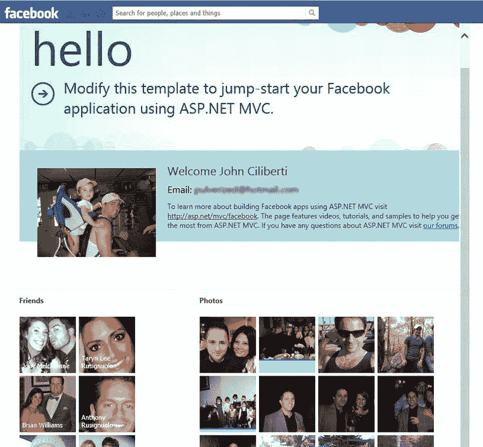

[图 12-9](#_Fig9) 。脸书画布页展示了你英俊的作者和他朋友的几张照片

如果你检查`Index.cshtml`中的代码，如[清单 12-6](#list6) 所示，你可以看到页面是如何构建的。页面被强类型化为在`Ch12.R2.Web.Models`文件夹中定义的`MyAppUser`类。然后，该页面使用标准的 Razor 语法来呈现 welcome 部分，该部分显示来自当前登录用户的 profile 部分的一些信息。然后，它使用一对循环来显示朋友和照片列表。

[***清单 12-6。***](#_list6) Index.cshtml

```cs
@using Ch12.R2.Web.Models
@using Microsoft.AspNet.Mvc.Facebook.Models
@model MyAppUser
@{
    ViewBag.Title = "Home Page";
}

<article class="intro">
    <span id="profilePicture">
        @if (Model.ProfilePicture != null && Model.ProfilePicture.Data != null)
        {
            
        }
    </span>
    <h3>Welcome @Model.Name</h3>
    <label>Email: @Model.Email</label>
    <p>
        To learn more about building Facebook apps using ASP.NET MVC visit
        <a href=" http://asp.net/mvc/facebook " title="ASP.NET MVC Website"> http://asp.net/mvc/facebook </a>.
        The page features videos, tutorials, and samples to help you get the most from ASP.NET MVC.
        If you have any questions about ASP.NET MVC visit
        <a href=" http://forums.asp.net/1146.aspx/1?MVC " title="ASP.NET MVC Forum">our forums</a>.
    </p>
</article>

<article id="content">
    <div class="left">
        <h4>Friends</h4>
        @if (Model.Friends != null && Model.Friends.Data != null && Model.Friends.Data.Count > 0)
        {
            foreach (var myFriend in @Model.Friends.Data)
            {
            <a href="@myFriend.Link" target="_blank">
                <div class="photoTile">
                    <label>@myFriend.Name</label>
                    @if (myFriend.Picture != null && myFriend.Picture.Data != null)
                    {
                        
                    }
                </div>
            </a>
            }
        }
        else
        {
            <p>No friends found.</p>
        }
    </div>
    <div class="right">
        <h4>Photos</h4>
        @if (Model.Photos != null && Model.Photos.Data != null && Model.Photos.Data.Count > 0)
        {
            foreach (var photo in @Model.Photos.Data)
            {
            <a href="@photo.Link" target="_blank">
                <div class="photoTile">
                    
                </div>
            </a>
            }
        }
        else
        {
            <p>No photo available.</p>
        }
    </div>
</article>
```

接下来的步骤

这个模板是一个有趣的起点，但它绝不是一个完整的应用。在进入下一步之前，您需要从设计的角度进行一些清理，以便内容更自然地符合脸书的外观和感觉。应用的用户不应该知道他们正在查看 iFrame。你的应用应该看起来像是网站的一部分。

然后，您可以根据自己的意愿修改这个示例。您可以将它与配方 12-1 中使用的技术结合起来，将脸书用户数据与您的应用中的用户数据集成在一起。你也可以挖掘脸书的许多其他有趣的数据。脸书图形 API 提供了一个丰富的接口，可以从脸书超过 10 亿的用户那里获取各种信息。

12-3.设置您的开发以使用 Windows Azure

问题

你想开始使用 Windows Azure 堆栈的一些功能，但你不确定如何配置你的开发环境来开发和测试 Azure 相关的组件。

解决办法

在您开始为 Windows Azure 进行开发之前，您首先需要下载并安装 Azure SDK for .NET。它包括一个 Visual Studio 的外接程序，其中包含项目和项目模板、客户端库、源代码示例和文档。它还包括模拟器，允许您测试 Azure 相关代码，而无需连接到微软数据中心。

它是如何工作的

以下步骤展示了如何获得 SDK 的最新版本:

1.  关闭任何打开的 Visual Studio 实例。
2.  打开 web 浏览器，导航到位于`www.windowsazure.com/en-us/develop/downloads/`的 Windows Azure 下载网站。
3.  在站点上，找到。NET 部分，然后单击 VS 2012 的链接。
4.  如果运行的是 Internet Explorer，当被要求运行或保存文件时，单击“运行”按钮。如果使用 Chrome，双击下载托盘中的下载项目即可启动。出现提示时，在用户帐户控制警告对话框中单击是。
5.  Microsoft Web Platform 安装程序将与 Windows Azure SDK 一起打开。NET(VS 2012)-显示的最新页面。单击安装按钮。
6.  在先决条件屏幕上，单击我接受按钮。
7.  下载和安装 SDK 需要几分钟时间。下载完成后，单击“完成”按钮。
8.  单击退出按钮关闭 Web 平台安装程序。

安装完成后，您应该会注意到开始屏幕上添加了几个项目。这些项目包括 Windows Azure 命令提示符、计算模拟器和存储模拟器。在“开始”屏幕的“所有应用”视图中可以使用其他工具，右键单击“开始”屏幕，然后单击“所有应用”即可访问这些工具。除了固定在开始屏幕上的工具，在所有应用的 Windows Azure 部分下，您可以访问 Azure SDK 文档、发行说明、代码示例和 Windows Azure HPC Scheduler SDK 内容。如果您运行的是 Windows 7，可以在“开始”菜单的“所有程序”下找到此内容。

Azure SDK 工具可以通过模拟 Azure 服务来帮助你测试和部署你的 Azure 应用。模拟器组成了开发结构。这些可执行文件模拟了 Azure cloud 提供的功能，但是在您的开发机器上本地运行。它们还提供监控和调试云服务的能力。Windows Azure 命令提示符启动时会显示 SDK 命令行工具的路径，这些工具允许您在 Visual Studio 外部打包和部署服务。

如果您打开 Visual Studio 并创建一个新项目，则在“云”类别下会出现一个新模板。如果您使用此模板，用户界面将允许您选择一个或多个云服务以包含在您的项目中。适用于 Visual C# 和 Visual Basic 的云服务包括 ASP.NET MVC 3 Web 角色、ASP.NET MVC 4 Web 角色、ASP.NET Web 角色、工作器角色、缓存工作器角色、WCF 服务角色、具有服务总线队列的工作器角色和 Silverlight 业务应用角色。对于 Visual F# 语言，只有辅助角色可用。

如果打开服务器资源管理器，您将看到许多新项目，包括 Windows Azure 计算、Windows Azure 服务总线、Windows Azure 存储和 Windows Azure 虚拟机。如果您展开存储节点，您会发现一个开发节点。在开发节点内部，有 Blobs、队列和表的容器。您可以使用该界面浏览已经上传到开发存储实例的文件。

12-4.从 ASP.NET MVC 4 应用中在 Windows Azure 上存储和检索文件

问题

您正在构建一个允许用户上传文档、音频和视频文件的应用。您不想将整个网站迁移到 Azure，因为您当前的托管计划满足了您的需求。不幸的是，您的主机方案没有提供足够的存储空间，也没有提供动态扩展的机制。您担心，如果您在使用高峰期用完了空间，在没有明显服务中断的情况下，很难升级您的主机。您希望有一种方法将文件存储在 Windows Azure cloud 中，而无需迁移整个应用。

解决办法

使用 Azure 或另一个云提供商不需要成为一个要么全有要么全无的命题。在某些情况下，使用传统的虚拟主机提供商托管您的大部分网站可能更具成本效益，但对于 BLOB(二进制大对象)存储等功能，请使用云提供商。

Azure 使用 RESTful web 服务来允许上传文件和相关元数据。虽然可以编写自己的代码来直接与 web 服务对话，但在大多数情况下，您会希望使用微软提供的 Windows Azure 存储 API。该库抽象了文件上传过程的许多复杂性，并添加了额外的功能，如失败上传的自动重试。

将文件上传到 Azure 的一般模式是首先允许用户使用典型的 HTML 文件输入来上传文件。然后使用 Azure API 将文件上传到 Windows Azure 存储。

工作原理

我们首先创建一个基本的 ASP.NET MVC Web 应用项目，然后使用 NuGet 添加所需的 Azure APIs。因为我们不想在这个场景中在 Azure 中托管实际的网站，所以我们不需要使用 Windows Azure 项目模板。创建项目后，我们将构建一个控制器来处理文件上传，然后将文件上传到 Azure。这个食谱假设你已经安装了 Windows Azure SDK。我们将使用 Azure 存储模拟器进行测试和调试。关于下载和安装 SDK 的说明可以在配方 12-3 中找到。

创建项目

要创建项目，您需要执行以下操作:

1.  打开 Visual Studio，从文件菜单中选择新建项目。
2.  选择 ASP.NET 的 MVC 4 Web 应用项目，将项目命名为 **Ch12。R3.Web** ，并将该解决方案命名为 **Ch12。R3** 。选择一个合适的位置，然后单击确定。
3.  在新建 ASP.NET MVC 4 项目屏幕中，选择基本模板，然后点击 OK 来创建项目。
4.  在解决方案资源管理器中右击"引用"节点，然后选择"管理 NuGet 包"。
5.  在“管理 NuGet 包”窗口中单击“在线”节点，然后在“搜索”文本框中键入 **Azure Storage** 。
6.  几分钟后，您应该会看到 Windows Azure 存储库。单击安装按钮。除了安装 Windows Azure 存储，它还将安装所需的 Microsoft OData 库和 Microsoft Windows Azure 配置管理器，这些都是依赖项。
7.  单击“更新”节点。更新所有可更新的软件包。Azure APIs 经常更新，以跟上新的和扩展的服务。

现在您已经创建了一个项目，下一步是创建一个用于管理上传的控制器。

创建控制器

我们将创建一个名为`Home`的新控制器。我们使用 `Home`作为控制器名称，这样我们就可以使用项目模板中定义的默认路由。在控制器内部，我们将创建上传文件和查看容器内部文件的操作。

要创建控制器，请执行以下步骤:

1.  在解决方案资源管理器中右键单击控制器节点，并选择添加控制器。
2.  在添加控制器窗口中，将控制器命名为 **HomeController** ，选择空的 MVC 控制器模板，然后单击添加。
3.  Visual Studio 将创建该文件，然后在代码编辑器中打开它。修改文件，使其包含动作`Index`、`UploadFile`和`ListFiles`。
4.  为名称空间`Microsoft.WindowsAzure`和`Microsoft.WindowsAzure.Storage`添加 using 语句。
5.  For now, we will just stub out each action with a `return View()` statement. We add the logic to the controllers in a subsequent section. The `HomeController` should now look like [Listing 12-7](#list7).

    [***清单 12-7。***](#_list7) HomeController 带空动作

    ```cs
    using Microsoft.WindowsAzure;
    using Microsoft.WindowsAzure.Storage;
    using System.Web.Mvc;

    namespace CH12.R3.Web.Controllers
    {
        public class HomeController : Controller
        {

            public ActionResult Index()
            {
                return View("Index");
            }

            public ActionResult UploadFile()
            {
              return View("UploadFile");
            }

            public ActionResult FileList()
            {
                return View("FileList");
            }

        }
    }
    ```

向 Web.config 添加 Azure 连接字符串

为了让 Windows Azure 存储 API 连接到 Windows Azure 存储服务，它需要知道您的帐户信息以及存储服务端点的 URI。该信息以连接字符串的形式提供。虽然可以将这些信息直接硬编码到源代码中，但一般来说，这不是一个好的做法，因为每次需要部署代码时，都需要修改并重新编译代码。在一个复杂的项目中，可能有许多与存储服务通信的控制器操作，这也会导致可维护性问题。

避免此问题的最佳实践是将连接字符串放在应用配置文件中。在 ASP.NET 应用中，`Web.config`文件用于存储这些信息。要将连接字符串添加到配置文件中，请执行以下步骤:

1.  在解决方案资源管理器中找到`Web.config`文件，然后双击它在代码编辑器中打开该文件。
2.  在`appSettings`部分，用键`StorageConnectionString`和值`UseDevelopmentStorage=true`添加一个新设置。这是 Windows Azure 存储模拟器的连接字符串。模拟器使用众所周知的名称和密钥，对所有用户都是一样的。连接字符串`UseDevelopmentStorage=true`是一个快捷方式，存储 API 将用模拟器的正确参数替换它。
3.  Add a second key called **CloudStorageContainerReference** and give it the value **ch12-r4**. This will be the name of the BLOB container that we will use for this project. The modified **Web.config** file should look like [Listing 12-8](#list8).

    [***清单 12-8。***](#_list8)web . config 文件的 appSettings 部分

    ```cs
    <appSettings>
                  <add key="webpages:Version" value="2.0.0.0" />
                  <add key="webpages:Enabled" value="false" />
                  <add key="PreserveLoginUrl" value="true" />
                  <add key="ClientValidationEnabled" value="true" />
                  <add key="UnobtrusiveJavaScriptEnabled" value="true" />
                  <add key="StorageConnectionString" value="UseDevelopmentStorage=true"/>
                  <add key="CloudStorageContainerReference" value="ch12-r4/>
                </appSettings>
    ```

 **警告** Windows Azure 对容器名中允许的字符有非常严格的规定。这些规则基于 DNS 名称的规则。这意味着容器名中不允许有特殊字符(破折号除外)，只允许小写字母。如果您试图为容器使用无效的名称，当您试图创建它时将会引发异常。使故障排除变得困难的是，返回的错误是一个非常普通的 HTTP 错误 400(错误请求)，带有`HTTPStatusMessage` : “其中一个请求输入超出范围。”如果您在使用 Windows Azure 时遇到此消息，请检查您的容器或 BLOB 的名称，以确保它符合条件。

在本例中，我们使用名称“ch12-r4”作为容器名称。请注意，该名称不包含空格，只包含小写字母、数字和破折号。容器的名称必须符合以下标准:

*   它们必须至少有三个字符长。
*   它们不能超过 63 个字符。
*   它们必须以小写字母或数字开头。
*   所有字母必须小写。不允许大写字母。
*   它们可以包含一个破折号(-)，但是如果破折号是 is，它的前面和后面必须是小写字母或数字。
*   除破折号外，不允许使用其他符号。
*   不允许使用空格和其他空白字符。

创建上传文件动作

现在我们已经为连接字符串和存储容器定义了配置设置，我们可以使用它们来创建在容器中存储文件所需的逻辑。为了连接到存储帐户并上传用户输入提供的文件，我们向`UploadFile`动作添加逻辑，如下所示:

1.  检查`Request.Files`集合是否包含任何文件，以及上传的文件是否包含数据。如果没有找到文件，我们将不会调用存储容器。
2.  使用`Web.config`中的连接字符串创建一个`CloudStorageAccount`对象的实例。
3.  使用`CloudStorageAccount`实例创建一个`CloudBlobClient`实例。这是 Azure Storage Web 服务的代理类。T3】
4.  提取配置文件中定义的字符串，并使用它来创建对存储容器的引用。
5.  调用存储容器上的`CreateIfNotExists` 方法。顾名思义，这个方法检查容器是否存在；如果没有，它将创建它。
6.  对于`Request.Files`集合中的每个文件，验证该文件不是`null`并且内容长度大于零。这可以防止我们上传空文件。
7.  对于每个有效文件，使用文件名作为键在存储容器中创建块 BLOB 引用。Azure 有两种类型的 blob:由`CloudPageBlob`类代表的页面 blob 和由`CloudBlockBlob` 类代表的块 blob。页面 BLOB 在概念上类似于磁盘驱动器。您可以像访问磁盘一样以编程方式访问和写入文件的任何扇区。块 BLOB 在概念上类似于文件。对于您将遇到的绝大多数操作，块 BLOBs 是合适的选择。
8.  Once all the files have been processed, redirect to the action `FileList`. When completed, this action will display a list of files inside our container. The completed code is shown in [Listing 12-9](#list9).

    [***清单 12-9。***](#_list9) 上传文件动作

    ```cs
    using CH12.R3.Web.Models;
    using Microsoft.WindowsAzure;
    using Microsoft.WindowsAzure.Storage;
    using Microsoft.WindowsAzure.Storage.Blob;
    using System.Collections.Generic;
    using System.Configuration;
    using System.Web.Mvc;

    namespace CH12.R4.Web.Controllers
    {
     public ActionResult UploadFile()
     {

      if (Request.Files.Count > 0)
      {
        //try and connect to storage account
        //connection information and container name are configured in
        //the web.config file
        CloudStorageAccount storageAccount =
        CloudStorageAccount.Parse(
                                 CloudConfigurationManager.GetSetting("StorageConnectionString")
                                 );

        //create a storage client instance
        var storageClient = storageAccount.CreateCloudBlobClient();

        //get a referance to the container
        var storageContainer =
        storageClient.GetContainerReference(
          ConfigurationManager.AppSettings.Get("CloudStorageContainerReference"));

        //create storage container if it does not exist
        storageContainer.CreateIfNotExists();
        for(int fileNum=0; fileNum<Request.Files.Count; fileNum++)
        {
          if (Request.Files[fileNum] != null && Request.Files[fileNum].ContentLength > 0)
          {
             //Get a referance to a new block blob from
             //the storage service using the name of the uploaded file
             var azureBlockBlob =
                  storageContainer.GetBlockBlobReference(Request.Files[fileNum].FileName);

             //upload the file to the Azure service
             azureBlockBlob.UploadFromStream(Request.Files[fileNum].InputStream);

           }
         }
         //view list of files that you have uploaded
         return RedirectToAction("FileList");

        }
        return View("UploadFile");
     }
    }
    ```

创建上传文件视图

下一步是创建`UploadFile`视图:

1.  在代码编辑器中，右键单击`UploadFile`动作中的任意位置，并选择 Add View。
2.  保留默认视图名称`UploadFile`。确保选择了 Razor 视图引擎并选择了使用布局或母版页，然后单击添加。Visual Studio 将创建一个名为`UploadFile.cshtml`的新文件，并在代码编辑器中打开它。Visual Studio 将自动在正确的文件夹中创建该文件。
3.  对其他动作重复此过程。我们暂时将这些视图留空。
4.  在`UploadFile.cshtml`文件中，创建开始和结束表单标签。您可以手工编码标签，但是我强烈推荐使用`@using(Html.BeginForm())`结构。HTML 助手是路由感知的。这将避免您在更改页面路由逻辑时需要更改`Form`元素中的`action`属性。
5.  修改对`BeginForm`的调用，以便传入动作名`UploadFile`、控制器名`Home`、`FormMethod.Post`的方法和一个定制属性`enctype="multipart/form-data"`。为了上传文件，您必须使用`Post`方法，并且必须添加`enctype`属性。该属性用于告诉浏览器如何对表单数据进行编码。
6.  接下来，添加类型文件的一个`input`元素。确保`input`元素同时具有`id`和`name`属性。文件上传需要`name`属性。如果它丢失，浏览器将不能正确编码上传数据，并且`Request.Files`集合将为空。
7.  Add a Submit button. The completed view is shown in [Listing 12-10](#list10).

    [***清单 12-10。***](#_list10)uploadfile . cshtml

    ```cs
    @{
        ViewBag.Title = "UploadFile";
    }

    <h1>Upload a File</h1>
    @using (Html.BeginForm("UploadFile", "Home", FormMethod.Post,
       new { enctype = "multipart/form-data" }))
    {
        <input type="file" id="File01" name="File01"/>
        <input type="submit" name="Submit" id="Submit" value="Upload" />
    }
    ```

HTTP 编码类型

默认情况下，表单数据使用`application/x-www-form-urlencoded`编码类型。如果您使用类似 Fiddler 2 的工具查看浏览器生成的原始 HTTP 请求，您可以看到在`Content-Type`头中设置的编码类型。对于`application/x-www-form-urlencoded`类型，请求的主体包含一组由&符号(&)分隔的名称/值对，就像查询字符串一样。

用`multipart/form-data`编码定义边界(除了编码类型本身)。它通常由一些破折号后跟一个随机字符序列组成。例如，你可能会在 Chrome 浏览器上看到`Content-Type: multipart/form-data; boundary=----WebKitFormBoundaryxFjFO7kV517KsAzW`。

在请求的主体中，每个字段由定义的边界分隔。在下一行中，每个字段都有一个`Content-Disposition`。这允许服务器知道哪些数据是字段数据，哪些是表单数据。对于标准形式的数据，您会看到`Content-Disposition`带有值`form-data`，后跟分号和字段名。在一对换行符之后，将显示该字段的表单数据。对于文件，还会列出文件名。在下一行中，显示了文件的内容类型，后跟两个换行符，然后是二进制格式的文件数据。

测试上传文件动作

按照项目当前的配置方式，它需要运行 Windows Azure 存储模拟器。模拟器是和 SDK 一起安装的，但是默认情况下不会运行。如果您已经使用 Azure 模板之一构建了这个项目，那么当您开始调试时，模拟器会自动启动。在这种情况下，因为我们使用的是一个普通的老 ASP.NET MVC 4 项目，它不会。

有几种方法可以启动模拟器。一种方法是通过在“开始”菜单(如果您使用的是 Windows 8，则为“起始页”)中找到它来手动启动它。在这两种情况下，您应该能够通过键入 Windows 键，然后键入 **Storage Emu** 来找到它。然后，您可以通过单击它来启动模拟器。您也可以通过打开服务器资源管理器窗口从 Visual Studio 启动模拟器，这可以通过从 Visual Studio 的“视图”菜单中选择它来完成。在服务器资源管理器窗口中，展开 Windows Azure 存储节点，然后右键单击开发节点并选择刷新。

从服务器资源管理器中，您可以浏览本地开发存储中的 BLOBs。展开时，Blobs 节点将显示开发期间到目前为止创建的所有容器。在这个阶段，如果你还没有开发任何使用 Azure 存储的解决方案，集合应该是空的。

您可以通过在位于 Windows 任务栏最右侧的系统托盘中查找其图标来确认存储模拟器正在运行。默认情况下，Windows 将隐藏该图标。要查看它，你需要点击系统托盘区域左侧的白色小三角。Azure 存储模拟器图标如图[图 12-10](#Fig10) 所示。

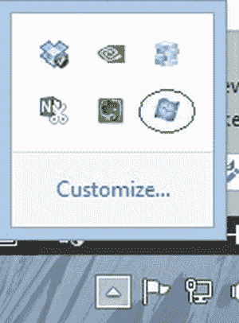

[图 12-10](#_Fig10) 。Azure 系统托盘图标

如果将鼠标悬停在图标上，模拟器服务的状态会显示在一个小的弹出窗口中。如果右键单击图标，可以访问用于关闭存储模拟器或启动模拟器用户界面的命令。模拟器 UI 非常简单。它显示模拟器提供的三种服务，包括 Blob、队列和表。它显示每个服务的状态和使用的端点。端点地址不可更改。即使您找到了编辑它们的方法，这也不是一个好主意，因为我们添加到`Web.config`文件中的开发服务器连接字符串快捷方式将不再工作。

确定服务正在运行后，按键盘上的 F5 键开始调试。在 web 浏览器的地址栏中，将`Home/UploadFile`追加到当前 URL。

 **提示**你可以在调试器中更改浏览器启动时打开的页面。这可以通过打开项目的属性，点击 web 选项卡，然后在特定页面文本框中输入 **Home/UploadFile** 来完成。

页面加载后，单击浏览按钮(如果使用 Chrome，单击选择文件按钮)。将会打开一个文件选择对话窗口。单击文件以选择它，然后单击打开按钮以完成选择并关闭对话框窗口。点击上传按钮开始上传。几秒钟后，您应该会转到一个文件列表页面。

若要验证文件是否确实已上载，请在 Visual Studio 中打开服务器资源管理器窗口(如果它尚未打开)。展开 Windows Azure 存储节点、(开发)节点，然后展开 Blobs 节点。右键单击 Blobs 节点并选择 Refresh 以确保它包含最新的信息。在 Blobs 节点下，您现在应该看到一个名为 ch12-r2 的容器。双击 ch12-r2 项目。容器查看器窗口应该打开，并列出上传的文件。

添加多文件上传支持

在某些情况下，您可能需要允许用户一次上传许多文件。在清单 12-9 中设置的`UploadFile`控制器实际上可以处理多次上传。然而，该视图只有一个文件上传元素。可以采用几种方法来允许一次上传几个文件。一个是添加额外的文件上传元素。您可以通过使用服务器端或客户端代码来创建所需数量的文件输入框。然而，这个界面对大多数人来说是非常烦人的，尤其是当他们需要上传大量文件的时候。

如果你的网站面向现代浏览器，如 Google Chrome 或 IE 10，HTML5 规范为文件输入框提供了一个新的`multiple`属性。你所需要做的就是添加属性，如清单 12-11 所示。

[***清单 12-11。***](#_list11) 添加多个文件支持使用 HTML5 多个属性

```cs
<h1>Upload a File</h1>
@using (Html.BeginForm("UploadFile", "Home", FormMethod.Post,
    new { enctype = "multipart/form-data" }))
{

    <input type="file" id="File01" name="File01" multiple />
    <input type="submit" name="Submit" id="Submit" value="Upload" />
}
```

现在，当您浏览文件时，您可以通过在选择文件时按住键盘上的 Shift 键来选择多个文件。尝试选择一些文档，然后单击上传按钮。如果您在 Visual Studio 中刷新 Azure 存储容器，您现在应该会看到您已经上传的所有文件。

 **提示**注意点击容器窗口内的刷新按钮——而不是主工具栏上的重启调试符号。

显示上传的文件

对于这个菜谱的下一部分，我们将在`FileList`视图中显示容器中的文件列表。这将通过使用存储容器的`ListBlobs`方法来完成。这个方法返回一个`IEnumerable<IListBlobItem>`。枚举中的`IListBlobItems`可以有几种类型，包括`CloudBlockBlob`、`CloudPageBlob`或`CloudBlobDirectory`。

在这个例子中，我们只想显示 BLOBs 的平面列表，不需要显示任何目录层次结构。可以在存储容器中创建一个目录结构，只需命名文件，使它们包含正斜杠。我们想显示 BLOB 的 URL，它的简称，和它的大小。由于这些属性不存在于`IListBlobItem`接口中，我们需要将每个条目转换成一个`CloudBlockBlob`来访问这些属性。因为尽可能保持视图的整洁是一个好习惯，所以我们不想用强制转换和`if`语句把它弄得乱七八糟。相反，我们将创建一个名为`FileListModel`的新模型，它将包含一个将`IEnumerable<IListBlobItem>`作为参数的构造函数。构造函数然后将数据传递到一个`List<FileInfo>`，这是另一个包含必需字段的类。需要注意的是，这是一个自定义类，与`System.IO.FileInfo`没有关系。为了更加方便，`FileInfo`类有一个名为`CreateFromIListBlobItem`的静态方法，它接受一个`IListBlobItem`作为参数并返回一个`FileInfo`对象。执行以下操作来创建这些类:

1.  在解决方案资源管理器中右键单击`Models`文件夹，并选择 Add  Class。
2.  在新项目窗口中，将类文件命名为 **FileListModel.cs** 并单击 Add。
3.  Modify the file to look like [Listing 12-12](#list12).

    [***清单 12-12。***](#_list12) FileListModel.cs

    ```cs
    using Microsoft.WindowsAzure.Storage.Blob;
    using System.Collections.Generic;

    namespace CH12.R3.Web.Models
    {
        public class FileListModel
        {
            public FileListModel(IEnumerable<IListBlobItem> list)
            {
                if (list != null)
                {
                    Files = new List<FileInfo>();
                    foreach (var item in list)
                    {
                        FileInfo info = FileInfo.CreateFromIListBlobItem(item);
                        if (info != null)
                        {
                            Files.Add(info);
                        }

                    }
                }
            }
            public List<FileInfo> Files { get; set; }
        }

        public class FileInfo
        {
            public string FileName { get; set; }
            public string URL { get; set; }
            public long Size { get; set; }

            public static FileInfo CreateFromIListBlobItem(IListBlobItem item)
            {
                if (item is CloudBlockBlob)
                {
                    var blob = (CloudBlockBlob)item;
                    return new FileInfo { FileName = blob.Name,
                                          URL = blob.Uri.ToString(),
                                          Size = blob.Properties.Length };
                }
                return null;
            }
        }
    }
    ```

4.  Open `HomeController.cs` and modify the `FileList` action to look like [Listing 12-13](#list13). Here, like in the `UploadFile` action, we will first create a reference to the cloud storage account and then use it to create an instance of the storage client. We then use the storage client to create an instance of the storage container. We then call the `ListBlobs` method on the storage container and pass the result from it into the `FileListModel` constructor.

    [***清单 12-13。***](#_list13) 文件列表动作

    ```cs
    public ActionResult FileList()
    {
      CloudStorageAccount storageAccount = CloudStorageAccount.Parse(
      CloudConfigurationManager.GetSetting("StorageConnectionString"));

      var storageClient = storageAccount.CreateCloudBlobClient();

      var storageContainer = storageClient.GetContainerReference(
      ConfigurationManager.AppSettings.Get("CloudStorageContainerReference"));

      var blobsList = new FileListModel(storageContainer.ListBlobs(useFlatBlobListing: true));

      return View("FileList",blobsList);
    }
    ```

5.  然后我们返回`ViewResult`，将模型传递给它。
6.  The final step is to fill in the `FileList` view so that it displays the list of BLOBs. The Razor code is shown in [Listing 12-14](#list14).

    [***清单 12-14。***](#_list14) FileList.cshtml

    ```cs
    @model CH12.R3.Web.Models.FileListModel
    @{
        ViewBag.Title = "File List";
    }

    <h2>File List</h2>
    <ul>
    @foreach (var item in Model.Files)
    {
        <li>

        <a href="@item.URL">@item.FileName</a> (@item.Size bytes)

         </li>
    }
    </ul>

    @Html.ActionLink("Upload Another File", "UploadFile")
    ```

该解决方案的局限性

如果你在几个不同的浏览器中尝试，你会发现这个解决方案的一个最大的弱点。浏览器版本之间的用户界面几乎没有一致性。在 Chrome 和 Safari 中，选择多个文件后，浏览器中只会显示所选文件的数量。在 Internet Explorer 和 Firefox 中，绝对没有迹象表明选择了多个文件。一旦文件被选中，没有一种浏览器提供直观的方式来删除它们。虽然这构成了一个功能性的用户界面，但它远非理想。

该解决方案的另一个问题是请求的总大小不能超过 4 MB。如果文件的总大小大于 4 MB 的限制，IIS 将抛出一个错误，指出您已经超过了最大请求大小。IIS 施加这一限制是为了保护您免受潜在的拒绝服务攻击。上传大文件时，IIS 会首先将文件缓冲到内存中。如果没有施加请求大小限制，攻击者就很容易利用大量请求来攻击您的 web 服务器。

这个问题可以通过增加清单 12-15 中[所示的 IIS 配置中的最大请求大小来缓解，其中最大请求大小已经增加到 60 MB。它还会增加执行超时。这通常是必需的，因为用户上传大文件可能需要更长时间。](#list15)

[***清单 12-15。***](#_list15) 增加 Web.config 中的最大请求大小和超时时间

```cs
<system.web>
 . . . other setting ommited
 <httpRuntime targetFramework="4.5" maxRequestLength="61440" executionTimeout="3600 " />
</system.web>
```

使用此设置时应该小心。您正在以牺牲可伸缩性和安全性为代价增加可以上传到服务的文件的大小。

这种解决方案的另一个问题是，它没有给用户关于上传过程的任何反馈。假设用户有一个 30 MB 的文件。即使他的互联网连接速度相对较快，也可能需要几分钟才能完成上传。如果没有关于上传状态的视觉反馈，系统用户将无法知道上传是否仍在进行，或者页面是否已经没有响应。

如果您正在处理小文件，如典型的办公文档，这可能是一个很好的解决方案。如果您允许用户上传大文件，您可能需要考虑一个替代解决方案，在客户端将文件分成多个块。这可以使用谷歌 Chrome 内置的文件 API 来完成，或者如果你需要更广泛的应用，可以使用一个丰富的互联网应用(RIA)框架，如微软 Silverlight 或 Adobe Flash。每个块被单独上传，然后在服务器上重新组装。

您可以对该配方进行的另一项改进是，去掉一些 BLOB 处理代码，如果您在实际应用中工作，这些代码可能会经常重复；例如，您可以创建像`GetStorageAccoun` t 和`GetStorageContainer`这样的助手函数。

12-5.使用 Fiddler 2 帮助调试对存储模拟器的 Azure 调用

问题

您正在开发一个使用 Windows Azure BLOB 存储的 ASP.NET MVC 4 应用。在开发过程中，您使用的是 Windows Azure 存储模拟器。在开发新功能时，你遇到了问题，Azure 模拟器返回了无用的一般性错误消息。您想更深入地了解哪些数据被发送到 Azure web 服务。

解决方案

Fiddler 2 是一个非常流行和强大的调试 HTTP 通信的工具。它的工作原理是充当所有离开计算机的 HTTP 请求的代理。在第 11 章中，有几个描述如何下载和安装该工具的方法，以及如何使用它来调试 Web API 调用。

如果您运行该工具，然后访问使用 Azure 存储模拟器的应用，您可能会惊讶地发现，应用和模拟器之间的任何通信都没有被记录。这是因为 Azure 存储模拟器绑定了环回地址(127.0.0.1)，Fiddler 忽略了这个地址。

幸运的是，Windows Azure Storage API 中有一个内置的功能，可以让您绕过这个限制。

工作原理

当设置您的项目以使用 Azure 时，您需要传入一个连接字符串以连接到您的云存储帐户。在开发中，如果我们需要使用存储模拟器，我们将这个连接字符串设置为`UseDevelopmentStorage=true`。这是 API 用众所周知的存储模拟器连接字符串替换的快捷方式。这个快捷方式还允许第二个参数，称为`DevelopmentStorageProxyUri`，它接受任何有效的 URI 作为代理地址。这允许您通过任何 HTTP 代理运行流量。不幸的是，如果您为该参数输入默认的 Fiddler 2 代理地址 127.0.0.1:8888，它将不起作用，因为您将向环回地址发送流量，该地址仍然会被忽略。

幸运的是，Windows Azure 存储 API 允许您用 Fiddler 的别名替换回送地址。清单 12-16 显示了一个配置为通过 Fiddler 传递流量的连接字符串。

[***清单 12-16。***](#_list16) 通过提琴手 2 传递通信的 Azure 连接字符串

```cs
<appSettings>
    .. other settings
    <add key="CloudStorageConnectionString"
         value="UseDevelopmentStorage=true; DevelopmentStorageProxyUri=[http://ipv4.fiddler](http://ipv4.fiddler) " />
</appSettings>
```

`ipv4.fiddler`地址是 Fiddler 自动为我们设置的；不需要创建额外的设置或主机条目。在 Fiddler 中查看流量时，流量不会使用您的项目中指定的地址(例如 127.0.0.1:8934)。

为了让这个设置工作，Fiddler 必须运行。如果您不再需要 Fiddler 并将其关闭，您必须将`Web.config`文件恢复到原始设置。

12-6.移动 Web 应用和原生设备应用哪个更好？

问题

您已经看到 MVC 框架 4 附带了一个创建移动 web 应用的模板，但是您不确定创建一个移动应用是否值得。您需要一些帮助来决定是应该专注于移动 web 应用，还是转向原生设备应用，或者两者兼而有之。

解决办法

进入移动开发需要你做出一些决定。第一个决定是您应该构建一个本地应用、一个移动 web 应用，还是两者都构建。第二个决定是支持哪些设备。第三个决定是创建应用时应该使用的工具类型。如果您决定构建一个本机设备应用，在大多数情况下，您将需要一个为您的应用提供数据的后端服务。ASP.NET Web API 是一个很好的解决方案，因为这项服务可以跨移动平台工作。

在移动网络和本地应用之间的选择通常是一个优先权的问题。对你的服务来说，什么更重要:丰富的移动体验还是你能接触到的客户数量？使用本机设备应用，您可以直接访问移动操作系统的功能。这使您可以利用每个操作系统和底层硬件的独特功能，而移动 web 应用无法做到这一点。您还将使用本机设备 API 呈现用户界面，这将为您的应用提供更自然的感觉，便于您的客户学习。

有了移动应用，你就有了触角。任何有浏览器的人都可以访问你的应用。即使浏览器不支持最新标准，您也可以使用 polyfills，或者使用流行的 JavaScript 库(如 Modernizr)来降级某些功能。有了移动网络，你只需要维护一个应用，只要你更新了你的网站，每个人都能得到最新的版本。

如今许多公司所做的是在最流行的平台上提供原生设备应用，然后提供移动网站来填补原生应用中的功能空白，并为不太流行的移动设备的用户提供完整版本网站的替代方案。

它是如何工作的

如同所有的软件开发一样，你需要从理解客户的需求开始。他们希望在移动设备上完成什么类型的任务？他们使用什么类型的设备？在移动设备上使用完整版的应用时，他们会遇到什么样的可用性问题？

在某些情况下，您可以通过直接与客户交谈或让业务分析师采访关键利益相关者来获得这些信息。虽然这样做可以获得有用的信息，但这只是故事的一部分。

除了与您的客户交流，您还可以从研究网站的使用统计数据中受益。虽然从你的网络日志中获取有用的信息是可能的，但是像 Google Analytics 和 Adobe Analytics 这样的工具可以提供更深入的信息。这些工具从成千上万的访问者那里收集匿名数据，然后在详细的报告中呈现这些信息。

在这些工具中，谷歌分析是最受欢迎的工具之一。它是免费的，易于设置。创建您的帐户后，Google Analytics 会为您提供一段 JavaScript 代码添加到您的网站中。当人们访问您的站点时，脚本会运行并收集访问者的详细信息，例如他们的 IP 地址、设备类型、屏幕分辨率以及他们安装的插件。

使用这些工具，你可以很容易地了解人们目前是如何使用你的网站的，以及这些使用模式是如何随着时间的推移而改变的。

[图 12-11](#Fig11) 显示了谷歌分析为 MyOnlineBand.com*的平均一天生成的报告。*图表显示，成千上万的人使用移动设备访问网站，其中绝大多数是 iOS 用户。iPhone、iPad 和 iPod Touch 占移动访问总数的 56%，而几乎所有其他设备都运行某种版本的 Android。组合中还有其他设备，但它们在统计上几乎微不足道。其他设备包括 0.1%运行黑莓和 0.01%运行 Window Phone。

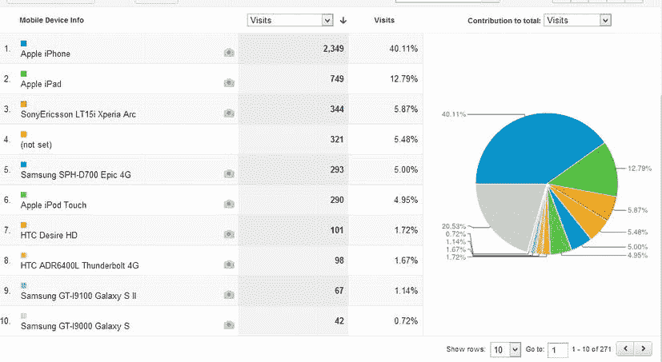

[图 12-11](#_Fig11) 。来自谷歌分析的移动设备分布

仅根据这些信息，显然应该优先改善 iOS 用户的体验。如果我要建立一个本地移动应用，一个针对 iOS 的应用将是最高优先级。

接下来要看的是趋势信息。两年前的数据和今天的数据一样吗？在对数据进行挖掘后，很明显，尽管 iOS 仍然是占主导地位的移动操作系统，但它的受欢迎程度正在下降，转而支持 Android。两年前，iOS 拥有超过 90%的移动用户，而 Android 仅占 5%。使用移动设备访问该网站的用户总百分比也大幅增加。两年前，移动用户仅占总流量的 2 %;今天，移动用户几乎占总数的 10%。因此，越来越多的用户使用移动设备访问网站，他们中的越来越多的人使用 Android。

根据 Gartner 的数据，截至 2012 年第三季度，Android 占所有智能手机和平板电脑的 71%，每天有 120 万台新的 Android 设备被激活。

基于这些信息，我仍然认为 iOS 非常重要，但将 Android 视为第一优先。战略将如下:首先，发布一个服务于所有人的移动网络应用，然后是一个原生的 Android 应用，接着是一个 iOS 应用。然后我会再看一眼统计数据，决定是否值得为 Windows Phone 和黑莓手机开发应用。

我想先做一个移动 web 应用的原因是因为我可以快速开发它，并且可以在我当前的基础设施上托管它。在创建我的其他移动应用时，我也可以重用它的许多功能(比如 web 服务)。

设备应用的其他考虑因素

原生移动应用开发的一个令人生畏的特点是，您必须处理 app store 提交流程的官僚主义。在 web 应用中，你有完全的自由去做任何你想做的事情。您可以随时更新您的应用。您可以设计您的应用来适应您独特的视角。你可以在你的网站上销售你的产品，并保留所有的利润。对于需要提交到应用商店的移动应用来说，这就不一定了。

更改服务条款

苹果、谷歌、微软，甚至 RIM 都有一套规则来管理哪些内容适合提交给他们的应用商店。这些规则不时变化。一些应用可能在上个月满足了条件，但今天却无法满足。

例如，我认识一个开发人员，他开发了一个 iOS 应用，使用谷歌地图来呈现一些独特的信息。这款应用非常成功，他赚了 5 万多美元。一天，出乎意料的，他的应用被从商店中撤了下来，因为它违反了一些新的服务条款，其中的徽标没有对齐。他从未能够重新发布该应用。对他来说幸运的是他没有辞掉他的日常工作。

曝光和可发现性

许多人在创建设备应用时有一个错误的想法，即既然数百万人都在使用移动操作系统，那么在应用商店中拥有一个应用会比拥有一个 web 应用给他们带来更多的曝光率。现实是应用商店里有成千上万的应用。您的应用可能比发布到 web 上的应用更不容易被发现。Adeven(一家专门从事 iOS 应用分析的公司)最近发布的统计数据显示，多达 60%的移动商店应用从未被任何人下载过。 [<sup>1</sup>](#Fn1)

这和网络没什么不同。超过 10 亿人使用网络。然而，即使有适度的广告预算和专门的努力，使您的网站搜索引擎优化，你不能保证有大量的流量。

部署成本

大多数应用商店要求您在有资格提交应用之前支付某种费用。苹果和微软都为这项特权收取 99 美元。谷歌收费 25 美元。收取这项费用的理由是为了支付提交审查过程的费用。

除了入场费，app store 还会从你的软件许可费中抽取 30%的分成。此外，如果你碰巧通过你的应用销售产品，大多数应用商店也会从中提成。需要注意的是，微软不像苹果那样对应用内购买收取费用。根据你的商业模式，应用内购买费用(在应用内购买)可能会非常昂贵。例如，亚马逊的商业模式是以微薄的利润销售大量的产品。不得不为每笔交易支付额外的费用会损害他们的盈利能力。正因为如此，亚马逊不允许你通过他们的 iOS 应用购买图书。相反，他们强迫你退出应用，并使用他们的移动网络应用进行购买。

保持您的应用更新

web 应用在开发人员和企业中受欢迎的最大因素之一是易于部署。不需要接触桌面，每个用户同时获得升级。

对于商店应用，您需要将您的更新提交到商店，获得批准，然后希望您的用户下载并安装它。由于下载和安装更新取决于您的用户，因此在任何给定的时间，您都可能拥有许多版本的客户端代码。

碎片化

设备应用更容易受到设备间不一致的影响。例如，您的应用可能在 Android 4.1 上运行良好，但在 Android 4.2 设备上就会崩溃。在其他情况下，您可能有两个设备运行相同版本的 Android，但是由于 OEM 对 Android 操作系统的特定修改，您的应用将无法按预期运行。市场上有成千上万的 Android 设备，要确保你的应用能在所有设备上运行几乎是不可能的。

iOS、黑莓和 Windows Phone 也有一定程度的碎片化——其中 iOS 的碎片化程度最低。

另一方面，Web 应用更容易进行弹性设计。jQuery 和 Modernizr 等库对浏览器功能的微小变化进行了抽象。web 浏览器在各种操作系统之间提供了一个抽象层，因此在大多数情况下，一组代码在许多不同类型的设备上都能很好地工作。

工具

如果您计划创建一个移动 web 应用，Visual Studio 可能是唯一需要的开发工具。毕竟，移动 web 应用与全尺寸应用基于相同的技术堆栈。主要的区别是你如何设计你的应用。您的设计需要考虑屏幕大小、带宽限制、网络延迟、目标设备的浏览器功能以及用户输入模式。

另一方面，本机应用需要特殊的工具。在大多数情况下，它需要供应商提供的 SDK 和 IDE 的组合。在某些情况下，这些工具只在某些操作系统上可用；比如 Windows Phone 8 开发需要 Windows 8 。

许多工具允许你为所有设备开发一套代码。工具集然后将代码翻译成每个设备所需的内容。在这些框架中，Apache Cordova(以前的 PhoneGap)是最流行的。它支持许多设备，包括 Android、黑莓、iOS、Symbian、Windows Phone 7、Windows Phone 8 等。它允许您使用 HTML5、CSS 和 JavaScript 创建自己的用户界面。然后，它添加了一些硬件特性的抽象，如加速度计、摄像头、指南针和地理定位。它还允许特定于操作系统的修改，因此可以在所有设备上实现用户界面指南。

即使您正在使用 Cordova，您可能仍然需要访问运行目标 SDK 支持的操作系统的计算机，以便编译您的代码。例如，要编译 iOS 版本的应用，您需要一台 Mac。

Adobe PhoneGap Build 为这个问题提供了帮助，它提供了一种服务，允许您上传源文件，然后为您进行编译。你可以查看`https://build.phonegap.com`了解更多信息。

移动企业应用平台

在企业中，您通常面临将数据传输到移动应用的挑战。在大多数情况下，移动设备无法访问位于企业防火墙后的网站和服务。另一个问题是将定制的企业应用安装到设备上。

为了满足这种需求，一种被称为移动企业应用平台(MEAP)的新兴商业产品越来越受欢迎。这些产品由几个组件组成，这些组件构成了一个集成的产品套件。这些组件包括以下内容:

*   *开发工具* : 开发工具通常基于 Eclipse IDE，为设计表单和报表提供图形用户界面。他们还通过其专有的网关技术简化了对后端数据的访问。一些产品，如 SAP 的 Unwired，除了专有的开发工具之外，还允许使用 Cordova 来创建更加定制化的界面。
*   *企业应用商店* : 这个组件通常是免费的，企业用户可以从消费者应用商店下载。当用户启动应用并提供公司凭据时，他们就能够下载您的应用。他们稍后将使用企业应用商店应用来启动个人应用。
*   *网关* : 这个组件是企业数据和移动应用之间的中间人。例如，如果用户需要来自 SAP 应用的数据，移动应用将向网关发送查询。如果网关的缓存中有数据，它将返回数据；否则，它将代表移动应用向后端存储请求数据。
*   *移动设备管理(MDM)* : 该组件通常单独提供。它负责配置设备，并允许管理员控制哪些设备可以访问公司数据和电子邮件系统。它还具有执行策略的能力；例如，您可以定义一个策略来阻止越狱的 iPhones 访问网络。

12-7.使用 jQuery Mobile 和 ASP.NET MVC 4 创建移动 Web 应用

问题

您希望创建一个面向移动设备的网站，并提供直观、移动友好的布局和导航。

解决办法

虽然 ASP.NET MVC 4 tools for Visual Studio 附带的大多数模板都支持媒体查询，为移动用户提供了某种程度的便利，但它们无法创建一个真正的触摸优先的移动设备界面。另一方面，ASP.NET MVC 移动 Web 应用模板为您的移动应用提供了一个很好的起点。

工作原理

下面解释了如何使用 ASP.NET MVC 创建一个移动应用:

1.  打开 Visual Studio 并单击起始页上的“新建项目”链接。
2.  在“新建项目”窗口中，选择 ASP.NET MVC 4 Web 应用模板。将项目命名为 **Ch12。R7.Web** 和溶液 **Ch12。R7** ，然后点击确定按钮。
3.  在新的 ASP.NET MVC 4 项目窗口中，选择移动应用模板。确保选择 Razor 视图引擎，然后单击确定。

像许多互联网应用模板一样，您的项目在创建时将包含一个带有`Index`、`About`和`Contact`动作的`Home`控制器。它还将包括一个`Account`控制器，用于注册和登录。

然而，与其他模板不同的是，它使用 jQuery UI 来创建移动友好的体验。[图 12-12](#Fig12) 显示了模板创建的主页截图。

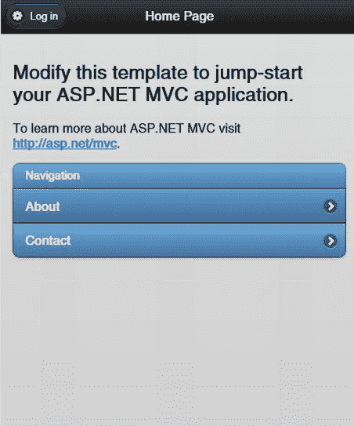

[图 12-12](#_Fig12) 。使用移动应用模板创建的项目主页

如果您浏览这个项目中的源代码，您会注意到控制器逻辑与其他模板中的逻辑是相同的。所有特定于移动设备的代码都在视图和布局页面中。清单 12-17 显示了`_Layout.cshtml`页面。代码示例中突出显示的是特定于使其成为移动 web 应用的部分。

[***清单 12-17。***](#_list17) _Layout.cshtml 来自移动模板

```cs
<!DOCTYPE html>
<html lang="en">
    <head>
        <meta charset="utf-8" />
        <title>@ViewBag.Title</title>
        <meta name="viewport" content="width=device-width" />
        <link href="∼/favicon.ico" rel="shortcut icon" type="image/x-icon" />
        @Styles.Render("∼/Content/mobileCss", "∼/Content/css")
        @Scripts.Render("∼/bundles/modernizr")
    </head>
    <body>
        <div data-role="page" data-theme="b">
            <div data-role="header">
                @if (IsSectionDefined("Header")) {
                    @RenderSection("Header")
                } else {
                    <h1>@ViewBag.Title</h1>
                    @Html.Partial("_LoginPartial")
                }
            </div>
            <div data-role="content">
                @RenderBody()
            </div>
        </div>

        @Scripts.Render("∼/bundles/jquery", "∼/bundles/jquerymobile")
        @RenderSection("scripts", required: false)
    </body>
</html>
```

第一行突出显示的代码是`viewport meta`标签。虽然这个标记不是移动应用模板所独有的，但它很重要，因为它告诉移动 web 浏览器不要缩小页面，而是将其设置为设备的像素宽度。

第二个突出显示的行显示了到`mobileCss`样式表包的链接。在`BundleConfig.cs`中定义的这个包中，内容目录下带有前缀`jquery.mobile`的所有 CSS 文件都被添加到页面中。在运行时，包含在 ASP.NET MVC 中的 web 优化框架会将这些文件合并并压缩成一个小的下载文件。

同样重要的是包含了`data-role`属性。jQuery mobile 使用这些 HTML5 属性将标准 HTML 元素转换为交互式用户界面元素，使其在移动设备上感觉更自然。

最后，在最后一行突出显示的代码中，包含了`jquerymobile`包。这个包将包含最新版本的 jQuery mobile 库，它已经通过 NuGet 添加到您的项目中。

下一个感兴趣的文件是`Home/Index`视图。在这里，您可以看到一个 jQuery mobile `listview`，它是在一个标准的 UL 元素上定义的，使用两个`data-` HTML5 属性进行了增强。第一个，`data-role="listview`"告诉 jQuery mobile 我们希望将这个无序列表用作列表视图小部件。第二个属性告诉 jQuery mobile，我们希望使用插入样式的列表，而不是默认的全角样式。

单击`ListView`中的链接将会触发一个导航，正如您所预料的那样，但是它实际上会调用 Ajax 来检索下一页的内容，然后使用动画转换来显示更新的内容，而不是卸载当前页面。使用这种技术，应用将具有与本机设备应用类似的行为。

[清单 12-18](#list18) 显示了`Index.cshtml`的标记，突出显示了特定于 jQuery mobile 的代码。

[***清单 12-18。***](#_list18) 由移动应用模板创建的首页索引视图

```cs
@{
    ViewBag.Title = "Home Page";
}

<h2>@ViewBag.Message</h2>
<p>
    To learn more about ASP.NET MVC visit <a href=" http://asp.net/mvc " title="ASP.NET MVC Website"> http://asp.net/mvc</a >.
</p>

<ul data-role="listview" data-inset="true">
    <li data-role="list-divider">Navigation</li>
    <li>@Html.ActionLink("About", "About", "Home")</li>
    <li>@Html.ActionLink("Contact", "Contact", "Home")</li>
</ul>
```

如您所见，jQuery mobile 允许您用最少的代码创建增强的移动设备体验。关于如何使用这个库的高级特性的完整教程可以在 jQuery 移动网站(`http://jquerymobile.com/demos/1.2.0/`)上找到。

12-8.测试您的移动网络应用

问题

您已经基于 ASP.NET MVC 4 移动应用模板创建了一个移动 web 应用。您希望在部署应用之前在多个设备上测试它。

解决办法

虽然可以使用桌面网络浏览器测试您的移动网络应用，但这并不是最佳选择。您的桌面浏览器可能具有与移动浏览器不一致的功能和行为，甚至可能以稍微不同的方式呈现内容。除非你是在微软 Surface Pro 等平板电脑上开发，否则你的桌面很可能会缺少触摸支持、GPS 和其他智能手机常见的功能。

一种解决方案是使用仿真器。移动设备模拟器通常在移动设备 SDK 中提供。各种 SDK 一般都是免费的。模拟器带有开发工具、代码示例和文档。他们通常使用虚拟化技术，允许您在 PC 上运行真实的设备操作系统。

除了模拟器之外，您还应该尽可能在真实设备上进行测试。许多可用性问题直到您在真实设备上实际使用您的应用时才显现出来。

工作原理

一旦确定了目标移动平台，您就需要为每个平台获取模拟器和物理设备的组合。在大多数情况下，您可以从获取设备模拟器开始。

在 Android 上测试

Android 是世界上最流行的移动操作系统。它被用在数百万部手机和平板电脑上，拥有超过 70%的全球市场份额。最新版本的 Android SDK 可以从`http://developer.android.com/sdk/index.html`下载。

SDK 可用于 Windows、Mac OS 和 Linux。SDK 中捆绑了 Eclipse IDE 的定制版本，以及示例、测试工具和一组称为 Android 虚拟设备(AVD)的仿真器。通过 Android SDK 管理器，您可以下载从版本 1.5 (API 3)开始的每个 Android 版本的设备映像。不幸的是，如果你的目标是新版本的 Android，比如冰激凌三明治，你的电脑将需要有足够的马力。在这一节中，我将讨论一些可以用来运行模拟器的技术。第一种建议开发人员使用睿频加速高达 3.5 GHz 或更高的高端英特尔 i7 CPU。如果您运行的是相对较新的基于 i5 的系统，您可以尝试这里列出的第二种技术，它展示了如何使用基于 x86 的 Android 模拟器。最后一项技术展示了如何使用虚拟盒来运行模拟器。这种技术甚至在旧的 CPU 上也能很好地工作，例如英特尔酷睿 2 双核处理器。

如果你碰巧有一台非常快的机器，你可以使用以下步骤设置一个虚拟设备来模拟 Galaxy Nexus 智能手机:

1.  从 Android 开发者网站下载 Android SDK。
2.  SDK 作为一个单独的 ZIP 文件(`adt-bundle-windows-x86_64`)包含在内。安装 SDK 就像解压一样简单。这些工具将从解压到的文件夹中运行。SDK 的总大小约为 340 MB。
3.  After unzipping the bundle, you can launch the developer tools by navigating to the Eclipse folder and then launching `eclipse.exe`. Eclipse requires that a Java runtime environment (JRE) be installed on your computer.

    a.如果您尚未安装 Java 运行时环境，请从 Oracle 网站下载最新的软件包(`http://java.com/en/download/manual.jsp`)。确保如果你下载了 64 位版本的 Android SDK，你也安装了 64 位版本的 Java。

    b.如果在安装 JRE 后仍然收到错误消息，您可能需要手动将`java/bin`目录添加到计算机的 PATH 环境变量中。您可以通过按下 Windows 键，然后键入 **env** 来编辑路径变量。如果你使用的是 Windows 8 ，你需要点击开始屏幕上的设置类别。然后，您可以单击“编辑系统环境变量”图标。这将打开“系统属性”窗口，您可以在其中单击“环境变量”按钮。在“环境变量”窗口中，滚动找到 PATH 变量，选择它，然后单击“编辑”。输入分号，后跟 Java Bin 文件夹的路径(`C:\Program Files (x86)\Java\jre7\bin`)。

4.  系统将提示您选择一个位置作为工作区。如果您决定使用 SDK 开发原生 Android 应用，将使用这个位置。该位置不会存储 avd。它们存储在您的 Windows 用户文件夹下。
5.  您可能还会被要求提供使用统计数据。勾选否，除非你想把你的使用数据发送到谷歌；否则，单击是。单击“完成”按钮关闭窗口。Android 开发人员工具欢迎页面将显示在 Eclipse 主窗口中。
6.  为了创建 AVD，您需要使用 Android 虚拟设备管理器。要做到这一点，从 Eclipse 窗口菜单，选择 Android 虚拟设备管理器。
7.  单击 Android 虚拟设备管理器窗口中的新建按钮。
8.  将 AVD **命名为 NexusGalTest** ，并从设备下拉菜单中选择 Galaxy Nexus。这是一个预定义的模板，将创建一个与运行 Android 4.2(果冻豆)的 Galaxy Nexus 智能手机规格相似的 AVD。
9.  如果您愿意，您可以调整前后摄像头的设置。这些可以映射到一个真实的摄像头，如连接到您的电脑的网络摄像头，或者可以使用模拟摄像头。您可能还需要调整内存，默认设置为 1 GB。如果您的电脑上的可用内存少于 1 GB，AVD 将无法加载。如果您的开发机器具有良好的 GPU，还建议您选中使用主机 GPU 复选框。
10.  单击确定。现在，您应该可以在设备列表中看到新的 AVD。要运行该设备，请单击选择它，然后单击开始按钮。
11.  单击启动窗口中的启动按钮启动 AVD。
12.  就像真正的 Android 智能手机一样，模拟器需要几分钟才能启动。启动后，您可以关闭欢迎消息并单击浏览器图标(它看起来像一个地球仪)。

使用英特尔 HAXM 驱动程序解决 AVD 性能问题

困扰 Android 开发者的一个问题是 avd 的可怕性能。如果您运行的是睿频加速高达 3.5 GHz 的最新 i7 英特尔处理器，它可能会很适合您；否则，您可能会发现 AVD 需要很长时间来加载，并且在加载之后，性能会令人非常不愉快。

一些滞后是由这样一个事实造成的，即默认情况下，仿真器没有利用您机器上的硬件辅助虚拟化。它还增加了一层来模拟 ARM 处理器。另一个缺陷是它不支持多处理器。您可能会注意到，当模拟器经历令人恐惧的旋转时，您的 PC 的性能监视器显示一个 CPU 处于 100 %,而其余的仍接近 idol。

幸运的是，这些问题可以得到缓解。第一个解决方案是使用基于 x86 的仿真器，而不是基于 ARM 的仿真器。这消除了许多可能阻塞仿真器的所需 CPU 周期。第二个解决方案是启用硬件辅助虚拟化。这是通过安装一个内核模式驱动程序来实现的，英特尔已经为开放手机联盟做出了贡献。从命令行运行模拟器，而不是从 Eclipse 启动它，还可以获得一些额外的好处。这消除了一些调试器的开销，测试 web 应用可能不需要这些开销。您也可以启用 GPU 加速。这将有助于将在 Android 操作系统中创建过渡动画所需的一些图形处理卸载到您的 GPU 上。然而，它对网页浏览性能没有帮助，因为 Android 在其浏览器中没有使用 GPU 加速。

英特尔 HAXM 驱动程序要求您运行安装并启用了英特尔 VT、EM64T 和执行禁用位功能的英特尔处理器。过去六年销售的大多数英特尔处理器都支持这些特性；但在某些情况下，您可能需要在计算机的 BIOS 设置中手动启用它们。不幸的是，在撰写本文时，这个功能还不能用于 API 级及以上。最新支持的版本是 API level 16。

要安装 x86 仿真器和英特尔驱动程序，您需要使用 Android SDK 管理器:

1.  运行 Eclipse。
2.  从 Windows 菜单中，选择 Android SDK 管理器。
3.  展开 Android 4.1.2 (API 16)节点，并选择英特尔 x86 Atom 系统映像。
4.  向下滚动，直到看到“附加项目”节点。展开 Extras 并选择英特尔 x86 模拟器加速器(HAXM)。您还应该确保安装了 Google USB 驱动程序。如果你没有安装这个驱动程序，你的 AVD 运行后会崩溃。
5.  单击安装软件包按钮。
6.  在选择要安装的软件包窗口中，勾选全部接受，然后单击安装。将自动为您选择任何依赖包。安装完成后，您可能需要对第二个软件包重复此过程。
7.  重启 Eclipse 以加载更改。
8.  您现在可以为 x86 映像创建一个新的 AVD。从 Eclipse 窗口菜单中，选择 Android 虚拟设备管理器。
9.  在虚拟设备管理器窗口中，单击新建按钮。
10.  将新设备命名为 **Intel** ，选择 Galaxy Nexus 设备模板，从目标中选择 Android 4 . 1 . 2–API Level 16。单击确定。
11.  关闭 Android 设备管理器窗口，然后关闭 Eclipse。
12.  在 Windows 文件资源管理器中，导航到安装 Android SDK 的目录。在 SDK 文件夹中，导航到`sdk\extras\intel\Hardware_Accelerated_Execution_Manager`文件夹。
13.  右键单击`IntelHaxm.exe`文件并选择以管理员身份运行。
14.  按照说明安装驱动程序。
15.  安装驱动程序后，您可以以管理员身份启动命令提示符，然后键入以下命令来确认其运行: **sc query intelhaxm** 。
16.  检查查询结果并验证 STATE 属性正在运行。
17.  如果它正在运行，在同一个命令窗口中，导航到`android sdk\tools`文件夹。
18.  输入以下命令启动 AVD: **仿真器-cpu-delay 0 -gpu on -avd intel** 。

使用 Oracle Virtual Box 解决 AVD 性能问题

如果您因为没有使用英特尔处理器而无法使用英特尔 HAMX 解决方案，或者仍然发现仿真器运行很差，还有另一种方法。Android 社区的成员创建了一个 Android 虚拟化解决方案，它使用 Oracle Virtual Box ( `https://www.virtualbox.org/`)作为 SDK 工具的替代工具。要使用基于 Virtual Box 的解决方案，您首先需要下载并安装 Virtual Box 软件。一旦安装了 Virtual Box，您就可以下载。来自`AndroVM.org`的 OVA，它有几个你可以下载的虚拟机。对于手机测试，你可以下载前缀为`androVM_vbox86p`的最新文件。对于平板电脑，使用带有前缀`vbox86t`的文件(例如`androVM_vbox86t_4.1.1_r4-20121119.ova`)。

一旦。OVA 文件已下载，您可以使用以下步骤运行它:

1.  双击。OVA 文件。如果您的计算机上安装了多个支持的产品。OVA 文件，可能会提示您选择一个。确保选择虚拟框。
2.  在导入虚拟设备窗口中，单击导入。
3.  导入过程完成后，在 Oracle VM VirtualBox 管理器中，选择 AndroVM，然后单击设置按钮。
4.  单击网络选项卡。
5.  对于适配器 1，在连接到下拉列表中选择仅主机适配器。此适配器用于管理目的。如果您要创建一个原生 Android 应用，您将配置 Eclipse 使用这个适配器来部署和调试您的应用。
6.  对于适配器 2，选择桥接适配器，然后选择计算机上的物理网卡。
7.  单击确定保存更改。
8.  单击运行按钮启动虚拟机。

与 SDK 自带的模拟器不同，Virtual Box 没有硬件皮肤的好处。为了避开这个限制，您需要使用键盘快捷键来导航虚拟机。

*   Escape = Android 后退按钮
*   Home = Android Home 键
*   F1 = Android 菜单按钮
*   End = Android 电源按钮
*   删除=锁定按钮

[图 12-13](#Fig13) 显示了一个在虚拟盒子内部运行 Android 4.1 的 AVD。默认情况下，这在横向模式下显示。

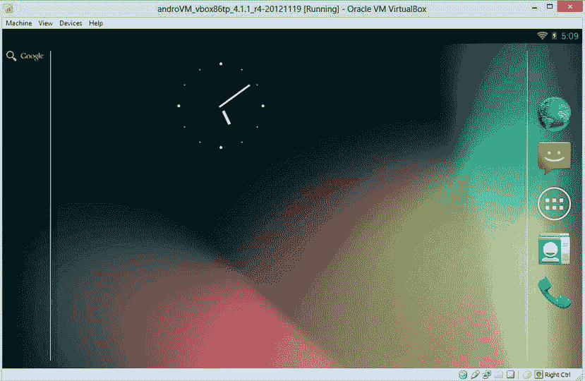

[图 12-13](#_Fig13) 。在 Windows 8 的虚拟盒子中运行的 Android 模拟器

使用 Virtual Box 作为模拟器的一个问题是，你没有能力做一些事情，比如改变设备方向，欺骗 GPS 定位，以及其他有趣的事情。通过在你的 AVD 上安装诸如 Rotation Locker 之类的 Android 应用，有可能绕过这些限制。Androvm.org 网站提供了如何做到这一点的指导。

在 Windows Phone 8 和 7.x 上测试您的应用

Windows Phone 7 是微软移动平台的一次重大重启，以回应他们早期的移动产品被 iPhone 和 Android 摧毁。在 Windows Phone 7 销售低迷两年后，微软推动了基于 Windows NT 内核的平台的重大升级，Windows NT 内核由 Windows 8 和 Windows Server 2012 共享。与以前版本的移动操作系统不同，以前版本的移动操作系统要求使用 Silverlight for Windows Phone 或 XNA Game Studio 开发应用，新的 Windows Phone 8 SDK 更加丰富。它允许在类似于 Windows 8 的基于 C++和 HTML5 的应用中进行原生开发。

Windows Phone 8 SDK 提供了在 Windows Phone 8 和 Windows Phone 7.5 设备上开发所需的一切。遗憾的是，它仅适用于 Windows 8，虚拟机不支持。它还要求您的处理器支持硬件辅助虚拟化，并且该功能已启用。

如果您没有 Windows 8，可以下载 Windows Phone SDK 7.1 和 SDK 7.11 更新。请注意，Windows Phone 7.x 和 Windows Phone 8 之间的 web 浏览器存在显著差异。出于这个原因，如果你真的想瞄准 Windows Phone，拥有一台运行 Windows 8 的 PC 是必不可少的。

SDK 可以从`http://dev.windowsphone.com/en-us/downloadsdk`下载。

Windows Phone 8 SDK 下载量高达 1.6 GB，安装需要 5.63 GB 的系统驱动器空间。由于组成仿真器的`.vhd`文件的大小，需要这些空间。除了模拟器之外，SDK 还附带了 Visual Studio 2012 的外接程序、Visual Studio Express 的一个版本、XNA Game Studio 以及示例和文档。

安装大约需要一个小时才能完成，这取决于您的互联网连接和电脑的速度。安装后，您可以从 Visual Studio 运行模拟器。

在 iOS 上测试您的应用

如果你想运行一个官方的 iOS 模拟器，你需要在一台装有英特尔处理器的 Mac 上运行。如果你碰巧有一台 Mac，你可以使用类似 VMWare Parallels 的东西来运行 Windows 8 和 Visual Studio 2012。然后，您可以从主机操作系统运行模拟器。

或者，您可以使用物理 iOS 设备，如 iPhone、iPod touch 或 iPad，或者在可以通过 VNC 访问的远程 Mac 上运行模拟器。iOS SDK 可以从`https://developer.apple.com/devcenter/ios/index.action`下载。

如果您无法访问 iDevice，另一个选择是使用 Electric Plum ( `www.electricplum.com/simulator.aspx`)的 iPhone 和 iPad 模拟器。虽然该工具不模拟 iOS 操作系统，但它包含 Safari web 浏览器使用的渲染引擎的嵌入式版本，并且可以在一定程度上模拟 iOS 浏览体验。重要的是要意识到这个工具是一个模拟器，而不是仿真器。因此，测试不会像真正的 iOS 设备那样百分之百准确。但是，对于开发目的来说，它有点方便。

在黑莓 10 上测试

像 Windows Mobile 和 Palm OS 一样，由于 iOS 和 Android 的冲击，黑莓 OS 遭受了巨大的市场份额损失。尽管黑莓操作系统一直在走下坡路，但 RIM 仍拥有近 7000 万用户。这主要是由于他们在企业和政府中的稳固地位，以及他们在新兴市场的持续成功。

黑莓 10 是 RIM 重振其智能手机阵容的最新尝试。这与过去版本的黑莓操作系统大相径庭。黑莓 10 是基于 Linux 的操作系统，名为 QNX。随着黑莓 10 的推出，RIM 合并了旧版本操作系统中提供的许多服务，并在黑莓 Playbook 平板电脑中引入了升级的现代界面。其结果是一个令人印象深刻的操作系统，令人惊讶的现代和易于使用，并拥有一些业界最好的安全功能。

黑莓 10 为开发者提供了几个选择，包括 c++ API——一种基于 Adobe Air 的开发模型，HTML5，以及使用 Android 运行时的 Java 开发。黑莓 10 模拟器是一个单独的下载形式的。OVA 文件经过优化，可在 VMWare Player 中运行。模拟器允许你使用边框滑动手势；支持面向嵌入式系统(GLES)的硬件加速 OpenGL，用于本地游戏；并且支持缩放、倾斜、GPS 和 NFC 模拟。总的来说，该模拟器非常强大，可能是最完整和易于使用的之一。名为 Controller 的独立应用可用于模拟按钮按压、设备方向变化、GPS 和其他非标准输入。与仅复制 iOS 网络浏览器功能的 Electric Plum 模拟器不同，黑莓的模拟器运行的是虚拟化版本的 QNX。它在技术上被认为是一个模拟器，因为它能够生成硬件事件，如设备旋转。

可以通过执行以下操作来安装和运行 BlackBerry simulator:

1.  如果您的机器上没有安装 VMWare 或 VMWare Player，请从`www.vmware.com`下载并安装。
2.  从`https://developer.blackberry.com/devzone/develop/simulator/simulator_installing.html`下载黑莓模拟器。
3.  运行安装程序。安装程序将虚拟机文件复制到您的`My Documents/Virtual Machines`文件夹，并安装一些实用程序，如控制器应用。
4.  在开始屏幕(或开始菜单)上找到 VMWare Player 应用，然后启动 VMWare Player。
5.  从 VMWare Player 菜单中，选择 Open，然后导航到您的`My Documents/Virtual Machines`文件夹并打开`Blackberry10Simulator.vmx`文件。
6.  几分钟后，您将看到 VNX Unix 命令提示符开始启动过程。你最终会被引导到主屏幕。

在模拟器 中打开你的 MVC 应用

一旦安装了一个或多个移动设备模拟器，就可以开始测试应用了。但是，在此之前，您需要对 Visual Studio 项目配置进行一些更改。默认情况下，Visual Studio 2012 使用 IIS Express 承载您的应用。虽然它具有方便、自包含的优点，并且不需要管理特权就可以在您的计算机上运行，但是它有一个主要问题，这使得它不能与大多数模拟器和仿真器一起使用。IIS Express 的配置方式是，当主机名为 localhost 时，也可以访问它。如果您试图使用任何其他名称访问它，包括您的电脑的 IP 地址，IIS Express 将抛出一个错误，抱怨一个无效的主机名。

解决方案是将您的项目配置为使用完整版本的 IIS。在本地 PC 上安装 IIS 的过程在配方 3-9 中有解释。配方 3-10 展示了如何配置你的 MVC 项目来使用 IIS 而不是 IIS Express。

项目配置完成后，您将需要使用计算机的本地 IP 地址以及站点的虚拟目录名来访问站点。您可以通过打开命令提示符并键入 **ipconfig** 来获得您的本地 IP 地址。

 **注意**如果你已经配置你的站点使用主机头，并且你正在你的 PC 上使用一个主机文件，模拟器将不能解析友好名称。这是因为主机文件对于您的 PC 来说是本地的，并且在大多数情况下，模拟器将是一个单独的虚拟机，具有自己的 IP 地址。一种解决方法是在您的本地网络上创建一个真实的 DNS 条目，或者如果可能的话使用一个虚拟目录。

[图 12-14](#Fig14) 显示了在配方 12-8 中创建的项目。左边是 Android 模拟器，中间是 BlackBerry 10 模拟器，右边是 Electric Plum iPhone 模拟器。

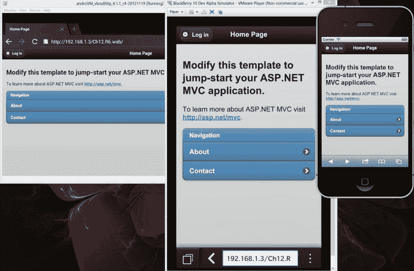

[图 12-14](#_Fig14) 。模拟器和 Android 模拟器中显示的 ASP.NET MVC 移动应用

[<sup>1</sup>](#_Fn1) `PhoneArena.com`，“App Store 中 40 万应用从未下载过”称报告，“`www.phonearena.com/news/400000-apps-in-the-App-Store-have-never-been-downloaded-says-report_id32943`。