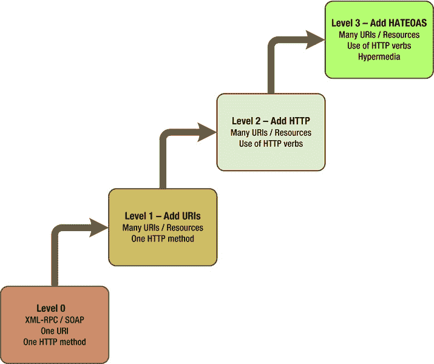
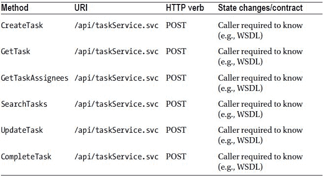
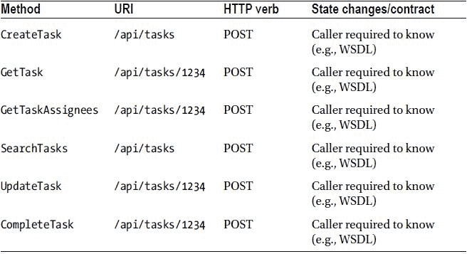
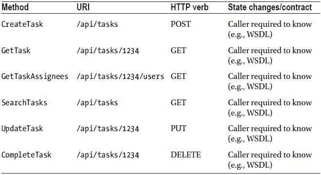
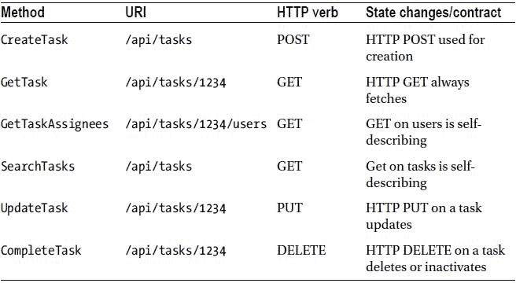

# 二、什么是 REST？

本章探讨了遵循 REST 架构的服务应该是什么样子。考虑到这样的 API 在理论上应该使用 HTTP 动词并关注资源，它的接口将与典型的 RPC 风格的 API 明显不同。因此，在我们设计服务时，我们将 REST 方法与更传统的 RPC 或 SOAP 方法进行比较。

在本书中，我们将致力于管理任务的服务。我知道这并不十分令人兴奋；然而，缺乏领域刺激会让你专注于服务的技术方面。设计一个 RESTful 接口比你想象的要复杂，你需要在某种程度上重新编程你的大脑，来为这样一个 API 建模。

这需要更多的前期工作，但这并不意味着你不应该走这条路。正如上一章简要介绍的，REST 架构有很多好处。但是要实现这些好处还需要做一些工作。创建 REST API 并不像许多人想象的那样简单，只是将 RPC 方法转换成 REST URLs。您必须在架构的约束下工作。在这种情况下，您还必须在 HTTP 协议的约束下工作，因为那将是您的平台。

在本章中，您将了解以下内容:

*   伦纳德·理查森的休息成熟度模型
*   与 URIs 和资源合作
*   使用 HTTP 动词
*   返回适当的 HTTP 状态代码

我们开始吧。

从 RPC 到 REST

2008 年 11 月，一个名叫 Leonard Richardson 的家伙为 REST 创建了一个成熟度模型。根据定义，成熟度模型是一张地图，它指导用户不断提高与给定定义、架构或方法的符合程度。例如，被称为能力成熟度模型集成(CMMI )的模型是作为帮助组织(通常是软件组织)提高性能和效率的过程改进方法而创建的。该模型包含五个*级别*，其中每个连续的级别都旨在为用户或组织提供比前一个级别更高的流程效率。

Richardson 的 REST 成熟度模型(RMM) 为服务 API 开发者提供了构建 RESTful web 服务的相同类型的改进图。事实上，他的模型从第 0 层开始，使用 RPC 风格的接口，然后再向上发展三层——在这一点上，你已经实现了一个 API 接口设计，根据罗伊·菲尔丁， [<sup>1</sup>](#Fn1) 的说法，这至少是 RESTful 服务的先决条件。也就是说，如果您停留在 RMM 的 0、1 或 2 级，您不能声称拥有 RESTful 服务；然而，也有可能把事情搞砸到在第 3 级没有 RESTful 服务的程度。

[图 2-1](#Fig1) 总结了 RMM 中的等级。



[图 2-1](#_Fig1) 。理查森的休息成熟度模型图

XML-RPC 和 SOAP

在第 0 级，API 类似于大多数 SOAP 服务。也就是说，该接口的特征在于具有仅支持单个 HTTP 方法或动词的单个 URI。稍后你会学到更多关于可用动词的知识；但是现在，只要知道 HTTP 提供了一小组已知的动词，如果您打算遵守并利用该协议，就必须使用这些动词。

假设，正如在[第一章](1.html)中提到的，你想要构建一个任务管理服务，而你需要提供一种通过新 API 创建新任务的方法。如果这是一个 0 级的基于 SOAP 的服务，您可能会创建一个名为`TaskService`的 WCF 服务类；在这个基础上，你可以创建一个叫做`CreateTask()` 的新方法。这个方法可能会接收一条请求消息，其中包括任务标题、任务类别、状态等等。该方法的响应消息可能包括系统生成的任务号等。

您还可以创建一个获取任务细节的方法。所以，在你的`TaskService`类中，你可以添加一个叫做`GetTask()` 的方法。这个新方法可能将某种任务 ID 作为输入，然后返回一个任务对象——序列化为 XML。

为了完善`TaskService`类，您还可以添加方法`UpdateTask()`、`SearchTasks()`和`CompleteTask()`。每一个都被设计成接收适当的 XML 请求消息并返回某种响应消息。

REST 成熟度模型——实际上是 Roy Fielding 发表的作品——提供了 API 的三个不同的 web 相关属性,帮助您定位自己对 HTTP 是 RESTful 的:

*   独特的 URIs 资源
*   HTTP 动词的一致使用
*   “作为应用状态引擎的超媒体”(HATEOAS)

让我们使用这三个属性来检查假装的`TaskService`服务接口(参见[表 2-1](#Tab1) )。

[表 2-1](#_Tab1) 。RMM 上 0 级的任务服务



如您所见，从 Web 的角度来看，服务上的每个操作或方法看起来都是一样的。而且这项服务看起来和感觉上都不太像网络。例如，无论获取任务 123 还是任务 456，URI 都是相同的。事实上，它也是同一个 URI 用来创建任务、更新任务、完成任务等等。在我们的 URI 中没有资源或资源寻址能力的概念——也就是说，没有直接指向特定任务或任务列表的 URI。

这个例子也没有像预期的那样使用 HTTP 动词。这在[第 1 章](1.html)中有所讨论，稍后你会学到更多细节；然而，API 中可用的每个动作本质上都是定制的。要在 HTTP 上实现 RESTful，您需要避免创建定制动作，而是支持与 HTTP 一致的动作。换句话说，您需要使用 GET、PUT、POST 和 DELETE(来命名主要的操作)。

最后，客户需要提前知道所有可用的操作。这意味着客户端和服务器之间存在隐式绑定，因为调用者依赖于服务的约定和给定的一组操作。同样，这感觉不太像网络。当你浏览一个公共网站时，你只需要记住它的根地址。从那里，其他的一切都可以被发现，并通过超媒体(即链接和表单)链接到其他元素。的确，超媒体是应用状态的引擎。您可以仅基于链接和表单从一个状态转换到下一个状态(其中状态机是一个网站或更广泛的互联网)。您不需要记住或提前知道您要遍历的所有页面的具体地址。

您也不需要记住提交请求(例如，下订单或订阅杂志)时必须填写的每个字段。本质上，服务器规定了所有的关系、所有的 URIs 和所有的表单——不需要你有任何先验知识。所以，如果这些属性中的任何一个发生了变化，你可能都不会注意到或者在意。这是因为我们，客户，对网站有一种隐含的理解:他们会引导我们通过可用的资源，并提供所有我们需要的信息，以便作出任何改变或请求。

很快您就会看到，HATEOAS 的这个属性是服务 RESTfulness 的关键；然而，它经常被忽视，因为它需要从传统的 RPC 风格的界面设计中进行重大的思想转变。

URIs 和资源

正如在[第一章](1.html)中简要提到的，构建一个 RESTful 接口意味着你最终得到一个非常以资源为中心的 API。因此，您需要有意识地以资源为中心来设计界面。与 RPC 风格的接口不同，在 RPC 风格的接口中，任意的服务方法(即动词)及其相关的请求和响应消息主宰着一天，REST 接口将围绕资源(即名词)展开。这些资源可用的操作受到 HTTP 使用的限制。这就是为什么您必须将可用的 HTTP 动词映射到 API 中；你没有创造其他动作或动词的自由。

这个概念是 REST 设计的核心。因此，让我们检查一下`TaskService`如果是 RMM 上的 1 级，可能会是什么样子。表 2-2 显示了每个单独的资源如何通过一个唯一的 URI 寻址。

[表 2-2](#_Tab2) 。RMM 上的 1 级任务服务



但是您仍然必须依赖特定的消息来进行操作。换句话说，调用者无法区分`/api/tasks` URI 提供的两种不同操作——除非调用者已经有了契约。您仍然只使用 POST HTTP 动词，因此请求消息本身决定了所需的操作。

HTTP 动词

你必须超越 URIs 和他们的资源，看到服务所需的行动。这些操作将帮助您识别需要使用的 HTTP 动词。继续以我们的例子为例，没有所谓的`CreateTask` HTTP 动词。事实上，甚至没有一个`Create`动词。如果您打算遵循 REST 架构和 HTTP 协议，您必须从该协议中可用的动词中进行选择，即:

*   得到
*   放
*   邮政
*   删除

直观地说，您可以快速消除`CreateTask`动作的 GET 和 DELETE。但是 PUT 和 POST 在意图上有什么区别呢？如[表 2-3](#Tab3) 中的所示，PUT 被设计为创建或替换一个具有已知标识符的资源——因此也是一个已知的唯一 URI。当系统正在生成新资源的标识符时，可以使用 POST。

从技术上讲，REST 架构与任何特定的协议无关。这包括 HTTP 协议。换句话说，你所需要的是一个协议，它提供了描述状态(即*表示*)和状态变化的语言和机制。然而，因为这本书是关于用 ASP.NET 构建 REST 服务的，所以您将把重点放在用 HTTP 构建 REST 上。幸运的是，HTTP 协议本身涵盖了您需要的大部分内容。再次，[表 2-3](#Tab3) 说明了动词在 REST 中的预期用途。

[表 2-3](#_Tab3) 。对任务资源使用 HTTP 谓词

| HTTP 动词 | 【收藏 URI】`http://myserver.com/tasks` | 【元素 URI】`http://myserver.com/tasks/1234` |
| --- | --- | --- |
| 得到 | 任务列表，包括 URIs 交给个人的任务 | 得到一个特定的任务，由 URI 确定 |
| 放 | 替换整个任务集合 | 替换或创建由 URI 标识的单个任务 |
| 邮政 | 创建新的单个任务，其标识符由系统生成 | 在 URI 确定的任务下创建新的下属 |
| 删除 | 删除整个任务集合 | 删除 URI 确定的任务 |

让我们通过这个映射来了解一些重要的概念。首先，四个动词的确切含义取决于 URI。所以即使你只有四个动词，实际上你有八种不同的动作。区别在于 URI 定义的是集合还是唯一元素。

第二，当创建资源的新实例(例如，新任务)时，在场景中使用 PUT 和唯一的 URI，在该场景中，调用者在向服务器提交请求之前生成新资源的标识符。在[表 2-3](#Tab3) 中，PUT 动作与唯一元素 URI 一起使用，创建一个具有特定标识符 1234 的新任务。相反，如果系统要生成标识符，则调用者使用 POST 操作和集合 URI。这也联系到*幂等*的概念。

PUT 和 DELETE 方法据说是幂等的；也就是说，反复调用它们将产生相同的结果，而没有任何额外的副作用。例如，调用方应该能够调用特定资源上的删除操作，而不会收到任何错误，也不会损害系统。如果资源已经被删除，调用方应该不会收到错误。这同样适用于 PUT 操作。对于给定的唯一资源(由元素 URI 标识)，如果该资源已经存在，则提交 PUT 请求应该会更新该资源。或者，如果它不存在，系统应该创建提交的资源。换句话说，一遍又一遍地调用 PUT 会产生相同的结果，而不会产生任何额外的副作用(即，新任务将按照调用者提供的表示存在于系统中，无论系统是必须创建新任务还是必须更新现有任务)。

GET 动作据说是*安全的*。本质上，这不是幂等的。安全意味着系统中的任何内容都不会改变，这适用于查询系统资源集合或特定资源的 HTTP 调用。

服务的 GET、PUT 和 DELETE 操作的幂等性与 HTTP 协议标准保持一致是很重要的。因此，应该尽一切努力确保这三个动作可以被反复调用而不会出错。

与其他三个动作不同，POST 不被认为是幂等的。这是因为 POST 用于为方法的每次调用创建已标识资源类型的新实例。反复调用 PUT 永远不会导致创建或更新多个资源，而调用 POST 将导致新的资源实例—每个调用一个。这适用于系统必须生成新资源的标识符，并在响应中返回它的情况。

当您对任务管理服务建模时，您需要将每个资源与一组 HTTP 动作进行映射，定义哪些是允许的，哪些是不支持的。

现在让我们重新看看任务服务。这一次，您将使用可用的 HTTP 动词，这将使您处于 RMM 的第 2 级(参见[表 2-4](#Tab4) )。

[表 2-4](#_Tab4) 。RMM 中的 2 级任务服务



此时，该服务对单个资源使用唯一的 URIs，并且您已经切换到使用 HTTP 动词而不是自定义请求消息类型。也就是说，前面提到的每一个 PUT 和 POST 动作将简单地获取一个任务资源的表示(例如，XML 或 JSON)。但是，客户端仍然必须预先了解 API，以便遍历域并执行比创建、更新或完成任务更复杂的操作。在网络的本质中，你应该完全指导客户，通过链接和表单提供所有可用的资源和动作。这就是“作为应用状态引擎的超媒体”的含义

恨死我了

当您查看[表 2-3](#Tab3) 和[表 2-4](#Tab4) 时，您可以看到某些 GET 操作将返回资源集合。REST with HTTP 的一个指导原则是，调用者只能通过导航服务器提供的超媒体来完成应用状态的转换。换句话说，给定一个根或起始 URI，调用者应该能够浏览资源集合，而不需要事先了解 URI 方案。因此，每当从服务返回一个资源时，无论是在集合中还是单独返回，返回的数据都应该包括返回并执行另一个 GET 以检索该资源所需的 URI。

下面是一个 XML 响应消息的例子，说明集合中的每个元素应该如何包含资源的 URI:

```cs
<?xml version="1.0" encoding="utf-8"?>
<Tasks>
    <Task Id="1234" Status="Active" >
        <link rel="self" href="/api/tasks/1234" method="GET" />
    </Task>
    <Task Id="0987" Status="Completed" >
        <link rel="self" href="/api/tasks/0987" method="GET" />
    </Task>
</Tasks>
```

用集合响应时，通常只返回几个属性或几段数据是合适的，如前面的示例所示。现在，调用者可以使用 URI 来查询特定的资源，以检索该资源的所有属性。例如，`Tasks`集合响应(如刚才所示)可能只包含`Task`的`Id`和一个获取`Task`资源的 URI。但是当调用 GET 来获取特定的`Task`时，响应可能包括`TaskCategory`、`DateCreated`、`TaskStatus`、`TaskOwner`等等。

中使用强类型模型对象时，采用这种方法可能会有点棘手。NET(或任何其他面向对象语言)。这是因为我们需要定义至少两个不同的`Task`类型的变体。典型的模式是有一个任务`Info`类和一个`Task`类，其中`TaskInfo`类的存在只是为了提供关于`Task`的基本信息。该集合可能如下所示:

```cs
<?xml version="1.0" encoding="utf-8"?>
<Tasks>
    <TaskInfo Id="1234" Status="Active" >
        <link rel="self" href="/api/tasks/1234" method="GET" />
    </TaskInfo>
    <TaskInfo Id="0987" Status="Completed" >
        <link rel="self" href="/api/tasks/0987" method="GET" />
    </TaskInfo>
</Tasks>
```

单个资源可能如下所示:

```cs
<?xml version="1.0" encoding="utf-8"?>
<Task Id="1234" Status="Active" DateCreated="2011-08-15" Owner="Sally" Category="Projects" >
    <link rel="self" href="/api/tasks/1234" method="GET" />
</Task>
```

像这样利用两种不同的类型并不是 REST 或任何其他服务 API 风格的要求。您可能会发现不需要将集合类型定义与其他定义分开。或者，你会发现你需要的远不止两个。这完全取决于使用场景以及资源上存在多少不同的属性。例如，如果`Task`资源只包含五六个属性，那么您可能不会为集合对象创建单独的类型。但是如果`Task`对象包含 100 个或更多的属性(这在现实生活中的财务应用中很常见)，那么创建多个`Task`类型的变体可能是个好主意。

在 HATEOAS 的领域中，您还希望指导用户对资源的可用操作。您刚刚看到了如何使用`<link>`元素为获取任务细节提供参考。您可以扩展这个概念，以包括所有可用的资源和操作。记住，当浏览一个网站时，用户只需要有根地址的先验知识就可以遍历整个网站。您希望在 API 中为调用者提供类似的体验。

对于`TaskInfo`类型，完全符合 HATEOAS 的 XML 响应可能是这样的:

```cs
<?xml version="1.0" encoding="utf-8"?>
<Tasks>
    <TaskInfo Id="1234" Status="Active" >
        <link rel="self" href="/api/tasks/1234" method="GET" />
        <link rel="users" href="/api/tasks/1234/users" method="GET" />
        <link rel="history" href="/api/tasks/1234/history" method="GET" />
        <link rel="complete" href="/api/tasks/1234" method="DELETE" />
        <link rel="update" href="/api/tasks/1234" method="PUT" />
    </TaskInfo>
    <TaskInfo Id="0987" Status="Completed" >
        <link rel="self" href="/api/tasks/0987" method="GET" />
        <link rel="users" href="/api/tasks/0987/users" method="GET" />
        <link rel="history" href="/api/tasks/0987/history" method="GET" />
        <link rel="reopen" href="/api/tasks/0987" method="PUT" />
    </TaskInfo>
</Tasks>
```

请注意，每个任务可用的链接略有不同。这是因为你不需要完成一个已经完成的任务。相反，你需要提供一个重新打开它的链接。此外，您不希望允许对已完成的任务进行更新，因此该链接不会出现在已完成的任务中。

`I want to offer a disclaimer and a word of warning for the topic of links in REST messages. You find that, over the past several years, the debate over how the HTTP verbs are supposed to be used can be quite heated at times. This debate also extends into how to best design URIs to be most RESTful—without degenerating into SOAP-style API. For example, in the `Task` XML you just looked at, it specifies the “reopen” link as a PUT to the `/api/tasks/0987` URI. It also specifies the “complete” link as a DELETE to the `/api/tasks/1234` URI. These approaches are neither specified by the REST architecture, nor are they even agreed upon by the folks that practice REST. And for whatever reason, people on various sides of the debate tend to get worked up about their way of doing things. Instead of using a PUT against the resource URI for the “reopen” action, you could instead use a PUT against a URI like `/api/tasks/0987/reopen`. I tend to lean away from this approach, as it pushes you closer to specifying actions instead of resources (for the URI). However, I also think it’s a bit unrealistic to assume you can accommodate all available actions on something like a `Task` object with only four HTTP verbs. Indeed, there are a few more verbs you can use, including PATCH, HEAD, and OPTIONS. But even so, the set of available verbs is limited, and the REST architecture dictates that you don’t add to those verbs. So at some point, you need to make a judgment call as to how to implement various actions on the `Task` object. The important thing is to conform as closely to HTTP standards as possible. The use of the DELETE verb is also hotly debated. Most enterprise applications don’t allow the caller to really delete a resource. More often, a resource is merely closed, inactivated, hidden, and so on. As such, it might seem reasonable to not waste one of your precious few verbs on an action that you never even allow, when instead you could use it for the “close” action. As with most endeavors in the world of software, the devil’s in the details. And you can usually find 101 ways to implement those details if you look hard enough. My advice here is to simply do the best you can, don’t be afraid to be wrong, and don’t get stuck in an infinite loop of forever debating the very best approach to follow. Think, commit, and go.

现在，您可以使用从 RMM 中学到的三个概念来完成任务资源和操作表:

*   URIs 和资源
*   HTTP 动词
*   恨死我了

表 2-5 展示了一个更理想的 RESTful 设计下的任务服务。也就是说，它显示了您可以做些什么来使服务自我描述(即，相关信息和可用操作通过服务响应中包含的链接提供给调用者)。同样，遵循 RMM 本身并不足以声称您的服务是 REST 服务。也就是说，你也不能声称遵从 REST 而不遵循它。

[表 2-5](#_Tab5) 。RMM 中第 3 层的任务服务



在结束对 REST 的探索之前，还有最后一点指导要讨论。

HTTP 状态代码

到目前为止，在本章中，您已经了解了 REST 体系结构的约束，这些约束导致创建了一个 API，其中资源是选择的消息；其中每个资源和资源上的每个动作都具有唯一的 URI；在这里，不是创建定制的方法或动作，而是将自己限制在 HTTP 可用的动作上；最后，你给调用者一个给定的资源上所有可用的动作。所有这些约束都处理呼叫者发出的呼叫。最后要讨论的是响应这些调用时从服务器发回的消息。

同样，您被限制只能使用 HTTP 中可用的动词，您也被限制只能使用众所周知的 HTTP 状态代码集作为服务调用的返回“代码”。当然，这并不是说你不能包含额外的信息。事实上，除了在浏览器中看到的 HTML 之外，您访问的每个网页都包含一个 HTTP 状态代码。这里的基本思想是简单地利用响应头中的已知状态代码。

让我们首先看看可用 HTTP 状态代码的子集。你可以在这里找到完整的官方规范:`www.w3.org/Protocols/rfc2616/rfc2616-sec10.html`。在本节中，您将只检查这些代码的一小部分。表 2-6 列出了 RESTful API 上下文中最常见的状态代码及其描述。

[表 2-6](#_Tab6) 。常见 HTTP 状态代码列表

| 状态代码 | API 含义 |
| --- | --- |
| Two hundred | 一切都好；响应还将包括适用的资源信息 |
| Two hundred and one | 资源已创建；将包括指定新创建资源的 URI 的位置头 |
| Two hundred and two | 与 200 相同，但用于异步；换句话说，一切都很好，但是我们需要轮询服务以确定何时完成 |
| Three hundred and one | 资源已被移动；应该包括 URI 到新的位置 |
| four hundred | 错误的请求；调用者应该重新格式化请求 |
| Four hundred and one | 未经授权；应该响应一个身份验证质询，让调用者重新提交适当的凭据 |
| Four hundred and three | 拒绝访问；用户成功通过身份验证，但不允许访问请求的资源 |
| Four hundred and four | 找不到资源，或者不允许调用者访问资源，我们不想透露原因 |
| Four hundred and nine | 冲突；当另一个调用方弄脏了资源时，用作对 PUT 请求的响应 |
| Five hundred | 服务器错误；发生了一些不好的事情，服务器可能包含一些潜在问题的指示 |

例如，假设呼叫者提交了以下 HTTP 请求:

```cs
GET /api/tasks/1234 HTTP/1.1
```

该服务应做出如下响应(这是原始 HTTP 响应):

```cs
HTTP/1.1 200 OK
Content-Type: application/xml

<Task Id="1234" Status="Active" DateCreated="2011-08-15" Owner="Sally" Category="Projects" >
    <link rel="self" href="/api/tasks/1234" method="GET" />
    <link rel="users" href="/api/tasks/1234/users" method="GET" />
    <link rel="complete" href="/api/tasks/1234" method="DELETE" />
    <link rel="update" href="/api/tasks/1234" method="PUT" />
</Task>
```

假设现在调用者正在使用 POST 请求创建一个新任务:

```cs
POST /api/tasks HTTP/1.1
Content-Type: application/xml

<Task Status="Active" DateCreated="2012-08-15" Owner="Jimmy" Category="Projects" >
```

服务应该用 201 代码和新任务的 URI 进行响应(假设调用成功):

```cs
HTTP/1.1 201 Created
Location: /api/tasks/6789
Content-Type: application/xml

<Task Id="6789" Status="Active" DateCreated="2012-08-15" Owner="Jimmy" Category="Projects" >
    <link rel="self" href="/api/tasks/6789" method="GET" />
    <link rel="owner" href="/api/tasks/6789/owner" method="GET" />
    <link rel="complete" href="/api/tasks/6789" method="DELETE" />
    <link rel="update" href="/api/tasks/6789" method="PUT" />
</Task>
```

这里的要点是尽可能多地利用 HTTP 协议，这与本章讨论的主题是一致的。这就是 HTTP 的症结所在:您既使用 HTTP，又允许自己受到它的约束，而不是绕过协议。

摘要

在这一章中，你探索了在你声称你是 RESTful 之前必须存在的服务 API 的各种特征。请记住，遵守这些特征并不自动意味着您的服务有资格成为 REST 服务；然而，您至少可以宣称它的服务接口是合格的。

您还浏览了 Leonard Richardson 的 REST 服务成熟度模型，并使用该模型作为平台来比较 RESTful 服务和本质上更像 SOAP 或 XML-RPC 的服务。这让您看到 SOAP 服务没有像 REST 服务那样利用 HTTP 的各个方面。

[<sup>1</sup>](#_Fn1)T0】`