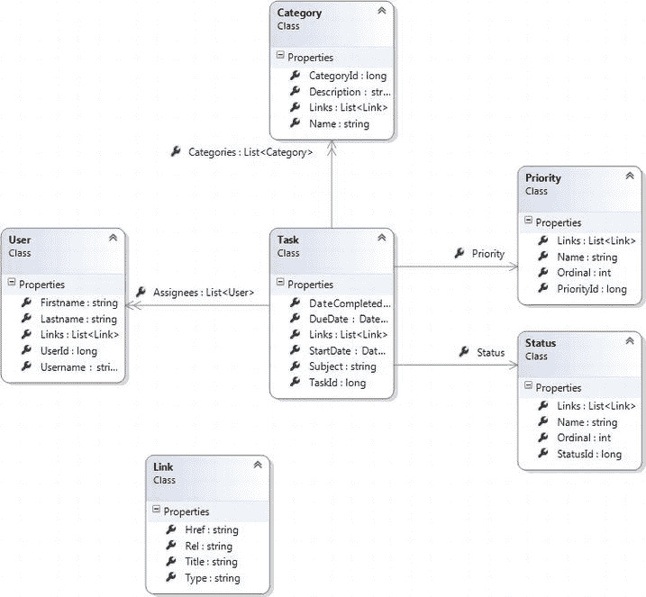
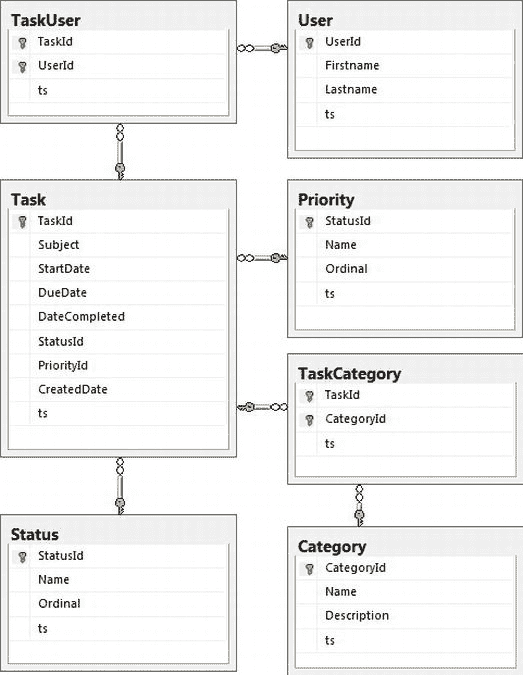
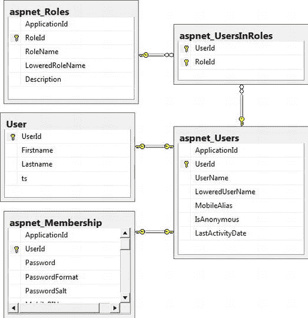

# 三、设计示例 REST API

到目前为止，您已经学习了使用 HTTP 协议的 REST 架构的一些基本原则，现在您已经准备好开始工作于您的任务管理服务。但是首先，您需要花一些时间来仔细构建资源类型、它们可用的 HTTP 动作和相关的 URIs 的表——类似于您在上一章中对帐户服务示例所做的工作。对这些类型建模将是这个练习中最重要的部分，类似于耐心和有意识地对数据库建模的重要性。仔细考虑并把它做好是值得的。并且，当您遍历不同的资源类型时，您将开始检查一些代码(是的！).

您可能还记得上一章，一位名叫 Leonard Richardson 的程序员创建了众所周知的 Rest 成熟度模型(RMM)。这个模型定义了一条将更传统的 RPC 风格的 API 转变为 REST 风格的 API 的途径。当您构建示例 API 时，使用这个成熟度模型将帮助您从大多数开发人员都知道的东西(即非 REST)映射到新的不同的东西(即 REST)。您将需要注意退化成 RPC API 的自然趋势，从而退回到成熟度模型。我会试着让你注意到那些错误的选择会让你再次下滑的时刻。

同样在这一章中，您将为存储任务及其支持数据建立一个小型数据库模型。这样做不会花太多时间，因为构建一个 RESTful 或非 RESTful 服务不会改变您的数据库建模方法。无论哪种方式，您都需要存储资源及其关系的实例。

最后，您将了解我和许多其他人认为在。NET 开发(当然是在 MVC4 和 Web API 服务的上下文中)。因为您将构建一个工作服务应用，所以我将向您展示选择组件的最佳示例，比如 O/RM、logger、IoC 容器等等。显然，有很多选择——商业的和开源的。你将在本章看到的选择是基于我自己和我最亲密的同事在过去 15 年多的经验。

任务管理资源类型

让我们首先考虑一些您希望 API 的调用者能够做的事情。由于该服务侧重于任务管理，它提供的大部分功能将集中在创建、查看和更新任务上。为了支持这些任务，您需要对类别、优先级、状态和用户进行建模。总而言之，这将是一个相当轻量级的服务。同样，一个简单易懂的领域可以让你专注于本书中你关心的非领域概念。具体来说，这包括 REST、ASP.NET MVC 4 和 Web API。

首先，调用者应该能够创建一个新任务。它应该能够做到这一点，而不需要提供超过一个主题的任何内容。如果在创建任务时不知道开始日期、结束日期、优先级等值，则这些值都可以在以后更新。当创建一个新任务时，您将让系统创建它的标识符——而不是由调用者生成一个定制的标识符并将其传入。当然，调用者也应该能够更新或删除现有的任务。

一项任务需要支持零个或多个用户作为任务的受分配者。大多数处理任务的系统只允许单一用户分配，但这一直困扰着我。此外，允许一个任务有多个用户分配 会让 API 更有趣一些。

在用户方面，您需要向调用者提供所有用户的列表。为了了解这是如何工作的，您将允许调用者列出它们或者提交一个搜索字符串。然后，您可以对系统中所有用户的名字和姓氏使用搜索字符串。任务管理示例是关于管理任务的，所以您不支持添加、更新或删除用户。

最后，为了支持任务的分类，您将提供类别、状态和优先级值。状态和优先级的可用值将由系统设置，因此它们只需要支持所有值的列表。对于类别，您需要允许调用者更新可用的值。

图 3-1 展示了资源类型在 Visual Studio 2012 中作为类图的样子。



[图 3-1](#_Fig1) 。资源类型的类图

但是，请注意，REST 体系结构的指导原则之一是避免通过共享类型定义将客户端耦合到服务器。因此，即使您将在服务器代码中使用类来表示您从调用者那里接收和发送给调用者的资源，这些定义也完全是内部的。这与 SOAP 明显不同，在 SOAP 中，WSDL 文档非常明确地定义了所有服务接口、方法及其签名，以及所有消息类型。事实上，这个 SOAP 协议是一个契约，它将客户机与服务器上的定义耦合起来。但是在 REST 中，您希望尽可能地避免这种耦合，并尽最大努力将服务的“契约”元素限制在 HTTP 协议定义的范围内(即 HTTP 动词，使用 URIs 访问资源，利用超媒体作为应用状态的引擎)。

超媒体链接

说到超媒体，你无疑会注意到[图 3-1](#Fig1) 中的`Link`类，以及所有其他类的相关`List<Link>`属性。请记住，您希望引导 API 消费者浏览您的应用——就像引导 web 浏览器中的用户浏览带有各种超链接和 WebForm 的网站一样。因此，每次将资源表示发送回调用者时，都需要给它一个可用动作的列表(即状态变化)。

让我们更详细地看看`Link`类:

```cs
public class Link
{
    public string Rel { get; set; }
    public string Href { get; set; }
    public string Title { get; set; }
    public string Type { get; set; }
}
```

这对你来说应该很熟悉，因为它非常类似于 HTML 元素。事实上，您正试图给用户提供与`link`元素非常相似的信息:

*   `Rel`:指定资源和链接中标识的资源之间的关系
*   `Href`:指定链接资源的地址
*   `Title`:指定动作的标题或标签(如删除、下一个、更新)
*   `Type`:指定链接资源的 MIME 类型；这在 REST 世界中被称为“媒体类型”

使用刚才提到的链接的一个问题是 REST 架构没有为在 API 中构建超媒体链接定义任何特定的标准。如果你在网上搜索寻找某种相似的共同方法，你会发现许多不同的观点。也就是说，领先的候选项似乎是 ATOM 样式的链接，它看起来类似于 HTML link 元素，但旨在用于聚合读者消费。

**RMM 了望**

您可能想使用一组更具体的链接，而不仅仅是一组面向 string `–`的链接对象。例如，您可以拥有以下的`Link`属性:

*   `Update`
*   `Delete`
*   `Assignees`
*   `NewAssignment`

但是你需要记住，RESTful 服务的外观、行为和味道都需要像一个状态机。这意味着您必须通过预定义的状态转换让资源在状态间移动。根据 REST 的定义，您的服务必须根据资源的当前状态为任何给定的资源指定允许的转换。换句话说，可用链接(即状态转换)将根据您所处的状态(例如，`Task`的状态和当前用户的权限)从一个调用到下一个调用而变化。因此，链接列表必须是动态的。

使用状态转换链接集合还有一个重要原因:单一责任原则(SRP) 。该原则由 Robert C. Martin 于 2002 年提出，本质上是说一个类应该只有一个改变的理由；就是应该只负责一件事。

如果您将这些状态转换放在您的资源类型上，那么您就违反了 SRP，因为现在每当您想要改变任何可用的状态转换时，您的资源定义都需要改变。如果添加或删除任何过渡，您的定义也将发生变化。相反，可用的转换应该由单独的类`—`而不是资源类型类来决定。换句话说，决定允许调用者对给定资源采取什么动作的规则应该在该资源之外。如果您保持可用转换的松散性(您的`Link`对象集合)，那么负责返回资源的服务代码可以负责创建适当的链接。

在开始根据 URIs 和 HTTP 动词对资源建模之前，让我们快速查看一下资源类型的类代码:

```cs
public class Task
{
    public long TaskId { get; set; }
    public string Subject { get; set; }
    public DateTime? StartDate { get; set; }
    public DateTime? DueDate { get; set; }
    public DateTime? DateCompleted { get; set; }
    public List<Category> Categories { get; set; }
    public Priority Priority { get; set; }
    public Status Status { get; set; }
    public List<Link> Links { get; set; }
    public List<User> Assignees { get; set; }
}

public class Category
{
    public long CategoryId { get; set; }
    public string Name { get; set; }
    public string Description { get; set; }
    public List<Link> Links { get; set; }
}

public class Priority
{
    public long PriorityId { get; set; }
    public string Name { get; set; }
    public int Ordinal { get; set; }
    public List<Link> Links { get; set; }
}

public class Status
{
    public long StatusId { get; set; }
    public string Name { get; set; }
    public int Ordinal { get; set; }
    public List<Link> Links { get; set; }
}

public class User
{
    public long UserId { get; set; }
    public string Username { get; set; }
    public string Firstname { get; set; }
    public string Lastname { get; set; }
    public string Email { get; set; }
    public List<Link> Links { get; set; }
}
```

这些类型没有什么特别值得注意的，但是请注意它们的标识符是整数，并且这些标识值将由服务生成，而不是由调用者提供。还要注意的是，`Task`可以有零个或多个与之相关联的`Category`实例。

对 URIs 和 HTTP 动词建模

正如您在第 2 章中对帐户服务所做的一样，您现在想要对每种资源类型允许的 HTTP 动词和相关的 URIs 进行建模。可用的操作(即动词)因类型而异，您不需要支持每种资源类型或 URI 上的所有动词。

先说个简单的: `Status`。[表 3-1](#Tab1) 说明你只想支持两个操作。

[表 3-1](#_Tab1) 。状态操作列表

| 上呼吸道感染 | 动词 | 描述 |
| --- | --- | --- |
| `/api/statuses` | 得到 | 获取所有状态的完整列表 |
| `/api/statuses/123` | 得到 | 获取单个状态的详细信息 |

您不需要允许调用者修改状态列表，所以这两个 GET 操作就足够了。`Priority`资源类型类似(见[表 3-2](#Tab2) )。

[表 3-2](#_Tab2) 。优先行动清单

| 上呼吸道感染 | 动词 | 描述 |
| --- | --- | --- |
| `/api/priorities` | 得到 | 获取所有优先级的完整列表 |
| `/api/priorities/123` | 得到 | 获取单个优先级的详细信息 |

建模`Category`资源类型会稍微复杂一点，因为你需要允许调用者修改类别列表(参见[表 3-3](#Tab3) )。

[表 3-3](#_Tab3) 。类别操作列表

| 上呼吸道感染 | 动词 | 描述 |
| --- | --- | --- |
| `/api/categories` | 得到 | 获取所有类别的完整列表 |
| `/api/categories/123` | 得到 | 获取单个类别的详细信息 |
| `/api/categories` | 放 | 用给定的类别替换整个类别列表 |
| `/api/categories/123` | 放 | 更新指定的类别 |
| `/api/categories` | 邮政 | 创建新类别 |
| `/api/categories` | 删除 | 删除所有类别 |
| `/api/categories/123` | 删除 | 删除指定的类别 |

现在，我想花一分钟时间指出[表 3-3](#Tab3) 中的几件事。首先，您可能还记得《T4》第二章，您可以使用 GET 来检索单个资源或资源集合。(当然，这也是您为`Status`和`Priority`资源所做的)注意，您以类似的方式使用 PUT 也就是说，您正在更新单个类别或替换整个列表。这在首次初始化系统的可用类别时可能很有用。

接下来，注意调用者将在`Categories`集合资源上使用 POST 请求来创建一个新的类别。这是必需的，因为类别标识符 T3(`CategoryId`属性)是由系统生成的。如果您允许调用者向您提供标识符，那么您就不需要 POST 方法。相反，您只需在单个资源上使用 PUT 来创建或更新该特定类别。

最后，删除动词在两种不同的上下文中使用。调用者可以指定要删除的单个类别，或者可以使用集合资源 URI 来删除整个类别列表。

接下来，`User`资源类型的 URIs 和动词将类似于`Status`和`Priority`类型。任务管理服务不允许调用者修改系统中的用户列表。您将为一个单独的服务保存用户管理(您不打算编写这个服务！).[表 3-4](#Tab4) 显示了您将在`User`上允许的两种操作。

[表 3-4。](#_Tab4)用户操作列表

| 上呼吸道感染 | 动词 | 描述 |
| --- | --- | --- |
| `/api/users` | 得到 | 获取所有用户的完整列表；可以选择指定一个过滤器 |
| `/api/users/123` | 得到 | 获取单个用户的详细信息 |

这种资源类型与`Status`和`Priority`类型的主要区别在于，您希望允许调用者提供一个过滤器来限制您返回的用户列表。这将以 URL 请求字符串参数的形式出现。稍后，当您开始构建服务代码时，您将探索用户查询的细节。

**一次**

任务管理服务中的`/api/users` URI 将以支持通配符的简单搜索字符串的方式提供有限的查询和过滤功能。您可能会通过支持`AND`和`OR`，括号、`TOP`、`ORDERBY`等来允许更复杂的查询。然而，开放数据协议(OData )就是为了这些能力而存在的。该协议由微软和其他一些公司创建，用于标准化基于 web 的数据查询和更新。

下面是`www.odata.org`网站上的内容:

开放数据协议(OData)支持创建基于 REST 的数据服务，这些服务允许使用统一资源标识符(URIs)标识并在数据模型中定义的资源由 Web 客户端使用简单的 HTTP 消息发布和编辑。

事实上，ASP.NET Web API 提供了一个简单的机制来用您的 REST 服务支持 OData 稍后您将了解到更多这方面的内容。

最后，您需要为`Task`资源类型定义 URIs 和 HTTP 动词。[表 3-5](#Tab5) 显示了`Task`可用的操作列表。

[表 3-5](#_Tab5) 。任务操作列表

| 上呼吸道感染 | 动词 | 描述 |
| --- | --- | --- |
| `/api/tasks` | 得到 | 获取所有任务的完整列表；可以选择指定一个过滤器 |
| `/api/tasks/123` | 得到 | 获取单个任务的详细信息 |
| `/api/tasks/123/status` | 得到 | 仅获取指定任务的状态信息 |
| `/api/tasks/123/status/456` | 放 | 仅更新指定任务的状态 |
| `/api/tasks/123/priority` | 得到 | 仅获取指定任务的优先级信息 |
| `/api/tasks/123/priority/456` | 放 | 仅更新指定任务的优先级 |
| `/api/tasks/123/users` | 得到 | 获取分配给指定任务的用户 |
| `/api/tasks/123/users` | 放 | 替换指定任务中的所有用户 |
| `/api/tasks/123/users` | 删除 | 从指定任务中删除所有用户 |
| `/api/tasks/123/users/456` | 放 | 将指定用户(如 456)添加为任务的受理人 |
| `/api/tasks/123/users/456` | 删除 | 从受理人列表中删除指定用户 |
| `/api/tasks/123/categories` | 得到 | 获取与指定任务关联的类别 |
| `/api/tasks/123/categories` | 放 | 替换指定任务的所有类别 |
| `/api/tasks/123/categories` | 删除 | 从指定任务中删除所有类别 |
| `/api/tasks/123/categories/456` | 放 | 将指定的类别(例如 456)添加到任务中 |
| `/api/tasks/123/categories/456` | 删除 | 从任务中删除指定的类别 |
| `/api/tasks` | 邮政 | 创建新任务 |

在这里，您可以看到以前的资源类型中没有的东西:在资源集合上使用 PUT 和 DELETE。为了给任务添加新的受理人，调用者利用 users 集合，一次添加或删除一个特定的用户。或者，调用方可以对整个集合使用 PUT 或 DELETE。根据 HTTP 协议，这将替换或删除与任务相关联的所有用户。这同样适用于与给定任务相关联的类别。

注意，状态和优先级值不是集合；但是，您仍然希望允许呼叫者只更新状态(例如，将任务设置为完成)或只更新优先级。

这就结束了本章对设计资源类型的探索；接下来，您将学习如何执行数据库的快速建模。

任务`–`管理数据模型

在本节中，您将创建用于存储任务管理服务数据的模型。如前所述，你不会在这里逗留太久。主要目标是继续构建您的示例服务，以便您可以继续编写一些 Web API 代码。

从逻辑上讲，您需要存储三类数据:

*   参考数据
*   任务
*   用户和角色

参考数据表将用于存储任务优先级、类别和状态的可用值。其中的每一个都将包括标识符、名称以及描述和/或序号。当在下拉列表或其他列表控件中向用户显示引用数据时，序数值将让数据库推荐排序首选项。

任务数据非常简单，相当于简单地存储任务本身及其属性。您将使用多对多表将任务链接到类别和用户，因为一个任务可以与零个或多个类别和用户相关联。但是，状态和优先级值只是任务的属性。另一个多对多表将用于向零个或多个用户分配任务。

[图 3-2](#Fig2) 显示了参考数据和任务数据的数据库表，包括它们相关的链接表。请注意，这个特殊的图表不包括存储用户和角色的大部分信息的表——您将在接下来了解这一点。



[图 3-2](#_Fig2) 。任务和参考数据表

[图 3-2](#Fig2) 中的大部分模型看起来与你在本章前面设计的资源类型相似。但是，这个模型为每个表包含一个名为`ts`的列。实际上，包含一个用于并发检查的版本控制列是一个好主意(例如，在更新时检查脏数据)。我选择`ts`作为列名有几个原因:它代表*时间戳* ，它很短，并且通常不会与其他列名冲突。

在 SQL Server 中，可以使用`rowversion`数据类型；每当添加或更新一行时，SQL Server 将自动更新一个`rowversion`列。不可空的`rowversion` 类型在底层存储方面相当于一个 8 字节的二进制列。SQL Server 使用一个唯一的递增二进制值(作用于整个数据库)来生成`rowversion`值。如果您想将`rowversion`值视为更容易阅读的数字，您可以将它们转换为无符号的 64 位整数。数据库中每增加或更新一行，当前的`rowversion`值就会增加 1。稍后，当您构建代码时，您将确切地看到如何使用`ts`列来确保正确的并发检查。

您需要存储的第三类数据与用户及其角色有关。对于给定的用户，您需要包括`firstname`和`lastname`，一个电子邮件地址，可能还有用户在您的系统中创建的日期。

您还需要存储与认证相关的信息。这包括登录凭证(即用户名和密码)、用户最后一次尝试登录的时间、密码尝试失败的次数、机密问题和答案以及指示用户帐户当前是否被锁定的标志。当然，您的 API 设计没有考虑到大多数这种类型的数据。事实上，您没有提供任何资源类型或处理帐户管理的 URIs。然而，正如您将在后面看到的，您将需要提供一种用户登录机制——否则，您将不知道当前的用户是谁，并且您将不能应用角色和相关的权限。因此，即使简单的 API 不支持用户管理，底层代码和数据库也需要支持基本的用户认证和授权。

你可能听过这样一句话:“永远不要推出你自己的安全架构！”我是这一理念的坚定信徒，但有时你必须使用遗留系统，这些系统实际上从头开始创建了它们的安全架构。然而，如果你对此有任何发言权，那么*不要*也这样做！有大量可靠的框架、工具、服务器等可供您使用，它们都是由比您我更了解安全性的人设计和构建的。所以，帮你自己、你的公司和你的客户一个忙，使用其中的一个。

任务管理服务在这方面也不例外。稍后您将会看到，本书中展示的解决方案将 ASP.NET 成员资格提供程序与 SQL Server 结合使用，以满足您的身份验证和授权需求。所以在[图 3-3](#Fig3) 中，其中模拟了所有与用户相关的数据，你会注意到一些表格的名字以`aspnet_`开头。这是因为您将使用`aspnet_regsql.exe`工具来生成这些表格。在数据模型中，您将简单地从`User`表链接到`aspnet_Users`表。



[图 3-3](#_Fig3) 。数据模型中的用户和角色

虽然`aspnet_`表提供了认证和授权所需的一切，但它们不提供基本的用户信息(例如，`firstname`和`lastname`)。因此，如图所示，您用这两个属性创建了自己的`User`表，这样,`aspnet_Users`表就有了一个一对一的外键。这样，一旦将数据从数据库中取出并放入基于应用的域模型中，您就可以将用户(拥有您需要的所有信息)视为一个单一的实体。为了避免 SQL Server 外键错误，您需要做的主要事情是，在您将用户记录添加到自己的`User`表中之前，使用 ASP.NET 成员 API 创建一个新用户。

至此，您已经设计了所有的资源类型，并且为这些类型设计了 URIs 和 HTTP 动词。您还简单地建模了用于存储资源以及为用户认证和授权提供支持的底层数据库。在结束本章之前，让我们花点时间选择构建服务应用所需的各种架构组件。

选择架构组件

既然您已经完成了大部分的 API(包括数据库)的高层设计，是时候探索一下在 ASP.NET MVC 4 Web API REST 服务的上下文中您可以使用的各种工具和框架了(这有点拗口！).正如我在本章开头提到的，我的选择是基于我自己的经验和我一些最亲密的同事多年来的经验。我并不是说在任何时候都提倡任何一种工具优于任何其他工具——“视情况而定”是任何架构师在被要求对工具建议进行评论时所能给出的最佳答案之一。如果有人说你必须*总是*选择某个特定的工具，那就太愚蠢了，因为应用的大部分上下文和现有架构会影响这样的决定。

也就是说，我一直在。NET 服务了很多年。虽然我不能说我已经尝试或使用了所有的框架级工具，但我可以很放心地说，我已经试验性地和在专业企业应用的上下文中使用了大多数主要的工具。此外，这项工作并不是在真空中进行的。像任何优秀的软件工程师一样，我非常依赖周围人的经验。这既包括来自互联网的人，也包括与我在项目中密切合作的值得信赖的同事。

这本书的目的是让你从近乎零水平的写作经验中走出来。网络服务；教你 REST，MVC 4，和 Web API 最终得到一个功能齐全的 REST 风格的服务。因此，我觉得分享我对这些框架和工具的经验和看法是明智的——目的是确保您不会试图在没有利用已经可用的组件的情况下构建服务。我看到太多的开发人员创建了他们自己的日志记录程序或者他们自己的身份验证代码。如果这些工具对您来说是新的——或者甚至您应该首先考虑它们的想法也是新的——那么我鼓励您仔细阅读这一部分。我也鼓励你继续自己的研究和实验。

然而，如果你是一个经验丰富的开发人员，已经走了很多次这条路，那么我认为你最好读足够的书，至少理解代码。我当然不打算说服你放弃你发现行之有效的东西。而且，在大多数情况下，改编代码以使用您选择的工具并不需要太多工作。

好吧，对这匹死马还有一点意见:与其试图对每种工具及其替代品的所有利弊进行深入的回顾，我决定写这一节，就好像你和我在喝咖啡时随意地分享观点一样。因此，对这一部分要有所保留，记住我在这里的主要意图是确保您在构建这些服务时对您的工具选择感到舒适。

这里列出了本节将要讨论的组件类型:

*   数据访问/ ORM
*   IoC 容器
*   记录器
*   认证和授权
*   测试框架
*   模拟框架
*   构建和部署脚本

数据存取

中有相当多的选项可用。NET 的数据访问和 SQL Server 上的对象持久性。这些选项中的大部分属于以下两类之一:将各种 SqlClient 对象(例如，`SqlConnection`、`SqlDataAdapter`和`SqlCommand`)用于存储过程或嵌入式 SQL 或者使用对象关系映射器(ORM) 。有时这两种方法一起使用，但更多的时候是开发人员选择其中的一种。

我发现，在数据库模式不太疯狂的应用上(不需要从性能中榨取任何东西)，大多数时候最有效的方法是使用 *NHibernate* 来完成大多数基本的创建-读取-更新-删除(CRUD) 工作，然后根据需要用存储过程调用来补充。在我看来，工作单元对象(即`ISession`)和存储库对象之间的分离是主要的好处。尤其是在 web 或服务应用中，您希望给定的调用在单个数据库会话和事务的上下文中执行。

NHibernate 特别适合这个场景；事实上，它内置了将工作单元实例与 ASP.NET 或 WCF 调用上下文相关联的支持。这个好处允许开发人员只需配置一次`ISession`对象的生命周期和注入——然后就再也不用去处理它们了。正如您将看到的，将 IoC 容器与 NHibernate 及其与 ASP.NET 的链接一起使用，可以实现近乎透明但非常可靠的数据库事务管理。

**工作单元和存储库模式**

Martin Fowler 在他的书《企业应用架构的*模式》(Addison-Wesley，2002)中介绍了一些非常有价值的企业模式。如果您不熟悉应用于数据访问的工作单元和存储库的定义和用例，那么我强烈建议您阅读 Martin 的书。对于模式的免费快速总结，您也可以访问`www.martinfowler.com`，在那里他提供了一些在书中找到的一些模式的简要描述和图表。对这种数据访问相关模式的深刻理解是正确管理数据库连接和事务、内存中对象状态、数据缓存的关键。这对于维护可测试性也是至关重要的。*

当您在任务管理 sample REST 服务中使用 NHibernate 时，一定要注意代码管理`ISession`实例的生命周期和注入的方式。这可以说是在 ASP.NET MVC 应用中使用 NHibernate 的大部分价值的关键。此外，如果您使用 NHibernate 并保持数据模型类与实际存储库和映射文件的分离，那么您可以创建一个真正的与提供者无关的数据访问接口层。我非常喜欢代码和架构的整洁和简单，所以您可以将调用者与任何与 SQL Server 相关的东西完全分开，这一点对我来说非常重要(即使我从未打算支持 SQL Server 之外的任何其他平台)。

IoC 容器

这年头，无论是在工作。NET 或 Java 中，不使用某种 IoC 容器几乎可以被认为是愚蠢的。同样，肯定有一些特殊的情况需要您自己管理依赖关系。但是一般来说，使用一个可用的框架是非常容易的。如果您是许多不知道 IoC 容器用途的开发人员之一，我怀疑这种管理依赖关系的方法和使用这样的工具可能是您将从本书中学到的最有价值的东西。说真的，依赖注入往往是大多数其他好的模式和实践所依赖的锚。

我用过一些不同的 IoC 容器，我最喜欢的是 *Ninject* 。它使用起来非常简单，包含在单个 DLL 中，并使用类似 fluent 的语法进行配置(例如，当注册各种类型映射和对象实例时)。它还能够为类型解析注册一个回调方法，这在您希望将 NHibernate `ISession`对象用于构造函数注入到您的存储库对象时会很方便。

记录器

如果你问 10 个人对最佳日志记录者的看法，你可能会得到 11 个不同的答案。有许多方法可以在应用中编写日志消息，包括内置的。网追查。对于记录器来说，最重要的是你可以通过配置文件来配置它们，而不是通过修改代码和重新编译来配置 T2。因此，任何值得考虑的日志记录器都将提供一定程度的以下功能—所有这些功能都可以在运行时(或部署期间)配置:

*   过滤
*   日志级别
*   选择途径
*   格式化

过滤允许您使用某些标签或类别编写代码，然后在运行时过滤掉它们。例如，一个过滤值可能是应用中某个叫做`authentication`的部分，或者是某个叫做`Mvc4ServicesBook.Web.Api.TasksController`的类。因此代码本身会将这个类别硬编码或由记录器插入，然后配置文件可以用来打开或关闭这些类别。通过这种方式，您可以在运行时决定记录某些类型的消息。显然，您不希望为了记录更多信息而被要求更新和重新编译代码。

日志级别本质上是过滤的一个特例，其中不同的日志级别通常是`DEBUG`、`VERBOSE`、`INFO`、`WARNING`、`ERROR`、`CRITICAL`和`FATAL`(或者它们的某种组合)。这种特殊的过滤器经常被使用，以至于大多数记录器都将它作为 API 的重要部分。例如， *log4net* 的 logger 类包含以这些级别命名的方法:`Debug()`、`Verbose()`、`Info()`和`Error()`。

路由描述了通过简单地更新配置文件将日志消息发送到不同目标的能力。换句话说，代码本身不知道日志数据最终会在哪里结束——它只是向记录器发送日志消息。然后，在部署或运行时，更新配置文件以将日志数据路由到一个或多个提供者。一些提供程序的示例包括文本文件、XML 文件、Windows 事件日志、SMTP 服务器/电子邮件和 SQL Server 数据库。通常，您还可以为不同的过滤器配置不同的路由，如下例所示:

*   将信息和调试消息发送到日志文件
*   向事件日志发送警告和错误消息
*   通过电子邮件向运营团队发送致命消息

同样，这些类型的路由和过滤器应该可以通过更新配置文件来更新。

最后，日志记录器应该提供为日志消息使用格式字符串的能力。这意味着——同样，通过配置文件——您可以准确地告诉记录器您希望日志消息是什么样子。这些日志格式字符串通常类似于您在调用。NET 函数，`String.Format()`。此外，应该可以将预定义的令牌用于记录器提供的信息片段。例如，您应该可以使用以下内容:当前日期和时间(包括指定日期/时间格式字符串的能力)、记录器名称、`ThreadId`、日志级别、当前执行的方法、类名等等。这里有一个来自 log4net 的例子:

```cs
%date %-5level [%thread] %logger - %message%newline%exception
```

我选择的 logger 已经有一段时间了。除了我刚刚描述的功能，log4net 的 logger 是一个`ILog`接口。这意味着您可以使用依赖注入为应用中的任何类提供记录器实例。一些记录器(例如，微软的企业应用库日志块)不提供基于接口的记录器。所以你要么必须用一个适配器包装整个日志 API ;或者，您被迫将您的类代码静态绑定到特定的记录器。至少，那是我的经历。

一句话:log4net 日志框架使用简单，提供了一个可以与 IoC 容器一起使用的 logger 接口，提供了许多路由和过滤选项，已经在世界各地数千个地方得到了应用。NET 应用很多年了。

认证和授权

如前所述，安全基础设施不是您应该从零开始构建的。当涉及到 ASP.NET 应用时，最容易获得的选项之一是 ASP.NET 会员提供商 T2。它为管理用户、登录(即验证凭证)、密码失败尝试、锁定帐户、机密问题和答案以及用户信息的多个数据存储提供支持。例如，您可以选择将您的用户存储在 SQL Server 数据库中(这正是您使用任务管理服务所做的)，或者使用 Windows Active Directory 进行身份验证。如果已经有了需要维护的用户名和密码数据库，您甚至可以实现自己的提供者。

ASP.NET 成员资格提供程序的另一个好处是，它可以轻松地与页面和 MVC 控制器及其方法的基于角色的安全性集成。配置好之后，您可以简单地将`[Authorized]`属性放在 web 资源上，ASP.NET 将确保当前用户已经获得授权。可选地，可以验证当前用户处于一个或多个指定的角色中。

测试框架

的两个最突出的测试框架。NET 分别是 *MSTest* 和 *NUnit* 。两者都很好用，而且各有利弊。我倾向于 NUnit，因为它的简单和功能齐全的`Assert`类，尽管 MSTest 也工作得很好。事实上，我使用 JetBrain 的 *ReSharper* 来运行我的测试，所以我从来不需要与任何一个工具的测试运行程序交互。

示例任务管理服务利用 NUnit 作为其测试框架。NUnit 提供了一个漂亮的类似 fluent 的界面，使得指定预期的测试结果更加容易。由于我使用 ReSharper 来运行我的测试，NUnit 测试运行程序的质量或易用性(或缺乏)是无关紧要的。

模拟框架

Moq 用于任务管理服务中的测试模拟框架。到目前为止，它是我最喜欢的嘲讽框架，尽管无可否认，我只尝试过一些其他的选择。也就是说，我的每一个尝试过 Moq 的同事最终都坚持使用它——主要是因为它的简单和干净。

构建和部署脚本

最后但同样重要的是，您需要选择构建和部署应用的工具。部署是软件开发的一个领域，非常贴近我的心灵，因为我发现这是一个经常被严重误解和忽视的领域。这也是创建一个真正敏捷的产品开发过程的最后一个组成部分。如果没有一个好的交付过程和系统，所有由开发人员构建的酷功能和需要的错误修复都只是被压抑的库存，对用户或客户没有实现任何价值。因此，在不需要大量手动(因而也是有风险的)步骤的情况下，可靠且频繁地将特性和错误修复交付到产品中是至关重要的。

**连续交货**

为了了解在相当长的一段时间内软件开发中最新和最热门的运动之一，我推荐 Jez Humble 和 David Farley (Addison-Wesley，2010)的书《持续交付》。这本书讲述了一个激动人心且强有力的想法，即你必须能够快速、无痛苦地向你的客户交付软件，以充分实现开发者所创造的所有价值。Jez 和 David 讨论了诸如构建和部署自动化、部署管道、在管道的各个阶段移动构建工件、源代码控制工具、构建工具、测试等概念。老实说，这是我多年来读过的最好、最有趣的软件相关书籍之一。

在处理构建和部署时，许多不同的工具都发挥了作用。然而，我的主要工具是 *MSBuild* 和 *MSBuild 扩展包* ( `http://msbuildextensionpack.codeplex.com`)。MSBuild 内置于。NET 框架；因此，如果您正在安装. NET 应用，您将可以访问 MSBuild 作为部署工具。在 MSBuild 之前，许多开发人员使用 NAnt。但我相信自从 MSBuild 与 Visual Studio 2005 和。NET 2.0 之后，它已经成为构建和部署的主要脚本工具。

除了 MSBuild 之外，您总是需要超越脚本语言的正常界限，对环境做一些事情。例如，您可能需要在 IIS 中创建一个网站，或者针对 SQL Server 数据库运行一些脚本，或者安装并启动一个 Windows 服务。这就是 MSBuild 扩展包的用武之地。这无疑是我用过的最好的基于 MSBuild 的工具之一。事实上，在许多项目中，我所需要做的所有构建和部署就是 MSBuild 及其相关的扩展包——没有其他的了。而且由于您只需要引用几个 dll 就可以使用扩展包(并且 MSBuild 是随。NET)，这是一种简单可靠的构建和部署方法。NET 应用—尤其是服务器端应用。

摘要

这就结束了您对 API 设计的大部分探索，包括 SQL Server 数据库和您的架构中最重要的组件的选择。您还了解了 Leonard Richardson 几年前提出的 REST 成熟度模型。

至此，使用你在本章中介绍的建模技术，你应该能够恰当地设计任何 RESTful 服务，包括资源类型、URIs 和 HTTP 动词。您还应该对使用 ASP.NET MVC 4 和 Web API 构建服务应用时使用的各种工具和框架的一些细节有很好的感觉。