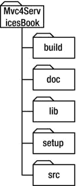

# 四、构建环境并创建源代码树

是时候开始在 Visual Studio 工作了！您已经在前三章学习了 REST 和 ASP.NET MVC 框架，并设计了您的任务管理服务及其底层的类和数据库表。更重要的是，您已经花了一些时间来建模想要为 RESTful 服务提供的资源类型和 URL。

在这一章中，你将有意识地、彻底地走完创建任务管理源代码树的过程。这将包括一个特定的文件夹结构(在 Windows 资源管理器中)和一个 Visual Studio 2012 解决方案及其项目。您还将使用 NuGet 配置一些外部库，并创建一些项目引用。您还将为您的数据模型类、服务资源类型、日志记录、数据库和一些框架级实用程序类编写一些初始代码。

正确设置源代码树很重要；或者，更确切地说，以允许将架构层和组件分离到离散的文件夹和项目中的方式。请将它视为构建您的“业务”功能的基础。如果做得好，添加任务管理服务操作并确保它们是完全可测试的将会很简单。如果做得不正确，您的服务代码将会过度耦合，不利于干净有效的单元测试。

当谈到在. NET 中安排代码时，肯定有不止一种方法(阅读:不止一种观点)。非常欢迎您只挑选我的方法的一部分，或者插入您自己的偏好。显然，你会把自己的想法带到桌面上，这将影响你如何看待你即将看到的方法。也就是说，您可能应该简单地跟随一段时间，抵制立即按自己的方式做的冲动，推迟一段时间再加入自己的意见——至少在您获得一个工作正常的 ASP.NET MVC 4 Web API REST 服务之前。此外，本书附带的源代码是基于本章和后续章节中的方法，因此如果您照原样阅读，会更容易理解。

说到源代码，可以随意从 Apress 或者从位于`https://github.com/jamiekurtz/Mvc4ServicesBook`的相应 GitHub 库下载。

让我们从一些基础知识开始，这些知识将有助于确保您的机器为您的代码做好准备。

机器配置

在本节中，您将了解构建任务管理服务的软件先决条件。这个列表实际上很短，所以不会花很长时间。通过使用不同的软件或版本，你也许可以让一切正常工作。这里列出的规范只是简单地记录了已经测试的内容(即，如果您打算使用本书附带的示例代码，那么支持哪些内容)。

Windows 7 SP1 64 位

这本书是关于 ASP.NET MVC 4 和 Web API 的。因此，您需要一个受 Visual Studio 2012 支持的 Windows 版本。这完全排除了 Windows XP。本书中的代码是在安装了 SP1 的 64 位 Windows 7 上编写的。我的建议是照着做。

对于您将要构建的网站，您将在开发过程中使用 IIS Express，它是随 Visual Studio 2012 一起安装的。不要担心需要使用 Windows 7 的专业版(支持运行 IIS)——当然，除非你更愿意使用 IIS 而不是 IIS Express。

SQL Server 2012

正如在第 3 章中所讨论的，您的任务管理服务将包括一个简单的 SQL Server 数据库。因此，您需要在本地计算机上安装某个版本的 SQL Server。我用 SQL Server 2012 开发者版写了这本书。

一般来说，我喜欢将 SQL Server 安装为默认实例(也就是说，我不使用命名实例)。要按原样运行代码，您也需要这样做。也就是说，如果您使用一个命名实例(例如，`SQLEXPRESS`)，您可以在尝试运行示例代码之前简单地更新连接字符串。

Visual Studio 2012

由于您使用的是 ASP.NET MVC 4 和 Web API，因此需要安装 2012 版的 Visual Studio。这段代码不能用于任何以前的版本。

就具体版本而言，我用终极版写了这本书及其代码。专业版和高级版也很好用。

使用 Visual Studio 非速成版的一个主要原因是 JetBrain 的 ReSharper 只在“完整”版上受支持。没有 ReSharper，我是不可能写代码的！对于这本书，我用的是 ReSharper 版本；我强烈建议你也这样做。

**RESHARPER**

ReSharper 是这样一种工具，一旦你使用了一段时间，你就不能再继续写作了。没有它的 NET 代码。说真的，我一次又一次地听到开发人员拒绝在没有重新打磨的情况下编码，甚至到了如果他们的雇主不付钱，他们会购买自己的个人拷贝的地步。就那么好！

所以如果你还没用过，我强烈建议你访问`www.jetbrains.com`看一看`—`并购买它。它将节省您大量的时间和精力，尤其是如果您根据当今关于依赖注入、单元测试、重构、变量命名等方面的最佳实践来编写代码。

NuGet 软件包管理器 2.1

您将使用 NuGet 来设置任务管理服务中使用的各种库。这个 Visual Studio 外接程序允许开发人员下载和添加第三方库的项目引用——每个项目引用在 NuGet 包管理器控制台(窗口)中都有一个命令。例如，假设您在选择了测试项目的情况下运行以下命令:

```cs
install-package nunit
```

这段代码下载了 NUnit 的最新版本，并将其添加到您的源代码树中，同时还从您的测试项目中引用了所有必需的 dll。

NuGet 还自动处理库依赖关系。例如，如果最新的 NUnit 包需要另一个库，那么它也会被下载和引用。

这本书——以及示例代码——利用了 NuGet 版中添加的一个新特性，该特性允许您为下载的包指定一个自定义文件夹位置。稍后您会看到，我喜欢将我的库放在保存解决方案的文件夹上面的一个`lib`文件夹中。但是，默认情况下，NuGet 将包放在与解决方案文件相同的文件夹中。

要确保您拥有 2.1 版(或更高版本)的 NuGet 包管理器，请使用 Visual Studio 中“工具”菜单下的“扩展和更新”选项。如果您从 Visual Studio 2012 的全新安装开始，您可能需要单击 NuGet 包管理器扩展上的 Update 按钮。当您单击扩展本身时，版本号将出现在右侧。

创建文件夹结构

创建源树的部分挑战是确保正确创建顶级文件夹结构。也就是说，您想要创建一组文件夹和路径，这些文件夹和路径允许轻松的分支和合并，将库从文档和其他类型的工件的源代码中分离出来，并且相对容易和快速地在命令行上键入。您还希望文件夹只是有意义的(即，对于任何必须查看您的代码的开发人员来说是直观的)。

虽然源代码文件夹结构没有真正的标准，但是您将在本节中创建的文件夹与您在当今许多开源项目中找到的文件夹相似。您将在这个项目中使用的结构实际上非常简单——您只是想要一个某种类型的根文件夹，下面有五个主文件夹:`build`、`doc`、`lib`、`setup`和`src`。[图 4-1](#Fig1) 显示了在一个名为`Mvc4ServicesBook` 的文件夹下会是什么样子。



[图 4-1](#_Fig1) 。源树文件夹结构

对分支和合并策略的彻底讨论超出了本书的范围；但是，我想指出的是，当使用 Subversion(或类似的)作为您的源代码控制库时，您会经常看到一个名为`trunk` 的顶级文件夹。这是因为 Subversion 中的分支是用文件夹实现的，所以您需要一个文件夹来表示源代码树的主要代码行。您还需要一个包含诸如`v1`、`v2`等文件夹的`branches`文件夹。

**GIT 和 SUBVERSION 分支**

Git 和 Subversion 处理分支的方式非常不同，这可能会影响您创建的文件夹结构。本书中的示例代码被签入 GitHub，所以它不遵循 Subversion 使用的约定(即，它不是以典型的`trunk`文件夹为根)。Git 采用不同的方法来管理分支。Git 不使用物理文件夹，而是直接在工具和元数据中构建分支。这意味着每个分支不会有一个单独的文件夹——所有分支的所有代码都在同一个工作文件夹中。Git 负责将分支内容交换到那个工作文件夹中。如果您将这个项目签入 Subversion 存储库，那么您可能会在您的源代码树的根目录下有一个名为`trunk`的文件夹。

刚才描述的每个文件夹中的内容应该是不言自明的。但是让我们不要怀疑；下表描述了每个文件夹的预期内容:

*   `build`:通常只包含一两个构建脚本，但有时也包含支持文件(例如，PowerShell 脚本、exe 和参数文件)。
*   `doc`:包含与代码库相关的文档；这可能包括开发人员文档、安装指南、提示、要求、图像和线框。
*   `lib`:包含此源代码树中应用使用的所有第三方库和包；如前所述，您将配置 NuGet 将下载的包放在这个文件夹中。
*   `setup`:包含用于部署应用的代码或脚本。这可能只是一个 PowerShell、MSBuild 或 NAnt 脚本；或者，它可能是 WiX 源代码或类似的东西。
*   `src`:你的源代码！您为应用编写的所有代码都放在这里。这个文件夹通常包含您的 Visual Studio 解决方案文件，所有项目文件夹都包含在这里。

即使你的任务管理服务相当简单，并且没有包含太多的应用代码，你也会发现你仍然有图 4-1 中描述的五个文件夹的内容。我想你会发现这种结构比把你所有的东西都堆在一个文件夹里(例如,`Mvc4ServicesBook`文件夹)更容易浏览树。

如果您已经完成了前一节的机器配置，那么继续按照图 4-1 中的路径创建文件夹结构，如下所示:

```cs
C:\MyProjects\MVC4ServicesBook\
```

现在，您应该拥有一台包含构建任务管理服务所需的所有软件的机器。您还应该准备好一个空的源代码树，以便创建一个空的 Visual Studio 2012 解决方案文件。

创建解决方案

现在，您已经准备好创建一个空白的 Visual Studio 解决方案文件，以后可以向其中添加项目。您首先创建一个空白解决方案，因为您希望解决方案文件存在于`src`文件夹中。不幸的是，Visual Studio 不允许您创建一个新的解决方案文件，除非创建一个同名的新文件夹——这有点麻烦！

若要将解决方案文件放在所需的位置，请在 Visual Studio 中按照下列步骤操作:

1.  通过从 File  New 菜单中选择 Project，在`src`文件夹中创建一个新的解决方案文件。
2.  在已安装的其他项目类型 Visual Studio 解决方案部分下，选择空白解决方案。
3.  对于本例，输入`MVC4ServicesBook`作为解决方案名称。
4.  对于位置，输入您之前创建的`src`文件夹的完整路径。
5.  单击确定。

这将在您的`src`文件夹中创建一个新文件夹和解决方案。现在要么关闭 Visual Studio，要么直接关闭解决方案。然后，使用 Windows 资源管理器，将新的解决方案文件从 Visual Studio 刚刚创建的文件夹中移到`src`文件夹中。最后，删除现在为空的文件夹。

此时，您应该在 Windows 资源管理器中看到类似[图 4-2](#Fig2) 的内容。


[图 4-2](#_Fig2) 。带有空白解决方案文件的文件夹

暂时不要重新打开解决方案文件；对于这个解决方案，您仍然需要对 NuGet 配置做一些小的调整。

nuget 配置文件

NuGet 包管理器是在 Visual Studio 2010 中作为. NET 的包管理系统引入的。它类似于许多 Linux 发行版中的高级包工具(APT)。该工具背后的基本思想是提供一种简单、可靠和一致的机制，用于从中央存储库中下载库及其依赖项，然后从 Visual Studio 项目中引用它们。您将使用它来安装任务管理服务所需的大多数外部库。

默认情况下，NuGet 将所有包下载到一个名为`packages`的文件夹中。该文件夹创建在解决方案文件所在的同一文件夹中。但是根据图 4-1 中[所示的文件夹结构，你希望你所有的外部库都存在于`lib`文件夹中。因此，您需要为 NuGet 提供一个对`packages`位置的覆盖。](#Fig1)

为此，直接在`src`文件夹中创建一个新的文本文件(使用记事本或命令行)，并将该文件命名为`nuget.config`。打开文件并输入以下 XML:

```cs
<settings>
    <repositoryPath>..\lib</repositoryPath>
</settings>
```

保存并关闭文件。现在，当您打开新的`MVC4ServicesBook`解决方案文件时，NuGet 将被配置为将所有下载的库放到您的`lib`文件夹中。

添加项目

在本节中，您将学习如何将所有项目添加到新的解决方案中，并配置它们的依赖项。在构建应用时，通常不会在第一步就添加所有的项目，因为这样做通常更容易。在这种情况下，您将看到我在构建基于 ASP.NET MVC 的服务应用时采用的或多或少的标准方法，给出了到目前为止已经讨论过的各种库。这种方法已经成为我的某种模板。如果您还没有这样一个基于 MVC 和 Web API 的服务模板，那么我建议您按原样使用本节中概述的结构，并在以后您感觉更舒服时对其进行调整。

让我们从双击新的解决方案文件(在上一节中创建)开始，在 Visual Studio 2012 中打开它。打开后，添加[表 4-1](#Tab1) 中列出的项目(作为指定的项目类型)。

[表 4-1](#_Tab1) 。解决方案项目

| 项目类型 | 项目名 |
| --- | --- |
| 类库 | `MVC4ServicesBook.Common` |
| 类库 | `MVC4ServicesBook.Data` |
| 类库 | `MVC4ServicesBook.Data.SqlServer` |
| 类库 | `MVC4ServicesBook.Web.Api.Models` |
| 类库 | `MVC4ServicesBook.Web.Common` |
| ASP.NET MVC 4 Web 应用使用 Web API 项目模板取消选中创建单元测试项目的选项(您将使用 NUnit 而不是 MSTest) | `MVC4ServicesBook.Web.Api` |
| SQL Server 数据库项目(这个可以在其他语言下找到 SQL Server。) | `MVC4ServicesDb` |

如果由于某种原因，您没有看到 SQL Server 数据库项目的选项，您可能需要安装 SQL Server 数据工具。你可以在`http://msdn.microsoft.com/en-us/data/hh297027`免费下载这些。

您还想向解决方案中添加几个测试项目。首先创建一个名为`Tests` 的新解决方案文件夹，然后将[表 4-2](#Tab2) 中列出的项目添加到该文件夹中。

[表 4-2](#_Tab2) 。解决方案测试项目

| 项目类型 | 项目名 |
| --- | --- |
| 类库 | `MVC4ServicesBook.Common.Tests` |
| 类库 | `MVC4ServicesBook.Web.Api.Tests` |

注意，您没有为所有的其他项目添加测试项目。这是因为并非所有项目都有需要进行单元测试的类。例如，`MVC4ServicesBook.Data`项目将只包含您的域模型类和一些数据访问接口，它们都不适合任何类型的单元测试。你也没有为你的`MVC4ServicesBook.Data.SqlServer`项目进行单元测试。它本质上包含了数据访问接口的实现，这些接口只是 SQL Server 数据库调用的包装器。我一般不花时间(或者钱！)来单元测试数据库调用。

如前所述，我强烈推荐在. NET 中开发时使用 JetBrains 的 ReSharper。运行单元测试是这个工具的好处之一。它在 IDE 中做得很好，允许您运行单个测试或一个类、类别、项目或其他任何项目中的所有测试。它还完全抽象了底层测试框架，因此无论您使用 NUnit 还是 MSTest，体验都是一样的。

此时，您可能想知道为什么这么简单的应用会有这么多项目。这种分离之所以有效，有很多原因，其中一些超出了本书的范围。这里的主要目标是分离您的依赖项——不要求您的`Common`项目依赖于 NHibernate ,也不要求您向除了`Data.SqlServer`项目之外的任何项目添加 SQL Server 特定的代码。当然，这种方法在开发过程中会对您有所帮助，但它也能帮助您保持部署和更新/补丁更加整洁。[表 4-3](#Tab3) 说明了每个项目的用途以及将包含的内容。

[表 4-3](#_Tab3) 。项目使用情况

| 项目名 | 目的和内容 |
| --- | --- |
| `MVC4ServicesBook.Common` | 包含不特定于您的 API 甚至不特定于 web 服务的功能(例如，`DateTimeAdapter`)。 |
| `MVC4ServicesBook.Data` | 包含您的域模型普通旧 CLR 对象(POCOsNHibernate 使用它们从数据库中提取/推送数据。还包含您的数据访问接口，但没有实现。请注意，此项目中没有特定于 SQL Server 的内容。 |
| `MVC4ServicesBook.Data.SqlServer` | 包含数据访问实现，以及您的 NHibernate 映射。这个项目使得数据项目在运行时特定于 SQL Server。当您构建您的服务应用时，您应该注意到没有代码引用这个项目中的任何类型(也就是说，代码只引用数据项目)。 |
| `MVC4ServicesBook.Web.Api.Models` | 包含服务的 REST 资源类型(或模型)。我将它们分离到各自的类库中，只是为了让单元测试更容易一些。但是请记住，客户端/调用者永远不会得到这个 DLL(也就是说，您不会在 REST 服务中共享资源类型定义)。 |
| `MVC4ServicesBook.Web.Common` | 包含 web 和服务应用通用的功能。 |
| `MVC4ServicesBook.Web.Api` | 这是 REST 服务应用本身；它在运行时由 IIS 托管。这个项目包含所有的 Web API 控制器、MVC 路由、连接字符串等等。 |
| `MVC4ServicesDb` | 包含 SQL Server 数据库的所有架构、代码和数据。一旦编译了这个项目，您就可以使用输出将数据库部署到您的首选目标。无论您想要创建一个新的数据库还是升级一个现有的数据库，这都是可行的。 |
| `MVC4ServicesBook.Common.Tests` | 对您的`Common`项目中的类进行单元测试。 |
| `MVC4ServicesBook.Web.Api.Tests` | 对您的`Api`宿主项目中的控制器和其他类进行单元测试。 |

现在您已经有了所有的 Visual Studio 项目，您需要使用 NuGet 包管理器控制台添加它们各自的外部库和引用。这些命令将下载最新版本的库(如果需要)，然后将适当的引用添加到给定的项目中。因为在上一节中您配置了 NuGet 将包下载到您的`lib`文件夹，所以您可以在运行这些命令后查看下载了什么。

在 Visual Studio 2012 IDE 中，打开包管理器控制台窗口，运行[表 4-4](#Tab4) 中列出的命令。您可以在 NuGet 网站上的`www.nuget.org`找到这些包的名称及其相应的安装命令。每个命令都指示要安装哪个包以及在哪个项目中添加包引用。

[表 4-4](#_Tab4) 。NuGet 命令列表

| NuGet 命令 |
| --- |
| `install-package nunit MVC4ServicesBook.Common.Tests` |
| `install-package nunit MVC4ServicesBook.Web.Api.Tests` |
| `install-package moq MVC4ServicesBook.Web.Api.Tests` |
| `install-package nhibernate MVC4ServicesBook.Data.SqlServer` |
| `install-package fluentnhibernate MVC4ServicesBook.Data.SqlServer` |
| `install-package log4net` `MVC4ServicesBook.Web.Api` |
| `install-package nhibernate MVC4ServicesBook.Web.Api` |
| `install-package fluentnhibernate MVC4ServicesBook.Web.Api` |
| `install-package ninject MVC4ServicesBook.Web.Api` |
| `install-package ninject.web.common MVC4ServicesBook.Web.Api` |
| `install-package Microsoft.AspNet.WebApi.OData -Pre MVC4ServicesBook.Web.Api` |
| `install-package log4net MVC4ServicesBook.Web.Common` |
| `install-package nhibernate MVC4ServicesBook.Web.Common` |
| `install-package ninject MVC4ServicesBook.Web.Common` |

以后您可能需要添加更多的库，但这是一个好的开始，您可以在几乎任何 MVC 4 Web API 应用上安全地做这件事。

注意引用`Microsoft.AspNet.WebApi.OData`包的命令是由`-pre`开关指定的。在撰写本文时，该包仍在开发中。因此，您需要包含此开关，否则将会出现错误。检查 NuGet 网站的 OData 页面，看看当您自己运行这些命令时是否还需要这个开关。

如果您正在从事 ASP.NET MVC 3 项目，您也可以使用 NuGet 来下载和配置由`ninject.mvc3`标识的 Ninject 扩展。在安装时，这个扩展将 Ninject 配置为 MVC 项目的控制器工厂和依赖解析器。不幸的是，在撰写本文时，该扩展还不兼容 ASP.NET MVC 4 和 Web API。这意味着您将不得不依赖于`Ninject.Web.Common`扩展，它本质上将一个 Ninject 容器链接到`HttpContext`或`OperationContext`，使得对象生命周期的范围限定为一个 web 请求。但是如果没有到 MVC 控制器工厂的自动链接，您将需要手动连接一个基于 Ninject 的依赖解析器。你将在下一章看到这是如何工作的。

最后，我们来补充一些你已经知道的项目参考。以后可能需要更多，但是在[表 4-5](#Tab5) 中列出的那些是一个好的开始。(我已经省略了项目名称的第一部分——`MVC4ServicesBook`——以便它们的名称适合表格)。

[表 4-5](#_Tab5) 。项目参考

| 项目 | 参考 |
| --- | --- |
| `Common.Tests` | `Common` |
| `Web.Api.Tests` | `Common Data Web.Api Web.Api.Models Web.Common` |
| `Data.SqlServer` | `Common Data` |
| `Web.Api` | `Common Data Web.Api Web.Api.Models Web.Common` |

如果你已经遵循了到目前为止概述的步骤，你应该在`MVC4ServicesBook`解决方案的浏览器中看到类似于[图 4-3](#Fig3) 的东西。


[图 4-3](#_Fig3) 。Visual Studio 2012 中的解决方案

基本组件

此时，您的解决方案应该可以成功构建，即使您还没有添加任何真正的代码。但是随着所有项目的添加以及它们的库的安装和引用，您已经准备好开始构建一些稍后需要的更简单的组件了:

*   `DateTimeAdapter`
*   领域模型
*   服务资源类型(服务模型)
*   记录
*   数据库ˌ资料库

让我们从一个简单的适配器开始。NET `DateTime`类。

date time adapter〔t0〕

我坚信要不惜一切代价避免静态调用——这包括针对。NET 框架类。应该进行静态调用的唯一地方是在适配器或工厂类中。中的`DateTime.Now`属性。NET 是一个很好的例子，它看起来很容易使用，但是如果你不小心的话，它会让你陷入困境很多次；在编写单元测试时尤其如此。

相反，您需要使用适配器模式，将`DateTime`类包装在适当的可注入接口中，并创建相应的适配器实现。然后，每当一个类需要获得当前系统时间时，它将使用依赖注入来获得您的`IDateTime`接口的实现，并在其上调用`Now`(或者，`UtcNow`)。这样，单元测试代码可以强制“当前时间”,而不必在测试执行期间设置 Windows 系统时钟。

在`MVC4ServicesBook.Common`项目中，添加以下接口和相应的实现:

```cs
public interface IDateTime
{
    DateTime UtcNow { get; }
}

public class DateTimeAdapter : IDateTime
{
    public DateTime UtcNow
    {
        get { return DateTime.UtcNow; }
    }
}
```

对于任务管理服务，您将使用 UTC 时间。但是，您也可以自由添加其他经过调整的属性。即便如此，这个适配器是整个代码库中唯一可以看到对`DateTime.Now`(或`DateTime.UtcNow`)调用的地方。

领域模型

在这一节中，您将添加构成应用域模型的 POCO 类。这些将主要用于查询和更新数据库(例如，获取用户或类别列表并添加任务)。

由于 NHibernate 将使用这些类，并且您希望支持延迟加载，因此您需要将每个属性都设为虚拟的。

 **注意**延迟加载告诉 NHibernate 只在需要的时候获取相关数据——而不是预先获取所有数据。例如，当从数据库中获取一个`Task`对象时，延迟加载意味着在执行需要这些值的代码之前，不会获取`Task`对象的赋值和类别。

除此之外，他们真的是 POCOs。换句话说，它们不从某个特殊的基类派生，也不为它们的属性返回任何特殊类型。它们实际上根本没有绑定到 NHibernate，如果你想允许延迟加载，除了虚拟修饰符。

接下来，您将查看所有的类定义。您可以将它们直接添加到名为`Model`的文件夹中的`MVC4ServicesBook.Data`项目中。后面所有类的名称空间都是`MVC4ServicesBook.Data.Model`。显然，您可以随意下载代码，而不是手动输入所有代码:

```cs
public class Category
{
    public virtual long CategoryId { get; set; }
    public virtual string Name { get; set; }
    public virtual string Description { get; set; }
    public virtual byte[] Version { get; set; }
}

public class Priority
{
    public virtual long PriorityId { get; set; }
    public virtual string Name { get; set; }
    public virtual int Ordinal { get; set; }
    public virtual byte[] Version { get; set; }
}

public class Status
{
    public virtual long StatusId { get; set; }
    public virtual string Name { get; set; }
    public virtual int Ordinal { get; set; }
    public virtual byte[] Version { get; set; }
}

public class Task
{
    public virtual long TaskId { get; set; }
    public virtual string Subject { get; set; }
    public virtual DateTime? StartDate { get; set; }
    public virtual DateTime? DueDate { get; set; }
    public virtual DateTime? DateCompleted
{ get; set; }
    public virtual Priority Priority { get; set; }
    public virtual Status Status { get; set; }
    public virtual byte[] Timestamp { get; set; }
    public virtual DateTime CreatedDate
            { get; set; }

    private readonly IList<User> _users =
            new List<User>();
    public virtual IList<User> Users
    {
       get { return _users; }
    }

    private readonly IList<Category> _categories =
            new List<Category>();
    public virtual IList<Category> Categories
    {
       get { return _categories; }
    }
}

public class User
{
    public virtual Guid UserId { get; set; }
    public virtual string Firstname { get; set; }
    public virtual string Lastname { get; set; }
    public virtual string Username { get; set; }
    public virtual string Email { get; set; }
    public virtual byte[] Version { get; set; }
}
```

NHibernate 将使用所有域模型类上的`Version`字节数组属性来检测脏数据。稍后您将会看到，`Version`属性映射到的 SQL Server 中的列将是`rowversion`类型。每当在数据库中添加或更新新行时，SQL Server 都会自动增加该值。通过这种方式，您可以跟踪和检测对行的更新何时会覆盖以前的更新。

服务模型类型

现在让我们添加将组成您的服务模型的类。这些类中的大部分与您刚刚编写的域模型类非常相似，但是您需要记住，您的域模型类只在内部使用；也就是说，它们永远不会发送给客户端。这就是您的服务模型类型的用途——它们表示将在客户端和您的服务之间来回传递的数据。

所有这些类定义都在`MVC4ServicesBook.Web.Api.Models`项目中(它们也使用这个名称作为它们的名称空间):

```cs
public class Link
{
    public string Rel { get; set; }
    public string Href { get; set; }
    public string Title { get; set; }
    public string Type { get; set; }
}

public class Category
{
    public long CategoryId { get; set; }
    public string Name { get; set; }
    public string Description { get; set; }
    public List<Link> Links { get; set; }
}

public class Priority
{
    public long PriorityId { get; set; }
    public string Name { get; set; }
    public int Ordinal { get; set; }
    public List<Link> Links { get; set; }
}

public class Status
{
    public long StatusId { get; set; }
    public string Name { get; set; }
    public int Ordinal { get; set; }
    public List<Link> Links { get; set; }
}

public class Task
{
    public long TaskId { get; set; }
    public string Subject { get; set; }
    public DateTime? StartDate { get; set; }
    public DateTime? DueDate { get; set; }
    public DateTime? DateCompleted { get; set; }
    public List<Category> Categories { get; set; }
    public Priority Priority { get; set; }
    public Status Status { get; set; }
    public List<Link> Links { get; set; }
    public List<User> Assignees { get; set; }
}

public class User
{
    public Guid UserId { get; set; }
    public string Username { get; set; }
    public string Firstname { get; set; }
    public string Lastname { get; set; }
    public string Email { get; set; }
    public string Password { get; set; }
    public List<Link> Links { get; set; }
}
```

回想一下，REST 的原则之一是避免将客户机耦合到服务器。这意味着您不应该向 API 的调用者提供包含这些资源类型的 DLL。这些类型只是为了让您的控制器代码更容易接收和响应这些数据。

记录

在本节中，您将配置您的`web.config`文件。稍后，在处理 Ninject 容器配置时，您将处理 log4net logger 本身的初始化。现在，首先将下面的代码添加到`Web.Api`项目的`web.config`文件中，靠近顶部(并且直接在开始`<configuration>`标签下)。如果`<configSections>`部分已经存在，只需添加`log4net`元素:

```cs
<configSections>
  <section name="log4net" type="log4net.Config.
Log4NetConfigurationSectionHandler, log4net" />
</configSections>
```

接下来，直接在结束的`</appSettings>`标签下，添加下面的`log4net`配置部分:

```cs
<log4net
xsi:noNamespaceSchemaLocation="http://csharptest.net/downloads/schema/log4net.xsd"
    xmlns:xsi="http://www.w3.org/2001/XMLSchema-instance">
    <appender name="RollingLogFileAppender"
type="log4net.Appender.RollingFileAppender">
      <file value="MVC4ServicesBook.Web.Api.log" />
      <appendToFile value="true" />
      <rollingStyle value="Date" />
      <datePattern value=".yyyyMMdd.lo\g" />
      <maximumFileSize value="5MB" />
      <maxSizeRollBackups value="-1" />
      <countDirection value="1" />
      <layout type="log4net.Layout.PatternLayout">
        <conversionPattern value="%date %-5level
[%thread] %logger - %message%newline%exception" />
      </layout>
    </appender>
    <logger name="NHibernate">
      <level value="ERROR" />
    </logger>
    <logger name="NHibernate.SQL">
      <level value="ERROR" />
    </logger>
    <logger name="Mvc4ServicesBookWebsite">
      <level value="DEBUG" />
    </logger>
    <root>
      <level value="DEBUG" />
      <appender-ref ref="RollingLogFileAppender" />
    </root>
  </log4net>
```

用 log4net 配置日志大约有 101 种方法。如果您想记录一个目标而不是滚动日志文件，或者如果您对修改刚刚介绍的行为感兴趣，您应该阅读 log4net 配置文档以了解更多信息。以下是一些有用的链接:

*   `http://logging.apache.org/log4net/release/manual/configuration.html`
*   `http://logging.apache.org/log4net/release/sdk/log4net.Layout.PatternLayout.html`

照现在的样子，前面的配置记录到网站根目录下一个名为`MVC4ServicesBook.Web.Api.log`的文件中；每一天都将创建一个新的日志文件，如果当前文件的大小达到 5MB，它将滚动到一个新文件。这个配置还只记录来自 NHibernate 的错误(它的阈值被设置为记录来自您自己的代码的`DEBUG`级别或更高级别的任何内容)。通常，在部署到生产环境的过程中，您会将该设置更新为`WARN`或`ERROR`。

数据库

当你设计你的服务 API 时，你在[第三章](3.html)中探索了数据库中包含的表。在本节中，您将了解 Visual Studio 2012 中的 SQL Server 数据库项目。然而，为本书中使用的所有存储过程、表和视图添加脚本需要太多的空间。因此，要获得真正的数据库内容，请从 Apress 或相应的 GitHub 库`https://github.com/jamiekurtz/Mvc4ServicesBook`下载源代码。

首先，项目中有四个文件夹——都是在 Visual Studio 中手动创建的(参见[图 4-4](#Fig4) )。


[图 4-4](#_Fig4) 。数据库项目

scripts 文件夹将包含用于添加查找数据、权限和可选测试数据的部署脚本。例如，您需要用`INSERT`语句来填充您的`Priority`和`Status`值。

`Tables`、`Stored Procedures`和`Views`文件夹应该是不言自明的。但是，在下载代码时，您会看到该项目包含支持 ASP.NET 成员资格提供程序的数据库对象。与往常一样，在实现身份验证和授权时有一些选项可用。本书中使用的这种方法用定制表扩充了成员资格提供者表——正如你在第 3 章中简要看到的。此外，提供者需要一些视图和存储过程，所以您也会在混合中看到它们。

关于查找数据，我想指出一点:项目中的脚本将在每次应用到目标数据库时运行。换句话说，您需要非常清楚现有的数据——并避免会导致主键冲突的`INSERT`语句。因此，每当您添加或更新查找数据时，SQL 语句需要首先检查数据是否已经存在，如下面的代码片段所示:

```cs
if not exists(select 1 from dbo.Priority where Name = 'Low')
    insert into dbo.Priority(Name, Ordinal) values('Low', 0);

if not exists(select 1 from dbo.Priority where Name = 'Medium')
    insert into dbo.Priority(Name, Ordinal) values('Medium', 1);

if not exists(select 1 from dbo.Priority where Name = 'High')
    insert into dbo.Priority(Name, Ordinal) values('High', 2);
```

摘要

在本章中，您学习了如何使用构建任务管理 REST 服务所需的软件来配置一台干净的 Windows 7 机器。您还创建了开始向源代码树添加代码、库和文档所需的文件夹结构。接下来，您创建了一个空解决方案，并向其中添加了您计划使用的所有项目，包括各种库和项目引用。最后，您创建了一些基本类和支持服务所需的各种应用配置设置。

您还添加了所有的解决方案项目，安装并引用了它们的库，并添加了您的基线类。此时，您的解决方案应该能够成功构建。现在，您已经准备好开始创建一些管理控制器和数据库会话生存期、安全性以及您的 Ninject 依赖注入容器所需的框架级组件。