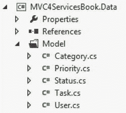
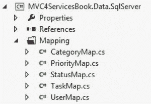

# 五、控制器、依赖项和管理数据库工作单元

现在是时候开始处理任务管理服务中一些更复杂的问题了。在前一章中，您从一个空文件夹开始，创建了一个基本的源代码树结构，添加了一个新的 Visual Studio 2012 解决方案，并添加了您知道这个小 REST 服务需要的项目。您还添加了一些更基本的代码组件，并设置了您预期需要的项目和库引用。虽然这些事情中的每一件对于服务的整体设计都是非常重要和关键的，但是您还必须解决以下任何一个问题:

*   控制器激活
*   属国
*   NHibernate 配置和映射
*   数据库工作管理单元
*   数据库事务控制
*   安全
*   记录服务呼叫和异常

您将在后面的章节中了解安全性和日志记录。现在，您希望关注控制器及其依赖项，以及使用 NHibernate `ISession`对象及其生存期。

控制器激活

正如你将在本章看到的，ASP.NET MVC 框架中的服务(包括 Web API)以控制器为中心。您没有真正的视图，模型只是用来在应用中保存和移动数据。然而，框架使用控制器来响应请求；它运行服务所需的所有逻辑。换句话说，当 web 请求通过网络进入 IIS(或 IIS Express 或自承载应用)时，它使用在应用中配置的路由来确定哪个控制器应该响应请求。当找到合适的控制器类时，MVC 框架创建该类的一个实例，并将 web 请求转发给合适的控制器方法。

让我们看一个来自任务管理服务的例子。假设您在`WebApiConfig.cs`文件中配置了以下路由(这实际上是 Visual Studio 在您创建新的 Web API 项目时设置的默认路由):

```cs
config.Routes.MapHttpRoute(
    name: "DefaultApi",
    routeTemplate: "api/{controller}/{id}",
defaults: new {id = RouteParameter.Optional});
```

使用 URL 路由的能力，MVC 引擎将尝试将请求的 URL 与这个和其他路由进行匹配。在这个特定的路径中，MVC 将使用在`api/`之后指定的 URL 部分来确定要激活的适当控制器。假设您要对服务进行以下任一调用:

```cs
/api/tasks
/api/tasks/123
```

无论哪种情况，MVC 都会激活名为`TasksController` 的控制器类。注意，即使 URL 只指定了`tasks`，要激活的类名也将是`TasksController`。按照惯例，MVC 会自动将单词`Controller`附加到取自 URL 的名称上。

此时，您可能会问这样一个问题，“将调用哪个控制器方法？”答案取决于你是否在使用 Web API。如果没有，方法必须在 URL 本身中指定—也称为*动作*。在这种情况下，当不使用 Web API 时，路线看起来会不同——因为除了`{controller}`段之外，它们还需要有一个`{action}`段。但是因为这是一本关于 Web API 的书，所以您将坚持使用 Web API 用于方法调用的方法。

您使用的是 Web API，所以刚才显示的 URL 路由不包括`{action}`段。这是因为 Web API 根据调用者使用的 HTTP 动词自动调用控制器方法。例如，如果调用者在 URL `/api/tasks`上执行 GET，MVC(通过 Web API)将调用`TasksController`控制器类上的`Get()`方法。如果调用者改为执行 POST，那么 MVC 将调用控制器上的`Post()`方法。

正如您在前面的路由配置中看到的，在 URL 映射中有一个可选的`{id}`段。如果调用者在 URL 的末尾包含某种标识符，那么 MVC 将调用相应的方法来匹配包含单个参数的签名。[表 5-1](#Tab1) 显示了一些基于任务管理服务`TasksController`的例子。

[表 5-1。](#_Tab1)URL 和控制器方法的示例

| 统一资源定位器 | 动词 | 控制器方法 |
| --- | --- | --- |
| `/api/tasks` | 得到 | `Get()` |
| `/api/tasks/123` | 得到 | `Get(long id)` |
| `/api/tasks/123` | 删除 | `Delete(long id)` |
| `/api/tasks` | 邮政 | `Post()` |
| `/api/tasks/123` | 放 | `Put(long id)` |

默认情况下，Web API 的 RESTful 特性有助于确保你编写的是第二章和第三章中讨论的 HTTP 动词。这比在没有 Web API 的情况下使用 ASP.NET MVC 要干净和真实得多。稍后，您将看到使用 Web API 的其他一些好处。

除了使用来自 URL 的参数，您还可以为代表您的模型对象的数据添加额外的参数，以及一个名为`HttpRequestMessage`的. NET 类型。

下面是将存在于`CategoriesController`上的`Post()`方法的签名:

```cs
Post(HttpRequestMessage request, Category category)
```

让我们来研究一下这些论点。

添加 HttpRequestMessage 参数

`HttpRequestMessage`是一个对象，可以用来检查传入请求的各种属性。您可以访问请求头、请求体、用于调用的 URL、客户端证书和许多其他有价值的属性。您还可以使用`HttpRequestMessage`对象来创建一个响应，该响应预先连接到给定的请求对象。在这个`Post()`方法中，您将使用它返回一个包含 201 HTTP 响应代码的响应，这样您就可以给调用者新创建的类别的位置(即地址)。

注意，您可以使用`ApiController`的`Request`属性来访问同一个对象。因为 Web API 控制器都继承自`ApiController`基类，所以您可以在控制器代码中任何需要的地方使用这个属性。但是，您应该小心不要将您的代码与基类中发生的任何事情耦合在一起。这样做通常会使测试更加困难，并且会增加代码的脆弱性。这就是为什么我喜欢在需要时将请求对象传递给我。这使得在测试中进行模拟变得更加容易；这也意味着您没有耦合到`ApiController`基类(至少没有那么多)。

`COMPOSITION OVER INHERITANCE`

在过去的 10 年或 15 年中，有许多书籍讨论了面向对象编程实践中的各种发展。过去 15 年中的一个重大转变可以用一句经常被引用的话来概括，“组合胜过继承”简而言之，如果一个应用利用许多更小的类的组合而不是依赖一个基类来实现期望的行为，那么它的代码将更少耦合`—`并且更易测试和维护`—`。当一个基类包含了各种各样的功能时，你的类——即使它很小——隐含地占据了基类的整个表面。对基类的更改需要对从它继承的所有类进行全面的测试回归——即使那些类没有使用被修改的基本功能。

此外，依赖基类的行为迫使基类承担不止一个责任`—`,这与单一责任原则直接冲突。你看，如果你把一个基类的责任(也就是它的功能)限制在一件事上，但是子类需要使用不止一个行为，那么你就被迫使用组合来提供这些行为。在这种情况下，使用基类就失去了大部分的吸引力。

如果“组合优于继承”的概念对你来说是新的，我鼓励你阅读 Eric Freeman 等人的 *Head First 设计模式*(O ' Reilly，2004)。我想你会发现它的原则和表达相当自由，特别是如果你来自一个强烈的 90 年代风格的 OO 背景。

添加模型对象参数

第二个参数,`Category`对象也是由 MVC 自动插入的。当调用者将特定模型对象的 JSON 或 XML 表示放入 HTTP 请求体时，MVC 将把文本数据转换成该模型类型的实例。

例如，如果调用者在 POST 请求的主体中向`/api/categories`提交以下 JSON，MVC 将把文本转换成一个`Category`对象，作为`Post()`方法中的第二个参数:

```cs
{"Name":"Blue","Description":"Deferred"}
```

这同样适用于 URL 也包含标识符的 PUT 请求。假设你有下面的`CategoriesController`方法:

```cs
Put(HttpRequestMessage request, long id, Category category)
```

现在假设调用者向以下 URL 提交一个 PUT 请求:

```cs
/api/categories/123
```

`id`参数将包含`123`，以及来自请求主体的`category`对象，还有`request`对象本身。这非常令人惊讶，因为您不需要对 JSON 或 XML 内容进行任何特殊的解析。您也不需要像在基于 WCF 的服务中那样定义任何数据契约。与最近的“约定胜于配置”的趋势一致，它就是有效的！

属国

如果你的控制器要做任何有用的事情，它们将需要使用从其他类带来的功能。一个显而易见的例子是数据库存储库，也就是说，一个可以查询数据库并将更改保存回数据库的对象。另一个例子可能是表示当前用户上下文的对象，从中可以获取用户的姓名、电子邮件地址等等。这些被认为是控制器类的依赖项。也就是说，您的控制器依赖它们来实现控制器本身没有实现的功能和行为。如果你遵循单一责任原则，你的控制器类不会做很多事情，这意味着它至少需要一些外部依赖。简而言之，如果您的控制器需要做任何事情，而不是简单地响应 web 请求，那么该行为应该被推到一个单独的类中，由控制器使用(通过组合—而不是继承！).下面的列表说明了控制器将使用的一些行为类型(在一般意义上，不一定在任务管理服务 )中:

*   数据库储存库
*   金融计算器
*   交易过账
*   `DateTime`适配器
*   文件适配器
*   环境适配器
*   用户管理类
*   验证类
*   记录器
*   缓存管理
*   异常包装

同样，主要思想是控制器中的方法不应该做得比简单地使用各种依赖项提供的功能更多。这就引出了本节的重点:管理应用中的依赖关系。一旦您采用了将依赖项用于大多数/所有功能的方法，您就需要一种模式和工具来配置和获取那些依赖项。记住整体模式最简单的方法是通过这两个独立的步骤:

1.  将所有依赖项推送到构造函数。
2.  配置应用使用依赖注入。

依赖项的构造函数注入

将所有依赖项推送到构造函数的概念非常简单，但是对于依赖项注入新手来说，很难掌握并付诸实践。可以这样想:*一个类不应该使用*任何不通过构造函数的*行为。没有。零。拉链。这甚至包括看似无害的类，如`System.DateTime`、`System.IO.File`、`System.Environment`以及。NET 框架。它还包括上一节中列出的行为类型。如果你的类使用了该类中没有实现的任何东西，就需要通过构造函数注入。句号。您甚至希望避免使用静态属性和方法。例如，如果您的代码需要使用静态的`DateTime.Now`属性，您应该将它包装在一个可注入的适配器类中。你可以在本书的示例代码中找到这样的例子(在本章稍后的`DateTimeAdapter`类中也有)。*

**关于依赖注入的简短说明**

依赖注入(DI) 的主题比空间允许的要大得多。有许多工具可以跨许多技术、许多方法和技术来促进 DI。例如，您可以使用属性或方法注入，而不是使用构造函数注入。要很好地了解 DI，请查阅 Martin Fowler 几年前的文章:

`http://martinfowler.com/articles/injection.html`

这本书简单地展示了 DI 的快乐之路，这足以用 MVC 4 构建任何 RESTful 服务。然而，这本书假设你可以查找其他资源来获得关于这个主题的更深入的教育。

假设在`TasksController`的`Post()`方法中，您想知道当前的日期和时间，这样您就可以在新创建的任务上设置`CreatedDate`属性。而不是把自己和。NET `DateTime`类，您将使用 DI 来注入一个`DateTime`适配器。构造函数代码(和相应的私有字段)可能是这样的:

```cs
private readonly IDateTime _dateTime;

public TasksController(IDateTime dateTime)
{
    _dateTime = dateTime;
}
```

`IDateTime`接口，以及注入到构造函数中的相应默认实现(您将很快看到 DI 配置)，如下所示:

```cs
public interface IDateTime
{
    DateTime UtcNow { get; }
}

public class DateTimeAdapter : IDateTime
{
    public DateTime UtcNow
    {
        get { return DateTime.UtcNow; }
    }
}
```

在控制器代码的某个地方，您可以使用私有的`_dateTime`字段来获取系统的当前日期和时间:

```cs
var task = new Task
               {
                   // ...
                   CreatedDate = _dateTime.UtcNow
               };
```

对于所有其他依赖项，您只需遵循相同的模式，甚至对于其他。NET 框架类。另一个经典的例子是`Environment.MachineName`的使用。这也应该包装在适配器中，并通过构造函数注入。您不仅将代码从应用之外的东西(在本例中，是您所在的机器的名称)中分离出来，而且还提供了更好的可测试性。这是因为您现在可以在单元测试执行期间使用 Mock，并显式地设置 machine name 属性，而不是依赖于测试运行的机器的名称。

总结这一节，记住一个类使用的所有功能都必须作为一个依赖项推送到构造函数中。此外，这些依赖关系应该以接口的形式出现，不管是您自己编写的(例如，适配器)还是已经有一个可供您使用的(例如，log4net `ILog`接口)。

既然你已经确定了这个非常重要的模式的需求和基本用法，让我们看看你如何配置阿迪工具来满足你在运行时的需求。

配置 n 注入依赖注入

对于任务管理服务，我选择使用开源的 Ninject 依赖注入工具。Ninject 易于使用，似乎是目前最流行的方法(在。网社区)。然而，同样的原则适用于所有的 DI 工具——您只需要考虑语法上的差异。

关于服务中的 Ninject，您需要注意三件事情。前两个需要在任何类型的应用中完成，而第三个是 MVC 4 Web API 服务所特有的。表 5-2 简要描述了这三项活动。

[表 5-2。](#_Tab2)三项与项目相关的活动

| 活动 | 描述 |
| --- | --- |
| 容器配置 | 确保阿迪容器是在应用启动时创建的，并且一直保留在内存中，直到应用关闭。 |
| 容器绑定 | 这是你将接口链接到具体实现的地方，比如`IDateTime`  `DateTimeAdapter`。 |
| `IDependencyResolver` 为 Ninject | 这告诉 MVC 4 / Web API 询问所有的依赖关系。这是允许您将依赖关系推送到控制器上的构造函数的关键。 |

容器配置

为了使 DI 容器有助于创建对象并将它们注入构造函数(以及控制这些对象的生命周期)，该容器必须在应用运行的整个过程中可用。换句话说，单个容器实例必须满足三个标准:

*   作为应用启动时首先发生的事情之一来创建
*   在应用运行时始终可用
*   作为应用在关闭期间采取的最后步骤之一被销毁

虽然手动连接 Ninject 当然是可能的，但是确保容器始终可用的最简单和最可靠的选择是简单地安装`Ninject.Web.Common` NuGet 包。如果你按照[第 4 章](4.html)中的步骤，那么你已经做到了。它在启动和关闭方法中处理容器实例的创建和销毁。所有这些都发生在一个类中，这个类被添加到 MVC 项目中的`app_start`文件夹中。

底线:安装`Ninject.Web.Common` NuGet 包是正确配置 Ninject 在 MVC 4 和 Web API 项目中工作所需要做的全部工作。相当简单！

容器绑定

一旦容器本身被配置为在应用运行时存在，您需要给它类型映射。这本质上只是将接口类型映射到实现类型——在某些情况下，映射到实现方法。在前面的例子中，您看到了如何将`IDateTime`接口 注入到`TasksController`中，实现将是`DateTimeAdapter`类。这个特殊的地图图钉会显示如下:

```cs
container.Bind<IDateTime>().To<DateTimeAdapter>();
```

注意，您实际上并没有创建一个`DateTimeAdapter`的实例——您将让 Ninject 为您做这件事，因为这样的实例是必需的。

您还需要将 log4net 接口`ILog`映射到特定的日志记录器。在这种情况下，您将创建记录器的一个实例，并告诉 Ninject 只使用它——而不创建自己的实例。这是因为 log4net logger 必须使用 log4net `LogManager`类以某种方式创建。然而，注册实例类似于注册类型映射，如下所示:

```cs
log4net.Config.XmlConfigurator.Configure();
var loggerForWebSite = LogManager.GetLogger("Mvc4ServicesBookWebsite");
container.Bind<ILog>().ToConstant(loggerForWebSite);
```

假设您使用了在[第 4 章](4.html)中指定的 log4net `web.config` 部分，第一行(您调用 log4net `Configuration`对象的`Configure()`方法的地方)将读取配置信息并使用它来连接记录器及其属性。接下来，您可以使用`LogManager`来获取一个记录器的实例——您可以立即将它放入 Ninject 容器中。因此，所有对`container.Get<ILog>()`的后续调用——或者说，所有构造函数注入的`ILog`参数——都将使用`loggerForWebSite`实例。主要的区别是您将`ILog`接口映射到您创建的 logger 对象。您可以在 Ninject 容器上使用`ToConstant()`方法 来实现这一点。

您可以在`Ninject.Web.Common`包添加到`app_start`文件夹的`NinjectWebCommon`类中进行所有这些映射。包安装程序创建一个名为`RegisterServices()`的静态方法，该方法接受当前容器(在 Ninject 中称为`IKernel`)。您可以使用这个方法进行类似于刚才所示的类型映射。本书附带的任务管理服务的代码包括一个单独的类来处理所有的类型映射。这段代码只是从存根`RegisterServices()`方法中调用那个类。这个类叫做`NinjectConfigurator`，它显示在下一个代码片段中，大部分映射已经存在。查看代码，看看`Configure()`方法如何获取一个`IKernel`，然后使用它来注册所有的类型映射。记住这是从`RegisterServices()`方法调用的，在应用启动时调用。简而言之，所有这些映射都是在启动过程中执行任何控制器方法之前创建的。正如您将在下一节看到的，这很重要，因为控制器实际上需要这些对象在被 MVC 激活时被注入其中。

下面是在`NinjectConfigurator`类 中完成的大多数 Ninject 映射的代码:

```cs
///<summary>
/// Class used to set up the Ninject DI container.
///</summary>
public class NinjectConfigurator
{
///<summary>
    /// Entry method used by caller to configure the given
/// container with all of this application's
    /// dependencies. Also configures the container as this
/// application's dependency resolver.
///</summary>
    public void Configure(IKernel container)
    {
        // Add all bindings/dependencies
        AddBindings(container);

        // Use the container and the NinjectDependencyResolver as
        // application's resolver
        var resolver = new NinjectDependencyResolver(container);
        GlobalConfiguration.Configuration.DependencyResolver = resolver;
    }

///<summary>
/// Add all bindings/dependencies to the container
///</summary>
    private void AddBindings(IKernel container)
    {
        ConfigureNHibernate(container);

        ConfigureLog4net(container);

        container.Bind<IDateTime>().To<DateTimeAdapter>();
        container.Bind<IDatabaseValueParser>().To<DatabaseValueParser>();

        container.Bind<IHttpCategoryFetcher>().To<HttpCategoryFetcher>();
        container.Bind<IHttpPriorityFetcher>().To<HttpPriorityFetcher>();
        container.Bind<IHttpStatusFetcher>().To<HttpStatusFetcher>();
        container.Bind<IHttpUserFetcher>().To<HttpUserFetcher>();
        container.Bind<IHttpTaskFetcher>().To<HttpTaskFetcher>();

        container.Bind<IUserManager>().To<UserManager>();
        container.Bind<IMembershipAdapter>().To<MembershipAdapter>();
        container.Bind<ICategoryMapper>().To<CategoryMapper>();
        container.Bind<IPriorityMapper>().To<PriorityMapper>();
        container.Bind<IStatusMapper>().To<StatusMapper>();
        container.Bind<IUserMapper>().To<UserMapper>();

        container.Bind<ISqlCommandFactory>().To<SqlCommandFactory>();
        container.Bind<IUserRepository>().To<UserRepository>();

        container.Bind<IUserSession>().ToMethod(CreateUserSession).InRequestScope();
    }

///<summary>
/// Set up log4net for this application, including putting it in the
/// given container.
///</summary>
    private void ConfigureLog4net(IKernel container)
    {
        log4net.Config.XmlConfigurator.Configure();
        var loggerForWebSite = LogManager.GetLogger("Mvc4ServicesBookWebsite");
        container.Bind<ILog>().ToConstant(loggerForWebSite);
    }

///<summary>
/// Used to fetch the current thread's principal as
/// an <see cref="IUserSession"/> object.
///</summary>
    private IUserSession CreateUserSession(IContext arg)
    {
        return new UserSession(Thread.CurrentPrincipal as GenericPrincipal);
    }

///<summary>
    /// Sets up NHibernate, and adds an ISessionFactory to the given
/// container.
///</summary>
    private void ConfigureNHibernate(IKernel container)
    {
        // Build the NHibernate ISessionFactory object
        var sessionFactory = FluentNHibernate
            .Cfg.Fluently.Configure()
            .Database(
                MsSqlConfiguration.MsSql2008.ConnectionString(
                    c => c.FromConnectionStringWithKey("Mvc4ServicesDb")))
            .CurrentSessionContext("web")
            .Mappings(m => m.FluentMappings.AddFromAssemblyOf<SqlCommandFactory>())
            .BuildSessionFactory();

        // Add the ISessionFactory instance to the container
container.Bind<ISessionFactory>().ToConstant(sessionFactory);

        // Configure a resolver method to be used for creating ISession objects
container.Bind<ISession>().ToMethod(CreateSession);
    }

///<summary>
    /// Method used to create instances of ISession objects
/// and bind them to the HTTP context.
///</summary>
    private ISession CreateSession(IContext context)
    {
        var sessionFactory = context.Kernel.Get<ISessionFactory>();
        if (!CurrentSessionContext.HasBind(sessionFactory))
        {
            // Open new ISession and bind it to the current session context
            var session = sessionFactory.OpenSession();
            CurrentSessionContext.Bind(session);
        }

        return sessionFactory.GetCurrentSession();
    }
}
```

当您为任务管理服务构建代码时——并且随着代码的不断发展——您会发现自己一次又一次地回到这个`NinjectConfigurator`类。这是因为用于各种行为的类将随着应用的发展而不断变化。简而言之，这些映射并不是一成不变的，随着时间的推移，您应该会对它们进行调整。

现在看看`Configure()`方法中的第三行。这是代码创建依赖关系解析器的地方，MVC 将使用它来解析所有的依赖关系。

Ninject 的 IDependencyResolver

到目前为止，您已经用容器 配置了两件事情:

*   您将一个 Ninject 容器实例配置为在应用的整个生命周期中都可用。您通过将`Ninject.Web.Common` NuGet 包安装到 MVC 项目中来做到这一点。
*   您在 Ninject 容器实例中用从`NinjectWebCommon.RegisterServices()`方法中使用的`NinjectConfigurator`类注册了所有类型映射(至少是您目前所知的类型映射)。

最后，您需要告诉 MVC 在激活控制器时实际使用这个容器实例。这包括两个主要步骤:

1.  创建一个`IDependencyResolver`的实现，其中使用 Ninject 容器来解析请求的依赖项。
2.  向 MVC 注册一个`IDependencyResolver`实现的实例。

这是本书示例代码中的`NinjectDependencyResolver`。注意，它在其构造函数 : 中接受了一个 Ninject 容器的实例

```cs
public class NinjectDependencyResolver : IDependencyResolver
{
    private readonly IKernel _container;

    public IKernel Container
    {
        get { return _container; }
    }

public NinjectDependencyResolver(IKernel container)
    {
       _container = container;
    }

    public object GetService(Type serviceType)
    {
        return _container.TryGet(serviceType);
    }

public IEnumerable<object> GetServices(Type serviceType)
    {
        return _container.GetAll(serviceType);
    }

    public IDependencyScope BeginScope()
    {
        return this;
    }

    public void Dispose()
    {
        // noop
    }
}
```

需要注意的方法是`GetService()`和`GetServices()`。您真正做的只是使用 Ninject 容器来获取所请求的服务类型的对象实例。注意，在`GetService()`方法 中，您使用的是`TryGet()`方法，而不是`Get()`方法。这是因为`NinjectDependencyResolver`类将用于解析*所有的*依赖项，而不仅仅是你知道的那些。在内部，MVC 框架将寻找它需要的其他依赖关系(例如，你甚至不知道的依赖关系)。因此，如果你被要求做一些你没有注册的事情，你需要确保你不会大发雷霆。

一旦你有了`IDependencyResolver`类，你只需要运行下面的代码向 MVC 注册它(如前面的`NinjectConfigurator`类所示):

```cs
var resolver = new NinjectDependencyResolver(container);
GlobalConfiguration.Configuration.DependencyResolver = resolver;
```

就这样！此时，MVC 将调用已配置的 Ninject 容器 实例，以解决控制器激活期间所需的任何依赖关系。

NHibernate 配置和映射

是时候将注意力转向配置 NHibernate 来处理数据库和域模型类了。这两者都将使用 Fluent NHibernate 库，而不是依赖 XML 文件。

数据库配置

与任何数据访问方法一样，有时您必须告诉底层框架如何连接到数据库。因为 NHibernate 是数据库提供者不可知的，所以您还必须告诉它您正在使用哪个提供者——甚至哪个提供者的哪个版本。这允许 NHibernate 加载适当的驱动程序来与数据库通信，并动态生成 DML(数据操作语言)。例如，在 SQL Server 中创建`SELECT`语句在某些情况下会与在 Oracle 或 MySQL 中创建`SELECT`语句略有不同。事实上，使用像 NHibernate 这样的对象关系映射器(ORM )的一个优点是，理论上，你可以改变数据库提供者，而不必改变你的领域模型或使用它的任何代码。

当然，您需要更新 NHibernate 配置和映射定义。正是由于这个原因，数据层在 Visual Studio 中被分成两个项目:

*   一个叫做`Data`，它完全与数据库提供商无关。
*   一个是特定于提供商的。

`Data`项目包括整个领域模型(即所有的类)，以及存储库接口。这两者都不依赖于特定的数据库提供商；也就是说，无论您使用 SQL Server 还是 Oracle，域模型都是相同的。

第二个项目，类似于`Data.SqlServer`或`Data.Oracle`命名，将包含存储库实现和域模型 NHibernate 映射定义。之所以使用这种方法，是因为当更换数据库提供者时，这两者都可能会改变。

数据库配置通常只是应用启动逻辑中的一小段代码。或者，它可以作为 XML 存在于应用的`config`文件中，而不是在代码中。这意味着，如果您决定从 SQL Server 切换到 Oracle，更新此配置非常容易。

让我们看看任务管理服务的数据库配置。同样，您将使用 Fluent NHibernate 来完成这项工作(而不是 XML 配置文件)。您可以在前面讨论的`NinjectConfigurator`类中找到以下代码:

```cs
var sessionFactory = FluentNHibernate
     .Cfg.Fluently.Configure()
     .Database(
MsSqlConfiguration.MsSql2008.ConnectionString(
c => c.FromConnectionStringWithKey("Mvc4ServicesDb"))
     .CurrentSessionContext("web")
     .Mappings(m => m.FluentMappings.AddFromAssemblyOf<CommonRepository>())
     .BuildSessionFactory();

container.Bind<ISessionFactory>().ToConstant(sessionFactory);
container.Bind<ISession>().ToMethod(CreateSession);
```

在前面的代码中，您设置了四个属性，然后构建了`ISessionFactory`对象。让我们仔细看看这些属性:

*   第一个属性表明您正在使用 SQL Server，甚至表明您正在使用版本 2008(与 2012 兼容)。
*   第二个属性指定数据库连接字符串，以及您希望它从`web.config`文件的`Mvc4ServicesDb`连接字符串值中加载。
*   第三个属性告诉 NHibernate 您计划使用它的 web 实现来管理当前的会话对象。您将在下一节中更深入地探讨会话管理，但是它本质上允许您将单个数据库会话限定为单个 web 请求(即，每个调用一个数据库会话)。
*   第四个属性告诉 NHibernate 使用哪个程序集来加载映射。项目包含所有这些映射，所以我只是给它一个存在于程序集中的类名。

最后，调用`BuildSessionFactory()`，它返回一个完全配置好的 NHibernate `ISessionFactory`实例。接下来，使用以下语句将`ISessionFactory`实例放入 Ninject 容器:

```cs
container.Bind<ISessionFactory>().ToConstant(sessionFactory);
```

接下来的语句告诉 Ninject 如何获取`ISession`对象，这将在下一节讨论。现在，只需理解您已经将 NHibernate 配置为能够与数据库对话。

模型映射

接下来，您需要提供将在域模型类(即，普通的旧 CLR 对象，或 POCOs)和数据库的表和列之间映射的所有代码。根据您尝试映射的数据库模型——以及您尝试抽象模型本身的程度——构建这些映射可能非常简单，也可能非常复杂。任务管理服务将位于地图中非常简单的一端。这是因为数据库已经被建模为您希望在服务中公开的内容，所以所有的表和列都与服务消费者最终看到的内容非常匹配。然而，如果您试图在一些具有旧的样式表和列名的遗留数据库上构建这个 REST 服务，并且它没有以同样的方式进行规范化，那么映射会更加复杂。如果您需要超越这里显示的相当琐碎的映射，请随意搜索并购买几本好的 NHibernate 书籍中的任何一本。要获得关于 Fluent NHibernate 的入门指南，请尝试阅读该项目的 Wiki，网址为`https://github.com/jagregory/fluent-nhibernate/wiki`。

映射类

既然你已经学习了《T2》第四章中的模型类，以及数据模型本身，这些映射定义应该是不言自明的。所有这些都显示在下面，我将指出代码后面的几个关键点。注意，所有这些映射类都位于`MVC4ServicesBook.Data.SqlServer`项目中的`Mapping`文件夹中:

```cs
public class CategoryMap : VersionedClassMap<User>
{
    public CategoryMap()
    {
        Id(x => x.CategoryId);
        Map(x => x.Name).Not.Nullable();
        Map(x => x.Description).Nullable();
    }
}

public class PriorityMap : VersionedClassMap<User>
{
    public PriorityMap()
    {
        Id(x => x.PriorityId);
        Map(x => x.Name).Not.Nullable();
        Map(x => x.Ordinal).Not.Nullable();
    }
}

public class StatusMap : VersionedClassMap<User>
{
    public StatusMap()
    {
        Id(x => x.StatusId);
        Map(x => x.Name).Not.Nullable();
        Map(x => x.Ordinal).Not.Nullable();
    }
}

public class TaskMap :
VersionedClassMap<User>
{
    public TaskMap()
    {
        Id(x => x.TaskId);
        Map(x => x.Subject).Not.Nullable();
        Map(x => x.StartDate).Nullable();
        Map(x => x.DueDate).Nullable();
        Map(x => x.DateCompleted).Nullable();

        References(x => x.Status, "StatusId");
        References(x => x.Priority, "PriorityId");
References(x => x.CreatedBy, "CreatedUserId");

HasManyToMany(x => x.Users)
.Access.ReadOnlyPropertyThroughCamelCaseField(Prefix.Underscore)
            .Table("TaskUser")
            .ParentKeyColumn("TaskId")
            .ChildKeyColumn("UserId");

HasManyToMany(x => x.Categories) .Access.ReadOnlyPropertyThroughCamelCaseField(Prefix.Underscore)
            .Table("TaskCategory")
            .ParentKeyColumn("TaskId")
            .ChildKeyColumn("CategoryId");
    }
}

public class UserMap : VersionedClassMap<User>
{
    public UserMap()
    {
        Table("AllUsers");

        Id(x => x.UserId).CustomType<Guid>();
        Map(x => x.Firstname).Not.Nullable();
        Map(x => x.Lastname).Not.Nullable();
        Map(x => x.Email).Nullable();
    }
}
```

您可能注意到的第一件事是，所有的映射代码都包含在每个类的构造函数中。其次，注意每个地图类都使用了`VersionedClassMap<T>`基类。这个定制类允许您自动利用 NHibernate 的能力，基于每个表上的一个`Rowversion`列来检查数据库中的脏记录。这个基类的定义如下所示:

```cs
public abstract class VersionedClassMap<T> : ClassMap<T> where T : IVersionedModelObject
    {
        protected VersionedClassMap()
        {
Version(x => x.Version).Column("ts").CustomSqlType("Rowversion").Generated.Always().UnsavedValue("null");
        }
    }
```

这个疯狂冗长的陈述可以分解如下:

*   在每个域模型类上使用`Version`属性。
*   数据库列被命名为`ts`。
*   SQL 数据类型是一个`Rowversion`。
*   NHibernate 应该总是让数据库生成值，而不是由您或 NHibernate 提供值。
*   在保存数据库之前，`Version`属性的内存值将只是`null`。

还是那句话，这一切都是为了让 NHibernate 保护它(还有你！)来防止试图更新脏记录(即，在数据被读取后被其他人更新的记录)。将该语句放在基类的构造函数中意味着它将由`Mapping`文件夹中的每个`ClassMap`实现自动执行。`IVersionedModelObject`接口只是确保模型类包含一个`Version`属性。每个模型类都实现了这个接口。

`ClassMap<T>`基类是在 Fluent NHibernate 库中定义的，它只是提供了一种通过代码配置模型类映射的方法(与使用 XML 文件相反)。这是在映射类的构造函数中完成的。例如，`CategoryMap`映射类包含了`Category`模型类的映射。

应用的映射类中使用的两个主要的`ClassMap<T>`方法是`Id()`和`Map()`方法。`Id()`方法只能被调用一次，它用来告诉 NHibernate 模型类的哪个属性被用作对象标识符。此方法还包括一个重载来指定表的键列，如果它恰好与给定的属性名不匹配的话。

`Map()`方法以类似的方式使用，尽管不是用于对象的标识符。默认情况下，NHibernate 将假设映射的列名与给定的属性名相同。如果不是，可以使用不同的重载来指定列名。此外，因为这是一个流畅风格的界面，所以您可以将其他属性和列细节链接在一起。例如，`UserMap`类的`Firstname`映射还包含一个规范，告诉 NHibernate 将列视为*不可空*。

您应该看到每个模型类都有一个`ClassMap<T>`实现。

项目和文件组织

这可能会令人困惑。为了帮助可视化这些类，在 Visual Studio 中查看它们的文件夹(参见[图 5-1](#Fig1) 和[图 5-2](#Fig2) )。注意模型类在`Data`项目中，而映射类在`Data.SqlServer`项目中。



[图 5-1](#_Fig1) 。领域模型类



[图 5-2](#_Fig2) 。NHibernate 映射类

`Category`、`Priority`和`Status`映射类非常简单。它们都映射了三个属性，第一个是类的标识符。您不需要指定列名，因为列名恰好与属性名匹配。

模型关系

`TaskMap`类 稍微复杂一点；它包含三个多对一引用和两个多对多关系。多对一引用很简单——任务有一个对`Status`的引用，另一个对`Priority`的引用，还有一个对`User`的引用(用来跟踪谁创建了任务)。

多对多关系稍微复杂一些，因为您必须识别数据库中的链接表，以及链接表的父列和子列。例如，为了将一组类别链接到一个任务，`TaskCategory`表将包含一个与该任务链接的每个类别的记录。这些类别将被加载到`Task`对象的`Categories`集合属性中。

关于集合，`Task`类这样定义`Categories`属性:

```cs
private readonly IList<Category> _categories = new List<Category>();
public virtual IList<Category> Categories
{
    get { return _categories; }
}
```

您只使用一个 getter 来定义属性，以防止开发人员替换整个集合。您还想在类实例化时创建一个空集合，这允许开发人员立即调用属性上的`Add()` ，而不必先创建一个新集合。因此，`TaskMap`类用这段代码定义了`Categories`属性图:

```cs
.Access.ReadOnlyPropertyThroughCamelCaseField(Prefix.Underscore)
```

这告诉 NHibernate“通过以下划线前缀命名的大小写形式的字段来访问`Categories`只读属性。”

最后，注意在`UserMap`类中`Table()`函数的使用。这是因为表的名称实际上不同于模型类的名称。事实上，在这个特殊的例子中，底层表实际上是一个视图。 `Table()`函数告诉 NHibernate 在构造`SELECT`、`INSERT`、`UPDATE`和`DELETE`语句时使用`AllUsers`视图。但是因为`AllUsers`实际上是一个数据库视图，所以您将只使用 NHibernate 来获取用户。为了保存用户数据，您将利用一组存储过程。

您这样做是因为，对于系统中的用户，您正在用自己的成员资格表补充 ASP.NET 成员资格表，所以这不是在单个表上只运行`SELECT`、`INSERT`、`UPDATE`和`DELETE`语句的典型情况。然而，其余的模型类直接映射到单个表，所以 NHibernate 可以用于所有的 SQL 操作(包括保存新的或更新的记录)。

花点时间回忆一下前面关于 NHibernate 配置的讨论，以及您告诉 NHibernate 查找这些映射类的方式(即 Fluent NHibernate 配置语句上的`AddFromAssemblyOf<T>()`方法)。当执行`BuildSessionFactory()`方法时，NHibernate 将寻找并实例化所有的`ClassMap<T>`实现。此时，包含在各种构造函数中的映射代码也将运行。

这就是 NHibernate 数据库配置和模型映射。接下来，您将看到如何管理 NHibernate `ISession`对象。

管理工作单元

正如在第 3 章中所讨论的，使用 NHibernate 的一个主要好处是它允许存储库和它的工作单元——`ISession`对象之间的分离。在像任务管理服务这样的服务应用中，您希望数据库会话对象跨越一个完整的服务调用。这为 web 请求中数据库类的三个非常重要的方面提供了支持:

*   将获取的域对象保存在内存中，以便它们在单个 web 请求的所有操作中保持一致。
*   使用内存中的对象来促进缓存。
*   跟踪对域对象所做的所有更改，以便在一个`ISession`实例中保存更改将会保存在单个 web 请求期间所做的所有更改；这对于涉及外键关系的更新尤其重要。

因为这些方面都不依赖于一个存储库或一组特定的域模型类，所以您可以在整个 web 请求中使用许多存储库和任何模型类，只要只使用一个`ISession`实例。因此，确保 web 请求中的每个数据库操作都使用相同的`ISession`对象是很重要的。这就是“管理工作单元”的含义

幸运的是，NHibernate 能够利用 ASP.NET`HttpContext`来管理`ISession`的实例。在上一节中，您使用了`CurrentSessionContext("web")`调用来告诉 NHibernate 您打算使用`HttpContext`对象。除此之外，您需要在 NHibernate 中使用一个名为`CurrentSessionContext`的特殊类。您可以使用这个类将`ISession`的一个实例手动绑定到底层的`HttpContext`，然后在请求完成时返回并解除绑定。

只看代码会更简单。使用 Ninject 配置`ISession`映射，如下所示:

```cs
container.Bind<ISession>().ToMethod(CreateSession);
```

这告诉 Ninject，每当一个对象需要将一个`ISession`注入到它的构造函数(例如，一个控制器或一个存储库)中时，就调用`CreateSession()`方法。该方法如下所示:

```cs
private ISession CreateSession(IContext context)
{
var sessionFactory = context.Kernel.Get<ISessionFactory>();
if (!CurrentSessionContext.HasBind(sessionFactory))
    {
var session = sessionFactory.OpenSession();
       CurrentSessionContext.Bind(session);
    }

    return sessionFactory.GetCurrentSession();
}
```

首先，您获得了在应用启动期间配置的`ISessionFactory`的一个实例(在上一节中讨论过)。然后使用那个`ISessionFactory`对象来检查一个现有的`ISession`对象是否已经被绑定到了`CurrentSessionContext`对象。如果没有，那么你打开一个新的会话(使用`ISessionFactory`对象)，然后立即将它绑定到上下文。(顺便说一下，在 NHibernate 中打开一个会话有点类似于打开一个到数据库的连接。)最后，你返回当前绑定的`ISession`对象。

每当任何对象通过 Ninject(例如，通过构造函数注入)请求一个`ISession`对象时，该代码将被执行。这种方法确保了对于单个请求，您只创建一个`ISession`对象。这里有一个来自`UserRepository`构造函数的例子:

```cs
private readonly ISession _session;

public UserRepository(ISession session)
{
    _session = session;
}
```

然后，存储库可以使用注入的`ISession`，并简单地假设它是活动的，并由自身之外的某个东西管理。换句话说，存储库不需要担心会话生存期、数据库连接或事务。它只需使用`ISession`来访问数据库，并让其他组件处理剩下的事情。

为了关闭`ISession`对象，您将使用一个 MVC `ActionFilterAttribute` 的实现——它将修饰控制器以确保对它们的所有调用都使用一个适当管理的`ISession`实例。以下是自定义属性的相关部分:

```cs
public class LoggingNHibernateSessionAttribute : ActionFilterAttribute
{
public override void OnActionExecuted(HttpActionExecutedContext actionExecutedContext)
    {
        EndTransaction(actionExecutedContext);
        CloseSession();
        LogException(actionExecutedContext);
LogAction(actionExecutedContext.ActionContext.ActionDescriptor, "EXITING");
    }

    private void CloseSession()
    {
        var container = GetContainer();
var sessionFactory = container.Get<ISessionFactory>();
if (CurrentSessionContext.HasBind(sessionFactory))
        {
            var session = sessionFactory.GetCurrentSession();
            session.Close();
            session.Dispose();
CurrentSessionContext.Unbind(sessionFactory);
        }
}
```

您将稍微研究一下事务控制和登录。现在，让我们看看从`OnActionExecuted()`覆盖调用的`CloseSession()`方法。类似于刚才讨论的`CreateSession()`方法，`CloseSession()`方法首先从容器中获得`ISessionFactory`实例(使用这里没有显示的`GetContainer()`方法)。然后，它使用该对象来检查一个`ISession`对象当前是否绑定到了`CurrentSessionContext`。如果是，它用`GetCurrentSession()`方法获取`ISession`对象，然后关闭并处置它。最后，您需要从当前的`ISessionFactory`实例中解除`ISession`对象的绑定。

为了确保控制器方法利用这种“自动”`ISession`处理，您只需要确保它们用自定义属性来修饰，就像这样:

```cs
[LoggingNHibernateSession]
public class TasksController : ApiController
```

然后看着奇迹发生！

这一章已经很快地涵盖了许多复杂的材料。因此，我强烈建议您阅读本书附带的示例代码。

数据库事务控制

本章最后要讲的是数据库操作的事务控制。正如您可以让单个`ISession`实例跨越单个 web 请求中的所有操作一样，您也希望将所有操作包装在单个数据库事务中(默认情况下)。您也不希望控制器或存储库代码担心任何事务。应该可以的！

为了实现这一点，您将使用上一节中讨论的自定义属性(在这里您使用它来关闭和处置`ISession`对象)。我们来看看相关的属性代码。首先，你想覆盖`OnActionExecuting()`和`OnActionExecuted()`方法。MVC 在控制器动作(即方法)执行前调用这些函数，并在执行后再次调用。下面是这两种方法的代码:

```cs
public override void OnActionExecuting(HttpActionContext actionContext)
{
LogAction(actionContext.ActionDescriptor, "ENTERING");
    BeginTransaction();
}

public override void OnActionExecuted(HttpActionExecutedContext actionExecutedContext)
{
    EndTransaction(actionExecutedContext);
    CloseSession();
    LogException(actionExecutedContext);
LogAction(actionExecutedContext.ActionContext.ActionDescriptor, "EXITING ");
}
```

现在让我们忽略与日志相关的代码。在`OnActionExecuting()`方法中，你调用`BeginTransaction()`，然后在`OnActionExecuted()`方法中调用`EndTransaction()`。这两种方法的定义如下:

```cs
public void BeginTransaction()
{
    var session = GetCurrentSession();
    if (session != null)
    {
        session.BeginTransaction();
    }
}

public void EndTransaction(HttpActionExecutedContext filterContext)
{
    var session = GetCurrentSession();
    if (session != null)
    {
        if (session.Transaction.IsActive)
        {
            if (filterContext.Exception == null)
            {
               session.Flush();
               session.Transaction.Commit();
            }
            else
            {
                session.Transaction.Rollback();
            }
        }
    }
}

private ISession GetCurrentSession()
{
    var container = GetContainer();
var sessionFactory = container.Get<ISessionFactory>();
    var session = sessionFactory.GetCurrentSession();
    return session;
}

private IKernel GetContainer()
{
var resolver = GlobalConfiguration.Configuration.DependencyResolver as NinjectDependencyResolver;
    if (resolver != null)
    {
        return resolver.Container;
    }

throw new InvalidOperationException("NinjectDependencyResolver not being used as the MVC dependency resolver");
}
```

要开始一个新的事务，首先要获得当前的`ISession`对象(由于上一节中提到的`ISession`管理代码，它已经被创建并可以通过`ISessionFactory`对象访问)。然后使用`ISession`对象开始一个新事务。很简单。

控制器动作执行后，`OnActionExecuted()`超驰调用`EndTransaction()`。该方法首先获取对当前`ISession`对象的引用。然后，它检查以确保有一个活动的事务—因为您不想尝试提交或回滚一个不存在的事务。如果有一个活动的事务，那么您希望做两件事之一:提交它或回滚它。这取决于在执行控制器动作的某个地方是否发生了异常。

您可以使用`filterContext.Exception`属性进行检查。如果不存在异常，则刷新会话并提交事务。但是，如果确实存在异常，您希望回滚活动事务。

摘要

本章到此为止。您终于了解了 MVC Web API 控制器及其依赖关系、NHibernate 配置、ISession 和数据库事务管理的所有关键方面。

为了回顾所有这些在运行时是如何组合在一起的，让我们用一些伪代码来概述它们的用法:

1.  呼叫者发出 web 请求。
2.  MVC 根据应用启动时注册的 URL 路由，开始激活适当的控制器。
3.  MVC 使用`NinjectDependencyResolver`来满足控制器的所有依赖关系，每个依赖关系需要的所有依赖关系，等等。
4.  如果任何对象需要一个`ISession`对象，Ninject 调用`NinjectConfigurator.CreateSession()`方法来创建`ISession`实例。
5.  `CreateSession()`方法打开一个新的会话，并将其绑定到 web 上下文，以便后续的`ISession`请求可以使用它。
6.  MVC 调用定制属性的`OnActionExecuting()`覆盖，这反过来启动一个新的数据库事务。
7.  MVC 调用控制器方法，该方法可能使用在控制器激活期间注入的依赖关系。
8.  MVC 调用自定义属性的`OnActionExecuted()`方法，该方法首先结束(提交或回滚)数据库事务，然后关闭并释放当前的`ISession`对象。

唷！对于每个 web 请求来说，这是一个很大的工作量！不过，我希望你能看到，每项责任都被分成了小而独特的类别。最重要的是，控制器和存储库代码根本不用担心`ISession`对象或数据库事务的生命周期管理，也不用担心进行数据库调用。

在下一章中，您将通过检查日志记录和安全性来完成对“框架事物”的探索。您将再次看到，您可以轻松地将这些关注点放入它们自己的类中，并将它们连接起来，以便在每个 web 请求中自动发生。