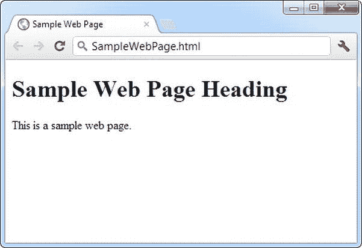
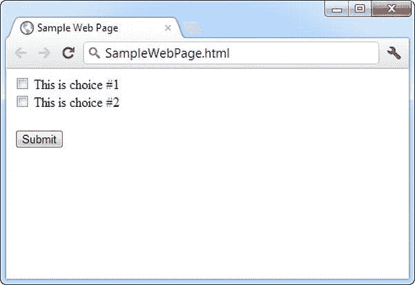
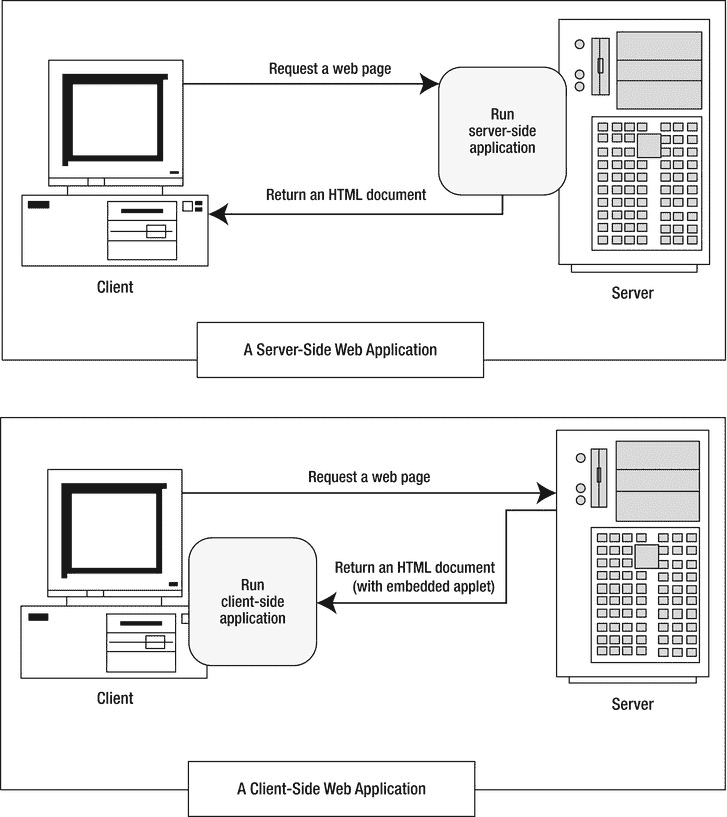
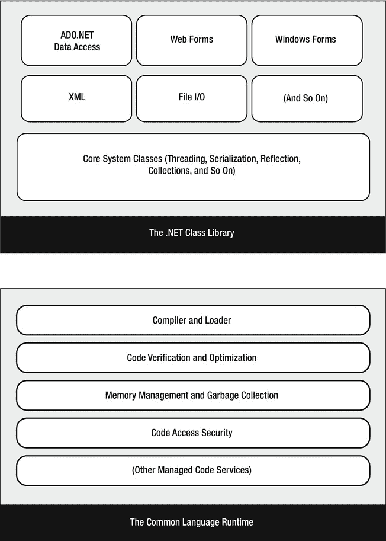
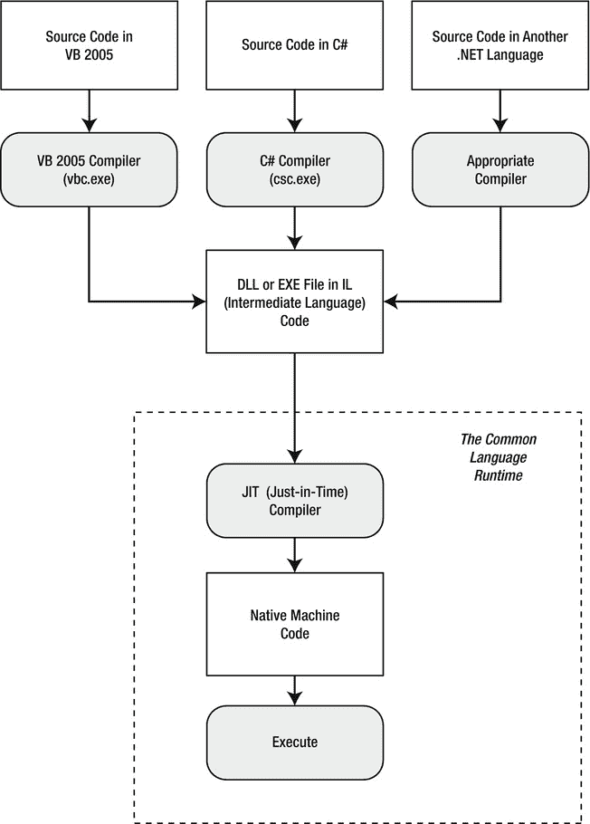

# 一、概览

网络已经存在了大约 20 年。在这段时间里，网站的外观和工作方式发生了巨大的变化。人们创建网站的方式也发生了变化。今天，网页可以手写(也许借助于 Adobe Dreamweaver 这样的设计工具)，或者可以使用许多强大平台中的任何一个通过*编程*。

ASP.NET 是微软的网络编程工具包。这是……NET 是一组旨在帮助开发人员构建各种应用的技术。开发人员可以使用。NET Framework 来构建丰富的 Windows 应用、在后台安静运行的服务，甚至命令行工具。开发人员在几个核心之一编写代码。NET 语言，比如 C#，这是你将在本书中使用的语言。

在这一章中，你将研究构成. NET 基础的技术。首先，你将快速浏览一下 web 开发的历史，并了解为什么。NET Framework 已创建。接下来，您将对的各个部分有一个高级概述。NET，看看 ASP.NET 4.5 如何适应这种情况。

Web 开发的演变

互联网始于 20 世纪 60 年代末，当时是一项实验。它的目标是创建一个真正有弹性的信息网络——一个可以承受几台计算机丢失而不妨碍其他计算机通信的网络。受潜在灾难情景(如核攻击)的驱动，美国国防部提供了初始资金。

早期的互联网大多局限于教育机构和国防承包商。它作为学术合作的工具蓬勃发展，允许全球的研究人员共享信息。20 世纪 90 年代初，可以在现有电话线上工作的调制解调器问世，互联网开始向商业用户开放。1993 年，第一个 HTML 浏览器诞生，互联网革命开始了。

基本 HTML

很难将早期的网站描述为网络应用。相反，第一代网站看起来更像小册子，主要由需要手动更新的固定 HTML 页面组成。

一个基本的 HTML 页面有点像一个文字处理文档——它包含可以在你的计算机上显示的格式化内容，但是它实际上不做任何事情。以下示例显示了最简单的 HTML，其中包含一个标题和一行文本的文档:

```cs
<!DOCTYPE html>
<html>
    <head>
        <title>Sample Web Page</title>
    </head>
    <body>
        <h1>Sample Web Page Heading</h1>
        <p>This is a sample web page.</p>
    </body>
</html>
```

每一个值得尊敬的 HTML 文档都应该以一个 *doctype* 开始，这是一个特殊的代码，表示 HTML 遵循什么风格。今天，最好的选择是下面的通用 doctype，它是随 HTML5 一起引入的，但甚至可以在最老的浏览器上工作:

```cs
<!DOCTYPE html>
```

HTML 文档的其余部分包含实际内容。HTML 文档有两种类型的内容:文本和告诉浏览器如何格式化的元素(或标签)。这些元素很容易辨认，因为它们是用尖括号(< >)标明的。HTML 为不同级别的标题、段落、超链接、斜体和粗体格式、水平线等定义了元素。例如，`<h1>Some Text</h1>`使用了

# 元素。这个元素告诉浏览器在标题 1 样式中显示

*一些文本*，该样式使用大而粗的字体。类似地，`<p>This is a sample web page.</p>`创建一个只有一行文本的段落。该元素将标题信息组合在一起，并将显示在浏览器窗口中的文本包含在<title>元素中，而</title>元素将显示在浏览器窗口中的实际文档内容组合在一起。

图 1-1 显示了浏览器中这个简单的 HTML 页面。现在，这只是一个包含 HTML 内容的固定文件(名为 SampleWebPage.htm)。它没有交互性，不需要 web 服务器，当然也不能算 web 应用。



[图 1-1](#_Fig1) 。普通 HTML

 **提示**你不需要掌握 HTML 来编写 ASP.NET 网页，尽管这肯定是一个好的开始。关于 HTML 的快速入门，可以参考网上其中一个优秀的 HTML 教程，比如`www.w3schools.com/html`。在第 4 章中，你还会得到一个关于 HTML 元素的简单介绍。

HTML 表单

HTML 2.0 用一种叫做 *HTML 表单*的技术引入了 web 编程的第一粒种子。HTML 表单 扩展 HTML，使其不仅包括格式标签，还包括图形小部件的标签，或*控件*。这些控件包括下拉列表、文本框和按钮等常见组件。下面是一个用 HTML 表单控件创建的示例网页:

```cs
<!DOCTYPE html>
<html>
    <head>
        <title>Sample Web Page</title>
    </head>
    <body>
        <form>
            <input type="checkbox" />
             This is choice #1<br />
            <input type="checkbox" />
             This is choice #2<><>
            <input type="submit" value="Submit" />
        </form>
    </body>
</html>
```

在 HTML 表单中，所有控件都放在

<form>和</form>

标签之间。前面的例子包括两个复选框(由<input type="checkbox">元素表示)和一个按钮(由<input type="submit">元素表示)。元素的作用是在行间添加一个换行符。在浏览器中，这个页面看起来像[图 1-2](#Fig2) 。



[图 1-2](#_Fig2) 。HTML 表单

HTML 表单允许 web 开发人员设计标准的输入页面。当用户点击[图 1-2](#Fig2) 所示页面上的提交按钮时，输入控件中的所有数据(在本例中是两个复选框)被拼凑成一长串文本并发送给 web 服务器。在服务器端，自定义应用接收并处理数据。换句话说，如果用户选择了一个复选框或输入了一些文本，应用会在表单提交后发现它。

令人惊讶的是，十多年前为 HTML 表单创建的控件仍然是您用来构建动态 ASP.NET 页面的基础！区别在于运行在服务器端的应用的类型。过去，当用户点击表单页面上的一个按钮时，信息可能会通过电子邮件发送到一个设定的帐户，或者发送到服务器上使用具有挑战性的通用网关接口(CGI)标准的应用。今天，您将使用更强大、更优雅的 ASP.NET 平台。

 **注**HTML 语言的最新版本 HTML5，在语言史上首次引入了一些新的表单控件。在很大程度上，ASP.NET 并不使用这些，因为它们并不被所有的浏览器支持(甚至支持它们的浏览器也不总是一致的)。然而，ASP.NET 会在适当的时候使用可选的 HTML5 虚饰，比如验证属性(见[第 9 章](09.html))。这是因为不支持这些功能的浏览器可以忽略它们，页面仍然可以工作。

ASP.NET

早期的 web 开发平台有两个关键问题。首先，它们并不总是能够很好地扩展。因此，热门网站将很难跟上太多同时用户的需求，最终崩溃或慢如蜗牛。其次，它们只提供了一个基本的编程环境。如果您想要更高级的特性，比如认证用户或读取数据库的能力，您需要从头开始编写代码页。以这种方式构建 web 应用既乏味又容易出错。

为了解决这些问题，微软创造了更高层次的开发平台——首先是 ASP，然后是 ASP.NET。这些技术允许开发人员编写动态网页，而不用担心底层的实现细节。更好的是，ASP.NET 充满了复杂的功能，包括实现安全、管理数据、存储用户特定信息等工具。令人惊讶的是，你甚至可以在对 HTML 一无所知的情况下编写一个 ASP.NET 页面(尽管一点点 HTML 智能会帮助你更快更有效地构建你的页面)。

服务器端和客户端编程

ASP.NET 首先被设计成一个服务器端编程平台。这意味着所有的 ASP.NET 代码都在网络服务器上运行。当 ASP.NET 代码完成运行时，web 服务器向用户发送最终结果——一个可以在任何浏览器中查看的普通 HTML 页面。

服务器端编程并不是制作交互式网页的唯一方法。另一种选择是*客户端*编程，它要求浏览器下载代码并在客户端计算机上本地执行。正如有各种各样的服务器端编程平台一样，也有各种各样的方法来执行客户端编程，从可以嵌入到网页 HTML 中的 JavaScript 代码片段，到 Adobe Flash 和 Microsoft Silverlight 等插件。[图 1-3](#Fig3) 显示了服务器端和客户端模型的区别。



[图 1-3](#_Fig3) 。服务器端和客户端 web 应用

ASP.NET 使用服务器端编程来避免几个问题:

*   *隔离*:客户端代码不能访问服务器端资源。例如，客户端应用没有简单的方法来读取文件或与服务器上的数据库进行交互(至少不会在安全性和浏览器兼容性方面遇到问题)。
*   *安全性*:最终用户可以查看客户端代码。一旦恶意用户了解了应用的工作原理，他们通常可以篡改它。
*   *瘦客户端*:在当今世界，平板电脑和智能手机等联网设备无处不在。这些设备通常具有某种内置的网络浏览功能，但它们可能不支持客户端编程平台，如 Flash 或 Silverlight。

近年来，客户端编程出现了复兴，尤其是 JavaScript。现在，开发人员创建客户端应用，与 web 服务器通信以获取信息并执行任务，如果应用局限于本地计算机，这是不可能的。幸运的是，ASP.NET 从两个方面利用了这一变化:

*   在某些情况下，ASP.NET 允许你结合最好的客户端编程和服务器端编程。例如，最好的 ASP.NET 控件可以“智能地”检测客户端浏览器的功能。如果浏览器支持 JavaScript，这些控件将返回一个包含 JavaScript 的网页，以获得更丰富、响应更快的用户界面。你会在[第 9 章](09.html)中看到一个很好的验证该技术的例子。
*   ASP。NET 的 Ajax 特性: Ajax 是一组 JavaScript 技术，用于创建具有动态内容的快速响应页面。在第 25 章的[中，你将了解到 ASP.NET 如何让你受益于 Ajax 的诸多优点，而没有任何复杂性。](25.html)

然而，理解一个基本事实很重要。无论浏览器的功能如何，您编写的 C# 代码总是在服务器上执行。客户端的装饰只是蛋糕上的糖衣。

 **提示**值得注意的是，ASP.NET 并不是编写复杂的、类似 app 的客户端程序的最佳平台——至少就其本身而言不是。例如，ASP.NET 对那些想开发基于浏览器的实时游戏或下一代谷歌地图的开发者来说没什么帮助。如果这是您想要的，那么很大程度上由您来决定是否将大量复杂的 JavaScript 添加到您的 ASP.NET WebForm 中。然而，如果你更喜欢创建一个电子商务中心或商业网站，或者一个显示和管理大量数据的网站，ASP.NET 是完美的选择。

那个。NET 框架

正如您已经了解到的。NET Framework 实际上是几种技术的集合:

*   *The。NET 语言*:包括 Visual Basic、C#、F# 和 C++，尽管第三方开发者已经创造了数百种。
*   *公共语言运行时(CLR)* :这是执行所有。NET 编程并为这些应用提供自动服务，如安全检查、内存管理和优化。
*   *The。NET Framework 类库* :类库集合了成千上万的预建功能，您可以将它们“管理”到您的应用中。这些特性有时被组织成技术集，如 ADO.NET(创建数据库应用的技术)和 Windows Presentation Foundation(WPF，创建桌面用户界面的技术)。
*   ASP.NET:这是托管你创建的网络应用的引擎。NET 中的几乎所有功能。NET 框架类库。ASP.NET 还包括一套特定于网络的服务，如安全认证和数据存储。
*   Visual Studio :这个可选的开发工具包含了丰富的生产力和调试特性。Visual Studio 包含完整的。NET 框架 ，这样就不需要单独下载了。

有时这些组件之间的划分并不清楚。例如，*ASP.NET*这个词有时被狭义地用来指。NET 类库用来设计网页。另一方面，ASP.NET 也提到了。NET web 应用，其中包括。NET 语言和许多不特定于 web 的类库基础部分。(这通常是我们在本书中使用该术语的方式。我们对 ASP.NET 的详尽考察包括。NET 基础知识、C# 语言以及任何。NET 开发人员可以使用，如基于组件的编程和数据库访问。)

[图 1-4](#Fig4) 显示了。NET 类库和 CLR——这是. NET 的两个基本部分。



[图 1-4](#_Fig4) 。那个。NET 框架

在本章的剩余部分，您将快速浏览一下构成。NET 框架。

C#、VB 和。网络语言

本书使用 Visual Basic 语言，使您能够创建可读的现代代码。那个。NET 版本的 VB 在语法上类似于你可能遇到过的旧版本的 VB，包括“经典”的 VB 6 和 Visual Basic for Applications (VBA)语言 常用于在 Word 和 Excel 等 Microsoft Office 程序中编写宏。但是，不能将经典 VB 转换为。就像你不能把 C++转换成 C# 一样。

这本书用的是 C#，微软的。偏好的网络语言。C# 在语法上类似于 Java、JavaScript 和 C++，所以用这些语言中的一种编写过代码的程序员会很快有宾至如归的感觉。

有意思的是，VB 和 C# 颇为相似。尽管语法不同，但 VB 和 C# 都使用。NET 类库并受 CLR 支持。事实上，几乎任何 C# 代码块都可以逐行翻译成等价的 VB 代码块(反之亦然)。偶尔会出现语言差异，但在大多数情况下，开发者已经学会了一种语言。网络语言可以快速有效地转移到另一种语言。甚至还有自动翻译 C# 和 VB 代码的软件工具(例子见`http://converter.telerik.com`或`http://tangiblesoftwaresolutions.com`)。

简而言之，VB 和 C# 都是优雅的现代语言，是创建下一代 web 应用的理想语言。

 **注**。NET 1.0 引入了全新的语言。但是，后续版本中的更改。网络变得更加微妙。虽然 C# 在。NET 4.5 增加了一些新特性，语言的大部分内容保持不变。在[第二章](02.html)和[第三章](03.html)中，你将梳理 C# 的语法并学习面向对象编程的基础。

中间语言

所有的。NET 语言在代码执行前被编译成另一种低级语言。这种低级语言就是*通用中间语言* (CIL ，或者简称 IL)。CLR 是。NET 只使用 IL 代码。因为所有。网络语言都是基于 IL 的，它们都有很深的相似性。这就是 VB 和 C# 语言提供本质上相同的功能和性能的原因。事实上，这两种语言非常兼容，以至于用 C# 编写的网页可以像使用 C# 组件一样使用 VB 组件，反之亦然。

那个。NET 框架用一种叫做*公共语言规范* (CLS) 的东西将这种兼容性正式化。从本质上讲，CLS 是一个契约，如果得到尊重，它将保证用它编写的组件。网络语言可以在所有其他地方使用。CLS 的一部分是*通用类型系统* (CTS) ，它为所有共享的数据类型(如字符串、数字和数组)定义了规则。网络语言。CLS 还定义了面向对象的成分，比如类、方法、事件等等。在很大程度上。NET 开发人员不需要考虑 CLS 是如何工作的，尽管他们每天都依赖它。

[图 1-5](#Fig5) 显示了。NET 语言编译成 IL。用. NET 语言生成的每个 EXE 或 DLL 文件都包含 IL 代码。这是您部署到其他计算机的文件。对于 web 应用，您将编译好的代码部署到一个活动的 web 服务器上。



[图 1-5](#_Fig5) 。中的语言编译。网

CLR 只运行 IL 代码，这意味着它不知道。你原来用的网语。但是，请注意，CLR 执行了另一个编译步骤——它获取 IL 代码并将其转换为适合当前平台的本机语言代码。这一步发生在应用启动时，就在代码执行之前。在 ASP.NET 应用中，这些特定于机器的文件在 web 应用运行时被缓存，以便可以重用，从而确保最佳性能。

 **注意**你可能想知道为什么。NET 编译器不直接编译成机器码。原因是机器码取决于几个因素，包括 CPU。如果你在一台电脑上将一个应用编译成机器码，就不能保证它能在另一台处理器不同的电脑上运行。

公共语言运行时

CLR 是支持所有。网络语言。全部。NET 代码在 CLR 内部运行。无论您运行的是 Windows 应用还是 web 服务，都是如此。例如，当客户端请求 ASP.NET 网页时，ASP.NET 服务在 CLR 环境中运行，执行您的代码，并创建一个最终的 HTML 页面发送给客户端。

CLR 不仅执行代码，还提供一整套相关服务，如代码验证、优化和对象管理。CLR 的含义非常广泛:

*   *深度语言集成* : VB 和 C#，喜欢的都有。NET 语言，编译成 IL。换句话说，CLR 不区分不同的语言——事实上，它无法知道使用哪种语言来创建可执行文件。这远远不仅仅是语言的兼容性；它的语言*整合*。
*   并行执行(Side-by-Side execution):CLR 还能够一次加载一个组件的多个版本。换句话说，您可以多次更新一个组件，每个应用都会加载和使用正确的版本。作为副作用，多个版本的。NET 框架，这意味着你可以升级到新版本的 ASP.NET，而不需要替换当前版本或重写你的应用。
*   *更少的错误*:使用 CLR 不可能出现所有类别的错误。例如，CLR 可以防止许多低级语言(如 C++)可能出现的内存错误。

除了这些真正革命性的好处，CLR 也有一些潜在的缺点。新开发人员有时会提出两个问题，但并不总能得到解答:

*   *性能*:典型的 ASP.NET 应用非常快，因为 ASP.NET 代码在执行之前已经编译成机器代码了。然而，处理器运算算法仍然无法与编写良好的 C++代码的惊人速度相匹配，因为 CLR 会带来一些额外的开销。一般来说，这只是少数性能关键型高工作负载应用(如实时游戏)中的一个因素。对于高容量的 web 应用，潜在的瓶颈很少与处理器相关，而通常与外部资源(如数据库或 web 服务器的文件系统)的速度有关。通过 ASP.NET 缓存和一些编写良好的数据库代码，您可以确保任何 web 应用的出色性能。
*   代码透明性(Code transparency):IL 更容易分解，这意味着如果你发布一个编译过的应用或组件，其他程序员可能更容易确定你的代码是如何工作的。这对 ASP.NET 应用来说不是什么大问题，因为它们不是分布式的，而是托管在一个安全的 web 服务器上。

的。NET 类库

那个。NET 类库 是一个巨大的类存储库，为从读取 XML 文件到发送电子邮件消息的所有事情提供预制的功能。如果你接触过 Java，你可能已经熟悉了类库的概念。然而。NET 类库比其他任何编程框架都更加雄心勃勃和全面。任何。NET 语言可以使用。NET 类库的特性，通过与正确的对象进行交互。这有助于鼓励不同的。NET 语言，并消除了在计算机或 web 服务器上安装大量组件的需要。

类库的某些部分包含了您在 web 应用中永远不需要使用的功能(例如用于创建带有 Windows 界面的桌面应用的类)。类库的其他部分直接面向 web 开发。还有更多的类可以用在各种编程场景中，并且不特定于 web 或 Windows 开发。这些包括定义公共变量类型的基本类集和用于数据访问的类，仅举几个例子。您将探索。NET 框架贯穿全书。

你可以把类库想象成一个库存丰富的程序员工具箱。微软的理念是，它将提供单调乏味的基础设施，这样应用开发人员只需编写特定于业务的代码。例如，在。NET Framework 处理棘手的问题，如数据库事务和并发性，确保成百上千的并发用户可以同时请求同一个网页。您只需添加特定应用所需的逻辑。

可视化工作室

的最后一部分。NET 是 Visual Studio 开发工具，它提供了一个丰富的环境，您可以在其中快速创建高级应用。虽然理论上你可以不用 Visual Studio 创建一个 ASP.NET 应用(例如，在文本编辑器中编写所有的源代码，然后用。NET 的命令行编译器)，这项任务将是乏味的，痛苦的，并且容易出错。因此，所有专业的 ASP.NET 开发人员都使用 Visual Studio 这样的设计工具。

Visual Studio 的一些功能包括:

*   页面设计:你可以通过使用 Visual Studio 集成的 WebForm 设计器来创建一个具有吸引力的页面。你不需要理解 HTML。
*   *自动错误检测*:当 Visual Studio 在您运行应用之前检测并报告错误时，您可以节省大量的工作时间。潜在的问题用下划线标出，就像许多文字处理器中的“边读边拼”功能一样。
*   *调试工具* : Visual Studio 保留了它传说中的调试工具，这些工具允许你观察你的代码运行并跟踪变量的内容。您可以像测试任何其他类型的应用一样轻松地测试 web 应用，因为 Visual Studio 有一个内置的 web 服务器，专门用于调试。
*   *IntelliSense*:Visual Studio 为识别出的对象提供语句完成功能，并在有用的工具提示中自动列出函数参数等信息。

当你考虑 Visual Studio 的最新版本时，你将在第 4 章中了解所有这些特性。

还需要注意的是，Visual Studio 有多个版本:

*   Visual Studio Express for Web:这是 Visual Studio 的一个完全免费的版本，功能惊人。它的主要限制是只允许您构建 web 应用和组件，而不允许构建其他类型的。NET 程序(例如，Windows 应用)。

 **提示**要下载 Visual Studio Express for Web，请转到`www.microsoft.com/express/downloads`。要比较 Visual Studio 版本之间的差异，请查看`www.microsoft.com/visualstudio/11/en-us/products/compare`。

*   *Visual Studio Professional* :这是 Visual Studio 最精简的完整版。它具有构建任何类型的。NET 应用(Windows 或 web)。
*   Visual Studio Premium 或 Ultimate :这些版本增加了成本，增加了更多的工具和装饰(本书没有讨论)。例如，它们整合了自动化测试和版本控制的特性，这有助于团队成员在大型项目中协调他们的工作。

 **注意**你可以使用任何版本的 Visual Studio 运行本书中的所有示例，包括免费的 Visual Studio Express for Web。

最后一句话

本章提供了一个高层次的概述，让您第一次领略了 ASP.NET 和。NET 框架。您还了解了 web 开发是如何发展的，从基本的 HTML 表单标准到现代的 ASP.NET 平台。

在下一章，你会对 C# 语言有一个全面的了解。