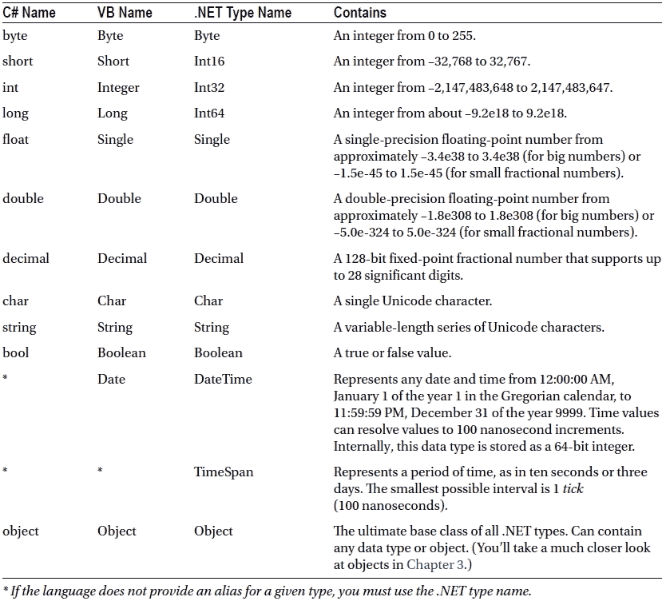
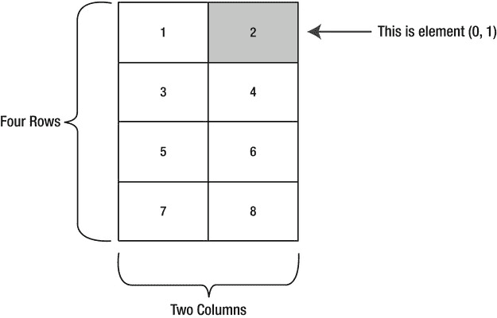

# 二、C# 语言

在创建 ASP.NET 应用之前，您需要选择一种. NET 语言来编写它。VB 和 C# 都是强大的现代语言，使用它们中的任何一种来编写网页都不会出错。通常选择只是个人喜好或工作环境的问题。例如，如果你已经用类似 C 语法的语言(例如 Java)编程，你可能最喜欢用 C#。或者，如果您已经在 VBA 花了几个小时编写 Microsoft Excel 宏，您可能更喜欢 Visual Basic 的自然风格。许多开发人员精通这两种语言。

本章概述了 C# 语言。您将了解可以使用的数据类型、可以执行的操作以及定义函数、循环和条件逻辑所需的代码。本章假设你以前编程过，并且已经熟悉这些概念中的大部分——你只需要看看它们是如何在 C# 中实现的。

如果你已经用类似的语言如 Java 编程，你可能会发现使用本章最有益的方式是浏览它而不是阅读每一节。这种方法将使您对 C# 有一个总体的了解。需要时，您可以返回本章作为参考。但是请记住，虽然您可以在不掌握所有语言细节的情况下编写一个 ASP.NET 应用，但是这种深刻的知识通常是将普通程序员与真正的编程大师区分开来的东西。

 **注意**本章中的例子展示了单独的行和代码片段。在您了解对象和之前，您将无法在应用中使用这些代码片段。网络类型。但是不要绝望——下一章将基于这些信息，填补空白，并提供一个 ASP.NET 的例子供您尝试。

那个。网络语言

那个。NET Framework 附带了两种常用于构建 ASP.NET 应用的核心语言:C# 和 VB。这些语言在很大程度上是功能等同的。微软一直在努力消除语言冲突。NET 框架。这些争论减缓了采用速度，分散了对核心框架特性的注意力，并使开发人员社区难以共同解决问题和共享解决方案。根据微软的说法，选择用 C# 而不是 VB 编程只是一种生活方式的选择，不会影响应用的性能、互操作性、功能集或开发时间。令人惊讶的是，这一雄心勃勃的主张基本上是正确的。

。NET 还允许其他第三方开发人员发布像 C# 或 VB 一样功能丰富的语言。这些语言(包括 Eiffel、Pascal，甚至 COBOL)与。NET 框架毫不费力。其实如果你想再装一个。NET 语言，你所需要做的就是把编译器复制到你的电脑上，添加一行代码在配置文件中注册它。通常，安装程序会自动为您执行这些步骤。安装后，新的编译器可以将您创建的代码转换成一系列中间语言(IL) 指令，就像 VB 和 C# 编译器处理 VB 和 C# 代码一样。

IL 是公共语言运行库(CLR)唯一识别的语言。当您为 ASP.NET WebForm 创建代码时，使用 C# 编译器(csc.exe)或 VB 编译器(`)将代码转换为 IL。虽然您可以手动执行编译，但当网页被请求时，您更有可能让 ASP.NET 自动处理它。`

 `C# 语言基础

新的 C# 程序员有时会被这种语言古怪的语法所吓倒，其中包括特殊字符，如分号(`;`)、花括号(`{}`)和反斜杠(`\`)。幸运的是，一旦你习惯了 C#，这些细节将很快融入背景。在接下来的几节中，在学习任何其他概念之前，您将学习关于 C# 的四个基本原则。

区分大小写

有些语言区分大小写 ，而有些则不区分。Java、C、C++和 C# 都是区分大小写的语言。VB 不是。这种差异可能会让以前的 VB 程序员感到沮丧，他们没有意识到关键字、变量和函数必须以正确的大小写输入。例如，如果您试图在 C# 中通过输入 *If* 而不是 *if* 来创建条件语句，您的代码将不会被识别，并且当您试图构建您的应用时，编译器会标记出一个错误。

C# 对小写单词也有明确的偏好。关键词——如`if`、`for`、`foreach`、`while`、`typeof`等——总是用小写字母书写。当您定义自己的变量时，遵循其他 C# 程序员和。NET 框架类库。这意味着您应该给私有变量起一个小写字母，给公共变量起一个大写字母。例如，您可以在 VB 中将私有变量命名为 MyNumber，在 C# 中将私有变量命名为 myNumber。当然，只要你确保始终使用相同的大写字母，你就不需要遵循这种风格。

 **注意**如果你正在设计其他开发者可能会看到的代码(例如，你正在创建你想卖给其他公司的组件)，编码标准尤其重要。但是即使你不是，清晰和一致的编码也是一个好习惯，它会让你更容易理解你写了几个月(甚至几年)的代码！)后来。您可以在 Juval Lowy 撰写的“IDesign C# 编码标准”白皮书中找到最佳实践的良好总结，该白皮书可从`www.idesign.net`获得。

评论

*注释* 是被编译器忽略的描述性文本行。C# 提供了两种基本类型的注释。

第一种是单行注释。在这种情况下，注释以两个正斜杠开始，并延续到整个当前行:

```cs
// A single-line C# comment.
```

可选地，C# 程序员可以使用`/*`和`*/`注释括号来表示多行注释:

```cs
/* A multiple-line
   C# comment. */
```

多行注释通常用于快速禁用整个代码块。这个技巧叫做*注释掉*你的代码:

```cs
/*
```

```cs
   ... Any code here is ignored ...
```

```cs
*/
```

这样，代码就不会被执行，但如果您需要引用它或在以后使用它，它仍然会保留在您的源代码文件中。

 **提示**很容易忘记源代码文件中的`/*`和`*/`注释括号。但是，您不会忘记您已经禁用了一部分代码，因为 Visual Studio 以绿色文本显示所有注释和被注释掉的代码。

C# 还包括一个基于 XML 的注释语法，你可以用它来以一种标准化的方式描述你的代码。对于 XML 注释，您可以使用特殊的标记来指示注释所适用的代码部分。以下是为整个应用提供摘要的注释示例:

```cs
/// <summary>
/// This application provides web pages
/// for my e-commerce site.
/// </summary>
```

XML 注释总是以三个斜杠开头。基于 XML 的注释的好处是自动化工具(包括 Visual Studio)可以从您的代码中提取注释，并使用它们来构建帮助参考和其他类型的文档。关于 XML 注释的更多信息，可以参考 MSDN 在`http://msdn.microsoft.com/magazine/cc302121.aspx`发表的一篇优秀文章。如果你是 XML 语法的新手，你会在第 18 章中详细了解它。

语句终止

C# 使用分号(`;`)作为*语句的终止字符* 。C# 代码中的每一条语句都必须以分号结束，除非你定义了一个块结构。(这种语句的例子包括方法、条件语句和循环，这是三种类型的代码成分，您将在本章的后面了解。)通过省略分号，您可以轻松地将一条代码语句拆分成多行。你只需要记住把分号放在最后一行的末尾来结束语句。

以下代码片段演示了执行相同操作的四种等效方法(将三个数字相加):

```cs
// A code statement on a single line.
myValue = myValue1 + myValue2 + myValue3;
```

```cs
// A code statement split over two lines.
myValue = myValue1 + myValue2 +
          myValue3;
```

```cs
// A code statement split over three lines.
myValue = myValue1 +
          myValue2 +
          myValue3;
```

```cs
// Two code statements in a row.
myValue = myValue1 + myValue2;
myValue = myValue + myValue3;
```

正如你在这个例子中所看到的，C# 给了你很大的自由来以你想要的方式拆分你的语句。一般的经验法则是让你的代码尽可能的易读。因此，如果你有一个很长的陈述，把它分成几行，这样更容易阅读。另一方面，如果您有一个同时执行几个操作的复杂代码语句，您可以将该语句分散在几行中，或者将您的逻辑分成多个代码语句，以使其更清晰。

块

C#、Java 和 C 语言都严重依赖花括号——括号的态度稍微好一点:`{}`。你可以在大多数键盘的右边找到花括号(P 键旁边)；它们共享一个带有方括号的键:[]。

花括号将多个代码语句组合在一起。通常，您会将代码语句分组，因为您希望它们在循环中重复、有条件地执行或分组到一个函数中。这些都是*块结构*，你会在本章看到所有这些技术。但是在每种情况下，花括号都扮演相同的角色，这使得 C# 比其他语言更简单、更简洁，因为其他语言需要为每种类型的块结构使用不同的语法。

```cs
{
    // Code statements go here.
}
```

变量和数据类型

与所有编程语言一样，在 C# 中使用变量来跟踪数据。*变量*可以存储数字、文本、日期和时间，它们甚至可以指向成熟的对象。

当你声明一个变量时，你给它一个名字并指定它将存储的数据类型。要声明一个局部变量，可以用数据类型开始该行，后面跟着要使用的名称。最后一个分号结束语句。

```cs
// Declare an integer variable named errorCode.
int errorCode;
```

```cs
// Declare a string variable named myName.
string myName;
```

 **注意**记住，在 C# 中变量*名*和*名*是不等价的！更令人困惑的是，C# 程序员有时会利用这一事实——使用多个同名但大小写不同的变量。当区分一个类中的私有和公共变量时，这种技术有时是有用的(如第 3 章中所演示的)，但是如果有任何混淆的可能性，你应该避免它。

每一个。NET 语言使用相同的变量数据类型。不同的语言可能会提供稍微不同的名称(例如，VB Integer 与 C# int 相同)，但是 CLR 并没有区别——事实上，它们只是同一基本数据类型(在本例中，是 System)的两个不同名称。Int32)。这种设计允许深度语言集成。因为语言共享相同的核心数据类型，所以您可以很容易地使用用一种语言编写的对象。NET 语言编写的应用。网语。不需要数据类型转换。

 **注**所有。NET 语言具有相同的数据类型，因为它们都遵循通用类型系统(CTS ),这是微软设计的 ECMA 标准，为所有。NET 语言在处理数据时必须遵循。

为了创建这个通用数据类型系统，微软设计了一组基本数据类型，在。NET 类库。表 2-1 列出了最重要的核心数据类型。

[表 2-1](#_Tab1) 。常见数据类型



中的类型名来声明变量。NET 类库。这种方法产生相同的变量。当数据类型没有内置到语言中的别名时，这也是一个要求。例如，您可以用这段使用类库名称的代码来重写前面使用 C# 数据类型名称的示例:

```cs
System.Int32 errorCode;
System.String myName;
```

这段代码使用完全限定的类型名，表明 Int32 数据类型和 String 数据类型位于系统命名空间中(以及所有最基本的类型)。在第 3 章中，你将更详细地了解类型和名称空间。

名称又能代表什么呢不是数据类型！

如果你有一些编程经验，你会注意到前面的例子没有使用变量前缀。许多资深 C/C++和 VB 程序员习惯在变量名的开头添加几个字符来表示其数据类型。英寸 NET 中，不鼓励这种做法，因为数据类型可以以更灵活的方式使用，不会有任何问题，而且大多数变量都包含对完整对象的引用。在本书中，变量前缀没有被使用，除了 web 控件，它有助于区分列表、文本框、按钮和其他常见的用户界面元素。在你自己的程序中，你应该遵循一个一致的(通常是全公司范围的)标准，这个标准可能采用也可能不采用可变前缀系统。

赋值和初始化器

在你声明了你的变量之后，你可以自由地给它们赋值，只要这些值有正确的数据类型。以下代码展示了这一两步过程:

```cs
// Declare variables.
int errorCode;
string myName;
```

```cs
// Assign values.
errorCode = 10;
myName = "Matthew";
```

也可以在声明变量的同一行中给变量赋值。此示例将前面的四行代码压缩为两行:

```cs
int errorCode = 10;
string myName = "Matthew";
```

C# 通过限制使用未初始化的变量来防止错误。例如，当您尝试编译以下代码时，它会导致错误:

```cs
int number;             // Number is uninitialized.
number = number + 1;    // This causes a compile error.
```

编写这段代码的正确方法是，在使用 number 变量之前，将其显式初始化为一个适当的值，如 0:

```cs
int number = 0;         // Number now contains 0.
number = number + 1;    // Number now contains 1.
```

C# 也严格处理数据类型。例如，下面的代码语句不会像写的那样工作:

```cs
decimal myDecimal = 14.5;
```

问题是文字 14.5 被自动解释为 double，如果不使用强制转换语法，就不能将 double 转换为 decimal，这将在本章后面描述。为了解决这个问题，C# 定义了一些特殊字符，您可以将这些字符附加到文字值上来指示它们的数据类型，这样就不需要进行转换。这些字符如下:

*   `M`（十进制）
*   `D`(双精度)
*   `F`(浮点)
*   `L`(长型)

例如，您可以使用十进制指示器重写前面的示例，如下所示:

```cs
decimal myDecimal = 14.5M;
```

 **注意**在这个例子中，使用了大写的`M`，但是你可以用小写的`m`代替它。数据类型指示器是 C# 中少数不区分大小写的细节之一。

有趣的是，如果您使用类似这样的代码在一个步骤中声明和初始化您的变量，并且如果 C# 编译器可以根据您使用的值确定正确的数据类型，您就不需要指定数据类型。相反，您可以使用通用的关键字`var`来代替数据类型。这意味着前一行代码相当于:

```cs
var myDecimal = 14.5M;
```

在这里，编译器意识到十进制数据类型是 myDecimal 变量最合适的选择，并自动使用该数据类型。没有性能差异。使用推断数据类型创建的 myDecimal 变量的行为方式与使用显式数据类型创建的 myDecimal 变量完全相同。事实上，编译器生成的底层代码是相同的。唯一的区别是`var`关键字节省了一些输入。

许多 C# 程序员对关键字`var`感到不安，因为它使代码不那么清晰。然而，在创建对象时，`var`关键字是一个更有用的快捷方式，你将在下一章看到。

字符串和转义字符

C# 对待文本的方式与 VB 等其他语言稍有不同。它将任何嵌入的反斜杠(`\`)解释为特殊字符序列的开始。例如，`\n`表示增加一个新行(回车)。最有用的字符文字如下:

*   `\"`(双引号)
*   `\n`(新行)
*   `\t`(水平标签)
*   `\\`(反斜杠)

您也可以使用语法`\x250`插入基于十六进制代码的特殊字符。这将插入一个十六进制值为 250 的字符(这个字符看起来像一个颠倒的字母 *a* )。

请注意，为了指定反斜杠字符(例如，在目录名中)，您需要两个斜杠。这里有一个例子:

```cs
// A C# variable holding the
// c:\MyApp\MyFiles path.
string path = "c:\\MyApp\\MyFiles";
```

或者，您可以通过在字符串前加一个`@`符号来关闭 C# 转义，如下所示:

```cs
string path = @"c:\MyApp\MyFiles";
```

数组

*数组* 允许你存储一系列具有相同数据类型的数值。通过使用一个或多个索引号来访问数组中的每个值。将数组描绘成数据列表(如果数组是一维的)或数据网格(如果数组是二维的)通常很方便。通常，数组在内存中是连续布局的。

所有数组都从固定的下限 0 开始。这条规则没有例外。在 C# 中创建数组时，指定元素的数量 。因为计数从 0 开始，所以最高的索引实际上比元素数少 1。(换句话说，如果你有三个元素，最高指数是 2。)

```cs
// Create an array with four strings (from index 0 to index 3).
// You need to initialize the array with the
// new keyword in order to use it.
string[] stringArray = new string[4];
```

```cs
// Create a 2x4 grid array (with a total of eight integers).
int[,] intArray = new int[2, 4];
```

默认情况下，如果您的数组包含简单数据类型，它们都被初始化为默认值(0 或 false)，这取决于您使用的是某种类型的数字还是布尔变量。但是如果你的数组是由字符串或其他对象类型组成的，它会用空引用来初始化。(关于简单值类型和引用类型之间区别的更全面的讨论，请参见第 3 章。)

您也可以在创建数组的同时用数据填充数组。在这种情况下，您不需要显式指定元素的数量，因为。NET 可以自动确定它:

```cs
// Create an array with four strings, one for each number from 1 to 4.
string[] stringArray = {"1", "2", "3", "4"};
```

同样的技术也适用于多维数组 ，除了需要两组花括号:

```cs
// Create a 4x2 array (a grid with four rows and two columns).
int[,] intArray = {{1, 2}, {3, 4}, {5, 6}, {7, 8}};
```

图 2-1 显示了这个数组在内存中的样子。



[图 2-1](#_Fig1) 。整数数组示例

要访问数组中的元素，需要在方括号中指定相应的索引号:`[]`。数组索引总是从零开始。这意味着 myArray[0]访问一维数组中的第一个单元格，myArray[1]访问第二个单元格，依此类推。

```cs
int[] intArray = {1, 2, 3, 4};
int element = intArray[2];    // element is now set to 3.
```

在一个二维数组 中，你需要两个索引号:

```cs
int[,] intArray = {{1, 2}, {3, 4}, {5, 6}, {7, 8}};
```

```cs
// Access the value in row 0 (first row), column 1 (second column).
int element = intArray[0, 1];    // element is now set to 2.
```

数组列表

C# 数组不支持重定尺寸。这意味着创建数组后，不能更改其大小。相反，您需要创建一个具有新大小的新数组，并将旧数组中的值复制到新数组中，这将是一个繁琐的过程。但是，如果您需要一个类似动态数组的列表，您可以使用提供给 all 的集合类之一。NET 语言通过。NET 类库。最简单的集合类之一。NET 提供的是 ArrayList，它支持任何类型的对象，并且总是允许动态调整大小。下面是一段使用 ArrayList 的 C# 代码:

```cs
// Create an ArrayList object. It’s a collection, not an array,
// so the syntax is slightly different.
ArrayList dynamicList = new ArrayList();
```

```cs
// Add several strings to the list.
// The ArrayList is not strongly typed, so you can add any data type
// although it’s simplest if you store just one type of object
// in any given collection.
dynamicList.Add("one");
dynamicList.Add("two");
dynamicList.Add("three");
```

```cs
// Retrieve the first string. Notice that the object must be converted to a
// string, because there’s no way for .NET to be certain what it is.
string item = Convert.ToString(dynamicList[0]);
```

你将在第 3 章中了解更多关于数组列表和其他集合的内容。

 **提示**在许多情况下，回避计数问题和使用成熟的集合比使用数组更容易。集合通常更适合现代的面向对象编程，在 ASP.NET 被广泛使用。那个。NET 类库提供了许多类型的集合类，包括简单集合、排序列表、键索引列表(字典)和队列。在这本书里你会看到一些集合的例子。

枚举

一个*枚举* 是一组相关的常数，每个常数都有一个描述性的名称。枚举中的每个值对应一个预设的整数。但是，在您的代码中，您可以通过名称引用枚举值，这使您的代码更清晰，并有助于防止错误。例如，将标签的边框设置为枚举值 BorderStyle 要简单得多。虚线，而不是晦涩的数字常数 3。在这种情况下，Dashed 是 BorderStyle 枚举中的一个值，它表示数字 3。

 **注**只是为了让生活有趣，列举*一词不止一个意思。如本节所述，枚举是常量值的集合。然而，程序员经常谈论*枚举*的过程，这意味着在一个集合上循环，或*迭代*。例如，经常谈到枚举一个字符串的所有字符(这意味着循环遍历该字符串，并在单独的过程中检查每个字符)。*

 *下面是一个定义不同类型用户的枚举示例:

```cs
// Define an enumeration type named UserType with three possible values.
enum UserType
{
    Admin,
    Guest,
    Other
}
```

现在，您可以将 UserType 枚举用作一种特殊的数据类型，它被限制为三个可能值中的一个。您可以使用以下示例中所示的点标记法来分配或比较枚举值:

```cs
// Create a new value and set it equal to the UserType.Admin constant.
UserType newUserType = UserType.Admin;
```

在内部，枚举以数字的形式维护。在前面的示例中，0 自动分配给 Admin，1 分配给 Guest，2 分配给 Other。您可以直接在枚举变量中设置一个数字，尽管如果您使用的数字与定义的值不对应，这可能会导致无法检测的错误。

显然，枚举创建了可读性更好的代码。它们还简化了编码，因为在您键入枚举类型名称(ErrorCode)并添加点(`.`)后，Visual Studio 将使用 IntelliSense 弹出一个可能值的列表。

 **提示**枚举在. NET 中被广泛使用。你不需要创建自己的枚举在 ASP.NET 应用中使用，除非你正在设计自己的组件。但是，枚举值的概念非常重要，因为。NET 类库广泛使用它。例如，通过使用。NET 类库。

变量操作

在 C# 中可以使用所有标准类型的变量操作。处理数字时，您可以使用各种数学符号，如[表 2-2](#Tab2) 中所列。C# 遵循常规的运算顺序，先进行取幂运算，再进行乘除运算，然后进行加减运算。还可以通过用括号将子表达式分组来控制顺序:

[表 2-2。](#Tab2)算术运算

| 操作员 | 描述 | 例子 |
| --- | --- | --- |
| `+` | 添加 | `1 + 1 = 2` |
| `–` | 减法 | `5 - 2 = 3` |
| `*` | 增加 | `2 * 5 = 10` |
| `/` | 分开 | `5.0 / 2 = 2.5` |
| `%` | 获取整数除法运算后的余数 | `7 % 3 = 1` |

```cs
int number;
```

```cs
number = 4 + 2 * 3;
// number will be 10.
```

```cs
number = (4 + 2) * 3;
// number will be 18.
```

在 C# 中，除法有时会导致混乱。如果将一个整数除以另一个整数，C# 会执行整数除法。这意味着它会自动丢弃答案的小数部分，并将整个部分作为整数返回。例如，如果你用 5 除以 2，你会得到 2 而不是 2.5。

解决方法是明确指出你的一个数字是一个小数值。比如用 *5 M* 代替 5，C# 会把 5 当成小数。如果用 *5.0* 代替 5，C# 会把它当作双精度。无论哪种方式，除法都将返回预期值 2.5。当然，这个问题在现实世界的代码中不会经常出现，因为这样你通常会用一个*变量*除以另一个。只要你的变量不是整数，它们包含什么数字并不重要。

[表 2-2](#Tab2) 中的运算符是为处理数字而设计的。但是，C# 也允许使用加法运算符(`+`)来连接两个字符串:

```cs
// Join three strings together.
myName = firstName + " " + lastName;
```

此外，C# 提供了特殊的简写赋值操作符。这里有几个例子:

```cs
// Add 10 to myValue. This is the same as myValue = myValue + 10;
myValue += 10;
```

```cs
// Multiple myValue by 3\. This is the same as myValue = myValue * 3;
myValue *= 3;
```

```cs
// Divide myValue by 12\. This is the same as myValue = myValue / 12;
myValue /= 12;
```

高等数学

在过去，每种语言都有自己的一套用于常见数学运算的关键字，如舍入和三角学。英寸 NET 语言，许多这些关键字仍然存在。但是，您也可以使用集中式数学类，它是。NET 框架。这有一个令人愉快的副作用，即确保您用来执行数学运算的代码可以很容易地翻译成任何。最少大惊小怪的网络语言。

要使用数学运算，您需要调用系统的方法。数学课。这些方法是*静态* ，这意味着它们总是可用的，随时可以使用。(下一章将更详细地探讨静态成员和实例成员之间的区别。)

以下代码片段显示了一些可以用 Math 类执行的示例计算:

```cs
double myValue;
myValue = Math.Sqrt(81);         // myValue = 9.0
myValue = Math.Round(42.889, 2); // myValue = 42.89
myValue = Math.Abs(-10);         // myValue = 10.0
myValue = Math.Log(24.212);      // myValue = 3.18.. (and so on)
myValue = Math.PI;               // myValue = 3.14.. (and so on)
```

数学类的特性太多了，无法在此一一列举。前面的示例显示了一些常见的数字运算。有关可用的三角函数和对数函数的更多信息，请参考微软 MSDN 网站上的数学类参考信息 ( `http://msdn.microsoft.com/library/system.math.aspx`)。

类型转换

将信息从一种数据类型转换为另一种数据类型是一项相当常见的编程任务。例如，您可以检索用户的文本输入，其中包含要用于计算的数字。或者，您可能需要获取一个计算值，并将其转换为可以在网页中显示的文本。

转换有两种类型:扩大和缩小。*加宽*转换 T3】总能成功。例如，您总是可以将 32 位整数转换为 64 位整数。您不需要任何特殊代码:

```cs
int mySmallValue;
long myLargeValue;
```

```cs
// Get the largest possible value that can be stored as a 32-bit integer.
// .NET provides a constant named Int32.MaxValue that provides this number.
mySmallValue = Int32.MaxValue;
```

```cs
// This always succeeds. No matter how large mySmallValue is,
// it can be contained in myLargeValue.
myLargeValue = mySmallValue;
```

另一方面，*缩小*转换 可能成功也可能失败，这取决于数据。如果将 32 位整数转换为 16 位整数，并且 32 位数大于 16 位数据类型中可以存储的最大值，则可能会遇到错误。所有收缩转换都必须显式执行。C# 使用一种优雅的方法进行显式类型转换。要转换变量，只需在要转换的表达式前的括号中指定类型。

下面的代码演示如何将 32 位整数更改为 16 位整数:

```cs
int count32 = 1000;
short count16;
```

```cs
// Convert the 32-bit integer to a 16-bit integer.
// If count32 is too large to fit, .NET will discard some of the
// information you need, and the resulting number will be incorrect.
count16 = (short)count32;
```

这个过程叫做*铸造* 。如果在尝试执行收缩转换时不使用显式强制转换，则在尝试编译代码时会收到一个错误。然而，即使您执行显式转换，您仍然可能会遇到问题。例如，考虑下面显示的导致溢出的代码:

```cs
int mySmallValue;
long myLargeValue;
```

```cs
myLargeValue = Int32.MaxValue;
myLargeValue++;
```

```cs
// This will appear to succeed (there won’t be an error at runtime),
// but your data will be incorrect because mySmallValue cannot
// hold a value this large.
mySmallValue = (int)myLargeValue;
```

那个。NET 语言在处理这个问题上有所不同。在 VB 中，您总是会收到一个运行时错误，您必须拦截并响应它。然而，在 C# 中，您只会在 mySmallValue 中得到不正确的数据。为了避免这个问题，您应该在尝试收缩转换之前检查您的数据不是太大(这总是一个好主意)，或者使用`checked`块。`checked`块允许对一部分代码进行溢出检查。如果发生溢出，您将自动收到一个错误，就像在 VB 中一样:

```cs
checked
{
    // This will cause an exception to be thrown.
    mySmallValue = (int)myLargeValue;
}
```

 **提示**通常，你不会使用`checked`块，因为它效率很低。`checked`块捕捉到了问题(防止数据错误)，但是它抛出了一个异常，您需要使用错误处理代码来处理这个异常，如第 7 章中的[所述。总的来说，在尝试操作之前，对任何潜在的无效数字进行自己的检查会更容易。然而，`checked`块*在一种情况下*很方便——调试。这样，您就可以在测试应用时发现意外错误，并立即解决它们。](07.html)

在 C# 中，不能使用强制转换将数字转换为字符串，反之亦然。在这种情况下，数据不仅仅是从一个变量移动到另一个变量，还需要转换成完全不同的格式。谢天谢地，。NET 有许多执行高级转换的解决方案。一种选择是使用 Convert 类的静态方法，它支持许多常见的数据类型，如字符串、日期和数字。

```cs
string countString = "10";
```

```cs
// Convert the string "10" to the numeric value 10.
int count = Convert.ToInt32(countString);
```

```cs
// Convert the numeric value 10 into the string "10".
countString = Convert.ToString(count);
```

第二步(将数字转换成字符串)总是有效的。如果字符串包含字母或其他非数字字符，第一步(将字符串转换为数字)将不起作用，在这种情况下将会出现错误。第 7 章描述了如何使用错误处理来检测和消除这类问题。

Convert 类是一个很好的通用解决方案，但是如果您在。NET 类库。下面的代码使用静态 Int32。Parse()方法执行同样的任务:

```cs
int count;
string countString = "10";
```

```cs
// Convert the string "10" to the numeric value 10.
count = Int32.Parse(countString);
```

您还会发现，您可以使用对象方法更优雅地执行一些转换。下一节将使用 ToString()方法演示这种方法。

基于对象的操纵

。NET 是完全面向对象的。事实上，即使是普通的变量，也确实是变相的丰满对象。这意味着通用数据类型具有处理基本操作的内置智能(例如计算字符串中的字符数)。更好的是，这意味着你可以在 C# 和 VB 中以同样的方式操作字符串、日期和数字。

你会在第三章学到更多关于物体的知识。但是即使是现在，看一看看似普通的数据类型中的对象基础也是值得的。例如，中的每种类型。NET 类库包含一个 ToString()方法。此方法的默认实现返回类名。在简单变量中，返回一个更有用的结果:给定变量的字符串表示。下面的代码片段演示了如何使用 ToString()方法 处理整数:

```cs
string myString;
int myInteger = 100;
```

```cs
// Convert a number to a string. myString will have the contents "100".
myString = myInteger.ToString();
```

为了理解这个例子，你需要记住所有的 int 变量都是基于。NET 类库。ToString()方法内置于 Int32 类中，因此在任何语言中使用整数时都可以使用它。

接下来的几节将探讨。NET 数据类型的更多细节。

字符串类型

类成员如何替换内置函数的最好例子之一就是字符串。过去，每种语言都为字符串操作定义了自己的专用函数。英寸 NET 中，您使用 String 类的方法，这确保了所有。网络语言。

下面的代码片段显示了通过使用字符串的对象性质来操作字符串的几种方法:

```cs
string myString = "This is a test string        ";
myString = myString.Trim();                // = "This is a test string"
myString = myString.Substring(0, 4);        // = "This"
myString = myString.ToUpper();             // = "THIS"
myString = myString.Replace("IS", "AT");    // = "THAT"
```

```cs
int length = myString.Length;             // = 4
```

前几个语句使用内置方法，比如 Trim()、Substring()、ToUpper()和 Replace()。这些方法生成新的字符串，每个语句都用新的 String 对象替换当前的 myString。最后一条语句使用内置的 Length 属性，该属性返回一个表示字符串中字符数的整数。

 **提示**一个*方法* 只是一个硬连线到对象中的过程。一个*属性* 类似于一个变量——它是一种访问与一个对象相关联的数据的方式。你将在下一章学到更多关于方法和属性的知识。

注意，Substring()方法需要一个起始偏移量和一个字符长度。字符串使用从零开始的计数。这意味着第一个字母在位置 0，第二个字母在位置 1，依此类推。您会发现这种从零开始计数的标准贯穿于。NET 框架，以保持一致性。您已经看到了它在数组中的应用。

您甚至可以在一行(相当难看)中连续使用字符串方法:

```cs
myString = myString.Trim().Substring(0, 4).ToUpper().Replace("IS", "AT");
```

或者，为了使生活更有趣，您可以像使用字符串变量一样轻松地对字符串文字使用字符串方法:

```cs
myString = "hello".ToUpper();     // Sets myString to "HELLO"
```

表 2-3 列出了系统中一些有用的成员。字符串类。

[表 2-3。](#_Tab3)有用的字符串成员

| 成员 | 描述 |
| --- | --- |
| 长度 | 返回字符串中的字符数(整数)。 |
| ToUpper()和 ToLower() | 返回字符串的副本，其中所有字符都更改为大写或小写字符。 |
| Trim()、TrimEnd()和 TrimStart() | 从字符串的任一端(或两端)删除空格(或您指定的字符)。 |
| 左键盘()和右键盘() | 根据需要将指定字符多次添加到字符串的适当位置，使字符串的总长度等于指定的数字。例如，`"Hi".PadLeft(5, '@')`返回字符串 *@@@Hi* 。 |
| 插入() | 将另一个字符串放入字符串中指定的(从零开始的)索引位置。例如，`Insert(1, "pre")`在当前字符串的第一个字符后添加字符串*前置*。 |
| 移除() | 从指定位置移除指定数量的字符。例如，`Remove(0, 1)`删除第一个字符。 |
| 替换() | 用另一个字符串替换指定的子字符串。例如，`Replace("a", "b")`将一个字符串中的所有 *a* 字符变为 *b* 字符。 |
| 子字符串() | 在指定位置提取指定长度的字符串的一部分(作为新字符串)。例如，`Substring(0, 2)`检索前两个字符。 |
| StartsWith()和 EndsWith() | 确定字符串是以指定的子字符串开始还是结束。例如，`StartsWith("pre")`将返回 true 或 false，这取决于字符串是否以小写字母*前置*开头。 |
| IndexOf（） 和 LastIndexOf（） | 在字符串中查找子字符串的从零开始的位置。这仅返回第一个匹配项，可以从末尾或开头开始。您也可以使用这些方法的重载版本，这些方法接受一个指定搜索开始位置的参数。 |
| 拆分() | 将字符串划分为由特定子字符串分隔的子字符串数组。例如，用`Split(".")`你可以将一个段落分割成一个句子字符串数组。 |
| 加入() | 将字符串数组融合为一个新字符串。您还必须指定将插入每个元素之间的分隔符(如果您不想要任何分隔符，则使用空字符串)。 |

日期时间和时间跨度类型

DateTime 和 TimeSpan 数据类型 也有内置的方法和属性。这些类成员允许您执行三个有用的任务:

*   提取日期时间的一部分(例如，仅年份)或将时间跨度转换为特定的表示形式(例如，总天数或总分钟数)
*   轻松执行日期计算
*   确定当前日期和时间以及其他信息(如星期几或日期是否在闰年)

例如，下面的代码块创建一个 DateTime 对象，将其设置为当前日期和时间，并添加天数。然后，它创建一个指示新日期所在年份的字符串(例如，2012)。

```cs
DateTime myDate = DateTime.Now;
myDate = myDate.AddDays(100);
string dateString = myDate.Year.ToString();
```

下一个示例显示了如何使用 TimeSpan 对象来查找两个 DateTime 对象之间的总分钟数:

```cs
DateTime myDate1 = DateTime.Now;
DateTime myDate2 = DateTime.Now.AddHours(3000);
```

```cs
TimeSpan difference;
difference = myDate2.Subtract(myDate1);
```

```cs
double numberOfMinutes;
numberOfMinutes = difference.TotalMinutes;
```

DateTime 和 TimeSpan 类还支持`+`和`–`算术运算符，它们的工作与内置方法相同。这意味着您可以像这样重写前面显示的示例:

```cs
// Adding a TimeSpan to a DateTime creates a new DateTime.
DateTime myDate1 = DateTime.Now;
TimeSpan interval = TimeSpan.FromHours(3000);
DateTime myDate2 = myDate1 + interval;
```

```cs
// Subtracting one DateTime object from another produces a TimeSpan.
TimeSpan difference;
difference = myDate2 - myDate1;
```

这些例子让您了解了灵活性。NET 提供了对日期和时间数据的操作。表 2-4 和 [2-5](#Tab5) 列出了 DateTime 和 TimeSpan 对象的一些更有用的内置特性。

[表 2-4。](#_Tab4)有用的日期时间成员

| 成员 | 描述 |
| --- | --- |
| 现在 | 获取当前日期和时间。您还可以使用 UtcNow 属性将计算机的本地时间(相对于本地时区)更改为*协调世界时* (UTC) 。假设您的计算机配置正确，这对应于西欧(UTC + 0)时区的当前时间。 |
| 今天 | 获取当前日期，并将时间设置为 00:00:00。 |
| 年、日期、月、小时、分钟、秒和毫秒 | 以整数形式返回 DateTime 对象的一部分。例如，Month 将返回 12 月的任何一天。 |
| 星期几 | 使用 DayOfWeek 枚举返回一个枚举值，该值指示此日期时间中的星期几。例如，如果日期是星期天，这将返回 DayOfWeek.Sunday |
| 加法()和减法() | 从 DateTime 中添加或减去 TimeSpan。为了方便起见，这些操作被映射到`+`和`–`操作符，因此在执行日期计算时可以使用它们。 |
| AddYears()，AddMonths()，AddDays()，AddHours()，AddMinutes()，AddSeconds()，AddMilliseconds() | 添加一个表示年、月等数字的整数，并返回一个新的日期时间。您可以使用负整数来执行日期减法。 |
| DaysInMonth() | 返回指定年份中指定月份的天数。 |
| isleapyear() | 根据指定年份是否为闰年，返回 true 或 false。 |
| ToString() | 返回当前 DateTime 对象的字符串表示形式。您还可以使用此方法的重载版本，该版本允许您用格式字符串指定参数。 |

[表 2-5。](#_Tab5)有用的 TimeSpan 成员

| 成员 | 描述 |
| --- | --- |
| 天、小时、分钟、秒、毫秒 | 返回当前时间跨度的一个组成部分。例如，Hours 属性可以返回一个从–23 到 23 的整数。 |
| 总天数、总小时数、总分钟数、总秒钟数、总毫秒数 | 以天数、小时数、分钟数等形式返回当前 TimeSpan 的总值。该值以双精度形式返回，其中可能包含小数值。例如，TotalDays 属性可能会返回一个数字，如 234.342。 |
| 加法()和减法() | 将 TimeSpan 对象组合在一起。为了方便起见，这些操作被映射到`+`和`–`操作符，所以在执行时间计算时可以使用它们。 |
| 起始天数()、起始小时数()、起始分钟数()、起始秒数()、起始毫秒数() | 允许您快速创建新的时间跨度。例如，您可以使用 TimeSpan。FromHours(24)创建正好 24 小时长度的 TimeSpan 对象。 |
| ToString() | 返回当前 TimeSpan 对象的字符串表示形式。您还可以使用此方法的重载版本，该版本允许您用格式字符串指定参数。 |

的数组类型

数组的行为也像. NET 世界中的对象。(从技术上讲，每个数组都是系统的一个实例。数组类型。)例如，如果要找出一维数组的大小，可以使用 Length 属性或 GetLength()方法，这两种方法都会返回数组中元素的总数:

```cs
int[] myArray = {1, 2, 3, 4, 5};
int numberOfElements;
```

```cs
numberOfElements = myArray.Length;        // numberOfElements = 5
```

还可以使用 GetUpperBound() 方法来查找数组中的最高索引号。当调用 GetUpperBound()时，您提供一个数字来指示您想要检查的维度。在一维数组的情况下，必须始终指定 0 以从第一维获取索引号。在二维数组中，也可以用 1 做第二个界；在三维数组中，也可以使用 2 作为第三个界限；等等。

下面的代码片段展示了 GetUpperBound()的作用:

```cs
int[] myArray = {1, 2, 3, 4, 5};
int bound;
```

```cs
// Zero represents the first dimension of an array.
bound = myArray.GetUpperBound(0);        // bound = 4
```

在一维数组中，GetUpperBound()总是返回一个比长度小一的数。这是因为第一个索引号是 0，最后一个索引号总是比项目总数少 1。但是，在二维数组中，您可以找到该数组中特定维度的最高索引号。例如，以下代码片段使用 GetUpperBound()来查找二维数组中的总行数和列数:

```cs
// Create a 4x2 array (a grid with four rows and two columns).
int[,] intArray = {{1, 2}, {3, 4}, {5, 6}, {7, 8}};
```

```cs
int rows = intArray.GetUpperBound(0) + 1;    // rows = 4
int columns = intArray.GetUpperBound(1) + 1; // columns = 2
```

拥有这些值——数组长度和索引——在循环一个数组的内容时会很方便，你将在本章后面的“循环”一节中看到。

数组还提供了一些其他有用的方法，这些方法允许您对它们进行排序、反转和搜索指定的元素。表 2-6 列出了系统中一些有用的成员。数组类。

[表 2-6](#_Tab6) 。有用的数组成员

| 成员 | 描述 |
| --- | --- |
| 长度 | 返回一个整数，表示数组所有维度中的元素总数。例如，3 × 3 数组的长度为 9。 |
| GetLowerBound()和 GetUpperBound() | 确定数组的维度。就像所有的事情一样。NET，你从零开始计数(代表第一维)。 |
| 清除() | 根据您提供的索引值，清空数组的部分或全部内容。元素恢复到它们的初始空值(如 0 代表数字)。 |
| IndexOf（） 和 LastIndexOf（） | 在一维数组中搜索指定的值，并返回索引号。您不能将它用于多维数组。 |
| 排序() | 对由可比较数据(如字符串或数字)组成的一维数组进行排序。 |
| 反向() | 反转一维数组，使其元素从最后一个到第一个反向排列。 |

条件逻辑

在许多方面，*条件逻辑*——根据用户输入、外部条件或其他信息决定采取何种行动——是编程的核心。

所有条件逻辑都以一个*条件*开始:一个可以被评估为真或假的简单表达式。然后，您的代码可以根据条件的结果决定执行不同的逻辑。要构建一个条件，您可以使用文字值或变量的任意组合以及*逻辑运算符* 。[表 2-7](#Tab7) 列出了基本的逻辑运算符 。

[表 2-7。](#_Tab7)逻辑运算符

| 操作员 | 描述 |
| --- | --- |
| `==` | 等于。 |
| `! =` | 不等于。 |
| `<` | 小于。 |
| `>` | 大于。 |
| `< =` | 小于或等于。 |
| `> =` | 大于或等于。 |
| `&&` | 逻辑 and(仅当两个表达式都为真时，计算结果为真)。如果第一个表达式为 false，则不计算第二个表达式。 |
| `&#124;&#124;` | 逻辑 or(如果任一表达式为真，则计算结果为真)。如果第一个表达式为真，则不计算第二个表达式。 |

您可以对任何数值类型使用所有比较运算符。对于字符串数据类型，只能使用相等运算符(`==`和`! =`)。C# 不支持其他类型的字符串比较运算符——相反，您需要使用字符串。比较()方法。绳子。Compare()方法认为一个字符串“小于”另一个字符串，如果它出现在字母排序的前面。于是，*苹果*小于*附*。字符串的返回值。如果字符串匹配，Compare 为 0；如果第一个提供的字符串大于第二个字符串，compare 为 1；如果第一个字符串小于第二个字符串，compare 为–1。这里有一个例子:

```cs
int result;
result = String.Compare("apple", "attach");   // result = -1
result = String.Compare("apple", "all");      // result = 1
result = String.Compare("apple", "apple");    // result = 0
```

```cs
// Another way to perform string comparisons.
string word = "apple";
result = word.CompareTo("attach");            // result = -1
```

if 语句

`if`语句 是条件逻辑的发电站，能够评估任何条件组合，并处理多个不同的数据。这里有一个带有两个`else`条件的`if`语句的例子:

```cs
if (myNumber > 10)
{
    // Do something.
}
else if (myString == "hello")
{
    // Do something.
}
else
{
    // Do something.
}
```

一个`if`块可以有任意数量的条件。如果你只测试一个条件，你不需要包含任何`else`块。

 **注**在本例中，每个模块都用`{ }`字符明确标识。如果您想在一个条件块中编写多行代码，这是一个必要条件。如果条件块只需要一条语句，可以省略花括号。然而，保留它们从来都不是一个坏主意，因为它使你的代码清晰明确。

请记住，`if`构造最多匹配一个条件。例如，如果 myNumber 大于 10，将满足第一个条件。这意味着第一个条件块中的代码将运行，并且不会计算其他条件。myString 是否包含文本 *hello* 变得无关紧要，因为该条件不会被计算。如果你想检查这两种情况，不要使用一个`else`块，相反，你需要两个背靠背的`if`块，如下所示:

```cs
if (myNumber > 10)
{
    // Do something.
}
if (myString == "hello")
{
    // Do something.
}
```

switch 语句

C# 还提供了一个`switch`语句 ，你可以用它来计算单个变量或表达式的多个可能值。唯一的限制是，要计算的变量必须是基于整数的数据类型、布尔值、字符、字符串或枚举值。不支持其他数据类型。

在下面的代码中，每种情况都检查 myNumber 变量，并测试它是否等于特定的整数:

```cs
switch (myNumber)
{
    case 1:
        // Do something.
        break;
    case 2:
        // Do something.
        break;
    default:
        // Do something.
        break;
}
```

您会注意到 C# 语法继承了 C/C++编程的惯例，即要求一个`switch`语句中的每个分支都以一个特殊的`break`关键字结束。如果您省略这个关键字，编译器将警告您并拒绝构建您的应用。唯一的例外是，如果您选择将多个`case`语句直接堆叠在一起，中间没有代码。这允许您编写一段代码来处理多种情况。这里有一个例子:

```cs
switch (myNumber)
{
    case 1:
    case 2:
        // This code executes if myNumber is 1 or 2.
        break;
    default:
        // Do something.
        break;
}
```

与`if`语句不同，`switch`语句仅限于一次评估一条信息。然而，当您需要测试单个变量时，它提供了比`if`语句更精简、更清晰的语法。

循环

循环允许你多次重复一段代码。C# 有三种基本类型的循环。您可以根据需要执行的任务类型 选择循环类型。您的选择如下:

*   您可以使用`for`循环循环设定的次数。
*   您可以使用`foreach`循环遍历数据集合中的所有项目。
*   您可以使用`while`或`do...while`循环在某个条件成立时循环。

`for`和`foreach`循环非常适合咀嚼已知固定大小的数据集。`while`循环是一个更加灵活的结构，它允许您继续处理，直到满足一个复杂的条件。`while`循环通常用于没有固定迭代次数的重复任务或计算。

for 循环

循环 是许多程序中的基本成分。它允许你使用一个内置的计数器将一段代码重复设定的次数。要创建一个`for`循环，您需要指定一个起始值、一个结束值以及每次循环的增量。这里有一个例子:

```cs
for (int i = 0; i < 10; i++)
{
    // This code executes ten times.
    System.Diagnostics.Debug.Write(i);
}
```

您会注意到,`for`循环以括号开始，表示三条重要的信息。第一部分(`int i = 0`)创建计数器变量(I)并设置其初始值(0)。第三部分(`i++`)递增计数器变量。在本例中，每次通过后，计数器都增加 1。这意味着第一遍 I 等于 0，第二遍 I 等于 1，依此类推。但是，您可以调整此语句，使其递减计数器(或执行您想要的任何其他操作)。中间部分(`i < 10`)指定循环继续必须满足的条件。这种情况在每次通过该块时进行测试。如果 I 大于或等于 10，条件将评估为假，循环将结束。

如果使用工具(如 Visual Studio)运行此代码，它将在调试窗口中写入以下数字:

```cs
0 1 2 3 4 5 6 7 8 9
```

根据正在处理的项目数量来设置计数器变量通常是有意义的。例如，通过在开始之前检查数组的大小，可以使用 For 循环遍历数组中的元素。下面是您可以使用的代码:

```cs
string[] stringArray = {"one", "two", "three"};
```

```cs
for (int i = 0; i < stringArray.Length; i++)
{
    System.Diagnostics.Debug.Write(stringArray[i] + " ");
}
```

该代码产生以下输出:

one two three

块级范围

如果你在某种块结构 (比如循环或者条件块)中定义了一个变量，当你的代码退出该块时，这个变量会被自动释放。这意味着您将无法再访问它。下面的代码演示了这种行为:

你是临时可变的 A;

for(int I = 0；i < 10i++)

{

内部时间可变 b；

tempVariableA = 1；

tempVariableB = 1；

}

//不能在此访问 tempVariableB。

//但是，您仍然可以访问 tempVariableA。

这个变化不会影响很多程序。它实际上是为了捕捉更多的意外错误。如果您确实需要访问某种类型的块结构内部和外部的变量，只需在块开始之前定义变量*。*

foreach 循环

C# 还提供了一个`foreach`循环 ，允许你遍历一组数据中的项目。使用`foreach`循环，您不需要创建显式计数器变量。相反，您可以创建一个变量来表示您要查找的数据类型。然后，您的代码将循环，直到您有机会处理集合中的每一条数据。

`foreach`循环对于遍历集合和数组中的数据特别有用。例如，下一段代码通过使用`foreach`遍历数组中的项目。这段代码的效果与上一节中的示例完全相同，但是更简单一些:

```cs
string[] stringArray = {"one", "two", "three"};
```

```cs
foreach (string element in stringArray)
{
    // This code loops three times, with the element variable set to
    // "one", then "two", and then "three".
    System.Diagnostics.Debug.Write(element + " ");
}
```

在这种情况下，`foreach`循环检查数组中的每一项，并试图将其转换为一个字符串。因此，`foreach`循环定义了一个名为 element 的字符串变量。如果您使用不同的数据类型，您会收到一个错误。

循环有一个关键的限制:它是只读的。例如，如果您想遍历一个数组并同时更改该数组中的值，`foreach`代码将不起作用。下面是一些有缺陷的代码的例子:

```cs
int[] intArray = {1,2,3};
foreach (int num in intArray)
{
    num += 1;
}
```

在这种情况下，您需要使用一个带有计数器的基本`for`循环。

while 循环

最后，C# 支持一个`while`循环 ，它在每次循环之前或之后测试一个特定的条件。当该条件评估为假时，循环退出。

这里有一个循环十次的例子。在每一遍的开始，代码评估计数器(I)是否小于某个上限(在本例中为 10)。如果是，循环将执行另一次迭代。

```cs
int i = 0;
while (i < 10)
{
    i += 1;
    // This code executes ten times.
}
```

还可以使用`do...while`语法将条件放在循环的末尾。在这种情况下，将在每次循环结束时测试条件:

```cs
int i = 0;
do
{
    i += 1;
    // This code executes ten times.
}
while (i < 10);
```

这两个例子是等价的，除非你测试的条件是假的。在这种情况下，`while`循环将完全跳过代码。另一方面，`do...while`循环将总是至少执行一次代码，因为它直到最后才测试条件。

 **提示**有时候你需要匆忙退出一个循环。在 C# 中，可以使用`break`语句退出任何类型的循环。您还可以使用`continue`语句跳过当前过程的剩余部分，评估条件，并(如果返回 true)开始下一个过程。

方法

*方法*是你可以用来组织代码的最基本的构件。本质上，方法是一行或多行代码的命名分组。理想情况下，每种方法都将执行一个独特的逻辑任务。通过将代码分解成方法，您不仅简化了生活，而且更容易将代码组织成类并步入面向对象编程的世界。

当声明一个方法时，你需要做的第一个决定是你是否想要返回任何信息。例如，名为 GetStartTime() 的方法可能会返回一个 DateTime 对象，该对象表示应用首次启动的时间。一个方法最多只能返回一段数据。

在 C# 中声明方法时，声明的第一部分指定返回值的数据类型，第二部分指示方法名。如果你的方法没有返回任何信息，你应该在声明的开头使用`void`关键字 而不是数据类型。

这里有两个例子—一个方法不返回任何东西，另一个方法返回任何东西:

```cs
// This method doesn’t return any information.
void MyMethodNoReturnedData()
{
    // Code goes here.
}
```

```cs
// This method returns an integer.
int MyMethodReturnsData()
{
    // As an example, return the number 10.
    return 10;
}
```

注意，方法名后面总是跟着括号。这允许编译器识别出它是一个方法。

在这个例子中，方法没有指定它们的可访问性。这只是一个常见的 C# 约定。您可以自由添加辅助功能关键字(如`public`或`private` )，如下图所示:

```cs
private void MyMethodNoReturnedData()
{
    // Code goes here.
}
```

可访问性决定了代码中不同的类如何交互。私有方法是隐藏的，只在本地可用，而公共方法可以被应用中的所有其他类调用。要真正理解这意味着什么，你需要阅读下一章，更详细地讨论可访问性。

 **提示**如果不指定可访问性，方法总是私有的。本书中的例子总是包括可访问性关键字，因为它们提高了清晰度。大多数程序员都同意，明确说明代码的可访问性是一个好方法。

调用您的方法很简单——您只需键入方法的名称，后跟括号。如果您的方法返回数据，您可以选择使用它返回的数据或忽略它:

```cs
// This call is allowed.
MyMethodNoReturnedData();
```

```cs
// This call is allowed.
MyMethodReturnsData();
```

```cs
// This call is allowed.
int myNumber;
myNumber = MyMethodReturnsData();
```

```cs
// This call isn’t allowed.
// MyMethodNoReturnedData() does not return any information.
myNumber = MyMethodNoReturnedData();
```

因素

方法也可以通过*参数*接受信息。参数 的声明方式与变量类似。按照惯例，在任何语言中，参数名总是以小写字母开头。

下面是如何创建一个接受两个参数并返回它们之和的函数:

```cs
private int AddNumbers(int number1, int number2)
{
    return number1 + number2;
}
```

调用方法时，可以在括号中指定任何必需的参数，如果不需要参数，则使用空括号:

```cs
// Call a method with no parameters.
MyMethodNoReturnedData();
```

```cs
// Call a method that requires two integer parameters.
MyMethodNoReturnedData2(10, 20);
```

```cs
// Call a method with two integer parameters and an integer return value.
int returnValue = AddNumbers(10, 10);
```

方法重载

C# 支持方法*重载* ，这允许你创建多个同名但参数不同的方法。当您调用方法时，CLR 会通过检查您提供的参数来自动选择正确的版本。

这种技术允许您将几种方法的不同版本收集在一起。例如，您可能允许数据库搜索返回代表数据库中记录的产品对象数组。您可以创建三个版本的 GetProducts()方法，而不是根据条件创建三个不同名称的方法，例如 GetAllProducts()、GetProductsInCategory()和 GetActiveProducts()。每个方法都有相同的名字，但是有不同的*签名*，这意味着它需要不同的参数。此示例为 GetProductPrice()方法提供了两个重载版本:

```cs
private decimal GetProductPrice(int ID)
{
    // Code here.
}
```

```cs
private decimal GetProductPrice(string name)
{
    // Code here.
}
```

```cs
// And so on...
```

现在，您可以根据唯一的产品 ID 或完整的产品名称来查找产品价格，具体取决于您提供的是整数还是字符串参数:

```cs
decimal price;
```

```cs
// Get price by product ID (the first version).
price = GetProductPrice(1001);
```

```cs
// Get price by product name (the second version).
price = GetProductPrice("DVD Player");
```

不能用具有相同签名(即相同数量的参数和参数数据类型)的版本重载方法，因为 CLR 将无法区分它们。当您调用重载方法时，将使用与您提供的参数列表相匹配的版本。如果没有匹配的版本，则会出现错误。

 **注**。NET 在其大多数类中使用重载方法。这种方法允许您使用灵活的参数范围，同时将功能集中在通用名称下。甚至到目前为止您所看到的方法(例如填充或替换文本的字符串方法)也有多个版本，提供了类似的功能和各种选项。

可选和命名参数

方法重载是一项由来已久的技术，可以使方法更加灵活，因此可以用多种方式调用它们。C# 还有另一个支持相同目标的特性:可选参数。

*可选参数* 是具有默认值的任何参数。如果您的方法有普通参数和可选参数，则可选参数必须放在参数列表的末尾。下面是一个只有一个可选参数的方法示例:

```cs
private string GetUserName(int ID, bool useShortForm = false)
{
    // Code here.
}
```

这里，useShortForm 参数是可选的，它提供了两种调用 GetUserName()方法的方法:

```cs
// Explicitly set the useShortForm parameter.
name = GetUserName(401, true);
```

```cs
// Don't set the useShortForm parameter, and use the default value (false).
name = GetUserName(401);
```

有时您会有一个带有多个可选参数的方法，就像这样:

```cs
private decimal GetSalesTotalForRegion(int regionID, decimal minSale = 0,
 decimal maxSale = Decimal.MaxValue, bool includeTax = false)
{
    // Code here.
}
```

在这种情况下，最简单的选择是通过名称挑选出您想要设置的参数。这个特性叫做*，命名参数* ，要使用它，您只需添加参数名，后跟一个冒号(`:`)，再后跟值，如下所示:

```cs
total = GetSalesTotalForRegion(523, maxSale: 5000);
```

虽然您可以使用可选参数和方法重载完成许多相同的事情，但是类更有可能使用方法重载，原因有两个。首先，中的大多数类。NET 是在以前的版本中创建的，当时 C# 不支持可选参数。第二，不是全部。NET 语言支持可选参数(尽管 C# 和 VB 支持)。

还值得注意的是，方法重载允许您处理非此即彼的情况，而可选参数则不能。例如，上一节中显示的 GetProductPrice()方法需要一个字符串*或一个整数*。将这两个参数都设为可选参数是不可接受的，因为至少需要一个，同时提供这两个参数是没有意义的。因此，这是方法重载更适合的情况。

代表们

*Delegates*GetLength 允许你创建一个“指向”一个方法的变量。然后，您可以随时使用该变量来调用该方法。委托帮助您编写灵活的代码，可以在许多情况下重用。它们也是*事件* 的基础。NET 的概念，你将在下一章考虑。

使用委托的第一步是定义它的签名。*签名*是关于一个方法的几条信息的组合:它的返回类型、它拥有的参数数量以及每个参数的数据类型。

委托变量只能指向与其特定签名匹配的方法。换句话说，该方法必须与委托具有相同的返回类型、相同的参数数量以及每个参数的相同数据类型。例如，如果您有一个接受单个字符串参数的方法和另一个接受两个字符串参数的方法，您需要为每个方法使用单独的委托类型。

为了考虑这在实践中是如何工作的，假设您的程序有以下方法:

```cs
private string TranslateEnglishToFrench(string english)
{
    // Code goes here.
}
```

此方法接受单个字符串参数并返回一个字符串。记住这两个细节，您可以定义一个与这个签名匹配的委托。你可以这样做:

```cs
private delegate string StringFunction(string inputString);
```

请注意，您为参数选择的名称和委托的名称无关紧要。唯一的要求是返回值和参数的数据类型完全匹配。

一旦定义了委托类型，就可以随时创建和分配委托变量。使用 StringFunction 委托类型，您可以像这样创建一个委托变量:

```cs
StringFunction functionReference;
```

一旦有了委托变量，乐趣就开始了。使用您的委托变量，您可以指向任何具有匹配签名的方法。在此示例中，StringFunction 委托类型需要一个字符串参数并返回一个字符串。因此，您可以使用 functionReference 变量来存储对您之前看到的 TranslateEnglishToFrench()方法的引用。以下是如何做到这一点:

```cs
functionReference = TranslateEnglishToFrench;
```

 **注意**在 C# 中给委托变量赋值方法的时候，方法名后面不用括号。这表明你是在*向*推荐这个方法，而不是试图执行它。如果您添加了括号，CLR 将尝试运行您的方法并将返回值转换为委托类型，这是行不通的(因此会生成编译时错误)。

现在你有了一个引用方法的委托变量，你可以通过 调用委托的方法*。为此，您只需使用委托名，就像它是方法名一样:*

```cs
string frenchString;
frenchString = functionReference("Hello");
```

在前面的代码示例中，functionReference 委托指向的方法将用参数值“Hello”调用，返回值将存储在 frenchString 变量中。

下面的代码从头到尾展示了所有这些步骤——创建委托变量、分配方法和调用方法:

```cs
// Create a delegate variable.
StringFunction functionReference;
```

```cs
// Store a reference to a matching method in the delegate.
functionReference = TranslateEnglishToFrench;
```

```cs
// Run the method that functionReference points to.
// In this case, it will be TranslateEnglishToFrench().
string frenchString = functionReference("Hello");
```

委托的价值在于它们增加了额外的灵活性。这在这个例子中并不明显，因为同样的代码创建并使用了委托变量。然而，在更复杂的应用中，一个方法会创建委托变量，而另一个方法会使用它。这个场景的好处是第二个方法不需要知道委托指向哪里。相反，它足够灵活，可以使用任何具有正确签名的方法。在当前示例中，假设一个翻译库可以在英语和各种不同语言之间进行翻译，这取决于它使用的委托是否指向 TranslateEnglishToFrench()、TranslateEnglishToSpanish()、TranslateEnglishToGerman()等等。

委托是事件的基础

拥有一个可以同时引用多个函数并同时调用它们的委托不是很好吗？这将允许客户端应用拥有多个“监听器”,并在发生某些事情时立即通知所有监听器。

事实上，委托确实有这种功能，但是您更可能在使用中看到它。网络事件。下一章描述的事件是基于代理的，但是在更高的层次上工作。在一个典型的 ASP.NET 程序中，你会广泛地使用事件，但是你可能永远不会直接和代理打交道。

最后一句话

不可能在一章中对整个语言进行公正的评价。然而，本章介绍的概念——变量、条件逻辑、循环和方法——对几乎所有语言都是通用的，你肯定以前见过它们。

如果 C# 的细节太多，一下子记不住，也不用担心。相反，在您学习以下章节中介绍的完整的 ASP.NET 示例时，请将本章作为参考。这样，您可以快速解决您面临的任何语言问题或语法问题。

在下一章，你将学习更多的语言概念，并考虑. NET 的面向对象特性*`