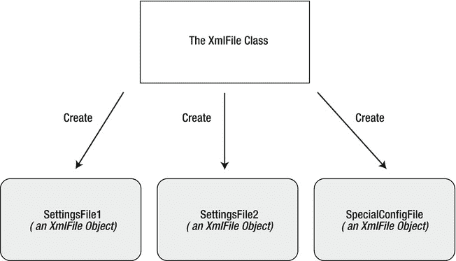
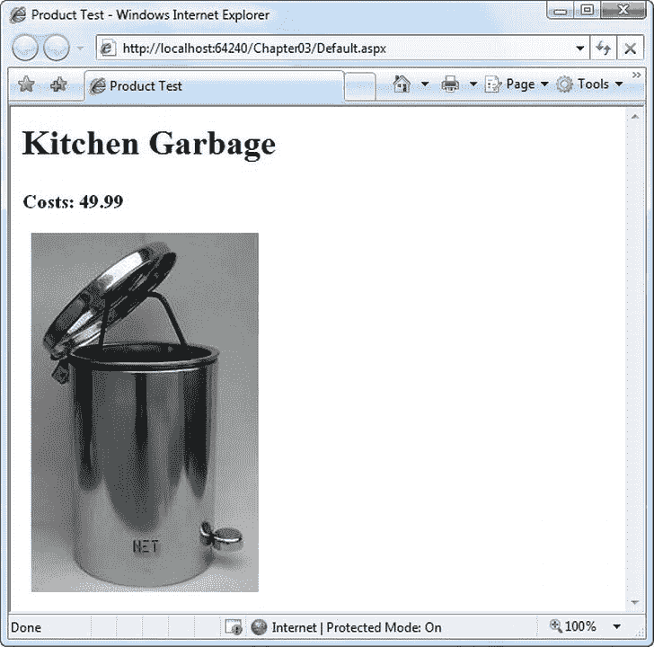
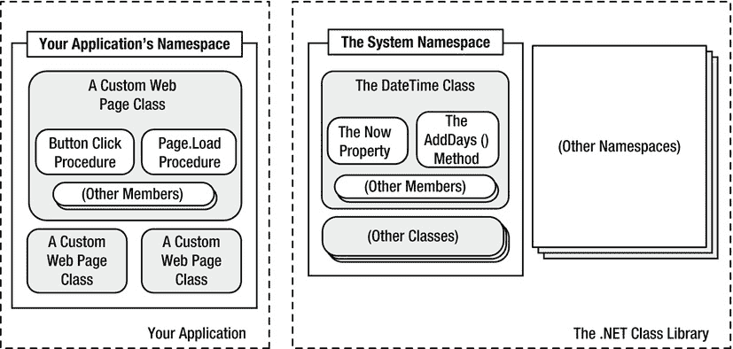
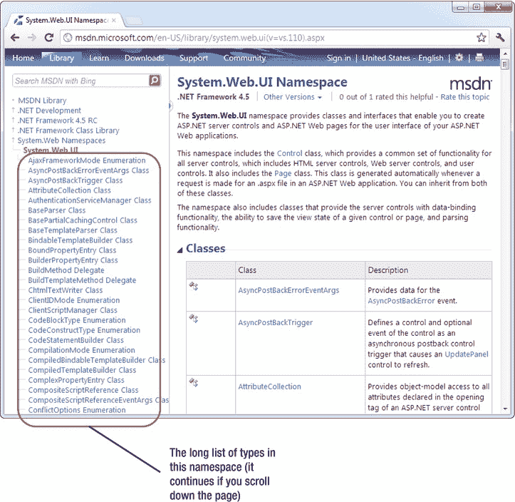
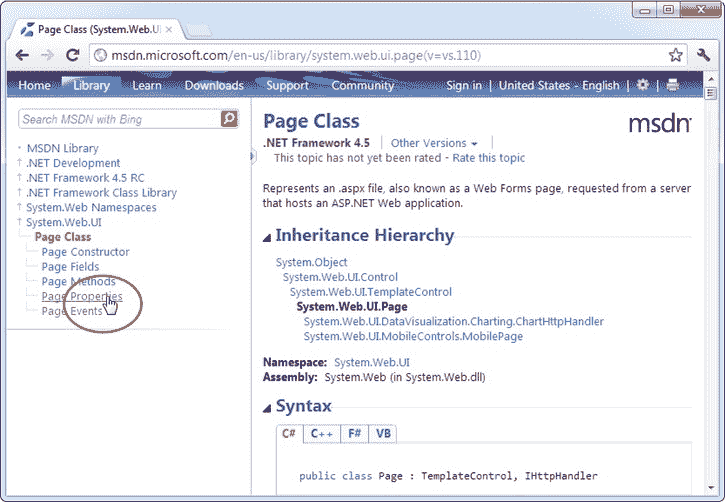

# 三、类型，对象，以及名称空间

。NET 都是关于对象的。不仅如此。NET 不允许你使用它们，它要求你使用它们。在某种程度上，您将用来创建 web 应用的几乎每种成分都是一种对象。在这一章中，你将学习如何定义对象以及如何在你的代码中操作它们。总之，这些概念是通常所说的*面向对象编程*的基础。

那么，你需要了解多少面向对象编程来编写 ASP.NET 网页呢？这要看你是想按照已有的例子剪贴代码样本还是对方式有更深的理解。NET 工作并获得更多的控制权。这本书假设，如果你愿意拿起一本 1000 页的书，那么你就是那种擅长理解事物工作方式和原因的程序员。它还假设你对一些高级 ASP.NET 编程任务感兴趣，这些任务*将*需要基于类的设计，比如创建你自己的数据库组件(参见[第 22 章](22.html))。

本章从。NET 框架。它没有重复典型的面向对象理论，因为无数优秀的编程书籍都涉及了这个主题。相反，您将看到对象的类型。NET 允许，它们是如何构造的，以及它们如何适应更大的命名空间和程序集框架。

关于类的基础知识

当你开始成为一名开发人员时，*类*是你首先遇到的概念之一。从技术上讲，类是对象的代码定义。一个类的好处是你可以用它来创建你需要的任意多的对象。例如，您可能有一个表示 XML 文件的类，该文件可用于读取一些数据。如果你想一次访问多个 XML 文件，你可以创建你的类的几个实例，如图[图 3-1](#Fig1) 所示。这些实例被称为*对象*。



[图 3-1](#_Fig1) 。类用于创建对象

 **注意**最简单的来说，*面向对象编程*的思想是你的代码应该被组织成单独的类。如果仔细遵循，这种方法会使代码更容易修改、增强、调试和重用。

在三个关键因素的帮助下，类之间相互作用:

*   *属性* : 属性允许你访问一个对象的数据。有些属性是只读的，因此不能修改，而有些属性可以更改。例如，前一章演示了如何使用 String 对象的只读长度属性来找出字符串中的字母数。
*   *方法* : 方法允许你对一个对象执行一个动作。与属性不同，方法用于执行特定任务或可能显著更改对象状态的操作。例如，要打开到数据库的连接，可以在 connection 对象中调用 open()方法。
*   *事件* : 事件提供了某件事情已经发生的通知。如果您曾经编写过现代的 Windows 应用，您应该知道控件如何激发事件来触发您的代码。例如，如果用户单击一个按钮，button 对象将触发一个 Click 事件，您的代码可以对该事件做出反应。同样的模式也适用于 ASP.NET 网页中的 web 控件，尽管有一些限制(你将在第五章的[中了解到)。](05.html)

此外，类包含它们自己的代码和内部私有数据集。类的行为就像“黑盒”，这意味着当你使用一个对象时，你不应该浪费时间去想它是如何工作的，或者它使用了什么样的底层信息。相反，你只需要担心一个类的*公共接口*，它是可供你使用的属性、方法和事件的集合。这些元素一起被称为类*成员*。

在 ASP.NET，您将创建自己的自定义类来表示各个网页。此外，如果您设计单独的组件，您将创建自定义类。但是，在大多数情况下，您将使用。NET 类库，而不是自己编程。

静态成员

其中一个诀窍是。NET 类的一个问题是，你实际上是以两种方式使用它们的。您可以使用一些类成员，而无需先创建对象。这些被称为*静态*成员，它们通过类名来访问。例如，DateTime 类型提供一个名为 Now 的静态属性。您可以使用完整的成员名称 DateTime.Now 随时访问该属性。您不需要首先创建 DateTime 对象。

另一方面，大多数 DateTime 成员需要有效的实例。例如，如果没有有效的对象，就不能使用 AddDays()方法或 Hour 属性。如果没有一个活动的对象和一些有效的数据，这些*实例*成员就没有任何意义。

下面的代码片段使用静态和实例成员:

```cs
// Get the current date using a static property.
// Note that you need to use the class name DateTime.
DateTime myDate = DateTime.Now;
```

```cs
// Use an instance method to add a day.
// Note that you need to use the object name myDate.
myDate = myDate.AddDays(1);
```

```cs
// The following code makes no sense.
// It tries to use the instance method AddDays() with the class name DateTime!
myDate = DateTime.AddDays(1);
```

属性和方法都可以被指定为静态的。静态属性和方法是。NET 框架，在本书中你会经常用到它们。有些类可能完全由静态成员组成(比如上一章中展示的 Math 类)，有些可能只使用实例成员。其他类，如 DateTime，提供了两者的组合。

下一个例子引入了一个基类，它将只使用实例成员。这是最常见的设计，也是一个很好的起点。

一个简单的类

要创建一个类，必须使用特殊的块结构来定义它:

```cs
public class MyClass
{
    // Class code goes here.
}
```

您可以在同一个文件中定义任意数量的类。然而，良好的编码实践表明，在大多数情况下，每个类使用一个文件。

阶级以多种形式存在。它们可能代表现实世界中的真实事物(正如它们在大多数编程教科书中所做的那样)，它们可能代表某种编程抽象(如矩形或颜色结构)，或者它们可能只是对相关功能进行分组的一种便捷方式(如 Math 类)。决定一个类应该代表什么，并将代码分解成一组相互关联的类，这是编程艺术的一部分。

构建一个基础类

在下一个例子中，您将看到如何一点一点地构建一个. NET 类。这个类将代表一个电子商务公司目录中的产品。Product 类将存储产品数据，它将包含生成在网页上显示产品的 HTML 块所需的内置功能。当这个类完成时，您将能够使用一个示例 ASP.NET 测试页面来使用它。

定义了一个类之后，第一步是添加一些基本数据。下一个示例定义了三个存储产品信息的成员变量，即产品名称、价格和指向图像文件的 URL:

```cs
public class Product
{
    private string name;
    private decimal price;
    private string imageUrl;
}
```

局部变量只在当前方法结束之前存在。另一方面，*成员变量*(或*字段*)被声明为类的一部分。它对类中的所有方法都可用，只要包含它的对象存在，它就存在。

当你创建一个成员变量时，你设置它的*可访问性*。可访问性决定了代码的其他部分是否能够读取和修改这个变量。例如，如果 ClassA 包含一个私有变量，ClassB 中的代码将无法读取或修改它。只有 ClassA 中的代码才有这种能力。另一方面，如果 ObjectA 有一个公共变量，应用中的任何其他对象都可以自由地读取和修改它包含的信息。局部变量不支持任何可访问性关键字，因为除了当前过程之外，任何代码都无法使用它们。一般来说，在一个简单的 ASP.NET 应用中，大多数变量都是私有的，因为大部分代码都自包含在一个网页类中。然而，当您开始创建单独的组件来重用功能时，可访问性变得更加重要。[表 3-1](#Tab1) 解释了您可以使用的访问级别。

[表 3-1。](#_Tab1)辅助功能关键字

| 关键字 | 易接近 |
| --- | --- |
| `public` | 可以被任何类访问 |
| `private` | 只能由当前类中的成员访问 |
| `internal` | 可由当前程序集中任何类的成员访问(包含编译代码的文件) |
| `protected` | 可以由当前类或从该类继承的任何类中的成员访问 |
| `protected internal` | 可以由当前应用中的成员访问(与内部应用一样)*和*由从该类继承的任何类中的成员访问 |

可访问性关键字不仅仅适用于变量。它们也适用于方法、属性和事件，所有这些都将在本章中探讨。

 **提示**按照惯例，你的类的所有公共块(类名、公共事件、属性和过程等等)都应该使用 *Pascal case* 。这意味着名字以首字母大写开始。(函数名 DoSomething()是 Pascal case 的一个例子。)另一方面，私有成员可以使用您想要的任何案例。通常私人会员会采用*骆驼案*。这意味着名称以小写字母开头。(变量名 myInformation 是 camel case 的一个例子。)有些开发人员以 _ 或 m_(代表*成员*)开始所有私有成员名，尽管这纯粹是一种约定。

创建对象

创建对象时，需要指定`new`关键字。`new`关键字*实例化*对象，这意味着它抓取一块内存并在那里创建对象。如果你为你的对象声明了一个变量，但是没有使用`new`关键字来实例化它，当你试图使用你的对象时，你会收到臭名昭著的“空引用”错误。这是因为你试图使用的对象并不存在，你的变量根本没有指向任何东西。

以下代码片段基于产品类创建一个对象，然后释放它:

```cs
Product saleProduct = new Product();
```

```cs
// Optionally you could do this in two steps:
// Product saleProduct;
// saleProduct = new Product();
```

```cs
// Now release the object from memory.
saleProduct = null;
```

英寸 NET 中，您几乎不需要使用最后一行来释放对象。这是因为当适当的变量超出范围时，对象会被自动释放。(记住，当你的代码不能再访问一个变量时，这个变量就超出了作用域。例如，当您在方法中定义了一个变量，而该方法结束时，就会发生这种情况。当您在另一个块结构中定义一个变量时也会发生这种情况——比方说，一个条件`if`块或一个循环——并且该块结束。)

当应用结束时，对象也会被释放。在 ASP.NET 网页中，你的应用只有几秒钟的生存时间。网页呈现为 HTML 后，应用结束，所有对象自动释放。

 **提示**仅仅因为一个对象被释放并不意味着它使用的内存会被立即回收。CLR 使用一个长期运行的服务(称为*垃圾收集*)，该服务定期扫描释放的对象并回收它们持有的内存。

在某些情况下，您可能想要声明一个对象变量，而不使用`new`关键字来创建它。例如，您可能希望将一个已经存在的实例分配给对象变量。或者，您可能会收到一个活动对象作为函数的返回值。下面的代码显示了一个这样的示例:

```cs
// Declare but don't create the product.
Product saleProduct;
```

```cs
// Call a function that accepts a numeric product ID parameter,
// and returns a product object.
saleProduct = FetchProduct(23);
```

一旦理解了这个概念，就可以将这段代码压缩成一条语句:

```cs
Product saleProduct = FetchProduct(23);
```

在这些情况下，当你没有真正创建一个对象时，你不应该使用`new`关键字。

添加属性

简单的产品类本质上是无用的，因为您的代码不能操作它。它的所有信息都是私有的，无法访问。其他类将无法设置或读取此信息。

为了克服这个限制，您可以将成员变量设为公共变量。不幸的是，这种方法可能会导致问题，因为它会让其他对象自由地更改一切，甚至允许它们应用无效或不一致的数据。相反，您需要添加一个“控制面板”,通过它您的代码可以安全地操作产品对象。您可以通过添加*属性访问器*来实现这一点。

访问者通常有两部分。`get`访问器允许您的代码从对象中检索数据。`set`访问器允许您的代码设置对象的数据。在某些情况下，您可能会省略其中的一部分，例如当您想要创建一个可以检查但不能修改的属性时。

访问器类似于任何其他类型的方法，因为您可以根据需要编写任意多的代码。例如，您的属性`set`访问器可能会引发一个错误，警告客户端代码无效数据，并阻止应用更改。或者，您的 property `set`访问器可以一次更改多个私有变量，从而确保对象的内部状态保持一致。在产品类示例中，不需要这种复杂性。相反，属性访问器只提供对私有变量的直接访问。例如，Name 属性只是获取或设置名为 *name* 的私有成员变量的值。

像类的任何其他公共部分一样，属性访问器应该以大写字母开头。这允许您为属性访问器和基础私有变量指定相同的名称，因为它们将具有不同的大小写，而 C# 是区分大小写的语言。(这是可以接受基于大写区分两个元素的少数情况之一。)另一种选择是在私有变量名前加上下划线或字符 *m_* (用于成员变量)。

```cs
public class Product
{
    private string name;
    private decimal price;
    private string imageUrl;
```

```cs
    public string Name
    {
        get
        {
            return name;
        }
        set
        {
            name = value;
        }
    }
```

```cs
    public decimal Price
    {
        get
        {
            return price;
        }
        set
        {
            price = value;
        }
    }
```

```cs
    public string ImageUrl
    {
        get
        {
            return imageUrl;
        }
        set
        {
            imageUrl = value;
        }
    }
}
```

 **注意**在您的属性设置器中，您通过使用`value`关键字来访问正在应用的值。本质上，`value`是一个自动传递给属性设置代码的参数。

客户端现在可以通过使用对象的属性和熟悉的点语法来创建和配置对象。例如，如果对象变量名为 saleProduct，则可以使用 saleProduct 设置产品名称。名称属性。这里有一个例子:

```cs
Product saleProduct = new Product();
saleProduct.Name = "Kitchen Garbage";
saleProduct.Price = 49.99M;
saleProduct.ImageUrl = "http://mysite/garbage.png";
```

您会注意到这个例子使用了一个 *M* 来表示文字数字 49.99 应该被解释为十进制值，而不是双精度值。

通常，属性访问器成对出现——也就是说，每个属性都有一个`get`访问器和一个`set`访问器。但情况并非总是如此。您可以创建可读取但不可设置的属性(称为*只读*属性)，在不太常见的情况下，您可以创建可设置但不可检索的属性(称为*只写*属性)。您所需要做的就是省去您不需要的访问器。下面是一个只读属性的例子:

```cs
public decimal Price
{
    get
    {
        return price;
    }
}
```

如果您想创建不直接对应于私有成员变量的属性，这种技术特别方便。例如，您可能希望使用表示计算值的属性，或者使用基于其他属性的属性。

使用自动属性

如果你有非常简单的属性——这些属性除了设置或获取私有成员变量的值之外什么也不做——你可以通过使用一个叫做*自动属性*的 C# 语言特性来简化你的代码。

自动属性是没有任何代码的属性。当您使用自动属性时，您声明了它，但是您没有为`get`和`set`访问器提供代码，也没有声明匹配的私有变量。相反，C# 编译器会为您添加这些细节。

因为 Product 类中的属性只是获取和设置成员变量，所以您可以用自动属性替换它们中的任何一个(或全部)。这里有一个例子:

```cs
public decimal Price
{
    get;
    set;
}
```

你不知道 C# 编译器在创建相应的私有成员变量时会选择什么名字。但是，这没关系，因为您永远不需要直接访问私有成员变量。相反，您将始终使用 public Price 属性。

为了节省更多的空间，您可以将自动属性的声明压缩为一行。下面是一个使用这种技术的完整的压缩产品类:

```cs
public class Product
{
    public string Name { get; set; }
    public decimal Price { get; set; }
    public string ImageUrl { get; set; }
}
```

自动属性的唯一缺点是，如果您想在事后添加一些更专门的代码，您需要将它们切换回普通属性。例如，您可能希望添加在设置属性时执行验证或引发事件的代码。

添加方法

当前的产品类完全由数据组成，这些数据由一小组属性公开。这种类型的类在应用中通常很有用。例如，您可以使用它将关于产品的信息从一个函数发送到另一个函数。然而，更常见的是将功能与数据一起添加到类中。这种功能采用方法的形式。

*方法*是构建在你的类中的简单命名的过程。当您在对象上调用方法时，该方法会做一些有用的事情，例如返回一些计算数据。在本例中，我们将向 Product 类添加一个 GetHtml()方法。该方法将根据 Product 对象中的当前数据返回一个表示 HTML 格式化块的字符串。这个 HTML 包含一个带有产品名称、产品价格的标题，以及一个显示相关产品图片的< img >元素。(你将在[第四章](04.html)中更深入地探索 HTML。)

```cs
public class Product
{
    // (Additional class code omitted for clarity.)
```

```cs
    public string GetHtml()
    {
        string htmlString;
        htmlString = "<h1>" + Name + "</h1><br />";
        htmlString += "<h3>Costs: " + Price.ToString() + "</h3><br />";
        htmlString += "";
        return htmlString;
    }
}
```

GetHtml()方法所做的只是读取私有数据，并以某种吸引人的方式对其进行格式化。你可以把这个 HTML 块放到一个网页上来代表产品。这实际上将该类作为一个用户界面类，而不是一个纯数据类或“业务对象”

添加构造函数

目前，产品类有一个问题。理想情况下，类应该确保它们总是处于有效状态。但是，除非您显式设置所有适当的属性，否则产品对象不会对应于有效的产品。如果您试图使用依赖于某些尚未提供的数据的方法，这可能会导致错误。要解决这个问题，您需要为您的类配备一个或多个构造函数。

一个*构造函数*是一个在类第一次被创建时自动运行的方法。在 C# 中，构造函数总是与类名同名。与普通方法不同，构造函数没有定义任何返回类型，甚至没有定义 void。

下一个代码示例显示了 Product 类的新版本。它添加了一个需要产品价格和名称作为参数的构造函数:

```cs
public class Product
{
    // (Additional class code omitted for clarity.)
```

```cs
    public Product(string name, decimal price)
    {
        // Set two properties in the class.
        Name = name;
        Price = price;
    }
}
```

下面是使用构造函数基于新产品类创建对象所需的代码示例:

```cs
Product saleProduct = new Product("Kitchen Garbage", 49.99M);
```

前面的代码比创建和初始化以前版本的产品类所需的代码要精简得多。在构造函数的帮助下，您可以创建一个产品对象，并在一行中用它需要的基本数据对其进行配置。

如果不创建构造函数，则为。NET 提供了一个默认的公共构造函数，它什么也不做。如果创建至少一个构造函数，则为。NET 不会提供默认构造函数。因此，在前面的示例中，Product 类只有一个构造函数，它是在代码中显式定义的。要创建一个产品对象，你*必须*使用这个构造函数。此限制防止客户端在没有指定所需的最低数据量的情况下创建对象:

```cs
// This will not be allowed, because there is
// no zero-argument constructor.
Product saleProduct = new Product();
```

 **注意**要创建一个类的实例，需要使用一个构造函数。前面的代码失败是因为它试图使用零参数构造函数，而该构造函数在 Product 类中并不存在。

您使用的大多数类都有需要参数的构造函数。与普通方法一样，构造函数可以用多个版本重载，每个版本提供一组不同的参数。

```cs
public class Product
{
    // (Additional class code omitted for clarity.)
```

```cs
    public Product(string name, decimal price)
    {
        Name = name;
        Price = price;
    }
```

```cs
    public Product(string name, decimal price, string imageUrl)
    {
        Name = name;
        Price = price;
        ImageUrl = imageUrl;
    }
}
```

创建对象时，可以根据现有信息选择最适合自己的构造函数。那个。NET Framework 类大量使用重载构造函数。

添加事件

类也可以使用事件来通知您的代码。要在 C# 中定义一个事件，必须首先创建一个委托，为将要使用的事件定义签名。下面的示例创建了一个没有参数和返回值的事件:

```cs
public delegate void PriceChangedEventHandler();
```

(如果你已经忘记了什么是代表，在继续之前，请翻回到第 2 章的结尾，以唤起你的记忆。)

一旦有了委托，就可以使用`event`关键字来定义基于该委托的事件。与属性和方法一样，事件可以用不同的可访问性来声明，尽管公共事件是默认的。通常，这是您想要的，因为您将使用事件来允许一个对象通知另一个对象，该对象是不同类的实例。

作为一个示例，Product 类示例已经通过 priceChanged 事件得到了增强，该事件在通过 Price 属性过程修改价格时发生。如果类中的代码在不通过属性过程的情况下更改基础 private 变量，则不会触发此事件:

```cs
// Define the delegate that represents the event.
public delegate void PriceChangedEventHandler();

```

```cs
public class Product
{
    // (Additional class code omitted for clarity.)
```

```cs
    // Define the event using the delegate.
    public event PriceChangedEventHandler PriceChanged;

```

```cs
    public decimal Price
    {
        get
        {
            return price;
        }
        set
        {
            price = value;
```

```cs
            // Fire the event, provided there is at least one listener.
            if (PriceChanged != null)
            {
                PriceChanged();
            }
        }
    }
}
```

要激发一个事件，你只需通过名字来调用它。但是，在触发事件之前，必须通过测试事件引用是否为空来检查是否至少存在一个订阅者。如果它不为空，则触发该事件是安全的。如果您试图在没有侦听器的情况下触发该事件，那么您的代码将会因运行时错误而脱轨。

很有可能你会创建几十个 ASP.NET 应用而没有定义一个自定义事件。然而，如果没有*处理*一个事件，你将很难编写一个 ASP.NET 网页。要处理一个事件，首先创建一个名为*事件处理程序*的方法。事件处理程序包含事件发生时应该执行的代码。然后将事件处理程序连接到事件。

来处理产品。PriceChanged 事件，您需要首先创建一个事件处理程序，通常将它放在另一个类中。事件处理程序需要与它正在处理的事件具有相同的签名。在产品示例中，PriceChanged 事件没有参数，因此事件处理程序看起来像下面显示的简单方法:

```cs
public void ChangeDetected()
{
    // This code executes in response to the PriceChanged event.
}
```

下一步是将事件处理程序与事件挂钩。为此，您可以使用一个简单的赋值语句，通过使用`+=`操作符将事件(PriceChanged)设置为事件处理方法(ChangeDetected ):

```cs
Product saleProduct = new Product("Kitchen Garbage", 49.99M);
```

```cs
// This connects the saleProduct.PriceChanged event to an event-handling
// procedure called ChangeDetected.
// Note that ChangedDetected needs to match the PriceChangedEventHandler
// delegate.
saleProduct.PriceChanged += ChangeDetected;
```

```cs
// Now the event will occur in response to this code:
saleProduct.Price = saleProduct.Price * 2;
```

此代码将一个事件处理程序附加到一个名为 ChangeDetected 的方法。这个方法与这里显示的事件连接代码在同一个类中，因此当你附加事件处理程序时，你不需要指定对象名。如果要将一个事件连接到不同的对象，在引用事件处理程序方法时需要使用点语法，如 myObject.ChangeDetected。

值得注意的是，如果您使用的是 Visual Studio，您根本不需要为 web 控件手动挂接事件处理程序。相反，Visual Studio 可以添加连接您创建的所有事件处理程序所需的代码。

ASP.NET 使用*事件驱动的*编程模型，所以你很快就会习惯编写对事件做出反应的代码。但是，除非您正在创建自己的组件，否则您不需要触发自己的自定义事件。关于自定义事件有意义的例子，请参考[第 11 章](11.html)，其中讨论了如何将事件添加到你创建的用户控件中。

 **提示**你也可以通过使用`-=`操作符而不是`+=`来分离事件处理程序。

测试产品类别

为了进一步了解 Product 类的工作原理，创建一个简单的 web 页面会有所帮助。这个 web 页面将创建一个产品对象，获取它的 HTML 表示，然后在 web 页面中显示它。要尝试此示例，您需要使用 Chapter03\Website 文件夹中的在线示例附带的三个文件:

*   *Product.cs* :该文件包含产品类的代码。它位于 Chapter03\Website\App_Code 子文件夹中，这使得 ASP.NET 可以自动编译它。
*   Garbage.jpg:这是产品类将使用的图像。
*   *Default.aspx* :这个文件包含使用 Product 类的 web 页面代码。

测试这个示例最简单的方法是使用 Visual Studio。以下是执行测试所需的步骤:

1.  启动 Visual Studio。
2.  从菜单中选择文件打开网站。
3.  在“打开网站”对话框中，浏览到 Chapter03 文件夹，双击它，选择其中的网站文件夹，然后单击“打开”。
4.  选择调试不调试启动网站。Visual Studio 将使用默认浏览器打开一个新窗口，并导航到 Default.aspx 页。

当 Default.aspx 页执行时，它创建一个新的产品对象，对其进行配置，并使用 GetHtml()方法。使用响应将 HTML 写入网页。Write()方法。代码如下:

```cs
<%@ Page Language="C#" %>
<script runat="server">
    private void Page_Load(object sender, EventArgs e)
    {
        Product saleProduct = new Product("Kitchen Garbage", 49.99M, "garbage.jpg");
        Response.Write(saleProduct.GetHtml());
    }
</script>
```

```cs
<html>
    <head>
        <title>Product Test</title>
    </head>
    <body></body>
</html>
```

 [图 3-2](#Fig2) 显示了你将要看到的网页。



[图 3-2](#_Fig2) 。由产品对象生成的输出

有趣的是，GetHtml()方法类似于 ASP.NET web 控件的工作方式，但在更原始的层面上。要使用 ASP.NET 控件，需要创建一个对象(显式或隐式)并配置一些属性。然后，ASP.NET 通过检查所有这些对象并请求它们的关联 HTML(通过调用一个隐藏的 GetHtml()方法或通过做一些概念上类似的事情 [<sup>1</sup>](#Fn1) )来自动创建一个网页。然后，它将完成的页面发送给用户。最终的结果是你处理对象，而不是直接处理原始的 HTML 代码。

使用 web 控件时，您只能看到由属性、方法和事件组成的公共接口。然而，理解类代码实际上是如何工作的将帮助你掌握高级开发。

既然您已经看到了类的基础知识和如何使用类的演示，现在是时候介绍一些关于。NET 对象并重温在前一章中介绍的基本数据类型。

值类型和引用类型

在第 2 章中，你学习了简单的数据类型，比如字符串和整数，实际上是从类库中创建的对象。这允许一些令人印象深刻的技巧，如内置的字符串处理和日期计算。然而，简单数据类型在一个重要方面不同于更复杂的对象:简单数据类型是*值类型、*，而类是*引用类型。*

这意味着简单数据类型的变量包含您放入其中的实际信息(如数字 7)。另一方面，对象变量存储一个引用，该引用指向内存中存储整个对象的位置。在大多数情况下，。NET 将你从这个底层的现实中屏蔽出来，在许多编程任务中你不会注意到这种区别。但是，在三种情况下，您会注意到对象变量的行为与普通数据类型略有不同:在赋值操作中，在比较操作中，以及在传递参数时。

赋值操作

当您将一个简单数据变量分配给另一个简单数据变量时，该变量的内容将被复制:

```cs
integerA = integerB; // integerA now has a copy of the contents of integerB.
                     // There are two duplicate integers in memory.
```

引用类型的工作方式略有不同。引用类型倾向于处理大量的数据。复制引用类型对象的全部内容会降低应用的速度，尤其是在执行多重赋值的时候。由于这个原因，当你分配一个引用类型时，你复制的是*指向*对象的引用，而不是完整的对象内容:

```cs
// Create a new Product object.
Product productVariable1 = new Product("Kitchen Garbage", 49.99M);
```

```cs
// Declare a second variable.
Product productVariable2;
productVariable2 = productVariable1;
```

```cs
// productVariable1 and productVariable2 now both point to the same thing.
// There is one object and two ways to access it.
```

这种行为的后果是深远的。此示例使用 productVariable2 修改产品对象:

```cs
productVariable2.Price = 25.99M;
```

您会发现 productVariable1。价格也定为 25.99。当然，这只是因为 productVariable1 和 productVariable2 是指向同一个内存中对象的两个变量才有意义。

如果你真的想要复制一个对象(不是一个引用)，你需要创建一个新的对象，然后初始化它的信息来匹配第一个对象。有些对象提供了 Clone()方法，允许您轻松地复制对象。数据集就是一个例子，它用于存储数据库中的信息。

相等测试

当比较两个变量时，引用类型和值类型之间也会出现类似的区别。当您比较值类型(如整数)时，您正在比较内容:

```cs
if (integerA == integerB)
{
    // This is true as long as the integers have the same content.
}
```

当您比较引用类型变量时，您实际上是在测试它们是否是同一个实例。换句话说，您测试的是引用是否指向内存中的同一个对象，而不是它们的内容是否匹配:

```cs
if (productVariable1 == productVariable2)
{
    // This is true if both productVariable1 and productVariable2
    // point to the same thing.
    // This is false if they are separate, yet identical, objects.
}
```

 **注**这个规律有一个特殊的例外。当类覆盖了`==`操作符时，它们可以改变它执行的比较类型。这种技术在。NET 是字符串类。有关更多信息，请阅读“审阅”一节。NET 类型”。

通过引用和值传递参数

您可以创建三种方法参数。标准型是*传值型*。当使用按值传递参数时，该方法接收参数数据的副本。这意味着如果方法修改了参数，这种改变不会影响调用该方法的代码。默认情况下，所有参数都是按值传递的。

第二种类型的参数是*按引用传递*。通过引用传递，该方法直接访问参数值。如果方法更改了按引用传递参数的值，原始对象也会被修改。

为了更好地理解区别，考虑下面的代码，它展示了一个使用名为 *number* 的参数的方法。这段代码使用了`ref`关键字来指示 number 应该通过引用来传递。当方法修改此参数(将其乘以 2)时，调用代码也会受到影响:

```cs
private void ProcessNumber(ref int number)
{
    number *= 2;
}
```

以下代码片段显示了调用 ProcessNumber()方法的效果。注意，在方法中定义参数和调用方法时，需要指定`ref`关键字。这表明您意识到参数值可能会改变:

```cs
int num = 10;
ProcessNumber(ref num);        // Once this call completes, Num will be 20.
```

如果不包含`ref`关键字，当您试图编译代码时，将会得到一个错误。

当使用值类型(如整数)时，按值传递和按引用传递的工作方式很简单。但是，如果您使用引用类型，如产品对象或数组，您将不会看到这种行为。原因是参数中没有传递整个对象。取而代之的是，只传输*参考*。这对于大型对象来说效率更高(省去了复制一大块内存的麻烦)，但是这并不总是会导致您所期望的行为。

当您使用标准的按值传递机制时，会出现一个值得注意的奇怪现象。在这种情况下，按值传递不会创建对象的副本，但会创建*引用*的副本。这个引用仍然指向同一个内存中的对象。这意味着，例如，如果您将一个产品对象传递给一个方法，该方法将能够改变您的产品对象，而不管您是使用按值传递还是按引用传递。(唯一的限制是，如果你使用传值，你将不能*改变*引用——例如，用你创建的一个全新的对象替换它。)

C# 还支持第三种类型的参数:输出参数。要使用输出参数，请在参数声明前加上关键字`out`。输出参数通常用作从单个方法返回多条信息的方式。

当您使用输出参数时，调用代码可以将未初始化的变量作为参数提交，否则这是被禁止的。这种方法不适合 ProcessNumber()方法，因为它读取提交的参数值(然后将其加倍)。另一方面，如果方法使用参数只是为了返回信息，您可以使用`out`关键字，如下所示:

```cs
private void ProcessNumber(int number, out int doubled, out int tripled)
{
    doubled = number * 2;
    tripled = number * 3;
}
```

请记住，输出参数是专为向调用代码返回信息的方法而设计的。事实上，该方法不允许检索一个`out`参数的值，因为它可能未初始化。该方法可以采取的唯一操作是设置输出参数。

下面是一个如何调用改进后的 ProcessNumber()方法的示例:

```cs
int num = 10;
int doubled, tripled;
ProcessNumber(num, out doubled, out tripled);
```

复习中。网络类型

到目前为止，讨论主要集中在简单的数据类型和类上。那个。NET 类库实际上由*个类型组成，*是一个包含几个类似对象的亲戚的总称:

*   *类*:这是。NET 框架。字符串和数组是。NET 类，尽管您可以轻松地创建自己的类。
*   *结构*:结构和类一样，可以包括字段、属性、方法和事件。与类不同，它们是值类型，这改变了它们处理赋值和比较操作的方式。结构也缺少一些更高级的类特性(比如继承)，通常更简单、更小。整数、日期和字符都是结构。
*   *枚举*:枚举定义了一组带有描述性名称的整数常量。在前一章中已经介绍了枚举。
*   委托:委托是一个函数指针，它允许你间接地调用一个过程。委托是。NET 事件处理，在前一章已经介绍过了。
*   接口:它们定义了一个类必须遵守的契约。接口是面向对象编程的一种高级技术，在标准化对象如何交互时非常有用。本书不讨论接口。

有时，一个类可以重写它的行为，以表现得更像一个值类型。例如，字符串类型是一个全功能类，而不是一个简单的值类型。(这是使字符串有效所必需的，因为它们可以包含可变数量的数据。)但是，字符串类型重写其相等和赋值操作，以便这些操作像简单值类型的操作一样工作。这使得字符串类型以程序员直觉期望的方式工作。另一方面，数组是完全的引用类型。如果将一个数组变量赋给另一个数组变量，则复制的是引用，而不是数组(尽管 array 类也提供了一个 Clone()方法，该方法返回一个重复的数组以允许真正的复制)。

表 3-2 澄清了事实，并解释了几种常见的类型。

[表 3-2](#_Tab2) 。常见引用和值类型

| 数据类型 | 自然 | 行为 |
| --- | --- | --- |
| Int32、Decimal、Single、Double 和所有其他基本数字类型 | 值类型 | 相等和赋值操作处理变量内容，而不是引用。 |
| 日期时间、时间跨度 | 值类型 | 相等和赋值操作处理变量内容，而不是引用。 |
| 字符、字节和布尔 | 值类型 | 相等和赋值操作处理变量内容，而不是引用。 |
| 线 | 参考类型 | 相等和赋值操作似乎是处理变量内容，而不是引用。 |
| 排列 | 参考类型 | 相等和赋值操作处理引用，而不是内容。 |

了解命名空间和程序集

不管你一开始是否意识到。NET 存在于. NET 类型(通常是类)中。反过来，每个类型都存在于一个命名空间中。[图 3-3](#Fig3) 显示了你自己的代码和日期时间类的安排。请记住，这是一种极端的简化——仅 System 名称空间就有数百个类。该图仅用于向您展示组织的层次。



[图 3-3](#_Fig3) 。看一看两个名称空间

命名空间可以组织类库中所有不同的类型。如果没有名称空间，这些类型将被分组到一个又长又乱的列表中。这种组织对于少量的信息来说是可行的，但是对于. NET 中包含的成千上万的类型来说就不切实际了。

这本书的许多章节向你介绍新的。NET 类和命名空间。例如，在关于 web 控件的章节中，您将学习如何使用系统中的对象。Web.UI 命名空间。在关于 web 服务的章节中，您将学习系统中的类型。Web.Services 命名空间。对于数据库，你会求助于系统。数据命名空间。事实上，您已经了解了一点关于名称空间的知识:基本的系统名称空间，它包含了前一章中解释的所有简单数据类型。

在你完成这本书之后，要继续你的探索，你需要去微软 MSDN 网站上的类库参考。它煞费苦心地记录了每个名称空间中每个类的属性、方法和事件。

要浏览类库参考，请在页面的名称空间部分向下滚动名称空间列表。找到要调查的名称空间后，单击其名称。当您这样做时，会出现一个新的页面，其中包含该名称空间中所有类的列表。[图 3-4](#Fig4) 显示了您将在系统中看到的内容。Web.UI 命名空间。



[图 3-4](#_Fig4) 。在线类库参考

接下来，单击一个类名(例如 Page)。现在，页面显示了页面类的概述和附加链接，让您可以查看不同类型的类成员([图 3-5](#Fig5) )。例如，单击“页面属性”查看页面类的所有属性，或单击“页面事件”浏览其事件。



[图 3-5](#_Fig5) 。浏览特定类的成员

使用名称空间

通常，当您编写 ASP.NET 代码时，您将只使用 Visual Studio 自动创建的命名空间。然而，如果你想把你的代码组织成多个名称空间，你可以使用一个简单的块结构来定义名称空间，如下所示:

```cs
namespace MyCompany
{
    namespace MyApp
    {
        public class Product
        {
            // Code goes here.
        }
    }
}
```

在前面的示例中，产品类位于 MyCompany.MyApp 命名空间中。此命名空间中的代码可以通过名称访问产品类。它之外的代码需要使用完全限定名，如 MyCompany.MyApp.Product。这确保您可以使用来自各种第三方开发人员的组件，而不用担心名称冲突。如果这些开发人员遵循推荐的命名标准，他们的类将总是位于使用他们公司和软件产品名称的命名空间中。一个类的完全限定名几乎肯定是唯一的。

名称空间没有 accessibility 关键字，可以嵌套任意多层。嵌套纯粹是装饰性的，例如，在前面的示例中，MyCompany 名称空间和 MyApp 名称空间之间不存在特殊的关系。事实上，您可以创建名称空间 MyCompany。完全不使用嵌套的 MyApp，使用以下语法:

```cs
namespace MyCompany.MyApp
{
    public class Product
    {
        // Code goes here.
    }
}
```

您可以在不同的代码文件中声明相同的命名空间。事实上，不止一个项目甚至可以使用同一个名称空间。名称空间实际上只不过是一个方便的逻辑容器，可以帮助您组织您的类。

导入名称空间

必须键入长的、完全限定的名称肯定会使您的手指疲劳，并创建过于冗长的代码。为了压缩代码，标准的做法是导入想要使用的名称空间。导入命名空间后，不需要为它包含的任何类型键入完全限定的名称。相反，您可以使用该命名空间中的类型，就像它们是在本地定义的一样。

要导入名称空间，可以使用`using`语句。这些语句必须出现在代码文件的第一行，在任何命名空间或块结构之外:

```cs
using MyCompany.MyApp;
```

考虑不导入名称空间的情况:

```cs
MyCompany.MyApp.Product salesProduct = new MyCompany.MyApp.Product(. . .);
```

当您导入 MyCompany 时，它更易于管理。MyApp 命名空间。当您这样做时，可以使用以下语法:

```cs
Product salesProduct = new Product(. . .);
```

导入名称空间实际上只是为了方便。这对应用的性能没有影响。事实上，无论是否使用名称空间导入，编译后的 IL 代码看起来都是一样的。这是因为当语言编译器生成 EXE 或 DLL 文件时，它会将相对类引用转换为完全限定的类名。

简化的对象创建

即使选择不导入名称空间，也可以压缩声明对象变量并实例化它的任何语句。诀窍是使用你在第二章的[中学到的`var`关键词。](02.html)

例如，您可以替换以下语句:

我公司。MyApp . Product sales Product = new my company。MyApp . Product()；

有了这个:

**var**sales product = new my company。myapp . product()；

这是因为编译器可以根据您使用`new`关键字创建的对象来确定 salesProduct 变量的正确数据类型。最棒的是，这条语句和非`var`方法一样易读，因为它仍然清楚您正在创建什么类型的对象。

当然，如果编译器不能确定您想要的对象类型，这种技术就不起作用。因此，这两种语句都是不允许的:

var salesproductinvalid 1；
var sales product invalid 2 = null；

此外，`var`技巧仅限于局部变量。在声明类的成员变量时不能使用它。

使用程序集

您可能想知道是什么赋予了您在. NET 程序中使用类库命名空间的能力。它们是直接硬连线到语言中的吗？事实是。NET 类包含在*程序集*中。汇编是包含编译代码的物理文件。通常，程序集文件的扩展名为。如果它们是独立的应用，则为。如果它们是可重用的组件。

 **提示**了。dll 扩展也用于需要由另一种类型的程序执行(或由托管的*)的代码。当您的 web 应用被编译时，它被转换成一个 DLL 文件，因为您的代码并不代表一个独立的应用。相反，ASP.NET 引擎会在收到 web 请求时执行它。*

您可以找到。NET Framework 放在 C:\Windows\Assembly 文件夹中。(从技术上讲，程序集位于 C:\Windows\Assembly 文件夹的*子目录*中，这允许。NET 来管理版本。但是，Windows 资源管理器隐藏了这一事实。)

程序集和命名空间之间不存在严格的关系。一个程序集可以包含多个命名空间。相反，多个程序集文件可以在同一个命名空间中包含类。从技术上讲，名称空间是对类进行分组的一种逻辑方式。然而，程序集是分发代码的一个*物理*包。

那个。NET 类实际上包含在许多程序集中。例如，System 命名空间中的基本类型来自 mscorlib.dll 程序集。许多 ASP.NET 类型在 System.Web.dll 集会中被发现。此外，您可能希望使用其他第三方程序集。通常，程序集和命名空间具有相同的名称。例如，您会发现命名空间系统。汇编文件 System.Web.dll 中的 Web。然而，这是一种便利，而不是一种要求。

编译应用时，需要告诉语言编译器该应用使用了哪些程序集。默认情况下，大范围的。NET 程序集自动可供 ASP.NET 应用使用。如果需要使用其他程序集，需要在网站的配置文件中定义它们。Visual Studio 使这一过程变得无缝，允许您使用网站上的 Add Reference 命令向配置文件添加程序集引用。您将在第 22 章中使用[添加引用命令。](22.html)

高级类编程

面向对象编程艺术的一部分是确定对象关系。例如，您可以创建包含 ProductFamily 对象的 Product 对象或包含四个 Wheel 对象的 Car 对象。要创建这种对象关系，您需要做的就是在类中定义适当的变量或属性。这种类型的关系被称为*遏制*(或*聚合* ) 。

例如，下面的代码显示了一个 ProductCatalog 类，它包含一个 Product 对象数组:

```cs
public class ProductCatalog
{
    private Product[] products;

```

```cs
    // (Other class code goes here.)
}
```

在 ASP.NET 编程中，你会发现被称为*集合* 的特殊类，除了对各种对象进行分组之外，它们没有其他用途。有些集合还允许您使用唯一的名称来排序和检索对象。在前一章中，你看到了一个系统中的数组列表的例子。集合命名空间，它提供一个可动态调整大小的数组。下面是使用 ArrayList 修改 ProductCatalog 类的方法:

```cs
public class ProductCatalog
{
    private ArrayList products = new ArrayList();

```

```cs
    // (Other class code goes here.)
}
```

这种方法有利有弊。它使得在列表中添加和删除条目变得更加容易，但是它也去除了有用的错误检查，因为 ArrayList 支持任何类型的对象。在本章的后面(在“泛型”一节中)你会学到更多关于这个问题的知识。

此外，类可以有不同类型的关系，称为*继承。*

遗产

*继承*是代码重用的一种形式。它允许一个类获得并扩展另一个类的功能。例如，您可以创建一个名为 TaxableProduct 的类，它从 Product 继承(或*派生*)。TaxableProduct 类将获得 Product 类的所有相同的字段、方法、属性和事件。(然而，它不会继承构造函数。)然后，您可以添加与税收相关的其他成员。

下面的示例添加了一个名为 TotalPrice 的只读属性:

```cs
public class TaxableProduct : Product
{
    private decimal taxRate = 1.15M;
```

```cs
    public decimal TotalPrice
    {
        get
        {
            // The code can access the Price property because it's
            // a public part of the base class Product.
            // The code cannot access the private price variable, however.
            return (Price * taxRate);
        }
    }
```

```cs
    // Create a three-argument constructor that calls the three-argument constructor
    // from the Product class.
    public TaxableProduct(string name, decimal price, string imageUrl) :
     base(name, price, imageUrl)
    { }
}
```

这个例子中有一个有趣的问题。有了继承，构造函数永远不会被继承。但是，您仍然需要一种方法来初始化继承的细节(在本例中，就是 Name、Price 和 ImageUrl 属性)。

处理这个问题的唯一方法是在你的派生类(TaxableProduct)中添加一个构造函数，通过使用`base`关键字调用基类(Product)中正确的构造函数。在前面的示例中，TaxableProduct 类使用了这种技术。它包括一个构造函数，需要熟悉的三个参数，并从 Product 类调用相应的三参数构造函数来初始化 Name、Price 和 ImageUrl 属性。TaxableProduct 构造函数不包含任何额外的代码，但它可以；例如，您可以使用它来初始化特定于派生类的其他详细信息。

继承并没有你想象的那么有用。在普通的应用中，大多数类使用包含和其他关系来代替继承，因为继承会使生活变得不必要的复杂，而不会带来很多好处。丹.阿普曼是一位著名的。NET 程序员曾将继承描述为“你几乎不会用到的最酷的特性”

然而，在 ASP.NET，你至少会在一个地方看到遗传在起作用。继承允许您创建一个自定义类，该类继承。NET 类库。例如，当您创建一个自定义 web 窗体时，您从一个基本的 Page 类继承来获得标准的功能集。

基于类的继承编程有更多微妙之处。例如，您可以重写基类的某些部分，防止类被继承，或者创建一个必须用于继承而不能直接创建的类。然而，这些主题并不包含在本书中，它们也不是构建 ASP.NET 应用所必需的。有关这些语言特性的更多信息，请查阅涵盖 C# 语言的更详细的书籍，例如 Andrew Troelsen 的 *Pro C# 和。NET 4.5 框架* (Apress，2012)。

静态成员

本章的开头介绍了静态属性和方法的概念，它们可以在没有活动对象的情况下使用。静态成员通常用于提供与对象相关的有用功能。那个。NET 类库大量使用了这种技术(和系统一样。上一章探讨的数学课)。

静态成员有各种各样的可能用途。有时它们提供支持类的基本转换和实用函数。要创建一个静态属性或方法，只需要在 accessibility 关键字之后使用`static`关键字。

以下示例显示了包含静态 TaxRate 属性和私有变量的 TaxableProduct 类。这意味着税率信息只有一个副本，并且适用于所有可征税产品对象:

```cs
public class TaxableProduct : Product
{
    // (Additional class code omitted for clarity.)
```

```cs
    private static decimal taxRate = 1.15M;
```

```cs
    // Now you can call TaxableProduct.TaxRate, even without an object.
    public static decimal TaxRate
    {
        get
        { return taxRate; }
        set
        { taxRate = value; }
    }
}
```

 **注意**这个版本的 TaxableProduct 类仍然包含了上一节中添加的细节(比如 TotalPrice 属性和三参数构造函数)。他们只是被排除在清单之外，以专注于新添加的细节。

现在，您可以直接从类中检索税率信息，而无需先创建对象:

```cs
// Change the TaxRate. This will affect all TotalPrice calculations for any
// TaxableProduct object.
TaxableProduct.TaxRate = 1.24M;
```

静态数据与对象的生命周期无关。事实上，它在整个应用的生命周期中都是可用的。这意味着静态成员是最接近的。NET 程序员不得不全局数据。

静态成员不能访问实例成员。要访问一个非静态成员，它需要一个对象的实际实例。

 **提示**你可以创建一个完全由静态成员组成的类。只需将关键字`static`添加到声明中，如下所示:

```cs
public static class TaxableUtil
```

当你用关键字`static`声明一个类时，你要确保它不能被实例化。然而，在静态类中声明静态成员时，您仍然需要使用`static`关键字。

铸造物体

对象变量可以用与简单数据类型相同的语法进行转换。这个过程叫做*铸造*。当你进行造型时，你实际上并没有改变一个对象的任何东西；事实上，它仍然是浮动在内存某处的完全相同的二进制数据块。您更改的是指向对象的变量，换句话说，就是您的代码“看到”对象的方式。这很重要，因为您的代码查看对象的方式决定了您可以对该对象做什么。

对象变量可以转换为以下三种类型之一:它本身、它支持的接口或它继承的基类。不能将对象变量转换为字符串或整数。相反，如果可以的话，您需要调用一个转换方法，比如 ToString()或 Parse()。

正如您已经看到的，TaxableProduct 类派生自 Product。这意味着您将 TaxableProduct 引用转换为产品引用，如下所示:

```cs
// Create a TaxableProduct.
TaxableProduct theTaxableProduct =
 new TaxableProduct("Kitchen Garbage", 49.99M, "garbage.jpg");
```

```cs
// Cast the TaxableProduct reference to a Product reference.
Product theProduct = theTaxableProduct;
```

执行此转换时，您不会丢失任何信息。内存中仍然只有一个对象(有两个变量指向它)，这个对象实际上是一个 TaxableProduct。但是，当您使用变量 Product 访问 TaxableProduct 对象时，您将受限于 Product 类中定义的属性和方法。这意味着这样的代码不会工作:

```cs
// This code generates a compile-time error.
decimal TotalPrice = theProduct.TotalPrice;
```

即使产品实际上持有指向可征税产品的引用，即使可征税产品具有 TotalPrice 属性，您也不能通过产品访问它。这是因为产品将它所指的对象视为普通产品。

您也可以反向转换，例如，将产品引用转换为 TaxableProduct 引用。这里的技巧是，只有当内存中的对象确实是可征税产品时，这种方法才有效。这段代码是正确的:

```cs
Product theProduct = new TaxableProduct(...);
TaxableProduct theTaxableProduct = (TaxableProduct)theProduct;
```

但是这段代码会生成一个运行时错误:

```cs
Product theProduct = new Product(. . .);
TaxableProduct theTaxableProduct = (TaxableProduct)theProduct;
```

 **注意**当把一个对象从一个基类转换成一个派生类时，就像在这个例子中，你必须使用你在[第 2 章](02.html)中学到的显式转换语法。这意味着您将数据类型放在想要转换的变量前面的括号中。这是一种安全措施，旨在强调铸造正在进行的事实。这是必需的，因为此转换操作可能会失败。

顺便说一句，在尝试使用关键字`is`进行造型之前，您可以检查是否有正确的对象类型:

```cs
if (theProduct is TaxableProduct)
{
    // It's safe to cast the reference.
    TaxableProduct theTaxableProduct = (TaxableProduct)theProduct;
}
```

另一个选项是`as`关键字，它试图将一个对象强制转换为您所请求的类型，但如果不能，则返回一个空引用(而不是导致运行时错误)。以下是它的工作原理:

```cs
Product theProduct = new TaxableProduct(. . .);
TaxableProduct theTaxableProduct = theProduct as TaxableProduct;
if (theTaxableProduct != null)
{
    // (It's safe to use the object.)
}
else
{
    // (Either the conversion failed or theTaxableProduct was null to begin with.)
}
```

请记住，当您尝试使用 null 对象时，这种方法可能只是通过在代码的后面用 null 引用错误替换直接的转换错误来推迟问题的出现。然而，你可以像使用`is`关键字一样使用这种技术——如果可能的话投射一个对象，或者如果不行就继续前进。

 **注意**使用强制转换的原因之一是为了方便代码的重用。例如，您可以设计一个使用产品对象的应用。该应用实际上能够处理任何产品派生类的实例。您的应用不需要区分所有不同的派生类(TaxableProduct、NonTaxableProduct、PromoProduct 等等)；它可以与它们无缝协作。

此时，似乎能够转换对象是一种相当专业的技术，只有在使用继承时才需要。这并不总是正确的。当您使用一些特别灵活的类时，也需要对象转换。

前一章介绍的 ArrayList 类就是一个例子。ArrayList 被设计成可以存储任何类型的对象。为了拥有这种能力，它以同样的方式对待所有对象——作为根系统的实例。对象类。(请记住，中的所有类。NET 从系统继承。对象，即使这种关系没有在类代码中明确定义。)最终的结果是，当你从一个 ArrayList 集合中检索一个对象时，你需要把它从一个系统中强制转换。对象转换为其真实类型，如下所示:

```cs
// Create the ArrayList.
ArrayList products = new ArrayList();
```

```cs
// Add several Product objects.
products.Add(product1);
products.Add(product2);
products.Add(product3);
```

```cs
// Retrieve the first item, with casting.
Product retrievedProduct = (Product)products[0];
```

```cs
// This works.
Response.Write(retrievedProduct.GetHtml());
```

```cs
// Retrieve the first item, as an object. This doesn't require casting,
// but you won't be able to use any of the Product methods or properties.
Object retrievedObject = products[0];
```

```cs
// This generates a compile error. There is no Object.GetHtml() method.
Response.Write(retrievedObject.GetHtml());
```

如您所见，如果您不执行强制转换，您将无法使用您检索的对象的方法和属性。你会发现很多这样的例子。NET 代码，在这种情况下，您的代码被赋予几种可能的对象类型中的一种，由您决定将对象转换为正确的类型，以便使用其全部功能。

分部类

分部类使您能够将单个类分成多个 C# 源代码(。cs)文件。例如，如果产品类变得特别长而且复杂，您可能会决定将其分成两部分，如下所示:

```cs
// This part is stored in file Product1.cs.
public partial class Product
{
    public string Name { get; set; }
```

```cs
    public event PriceChangedEventHandler PriceChanged;
    private decimal price;
    public decimal Price
    {
        get
        {
            return price;
        }
        set
        {
            price = value;
```

```cs
            // Fire the event, provided there is at least one listener.
            if (PriceChanged != null)
            {
                PriceChanged();
            }
        }
    }
```

```cs
    public string ImageUrl { get; set;}
```

```cs
    public Product(string name, decimal price, string imageUrl)
    {
        Name = name;
        Price = price;
        ImageUrl = imageUrl;
    }
}
```

```cs
// This part is stored in file Product2.cs.
public partial class Product
{
    public string GetHtml()
    {
        string htmlString;
        htmlString = "<h1>" + Name + "</h1><br />";
        htmlString += "<h3>Costs: " + Price.ToString() + "</h3><br />";
        htmlString += "";
        return htmlString;
    }
}
```

分部类的行为与普通类相同。这意味着您在类中定义的每个方法、属性和变量在任何地方都是可用的，无论哪个源文件包含它。当您编译应用时，编译器会跟踪产品类的每一部分，并将其组装成一个完整的单元。只要保持类名一致，用什么名字命名源代码文件并不重要。

分部类在解决编程问题方面没有提供太多帮助，但是如果你有非常大的、难以处理的类，它们会很有用。中分部类的真正目的。NET 通过将自动生成的设计器代码放在与您的代码不同的文件中来隐藏它。当您为 web 应用创建网页和为 Windows 应用创建窗体时，Visual Studio 会使用这种技术。

 **注意**分部类的每个片段都必须在类声明中使用`partial`关键字。

仿制药

与分部类相比，泛型是一个更加微妙和强大的特性。泛型允许您创建按类型参数化的类。换句话说，您创建了一个支持任何类型的类模板。当你实例化那个类时，你指定你想要使用的类型，从那时起，你的对象被“锁定”在你选择的类型上。

要理解这是如何工作的，最简单的方法是考虑一些？支持泛型的。在上一章(以及本章的前面部分)中，您看到了 ArrayList 类如何允许您创建一个动态大小的集合，当您添加项时它会扩展，当您删除项时它会收缩。然而，数组列表有一个弱点——它支持任何类型的对象。这使得它非常灵活，但也意味着您可能会无意中遇到错误。例如，假设您使用数组列表来跟踪产品目录。您打算使用 ArrayList 来存储产品对象，但是无法阻止一段行为不当的代码在 ArrayList 中插入字符串、整数或任何任意对象。这里有一个例子:

```cs
// Create the ArrayList.
ArrayList products = new ArrayList();
```

```cs
// Add several Product objects.
products.Add(product1);
products.Add(product2);
products.Add(product3);
```

```cs
// Notice how you can still add other types to the ArrayList.
products.Add("This string doesn't belong here.");
```

解决方案是一个新的列表集合类。像 ArrayList 一样，List 类足够灵活，可以在不同的场景中存储不同的对象。但是因为它支持泛型，所以无论何时实例化 List 对象，都可以将其锁定为特定类型。为此，请在类名后面的尖括号中指定要使用的类，如下所示:

```cs
// Create the List for storing Product objects.
List<Product> products = new List<Product>();
```

现在，您只能将产品对象添加到集合中:

```cs
// Add several Product objects.
products.Add(product1);
products.Add(product2);
products.Add(product3);
```

```cs
// This line fails. In fact, it won't even compile.
products.Add("This string can't be inserted.");
```

要判断一个类是否使用泛型，请查找尖括号。例如，List 类在。NET Framework 文档强调它接受一个类型参数。您可以在系统中找到这个类，以及更多使用泛型的集合。集合。通用命名空间。(原始数组列表驻留在系统中。集合命名空间。)

 **注意**既然你已经看到了 List 类的优点，你可能会想知道为什么。NET 包含了数组列表。事实上，如果您确实需要在一个地方存储不同类型的对象(这种情况并不常见)，ArrayList 仍然很有用。然而，真正的答案是泛型没有在。NET 直到 2.0 版，所以很多现有的类因为向后兼容而不使用它们。

您还可以创建自己的类，这些类通过类型进行参数化，如 List 集合。创建使用泛型的类超出了本书的范围，但是如果你仍然好奇的话，你可以在`http://tinyurl.com/39sa5q3` `i`找到一个坚实的概述。

最后一句话

本章简要概述了. NET 中面向对象的编程。您已经看到了如何定义类和实例化对象，值类型和引用类型如何在幕后工作，以及如何访问。NET 必须提供。在这个过程中，您还看到了一个简单的例子，它使用一个定制对象将 HTML 插入到 web 页面中。令人惊讶的是，这个简单的例子大致近似于 ASP.NET 使用 web 控件(一种特殊类型的。NET 对象)呈现网页时。在第 5 章和第 6 章的[中，你会对这个过程有更深入的了解。](06.html)

现在，您已经了解了面向对象编程的基础，可以开始下一步了。在第 4 章中，你将参观 Visual Studio，并使用它创建你自己的 ASP.NET 站点。

 **注意**在前两章，你学习了关于 C# 和面向对象编程的要领。C# 语言还在继续发展，还有很多你在这两章中没有看到的更高级的语言特性。如果你想继续你对 C# 的探索，成为一名语言大师，你可以在`http://msdn.microsoft.com/vstudio/hh388566`在线访问微软的 C# 开发者中心，或者你可以参考更深入的关于 C# 的书籍，比如优秀且非常深入的 *Pro C# 和。NET 4.5 框架*作者 Andrew Troelsen (Apress，2012)。

[<sup>1</sup>](#_Fn1) 1 实际上，ASP.NET 引擎在每个 web 控件中都调用一个名为 Render()的方法。