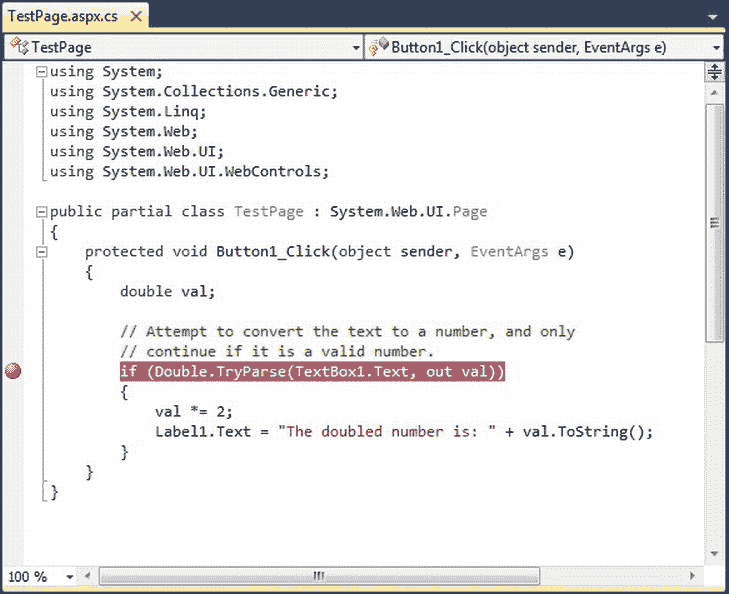

# 四、Visual Studio

在 web 编程的古代，开发人员使用简单的文本编辑器(如微软的记事本)创建网页。他们经常编写原始、混乱的 HTML，在需要的地方插入脚本代码块。

Visual Studio 提供了一个更好的选择。首先，它是可扩展的，甚至可以与传统的 web 编辑器协同工作，如 Microsoft Expression Web 和 Adobe Dreamweaver。换句话说，你可以做繁重的工作。NET 编码，但使用另一个网页设计工具，使一切看起来很漂亮。其次，Visual Studio 包含了不可或缺的省时功能。例如，它让您能够拖放 web 页面并对行为不当的代码进行故障排除。Visual Studio 甚至包括一个内置的测试 web 服务器，它允许您创建和测试一个完整的 ASP.NET 网站，而不用担心设置一个真正的 web 服务器。

在本章中，你将学习如何使用 Visual Studio 创建一个 web 应用。在此过程中，您将了解 ASP.NET WebForm 的结构，并回顾 HTML5 的要点。您还将了解 IntelliSense 如何显著减少您将会犯的错误，以及如何使用 Visual Studio 著名的单步调试程序来查看和“观察”运行中的程序。在本章结束时，你将非常熟悉任何 ASP.NET 开发者工具包中最重要的工具(Visual Studio)，并且你将理解使用 ASP.NET 进行 web 开发的基本原则。

**Visual Studio 的承诺**

全部。NET 应用是从纯文本源文件构建的。VB 代码存储在。vb 文件，而 C#代码存储在。cs 文件，不管该代码是为独立的 Windows 应用设计的还是为 Web 设计的。尽管如此，你很少会发现 VB 或 C#开发人员在文本编辑器中手工创建 Windows 应用。这个过程不仅很累，而且也为设计工具容易发现的大量错误打开了大门。ASP.NET 程序员也是如此。尽管您可以编写网页类并手工编写网页控件，但您将花费数小时来开发和测试代码。相反，使用 Visual Studio 的众多版本之一是有意义的。

Visual Studio 是任何平台开发人员不可或缺的工具。它提供了几个令人印象深刻的好处:

*   *集成错误检查* : Visual Studio 可以检测到各种各样的问题，比如数据类型转换错误，缺少命名空间或类，以及未定义的变量。当您键入时，错误会被检测出来，加下划线，并添加到错误列表中以供快速参考。
*   WebForm 设计者:要在 Visual Studio 中创建一个 web 页面，你可以简单地将 ASP.NET 控件拖到适当的位置并配置它们的属性。Visual Studio 完成繁重的工作，并自动创建实际的网页标记。即使你想手工编辑你的网页，拥有一个网页的实时预览也是必不可少的。
*   *集成 web 服务器*:要运行 ASP.NET web 应用，您需要一个运行互联网信息服务(IIS) web 服务器软件的 web 服务器。web 服务器有一个简单的工作——它等待浏览器请求并提供适当的页面。建立一个网络服务器并不难，但是很不方便。由于 Visual Studio 中集成的开发 web 服务器，您可以直接从设计环境中运行网站。(当然，当它完成时，你仍然需要将你的应用部署到一个真正的网络服务器上，你将在[第 26 章](26.html)中看到。)
*   *开发人员生产力的提高* : Visual Studio 通过可折叠的代码显示、自动语句完成和颜色编码语法，使编码变得快速而高效。您甚至可以创建复杂的宏程序来自动执行重复的任务。
*   *细粒度调试* : Visual Studio 的集成调试器允许你观察代码执行，在任何点暂停你的程序，检查任何变量的内容。在编写复杂的代码例程时，这些调试工具可以省去无尽的麻烦。
*   *完全可扩展性*:你可以创建宏，更改项目模板，甚至可以在 Visual Studio 中添加你自己的自定义加载项。即使您不打算直接使用这些特性，您可能仍然希望使用依赖于它们的方便的第三方工具。

 **注意**你在本章学到的技巧和技术将同样适用于所有版本的 Visual Studio，包括免费的 Visual Studio Express for Web。

**创建网站**

您可以通过选择开始所有程序Microsoft Visual Studio 2012来启动 Visual Studio 2012。Visual Studio 第一次加载时，会显示它的起始页 ( [图 4-1](#Fig00041) )。

[图 4-1](#_Fig00041) 。Visual Studio 起始页

起始页包括最近打开的应用列表。您可以单击此列表中的链接，从上次停止的地方快速恢复工作。起始页还包括到来自微软开发者网络(MSDN)网站的在线开发者内容的链接。尽管您可以忽略这些内容，但您可能会发现一篇有趣的文章、一个方便的代码示例或一个您想要尝试的漂亮的附加组件。(如果你的上网习惯更传统一点，你可以在网上找到同样的内容。一个很好的起点是 www.asp.net 的 ASP.NET 社区。)

要使用 Visual Studio 做任何实际的事情，您需要创建一个 web 应用。以下部分将向您展示如何操作。

创建一个空的 Web 应用

若要创建您的第一个 Visual Studio 应用，请按照下列步骤操作:

1.  从 Visual Studio 菜单中选择文件新建网站。出现新建网站对话框，如图[图 4-2](#Fig00042) 所示。

[图 4-2](#_Fig00042) 。“新建网站”对话框

*   2.在左边的列表中，选择要用来编写代码的语言。
*   3.在窗口顶部的下拉列表中，选择的版本。你想用的. NET。通常，你会选择。NET 框架 4.5。但是，您也可以使用 Visual Studio 创建为旧版本的设计的 web 应用。NET，一直追溯到。NET 2.0。
*   4.在窗口中间的模板列表中，选择您想要创建的应用类型。目前，最好的选择是 ASP.NET 空网站，它不会用一堆预先生成的文件和设置来扰乱你的网站。有关 Visual Studio 的网站模板之间的差异的更多信息，请查看“网站模板”侧栏。

 **注意**编程语言只是一个默认——你可以给 C#网站添加 Visual Basic 网页，你也可以给 VB 网站添加 C#网页。

网站模板

通过使用 Visual Studio 中的各种模板，可以创建不同类型的 ASP.NET 应用。无论你选择什么样的模板，你的网站都是以同样的方式编译和执行的。唯一的区别是 Visual Studio 默认创建的文件。

以下是您的模板选择概要:

*   ASP.NET WebForm 站点 : 这将创建一个功能齐全的 ASP.NET 网站，其基础设施已经就绪。该网站包括一个定义整体布局的母版页(带有页眉、页脚和菜单栏)和两个现成的网页，分别名为 default.aspx 和 about.aspx。它还包括一个帐户文件夹，其中包含用于注册、登录和更改密码的页面。在你读完这本书并了解了所有 ASP。NET 的 WebForm 功能，您可以选择使用此模板作为新站点的起点。
*   ASP.NET 网站(Razor): 这创建了一个使用 ASP.NET 模型-视图-控制器(MVC) 方法的网站，而不是你将在本书中学习的 WebForm 模型。ASP.NET MVC 模式提供了一些 ASP.NET WebForm 无法比拟的好处——例如，它让开发人员对 HTML 的生成方式有了更多的控制，而且它创建的网站更容易使用自动化测试工具。缺点是 ASP.NET MVC 网站牺牲了一些传统的 ASP。NET 的便利性和易用性。如果你有兴趣了解更多关于 ASP.NET MVC 的知识，可以考虑阅读 Adam Freeman 和 Steven Sanderson 的*Pro ASP.NET MVC 4*
*   *ASP.NET 空网站 :* 这样就创建了一个近乎空的网站。它包括一个精简的 web.config 配置文件，没有其他内容。当然，当你开始编码的时候，很容易就可以填充你需要的部分。这是了解 ASP.NET 的最佳起点，因为您不会有任何额外的、不必要的、自动生成的文件。
*   *ASP.NET 动态数据实体网站 :* 这创建了一个使用 ASP.NET 动态数据特性的 ASP.NET 网站。实际上有两种动态数据模板，它们使用稍微不同的方法与数据库通信。虽然本书没有讨论动态数据，但是你可以在 C# 的*Pro ASP.NET 4.5 中了解到。*
*   *WCF 服务 :* 这创建了一个 WCF 服务——远程客户端(例如，Windows 应用)可以调用的服务器端方法库。
*   *ASP.NET 报表网站 :* 这创建了一个使用 ReportView 控件和 SQL Server Reporting Services(一个用于生成可通过 Web 查看和管理的数据库报表的工具)的 ASP.NET 网站。ASP.NET 水晶报表网站模板提供了类似的服务，但它使用的是竞争对手的水晶报表软件。

尽管大多数开发人员更喜欢从 ASP.NET 空网站或 ASP.NET 网站模板开始编码，但仍有更多专门用于特定类型的 Web 应用的模板。要查看它们，请单击“新建网站”对话框左侧树中的“联机”标题，然后选择下面的“模板”项目。Visual Studio 联系 Microsoft web 服务器时会有短暂的延迟，之后它会添加一个模板子类别列表，每个子类别都有自己的一组现成模板。

*   5.选择网站的位置。位置指定了网站文件的存储位置。通常，您会选取“文件系统”,然后使用本地电脑上的文件夹。您可以在“Web location”文本框中手动键入一个目录，然后直接跳到第 7 步。或者，你可以点击浏览按钮，显示步骤 6 中讨论的选择位置对话框(见[图 4-3](#Fig00043) )。

[**图 4-3**](#_Fig00043) 。“选择位置”对话框

*   6.使用“选择位置”对话框，浏览到要放置网站的目录。通常，您会希望为您的 web 应用创建一个新目录。为此，请选择要放置子目录的目录，单击“创建新文件夹”图标(位于目录树的右上角)，键入新文件夹的名称，然后按 Enter 键。无论哪种方式，选择目录后，点按“打开”。“选择位置”对话框还包含用于在 IIS 虚拟目录或远程 web 服务器上创建 web 应用的选项(由左侧的按钮表示)。您现在可以忽略这些选项。一般来说，在本地开发 web 应用并在文件完善后上传是最容易的。

 **提示**记住，你创建网站的位置可能不是你部署它的地方。不要担心这个问题——在第 26 章的[中，你将学习如何把你的开发网站放在一个活动的 web 服务器上，这样其他人就可以通过网络或互联网访问它。](26.html)

*   7.单击“确定”创建网站。此时，Visual Studio 会生成一个新网站，其中只有一个名为 web.config 的文件。这是一个配置文件，您可以在其中放置影响 web 应用工作方式的各种设置。在本书中你会用到配置文件，在第五章中你会特别注意它。

现在你有了一个新的、普通的网站，你可以开始设计你的第一个网页了。但是在继续之前，您可能想了解更多关于 Visual Studio 如何通过使用项目(可选)和解决方案来跟踪您的网站文件的信息。接下来的两节有所有的细节。

网站和网页项目的区别

通常，Visual Studio 使用项目文件来存储有关您创建的应用的信息。Web 应用有点不寻常，因为 Visual Studio 不一定为它们创建项目文件。事实上，如果您按照上一节中的步骤操作，您就创建了一个没有项目文件的新网站。

这个被称为*无项目开发* 的系统，不同于 Visual Studio 与其他类型应用的工作方式，比如独立组件和 Windows 程序。它旨在保持你的网站目录干净整洁，从而简化你的 web 应用的部署。这样，当最终需要将您的网站上传到活动的 web 服务器时，您可以复制整个文件夹，而不必担心排除仅用于开发目的的文件。如果您与一组同事一起编程，无项目开发也很方便，因为您可以在单独的页面上工作，而不需要同步项目和解决方案文件。

对于大多数 web 开发人员来说，这是您需要知道的全部内容。然而，还有另一种选择:基于项目的开发，或 *web 项目*。Web 项目是创建 ASP.NET web 应用的原始方式，在 Visual Studio 2012 中仍然受支持。

您可以创建一个 web 项目，方法是选择文件新建项目，然后选择 ASP.NET Web 应用模板，或者单击起始页上的新建项目链接。Web 项目支持与无项目网站相同的所有功能，但是它们使用一个额外的项目文件(扩展名为。csproj)。web 项目文件跟踪被视为 web 应用一部分的网页、配置文件和其他资源。项目文件存储在与所有网页和代码文件相同的目录中。

使用 web 项目有几个原因:

*   您有一个非常旧的 web 项目，它是在 Visual Studio 2005 之前的版本中创建的。当您在 Visual Studio 2012 中打开此项目时，它将作为 web 项目自动迁移，以避免可能突然出现的奇怪的兼容性问题。
*   您想要将两个(或更多)web 项目放在同一个网站文件夹中。从技术上讲，ASP.NET 将把这两个项目视为一个网络应用。但是，对于 web 项目，您可以灵活地在 Visual Studio 中单独处理这些文件。您只需将想要组合在一起的文件添加到项目中。
*   你有一个非常大的网站，里面有很多资源文件(例如，成千上万的图片)。尽管这些文件是网站的一部分，但您可能不希望它们出现在 Visual Studio 的解决方案资源管理器窗口中，因为它们会降低开发环境的速度。如果您使用 web 项目，您可以很容易地避开这个问题—只是不要将这些资源文件添加到您的项目中。
*   您希望使用 Visual Studio web 包功能或 MSBuild 实用工具来自动将 web 应用部署到 web 服务器。例如，一家大公司可能会设计一种构建策略，自动签署已编译的 web 应用文件，并将它们部署到生产 web 服务器。你会在第 26 章中考虑网站部署的基础知识。

本书中展示的所有例子都使用了无项目网站模式。然而，如果您符合刚才描述的场景之一，您可以自由地创建 web 项目。您仍然要编写相同的代码来支持您的 web 页面。真的只是口味问题。

使用隐藏的解决方案文件

如您所知，Visual Studio 允许您创建没有项目文件的 ASP.NET 应用。然而，您可能会惊讶地发现，Visual Studio 仍然创建一种类型的资源文件，称为*解决方案*文件。解决方案是与项目类似的概念，不同之处在于一个解决方案可以包含一个或多个项目。每当您在 Visual Studio 中工作时，您都在处理一个解决方案。通常，该解决方案包含一个无项目的网站。但是，在更高级的情况下，它可能包含其他项目，如 web 应用和您的网站使用的组件。

此时，您可能想知道 Visual Studio 将解决方案文件放在哪里。这要视情况而定，但在典型的无项目 web 应用中，Visual Studio 会悄悄地将解决方案文件保存到用户特定的文档目录中，该目录的名称如下:

c:\ Users \[用户名]\ Documents \ Visual Studio 2012 \ Projects \[网站文件夹名]

这个系统可能会有点混乱，因为你的网站文件的其余部分将被放置在一个完全不同的目录中。

每个解决方案都有两个解决方案文件，文件扩展名为。例如，如果创建一个名为 SampleSite 的新网站，Visual Studio 会在后台生成以下解决方案文件:

样品网站. sln

SampleSite .你的

当您打开以前创建的网站时，Visual Studio 会自动定位匹配的解决方案文件，并使用该解决方案中的设置。

解决方案文件存储一些与 ASP.NET 没有直接关系的特定于 Visual Studio 的细节，如调试和视图设置。例如，Visual Studio 跟踪当前打开的文件，以便在您恢复网站开发时可以重新打开它们。

解决方案文件不是必需的。事实上，如果您将网站移动到另一台计算机上(或者只是将它们放在计算机上的另一个位置)，Visual Studio 将无法找到原始的解决方案文件，并且您将丢失它们存储的信息。如果您在不同的位置创建了两个同名的网站，也会遇到麻烦，在这种情况下，较新的解决方案文件可能会覆盖较旧的解决方案文件。然而，因为解决方案文件中的信息并不真的那么重要，所以丢失它并不是一个严重的问题。无项目系统的总体好处通常是值得权衡的。

通常，您可以完全忘记解决方案，让 Visual Studio 无缝地管理它们。但是在某些情况下，您可能希望密切关注您的解决方案文件，以便以后可以使用它们。例如，您可能希望使用解决方案文件来打开您同时处理的项目组合。当你开发自己的组件时，你会在第 22 章中看到这种技术的应用。

使用解决方案资源管理器

为了更好地了解您的网站，您可以使用解决方案资源管理器——位于设计环境右上角的窗口，它列出了您的 web 应用目录中的所有文件(参见[图 4-4](#Fig00044) )。

[图 4-4](#_Fig00044) 。解决方案资源管理器

 **注意**根据您的 Visual Studio 设置，您可能需要单击窗口右侧的“解决方案资源管理器”选项卡以将其展开到视图中。(然后，您可以单击解决方案资源管理器右上角的图钉图标将其锁定，以便永久可见。)如果您仍然找不到解决方案资源管理器，您总是可以通过 Visual Studio 菜单将其召唤到视图中。只需选择查看解决方案浏览器。

解决方案浏览器反映了无项目网站的应用目录中的所有内容。没有隐藏文件。这意味着，如果您在 Windows 资源管理器中添加普通 HTML 文件、图形或子目录，下次启动 Visual Studio 时，您将在解决方案资源管理器中看到新内容。如果您在 Visual Studio 打开时添加这些相同的成分，您不会马上看到它们。相反，您需要刷新显示。为此，右键单击解决方案资源管理器中的网站文件夹(显示在树顶部的解决方案项下)，然后选择“刷新文件夹”。

当然，解决方案资源管理器的全部目的是让您不必求助于 Windows 资源管理器。相反，它允许您在 Visual Studio 中执行各种文件管理任务。只需右键单击项目并选择适当的命令，即可重命名、删除或复制文件。

当您使用 ASP.NET 空网站模板创建一个新网站时，解决方案资源管理器只是一个孤立的地方，除了一个基本的配置文件之外什么都没有。要开始创建您的网站，您需要添加 WebForm。

添加 WebForm

建立网站时，您需要添加新的网页和其他项目。要添加这些成分，请从 Visual Studio 菜单中选择网站添加新项目。当您这样做时，将出现“添加新项”对话框。

您可以将各种类型的文件添加到 web 应用中，包括要使用的资源(如位图)、普通 HTML 文件、带有类定义的代码文件、样式表、数据文件、配置文件等等。Visual Studio 甚至提供了基本的设计器，允许您编辑大多数这类文件。然而，你将添加到任何网站的最常见的成分是用 C#代码填充的 *WebForm*—ASP.NET 网页。

若要添加 web 窗体，请在“添加新项”对话框中选择“Web 窗体”。你会在对话框的右下角看到两个附加选项(如图[图 4-5](#Fig00045) 所示)。

[图 4-5](#_Fig00045) 。添加 ASP.NET WebForm

“将代码放在单独的文件中”选项允许您为网页选择编码模型。如果清除此复选框，Visual Studio 将创建一个单文件网页。然后，您必须将该文件的所有 C#代码放在保存 HTML 标记的同一个文件中。如果选择“将代码放在单独的文件中”选项，Visual Studio 将为网页创建两个不同的文件，一个包含标记，另一个包含 C#代码。这是你将在本书中使用的更加结构化的方法。将网页分割成单独的文件的主要优点是，当您需要处理复杂的页面时，它更易于管理。然而，这两种方法都提供了相同的性能和功能。

您还会看到另一个名为“选择母版页”的选项，它允许您创建一个页面，该页面使用您在单独的文件中标准化的布局。现在，忽略这个设置。你将在第 12 章中学习如何创建母版页。

在您选择了编码模型并为您的网页键入一个合适的名称后，单击 Add 创建它。如果您选择了使用“将代码放在单独的文件中”复选框(这是推荐的)，您的项目最终将为每个网页提供两个文件。一个文件包含网页标记(并具有文件扩展名。aspx)。另一个文件存储页面的源代码(使用相同的文件名，文件扩展名为. aspx.cs)。为了明确这种关系，解决方案资源管理器将代码文件显示在。aspx 文件(见[图 4-6](#Fig00046) )。

[图 4-6](#_Fig00046) 。网页的代码文件

 **提示**大多数 ASP.NET 网站都包含一个名为 Default.aspx 的页面，作为网站*起始页* 。通常，web 服务器被配置为向所有访问者显示起始页，除非他们在 URL 中明确指定不同的页面。例如，如果你浏览到`www.amazon.com/Beginning-ASP-NET-4-5-Apress/dp/1430242515`，亚马逊会向你展示某本书的产品页面。但是如果你只浏览`www.amazon.com`，你会得到默认的起始页，它会指引你去任何你想去的地方。

您也可以通过选择网站添加现有项目来添加已经存在的文件。您可以使用这种技术将文件从一个网站复制到另一个网站。Visual Studio 不处理原始文件，只在 web 应用目录中创建一个副本。但是，不要对在 Visual Studio 的旧版本中创建的网页使用这种方法。相反，您应该在 Visual Studio 2012 中打开整个旧网站，这样可以确保它得到正确更新。

多目标

Visual Studio 支持*多目标*，这意味着您可以构建面向。NET 2.0，。NET 3.0，。NET 3.5，。NET 4，或者。净 4.5。通常，您会选择 web 服务器支持的最新版本。更高版本使您可以访问最新的功能，以及本书目标中包含的所有示例。净 4.5。

您已经看到了如何选择？NET 当你创建一个新的网站(它是窗口顶部的下拉列表)。您还可以更改的版本。当你创建了自己的网站后，你的目标是什么。为此，请按照下列步骤操作:

1.  选择网站开始选项。这将打开一个包含网站设置的新对话框。
2.  在左侧的列表中，选择“构建”类别。
3.  在目标框架列表中，选择。NET 你想要的目标(见[图 4-7](#Fig00047) )。

[图 4-7](#_Fig00047) 。更改的版本。NET 在网站中的应用

当您更改。NET 版本中，Visual Studio 对 web.config 文件进行了相当大的修改。例如，一个. NET 4.0 应用的 web.config 文件很简短，因为它需要的所有管道都是在计算机的根 web.config 文件中设置的。但是. NET 4.5 应用的 web.config 文件有点混乱，包括一些您不需要接触的系统设置。(从技术上讲，这是因为 ASP.NET 4.5 是作为核心的 ASP.NET 4.0 引擎的一种“附件”发布的。)

从 Visual Studio 的早期版本 打开网站

在 Visual Studio 的早期版本中，您需要经历一个迁移过程才能打开较旧的网站。Visual Studio 2012 改变了这一点，因为它增加了一个名为*项目兼容性* 的特性。由于项目兼容性，您可以像打开用 Visual Studio 2012 创建的网站一样轻松地打开 Visual Studio 2010 网站。您不会看到任何消息、警告或对话框，也不需要耐心等待升级过程。

 **注意**当你打开一个新网站时，它仍然会使用同一个版本的. NET，例如，如果你打开一个专为。NET 4，它仍将被配置为目标。NET 4。如果想换成用。NET 4.5，您只需修改目标框架设置，如前一节所述。

在测试应用时，您可能还希望将站点配置为使用 IIS Express，而不是较旧的 ASP.NET 开发服务器。为此，选择网站使用 IIS Express。(IIS Express 将在本章后面的“IIS Express Web 服务器”一节中讨论。)

旧的 web *项目*(相对于无项目的网站)仍然需要升级，这些项目是在 Visual Studio 2010 之前创建的。例如，如果您打开一个用 Visual Studio 2008 创建的 web 项目(通过选择文件打开项目/解决方案)，Visual Studio 会启动转换向导。转换向导非常简单。它会提示您选择是否创建备份，如果创建的话，它应该放在哪里(参见[图 4-8](#Fig00048) )。如果这是应用的唯一副本，备份是个好主意，以防应用的某些方面无法成功转换。否则，您可以跳过此选项。

[图 4-8](#_Fig00048) 。导入使用 Visual Studio 2008 创建的 web 项目

当您单击 Finish 时，Visual Studio 会执行一个*就地转换*，这意味着它会用新版本覆盖您的网页文件。任何错误和警告都会添加到转换日志中，您可以在转换完成时显示该日志。

**设计网页**

现在您已经了解了 Visual Studio 的基本组织，您可以开始设计一个简单的网页了。首先，在解决方案资源管理器中，双击要设计的网页。(如果没有添加任何页面，从 Default.aspx 开始。)

Visual Studio 为您提供了三种查看。aspx 页面:

*   *设计视图* :在这里你会看到你的页面外观的图形化表示。
*   *源视图* :这里你会看到底层的标记，有页面的 HTML 和 ASP.NET 控件标签。
*   *分割视图* :这个组合视图允许你同时看到设计视图和源代码视图，一个在另一个之上。

通过单击设计器窗口底部的“设计”、“拆分”和“源代码”按钮，可以在这三个视图之间自由切换。

在本章的稍后部分，当您深入研究网页标记时，您将花一些时间在源代码视图中。但是首先，从更友好的设计视图开始向页面添加内容是最容易的。

 **提示**如果你有一个宽屏显示器，你可能更喜欢使用两个并排区域的分割视图(而不是一个顶部和一个底部区域)。幸运的是，很容易配置 Visual Studio 来实现这一点。只需选择工具选项，然后前往设置树中的 HTML 设计器常规部分。最后，选择垂直分割视图选项，然后单击确定。

添加 Web 控件

要添加 ASP.NET web 控件，请从左侧的工具箱中拖动您想要的控件，并将其放到您的网页上。从技术上讲，您可以将控件放在“设计”视图窗口或“源”视图窗口上。但是，在使用“设计”视图时，通常最容易将控件放置在正确的位置。如果你不小心将控件放到源代码视图中，它们可能不会出现在<表单的>部分，这意味着它们不会在你的页面中工作。

工具箱中的控件根据其功能分为许多类别，但您可以在“标准”选项卡上找到基本的组件，如按钮、标签和文本框。

 **提示**默认情况下，当鼠标离开工具箱时，工具箱会自动隐藏起来。这种行为通常令人恼火，因此您可能希望单击工具箱右上角的图钉，使其保持在完全展开的位置。如果您不小心关闭了工具箱，您可以通过从菜单中选择 View  Toolbox 来再次显示它。

在 web 窗体中，控件是逐行定位的，就像在字处理程序文档中一样。你可以输入普通的 HTML 或者添加 ASP.NET 控件。要添加控件，您需要将它拖放到适当的位置。要在设计视图中组织几个控件，您可能需要添加空格和硬回车(只需按 Enter)来按您想要的方式定位元素。图 4-9 显示了一个带有文本框、标签和按钮的例子。

[图 4-9](#_Fig00049) 。页面的设计视图

您会发现有些控件无法调整大小。取而代之的是，它们会根据内容的大小而变大或变小。例如，Label 控件的大小取决于您在其中输入了多少文本。另一方面，您可以通过在设计环境中单击和拖动来调整按钮或文本框控件的大小。

当您将 web 控件添加到设计图面时，Visual Studio 会自动将相应的控件标记添加到。aspx 文件。要查看生成的标记，可以单击“源”按钮切换到“源”视图(或单击“拆分”按钮同时查看两者)。[图 4-10](#Fig000410) 显示了您在[图 4-9](#Fig00049) 中显示的页面的源代码视图中可能看到的内容。

[图 4-10](#_Fig000410) 。页面的源视图

使用“源”视图，您可以手动添加属性或重新排列控件。事实上，Visual Studio 甚至提供了智能感知功能，可以自动完成开始标记，并在您使用无效标记时发出警告。使用“设计”视图还是“源”视图完全取决于您，Visual Studio 使它们保持同步。

 **注意**当使用拆分视图时，Visual Studio 会保持源代码和设计区域同步。然而，这种同步过程并不总是即时的。通常，如果在设计区域中进行了更改，源区域会立即更新。但是，如果您在源区域中进行了更改，黄色消息栏会出现在设计区域的顶部，警告您内容已经更改。要刷新设计区域，只需单击设计区域内的任意位置。若要刷新设计区域而不将手指离开键盘，请按 Ctrl + S 保存网页。

缺少网格布局功能

如果您使用过 Visual Studio 的旧版本，您可能还记得一个名为*网格布局* 的特性，它允许您通过将元素拖动到您想要的位置来定位具有绝对坐标的元素。尽管这种模型看起来很方便，但它实际上并不适合大多数网页，因为当网页内容改变时(或者当文本根据用户偏好调整大小时)，控件不能调整它们的位置。这导致了不灵活的布局(如相互覆盖的控件)。

也就是说，Visual Studio 有一种使用网格布局的后门方式。您需要做的就是切换到源视图，并添加一个使用 CSS 指定绝对定位的样式属性。此属性将已经存在于您用 Visual Studio 的早期版本创建的任何页面中。NET 在网格布局模式下。

这里有一个例子:

完成这一更改后，您可以随意在窗口中拖动按钮。当然，你不应该仅仅因为一开始看起来更容易，就走这条路。大多数伟大的网页很少使用绝对定位，如果有的话，因为从长远来看，它太笨拙和不灵活了。

如果您决定使用绝对定位，最好的办法是将其应用于容器，比如

元素。元素代表一个默认情况下不可见的框，但是可以选择有边框、背景填充和其他格式。使用绝对定位，你可以精确地放置你的容器，但是让里面的内容使用正常的流动布局。这大大简化了你需要做的布局。例如，如果您想要创建一个包含链接列表的侧边栏，使用绝对定位来定位侧边栏要比尝试将每个链接单独放置在正确的位置容易得多。

使用属性窗口

将 web 控件添加到网页后，您可能希望对其进行一些调整。例如，您可能想要更改按钮中的文本、标签的颜色等等。虽然您可以通过手动编辑源标记来进行所有更改，但 Visual Studio 提供了一个更简单的选项。就在解决方案资源管理器下，在 Visual Studio 窗口的右下角，您将看到“属性”窗口，该窗口向您显示当前选定的 web 控件的属性，并允许您调整它们。

若要在“设计”视图中配置控件，必须首先在页面上选择它(在“设计”视图中单击它一次，或者在“源”视图中单击该控件标记内的某个位置)。当您看到控件名称出现在“属性”窗口顶部的下拉列表中时，您就知道选择了正确的控件。或者，您可以通过从"属性"窗口列表中选取控件的名称来选择控件。

选择所需的控件后，可以修改它的任何属性。可以尝试的好方法包括 Text(控件的内容)、ID(代码中用于与控件交互的名称)和 ForeColor(控件文本使用的颜色)。

 **提示**如果属性窗口不可见，您可以通过选择查看属性窗口(或只按 F4)来弹出它。

每次在“属性”窗口中进行选择时，Visual Studio 都会相应地调整网页标记。Visual Studio 甚至提供了特殊的“选择器”,允许您选择扩展属性。例如，如果在“属性”窗口中选择一个颜色属性(如 ForeColor 或 BackColor)，则带有三个点的按钮(.。。)会出现在属性旁边，如图[图 4-11](#Fig000411) 所示。

[图 4-11](#_Fig000411) 。“属性”窗口中的 ForeColor 属性

如果您单击此按钮，Visual Studio 将显示一个对话框，您可以在其中选择自定义颜色([图 4-12](#Fig000412) )。做出选择并单击“确定”后，Visual Studio 会将 HTML 颜色代码插入到“属性”窗口中，并更新您的网页标记。

[图 4-12](#_Fig000412) 。选择颜色值

在配置字体时，您会看到类似的功能。首先在设计图面上(或在“属性”窗口顶部的列表中)选择适当的控件。然后在“属性”窗口中展开“字体”属性，并选择“名称”子属性。属性旁边会出现一个下拉箭头。单击此按钮，从计算机上安装的所有字体列表中进行选择。(这里不要太疯狂。如果您选择的字体没有安装在访问您的网页的人的计算机上，浏览器将恢复为标准字体。第 6 章有更多关于字体选择的内容。)

除了 web 控件，您还可以在“属性”窗口中选择普通的 HTML 标记。然而，你能做的事情却少得多。普通的 HTML 标签不是实时编程对象，所以它们没有您可以控制的漂亮特性。普通的 HTML 标签没有提供很多格式化选项。如果你想改变一个标签的外观，你最好的选择是为你的控件创建一个*样式*。如果你是一个网络专家，你可以手工操作。如果没有，你可以使用 Visual Studio 的风格构建特性，你将在[第 12 章](12.html)中了解到。

最后，您可以在 Properties 窗口中选择两个需要一些解释的对象— <page>和 DOCUMENT。<page>包括许多与页面指令相关的 ASP.NET 选项，页面指令是位于顶部的一行或两行的基本语句。aspx 文件，下一节将对此进行介绍。文档项不太有趣。它由一个较小的属性集组成，包括一个<page>选项的子集和一些允许您改变<title>和</title>元素的属性。</page></page></page>

**探索网络形态的解剖**

到目前为止，您大部分时间都在“设计”视图中处理网页。这没有什么不好——毕竟，在这个视图中工作可以很容易地快速组装一个基本的 web 页面，而不需要任何 HTML 知识。

然而，很可能用不了多久，您就会进入源代码视图。当您直接使用标记时，某些类型的更改更容易进行。在设计图面上找到所需的控件，选择它，然后在“属性”窗口中一次编辑一个属性，这可能会很繁琐。

当您想要添加普通的 HTML 内容时,“源代码”视图通常很有帮助——毕竟，并不是网页中的所有内容都需要是一个完全成熟的 web 控件。您可以使用“设计”视图添加普通的 HTML 元素(只需从工具箱的“HTML”选项卡中拖动所需的元素)，但手动键入通常更容易，因为您通常需要使用元素的组合来获得所需的结果。

WebForm 标记

如果您以前没有编写过 HTML 页面，那么网页源代码可能看起来有点吓人。如果您以前编写过 HTML 页面，那么网页源代码可能看起来有点奇怪。这是因为 ASP.NET WebForm 的来源不是 100%的 HTML。相反，它是一个带有额外的 ingredient—ASP.NET web 控件的 HTML 文档。

每个 ASP.NET WebForm 都包括标准的 HTML 标签，比如、和，它们描绘了您的 web 页面的基本部分。您可以插入额外的 HTML 标签，比如文本段落(使用

标签)、标题(使用

# 、

## 、

### )、表格(使用

)等等。除了标准 HTML，您还可以添加 ASP。NET 元素添加到您的网页中。例如，<button>表示一个可点击的按钮，它触发 web 服务器上的一个任务。当您添加 ASP.NET web 控件时，您创建了一个可以在网页代码中与之交互的对象，这非常有用。</button>

下面来看看[图 4-9](#Fig00049) 所示的网页。不属于普通 HTML 的细节被突出显示，并且为了便于参考，这些行被编号:

**1<% @ Page Language = " c# " AutoEventWireup = " true "**

**2 CodeFile = " Default . aspx . cs " Inherits = " _ Default " %>**

3

4

5run at = " server "T2]

6 <title>无标题页面</title>

7

8

9

<form id="form1">run at = " server "T2]</form>

10

**11<ASP:Label ID = " Label 1 " runat = " server "**

**12 Text = "在此键入内容:"/>T1】**

13

**14 < asp:文本框 ID =“文本框 1”runat = " server "/>的文本盒 1**

**15<ASP:Button ID = " Button 1 " runat = " server " Text = " Button "/>**

16

17

18

19

显然，ASP。特定于. NET 的细节(突出显示的部分)对 web 浏览器没有任何意义，因为它们不是有效的 HTML。这不是问题，因为 web 浏览器永远看不到这些细节。相反，在服务器上处理完所有代码后，ASP.NET 引擎会为页面创建一个 HTML“快照”。此时，<button>等细节被具有相同外观的 HTML 标记替换。ASP.NET 引擎将这个 HTML 快照发送给浏览器。</button>

这个总结只是对 ASP.NET web 控件模型的一个简单介绍。在接下来的两章中，你会学到更多关于 web 控件和 WebForm 如何在幕后工作的知识。但是在您进一步深入之前，考虑一些关于 ASP.NET WebForm 的基本细节是很重要的。在接下来的几节中，您将了解 page 指令(前面代码示例中的第 1 行和第 2 行)和 doctype(第 3 行)。然后，您将快速回顾 HTML5 的一些基本规则，html 5 是用于创建现代网页的标记语言。

页面指令

与所有 ASP.NET web 窗体一样，Default.aspx 页由三个部分组成。第一部分是*页面指令*:

< % @ Page Language = " c# " AutoEventWireup = " true "

CodeFile = quotDefault . aspx . cs " Inherits = " _ Default " % >

页面指令给了 ASP.NET 关于如何编译页面的基本信息。它指示代码使用的语言以及连接事件处理程序的方式。如果您使用的是代码隐藏方法(推荐使用)，page 指令还会指出代码文件的位置和自定义页面类的名称。您不需要手动修改页面指令，因为 Visual Studio 会为您维护它。

 **注意**页面指令是针对 ASP 的。只有网的眼睛。页面指令不会出现在发送给浏览器的 HTML 中，而是被 ASP.NET 删除了。

文档类型

在一个普通的 non-ASP.NET 网页中， *doctype* 占据了第一行。在 ASP.NET WebForm 中，doctype 排在第二位，出现在 page 指令的正下方。

doctype 表示您用来创建网页的标记类型(例如，HTML5 或 XHTML)。从技术上讲，doctype 是可选的，但是 Visual Studio 会自动添加它。这很重要，因为它会影响浏览器如何解释你的网页。例如，如果你没有在你的网页上包含一个文档类型，IE 会自动切换到一个传统的模式，称为*古怪模式*。当 IE 处于怪癖模式时，某些格式细节会以不一致、不标准的方式处理，原因很简单，这是 IE 一贯的行为方式。IE 的后续版本不会试图改变这种行为，即使它是错误的，因为一些网站可能会依赖它。为了避免这个问题，并确保您的网页在所有浏览器中看起来都一样，您必须确保始终包含 doctype。

今天，大多数网页使用简单的 HTML5 文档类型，如下所示:

HTML5 doctype 可以在所有浏览器中工作。这也足以在每个现代浏览器中触发适当的、标准化的网页呈现(不是怪癖模式)。(非常非常旧的浏览器仍然会做一些古怪的事情，但是无论你使用什么样的文档类型，都没有办法解决这个问题。幸运的是，现在很少看到 ie 5 的复制品了。)

您可能还会遇到用于旧的 XHTML 标准的更长的 doctypes。下面是 XHTML 1.0 过渡文档类型的一个例子:

/root>

" http://www . w3 . org/TR/XHTML 1/DTD/XHTML 1-transitional . DTD " >

如今，XHTML 正逐渐退出历史舞台。Web 开发人员仍然使用它所倡导的许多更严格的语法规则，但它们现在是个人喜好的问题。

幸运的是，ASP.NET 服务器控件可以很好地处理任何文档类型。如果你有疑问，最好用 HTML5。

 **注意**在本书中，网页标记列表省略了 doctype(因为它只是一个咀嚼多余页面的细节)。如果您下载示例代码，您会发现所有页面都使用现代的 HTML5 doctype。

这里有一个肮脏的秘密:浏览器处理 HTML5 页面和 XHTML 页面的方式在*和*完全一样。这意味着，如果他们遇到语法松散的 XHTML 文档(他们仍在试图找出原因)或使用较新的 HTML5 元素的文档(如< video >)，他们不会抱怨。这是 HTML5 赢得 web 标准战争的原因之一:它反映了 web 浏览器*真正*的工作方式。要了解更多关于 HTML5 标准的信息，你可以阅读 *HTML5:丢失的手册* (O'Reilly，2011)或在`www.w3schools.com/html5/html5_intro.asp`查看 HTML5 教程。

**HTML 的要领**

ASP.NET 的部分目标是让你建立丰富的网页，而不强迫你费力地浏览 HTML 的细节。ASP.NET 在许多方面实现了这一承诺——例如，在许多情况下，您可以通过使用一个简单的 web 控件而不是编写一个充满 HTML 标记的页面来获得您想要的结果。

然而，ASP.NET 并没有把你和 HTML 完全隔离开来。事实上，一个典型的 ASP.NET 网页将 ASP.NET web 控件与普通的 HTML 内容混合在一起。当 web 服务器处理该页面时，ASP.NET web 控件被转换成 HTML 标记(这个过程称为*呈现* ) ，并被插入到页面中。最终结果是一个标准的 HTML 文档，它被发送回浏览器。

这种设计让您两全其美—您可以将普通的 HTML 标记混合用于页面中不变的部分，并且可以将方便的 ASP.NET web 控件用于需要交互的部分(如按钮、列表、文本框等)或需要用新信息更新的部分(如动态文本块)。这种设计也表明，ASP.NET 开发人员在开始编写 WebForm 之前，应该对 HTML 基础有一个扎实的理解。下面几节提供了一个简要的概述，向您介绍 HTML 标准(或者如果您以前学过的话，提醒您一下)。如果你已经知道了所有你想知道的关于 HTML 的知识，请随意跳到“编写代码”一节。

**元素**

HTML 标准中最重要的概念是*元素*的概念。元素是包含网页内容的容器。例如，如果您想在网页上添加一段文本，您可以将它放在一个段落元素中。一个典型的网页由几十个(或者几百个)元素组成。总之，这些元素定义了网页的结构。它们也是格式化网页的起点。例如，标题通常看起来不同于普通段落，表格看起来不同于项目符号列表。

HTML 语言定义了一小组您可以使用的元素——事实上，它们比您预期的要少。HTML 还定义了使用这些元素的语法。典型的元素由三部分组成:开始标签、一些内容和结束标签。这里有一个例子:

这是一个段落中的一句话。

这个例子使用了段落元素。该元素以

开始标记开始，以

结束标记结束，并包含一些文本。标签很容易识别，因为它们总是用尖括号括起来。下面是一个组合，它向网页添加一个标题，后跟一个段落:

# 标题

这是一个段落中的一句话。

浏览器有关于如何处理和显示不同元素的内置规则。当浏览器消化这种标记时，它总是将标题放在大而粗的字体中，并在段落开始之前在其下方添加一个换行符和一些额外的空间。当然，有一些方法可以修改这些格式规则，通过使用 CSS(层叠样式表)，这是一个你会在第 12 章中考虑的标准。

许多 HTML 元素可以包含其他元素。例如，您可以使用

元素内的**元素对段落的一部分应用加粗格式:**

这是**句**中的一段话。

# 和

元素通常包含内容。因此，它们被分为开始标记和结束标记。例如，标题以

# 开始，以

结束。但是，有些元素不需要任何内容，可以使用一种特殊的空标记语法来声明，该语法将开始和结束标记融合在一起。例如，
元素代表一个换行符。不用写
，你可以直接用
，如下所示:

这是一号线。< br />

这是二号线。< br />

这是三号线。

可以以这种方式使用的其他元素包括(用于显示图像)、

* * *

(用于创建水平标尺或线条)，以及大多数 ASP.NET 控件。

 **注意**换行符很重要，因为 HTML 会折叠空白。这意味着您可以在元素内容中添加一系列空格、制表符和硬回车，浏览器将只呈现一个空格字符。如果你真的*想要换行符，你需要使用单独的元素(例如，不止一个< p >段落)或者换行符。如果想要额外的空格，需要添加 HTML 字符实体&nbsp；取而代之(它代表不间断空格)。浏览器将此代码转换为单个空格字符。*

 *表 4-1 列出了一些最常用的 HTML 元素。Type 列区分了两种类型的 HTML——一种通常保存内容或其他嵌套元素(容器),另一种可以单独使用您刚才考虑的空标记语法(独立)。

[表 4-1](#_Tab00041) 。基本 HTML 元素

**属性**

每个 HTML 文档都融合了两种类型的信息:文档内容和关于内容应该如何呈现的信息。您只需通过三种方式来控制内容的表示:使用正确的元素，排列这些元素以获得正确的结构，以及为元素添加属性。

*属性*是附加到元素上的信息片段，在开始标签中。属性有许多用途，例如，它们允许您显式地将样式附加到元素，以便它获得正确的格式。有些元素需要属性。最明显的例子是< img >元素，它允许您从图像文件中提取内容并将其放入您的 web 页面。

标签需要两条信息——图片 URL(来源)和描述图片的可选文本(用于辅助功能，如屏幕阅读软件)。这两条信息使用两个属性来指定，分别命名为 *src* 和 *alt* :

src=【happy . gif】T2【alt】=【happy face】/>

点击< a **href**= " http://www . prose tech . com ">此处< /a >访问我的网站。

您将在 ASP.NET 控制标签中广泛使用属性。对于 ASP.NET 控件，每个属性都映射到控件类的一个属性。

**格式化**

除了用于粗体的**(或**)元素，HTML 还支持用于斜体的*(或<emphasis>)元素。然而，这就是它的格式。</emphasis>*****

HTML 元素旨在指示文档的*结构*，而不是其格式。虽然您可以通过使用 HTML 元素来调整颜色、字体和一些格式特征，但更好的方法是使用样式表来定义格式。例如，样式表可以告诉浏览器对页面中的每个< h1 >元素使用特定的格式。您甚至可以将样式表中的样式应用于网站中的所有页面。

 **提示**在可下载的示例中，您会发现许多网页都使用一个名为 Styles.css 的样式表。该样式表将 Verdana 字体应用于网页的所有元素。

在 ASP.NET 网页中，有两种方式可以使用 CSS。您可以直接使用它来格式化元素。第 12 章概述了这种方法的基础。或者，您可以配置您正在使用的 ASP.NET 控件的属性，它们会自动生成所需的样式，正如您将在本书中看到的那样。

**一个完整的网页**

现在，您已经了解了足够的知识，可以创建一个完整的 HTML 页面了。

每个 HTML 文档都以这个基本结构开始(就在 doctype 之后):

`<html>`

`<head runat = "server">`

`<title > Untitled Page</title>`

`</head>`

`<body>`

`</body>`

`</html>`

当您在 Visual Studio 中创建新的 web 窗体时，这是您开始使用的结构。以下是您得到的结果:

*   HTML 文档以标签开始，以标签结束。这个元素包含了网页的全部内容。
*   在元素中，网页被分成两部分。第一部分是元素，它存储关于网页的一些信息。您将使用它来存储 web 页面的标题，该标题将出现在 web 浏览器的标题栏中。(你也可以在这里添加其他细节，比如搜索关键词，尽管这些现在大多被网络浏览器忽略了。)在 Visual Studio 中生成网页时，部分有一个 runat = "server "属性。这给了你在代码中操作它的能力(这是你将在下一章探讨的主题)。
*   第二部分是元素，它包含出现在 web 浏览器窗口中的实际页面内容。

在 ASP.NET 的网页中，至少还有一个元素。在元素内部是一个

<form>元素。</form>

<form>元素是必需的，因为它定义了页面的一部分，可以将信息发送回 web 服务器。当您开始添加文本框、列表和其他控件时，这变得很重要。只要它们在表单中，诸如文本框中的当前文本和列表中的当前选择等信息就会通过一个称为*回发*的过程被发送到 web 服务器。幸运的是，您还不需要担心这个细节——只需将所有网页内容放在< form >元素中。</form>

大多数时候，当你在处理一个页面时，你会关注于

<form>元素中的标记，它包含了大部分的页面内容。当您在 Visual Studio 中创建新网页时，还有一个细节——</form>

<form>元素中的元素:</form>

`<html>`

`<head runat = "server">`

`<title > Untitled Page</title>`

`</head>`

`<body>`

**<表单 ID = " form 1 " runat = " server ">**

**< div >**

**</形式>**

`</body>`

`</html>`

严格地说，

元素是可选的——它只是一个容器。你可以把它想象成一个没有内置外观或格式的隐形盒子。然而，使用一个标签来分组你的页面中你想要以相似的方式格式化的部分是很有用的(例如，使用相同的字体、背景颜色或边框)。这样，您可以将样式设置应用到标签，它们将级联到它包含的每个标签中。你也可以通过给一个边框在你的页面上创建一个真正的框。你将在第 12 章的[中了解更多关于格式和元素的知识。](12.html)

现在您已经准备好在

标签中弹出您的其余内容。如果您添加一个标签、文本框和按钮控件，您将得到与本章前面使用设计器创建的标记相同的标记，但是现在您将理解它的标记基础。

**编写代码**

当您开始编写支持用户界面的代码时，许多 Visual Studio 最受欢迎的增强功能就会出现。要开始编码， 需要切换到代码隐藏视图。若要来回切换，可以使用两个视图代码或视图设计器按钮，它们出现在解决方案资源管理器窗口的正上方。另一种同样有效的方法是双击。解决方案资源管理器中的. aspx 页(用于访问设计器)或. aspx.cs 页(用于访问代码视图)。有问题的代码是 C#代码，而不是。aspx 文件。

**使用代码隐藏类**

当切换到代码视图时，您将看到网页的 page 类。例如，如果您已经创建了一个名为 SimplePage.aspx 的网页，您将会看到一个类似如下的代码隐藏类:

使用系统；

使用系统；

使用系统。集合。泛型；

使用系统。Linq

使用系统。Web

使用系统。Web . UI

使用系统。Web . UI.WebControls

公共分部类 SimplePage: System。网页界面

{

受保护的 void Page_Load(对象发送方，EventArgs e)

{

}

}

就在您的 page 类之前，Visual Studio 导入了一些核心。NET 命名空间。这些名称空间使您可以方便地访问许多常用的 ASP.NET 类。

在你的 page 类中，你可以放置一些方法来响应控件事件。例如，您可以添加一个方法，其代码在用户单击按钮时做出反应。下一节解释如何创建事件处理程序。

添加事件处理程序

ASP.NET 网页中的大部分代码都放在对 web 控件事件做出反应的事件处理程序中。使用 Visual Studio，有三种简单的方法可以将事件处理程序添加到代码中:

*   *手动输入*:在这种情况下，您将子例程直接添加到 C#代码文件中的 page 类。您必须指定适当的参数。
*   *在设计视图中双击一个控件*:在这种情况下，Visual Studio 将为该控件的默认事件创建一个事件处理程序，如果它还不存在的话。例如，如果双击一个按钮控件，它将为该按钮创建一个事件处理程序。单击事件。如果你双击一个文本框控件，你会得到一个文本框的事件处理程序。TextChanged 事件如果事件处理程序已经存在，Visual Studio 只需将您带到代码中的相关位置。
*   *从属性窗口*中选择事件:只需选择控件，并在属性窗口中单击闪电图标。您将看到该控件提供的所有事件的列表。双击要处理的事件旁边，Visual Studio 会自动在您的 page 类中生成事件处理程序。或者，如果您已经创建了事件处理程序方法，只需在“属性”窗口中选择事件，然后单击右侧的下拉箭头。您将看到一个列表，其中包含您的类中与该事件所需的签名相匹配的所有方法。然后您可以从列表中选择一种方法来连接它。[图 4-13](#Fig000413) 显示了按钮所在的示例。Click 事件连接到 page 类中的 Button1_Click 方法。

 **提示**如果你使用最后一种方法，你可能会遇到 Visual Studio 的一个怪癖。有时，在“源”视图中编辑时,“属性”窗口不会显示当前控件的闪电图标。若要解决此问题，请切换到设计视图并在那里选择控件。

[图 4-13](#_Fig000413) 。创建或附加事件处理程序

无论您使用哪种方法，事件处理程序看起来(和功能)都是一样的。

例如，当您双击 Button 控件时，Visual Studio 会创建一个事件处理程序，如下所示:

受保护的 void Button1_Click(对象发送方，事件参数 e)

{

//这里是对按钮单击做出反应的代码。

}

当您使用 Visual Studio 附加或创建事件处理程序时，它会调整控件标记，以便链接到适当的事件:

在事件处理程序方法中，您可以使用控件对象的 id 与网页上的任何控件对象进行交互。例如，如果您创建了一个名为 TextBox1 的 TextBox 控件，则可以使用以下代码行来设置文本:

受保护的 void Button1_Click(对象发送方，事件参数 e)

{

**文本框 1。Text = "以下是一些示例文本。"；**

}

这是一个简单的事件处理程序，它在单击 Button1 时做出反应，并更新 TextBox1 中的文本。

 **注意**您可能想知道为什么您的代码文件包含了事件处理程序，但是它实际上并没有*声明*您使用的控件(比如前面例子中的 Button1 和 TextBox1 对象)。原因是 ASP.NET 会自动生成这些控件的声明。你永远看不到这些声明，但是你可以假设它们是你的类的一部分。这也是为什么您创建的每个页面类都是用关键字`partial`定义的。这允许 ASP.NET 将你的代码与它自动生成的部分合并。最终结果是，您可以轻松地通过名称访问页面上的所有控件，但您不需要编写额外的代码来创建和初始化这些对象。

在接下来的两章中，您将了解到更多关于 ASP.NET WebForm 模型的工作原理。但是对于本章的其余部分，是时候稍微休息一下，考虑一下 Visual Studio 的两个强大的编码便利性:大纲和智能感知。

概述

大纲允许 Visual Studio 将方法、类、结构、命名空间或区域“折叠”成一行。它允许你看到你感兴趣的代码，同时隐藏不重要的代码。若要折叠一部分代码，请单击第一行旁边的减号(–)。要将其展开，再次点击该框，现在会有一个加号(+)(见[图 4-14](#Fig000414) )。

[图 4-14](#_Fig000414) 。折叠代码

您可以通过右键单击代码窗口中的任意位置并选择 outlineCollapse to Definitions 来同时隐藏每个方法。

智能感知

Visual Studio 通过大量自动省时工具努力让您的生活变得更加轻松。其中最强大的是 IntelliSense——一组在您键入时提示您有价值的代码建议(并捕捉错误)的功能。

**使用会员列表**

Visual Studio 使您可以轻松地与控件和类进行交互。当你输入一个类名或对象名时，它会弹出一个与你目前输入的相匹配的可用属性和方法的列表(见[图 4-15](#Fig000415) )。它使用类似的技巧在定义变量时提供数据类型列表，或者在为枚举赋值时提供有效值列表。

[图 4-15](#_Fig000415) 。工作中的智能感知

 **提示**忘记了网页中控件的名称？您可以获得智能感知来帮助您。只需键入`this`关键字，后跟一个句点(也称为*点运算符*)。Visual Studio 将弹出一个列表，其中包含当前 form 类的所有方法和属性，包括控件变量。

当您调用方法或调用构造函数时，Visual Studio 还提供了参数及其数据类型的列表。这些信息显示在代码下方的工具提示中，并在您键入时出现。因为。NET 类库大量使用方法重载，这些方法可能有多个版本。当它们出现时，Visual Studio 会指示版本的数量，并允许您通过单击工具提示中的小上下箭头来查看每个版本的方法定义。每次点击箭头，工具提示都会显示重载方法的不同版本(见[图 4-16](#Fig000416) )。

[图 4-16](#_Fig000416) 。具有重载方法的智能感知

**捕捉代码中的错误**

代码编辑器最有用的特性之一是错误下划线。Visual Studio 能够检测各种错误条件，如未定义的变量、属性或方法；无效的数据类型转换；和缺失的代码元素。Visual Studio 编辑器不会停下来提醒您存在问题，而是给有问题的代码加下划线。您可以将鼠标悬停在带下划线的错误上，以查看问题的简短工具提示描述(见[图 4-17](#Fig000417) )。

[图 4-17](#_Fig000417) 。在设计时突出显示错误

Visual Studio 不一定会立即标记您的错误。但是当你试图运行你的应用(或者只是编译它)时，Visual Studio 会快速扫描代码，标记出它发现的所有错误。如果您的代码至少包含一个错误，Visual Studio 将询问您是否应该继续。此时，您几乎总是会决定取消操作并修复 Visual Studio 发现的问题。(如果您选择继续，您将使用应用的最后编译版本，因为 Visual Studio 无法构建有错误的应用。)

每当您试图构建一个有错误的应用时，Visual Studio 将显示错误列表窗口，其中列出了它检测到的所有问题，如图 4-18 所示。然后，您可以通过在列表中双击某个问题来快速跳转到该问题。

[图 4-18](#_Fig000418) 。“错误列表”窗口

您可能会发现，当您修复错误并重新构建应用时，您会发现更多的问题。这是因为 Visual Studio 不会一次检查所有类型的错误。当您尝试编译应用时，Visual Studio 会扫描基本问题，如无法识别的类名。如果这些问题存在，它们很容易掩盖其他错误。另一方面，如果您的代码通过了这种基本的检查，Visual Studio 会检查更微妙的问题，比如试图使用未赋值的变量。

**捕捉标记中的错误**

中的标记配置 Visual Studio 执行的错误检查级别。aspx 文件。但是在使用这个特性之前，你需要决定你想要遵循什么规则。

问题是 HTML5 允许大量被认为是糟糕风格的标记实践。例如，在 HTML5 中，使用大写的标签名称(例如，

代替

)或者没有尾随斜线的空标签(例如，
代替
)是完全合理的。在旧的 XHTML 标准中，这两种做法都是不被容忍的，许多 web 设计人员继续提倡反对这些坏习惯。幸运的是，如果需要，您可以配置 Visual Studio 对 HTML5 页面应用更严格的规则。

要配置如何验证网页标记，请按照下列步骤操作:

1.  选择工具选项，显示选项对话框。
2.  在左边的树中，进入文本编辑器 HTML 验证部分(参见[图 4-19](#Fig000419) )。
3.  选中“使用 Doctype 进行验证模式检测”复选框。这意味着 Visual Studio 将检查网页的 doctype，并在对标记进行错误检查时使用相应的规则。如果您不执行这一步，那么您可以从 HTML 源代码编辑工具栏中选择您想要的错误检查级别(例如，HTML5、XHTML 1.1 等等)。这种方法的问题是很容易使用错误的规则(比如，XHTML 检查 HTML5 文档)，这会导致 Visual Studio 不必要地报告假想的错误。
4.  确保选择了“显示错误”选项。
5.  检查“显示错误”下面的其他复选框。如果您找到想要应用的其他规则，请选择相应的设置。例如，选择当客户端标记不是小写时，告诉 Visual Studio 捕捉大写标记并对它们进行投诉。
6.  单击确定应用您的更改。

[图 4-19](#_Fig000419) 。标记验证设置

 **提示**通常，标记错误会被添加到错误列表的警告列表中。它们不会阻止您运行应用。但是，如果您想将标记问题视为显示停止错误，请取消“作为警告”设置旁边的复选标记。

**自动导入名称空间**

有时您会遇到错误，因为您没有导入您需要的名称空间。例如，假设您键入这样一行代码:

FileStream fs = new FileStream(" new file . txt "，FileMode。创建)；

这一行创建 FileStream 类的一个实例，它驻留在系统中。IO 命名空间。但是，如果你还没有导入系统。IO 命名空间，您将遇到编译时错误。不幸的是，该错误只是指出不存在名为 FileStream 的已知类，并没有指出问题是拼写错误还是缺少导入，也没有告诉您哪个名称空间包含您需要的类。

在这种情况下，Visual Studio 提供了一个非常有用的工具来帮助您。当您将文本光标移动到无法识别的类名(本例中为 FileStream)时，下面会出现一个小方框图标。如果将鼠标悬停在该位置上，会出现一个页面图标。点击页面图标，自动更正选项的下拉列表出现(见[图 4-20](#Fig000420) )。使用这些选项，您可以将该行转换为使用完全限定的类名，或者将所需的命名空间导入添加到代码文件的顶部，这通常是最干净的选项(特别是如果您在同一页中多次使用该命名空间中的类)。

[图 4-20](#_Fig000420) 。导入缺少的命名空间

此自动更正功能不起作用的唯一情况是 Visual Studio 找不到缺少的类。如果该类存在于另一个程序集中，并且您尚未添加对该程序集的引用，则可能会发生这种情况。

**格式和颜色代码**

Visual Studio 还提供了一些修饰性的便利。它会自动给你的代码上色，让注释变成绿色，关键字变成蓝色，普通代码变成黑色。结果是可读性更好的代码。您甚至可以通过选择工具选项，然后选择环境字体和颜色部分来配置 Visual Studio 使用的颜色。

此外，默认情况下，Visual Studio 被配置为自动格式化您的代码。这意味着您可以自由地键入代码行，而不用担心制表符和定位。Visual Studio 会自动应用“正确的”缩进。幸运的是，如果您有不同的偏好(例如，您希望缩进五个空格而不是四个空格，或者您希望使用制表符而不是空格)，您可以配置这种行为。只需选择工具选项，并找到文本编辑器的 C#组设置。

**调试**T5】

创建应用后，您可以编译并运行它。只需从 Visual Studio 菜单中选择 调试开始调试，或者单击工具栏上的开始调试按钮(这是一个绿色的三角形播放按钮)，或者按 F5。Visual Studio 启动默认的 web 浏览器，并请求解决方案资源管理器中当前选定的页面。这是一个方便的技巧—例如，如果您正在编写 SalesPage1.aspx，您将看到 SalesPage1.aspx 出现在浏览器中，而不是 Default.aspx 主页。

第一次启动 web 应用时，Visual Studio 会询问您是否希望通过调整 web 应用的配置文件来配置 web 应用以允许调试。([图 4-21](#Fig000421) 显示了您将看到的信息。)选择修改 Web.config 文件启用 T3 调试，点击确定。

[图 4-21](#_Fig000421) 。启用调试

IIS Express Web 服务器

当您运行 web 应用时，Visual Studio 会启动一个名为 IIS Express 的测试 web 服务器，它使用该服务器临时承载您的站点。IIS Express web 服务器被设计成像真正的、完全成熟的 IIS web 服务器一样工作(你将在第 26 章中了解到这一点)，有一些关键的限制。例如，IIS Express 不用于处理来自其他计算机的请求。(可以通过一些配置改动来覆盖这个限制，但不推荐这样做。)相反，IIS Express 被设计为一个测试工具，在您编写应用时，它在您的开发计算机上运行。

 **提示**如果你已经打开了一个较旧的项目(例如，在 Visual Studio 2010 中创建的项目)，它将使用 ASP.NET 开发服务器而不是 IIS Express。尽管 ASP.NET 开发服务器的工作方式基本相同，但 IIS Express 的功能更像一个真正的 web 服务器。要将您的应用切换到 IIS Express，请从菜单中选择网站使用 IIS Express。

当您从 Visual Studio 启动网页时，您会注意到浏览器中的 URL 包含一个端口号。例如，如果您启动一个名为 accounts.aspx 的页面，您可能会看到一个类似于`http://localhost:4235/accounts.aspx`的 URL。此 URL 表示 web 服务器正在您的计算机(localhost)上运行，因此它的请求不会通过互联网发送。它还指示所有请求都被传输到端口号 4235(例如)。这样，请求就不会与您的计算机上可能正在运行并侦听请求的任何其他应用发生冲突。每次 Visual Studio 启动 IIS Express web 服务器时，它都会随机选择一个可用端口。

有时在调试时，您可能想要连续测试几个文件。您可以停止调试过程，在解决方案资源管理器中选择适当的文件，然后再次启动应用，但这需要额外的时间。你可以在浏览器的地址栏中编辑 URL，然后输入新的页面名称，但你可能不会得到完全正确的结果。更方便的选择是从你的 web 应用文件夹中选择你想要的页面，如图[图 4-22](#Fig000422) 所示。

[图 4-22](#_Fig000422) 。从页面列表中选择

为此，您需要确保满足两个标准。

*   首先，您的项目中不能有 Default.aspx 主页。如果您这样做，Visual Studio 将在您不指定页面名称时显示该页面，而不是文件列表。
*   其次，您需要明确地给予 IIS Express 权限来显示目录列表。这种便利性在实际发布的应用中是一个明显的安全风险，但在测试时并无大碍。为此，您需要打开一个命令提示符窗口，并执行以下两个命令:

cd " \程序文件(x86)\IIS Express "

app cmd set config-section:system . web server/directory browse/enabled:" True "

如果您采取了这两个步骤，您将能够从您在计算机上用 IIS Express 测试的任何 web 应用请求一个文件列表。要查看当前 web 应用文件夹中所有文件的列表，请以`http://localhost:port`的形式键入您的地址(省略页面名称)。然后点击你想测试的页面。

单步调试 T3】

单步调试允许你测试关于你的代码如何工作的假设，并看看在你的应用下到底发生了什么。它非常容易使用。只需遵循以下步骤:

1.  在代码中找到要暂停执行的位置。(您可以使用任何可执行代码行，但不能使用变量声明、注释或空行。)在代码行旁边的空白处单击(或按 F9)，会出现一个红色断点。图 4-23 显示了一个非常简单的页面，它从一个文本框控件中读取数字内容，将其乘以 2，并显示在一个标签控件中。(如果您想自己练习调试这个页面，可以从本章的示例代码中获得。)

[图 4-23](#_Fig000423) 。设置断点

*   2.现在像平常一样启动程序(通过按 F5 键或使用工具栏上的开始按钮)。当程序到达断点时，执行将暂停，您将切换到 Visual Studio 代码窗口。断点语句还不会被执行。
*   3.此时，您有几个选择。您可以按 F11 执行当前行。代码中的下一行将用黄色箭头突出显示，表示这是将要执行的下一行。您可以在整个程序中继续这样做，通过按 F11 键一次运行一行，并遵循代码的执行路径。
*   4.每当代码处于中断模式时，你可以将鼠标悬停在变量上来查看它们的当前内容(见[图 4-24](#Fig000424) )。这允许您验证变量是否包含您期望的值。

[图 4-24](#_Fig000424) 。在中断模式下查看变量内容 T3

*   5.在中断模式下，您也可以使用[表 4-2](#Tab00042) 中列出的任何命令。通过右击代码窗口或使用关联的热键，可以从上下文菜单中获得这些命令。

[表 4-2](#_Tab00042) 。中断模式下可用的命令

| 命令(热键) | 描述 |
| --- | --- |
| 步入(F11) | 执行当前突出显示的行，然后暂停。如果当前突出显示的行调用一个方法，执行将在该方法内的第一个可执行行暂停(这就是为什么这个特性被称为将*步进到*)。 |
| 跨过(F10) | 与“单步执行”相同，只是它将方法当作一行来运行。如果在方法调用突出显示时选择“单步执行”,将会执行整个方法。执行将在当前方法中的下一个可执行语句处暂停。 |
| 步出(Shift + F11) | 执行当前过程中的所有代码，然后在调用此方法或函数的语句后面的语句处暂停。换句话说，这允许您在一次大的跳跃中“跳出”当前的过程。 |
| 继续(F5) | 恢复程序并继续正常运行，直到到达另一个断点才暂停。 |
| 运行到光标处 | 允许您运行直到特定行(光标当前所在的位置)的所有代码。您可以使用这种技术来跳过耗时的循环。 |
| 设置下一条语句 | 允许您在调试时更改程序的执行路径。该命令使您的程序将当前行(光标所在的位置)标记为要执行的当前行。当您恢复执行时，这一行将被执行，程序将从该点继续。尽管这种技术对于跳过大型循环和模拟某些条件来说很方便，但是如果轻率地使用它，很容易导致混乱和运行时错误。 |
| 显示下一条语句 | 将您带到 Visual Studio 当前暂停的代码行。(这是您继续时将执行的下一行代码。)这条线用黄色箭头标出。如果在编辑时丢失了位置,“显示下一条语句”命令非常有用。 |

您可以通过单击工具栏中的暂停按钮或选择调试全部中断，随时将程序切换到中断模式。然而，这可能不会在您期望的地方停止您的代码，所以您需要四处翻找以找到您的方向。

 **提示**由于你刚刚开始使用 ASP.NET，你不会有很多代码需要调试。但是，当您在接下来的章节中尝试更详细的示例时，请务必回到本节。Visual Studio 的调试工具是近距离观察代码如何运行的一种非常有价值的方式。

调试大型网站时，您可能会在代码和多个网页的不同位置放置断点。要浏览 web 应用中的所有断点，请选择 DebugWindowsBreakpoints。你会看到所有断点的列表，如图[图 4-25](#Fig000425) 所示。

[图 4-25](#_Fig000425) 。断点窗口

通过在列表中双击断点，可以跳转到代码中放置断点的位置。您也可以移除断点(选择它并按下 Delete 键)或暂时停用断点(通过移除它旁边的勾号)。这使您可以保留一个断点，以便在以后的测试中使用，而不必让它处于活动状态。

高级断点

Visual Studio 允许您自定义断点，以便它们仅在某些条件为真时发生。若要自定义断点，请在“断点”窗口中右击它。将出现一个弹出菜单，其中有几个选项用于设置断点的条件:

*   单击“位置”以查看此断点所在的确切代码文件和代码行。
*   单击条件以设置表达式。您可以选择在该表达式为真时中断，或者在自上次命中断点后该表达式已更改时中断。
*   单击“命中次数”创建一个断点，该断点仅在命中某个次数(例如，至少 20 次)或特定次数(例如，每五次)后暂停。
*   单击“筛选器”将断点限制到特定的进程或线程。(这种技术在 ASP.NET 网页代码中很少使用。)
*   单击“点击时”选择到达断点时 Visual Studio 应采取的另一个操作，如运行宏或打印调试消息。如果选择采取这些操作之一，还可以指定断点是否应强制 Visual Studio 进入中断模式，或者您的代码是否应继续执行。

断点会自动与 Visual Studio 解决方案文件一起保存，尽管在发布模式下编译应用时不会用到它们。

**可变手表**

有时，您可能希望跟踪变量的状态，而不需要反复切换到中断模式。在这种情况下，使用 Autos、Locals 和 Watch 窗口更有用，它们允许您跟踪整个应用中的变量。表 4-3 描述了这些窗口。

[表 4-3](#_Tab00043) 。可变观察窗

| 窗户 | 描述 |
| --- | --- |
| 汽车 | 自动显示 Visual Studio 确定对当前代码语句重要的变量。例如，这可能包括在前一行中访问或更改的变量。 |
| 当地人 | 自动显示当前方法范围内的所有变量。这提供了重要变量的快速汇总。 |
| 看 | 显示您添加的变量。观察与您的解决方案一起保存，因此您可以在以后继续跟踪变量。若要添加监视，请在中断模式下右键单击代码中的变量，然后选择“添加监视”。或者，双击“监视”窗口中的最后一行，并键入变量名。 |

“自动”、“局部变量”和“监视”窗口中的每一行都提供有关变量的类型或类及其当前值的信息。如果变量包含一个对象实例，您可以展开该变量并查看其成员和属性。例如，在“局部变量”窗口中，你会看到变量`this`(参见[图 4-26](#Fig000426) )，它是包含当前执行代码的对象的引用(在本例中，是网页)。如果您单击单词`this`旁边的加号(+)，将会出现一个完整的列表，其中描述了许多页面属性(以及一些系统值)。

[图 4-26](#_Fig000426) 。在“局部变量”窗口中查看当前页面对象

如果您缺少一个监视窗口，您可以通过从调试窗口子菜单中选择它来手动显示它。

 **提示**“自动”、“局部变量”和“监视”窗口允许你在程序处于中断模式时改变简单的变量。只需双击值列中的当前值，然后键入新值。这使您可以模拟手动重新创建困难或耗时的场景，并允许您测试特定的错误条件。

**最后一个字**

在本章中，您花了很长时间了解了 Visual Studio。首先，您看到了如何使用干净的无项目网站模型创建新的 web 应用。接下来，您考虑了如何设计一个非常基本的 web 页面，包括 HTML5 标记、ASP.NET 控件和事件处理代码。最后，您看到了如何使用 Visual Studio 丰富的调试功能来深入到您的 web 页面代码中，并跟踪难以解决的问题。

在下一章中，你将开始用 Visual Studio 构建简单的 web 应用，并第一次全面了解 ASP.NET 网页模型。*