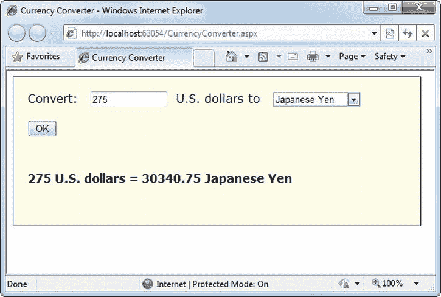
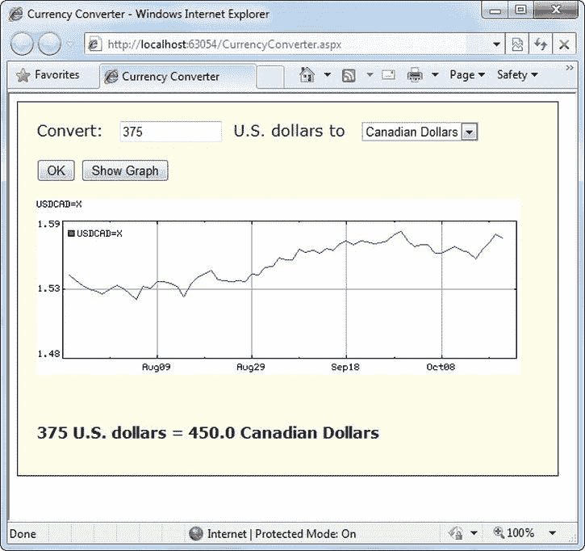

# 五、WebForm 基础知识

在这一章中，你将学到每个 ASP.NET 开发者必须掌握的一些核心话题。您将从仔细研究 ASP.NET 应用模型开始，并考虑什么文件和文件夹属于 web 应用。然后，您将仔细查看*服务器控件* ，它是每个 WebForm 的基本构件。通过使用服务器控件，您将创建您的第一个 ASP.NET 应用，将一个静态 HTML 页面转换成一个简单的单页货币转换器 。

在您掌握了货币转换器示例之后，您就可以探索 ASP 的基础了。NET 的 WebForm 模型。在这个过程中，您会学到一些有用的技能，例如动态创建控件、从一个页面导航到另一个页面以及处理 HTML 中的特殊字符的能力。最后，您将考虑 ASP.NET 配置模型，它允许您调整控制 web 应用行为的设置。

了解 ASP.NET 应用的结构

有时很难准确定义什么是 web 应用。与桌面程序或智能手机应用不同，ASP.NET 网站几乎总是包含多个网页。这种划分意味着用户可以在不同的地方进入 ASP.NET 的“应用”,并通过链接从一个页面进入网站的另一部分或另一个网络服务器。那么，把整个网站当成一个单独的应用有意义吗？

在 ASP.NET，答案是肯定的。每个 ASP.NET 应用共享一组公共的资源和配置设置。来自其他 ASP.NET 应用的网页不共享这些资源，即使它们在同一个 Web 服务器上。从技术上讲，每个 ASP.NET 应用都是在一个单独的*应用域* 中执行的。应用域是内存中的隔离区域，它们确保即使一个 web 应用导致致命错误，也不太可能影响当前在同一台计算机(在本例中，就是 web 服务器)上运行的任何其他应用。同样，应用域限制一个应用中的网页访问另一个应用的内存信息。每个 web 应用都是单独维护的，并且有自己的一组缓存、应用和会话数据。

ASP.NET 应用的标准定义 将其描述为文件、页面、处理程序、模块和可执行代码的组合，可以从 web 服务器上的虚拟目录(以及可选的子目录)中调用。换句话说，虚拟目录是界定应用的基本分组结构。[图 5-1](#Fig00051) 显示了一个 web 服务器 T5，它托管了四个独立的 web 应用。

[图 5-1](#_Fig00051) 。ASP.NET 应用

 **注**虚拟目录 是一个暴露给网络服务器上其他计算机的目录。正如你将在第 26 章中发现的，你通过将它复制到一个虚拟目录来部署你完善的 ASP.NET 网络应用。

ASP.NET 文件类型

ASP.NET 应用可以包括许多类型的 文件。[表 5-1](#Tab00051) 介绍了基本成分。

[表 5-1](#_Tab00051) 。ASP.NET 文件类型

| 文件名 | 描述 |
| --- | --- |
| 结尾是。aspxT2】 | 这些是 ASP.NET 的网页。它们包含用户界面和可选的底层应用代码。用户请求或直接导航到这些页面之一来启动您的 web 应用。 |
| 结尾是。ascxT2】 | 这些是 ASP.NET 用户控件。用户控件类似于网页，只是用户不能直接访问这些文件。相反，他们必须托管在 ASP.NET 的网页。用户控件允许您开发一小块用户界面，并在任意多的 WebForm 中重用它，而无需重复代码。你将在第 11 章中了解用户控制。 |
| web.config | 这是您的 ASP.NET 应用的配置文件。它包括自定义安全性、状态管理、内存管理等设置。本章将介绍 web.config 文件，并在本书中探讨它的设置。 |
| global.asax | 这是全局应用文件。您可以使用该文件来定义全局变量(可以从 web 应用中的任何网页访问的变量)并对全局事件做出反应(例如当 web 应用首次启动时)。你将在本章的后面了解它。 |
| 结尾是。铯 | 这些是包含 C#代码 的代码隐藏文件。它们允许您将应用逻辑从网页的用户界面中分离出来。我们将在本章中介绍代码隐藏模型，并在本书中广泛使用它。 |

此外，您的 web 应用可以包含非特殊 ASP.NET 文件的其他资源。例如，您的虚拟目录可以保存图像文件、HTML 文件或 CSS 样式表。这些资源可能会用在你的 ASP.NET 网页上，也可能会单独使用。一个网站甚至可以将静态的 HTML 页面和动态的 ASP.NET 页面结合起来。

 **注**要访问 ASP.NET 网站，访问者浏览到一个。aspx 页面。[表 5-1](#Tab00051) 中列出的其他文件类型不能直接访问。如果访问者试图请求这些文件中的一个，web 服务器将拒绝该请求(以确保良好的安全性)。当您学习部署一个完整的 web 应用时，您将在第 26 章中了解更多关于 web 服务器如何处理 ASP.NET 文件类型的信息。

ASP.NET 网页文件夹

每个 web 应用都从一个位置开始，称为*根文件夹* 。然而，在一个大型的、精心设计的 web 应用中，您通常会在网站的根文件夹中创建额外的文件夹。例如，当您将网页放在根文件夹中时，您可能希望将图像存储在子文件夹中。或者，您可能希望将公共 ASP.NET 页面放在一个子文件夹中，将受限页面放在另一个子文件夹中，以便根据文件夹应用不同的安全设置。(参见[第 19 章](19.html)了解更多关于如何创建这样的授权规则。)

 **提示**要在 Visual Studio 中创建子文件夹，请在解决方案资源管理器中右键单击您的网站，然后选择“添加新文件夹”。

除了您创建的自定义文件夹，ASP.NET 还使用一些专门的文件夹，它通过名称识别这些文件夹(参见[表 5-2](#Tab00052) )。请记住，在典型的应用中，您不会看到所有这些文件夹。事实上，在一个全新的空白网站中——比如你在《T2》第四章中学到的——你不会有任何子文件夹。相反，Visual Studio 会在您需要时创建它们。

[表 5-2](#_Tab00052) 。ASP.NET 文件夹

| 目录 | 描述 |
| --- | --- |
| 应用 _ 浏览器 | 包含。ASP.NET 用来识别使用您的应用的浏览器并确定其功能的浏览器文件。通常，浏览器信息在整个 web 服务器上是标准化的，你不需要使用这个文件夹。获取有关 ASP。NET 的浏览器支持——这是一个高级功能，大多数普通 web 开发人员可以放心地忽略它——参考*Pro ASP.NET 4.5 in c#*(a press，2012)。 |
| 应用代码 | 包含为在应用中使用而动态编译的源代码文件。 |
| App _ 全球资源 | 存储 web 应用中每个页面都可以访问的全局资源。当您需要一个多种语言的网站时，该目录用于本地化场景。本地化不在本书讨论范围内，你可以参考 C# 中的*Pro ASP.NET 4.5 了解更多信息。* |
| App _ 本地资源 | 与 App_GlobalResources 的作用相同，只是这些资源只能由特定页面访问。 |
| App _ 参考 | 存储对 web 服务的引用，web 服务是 web 应用可以通过网络或 Internet 调用的远程代码例程。 |
| App_Data | 存储数据，包括 SQL Server Express 数据库文件(您将在第 14 章的[中看到)。当然，你可以自由地将数据文件存储在其他目录](14.html)。 |
| 应用主题 | 存储用于在 web 应用中标准化和重用格式的主题。你将在第 12 章中了解主题。 |
| 容器 | 包含所有已编译的。ASP.NET web 应用使用的. NET 组件(dll)。例如，如果你开发一个访问数据库的定制组件(见[第 22 章](22.html))，你将把组件放在这里。ASP.NET 将自动检测该程序集，web 应用中的任何页面都可以使用它。 |

**介绍服务器控件**

在旧式的 web 开发中，程序员在设计动态网页之前，必须掌握 HTML 的特点和细节。页面必须根据特定的任务精心定制，向页面添加新内容的唯一方法是生成原始的 HTML 标签。

ASP.NET 用一个更高级的*服务器控制*模型解决了这个问题。这些控件被创建并配置为*对象* 。它们运行在 web 服务器上，自动提供自己的 HTML 输出，在概念上类似于你在第 2 章中看到的简单的垃圾桶例子。更好的是，服务器控件通过维护状态和引发事件(您可以在代码中对这些事件做出反应),表现得就像 Windows 控件一样。

在第 3 章中，你构建了一个非常简单的网页，它包含了一些你从 Visual Studio 工具箱中拖入的控件。但是在创建一个更复杂的页面之前，有必要后退一步来看看大图。ASP.NET 实际上提供了*两套*服务器端控件，你可以将它们合并到你的 WebForm 中。这两种类型的 控件扮演着微妙不同的角色:

*   HTML 服务器控件:这些是标准 HTML 元素的基于服务器的等价物。如果您是一名经验丰富的 web 程序员，并且喜欢使用熟悉的 HTML 标记，那么这些控件是理想的选择(至少在开始时)。在将普通 HTML 页面或经典 ASP 页面迁移到 ASP.NET 时，它们也很有用，因为它们需要的更改最少。
*   *Web 控件*:这些类似于 HTML 服务器控件，但是它们提供了一个更丰富的对象模型，具有各种属性 用于样式和格式细节。它们还提供了更多的事件，与 Windows 开发中使用的控件更加相似。Web 控件还具有一些没有直接 HTML 等效项的用户界面元素，如 GridView、Calendar 和 validation 控件。

你将在下一章学习 web 控件。在这一章中，你将详细了解 HTML 服务器控件。

 **注意**即使你打算专门使用 web 控件，也值得通读这一节来掌握 HTML 服务器控件的基础知识。在这个过程中，您将了解一些适用于各种服务器控件的 ASP.NET 基本知识，包括视图状态、回发和事件处理。

HTML 服务器控件

HTML 服务器控件 为标准 HTML 元素提供对象接口。它们提供了三个关键特性:

*   *它们生成自己的接口*:你在代码中设置属性，底层 HTML 标签在页面呈现并发送给客户端时自动创建。
*   *它们保留它们的状态*:因为 Web 是无状态的，所以普通的网页需要做大量的工作来存储请求之间的信息。HTML 服务器控件自动处理这项任务。例如，如果用户选择了列表框中的一项，则下次生成页面时该项仍保持选中状态。或者，如果您的代码更改了按钮中的文本，新文本会在下一次页面回发到 web 服务器时被粘贴。
*   它们触发服务器端事件:例如，按钮在被点击时触发一个事件，文本框在其包含的文本被修改时触发一个事件，等等。您的代码可以响应这些事件，就像 Windows 应用中的普通控件一样。如果给定的事件没有发生，事件处理程序将不会被执行。

当您执行快速翻译以将服务器端代码添加到现有 HTML 页面时，HTML 服务器控件是理想的选择。这是您将在下一节中通过一个简单的单页面 web 应用解决的任务。

将 HTML 页面转换成 ASP.NET 页面

[图 5-2](#Fig00052) 显示了一个货币转换器网页 。它允许用户将美元兑换成欧元——或者至少它会这样做，如果它有完成这项工作所需的代码的话。现在，它只是一个普通的，惰性的 HTML 页面。单击按钮时没有任何反应。

[图 5-2](#_Fig00052) 。一个简单的货币转换器

下面的清单显示了这个页面的标记。为了尽可能清楚，这个清单省略了用于边框的

元素的样式属性。这个页面有两个<input>元素:一个用于文本框，一个用于提交按钮。这些元素包含在一个

<form>标签中，所以当按钮被点击时，它们可以向服务器提交信息。页面的其余部分由静态文本组成。`&nbsp;`字符实体用于添加额外的空格来分隔控件。页面顶部的 doctype 声明它是根据现代 HTML5 标准编写的。</form>

<title>货币转换器</title>

<form method="post">

转换: 

<input type="text">

 美元兑换欧元。

< br />

<input type="submit" value="OK">

 **注意**在 HTML 中，很多输入控件 都是用<输入>元素来表示的。您可以设置 type 属性来指示所需的控件类型。<输入 type = "text" >标签是一个文本框，而<输入 type = "submit" >创建一个提交按钮，用于将网页发送回 web 服务器。这与你将在第 6 章中看到的 web 控件有很大不同，后者为每种类型的控件使用不同的元素。

照现在的样子，这个页面看起来不错，但是没有提供任何功能。它完全由用户界面(HTML 元素)组成，不包含任何代码。这是一个普通的 HTML 页面——而不是 WebForm。

将货币转换器转换为 ASP.NET 的最简单方法是从在 Visual Studio 中生成一个新的 WebForm 开始。为此，请遵循以下步骤 :

1.  在解决方案浏览器中右键单击您的网站并选择 Add  Add New Item。
2.  在“添加新项”对话框中，选择“Web 窗体”(它应该在列表中位于第一位)。
3.  键入新页面的名称(如 CurrencyConverter.aspx)。
4.  确保选择了“将代码放在单独的文件中”选项(它位于窗口的右下角)。
5.  单击添加创建页面。

在新的 WebForm 中，删除当前在。aspx 文件，但 page 指令除外。页面指令 给了 ASP.NET 关于如何编译页面的基本信息。它指示代码使用的语言以及连接事件处理程序的方式。如果您使用的是代码隐藏方法(这是推荐的方法), page 指令还会指示代码文件的位置和自定义页面类的名称。

最后，复制原始 HTML 页面的所有内容，并将其粘贴到新页面中，就在页面指令之后。下面是生成的 WebForm，页面指令(粗体)后跟从原始页面复制的 HTML 内容:

**<% @ Page Language = " c# " AutoEventWireup = " true "**

**CodeFile = " currency converter . aspx . cs " Inherits = " currency converter " %>**

<title>货币转换器</title>

转换: 

<input type="text">

 美元兑换欧元。

< br />

<input type="submit" value="OK">

现在您需要将属性`runat =` `"server"`添加到您想要转换成服务器控件的每个标签中。您还应该为每个需要在代码中与之交互的控件添加一个 ID 属性。ID 属性分配唯一的名称，您将使用该名称在代码中引用控件。

在货币转换器应用中，将输入文本框和提交按钮更改为 HTML 服务器控件是有意义的。此外，元素必须作为服务器控件处理，以允许 ASP.NET 访问它包含的控件 。这是修改正确的完整页面:

< % @ Page Language = " c# " AutoEventWireup = " true "

CodeFile = " currency converter . aspx . cs " Inherits = " currency converter " % >

<title>货币转换器</title>

<form runat="server">

转换: 

<input type="text" id="US" runat="server">

 美元兑换欧元。

< br />

<input type="submit" value="OK" id="Convert" runat="server">

 **注意**大多数 ASP.NET 控件必须放在页面中的<窗体>部分内。表单元素是 HTML 表单标准的一部分，它允许浏览器向 web 服务器发送信息。

网页在你运行的时候还是什么都不会做，因为你没有写任何代码。但是，现在您已经将静态 HTML 元素转换为 HTML 服务器控件，您已经准备好使用它们了。

查看状态

若要尝试此页面，请通过单击标准 Visual Studio 工具栏中的“播放”按钮(或直接按 F5)在 Visual Studio 中启动它。请记住，第一次运行 web 应用时，会提示您让 Visual Studio 修改 web.config 文件以允许调试。单击 OK 接受它的建议，并在浏览器中启动您的网页。然后，右键单击页面并在浏览器中选择“查看源代码”,查看 ASP.NET 发送给您的 HTML。

您首先会注意到，发送到浏览器的 HTML 与。aspx 文件。首先把`runat =` `"server"`属性剥离出来(因为它们对客户端浏览器没有意义，客户端浏览器无法解读)。其次，也是更重要的，表单中添加了一个额外的隐藏字段。以下是您将看到的内容(以稍微简化的形式):

<title>货币转换器</title>

**<输入 type = " hidden " name = " _ _ VIEWSTATE " ID = " _ _ VIEWSTATE "**

**值= " ddw 3 ndg 2 nti 5 MDG 7 oz 4…/>t1]**

**<输入 type = " hidden " name = " _ _ event validation " ID = " _ _ event validation "**

**值= "/wewawlr 3 rrbglr 797…"/>**

转换: 

<input type="text" id="US" name="US">

 美元兑换欧元。

< br />

<input type="submit" value="OK" id="Convert" name="Convert">

敏锐的眼睛会注意到 ASP.NET 添加了两个新的隐藏的<input>元素，每个元素都嵌套在一个单独的

元素容器中。第二个隐藏字段用于阻止某些类型的网页篡改。它在幕后工作。更有趣的是第一个隐藏字段，它以压缩格式存储关于页面中每个控件状态的信息:

< input type = " hidden " name = " _ _ VIEWSTATE " ID = " _ _ VIEWSTATE "

值= "dDw3NDg2NTI5MDg7Oz4…" />

这个信息被称为页面的*视图状态*。

因为视图状态信息存储在您的页面中，所以您的代码可以随时更改控件属性，并且这些更改将自动“保留”例如，如果您更改了一个框的背景颜色，无论网页在浏览器和 web 服务器之间来回发送多少次，该框都将保持其新颜色。这是 web 窗体编程模型的关键部分。多亏了视图状态，你可以经常忘记互联网的无状态本质，把你的页面当作一个连续运行的应用。

尽管货币转换器程序还没有包含任何代码，但是您已经注意到了一个变化。如果您在文本框中输入信息并单击提交按钮提交页面，刷新后的页面仍将包含您在文本框中输入的值。(在使用普通 HTML 元素的原始示例中，每次提交页面时都会清除该值。)发生这种变化是因为 ASP.NET 控件自动保持它们的状态。

HTML 控件类

在继续使用货币转换器之前，您需要了解您已经创建的控件对象。所有的 HTML 服务器控件都在系统中定义。web . ui . html 控件命名空间。每种控件都有一个单独的类。表 5-3 描述了基本的 HTML 服务器控件，并展示了相关的 HTML 元素。

[表 5-3](#_Tab00053) 。HTML 服务器控件类

| 类别名 | HTML 元素 | 描述 |
| --- | --- | --- |
| html 表单 |  | 包装网页上的所有控件。所有 ASP.NET 服务器控件都必须放在 HtmlForm 控件中，以便在提交页面时可以将数据发送到服务器。Visual Studio 将元素添加到所有新页面中。当设计一个网页时，你需要确保你添加的每一个控件都被放置在

<form>部分中。</form>

 |
| htmlanchor |  | 用户单击以跳转到另一页的超链接。 |
| HtmlImage |  | 指向图像的链接，该图像将被插入到网页的当前位置。 |
| HtmlTable、HtmlTableRow 和 HtmlTableCell | 、、

&#124; 和 &#124;  &#124;

 | 显示多行和多列静态文本的表格。 |
| HtmlInputButton、HtmlInputSubmit 和 HtmlInputReset | <input type="button">、<input type="submit">和<input type="reset"> | 用户单击以执行操作(HtmlInputButton)、提交页面(HtmlInputSubmit)或清除所有控件中所有用户提供的值(HtmlInputReset)的按钮。 |
| html 按钮 |  | 用户单击以执行操作的按钮。并非所有浏览器都支持这一点，因此通常使用 HtmlInputButton。关键区别在于 HtmlButton 是一个容器元素。因此，你可以在里面插入任何东西，包括文本和图片。另一方面，HtmlInputButton 是纯文本的。 |
| 控件 | <input type="checkbox"> | 用户可以选择或清除的复选框。不包含任何自己的文本。 |
| 单选框 | <input type="radio"> | 可以在组中选择的单选按钮。不包含任何自己的文本。 |
| HtmlInputText 和 HtmlInputPassword | <input type="text">和<input type="password"> | 允许用户输入信息的单行文本框。也可以显示为密码字段(显示项目符号而不是字符来隐藏用户输入)。 |
| html 文本区域 | <textarea></td> <td>用于键入多行文本的大文本框。</td> </tr> <tr> <td>HtmlInputImage</td> <td><input type="image"/></td> <td>类似于标签，但是插入了一个提交页面的“可点击”图像。使用服务器端代码，您可以准确地确定用户在图像中单击的位置——您将在本章的后面考虑这一技术。</td> </tr> <tr> <td>文件框</td> <td><input type="file"/></td> <td>一个浏览按钮和文本框，可用于将文件上传到您的网络服务器，如第 17 章所述。</td> </tr> <tr> <td>HtmlInputHidden</td> <td><input type="hidden"/></td> <td>包含当页面回发时将发送到服务器的文本信息，但在浏览器中不可见。</td> </tr> <tr> <td>HtmlSelect</td> <td><select/></td> <td>允许用户选择项目的下拉列表框或常规列表框。</td> </tr> <tr> <td>HtmlHead 和 HtmlTitle</td> <td>和<title/></td> <td>表示网页的标题信息，包括实际上不在网页中显示的网页信息，如搜索关键字和网页标题。这些是唯一没有放在<form>部分的 HTML 服务器控件。</form></td> </tr> <tr> <td>一般控件</td> <td>任何其他 HTML 元素。</td> <td>该控件可以表示各种没有专用控件类的 HTML 元素。例如，如果您将<code>runat="server"</code>属性添加到元素中，它将作为 HtmlGenericControl 对象提供给代码。您可以通过读取 TagName 属性来识别元素的类型，该属性存储一个字符串(例如，“div”)。</td> </tr> </tbody> </table> 
记住，有两种方法可以添加任何 HTML 服务器控件。您可以手动将其添加到。aspx 文件(只需插入普通的 HTML 元素，并添加<code>runat =</code> <code>"server"</code>属性)。或者，您可以将控件从 Visual Studio 工具箱的 HTML 部分拖动到网页的设计图面上。然而，这种方法并不适用于每一个 HTML 服务器控件，因为它们并不都出现在工具箱中。
 
到目前为止，货币转换器定义了三个控件，分别是 HtmlForm、HtmlInputText 和 HtmlInputButton 类的实例。如果你想在微软的 MSDN 网站(<code>http://tinyurl.com/cq63b6m</code>)上的类库参考中查找关于这些类的信息，知道类名是很有用的。<a href="#Tab00054" id="_Tab00054">表 5-4 </a>给出了一些最重要的控制属性的快速概述。
 
<a href="#_Tab00054">表 5-4 </a>。重要的 HTML 控件属性
 <table> <thead> <tr class="header"> <th>控制</th> <th>最重要的属性</th> </tr> </thead> <tbody> <tr> <td>htmlanchor</td> <td>HRef，目标</td> </tr> <tr> <td>HtmlImage</td> <td>Src，Alt，宽度，高度</td> </tr> <tr> <td>HtmlInputCheckBox 和 HtmlInputRadioButton</td> <td>检查</td> </tr> <tr> <td>单行文本框</td> <td>价值</td> </tr> <tr> <td>html 文本区域</td> <td>价值</td> </tr> <tr> <td>HtmlInputImage</td> <td>Src， Alt</td> </tr> <tr> <td>HtmlSelect</td> <td>项目(集合)</td> </tr> <tr> <td>一般控件</td> <td>InnerText 和 InnerHtml</td> </tr> </tbody> </table> 
添加货币转换器代码 
 
为了给货币转换器添加一些功能，您需要添加一些 ASP.NET 代码。WebForm 是事件驱动的，这意味着每段代码都响应特定的事件。在简单的货币转换器页面示例中，最有用的事件发生在用户单击提交按钮(名为 Convert)时。HtmlInputButton 允许您通过处理 ServerClick 事件来对此动作做出反应。
 
在继续之前，添加另一个可以显示计算结果的控件是有意义的。在这种情况下，您可以使用 HTML 
或段落。元素是将格式化文本块插入网页的一种方式。下面的 HTML 创建了一个名为 Result 的

元素，该元素开始时没有文本:

 
<code>
<code>"font-weight: bold" ID =</code><code>"Result" runat =</code>T3】
 
style 属性应用用于格式化文本的 CSS 属性。在这个例子中，它只是使用 CSS font-weight 属性应用了一种粗体字体。如果你不熟悉 CSS，不要担心——你会在第 12 章中更深入地了解它的要点。
 
该示例现在有以下四个服务器控件:
 <ul class="bulleted"> <li>表单(由 HtmlForm 对象表示)。这是代码隐藏类中唯一不需要访问的控件。</li> <li>名为 US 的输入文本框(HtmlInputText 对象)。</li> <li>名为 Convert 的提交按钮(HtmlInputButton 对象)。</li> <li>一个名为 Result 的
元素(HtmlGenericControl 对象)。
</li> </ul> 
清单 5-1 显示了修改后的网页(CurrencyConverter.aspx )，但是省略了 doctype 以节省空间。<a href="#list00052" id="_list00052">清单 5-2 </a>展示了代码隐藏类(currency converter . aspx . VB currency converter . aspx . cs)。代码隐藏类包括一个事件处理程序，当单击“转换”按钮时，该事件处理程序会做出反应。它计算货币转换并显示结果。
 
<i> <b> <a href="#_list00051" id="list00051">清单 5-1。</a></b>T5】currency converter . aspx</i>
 
< % @ Page Language = " c# " AutoEventWireup = " true "
 
CodeFile = " currency converter . aspx . cs " Inherits = " currency converter " % >
 
 
 
 
<title>货币转换器</title>
 
 
 
<form runat="server"/>
 

 
转换: 
 
<input type="text" ID="US" runat="server"/>
 
 美元兑换欧元。
 
  < br />
 
< input type = " submit " value = " OK " ID = " Convert " runat = " server "
 
OnServerClick = "Convert_ServerClick" />
 
  < br />
 

 

 
 
 
 
 
<i> <b> <a href="#_list00052" id="list00052">清单 5-2。</a></b></i>currency converter . aspx . cs
 
使用系统；
 
使用系统。集合。泛型；
 
使用系统。Linq
 
使用系统。Web
 
使用系统。Web . UI
 
使用系统。Web . UI.WebControls
   
公共分部类 CurrencyConverter : System。网页界面
 
{
 
受保护的 void Convert_ServerClick(对象发送方，EventArgs e)
 
{
 
decimal USAmount = Decimal.Parse（US.值）;
 
十进制欧元安装 = USAmount * 0.85 M;
 
结果呢？innertext = usamount。tostring()++美元= "；
 
结果呢？intratext+=欧元金额。tostring()++欧元。"；
 
}
 
}
 
代码隐藏类是 ASP.NET 页面的典型例子。您会注意到以下约定:
 <ul class="bulleted"> <li>它以几个使用语句的<i>开始。这提供了对所有重要名称空间的访问。这是任何代码隐藏文件中典型的第一步。</i></li> <li>页面类是用<code>partial</code>关键字 T3】定义的。这是因为您的类代码与另一个您从未见过的代码文件合并在一起。ASP.NET 自动生成的这段额外代码定义了页面上使用的所有服务器控件。这允许您在代码中按名称访问它们。</li> <li>该页面定义了一个事件处理程序。该事件处理程序从文本框中检索值，将其转换为数值，乘以预设的转换率(通常存储在另一个文件或数据库中)，并设置< p >元素的文本。您会注意到事件处理程序接受两个参数(sender 和 e)。这是。所有控制事件的. NET 标准。它允许您的代码标识发送事件的控件(通过 sender 参数)并检索可能与该事件关联的任何其他信息(通过 e 参数)。您将在下一章看到这些高级技术的例子，但是现在，重要的是要认识到，除非您的事件处理程序有正确的匹配签名，否则您不被允许处理事件。</li> <li>事件处理程序通过使用按钮的<input/>标记中的 OnServerClick 属性连接到控件事件。在下一节中，您将了解更多关于这个连接如何工作的信息。</li> </ul> 
 <b>注意</b>与 web 控件不同，您不能使用属性窗口为 HTML 服务器控件创建事件处理程序。相反，您必须手动键入方法，确保在末尾包含 Handles 子句。另一种选择是使用代码窗口顶部的两个下拉列表。要采用这种方法，请在左侧列表中选择控件(例如，Convert)，然后在右侧列表中选择要处理的事件(例如，ServerClick)。Visual Studio 将创建相应的事件处理程序。相反，您必须手动键入方法。您还必须修改控制标记来连接您的事件处理程序。例如，要将 Convert 按钮连接到名为 Convert_ServerClick 的方法，必须将<code>OnServerClick =</code> <code>"Convert_ServerClick"</code>添加到 control 标记中。
 <ul class="bulleted"> <li><code>+</code> =运算符 用于在标签末尾快速添加信息，而不替换现有文本。</li> <li>事件处理程序使用 ToString() 将十进制值转换为文本，以便将其添加到 InnerText 属性中。在这个特定的语句中，您不需要 ToString()，因为 C#足够智能，能够意识到您正在将文本片段连接在一起。然而，情况并不总是这样，所以最好明确说明数据类型转换。</li> </ul> 
您可以启动此页面来测试您的代码。当你输入一个值并点击 OK 按钮时，页面被重新提交，事件处理代码运行，页面返回给你转换细节(见<a href="#Fig00053" id="_Fig00053">图 5-3 </a>)。
 

 
<a href="#_Fig00053">图 5-3 </a>。ASP.NET 货币转换器
 
事件处理
 
当用户点击“转换”按钮，页面被发送回 web 服务器时，ASP.NET 需要确切地知道您想要运行什么代码。要创建这种关系并将事件连接到事件处理方法，需要在控件标记中添加一个属性。
 
例如，如果要处理 Convert 按钮的 ServerClick 方法，只需在 control 标记中用要使用的事件处理程序的名称设置 OnServerClick 属性:
 
 
OnServerClick = " Convert _ server click " runat = " server " >
 
ASP.NET 控件总是使用这种语法。当在控制标记中附加一个事件处理程序时，您使用在上以单词<i>开头的事件名称。例如，如果要处理名为 ServerChange 的事件，可以在名为 OnServerChange 的控制标记中设置一个属性。当您在设计图面上双击服务器控件时，Visual Studio 会添加事件处理程序，并将事件属性设置为匹配。(现在您已经理解了这个过程，您将理解一个常见错误的来源。如果双击一个控件来创建一个事件处理程序，但随后又删除了事件处理方法，那么最终会得到一个指向不存在的事件的事件属性。因此，下次运行该页面时，您会收到一个错误。要解决这个问题，您需要从控件标记中移除事件属性。)</i>
 
 <b>注意</b>有一个 ASP.NET 对象没有使用这个属性系统，因为它没有控制标签——网页。相反，ASP.NET 根据方法名连接网页事件。换句话说，如果您的 Page 类中有一个名为 Page_Load()的方法，并且它有正确的签名(它接受两个参数，一个表示发送者的对象和一个 EventArgs 对象)，ASP.NET 将这个事件处理程序连接到页面。自动加载事件。该功能被称为<i>自动事件连线</i>。
 
ASP.NET 允许你使用另一种技术来连接事件——你可以通过使用代码来做到这一点，就像你在第 3 章中看到的那样。例如，下面是使用手动事件连接来连接 Convert 按钮的 ServerClick 事件所需的代码:
 
转换。ServerClick + = this。Convert _ ServerClick
 
如果您使用这样的代码，您可能会将它添加到 Page_Load()方法中，以便它在页面首次初始化时连接您的事件处理程序。
 
既然 Visual Studio 处理事件连接，为什么 ASP.NET 开发人员要关心他们有两种方法来连接事件处理程序呢？嗯，大部分时间你不会担心。但是手动事件连接技术在某些情况下是有用的。最常见的例子是，您希望创建一个控件对象，并在运行时将其动态添加到页面中。在这种情况下，您不能通过控制标记来连接事件处理程序，因为没有控制标记。相反，您需要创建控件并使用代码附加其事件处理程序。(下一章有一个如何使用动态控件创建来填充表格的例子。) 
 
货币转换器的幕后操作
 
那么，当 ASP.NET 收到对 CurrencyConverter.aspx 页面的请求时，实际上会发生什么呢？该过程分几个步骤展开: 
 <ol class="OrderedList"> <li>对页面的请求被发送到 web 服务器。如果你运行的是一个实时网站，网络服务器几乎肯定是 IIS，你会在第 26 章中了解更多。如果您在 Visual Studio 中运行页面，请求将被发送到内置的测试服务器。</li> <li>web 服务器确定。aspx 文件扩展名已在 ASP.NET 注册。如果文件扩展名属于另一个服务(就像它属于。html 文件)，ASP.NET 绝不会参与其中。</li> <li>如果这是该应用中的页面第一次被请求，ASP.NET 会自动创建应用域。它还编译所有网页代码以获得最佳性能，并缓存编译后的文件。如果这项任务已经执行，ASP.NET 将重用页面的编译版本。</li> <li>编译后的 CurrencyConverter.aspx 页面就像一个微型程序。它开始触发事件(最明显的是页面。加载事件)。但是，您还没有为该事件创建事件处理程序，所以没有代码运行。在这个阶段，所有东西都作为一组内存一起工作。NET 对象。</li> <li>当代码完成时，ASP.NET 要求网页中的每个控件将其自身呈现到相应的 HTML 标记中。</li> </ol> 
 <b>提示</b>事实上，ASP.NET 做了一点小手脚，如果它检测到客户端浏览器支持的话，可以用额外的客户端 JavaScript 或 DHTML 定制输出。对于 CurrencyConverter.aspx，页面的输出过于简单，不需要这种类型的自动调整。
 <ul class="bulleted1"> <li>6.最后一页发送给用户，应用结束。</li> </ul> 
描述是冗长的，但是从对基本原理的良好理解开始是很重要的。当您单击页面上的按钮时，整个过程会重复一遍。但是，在第 4 步中，ServerClick 事件在页面之后立即为 HtmlInputButton 触发。加载事件，您的代码就会运行。
 
图 5-4 说明了网页请求的各个阶段。
 

 
<a href="#_Fig00054">图 5-4 </a>。ASP.NET 请求中的阶段
 
最重要的细节是您的代码与对象一起工作。最后一步是将这些对象转换成适当的 HTML 输出。中的 Windows 程序也会发生类似的从对象到输出的转换。但是它是如此的自动化，以至于程序员很少考虑它。此外，在那些环境中，代码总是在本地运行。在 ASP.NET 应用中，代码运行在服务器上受保护的环境中。只有在网页处理结束并且网页对象从内存中释放后，客户端才能看到结果。
 
错误处理
 
货币转换器希望用户在单击“转换”按钮之前输入一个数字。如果用户输入其他内容，例如，不能被解释为数字的一系列文本或特殊字符，当代码试图使用小数时将会出错。Parse()方法。在当前版本的货币转换器中，这个错误将完全破坏事件处理代码。因为这个例子不包括任何处理错误的代码，ASP.NET 将简单地向用户发送一个描述问题的错误页面。
 
在第 7 章中，你将学习如何通过捕捉错误、中和错误以及更优雅地通知用户来处理错误。然而，即使没有这些能力，您也可以重新编写响应 ServerClick 事件的代码，以避免潜在的错误。一个好的方法是使用十进制。TryParse()方法代替十进制。Parse()。与 Parse()不同，如果转换失败，TryParse()不会生成错误—它只是通知您有问题。
 
TryParse()接受两个参数。第一个参数是要转换的值(在本例中，是 US。值)。第二个参数是一个输出参数，它将接收转换后的值(在本例中是名为 USAmount 的变量)。TryParse()的特殊之处在于它的布尔返回值，它指示转换是成功(true)还是失败(false)。
 
下面是 ServerClick 事件处理程序的修订版，它使用 TryParse()来检查转换问题并通知用户:
 
<code>protected void Convert_ServerClick(object sender, EventArgs e)</code>
 
<code>{</code>
 
<code>decimal USAmount;</code>
 
 
 
<code>// Attempt the conversion.</code>
 
<code>bool success</code> = <code>Decimal.TryParse(US.Value, out USAmount);</code>
 
 
 
<code>// Check if it succeeded.</code>
 
<code>if (success)</code>
 
<code>{</code>
 
<code>// The conversion succeeded.</code>
 
<code>decimal euroAmount</code> = <code>USAmount * 0.85M;</code>
 
<code>Result.InnerText</code> = <code>USAmount.ToString()</code> + <code>" U.S. dollars</code> = <code>";</code>
 
<code>Result.InnerText +</code> <code>= euroAmount.ToString()</code> + <code>" Euros.";</code>
 
<code>}</code>
 
<code>else</code>
 
<code>{</code>
 
<code>// The conversion failed.</code>
 
<code>Result.InnerText</code> = <code>"The number you typed in was not in the " +</code>
 
<code>"correct format. Use only numbers.";</code>
 
<code>}</code>
 
<code>}</code>
 
处理这样的错误条件是现实世界的网页中的一项基本技术。 
 
<b>改进货币转换器</b> 
 
现在，您已经了解了基本的服务器控件，与学习一套全新的 web 编程系统的成本相比，它们的好处似乎微不足道。在本节中，您将开始扩展货币转换器应用。您将看到如何以优雅、模块化的方式将附加功能“嵌入”到现有程序中。随着程序的增长，ASP.NET 很容易处理它的复杂性，因为它干净地将 HTML 标记与操作它的代码分开。
 
添加多种货币 
 
第一个任务是允许用户选择目的地货币。在这种情况下，您需要使用下拉列表框。在 HTML 中，下拉列表由包含一个或多个<option>元素的<select>元素表示。每个<option>元素对应于列表中的一个单独的项目。</option></select></option>
 
为了减少货币转换器中 HTML 的数量，您可以通过添加一个空的<select>标签来定义一个没有任何列表项的下拉列表。只要您确保这个<select>标签是一个服务器控件(通过给它一个 ID 并添加<code>runat =</code> <code>"server"</code>属性)，您就能够在代码中与它进行交互，并在页面加载时添加所需的项目。</select></select>
 
以下是 CurrencyConverter.aspx 页面的修订版 HTML:
 
< % @ Page Language = " c# " AutoEventWireup = " true "
 
CodeFile = " currency converter . aspx . cs " Inherits = " currency converter " % >
 
 
http://www.w3.org/1999/xhtml
 
">
 
 
<title>货币转换器</title>
 
 
 
<form runat="server"/>
 

 
转换: 
 
<input type="text" ID="US" runat="server"/>
 
 美元兑 
 
<b> <选择 ID = "货币" runat = "服务器"/ > </b>
 
  < br />
 
 
OnServerClick = " Convert _ server click " runat = " server "/>
 
  < br />
 

 

 
 
 
 
 
现在可以在运行时使用代码填充货币列表。在这种情况下，理想的事件是页面。Load 事件，该事件在页面处理序列开始时触发。下面是您需要添加到 CurrencyConverter 页面类的代码:
 
受保护的 void Page_Load(对象发送方，EventArgs e)
 
{
 
如果(这个。IsPostBack == false)
 
{
 
货币。Items.Add("欧元")；
 
货币。Items.Add("日元")；
 
货币。Items.Add("加拿大元")；
 
}
 
}
 
<b>剖析代码……</b>
 
这个例子说明了两个要点:
 <ul class="bulleted"> <li>可以使用 Items 属性获取列表控件中的项。这允许您追加、插入和删除<option>元素(代表列表中的项目)。请记住，当使用服务器控件生成动态内容时，您设置属性，控件创建适当的 HTML 标记。</option></li> <li>在向该列表添加任何项目之前，您需要确保这是该页面第一次提供给该特定用户。否则，每当用户与页面交互时，页面会不断地向列表中添加更多的项目，或者无意中覆盖用户的选择。要执行此测试，您需要检查当前页面的 IsPostBack 属性。换句话说，IsPostback 是 CurrencyConverter 类的一个属性，CurrencyConverter 从通用 Page 类继承而来。如果 IsPostBack 为 false，则该页面是第一次被创建，初始化它是安全的。</li> </ul> 
在列表中存储信息
 
当然，如果您是 HTML 编码老手，您会知道列表中的每一项都提供了一个值属性，您可以用它来存储列表中每一项的值。因为货币转换器使用硬编码货币的简短列表 ，所以这是存储货币兑换率的理想位置。
 
要设置 value 属性，需要为列表中的每一项创建一个 ListItem 对象，并将其添加到 HtmlSelect 控件中。ListItem 类提供了一个构造函数，允许您在创建它的同时指定文本和值，从而允许类似如下的精简代码:
 
<code>protected void Page_Load(Object sender, EventArgs e)</code>
 
<code>{</code>
 
<code>if (this.IsPostBack == false)</code>
 
<code>{</code>
 
<code>// The HtmlSelect control accepts text or ListItem objects.</code>
 
<code>Currency.Items.Add(new ListItem("Euros", "0.85"));</code>
 
<code>Currency.Items.Add(new ListItem("Japanese Yen", "110.33"));</code>
 
<code>Currency.Items.Add(new ListItem("Canadian Dollars", "1.2"));</code>
 
<code>}</code>
 
<code>}</code>
 
要完成该示例，您必须重写计算代码以考虑所选货币，如下所示:
 
受保护的 void Convert_ServerClick(对象发送方，EventArgs e)
 
{
 
十进制旧阿芒特;
 
bool 成功=小数。TryParse(美国。值，out old amount)；
 
 
 
如果(成功)
 
{
 
//通过索引号检索选定的 ListItem 对象。
 
ListItem item =货币。项目[货币。SelectedIndex]；
 
 
 
decimal newAmount = oldAmount * Decimal.Parse（item.值）;
 
结果呢？innertext = oldamount。tostring()++美元= "；
 
Result.InnerText + = newAmount.ToString（） + " + item.文本;
 
}
 
}
 
<a href="#Fig00055" id="_Fig00055">图 5-5 </a>显示了改进后的货币转换器。
 

 
<a href="#_Fig00055">图 5-5 </a>。多货币转换器
 
总之，这是一个很好的例子，说明如何使用 value 属性在 HTML 标签中存储信息。然而，在一个更现实的应用中，您实际上不会将汇率存储在列表中。相反，您只需存储某种唯一的标识 ID 值。然后，当用户提交页面时，您将从另一个存储位置(如数据库)检索相应的转换率。
 
添加链接图像
 
向货币转换器添加其他功能就像添加一个新按钮一样简单。例如，实用程序显示货币兑换率图表可能会很有用。为了提供这个特性，程序需要一个额外的按钮和图像控件 。
 
下面是修改后的 HTML:
 
< % @ Page Language = " c# " AutoEventWireup = " true "
 
CodeFile = " currency converter . aspx . cs " Inherits = " currency converter " % >
 
 
 
 
<title>货币转换器</title>
 
 
 
<form runat="server"/>
 

 
转换: 
 
<input type="text" ID="US" runat="server"/>
 
 美元兑 
 
<select ID="Currency" runat="server"/>
 
  < br />
 
 
OnServerClick = " Convert _ server click " runat = " server "/>
 
<b> <输入 type = " submit " value = " Show Graph " ID = " ShowGraph " runat = " server "/></b>
 
<b><【br/><【br/></b>
 
<b>T1】</b>
 
  < br />
 

 

 
 
 
 
 
正如目前所宣称的那样，该图像并不是指一张图片。因此，当页面第一次加载时，使用以下代码隐藏它是有意义的:
 
<code>protected void Page_Load(Object sender, EventArgs e)</code>
 
<code>{</code>
 
<code>if (this.IsPostBack == false)</code>
 
<code>{</code>
 
<code>Currency.Items.Add(new ListItem("Euros", "0.85"));</code>
 
<code>Currency.Items.Add(new ListItem("Japanese Yen", "110.33"));</code>
 
<code>Currency.Items.Add(new ListItem("Canadian Dollars", "1.2"));</code>
 
 
 
<b>图。可见=假；</b>
 
<code>}</code>
 
<code>}</code>
 
有趣的是，当一个服务器控件被隐藏时，ASP.NET 会在最终的 HTML 页面中忽略它。
 
现在您可以处理 new 按钮的 click 事件来显示适当的图片。货币转换器有三种可能的图片 files—pic0.png、pic1.png 和 pic2.png。它根据所选项的索引选择一种货币(因此，如果选择了第一种货币，它使用 pic0.png，选择了第二种货币，以此类推)。下面是显示图表的代码:
 
<code>protected void ShowGraph_ServerClick(Object sender, EventArgs e)</code>
 
<code>{</code>
 
<code>Graph.Src</code> = <code>"Pic"</code> + <code>Currency.SelectedIndex.ToString()</code> + <code>".png";</code>
 
<code>Graph.Visible</code> = <code>true;</code>
 
<code>}</code>
 
您需要确保通过按钮链接到事件处理程序，因此修改按钮的<input/>元素，如下所示:
 
<code><input type =</code><code>"submit" value =</code><code>"Show Graph" ID =</code>T3】
 
<code>OnServerClick =</code><code>"ShowGraph_ServerClick" runat =</code>T2】
 
当货币发生变化时，您还需要使用 Convert_ServerClick()方法中的这行代码来改变图表图片:
 
<code>Graph.Src</code> = <code>"Pic"</code> + <code>Currency.SelectedIndex.ToString()</code> + <code>".png";</code>
 
如果这是一个更复杂的任务(例如，一个需要多行代码的任务)，将它放在一个单独的私有方法中是有意义的。然后，您可以从 ShowGraph_ServerClick()和 Convert_ServerClick()事件处理方法中调用该方法，确保您没有重复代码。
 
货币转换器已经开始看起来更有趣了，如图 5-6 所示。
 

 
<a href="#_Fig00056">图 5-6 </a>。带有图像控件的货币转换器
 
 <b>提示</b>当然，在真正的货币转换器中，一张固定的图片是不行的。您可以从数据库中提取最近的图像，但最有可能的是，您希望使用服务器端的绘图指令自己生成货币图表。第 11 章解释了你将如何着手这项有些乏味的任务。
 
设置样式
 
除了一组有限的属性，每个 HTML 控件还通过其样式集合 提供对 CSS 属性的访问。若要使用此集合，您需要指定 CSS 样式属性的名称以及要分配给它的值。下面是基本语法:
 
<code>ControlName.Style["AttributeName"]</code> = <code>"AttributeValue";</code>
 
例如，您可以使用这种技术用红色强调货币转换器中的无效条目。在这种情况下，您还需要将颜色重置为有效输入的原始值，因为控件使用视图状态来记住其所有设置，包括其样式属性:
 
受保护的 void Convert_ServerClick(对象发送方，EventArgs e)
 
{
 
十进制旧阿芒特;
 
bool 成功=小数。TryParse(美国。值，out old amount)；
 
 
 
<b> if((旧金额< = 0) &#124;&#124;(成功==假))</b>
 
<b> { </b>
 
<b>结果。style[" color "]= " Red "；</b>
 
<b>结果。InnerText = "指定一个正数"；</b>
 
<b> } </b>
 
<b>否则</b>
 
<b> { </b>
 
<b>结果。style[" color "]= " Black "；</b>
 
 
 
//通过索引号检索选定的 ListItem 对象。
 
ListItem item =货币。项目[货币。SelectedIndex]；
 
 
 
decimal newAmount = oldAmount * Decimal.Parse（item.值）;
 
结果呢？innertext = oldamount。tostring()++美元= "；
 
Result.InnerText + = newAmount.ToString（） + " + item.文本;
 
<b> } </b>
 
}
 
 <b>提示</b>样式集合设置 HTML 标签 中的样式属性，带有一系列格式选项，如字体系列、大小和颜色。你会在第 12 章学到更多。但是如果你不熟悉 CSS 样式，你不需要使用它们。相反，您可以使用 web 控件，这些控件提供更高级别的属性，允许您配置它们的外观并自动创建适当的样式属性。你将在下一章学习 web 控件。
 
简单的货币转换器应用到此结束，它现在拥有自动计算、链接图像和动态格式。在接下来的部分中，您将更仔细地查看 ASP.NET 接口的构建块。
 
<b>深入了解 HTML 控件类</b>
 
中的相关类。NET Framework 使用继承来共享功能。例如，每个 HTML 控件都从基类 HTML control 继承。HtmlControl 类提供了每个 HTML 服务器控件使用的基本特性。<a href="#Fig00057" id="_Fig00057">图 5-7 </a>显示了 的传承示意图。
 

 
<a href="#_Fig00057">图 5-7 </a>。HTML 控件继承
 
本节剖析用于 HTML 服务器控件的 ASP.NET 类。您可以使用这些材料来帮助理解所有 HTML 控件共享的公共元素。关于每个 HTML 控件的具体细节，可以参考 MSDN 网站<code>http://tinyurl.com/cq63b6m</code>上的类库参考。
 
HTML 服务器控件通常提供与其标记属性非常匹配的属性。例如，HtmlImage 类提供了 Align、Alt、Border、Src、Height 和 Width 属性。因此，熟悉 HTML 语法的用户会发现 HTML 服务器控件是最合适的。不习惯 HTML 的用户可能会发现 web 控件(在下一章描述)有一组更直观的属性。
 
HTML 控件事件
 
HTML 服务器控件还提供两种可能的事件之一:ServerClick 或 ServerChange。
 
ServerClick 事件 只是一个在服务器端处理的点击。它由大多数按钮控件提供，它允许您的代码立即采取行动。例如，考虑 HtmlAnchor 控件，它是表示常见 HTML 超链接的服务器控件(<元素>)。有两种方法可以使用 HtmlAnchor 控件。一种方法是设置它的 HtmlAnchor。HRef 属性设置为 URL，在这种情况下，超链接的行为就像普通的 HTML < a >元素一样(唯一的区别是您可以在代码中动态设置 URL)。另一个选项是处理 HtmlAnchor。ServerClick 事件。在这种情况下，当单击链接时，它实际上会回发页面，从而允许您的代码运行。除非您提供额外的代码来转发请求，否则用户不会被重定向到新页面。
 
当对文本或选择控件进行更改时，ServerChange 事件 会做出响应。该事件并不像看起来那样有用，因为它直到页面回发时才会发生(例如，在用户单击提交按钮后)。此时，所有已更改的控件都会发生 ServerChange 事件，随后是适当的 ServerClick。这一页。Load 事件首先触发，但是您无法知道其他控件的事件顺序。
 
表 5-5 显示了哪些控件提供了 ServerClick 事件，哪些提供了 ServerChange 事件。
 
<a id="Tab00055" href="#_Tab00055">表 5-5 </a>。HTML 控件事件
 <table> <thead> <tr class="header"> <th>事件</th> <th>提供它的控件</th> </tr> </thead> <tbody> <tr> <td>服务器点击</td> <td>HtmlAnchor、HtmlButton、HtmlInputButton、HtmlInputImage、HtmlInputReset</td> </tr> <tr> <td>服务器更改</td> <td>HtmlInputText、HtmlInputCheckBox、htmlinputhidden、HtmlInputHidden、HtmlSelect、HtmlTextArea</td> </tr> </tbody> </table> 
带有 HtmlInputImage 控件的高级事件 
 
<a href="04.html">第四章</a>介绍了。NET 事件标准，它规定每个事件应该正好传递两条信息。第一个参数标识触发事件的对象(在本例中为控件)。第二个参数是一个特殊的对象，它可以包含关于事件的附加信息。
 
到目前为止，在您看到的例子中，第二个参数(e)总是用于传递一个空系统。EventArgs 对象。这个对象不包含任何附加信息，它只是一个美化了的占位符。这里有一个这样的例子:
 
<code>protected void Convert_ServerClick(Object sender,</code> EventArgs 和<code>)</code>
 
<code>{ … }</code>
 
事实上，只有一个 HTML 服务器控件发送附加信息:HtmlInputImage 控件。它发送一个 ImageClickEventArgs 对象(从系统。Web.UI 命名空间)，它提供表示图像被单击的位置的 X 和 Y 属性。您会注意到 HtmlInputImage 的定义。ServerClick 事件处理程序与用于其他控件的事件处理程序略有不同:
 
<code>protected void ImgButton_ServerClick(Object sender,</code>图像点击功能和<code>)</code>
 
<code>{ … }</code>
 
使用这些附加信息，可以用单个智能 HtmlInputImage 控件替换多个按钮控件和图像映射。
 
以下是为该示例创建 HtmlInputImage 控件所需的标记:
 
<code><input type =</code><code>"image" ID =</code><code>"ImgButton" runat =</code><code>"server" src =</code>T4】
 
<code>OnServerClick =</code> <code>"ImgButton_ServerClick" /></code>
 
图 5-8 中的示例 ImageTest.aspx 页面通过一个简单的图形按钮来实现这个特性。根据用户是单击按钮边框还是按钮表面，会显示不同的消息。
 

 
<a href="#_Fig00058">图 5-8 </a>。使用 HtmlInputImage 控件
 
页面代码检查由 ImageClickEventArgs 对象提供的单击坐标，并将它们显示在另一个控件中。以下是您需要的页面代码:
 
公共分部类 ImageTest : System。网页界面
 
{
 
protected void ImgButton _ server click(对象发送方，
 
imageclickeventargs 和)
 
{
 
结果。InnerText = "您点击了("+ e.X.ToString() +
 
"，"+ e.Y.ToString() +" . "；
 
 
 
如果((e . Y< 100) && (e.Y >20)& &(e . X > 20)&(e . X < 275))
 
{
 
结果。InnerText + = "您点击了按钮表面。"；
 
}
 
其他
 
{
 
结果。InnerText + = "您单击了按钮边框。"；
 
}
 
}
 
}
 
HtmlControl 基类
 
每个 HTML 控件都继承自基类 HtmlControl 。这种关系意味着每个 HTML 控件将支持一组基本的属性和特性。表 5-6 显示了这些特性。
 
<a id="Tab00056" href="#_Tab00056">表 5-6 </a>。HtmlControl 属性
 <table> <thead> <tr class="header"> <th>财产</th> <th>描述</th> </tr> </thead> <tbody> <tr> <td>属性</td> <td>提供在控件标记中设置的所有属性及其值的集合。与其通过属性读取或设置属性，不如在控件类中使用相应的属性。但是，如果需要添加或配置自定义属性或没有相应属性的属性，Attributes 集合会很有用。</td> </tr> <tr> <td>控制</td> <td>提供当前控件中包含的所有控件的集合。(例如，
服务器控件可以包含一个<input/>服务器控件。)每个对象都是作为通用系统提供的。对象，因此您可能需要将该引用强制转换为特定于访问控制的属性。
</td> </tr> <tr> <td>有缺陷的</td> <td>设置为 true 时禁用控件，从而确保用户无法与之交互，并且不会触发其事件。</td> </tr> <tr> <td>EnableViewState</td> <td>设置为 false 时，禁用此控件的自动状态管理。在这种情况下，每次回发页面时，控件都将被重置为控件标记中指定的属性和格式。如果设置为 true(默认值)，控件将其状态存储在页面上的隐藏输入字段中，从而确保记住您在代码中所做的任何更改。(有关详细信息，请参阅本章前面的“视图状态”一节。)</td> </tr> <tr> <td>页</td> <td>作为系统提供对包含此控件的网页的引用。Web.UI.Page 对象。</td> </tr> <tr> <td>父母</td> <td>提供对包含此控件的控件的引用。如果控件直接放在页面上(而不是放在另一个控件内)，它将返回对 page 对象的引用。</td> </tr> <tr> <td>风格</td> <td>提供可用于设置控件格式的 CSS 样式属性集合。</td> </tr> <tr> <td>TagName</td> <td>指示基础 HTML 元素的名称(例如，img 或 div)。</td> </tr> <tr> <td>看得见的</td> <td>当设置为 false 时隐藏控件，并且不会呈现在发送到客户端的最终 HTML 页上。</td> </tr> </tbody> </table> 
若要设置属性的初始值，可以在页面中配置控件。加载事件处理程序，也可以在。aspx 文件添加属性。请注意页面。Load 事件发生在用默认值和标记设置初始化页面之后。这意味着您的代码可以覆盖标签中设置的属性(反之则不然)。
 
HtmlContainerControl 类
 
任何需要结束标记的 HTML 控件都继承自 HtmlContainer 类(后者又继承自更基本的 HTML control 类)。例如，<a>、<form>和
等元素总是使用结束标签，因为它们可以包含其他 HTML 元素。另一方面，像和<input/>这样的元素只被用作独立的标签。因此，HtmlAnchor、HtmlForm 和 HtmlGenericControl 类从 HtmlContainerControl 继承，而 HtmlInputImage 和 HtmlInputButton 则不继承。
</form></a>
 
HtmlContainer 控件向 HtmlControl 中定义的属性添加了两个属性，如<a href="#Tab00057" id="_Tab00057">表 5-7 </a>中所述。T3】
 
<a href="#_Tab00057">表 5-7 </a>。HtmlContainerControl 属性
 <table> <thead> <tr class="header"> <th>财产</th> <th>描述</th> </tr> </thead> <tbody> <tr> <td>内部 Html</td> <td>控件的开始和结束标记之间的 HTML 内容。通过此属性设置的特殊字符不会转换为等效的 HTML 实体。这意味着您可以使用该属性来应用嵌套标签的格式，例如<b>、<i>和<h1>。</h1></i></b></td> </tr> <tr> <td>internal text(内部文字)</td> <td align="char" char="–">控件的开始和结束标记之间的文本内容。特殊字符将自动转换为 HTML 实体并显示为文本(例如，小于字符(<code><</code>)将转换为<code>&lt;</code>并显示为<in the="" web="" page="" this="" means="" you="" can="" use="" html="" tags="" to="" apply="" additional="" formatting="" with="" property.="" simple="" currency="" converter="" uses="" innertext="" property="" enter="" results="" into="" a="">元素)。</in></td> </tr> </tbody> </table> 
HtmlInputControl 类
 
HtmlInputControl 类继承自 HtmlControl，并添加了一些用于<输入>元素的属性(如<a href="#Tab00058" id="_Tab00058">表 5-8 </a>所示)。正如您已经了解的那样，<输入>元素可以表示不同的控件，这取决于类型属性。<输入 type = "text" >元素是一个文本框，<输入 type = "submit" >是一个按钮。
 
<a id="Tab00058" href="#_Tab00058">表 5-8 </a>。HtmlInputControl 属性 T3】
 <table> <thead> <tr class="header"> <th>财产</th> <th>描述</th> </tr> </thead> <tbody> <tr> <td>类型</td> <td>提供输入控件的类型。例如，基于<input type="“file”"/>的控件将为类型属性返回<i>文件</i>。</td> </tr> <tr> <td>价值</td> <td>以字符串形式返回控件的内容。在简单货币转换器中，此属性允许代码检索在文本输入控件中输入的信息。</td> </tr> </tbody> </table> 
<b>使用页面类 </b>
 
你还没有详细考虑的一个控件是 Page 类。如前一章所述，每个网页都是一个从 System.Web.UI.Page 继承的自定义类。通过继承该类，网页类获得了许多代码可以使用的属性和方法。这些包括启用缓存、验证和跟踪的属性，这将在本书中讨论。表 5-9 提供了一些更基本的页面类属性的概述，你会在本书中用到。
 
<a id="Tab00059" href="#_Tab00059">表 5-9 </a>。基本页面属性
 <table> <thead> <tr class="header"> <th>财产</th> <th>描述</th> </tr> </thead> <tbody> <tr> <td>伊斯帕提克</td> <td>此布尔属性指示这是该页第一次运行(false)还是该页是为了响应控件事件而重新提交的，通常带有存储的视图状态信息(true)。您通常会在页面中检查该属性。加载事件处理程序，以确保初始网页初始化只执行一次。</td> </tr> <tr> <td>EnableViewState</td> <td>当设置为 false 时，这将重写所包含控件的 EnableViewState 属性，从而确保没有控件会维护状态信息。</td> </tr> <tr> <td>应用</td> <td>此收藏包含网站中所有用户共享的信息。例如，您可以使用 Application 集合来计算页面被访问的次数。你会在第 8 章学到更多。</td> </tr> <tr> <td>会议</td> <td>该集合包含单个用户的信息，因此可以在不同的页面中使用。例如，您可以使用会话集合来存储电子商务网站上当前用户购物篮中的项目。你会在第 8 章学到更多。</td> </tr> <tr> <td>躲藏</td> <td>此集合允许您存储创建耗时的对象，以便它们可以在其他页面或其他客户端中重用。这项技术，如果实施得当，可以提高网页的性能。<a href="23.html">第 23 章</a>详细讨论缓存。</td> </tr> <tr> <td>请求</td> <td>这是指包含当前 web 请求信息的 HttpRequest 对象。您可以使用 HttpRequest 对象来获取有关用户浏览器的信息，尽管您可能更愿意将这些细节留给 ASP.NET。您将使用 HttpRequest 对象通过第 8 章中的查询字符串将信息从一个页面传输到另一个页面。</td> </tr> <tr> <td>反应</td> <td>这是指一个 HttpResponse 对象，表示 ASP.NET 将发送到用户浏览器的响应。在第 8 章中，您将使用 HttpResponse 对象来创建 cookies，在本章的后面，您将看到它如何允许您将用户重定向到不同的 web 页面。</td> </tr> <tr> <td>计算机网络服务器</td> <td>这是指允许您执行一些杂项任务的 HttpServerUtility 对象。例如，它允许您对文本进行编码，以便可以安全地将其放在 URL 或页面的 HTML 标记中。在本章中，您将了解更多关于这些特性的信息。</td> </tr> <tr> <td>用户</td> <td>如果用户已经过身份验证，该属性将使用用户信息进行初始化。第 19 章更详细地描述了这一特性。</td> </tr> </tbody> </table> 
许多页面属性提供了完整的对象。例如，页面。属性允许您在页面中的任何位置访问响应对象。属性允许您访问服务器对象。这两个对象对于下面几节中介绍的两个基本任务非常重要。首先，您可以使用响应和服务器对象将用户从一个页面发送到另一个页面，这是任何 ASP.NET 应用的关键部分。其次，您可以使用服务器对象对可能包含特殊字符的文本进行编码，以便将其插入到网页 HTML 中。
 
将用户发送到新页面
 
在货币转换器的例子中，一切都发生在一个页面中。在更典型的网站中，用户需要从一个页面浏览到另一个页面，以执行不同的任务或完成单个操作 。
 
有几种方法可以将用户从一个页面转移到另一个页面。最简单的方法之一是使用普通的<a>锚元素，它将文本的一部分变成超链接。在这个例子中，单词<i>在这里</i>是到另一个页面的链接:</a>
 
<code>Click <</code><code>a href =</code><code>"newpage.aspx" ></code>T3】><code>to go to newpage.aspx.</code>
 
另一种选择是通过使用代码将用户发送到一个新页面。如果您想在重定向用户之前使用代码执行一些其他工作，这种方法很有用。如果您需要使用代码来决定将用户发送到哪里，这也很方便。例如，如果您创建了一系列用于下订单的页面，您可能会将现有客户直接发送到收银台，而新的访问者会被重定向到注册页面。
 
若要在代码中执行重定向，首先需要一个导致页面回发的控件。换句话说，您需要一个事件处理程序来响应控件(如 HtmlInputButton 或 HtmlAnchor)的 ServerClick 事件。当页面回发并且您的事件处理程序运行时，您可以使用 HttpResponse。Redirect()方法将用户发送到新页面。
 
记住，您可以通过页面访问当前的 HttpResponse 对象。响应属性。下面是一个将用户发送到同一网站目录中不同页面的示例:
 
<code>Response.Redirect("newpage.aspx");</code>
 
当您使用 Redirect()方法时，ASP.NET 会立即停止处理页面，并将重定向消息发送回浏览器。任何发生在 Redirect()调用之后的代码都不会被执行。当浏览器收到重定向消息时，它会发送一个新页面请求。
 
您可以使用 Redirect()方法将用户发送到任何类型的页面。您甚至可以使用绝对 URL(以<code>http://</code>开头的 URL)将用户发送到另一个网站，如下所示:
 
<code>Response.Redirect("</code><code>http://www.prosetech.com</code>T2】
 
ASP.NET 为您提供了另一个将用户转到新页面的选项。您可以使用 HttpServerUtility。Transfer()方法而不是 Response。重定向()。HttpServerUtility 对象是通过页面提供的。服务器属性，因此您的重定向代码将如下所示:
 
<code>Server.Transfer("newpage.aspx");</code>
 
使用 Transfer()方法的好处是不涉及浏览器。ASP.NET 没有将重定向消息发送回浏览器，而是直接开始处理新页面，就像用户最初请求了该页面一样。这种行为节省了一些时间，但是也引入了一些重大的限制。您不能使用 Transfer()将用户发送到另一个网站或 non-ASP.NET 页面(如 HTML 页面)。Transfer()方法只允许您在同一个 web 应用中从一个 ASP.NET 页面跳转到另一个页面。此外，当您使用 Transfer()时，用户不会知道另一个页面已经接管了，因为浏览器仍然会显示原始的 URL。如果您想支持浏览器书签，这可能会导致问题。总的来说，使用 HttpResponse 要常见得多。Redirect()而不是 HttpServerUtility。转移()。
 
使用 HTML 编码 
 
正如你已经知道的，某些字符在 HTML 中有特殊的含义。例如，尖括号(< >)总是用来创建标签。如果您想将这些字符用作网页内容的一部分，这可能会导致问题。
 
例如，假设您想在网页上显示以下文本:
 
<code>Enter a word <</code> <code>here></code>
 
如果您尝试将此信息写入页面或放入控件中，结果会是这样:
 
<code>Enter a word</code>
 
问题是浏览器试图将<here>解释为 HTML 标签。如果您实际使用有效的 HTML 标记，也会出现类似的问题。例如，考虑以下文本:</here>
 
<code>To bold text use the <</code><code>b</code>>T2】
 
不仅文本<b>不会出现，而且浏览器会将其解释为一个指令，使后面的文本加粗。为了避免这种自动行为，您需要将潜在的有问题的值转换成它们的 HTML 等价物。例如，<code><</code>在你最终的 HTML 页面中变成了<code>&lt;</code>，浏览器显示为<character./> <a href="#Tab000510" id="_Tab000510">表 5-10 </a>列出了一些需要编码的特殊字符。</b>
 
<a href="#_Tab000510">表 5-10 </a>。常见 HTML 特殊字符
 <table> <thead> <tr class="header"> <th>结果</th> <th>描述</th> <th>编码实体</th> </tr> </thead> <tbody> <tr> <td/> <td>不间断空间</td> <td><code>&nbsp;</code></td> </tr> <tr> <td><code><</code></td> <td>小于符号</td> <td><code>&lt;</code></td> </tr> <tr> <td><code>></code></td> <td>大于号</td> <td><code>&gt;</code></td> </tr> <tr> <td><code>&</code></td> <td>&的记号名称</td> <td><code>&amp;</code></td> </tr> <tr> <td><code>"</code></td> <td>引号</td> <td><code>&quot;</code></td> </tr> </tbody> </table> 
您可以自己执行这种转换，也可以通过使用 HTML 服务器控件的 InnerText 属性来解决这个问题。当您使用 InnerText 设置控件的内容时，任何非法字符都会自动转换为它们的 HTML 等效字符。但是，如果您想要设置一个包含嵌入 HTML 标签和编码字符的标签，这将没有帮助。它对于不提供 InnerText 属性的控件也没有任何用处，比如您将在下一章中研究的 Label web 控件。在这些情况下，您可以使用 HttpServerUtility。HtmlEncode()方法来替换特殊字符。(记住，HttpServerUtility 对象是通过页面提供的。服务器属性。)
 
这里有一个例子:
 
<code>// Will output as "Enter a word &lt;here&gt;" in the HTML file, but the</code>
 
<code>// browser will display it as "Enter a word <</code><code>here ></code>T2】
 
<code>ctrl.InnerHtml</code> = <code>Server.HtmlEncode("Enter a word <</code> <code>here ></code> <code>");</code>
 
或者考虑这个例子，它将真实的 HTML 标签与需要编码的文本混合在一起:
 
<code>ctrl.InnerHtml</code>=<code>"To <</code><code>b ></code>T3><code>text use the ";</code>
 
<code>ctrl.InnerHtml +</code> <code>= Server.HtmlEncode(" <</code> <code>b ></code> <code>")</code> + <code>" tag.";</code>
 
<a href="#Fig00059" id="_Fig00059">图 5-9 </a>显示了成功和错误编码特殊 HTML 字符的结果。您可以参考本章示例中包含的 HtmlEncodeTest.aspx 页面。
 

 
<a href="#_Fig00059">图 5-9 </a>。编码特殊 HTML 字符
 
如果从数据库中检索值，并且不确定文本是否是有效的 HTML，HtmlEncode()方法特别有用。如果需要在代码中对文本执行额外的操作或比较，可以使用 HtmlDecode()方法将文本恢复为正常形式。
 
除了 HtmlEncode()和 HtmlDecode()方法，HttpServerUtility 类还包括 UrlEncode()和 UrlDecode()方法。就像 HtmlEncode()允许您将文本转换为没有特殊字符的有效 HTML 一样，UrlEncode()允许您将文本转换为可以在 URL 中使用的形式。如果您想通过将信息附加到 URL 的末尾来将信息从一个页面传递到另一个页面，这种技术特别有用。你会在第 8 章中看到这种技术的演示。
 
<b>使用应用事件</b> 
 
在这一章中，你已经看到了 ASP.NET 如何控制你可以在代码中处理的火灾事件。虽然服务器控件是最常见的事件源，但是您偶尔会遇到另一种类型的事件:<i>应用事件</i>。在 ASP.NET 应用中，应用事件远不如服务器控件触发的事件重要，但是您可以使用它们来执行额外的处理任务。例如，通过使用应用事件，您可以编写每次收到请求时都运行的日志记录代码，而不管请求的是什么页面。会话状态和身份验证等基本 ASP.NET 功能使用应用事件来插入 ASP.NET 处理管道。
 
您不能在 web 窗体的代码隐藏中处理应用事件。相反，您需要另一个组件的帮助:global.asax 文件。
 
global.asax 文件
 
global.asax 文件 允许您编写响应全局应用事件的代码。这些事件在 web 应用生命周期的不同时间点触发，包括首次创建应用域时(当收到对网站文件夹中的页面的第一个请求时)。
 
要将 global.asax 文件添加到 Visual Studio 中的应用，请选择“网站”“添加新项目”,然后选择“全局应用类”文件类型。然后单击确定。(如果你的项目中已经有一个 global.asax 文件，你就看不到全局应用类文件类型，因为 Visual Studio 很聪明，意识到一个网站不能有两个。)
 
global.asax 文件看起来与普通的。aspx 文件，除了它不能包含任何 HTML 或 ASP.NET 标签。相反，它包含响应应用事件的事件处理程序。添加 global.asax 文件时，Visual Studio 会插入几个现成的应用事件处理程序。你只需要填写一些代码。
 
例如，下面的 global.asax 文件对 EndRequest 事件作出反应，该事件发生在页面发送给用户之前:
 
<code><%@ Application Language =</code> <code>"C#" %></code>
 
<code></code>
 
该事件处理程序使用内置响应对象的 Write()方法在页面底部写入页脚，并注明页面创建的日期和时间(参见<a href="#Fig000510" id="_Fig000510">图 5-10 </a>)。
 

 
<a href="#_Fig000510">图 5-10 </a>。带有自动页脚的示例页面
 
每个 ASP.NET 应用可以有一个 global.asax 文件。在您将它放入适当的网站目录后，ASP.NET 会自动识别并使用它。例如，如果将前面显示的 global.asax 文件添加到 web 应用中，该应用中的每个网页都将包含一个页脚。
 
 <b>注意</b>这种技术——响应应用事件并使用响应。Write()方法——不是给网站页面添加页脚的最好方法。更好的方法是添加一个创建页脚的用户控件(<a href="11.html">第 11 章</a>)或者定义一个包含页脚的母版页模板(<a href="12.html">第 12 章</a>)。
 
其他应用事件
 
申请。EndRequest 只是您可以在代码中响应的十几个事件中的一个。要创建不同的事件处理程序，只需创建一个具有已定义名称的子例程。<a href="#Tab000511" id="_Tab000511">表 5-11 </a>列出了一些你会用到的最常见的应用事件。
 
<a id="Tab000511" href="#_Tab000511">表 5-11 </a>。基本应用事件
 <table> <thead> <tr class="header"> <th>事件处理方法 </th> <th>描述</th> </tr> </thead> <tbody> <tr> <td>应用 _ 启动()</td> <td>当应用启动时发生，这是它第一次接收来自任何用户的请求。它不会在后续请求中发生。此事件通常用于创建或缓存一些初始信息，这些信息将在以后重用。</td> </tr> <tr> <td>应用 _ 结束()</td> <td>当应用关闭时发生，通常是因为 web 服务器正在重新启动。您可以在此插入清理代码。</td> </tr> <tr> <td>Application_BeginRequest() </td> <td>在应用收到每个请求时发生，就在执行页面代码之前。</td> </tr> <tr> <td>应用 _ 结束请求()</td> <td>在应用收到每个请求时发生，就在页面代码执行之后。</td> </tr> <tr> <td>Session_Start()</td> <td>每当接收到新的用户请求并启动会话时发生。在第 8 章的<a href="08.html">中详细讨论了会话。</a></td> </tr> <tr> <td>会话结束()</td> <td>当会话超时或以编程方式结束时发生。仅当您使用进程内会话状态存储(InProc 模式，而不是 StateServer 或 SQLServer 模式)时，才会引发此事件。</td> </tr> <tr> <td>应用 _ 错误()</td> <td>响应未处理的错误时发生。你可以在第 7 章中找到更多关于错误处理的信息。</td> </tr> </tbody> </table> 
<b>配置 ASP.NET 应用 </b>
 
本章中你要考虑的最后一个主题是 ASP.NET 配置文件系统。
 
每个 web 应用都包含一个 web.config 文件，用于配置基本设置—从错误消息的显示方式到阻止不受欢迎的访问者的安全设置。在本书中，您将考虑 web.config 文件中的设置。(还有更多你在本书中不会考虑的设置，因为它们很少被使用。)
 
ASP.NET 配置文件有几个关键优势 :
 <ul class="bulleted1"> <li><i>它们从不被锁定</i>:你可以在任何时候更新 web.config 设置，甚至是在你的应用运行的时候。如果当前有任何请求正在进行，它们将继续使用旧的设置，而新的请求将立即获得更改后的设置。</li> <li><i>它们很容易被访问和复制</i>:如果你有适当的网络权限，你可以从远程计算机上修改 web.config 文件。您也可以复制 web.config 文件，并使用它将相同的设置应用于另一个应用或在 web 场方案中运行相同应用的另一个 web 服务器。</li> <li><i>设置易于编辑和理解</i>:web . config 文件中的设置是人类可读的，这意味着它们可以被编辑和理解，而不需要特殊的配置工具。</li> </ul> 
在下面几节中，您将获得 web.config 文件的高级概述，并了解 ASP。NET 的配置系统工作。
 
使用 web.config 文件
 
web.config 文件 使用预定义的 XML 格式。文件的全部内容都嵌套在一个根<配置>元素中。在这个元素中还有几个子部分，其中一些你永远不会改变，而其他的更重要。
 
下面是 web.config 文件的基本框架结构:
 
<code><?xml version =</code> <code>"1.0" ?></code>
 
<code><configuration></code>
 
<code><appSettings ></code> <code>…</appSettings></code>
 
<code><connectionStrings ></code> <code>…</connectionStrings></code>
 
<code><system.web ></code> <code>…</system.web></code>
 
<code></configuration></code>
 
请注意，与所有 XML 文档一样，web.config 文件是区分大小写的，并且每个设置都以小写字母开头。这意味着你不能写<appsettings>而不是<appsettings>。</appsettings></appsettings>
 
 <b>提示</b>要了解更多关于 XML，用于 web.config 文件的格式，可以参考<a href="18.html">第十八章</a>。
 
作为一名 web 开发人员，您将使用 web.config 文件中的三个部分。<appsettings>部分允许您添加自己的各种信息。您将在下一节学习如何使用它。<connectionstrings>部分允许您定义访问数据库的连接信息。你会在<a href="14.html">第 14 章</a>中了解到这一节。最后，< system.web >部分保存了你需要配置的所有 ASP.NET 设置。</connectionstrings></appsettings>
 
在<system.web>元素中是网站配置各个方面的独立元素。您可以根据自己的需要包含任意多或少的内容。例如，如果你想控制 ASP。NET 的安全工作，你可以添加<authentication>和<authorization>部分。</authorization></authentication></system.web>
 
当您创建新网站时，它开始时没有 web.config 文件。但是，当您在 Visual Studio 中运行该网站并选择启用调试时，Visual Studio 会创建一个包含少量设置的基本 web.config 文件。看起来是这样的:
 
<code><?xml version =</code> <code>"1.0"?></code>
 
<code><configuration></code>
 
<code><appSettings></code>
 
<code><add key =</code><code>"aspnet:UseTaskFriendlySynchronizationContext" value =</code>T2】
 
<code><add key =</code><code>"ValidationSettings:UnobtrusiveValidationMode" value =</code>T2】
 
<code></appSettings></code>
 
<code><system.web></code>
 
<code><compilation debug =</code><code>"true" targetFramework =</code>T2】
 
<code><httpRuntime requestValidationMode =</code><code>"4.5" targetFramework =</code>T2】
 
<code>encoderType =</code> <code>"…"/></code>
 
<code><pages controlRenderingCompatibilityVersion =</code> <code>"4.5"/></code>
 
<code><machineKey compatibilityMode =</code> <code>"Framework45"/></code>
 
<code></system.web></code>
 
<code></configuration></code>
 
这个配置文件包括几个细节。首先，有两个硬编码的值(在<appsettings>部分),您的代码或 ASP.NET 的其他部分可以注意到。一会儿你就会知道这是怎么回事了。</appsettings>
 
最重要的是<compilation>元素，它使用两个关键属性来指定两个关键细节:</compilation>
 <ul class="bulleted1"> <li><i> debug </i>:这个属性告诉 ASP.NET 是否在调试模式下编译应用，这样你就可以使用 Visual Studio 的调试工具。正如你在《T2》第四章中看到的，Visual Studio 会在你第一次运行一个新的应用时询问你是否要打开调试模式(你应该总是选择是)。</li> </ul> 
因此，当您准备将应用部署到一个活动的 web 服务器时，您应该删除<code>debug =</code> <code>"true"</code>属性。
 <ul class="bulleted1"> <li><i> targetFramework </i>:这个属性告诉 Visual Studio。您计划在 web 服务器上使用的. NET(它决定了您可以在 web 应用中访问的特性)。正如你在<a href="04.html">第四章</a>中所学的，你在创建网站时就设定了目标框架，之后你可以随时更改。其余的配置细节——<httpRuntime>、<页面、>和< machineKey >元素——只是为了向后兼容。在本节前面显示的自动生成的 web.config 文件中，所有这些细节只是告诉 ASP.NET 使用通过引入的最新行为。净 4.5。(虽然变化来自。净 4 比。NET 4.5 是很小的，微小的差异可能会使某些应用出错。这些配置设置是一种安全阀，当开发人员将应用迁移到 ASP.NET 4.5 时，如果新的调整或修复改变了应用的行为，他们可以让开发人员回到原来的状态。)</li> </ul> 
<system.web>部分也是自动生成的 web.config 文件中不使用的许多重要设置的位置。在整本书中，您将考虑可以添加到<system.web>部分的不同元素。</system.web></system.web>
 
<b>了解嵌套配置</b> 
 
ASP.NET 使用多层配置系统，允许您在不同级别设置设置。
 
每个 web 服务器都从一些基本设置开始，这些设置是在一个目录中定义的，例如 c:\Windows\Microsoft。NET \ Framework \[版本]\Config。目录名的[版本]部分取决于的版本。您已经安装了. NET。在撰写本文时，最新的版本是 v4.0.30319，这使得完整的文件夹名为 c:\Windows\Microsoft。NET \ framework 64 \<b>v 4 . 0 . 30319</b>\ Config。
 
 <b>注意</b>不要被文件夹中的版本号似乎表明的事实所迷惑。NET 4 而不是。净 4.5。这种无害的怪癖是这种方式的副作用。NET 4.5 发布了。技术上来说，。NET 4.5 是一个<i>就地更新</i>，它扩展了。NET 4 而不替换它。因此，。NET 4.5 继续使用与相同的配置文件夹。NET 4。
 
Config 文件夹包含两个文件，名为 machine.config 和 web.config。通常，您不会手动编辑这两个文件，因为它们会影响整个计算机。相反，您将在 web 应用文件夹中配置 web.config 文件。使用该文件，您可以设置附加设置或覆盖在两个系统文件中配置的默认值。
 
更有趣的是，您可以为应用的不同部分使用不同的设置。要使用这种技术，您需要在虚拟目录中创建额外的子目录。这些子目录可以包含它们自己的带有附加设置的 web.config 文件。
 
子目录从父目录继承 web.config 设置。例如，假设您在目录 c:\ASP 中创建了一个网站。NET\TestWeb。在这个目录中，创建一个名为 Secure 的文件夹。c:\ASP 中的页面。NET\TestWeb\Secure 目录可以从三个文件中获取设置，如图<a href="#Fig000511" id="_Fig000511">图 5-11 </a>所示。
 

 
<a href="#_Fig000511">图 5-11 </a>。配置继承
 
c:\ASP 中没有显式重写的任何 machine.config 或 web.config 设置。NET\TestWeb\Secure\web.config 文件仍将应用于 SecureHelloWorld.aspx 页。通过这种方式，子目录可以指定一小部分不同于 web 应用其他部分的设置。您可能希望在一个应用中使用多个目录的一个原因是应用不同的安全设置。然后，需要保护的文件将被放在一个专用的目录中，其中包含一个定义了更严格的安全设置的 web.config 文件。
 
在 web.config 文件中存储自定义设置
 
ASP.NET 还允许你将自己的设置保存在 web.config 文件的一个名为<appsettings>的元素中。注意，<appsettings>元素嵌套在根<configuration>元素中。下面是的基本结构:</configuration></appsettings></appsettings>
 
<code><?xml version =</code> <code>"1.0" ?></code>
 
<code><configuration></code>
 
<b><appSettings>T1】</b>
 
<code><!--</code> <b>自定义应用设置在这里进行。</b> <code>--></code>
 
<b></appSettings>T1】</b>
 
<code><system.web></code>
 
<code><!-- ASP.NET Configuration sections go here. --></code>
 
<code></system.web></code>
 
<code></configuration></code>
 
 <b>注意</b>这个例子在你通常会找到附加设置的地方添加了一个注释。XML 注释用<code>< !--</code>和<code>--</code> >字符序列括起来。还可以使用 XML 注释临时禁用配置文件中的设置。
 
您添加的自定义设置被编写为简单的字符串变量。出于以下几个原因，您可能希望使用特殊的 web.config 设置:
 <ul class="bulleted1"> <li><i>集中需要在许多不同页面中使用的重要设置</i>:例如，您可以创建一个存储数据库查询的变量。任何需要使用该查询的页面都可以检索并使用该值。</li> <li><i>为了便于在不同的操作模式之间快速切换</i>:例如，你可以创建一个特殊的调试变量。您的 web 页面可以检查这个变量，如果它被设置为一个指定的值，则输出附加信息来帮助您测试应用。</li> <li><i>设置一些初始值</i>:根据操作的不同，用户也许可以修改这些值，但是 web.config 文件可以提供默认值。</li> </ul> 
您可以通过使用一个<add>元素来输入自定义设置，该元素标识一个唯一的变量名(键)和变量内容(值)。以下示例添加了一个变量，该变量定义了存储重要信息的文件路径:</add>
 
<code><appSettings></code>
 
< add key = "DataFilePath "
 
value = " e:\ network share \ Documents \ web app \ Shared "/>
 
<code></appSettings></code>
 
您可以添加任意多的应用设置，尽管本例只定义了一个。
 
您可以创建一个简单的测试页来查询这些信息并显示结果，如下面的示例所示(该示例随示例代码一起提供，如 ShowSettings.aspx 和 ShowSettings.aspx.cs)。您可以使用系统中的 WebConfigurationManager 类，通过键名从 web.config 中检索自定义应用设置。配置命名空间。该类提供了一个名为 AppSettings 的静态属性，该属性包含一组应用设置。
 
<code>using System.Web.UI;</code>
 
<code>using System.Web.UI.WebControls;</code>
 
<code>using System.Web.Configuration;</code>
 
<code>public partial class ShowSettings : System.Web.UI.Page</code>
 
<code>{</code>
 
<code>protected void Page_Load()</code>
 
<code>{</code>
 
<code>Results.InnerHtml</code> = <code>"This app will look for data in the directory: ";</code>
 
<code>Results.InnerHtml +</code><code>= " <</code><code>b ></code>T3】
 
<code>Results.InnerHtml +</code> <code>= WebConfigurationManager.AppSettings["DataFilePath"];</code>
 
<code>Results.InnerHtml +</code><code>= "</b ></code>T2】
 
<code>}</code>
 
<code>}</code>
 
 <b>提示</b>注意，这段代码通过在文本内容旁边的标签中插入 HTML 标签来格式化文本，包括粗体标签(< b >)来强调某些单词，以及换行符(< br / >)来将输出分成多行。这是一种常见的技术。
 
在第 17 章中，你将学习如何获取文件和目录信息以及读写文件。目前，这个简单的应用只显示自定义的 web.config 设置，如图<a href="#Fig000512" id="_Fig000512">图 5-12 </a>所示。
 

 
<a href="#_Fig000512">图 5-12 </a>。显示自定义应用设置
 
默认情况下，ASP.NET web 服务器被配置为拒绝任何。配置文件。这意味着远程用户将无法访问该文件。相反，他们会收到如图 5-13 所示的错误信息。
 

 
<a href="#_Fig000513">图 5-13 </a>。对 web.config 的请求被拒绝。
 
使用网站管理工具 
 
手动编辑 web.config 文件非常简单，但是可能有点乏味。为了帮助减轻繁重的工作，ASP.NET 提供了一个图形化的配置工具，叫做<i>网站管理工具(WAT) </i> ，它可以让你通过一个网页界面来配置 web.config 文件的各个部分。要运行 WAT 来配置 Visual Studio 中的当前 web 项目，请选择网站的“ASP.NET 配置”(或单击解决方案资源管理器顶部的“ASP.NET 配置”图标)。将出现一个网络浏览器窗口(参见<a href="#Fig000514" id="_Fig000514">图 5-14 </a>)。Internet Explorer 将自动让您以当前 Windows 用户帐户登录，允许您进行更改。
 

 
<a href="#_Fig000514">图 5-14 </a>。运行 WAT
 
您可以使用 WAT 来自动化您在前面的示例中所做的 web.config 更改。要尝试这样做，请单击应用选项卡。使用此选项卡，您可以创建新设置(单击“创建应用设置”链接)。如果您单击管理应用设置，您将看到一个列表，其中包含您的应用中定义的所有设置(<a href="#Fig000515" id="_Fig000515">图 5-15 </a>)。然后，您可以选择删除或编辑其中任何一个。
 

 
<a href="#_Fig000515">图 5-15 </a>。使用 WAT 编辑应用设置
 
这是 WAT 背后的基本思想。您使用图形界面(一个 web 页面)进行更改，WAT 生成您需要的设置，并在后台将它们添加到您的应用的 web.config 文件中。当然，WAT 有许多设置用于配置更复杂的 ASP.NET 设置，您将在本书中通篇使用它。
 
 <b>注意</b>WAT 只在你开发一个 web 应用的时候才起作用。换句话说，你不能将一个网站部署到一个活动的 web 服务器上，然后试图使用 WAT。但是，如果您需要重新配置一个已经部署的应用，您可以使用图形化的 IIS 管理器工具，它提供了一些与 WAT 相同的功能(以及许多其他功能)。你会在第 26 章中了解到更多关于 IIS 配置的知识。
 
<b>最后一个字</b>
 
本章向您展示了 ASP.NET 的三个核心主题:web 应用、服务器控件和配置。您现在应该理解了如何创建一个非常简单的 ASP.NET 页面，对其事件做出反应，并在代码中操作其内容。
 
HTML 控件是 ASP.NET web 控件和传统 HTML 的折衷。它们使用熟悉的 HTML 元素，但提供有限的面向对象的界面。从本质上来说，HTML 控件被设计成简单明了、可预测并且自动与现有程序兼容。对于 HTML 控件，发送到客户端的最终 HTML 页面与原始页面中的标记非常相似。aspx 页面。
 
在下一章，你将学习 web 控件，它在底层 HTML 之上提供了一个更复杂的对象接口。如果你开始一个新的项目或需要添加一些 ASP。NET 最强大的控件，web 控件是最好的选择。
 </body> </html></textarea> |

</form>

</form>