# 六、Web 控件

前一章介绍了 ASP.NET 的事件驱动和基于控制的编程模型。该模型允许您使用与编写普通桌面应用相同的面向对象技术来创建 Web 程序。

然而，HTML 服务器控件实际上只展示了 ASP。NET 的服务器控制模型。要看到一些真正的优势，你需要使用更丰富、更可扩展的 *web 控件*。在本章中，你将探索基本的 web 控件和它们的类层次。您还将更深入地研究 ASP。NET 的事件处理和学习网页生命周期的细节。最后，您将通过创建一个让用户设计贺卡的网页来运用您的知识。

逐步升级到 Web 控件

既然您已经看到了服务器控件的新模型，您可能会想为什么还需要额外的 web 控件。但事实上，HTML 控件比服务器控件需要的限制要多得多。例如，每个 HTML 控件直接对应于单个 HTML 元素。另一方面，Web 控件没有这样的限制，它们可以根据您的使用方式从一个元素切换到另一个元素，或者它们可以通过使用多个元素的复杂组合来呈现自己。

以下是你应该切换到 web 控件的一些原因:

*   它们提供了丰富的用户界面:一个 web 控件被编程为一个对象，但不一定对应于最终 HTML 页面中的单个元素。例如，您可能创建一个 Calendar 或 GridView 控件，它将在最终页面中呈现为许多 HTML 元素。当使用 ASP.NET 程序时，你不需要知道底层的 HTML 细节。控件为您创建所需的 HTML 标记。
*   它们提供了一致的对象模型:HTML 充满了怪癖和特质。例如，一个简单的文本框可以作为三个元素之一出现，包括< textarea >、< input type="text" >和< input type="password" >。对于 web 控件，这三个元素被合并为一个 TextBox 控件。根据您设置的属性，ASP.NET 呈现的底层 HTML 元素可能会有所不同。类似地，属性名也不跟在 HTML 属性名后面。例如，显示文本的控件，无论是标题还是用户可以编辑的文本框，都会公开文本属性。
*   他们自动调整输出:ASP.NET 服务器控件可以检测浏览器的类型，并自动调整他们编写的 HTML 代码，以利用 JavaScript 支持等特性。您不需要了解客户端，因为 ASP.NET 处理该层，并自动使用最好的功能集。这个特性被称为*自适应渲染*。
*   它们提供了高级功能:您将看到 web 控件允许您访问额外的事件、属性和方法，这些并不直接对应于典型的 HTML 控件。ASP.NET 通过使用多种技巧来实现这些功能。

在本书中，你会看到使用全套 web 控件的例子。要掌握 ASP.NET 开发，您需要熟悉这些用户界面组件，并了解它们的功能。另一方面，HTML 服务器控件对于 web 窗体开发来说不太重要。只有在将现有的 HTML 页面迁移到 ASP.NET 世界，或者需要对将要生成并发送给客户端的 HTML 代码进行细粒度控制时，才会用到它们。

基本 Web 控件类

如果您以前创建过 Windows 应用，您可能对基本的标准控件集很熟悉，包括标签、按钮和文本框。ASP.NET 为所有这些备用服务器提供了 web 控件。(如果您已经创建了。NET Windows 应用，您会注意到类名和属性有许多惊人的相似之处，这是为了便于将您在一种类型的应用中获得的经验转移到另一种类型的应用中。)

表 6-1 列出了基本的控件类和它们生成的 HTML 元素。一些控件(如按钮和文本框)可以呈现为不同的 HTML 元素。在这种情况下，ASP.NET 使用与您设置的属性相匹配的元素。此外，有些控件没有真正的等效 HTML。例如，当 CheckBoxList 和 RadioButtonList 控件呈现自身时，它们可能会输出一个包含多个 HTML 复选框或单选按钮的<表>。为了方便编程，ASP.NET 在服务器端将它们作为单个对象公开，从而展示了 web 控件的主要优势之一。

[表 6-1](#_Tab1) 。基本 Web 控件

| 控制类 | 基础 HTML 元素 |
| --- | --- |
| 标签 |  |
| 纽扣 | <input type="submit">或<input type="button"> |
| 文本框 | <input type="text">、<input type="password">或<textarea></td> </tr> <tr> <td>检验盒</td> <td><input type="checkbox"/></td> </tr> <tr> <td>单选按钮</td> <td><input type="radio"/></td> </tr> <tr> <td>超链接</td> <td></td> </tr> <tr> <td>链接按钮</td> <td><a>带有包含的标签</a></td> </tr> <tr> <td>图片按钮</td> <td><input type="image"/></td> </tr> <tr> <td>图像</td> <td></td> </tr> <tr> <td>列表框</td> <td><select size="X">其中 X 是一次可见的行数</select></td> </tr> <tr> <td>控件</td> <td><select/></td> </tr> <tr> <td>复选框</td> <td>带有多个<input type="checkbox"/>标签的列表或<table/></td> </tr> <tr> <td>单选按钮列表</td> <td>带有多个<input type="radio"/>标签的列表或<table/></td> </tr> <tr> <td>项目符号</td> <td>一个<ol>有序列表(编号)或</ol><ul>无序列表(项目符号)</ul></td> </tr> <tr> <td>面板</td> <td><div/></td> </tr> <tr> <td>表格、表格行和表格单元格</td> <td><table>、<tr>和<td>或</td><th/></tr></table></td> </tr> </tbody> </table> <p class="indent">此表省略了一些用于数据、导航、安全性和 web 门户的更专门的控件。在本书中，当您了解这些控件的功能时，您会看到它们。</p> <p id="Sec3" class="Heading2">Web 控件标签 </p> <p class="noindent">ASP.NET 标签有一种特殊的格式。它们总是以前缀<code>asp:</code>开头，后跟类名。如果没有结束标签，标签必须以<code>/></code>结束。(这个语法约定是从 XML 借用的，你将在<a href="18.html">第 18 章</a>中了解到更多细节。)标签中的每个属性都对应于一个控件属性，除了<code>runat="server"</code>属性，它表示控件应该在服务器上处理。</p> <p class="indent">例如，下面是一个 ASP.NET 文本框:</p> <pre><asp:TextBox ID="txt" runat="server" /></pre> <p class="indent">当客户要求这样做时。aspx 页，将返回以下 HTML。该名称是 ASP.NET 用来跟踪控件的特殊属性。</p> <pre><input type="text" ID="txt" name="txt" /></pre> <p class="indent">或者，您可以在 TextBox 中放置一些文本，设置其大小，使其为只读，并更改背景颜色。所有这些操作都有定义的属性。例如，文本框。TextMode 属性允许您指定 SingleLine(默认)、MultiLine(对于<textarea>类型的控件)或 Password(对于显示项目符号以隐藏真实值的输入控件)。您可以使用 BackColor 和 ForeColor 属性来调整颜色。您可以用两种方法之一调整 TextBox 的大小，要么使用 Rows 和 Columns 属性(对于纯 HTML 方法)，要么使用 Height 和 Width 属性(对于基于样式的方法)。两者结果相同。</textarea>以下是自定义文本框的一个示例:

```cs
<asp:TextBox ID="txt" BackColor="Yellow" Text="Hello World"
 ReadOnly="True" TextMode="MultiLine" Rows="5" runat="server" />
```

产生的 HTML 使用了<textarea>元素，并设置了所有必需的属性(比如 rows 和 readonly)和 style 属性(带有背景颜色)。它还将 cols 属性设置为默认的 20 列宽度，即使您没有显式设置 TextBox。列属性:</textarea>

```cs
<textarea name="txt" rows="5" cols="20" readonly="readonly" ID="txt"
 style="background-color:Yellow;">Hello World</textarea>
```

[图 6-1](#Fig1) 显示了浏览器中的< textarea >元素。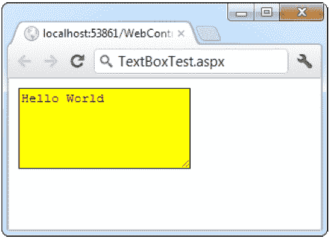[图 6-1](#_Fig1) 。自定义文本框显然，创建 web 控件标记很容易。不需要对 HTML 有任何了解。然而，您*将*需要理解控件类和您可用的属性。ASP 中区分大小写。WebForm 那个。网页的 aspx 布局部分允许标记名、属性名和枚举值的不同大小写。例如，以下两个标签是等价的，并且都将被 ASP.NET 引擎正确地解释，即使它们的大小写 不同:

```cs
<asp:Button ID="Button1" runat="server"
 Enabled="False" Text="Button" Font-Size="XX-Small" />
<asp:button ID="Button2" runat="server"
 Enabled="false" tExT="Button" Font-Size="xx-small" />

```

采用这种设计是为了制造。aspx 页面的行为更像普通的 HTML 网页，完全忽略大小写。但是，您不能在应用 web.config 文件或 machine.config 文件中的设置的标记中使用相同的宽松度。在这里，大小写必须与*完全匹配*。Web 控件类 Web 控件类是在系统中定义的。Web.UI.WebControls 命名空间。它们遵循比 HTML 服务器控件稍微复杂一些的对象层次结构。图 6-2 显示了 ASP.NET 提供的大部分网页控件，但不是全部。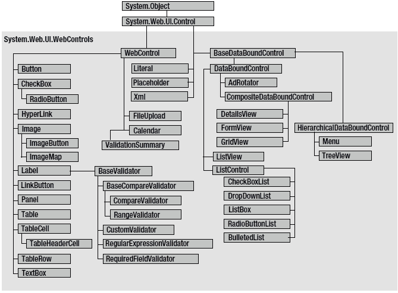[图 6-2](#_Fig2) 。web 控件层次结构这个继承图包括一些您在本章中不会学习的控件，包括数据控件(如 GridView、DetailsView 和 FormView)和验证控件。您将在后面的章节中探索这些控件。WebControl 基类大多数 web 控件从继承 WebControl 基类开始。该类定义了数据绑定等任务的基本功能，并包括一些基本属性，这些属性几乎可以用于任何 web 控件，如[表 6-2](#Tab2) 中所述。[表 6-2](#_Tab2) 。WebControl 属性

&#124; 财产 &#124; 描述 &#124;
&#124; --- &#124; --- &#124;
&#124; 访问密钥 &#124; 将键盘快捷键指定为一个字母。例如，如果将此项设置为 Y，Alt+Y 组合键会自动将焦点更改到该 web 控件(假设浏览器支持此功能)。 &#124;
&#124; 背景色、前景色和边框色 &#124; 设置用于控件背景、前景和边框的颜色。在大多数控件中，前景色设置文本颜色。 &#124;
&#124; 边框宽度 &#124; 指定控件边框的大小。 &#124;
&#124; 边框样式 &#124; BorderStyle 枚举中的一个值，包括虚线、点线、双线、凹槽、山脊、插入、外接、实线和无。 &#124;
&#124; 控制 &#124; 提供当前控件中包含的所有控件的集合。每个对象都作为通用系统提供。因此您需要将引用强制转换为特定于访问控制的属性。 &#124;
&#124; 使能够 &#124; 当设置为 false 时，控件将可见，但它将无法接收用户输入或焦点。 &#124;
&#124; EnableViewState &#124; 将此项设置为 false 可禁用此控件的自动状态管理。在这种情况下，控件将被重置为控件标记(在。aspx 页面)每次回发页面时。如果设置为 true(默认值)，控件将使用隐藏的输入字段来存储有关其属性的信息，以确保记住您在代码中所做的任何更改。 &#124;
&#124; 字体 &#124; 指定用于将控件中的任何文本呈现为系统的字体。Web.UI.WebControls.FontInfo 对象。 &#124;
&#124; 高度和宽度 &#124; 指定控件的宽度和高度。对于某些控件，在旧浏览器中使用时，这些属性将被忽略。 &#124;
&#124; 身份 &#124; 指定用于与代码中的控件进行交互的名称(也作为用于命名呈现的 HTML 中的顶级元素的 ID 的基础)。 &#124;
&#124; 页 &#124; 作为系统提供对包含此控件的网页的引用。Web.UI.Page 对象。 &#124;
&#124; 父母 &#124; 提供对包含此控件的控件的引用。如果控件直接放在页面上(而不是放在另一个控件内)，它将返回对 page 对象的引用。 &#124;
&#124; tab 键索引 &#124; 允许您控制 tab 键顺序的数字。当页面首次加载时，TabIndex 为 0 的控件具有焦点。如果启用了 TabIndex，按 Tab 键会将用户移动到具有下一个最低 TabIndex 的控件。只有 Internet Explorer 支持此属性。 &#124;
&#124; 工具提示 &#124; 当用户将鼠标悬停在控件上方时，显示一条文本消息。许多较旧的浏览器不支持该属性。 &#124;
&#124; 看得见的 &#124; 当设置为 false 时，控件将被隐藏，并且不会呈现到发送到客户端的最终 HTML 页面。 &#124;

接下来的几节描述了几乎所有 web 控件都会用到的一些常见概念，包括如何设置使用单位和枚举的属性，以及如何使用颜色和字体。单位所有使用度量的属性，包括边框宽度、高度和宽度，都需要 Unit 结构，该结构将数值与度量类型(像素、百分比等)结合起来。这意味着当您在控制标记中设置这些属性时，您必须确保将 px(像素)或%(表示百分比)附加到数字上，以指示单位的类型。下面是一个 300 像素高、宽度等于当前浏览器窗口 50%的面板控件示例:

```cs
<asp:Panel Height="300px" Width="50%" ID="pnl" runat="server" />
```

如果你通过代码分配一个基于单元的属性，你需要使用单元类型的一个静态方法。使用 Pixel()提供像素值，使用 Percentage()提供百分比值:

```cs
// Convert the number 300 to a Unit object
// representing pixels, and assign it.
pnl.Height = Unit.Pixel(300);
```

```cs
// Convert the number 50 to a Unit object
// representing percent, and assign it.
pnl.Width = Unit.Percentage(50);
```

您还可以手动创建一个 Unit 对象，并通过使用提供的构造函数之一和 UnitType 枚举来初始化它。这需要更多的步骤，但允许您轻松地将同一个单元分配给几个控件:

```cs
// Create a Unit object.
Unit myUnit = new Unit(300, UnitType.Pixel);
```

```cs
// Assign the Unit object to several controls or properties.
pnl.Height = myUnit;
pnl.Width = myUnit;
```

列举枚举在。NET 类库对一组相关的常数进行分组。例如，当设置控件的 BorderStyle 属性时，可以从 BorderStyle 枚举中选择几个预定义值之一。在代码中，使用点语法设置枚举:

```cs
ctrl.BorderStyle = BorderStyle.Dashed;
```

在。aspx 文件中，通过将允许的值之一指定为字符串来设置枚举。您没有包括枚举类型的名称，这是自动假定的。

```cs
<asp:Label BorderStyle="Dashed" Text="Border Test" ID="lbl"
 runat="server" />
```

[图 6-3](#Fig3) 显示了改变了边框的标签。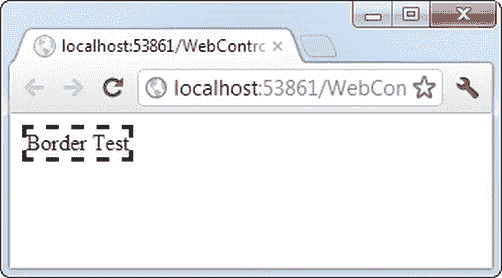[图 6-3](#_Fig3) 。修改边框样式颜色 Color 属性引用系统中的颜色对象。绘图命名空间。您可以通过多种方式创建颜色对象:

*   *使用 ARGB(阿尔法、红、绿、蓝)颜色值*:你将每个值指定为一个从 0 到 255 的整数。alpha 分量代表颜色的透明度，通常你会使用 255 来使颜色完全不透明。
*   *使用预定义的。NET color name* :从 color 结构中选择相应命名的只读属性。这些属性包括 140 个 HTML 颜色名称。
*   *使用 HTML 颜色名称*:使用 ColorTranslator 类将该值指定为字符串。

要使用这些技术，您可能希望从导入系统开始。绘图名称空间，如下所示:

```cs
using System.Drawing;
```

下面的代码显示了几种在代码中指定颜色的方法:

```cs
// Create a color from an ARGB value
int alpha = 255, red = 0, green = 255, blue = 0;
ctrl.ForeColor = Color.FromArgb(alpha, red, green, blue);
```

```cs
// Create a color using a .NET name
ctrl.ForeColor = Color.Crimson;
```

```cs
// Create a color from an HTML code
ctrl.ForeColor = ColorTranslator.FromHtml("Blue");
```

控件中定义颜色时。aspx 文件，您可以使用任何一种已知的颜色名称:

```cs
<asp:TextBox ForeColor="Red" Text="Test" ID="txt" runat="server" />
```

MSDN 参考网站中列出了您可以使用的 HTML 颜色名称(参见`http://msdn.microsoft.com/library/system.drawing.color.aspx`)。或者，您可以使用十六进制颜色数字(格式为# <red><green><blue>)，如下所示:</blue></green></red>

```cs
<asp:TextBox ForeColor="#ff50ff" Text="Test"
     ID="txt" runat="server" />
```

来源 Font 属性实际上引用了一个完整的 FontInfo 对象，它是在系统中定义的。Web.UI.WebControls 命名空间。每个 FontInfo 对象都有几个定义其名称、大小和样式的属性(见[表 6-3](#Tab3) )。[表 6-3](#_Tab3) 。FontInfo 属性

&#124; 财产 &#124; 描述 &#124;
&#124; --- &#124; --- &#124;
&#124; 名字 &#124; 指示字体名称的字符串(如 Verdana)。 &#124;
&#124; 名称 &#124; 带有字体名称的字符串数组，按首选顺序排列。浏览器将使用用户电脑上安装的第一种匹配字体。 &#124;
&#124; 大小 &#124; 作为 FontUnit 对象的字体大小。这可以表示绝对或相对大小。 &#124;
&#124; 粗体、斜体、删除线、下划线和上划线 &#124; 应用给定样式属性的布尔属性。 &#124;

在代码中，您可以通过使用熟悉的点语法来设置各种字体属性来分配字体:

```cs
ctrl.Font.Name = "Verdana";
ctrl.Font.Bold = true;
```

您也可以使用 FontUnit 类型来设置大小:

```cs
// Specifies a relative size.
ctrl.Font.Size = FontUnit.Small;
```

```cs
// Specifies an absolute size of 14 pixels.
ctrl.Font.Size = FontUnit.Point(14);
```

在。aspx 文件，您需要使用特殊的“对象遍历”语法来指定对象属性，如字体。对象遍历器语法使用连字符(`-`)来分隔属性。例如，您可以设置一个具有特定字体(Tahoma)和字号(40 磅)的控件，如下所示:

```cs
<asp:TextBox Font-Name="Tahoma" Font-Size="40" Text="Size Test" ID="txt"
 runat="server" />
```

或者，您可以像这样设置相对大小:

```cs
<asp:TextBox Font-Name="Tahoma" Font-Size="Large" Text="Size Test"
 ID="txt" runat="server" />
```

[图 6-4](#Fig4) 显示了本例中改变的文本框。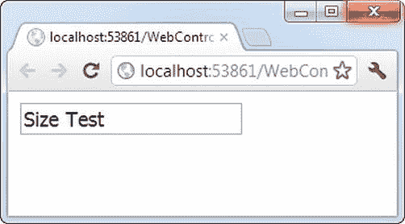[图 6-4](#_Fig4) 。修改控件的字体字体设置只是一个建议。如果客户端电脑没有您请求的字体，它会恢复为标准字体。为了解决这个问题，通常按照偏好的顺序指定一个字体列表。为此，您可以使用字体。Names 属性而不是 Font。名称，如下所示:

```cs
<asp:TextBox Font-Names="Verdana,Tahoma,Arial"
 Text="Size Test" ID="txt" runat="server" />
```

这里，浏览器将使用 Verdana 字体(如果有的话)。如果没有，它将回落到 Tahoma，或者，如果不存在，Arial。指定字体时，最好以下列字体之一结束，所有浏览器都支持这些字体:

*   英国泰晤士报(1785 年创刊)
*   阿里亚和 Helvetica
*   信使

几乎所有 Windows 和 Mac 电脑上都有以下字体，但在其他操作系统上不一定有:

*   威登达
*   格鲁吉亚
*   前面有突出的护架
*   漫画无
*   Arial Black(消歧义)
*   影响

嵌入字体最近，浏览器越来越支持一种叫做*嵌入式字体*或*网络字体* 的功能。基本思想是允许你用一种奇特的、非标准的网络字体来格式化网页中的文本。当有人查看页面时，浏览器会自动下载相应的字体文件，并使用它(临时)显示页面中的文本。嵌入式字体功能允许您的页面使用几乎无限的字体，而不用担心客户在他们的计算机上安装了什么。因为嵌入式字体并不被普遍支持(尤其是在旧的浏览器中)，它们通常被用作增强标题外观的可选方式。这样，如果 web 字体不起作用或无法下载，web 页面总是可以使用上一节中描述的标准字体。通常，网页设计者不会使用嵌入字体来格式化整段文本，因为这样会有文本在某些浏览器上无法正常显示的风险。从技术上讲，嵌入字体是 CSS3 的一个特性。没有 ASP。使用嵌入字体的特定于. NET 的方式。如果您决定在 ASP.NET 页面中使用嵌入字体，您可能会使用它们来格式化普通的 HTML 元素，如段落、或编号标题(

# 、

## 、

### 等等)。您通常不会使用它们来格式化 web 控件(尽管您可以通过将控件的 CssClass 属性设置为应用嵌入字体的 CSS 样式来格式化)。但无论如何，将样式设置添加到样式表取决于您自己。

使用嵌入字体是一个有些笨拙的过程，需要几个步骤。首先，你需要正确的字体文件，你必须上传到你的网络服务器。挑战在于不同的浏览器支持不同的网络字体格式，没有一个统一的标准，所以你需要包含相同字体的多个副本。此外，在你开始转换和上传你自己的字体文件之前，你需要确保它已经获得了网络使用许可(大多数都没有)。你可以在`www.html5rocks.com/en/tutorials/webfonts/quick`得到一个过程的快速总结。但到目前为止，最简单的策略是简单地使用网络字体服务，如谷歌网络字体。在那里，你可以从一大堆漂亮的网络字体中挑选。当你选择一种字体时，谷歌会生成相应的 CSS 样式——你所需要做的只是把它粘贴到你的样式表的适当部分。谷歌还通过自己的网络服务器提供所有的网络字体，所以没有额外的文件上传到你的网站。欲了解更多信息，请访问`www.google.com/webfonts`。聚焦与 HTML 服务器控件不同，每个 web 控件都提供一个 Focus()方法。Focus()方法只影响输入控件(可以接受用户击键的控件)。当在客户端浏览器中呈现该页时，用户在获得焦点的控件中启动。例如，如果您有一个允许用户编辑客户信息的窗体，您可以在该窗体的第一个文本框上调用 Focus()方法。这样，当页面首次在浏览器中加载时，光标会立即出现在该文本框中。如果文本框在表单的中间，页面甚至会自动向下滚动到它。然后，用户可以使用历史悠久的 Tab 键在控件之间移动。如果您是一名经验丰富的 HTML 开发人员，您应该知道没有任何内置的方法可以将焦点放在输入控件上。相反，你需要依赖 JavaScript。这就是 ASP 的秘诀。NET 的实现。当您的代码处理完毕，页面呈现出来时，ASP.NET 会在页面末尾添加一个额外的 JavaScript 代码块。这段 JavaScript 代码只是将焦点设置到最后一个使用 focus()方法的控件上。如果您根本没有调用 Focus()，则这段代码不会添加到页面中。您可以通过设置

<form>标记的 DefaultFocus 属性来设置一个应该总是被聚焦的控件，而不是以编程方式调用 Focus()方法:</form>

```cs
<form DefaultFocus="TextBox2" runat="server">
```

您可以通过在代码中调用 focus()方法来重写默认焦点。管理焦点的另一种方法是使用访问键。例如，如果将 TextBox 的 AccessKey 属性设置为 A，按 Alt+A 会将焦点切换到 TextBox。标签也可以进入游戏，尽管他们不能接受焦点。诀窍是设置标签。AssociatedControlID 属性来指定链接的输入控件。这样，标签将焦点转移到关联的控件上。例如，当按下键盘组合键 Alt+2 时，下面的标签为 TextBox2 提供焦点:

```cs
<asp:Label AccessKey="2" AssociatedControlID="TextBox2" runat="server"
 Text="TextBox2:" />
<asp:TextBox runat="server" ID="TextBox2" />
```

非微软浏览器也支持聚焦和访问键，包括 Firefox。默认按钮除了控制聚焦，ASP.NET 还允许你在网页上指定一个默认按钮。默认按钮是当用户按下 Enter 键时被“点击”的按钮。例如，如果您的网页包含一个表单，您可能希望将“提交”按钮设置为默认按钮。这样，如果用户在任何时候点击 Enter，页面就会被回发，按钮。为该按钮触发 Click 事件。若要指定默认按钮，必须设置 HtmlForm。具有相应控件 ID 的 DefaultButton 属性，如下所示:

```cs
<form DefaultButton="cmdSubmit" runat="server">
```

默认按钮必须是实现 IButtonControl 接口的控件。该接口由 Button、LinkButton 和 ImageButton web 控件实现，但不由任何 HTML 服务器控件实现。在某些情况下，拥有多个默认按钮是有意义的。例如，您可以创建一个包含两组输入控件的网页。两组可能需要不同的默认按钮。您可以通过将这些组放在单独的面板中来解决这个问题。Panel 控件还公开 DefaultButton 属性，该属性在它包含的任何输入控件获得焦点时起作用。控制前缀使用 web 控件时，使用三个字母的小写前缀来标识控件的类型通常很有用。前面的例子(以及本书其余部分的例子)遵循了这个惯例，以使用户界面代码尽可能清晰。一些推荐的控制前缀如下:

*   按钮:cmd(或 btn)
*   复选框:检查
*   图像:img
*   标签： 磅
*   列表控件:lst
*   面板:pnl
*   单选按钮:opt
*   文本框： txt

如果你是一个经验丰富的程序员，你也会注意到这本书没有使用前缀来标识数据类型。这与……的哲学是一致的。NET，它认识到数据类型通常可以自由地改变而不会产生任何后果，并且变量通常指向全功能的对象，而不是简单的数据变量。列表控件列表控件包括 ListBox、DropDownList、CheckBoxList、RadioButtonList 和 BulletedList。它们的工作方式基本相同，但在浏览器中呈现方式不同。例如，ListBox 是一个显示几个条目的矩形列表，而 DropDownList 只显示选中的条目。CheckBoxList 和 RadioButtonList 类似于 ListBox，但是每一项都分别呈现为复选框或选项按钮。最后，BulletedList 是唯一一个不可选的列表控件。相反，它将自身呈现为一系列带编号或项目符号的项目。所有可选择的列表控件都提供了 SelectedIndex 属性，该属性将选定的行表示为从零开始的索引(就像您在上一章中使用的 HtmlSelect 控件一样)。例如，如果选择了列表中的第一项，SelectedIndex 将为 0。可选列表控件还提供了一个附加的 SelectedItem 属性，该属性允许您的代码检索代表选定项的 ListItem 对象。ListItem 对象提供了三个重要的属性:Text(显示的内容)、Value(HTML 标记中的隐藏值)和 Selected (true 或 false，取决于该项是否被选中)。在上一章中，您使用了如下代码从名为 Currency，的 HtmlSelect 控件中检索选定的 ListItem 对象，如下所示:

```cs
ListItem item;
item = Currency.Items[Currency.SelectedIndex];
```

如果使用 ListBox web 控件，可以用更清晰的语法简化这段代码:

```cs
ListItem item;
item = Currency.SelectedItem;
```

多选列表控件一些列表控件可以允许多重选择。这对于 DropDownList 或 RadioButtonList 是不允许的，但对于 ListBox 是支持的，前提是您已将 SelectionMode 属性设置为枚举值 ListSelectionMode.Multiple。然后，用户可以通过在单击列表中的项目时按住 Ctrl 键来选择多个项目。使用复选框列表，多项选择总是可能的。SelectedIndex 和 SelectedItem 属性对支持多重选择的列表没有太大帮助，因为它们只是返回第一个选定的项目。相反，您可以通过迭代 list 控件的 items 集合并检查 ListItem 来查找所有选定的项。每个项目的选定属性。(如果为真，则该项目是所选项目之一。)[图 6-5](#Fig5) 显示了一个简单的网页示例，提供了一个计算机语言列表。用户单击“确定”按钮后，页面会显示用户所做的选择。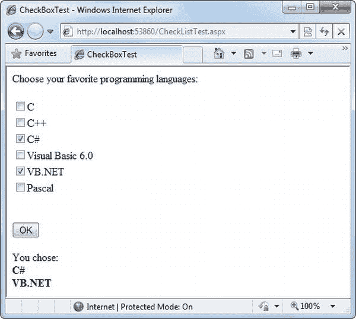[图 6-5](#_Fig5) 。简单的 CheckListBox 测试那个。该页的 aspx 文件定义了 CheckListBox、Button 和 Label 控件，如下所示:

```cs
<%@ Page Language="C#" AutoEventWireup="true"
    CodeFile="CheckListTest.aspx.cs" Inherits="CheckListTest" %>
<!DOCTYPE html>
<html>
<head runat="server">
 <title>CheckBoxTest</title>
</head>
<body>
 <form runat="server">
    <div>
     Choose your favorite programming languages:<br /><br />
     <asp:CheckBoxList ID="chklst" runat="server" /><br /><br />
     <asp:Button ID="cmdOK" Text="OK" OnClick="cmdOK_Click" runat="server" />
     <br /><br />
     <asp:Label ID="lblResult" runat="server" />
    </div>
 </form>
</body>
</html>
```

该代码在启动时向 CheckListBox 添加项，并在单击按钮时循环访问集合:

```cs
public partial class CheckListTest : System.Web.UI.Page
{
    protected void Page_Load(object sender, EventArgs e)
    {
        if (!this.IsPostBack)
        {
            chklst.Items.Add("C");
            chklst.Items.Add("C++");
            chklst.Items.Add("C#");
            chklst.Items.Add("Visual Basic 6.0");
            chklst.Items.Add("VB.NET");
            chklst.Items.Add("Pascal");
        }
    }
```

```cs
    protected void cmdOK_Click(object sender, EventArgs e)
    {
        lblResult.Text = "You chose:<b>";
```

```cs
        foreach (ListItem lstItem in chklst.Items)
        {
            if (lstItem.Selected == true)
            {
                // Add text to label.
                lblResult.Text += "<br />" + lstItem.Text;
            }
        }
        lblResult.Text += "</b>";
    }
}
```

BulletedList 控件 BulletedList 控件 在服务器端相当于< ul >(无序列表)和< ol >(有序列表)元素。与所有列表控件一样，您可以设置应通过 items 属性显示的项目集合。此外，您可以使用[表 6-4](#Tab4) 中的属性来配置项目的显示方式。[表 6-4](#_Tab4) 。添加了 BulletedList 属性

&#124; 财产 &#124; 描述 &#124;
&#124; --- &#124; --- &#124;
&#124; 项目符号样式 &#124; 确定列表的类型。从编号(1，2，3，.。。);低α(a，b，c，.。。)和 UpperAlpha (A，B，C，.。。);LowerRoman(一、二、三、。。。)和 UpperRoman (I，II，III，。。。);以及项目符号 Disc、Circle、Square 或 CustomImage(在这种情况下，必须设置 BulletImageUrl 属性)。 &#124;
&#124; BulletImageUrl &#124; 如果 BulletStyle 设置为 CustomImage，则它指向作为项目符号放置在每个项目左侧的图像。 &#124;
&#124; FirstBulletNumber &#124; 在有序列表中(使用编号、LowerAlpha、UpperAlpha、LowerRoman 和 UpperRoman 样式)，这将设置第一个值。例如，如果将 FirstBulletNumber 设置为 3，则列表可能显示为 3、4、5(对于编号)或 C、D、E(对于大写字母)。 &#124;
&#124; 显示模式 &#124; 确定每个项目的文本是呈现为文本(使用文本，默认)还是超链接(使用 LinkButton 或 hyperlink)。LinkButton 和 HyperLink 的区别在于它们对待点击的方式。当您使用 LinkButton 时，BulletedList 会触发一个 Click 事件，您可以在服务器上对该事件做出反应以执行导航。使用 HyperLink 时，BulletedList 不会触发 Click 事件，而是将每个列表项的文本视为相对或绝对 URL，并将其呈现为普通的 HTML 超链接。当用户单击某个项目时，浏览器会尝试导航到该 URL。 &#124;

如果将 DisplayMode 设置为 LinkButton，则可以对按钮做出反应。单击事件以确定单击了哪个项目。例如，假设您有这样一个 BulletedList:

```cs
<asp:BulletedList BulletStyle="Numbered" DisplayMode="LinkButton"
 ID="BulletedList1" OnClick="BulletedList1_Click" runat="server">
</asp:BulletedList>
```

您可以使用下面的代码来拦截它的点击:

```cs
protected void BulletedList1_Click(object sender, BulletedListEventArgs e)
{
    // Find the clicked item in the list.
    // (You can't use the SelectedIndex property here because static lists
    // don't support selection.)
    string itemText = BulletedList1.Items[e.Index].Text;
    Label1.Text = "You choose item" + itemText;
}
```

[图 6-6](#Fig6) 显示了 BulletList 支持的所有 BulletStyle 值。当您单击其中一个项目时，列表会更改为使用该项目符号样式。您可以使用本章的示例 WebControls 项目来尝试此示例页面。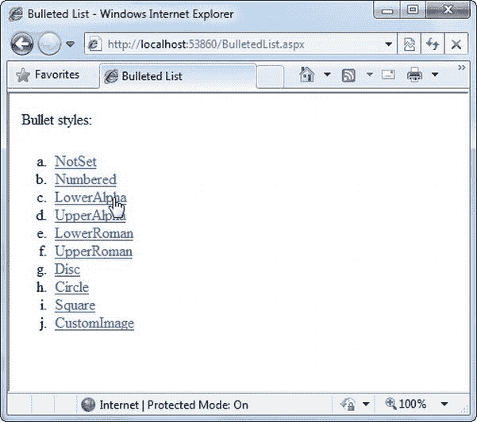[图 6-6](#_Fig6) 。各种 BulletedList 样式表格控件本质上，表格控件是由对象的层次结构构建而成的。每个 Table 对象包含一个或多个 TableRow 对象。反过来，每个 TableRow 对象包含一个或多个 TableCell 对象。每个 TableCell 对象包含其他显示信息的 ASP.NET 控件或 HTML 内容。如果你熟悉 HTML 表格标签，这种关系(如图 6-7 所示)看起来相当符合逻辑。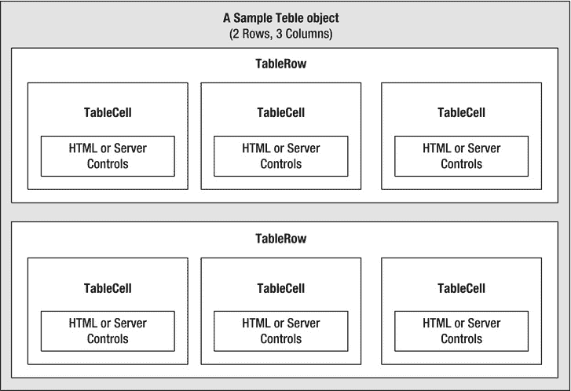[图 6-7](#_Fig7) 。桌子控制遏制要动态创建一个表，您可以遵循与其他 web 控件相同的原则。首先，创建并配置必要的 ASP.NET 对象。然后，在页面被发送到客户端之前，ASP.NET 将这些对象转换成最终的 HTML 表示。考虑图 6-8 中[所示的例子。它允许用户指定行数和列数，以及单元格是否应该有边框。](#Fig8)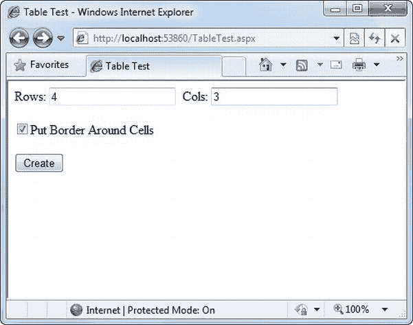[图 6-8](#_Fig8) 。表测试选项当用户点击创建按钮时，表格会根据所选选项动态填充样本数据，如图[图 6-9](#Fig9) 所示。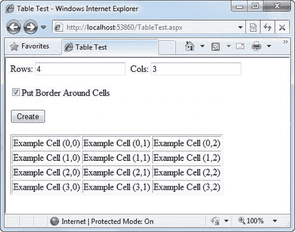[图 6-9](#_Fig9) 。动态生成的表格那个。aspx 代码创建文本框、复选框、按钮和表格控件:

```cs
<%@ Page Language="C#" AutoEventWireup="true"
    CodeFile="TableTest.aspx.cs" Inherits="TableTest" %>
<!DOCTYPE html>
<html>
<head runat="server">
 <title>Table Test</title>
</head>
<body>
 <form runat="server">
    <div>
     Rows:
     <asp:TextBox ID="txtRows" runat="server" />
     &nbsp;Cols:
     <asp:TextBox ID="txtCols" runat="server" />
     <br /><br />
     <asp:CheckBox ID="chkBorder" runat="server"
        Text="Put Border Around Cells" />
     <br /><br />
     <asp:Button ID="cmdCreate" OnClick="cmdCreate_Click" runat="server"
        Text="Create" />
     <br /><br />
     <asp:Table ID="tbl" runat="server" />
    </div>
 </form>
</body>
</html>
```

您会注意到表格控件不包含任何实际的行或单元格。要创建一个有效的表格，您需要嵌套几层标签。以下示例创建了一个包含文本*和测试行*的单个单元格的表格:

```cs
<asp:Table ID="tbl" runat="server">
 <asp:TableRow ID="row" runat="server">
    <asp:TableCell ID="cell" runat="server">A Sample Value</asp:TableCell>
 </asp:TableRow>
</asp:Table>
```

表格测试网页没有任何嵌套元素。这意味着该表将被创建为服务器端控件对象，但是除非代码添加行和单元格，否则该表将不会在最终的 HTML 页面中呈现。TableTest 类使用两个事件处理程序。当页面第一次加载时，它会在表格周围添加一个边框。当点击按钮时，它会在一个循环中动态创建所需的 TableRow 和 TableCell 对象。

```cs
public partial class TableTest : System.Web.UI.Page
{
    protected void Page_Load(object sender, EventArgs e)
    {
        // Configure the table's appearance.
        // This could also be performed in the .aspx file
        // or in the cmdCreate_Click event handler.
        tbl.BorderStyle = BorderStyle.Inset;
        tbl.BorderWidth = Unit.Pixel(1);
    }
```

```cs
    protected void cmdCreate_Click(object sender, EventArgs e)
    {
        // Remove all the current rows and cells.
        // This is not necessary if EnableViewState is set to false.
        tbl.Controls.Clear();
```

```cs
        int rows = Int32.Parse(txtRows.Text);
        int cols = Int32.Parse(txtCols.Text);
```

```cs
        for (int row = 0; row < rows; row++)
        {
            // Create a new TableRow object.
            TableRow rowNew = new TableRow();
```

```cs
            // Put the TableRow in the Table.
            tbl.Controls.Add(rowNew);
```

```cs
            for (int col = 0; col < cols; col++)
            {
                // Create a new TableCell object.
                TableCell cellNew = new TableCell();
```

```cs
                cellNew.Text = "Example Cell (" + row.ToString() + ",";
                cellNew.Text += col.ToString() + ")";
```

```cs
                if (chkBorder.Checked)
                {
                    cellNew.BorderStyle = BorderStyle.Inset;
                    cellNew.BorderWidth = Unit.Pixel(1);
                }
```

```cs
                // Put the TableCell in the TableRow.
                rowNew.Controls.Add(cellNew);
            }
        }
    }
}
```

此代码使用 Controls 集合添加子控件。每个容器控件都提供此属性。您也可以使用表格单元格。控件集合向每个 TableCell 添加 web 控件。例如，您可以在每个单元格中放置一个图像控件和一个标签控件。在这种情况下，不能设置 TableCell。文本属性。以下代码片段使用了这种技术，图 6-10 显示了结果: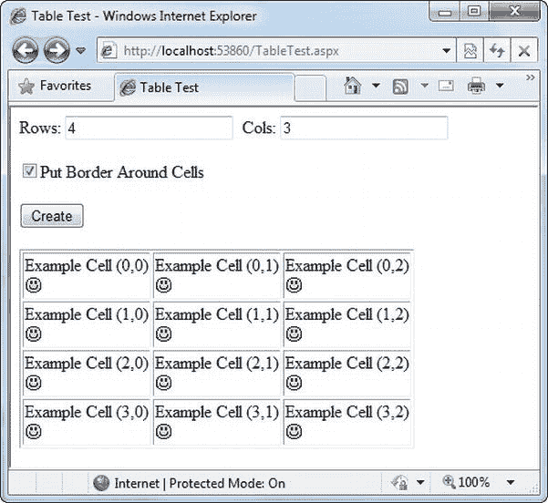[图 6-10](#_Fig10) 。包含控件的表格

```cs
// Create a new TableCell object.
cellNew = new TableCell();
```

```cs
// Create a new Label object.
Label lblNew = new Label();
lblNew.Text = "Example Cell (" + row.ToString() + ",";
lblNew.Text += col.ToString() + ")<br />";
```

```cs
System.Web.UI.WebControls.Image imgNew = new System.Web.UI.WebControls.Image();
imgNew.ImageUrl = "cellpic.png";
```

```cs
// Put the label and picture in the cell.
cellNew.Controls.Add(lblNew);
cellNew.Controls.Add(imgNew);
```

```cs
// Put the TableCell in the TableRow.
rowNew.Controls.Add(cellNew);
```

表测试页面的真正灵活性在于每个表、TableRow 和 TableCell 都是一个全功能的对象。如果需要，可以通过设置相应的属性为每个单元格指定不同的边框样式、边框颜色和文本颜色。Web 控件事件和自动回发前一章解释了 HTML 服务器控件的主要限制之一是它们有限的有用事件集——它们只有两个。触发回发的 HTML 控件(如按钮)会引发 ServerClick 事件。输入控件提供了一个 ServerChange 事件，该事件在页面回发之前不会实际触发。ASP.NET 服务器控件确实是一个巧妙的幻象。您还记得 ASP.NET 页面中的代码是在服务器上处理的。然后以普通 HTML 的形式发送给用户。[图 6-11](#Fig11) 说明了页面处理中事件的顺序。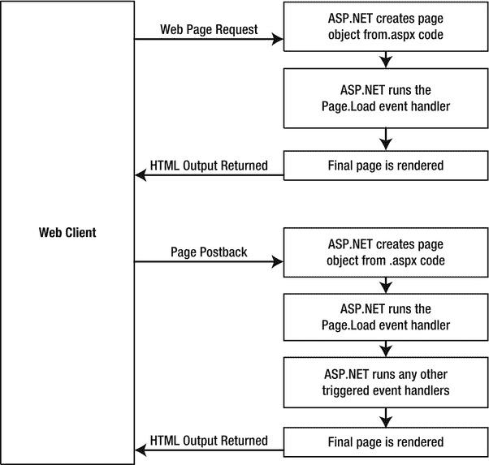[图 6-11](#_Fig11) 。页面处理顺序这在 ASP.NET 和在传统的 ASP 编程中是一样的。问题是，如何编写服务器代码来对客户端发生的事件立即做出反应？有些事件，如按钮的 Click 事件，会立即发生。这是因为当点击时，按钮会返回页面。这是 HTML 表单的一个基本约定。然而，其他动作*会*引发事件，但*不会*触发回发——例如，当用户更改文本框中的文本(这会触发 TextChanged 事件)或选择列表中的新项目(SelectedIndexChanged 事件)时。您可能希望响应这些事件，但是如果没有回发，您的代码将无法运行。ASP.NET 通过给你两个选择来处理这个问题:

*   您可以等到下一次回发时再对事件做出反应。例如，假设您想要对列表中的 SelectedIndexChanged 事件做出反应。如果用户选择了列表中的一项，不会立即发生任何事情。但是，如果用户点击一个按钮回发页面，*将触发两个*事件:button。如果您有几个控件，单个回发很可能会导致几个 change 事件，这些事件以不确定的顺序一个接一个地触发。
*   您可以使用*自动回发* 功能来强制控件在检测到特定的用户操作时立即回发页面。在这种情况下，当用户单击列表中的新项目时，页面被回发，您的代码执行，并返回页面的新版本。

您选择的选项取决于您想要的结果。如果您需要立即做出反应(例如，当特定的操作发生时，您希望更新另一个控件)，您需要使用自动回发。另一方面，自动回发有时会降低页面的响应速度，因为每次回发和页面刷新都会增加短暂但明显的延迟和页面刷新。(当你考虑第 25 章的[中的 ASP.NET·AJAX](25.html)时，你将学会如何创建可以自我更新而没有明显页面刷新的页面。)所有输入 web 控件都支持自动回发。表 6-5 提供了 web 控件及其事件的基本列表。[表 6-5](#_Tab5) 。Web 控件事件

&#124; 事件 &#124; 提供它的 Web 控件 &#124; 总是回帖 &#124;
&#124; --- &#124; --- &#124; --- &#124;
&#124; 点击 &#124; 按钮，图像按钮 &#124; 真实的 &#124;
&#124; 文本已更改 &#124; TextBox(仅在用户将焦点更改到另一个控件后触发) &#124; 错误的 &#124;
&#124; 事件 &#124; 复选框，单选按钮 &#124; 错误的 &#124;
&#124; 事件中 &#124; 下拉列表，列表框，复选框列表，单选按钮列表 &#124; 错误的 &#124;

如果要立即捕获更改事件(如 TextChanged、CheckedChanged 或 SelectedIndexChanged)，需要将控件的 AutoPostBack 属性设置为 true。这样，当用户与控件交互时(例如，在列表中选择一个选项，单击单选按钮或复选框，或者更改文本框中的文本，然后移动到新的控件)，页面将自动提交。当页面被回发时，ASP.NET 将检查页面，加载所有当前信息，然后在将页面返回给用户之前，允许你的代码执行一些额外的处理(见[图 6-12](#Fig12) )。根据您想要的结果，您可能有一个页面，其中有些控件会自动回发，而有些则不会。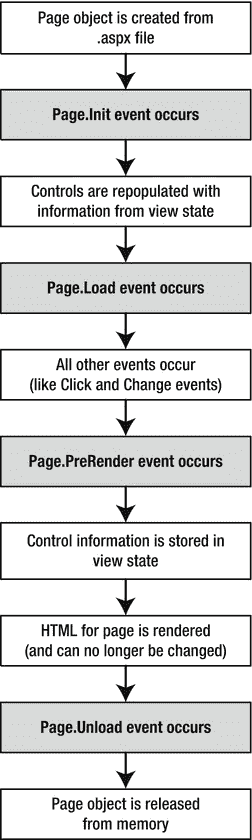[图 6-12](#_Fig12) 。回发处理序列这种回发系统并不适合所有事件。例如，一些您可能在 Windows 程序中熟悉的事件，如鼠标移动事件或按键事件，在 ASP.NET 应用中并不实用。每次按下一个键或移动鼠标时重新提交页面会使应用慢得无法忍受，没有响应。回发事件如何工作第一章解释了并不是所有类型的 web 编程都像 ASP.NET 一样使用服务器端代码。客户端 web 编程的一个常见例子是 JavaScript，它使用由浏览器执行的脚本代码。ASP.NET 使用 JavaScript 的客户端能力来弥合客户端和服务器端代码之间的差距。(另一种脚本语言是 VBScript，但 JavaScript 是唯一一种适用于所有现代浏览器的语言，包括 Internet Explorer、Chrome、Firefox、Safari 和 Opera。)它是这样工作的:如果你创建一个包含一个或多个配置为使用 AutoPostBack 的 web 控件的网页，ASP.NET 会在呈现的 HTML 页面中添加一个特殊的 JavaScript 函数。这个函数被命名为 __doPostBack()。当被调用时，它触发回发，将数据发送回 web 服务器。ASP.NET 还添加了两个隐藏的输入字段，用于将信息传回服务器。该信息由引发事件的控件的 ID 和任何可能相关的附加信息组成。这些字段最初为空，如下所示:

```cs
<input type="hidden" name="__EVENTTARGET" ID="__EVENTTARGET" value="" />
<input type="hidden" name="__EVENTARGUMENT" ID="__EVENTARGUMENT" value="" />
```

__doPostBack()函数负责用关于事件的适当信息设置这些值，然后提交表单。__doPostBack()函数如下所示:

```cs
<script language="text/javascript">
function __doPostBack(eventTarget, eventArgument) {
    if (!theForm.onsubmit &#124;&#124; (theForm.onsubmit() != false)) {
        theForm.__EVENTTARGET.value = eventTarget;
        theForm.__EVENTARGUMENT.value = eventArgument;
        theForm.submit();
    }
 ...
}
</script>
```

记住，如果页面上至少有一个控件使用自动回发，ASP.NET 会自动生成 __doPostBack()函数。最后，任何 AutoPostBack 属性设置为 true 的控件都通过使用 onclick 或 onchange 属性连接到 __doPostBack()函数。这些属性指示浏览器应该采取什么动作来响应客户端 JavaScript 事件 onclick 和 onchange。下面的示例显示了名为 lstBackColor 的列表控件的标记，该标记会自动回发。每当用户更改列表中的选择时，就会触发客户端 onchange 事件。然后，浏览器调用 __doPostBack()函数，该函数将页面发送回服务器。

```cs
<select ID="lstBackColor" onchange="__doPostBack('lstBackColor',")"
 language="javascript">
```

换句话说，ASP.NET 使用 __doPostBack()函数作为中介，自动将客户端 JavaScript 事件更改为服务器端 ASP.NET 事件。[图 6-13](#Fig13) 显示了这个过程。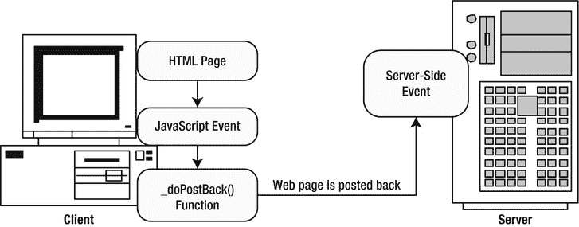[图 6-13](#_Fig13) 。自动回发页面生命周期要了解 web 控件事件是如何工作的，您需要对页面生命周期有一个扎实的了解。请考虑当用户更改 AutoPostBack 属性设置为 true 的控件时会发生什么情况:

1.  在客户端，JavaScript __doPostBack 函数被调用，页面被重新提交给服务器。
2.  ASP.NET 通过使用。aspx 文件。
3.  ASP.NET 从隐藏的视图状态字段中检索状态信息，并相应地更新控件。
4.  这一页。Load 事件被激发。
5.  为控件触发适当的 change 事件。(如果更改了多个控件，则更改事件的顺序是不确定的。)
6.  这一页。PreRender 事件触发，页面被呈现(从一组对象转换为 HTML 页面)。
7.  最后是页面。激发了卸载事件。
8.  新页面被发送到客户端。

为了观察这些活动，创建一个简单的事件跟踪器应用会有所帮助。这个应用所做的就是每当它监视的一个事件发生时，向一个列表控件写入一个新的条目。这允许您查看事件被触发的顺序。[图 6-14](#Fig14) 显示了窗口加载一次、回发(当文本框内容改变时)和再次回发(当复选框状态改变时)后的样子。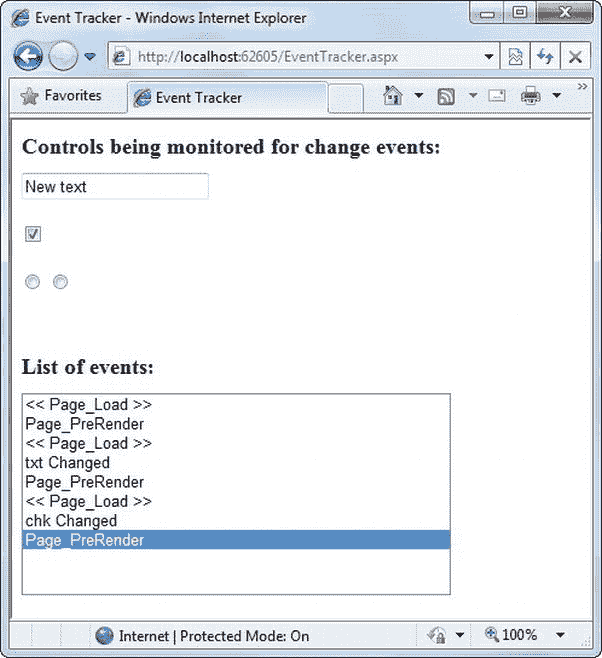[图 6-14](#_Fig14) 。事件跟踪器[清单 6-1](#list1) 显示了事件跟踪器的标记代码，而[清单 6-2](#list2) 显示了使其工作的代码隐藏类。***[清单 6-1。](#_list1)*** EventTracker.aspx< % @ Page Language = " c# " AutoEventWireup = " true "CodeFile = " event tracker . aspx . cs " Inherits = " event tracker " % ><title>事件跟踪器</title>

<form runat="server">

# 监控变更事件的控制:

< ASP:TextBox ID = " txt " runat = " server " AutoPostBack = " true "

OnTextChanged="CtrlChanged" />

< ASP:CheckBox ID = " chk " runat = " server " AutoPostBack = " true "

OnCheckedChanged = " ctrl changed "/>

< ASP:radio button ID = " opt 1 " runat = " server " group name = " Sample "

AutoPostBack = " True " OnCheckedChanged = " ctrl changed "/>

< ASP:radio button ID = " opt 2 " runat = " server " group name = " Sample "

AutoPostBack = " True " OnCheckedChanged = " ctrl changed "/>

# 事件列表:

< ASP:ListBox ID = " lst events " runat = " server " Width = " 355 px "

Height="150px" />

T2】

***[清单 6-2。](#_list2)***event tracker . aspx . cs

公共分部类 EventTracker : System。网页界面

{

受保护的 void Page_Load(对象发送方，EventArgs e)

{

日志("<< Page_Load >> ")；

}

受保护的 void Page_PreRender(对象发送方)

{

//当页面。先决条件事件发生时，为时已晚

//更改列表。

log(" Page _ PreRender ")；

}

受保护的 void CtrlChanged(对象发送方，事件参数 e)

{

//找到发送方的控件 ID。

//这需要将对象类型转换为控件类。

string ctrl name =((Control)sender)。ID；

log(ctrl name+" Changed ")；

}

私有 void 日志(字符串条目)

{

lstEvents。Items.Add(条目)；

//选择滚动列表的最后一项，使其成为最新的

//条目可见。

lstEvents。SelectedIndex = lstEvents。项目数-1；

}

}

剖析代码…

关于这段代码，以下几点毫无价值:

*   代码通过使用私有 Log()方法写入 ListBox。Log()方法添加文本，并在每次添加新条目时自动滚动到列表的底部，从而确保最新的条目仍然可见。
*   所有的变更事件都由同一个方法 CtrlChanged()处理。如果你仔细观察。aspx 文件，您会注意到每个输入控件都将其被监视的事件连接到 CtrlChanged()方法。CtrlChanged()方法中的事件处理代码使用 source 参数来找出是哪个控件发送了该事件，并将该信息合并到日志字符串中。
*   该页包含该页的事件处理程序。加载并分页。先决条件事件。与所有页面事件一样，这些事件处理程序通过方法名连接在一起。这意味着为页面添加事件处理程序。事件，只需添加一个名为 Page_PreRender()的方法，如下所示。

互动网页

现在，您已经对基本的 web 控件模型有了一个旋风式的了解，是时候让它与第二个单页面实用程序一起工作了。在这种情况下，这是一个动态电子贺卡生成器 的简单例子。您可以扩展这个示例(例如，允许用户将电子贺卡存储到数据库中)，但即使就其本身而言，这个示例也演示了使用 ASP.NET 的基本控件操作。

网页分为两个区域。左边是一个普通的

标签，包含一组用于指定卡片选项的 web 控件。右边是一个面板控件(名为 pnlCard)，它包含另外两个控件(lblGreeting 和 imgDefault ),用于显示用户可配置的文本和图片。这个文字和图片代表贺卡。页面初次加载时，卡片尚未生成，右边部分为空白(如图[图 6-15](#Fig15) )。

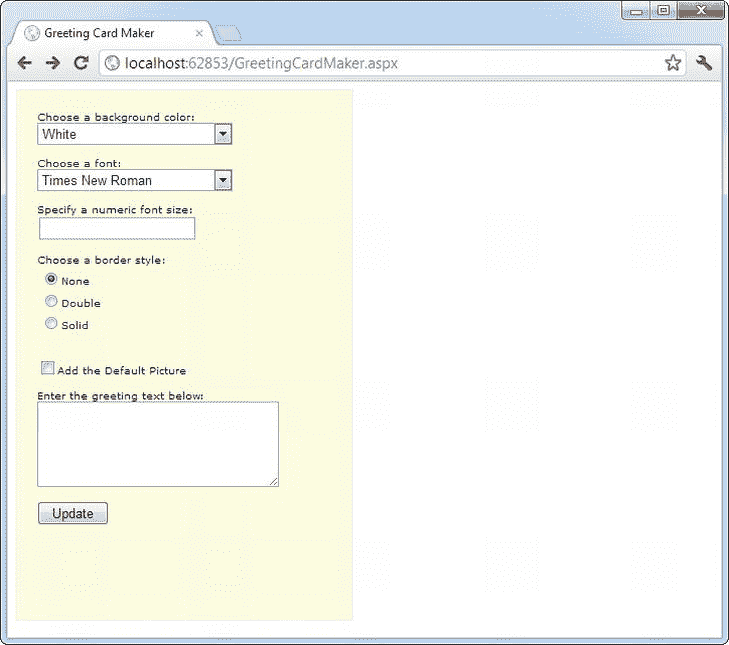

[图 6-15](#_Fig15) 。电子贺卡生成器

 **提示**<div>元素 在您想要对文本和控件进行分组并对它们应用一组格式属性(如颜色或字体)时非常有用。div 元素也是在页面中定位内容块的重要工具。由于这些原因，< div >元素被用在本书的许多例子中。你将在第 12 章的[中了解更多关于使用< div >进行布局和格式化的信息。](12.html)

每当用户点击更新按钮时，页面被回发，并且“卡片”被更新(见[图 6-16](#Fig16) )。

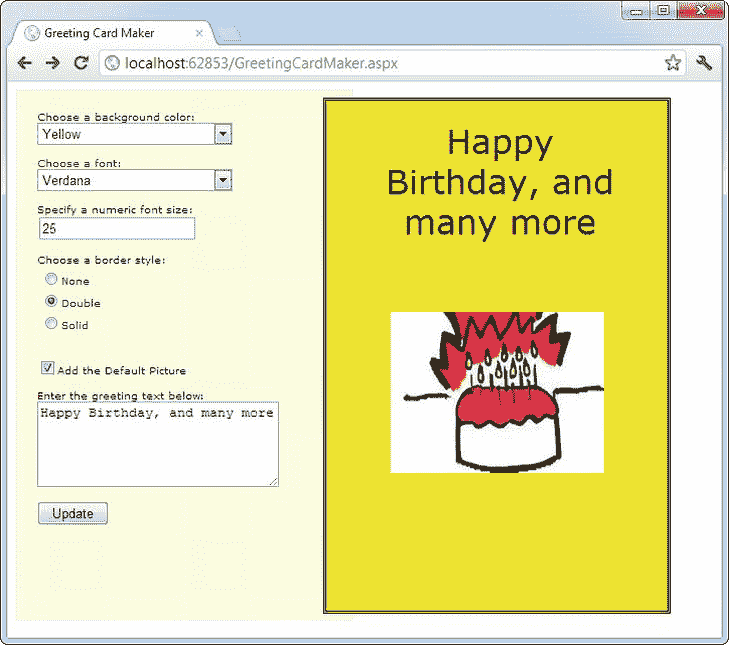

[图 6-16](#_Fig16) 。一张用户配置的贺卡

那个。aspx 布局代码 很直接。当然，它的绝对长度使它很难有效地工作。下面是标记，格式细节被删减到最基本的部分:

```cs
<%@ Page Language="C#" AutoEventWireup="true"
    CodeFile="GreetingCardMaker.aspx.cs" Inherits="GreetingCardMaker" %>
<!DOCTYPE html>
<html>
<head runat="server">
    <title>Greeting Card Maker</title>
</head>
<body>
 <form runat="server">
    <div>
     <!-- Here are the controls: -->
     Choose a background color:<br />
     <asp:DropDownList ID="lstBackColor" runat="server" Width="194px"
        Height="22px"/><br /><br />
     Choose a font:<br />
     <asp:DropDownList ID="lstFontName" runat="server" Width="194px"
        Height="22px" /><br /><br />
     Specify a numeric font size:<br />
     <asp:TextBox ID="txtFontSize" runat="server" /><br /><br />
     Choose a border style:<br />
     <asp:RadioButtonList ID="lstBorder" runat="server" Width="177px"
        Height="59px" /><br /><br />
     <asp:CheckBox ID="chkPicture" runat="server"
        Text="Add the Default Picture"></asp:CheckBox><br /><br />
     Enter the greeting text below:<br />
     <asp:TextBox ID="txtGreeting" runat="server" Width="240px" Height="85px"
        TextMode="MultiLine" /><br /><br />
     <asp:Button ID="cmdUpdate" OnClick="cmdUpdate_Click"
        runat="server" Width="71px" Height="24px" Text="Update" />
    </div>
```

```cs
    <!-- Here is the card: -->
    <asp:Panel ID="pnlCard" runat="server"
     Width="339px" Height="481px" HorizontalAlign="Center"
     style="POSITION: absolute; TOP: 16px; LEFT: 313px;">
    <br />&nbsp;
    <asp:Label ID="lblGreeting" runat="server" Width="256px"
     Height="150px" /><br /><br /><br />
    <asp:Image ID="imgDefault" runat="server" Width="212px"
     Height="160px" />
    </asp:Panel>
 </form>
</body>
</html>
```

要获得本例中的两列布局，您有两种选择。您可以使用 HTML 表格(这是一种有点过时的技术)，也可以对 CSS 样式使用绝对定位(如本例所示)。绝对定位的本质很好把握。只需看看 Panel 控件中的 style 属性，它在网页上指定了一个固定的顶部和左侧坐标。当面板呈现为 HTML 时，该点成为它的左上角。

 **注意**绝对定位是 CSS 的一个特性，级联样式表的标准。因此，它适用于任何 XHTML 元素，而不仅仅是 ASP.NET 控件。绝对定位在第 12 章的[中有详细描述。](12.html)

代码遵循熟悉的模式，强调两个事件:页面。加载事件 ，设置初始值，按钮。点击事件，生成卡片。

```cs
using System.Drawing;
```

```cs
public partial class GreetingCardMaker : System.Web.UI.Page
{
    protected void Page_Load(object sender, EventArgs e)
    {
        if (!this.IsPostBack)
        {
            // Set color options.
            lstBackColor.Items.Add("White");
            lstBackColor.Items.Add("Red");
            lstBackColor.Items.Add("Green");
            lstBackColor.Items.Add("Blue");
            lstBackColor.Items.Add("Yellow");
```

```cs
            // Set font options.
            lstFontName.Items.Add("Times New Roman");
            lstFontName.Items.Add("Arial");
            lstFontName.Items.Add("Verdana");
            lstFontName.Items.Add("Tahoma");
```

```cs
            // Set border style options by adding a series of
            // ListItem objects.
            ListItem item = new ListItem();
```

```cs
            // The item text indicates the name of the option.
            item.Text = BorderStyle.None.ToString();
```

```cs
            // The item value records the corresponding integer
            // from the enumeration. To obtain this value, you
            // must cast the enumeration value to an integer,
            // and then convert the number to a string so it
            // can be placed in the HTML page.
            item.Value = ((int)BorderStyle.None).ToString();
```

```cs
            // Add the item.
            lstBorder.Items.Add(item);
```

```cs
            // Now repeat the process for two other border styles.
            item = new ListItem();
            item.Text = BorderStyle.Double.ToString();
            item.Value = ((int)BorderStyle.Double).ToString();
            lstBorder.Items.Add(item);
```

```cs
            item = new ListItem();
            item.Text = BorderStyle.Solid.ToString();
            item.Value = ((int)BorderStyle.Solid).ToString();
            lstBorder.Items.Add(item);
```

```cs
            // Select the first border option.
            lstBorder.SelectedIndex = 0;
```

```cs
            // Set the picture.
            imgDefault.ImageUrl = "defaultpic.png";
        }
    }
```

```cs
    protected void cmdUpdate_Click(object sender, EventArgs e)
    {
        // Update the color.
        pnlCard.BackColor = Color.FromName(lstBackColor.SelectedItem.Text);
```

```cs
        // Update the font.
        lblGreeting.Font.Name = lstFontName.SelectedItem.Text;
```

```cs
        if (Int32.Parse(txtFontSize.Text) > 0)
        {
            lblGreeting.Font.Size =
             FontUnit.Point(Int32.Parse(txtFontSize.Text));
        }
```

```cs
        // Update the border style. This requires two conversion steps.
        // First, the value of the list item is converted from a string
        // into an integer. Next, the integer is converted to a value in
        // the BorderStyle enumeration.
        int borderValue = Int32.Parse(lstBorder.SelectedItem.Value);
        pnlCard.BorderStyle = (BorderStyle)borderValue;
```

```cs
        // Update the picture.
        if (chkPicture.Checked)
        {
            imgDefault.Visible = true;
        }
        else
        {
            imgDefault.Visible = false;
        }
```

```cs
        // Set the text.
        lblGreeting.Text = txtGreeting.Text;
    }
}
```

正如您所看到的，这个例子将用户限制在几个预设的字体和颜色选择上。BorderStyle 选项的代码特别有趣。lstBorder 控件有一个显示 BorderStyle 枚举值之一的文本名称的列表。在介绍性章节中，您会记得每个枚举值实际上都是一个整数，并被赋予了一个名称。lstBorder 还秘密存储相应的数字，以便当用户做出选择并且 cmdUpdate_Click 事件处理程序触发时，代码可以检索该数字并轻松设置枚举。

改进贺卡生成器

ASP.NET 的页面可以访问完整的。NET 类库。稍微探索一下，您就会发现可能对贺卡制作者有所帮助的类，比如让您检索所有已知颜色名称和安装在 web 服务器上的所有字体的工具。

例如，通过使用 InstalledFontCollection 类，可以用字体列表填充 lstFontName 控件。要访问它，您需要导入系统。绘图.文本命名空间:

```cs
using System.Drawing.Text;
```

下面是获取字体列表并使用它来填充列表的代码:

```cs
InstalledFontCollection fonts = new InstalledFontCollection();
foreach (FontFamily family in fonts.Families)
{
    lstFontName.Items.Add(family.Name);
}
```

[图 6-17](#Fig17) 显示了结果字体列表。

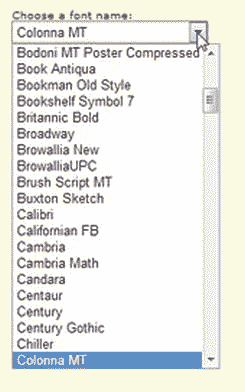

[图 6-17](#_Fig17) 。字体列表

要获得颜色名称的列表，您需要求助于更高级的技巧。虽然您可以硬编码一个通用颜色列表。NET 在系统中提供了一个很长的颜色名称列表。Drawing.KnownColor 枚举。然而，实际上从这个枚举中提取名字需要一些工作。

诀窍是使用所有枚举的一个基本特性:静态枚举。GetNames()方法，该方法检查枚举并提供一个字符串数组，枚举中的每个值对应一个字符串。然后，网页可以使用数据绑定自动用 ColorArray 中的信息填充列表控件。(你将在第 15 章中更详细地探讨数据绑定。)

 **注意**如果这个例子引入了一些看起来完全陌生的特性，不要担心！这些特性更高级(并不特别与 ASP 相关。网)。然而，他们向你展示了一些完整的味道。NET 类库可以提供一个成熟的应用。

现在，您可以删除上一个示例中填充 lstBackColor 控件的代码。相反，您可以添加以下代码，该代码将更大的颜色名称集合复制到列表框中:

```cs
string[] colorArray = Enum.GetNames(typeof(KnownColor));
lstBackColor.DataSource = colorArray;
lstBackColor.DataBind();
```

这种方法的一个小问题是，它在列表中包含了系统环境颜色(例如，ActiveBorder)。用户可能不清楚这些值代表什么颜色。尽管如此，这种方法对于这个简单的应用来说工作得很好。您可以使用类似的技术来填充边框样式选项:

```cs
// Set border style options.
string[] borderStyleArray = Enum.GetNames(typeof(BorderStyle));
lstBorder.DataSource = borderStyleArray;
lstBorder.DataBind();
```

这段代码提出了一个新的挑战:如何将用户选择的值转换成合适的枚举常数？当用户从列表中选择边框样式时，SelectedItem 属性将有一个文本字符串，如“Groove”。但是要将这种边框样式应用于控件，您需要一种方法来确定与该文本匹配的枚举常数。

你可以用几种方法处理这个问题。(前面，您看到了一个示例，其中枚举整数作为值存储在列表控件中。)在这种情况下，最直接的方法是使用一种称为 TypeConverter 的高级功能。一个 *TypeConverter* 是一个特殊的类，它能够从一个专门的类型(在这里是 BorderStyle 枚举)转换成一个更简单的类型(比如一个字符串)，反之亦然。

要访问这个类，您需要导入系统。组件模型命名空间:

```cs
using System.ComponentModel;
```

然后，您可以将以下代码添加到 cmdUpdate_Click 事件处理程序中:

```cs
// Find the appropriate TypeConverter for the BorderStyle enumeration.
TypeConverter converter =
 TypeDescriptor.GetConverter(typeof(BorderStyle));
```

```cs
// Update the border style using the value from the converter.
pnlCard.BorderStyle = (BorderStyle)converter.ConvertFromString(
 lstBorder.SelectedItem.Text);
```

这段代码获取适当的 TypeConverter(在本例中，它是专门为使用 BorderStyle 枚举而设计的)。然后，它将文本名称(如 Solid)转换为适当的值(BorderStyle。固体)。

自动生成卡片

最后一步是使用 ASP。NET 的自动回发事件 使卡片在每次选项改变时动态更新。更新按钮现在可以用于提交最终的、完善的贺卡，然后可以通过电子邮件发送给收件人或存储在数据库中。

要配置控件使其自动触发页面回发，只需将每个输入控件的 AutoPostBack 属性设置为 true。这里显示了一个示例:

```cs
 Choose a background color:<br />
 <asp:DropDownList ID="lstBackColor" AutoPostBack="True" runat="server"
        Width="194px" Height="22px"/>
```

接下来，更改控件标记，以便将每个输入控件的 changed 事件连接到名为 ControlChanged 的事件处理程序。以下是 SelectedIndexChanged 事件或下拉列表的示例:

```cs
 Choose a background color:<br />
 <asp:DropDownList ID="lstBackColor" AutoPostBack="True" runat="server"
        OnSelectedIndexChanged="ControlChanged" Width="194px" Height="22px"/>
```

您会注意到更改事件的名称取决于控件。例如，TextBox 提供 TextChanged 事件，ListBox 提供 SelectedIndexChanged 事件，等等。

最后，您需要创建一个可以处理变更事件的事件处理程序。为了节省一些步骤，可以对所有输入控件使用相同的事件处理程序。事件处理程序需要做的就是调用更新例程来重新生成贺卡。

```cs
protected void ControlChanged(object sender, System.EventArgs e)
{
    // Refresh the greeting card (because a control was changed).
    UpdateCard();
}
```

```cs
protected void cmdUpdate_Click(object sender, EventArgs e)
{
    // Refresh the greeting card (because the button was clicked).
    UpdateCard();
}
```

```cs
private void UpdateCard()
{
    // (The code that draws the greeting card goes here.)
}
```

有了这些改变，就很容易完善图 6-18 所示的更广泛的卡片生成程序。在线示例中提供了该应用的完整代码。

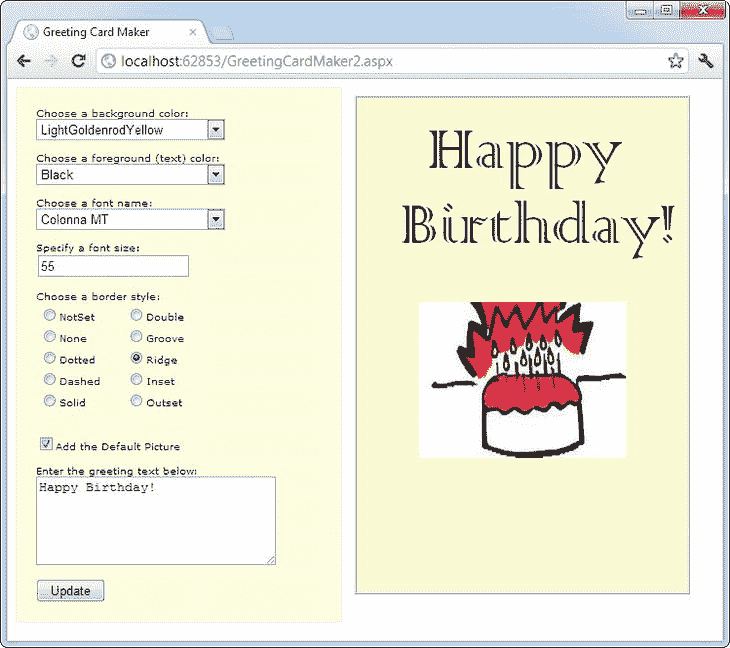

[图 6-18](#_Fig18) 。一个更广泛的卡片生成器

 **提示**自动回发并不总是最好的。有时，自动回发会让用户感到厌烦，尤其是当用户使用慢速连接时，或者当服务器需要执行耗时的选项时。因此，有时最好使用显式提交按钮，而不要对大多数输入控件启用自动回发。或者，你可以用第 25 章中描述的 ASP.NET AJAX 特性使你的网页更有活力，它允许你创建反应更灵敏的用户界面，并且可以自我更新而不需要令人分心的整页刷新。

最后一句话

本章向您介绍了 ASP。NET 最丰富的特性:web 控件及其对象接口。随着您继续阅读本书，您将了解更多的 web 控件。以下亮点还在后面:

*   在第 10 章中，你将学习高级控件，如旋转器、日历和验证控件。您还将了解专门的容器控件，如多视图和向导。
*   在第 13 章中，你会学到导航控件，比如树形视图和菜单。
*   在第 16 章中，你将学习 GridView、DetailsView 和 FormView——高级 web 控件，让你操作来自任何数据源的复杂数据表。

要获得显示每个 web 控件并列出其重要属性的良好参考，请参考位于`http://msdn.microsoft.com/library/bb386416.aspx`的 MSDN 参考网站。

</form>

 |