# 七、错误处理、日志和跟踪

没有一个软件可以无错运行，ASP.NET 应用也不例外。您的代码迟早会被编程错误、无效数据、意外情况甚至硬件故障所中断。程序员新手会因为担心错误而度过不眠之夜。专业开发人员认识到错误是软件应用固有的一部分，因此他们防御性地编码，测试假设并编写错误处理代码来处理意外情况。

在本章中，你将学习如何使用结构化异常处理来保护你的 ASP.NET 应用免受常见错误的影响。您还将了解页面跟踪，它允许您查看关于 ASP.NET 页面的诊断信息，并可能帮助您解决神秘的问题。

避免常见错误

错误可能发生在各种情况下。一些最常见的错误原因包括试图被零除(通常由无效输入或缺少信息导致)和试图连接到有限的资源，如文件或数据库(如果文件不存在、数据库连接超时或代码没有足够的安全凭据，这可能会失败)。

一种臭名昭著的错误类型是*空引用异常*、，这通常发生在程序试图使用未初始化的对象时。作为一名. NET 程序员，您将很快学会识别和解决这个常见但令人讨厌的错误。下面的代码示例用两个代表数据库连接的 SqlConnection 对象来说明问题:

```cs
// Define a variable named conOne and create the object.
private SqlConnection conOne = new SqlConnection();
```

```cs
// Define a variable named conTwo, but don't create the object.
private SqlConnection conTwo;
```

```cs
public void cmdDoSomething_Click(object sender, EventArgs e)
{
    // This works, because the object has been created
    // with the new keyword.
    conOne.ConnectionString = "...";
    ...
```

```cs
    // The following statement will fail and generate a
    // null reference exception.
    // You cannot modify a property (or use a method) of an
    // object that doesn't exist!
    conTwo.ConnectionString = "...";
    ...
}
```

当代码中出现错误时。NET 检查当前作用域中是否出现了任何错误处理程序。如果错误发生在方法内部，则为。NET 搜索本地错误处理程序，然后在调用代码中检查任何活动的错误处理程序。如果没有找到错误处理程序，则中止页面处理。如果你在 Visual Studio 中运行这个页面，你将在此时进入调试模式(正如你在[第二章](02.html)中所学的)。如果你在 Visual Studio 之外运行该页面，ASP.NET 将根据你的设置显示你指定的错误页面或内置的错误消息。

如果由于错误而进入调试模式，可以再次单击开始按钮(或按 F5)继续。因为你的代码被意外的、未处理的错误破坏了，ASP.NET 显示了一个详细的错误页面来解释这个问题([图 7-1](#Fig1) )。这些错误页面是为了开发方便——在你部署你的应用后，它们被更一般的错误页面所取代，你可以在 IIS web 服务器软件中配置这些错误页面(如[第 26 章](26.html)所述)。

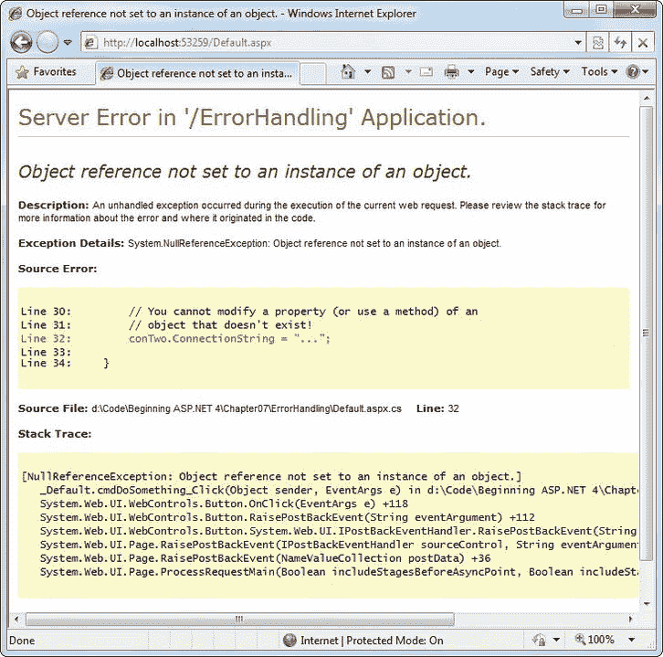

[图 7-1](#_Fig1) 。错误页面示例

即使错误是由无效输入或第三方组件的故障造成的，错误页面也会破坏任何应用的专业外观。应用用户最终会觉得应用不稳定、不安全或者质量差——他们至少部分是正确的。

如果一个 ASP.NET 应用是精心设计和构建的，那么意外的错误页面几乎不会出现。由于不可预见的情况，错误仍然可能发生，但是它们将在代码中被捕获并被识别。如果错误非常严重，应用无法自行解决，它会报告一个更有用(且用户友好)的信息页面，其中可能包含一个指向支持电子邮件或电话号码的链接，客户可以通过该链接获得更多帮助。你将在本章中看到这些技术。

了解异常处理

大多数。NET 语言支持*结构化异常处理* 。本质上，当应用中出现错误时，。NET Framework 会创建一个表示问题的异常对象。您可以通过使用异常处理程序来捕获该对象。如果您未能使用异常处理程序，您的代码将被中止，用户将看到一个错误页面。如果您捕捉到异常，您可以通知用户，尝试解决问题，或者简单地忽略该问题并允许您的网页代码继续运行。

结构化异常处理提供了几个关键特性 :

*   *异常是基于对象的* :每个异常都提供了大量的诊断信息，这些信息被打包到一个简洁的对象中，而不是简单的消息和错误代码。这些异常对象还支持 InnerException 属性，该属性允许您将一般性错误包装到导致该错误的更具体的错误上。您甚至可以创建并抛出自己的异常对象。
*   *异常是基于它们的类型*被捕获的:这允许你简化错误处理代码，而不需要筛选晦涩的错误代码。
*   *异常处理程序使用现代的块结构*:这使得为不同的代码段激活和停用不同的错误处理程序以及单独处理它们的错误变得容易。
*   *异常处理程序是多层的*:你可以很容易地将异常处理程序放在其他异常处理程序之上，其中一些可能只检查一组特定的错误。正如您将看到的，这为您提供了在代码的不同部分处理不同类型问题的灵活性，从而保持了代码的整洁和有序。
*   异常是。NET Framework :这意味着它们是完全跨语言兼容的。因此，用 C#编写的. NET 组件可以抛出一个异常，您可以在用 VB 编写的网页中捕捉到该异常。

 **注意**异常处理程序是一项关键的编程技术。它们允许您对运行时由于您无法控制的因素而出现的问题做出反应。然而，你显然不应该使用异常处理程序来隐藏代码中可能出现的错误！相反，您需要在开发时跟踪这些程序员错误并纠正它们。Visual Studio 的调试特性(在第 4 章的[中有描述)可以帮助你完成这项任务。](04.html)

异常类

每个异常类都源自基类 System.Exception。NET Framework 中充满了预定义的异常类，如 NullReferenceException、IOException、SqlException 等。异常类包括识别任何类型错误的基本功能。表 7-1 列出了其最重要的成员。

[表 7-1。](#_Tab1)异常属性

| 成员 | 描述 |
| --- | --- |
| 帮助链接 | 指向帮助文档的链接，可以是相对的或完全限定的统一资源定位符(URL)或统一资源名称(URN)，如`file:///C:/ACME/MyApp/help.html#Err42`。那个。NET Framework 不使用此属性，但是如果您想在网页代码中使用它，可以在自定义异常中设置它。 |
| 内部例外 | 嵌套异常。例如，一个方法可能捕获一个简单的文件输入/输出(IO)错误，并创建一个更高级别的“操作失败”错误。关于原始错误的详细信息可以保留在更高级错误的 InnerException 属性中。 |
| 消息 | 包含描述问题的大量信息的文本描述。 |
| 来源 | 引发异常的应用或对象的名称。 |
| StackTrace | 一个字符串，包含堆栈上所有当前方法调用的列表，按最近到最近的顺序排列。这有助于确定问题发生的位置。 |
| 目标网站 | 反射对象(系统的实例。Reflection.MethodBase 类)，它提供了有关发生错误的方法的一些信息。这些信息包括一般方法的详细信息，如方法名及其参数和返回值的数据类型。它不包含出现问题时使用的实际参数值的任何信息。 |
| GetBaseException() | 一种对可能有多个层的嵌套异常有用的方法。它通过移动到 InnerException 链的底部来检索原始的(嵌套最深的)异常。 |

当您在 ASP.NET 页面中捕获异常时，它不会是通用系统的实例。异常类。相反，它将是一个表示特定类型错误的对象。此对象将基于从 System.Exception 继承的许多类之一。这些类包括 DivideByZeroException、ArithmeticException、IOException、SecurityException 等不同的类。其中一些类在附加属性中提供了有关错误的更多详细信息。

Visual Studio 提供了一个有用的工具来浏览。NET 类库。只需从菜单中选择 Debug  Exceptions(您需要打开一个项目才能工作)。将出现“例外”对话框。展开“公共语言运行库异常”组，该组显示。NET 异常按名称空间排列(见[图 7-2](#Fig2) )。

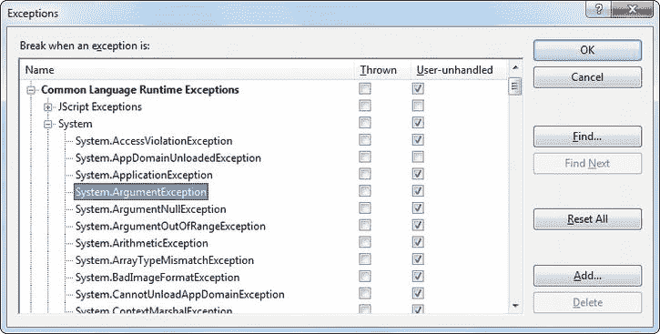

[图 7-2](#_Fig2) 。Visual Studio 的异常查看器

“异常”对话框允许您指定调试时代码应处理哪些异常，以及哪些异常将导致 Visual Studio 立即进入中断模式。这意味着您不需要禁用错误处理代码来解决问题。例如，您可以选择允许您的程序处理常见的 FileNotFoundException(这可能是由无效的用户选择引起的),但指示 Visual Studio 在发生意外的 DivideByZero 异常时暂停执行。

要进行设置，请在系统条目旁边的 Thrown 列中添加一个复选标记。DivideByZero 异常。这样，问题一出现，您就会收到警报。如果您不在抛出的列中添加复选标记，您的代码将继续运行，运行它定义的任何异常处理程序，并尝试处理问题。只有在发生错误并且没有合适的异常处理程序时，您才会收到通知。

异常链

图 7-3 显示了 InnerException 属性是如何工作的。在这里显示的特定场景中，FileNotFoundException 导致了 NullReferenceException，后者又导致了自定义的 UpdateFailedException。


[图 7-3](#_Fig3) 。异常可以链接在一起

使用异常处理块，应用可以捕获 UpdateFailedException。然后，它可以通过跟踪 InnerException 属性到 NullReferenceException 来获取有关问题来源的更多信息，NullReferenceException 又会引用原始的 FileNotFoundException。

对于基于组件的编程，InnerException 属性是一个非常有用的工具。一般来说，如果一个组件报告了一个低级别的问题，比如空引用或被零除错误，这并没有多大帮助。相反，它需要传达一个更详细的消息，说明哪个操作失败了，哪个输入可能无效。然后，调用代码通常可以更正问题并重试操作。

另一方面，有时你在调试一个潜伏在组件内部的 bug。在这种情况下，您需要准确地知道是什么导致了错误——您不希望用可能掩盖根本问题的更高级别的异常来替换它。使用异常链可以处理这两种情况:您可以根据需要接收尽可能多的链接异常对象，这些对象可以指定从最小到最具体的错误情况的信息。

处理异常

应用的第一道防线是在执行操作之前检查潜在的错误条件。例如，程序可以在执行计算之前明确检查除数是否为 0，或者在试图打开文件之前检查文件是否存在:

```cs
if (divisor != 0)
{
    // It's safe to divide some number by divisor.
}
```

```cs
if (System.IO.File.Exists("myfile.txt"))
{
    // You can now open the myfile.txt file.
    // However, you should still use exception handling because a variety of
    // problems can intervene (insufficient rights, hardware failure, etc.).
}
```

即使您执行了这个基本级别的“质量保证”，您的应用仍然容易受到攻击。例如，您无法防止所有可能发生的文件访问问题，包括可能在操作过程中自发出现的硬件故障或网络问题。类似地，在尝试打开连接之前，您没有办法验证数据库的用户 ID 和密码——即使您这样做了，这种技术也有其潜在的错误。在某些情况下，执行全面的防御检查可能并不实际，因为它们可能会对您的应用造成明显的性能拖累。由于所有这些原因，当错误发生时，您需要一种检测和处理错误的方法。

解决方案是*结构化异常处理* 。要使用结构化异常处理，您需要将可能有问题的代码封装在如下所示的特殊块结构中:

```cs
try
{
    // Risky code goes here (opening a file, connecting to a database, and so on).
}
catch
{
    // An error has been detected. You can deal with it here.
}
finally
{
    // Time to clean up, regardless of whether or not there was an error.
}
```

`try`语句支持错误处理。下面几行中出现的任何异常都可以被自动“捕获”。当检测到错误时，将执行 `catch`块中的代码。无论哪种方式，无论是否出现错误，代码的`finally`块都将最后执行。这允许您执行一些基本的清理，比如关闭数据库连接。 `finally` 代码很重要，因为即使发生了阻止程序继续运行的错误，它也会执行。换句话说，如果一个不可恢复的异常中止了您的应用，您仍然有机会释放资源。

捕捉异常的行为中和了它。如果您想做的只是使特定的错误无害，您甚至不需要在错误处理程序的`catch`块中添加任何代码。然而，通常这部分代码将用于向用户报告错误或记录错误以供将来参考。在一个单独的组件中(比如一个业务对象)，该代码可能会处理异常，执行一些清理，然后将它重新抛出给调用代码，调用代码最适合修复它或提醒用户。或者它实际上可能创建一个新的异常对象，并抛出附加信息。

捕捉特定异常

结构化异常处理特别灵活，因为它允许您捕捉特定类型的异常。为此，您添加多个`catch`语句，每个语句标识异常的类型(并提供一个新变量来捕获它)，如下所示:

```cs
try
{
    // Risky database code goes here.
}
catch (System.Data.SqlClient.SqlException err)
{
    // Catches common problems like connection errors.
}
catch (System.NullReferenceException err)
{
    // Catches problems resulting from an uninitialized object.
}
```

只要异常是指定类的实例，或者是从该类派生的，就会被捕获。换句话说，如果您使用以下语句:

```cs
catch (Exception err)
```

您将捕捉任何异常，因为每个异常对象都是从系统派生的。异常基类。

异常块的工作有点像条件代码。一旦找到匹配的异常处理程序，就会调用适当的`catch`代码。因此，您必须按照从最具体到最不具体的顺序组织您的`catch`陈述:

```cs
try
{
    // Risky database code goes here.
}
catch (System.Data.SqlClient.SqlException err)
{
    // Catches common problems like connection errors.
}
catch (System.NullReferenceException err)
{
    // Catches problems resulting from an uninitialized object.
}
catch (System.Exception err)
{
    // Catches any other errors.
}
```

以一个基本异常类的`catch`语句结束通常是一个好主意，以确保没有错误遗漏。但是，在基于组件的编程中，您应该确保只拦截那些您可以处理或恢复的异常。否则，最好让调用代码捕获原始错误。

确定需要捕捉的异常

当您使用。NET Framework，您可能不知道需要捕捉什么异常。幸运的是，Visual Studio 帮助可以为您提供帮助。

诀窍是在类库参考中查找您正在使用的方法或构造函数。跳到特定方法的一个快速方法是使用帮助索引——只需键入类名，后跟一个句点，再后跟方法名，就像在 File 中一样。打开(这是你将在第 17 章中用来打开文件的方法)。如果该方法有多个重载版本，您会看到一个页面列出了所有重载版本，您需要单击包含所需参数的那个重载版本。

找到正确的方法后，滚动方法文档，直到找到名为 Exceptions 的部分。本节列出了该方法可能引发的所有异常。例如，如果你查找文件。Open()方法，你会发现可能的异常包括 DirectoryNotFoundException、FileNotFoundException、UnauthorizedAccessException 等等。您可能不会为每个可能的异常编写一个`catch`块。但是，您仍然应该了解所有这些异常，这样您就可以决定要单独处理哪些异常。

使用嵌套异常处理程序

当引发异常时，NET 试图在当前方法中找到匹配的`catch`语句。如果代码不在局部结构化异常块中，或者如果没有一个`catch`语句匹配异常，。NET 将在调用堆栈中一次向上移动一级，搜索活动的异常处理程序。

考虑这里显示的例子。Load 事件处理程序调用私有的 DivideNumbers()方法:

```cs
protected void Page_Load(object sender, EventArgs e)
{
    try
    {
        DivideNumbers(5, 0);
    }
    catch (DivideByZeroException err)
    {
        // Report error here.
    }
}
```

```cs
private decimal DivideNumbers(decimal number, decimal divisor)
{
    return number/divisor;
}
```

在这个例子中，DivideNumbers()方法缺少任何类型的异常处理程序。然而，DivideNumbers()方法调用是在`try`块中进行的，这意味着问题将在调用代码的更上游被发现。这是一个好方法，因为 DivideNumbers()例程可以在各种环境中使用(或者，如果它是组件的一部分，可以在各种类型的应用中使用)。它不能访问任何类型的用户界面，也不能直接报告错误。只有调用代码能够确定问题是严重的还是轻微的，并且只有调用代码能够提示用户更多信息或在网页中报告错误细节。

 **注意**在这个例子中，非常小心地使用了 decimal 数据类型，而不是更常见的 double 数据类型。这是因为与你的预期相反，将一个双精度数除以 0 是可以接受的*。结果是特殊值 Double。PositiveInfinity(或 Double。如果将负数除以 0，则为 NegativeInfinity)。*

您还可以重叠异常处理程序，以便不同的异常处理程序过滤出不同类型的问题。这里有一个这样的例子:

```cs
protected void Page_Load(Object sender, EventArgs e)
{
    try
    {
        decimal average = GetAverageCost(DateTime.Now);
    }
    catch (DivideByZeroException err)
    {
        // Report error here.
    }
}
```

```cs
private decimal GetAverageCost(DateTime saleDate)
{
    try
    {
        // Use Database access code here to retrieve all the sale records
        // for this date, and calculate the average.
    }
    catch (System.Data.SqlClient.SqlException err)
    {
        // Handle a database-related problem.
    }
    finally
    {
        // Close the database connection.
    }
}
```

剖析代码。。。

您应该注意以下几点:

*   如果在数据库操作过程中出现 SqlException，它将在 getaverageconstate()方法中被捕获。
*   如果发生 DivideByZeroException(例如，该方法没有接收到任何记录，但仍然试图计算平均值)，该异常将在调用页面中被捕获。加载事件处理程序。
*   如果出现另一个问题(比如空引用异常)，没有活动的异常处理程序来捕捉它。在这种情况下，。NET 将搜索整个调用堆栈，但在活动的异常处理程序中找不到匹配的`catch`语句，并将生成一个运行时错误，结束程序，并返回一个包含异常信息的页面。

运行中的异常处理

您可以使用一个简单的程序来测试异常，并查看检索到了什么样的信息。这个程序允许用户输入两个值，并试图将它们相除。然后在页面中报告所有相关的异常信息(见[图 7-4](#Fig4) )。T3】

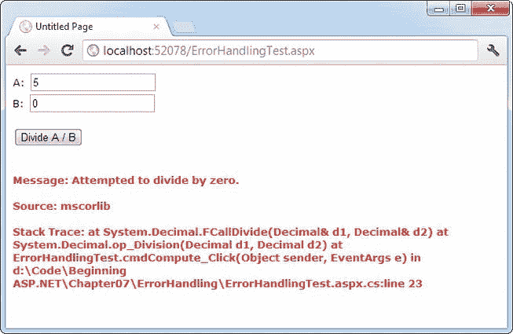

[图 7-4](#_Fig4) 。捕捉和显示异常信息

显然，通过使用额外的代码安全检查，您可以很容易地防止这个异常的发生，或者您可以通过使用验证控件很好地解决它。然而，这段代码提供了一个很好的例子来说明如何处理异常对象的属性。它还让您对将要返回的信息种类有了一个很好的了解。

下面是这个例子的页面类代码:

```cs
public partial class ErrorHandlingTest : System.Web.UI.Page
{
    protected void cmdCompute_Click(Object sender, EventArgs e)
    {
        try
        {
            decimal a, b, result;
            a = Decimal.Parse(txtA.Text);
            b = Decimal.Parse(txtB.Text);
            result = a / b;
            lblResult.Text = result.ToString();
            lblResult.ForeColor = System.Drawing.Color.Black;
        }
        catch (Exception err)
        {
            lblResult.Text = "<b>Message:</b> " + err.Message;
            lblResult.Text += "<br /><br />";
            lblResult.Text += "<b>Source:</b> " + err.Source;
            lblResult.Text += "<br /><br />";
            lblResult.Text += "<b>Stack Trace:</b> " + err.StackTrace;
            lblResult.ForeColor = System.Drawing.Color.Red;
        }
    }
}
```

请注意，一旦出现错误，执行就会转移到异常处理程序。`try`块中的代码没有完成。因此，标签的结果被设置在`try`块中。只有当除法代码运行无误时，才会执行这些行。

在本书中，你会看到更多的异常处理的例子。本书第 4 部分的数据访问章节展示了访问数据库时异常处理的最佳实践。

掌握异常

使用结构化异常处理时，请记住以下几点:

*   *把你的代码分解成多个* `try/catch` *块*:如果你把所有的代码放在一个异常处理程序中，你会很难确定问题发生在哪里。您无法在`try`块中“恢复”代码。这意味着如果一个错误出现在一个冗长的`try`块的开头，你将会跳过大量的代码。经验法则是对一个相关的任务使用一个异常处理程序(比如打开一个文件和检索信息)。
*   *报告所有错误*:在调试期间，应用的部分错误处理代码可能会掩盖应用中容易纠正的错误。为了防止这种情况发生，请确保报告所有错误，并考虑在早期构建中省略一些错误处理逻辑。
*   *不要对每个语句都使用异常处理程序*:简单的代码语句(给一个变量分配一个常量值，与一个控件交互，等等)可能会在开发测试期间导致错误，但一旦完善，不会导致任何未来的问题。当您访问外部资源或处理您无法控制的(因此可能是无效的)提供的数据时，应该使用错误处理。

抛出自己的异常

您还可以定义自己的异常对象来表示自定义错误条件。您需要做的就是创建一个适当的异常类的实例，然后使用`throw`语句。

下一个例子介绍了一个修改过的 DivideNumbers()方法。它显式检查指定的除数是否为 0，然后手动创建并引发 DivideByZeroException 类的实例来指示问题，而不是尝试该操作。根据代码的不同，这种模式可以通过消除一些不必要的步骤来节省时间，或者在任务无法成功完成时阻止任务启动。

```cs
protected void Page_Load(Object sender, EventArgs e)
{
    try
    {
        DivideNumbers(5, 0);
    }
    catch (DivideByZeroException err)
    {
        // Report error here.
    }
}
```

```cs
private decimal DivideNumbers(decimal number, decimal divisor)
{
    if (divisor == 0)
    {
        DivideByZeroException err = new DivideByZeroException();
        throw err;
    }
    else
    {
        return number/divisor;
    }
}
```

或者，您可以创建一个. NET 异常对象，并通过使用不同的构造函数来指定自定义的错误消息:

```cs
private decimal DivideNumbers(decimal number, decimal divisor)
{
    if (divisor == 0)
    {
        DivideByZeroException err = new DivideByZeroException(
         "You supplied 0 for the divisor parameter. You must be stopped.");
        throw err;
    }
    else
    {
        return number/divisor;
    }
}
```

在这种情况下，任何普通的异常处理程序仍然会捕获 DivideByZeroException。唯一的区别是 error 对象有一个修改过的包含自定义字符串的 Message 属性。[图 7-5](#Fig5) 显示了结果异常。

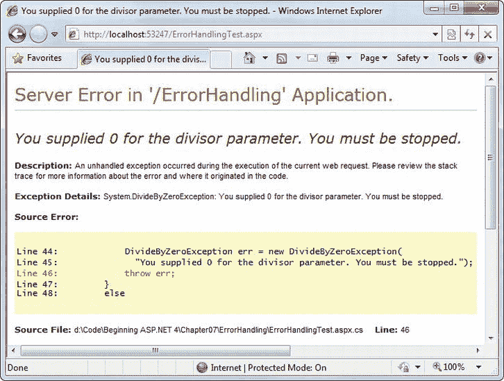

[图 7-5](#_Fig5) 。标准异常，自定义消息

抛出异常在基于组件的编程中最有用。在基于组件的编程中，你的 ASP.NET 页面从一个单独编译的程序集中定义的类中创建对象和调用方法。在这种情况下，组件中的类需要能够通知调用代码(web 应用)任何错误。组件应该安静地处理可恢复的错误，而不是将它们传递给调用代码。另一方面，如果出现不可恢复的错误，应该总是用异常来指示，而不要通过其他机制(比如返回代码)来指示。关于基于组件编程的更多信息，参见第 22 章。

如果你能在类库中找到一个准确反映已经发生的问题的异常，你应该抛出它。如果需要返回额外的或专门的信息，可以创建自己的自定义异常类。

自定义异常类应该总是从系统继承。ApplicationException，它本身派生自基异常类。这使得。NET 来区分两大类异常，即您创建的异常和。NET 框架。

创建异常类时，可以添加属性来记录附加信息。例如，这里有一个特殊的类，它记录了有关被零除的失败尝试的信息:

```cs
public class CustomDivideByZeroException : ApplicationException
{
    // Add a variable to specify the "other" number.
    // This might help diagnose the problem.
    public decimal DividingNumber;
}
```

正如您将看到的，在您创建自定义异常之后，您有机会用额外的信息填充它。当然，您的代码不太可能使用自定义异常类来处理像除以零这样的基本操作，相反，代码更有可能出现与特定于应用的任务相关的异常，例如 ValidatingPromoCodeException 或 InvalidOrderRequestException。尽管如此，您用来创建异常的步骤仍然是相同的。

 **注意**你可以直接在你的. aspx.cs 代码文件中定义自定义异常类。然而，更有条理的方法是使用单独的代码文件。为此，请在解决方案资源管理器中右击您的应用，然后选择“添加新项”。然后从模板列表中选择 Class，输入文件名，并单击 Add。Visual Studio 将在网站的 App_Code 子文件夹中放置一个新的代码文件。(您可以为每个类创建一个单独的代码文件，或者将几个类放在同一个代码文件中。这两种方法具有相同的效果。)

您可以像这样抛出这个自定义异常:

```cs
private decimal DivideNumbers(decimal number, decimal divisor)
{
    if (divisor == 0)
    {
        CustomDivideByZeroException err = new CustomDivideByZeroException();
        err.DividingNumber = number;
        throw err;
    }
    else
    {
        return number/divisor;
    }
}
```

为了完善自定义异常，您需要为它提供三个标准构造函数。这允许以每个异常支持的标准方式创建您的异常类:

*   独自一人，没有争论
*   带有自定义消息
*   带有自定义消息和用作内部异常的异常对象

这些构造函数实际上不需要包含任何代码。所有这些构造函数需要做的就是通过使用`base`关键字将参数转发给基类(继承的 ApplicationException 类中的构造函数)，如下所示:

```cs
public class CustomDivideByZeroException : ApplicationException
{
    // Add a variable to specify the "other" number.
    private decimal dividingNumber;
    public decimal DividingNumber
    {
        get { return dividingNumber; }
        set { dividingNumber = value; }
    }
```

```cs
    public CustomDivideByZeroException() : base()
    {}
```

```cs
    public CustomDivideByZeroException(string message) : base(message)
    {}
```

```cs
    public CustomDivideByZeroException(string message, Exception inner) :
     base(message, inner)
    {}
}
```

第三个构造函数对于组件编程特别有用。它允许您使用导致原始问题的异常对象来设置 InnerException 属性。下一个例子展示了如何将这个构造函数与一个名为 ArithmeticUtility: 的组件类一起使用

```cs
public class ArithmeticUtilityException : ApplicationException
{
    public ArithmeticUtilityException() : base()
    {}
```

```cs
    public ArithmeticUtilityException(string message) : base(message)
    {}
```

```cs
    public ArithmeticUtilityException(string message, Exception inner) :
     base(message, inner)
    {}
}
```

```cs
public class ArithmeticUtility
{
    private decimal Divide(decimal number, decimal divisor)
    {
        try
        {
            return number/divisor;
        }
        catch (Exception err)
        {
            // Create an instance of the specialized exception class,
            // and place the original exception object (for example, a
            // DivideByZeroException)in the InnerException property.
            ArithmeticUtilityException errNew =
             new ArithmeticUtilityException("Calculation error", err);

```

```cs
            // Now throw the new exception.
            throw errNew;
        }
    }
}
```

请记住，定制异常类实际上只是一个类向代码的不同部分传达错误的标准化方式。如果你还没有达到设计的水平——换句话说，你还没有把有用的代码放在一个独立的类中，在网页之外，或者在一个完全独立的组件中(见第 22 章)——你可能不需要创建定制的异常类。

使用页面跟踪

Visual Studio 的调试工具和 ASP。NET 的详细错误页面在测试应用时非常有用。但是，当您没有 Visual Studio 可以依赖时，有时您需要一种方法来在部署应用后识别问题。

您可以尝试通过在事件日志中记录诊断信息来识别这些错误，但这是假设有人会定期检查日志。更积极地说，您可以直接在网页中显示一些信息。这种策略的问题是，在部署 web 应用之前，您需要删除(或者至少注释掉)所有这些额外的代码。否则，您的网站用户可能会在最意想不到的时候看到奇怪的调试消息。

幸运的是，有一种更简单的方法来解决这个问题，而不需要求助于本土的解决方案。ASP.NET 提供了一个名为*跟踪*的特性，为您提供了一种更加方便和灵活的方式来报告诊断信息。

启用跟踪

要使用跟踪，您需要显式启用它。有几种方法可以打开跟踪。最简单的方法之一是向。aspx 文件:

```cs
<%@ Page Trace="true" ... %>
```

您还可以通过使用内置的 Trace 对象(它是系统的一个实例)来启用跟踪。Web.TraceContext 类)。下面是一个如何在页面中打开跟踪的示例。加载事件处理程序:

```cs
protected void Page_Load(Object sender, EventArgs e)
{
    Trace.IsEnabled = true;
}
```

这项技术非常有用，因为它允许您在代码中测试的特定情况下启用或禁用对页面的跟踪。

注意，默认情况下，在您启用跟踪之后，它将只应用于本地请求。(换句话说，如果您正在使用一个已部署的 web 应用，您需要从 web 服务器计算机上的 web 浏览器发出请求。)此限制阻止最终用户查看跟踪信息。如果需要从非现场位置跟踪网页，则需要通过更改 web.config 文件中的一些设置来启用远程跟踪。(您可以在本章后面的“执行应用级跟踪”一节中找到有关修改这些设置的信息。)一旦启用了远程跟踪，就可以使用代码有选择地打开跟踪，例如，针对特定用户。

跟踪信息

ASP.NET 跟踪自动提供一长串标准的格式化信息。这些信息允许您监视应用的几个重要方面，例如当前会话的内容和执行部分代码所用的时间。

[图 7-6](#Fig6) 显示了这些信息的样子。要构建这个示例，您可以从任何基本的 ASP.NET 页面开始。这里显示的是一个基本的 ASP.NET 页面，只有一个标签和一个按钮。

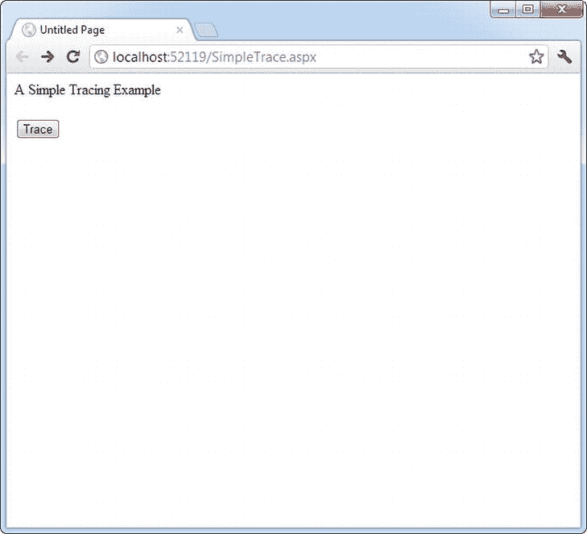

[图 7-6](#_Fig6) 。一个简单的 ASP.NET 页面

这个页面本身做得很少，只显示了一行文本。但是，如果单击该按钮，将通过设置跟踪来启用跟踪。IsEnabled 属性设置为 true(如前面的代码片段所示)。当页面被渲染时，它将包含大量的诊断信息，如图[图 7-7](#Fig7) 所示。

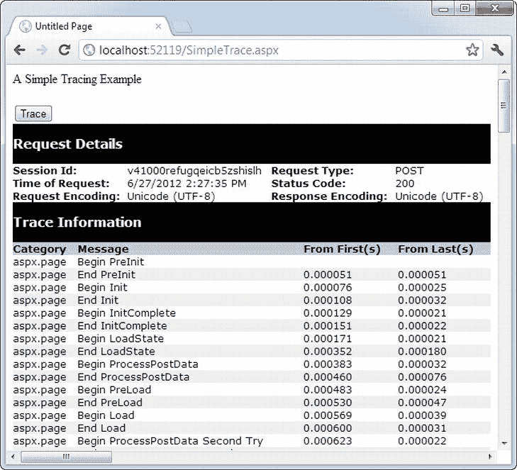

[图 7-7](#_Fig7) 。追踪简单的 ASP.NET 页面

跟踪信息分为几个类别，下面几节将对其进行描述。根据您的页面，您可能看不到所有跟踪信息。例如，如果页面请求不提供任何查询字符串参数，您将看不到 query string 集合。类似地，如果应用或会话状态中没有数据，您也不会看到这些部分。

 **提示**如果您使用样式表，您的规则可能会影响跟踪信息的格式和布局，潜在地使其难以阅读。如果这成为一个问题，您可以使用应用级跟踪，如本章后面所述(参见“执行应用级跟踪”一节)。

请求详细信息

该部分包括一些基本信息，如当前会话 ID、发出网络请求的时间、网络请求的类型和编码(见[图 7-8](#Fig8) )。这些细节大多相当无趣，你不会花太多时间去看。例外情况是会话 ID。通过观察会话 ID 何时改变，您将知道何时创建了新的会话。(会话用于在页面请求之间存储特定用户的信息。你会在第八章中了解到它们。)

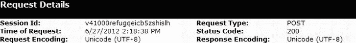

[图 7-8](#_Fig8) 。请求详细信息

跟踪信息

跟踪信息显示了页面在发送到客户端之前所经历的处理阶段(见[图 7-9](#Fig9) )。每个部分都有关于完成处理所需时间的附加信息，作为从第一个阶段开始的度量(从第一个)和从上一个阶段开始的度量(从最后一个)。如果您添加自己的跟踪消息(稍后将介绍这种技术)，它们也会出现在本节中。

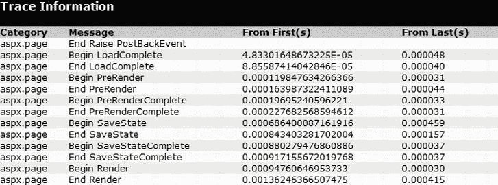

[图 7-9](#_Fig9) 。跟踪信息

控制树

控件树显示页面上的所有控件，缩进显示它们的层次结构(哪些控件包含在其他控件中)，如图[图 7-10](#Fig10) 所示。在这个简单的页面示例中，控件树包括一个名为 cmdTrace 的按钮，它是在网页标记中显式定义的。ASP.NET 还自动添加文字控件来表示间距和任何其他非服务器控件的静态元素(如文本或普通的 HTML 标签)。在本例中，这些控件出现在按钮之间，并自动生成名称，如 ctl00、ctl01、ctl02 等。

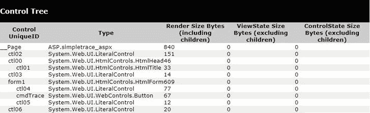

[图 7-10](#_Fig10) 。控制树

此部分的一个有用功能是 ViewState Size 列，它告诉您在控件中保持当前信息所需的空间字节数。这可以帮助您判断启用控件状态是否会降低性能，尤其是在使用 GridView 等数据绑定控件时。

会话状态和应用状态

这些部分显示当前会话或应用状态中的每个项目。适当状态集合中的每个项目都列出了其名称、类型和值。如果存储的是简单的字符串信息，这个值很简单——它是字符串中的实际文本。如果你正在存储一个对象。NET 调用对象的 ToString()方法来获取适当的字符串表示形式。对于没有覆盖 ToString()来提供任何有用信息的复杂对象，结果可能只是类名。

[图 7-11](#Fig11) 显示了向会话状态添加两个项目(一个普通字符串和一个数据集对象)后的会话状态部分。[第 8 章](08.html)有更多关于使用会话状态的内容。

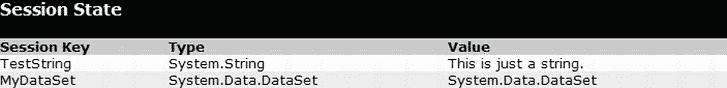

[图 7-11](#_Fig11) 。会话状态

请求 cookie 和响应 cookie

这些部分显示 web 浏览器随对该页面的请求一起发送的 cookie，并显示 web 服务器随响应一起返回的 cookie。ASP.NET 以字节显示每个 cookie 的内容和大小。

图 7-12 显示了一个页面的例子，这个页面使用了一个名为 Preferences 的 cookie 来存储一条信息:用户名。(你在[第 8 章](08.html)学会了编写创建这个 cookie 的代码。)此外，web 浏览器还会收到一个名为 ASP 的 cookie。NET_SessionId，ASP.NET 自动创建它来存储当前的会话 Id。

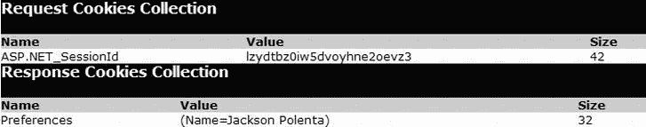

[图 7-12](#_Fig12) 。Cookies 集合

跟踪信息中的 cookies 列表有一个奇怪之处。如果你还没有创建至少一个自己的定制 cookie，你将看不到任何*cookie，包括 ASP.NET 自动创建的 cookie(比如会话 cookie)。ASP.NET 认为，如果你自己不使用 cookies，你就不会有兴趣看到这些细节。*

标题集合

本节列出了所有 HTTP 头(见[图 7-13](#Fig13) )。从技术上讲，标头是作为请求的一部分发送给服务器的信息。这些信息包括发出请求的浏览器、它支持的内容类型以及它使用的语言。此外，Response Headers 集合列出了作为响应的一部分发送给客户端的标头(就在浏览器中显示的实际 HTML 之前)。响应头的集合更小，它包括诸如 ASP.NET 版本和发送的内容类型(网页的文本/html)之类的细节。

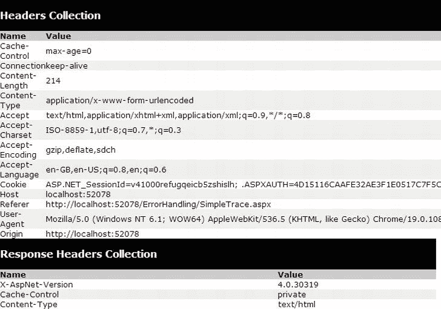

[图 7-13](#_Fig13) 。标题集合

一般不需要直接使用头信息。相反，ASP.NET 会自动考虑这些信息。

形式集合

本节列出了回发的表单信息。表单信息包括 web 控件提交的所有值，如文本框中的文本和列表框中的当前选择。ASP.NET web 控件会自动从表单集合中提取他们需要的信息，所以你很少需要担心。

[图 7-14](#Fig14) 显示了[图 7-6](#Fig6) 中显示的简单页面的表单值。它包括隐藏的视图状态字段，这是另一个用于事件验证的隐藏字段(一个低级 ASP.NET 功能，有助于防止人们在回发网页之前篡改网页)，以及 cmdTrace 按钮字段，这是页面上唯一的 web 控件。

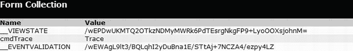

[图 7-14](#_Fig14) 。形式集合

查询字符串集合

本节列出了查询字符串中提交的变量和值。您可以直接在网页 URL(在浏览器的地址栏中)中看到这些信息。但是，如果查询字符串由几个不同的值组成，并且包含大量信息，那么在跟踪显示中查看单个项目可能会更容易。

[图 7-15](#Fig15) 显示了用两个查询字符串值请求的页面信息，一个名为*搜索*，另一个名为*样式*。您可以通过在 web 浏览器的地址栏中的 URL 末尾键入`?search=cat&style=full`来尝试使用 SimpleTrace.aspx 页面。


[图 7-15](#_Fig15) 。查询字符串集合

服务器变量

本节列出了所有服务器变量及其内容。您通常不需要检查这些信息。还要注意，如果您想以编程方式检查一个服务器变量，您可以通过内置请求的名称来完成。ServerVariables 集合或通过使用 Request 对象中更有用的高级属性之一。

写入跟踪信息

除了标准的跟踪信息之外，您通常还想生成自己的跟踪消息。例如，您可能希望在执行过程中的不同点输出变量值，以便与预期值进行比较。类似地，您可能希望在代码到达执行中的特定点时输出消息，以便您可以验证各种过程正在被使用(并且按照您期望的顺序使用)。同样，这些任务也可以使用 Visual Studio 调试来完成，但是当您使用已经部署到 web 服务器的 web 应用时，跟踪是一种非常有价值的技术。

若要编写自定义跟踪消息，可以使用内置跟踪对象的 write()方法或 Warn()方法。这些方法是等效的。唯一的区别是 Warn()用红色字体显示消息，这样更容易与列表中的其他消息区分开来。下面是当用户单击按钮时编写跟踪消息的代码片段:

```cs
protected void cmdWrite_Click(Object sender, EventArgs e)
{
    Trace.Write("About to place an item in session state.");
    Session["Test"] = "Contents";
    Trace.Write("Placed item in session state.");
}
```

这些消息与 ASP.NET 自动生成的默认消息一起出现在页面的跟踪信息部分(见[图 7-16](#Fig16) )。

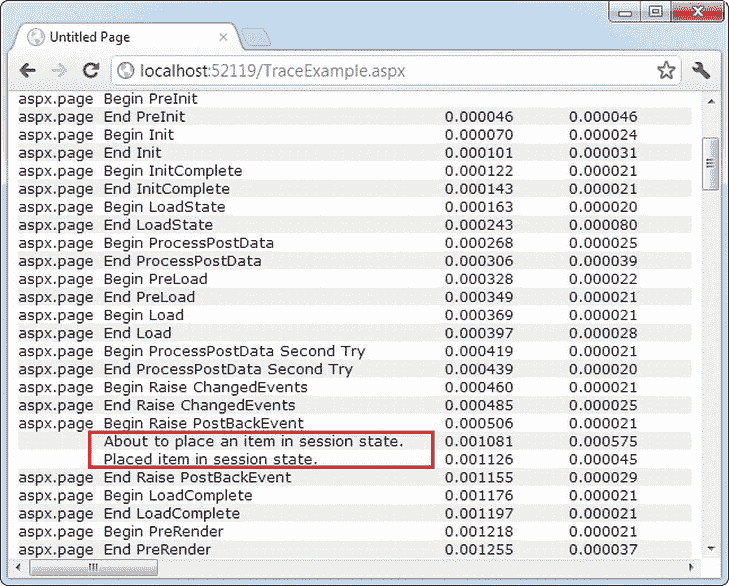

[图 7-16](#_Fig16) 。自定义跟踪消息

您还可以使用 Write()或 Warn()的重载方法来指定类别。该字段通常用于指示当前方法，如图 7-17 所示。

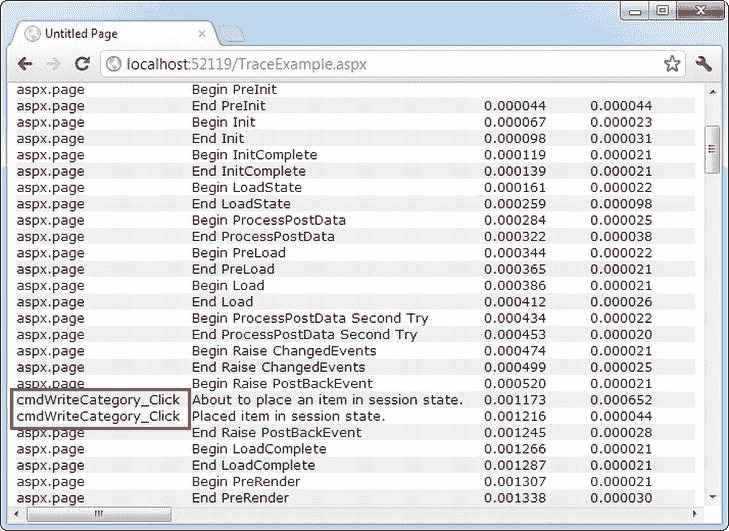

[图 7-17](#_Fig17) 。分类跟踪消息

```cs
protected void cmdWriteCategory_Click(Object sender, EventArgs e)
{
    Trace.Write("cmdWriteCategory_Click",
     "About to place an item in session state.");
    Session["Test"] = "Contents";
    Trace.Write("cmdWriteCategory_Click",
     "Placed item in session state.");
}
```

或者，您可以提供带有异常对象的类别和消息信息，该异常对象将在跟踪日志中自动描述，如图[图 7-18](#Fig18) 所示。

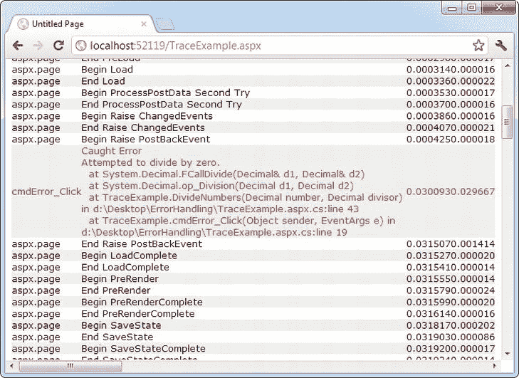

[图 7-18](#_Fig18) 。异常跟踪消息

```cs
protected void cmdError_Click(Object sender, EventArgs e)
{
    try
    {
        DivideNumbers(5, 0);
    }
    catch (Exception err)
    {
        Trace.Warn("cmdError_Click", "Caught Error", err);
    }
}
```

```cs
private decimal DivideNumbers(decimal number, decimal divisor)
{
    return number/divisor;
}
```

默认情况下，跟踪消息按照代码编写的顺序列出。或者，您可以通过使用 Page 指令中的 TraceMode 属性来指定消息应该按类别排序:

```cs
<%@ Page Trace="true" TraceMode="SortByCategory" %>
```

或者代码中 Trace 对象的 TraceMode 属性:

```cs
Trace.TraceMode = TraceMode.SortByCategory;
```

执行应用级跟踪

应用级跟踪允许您对整个应用启用跟踪。但是，跟踪信息不会显示在页面中。相反，它将被收集并在内存中存储一小段时间。您可以通过请求一个特殊的 URL 来查看最近跟踪的信息。应用级跟踪有几个优点。网页中的格式和布局不会破坏跟踪信息，您可以比较来自不同请求的跟踪信息，并且可以查看为其他人的请求记录的跟踪信息。

要启用应用级跟踪，您需要修改 web.config 文件中的设置，如下所示:

```cs
<configuration>
 <system.web>
    <trace enabled="true" requestLimit="10" pageOutput="false" />
    ...
 </system.web>
</configuration>
```

[表 7-2](#Tab2) 列出了跟踪选项。

[表 7-2](#_Tab2) 。跟踪选项

| 属性 | 价值观念 | 描述 |
| --- | --- | --- |
| 使能够 | 真，假 | 打开或关闭应用级跟踪。 |
| 请求限制 | 任何整数(例如，10) | 存储最大数量 HTTP 请求的跟踪信息。与页面级跟踪不同，这允许您从多个请求中收集一批信息。当达到最大值时，根据最新的设置，ASP.NET 可能会丢弃最早请求中的信息(这是默认行为)或新请求中的信息。 |
| 页面输出 | 真，假 | 确定是否在页面上显示跟踪信息(与页面级跟踪一样)。如果选择 false，您仍然可以通过从运行应用的虚拟目录请求 trace.axd 来查看收集的信息。 |
| trace mode-追踪模式 | SortByTime，sort by category(sort by 时间，sort by 类别) | 确定跟踪消息的排序顺序。默认值为 SortByTime。 |
| localOnly(仅限本地) | 真，假 | 确定跟踪信息是只向本地客户端(使用同一台计算机的客户端)显示，还是也可以向远程客户端显示。默认情况下，这是正确的，远程客户端看不到跟踪信息。 |
| 样品最新 | 真，假 | 如果为真，则仅保留最新的跟踪消息。当达到 requestLimit 最大值时，每次收到新请求时，最旧请求的信息都会被放弃。如果为 false(默认值)，当达到限制时，ASP.NET 将停止收集新的跟踪消息。 |

要查看跟踪信息，可以请求 web 应用根目录中的 trace.axd 文件。该文件实际上不存在；相反，ASP.NET 会自动拦截该请求，并将其解释为对跟踪信息的请求。然后它会列出最近收集的请求，假设你是从本地机器发出请求或者已经启用远程跟踪(见[图 7-19](#Fig19) )。

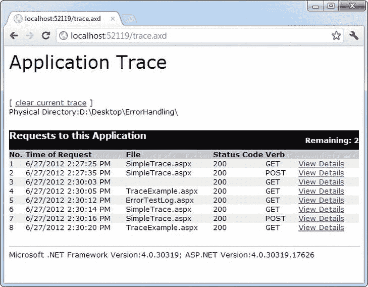

[图 7-19](#_Fig19) 。跟踪的应用请求

 **注意**有时当从 Visual Studio 的测试 web 服务器请求 trace.axd 时，您可能看不到最近跟踪的请求。在这种情况下，单击浏览器的刷新按钮以获取更新的列表。

您可以通过单击“查看详细信息”链接来查看任何请求的详细信息。这为短期存储跟踪信息提供了一种有用的方法，并允许您在不需要查看实际页面的情况下查看跟踪信息(见[图 7-20](#Fig20) )。

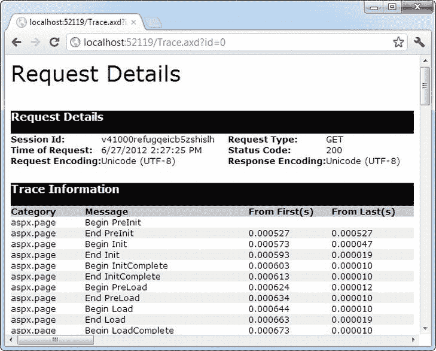

[图 7-20](#_Fig20) 。被跟踪的应用请求之一

最后一句话

普通网站和专业网站应用之间最显著的区别之一通常在于它如何处理错误。在本章中，您学习了如何用结构化错误处理来拦截问题，以及如何用跟踪来诊断其他更微妙的问题。