# 八、状态管理

Web 编程和桌面编程之间最显著的区别是*状态管理*——如何在应用的生命周期中存储信息。这些信息可以像用户名一样简单，也可以像电子商务商店的购物车一样复杂。

在传统的桌面应用中，几乎不需要考虑状态管理。内存充足且总是可用，您只需要担心单个用户。在 web 应用中，情况就不同了。成千上万的用户可以在同一台计算机(web 服务器)上同时运行同一个应用，每个用户都通过无状态的 HTTP 连接进行通信。这些条件使得不可能用与桌面应用相同的方式来设计 web 应用。

理解这些状态限制是创建高效 web 应用的关键。在这一章中，你将看到如何使用 ASP。NET 的状态管理特性来谨慎一致地存储信息。您将探索不同的存储选项，包括视图状态、会话状态和自定义 cookies。您还将考虑如何使用跨页发送和查询字符串在页面之间传递信息。

理解状态问题

在传统的桌面应用中，用户与持续运行的应用进行交互。台式计算机上的一部分内存被分配来存储当前的工作信息集。

在 web 应用中，情况有很大的不同。一个专业的 ASP.NET 网站可能看起来像是一个持续运行的应用，但这实际上只是一个聪明的错觉。在典型的 web 请求中，客户端连接到 web 服务器并请求页面。当页面被发送时，连接被切断，web 服务器从内存中丢弃所有的页面对象。当用户收到一个页面时，web 页面代码已经停止运行，web 服务器的内存中没有留下任何信息。

这种无状态设计有一个显著的优点。因为客户端最多只需要连接几秒钟，所以 web 服务器可以处理大量几乎同时发生的请求，而不会影响性能。但是，如果您希望将信息保留更长的时间，以便可以在多次回发或多个页面上使用，则需要采取额外的步骤。

使用视图状态

存储信息最常见的方式之一是在*视图状态*中。视图状态使用一个隐藏字段，ASP.NET 会自动将该字段插入到最终呈现的网页 HTML 中。这是在单个网页中存储用于多次回发的信息的理想位置。

在第 5 章中，你学习了 web 控件如何使用视图状态来跟踪某些细节。例如，如果更改标签的文本，label 控件会自动在视图状态中存储其新文本。这样，下次回发页面时，文本会保留在原来的位置。如果您没有关闭视图状态(例如，通过将控件或页面的 EnableViewState 属性设置为 false)，Web 控件将它们的大部分属性值存储在视图状态中。

视图状态不限于 web 控件。您的网页代码可以将信息直接添加到包含页面的视图状态中，并在页面回发后检索它。您可以存储的信息类型包括简单数据类型和您自己的自定义对象。

视图状态集合

页面的 ViewState 属性提供当前视图状态信息。此属性提供 StateBag 集合类的实例。state bag 是一个字典集合，这意味着每一项都使用一个唯一的字符串名存储在一个单独的“slot”中，这个字符串名也被称为*键名*。

例如，考虑以下代码:

```cs
// The this keyword refers to the current Page object. It's optional.
this.ViewState["Counter"] = 1;
```

这将值 1(或者更确切地说，是包含值 1 的整数)放入 ViewState 集合中，并为其提供描述性名称计数器。如果当前没有项目具有名称计数器，则会自动添加一个新项目。如果一个项目已经存储在名称计数器下，它将被替换。

检索值时，使用键名。您还需要通过使用您在第 2 章和第 3 章中看到的转换语法，将检索到的值转换为适当的数据类型。这个额外的步骤是必需的，因为 ViewState 集合将所有项存储为基本对象，这允许它处理许多不同的数据类型。

下面是从视图状态中检索计数器并将其转换为整数的代码:

```cs
int counter;
counter = (int)this.ViewState["Counter"];
```

 **注意**ASP.NET 提供了许多使用相同字典语法的集合。这些包括您将用于会话和应用状态的集合，以及用于缓存和 cookies 的集合。在这一章中，你会看到几个这样的集合。

视图状态示例

下面的例子是一个简单的计数器程序，记录一个按钮被点击的次数。如果没有任何类型的状态管理，计数器将永久锁定在 1。小心使用视图状态，计数器会按预期工作。

```cs
public partial class SimpleCounter : System.Web.UI.Page
{
    protected void cmdIncrement_Click(object sender, EventArgs e)
    {
        int counter;
        if (ViewState["Counter"] == null)
        {
            counter = 1;
        }
        else
        {
            counter = (int)ViewState["Counter"] + 1;
        }
```

```cs
        ViewState["Counter"] = counter;
        lblCount.Text = "Counter: " + counter.ToString();
    }
}
```

在尝试检索该项之前，代码会进行检查以确保该项存在于视图状态中。否则，你很容易遇到问题，比如臭名昭著的*空引用异常*(在[第 7 章](07.html)中有描述)。

[图 8-1](#Fig1) 显示了该页面的输出。

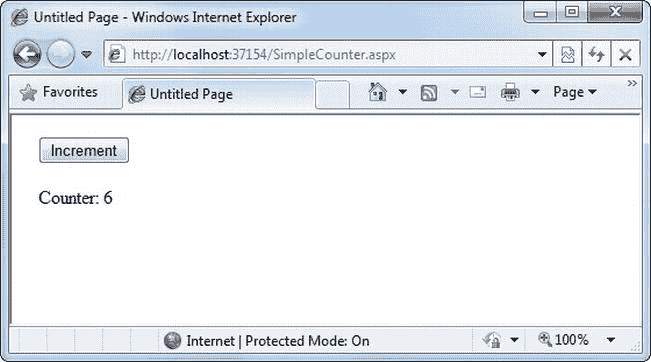

[图 8-1](#_Fig1) 。简单的视图状态计数器

使视图状态安全

你可能还记得第 5 章中的视图状态信息存储在一个混乱的字符串中，看起来像这样:

```cs
<input type="hidden" name="__VIEWSTATE" id="__VIEWSTATE"
 value="dDw3NDg2NTI5MDg7Oz4=" />
```

随着您向视图状态添加更多信息，该值可能会变得更长。因为这个值没有被格式化为明文，所以许多 ASP.NET 程序员认为他们的视图状态数据是加密的。不是的。相反，视图状态信息只是在内存中拼凑起来，并转换成一个 *Base64 字符串*(这是一种特殊类型的字符串，在 HTML 文档中总是可以接受的，因为它不包含任何扩展字符)。一个聪明的黑客可以逆向工程这个字符串，并在几秒钟内检查您的视图状态数据。

幸运的是，ASP.NET 拥有使视图状态更加安全的工具。默认情况下，它使视图状态防篡改(请参见下一节“防篡改视图状态”)，并为您提供了使其保密的附加选项(请参见下一节“私有视图状态”)。

防篡改视图状态

ASP.NET 使用哈希代码来确保你的视图状态信息在你不知情的情况下不会被修改。从技术上来说，*哈希码*是一种加密的强校验和。这个想法是，ASP.NET 在呈现最终页面之前，检查视图状态中的所有数据。它通过散列算法(在密钥值的帮助下)运行这些数据。哈希算法创建一小段数据，即哈希代码。然后，在发送给浏览器的最终 HTML 中，将这段代码添加到视图状态数据的末尾。

当页面回发到服务器时，哈希代码变得非常有用。此时，ASP.NET 检查视图状态数据，并使用最初创建哈希代码时使用的相同过程重新计算哈希代码。然后，ASP.NET 检查新计算的哈希代码是否与存储在页面视图状态中的原始哈希代码匹配。如果恶意用户更改了部分视图状态数据，新的哈希代码将与原始值不匹配。此时，ASP.NET 将完全拒绝回发并显示一个错误页面。(你可能认为一个真正聪明的用户可以通过生成假的视图状态信息*和匹配的散列码*来绕过这个问题。但是，恶意用户无法生成正确的哈希代码，因为他们没有与 ASP.NET 相同的加密密钥。)

默认情况下启用哈希代码，因此您不需要采取任何额外的步骤来获得此功能。(理论上，你可以禁用它，但从来没有人这么做过——你也不应该这么做。)

私有视图状态

即使使用哈希代码，用户仍然可以读取视图状态数据。在许多情况下，这是完全可以接受的——毕竟，视图状态跟踪通常直接通过其他控件提供的信息。但是，如果您的视图状态包含一些您想要保密的信息，您可以启用视图状态*加密*。

您可以使用 page 指令的 ViewStateEncryptionMode 属性打开单个页面的加密:

```cs
<%@Page ViewStateEncryptionMode="Always" %>
```

或者，您可以在配置文件中设置相同的属性，为网站中的所有页面配置视图状态加密:

```cs
<configuration>
    ...
    <system.web>
     <pages viewStateEncryptionMode="Always" />
     ...
    </system.web>
</configuration>
```

无论哪种方式，这都会强制加密。对于视图状态加密设置，您有三种选择—总是加密(always)、从不加密(never)或仅在控件明确请求时加密(Auto)。默认值为 Auto，这意味着该页不会加密其视图状态，除非该页上的控件明确请求这样做。(从技术上讲，控件通过调用页面来发出请求。registerrequiresviewstatecryption()方法。)如果没有控件调用此方法来指示它具有敏感信息，则不加密视图状态，从而节省了加密开销。另一方面，如果控件调用 Page，它没有绝对的权力。registerrequiresviewstatencryption()且加密模式为 Never，则视图状态不会被加密。

 **提示**如果不需要，不要加密视图状态数据。加密会造成性能损失，因为 web 服务器需要在每次回发时执行加密和解密。

保留成员变量

您可能已经注意到，当页面处理完成并将页面发送到客户端时，您在 ASP.NET 页面的成员变量中设置的任何信息都会被自动放弃。有趣的是，您可以通过使用视图状态来解决这个限制。

的基本原理是保存所有成员变量以查看页面时的状态。PreRender 事件发生，并在页面。发生加载事件。请记住，每次创建页面时都会发生 Load 事件。在回发的情况下，Load 事件首先发生，然后是任何其他控件事件。

下面的示例对单个成员变量(名为 Contents)使用这种技术。该页面提供了一个文本框和两个按钮。用户可以选择保存一串文本，然后在以后恢复(见[图 8-2](#Fig2) )。按钮。单击事件处理程序，使用 Contents 成员变量存储和检索此文本。这些事件处理程序不需要通过使用视图状态来保存或恢复这些信息，因为 PreRender 和 Load 事件处理程序会在页面处理开始和结束时执行这些任务。

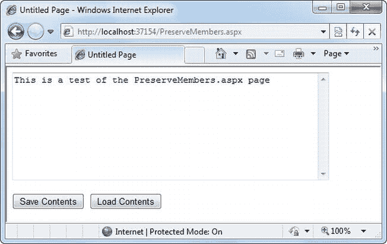

[图 8-2](#_Fig2) 。带有状态的页面

```cs
public partial class PreserveMembers : Page
{
    // A member variable that will be cleared with every postback.
    private string contents;

```

```cs
    protected void Page_Load(Object sender, EventArgs e)
    {
        if (this.IsPostBack)
        {
            // Restore variables.
            contents = (string)ViewState["contents"];
        }
    }
```

```cs
    protected void Page_PreRender(Object sender, EventArgs e)
    {
        // Persist variables.
        ViewState["contents"] = contents;
    }
```

```cs
    protected void cmdSave_Click(Object sender, EventArgs e)
    {
        // Transfer contents of text box to member variable.
        contents = txtValue.Text;
        txtValue.Text = "";
    }
```

```cs
    protected void cmdLoad_Click(Object sender, EventArgs e)
    {
        // Restore contents of member variable to text box.
        txtValue.Text = contents;
    }
}
```

Load 和 PreRender 事件处理程序中的逻辑允许您的代码的其余部分或多或少地像在桌面应用中一样工作。但是，在使用这种技术时，您必须小心不要存储不必要的大量信息。如果在视图状态中存储不必要的信息，将会增大最终页面输出的大小，从而降低页面传输速度。这种方法的另一个缺点是它隐藏了底层的事实，即每一部分数据都必须显式地保存和恢复。当你隐藏这一事实时，你很可能会忘记尊重它并为它设计。

如果您决定使用这种方法来保存视图状态中的成员变量，那么只使用它*。换句话说，不要在 PreRender 阶段保存一些视图状态变量，而在控件事件处理程序中保存其他变量，因为这肯定会让您和查看您代码的任何其他程序员感到困惑。*

 * **提示**前面的代码示例对页面做出反应。PreRender 事件，该事件发生在页面处理完成之后，以 HTML 格式呈现页面之前。这是存储任何需要的剩余信息的理想位置。不能将视图状态信息存储在页的事件处理程序中。卸载事件。虽然您的代码不会导致错误，但是信息不会存储在视图状态中，因为最终的 HTML 页面输出已经呈现。

存储自定义对象

您可以在视图状态中存储自己的对象，就像存储数值和字符串类型一样容易。但是，要在视图状态中存储一个项，ASP.NET 必须能够将它转换成字节流，以便可以将它添加到页面中的隐藏输入字段。这个过程叫做*序列化*。如果你的对象是不可序列化的(默认情况下它们是不可序列化的)，当你试图将它们置于视图状态时，你会收到一条错误消息。

要使对象可序列化，需要在类声明之前添加一个可序列化的属性。例如，这里有一个非常简单的客户类:

```cs
[Serializable]
public class Customer
{
    private string firstName;
    public string FirstName
    {
        get { return firstName; }
        set { firstName = value; }
    }
```

```cs
    private string lastName;
    public string LastName
    {
        get { return lastName; }
        set { lastName = value; }
    }
```

```cs
    public Customer(string firstName, string lastName)
    {
        FirstName = firstName;
        LastName = lastName;
    }
}
```

因为 Customer 类被标记为可序列化，所以它可以存储在视图状态中:

```cs
// Store a customer in view state.
Customer cust = new Customer("Marsala", "Simons");
ViewState["CurrentCustomer"] = cust;
```

请记住，在使用自定义对象时，您需要在从视图状态中检索数据时对其进行转换。

```cs
// Retrieve a customer from view state.
Customer cust;
cust = (Customer)ViewState["CurrentCustomer"];
```

一旦你理解了这个原则，你也就能决定哪一个。NET 对象可以放在视图状态中。您只需要在 Visual Studio 帮助中找到类信息。最简单的方法是在索引中查找类。例如，为了找到 FileInfo 类(你将在第 17 章中了解到它)，寻找索引条目 *FileInfo 类*。在类文档中，您会看到该类的声明，看起来像这样:

```cs
[Serializable]
[ComVisible(true)]
public sealed class FileInfo : FileSystemInfo
```

如果类声明前面有 Serializable 属性(就像这里一样)，这个类的实例可以放在视图状态中。如果 Serializable 属性不存在，则该类是不可序列化的，并且您将无法在视图状态中放置它的实例。

在页面之间传输信息

视图状态的最大限制之一是它与特定页面紧密绑定。如果用户导航到另一个页面，这些信息就会丢失。这个问题有几种解决方案，最佳方法取决于您的需求。

在这一节中，您将学习两种在页面之间传递信息的基本技术:跨页提交和查询字符串。

跨页过账

*跨页回发*是一种扩展您已经了解的回发机制的技术，这样一个页面就可以将用户发送到另一个页面，并完成该页面的所有信息。这种技术在概念上听起来很简单，但它是一个潜在的雷区。如果不小心，它会导致您创建的页面与其他页面紧密耦合，难以增强和调试。

支持跨页回发的基础结构是一个名为 PostBackUrl 的属性，它由 IbuttonControl 接口定义，出现在按钮控件中，如 ImageButton、LinkButton 和 Button。要使用交叉发布，只需将 PostBackUrl 设置为另一个 WebForm 的名称。当用户单击按钮时，页面将被发布到新的 URL，其中包含当前页面上所有输入控件的值。(回发的信息包括隐藏的视图状态字段。您很快就会看到，它允许 ASP.NET 在内存中创建源页面的最新实例。)

下面是一个示例—一个名为 CrossPage1.aspx 的页面定义了一个包含两个文本框和一个按钮的表单。单击该按钮时，它会发布到一个名为 CrossPage2.aspx 的页面。

```cs
<%@ Page Language="C#" AutoEventWireup="true" CodeFile="CrossPage1.aspx.cs"
    Inherits="CrossPage1" %>
<html ="http://www.w3.org/1999/xhtml">
<head runat="server">
    <title>CrossPage1</title>
</head>
<body>
    <form id="form1" runat="server" >
     <div>
        First Name:
        <asp:TextBox ID="txtFirstName" runat="server"></asp:TextBox>
        <br />
        Last Name:
        <asp:TextBox ID="txtLastName" runat="server"></asp:TextBox>
        <br />
        <br />
        <asp:Button runat="server" ID="cmdPost"
         PostBackUrl="CrossPage2.aspx" Text="Cross-Page Postback" /><br />
     </div>
    </form>
</body>
</html>
```

CrossPage1 页面不包含任何代码。[图 8-3](#Fig3) 显示了它如何出现在浏览器中。


[图 8-3](#_Fig3) 。跨页回发的起点

现在，如果您加载该页面并单击按钮，该页面将回发到 CrossPage2.aspx。此时，CrossPage2.aspx 页面可以通过使用该页面与 CrossPage1.aspx 进行交互。前一页属性。下面是 CrossPage2 页面的代码，其中包括一个事件处理程序，它从上一个页面获取标题并显示出来:

```cs
public partial class CrossPage2 : System.Web.UI.Page
{
    protected void Page_Load(object sender, EventArgs e)
    {
        if (PreviousPage != null)
        {
            lblInfo.Text = "You came from a page titled " +
             PreviousPage.Title;
        }
    }
}
```

请注意，该页面在尝试访问 PreviousPage 对象之前会检查是否有空引用。如果是空引用，则不会发生跨页回发。这意味着直接请求了 CrossPage2.aspx 或 CrossPage2.aspx 回发到自身。无论哪种方式，都没有可用的 PreviousPage 对象。

[图 8-4](#Fig4) 显示了当 CrossPage1.aspx 发布到 CrossPage2.aspx 时你会看到什么。

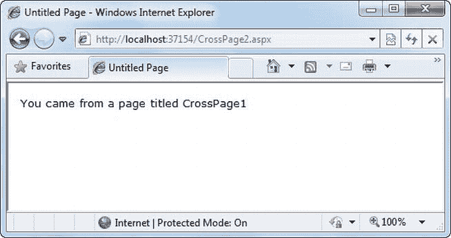

[图 8-4](#_Fig4) 。跨页回发的目标

从源页面获取更多信息

前面的例子展示了一个有趣的初始测试，但是它并不真正允许您传递任何有用的信息。毕竟，您可能对从 CrossPage2.aspx 中检索特定的细节感兴趣(比如 CrossPage1.aspx 的文本框中的文本)。单看标题并不十分有趣。

为了获得更具体的细节，比如控制值，您需要将 PreviousPage 引用转换为适当的 Page 类(在本例中，它是 CrossPage1 类)。下面是一个正确处理这种情况的示例，它首先检查 PreviousPage 对象是否是预期类的实例:

```cs
public partial class CrossPage1 : System.Web.UI.Page
{
    protected void Page_Load(object sender, EventArgs e)
    {
        CrossPage1 prevPage = PreviousPage as CrossPage1;
        if (prevPage != null)
        {
            // (Read some information from the previous page.)
        }
    }
}
```

 **注意**在无项目的网站中，Visual Studio 可能会将这段代码标记为错误，表示它没有源页面类的类型信息(在本例中，就是 CrossPage1)。但是，你编译完网站后，错误就会消失。

你也可以用另一种方法解决这个问题。您可以将 PreviousPageType 指令添加到。接收跨页回发的 aspx 页(在本例中为 Crosspage2.aspx ),紧接在 Page 指令之后。PreviousPageType 指令指示启动跨页回发的页面的预期类型。这里有一个例子:

```cs
<%@ PreviousPageType VirtualPath="∼/CrossPage1.aspx" %>
```

现在，PreviousPage 属性将自动使用 CrossPage1 类型。这允许您跳过强制转换代码，直接使用上一页对象开始工作，就像这样:

```cs
protected void Page_Load(object sender, EventArgs e)
{
    if (PreviousPage != null)
    {
        // (Read some information from the previous page.)
    }
}
```

然而，这种方法更脆弱，因为它将您限制在单页类中。您无法灵活地处理多个页面来触发跨页回发。因此，使用强制转换方法通常更灵活。

将前一页转换为适当的页类型后，您仍然不能直接访问它包含的控件对象。这是因为网页上的控件不能被其他类公开访问。您可以使用属性来解决这个问题。

例如，如果要在源页面中显示两个文本框的值，可以为每个控件变量添加一个属性。下面是您可以添加到 CrossPage1 类以公开其 TextBox 控件的两个属性:

```cs
public TextBox FirstNameTextBox
{
    get { return txtFirstName; }
}
public TextBox LastNameTextBox
{
    get { return txtLastName; }
}
```

然而，这通常不是最好的方法。问题是它暴露了太多的细节，让目标页面可以自由阅读从文本框中的文本到字体和颜色的所有内容。如果以后需要更改页面以使用不同的输入控件，将很难维护这些属性。相反，您可能会被迫重写这两个页面中的代码。

更好的选择是定义特定的、有限的方法或属性，只提取您需要的信息。例如，您可能决定添加一个 FullName 属性，该属性只从两个文本框中检索文本。下面是具有该属性的 CrossPage1.aspx 的完整页面代码:

```cs
public partial class CrossPage1 : System.Web.UI.Page
{
    public string FullName
    {
        get { return txtFirstName.Text + " " + txtLastName.Text; }
    }
}
```

这样，两个页面之间的关系清晰、简单，并且易于维护。您可能可以更改源页面(CrossPage1)中的控件，而无需更改应用的其他部分。例如，如果您决定对 CrossPage1.aspx 中的姓名条目使用不同的控件，您将被迫修改 FullName 属性的代码。但是，您的更改将仅限于 CrossPage1.aspx，您根本不需要修改 CrossPage2.aspx。

下面是如何重写 CrossPage2.aspx 中的代码以显示 CrossPage1.aspx 中的信息:

```cs
protected void Page_Load(object sender, EventArgs e)
{
    if (PreviousPage != null)
    {
        lblInfo.Text = "You came from a page titled " +
            PreviousPage.Title + "<br />";
```

```cs
        CrossPage1 prevPage = PreviousPage as CrossPage1;
        if (prevPage != null)
        {
            lblInfo.Text += "You typed in this: " + prevPage.FullName;
        }
    }
}
```

请注意，目标页面(CrossPage2.aspx)可以访问前一个页面(CrossPage1.aspx)的 Title 属性，而无需执行任何转换。这是因为标题属性被定义为基本系统的一部分。Web.UI.Page 类，因此每个网页都包含它。但是，要访问更专门化的 FullName 属性，需要将前一页转换为正确的 page 类(CrossPage1)或使用前面讨论过的 PreviousPageType 指令。

图 8-5 显示了新的结果。

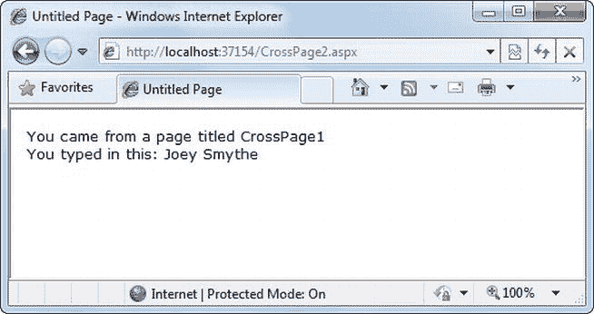

[图 8-5](#_Fig5) 。从源页面检索特定信息

 **注意**跨页回发确实有用，但是它们会导致更复杂的页面。如果您允许多个源页面发布到同一个目标页面，那么就由您来编写逻辑代码，判断用户来自哪个页面，然后采取相应的行动。为了避免这些麻烦，最简单的方法是只在两个特定页面之间执行跨页回发。

ASP.NET 使用了一些有趣的技巧让跨页回发发挥作用。第二页第一次访问 page。ASP.NET 需要创建上一页对象。为此，它实际上启动了页面处理，但是在 PreRender 阶段之前中断了它，并且它不允许页面呈现任何 HTML 输出。

然而，这仍然有一些有趣的副作用。例如，触发上一页的所有页面事件，包括 page。加载并分页。Init 和按钮。触发跨页回发的按钮也会触发 Click 事件。ASP.NET 触发这些事件是因为可能需要它们来将源页返回到它最后一次触发跨页回发之前的状态。

查询字符串

另一种常见的方法是通过在 URL 中使用查询字符串来传递信息。这种方法在搜索引擎中很常见。例如，如果你在谷歌网站上进行搜索，你会被重定向到一个包含你的搜索参数的新网址。这里有一个例子:

```cs
http://www.google.ca/search?q=organic+gardening
```

查询字符串是 URL 中问号后面的部分。在本例中，它定义了一个名为 *q* 的变量，其中包含字符串 *organic+gardening* 。

查询字符串的优势在于它是轻量级的，不会给服务器带来任何负担。但是，它也有几个限制:

*   信息仅限于简单的字符串，其中必须包含 URL 合法字符。
*   信息对用户和任何想窃听互联网的人来说都是清晰可见的。
*   有进取心的用户可能会决定修改查询字符串并提供新的值，这是您的程序无法预料也无法避免的。
*   许多浏览器对 URL 的长度有限制(通常从 1 KB 到 2 KB)。因此，您无法在查询字符串中放置大量信息的同时确保与大多数浏览器的兼容性。

向查询字符串添加信息仍然是一种有用的技术。它特别适合于数据库应用，在这种应用中，您向用户提供一个与数据库中的记录相对应的项目列表，例如产品。然后，用户可以选择一个项目，并被转到另一个页面，该页面包含关于所选项目的详细信息。实现这种设计的一个简单方法是让第一个页面将商品 ID 发送到第二个页面。然后，第二个页面在数据库中查找该项，并显示详细信息。你会在 Amazon.com 等电子商务网站上注意到这种技术。

要在查询字符串中存储信息，首先需要将它放在那里。不幸的是，您没有基于集合的方法来做到这一点。相反，您需要自己将它插入到 URL 中。下面是一个使用这种方法进行响应的示例。Redirect()方法:

```cs
// Go to newpage.aspx. Submit a single query string argument
// named recordID, and set to 10.
Response.Redirect("newpage.aspx?recordID=10");
```

您可以发送多个参数，只要它们用一个&符号(`&`)隔开:

```cs
// Go to newpage.aspx. Submit two query string arguments:
// recordID (10) and mode (full).
Response.Redirect("newpage.aspx?recordID=10&mode=full");
```

接收页面更容易处理查询字符串。它可以从内置请求对象公开的 QueryString 字典集合中接收值:

```cs
string ID = Request.QueryString["recordID"];
```

请注意，信息总是以字符串形式检索，然后可以转换为另一种简单的数据类型。QueryString 集合中的值按变量名进行索引。如果试图检索查询字符串中不存在的值，将会得到一个空引用。

 **注意**与视图状态不同，通过查询字符串传递的信息是清晰可见且未加密的。对于需要隐藏或防篡改的信息，不要使用查询字符串。

查询字符串示例

下一个程序显示了一个条目列表。当用户通过单击列表中适当的项目来选择项目时，用户被转到新的页面。此页面显示收到的 ID 号。这提供了一个包含两个页面的快速简单的查询字符串测试。在一个复杂的应用中，您可能希望结合本书第 3 部分中描述的一些数据控制特性。

第一页提供了一个项目列表、一个复选框和一个提交按钮(见[图 8-6](#Fig6) )。

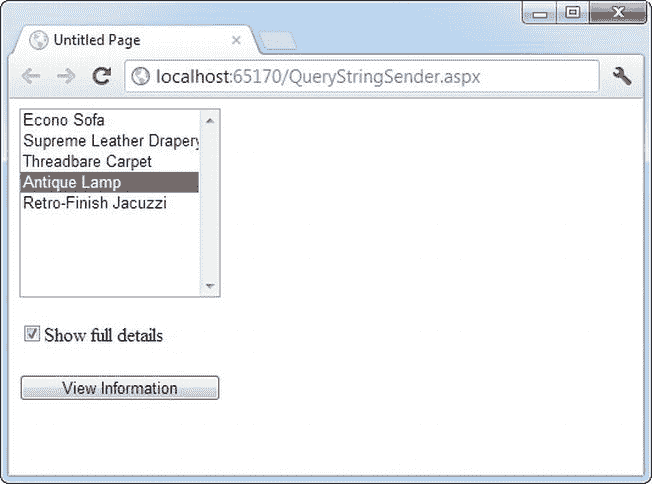

[图 8-6](#_Fig6) 。查询字符串发送器

这是第一页的代码:

```cs
public partial class QueryStringSender : System.Web.UI.Page
{
    protected void Page_Load(Object sender, EventArgs e)
    {
        if (!this.IsPostBack)
        {
        // Add sample values.
            lstItems.Items.Add("Econo Sofa");
            lstItems.Items.Add("Supreme Leather Drapery");
            lstItems.Items.Add("Threadbare Carpet");
            lstItems.Items.Add("Antique Lamp");
            lstItems.Items.Add("Retro-Finish Jacuzzi");
        }
    }
```

```cs
    protected void cmdGo_Click(Object sender, EventArgs e)
    {
        if (lstItems.SelectedIndex == -1)
        {
            lblError.Text = "You must select an item.";
        }
        else
        {
            // Forward the user to the information page,
            // with the query string data.
            string url = "QueryStringRecipient.aspx?";
            url += "Item=" + lstItems.SelectedItem.Text + "&";
            url += "Mode=" + chkDetails.Checked.ToString();
            Response.Redirect(url);
        }
    }
}
```

下面是收件人页面的代码(如图[图 8-7](#Fig7) 所示):

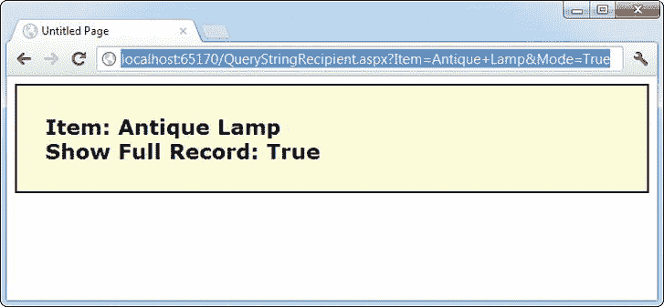

[图 8-7](#_Fig7) 。一个查询字符串接收者

```cs
public partial class QueryStringRecipient : System.Web.UI.Page
{
    protected void Page_Load(Object sender, EventArgs e)
    {
        lblInfo.Text = "Item: " + Request.QueryString["Item"];
        lblInfo.Text += "<br />Show Full Record: ";
        lblInfo.Text += Request.QueryString["Mode"];
    }
}
```

这个例子的一个有趣的方面是，它在查询字符串中放置了无效的信息，即出现在项目名称中的空格。当您运行应用时，您会注意到 ASP.NET 自动为您对字符串进行编码，将空格转换成有效的`%20`等价转义序列。收件人页面从 QueryString 集合中读取原始值，没有任何问题。这种自动编码并不总是足够的。为了处理特殊字符，您应该使用下一节中描述的 URL 编码技术。

URL 编码

查询字符串的一个潜在问题是 URL 中不允许使用某些字符。事实上，URL 中允许的字符列表比 HTML 文档中允许的字符列表要短得多。所有字符必须是字母数字或一小组特殊字符中的一个(包括`$-_.+!*'(),`)。一些浏览器允许某些额外的特殊字符(Internet Explorer 是出了名的宽松)，但许多浏览器不允许。此外，有些字符有特殊的含义。例如，与号(`&`)用于分隔多个查询字符串参数，加号(`+`)是表示空格的另一种方式，而数字符号(`#`)用于指向网页中的特定书签。如果您试图发送包含任何这些字符的查询字符串值，您将丢失一些数据。您可以通过在列表框中添加带有特殊字符的项目来测试前面的示例。

为了避免潜在的问题，在将文本值放入查询字符串之前，对它们执行 *URL 编码*是一个好主意。使用 URL 编码时，特殊字符由转义字符序列替换，转义字符序列以百分号(`%`)开头，后跟两位数的十六进制表示。例如，`&`角色变成了`%26`。唯一的例外是空格字符，它可以表示为字符序列`%20`或`+`符号。

要执行 URL 编码，可以使用 HttpServerUtility 类的 UrlEncode()和 UrlDecode()方法。正如你在第五章中所学的，HttpServerUtility 对象通过页面在每个 WebForm 中对你的代码可用。服务器属性。以下代码使用 UrlEncode()方法重写了前面的示例，因此它适用于包含特殊字符的产品名称:

```cs
string url = "QueryStringRecipient.aspx?";
url += "Item=" + Server.UrlEncode(lstItems.SelectedItem.Text) + "&";
url += "Mode=" + chkDetails.Checked.ToString();
Response.Redirect(url);
```

请注意，不要对所有内容都进行编码，这一点很重要。在这个例子中，您不能对连接两个查询字符串值的字符`&`进行编码，因为它实际上是一个特殊字符*和*。

您可以使用 UrlDecode()方法将 URL 编码的字符串返回到其初始值。但是，您不需要对查询字符串执行这一步。这是因为当你通过请求访问它们时，ASP.NET 会自动解码你的值。QueryString 集合。(许多人仍然会犯第二次解码查询字符串值的错误。通常，解码已经解码的数据不会引起问题。唯一的例外发生在您的值包含了`+`符号的时候。在这种情况下，使用 UrlDecode()将把`+`符号转换成一个空格，这不是我们想要的。)

使用 cookie

Cookies 提供了另一种存储信息以备后用的方法。Cookies 是在网络浏览器内存(如果是临时的)或客户端硬盘(如果是永久的)中创建的小文件。cookies 的一个优点是它们透明地工作，用户不会意识到信息需要被存储。它们还可以在应用的任何页面上轻松使用，甚至可以在两次访问之间保留，从而实现真正的长期存储。它们也有一些影响查询字符串的缺点——也就是说，它们仅限于简单的字符串信息，如果用户找到并打开相应的文件，它们很容易被访问和读取。这些因素使它们成为复杂或私有信息或大量数据的糟糕选择。

一些用户在他们的浏览器上禁用 cookies，这会给需要它们的 web 应用带来问题。此外，用户可能会手动删除存储在硬盘上的 cookie 文件。但在大多数情况下，cookies 在许多网站上被广泛采用和广泛使用。

在使用 cookies 之前，您应该导入 System.Net 命名空间，以便可以轻松地使用适当的类型:

```cs
using System.Net;
```

Cookies 相当容易使用。请求和响应对象(通过页面属性提供)都提供了一个 Cookies 集合。要记住的重要技巧是，从请求对象中检索 cookie，并使用响应对象来设置 cookie。

要设置 cookie，只需创建一个新的 HttpCookie 对象。然后，您可以用字符串信息填充它(使用熟悉的字典模式)，并将其附加到当前的 web 响应:

```cs
// Create the cookie object.
HttpCookie cookie = new HttpCookie("Preferences");
```

```cs
// Set a value in it.
cookie["LanguagePref"] = "English";
```

```cs
// Add another value.
cookie["Country"] = "US";
```

```cs
// Add it to the current web response.
Response.Cookies.Add(cookie);
```

以这种方式添加的 cookie 将一直存在，直到用户关闭浏览器，并且将与每个请求一起发送。要创建更长时间的 cookie，可以设置过期日期:

```cs
// This cookie lives for one year.
cookie.Expires = DateTime.Now.AddYears(1);
```

使用请求，通过 cookie 名称检索 cookie。饼干收藏。下面是如何检索前面的 cookie，它被命名为*首选项* :

```cs
HttpCookie cookie = Request.Cookies["Preferences"];
```

如果 cookie 不存在，该代码不会导致异常。相反，您将得到一个空引用。在您尝试从 cookie 中检索任何数据之前，您应该测试引用以确保您实际上*拥有*cookie:

```cs
string language;
if (cookie != null)
{
    language = cookie["LanguagePref"];
}
```

删除 cookie 的唯一方法是用过期的 cookie 替换它。这段代码演示了这种技术:

```cs
HttpCookie cookie = new HttpCookie("Preferences");
cookie.Expires = DateTime.Now.AddDays(-1);
Response.Cookies.Add(cookie);
```

饼干的例子

下一个例子展示了 cookies 存储客户姓名的典型用法([图 8-8](#Fig8) )。要尝试这个示例，首先运行页面，输入名称，然后单击 Create Cookie 按钮。然后关闭浏览器，再次请求该页面。第二次，页面将找到 cookie，读取名称，并显示欢迎消息。

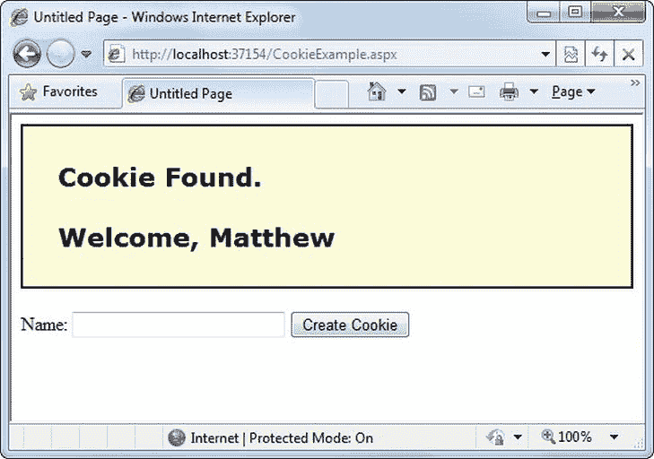

[图 8-8](#_Fig8) 。显示自定义 cookie 中的信息

这个页面的代码如下:

```cs
public partial class CookieExample : System.Web.UI.Page
{
    protected void Page_Load(Object sender, EventArgs e)
    {
        HttpCookie cookie = Request.Cookies["Preferences"];
        if (cookie == null)
        {
            lblWelcome.Text = "<b>Unknown Customer</b>";
        }
        else
        {
            lblWelcome.Text = "<b>Cookie Found.</b><br /><br />";
            lblWelcome.Text += "Welcome, " + cookie["Name"];
        }
    }
```

```cs
    protected void cmdStore_Click(Object sender, EventArgs e)
    {
        // Check for a cookie, and create a new one only if
        // one doesn’t already exist.
        HttpCookie cookie = Request.Cookies["Preferences"];
        if (cookie == null)
        {
            cookie = new HttpCookie("Preferences");
        }
```

```cs
        cookie["Name"] = txtName.Text;
        cookie.Expires = DateTime.Now.AddYears(1);
        Response.Cookies.Add(cookie);
```

```cs
        lblWelcome.Text = "<b>Cookie Created.</b><br /><br />";
        lblWelcome.Text += "New Customer: " + cookie["Name"];
    }
}
```

 **注意**你会发现 ASP.NET 的其他一些功能都使用 cookies。两个例子是会话状态(允许您将特定于用户的信息临时存储在服务器内存中)和表单安全性(允许您限制网站的某些部分并强制用户通过登录页面访问它)。第 19 章讨论了表单安全性，本章的下一节将讨论会话状态。

管理会话状态

在大多数应用的生命周期中，当它们开始有更复杂的存储需求时。应用可能需要存储和访问复杂的信息，如定制数据对象，这些信息不容易保存到 cookie 中或通过查询字符串发送。或者应用可能有严格的安全要求，阻止它在视图状态或自定义 cookie 中存储有关客户端的信息。在这些情况下，您可以使用 ASP。NET 内置的会话状态工具。

会话状态管理是 ASP。NET 的首要特性。它允许您在服务器的内存中存储任何类型的数据。信息是受保护的，因为它永远不会传输到客户端，并且它唯一地绑定到特定的会话。访问应用的每个客户端都有不同的会话和不同的信息集合。当用户从一个页面浏览到另一个页面时，会话状态非常适合于存储信息，例如当前用户购物篮中的商品。

会话跟踪

ASP.NET 通过使用唯一的 120 位标识符来跟踪每个会话。ASP.NET 使用一种专有算法来生成这个值，从而保证(从统计角度来说)这个数字是唯一的，并且足够随机，恶意用户无法反向工程或“猜测”给定客户端将使用什么会话 ID。这个 ID 是在 web 服务器和客户端之间传输的唯一一条与会话相关的信息。

当客户端显示会话 ID 时，ASP.NET 查找相应的会话，检索您之前存储的对象，并将它们放入一个特殊的集合中，以便可以在您的代码中访问它们。这个过程是自动进行的。

为了让这个系统工作，客户机必须为每个请求提供适当的会话 ID。您可以通过两种方式实现这一点:

*   *使用 cookie*:在这种情况下，会话 ID 在一个特殊的 cookie(名为 ASP。NET_SessionId)，它是 ASP.NET 在使用会话集合时自动创建的。这是默认设置。
*   *使用修改后的 URL*:在这种情况下，会话 ID 在一个特别修改过的(或 *munged* ) URL 中传输。这允许您创建与不支持 cookies 的客户端使用会话状态的应用。

通常，ASP.NET 使用 cookies 来跟踪会话状态。在本章的后面，当您处理会话状态配置时，您将了解如何切换到修改的 URL 系统(称为无 cookie 会话)。但是首先，是时候亲自看看网站中的会话状态是如何工作的了。

使用会话状态

您可以使用系统与会话状态进行交互。web . Session state . http Session state 类，在 ASP.NET 网页中作为内置会话对象提供。向集合添加项和检索项的语法基本上与向页面的视图状态添加项的语法相同。

例如，您可以将数据集存储在会话内存中，如下所示:

```cs
Session["InfoDataSet"] = dsInfo;
```

然后，您可以使用适当的转换操作来检索它:

```cs
dsInfo = (DataSet)Session["InfoDataSet"];
```

当然，在尝试使用 dsInfo 对象之前，您需要检查它是否确实存在——换句话说，它不是一个空引用。如果 dsInfo 为空，则由您来重新生成它。(例如，您可能决定查询数据库以获取最新数据。)

 **注** [第十四章](14.html)探究数据集。

对于当前用户，会话状态是整个应用的全局状态。但是，会话状态可能会以几种方式丢失:

*   如果用户关闭并重新启动浏览器。
*   如果用户通过不同的浏览器窗口访问相同的页面，尽管如果通过原始浏览器窗口访问网页，会话将仍然存在。浏览器在处理这种情况的方式上有所不同。
*   如果会话由于不活动而超时。关于会话超时的更多信息可以在配置部分找到。
*   如果您的网页代码通过调用会话来结束会话。放弃()方法。

在前两种情况下，会话实际上保留在 web 服务器的内存中，因为 ASP.NET 不知道客户端已经关闭了浏览器或更改了窗口。该会话将停留在内存中，保持不可访问，直到它最终过期。(通常，这要在 20 分钟之后，但是您将在本章的后面学习如何配置它。)

表 8-1 描述了 HttpSessionState 类的关键方法和属性。T3】

[表 8-1](#_Tab1) 。HttpSessionState 成员

| 成员 | 描述 |
| --- | --- |
| 数数 | 提供当前会话集合中的项数。 |
| 无表情 | 标识是否使用 cookie 或修改后的 URL 跟踪会话。 |
| IsNewSession | 标识是否仅为当前请求创建会话。如果没有信息处于会话状态，ASP.NET 不会费心跟踪会话或创建会话 cookie。相反，每次请求都会重新创建会话。 |
| 键 | 获取当前用于存储会话状态集合中的项的所有会话密钥的集合。 |
| 方式 | 提供解释 ASP.NET 如何存储会话状态信息的枚举值。这种存储模式是根据本章后面的“配置会话状态”一节中讨论的 web.config 设置确定的。 |
| SessionID | 为当前客户端提供具有唯一会话标识符的字符串。 |
| 超时 | 确定放弃当前会话之前等待的分钟数，前提是不再从客户端接收请求。该值可以通过编程方式更改，使您可以在需要时延长会话集合。 |
| 放弃() | 立即取消当前会话并释放它占用的所有内存。在注销页面中，这是一项非常有用的技术，可以确保尽快回收服务器内存。 |
| 清除() | 移除所有会话项目，但不更改当前会话标识符。 |

会话状态示例

下一个示例使用会话状态来存储几个家具数据对象。数据对象组合了一些相关的变量，并使用了一个特殊的构造函数，因此可以在一行代码中创建和初始化它。这个类没有使用完整的属性过程，而是采用了一种快捷方式，使用了公共成员变量，这样代码清单就保持了简洁。(如果您参考可下载示例中的完整代码，您会看到它使用了属性过程。)

```cs
public class Furniture
{
    public string Name;
    public string Description;
    public decimal Cost;
```

```cs
    public Furniture(string name, string description,
     decimal cost)
    {
        Name = name;
        Description = description;
        Cost = cost;
    }
}
```

第一次加载页面时会创建三个家具对象，它们存储在会话状态中。然后，用户可以从家具名称列表中进行选择。当进行选择时，将检索相应的对象，并显示其信息，如图[图 8-9](#Fig9) 所示。

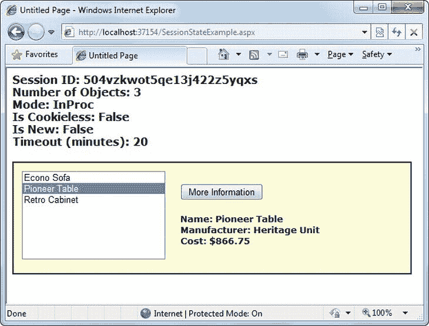

[图 8-9](#_Fig9) 。带有数据对象的会话状态示例

```cs
public partial class SessionStateExample : System.Web.UI.Page
{
    protected void Page_Load(Object sender, EventArgs e)
    {
        if (!this.IsPostBack)
        {
            // Create Furniture objects.
            Furniture piece1 = new Furniture("Econo Sofa",
                                        "Acme Inc.", 74.99M);
            Furniture piece2 = new Furniture("Pioneer Table",
                                        "Heritage Unit", 866.75M);
            Furniture piece3 = new Furniture("Retro Cabinet",
                                        "Sixties Ltd.", 300.11M);
```

```cs
            // Add objects to session state.
            Session["Furniture1"] = piece1;
            Session["Furniture2"] = piece2;
            Session["Furniture3"] = piece3;

```

```cs
            // Add rows to list control.
            lstItems.Items.Add(piece1.Name);
            lstItems.Items.Add(piece2.Name);
            lstItems.Items.Add(piece3.Name);
        }
```

```cs
        // Display some basic information about the session.
        // This is useful for testing configuration settings.
        lblSession.Text = "Session ID: " + Session.SessionID;
        lblSession.Text += "<br />Number of Objects: ";
        lblSession.Text += Session.Count.ToString();
        lblSession.Text += "<br />Mode: " + Session.Mode.ToString();
        lblSession.Text += "<br />Is Cookieless: ";
        lblSession.Text += Session.IsCookieless.ToString();
        lblSession.Text += "<br />Is New: ";
        lblSession.Text += Session.IsNewSession.ToString();
        lblSession.Text += "<br />Timeout (minutes): ";
        lblSession.Text += Session.Timeout.ToString();
    }
```

```cs
    protected void cmdMoreInfo_Click(Object sender, EventArgs e)
    {
        if (lstItems.SelectedIndex == -1)
        {
            lblRecord.Text = "No item selected.";
        }
        else
        {
            // Construct the right key name based on the index.
            string key = "Furniture" +
                 (lstItems.SelectedIndex + 1).ToString();
```

```cs
            // Retrieve the Furniture object from session state.
            Furniture piece = (Furniture)Session[key];

```

```cs
            // Display the information for this object.
            lblRecord.Text = "Name: " + piece.Name;
            lblRecord.Text += "<br />Manufacturer: ";
            lblRecord.Text += piece.Description;
            lblRecord.Text += "<br />Cost: " + piece.Cost.ToString("c");
        }
    }
}
```

在应用中添加一些会话友好的特性也是一个不错的做法。例如，您可以在页面中添加一个注销按钮，通过使用会话来自动取消会话。放弃()方法。这样，用户将被鼓励终止会话，而不是仅仅关闭浏览器窗口，服务器内存将被更快地回收。否则，在会话超时之前不会回收内存，这可能会降低性能。

配置会话状态

您可以通过当前应用的 web.config 文件配置会话状态(该文件与。aspx 网页文件)。配置文件允许您设置高级选项，如超时和会话状态模式。

下面的清单显示了可以为<sessionstate>元素设置的最重要的选项。请记住，您不会同时使用所有这些细节。一些设置只适用于某些会话状态*模式*，您很快就会看到。</sessionstate>

```cs
<configuration>
    ...
    <system.web>
        ...
        <sessionState
            cookieless="UseCookies"
            cookieName="ASP.NET_SessionId"
            regenerateExpiredSessionId="false"
            timeout="20"
            mode="InProc"
            stateConnectionString="tcpip=127.0.0.1:42424"
            stateNetworkTimeout="10"
            sqlConnectionString="data source=127.0.0.1;Integrated Security=SSPI"
            sqlCommandTimeout="30"
            allowCustomSqlDatabase="false"
            customProvider=""
            compressionEnabled="false"
        />
    </system.web>
</configuration>
```

以下部分描述了最重要的会话状态设置。您将了解如何更改会话超时、使用无 cookie 会话以及更改会话信息的存储方式。

超时

超时设置指定 ASP.NET 在放弃会话之前，在没有收到请求的情况下等待的分钟数。

该设置代表了会话状态的重要折衷之一。如果会话保持的时间太长，流行的 web 应用的内存使用将会增加，性能将会下降。理想情况下，您将选择一个足够短的时间范围，以便在客户端停止使用应用后，服务器可以回收宝贵的内存，但又足够长，以便客户端可以暂停和继续会话，而不会丢失会话。

您还可以通过编程方式在代码中更改会话超时。例如，如果您知道某个会话包含异常大量的信息，您可能需要限制该会话可以存储的时间。然后警告用户并更改超时属性。下面是将超时时间更改为 10 分钟的示例代码行:

```cs
Session.Timeout = 10;
```

无厨师

正如您已经了解的，ASP.NET 通过使用它自动创建和维护的 cookie 来跟踪会话(不要与您的网页可能创建和操作的自定义 cookie 相混淆)。ASP.NET 会话 cookie 有点像幕后管道，大多数情况下您不会对此有所犹豫。但是在某些环境下，cookies 并不是最好的选择。例如，也许他们被超级严格的安全设置所限制。在这种情况下，您可以选择使用无 cookie 会话。

要允许(或强制)无 cookie 会话，您可以将无 cookie 属性设置为 HttpCookieMode 枚举定义的值之一，如[表 8-2](#Tab2) 中所列。

[表 8-2](#_Tab2) 。HttpCookieMode 值

| 价值 | 描述 |
| --- | --- |
| 使用 cookies | 即使浏览器或设备不支持 cookie 或被禁用，也总是会使用 cookie。这是默认设置。如果设备不支持 cookies，会话信息将在后续请求中丢失，因为每个请求都将获得一个新的 ID。 |
| 乌苏里 | 无论浏览器或设备的功能如何，都不会使用 Cookies。相反，会话 ID 存储在 URL 中。 |
| 使用设备配置文件 | ASP.NET 通过检查 BrowserCapabilities 对象来选择是否使用无 cookie 会话。缺点是这个对象指出了设备应该支持什么——它没有考虑到用户可能已经在支持 cookiess 的浏览器中禁用了 cookie。 |
| 自动检测 | ASP.NET 试图通过设置和检索 cookie(网络上常用的一种技术)来确定浏览器是否支持 cookie。这种技术可以正确地确定浏览器是否支持 cookiess 但禁用了它们，在这种情况下，使用无 cookie 模式。 |

下面是一个强制无烹饪模式的示例:

```cs
<sessionState cookieless="UseUri" ... />
```

在无 cookie 模式下，会话 ID 将自动插入到 URL 中。当 ASP.NET 收到请求时，它将删除 ID，检索会话集合，并将请求转发到适当的目录。[图 8-10](#Fig10) 显示了一个被屏蔽的 URL。

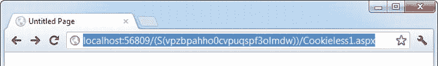

[图 8-10](#_Fig10) 。带有会话 ID 的托管 URL

因为会话 ID 被插入到当前 URL 中，所以相对链接也自动获得会话 ID。换句话说，如果用户当前位于 Page1.aspx 上，并单击指向 Page2.aspx 的相对链接，该相对链接将当前会话 ID 作为 URL 的一部分。如果调用 Response，情况也是如此。使用相对 URL 重定向()，如下所示:

```cs
Response.Redirect("Page2.aspx");
```

[图 8-11](#Fig11) 显示了一个测试无 cookie 会话的示例网站(包含在 CookielessSessions 目录中的在线示例中)。它包含两个页面，使用无 cookie 模式。第一页(Cookieless1.aspx)包含一个超链接控件和两个按钮，所有这些都可以将您带到第二页(Cookieless2.aspx)。诀窍在于这些控件有不同的导航方式。其中只有两个使用无 cookie 会话，第三个会丢失当前会话。

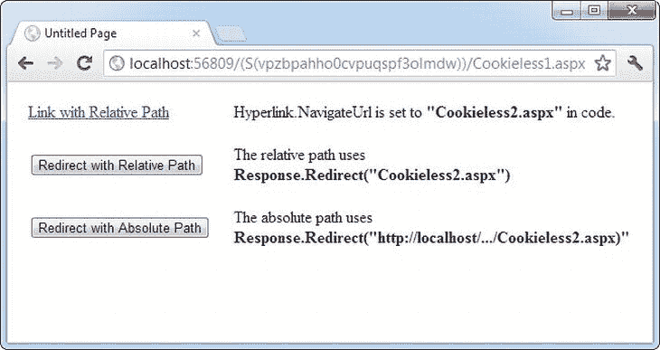

[图 8-11](#_Fig11) 。无烹饪课程的三个测试

HyperLink 控件导航到在其 NavigateUrl 属性中指定的页面，该属性设置为相对路径 Cookieless2.aspx。如果单击此链接，会话 ID 将保留在 Url 中，新页面可以检索会话信息。这表明无 cookie 会话使用相对链接工作。

该页面上的两个按钮通过调用响应来使用编程重定向。Redirect()方法。第一个按钮使用相对路径 Cookieless2.aspx，很像 HyperLink 控件。这种方法可以处理无 cookie 的会话状态，并且无需额外的步骤就可以保留被屏蔽的 URL。

```cs
protected void cmdLink_Click(Object sender, EventArgs e)
{
    Response.Redirect("Cookieless2.aspx");
}
```

无 cookieless 状态的唯一真正限制是不能使用绝对链接(包含完整 URL 的链接，以`http://).`开头)。第二个按钮使用绝对链接来演示这个问题。因为 ASP.NET 无法将会话 ID 插入到 URL 中，所以会话会丢失。

```cs
protected void cmdLinkAbsolute_Click(Object sender, EventArgs e)
{
    Response.Redirect("http://localhost:56371/CookielessSessions/Cookieless2.aspx");
}
```

现在，目标页面检查会话，但找不到它。ASP.NET 生成一个新的会话 ID(插入到 URL 中)，原始信息丢失。[图 8-12](#Fig12) 显示了结果。

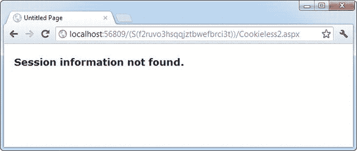

[图 8-12](#_Fig12) 。失落的一届

编写代码在测试环境中演示这个问题有点棘手。问题是，Visual Studio 的集成 web 服务器在您每次启动网站时都会为您的网站选择不同的端口。因此，每次打开 Visual Studio 时，您都需要编辑代码，以便您的 URL 使用正确的端口号(例如上例中的 56371)。

还有另一个解决方法。您可以使用一些巧妙的代码，从页面中获取当前 URL 并修改它的最后一部分(将页面名称从 Cookieless1.aspx 改为 Cookieless2.aspx)。以下是如何:

```cs
// Create a new URL based on the current URL (but ending with
// the page Cookieless2.aspx instead of Cookieless1.aspx.
string url = "http://" + Request.Url.Authority +
 Request.Url.Segments[0] + Request.Url.Segments[1] +
 "Cookieless2.aspx";
Response.Redirect(url);
```

当然，如果您将网站部署到由 IIS 托管的真实虚拟目录中，您将不再使用随机选择的端口号，也不会遇到这种奇怪的情况。第 26 章有更多关于虚拟目录和网站部署的内容。

处理过期的会话 id

默认情况下，ASP.NET 允许您重用会话标识符。例如，如果您发出一个请求，并且您的查询字符串包含一个过期的会话，ASP.NET 会创建一个新的会话并使用该会话 ID。问题是会话 ID 可能会不经意地出现在公共场所——比如搜索引擎的结果页面。这可能导致多个用户使用相同的会话标识符访问服务器，然后所有用户使用相同的共享数据加入相同的会话。

为了避免这种潜在的安全风险，您应该包括可选的 regenerateExpiredSessionId 属性，并在使用无 cookie 会话时将其设置为 true。这样，如果用户使用过期的会话 ID 进行连接，将会颁发一个新的会话 ID。唯一的缺点是，这个过程还会强制当前页面丢失所有视图状态和表单数据，因为 ASP.NET 会执行重定向来确保浏览器有一个新的会话标识符。

模式

其余的会话状态设置允许您将 ASP.NET 配置为使用不同的会话状态服务，具体取决于您选择的模式。接下来的几节描述了可供选择的模式。

 **注意**改变模式是一项高级配置任务。要成功地做到这一点，您需要了解您的 web 应用将被部署的环境。例如，如果您正在将应用部署到第三方 web 主机，那么在尝试使用其他模式之前，您需要知道该主机是否支持这些模式。如果您要将应用部署到自己组织的网络服务器上，您需要与友好的邻居网络管理员合作。

为什么是" T0 "

InProc 是默认模式，它对小型网站最有意义。它指示将信息存储在与 ASP.NET 工作线程相同的进程中，这提供了最好的性能，但持久性最差。如果重新启动服务器，状态信息将会丢失。(在 ASP.NET，应用域可以因为各种原因重新启动，包括配置更改和更新页面，以及当达到特定阈值时。如果您发现您在超时限制之前丢失了会话，您可能想尝试一种更持久的模式。)

如果您使用的是*网络场*，InProc 模式将不起作用，这是一种负载平衡安排，使用多个 web 服务器来运行您的网站。在这种情况下，不同的 web 服务器可能会处理来自同一用户的连续请求。如果 web 服务器使用 InProc 模式，每台服务器都有自己的私有会话数据集合。最终结果是，当用户转到新页面或回发到当前页面时，他们的会话会意外丢失。

 **注意**使用 StateServer 和 SQLServer 模式时，存储在会话状态中的对象必须是可序列化的。否则，ASP.NET 将无法将该对象传输到国家服务或存储在数据库中。在本章的前面，您学习了如何创建一个可序列化的 Customer 类来存储在视图状态中。

关闭

此设置禁用应用中每个页面的会话状态管理。这可以为不使用会话状态的网站提供轻微的性能改进。

状态服务器

通过此设置，ASP.NET 将使用单独的 Windows 服务进行状态管理。这个服务运行在同一个 web 服务器上，但是它在主 ASP.NET 进程之外，如果 ASP.NET 进程需要重新启动，这给了它一个基本的保护级别。代价是当状态信息在两个进程之间传输时增加的时间延迟。如果您频繁地访问和更改状态信息，这会导致相当不受欢迎的速度下降。

使用 StateServer 设置时，需要为 stateConnectionString 设置指定一个值。该字符串标识运行 StateServer 服务的计算机的 TCP/IP 地址及其端口号(由 ASP.NET 定义，通常不需要更改)。这允许您在另一台计算机上托管 StateServer。如果不更改此设置，将使用本地服务器(设置为地址 127.0.0.1)。

当然，在您的应用可以使用该服务之前，您需要启动它。最简单的方法是使用 Microsoft 管理控制台(MMC)。以下是如何:

1.  选择开始并在搜索框中键入**计算机管理**。
2.  当计算机管理实用程序出现时，单击它。
3.  在计算机管理窗口中，转到服务和应用服务节点。
4.  Find the service called ASP.NET State Service in the list, as shown in [Figure 8-13](#Fig13).

    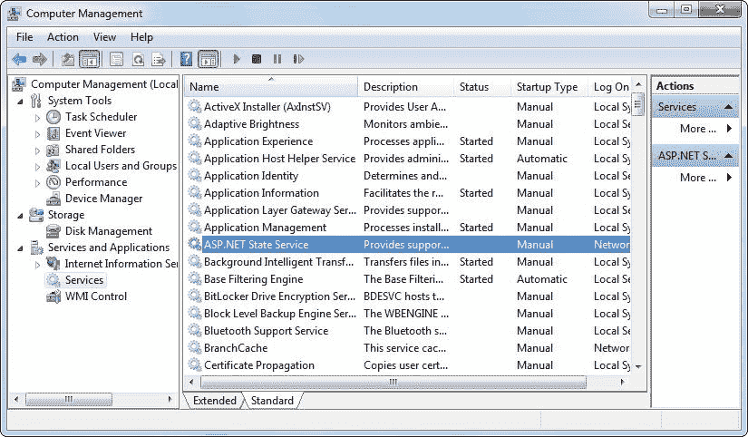

    [图 8-13](#_Fig13) 。ASP.NET 国家服务局

5.  When you find the service in the list, you can manually start and stop it by right-clicking it. Generally, you’ll want to configure Windows to automatically start the service. Right-click it, select Properties, and modify the Startup Type, setting it to Automatic, as shown in [Figure 8-14](#Fig14).

    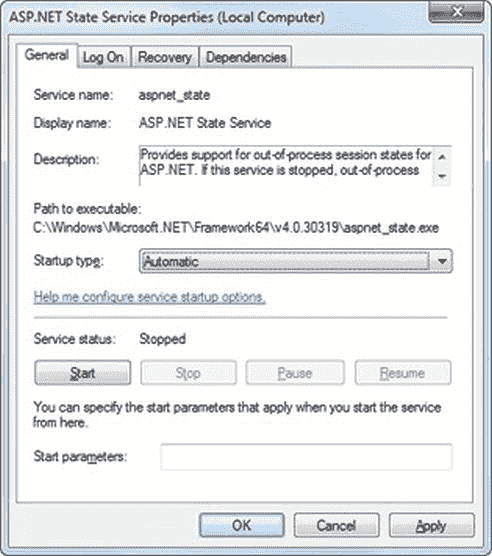

    [图 8-14](#_Fig14) 。更改启动类型

 **注意**在使用 StateServer 模式时，还可以设置一个可选的 stateNetworkTimeout 属性，该属性指定在取消请求之前等待服务响应的最大秒数。默认值为 10(秒)。

SQLServer

此设置指示 ASP.NET 使用 SQL Server 数据库来存储由 sqlConnectionString 属性标识的会话信息。这是最有弹性的州存储，但也是迄今为止最慢的。若要使用这种状态管理方法，您需要有一台安装了 SQL Server 的服务器。

设置 sqlConnectionString 属性时，遵循与 ADO.NET 数据访问相同的模式。通常，您需要指定数据源(服务器地址)以及用户 ID 和密码，除非您使用的是 SQL 集成安全性。

此外，您需要安装特殊的存储过程和临时会话数据库。这些存储过程负责存储和检索会话信息。ASP.NET 包括一个自动为你做工作的命令行工具，叫做`aspnet_regsql.exe.`，它在 c:\Windows\Microsoft 中。NET\Framework64\v4.0.30319 目录(因为 4.0.30319 是 CLR 的最新版本，而。NET 4.5 实际上是在核心引擎之上的一组扩展*。)要运行`aspnet_regsql.exe`，需要在这个位置打开一个命令提示符窗口。(一种简单的方法是在 Windows 资源管理器中浏览到版本文件夹，按住 Shift，然后右键单击版本文件夹。然后，从菜单中选择“在此打开命令菜单窗口”。)一旦进入正确的文件夹，就可以键入 aspnet_regsql.exe 命令。*

您可以使用`aspnet_regsql.exe`工具来执行几个与数据库相关的任务。在阅读本书的过程中，您将看到如何将`aspnet_regsql.exe`与 ASP.NET 特性结合使用，例如会员资格([第 20 章](20.html))、个人资料([第 21 章](21.html))和缓存([第 23 章](23.html))。要使用 aspnet_regsql.exe 创建会话存储数据库，需要提供–ssadd 参数。此外，使用–S 参数指示数据库服务器名称，使用–E 参数通过当前登录的 Windows 用户帐户登录数据库。

以下是在当前计算机上创建会话存储数据库的命令，使用默认数据库名称 ASPState:

```cs
aspnet_regsql.exe -S localhost -E –ssadd
```

这个命令使用别名 *localhost* ，它告诉 aspnet_regsql.exe 连接到当前计算机上的数据库服务器。

 **注意**aspnet _ regsql . exe 命令支持附加选项，这些选项允许您将会话信息以不同的名称存储在数据库中。您可以通过参考 Visual Studio 帮助(在索引中查找 aspnet_regsql)或浏览到`http://msdn.microsoft.com/library/ms178586.aspx`来找到这些选项。此信息还描述了在 SQL Server Express 中使用数据库支持的会话存储时需要采取的额外步骤。

在创建了会话状态数据库之后，您需要通过修改 web.config 文件的<sessionstate>部分来告诉 ASP.NET 使用它。如果使用名为 ASPState 的数据库来存储会话信息(这是默认设置)，则不需要提供数据库名称。相反，您只需指出服务器的位置以及 ASP.NET 连接到服务器时应该使用的身份验证类型，如下所示:</sessionstate>

```cs
<sessionState mode="SQLServer"
 sqlConnectionString="data source=127.0.0.1;Integrated Security=SSPI"
 ... />
```

使用 SQLServer 模式时，还可以设置一个可选的 sqlCommandTimeout 属性，该属性指定在取消请求之前等待数据库响应的最大秒数。默认值为 30 秒。

自定义

使用自定义模式时，您需要通过提供 customProvider 属性来指示要使用哪个会话状态存储提供程序。customProvider 属性指示类的名称。该类可能是 web 应用的一部分(在这种情况下，源代码放在 App_Code 子文件夹中)，也可能位于 web 应用正在使用的程序集中(在这种情况下，编译后的程序集放在 Bin 子文件夹中)。

创建自定义状态提供程序是一项低级任务，需要小心处理，以确保安全性、稳定性和可伸缩性。自定义状态提供程序也超出了本书的范围。但是，其他供应商可能会发布您想要使用的自定义状态提供程序。例如，Oracle 可以提供一个自定义的状态提供程序，允许您在 Oracle 数据库中存储状态信息。

压缩

当您将 enableCompression 设置为 true 时，会话数据在传递到进程外之前会被压缩。enableCompression 设置只有在使用进程外会话状态存储时才有效，因为只有在这种情况下数据才会被序列化。

为了压缩和解压缩会话数据，web 服务器需要执行额外的工作。然而，这通常不是问题，因为压缩用于 web 服务器有大量空闲 CPU 时间但受到其他因素限制的情况。会话状态压缩在以下两种关键场景中有意义:

*   *当在内存中存储大量会话状态数据时* : Web 服务器内存是一种宝贵的资源。理想情况下，会话状态用于相对较小的信息块，而数据库处理大量数据的长期存储。但是如果情况不是这样，并且如果进程外状态服务器占用了大量内存，压缩是一个潜在的解决方案。
*   *在另一台计算机上存储会话状态数据时*:在一些大型 web 应用中，会话状态存储在进程外(通常在 SQL Server 中)的一台单独的计算机上。因此，ASP.NET 需要通过网络连接来回传递会话信息。显然，当会话状态存储在 web 服务器计算机上时，这种设计会降低性能。然而，对于一些具有大量会话状态存储需求的高流量 web 应用来说，这仍然是最好的折衷方案。

实际的压缩量因数据类型而异。然而，在测试中，微软看到客户端实现了 30%到 60%的大小缩减，这足以提高这些专业场景中的性能。

使用应用状态

*应用状态*允许您存储任何客户端都可以访问的全局对象。应用状态基于系统。Web.HttpApplicationState 类，通过内置的 Application 对象在所有网页中提供。

应用状态类似于会话状态。它支持相同类型的对象，在服务器上保留信息，并使用相同的基于字典的语法。使用应用状态的一个常见示例是一个全局计数器，它跟踪所有 web 应用的客户端执行操作的次数。

例如，您可以创建一个 global.asax 事件处理程序,它跟踪已经创建的会话数量或者应用已经收到的请求数量。或者您可以在页面中使用类似的逻辑。加载事件处理程序来跟踪给定页面被不同客户端请求的次数。下面是后者的一个例子:

```cs
protected void Page_Load(Object sender, EventArgs e)
{
    // Retrieve the current counter value.
    int count = 0;
    if (Application["HitCounterForOrderPage"] != null)
    {
        count = (int)Application["HitCounterForOrderPage"];
    }
```

```cs
    // Increment the counter.
    count++;
```

```cs
    // Store the current counter value.
    Application["HitCounterForOrderPage"] = count;
    lblCounter.Text = count.ToString();
}
```

同样，应用状态项存储为对象，因此当您从集合中检索它们时，需要对它们进行强制转换。处于应用状态的项永远不会超时。它们会持续到应用或服务器重新启动或应用域自我刷新(由于自动进程回收设置或应用中某个页面或组件的更新)。

应用状态不经常使用，因为它通常是低效的。在前面的例子中，计数器可能不会保持准确的计数，特别是在交通繁忙的时候。例如，如果两个客户端同时请求该页面，您可能会看到如下事件序列:

1.  用户 A 检索当前计数(432)。
2.  用户 B 检索当前计数(432)。
3.  用户 A 将当前计数设置为 433。
4.  用户 B 将当前计数设置为 433。

换句话说，一个请求不被计算在内，因为两个客户端同时访问计数器。为了防止这个问题，您需要使用 Lock()和 Unlock()方法，这两个方法明确地一次只允许一个客户端访问应用状态集合。

```cs
protected void Page_Load(Object sender, EventArgs e)
{
    // Acquire exclusive access.
    Application.Lock();

```

```cs
    int count = 0;
    if (Application["HitCounterForOrderPage"] != null)
    {
        count = (int)Application["HitCounterForOrderPage"];
    }
    count++;
    Application["HitCounterForOrderPage"] = count;
```

```cs
    // Release exclusive access.
    Application.Unlock();

```

```cs
    lblCounter.Text = count.ToString();
}
```

不幸的是，在应用集合被释放之前，请求该页面的所有其他客户端都将被停止。这可能会大大降低性能。通常，频繁修改的值不适合作为应用状态。事实上，应用状态很少在。NET 世界，因为它的两个最常见的用途已经被更容易、更有效的方法所取代:

*   过去，应用状态用于存储应用范围内的常量，如数据库连接字符串。正如您在第 5 章中看到的，这种类型的常量可以存储在 web.config 文件中，这通常更灵活，因为您可以轻松地更改它，而无需搜索网页代码或重新编译您的应用。
*   应用状态还可用于存储创建起来很耗时的常用信息，例如需要数据库查找的完整产品目录。然而，使用应用状态来存储这类信息会引发各种各样的问题，如如何检查数据是否有效，以及如何在需要时替换数据。如果产品目录太大，也会影响性能。第 23 章介绍了一种类似但更明智的方法——将常用信息存储在 ASP.NET 缓存中。应用状态的许多用途可以用缓存来更有效地替代。

 **提示**如果您决定使用应用状态，您可以在应用首次启动时初始化它的内容。只需在名为 Application_OnStart()的方法中将初始化代码添加到 global.asax 文件中，如[第 5 章](05.html)所述。

比较状态管理选项

每个状态管理选择都有不同的生存期、范围、性能开销和支持级别。表 8-3 和[表 8-4](#Tab4) 显示了您的状态管理选项的一目了然的比较。

[表 8-3](#_Tab3) 。比较状态管理选项(第 1 部分)

|  | 视图状态 | 查询字符串 | 自定义 Cookies |
| --- | --- | --- | --- |
| 允许的数据类型 | 全部可序列化。NET 数据类型。 | 有限数量的字符串数据。 | 字符串数据。 |
| 存储位置 | 当前网页中的隐藏字段。 | 浏览器的 URL 字符串。 | 客户端的计算机(在内存或小文本文件中，取决于其生存期设置)。 |
| 一生 | 永久保留，用于回发到单个页面。 | 当用户输入新的 URL 或关闭浏览器时丢失。但是，这可以存储在书签中。 | 由程序员设置。可以在多个页面中使用，并且可以在两次访问之间保持。 |
| 范围 | 限于当前页面。 | 仅限于目标页面。 | 整个 ASP.NET 的申请。 |
| 安全 | 默认防篡改，但易于阅读。您可以使用 Page 指令的 ViewStateEncryptionMode 属性来强制加密。 | 清晰可见，便于用户修改。 | 不安全，可由用户修改。 |
| 性能影响 | 如果存储大量信息，速度会很慢，但不会影响服务器性能。 | 没有，因为数据量很小。 | 没有，因为数据量很小。 |
| 典型用途 | 页面特定的设置。 | 将产品 ID 从目录页发送到详细信息页。 | 网站的个性化首选项。 |

[表 8-4](#_Tab4) 。比较状态管理选项(第 2 部分)

|  | 会话状态 | 应用状态 |
| --- | --- | --- |
| 允许的数据类型 | 全部。默认进程内存储模式的. NET 数据类型。全部可序列化。NET 数据类型，如果您使用进程外存储模式。 | 全部。NET 数据类型。 |
| 存储位置 | 服务器内存、状态服务或 SQL Server，具体取决于您选择的模式。 | 服务器内存。 |
| 一生 | 在预定义的时间段后超时(通常为 20 分钟，但可以全局或以编程方式更改)。 | 应用的生存期(通常，直到服务器重新启动)。 |
| 范围 | 整个 ASP.NET 的申请。 | 整个 ASP.NET 的申请。与其他方法不同，应用数据对所有用户都是全局的。 |
| 安全性 | 非常安全，因为数据永远不会传输到客户端。 | 非常安全，因为数据永远不会传输到客户端。 |
| 性能影响 | 存储大量信息时速度较慢，尤其是当同时有许多用户时，因为每个用户都有自己的会话数据副本。 | 存储大量信息时速度较慢，因为这些数据永远不会超时并被删除。 |
| 典型用途 | 将物品存放在购物篮中。 | 存储任何类型的全局数据。 |

 **注**ASP.NET 还有另一种更专业的国家管理方式，叫做*简介*。配置文件允许您从数据库中存储和检索特定于用户的信息。唯一的问题是，为了获得正确的信息，您需要对用户进行身份验证。你将在第 21 章中了解个人资料。

最后一句话

状态管理是在请求之间保留信息的艺术。通常，这些信息是特定于用户的(比如购物车中的商品列表、用户名或访问级别)，但有时对于整个应用来说是全局的(比如跟踪站点活动的使用统计)。因为 ASP.NET 使用非连接的架构，所以您需要为每个请求显式地存储和检索状态信息。您选择的存储这些数据的方法会影响应用的性能、可伸缩性和安全性。

在本章中，您了解了各种存储选项，包括视图状态、cookies 和会话状态。您还学习了通过跨页回发和查询字符串传递信息。当你开发自己的 web 应用时，你可以参考[表 8-3](#Tab3) 和[表 8-4](#Tab4) 来帮助评估不同类型的状态管理，并确定什么最适合你的需求。*