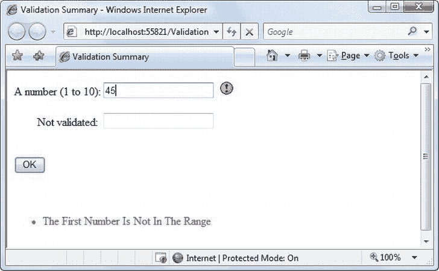

# 九、验证

本章介绍了 ASP 中包含的一些最有用的控件。NET:*验证控件*。这些控制需要执行一项潜在的耗时且复杂的任务(验证用户输入和报告错误)并实现自动化。每个验证控件，或者说*验证器*，都有自己的内置逻辑。有些检查缺失的数据，有些检查数字是否在预定义的范围内，等等。在许多情况下，验证控件允许您验证用户输入，而无需编写一行代码。

在本章中，您将学习如何在 ASP.NET 网页中使用验证控件，以及如何通过复杂的正则表达式、自定义验证函数等来充分利用它们。和往常一样，您将看到 ASP.NET 是如何实现这些功能的。

了解验证

任何有经验的开发者都知道，使用你网站的人偶尔会犯错误。尤其令人生畏的是用户可能犯的一系列错误。以下是一些常见的例子:

*   用户可能会忽略某个重要的字段并将其留空。
*   如果不允许空值，用户可能会键入半随机的无意义内容来绕过您的检查。这会给你带来无尽的头痛。例如，您可能会遇到一个无效的电子邮件地址，这会给自动电子邮件程序带来问题。
*   用户可能会犯一个诚实的错误，例如输入了一个键入错误，在数字字段中输入了一个非数字字符，或者提交了错误类型的信息。用户甚至可能输入几条信息，每条信息都是正确的，但放在一起时却不一致(例如，在选择 Visa 作为支付类型后输入 MasterCard 卡号)。
*   恶意用户可能试图通过输入精心构造的错误值来利用您代码中的弱点。例如，攻击者可能试图造成特定的错误，从而泄露敏感信息。这种技术的一个更引人注目的例子是 *SQL 注入攻击*、，通过用户提供的值来改变动态构建的数据库命令的操作。(当然，验证不能为糟糕的编码辩护。当你在第 14 章中考虑数据库编程时，你将学习如何使用参数化命令，这完全避免了 SQL 注入攻击的危险。)

web 应用特别容易受到这些问题的影响，因为它依赖于基本的 HTML 输入控件，而这些控件不具备 Windows 应用的所有功能。例如，Windows 应用中的一种常见技术是处理文本框的 KeyPress 事件，检查当前字符是否有效，如果无效，则阻止它出现。这种技术使得创建只接受数字输入的文本框变得容易。

这种策略在服务器端网页中并不容易。要在 web 服务器上执行验证，您需要回发页面，而每次用户输入一封信就将页面回发给服务器是不切实际的。为了避免这种问题，您需要在提交页面(可能包含多个输入控件)时立即执行所有的验证。然后，您需要创建适当的用户界面来报告错误。一些网站只报告第一个不正确的字段，而其他网站使用表格、列表或窗口来描述所有不正确的字段。当你完善了你的验证策略时，你已经花费了相当多的精力来编写乏味的代码。

ASP.NET 旨在为您省去这一麻烦，并为您提供一个可重用的验证控件框架，通过自动检查字段和报告错误来管理验证细节。这些控件甚至可以使用客户端 JavaScript 来提供一个更加动态和响应性更强的界面，同时仍然为旧浏览器(通常称为下层浏览器)提供普通的验证。

验证控件

ASP.NET 提供了五个验证器控件，在[表 9-1](#Tab1) 中有描述。四个是针对特定类型的验证，而第五个允许你应用自定义的验证例程。您还会在工具箱中看到一个 ValidationSummary 控件，它为您提供了另一个在一个地方显示验证错误消息列表的选项。您将在本章后面了解 ValidationSummary(参见“其他显示选项”一节)。

[表 9-1](#_Tab1) 。验证程序控件

| 控制类 | 描述 |
| --- | --- |
| 验证 | 只要输入控件不包含空字符串，验证就会成功。 |
| 范围验证控件 | 如果输入控件包含特定数字、字母或日期范围内的值，则验证成功。 |
| 比较验证器 | 如果输入控件包含的值与另一个输入控件中的值相匹配，或者是您指定的固定值，则验证成功。 |
| 正则表达式验证器 | 如果输入控件中的值与指定的正则表达式匹配，则验证成功。 |
| 自定义验证 | 验证由用户定义的函数执行。 |

每个验证控件都可以绑定到单个输入控件。此外，您可以将多个验证控件应用于同一个输入控件，以提供多种类型的验证。

如果使用 RangeValidator、CompareValidator 或 RegularExpressionValidator，当输入控件为空时，验证将自动成功，因为没有要验证的值。如果这不是您想要的行为，您还应该添加一个 RequiredFieldValidator 并将其链接到同一个输入控件。这确保了将执行两种类型的验证，有效地限制了空值。

服务器端验证

您可以使用验证程序控件在用户提交页面时自动验证页面，或者在您的代码中手动验证页面。第一种方法是最常见的。

使用自动验证时，用户会收到一个普通页面，并开始填写输入控件。完成后，用户单击按钮提交页面。每个按钮都有一个 CausesValidation 属性，可以设置为 true 或 false。用户单击按钮时会发生什么取决于 CausesValidation 属性的值:

*   如果 CausesValidation 为 false，ASP.NET 将忽略验证控件，页面将被回发，并且您的事件处理代码将正常运行。
*   如果 CausesValidation 为 true(默认值)，当用户单击按钮时，ASP.NET 将自动验证页面。它通过对页面上的每个控件执行验证来实现这一点。如果有任何控件验证失败，ASP.NET 将根据您的设置返回带有一些错误信息的页面。您的 click 事件处理代码可能会执行，也可能不会执行，这意味着您必须在事件处理程序中专门检查页面是否有效。

根据这一描述，您将意识到当单击某些按钮时，验证会自动发生。当由于更改事件(例如在 AutoPostBack 列表中选择新值)或者用户单击 CausesValidation 设置为 false 的按钮而回发页面时，不会发生这种情况。但是，您仍然可以手动验证一个或多个控件，然后根据结果在代码中做出决定。稍后您将更详细地了解这个过程(参见“手动验证”一节)。

 **注意**许多其他可用于提交页面的类似按钮的控件也提供了 CausesValidation 属性。示例包括 LinkButton、ImageButton 和 BulletedList。(从技术上讲，CausesValidation 属性是由 IButtonControl 接口定义的，所有类似按钮的控件都实现该接口。)

客户端验证

在现代浏览器中(包括微软的 Internet Explorer、Mozilla Firefox、Apple Safari 和 Google Chrome)，Apple 会自动添加 JavaScript 代码进行客户端验证。在这种情况下，当用户单击 CausesValidation 按钮时，将出现相同的错误消息，而不需要提交页面并从服务器返回。这提高了网页的响应速度。

然而，即使页面在客户端验证成功，当服务器收到页面时，ASP.NET 仍然会重新验证它。这是因为有经验的用户很容易绕过客户端验证。例如，恶意用户可能会删除 JavaScript 验证代码块，并继续使用页面。通过在两端执行验证，ASP.NET 确保您的应用能够尽可能响应，同时还保持安全。

HTML5 验证

HTML5 是 HTML 语言的最新版本，它增加了新的客户端验证功能，可以帮助捕捉错误。问题是 HTML5 验证是不一致的——它在不同浏览器中的工作方式不同，许多浏览器只提供部分支持。(完整的细节可以参考`http://caniuse.com/form-validation`的兼容表。)

HTML5 验证与基于 JavaScript 的验证具有本质上相同的效果。当用户键入的数据与预期的数据类型或有效性规则不匹配时(例如，如果用户在数值字段中输入文本)，浏览器会检测到问题。它阻止表单被提交，并在有问题的字段旁边显示一条错误消息。

您可以在 ASP.NET WebForm 中使用 HTML5 验证，但这可能不是最佳选择，原因有二:

*   HTML5 验证本身并不是一个完整的解决方案。如果您使用 HTML5 验证，您需要为不支持 HTML5 验证的浏览器添加一个 JavaScript 后备，并且您需要在服务器上执行类似的检查来捕捉被篡改的数据。但是如果用 ASP。NET 的验证器，你将免费获得与所有浏览器和服务器端检查的兼容性。
*   HTML5 验证作用于<输入>元素，而不是 web 控件。由于 web 控件被设计为适用于所有浏览器，而不仅仅是那些具有最新 HTML5 特性的浏览器，所以它们不包含特定于 HTML5 的属性。这意味着没有干净实用的方法来设置 HTML5 *必需的*属性(用于必需字段)和*模式*属性(用于正则表达式验证)。

ASP.NET 确实支持一个 HTML5 验证特性:增强的 *type* 属性，该属性允许您创建用于特定数据类型(如电子邮件地址或数值)的文本框。您可以通过文本框设置类型属性。TextMode 属性。这里有一个例子:

```cs
<asp:TextBox id="txtAge" runat="server" TextMode="Number" />
```

然而，即使这个特性也不能很好地与 ASP.NET 集成。如果你正在创建一个不需要*验证的表单，并且不使用任何 ASP.NET 验证器，这种方法是完全合理的。在某些浏览器中，它将为用户提供额外的编辑便利，例如平板电脑上的纯数字键盘(用于数字数据类型)，或者日历样式的日期选择器控件(用于日期数据类型)。然而，如果您将这种方法与 ASP.NET 验证器结合使用，您可能会得到一堆混杂的错误消息。例如，参见[图 9-1](#Fig1) ，其中 ASP.NET 验证给出消息*电子邮件缺少@符号*，并且谷歌 Chrome 报错*请输入电子邮件地址*。*


[图 9-1](#_Fig1) 。HTML5 验证和 ASP.NET 验证——一场尴尬的比赛

底线是:对于绝大多数 ASP.NET WebForm，最好的解决方案是使用 ASP.NET 验证器。有时候，一个屡试不爽的解决方案比生活在危险边缘要好。

使用验证控件

在系统中可以找到验证控件。Web.UI.WebControls 命名空间并从 BaseValidator 类继承。这个类定义了验证控件的基本功能。表 9-2 描述了它的主要特性。

[表 9-2](#_Tab2) 。BaseValidator 类的属性

| 财产 | 描述 |
| --- | --- |
| 件实 | 标识该验证程序将检查的控件。每个验证器可以验证一个输入控件中的值。然而,“堆叠”验证器是完全合理的——换句话说，将几个验证器附加到一个输入控件来执行多种类型的错误检查。 |
| 错误消息和前景色 | 如果验证失败，验证器控件可以显示一条文本消息(由 ErrorMessage 属性设置)。通过改变前景色，你可以用醒目的红色字体突出这条信息。 |
| 显示 | 允许您配置是在需要时将此错误消息动态插入页面(动态)，还是为消息保留适当的空间(静态)。当您将几个验证器放在一起时，Dynamic 非常有用。这样，空间将扩大以适应当前活动的错误指示器，并且不会留下任何不合适的空白。当验证器在表格中，并且您不希望在没有消息显示时单元格的宽度折叠时，Static 非常有用。最后，您还可以选择 None 来完全隐藏错误消息。 |
| IsValid | 执行验证后，根据验证成功还是失败，返回 true 或 false。通常，您将通过查看页面的 IsValid 属性来检查整个页面的状态，以确定是否所有的验证控件都成功了。 |
| 使能够 | 设置为 false 时，提交页面时不会对该控件进行自动验证。 |
| 折叠动作 | 如果设置为 true，ASP.NET 将添加 JavaScript 和 DHTML 代码，以允许在支持客户端验证的浏览器上进行客户端验证。 |

使用验证控件时，您需要实现的唯一属性是 ControlToValidate 和 ErrorMessage。此外，您可能需要实现用于特定验证程序的属性。表 9-3 概述了这些特性。

[表 9-3](#_Tab3) 。特定于验证器的属性

| 验证器控件 | 添加的成员 |
| --- | --- |
| 验证 | 不需要 |
| 范围验证控件 | MaximumValue、MinimumValue、类型 |
| 比较验证器 | 控制比较，运算符，类型，值比较 |
| 正则表达式验证器 | 验证表达式 |
| 自定义验证 | ClientValidationFunction、validateemptytext、ServerValidate event |

在本章的后面(在“经过验证的客户表单”一节中)，您将看到一个演示每种验证类型的客户表单示例。

一个简单的验证示例

为了理解验证是如何工作的，您可以创建一个简单的网页。该测试使用一个按钮 web 控件、两个 TextBox 控件和一个验证第一个文本框的 RangeValidator 控件。如果验证失败，RangeValidator 控件将显示一条错误消息，因此您应该将该控件放在它正在验证的文本框旁边。第二个文本框不使用任何验证。

图 9-2 显示了验证失败后页面的外观。


[图 9-2](#_Fig2) 。验证失败

此外，在窗体底部放置一个 Label 控件。该标签将报告页面何时回发，以及事件处理代码何时执行。禁用其 EnableViewState 属性，以确保每次回发页面时都会清除该属性。

该页面的标记定义了一个 RangeValidator 控件，设置错误消息，标识将被验证的控件，并需要一个从 1 到 10 的整数。这些属性在。aspx 文件，但它们也可以在页面的事件处理程序中配置。加载事件。该按钮自动将其 CauseValidation 属性设置为 true，因为这是默认值。

```cs
A number (1 to 10):
<asp:TextBox id="txtValidated" runat="server" />
<asp:RangeValidator id="RangeValidator" runat="server"
  ErrorMessage="This Number Is Not In The Range"
  ControlToValidate="txtValidated"
  MaximumValue="10" MinimumValue="1"
  ForeColor="Red" Font-Bold="true"
  Type="Integer" />
<br /><br />
Not validated:
<asp:TextBox id="txtNotValidated" runat="server" /><br /><br />
<asp:Button id="cmdOK" runat="server" Text="OK" OnClick="cmdOK_Click" />
<br /><br />
<asp:Label id="lblMessage" runat="server"
  EnableViewState="False" />
```

最后，下面是响应按钮点击的代码:

```cs
protected void cmdOK_Click(Object sender, EventArgs e)
{
    lblMessage.Text = "cmdOK_Click event handler executed.";
}
```

如果您在现代浏览器中测试这个网页，您会注意到一个有趣的技巧。当您第一次打开页面时，错误消息是隐藏的。但是，如果您键入一个无效的数字(请记住，对于空值，验证将会成功)并按 Tab 键移动到第二个文本框，则会在有问题的控件旁边自动出现一条错误消息。这是因为 ASP.NET 添加了一个特殊的 JavaScript 函数，它可以检测焦点何时改变。这段 JavaScript 代码的实际实现有些复杂，但是 ASP.NET 会自动为您处理所有细节。因此，如果您尝试使用 txtValidated 中的无效值单击“确定”按钮，您的操作将被忽略，并且页面不会被回发。

并非所有的浏览器都支持客户端验证。若要查看在下层浏览器上会发生什么，请设置 RangeValidator。将 EnableClientScript 属性设置为 false，然后重新运行该页面。现在，当你改变焦点时，错误信息不会动态出现。但是，当您单击“确定”按钮时，页面将从服务器返回，并在无效控件旁边显示相应的错误信息。

这种情况下的潜在问题是，即使页面无效，单击事件处理代码仍将执行。要纠正这个问题并确保您的页面在现代和旧版本的浏览器上表现相同，如果验证没有成功执行，您必须特别中止事件代码。

```cs
protected void cmdOK_Click(Object sender, EventArgs e)
{
    // Abort the event if the control isn't valid.
    if (!RangeValidator.IsValid) return;
```

```cs
    lblMessage.Text = "cmdOK_Click event handler executed.";
}
```

这段代码解决了当前的问题，但是如果页面包含多个验证控件，就没什么帮助了。幸运的是，每个 WebForm 都提供了自己的 IsValid 属性。如果*任何*验证控件失败，该属性将为假。如果所有验证控件都成功完成，则为真。如果没有执行验证(例如，如果验证控件被禁用，或者如果按钮的 CausesValidation 设置为 false)，当您试图读取 IsValid 属性时，将会得到一个 HttpException。

```cs
protected void cmdOK_Click(Object sender, EventArgs e)
{
    // Abort the event if any control on the page is invalid.
    if (!Page.IsValid) return;
```

```cs
    lblMessage.Text = "cmdOK_Click event handler executed.";
}
```

记住，客户端验证只是你的应用上的漂亮的糖霜。服务器端验证将一直执行，确保狡猾的用户不能“欺骗”页面。

其他显示选项

在某些情况下，您可能已经创建了一个精心设计的表单，它组合了多个输入字段。也许您想在此页面中添加验证，但是您不能重新格式化布局以容纳所有验证控件的所有错误消息。在这种情况下，您可以通过使用 ValidationSummary 控件来节省一些工作。

要尝试这样做，请将 RangeValidator 控件的 Display 属性设置为 None。这可以确保永远不会显示错误消息。但是，如果页面上存在一些无效信息，仍然会执行验证，并且仍然会阻止用户成功单击 OK 按钮。

接下来，将 ValidationSummary 添加到合适的位置(例如页面底部):

```cs
<asp:ValidationSummary id="Errors" runat="server" ForeColor="Red" />
```

当您运行该页面时，当您输入无效信息并跳转到新字段时，您将看不到任何动态消息。但是，当您点击 OK 按钮时，ValidationSummary 将显示所有错误信息的列表，如图[图 9-3](#Fig3) 所示。在这种情况下，它检索一条错误消息(从 RangeValidator 控件中)。然而，如果您有一打验证器，它将检索它们所有的错误消息并创建一个列表。


[图 9-3](#_Fig3) 。验证摘要

当 ValidationSummary 显示错误列表时，它会自动从每个验证器中检索 ErrorMessage 属性的值。在某些情况下，您可能希望在摘要中显示完整的消息，并在违规控件旁边显示某种视觉指示器。例如，许多网站使用错误图标或星号来突出显示输入无效的文本框。您可以在验证器的 Text 属性的帮助下使用这种技术。通常，文本是空的，验证器不会在 web 页面中显示任何内容。但是，如果同时设置了 Text 和 ErrorMessage，ErrorMessage 值将用于摘要，而文本值将显示在验证器中。(当然，您需要确保没有将验证器的 Display 属性设置为 None，这将完全隐藏验证器及其内容。)

下面是一个验证器的示例，它包括一个详细的错误消息(将出现在 ValidationSummary 中)和一个星号指示器(将出现在验证器中，在有问题的控件旁边):

```cs
<asp:RangeValidator id="RangeValidator" runat="server"
 Text="*" ErrorMessage="The First Number Is Not In The Range"
 ControlToValidate="txtValidated"
 MaximumValue="10" MinimumValue="1" Type="Integer" />
```

如果您有很多文本，您可能更喜欢将它嵌套在<rangevalidator>元素中。例如，您可以用下面的代码重写前面显示的标记:</rangevalidator>

```cs
<asp:RangeValidator id="RangeValidator" runat="server"
 ControlToValidate="txtValidated" MaximumValue="10" MinimumValue="1"
 ErrorMessage="The First Number Is Not In The Range"
 Type="Integer"><b>*** Error</b></asp:RangeValidator>
```

在这里，ASP.NET 自动提取了元素<rangevalidator>中的 HTML，并使用它来设置 RangeValidator。文本属性。</rangevalidator>

您甚至可以用一段更有趣的 HTML 代码替换普通的星号，这样就更有趣了。下面是一个在验证失败时使用标签添加一个小错误图标图像的例子:

```cs
<asp:RangeValidator id="RangeValidator" runat="server">
  
</asp:RangeValidator>
```

图 9-4 显示了这个验证器的运行。



[图 9-4](#_Fig4) 。验证摘要和错误指示器

ValidationSummary 控件提供了一些有用的属性，可用于微调错误显示。你可以设置 HeaderText 属性在列表顶部显示一个特殊的标题(比如*你的页面包含以下错误:*)。您还可以更改前景色并选择显示模式。可能的模式有 BulletList(默认)、List 和 SingleParagraph。

最后，您可以选择在弹出对话框中显示验证摘要，而不是在页面上显示(参见[图 9-4](#Fig4) )。这种方法的优点是保持页面的用户界面不变，但是它也迫使用户在能够修改输入控件之前关闭窗口来消除错误消息。如果用户在修改页面时需要参考这些消息，那么内嵌显示会更好。

要在对话框中显示摘要，请将 ValidationSummary 的 ShowMessageBox 属性设置为 true。请记住，除非你将 ShowSummary 属性设置为 false，否则你将同时看到消息框和页面内摘要(如图 9-5 中的[)。](#Fig5)


[图 9-5](#_Fig5) 。消息框摘要

手动验证

您最后的选择是禁用验证，并在验证控件的帮助下自己执行工作。这允许您考虑其他信息或创建涉及其他控件(如图像或按钮)的特殊错误信息。

您可以通过以下三种方式之一创建手动验证:

*   使用您自己的代码来验证值。在这种情况下，您不会使用任何 ASP.NET 验证控件。
*   禁用每个验证控件的 EnableClientScript 属性。这允许提交一个无效的页面，之后您可以根据可能存在的问题决定如何处理它。
*   添加一个 CausesValidation 设置为 false 的按钮。单击此按钮时，通过调用页面手动验证页面。Validate()方法。然后检查 IsValid 属性并决定要做什么。

下一个例子使用第二种方法。提交页面后，它通过遍历页面来检查页面上的所有验证控件。验证器集合。每当它发现一个没有成功验证的控件时，它就从输入控件中检索无效值，并将其添加到一个字符串中。该程序结束时，显示一条信息，描述哪些值不正确，如图[图 9-6](#Fig6) 所示。


[图 9-6](#_Fig6) 。手动验证

这种技术增加了一个自动验证所没有的特性，它使用了 ErrorMessage 属性。在这种情况下，不可能在消息中包含实际不正确的值。

要尝试这个示例，请将每个验证器的 EnableCientScript 属性设置为 false。然后，您可以使用该事件处理程序中的代码来检查无效值。

```cs
protected void cmdOK_Click(Object sender, EventArgs e)
{
    string errorMessage = "<b>Mistakes found:</b><br />";
```

```cs
    // Search through the validation controls.
    foreach (BaseValidator ctrl in this.Validators)
    {
        if (!ctrl.IsValid)
        {
            errorMessage += ctrl.ErrorMessage + "<br />";
```

```cs
            // Find the corresponding input control, and change the
            // generic Control variable into a TextBox variable.
            // This allows access to the Text property.
            TextBox ctrlInput =
             (TextBox)this.FindControl(ctrl.ControlToValidate);
            errorMessage += " * Problem is with this input: ";
            errorMessage += ctrlInput.Text + "<br />";
        }
    }
    lblMessage.Text = errorMessage;
}
```

这个例子使用了一种高级技术:页面。FindControl()方法。这是必需的，因为每个验证器的 ControlToValidate 属性只是提供一个带有控件名称的字符串，而不是对实际控件对象的引用。要查找与该名称匹配的控件(并检索其 Text 属性)，需要使用 FindControl()方法。检索匹配的文本框后，代码可以执行其他任务，如清除当前值、调整属性，甚至更改文本框颜色。请注意，FindControl()方法返回一个泛型控件引用，因为您可能会搜索任何类型的控件。要访问控件的所有属性，需要将其转换为适当的类型(如本例中的 TextBox)。

 **提示**在这个例子中，代码找到每个验证器并读取 ErrorMessage 属性。但是，您也可以在此时设置 ErrorMessage 属性，该属性允许您创建自定义的错误信息，这些错误信息在其文本中包含有关无效值的信息。

使用正则表达式进行验证

ASP 之一。NET 最强大的验证控件是 RegularExpressionValidator，它通过确定文本是否匹配特定模式来验证文本。

例如，电子邮件地址、电话号码和文件名都是具有特定约束的文本示例。电话号码必须是一组数字，电子邮件地址必须只包含一个@字符(两边都有文本)，文件名不能包含某些特殊字符，如\和？。定义这些模式的一种方法是使用*正则表达式*。

正则表达式已经出现在无数其他语言中，并作为处理字符串的一种极其强大的方式而广受欢迎。事实上，Visual Studio 甚至允许程序员使用正则表达式在他们的代码中执行搜索和替换操作(这可能代表了计算机极客世界的新高度)。正则表达式几乎可以被认为是一种完整的语言。如何掌握使用正则表达式的所有方法——包括模式匹配、反向引用和命名组——可能会占用一整本书的篇幅(有几本书专门讨论这个主题)。幸运的是，您几乎不需要做太多的工作就可以理解正则表达式的基础知识。

使用文字和元字符

所有正则表达式都由两种字符组成:文字和元字符。*文字*与你在代码中输入的字符串文字没有什么不同。它们代表特定的定义字符。例如，如果您搜索字符串文字`"a"`，您会发现字符*是一个*，其他什么都没有。

*元字符*提供了释放正则表达式全部力量的真正秘密。您可能已经熟悉了 DOS 世界中的两个元字符(？和*)。考虑下面显示的命令行表达式:

```cs
Del *.*
```

表情*。*包含一个文字(句点)和两个元字符(星号)。这翻译成“删除以任意数量的字符开始并以任意数量的字符扩展名结束的每个文件(或者根本没有扩展名)。”因为 DOS 中的所有文件都隐含有扩展名，所以这具有删除当前目录中所有内容的良好效果。

另一个 DOS 元字符是问号，意思是“任何单个字符”例如，下面的语句删除任何名为 *hello* 的文件，该文件的扩展名恰好是一个字符。

```cs
Del hello.?
```

正则表达式语言提供了许多灵活的元字符——远远多于 DOS 命令行。例如，\s 代表任何空白字符(如空格或制表符)。\d 代表任何数字。因此，下面的表达式将匹配任何以数字 333 开头，后跟一个空白字符和任意三个数字的字符串。有效匹配将包括 333 333 和 333 945，但不包括 334 333 或 3334 945。

```cs
333\s\d\d\d
```

导致正则表达式可读性较差的一个原因是它们使用了长度超过一个字符的特殊元字符。在前面的例子中，\s 表示单个字符，就像\d 一样，即使它们在表达式中都占据两个字符。

您可以使用加号(+)来表示重复的字符。例如，5+7 表示“字符 5 出现一次或多次，后跟一个 7。”数字 57 会匹配，555557 也会匹配。您也可以使用括号将子表达式分组。例如，(52)+7 将匹配以序列 52 开头的任何字符串。匹配项包括 527、52527、5252527 等等。

您也可以使用方括号来分隔字符范围。[a-f]将匹配从 *a* 到 *f* 的任何单个字符(仅小写)。以下表达式将匹配任何以字母从 *a* 到 *f* 开头、包含一个或多个“单词”字符(字母)、以 *ing* 结尾的单词——可能的匹配包括 *acting* 和 *developing* 。

```cs
[a-f]\w+ing
```

下面是一个更有用的正则表达式，它可以通过验证是否包含@符号来匹配任何电子邮件地址。点是元字符，用于指示除换行符以外的任何字符。但是，仍然允许一些无效的电子邮件地址，包括包含空格和不包含点(.).稍后您将在客户表单示例中看到一个更好的示例。

```cs
.+@.+
```

寻找正则表达式

显然，选择完美的正则表达式可能需要一些测试。事实上，许多参考资料(互联网上和纸质形式的)都包含了用于验证通用值(如邮政编码)的有用的正则表达式。为了进行试验，您可以使用在线样本中包含的简单的 RegularExpressionTest 页面，如图 9-7 所示。它允许您设置用于验证控件的正则表达式。然后您可以输入一些样本值，看看正则表达式验证器是成功还是失败。


[图 9-7](#_Fig7) 。一个正则表达式测试页面

代码非常简单。“设置此表达式”按钮为 RegularExpressionValidator 控件分配一个新的正则表达式(使用您键入的任何文本)。Validate 按钮只是触发一个回发，这将导致 ASP.NET 自动执行验证。如果出现错误消息，则验证失败。否则就是成功的。

```cs
public partial class RegularExpressionTest : System.Web.UI.Page
{
    protected void cmdSetExpression_Click(Object sender, EventArgs e)
    {
        TestValidator.ValidationExpression = txtExpression.Text;
        lblExpression.Text = "Current Expression: ";
        lblExpression.Text += txtExpression.Text;
    }
}
```

表 9-4 显示了一些基本的正则表达式构建模块。如果需要匹配与特殊字符同名的文字字符，通常在它前面加一个\字符。例如，\*hello\*匹配字符串中的*hello*，因为特殊的星号(*)字符前面有一个斜杠(\)。

[表 9-4](#_Tab4) 。正则表达式字符

| 性格；角色；字母 | 描述 |
| --- | --- |
| * | 前一个字符或子表达式出现零次或多次。例如，7*8 匹配 7778 或仅匹配 8。 |
| + | 前一个字符或子表达式出现一次或多次。例如，7+8 匹配 7778，但不匹配 8。 |
| ( ) | 将被视为单个元素的子表达式分组。例如，(78)+匹配 78 和 787878。 |
| {m，n} | 前一个字符(或子表达式)可以出现从 *m* 到 *n* 次。例如，A{1，3}匹配 A、AA 或 AAA。 |
| &#124; | 两场比赛中的任何一场。例如，8&#124;6 匹配 8 或 6。 |
| [ ] | 匹配有效字符范围内的一个字符。例如，[A-C]匹配 A、B 或 C。 |
| [^ ] | 匹配不在给定范围内的字符。例如，[^A-B]匹配除 a 和 b 之外的任何字符 |
| 。 | 除换行符以外的任何字符。例如，。这里匹配哪里和那里。 |
| \s | 任何空白字符(如制表符或空格)。 |
| \S | 任何非白色空间字符。 |
| \d | 任何数字字符。 |
| \D | 任何不是数字的字符。 |
| \w | 任何“单词”字符(字母、数字或下划线)。 |
| \W | 任何不是“单词”字符的字符(字母、数字或下划线)。 |

表 9-5 显示了一些常见的(也是有用的)正则表达式。

[表 9-5。](#_Tab5)常用的正则表达式

| 内容 | 正则表达式 | 描述 |
| --- | --- | --- |
| 电子邮件地址 [*](#Tabnote5) | \S+@\S+\。\S+ | 检查 at (@)符号和点(。)并只允许非 whitespace 字符。 |
| 密码 | \w+ | 一个或多个单词字符(字母、空格或下划线)的任意序列。 |
| 特定长度密码 | \w{4，10} | 密码长度必须至少为四个字符，但不超过十个字符。 |
| 高级密码 | [a-za-z]\ w { 3.9 }的缩写形式 | 与特定长度的密码一样，这个正则表达式总共允许 4 到 10 个字符。问题是第一个字符必须在 A-Z 或 A-Z 的范围内(也就是说，它必须以一个不被接受的普通字母开头)。 |
| 另一个高级密码 | [a-zA-Z]\w*\d+\w* | 该密码以一个字母字符开头，后跟零个或多个单词字符、一个或多个数字，然后是零个或多个单词字符。简而言之，它强制密码中包含一个或多个数字。您可以使用类似的模式来要求两个数字或任何其他特殊字符。 |
| 有限长度字段 | \S{4，10} | 与密码示例一样，它允许 4 到 10 个字符，但也允许特殊字符(星号、和号等)。 |
| 美国社会安全号码 | \d{3}-\d{2}-\d{4} | 由三位数、两位数和四位数组成的序列，每组之间用破折号隔开。当需要电话号码时，您可以使用类似的模式。 |

[*](#_Tabnote5) You have many ways to validate e-mail addresses with regular expressions of varying complexity. See `www.4guysfromrolla.com/webtech/validateemail.shtml` for a discussion of the subject and numerous examples.

一些逻辑很难用正则表达式建模。Luhn 算法就是一个例子，该算法首先将每第二个数字加倍，然后将这些加倍的数字相加，最后将总和除以 10。如果除以总和后没有余数，则该数字有效(尽管不一定与真实账户相关联)。要使用 Luhn 算法，您需要一个 CustomValidator 控件，该控件对提供的值运行此逻辑。(你可以在`http://en.wikipedia.org/wiki/Luhn_formula.)`找到 Luhn 算法的详细描述

经过验证的客户表格

为了将这些不同的主题结合在一起，您现在将看到一个成熟的 WebForm，它结合了添加用户记录可能需要的各种信息(例如，电子商务站点购物者或内容站点订户)。[图 9-8](#Fig8) 显示了这种形式。


[图 9-8](#_Fig8) 。示例客户表单

客户表单上有几种类型的验证:

*   三个 RequiredFieldValidator 控件确保用户输入用户名、密码和密码确认。
*   CompareValidator 确保两个版本的屏蔽密码匹配。
*   RegularExpressionValidator 检查电子邮件地址是否包含 at (@)符号。
*   RangeValidator 确保年龄是一个从 0 到 120 的数字。
*   CustomValidator 在“引用代码”的服务器上执行特殊的验证此代码验证前三个字符是否构成一个可被 7 整除的数字。

验证器控件的标签如下:

```cs
<asp:RequiredFieldValidator id="vldUserName" runat="server"
     ErrorMessage="You must enter a user name."
     ControlToValidate="txtUserName" />
```

```cs
<asp:RequiredFieldValidator id="vldPassword" runat="server"
     ErrorMessage="You must enter a password."
     ControlToValidate="txtPassword" />
```

```cs
<asp:CompareValidator id="vldRetype" runat="server"
     ErrorMessage="Your password does not match."
     ControlToCompare="txtPassword" ControlToValidate="txtRetype" />
```

```cs
<asp:RequiredFieldValidator id="vldRetypeRequired" runat="server"
     ErrorMessage="You must confirm your password."
     ControlToValidate="txtRetype" />
```

```cs
<asp:RegularExpressionValidator id="vldEmail" runat="server"
     ErrorMessage="This email is missing the @ symbol."
     ValidationExpression=".+@.+" ControlToValidate="txtEmail" />
```

```cs
<asp:RangeValidator id="vldAge" runat="server"
     ErrorMessage="This age is not between 0 and 120." Type="Integer"
     MinimumValue="0" MaximumValue="120"
     ControlToValidate="txtAge" />
```

```cs
<asp:CustomValidator id="vldCode" runat="server"
     ErrorMessage="Try a string that starts with 014."
     ValidateEmptyText="False"
     OnServerValidate="vldCode_ServerValidate"
     ControlToValidate="txtCode" />
```

该表单提供了两个验证按钮—一个需要验证，另一个允许用户优雅地取消任务:

```cs
<asp:Button id="cmdSubmit" runat="server"
 OnClick="cmdSubmit_Click" Text="Submit"></asp:Button>
<asp:Button id="cmdCancel" runat="server"
 CausesValidation="False" OnClick="cmdCancel_Click" Text="Cancel">
</asp:Button>
```

下面是按钮的事件处理代码:

```cs
protected void cmdSubmit_Click(Object sender, EventArgs e)
{
    if (Page.IsValid)
    {
        lblMessage.Text = "This is a valid form.";
    }
}
```

```cs
protected void cmdCancel_Click(Object sender, EventArgs e)
{
    lblMessage.Text = "No attempt was made to validate this form.";
}
```

验证所需的唯一表单级代码是自定义验证代码。验证发生在 CustomValidator 的事件处理程序中。服务器验证事件。该方法接收它需要验证的值(e.Value)并将验证结果设置为 true 或 false (e.IsValid)。

```cs
protected void vldCode_ServerValidate(Object source, ServerValidateEventArgs e)
{
    try
    {
        // Check whether the first three digits are divisible by seven.
        int val = Int32.Parse(e.Value.Substring(0, 3));
        if (val % 7 == 0)
        {
            e.IsValid = true;
        }
        else
        {
            e.IsValid = false;
        }
    }
    catch
    {
        // An error occurred in the conversion.
        // The value is not valid.
        e.IsValid = false;
    }
}
```

这个例子还引入了一个新的细节:错误处理。这个错误处理代码确保潜在的问题被发现并得到适当的处理。如果没有错误处理，您的代码可能会失败，留给用户的只是一个模糊的错误页面。这个例子需要错误处理代码的原因是，它执行了两个不保证成功的步骤。首先，Int32。Parse()方法尝试将文本框中的数据转换为整数。如果文本框中的信息是非数字的(例如，如果用户输入了字符 4 G)，则在此步骤中将出现错误。同样，字符串。如果文本框中出现的字符少于三个，提取前三个字符的 Substring()方法将失败。为了防止这些问题，您可以在尝试使用 Parse()和 Substring()方法之前专门检查这些细节，或者可以在问题发生后使用错误处理来响应问题。(另一种选择是使用 TryParse()方法，该方法返回一个布尔值，告诉您转换是否成功。你在第五章中看到了 TryParse()在工作。)

 **提示**在某些情况下，你可以用一个特别巧妙的正则表达式来代替自定义验证。但是，您可以使用自定义验证来确保验证代码只在服务器上执行。这可以防止用户看到您的正则表达式模板(在呈现的 JavaScript 代码中),并使用它来决定如何瞒过您的验证例程。例如，如果没有有效信用卡号的用户知道您用来测试信用卡号的算法，他就可以更容易地创建一个假的信用卡号。

CustomValidator 还有另一个特点。您会注意到，在页面回发之前，不会执行自定义的服务器端验证。这意味着，如果您启用客户端脚本代码(默认设置)，将会出现动态消息，在其他值不正确时通知用户—但在页面回发到服务器之前，它们不会指出引用代码有任何问题。

这不是一个真正的问题，但是如果它困扰你，你可以使用 CustomValidator。ClientValidationFunction 属性。将客户端 JavaScript 函数添加到。网页的 aspx 部分。请记住，您不能使用客户端 ASP.NET 代码，因为客户端浏览器无法识别 C#和 VB。

您的 JavaScript 函数将接受两个参数(事实上。NET 样式)，它标识事件的来源和附加的验证参数。事实上，客户端事件是在。NET 服务器验证事件。正如您在 ServerValidate 事件处理程序中所做的那样，在客户端验证函数中，您从事件参数对象的 value 属性中检索要验证的值。然后设置 IsValid 属性以指示验证是成功还是失败。

下面是 ServerValidate 事件处理程序中代码的客户端等效代码。JavaScript 代码表面上类似于 C#。

```cs
<script type="text/javascript">
function MyCustomValidation(objSource, objArgs)
{
    // Get value.
    var number = objArgs.Value;
```

```cs
    // Check value and return result.
    number = number.substr(0, 3);
    if (number % 7 == 0)
    {
        objArgs.IsValid = true;
    }
    else
    {
        objArgs.IsValid = false;
    }
}
</script>
```

您可以将这段 JavaScript 代码放在页面的部分。(或者，您可以放入一个单独的文件，并通过在部分使用一个

添加验证脚本函数后，必须将 CustomValidator 控件的 ClientValidationFunction 属性设置为函数的名称。您可以手动编辑 CustomValidator 标记，也可以使用 Visual Studio 中的“属性”窗口。

```cs
<asp:CustomValidator id="vldCode" runat="server"
     ErrorMessage="Try a string that starts with 014."
     ControlToValidate="txtCode"
     OnServerValidate="vldCode_ServerValidate"
     ClientValidationFunction="MyCustomValidation" />

```

ASP.NET 现在会在需要的时候代表你调用这个函数。

 **提示**即使使用客户端验证，也必须包含 ServerValidate 事件处理程序，以便为不支持所需 JavaScript 和 DHTML 特性的客户端提供服务器端验证，并防止客户端通过修改接收到的 HTML 页面来规避验证。

默认情况下，不会对空值执行自定义验证。但是，您可以通过设置 CustomValidator 来更改此行为。将 ValidateEmptyText 属性设置为 true。如果您创建一个更详细的 JavaScript 函数(例如，一个用附加信息更新的函数)并希望它在文本被清除时运行，这是一个有用的方法。

验证组

在更复杂的页面中，您可能有几组不同的控件，可能在不同的面板中。在这些情况下，您可能需要单独进行验证。例如，您可以创建一个表单，其中包括一个带有登录控件的框，以及一个位于其下方的用于注册新用户的控件的框。每个框都有自己的 submit 按钮，根据单击的按钮，您希望只对页面的这一部分执行验证。

多亏了一个叫做*验证组*的特性，这个场景才成为可能。要创建验证组，需要将输入控件、验证器和 CausesValidation 按钮控件放入同一个逻辑组中。为此，可以用相同的描述性字符串(如“LoginGroup”或“NewUserGroup”)设置每个控件的 ValidationGroup 属性。每个提供 CausesValidation 属性的控件还包括 ValidationGroup 属性。

例如，下面的页面定义了两个验证组，名为 Group1 和 Group2。每组的控件放在单独的面板控件中。

```cs
<form id="form1" runat="server">
 <asp:Panel ID="Panel1" runat="server">
    <asp:TextBox ID="TextBox1" ValidationGroup="Group1" runat="server" />
    <asp:RequiredFieldValidator ID="RequiredFieldValidator1"
     ErrorMessage="*Required" ValidationGroup="Group1"
     runat="server" ControlToValidate="TextBox1" />
    <asp:Button ID="Button1" Text="Validate Group1"
     ValidationGroup="Group1" runat="server" />
 </asp:Panel>
 <br />
 <asp:Panel ID="Panel2" runat="server">
    <asp:TextBox ID="TextBox2" ValidationGroup="Group2"
     runat="server" />
    <asp:RequiredFieldValidator ID="RequiredFieldValidator2"
     ErrorMessage="*Required" ValidationGroup="Group2"
     ControlToValidate="TextBox2" runat="server" />
    <asp:Button ID="Button2" Text="Validate Group2"
     ValidationGroup="Group2" runat="server" />
 </asp:Panel>
</form>
```

如果单击最顶端面板中的按钮，则只验证第一个文本框。如果点击第二个面板中的按钮，则只有第二个文本框被验证(如图[图 9-9](#Fig9) 所示)。


[图 9-9](#_Fig9) 。对控件进行分组以进行验证

如果添加了一个没有指定任何验证组的新按钮，会发生什么情况？在这种情况下，该按钮验证没有显式分配给命名验证组的每个控件。在当前示例中，没有符合要求的控件，因此页面成功回发并被视为有效。

如果你想确保一个控件总是被验证，不管被点击的按钮的验证组是什么，你需要为这个控件创建多个验证器，每个组一个(一个没有验证组)。

最后一句话

在这一章中，你学习了如何使用 ASP。NET 最实用的特性:验证。您看到了 ASP.NET 如何结合服务器端和客户端验证来确保防弹安全性，而不牺牲您的网页的可用性。您还了解了各种验证控件提供的验证类型，甚至还了解了用于正则表达式的强大的模式匹配语法。最后，您考虑了如何定制和扩展验证过程来处理一些不同的场景。