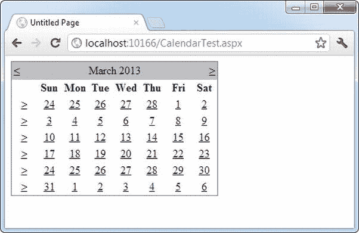
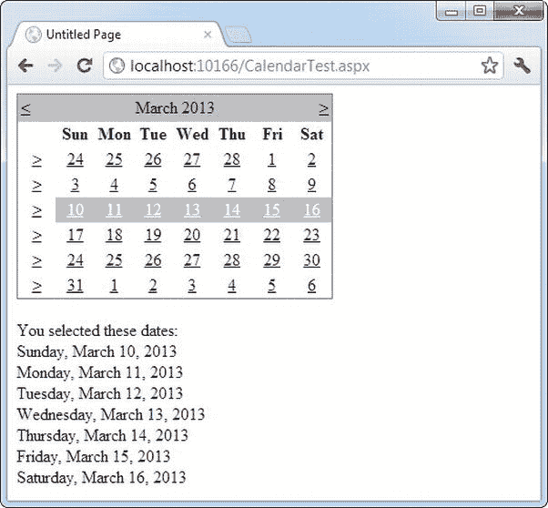
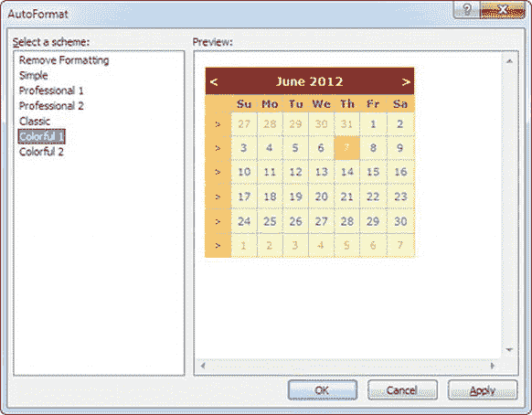
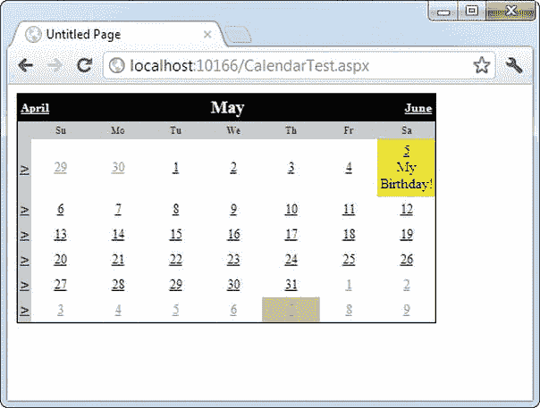
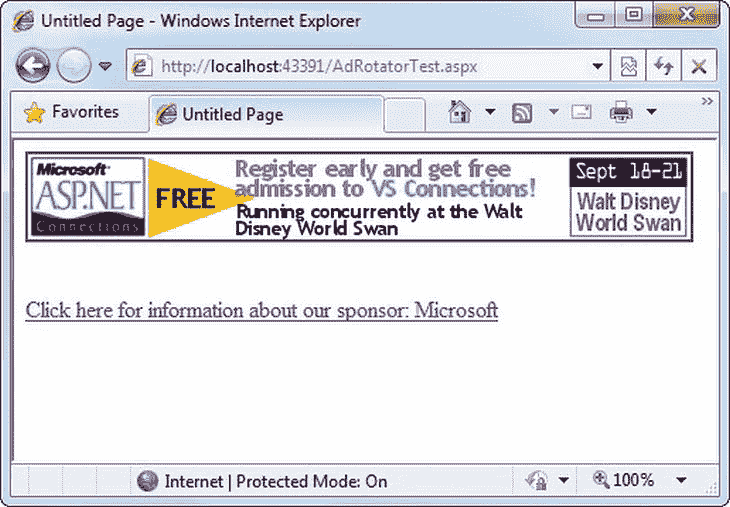
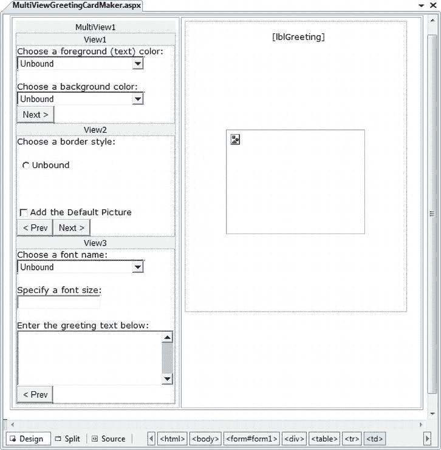
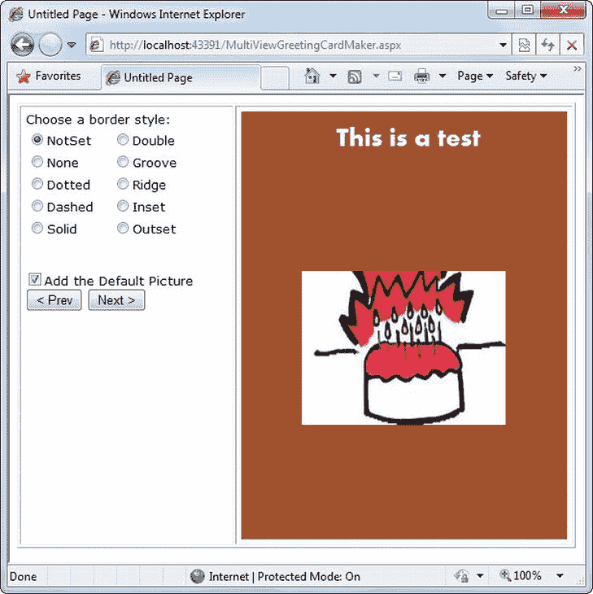
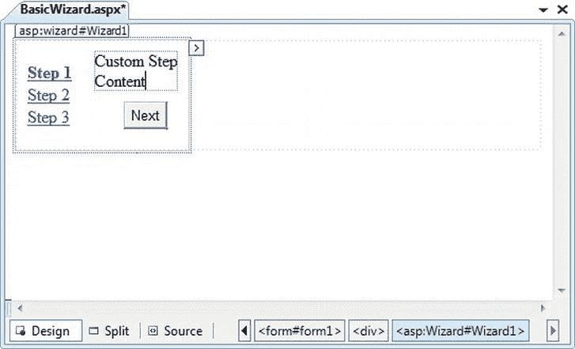
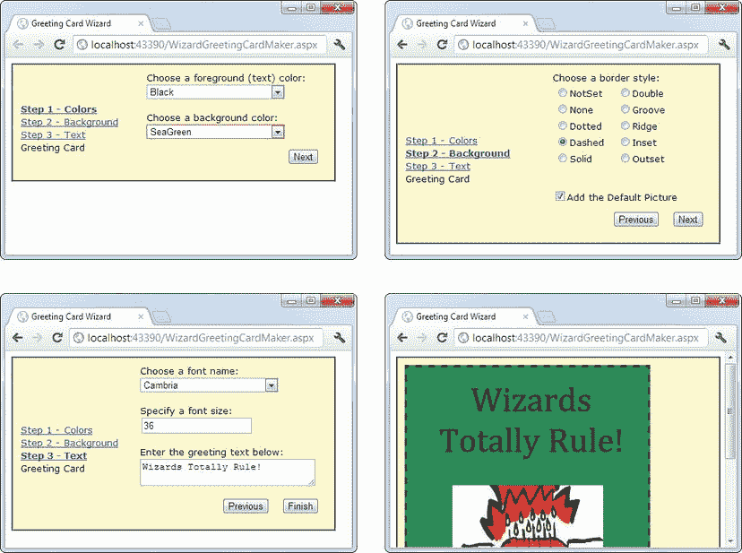
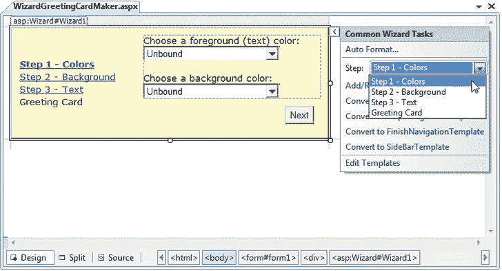

# 十、丰富控件

丰富控件是模拟复杂用户界面元素的 web 控件。虽然对于什么是富控件和什么不是富控件没有严格的定义，但是这个术语通常描述一个 web 控件，它具有一个与它生成的 HTML 明显分离的对象模型。典型的富控件可以编程为单个对象(并使用单个控件标记添加到网页中)，但使用复杂的 HTML 元素序列来呈现自身。丰富控件还可以对用户操作(如在控件的特定区域单击鼠标)做出反应，并引发代码可以在 web 服务器上响应的更有意义的事件。换句话说，富控件为您提供了一种在网页中创建高级用户界面的方法，而无需编写复杂的 HTML 代码。

在这一章中，你将会看到一些在普通 HTML 世界中没有直接对等物的 web 控件。您将从日历开始，它提供了灵活的日期选择功能。接下来您将考虑 AdRotator，它为您提供了一种将随机选择的图像插入 web 页面的简单方法。最后，您将学习如何使用两个高级控件创建具有多个视图的复杂页面:MultiView 和向导。这些控件允许您将一个微型应用打包到一个页面中。使用它们，您可以处理多步任务，而无需将用户从一个页面重定向到另一个页面。

 **注意**ASP.NET 包含了本书其他地方讨论过的许多丰富的控件，包括导航控件、基于数据的列表控件和安全控件。在这一章中，你将关注一些有用的 web 控件，它们并不完全属于这些类别。所有这些控件都出现在 Visual Studio 工具箱的“标准”选项卡中。

日历

*日历控件*展示了一个微型日历，您可以将它放在任何网页中。像大多数富控件一样，日历可以被编程为单个对象(并在单个简单的标签中定义)，但是它用几十行 HTML 输出来呈现自己。

```cs
<asp:Calendar id="MyCalendar" runat="server" />
```

日历控件呈现单月视图，如图[图 10-1](#Fig1) 所示。用户可以使用导航箭头从一个月导航到另一个月，此时页面会被回发，ASP.NET 会自动提供一个包含正确月份值的新页面。您不需要编写任何额外的事件处理代码来管理这个过程。当用户单击某个日期时，该日期会在一个灰色框中突出显示(默认情况下)。您可以在代码中从日历中检索选定的日期作为 DateTime 对象。SelectedDate 属性。T3】



[图 10-1](#_Fig1) 。默认日历

这一组基本特性可以提供应用中所需的一切。或者，您可以通过 CalendarSelectionMode 属性配置不同的选择模式。根据您选择的值，您可以允许用户选择天(Day)、整周(DayWeek)、整月(DayWeekMonth)，或者将控件呈现为不允许选择的静态日历(None)。您必须记住的唯一事实是，如果您允许选择月份，用户也可以选择一周或一天。同样，如果您允许选择周，用户也可以选择一天。

您可能还想设置日历。属性来配置如何显示一周。(例如，将 FirstDayOfWeek 设置为枚举值 Sunday，将从周日到周六选择周。)

当您允许多个日期选择时，您需要检查 SelectedDates 属性，，它提供了所有选定日期的集合。您可以使用 foreach 语法循环访问该集合。下面的代码演示了这种技术:

```cs
lblDates.Text = "You selected these dates:<br />";
foreach (DateTime dt in MyCalendar.SelectedDates)
{
    lblDates.Text += dt.ToLongDateString() + "<br />";
}
```

[图 10-2](#Fig2) 显示了这段代码执行后的结果页面。



[图 10-2](#_Fig2) 。选择多个日期

格式化日历

日历控件提供了大量与格式相关的属性。通过使用样式属性之一(例如，WeekendDayStyle)，可以设置日历的各个部分，如标题、选择器和各种日期类型。每个样式属性都引用一个全功能的 TableItemStyle 对象，该对象提供颜色、边框样式、字体和对齐方式的属性。总之，它们允许您修改日历外观的几乎任何部分。

表 10-1 列出了日历控件提供的样式属性。

[表 10-1。](#_Tab1)日历样式的属性

| 成员 | 描述 |
| --- | --- |
| 日间风格 | 显示一周中各天的日历部分的样式(作为列标题)。 |
| 日风格 | 当月日期的默认样式。 |
| NextPrevStyle | 标题部分中按月移动的导航控件的样式。 |
| OtherMonthDayStyle | 不在当前显示月份中的日期的样式。这些日期用于“填充”日历网格。例如，最上面一行的前几个单元格可能显示上个月的最后几天。 |
| SelectedDayStyle | 日历上选定日期的样式。 |
| 选择风格 | 星期和月份日期选择控件的样式。 |
| 标题样式 | 标题部分的样式。 |
| 今日风格 | 指定为今天的日期的样式(由 Calendar 控件的 TodaysDate 属性表示)。 |
| 周末风格 | 周末日期的样式。 |

您可以使用“属性”窗口来调整每种样式。作为快捷方式，您可以使用日历的自动格式功能来设置整个相关的配色方案。为此，首先在 WebForm 的设计图面上选择日历。然后单击右上角旁边显示的箭头图标以显示日历的智能标记，并单击“自动格式化”链接。你会看到一个设置样式属性的预定义格式列表，如图[图 10-3](#Fig3) 所示。



[图 10-3](#_Fig3) 。日历样式

您还可以使用附加属性来隐藏某些元素或配置它们显示的文本。例如，以 *Show* 开头的属性(如 ShowDayHeader、ShowTitle 和 ShowGridLines)可用于隐藏或显示特定的可视元素。以*文本*结尾的属性(比如 PrevMonthText、NextMonthText 和 SelectWeekText)允许您设置显示在部分日历中的文本。

限制日期

在大多数需要使用日历进行选择的情况下，您不希望允许用户选择日历中的任何日期。例如，用户可能正在预约或选择交付日期——这两项服务通常只在固定日期提供。Calendar 控件使实现这种逻辑变得异常容易。事实上，如果你在 Windows 平台上使用过日期和时间控件，你会很快发现 ASP.NET 版本要好得多。

限制日期的基本方法是为日历编写一个事件处理程序。DayRender 事件。当 Calendar 控件将要创建向用户显示的月份时，会发生此事件。该事件使您有机会检查添加到当前月份的日期(通过 e.Day 属性),并决定该日期是可选的还是受限的。

以下代码使得无法选择任何周末或 2013 年以后的日期:

```cs
protected void MyCalendar_DayRender(Object source, DayRenderEventArgs e)
{
    // Restrict dates after the year 2013 and those on the weekend.
    if (e.Day.IsWeekend || e.Day.Date.Year > 2013)
    {
        e.Day.IsSelectable = false;
    }
```

e.Day 对象是 CalendarDay 类的一个实例，它提供了各种属性。[表 10-2](#Tab2) 描述了一些最有用的。

[表 10-2。](#_Tab2)日历日属性

| 财产 | 描述 |
| --- | --- |
| 日期 | 表示此日期的 DateTime 对象。 |
| IsWeekend | 如果该日期是星期六或星期天，则为 True。 |
| 今天 | 如果该值与日历匹配，则为 True。TodaysDate 属性，默认情况下设置为当天。 |
| 等温月 | 如果此日期不属于当月，但显示为填充第一行或最后一行，则为 True。例如，这可能是上个月的最后一天或下个月的第二天。 |
| is 可选 | 允许您配置用户是否可以选择这一天。 |

DayRender 事件非常强大。除了允许您定制可选择的日期，它还允许您通过 e.Cell 属性配置日期所在的单元格。(日历使用 HTML 表格显示。)例如，您可以突出显示一个重要的日期，甚至添加信息。下面是一个突出显示某一天(5 月 5 日)的示例，方法是在该日的表格单元格中添加一个新的 Label 控件:

```cs
protected void MyCalendar_DayRender(Object source, DayRenderEventArgs e)
{
    // Check for May 5 in any year, and format it.
    if (e.Day.Date.Day == 5 && e.Day.Date.Month == 5)
    {
        e.Cell.BackColor = System.Drawing.Color.Yellow;
```

```cs
        // Add some static text to the cell.
        Label lbl = new Label();
        lbl.Text = “<br />My Birthday!”;
        e.Cell.Controls.Add(lbl);
    }
}
```

[图 10-4](#Fig4) 显示了产生的日历显示。



[图 10-4](#_Fig4) 。突出一天

Calendar 控件提供了另外两个有用的事件: SelectionChanged 和 VisibleMonthChanged 。这些在用户选择新的一天或浏览到新的一个月(使用下个月和上个月链接)后立即发生。您可以对这些事件作出反应，并更新网页的其他部分以对应当前的日历月。例如，您可以设计一个网页，让您分两步安排会议。首先你选择合适的日子。然后你在那天选择一个可用的时间。

下面的代码演示了这种方法，如果在日历中选择了星期一，则使用一组不同于其他日期的时间值:

```cs
protected void MyCalendar_SelectionChanged(Object source, EventArgs e)
{
    lstTimes.Items.Clear();
```

```cs
    switch (MyCalendar.SelectedDate.DayOfWeek)
    {
        case DayOfWeek.Monday:
            // Apply special Monday schedule.
            lstTimes.Items.Add(“10:00”);
            lstTimes.Items.Add(“10:30”);
            lstTimes.Items.Add(“11:00”);
        break;
        default:
            lstTimes.Items.Add(“10:00”);
            lstTimes.Items.Add(“10:30”);
            lstTimes.Items.Add(“11:00”);
            lstTimes.Items.Add(“11:30”);
            lstTimes.Items.Add(“12:00”);
            lstTimes.Items.Add(“12:30”);
            break;
    }
}
```

若要尝试 Calendar 控件的这些功能，请运行联机示例中的 Appointment.aspx 页。该页提供了一个格式化的日历控件，它限制某些日期，对其他日期进行特殊格式化，并在选择发生变化时更新相应的列表控件。

表 10-3 让你对日历控件类的几乎所有成员一目了然。

[表 10-3。](#_Tab3)日历成员

| 成员 | 描述 |
| --- | --- |
| 标题和标题对齐 | 为您提供了一种向日历添加标题的简单方法。默认情况下，标题显示在标题区域的顶部，就在月份标题的上方。但是，您可以使用 CaptionAlign 属性对此进行一定程度的控制。使用“左”或“右”将标题放在顶部，但将其移到一侧或另一侧，使用“下”将标题放在日历下方。 |
| 单元格填充 | ASP.NET 在不可见表格的单独单元格中创建日期。CellPadding 是每个单元格的边框与其内容之间的空间，以像素为单位。 |
| 单元格间距 | 同一表格中单元格之间的间距，以像素为单位。 |
| 日期名称格式 | 确定日期在日历标题中的显示方式。有效值包括 Full(如 Sunday)、FirstLetter (S)、FirstTwoLetters (Su)和 Short (Sun)，这是默认值。 |
| 可选 | 确定在日历的第一列显示哪一天。这些值可以是 FirstDayOfWeek 枚举中的任何一天的名称(如 Sunday)。默认情况下，这是星期天。 |
| NextMonthText 和 PrevMonthText | 设置用户单击以移动到下个月或上个月的文本。这些导航链接出现在日历的顶部，默认情况下是大于号(>)和小于号( |
| NextPrevFormat | 设置用户单击以移动到下个月或上个月的文本。这可以是 FullMonth(例如，December)、ShortMonth (Dec)或 CustomText，在这种情况下，将使用 NextMonthText 和 PrevMonthText 属性。默认设置为 CustomText。 |
| 选定日期和选定日期 | 将当前选定的日期设置或获取为 DateTime 对象。您可以在控件标记中以如下格式指定:12:00:00 AM，12/31/2010(取决于您计算机的区域设置)。如果允许选择多个日期，SelectedDates 属性将返回 DateTime 对象的集合，每个对象对应一个选定的日期。您可以使用 Add、Remove 和 Clear 等集合方法来更改选择。 |
| 选择模式 | 确定一次可以选择多少个日期。默认值为日，允许选择一个日期。其他选项包括日周(单个日期或整周)或日周月(单个日期、整周或整月)。您无法允许用户选择多个不连续的日期。如果不包含较小的选择，您也无法允许较大的选择。(例如，如果您允许选择整月，则还必须允许选择周和单天。) |
| 选择月文本和周文本 | 为允许用户选择整月或整周的链接显示的文本。如果 SelectionMode 是 Day，则这些属性不适用。 |
| ShowDayHeader、ShowGridLines、ShowNextPrevMonth 和 ShowTitle | 这些布尔属性允许您配置是否显示日历的各个部分，包括日标题、每天之间的网格线、上个月/下个月导航链接以及标题部分。请注意，隐藏标题部分也会隐藏下个月和上个月的导航控件。 |
| 标题格式 | 配置月份在标题区域的显示方式。有效值包括 Month 和 MonthYear(默认值)。 |
| 今天日期 | 设置应该将哪一天识别为当前日期，并用 TodayDayStyle 格式化。这默认为 web 服务器上的当天。 |
| 可访问日期 | 获取或设置日期，该日期指定将在日历中显示的月份。这允许您在不修改当前日期选择的情况下更改日历显示。 |
| DayRender 事件 | 在呈现页面之前，为创建并添加到当前可见月份中的每一天发生一次。此事件为您提供了对单个日期单元格应用特殊格式、添加内容或限制选择的机会。请记住，即使日期不在当月，也可以出现在日历中，只要它们接近上个月的月末或下个月的月初。 |
| 选择更改事件 | 当用户通过单击日期选择器控件选择一天、一周或整个月时发生。 |
| VisibleMonthChanged 事件 | 当用户单击下个月或上个月导航控件以移动到另一个月时发生。 |

旋转器

*旋转器*的基本目的是在页面上提供一个从一组可能的图像中随机选择的图形。换句话说，每次页面被请求时，随机选择一个图像并显示，这就是 AdRotator 这个名字所表示的*旋转*。ad rotator 的一个用途是在页面上显示横幅风格的广告，但你可以在任何时候想随机改变图像时使用它。

使用 ASP.NET，你自己实现一个旋转器类型的设计不会太难。你可以对页面做出反应。加载事件，生成一个随机数，然后使用该数字从预先确定的图像文件列表中进行选择。您甚至可以将该列表存储在 web.config 文件中，以便可以作为应用配置的一部分轻松地单独修改它。当然，如果您想用一个随机图像启用几个页面，您要么必须重复代码，要么创建自己的自定义控件。AdRotator 免费提供这些功能。

你应该选择使用 ADROTATOR 做网络广告吗？

AdRotator 控件的名称稍有误导。更好的名字可能是 RandomImage 或 RotatingImage。这是因为 AdRotator 内容绝对不需要与广告有任何关系。

事实上，如今 AdRotator 并不是处理网站广告的最常见方式，即使是在 ASP.NET 应用中。你更有可能使用由广告服务提供给你的预先生成的 JavaScript 块。例如，如果你决定用 Google AdSense([www.google.com/adsense](http://www.google.com/adsense))展示广告赚点外快，Google 会为你提供一段 JavaScript 代码，为你的页面获取一个合适的广告(或广告链接的组合)。谷歌返回的广告是随机的，但它们基于各种细节，包括它在你的页面上检测到的内容和你为广告分配的空间大小。其他广告方法更复杂，使用带有 Flash 动画的弹出面板，以及其他技巧。

广告文件

AdRotator 将其图像文件列表存储在一个 XML 文件中。这个文件使用这里显示的格式:

```cs
<Advertisements>
 <Ad>
    <ImageUrl>prosetech.jpg</ImageUrl>
    <NavigateUrl>http://www.prosetech.com</NavigateUrl>
    <AlternateText>ProseTech Site</AlternateText>
    <Impressions>1</Impressions>
    <Keyword>Computer</Keyword>
 </Ad>
</Advertisements>
```

 **提示**XML 文件只是一个带有特定标签的文本文件。您可以只使用文本编辑器(如记事本)来创建 XML 文件，但也可以使用 Visual Studio 文本编辑器。只需从菜单中选择网站添加新项目，然后选择 XML 文件。填写正确的标签和内容取决于您。您可以将广告文件放在您喜欢的任何位置，可以放在主网站文件夹中，也可以放在您创建的子文件夹中。

此示例显示了一个可能的广告，AdRotator 控件从广告列表中随机选取该广告。要添加更多广告，您可以创建多个<ad>元素，并将它们全部放在根<advertisements>元素中:</advertisements></ad>

```cs
<Advertisements>
 <Ad>
    <!-- First ad here. -->
 </Ad>
```

```cs
 <Ad>
    <!-- Second ad here. -->
 </Ad>
</Advertisements>
```

每个<ad>元素都有许多其他重要的属性来配置链接、图像和频率，如[表 10-4](#Tab4) 中所述。</ad>

[表 10-4。](#_Tab4)广告文件元素

| 元素 | 描述 |
| --- | --- |
| ImageUrl | 将显示的图像。这可以是相对链接(当前目录中的文件)或完全限定的 Internet URL。 |
| 浏览器 rl | 如果用户单击横幅，将跟随的链接。这可以是相对或完全限定的 URL。 |
| 替代文本 | 当图片无法显示时，将代替图片显示的文本。在一些较新的浏览器中，该文本也将用作工具提示。 |
| 印象 | 设定广告出现频率的数字。这个数字是相对于其他广告指定的数字而言的。例如，值为 10 的横幅的显示频率是值为 5 的横幅的两倍(平均)。 |
| 关键字 | 标识一组广告的关键字。你可以用这个来过滤。例如，您可以创建十个广告，其中一半使用关键字 Retail，另一半使用关键字 Computer。网页然后可以选择过滤可能的广告以仅包括这些组中的一个。 |

AdRotator 类

实际的 AdRotator 类提供了一组有限的属性。在 advertisement file 属性中指定适当的广告文件，并指定链接应该跟随的窗口类型(目标窗口)。目标可以命名一个特定的帧，也可以使用[表 10-5](#Tab5) 中定义的值之一。

[表 10-5。](#_Tab5)特殊帧目标

| 目标 | 描述 |
| --- | --- |
| _ 空白 | 该链接会打开一个新的无框架窗口。 |
| _parent | 链接在当前框架的父框架中打开。 |
| _self | 链接在当前框架中打开。 |
| _ 顶部 | 链接在当前窗口的最顶层框架中打开(因此链接显示在整个窗口中)。 |

或者，您可以设置 KeywordFilter 属性，以便从特定的关键字组中选择横幅。这是一个完全配置的 AdRotator 标记:

```cs
<asp:AdRotator ID="Ads" runat="server" AdvertisementFile="MainAds.xml"
     Target=”_blank” KeywordFilter=”Computer” />
```

此外，您可以对 AdRotator 做出反应。AdCreated 事件。当创建页面并且从广告文件中随机选择图像时，会出现这种情况。此事件为您提供了有关图像的信息，您可以使用这些信息来自定义页面的其余部分。例如，你可以显示一些相关的内容或链接，如图[图 10-5](#Fig5) 所示。



[图 10-5](#_Fig5) 。具有同步内容的 ad rotator

本例的事件处理代码只是根据随机选择的广告配置一个名为 lnkBanner 的超链接控件:

```cs
protected void Ads_AdCreated(Object sender, AdCreatedEventArgs e)
{
    // Synchronize the Hyperlink control.
    lnkBanner.NavigateUrl = e.NavigateUrl;
```

```cs
    // Syncrhonize the text of the link.
    lnkBanner.Text = “Click here for information about our sponsor: “;
    lnkBanner.Text += e.AlternateText;
}
```

如您所见，日历和 AdRotator 等丰富的控件不只是添加了复杂的 HTML 输出；它们还包括一个事件框架，允许您控制控件的行为并将其集成到您的应用中。

多视图页面

在一个典型的网站中，你会浏览许多独立的页面。例如，如果您想将一件商品添加到您的购物车，并将其带到电子商务网站的收银台，您将需要从一个页面跳转到另一个页面。这种设计有它的优点——也就是说，它允许你小心地将不同的任务分成不同的代码文件。这也带来了一些挑战；例如，你需要想出一种方法将信息从一页转移到另一页(就像你在第八章中看到的那样)。

但是，在某些情况下，创建一个可以处理多个不同任务的页面更有意义。例如，您可能希望提供同一数据的多个视图(例如基于网格的视图和基于图表的视图)，并允许用户在不离开页面的情况下从一个视图切换到另一个视图。或者，您可能希望在一个地方处理一个小的多步骤任务(例如为帐户注册过程提供用户信息)。在这些例子中，您需要一种方法来创建提供多种可能视图的动态页面。实际上，页面会根据您想要呈现的视图隐藏和显示不同的控件。

理解这种技术的最简单的方法是创建一个包含几个面板控件的页面。每个面板可以容纳一组 panel 控件。例如，假设您正在创建一个简单的三步向导。您将首先向页面添加三个面板，每个面板对应一个步骤，比如 panelStep1、panelStep2 和 panelStep3。您可以一个接一个地放置面板，因为您一次只能显示一个面板。添加面板后，可以在每个面板中放置适当的控件。首先，每个面板的 Visible 属性应该为 false，panelStep1 除外，它在用户第一次请求页面时出现。

下面的示例展示了如何排列面板:

```cs
<asp:Panel ID=”panelStep1” runat=”server”>...</asp:Panel>
<asp:Panel ID=”panelStep2” Visible=”False” runat=”server”>...</asp:Panel>
<asp:Panel ID=”panelStep3” Visible=”False” runat=”server”>...</asp:Panel>
```

 **注意**当你将一个控件的 Visible 属性设置为 false 时，该控件在运行时不会出现在页面中。不可见面板中的任何控件也是隐藏的，它们不会出现在页面的 HTML 中。但是，这些控件仍将出现在 Visual Studio 设计图面中，以便您仍可以选择和配置它们。

最后，您将在面板外添加一个或多个导航按钮。例如，下面的代码处理 Next 按钮的单击，该按钮位于 panelStep3 之后(因此它总是出现在页面的底部)。该代码检查用户当前所处的步骤，隐藏当前面板，并显示下面的面板。这样，用户就进入了下一步。

```cs
protected void cmdNext_Click(object sender, EventArgs e)
{
    if (panelStep1.Visible)
    {
        // Move to step 2.
        panelStep1.Visible = false;
        panelStep2.Visible = true;
    }
    else if (panelStep2.Visible)
    {
        // Move to step 3.
        panelStep2.Visible = false;
        panelStep3.Visible = true;
```

```cs
        // Change text of button from Next to Finish.
        cmdNext.Text = “Finish”;
    }
    else if (panelStep3.Visible)
    {
        // The wizard is finished.
        panelStep3.Visible = false;
        // Add code here to perform the appropriate task
        // with the information you've collected.
    }
}
```

这种方法效果相对较好。即使面板被隐藏，您仍然可以与每个面板上的所有控件进行交互，并检索它们包含的信息。问题是您需要编写所有的代码来控制哪个面板是可见的。如果您使向导变得更加复杂，例如，您想添加一个返回上一步的按钮，那么跟踪正在发生的事情就会变得更加困难。最好的情况是，这种方法用管理面板的代码使您的页面变得混乱。在最坏的情况下，你会犯一个小错误，结果是两个面板同时显示。

幸运的是，ASP.NET 给了你一个更稳健的选择。您可以使用为该作业设计的两个控件——“多视图”和向导。在接下来的几节中，您将看到如何在第 6 章中开发的 GreetingCardMaker 示例中使用这两个控件。

多视图控件

多视图是两种多视图控件中较为简单的一种。本质上，MultiView 为您提供了一种声明多个视图并一次只显示一个视图的方法。它没有默认的用户界面——你只能得到你添加的 HTML 和控件。MultiView 相当于前面解释的自定义面板方法。

创建多视图非常简单。您将<multiview>标签添加到您的。aspx 页面文件，然后在其中为每个单独的视图添加一个<view>标记:</view></multiview>

```cs
<asp:MultiView ID="MultiView1" runat="server">
 <asp:View ID=”View1” runat=”server”>...</asp:View>
 <asp:View ID=”View2” runat=”server”>...</asp:View>
 <asp:View ID=”View3” runat=”server”>...</asp:View>
</asp:MultiView>
```

在 Visual Studio 中，创建这些标记的方法是:首先将一个 MultiView 控件拖放到窗体上，然后使用工具箱在其中添加任意数量的视图控件。这个拖放过程可能有点棘手。当添加第一个视图控件时，必须确保将其放在多视图内部的空白区域(而不是多视图旁边或多视图的标题栏上)。当您添加更多视图控件时，您必须将每个控件放在一个现有视图的一个灰色标题栏上。灰色标题具有视图标题(如视图 1 或视图 2)。

视图控件的作用与前面示例中的面板控件相同，多视图负责协调所有视图，以便一次只有一个视图可见。

在每个视图中，您可以添加 HTML 或 web 控件。例如，考虑第 6 章中演示的 GreetingCardMaker 示例，它允许用户通过提供一些文本并选择颜色、字体和背景来创建贺卡。随着贺卡制作变得越来越复杂，它需要更多的控件，并且越来越难以将所有这些控件放在同一个页面上。一种可能的解决方案是将这些控件分成逻辑组，并将每个组放在单独的视图中。

创建视图

下面是 MultiView 的完整标记，它将贺卡控件分成三个视图，分别名为 View1、View2 和 View3:

```cs
<asp:MultiView ID="MultiView1" runat="server" >
```

```cs
 <asp:View ID=”View1” runat=”server”>
    Choose a foreground (text) color:<br />
    <asp:DropDownList ID=”lstForeColor” runat=”server” AutoPostBack=”True”
     OnSelectedIndexChanged=”ControlChanged” />
    <br /><br />
    Choose a background color:<br />
    <asp:DropDownList ID=”lstBackColor” runat=”server” AutoPostBack=”True”
     OnSelectedIndexChanged=”ControlChanged” />
 </asp:View>
```

```cs
 <asp:View ID=”View2” runat=”server”>
    Choose a border style:<br />
    <asp:RadioButtonList ID=”lstBorder” runat=”server” AutoPostBack=”True”
     OnSelectedIndexChanged=”ControlChanged” RepeatColumns=”2” />
    <br />
    <asp:CheckBox ID=”chkPicture” runat=”server” AutoPostBack=”True”
     OnCheckedChanged=”ControlChanged” Text=”Add the Default Picture” />
 </asp:View>
```

```cs
 <asp:View ID=”View3” runat=”server”>
    Choose a font name:<br />
    <asp:DropDownList ID=”lstFontName” runat=”server” AutoPostBack=”True”
     OnSelectedIndexChanged=”ControlChanged” />
    <br /><br />
    Specify a font size:<br />
    <asp:TextBox ID=”txtFontSize” runat=”server” AutoPostBack=”True”
     OnTextChanged=”ControlChanged” />
    <br /><br />
    Enter the greeting text below:<br />
    <asp:TextBox ID=”txtGreeting” runat=”server” AutoPostBack=”True”
     OnTextChanged=”ControlChanged” TextMode=”MultiLine” />
 </asp:View>
```

```cs
</asp:MultiView>
```

Visual Studio 在设计时显示你的所有视图，一个接一个(见[图 10-6](#Fig6) )。您可以像设计页面的任何其他部分一样编辑这些区域。



[图 10-6](#_Fig6) 。设计多个视图

显示视图

如果你运行这个例子，你不会看到你所期望的。多视图将在页面上显示为空，并且所有视图中的所有控件都将被隐藏。

发生这种情况的原因是多视图。默认情况下，ActiveViewIndex 属性设置为–1。 ActiveViewIndex 属性确定将显示哪个视图。但是，如果将 ActiveViewIndex 设置为 0，您将看到第一个视图。同样，您可以将其设置为 1 来显示第二个视图，依此类推。您可以使用[属性]视窗或使用程式码来设定这个属性:

```cs
// Show the first view.
MultiView1.ActiveViewIndex = 0;
```

本示例显示第一个视图(View1 ),并隐藏当前显示的任何视图(如果有)。

 **提示**为了让代码更易读，你可以创建一个枚举来定义每个视图的名称。这样，您可以通过使用枚举中的描述性名称而不是普通数字来设置 ActiveViewIndex。参见[第 3 章](03.html)复习枚举。

您还可以使用 SetActiveView()方法，该方法接受您创建的任何一个视图对象，而不是视图名称。通过使用视图对象，您可以更早地捕捉错误。例如，如果您拼错了视图名，Visual Studio 会在您编译代码时发现问题，而不是让您的代码在运行时尝试加载视图时失败。

```cs
MultiView1.SetActiveView(View1);
```

这为您提供了足够的功能，您可以创建上一个和下一个导航按钮。然而，检查哪个视图可见并改变视图的代码仍然由您来编写。这段代码稍微简单一点，因为您不再需要担心隐藏视图，但是它仍然不够理想。

幸运的是，MultiView 包含一些内置的智能，可以为您省去很多麻烦。它是这样工作的:“多视图”识别带有特定命令名的按钮控件。(从技术上讲，button 控件是实现 IButtonControl 接口的任何控件，包括 Button、ImageButton 和 LinkButton。)如果在视图中添加一个使用这些可识别的命令名之一的按钮控件，该按钮将获得一些自动功能。使用这种技术，您无需编写任何代码就可以创建导航按钮。

[表 10-6](#Tab6) 列出了所有可识别的命令名。每个命令名在 MultiView 类中也有一个对应的静态字段，所以如果您选择以编程方式设置它，您可以很容易地获得正确的命令名。

[表 10-6。](#_Tab6)多视图的可识别命令名

| 命令名称 | 多视图字段 | 描述 |
| --- | --- | --- |
| 试映 | PreviousViewCommandName | 移动到上一个视图。 |
| NextView(下一个视图) | NextViewCommandName | 移动到下一个视图。 |
| SwitchViewByID | SwitchViewByIDCommandName | 移动到具有特定 ID(字符串名称)的视图。该 ID 取自 button 控件的 CommandArgument 属性。 |
| SwitchViewByIndex | SwitchViewByIndexCommandName | 移动到具有特定数字索引的视图。该索引取自 button 控件的 CommandArgument 属性。 |

要尝试这样做，请将此按钮添加到第一个视图中:

```cs
<asp:Button ID="Button1" runat="server" CommandArgument="View2"
CommandName=”SwitchViewByID” Text=”Go to View2” />
```

单击时，此按钮设置 MultiView 以显示由 CommandArgument (View2)指定的视图。

您可能想要一个向前或向后移动一个视图的按钮，而不是创建将用户带到特定视图的按钮。为此，可以使用 PrevView 和 NextView 命令名。下面的示例定义了第二个视图中的“上一页”和“下一页”按钮:

```cs
<asp:Button ID="Button1" runat="server" Text="< Prev" CommandName="PrevView" />
<asp:Button ID=”Button2” runat=”server” Text=”Next >” CommandName=”NextView” />
```

将这些按钮添加到视图后，您可以轻松地在视图之间移动。[图 10-7](#Fig7) 显示了第二个视图当前可见的前一个例子。



[图 10-7](#_Fig7) 。从一个视图移动到另一个视图

 **提示**小心你在一个页面中塞进了多少个视图。使用 MultiView 控件时，整个控件模型(包括每个视图中的控件)在每次回发时创建，并保存到视图状态中。在大多数情况下，这不是一个重要的因素。但是，它增加了整个页面的大小，特别是当您以编程方式调整控件时(这增加了它们需要存储在视图状态中的信息量)。

向导控件

Wizard 控件是 MultiView 控件的一个更加迷人的版本。它还支持一次显示几个视图中的一个，但它包括相当多的内置但可定制的行为，包括导航按钮、带有步骤链接的侧栏、样式和模板。

通常，向导代表一个单一的任务，用户在其中线性移动，从当前步骤移动到紧随其后的下一步(或者在纠正的情况下，移动到紧随其后的下一步)。ASP.NET 向导控件还支持非线性导航，这意味着它允许您根据用户提供的信息决定忽略某个步骤。

默认情况下，向导控件在左侧提供导航按钮和带有每个步骤链接的边栏。您可以通过设置向导来隐藏侧栏。DisplaySideBar 属性设置为 false。通常，如果您想要强制执行严格的逐步导航并防止用户跳出顺序，您会采取这一步骤。您可以使用任何 HTML 或 ASP.NET 控件为每个步骤提供内容。[图 10-8](#Fig8) 显示了您可以向现成向导实例添加内容的区域。



[图 10-8](#_Fig8) 。步骤内容的区域

定义向导步骤

要在 ASP.NET 创建一个向导，只需使用<wizardstep>标签定义步骤及其内容。以下是您将使用的基本结构:</wizardstep>

```cs
<asp:Wizard ID="Wizard1" runat="server" ... >
 <WizardSteps>
```

```cs
    <asp:WizardStep runat=”server” Title=”Step 1”>
     ...
    </asp:WizardStep>
```

```cs
    <asp:WizardStep runat=”server” Title=”Step 2”>
     ...
    </asp:WizardStep>
```

```cs
    ...
 <WizardSteps>
</asp:Wizard>
```

您可以在向导中添加任意数量的 WizardStep 控件。从概念上讲，WizardStep 与 MultiView 中的视图(或者您考虑的第一个示例中的基本面板)起着相同的作用。您将每个步骤的内容放在 WizardStep 控件中。

在您开始向向导添加内容之前，有必要回顾一下[表 10-7](#Tab7) ，它显示了您可以为每个步骤定义的一些基本信息。

[表 10-7。](#_Tab7) WizardStep 属性

| 财产 | 描述 |
| --- | --- |
| 标题 | 步骤的描述性名称。该名称用于边栏中链接的文本。 |
| 步型 | 步骤的类型，为 WizardStepType 枚举中的值。该值决定了将在该步骤中显示的导航按钮的类型。选项包括开始(显示下一个按钮)、步骤(显示下一个和上一个按钮)、完成(显示完成和上一个按钮)、完成(不显示按钮并隐藏侧栏，如果已启用)和自动(步骤类型从集合中的位置推断)。默认值为 Auto，这意味着第一步是 Start，最后一步是 Finish，所有其他步骤都是 step。 |
| 允许退货 | 指示用户是否可以返回到此步骤。如果为 false，用户将无法在通过此步骤后返回。此步骤的侧栏链接将不起作用，下一步的“上一步”按钮将跳过此步骤或完全隐藏(取决于前面步骤的 AllowReturn 值)。 |

要了解其工作原理，请考虑一个再次使用 GreetingCardMaker 示例的向导。它指导用户完成四个步骤。前三步允许用户配置贺卡，最后一步显示生成的贺卡。

```cs
<asp:Wizard ID="Wizard1" runat="server" ActiveStepIndex="0"
 BackColor=”LemonChiffon” BorderStyle=”Groove” BorderWidth=”2px” CellPadding=”10”>
```

```cs
 <WizardSteps>
    <asp:WizardStep runat=”server” Title=”Step 1 - Colors”>
     Choose a foreground (text) color:<br />
     <asp:DropDownList ID=”lstForeColor” runat=”server” />
     <br />
     Choose a background color:<br />
     <asp:DropDownList ID=”lstBackColor” runat=”server” />
    </asp:WizardStep>
```

```cs
    <asp:WizardStep runat=”server” Title=”Step 2 - Background”>
     Choose a border style:<br />
     <asp:RadioButtonList ID=”lstBorder” runat=”server” RepeatColumns=”2” />
     <br /><br />
     <asp:CheckBox ID=”chkPicture” runat=”server”
        Text=”Add the Default Picture” />
    </asp:WizardStep>
```

```cs
    <asp:WizardStep runat=”server” Title=”Step 3 - Text”>
     Choose a font name:<br />
     <asp:DropDownList ID=”lstFontName” runat=”server” />
     <br /><br />
     Specify a font size:<br />
     <asp:TextBox ID=”txtFontSize” runat=”server” />
     <br /><br />
     Enter the greeting text below:<br />
     <asp:TextBox ID=”txtGreeting” runat=”server”
        TextMode=”MultiLine” />
    </asp:WizardStep>
```

```cs
    <asp:WizardStep runat=”server” StepType=”Complete” Title=”Greeting Card”>
     <asp:Panel ID=”pnlCard” runat=”server” HorizontalAlign=”Center”>
        <br />
        <asp:Label ID=”lblGreeting” runat=”server” />
        <asp:Image ID=”imgDefault” runat=”server” Visible=”False” />
     </asp:Panel>
    </asp:WizardStep>
 </WizardSteps>
```

```cs
</asp:Wizard>
```

如果仔细观察，您会发现与原始页面和基于多视图的示例有一些不同。首先，控件没有设置为自动回发。这是因为贺卡直到最后一步，向导结束时才呈现出来。(在下一节中，您将了解如何处理该事件的更多信息。)另一个变化是不存在导航按钮。这是因为向导会根据步骤类型自动添加这些细节。例如，前两步有一个“下一步”按钮，第二步和第三步有一个“上一步”按钮，第三步有一个“完成”按钮。显示完整卡片的最后一步不提供任何导航链接，因为 StepType 设置为 complete。[图 10-9](#Fig9) 显示了向导步骤。



[图 10-9](#_Fig9) 。有四个步骤的向导

与 MultiView 控件不同，在 Visual Studio 中一次只能看到一个步骤。要选择您当前正在设计的步骤，请从智能标记中选择它，如图[图 10-10](#Fig10) 所示。但是请注意，每当您这样做时，Visual Studio 都会更改向导。ActiveStepIndex 属性设置为您选择的步骤。在运行应用之前，请确保将它设置回 0，以便它从第一步开始。



[图 10-10](#_Fig10) 。设计步骤

 **注意**记住，当你在一个向导的不同步骤中添加控件时，无论当前显示的是哪一步，控件都会被实例化并保存在视图状态中。如果你需要精简一个复杂的向导，你需要把它分成单独的页面，使用服务器。Transfer()方法从一个页面移动到下一个页面，并容忍不太优雅的编程模型。

使用向导事件

你可以通过响应几个事件(如[表 10-8](#Tab8) 所列)来编写支持你的向导的代码。

[表 10-8。](#_Tab8)向导事件

| 事件 | 描述 |
| --- | --- |
| ActiveStepChanged | 当控件切换到新步骤时发生(因为用户单击了导航按钮，或者因为您的代码更改了 ActiveStepIndex 属性)。 |
| 取消按钮单击 | 当单击“取消”按钮时发生。默认情况下不显示“取消”按钮，但是您可以通过设置向导将它添加到每个步骤中。DisplayCancelButton 属性。通常，“取消”按钮会退出向导。如果您没有任何要执行的清理代码，只需设置 CancelDestinationPageUrl 属性，向导将自动处理重定向。 |
| 完成按钮单击 | 当单击“完成”按钮时发生。 |
| 下一个按钮单击和上一个按钮单击 | 在任一步骤中单击“下一步”或“上一步”按钮时发生。但是，因为从一个步骤移动到下一个步骤有多种方法，所以处理 ActiveStepChanged 事件通常更容易。 |
| 边栏按钮点击 | 当单击侧栏区域中的按钮时发生。 |

总的来说，存在两种向导编程模型:

*   *Commit-as-you-go* :如果向导的每个步骤都包含一个不可逆转的原子操作，这是有意义的。例如，如果您正在处理一个涉及信用卡授权和最终购买的订单，您可能不希望用户在授权后后退一步编辑信用卡号。为了支持随用随提交模型，可以在某些或所有步骤中将 AllowReturn 属性设置为 false。您可能还希望响应 ActiveStepChanged 事件来提交每个步骤的更改。
*   *结束时提交*:如果向导的每个步骤都在为一个只在最后才执行的操作收集信息，这是有意义的。例如，如果您正在收集用户信息，并计划在获得所有信息后生成一个新帐户，您可能会允许用户在此过程中进行更改。当向导结束时，通过响应 FinishButtonClick 事件来执行代码以生成新帐户。

要在当前示例中实现末尾提交，只需响应 FinishButtonClick 事件。例如，要实现贺卡向导，只需响应此事件并调用 UpdateCard()，即刷新贺卡的私有方法:

```cs
protected void Wizard1_FinishButtonClick(object sender,
 WizardNavigationEventArgs e)
{
    UpdateCard();
}
```

有关生成贺卡的 UpdateCard()方法的完整代码，请参考第 6 章(或查看可下载的示例代码)。

如果您决定使用随走随提交模型，那么您将响应 ActiveStepChanged 事件，并在用户每次从一个步骤移动到另一个步骤时调用 UpdateCard()来刷新卡片。这假设贺卡总是可见的。(换句话说，它不包含在向导的最后一步中。)随用随提交模型类似于前面使用多视图的例子。

格式化向导

毫无疑问，向导控件最大的优点是它允许您自定义其外观。这意味着如果您想要基本模型(带有导航按钮和各种事件的多步骤过程)，您不会被锁定到默认用户界面。

根据您想彻底改变向导的程度，您有几种选择。对于不太引人注目的修改，可以设置 Wizard 控件的各种顶级属性。例如，您可以控制颜色、字体、间距和边框样式，就像您可以控制任何 ASP.NET 控件一样。您还可以调整每个按钮的外观。例如，要更改“下一步”按钮，可以使用下列属性:StepNextButtonType(使用按钮、链接或可单击的图像)、StepNextButtonText(自定义按钮或链接的文本)、StepNextButtonImageUrl(设置图像按钮的图像)和 StepNextButtonStyle(使用样式表中的样式)。还可以使用 HeaderText 属性添加标题。

通过样式可以获得更多的控制。您可以使用样式将格式选项应用于 Wizard 控件的各个部分，就像您可以使用样式来格式化 GridView 等丰富数据控件的各个部分一样。表 10-9 列出了您可以使用的所有风格。与其他基于样式的控件一样，当更具体的样式设置(如 SideBarStyle)与更一般的样式设置(如 ControlStyle)发生冲突时，它们会重写。同样，StartNextButtonStyle 在第一步重写 NavigationButtonStyle。

[表 10-9。](#_Tab9)向导样式

| 风格 | 描述 |
| --- | --- |
| 控件样式 | 适用于 Wizard 控件的所有部分。 |
| 头部样式 | 应用于向导的标题部分，只有在 HeaderText 属性中设置了一些文本时，该部分才可见。 |
| 边框样式 | 应用于向导控件周围的边框。可以将它与 BorderColor 和 BorderWidth 属性结合使用。 |
| 侧栏式 | 应用于向导的侧栏区域。 |
| SideBarButtonStyle | 仅适用于边栏中的按钮。 |
| StepStyle | 应用于控件中定义步骤内容的部分。 |
| 导航样式 | 应用于控件底部显示导航按钮的区域。 |
| 导航按钮样式 | 仅适用于导航区域中的导航按钮。 |
| StartNextButtonStyle | 应用于第一步上的下一个导航按钮(当 StepType 为 Start 时)。 |
| StepNextButtonStyle | 应用于中间步骤上的下一个导航按钮(当步骤类型为步骤时)。 |
| StepPreviousButtonStyle | 应用于中间步骤上的上一个导航按钮(当步骤类型为步骤时)。 |
| FinishPreviousButtonStyle | 应用于最后一个步骤的上一个导航按钮(当步骤类型为“完成”时)。 |
| FinishCompleteButtonStyle | 适用于最后一个步骤上的“完成”导航按钮(当步骤类型为“完成”时)。 |
| 取消按钮样式 | 如果有向导，则应用于“取消”按钮。DisplayCancelButton 设置为 true。 |

 **注意**向导控件也支持模板，这给了你一个更激进的格式化方法。如果无法通过属性和样式获得所需的自定义级别，可以使用模板来完全定义向导控件每个部分的外观，包括标题和导航链接。模板需要数据绑定表达式，并在第 15 章的[和第 16 章](15.html)的[中讨论。](16.html)

用向导验证

FinishButtonClick、NextButtonClick、PreviousButtonClick 和 SideBarButtonClick 事件是可取消的。这意味着您可以使用这样的代码来阻止所请求的导航操作发生:

```cs
protected void Wizard1_NextButtonClick(object sender,
 WizardNavigationEventArgs e)
{
    // Perform some sort of check.
    if (e.NextStepIndex == 1 && txtName.Text == ““)
    {
        // Cancel navigation and display a message elsewhere on the page.
        e.Cancel = true;
        lblInfo.Text =
         “You cannot move to the next step until you supply your name.”;
    }
}
```

在这里，代码通过使用 NextStepIndex 属性来检查用户是否试图移动到步骤 1。(或者，您可以使用 CurrentStepIndex 属性来检查当前步骤。)如果是，代码会检查一个文本框，如果它不包含任何文本，就会取消导航，让用户停留在当前步骤。编写这种逻辑有点棘手，因为您需要记住一步一步的导航可以用几种方式来执行。为了简化您的工作，您可以编写一个事件处理程序来处理 NextButtonClick、PreviousButtonClick 和 SideBarButtonClick 事件，并执行相同的检查。你在[第 6 章](06.html)的问候卡制作者中看到了这种技巧。

 **注意**你也可以在向导中使用 ASP.NET 验证控件，没有任何问题。如果验证控件检测到无效数据，它们将阻止用户单击任何侧边栏链接(跳到另一个步骤)，并阻止用户通过单击 Next 按钮继续操作。然而，默认情况下,“上一步”按钮的 CausesValidation 属性设置为 false，这意味着用户*将被允许*返回到上一步。

最后一句话

本章向您展示了丰富的日历、AdRotator、多视图和向导控件如何超越普通 HTML 元素的限制。当你使用这些控件时，你根本不需要考虑 HTML。相反，您可以关注由控件定义的对象模型。

在本书中，你将会看到更多丰富控件的例子，并学习如何使用它们来创建丰富的 web 应用，这些应用与 HTML 基础完全不同。一些最令人兴奋的丰富控件仍在前面，包括导航控件([第 13 章](13.html))、数据控件([第 16 章](16.html))和安全控件([第 20 章](20.html))。

 **提示**你可能也对在你的网站上添加第三方控件感兴趣。互联网包含许多用于控制共享的集线器。其中一个地方是微软自己的[www.asp.net](http://www.asp.net)，它提供了一个控件图库，开发者可以在这里提交他们自己的 ASP.NET web 控件。其中一些控件是免费的(至少在有限的版本中)，其他的需要购买。