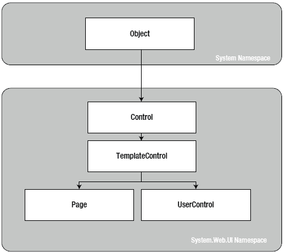
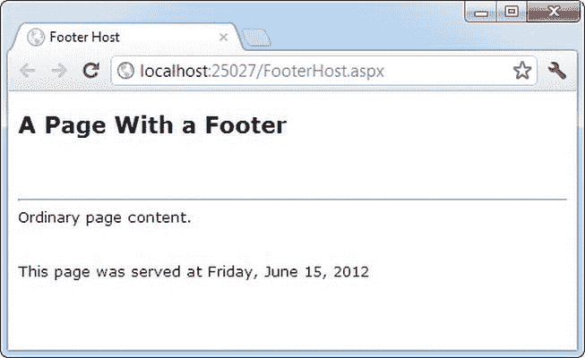
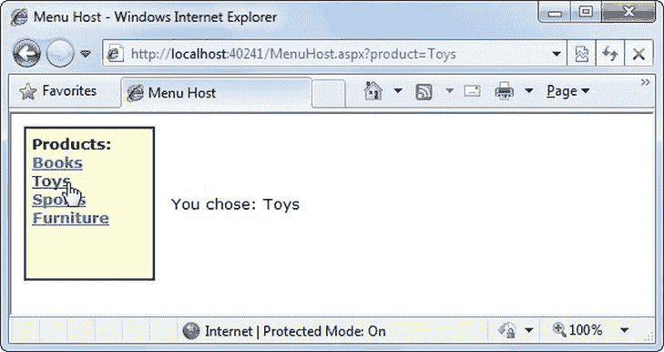
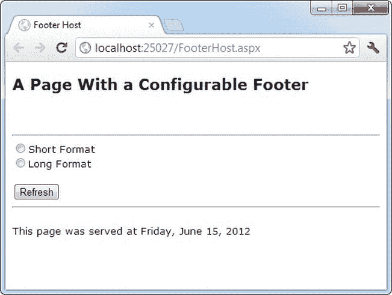
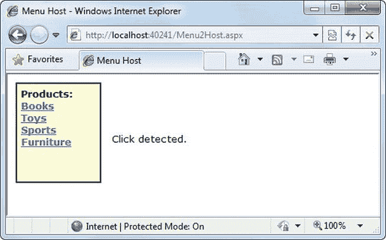
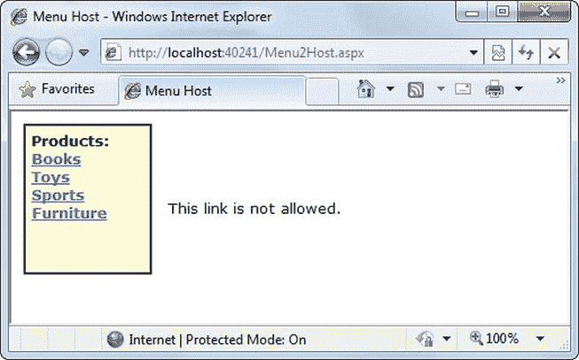
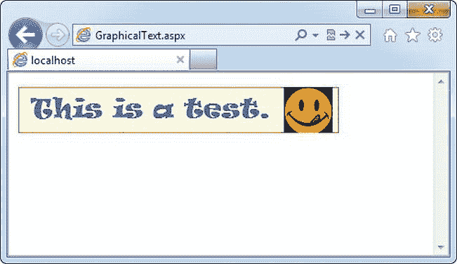
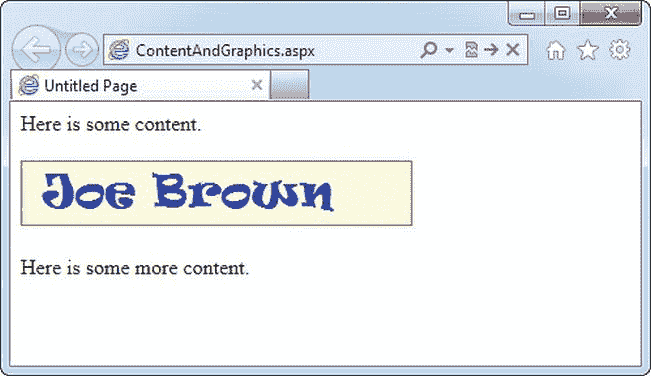
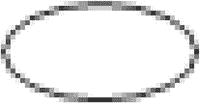
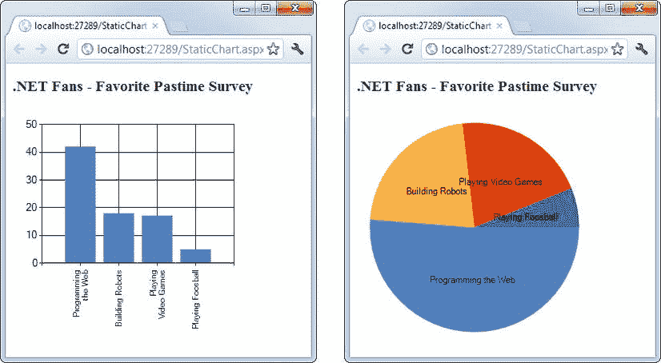

# 十一、用户控件和图形

在这一章中，你将考虑三种方法来扩展你的网页。

首先，您将处理用户控件，它为您提供了一种重用用户界面标记块的有效方法——以及随之而来的代码。用户控件是构建模块化 web 应用的关键工具。他们还可以帮助你创建一致的网站设计和重复使用你的辛勤工作。

接下来，您将使用 Microsoft Windows GDI+探索自定义绘图。您将看到如何按需绘制您需要的图像。您还将学习将动态图像合并到网页中的最佳方式。

最后，您将看到 ASP.NET 图表控件，它获取您的数据并为您绘图。最终结果是一个精美的图表，您可以将它放在 WebForm 中，与其他控件和内容放在一起。

用户控件

一个构建良好的 web 应用将其工作划分为离散的、独立的块。web 应用的模块化程度越高，维护代码、解决问题和重用关键功能就越容易。

尽管重用代码很容易(只需将代码从页面中取出，放入单独的类中)，但重用网页标记就不那么简单了。您可以剪切和粘贴 HTML 和 ASP.NET 控件标记块，但是如果您以后想更改标记，这会导致无穷无尽的麻烦。相反，您需要一种方法将网页标记包装在一个可重用的包中，就像您可以包装普通的 C#代码一样。诀窍是创建一个用户控件。

用户控件看起来与 ASP.NET web 窗体非常相似。像 WebForm 一样，它们由带有 HTML 和控件标记的标记部分组成。ascx 文件)，并且可以选择使用带有事件处理逻辑的代码隐藏文件。它们还可以包含相同范围的 HTML 内容和 ASP.NET 控件，并且它们会经历与 Page 对象相同的事件(如 Load 和 PreRender)。用户控件和网页之间的唯一区别如下:

*   User controls use the file extension .ascx instead of .aspx, and their code-behind files inherit from the System.Web.UI.UserControl class. In fact, the UserControl class and the Page class both inherit from the same base classes, which is why they share so many of the same methods and events, as shown in the inheritance diagram in [Figure 11-1](#Fig1).

    

    [图 11-1](#_Fig1) 。页面和用户控件继承链

*   那个。用户控件的 ascx 文件以指令开始，而不是以指令开始。
*   web 浏览器不能直接请求用户控件。相反，它们必须嵌入到其他网页中。

创建简单的用户控件

你可以在 Visual Studio 中创建一个用户控件，就像你添加网页一样。只需选择网站添加新项目，并从列表中选择 Web 用户控件。

下面的用户控件包含一个 Label 控件:

```cs
 <%@ Control Language="C#" AutoEventWireup="true"
     CodeFile="Footer.ascx.cs" Inherits="Footer" %>

<asp:Label id="lblFooter" runat="server" />
```

请注意，Control 指令使用网页的 Page 指令中使用的相同属性，包括 Language、AutoEventWireup 和 Inherits。

该示例用户控件的代码隐藏类同样简单明了。它使用 UserControl。加载事件以向标签添加一些文本:

```cs
public partial class Footer : System.Web.UI.UserControl
{
    protected void Page_Load(Object sender, EventArgs e)
    {
        lblFooter.Text = "This page was served at ";
        lblFooter.Text + = DateTime.Now.ToString();
    }
}
```

若要测试此用户控件，您需要将其插入网页中。这是一个两步过程。首先你需要添加一个*注册指令* 到包含用户控件的页面中。将 Register 指令放在 Page 指令之后。Register 指令标识要使用的控件，并将其与唯一的控件前缀相关联，如下所示:

```cs
 <%@ Register TagPrefix="apress" TagName="Footer" Src="Footer.ascx" %>
```

Register 指令指定标签前缀和名称。标记前缀对相关控件集进行分组(例如，所有 ASP.NET web 控件都使用标记前缀 *asp* )。标签前缀通常是小写的——从技术上讲，它们是不区分大小写的——并且对于您的公司或组织应该是唯一的。Src 指令标识用户控件模板文件的位置，而不是代码隐藏文件。

其次，您现在可以通过插入用户控件的控件标记，在页面中随时添加用户控件。考虑这个页面示例:

```cs
<%@ Page Language="C#" AutoEventWireup="true"
    CodeFile="FooterHost.aspx.cs" Inherits="FooterHost"%>
<%@ Register TagPrefix="apress" TagName="Footer" Src="Footer.ascx" %>

<!DOCTYPE html PUBLIC "-//W3C//DTD XHTML 1.1//EN"
 "http://www.w3.org/TR/xhtml11/DTD/xhtml11.dtd">

<html >
<head runat="server">
    <title> Footer Host</title>
</head>
<body>
    <form id="form1" runat="server">
    <div>
     <h1> A Page With a Footer</h1> <hr />
     Static Page Text <br /> <br />
     <apress:Footer id="Footer1" runat="server" />
    </div>
    </form>
</body>
</html>
```

这个例子(如图 11-2 所示)展示了一个简单的方法，你可以创建一个页眉或页脚，并通过添加一个用户控件在你网站的所有页面中重用它。在简单页脚的情况下，你不会保存太多代码。但是，对于具有大量格式或多个包含控件的复杂控件，这种方法将变得更加有用。



[图 11-2](#_Fig2) 。带有用户控件页脚的页面

当然，这仅仅触及了用户控件的皮毛。在下面几节中，您将学习如何用属性、方法和事件增强控件，将它从简单的“包含文件”转换成成熟的对象。

 **注意**Page 类提供了一个 LoadControl()方法，允许你在运行时从一个。ascx 文件。用户控件作为控件对象返回给您，然后您可以将其添加到网页上容器控件(如占位符或面板)的 Controls 集合中，以便在网页上显示它。这种技术不是声明性使用用户控件的好替代品，因为它更复杂。然而，如果你想动态地生成一个用户界面，它确实有一些有趣的应用。

在 Visual Studio 中，有一个有用的快捷方式可以将用户控件添加到页面中，而无需手动键入 Register 指令。首先打开您想要使用的网页。然后找到。解决方案资源管理器中用户控件的 ascx 文件。将它从解决方案资源管理器中拖放到 web 窗体的可视设计区域(不是源代码视图区域)。Visual Studio 将自动为用户控件添加 Register 指令，以及用户控件标记的实例。

另一个选项是在 web.config 文件中为 web 应用配置用户控件。下面是一个以这种方式注册页脚控件的例子:

```cs
 <configuration>
  <system.web>
    <pages>
     <controls>
        <add tagPrefix="apress" src=" ∼ Footer.ascx" tagName="Footer" />
     </controls>
    </pages>
 </system.web>
</configuration>
```

您可以向<controls>部分添加更多的<add>元素来注册任意多的用户控件。</add></controls>

当您执行这一步时，用户控件在每个页面中都可用，不需要 Register 指令。Visual Studio 还会考虑您的配置，因此如果您将用户控件放到页面上，它将使用已定义的标记前缀，而不会添加 Register 指令。

使用独立的用户控件

从概念上讲，存在两种类型的用户控件:独立的和集成的。 *独立的*用户控件不与表单上的其他代码交互。页脚用户控件就是这样一个例子。另一个例子是 LinkMenu 控件，它包含一个提供其他页面链接的按钮列表。这个 LinkMenu 用户控件可以处理所有按钮的事件，然后运行适当的响应。Redirect()代码移动到另一个网页。或者它只是一个普通的超链接控件，没有任何相关的服务器端代码。然后，网站中的每个页面都可以包含相同的 LinkMenu 用户控件，从而实现无痛的网站导航，无需担心框架。

 **注**您可以使用功能更加丰富的导航控件来提供网站导航。创建你自己的自定义控件给你一个更灵活(也更乏味)的导航方式。您最有可能使用自定义控件而不是整个站点地图在几个页面之间进行简单导航。

下面的示例定义了一个简单的控件，该控件显示了一个格式美观的链接列表。注意，为了清楚起见，省略了

标签的 style 属性(定义字体和格式)。

```cs
 <%@ Control Language="C#" AutoEventWireup="true"
     CodeFile="LinkMenu.ascx.cs" Inherits="LinkMenu" %>
<div>
 Products:<br />
 <asp:HyperLink id="lnkBooks" runat="server"
    NavigateUrl="MenuHost.aspx?product=Books"> Books
 </asp:HyperLink> <br />
 <asp:HyperLink id="lnkToys" runat="server"
    NavigateUrl="MenuHost.aspx?product=Toys"> Toys
 </asp:HyperLink> <br />
 <asp:HyperLink id="lnkSports" runat="server"
    NavigateUrl="MenuHost.aspx?product=Sports"> Sports
 </asp:HyperLink> <br />
 <asp:HyperLink id="lnkFurniture" runat="server"
    NavigateUrl="MenuHost.aspx?product=Furniture"> Furniture
 </asp:HyperLink>
</div>
```

这些链接实际上并不触发任何服务器端代码——相反，它们将自己呈现为带有硬编码 URL 的普通 HTML 锚标记。

要测试此菜单，可以使用下面的 MenuHost.aspx 网页。它包括两个控件:Menu 控件和显示产品查询字符串参数的 Label 控件。两者都是用桌子定位的。

```cs
 <%@ Page Language="C#" AutoEventWireup="true"
    CodeFile="MenuHost.aspx.cs" Inherits="MenuHost"%>
<%@ Register TagPrefix="apress" TagName="LinkMenu" Src="LinkMenu.ascx" %>

<!DOCTYPE html PUBLIC "-//W3C//DTD XHTML 1.1//EN"
 "http://www.w3.org/TR/xhtml11/DTD/xhtml11.dtd">

<html >
<head runat="server">
    <title> Menu Host</title>
</head>
<body>
    <form id="form1" runat="server">
    <div>
     <table>
        <tr>
         <td> <apress:LinkMenu id="Menu1" runat="server" /></td>
         <td> <asp:Label id="lblSelection" runat="server" /></td>
        </tr>
     </table>
    </div>
    </form>
</body>
</html>
```

当 MenuHost.aspx 页加载时，它会将适当的信息添加到 lblSelection 控件中:

```cs
protected void Page_Load(object sender, EventArgs e)
{
    if (Request.Params["product"] != null)
    {
        lblSelection.Text = "You chose: ";
        lblSelection.Text + = Request.Params["product"];
    }
}
```

图 11-3 显示了最终结果。每当您单击一个按钮时，页面就会回发，文本也会更新。



[图 11-3](#_Fig3) 。LinkMenu 用户控件

您可以使用 LinkMenu 控件在几个页面上重复相同的菜单。当您不能使用母版页来标准化布局时(可能是因为页面差异太大)，这尤其方便。

使用集成用户控件

集成用户控件以这样或那样的方式与承载它们的网页进行交互。当你设计这些控件时，你在第 4 章中学到的基于类的设计技巧真的变得很有用。

一个典型的例子是允许通过属性进行某种级别的配置的用户控件。例如，您可以创建一个支持两种显示格式的页脚:长日期和短时间。当网页使用页脚时，它将决定它想要的显示格式。它的代码将通过在 Footer 类中设置一个属性来设置格式。

为了使这个系统尽可能清晰，页脚控件使用枚举。这样，很明显就有两种格式，而且这两种格式的作用也相当明显。在设置页脚时出错也要困难得多。

您可以在 Footer 类中创建枚举。下面是它的样子:

```cs
public enum FooterFormat
{
 LongDate,
 ShortTime
}
```

请记住，枚举只是一种常量，它在内部存储为整数，但在代码中使用您指定的一个允许的名称进行设置。使用 FooterFormat 枚举的变量可以取值 FooterFormat。LongDate 或 FooterFormat.ShortTime

下一步是向 Footer 类添加一个属性，该属性允许网页检索或设置应用于页脚的当前格式。实际的格式存储在名为 format 的私有变量中，该变量在首次创建控件时默认设置为长日期格式。(如果你不清楚财产手续是如何运作的，请随意查看第 3 章中的解释。)

```cs
private FooterFormat format=FooterFormat.LongDate;

public FooterFormat Format
{
    get { return format; }
    set { format = value; }
}
```

最后是用户控件。Load 事件处理程序需要考虑当前的页脚状态，并相应地格式化输出。下面是完整的页脚类代码:

```cs
public partial class Footer : System.Web.UI.UserControl
{
    public enum FooterFormat
    { LongDate, ShortTime }

    private FooterFormat format = FooterFormat.LongDate;
    public FooterFormat Format
    {
        get { return format; }
        set { format = value; }
    }

    protected void Page_Load(Object sender, EventArgs e)
    {
        lblFooter.Text = "This page was served at ";

        if (format == FooterFormat.LongDate)
        {
            lblFooter.Text + = DateTime.Now.ToLongDateString();
        }
        else if (format == FooterFormat.ShortTime)
        {
            lblFooter.Text + = DateTime.Now.ToShortTimeString();
        }
    }
}
```

若要测试此页脚，您需要创建一个页面来修改页脚用户控件的 Format 属性。图 11-4 显示了一个示例页面，每当页面回发时，它自动设置用户控件的格式属性以匹配单选按钮的选择。



[图 11-4](#_Fig4) 。修改后的页脚

请注意，用户控件属性在页面中被修改。Load 事件处理程序，而不是 cmdRefresh。单击事件处理程序。原因是 Load 事件发生在每次创建页面时呈现用户控件之前。Click 事件在用户控件呈现后发生，虽然属性更改在您的代码中可见，但它不影响用户控件的 HTML 输出，该输出已经添加到页面中。

```cs
public partial class FooterHost : System.Web.UI.Page
{
    protected void Page_Load(Object sender, EventArgs e)
    {
        if (optLong.Checked)
        {
            Footer1.Format = Footer.FooterFormat.LongDate;
        }
        else if (optShort.Checked)
        {
            Footer1.Format = Footer.FooterFormat.ShortTime;
        }
        else
        {
            // The default value in the Footer class will apply.
        }
    }
}
```

您还可以在控件标记中设置页脚的初始外观:

```cs
 <apress:Footer Format="ShortTime" id="Footer1" runat="server" />
```

与所有 web 控件标记一样，ASP.NET 将字符串(如“ShortTime”)转换为相应的枚举值没有问题。

使用用户控制事件

用户控件和网页之间进行通信的另一种方式是通过事件。通过方法和属性，用户控件对网页代码所做的更改做出反应。对于事件，情况正好相反:用户控件通知网页一个动作，网页代码做出响应。

创建使用事件的 web 控件相当容易。在下面的示例中，您将看到一个使用事件的 LinkMenu 控件版本。当用户单击按钮时，控件不是直接导航到适当的页面，而是引发事件，网页可以选择处理该事件。

创建该控件的第一步是定义事件。请记住，要定义事件，您必须首先选择事件签名。那个。NET 事件标准规定每个事件都应该使用两个参数。第一个提供对发送事件的控件的引用，而第二个包含任何附加信息。这些附加信息被包装到一个自定义 EventArgs 对象中，该对象继承自系统。EventArgs 类。(如果您的事件不需要任何附加信息，您可以只使用预定义的 EventArgs 类，它不包含任何附加数据。ASP.NET 的很多事件，比如佩奇。加载或按钮。点击，按照这个模式。)你可以参考[第 4 章](04.html)快速了解如何在. NET 中使用事件。

LinkMenu2 控件使用单个事件，该事件指示链接何时被单击:

```cs
public partial class LinkMenu2 : System.Web.UI.UserControl
{
    public event EventHandler LinkClicked;

    ...
}
```

这段代码定义了一个名为 LinkClicked 的事件。link clicked 事件具有系统指定的签名。EventHandler 委托，它包括两个参数—事件发送者和一个普通的 EventArgs 对象。这意味着如果您想要为 LinkClicked 事件创建一个事件处理程序(例如，在一个具有 LinkMenu2 控件的网页中)，您的事件处理程序必须如下所示:

```cs
protected void LinkMenu_LinkClicked(object sender, EventArgs e)
{ ... }
```

这负责定义事件，但是如何引发它呢？这部分很简单。要激发事件，LinkMenu2 控件只需按名称调用事件并传入两个参数，如下所示:

```cs
// Raise the LinkClicked event, passing a reference to
// the current object (the sender) and an empty EventArgs object.
LinkClicked(this, EventArgs.Empty);
```

LinkMenu2 控件实际上还需要一些修改。最初的版本使用了超链接控件。这不行，因为当链接被点击时，超链接控件不会触发事件。相反，你需要使用 LinkButton。LinkButton 触发 LinkMenu2 控件可以截获的 Click 事件，然后将 LinkClicked 事件引发到网页。

以下是完整的用户控制代码:

```cs
public partial class LinkMenu2 : System.Web.UI.UserControl
{
    public event EventHandler LinkClicked;

    protected void lnk_Click(object sender, EventArgs e)
    {
        // One of the LinkButton controls has been clicked.
        // Raise an event to the page.
        if (LinkClicked != null)
        {
            LinkClicked(this, EventArgs.Empty);
        }
    }
}
```

请注意，在引发 LinkClicked 事件之前，LinkMenu2 控件需要测试 LinkClicked 事件是否有空引用。如果没有事件处理程序附加到事件，则存在空引用。在这种情况下，您不应该尝试引发事件，因为这只会导致错误。

您可以创建一个使用 LinkMenu2 控件的页面，并添加一个事件处理程序。不幸的是，您不能通过使用 Visual Studio 属性窗口来连接这些事件处理程序，因为属性窗口不会显示用户控件提供的自定义事件。相反，您需要直接修改 LinkMenu2 标记，如下所示:

```cs
<apress:LinkMenu2 id="links" runat="server" OnLinkClicked="LinkClicked" />
```

这是在网页中响应的事件处理程序:

```cs
protected void LinkClicked(object sender, EventArgs e)
{
    lblClick.Text = "Click detected.";
}
```

 **注意**你将无法通过 Visual Studio 属性窗口创建用户控件事件处理程序。相反，您需要手动键入事件处理程序。

图 11-5 显示了结果。



[图 11-5](#_Fig5) 。使用 LinkMenu2 用户控件

从概念上讲，这种方法应该给你的网页更多的权力来定制用户控件的工作方式。不幸的是，目前情况并非如此，因为缺少了一条关键信息。当 LinkClicked 事件发生时，网页无法知道单击了什么链接，这就阻止了它采取任何合理的操作。解决这个问题的唯一方法是创建一个更智能的事件，通过事件自变量传递一些信息。您将在下一节看到如何操作。

通过事件传递信息

在当前的 LinkMenu2 示例中，没有自定义信息随事件一起传递。但是，在许多情况下，您希望传达与事件相关的附加信息。为此，您需要创建一个从 EventArgs 派生的自定义类。

下面的 LinkClickedEventArgs 类允许 LinkMenu2 用户控件传递用户通过 Url 属性选择的 URL。它还提供了一个取消属性。如果设置为 true，用户控件将立即停止处理。但是如果 Cancel 保持为 false(默认值)，用户控件会将用户发送到新页面。这样，用户控件仍然处理重定向用户的任务，但它允许网页插入到该进程中，并更改或停止该进程(例如，如果当前页面上还有未完成的工作)。

```cs
public class LinkClickedEventArgs : EventArgs
{
    public string Url {get; set;}
    public bool Cancel {get; set;}

    public LinkClickedEventArgs(string url)
    {
        Url = url;
    }
}
```

要使用这个自定义 EventArgs 类，您需要修改 LinkClicked 事件的定义，以便它使用 LinkClickedEventArgs 对象。下面是您需要在 LinkMenu2 类中进行的更改:

```cs
public event EventHandler <LinkClickedEventArgs> LinkClicked;
```

正是泛型的魔力让这一切得以实现。本质上，您正在配置通用 EventHandler 类以使用您想要的 EventArgs 类——在本例中是 LinkClickedEventArgs。

接下来，引发事件的用户控件代码需要在调用事件时提交所需的信息。但是用户控件如何确定点击了哪个链接呢？诀窍是从 LinkButton 切换。单击链接按钮的事件。命令事件。Command 事件自动获取标记中定义的 CommandArgument。所以如果一个网页像这样定义你的 LinkButton 控件:

```cs
 <asp:LinkButton ID="lnkBooks" runat="server"
  CommandArgument="Menu2Host.aspx?product=Books" OnCommand="lnk_Command"> Books
</asp:LinkButton> <br />
<asp:LinkButton ID="lnkToys" runat="server"
 CommandArgument="Menu2Host.aspx?product=Toys" OnCommand="lnk_Command"> Toys
</asp:LinkButton> <br />
<asp:LinkButton ID="lnkSports" runat="server"
 CommandArgument="Menu2Host.aspx?product=Sports" OnCommand="lnk_Command"> Sports
</asp:LinkButton> <br />
<asp:LinkButton ID="lnkFurniture" runat="server"
 CommandArgument="Menu2Host.aspx?product=Furniture" OnCommand="lnk_Command">
Furniture</asp:LinkButton>
```

```cs
the LinkMenu2 control can pass the link along to the web page like this, when it raises the event:
```

```cs
LinkClickedEventArgs args = new LinkClickedEventArgs((string)e.CommandArgument);
LinkClicked(this, args);
```

这是完整的用户控制代码。它实现了另一个特性。网页引发并处理该事件后，LinkMenu2 检查 Cancel 属性。如果为 false，代码将继续执行，并使用 Reponse 执行重定向。重定向()。

```cs
public partial class LinkMenu2 : System.Web.UI.UserControl
{
    public event EventHandler <LinkClickedEventArgs> LinkClicked;

    protected void lnk_Command(object sender, CommandEventArgs e)
    {
        // One of the LinkButton controls has been clicked.
        // Raise an event to the page.
        if (LinkClicked != null)
        {
            // Pass along the link information.
            LinkClickedEventArgs args =
             new LinkClickedEventArgs((string)e.CommandArgument);
            LinkClicked(this, args);

            // Perform the redirect.
            if (!args.Cancel)
            {
                // Notice we use the Url from the LinkClickedEventArgs
                // object, not the original link. That means the web page
                // can change the link if desired before the redirect.
                Response.Redirect(args.Url);
            }
        }
    }
}
```

最后，您需要更新网页(放置用户控件的位置)中的代码，以便其事件处理程序使用新的签名。在下面的代码中，LinkClicked 事件处理程序检查 URL，并在除一种情况之外的所有情况下允许它:

```cs
protected void LinkClicked(object sender, LinkClickedEventArgs e)
{
    if (e.Url == "Menu2Host.aspx?product=Furniture")
    {
        lblClick.Text = "This link is not allowed.";
        e.Cancel = true;
    }
    else
    {
        // Allow the redirect, and don’t make any changes to the URL.
    }
}
```

如果你点击家具链接，你会看到如图[图 11-6](#Fig6) 所示的信息。这确认了您的用户控件可以与页面通信，它不仅会引发事件，还会传输一些有用的信息。



[图 11-6](#_Fig6) 。处理页面中的用户控件事件

动态图形

的特性之一。NET Framework 是 Windows GDI+，是一组为绘制图像而设计的类。您可以在 Windows 或 ASP.NET 应用中使用 GDI +来创建动态图形。在 Windows 应用中，您绘制的图形将被复制到窗口中进行显示。在 ASP.NET，您的代码可以呈现您想要的图形，并将它们直接发送到客户端浏览器。

一般来说，使用 GDI +代码绘制图形比使用现成的图像文件要慢。然而，GDI +给了你更多的自由。例如，您可以将日期或当前用户名等信息融入到图像中，以适应特定的用途。您还可以混合文本、形状和其他位图来创建完整的图片。

HTML5 画布

如果你玩过 HTML5，你会知道这种新语言增加了一个叫做 Canvas 的特性。很简单，画布是一个客户端绘图工具。它是在页面上定义的矩形绘图表面，然后使用 JavaScript 命令填充。

因为画布使用 JavaScript，所以它在客户端的浏览器中进行绘制(而 GDI +在 web 服务器上完成工作)。这具有重要的后果——例如，这意味着画布几乎肯定比 GDI+慢，并且画布不会在所有浏览器和设备上得到支持(不像 GDI+，它将其工作转换为所有浏览器都能理解的普通图形)。然而，画布有一个显著的优势:因为工作发生在客户端，开发人员可以创建响应用户动作的动态图形。例如，很容易用画布制作一个绘图应用，它使用 JavaScript 在用户涂鸦的地方画一条线。同样的壮举在 GDI+上是不可能的，因为你需要在每次鼠标移动后将页面发送回 web 服务器来更新图像。

底线是:GDI +是呈现静态图形的最佳解决方案，而 Canvas 是创建需要动态绘制能力的 JavaScript 支持的小程序的有前途的工具。如果你想了解更多关于画布和 HTML5 的知识，请查阅 *HTML5:丢失的手册* (O'Reilly，2011)。

创建基本图纸

在开始之前，您应该导入系统。绘图命名空间，其中包含 GDI +使用的类:

```cs
using System.Drawing;
```

使用 GDI+时需要遵循四个基本步骤。首先你必须创建一个内存位图。这是你创作杰作的绘图空间。若要创建位图，请声明系统的新实例。绘图。位图类。您必须以像素为单位指定图像的高度和宽度。小心——不要让位图比需要的大，否则你会不必要地浪费内存。

```cs
// Create an in-memory bitmap where you will draw the image.
// The Bitmap is 300 pixels wide and 50 pixels high.
Bitmap image = new Bitmap(300, 50);
```

下一步是为图像创建一个 GDI +图形上下文，它由一个系统表示。绘图。图形对象。这个对象提供了将内容渲染到内存位图的方法。要从现有的位图对象创建图形对象，只需使用静态图形。FromImage()方法，如下所示:

```cs
Graphics g = Graphics.FromImage(image);
```

 **注**中的图形。FromImage()方法适用于任何图像对象。位图之类的类是从 Image 派生的，所以它们工作得很好。

现在有趣的部分来了。使用 Graphics 类的方法，可以在位图上绘制文本、形状和图像。表 11-1 列出了 Graphics 类的一些最基本的方法。以单词*开头的方法绘制*绘制轮廓，而以单词*开头的方法填充*绘制实心区域。唯一的例外是 DrawString()方法，它使用您指定的字体绘制填充文本，以及复制位图图像的方法，如 DrawIcon()和 DrawImage()。

[表 11-1。](#_Tab1)图形类的绘制方法

| 方法 | 描述 |
| --- | --- |
| DrawArc()的绘制 | 绘制一个弧，表示由一对坐标、一个宽度和一个高度(或者其他一些信息的组合，如果使用此方法的重载版本之一)指定的椭圆的一部分。 |
| DrawBezier()和 DrawBeziers() | 绘制臭名昭著而又吸引人的贝塞尔曲线，它由四个控制点定义。 |
| DrawClosedCurve() | 绘制一条曲线，然后通过连接端点将其闭合。 |
| 绘制曲线() | 绘制曲线(技术上，基数样条)。 |
| DrawEllipse() | 绘制由一对坐标、高度和宽度指定的边框定义的椭圆。 |
| DrawIcon()和 DrawIconUnstretched() | 绘制由 icon 对象表示的图标，并(可选地)拉伸它以适合给定的矩形。 |
| DrawImage()和 DrawImageUnscaled() | 绘制由图像派生的对象(如位图对象)表示的图像，并(可选地)拉伸它以适合给定的矩形。 |
| 绘制线()和绘制线() | 绘制一条或多条线。每条线连接由坐标对指定的两个点。 |
| DrawPie() | 绘制由坐标对、宽度、高度和两条径向线指定的椭圆定义的“饼图”形状。 |
| DrawPolygon() | 绘制由点数组定义的多边多边形。 |
| DrawRectangle()和 draw 矩形() | 绘制一个或多个普通矩形。每个矩形由起始坐标对、宽度和高度定义。 |
| 拉绳() | 用给定的字体绘制一串文本。 |
| DrawPath() | 绘制由 Path 对象定义的更复杂的形状。 |
| FillClosedCurve() | 绘制一条曲线，通过连接端点来闭合它，并填充它。 |
| FillEllipse() | 填充椭圆的内部。 |
| 菲尔皮() | 填充“饼图”形状的内部。 |
| FillPolygon() | 填充多边形的内部。 |
| 填充矩形()和填充矩形() | 填充一个或多个矩形的内部。 |
| FillPath() | 填充由 Path 对象定义的复杂形状的内部。 |

当调用 Graphics 类方法时，您需要指定几个参数来指示您想要绘制的像素坐标。例如，在绘制矩形时，需要指定左上角的位置及其宽度和高度。以下是如何绘制黄色实心矩形的示例:

```cs
// Draw a rectangle starting at location (0, 0)
// that is 300 pixels wide and 50 pixels high.
g.FillRectangle(Brushes.Yellow, 0, 0, 300, 50);
```

测量像素时，点(0，0)是图像在(x，y)坐标中的左上角。越向右，x 坐标越大，越向下，y 坐标越大。在当前示例中，图像宽 300 像素，高 50 像素，这意味着点(299，49)在右下角。

 **注意**这段代码在之前创建的内存位图对象上执行绘制。在呈现这个图像之前(您很快就会掌握这项技能)，您实际上看不到网页上的任何内容。

您还会注意到，在绘制大多数内容时，您需要指定画笔或钢笔对象。(这两个类都在系统中定义。绘图命名空间，在 Graphics 类旁边。)绘制形状轮廓的方法需要钢笔，而绘制填充形状的方法需要画笔。您可以创建自己的自定义钢笔和画笔对象，但是。NET 用 Brushes 和 Pens 类提供了一个更简单的解决方案。这些类公开了为不同颜色提供各种画笔和钢笔的静态属性。比如刷子。Yellow 返回用纯黄色填充形状的 Brush 对象和 Pens。Yellow 返回一个 Pen 对象，该对象用同样的纯黄色绘制形状轮廓。

当图像完成时，您可以使用该图像将其发送到浏览器。Save()方法。从概念上讲，你将图像“保存”到浏览器的响应流中。然后它被发送到客户端并显示在浏览器中。

```cs
// Render the image to the HTML output stream.
Response.ContentType = "image/gif";
image.Save(Response.OutputStream,
 System.Drawing.Imaging.ImageFormat.Gif);
```

 **提示**你可以将图像保存到任何有效的流中，包括在[第 17 章](17.html)中描述的 FileStream 类。这种技术允许您将动态生成的图像保存到磁盘，以便以后在其他网页中使用它们。

最后，当你完成时，你应该显式地释放你的图像和图形上下文，因为两者都持有一些非托管资源，如果你不这样做，它们可能不会马上被释放:

```cs
g.Dispose();
image.Dispose();
```

使用 GDI +是一项专门的技术，其更高级的特性超出了本书的范围。然而，通过考虑几个简单的例子，您可以学到很多东西。

绘制自定义图像

使用你所学的技术，很容易创建一个使用 GDI+的简单网页。下一个例子使用 GDI +在一个有边框的矩形中呈现一些文本，旁边有一个笑脸图形。

以下是您需要的代码:

```cs
protected void Page_Load(Object sender, EventArgs e)
{
    // Create an in-memory bitmap where you will draw the image.
    // The Bitmap is 300 pixels wide and 50 pixels high.
    Bitmap image = new Bitmap(300, 50);

    // Get the graphics context for the bitmap.
    Graphics g = Graphics.FromImage(image);

    // Draw a solid yellow rectangle with a red border.
    g.FillRectangle(Brushes.LightYellow, 0, 0, 300, 50);
    g.DrawRectangle(Pens.Red, 0, 0, 299, 49);

    // Draw some text using a fancy font.
    Font font = new Font("Alba Super", 20, FontStyle.Regular);
    g.DrawString("This is a test.", font, Brushes.Blue, 10, 0);

    // Copy a smaller gif into the image from a file.
    // This code assumes smiley.gif is in the root website root.
    System.Drawing.Image icon =
     System.Drawing.Image.FromFile(Server.MapPath("smiley.gif"));
    g.DrawImageUnscaled(icon, 240, 0);

    // Render the entire bitmap to the HTML output stream.
    Response.ContentType = "image/gif";
    image.Save(Response.OutputStream,
     System.Drawing.Imaging.ImageFormat.Gif);

    // Clean up.
    g.Dispose();
    image.Dispose();
}
```

这段代码很容易理解。它遵循前面阐述的基本模式——创建内存位图，获取相应的图形对象，执行绘制，然后将图像保存到响应流。本例使用 FillRectangle()、DrawRectangle()、DrawString()和 DrawImageUnscaled()方法创建如图 11-7 所示的完整绘图。



[图 11-7](#_Fig7) 。绘制自定义图像

 **提示**因为这个图像是在网络服务器上生成的，所以你可以使用服务器上安装的任何字体。客户端不需要相同的字体，因为客户端接收的文本是呈现的图像。

在网页中放置自定义图像

图像。到目前为止演示的 Save()方法有一个问题。当您将图像保存到响应流中时，您将覆盖 ASP.NET 否则会使用的任何信息。如果您的网页包含其他内容和控件，则这些内容根本不会出现在最终的网页中。相反，动态呈现的图形会替换它。

幸运的是，这有一个简单的解决方案:您可以通过使用 HTML 标签或 Image web 控件链接到动态生成的图像。但是不要将图像链接到固定的图像文件，而是将它链接到。生成图片的 aspx 文件。

例如，您可以创建一个名为 GraphicalText.aspx 的文件，将动态生成的图像写入响应流。在另一页中，您可以通过添加一个 Image web 控件并将 ImageUrl 属性设置为 GraphicalText.aspx 来显示动态图像，实际上，在运行网页之前，您甚至会看到图像出现在 Visual Studio 的设计时环境中！

当您使用这种技术在 web 页面中嵌入动态图形时，您还需要考虑 web 页面如何向动态图形发送信息。例如，如果您不想显示一段固定的文本，而是希望生成一个包含当前用户姓名的动态标签，该怎么办？(事实上，如果您确实想显示一段固定的文本，最好提前创建图形并将其存储在一个文件中，而不是每次用户请求页面时都使用 GDI +代码来生成它。)一种解决方案是通过使用查询字符串来传递信息，如第 8 章中的[所述。呈现图形的页面然后可以检查它需要的查询字符串信息。](08.html)

考虑到这一点，您应该这样重写动态图形生成器:

```cs
// Get the username.
if (Request.QueryString["Name"] == null)
{
    // No name was supplied.
    // Don’t display anything.
}
else
{
    string name = Request.QueryString["Name"];

    // Create an in-memory bitmap where you will draw the image.
    Bitmap image = new Bitmap(300, 50);

    // Get the graphics context for the bitmap.
    Graphics g = Graphics.FromImage(image);

    g.FillRectangle(Brushes.LightYellow, 0, 0, 300, 50);
    g.DrawRectangle(Pens.Red, 0, 0, 299, 49);

    // Draw some text based on the query string.
    Font font = new Font("Alba Super", 20, FontStyle.Regular);
    g.DrawString(name, font, Brushes.Blue, 10, 0);

    // Render the entire bitmap to the HTML output stream.
    Response.ContentType = "image/gif";
    image.Save(Response.OutputStream,
     System.Drawing.Imaging.ImageFormat.Gif);

    g.Dispose();
    image.Dispose();
}
```

从概念上讲，这段代码与您之前看到的示例没有太大的不同。唯一的变化是从查询字符串中检索了一条信息——与 DrawString()方法一起使用的字符串。

图 11-8 显示了一个使用这个动态图形页面的页面，以及两个标签控件。页面将查询字符串参数 Joe Brown 传递给页面。完整的图像。ImageUrl 就这样变成了 GraphicalText.aspx？Name=Joe%20Brown，如下所示:



[图 11-8](#_Fig8) 。在同一页面上混合自定义图像和控件

```cs
 <asp:Label id="Label1" runat="server"> Here is some content.</asp:Label>
<br /> <br />
<asp:Image id="Image1" runat="server"
 ImageUrl="GraphicalText.aspx?Name=Joe%20Brown"> </asp:Image>
<br /> <br />
<asp:Label id="Label2" runat="server"> Here is some more content.</asp:Label>
```

您可能需要向绘制图像的页面发送更多或更复杂的信息。例如，您可能希望将数据对象传递给绘制饼图的页面。在这种情况下，查询字符串不够好，您需要使用不同类型的状态管理。一个选项是会话状态，如第 8 章中的[所述。(另一种选择是用 ASP 完全避免这个问题。NET 自带的图表控件，你会在本章后面看到。)](08.html)

选择图像格式和质量

渲染图像时，也可以选择想要使用的格式。JPEG 提供了最好的颜色支持和图形，尽管它使用的压缩会丢失细节并使文本看起来模糊。对于包含文本的图形来说，GIF(目前示例中使用的标准)通常是更好的选择，但是它没有提供很好的颜色支持。英寸 NET 中，每个 GIF 都使用一个固定的调色板，有 256 种通用颜色。如果您使用的颜色没有映射到这些预设中的任何一个，该颜色将会抖动，从而导致图形达不到最佳效果。

然而，最好的格式选择是 PNG。 PNG 是一种通用格式，通过结合 gif 的无损压缩和 JPEGs 丰富的颜色支持，始终提供高质量。(唯一的问题是，Internet Explorer 之前的版本不能正确处理从网页返回的 PNG 内容。如果您使用的是 IE 的旧版本，您将看不到图片内容，而是会收到一条消息，提示您下载图片并在另一个程序中打开它。为了回避这个问题，您需要使用前面例子中所示的< img >标记方法。)

使用 PNG 时，您还需要注意一个奇怪的地方——您不能使用位图。Save()方法如前面的示例所示。如果这样做，将会出现错误。从技术上来说，问题在于 Save()方法需要一个*可查找的*流——一个可以随意改变位置的流。那是因为。NET 需要能够在图片生成时在图片内容中来回移动。

这个解决方案很容易实现，尽管有点笨拙。而不是直接保存到响应中。OutputStream，可以创建一个系统。IO.MemoryStream 对象，表示数据的内存缓冲区。MemoryStream 总是可查找的，因此您可以将图像保存到该对象中。执行此步骤后，您可以轻松地将数据从 MemoryStream 复制到 Response.OutputStream。唯一的缺点是这种技术需要更多内存，因为图形的完整呈现内容需要一次保存在内存中。然而，您在网页中使用的图形通常不会很大，所以您可能不会观察到任何性能下降。

要实现这个解决方案，首先要导入系统。IO 命名空间:

```cs
using System.IO;
```

现在，您可以用修改后的代码替换前面的示例，将图像保存为 PNG 格式。已更改的行会突出显示。

```cs
// Get the username.
if (Request.QueryString["Name"] == null)
{
    // No name was supplied.
    // Don’t display anything.
}
else
{
    string name = Request.QueryString["Name"];

    // Create an in-memory bitmap where you will draw the image.
    Bitmap image = new Bitmap(300, 50);

    // Get the graphics context for the bitmap.
    Graphics g = Graphics.FromImage(image);

    g.FillRectangle(Brushes.LightYellow, 0, 0, 300, 50);
    g.DrawRectangle(Pens.Red, 0, 0, 299, 49);

    // Draw some text based on the query string.
    Font font = new Font("Alba Super", 20, FontStyle.Regular);
    g.DrawString(name, font, Brushes.Blue, 10, 0);

    Response.ContentType = "image/png";

    // Create the PNG in memory.
    MemoryStream mem = new MemoryStream();
    image.Save(mem, System.Drawing.Imaging.ImageFormat.Png);

    // Write the MemoryStream data to the output stream.
    mem.WriteTo(Response.OutputStream);

    g.Dispose();
    image.Dispose();
}
```

 **注意**当你在[第 17 章](17.html)中处理文件访问时，你会学到更多关于流的知识。

质量不仅仅由图像格式决定。它还取决于您将图像内容绘制到内存位图上的方式。GDI +允许你在优化你的绘图代码的外观和速度之间进行选择。当您选择优化以获得最佳外观时。NET 使用额外的呈现技术(如抗锯齿)来改善绘图。

*抗锯齿*平滑形状和文本中的锯齿边缘。它的工作原理是在边缘添加阴影。例如，可以将灰色阴影添加到黑色曲线的边缘，使拐角看起来更平滑。从技术上讲，抗锯齿将曲线与其背景混合在一起。[图 11-9](#Fig9) 显示了一个反走样椭圆的特写。



[图 11-9](#_Fig9) 。用椭圆抗锯齿

若要在应用中使用平滑，请设置 Graphics 对象的 SmoothingMode 属性。您可以在无、高速(默认)、抗锯齿和高质量(类似于抗锯齿，但使用其他较慢的优化来改善 LCD 屏幕上的显示)之间进行选择。图形。SmoothingMode 属性是少数有状态图形类成员之一。这意味着您在开始绘制之前设置它，它将应用于您在其余绘制会话中绘制的任何文本或形状(直到释放图形对象)。

```cs
g.SmoothingMode = System.Drawing.Drawing2D.SmoothingMode.AntiAlias;
```

 **提示**当你显示曲线时，抗锯齿效果最好。这意味着它将极大地改善椭圆、圆和弧的外观，但对直线、正方形和矩形没有任何影响。

您也可以对字体使用抗锯齿来柔化文本的锯齿边缘。您可以设置图形。TextRenderingHint 属性来确保优化的文本。您可以在 SingleBitPerPixelGridFit(最快的性能和最低的质量)、AntiAliasGridFit(较好的质量，但性能较慢)和 ClearTypeGridFit(LCD 显示器上的最佳质量)之间进行选择。或者您可以使用系统默认值来应用用户配置的任何字体平滑设置。SystemDefault 是默认设置，大多数计算机的默认系统设置都启用文本抗锯齿。即使你不设置这个，你的动态渲染文本也可能会以高质量绘制。但是，因为您不一定能控制 web 服务器的系统设置，所以如果您需要在图像中绘制文本，最好明确指定该设置。

图表控件

正如您在上一节中看到的，GDI +绘图框架允许您创建任何您能想象到的图形内容。狡猾的开发人员用它来构建定制的图形、图表和信息图。(其实你可以在 C# 的*Pro ASP.NET 4.5 中找到一个这样的例子。)然而，尽管这样的例子在概念上很简单——您的代码接受一些数字，进行一些计算，并绘制条形图或饼图来表示结果——但获得一个漂亮的、视觉上吸引人的结果却很乏味。创建一个好的图表需要大量的修改和测试。*

幸运的是，有一条巨大的捷径。感谢 ASP。NET 的图表控件，开发人员很少需要从头开始构建自己的图表。在幕后，图表控件使用 GDI +函数创建一个图像，然后显示在网页中。不同之处在于，您不需要接触任何实际的绘图代码。相反，您只需为图表提供正确的数据，选择您想要的图表类型，设置一些其他属性以自定义其呈现方式，并享受最终结果。

 **注意**该图表包含了一系列惊人的特性，包括一些令人印象深刻的可定制性和性能增强选项。事实上，它需要几个完整的章节来涵盖图表的功能。在下一节中，您将简单地体验一下图表控件是如何工作的以及它能做什么。你将在[第 16 章](16.html)中重温它(在那里你将使用从数据库中提取的数据)，但如果你想了解更多，你需要在`http://msdn.microsoft.com/library/dd489242`开始实验或阅读 MSDN 网站上的图表文档。

创建基本图表

当您向页面中添加一个全新的图表控件时，Visual Studio 会注册该图表控件，以便它可以在您的网页中使用。它通过在网页标记的开头添加这样的指令来实现:

```cs
<%@ Register Assembly="System.Web.DataVisualization, Version=4.0.0.0, ..." TagPrefix="asp" %>
```

Visual Studio 还使用如下标记向您的页面添加了图表控件的新实例:

```cs
 <asp:Chart ID="Chart1" runat="server">
 <Series>
    <asp:Series Name="Series1">
    </asp:Series>
 </Series>
 <ChartAreas>
    <asp:ChartArea Name="ChartArea1">
    </asp:ChartArea>
 </ChartAreas>
</asp:Chart>
```

敏锐的眼睛会注意到这张图表分为两个关键部分。第一部分，<series>，保存您想要在图表上绘制的数据，并配置其呈现方式。在这里，您可以设置从图表类型(例如，折线图与饼图)到更精细的细节(例如，图例文本和用于数据点的标记样式)的所有内容。第二部分，<图表区域>，让您影响图表的其余部分——换句话说，显示在数据后面和周围的区域。您可以使用此部分来控制图表阴影、应用 3D 效果以及设置轴的比例。</series>

考虑到这一点，创建一个超级简单的图表并不需要太多的工作。以下示例创建了一个包含四个扇区的饼图:

```cs
<h3> .NET Fans - Favorite Pastime Survey</h3>
<asp:Chart ID="passtimeChart" runat="server">
 <Series>
    <asp:Series ChartType="Pie">
     <Points>
        <asp:DataPoint AxisLabel="Programming the Web" YValues="42" />
        <asp:DataPoint AxisLabel="Building Robots" YValues="18" />
        <asp:DataPoint AxisLabel="Playing Video Games" YValues="17" />
        <asp:DataPoint AxisLabel="Playing Foosball" YValues="5" />
     </Points>
    </asp:Series>
 </Series>
 <ChartAreas>
    <asp:ChartArea Name="chartArea">
    </asp:ChartArea>
 </ChartAreas>
</asp:Chart>
```

要构建此图表，首先要创建一系列数据。定义系列时，通过将 ChartType 属性设置为 35 种不同图表类型之一来选择图表类型:

```cs
 <asp:Series ChartType="Pie">
 ...
</asp:Series>
```

 **注**更复杂的图表有多个系列。例如，如果您创建了一个比较不同商店随时间变化的销售数字的折线图，则每个商店都有自己的线条，而每条线条都是一个单独的系列。

在系列中，您创建了一个数据点集合。创建四扇区饼图需要四个数据点。但是，您可以通过更改一个系列属性，将显示切换到完全不同(但同样有效)的柱形图:

```cs
 <asp:Series ChartType="Column">
```

[图 11-10](#Fig10) 对比饼状图和柱形图。



[图 11-10](#_Fig10) 。两种图表类型中的相同数据

当您运行这个示例并查看为页面生成的 HTML 标记时，您会发现图表由一个冗长的标记组成，如下所示:

```cs
 
```

这里，ASP.NET 使用了你在自定义 GDI +示例中看到的技术的变体。它添加了一个标签，指向生成您想要的图像内容的 ASP.NET 页面。这种情况下的不同之处在于，ASP.NET 使用的是虚拟页面，而不是实际存储在你网站上的 WebForm。(换句话说，没有实际的 ChartImg.axd 文件。当 asked 收到对该页面的请求时，它知道它被要求执行图表制作，并触发相应的图表绘制代码。)

使用其他方式获取图表数据

显然，现实的应用不太可能在页面标记中记录它的数据。相反，您更有可能通过代码中的一些计算来生成数据，或者简单地从数据库中获取数据。只要您给系列命名，您就可以在代码中访问它，并添加您需要的所有数据点。例如，如果您的系列看起来像这样:

```cs
 <asp:Series Name="passtimes" ChartType="Pie" />
```

您可以使用以下代码以编程方式创建与前面看到的相同的图表:

```cs
protected void Page_Load(Object sender, EventArgs e)
{
    // Find the right series.
    var passtimeSeries = passtimeChart.Series["passtimes"];

    // Add the points to the series.
    passtimeSeries.Points.AddXY("Programming the Web", 42);
    passtimeSeries.Points.AddXY("Building Robots ", 18);
    passtimeSeries.Points.AddXY("Playing Video Games", 17);
    passtimeSeries.Points.AddXY("Playing Foosball", 5);
}
```

有了这种技术，您需要做的就是重新编写代码，以便它检索或计算您真正想要使用的数据。只要您将其调整到足够大的大小，ASP.NET 图表控件就可以处理成百上千的数据点。

通常，您要绘制图表的数据来自外部来源，如文件或数据库。在本书的后面，您将学习如何从这两种类型的存储中读取数据。在您知道如何读取数据之后，使用前面的系列访问技术，您通常只需要一个简单的循环就可以将数据复制到图表中。但是，如果您正在处理一个数据库，您可以选择使用一种更强大的快捷方式，称为数据绑定，将所有数据直接复制到一个图表中，而无需编写一两行以上的代码。您将从第 15 章开始详细探索数据绑定。

 **提示**当你将业务数据与使其脱颖而出的时髦格式相结合时，真正的图表魔力就出现了。虽然我们在本章中没有涉及，但是图表控件配备了令人眼花缭乱的格式化特性来定制每一个图形细节。了解其格式化能力的一个好方法是下载微软的图表控件示例，其中包括 200 个图表实例。你可以在`http://tinyurl.com/chartsamples`拿到样品。顺便提一下，这些示例同时提供了 ASP.NET 和 Windows 窗体版本，因为有一个用于桌面应用的图表控件的 Windows 版本，它实际上与您将使用的 ASP.NET 版本相同。

最后一句话

在这一章中，你在你的 ASP.NET 工具箱中增加了三个工具。首先，您看到了用户控件如何允许您在多个网页中重用用户界面块。接下来，您考虑了自定义绘图如何允许您创建定制的图形。最后，您看到了如何利用图表控件，不费吹灰之力就能得到专业定制的图表。

在下一章中，您将了解主题和母版页，这两个功能补充了用户控件，并为您提供了更多方法来标准化您的网页的外观和感觉。主题比用户控件粒度更细，它们将可应用于单个控件的格式预设组合在一起，以确保整个应用具有流畅、一致的风格。母版页比用户控件更广泛，它们允许您定义标准化的页面模板，您可以应用该模板来锁定多个页面的外观和布局，从而为您提供完全的一致性。学习如何混合所有这些成分是 ASP.NET 编程艺术的一部分。