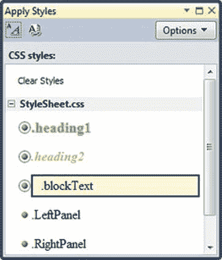
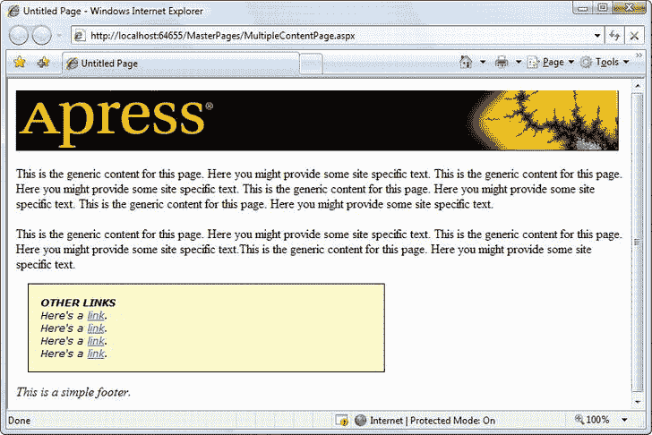

# 十二、样式，主题，以及母版页

使用您到目前为止所学的技术，您可以创建精美的网页，并让用户从一个页面浏览到另一个页面。然而，要将您的网页集成到一个统一、一致的网站中，您还需要一些工具。在这一章中，你将考虑三个你可以使用的最重要的工具:样式、主题和母版页。

样式是层叠样式表(CSS)标准的一部分。它们与 ASP.NET 没有直接的联系，但是它们对于在你的整个网站上应用一致的格式仍然有很大的帮助。使用样式，您可以一次定义一组格式选项，然后重用它来格式化多个页面上的不同元素。您甚至可以创建自动应用其魔力的样式，例如，无需修改任何网页代码即可更改网站中所有文本的字体的样式。最重要的是，一旦你通过一组特定的样式实现了标准化，并将它们应用于多个页面，你就可以通过编辑你的样式表使你的整个网站焕然一新。

风格真的很有用，但是有些事情他们就是做不到。因为样式是基于 HTML 标准的，它们不理解 ASP.NET 概念比如控件属性。为了填补这个空白，ASP.NET 增加了一个*主题*功能，它的作用和样式类似，但是只和服务器控件一起工作。就像使用样式来自动设置 HTML 元素的格式特征一样，使用主题来自动设置 ASP.NET 控件的属性。

标准化网站的另一个特点是*母版页*。本质上，母版页是网站一部分的蓝图。使用母版页，您可以定义网页布局，包括常见的细节，如标题、菜单栏和广告横幅。一旦你完善了一个母版页，你就可以用它来创建*内容页* 。每个内容页自动获取链接母版页的布局和内容。

通过使用样式、主题和母版页，您可以确保网站上的所有页面共享标准化的外观和布局。在许多情况下，这些细节是一个普通网站和一个看起来真正专业的网站之间的区别。

风格

在互联网的早期，网站设计者使用 HTML 的格式化功能来装饰这些页面。这些格式特性是有限的、不一致的，有时还不太受支持。最糟糕的是，HTML 格式导致了可怕的混乱标记，格式细节随处可见。

解决方案是 CSS 标准，它在所有现代浏览器中都受到支持(有一些差异)。本质上，CSS 为您提供了广泛的一致的格式属性，您可以将其应用于任何 HTML 元素。样式允许您添加边框、设置字体细节、更改颜色、添加边距和填充等等。到目前为止，你在本书中看到的许多例子都使用了 CSS 格式。

在接下来的部分中，您将学习 CSS 标准的基础知识。您将看到 web 控件如何使用 CSS 来应用*它们的*格式，并且您将学习如何在您的 ASP.NET 网页中显式地使用样式。

 **注意**CSS 标准不是一个单一的、通用的标准，对所有浏览器都具有完全的通用性。相反，它存在于几个版本中(直到 CSS3 ),包含了并非所有浏览器都支持的特性和浏览器以不同方式实现的特性。(网站`http://caniuse.com`)是一个很好的资源，可以帮助你了解哪些浏览器版本支持哪些 CSS 功能，以及什么时候在你的网站上使用 CSS 功能是比较“安全”的。在这一章中，你将关注 CSS 的子集，它在所有现代浏览器中都有很好的支持和高度的一致性。

样式类型

网页可以通过三种不同的方式使用样式:

*   *内联样式* : 内联样式是直接放在 HTML 标签内部的样式。这可能会很麻烦，但对于一次性格式化来说，这是一种合理的方法。您可以删除该样式，然后将其放入样式表中。
*   *内部样式表* : 内部样式表是放置在网页标记的< head >部分的样式集合。然后，您可以使用该样式表中的样式来设置该页面上的 web 控件的格式。通过使用内部样式表，您可以清楚地区分格式(您的样式)和内容(您的 HTML 标记的其余部分)。您也可以对多个元素重复使用相同的样式。
*   *外部样式表* : 外部样式表类似于内部样式表，只是它放在一个完全独立的文件中。这是最强大的方法，因为它为您提供了一种将相同的样式规则应用于许多页面的方法。

您可以对 ASP.NET 网页使用所有类型的样式。您将在接下来的章节中看到如何操作。

创建基本内联样式

要将样式应用于普通的 HTML 元素，需要设置 style 属性。下面是一个为段落提供蓝色背景的示例:

```cs
<p style="background: Blue">This text has a blue background.</p>
```

每种样式都由一个或多个格式属性的列表组成。在前面的示例中，样式有一个名为 *background* 的格式化属性，该属性被设置为值 Blue。要添加多个样式属性，只需用分号分隔它们，如下所示:

```cs
<p style = "color:White; background:Blue; font-size:x-large; padding:10px">
This text has a blue background.</p>
```

这种样式创建大的白色文本，背景为蓝色，元素边缘(蓝色框)和内部文本内容之间的间距为 10 个像素。

 **注意**格式化属性的完整列表超出了本书的范围(尽管您可以在`http://www.w3schools.com/css`获得所有细节)。但是，您很快就会看到，Visual Studio 包含了可以帮助您构建所需样式的工具，因此您不需要记住样式属性名称或手动编写样式。

您可以使用相同的方法将格式应用于使用样式的 web 控件；但是，您不需要这样做，因为 web 控件提供了格式化属性。例如，假设您创建了一个标签控件，如下所示:

```cs
<asp:Label ID = "MyLabel" runat = "server" ForeColor = "White" BackColor = "Blue"
 Font-Size = "X-Large"> Formatted Text</asp:Label>
```

它实际上呈现在这个 HTML 中，这个 HTML 使用了一种内联样式:

```cs
<span id = "MyLabel" style = "color:White; background-color:Blue; font-size:X-Large">
Formatted Text</span>
```

顺便说一句，如果你指定了一个主题*并且设置了与你的样式重叠的格式属性，那么这些属性有最终的决定权。*

样式生成器

Visual Studio 提供了一个不可或缺的样式生成器，它允许您通过在专用对话框中选择样式首选项来创建样式。要试用它，首先在 Visual Studio 中创建一个新页面。然后将一些控件放到页面上(例如，标签、文本框和按钮)。

每个新页面都以一个空的

元素开始。这个只是一个内容容器——默认情况下，它没有任何外观。但是，通过对应用样式设置，您可以创建一个带边框的内容区域，并且可以更改内容的字体和颜色。在这个例子中，您将看到如何使用 Visual Studio 为元素构建样式。

 **注意** CSS 支持一个它称之为*继承*的特性。通过继承，一些格式属性(如字体系列)从父元素传递到其他嵌套元素。换句话说，如果您为一个< div >元素设置了字体系列，里面的所有元素都将继承相同的字体(除非它们另外明确指定)。其他属性，如边距和填充设置，不使用继承。要了解更多关于这种行为和使用继承的特定属性的信息，您可以自己尝试，查阅专门的书籍，如 Eric Meyer 的 *CSS:权威指南* (O'Reilly)，或者使用(`http://www.w3schools.com/css`)上的教程。

例如，假设你想创建一个包含一些控件的简单页面，比如图 12-1 所示的标签、文本框和按钮。在格式化页面之前，确保所有的控件都嵌套在< div >元素中。您的标记应该如下所示:


[图 12-1](#_Fig1) 。给< div >添加一个样式

```cs
 <div>
    <asp:Label ID = "Label1" runat = "server"> Type something here:
    </asp:Label>
    <asp:TextBox ID = "TextBox1" runat = "server">
    </asp:TextBox>
    <br /> <br />
    <asp:Button ID = "Button1" runat = "server" Text = "Button">
    </asp:Button>
</div>
```

在设计窗口中，单击

内的某个位置(但不是在另一个控件上)。当你的控件周围出现一个边框，显示出的轮廓时，你就知道你在正确的位置，如图[图 12-1](#Fig1) 所示。

接下来，从菜单中选择格式新样式。这将打开如图 12-2 中[所示的新样式对话框。在窗口顶部的选择器框中，选择“(内联样式)”以指定您直接在 HTML 标记中创建样式。](#Fig2)


[图 12-2](#_Fig2) 。创建内联样式

要指定样式设置，首先需要在类别列表中选择一个类别。例如，如果您选择“字体”,您将看到与字体相关的格式设置列表，如字体系列、字体大小、文本颜色等。您可以根据需要应用任意多个不同类别的设置。表 12-1 对每一类别进行了简要说明。

[表 12-1](#_Tab1) 。“新建样式”对话框中的样式设置

和

| 种类 | 描述 |
| --- | --- |
| 字体 | 允许您选择字体系列、字体大小和文本颜色，并应用其他字体特征(如斜体和粗体)。 |
| 街区 | 允许您微调附加文本设置，如段落中的行高、文本对齐方式、第一个列表中的缩进量以及字母和单词之间的间距。 |
| 背景 | 允许您设置背景颜色或图像。 |
| 边境 | 允许您在元素的一条或多条边上定义边框。您可以指定每条边的边框样式、粗细和颜色。 |
| 包厢 | 允许您定义边距(元素边缘与其容器之间的空间)和填充(元素边缘与其内部嵌套内容之间的空间)。 |
| 位置 | 允许您为元素设置固定的宽度和高度，并使用绝对定位将元素放置在页面上的特定位置。小心使用这些设置。当你使你的元素大小固定时，里面的内容可能会变得太大(在这种情况下，它会从底部或侧面泄漏出去)。当您使用绝对坐标定位元素时，它可能会与另一个元素重叠。 |
| 布局 | 允许您控制各种布局设置。您可以指定元素是可见的还是隐藏的，它是否浮动在页面的一侧，以及当用户将鼠标移动到顶部时出现的光标，以及其他设置。 |
| 目录 | 如果您正在配置列表(一个

 |
| 桌子 | 允许您设置仅适用于表格元素的细节(如 |
| )。例如，您可以控制空白单元格周围是否出现边框。 |

 **注意**记住，你可以为任何 HTML 元素构建样式，而不仅仅是< div >元素。您将总是得到完全相同的新样式对话框，具有相同的格式选项。

当您做出选择时，Visual Studio 会显示您的样式应用于某些示例文本(在预览框中)和定义您的样式所需的标记(在说明框中)时的外观。图 12-3 显示了将< div >格式化成一个漂亮的阴影和边框后的新样式对话框。在类别列表中，所有带有格式设置的类别都以粗体突出显示。


[图 12-3](#_Fig3) 。建立一个有风格的部门

单击“确定”时，Visual Studio 会将样式信息添加到元素中。下面是格式化的

框的标记:

```cs
 <div style = "border-style: solid; border-color: inherit; border-width: 1px;
  padding: 5px; font-size: smaller; font-family: Verdana;
  background-color: #ffffcc">
    <asp:Label ID = "Label1" runat = "server"> Type something here:
    </asp:Label>
    <asp:TextBox ID = "TextBox1" runat = "server">
    </asp:TextBox>
    <br /> <br />
    <asp:Button ID = "Button1" runat = "server" Text = "Button">
    </asp:Button>
</div>
```

图 12-4 显示了最终的结果——一个有一点填充和不同字体的黄色阴影框。


[图 12-4](#_Fig4) 。使用有风格的分区

 **提示**小心不要给你的< div >一个固定的尺寸。通常，< div >容器会扩展以适应其内容。但是，如果您在 Visual Studio 中拖动它的边框以使< div >变大，您实际上会创建一个硬编码的宽度和高度，它们是在 style 属性中设置的。最终结果是，如果内容扩展或者 web 浏览器窗口改变大小，您的< div >容器就不能扩展。这样一来，你的内容就会从盒子里漏出来。

CSS 属性窗口

一旦创建了样式，在 Visual Studio 中有两个简单的选项来修改它。两者都围绕 CSS 属性窗口，该窗口允许您剖析任何样式的格式细节。

要显示 CSS 属性窗口，请在 Visual Studio 中打开一个网页，然后选择 View  CSS Properties。CSS 属性窗口通常与属性窗口组合在一起，尽管你会发现把它拖到网页左边的工具箱窗口会更有用，如图 12-5 所示。


[图 12-5](#_Fig5) 。CSS 属性窗口(在左侧)

一旦 CSS 属性窗口可见，您就可以使用它来查看您的样式之一。首先，找到使用 style 属性的元素或 web 控件。然后，在“设计”视图中单击选择它。该元素的样式信息将出现在 CSS 属性窗口中。例如，[图 12-5](#Fig5) 显示了你将会看到的在前面章节中被格式化的< div >元素。

“CSS 属性”窗口提供了可以在样式中使用的所有格式属性的详尽列表。该列表按类别分组，每个类别中的属性按字母顺序排序。当前设置的以粗体显示。

您可以使用“CSS 属性”窗口修改现有的样式属性或设置新的样式属性，就像使用“属性”窗口修改 web 控件的属性一样。例如，在[图 12-5](#Fig5) 中，字体大小被改变。

根据您的个人喜好，您可能会发现 CSS 属性窗口比样式生成器更方便，因为它让您可以一次访问每个样式属性。或者，您可能更喜欢样式生成器中更有条理的视图。(您的偏好可能还取决于您必须为 CSS 属性窗口分配多少屏幕空间。)如果您决定返回到样式生成器来更改样式，过程相当简单。首先，选择具有内联样式的元素。接下来，查看 CSS 属性窗口顶部的应用规则列表，它应该显示文本< inline style >。右键单击该文本，然后选择“修改样式”以打开“修改样式”对话框，该对话框看起来与您之前考虑的“新建样式”对话框相同。

 **注意**你不能使用 CSS 属性窗口来创建样式。如果选择没有应用样式的元素，则在“CSS 属性”窗口中看不到任何内容(除非选择位于另一个元素内部的元素，并且包含该元素的元素使用了样式)。

风格继承

CSS 属性窗口实际上比当前讨论的要复杂一些。它不仅显示当前元素的样式，还显示应用于包含元素的任何样式。例如，如果您查看格式化的

中的元素，您将看到应用于的样式。如果不止一种样式在起作用(例如，包含在另一个格式化的中，或者您已经向元素添加了一种样式)，您将在列表中看到所有这些样式，最通用的在顶部，最具体的在底部。您可以在列表中选择想要的样式进行修改。

CSS 属性显示嵌套元素的样式，因为某些样式属性通过继承传递到元素树中，例如字体设置。其他样式属性可以间接影响嵌套元素，例如，背景颜色不会被继承，但是因为元素背景默认为空白，所以包含元素的背景会显示出来。很容易看到这种行为在起作用——例如，在前面的例子中应用于

元素的字体和背景属性影响了内部元素的格式。

当显示继承的样式时，CSS 属性窗口有时会在属性名上画一条红线。如果在父元素中设置了属性，但该属性不适用于嵌套元素，则会执行此操作。例如，嵌套元素可能会用自己的样式重写它，或者可能不会继承该属性。[图 12-6](#Fig6) 显示了一个例子，在一个样式化的< div >中有一个样式化的< p >段落。从< div >继承的样式定义了 font-family 属性(被继承)、font-size 属性(被继承但被覆盖，并被删除)和各种边框属性(未被继承，因此也被删除)。


[图 12-6](#_Fig6) 。继承和重写的样式属性

创建样式表

要真正从 CSS 中获得价值，您需要创建一个样式表。要在 Visual Studio 中创建样式表，请从 Visual Studio 菜单中选择网站添加新项目。然后，选择样式表模板，指定文件名(如 StyleSheet.css ),并单击 Add。

在一个样式表中，你定义了几种样式(也称为*规则*)。然后，您可以使用这些规则来格式化普通的 HTML 和 ASP.NET 控件。每个规则都定义了一组格式预设，这些预设决定了网页中的单个元素应该如何设置格式。

例如，如果您想要定义一个格式化标题的规则，您可以从定义一个具有描述性名称的规则开始，如下所示:

```cs
.heading1
{
}
```

每个规则名称都有两个部分。句点之前的部分表示规则适用的 HTML 元素。在本例中，句点之前没有出现任何内容，这意味着该规则可以应用于任何标签。句点之后的部分是一个惟一的名称(称为 CSS *类名*),您选择它来标识您的规则。CSS 类名区分大小写。

一旦定义了规则，就可以添加适当的格式信息。下面的示例将 heading1 样式设置为大的无衬线字体，前景色为绿色。字体设置为 Verdana(如果可用)，或 Arial(如果不可用)，或浏览器的默认 sans serif 字样(如果 Verdana 和 Arial 均未安装)。

```cs
.heading1
{
    font-weight: bold;
    font-size: large;
    color: limegreen;
    font-family: Verdana, Arial, Sans-Serif;
}
```

如您所见，在样式表中定义样式的语法与定义内部样式的语法完全相同(不包括规则名和花括号)。按照惯例，样式中的每个格式选项都放在单独的一行上，但是这个细节是可选的。

您还可以创建自动应用于 HTML 标签的规则。为此，为规则名指定标记名。这里有一个影响使用样式表的页面上所有< h2 >标签的规则:

```cs
h2
{ ... }
```

如果您想采用适用于整个网页的格式，您可以为元素创建一个样式表规则:

```cs
body
{ ... }
```

这为您提供了一个设置默认字体名称和字体大小的好方法。

幸运的是，您不需要在样式表中手写规则。Visual Studio 允许您使用以前创建内联样式时使用的同一样式生成器在样式表中生成命名样式。要使用这个特性，添加一个带有正确规则名称的空白样式，就像这样:

```cs
.myStyle
{
}
```

然后右键单击现有样式的两个花括号，并选择“构建样式”。你会看到熟悉的修改样式对话框，在这里你可以点击自定义字体、边框、背景和对齐方式。如果您想从头开始创建新的样式，只需右键单击样式表的空白区域，然后选择“添加样式规则”。

典型的样式表定义了一系列规则。事实上，样式表通常用于正式定义网站用户界面的每个重要部分的格式。下面的样式表通过定义四个规则来实现这个目的。第一个规则为元素设置字体，确保整个页面共享一致的默认字体。其余的规则是基于类的，需要明确地应用于使用它们的元素。两个规则定义了标题的大小和颜色格式，最后一个规则配置了创建带边框和阴影的文本框所需的格式。

```cs
body
{
    font-family: Verdana, Arial, Sans-Serif;
    font-size: small;
}
.heading1
{
    font-weight: bold;
    font-size: large;
    color: lime;
}
.heading2
{
    font-weight: bold;
    font-size: medium;
    font-style: italic;
    color: #C0BA72;
}
.blockText
{
    padding: 10px;
    background-color: #FFFFD9;
    border-style: solid;
    border-width: thin;
}
```

CSS 大纲窗口

Visual Studio 包括一个 CSS 大纲窗口，该窗口提供样式表中规则的概述。当您编辑样式表时，您可以通过选择视图其他窗口文档大纲来显示 CSS 大纲窗口。[图 12-7](#Fig7) 显示了前一个样式表的轮廓。它清楚地表明您的样式表包括一个元素规则(格式化主体的规则)和三个类规则。通过在 CSS 大纲窗口中单击特定规则，可以立即跳转到该规则。


[图 12-7](#_Fig7) 。使用 CSS 大纲窗口导航样式表

规则名在技术上被称为*选择器*，因为它们标识了 HTML 文档中应该被选择用于格式化的部分。您已经看到了如何编写使用元素类型的选择器和使用类名的选择器。CSS 还支持一些构建高级选择器的选项，这在本章中没有描述。例如，您可以创建仅适用于容器中特定元素类型*的选择器(例如，特定< div >元素中的标题)。或者，您可以创建选择器，将格式应用于具有特定 ID 值的单个元素。(这些显示在“CSS 大纲”窗口的“元素 id”组下。)要了解更多关于 CSS 的知识，可以参考一本专门的书，比如 *CSS:权威指南*。*

应用样式表规则

要在网页中使用规则，首先需要将页面链接到适当的样式表。这可以通过在页面的部分添加一个<link>元素来实现。元素引用了你想要使用的样式的文件。这里有一个例子，它允许页面使用文件 StyleSheet.css 中定义的样式，假设它与 web 页面在同一个文件夹中:

```cs
 <html>
 <head runat = "server">
    <title> ...</title>
    <link href = "StyleSheet.css" rel = "stylesheet" />
 </head>
 <body>
    ...
 </body>
</html>
```

没有理由手工附加样式表。一个更简单的选择是从解决方案资源管理器中拖动样式表，并将其放到网页的设计图面上(或者源代码视图中的部分)。Visual Studio 会自动插入你需要的<link>元素。

 **提示**在 web 应用中，还有一种方法可以将网页连接到样式表:使用菜单。编辑您的网页时，切换到设计更多并选择格式附加样式表。这将显示一个对话框，其中列出了项目中的样式表。选择您想要的(通常只有一个)，然后点按“好”。

一旦添加了<link>元素，您的样式规则就可以在您的网页中使用了。您可以将任何普通的 HTML 元素或 ASP.NET 控件绑定到您的样式规则。例如，如果希望普通标签使用 heading1 格式，请设置标签。CssClass 属性设置为 heading1，如下所示:

```cs
 <asp:Label ID = "Label1" runat = "server" Text = "This Label Uses heading1"
 CssClass = "heading1"> </asp:Label>
```

还可以从“属性”窗口设置 CssClass 属性，在这种情况下，可以从链接样式表中定义的样式列表中进行选择。

要对普通的 HTML 应用样式，需要设置 class 属性。下面是一个将样式应用于

元素的示例，该元素将一段文本组合在一起以便于格式化:

```cs
 <div class = "blockText" id = "paragraph" runat = "server">
 <p> This paragraph uses the blockText style.</p>
</div>
```

顺便说一下，您可以添加多个<link>元素，从几个不同的样式表中导入样式。但是，您需要注意不要使用两个定义同名样式的样式表。

应用样式窗口

同样，您不需要手动编辑标记。您可以使用 Visual Studio 的“应用样式”窗口将样式附加到网页中的元素。要显示应用样式窗口，请打开您的网页并选择查看应用样式。“应用样式”窗口出现在左侧，带有工具箱和服务器资源管理器，就像您到目前为止看到的其他 CSS 窗口一样。

应用样式窗口显示附加样式表中所有可用样式的列表，以及每个样式的预览(见[图 12-8](#Fig8) )。要应用样式，只需在网页上选择一个元素，然后在“应用样式”窗口中单击适当的样式。要删除当前样式，请选择列表中的第一个选项，名为“清除样式”。



[图 12-8](#_Fig8) 。使用“应用样式”窗口应用样式

Visual Studio 足够智能，可以根据您在网页中选择的内容来确定应用样式的适当方式:

*   如果选择一个 web 控件，它会添加或更改 CssClass 属性。
*   如果选择一个普通的 HTML 元素，它会添加或更改 class 属性。
*   如果您选择 HTML 内容的一部分，它会添加一个或元素(取决于您选择的内容类型),然后设置它的 class 属性。

 **提示**点击应用样式窗口中的选项按钮来调整它的工作方式。例如，您可以选择以不同的顺序预览样式，或者只包括当前网页中正在使用的样式。

一旦应用了样式，您将在设计窗口中看到新格式的结果。

创建更多样式

在本章的开始，你看到了如何使用新建样式对话框来创建一个内嵌样式，它将所有的格式嵌入到受影响元素的标签中(就像一个

元素)。这为您提供了 CSS 的所有格式化功能，但是它创建了您无法重用的混乱的标记。内联样式适用于一次性格式化任务，但对于想要在整个网站中重复使用的格式化“预设”来说，它们不是一个好的选择。

现在你知道了如何创建一个外部样式表，值得指出的是新的样式对话框也可以使用它们。事实上，在编辑网页时，您可以使用“新建样式”对话框在外部样式表中创建新样式，就像创建新的内联样式一样。为此，请按照下列步骤操作:

1.  在设计视图中选择一个元素，然后选择格式新建样式。
2.  在“定义于”框中，选择“现有样式表”，并从 URL 列表中选择样式表文件。
3.  在选择框中，键入一个句点，后跟要创建的样式的名称(如. heading2)。
4.  最后，配置格式，并单击 OK。

当您遵循此过程时，Visual Studio 会将样式信息添加到链接的样式表中。你甚至不需要打开链接的 CSS 文件。(当然，如果你仍然想创建一个内联样式，没有人会阻止你——像往常一样，只需在选择框中选择“(内联样式)”。)

使用样式表完成两件事。首先，它使你的布局标准化，这样你就可以快速地格式化页面，而不会引入小错误或特殊情况。第二，它将格式信息分开，这样它就不会出现在你的网页中，这样你就可以修改格式，而不用跟踪每一页。尽管 CSS 不是一个以. NET 为中心的标准，Visual Studio 仍然为它提供了丰富的支持。

主题

有了 CSS 样式的便利，您可能想知道为什么开发人员还需要更多。问题是 CSS 规则被限制在一组固定的样式属性中。它们允许您重用特定的格式细节(字体、边框、前景和背景颜色等等)，但是它们显然不能控制 ASP.NET 控件的其他方面。例如，CheckBoxList 控件包括控制如何将项目组织成行和列的属性。虽然这些属性会影响控件的视觉外观，但它们超出了 CSS 的范围，所以您需要手动设置它们。此外，您可能希望随格式一起定义控件的部分行为。例如，您可能希望标准化 Calendar 控件的选择模式或 TextBox 中的换行。这显然不可能通过 CSS 实现。

主题功能填补了这一空白。像 CSS 一样，主题允许您定义一组可以应用于多个页面中的控件的样式细节。然而，与 CSS 不同，主题不是由浏览器实现的。相反，ASP.NET 在创建页面时会处理你的主题。

 **注意**主题不能代替风格。而是相辅相成。当您希望对 web 控件和普通 HTML 元素应用相同的格式时，样式特别有用。当您想要配置无法用 CSS 定制的控件属性时，主题是必不可少的。

主题如何工作

所有主题都是特定于应用的。要在 web 应用中使用主题，您需要创建一个定义它的文件夹。此文件夹需要放在 App_Themes 文件夹中，该文件夹必须放在 web 应用的顶级目录中。换句话说，一个名为 SuperCommerce 的 web 应用可能在 super commerce \ App _ Themes \ FunkyTheme 文件夹中有一个名为 funky theme 的主题。一个应用可以包含多个主题的定义，只要每个主题位于一个单独的文件夹中。在给定页面上，一次只能有一个主题处于活动状态。

要真正让你的主题完成任何事情，你需要在主题文件夹中创建至少一个皮肤文件。一个*皮肤文件*是带有。皮肤延伸。ASP.NET 从不直接提供皮肤档案；相反，它们在幕后用来定义一个主题。

皮肤文件本质上是一个控制标签列表——带有一点扭曲。外观文件中的控件标记不需要完全定义控件；他们只需要设置您想要标准化的属性。例如，如果您试图应用一致的配色方案，您可能只对设置诸如 ForeColor 和 BackColor 之类的属性感兴趣。当您在外观文件中为 ListBox 添加控件标记时，它可能如下所示:

```cs
 <asp:ListBox runat = "server" ForeColor = "White" BackColor = "Orange"/>
```

runat = "server "部分始终是必需的。其他都是可选的。您应该避免在皮肤文件中设置 id 属性，因为包含 ListBox 的页面需要为实际网页中的控件定义一个唯一的名称。

是创建多个外观文件，还是将所有控件标记放在一个外观文件中，这取决于您。这两种方法是等效的，因为 ASP.NET 将主题目录中的所有皮肤文件都视为同一个主题定义的一部分。通常，将复杂控件(如数据控件)的控件标记放在单独的外观文件中是有意义的。[图 12-9](#Fig9) 更详细地展示了主题和皮肤之间的关系。


[图 12-9](#_Fig9) 。主题和皮肤

 **提示**ASP.NET 没有任何预定义的主题。这意味着你需要从头开始创建自己的主题，或者从`http://www.asp.net`等网站下载主题样本。

应用简单的主题

要向您的项目添加主题，请选择网站添加新项目，然后选择皮肤文件。Visual Studio 将警告您需要将外观文件放在 App_Themes 文件夹的子文件夹中，并询问您这是否是您想要的。如果选择“是”，Visual Studio 将创建一个与主题文件同名的文件夹。然后，您可以将文件夹和文件重命名为您想要使用的名称。[图 12-10](#Fig10) 显示了一个包含单一皮肤文件的主题的例子。


[图 12-10](#_Fig10) 。解决方案资源管理器中的主题

不幸的是，Visual Studio 不包括任何用于创建主题的设计时支持，因此您需要从其他网页复制并粘贴控件标记。

下面是一个示例外观文件，它为几个常见控件设置背景色和前景色:

```cs
<asp:ListBox runat = "server" ForeColor = "White" BackColor = "Orange"/>
<asp:TextBox runat = "server" ForeColor = "White" BackColor = "Orange"/>
<asp:Button runat = "server" ForeColor = "White" BackColor = "Orange"/>
```

要在网页中应用主题，需要将页面指令的主题属性设置为主题的文件夹名称。

```cs
 <%@ Page Language = "C#" AutoEventWireup = "true" ... Theme = "FunkyTheme" %>
```

现在，ASP.NET 会自动在你的网站中寻找一个名为 AppThemes\FunkyTheme 的文件夹，并扫描该主题中的所有皮肤文件。

您可以手动进行此更改，也可以在设计时在“属性”窗口中选择 DOCUMENT 对象，然后设置 Theme 属性(它提供了一个方便的下拉列表，列出了所有 web 应用的主题)。Visual Studio 将相应地修改页面指令。

当您将主题应用到页面时，ASP.NET 会考虑您的网页上的每个控件，并检查您的皮肤文件以查看它们是否为该控件定义了任何属性。如果 ASP.NET 在外观文件中找到匹配的标记，则外观文件中的信息将重写控件的当前属性。(如果您的 CSS 样式影响了同一个控件，它可以覆盖主题，因为主题是在服务器上设置的，而样式是在浏览器中应用的。然而，尽可能避免这种重叠的格式。)

图 12-11 显示了将 FunkyTheme 应用到一个简单页面的结果。您会注意到冲突的设置(如列表框的现有背景)被覆盖。但是，不冲突的更改(例如按钮的自定义字体)会保留在原位。


[图 12-11](#_Fig11) 。主题化前后的简单页面

注意这个例子演示了默认的主题。使用这种方法时，主题设置不会出现在 Visual Studio 设计环境中。这意味着在浏览器中启动页面之前，您无法看到页面的真实外观。如果这造成了太多的问题，请考虑使用 SkinID 属性(稍后在“为同一控件创建多个外观”一节中描述)来显式配置每个控件。使用这种方法时，主题外观将出现在 Visual Studio 中。

处理主题冲突

如您所见，当控件和主题之间的属性发生冲突时，主题获胜。但是，在某些情况下，您可能希望更改此行为，以便您的控件可以通过专门重写某些细节来微调主题。ASP.NET 为您提供了这个选项，但是它是一个全有或全无的设置，适用于整个页面上的所有控件。

要进行这种更改，只需使用 StyleSheetTheme 属性，而不是 Page 指令中的 Theme 属性。(样式表的名称表明该设置更像 CSS。)这里有个例子:

```cs
 <%@ Page Language = "C#" AutoEventWireup = "true" ... StyleSheetTheme = "FunkyTheme" %>
```

现在 ListBox 控件的自定义黄色背景优先于主题指定的背景色。图 12-12 显示了结果和一个潜在的问题。因为前景色已改为白色，所以现在看不到大文本框中的文字。重叠的格式规范可能会导致这样的问题，这就是为什么使用 Theme 属性让您的主题完全控制通常更好。


[图 12-12](#_Fig12) 。使控件标签优先于主题

 **注意**可以同时使用 Theme 属性和 StyleSheetTheme 属性，这样一些设置总是被应用(那些在 Theme 属性中的),而另一些只有在控件中没有被指定时才被应用(那些在 StyleSheetTheme 属性中的)。然而，在实践中，这种设计非常混乱，不推荐使用。

另一个选择是配置特定的控件，让它们完全退出主题化过程。为此，只需将网页上控件的 EnableTheming 属性设置为 false。ASP.NET 仍会将主题应用于页面上的其他控件，但会跳过您已配置的控件。

```cs
 <asp:Button ID = "Button1" runat = "server" ... EnableTheming = "false" />

```

将主题应用到整个网站

使用页面指令，您可以将一个主题绑定到一个页面。然而，您可能决定您的主题已经准备好为整个 web 应用进行推广了。应用这个主题最干净的方法是在你的应用的 web.config 文件中配置<页面>元素，如下所示:

```cs
<configuration>
  <system.web>
    <pages theme = "FunkyTheme">
     ...
    </pages>
  </system.web>
</configuration>
```

如果要使用样式表行为，以便主题不会覆盖冲突的控件属性，请使用 StyleSheettheme 属性而不是 Theme:

```cs
<configuration>
  <system.web>
    <pages styleSheetTheme = "FunkyTheme">
     ...
    </pages>
  </system.web>
</configuration>
```

无论哪种方式，当您在 web.config 文件中指定主题时，该主题将应用于网站中的所有页面，前提是这些页面没有自己的主题设置。如果页面指定了主题属性，则页面设置将优先于 web.config 设置。如果您的页面用空字符串(Theme = " ")指定了 Theme 或 StyleSheetTheme 属性，则不会应用任何主题。使用这种技术，将主题应用到 web 应用的一部分也很容易。例如，您可以为每个子文件夹创建一个单独的 web.config 文件，并使用<页面>设置来配置不同的主题。

为同一个控件创建多个皮肤

将每个控件锁定为一种格式有利于标准化，但对于现实应用来说可能不够灵活。例如，您可能有几种类型的文本框，根据它们的使用位置或包含的数据类型来区分。标签更有可能不同，这取决于它们是用于标题还是正文。幸运的是，ASP.NET 允许您为同一个控件创建多个声明。

通常，如果你为同一个控件创建了多个主题，ASP.NET 会给出一个构建错误，提示你每个控件只能有一个默认的皮肤。为了解决这个问题，您需要通过提供 SkinID 属性来创建一个命名的皮肤。这里有一个例子:

```cs
<asp:ListBox runat = "server" ForeColor = "White" BackColor = "Orange" />
<asp:TextBox runat = "server" ForeColor = "White" BackColor = "Orange" />
<asp:Button runat = "server" ForeColor = "White" BackColor = "Orange" />
<asp:TextBox runat = "server" ForeColor = "White" BackColor = "DarkOrange"
 Font-Bold = "True" SkinID = "Dramatic"/>
<asp:Button runat = "server" ForeColor = "White" BackColor = "DarkOrange"
 Font-Bold = "True" SkinID = "Dramatic"/>

```

问题是命名皮肤不会像默认皮肤一样自动应用。若要使用命名外观，需要将网页上控件的 SkinID 设置为匹配。您可以从 Visual Studio 根据您定义的所有外观名称创建的下拉列表中选择该值，也可以手动键入该值:

```cs
 <asp:Button ID = "Button1" runat = "server" ... SkinID = "Dramatic" />

```

如果你不喜欢主题的选择加入模式，你可以给你的皮肤命名。这样，除非设置控件的 SkinID，否则它们永远不会被应用。

如果你试图使用一个不存在的皮肤名称，ASP.NET 足够聪明来捕捉它，在这种情况下，你会得到一个构建警告。然后，该控件的行为就像您将 EnableTheming 设置为 false 一样，这意味着它将忽略相应的默认外观。

 **提示**skin id 不需要唯一。对于每个控件，它必须是唯一的。例如，假设您想要创建一组使用稍小字体的替代外观控件。这些控件与您的整体主题相匹配，但是它们在显示大量信息的页面上非常有用。在这种情况下，您可以创建新的 Button、TextBox 和 Label 控件，并为每个控件指定相同的皮肤名称(如 Smaller)。

更高级的皮肤

到目前为止，主题化示例应用了相对简单的属性。但是，您可以在皮肤文件中创建更详细的控件标记。大多数控件属性支持主题化。如果一个属性不能在主题中声明，当你试图启动你的应用时，你会收到一个构建错误。

例如，许多控件支持指定一系列格式信息的样式。数据控件是一个例子，日历控件提供了另一个例子。以下是如何在皮肤文件中定义日历样式以匹配您的主题:

```cs
 <asp:Calendar runat = "server" BackColor = "White" ForeColor = "Black"
 BorderColor = "Black" BorderStyle = "Solid" CellSpacing = "1"
 Font-Names = "Verdana" Font-Size = "9 pt" Height = "250px" Width = "500px"
 NextPrevFormat = "ShortMonth" SelectionMode = "Day">
 <SelectedDayStyle BackColor = "DarkOrange" ForeColor = "White" />
 <DayStyle BackColor = "Orange" Font-Bold = "True" ForeColor = "White" />
 <NextPrevStyle Font-Bold = "True" Font-Size = "8 pt" ForeColor = "White" />
 <DayHeaderStyle Font-Bold = "True" Font-Size = "8 pt" ForeColor = "#333333"
    Height = "8 pt" />
 <TitleStyle BackColor = "Firebrick" BorderStyle = "None" Font-Bold = "True"
    Font-Size = "12 pt" ForeColor = "White" Height = "12 pt" />
 <OtherMonthDayStyle BackColor = "NavajoWhite" Font-Bold = "False"
    ForeColor = "DarkGray" />
</asp:Calendar>
```

该外观定义了 Calendar 控件的字体、颜色和样式。它还设置选择模式、月份导航链接的格式以及日历的整体大小。因此，使用这个格式化的日历只需要下面的 streamlined 标记:

```cs
 <asp:Calendar ID = "Calendar1" runat = "server" />
```

 **注意**当你创建指定尺寸等细节的皮肤时，要小心。当这些设置应用于页面时，它们可能会导致布局发生变化，从而产生意想不到的后果。如果您有疑问，请设置一个 SkinID，以便仅当控件明确选择时才应用皮肤。

另一个强大的技术是通过使图像成为你的主题的一部分来重用它们。例如，假设您完善了一个图像，您想在整个网站中使用确定按钮，另一个图像用于所有取消按钮。实现这种设计的第一步是将图像添加到主题文件夹中。对于最好的组织来说，创建一个或多个子文件夹来存放图像是有意义的。在本例中，图像存储在名为 ButtonImages 的文件夹中(见[图 12-13](#Fig13) )。


[图 12-13](#_Fig13) 。将图像添加到主题

现在，您需要创建使用这些图像的皮肤。在这种情况下，这两个标签都应该被命名为皮肤。这是因为您正在定义一种特定类型的标准化按钮，该按钮在页面需要时应该可用。你*没有*定义一个适用于所有按钮的默认样式。

```cs
<asp:ImageButton runat = "server" SkinID = "OKButton"
 ImageUrl = "Buttonimg/buttonOK.jpg" />
<asp:ImageButton runat = "server" SkinID = "CancelButton"
 ImageUrl = "Buttonimg/buttonCancel.jpg" />
```

当您在外观文件中添加对图像的引用时，请始终确保图像 URL 相对于主题文件夹，而不是存储页面的文件夹。当该主题应用于控件时，ASP.NET 会自动在 URL 的开头插入 App_Themes\ThemeName 部分。

现在要应用这些图像，只需在您的网页中创建一个 ImageButton，它引用相应的皮肤名称:

```cs
<asp:ImageButton ID = "ImageButton1" runat = "server" SkinID = "OKButton" />
<asp:ImageButton ID = "ImageButton2" runat = "server" SkinID = "CancelButton" />
```

您可以使用相同的技术为其他使用图像的控件创建外观。例如，您可以标准化 TreeView 的节点图片、用于 BulletList 控件的项目符号图像或 GridView 中使用的图标。

动态应用主题

在某些情况下，主题不是用来标准化网站外观，而是让每个用户都可以配置外观。要实现这种设计，您只需简单地设置页面。主题或页面。在代码中动态设置 StyleSheetTheme 属性。例如，设置页面。主题添加到字符串“FunkyTheme”中，以应用 FunkyTheme 目录中的主题。唯一需要注意的是，您需要在页面中完成这一步。初始化事件阶段。此后，试图设置属性会导致异常。同样，您也可以动态设置控件的 SkinID 属性，以将其附加到不同的命名外观。但是要小心，如果主题或皮肤的改变导致控件指定了一个在当前主题中不存在的皮肤名称，将会抛出一个异常。

母版页基础知识

最好的网站看起来不像一系列网页；相反，它们给人一种连续运行的应用的错觉。例如，尝试在亚马逊上订购一本书。当你搜索，点击链接，然后到你的购物车，你总是会看到一个连续的用户界面，在顶部有一个共同的标题，在左边有一组导航链接，在底部有一个页脚。

创造出用 ASP.NET 打磨过的东西是可能的，但并不像看起来那么容易。例如，如果您希望每个网页上都有导航栏，该怎么办？您不仅需要将相同的用户界面标记复制到每个页面，还需要确保它出现在相同的位置。几个像素的偏移将完全破坏这种错觉，使页面明显没有真正集成。即使你完美地复制了你的标记，你仍然会得到一个非常脆弱的设计。如果你决定以后更新你的导航栏或者改变它的位置，你需要修改每一个网页来应用同样的改变。

那么，如何处理需要相同外观和行为的不同页面的复杂性呢？一种选择是将页面细分为多个框架。 *框架*是一个 HTML 特性，它让浏览器在一个网页旁边显示多个网页。不幸的是，框架有它们自己的问题，包括每个框架被视为一个单独的文档，并且被浏览器单独请求。这使得创建在帧之间通信的代码变得困难。更好的选择是使用 ASP。NET 的母版页特性，它允许你定义页面模板并在你的网站中重用它们。

 **注意**框架也不受欢迎，因为它们限制了你的布局选择。这是因为每一帧占据了一个独立的、固定的窗口部分。当您滚动一个帧时，其他帧保持固定不动。要创建正常工作的帧，您需要对目标设备及其屏幕大小进行假设。大多数流行的网站(比如谷歌、亚马逊和易贝)都不使用框架。

母版页类似于普通的 ASP.NET 页面。与普通页面一样，母版页是可以包含 HTML、web 控件和代码的文本文件。但是，母版页具有不同的文件扩展名(。主人而不是。aspx)，并且它们不能通过浏览器直接查看。相反，母版页必须被其他页面使用，这些页面被称为*内容页面*。本质上，母版页定义了页面结构和公共成分。内容页面采用这种结构，只是用适当的内容填充它。

例如，如果像`http://www.amazon.com`这样的网站是用 ASP.NET 创建的，那么一个母版页就可以定义整个网站的布局。每一页都将使用该母版页，因此，每一页都将具有相同的基本结构和相同的标题、页脚等等。但是，每个页面还会在这个模板中插入特定的信息，比如产品描述、书评或搜索结果。

简单的母版页和内容页

为了了解这是如何工作的，创建一个简单的例子会有所帮助。要在 Visual Studio 中创建母版页，请从菜单中选择网站添加新项目。选择 Master Page，给它一个文件名(例如下一个示例中使用的 SiteTemplate.master)，然后单击 Add。

当你在 Visual Studio 中创建新的母版页时，你从一个包含 ContentPlaceHolder 控件的空白页面开始(参见[图 12-14](#Fig14) )。content placeholder 是母版页中内容页可以更改的部分。或者，从另一个角度来看，母版页中设置的所有其他内容在内容页中都是不可更改的。如果添加页眉，该页眉将出现在每个内容页面中。如果您想让内容页面有机会在页面的特定部分提供内容，您需要添加一个 ContentPlaceHolder。


[图 12-14](#_Fig14) 。新的母版页

当您第一次创建母版页时，您将从两个 ContentPlaceHolder 控件开始。一个是在部分定义的，它为内容页面提供添加页面元数据，比如搜索关键字和样式表链接。第二个更重要的 ContentPlaceHolder 在部分中定义，它代表页面显示的内容。它在页面上显示为一个轮廓模糊的方框。如果在里面点击或者悬停，ContentPlaceHolder 的名称会出现在工具提示中，如图[图 12-14](#Fig14) 所示。

为了让这个母版页示例更加实用，尝试在 ContentPlaceHolder 之前添加一个页眉(使用一个标签)并在它之后添加一个页脚(使用一些静态文本)，如图 12-15 中的[所示。您会注意到页面的内容区域看起来非常小，但这种外观是欺骗性的。内容部分将扩展以适合您放入的内容。](#Fig15)


[图 12-15](#_Fig15) 。带有页眉和页脚的简单母版页

现在，您已经准备好基于此母版页创建内容页了。要执行此步骤，请从菜单中选择网站添加新项目。选择 WebForm，并选择选择一个母版页(参见[图 12-16](#Fig16) )。单击添加。当系统提示您选择母版页时，请使用您创建的带有页眉和页脚的母版页。


[图 12-16](#_Fig16) 。创建内容页面

现在你会看到一些更有趣的东西。您的内容页面将包含母版页的所有元素，但这些元素将以灰色显示，这表明您不能以任何方式选择或更改它们。但是，您可以添加内容或将新的控件拖放到 ContentPlaceHolder 区域，以创建一个类似于图 12-17 所示的页面。事实上，这是页面中唯一可编辑的部分。


[图 12-17](#_Fig17) 。设计时的简单内容页面

ContentPlaceHolder 部分将展开或折叠，以适应您在其中放置的内容。如果您添加了大量文本，页脚不会在结尾处出现。如果你只包含了一行文字，你会看到更紧凑的内容，如图 12-17 。为了更清楚地查看网页，您可以在浏览器中运行它。[图 12-18](#Fig18) 显示了[图 12-17](#Fig17) 中正在设计的内容页面。


[图 12-18](#_Fig18) 。运行时的简单内容页面

当您创建使用同一母版页的多个页面时，真正的魔力就开始了。现在，每个页面都将有相同的页眉和页脚，在整个网站上创建一个无缝的外观。

母版页和内容页是如何连接的

既然您已经看到了一个母版页示例，那么有必要深入了解一下您是如何实现母版页的。

当您创建母版页时，您正在构建看起来很像普通 ASP.NET WebForm 的东西。关键的区别在于，尽管 WebForm 以 Page 指令开始，母版页以指定相同信息的 master 指令开始。下面是上一个示例中显示的简单母版页的母版指令:

```cs
<%@ Master Language = "C#" AutoEventWireup = "true" CodeFile = "SiteTemplate.master.cs"
    Inherits = "SiteTemplate" %>
```

ContentPlaceHolder 没那么有趣。您可以像任何普通控件一样声明它。下面是简单母版页的完整代码:

< % @ Master Language = " c# " AutoEventWireup = " true " CodeFile = " site template . Master . cs "

```cs
    Inherits = "SiteTemplate" %>
<html xmlns = "http://www.w3.org/1999/xhtml">
<head runat = "server">
    <title> Untitled Page</title>
</head>
<body>
    <form id = "form1" runat = "server">
         <br />
        <asp:ContentPlaceHolder id = "ContentPlaceHolder1" runat = "server">
        </asp:ContentPlaceHolder>
        <i> This is a simple footer.</i>
    </form>
</body>
</html>
```

 **注意**为了简单起见，这个例子没有在<头>部分包含 ContentPlaceHolder。尽管这个 ContentPlaceHolder 不是必需的(在本例中也没有使用)，但 Visual Studio 默认情况下会将它添加到所有新的母版页中。

当您创建内容页时，ASP.NET 通过向页面指令添加属性来将您的页面链接到母版页。该属性名为 MasterPageFile，指示关联的母版页。下面是它的样子:

```cs
<%@ Page Language = "C#" MasterPageFile = "∼/SiteTemplate.master"
    AutoEventWireup = "true" CodeFile = "SimpleContentPage.aspx.cs"
    Inherits = "SimpleContentPage" Title = "Untitled Page" %>
```

请注意，MasterPageFile 属性以路径∽/开头，用于指定根网站文件夹。不要把它和单斜杠(/)混淆，单斜杠只表示 web 服务器的根目录，用处不大，因为 web 服务器的根目录可能是也可能不是您的应用的位置。使用根相对路径是最好的方法，因为它明确指出了 ASP.NET 可以在哪里找到你的母版页，无论你在哪里部署你的应用。

 **注意**∨/字符创建了一个*根目录相对路径*——一个总是从 web 应用的根文件夹开始的路径。这是 ASP.NET 及其服务器控件理解的特殊语法。普通的 HTML 标记不能使用这种语法。例如，这种语法在普通的< a >元素超链接中不起作用，除非你添加了`runat = "server"`属性来告诉 ASP.NET 处理它。

页面指令有另一个新属性—Title。那是因为母版页作为页面的最外层外壳，总是用默认标题定义页面的部分。请记住，您的内容页不能修改母版页中的任何内容。然而，这是标题信息的一个明显缺点，因此 ASP.NET 添加了 title 属性来解决这个问题，您可以设置这个属性，用更合适的内容覆盖母版页中指定的标题。

内容页面的其余部分看起来与普通的 WebForm 略有不同。这是因为内容页面不能定义母版页中已经提供的任何内容，包括部分、根元素、元素等等。事实上，内容页面只能做一件事:它可以提供与母版页中的 ContentPlaceHolder 相对应的内容标记。这是您插入此页面内容的地方。因此，你的内容页面比普通的网页要简单一些。

下面是简单内容页面的完整代码，添加了单行文本和两个换行符:

```cs
<%@ Page Language = "C#" MasterPageFile = "∼/SiteTemplate.master"
    AutoEventWireup = "true" CodeFile = "SimpleContentPage.aspx.cs"
    Inherits = "SimpleContentPage" Title = "Content Page" %>
<asp:Content ID = "Content1" ContentPlaceHolderID = "ContentPlaceHolder1"
 runat = "Server">
    <br />
    Here's some new content!
    <br />
</asp:Content>
```

为了让 ASP.NET 成功处理该页面，<content>标记中的 ContentPlaceHolderID 属性必须与母版页中指定的 ContentPlaceHolder 完全匹配。这就是 ASP.NET 知道应该在母版页模板中的什么位置插入内容的方法。</content>

 **提示**如果一个母版页定义了一个 ContentPlaceHolder，但是你的内容页没有定义相应的内容控件，当你在 Visual Studio 中设计页面时，你会在它的位置看到一个黑框。要添加所需的内容控件，请右键单击页面的该部分，然后选择“创建自定义内容”。

通过查看内容页面标记，您应该认识到一个重要的事实。也就是说，母版页(地址栏和页脚)*中的内容不会被*插入到内容文件中。相反，ASP.NET 在处理页面时会从母版页中获取这些细节。这有一个重要的影响。这意味着，如果您想更改所有内容页面中使用的页眉或页脚，只需更改一个文件—母版页。当您进行此更改时，它将自动出现在所有内容页面中。换句话说，母版页不只是让你重用标准元素；它们也使得以后更新这些细节变得容易。

 **提示**既然您已经了解了如何连接母版页和子页面，那么您可以轻松地获取一个现有页面，并对其进行修改以使用您的母版页。然而，您需要删除一些基本的样板标签，例如< html >、< head >和< body >，并将所有内容包装在一个或多个< Content >标签中。Visual Studio 不会自动添加内容控件，除非您从头开始创建新的内容页。

具有多个内容区域 的母版页

母版页不限于一个 ContentPlaceHolder。相反，您可以根据需要插入任意多的内容，使客户端能够将内容分散在不同的位置。您所需要做的就是添加多个 ContentPlaceHolder 控件并适当地排列它们。

图 12-19 显示了一个需要更仔细考虑的母版页。它包括一个初始的 ContentPlaceHolder，用户可以在其中插入内容，然后是一个阴影框(由一个< div >标签创建)，包含一个标题(*其他链接*)和第二个 ContentPlaceHolder。这里的想法是将页面分成两个逻辑部分。在内容页面中，您不需要担心如何格式化每个部分或者如何定位其他链接框。相反，您只需为每个部分提供内容，ASP.NET 就会将它插入到母版页的正确位置。


[图 12-19](#_Fig19) 。具有两个内容区域的母版页

以下是母版页的代码(为了节省空间，省略了

标记的样式部分):

```cs
<%@ Master Language = "C#" AutoEventWireup = "true"
    CodeFile = "MultipleContent.master.cs" Inherits = "MultipleContent" %>
<html xmlns = "http://www.w3.org/1999/xhtml">
<head runat = "server">
    <title> Untitled Page</title>
</head>
<body>
    <form id = "form1" runat = "server">
         <br />
        <asp:ContentPlaceHolder id = "MainContent" runat = "server">
        </asp:ContentPlaceHolder>
        <i>
            <div style = "...">
                <b> OTHER LINKS</b>
                <br />
                <asp:ContentPlaceHolder id = "OtherLinksContent" runat = "server">
                </asp:ContentPlaceHolder>
            </div>
            This is a simple footer.
         </i>
    </form>
</body>
</html>
```

 **提示**母版页最被低估的部分是换行符，或< br / >标签。如果你忘了包含它，你很容易让子内容进入你的标题。为了避免这个问题，请确保在母版页中添加必要的空白。不要依赖于在内容页面中添加它，因为内容页面可能不会插入正确的空间量(或者插入到正确的位置)。

当您基于此母版页创建新的内容页时，Visual Studio 将为母版页中的每个 ContentPlaceHolder 提供一个内容控件，从而使您的工作变得轻松。你所需要做的就是插入适当的信息。下面是一个稍微简短的例子，其中一些文本用省略号(.。。)以节省空间:

```cs
<%@ Page Language = "C#" MasterPageFile = "∼/MultipleContent.master"
    AutoEventWireup = "true" CodeFile = "MultipleContentPage.aspx.cs"
    Inherits = "MultipleContentPage" Title = "Content Page" %>
<asp:Content ID = "Content1" ContentPlaceHolderID = "MainContent" runat = "Server">
    This is the generic content for this page. Here you might provide some site
    specific text ... </asp:Content>
<asp:Content ID = "Content2" ContentPlaceHolderID = "OtherLinksContent"
 runat = "Server">
    Here’s a <a href = "http://www.prosetech.com">link</a>.<br />
    ...
</asp:Content>
```

图 12-20 显示了最终的结果。请注意这两个内容部分是如何无缝地流入它们的指定位置的。



[图 12-20](#_Fig20) 。使用多内容母版页

另一个重要的技巧在这个例子中发挥了作用。母版页不仅仅定义网页的结构；它还通过

标签提供了一些重要的样式特征(比如默认字体和背景颜色)。这是将格式化工作卸载到母版页的另一个方便的技巧，它允许您更容易地维护和修改它。

 **警告**如果你创建一个没有任何 ContentPlaceHolder 控件的母版页，内容页将不能提供任何内容，它们将总是显示母版页的精确副本。

默认内容

到目前为止，您已经看到了包含两种类型内容的母版页示例:固定内容和页面提供的内容。然而，在某些情况下，你的情况可能并不明确。您可能有一些内容，内容页面可能希望或不希望替换。您可以使用默认内容来处理这个问题。

它是这样工作的:您创建一个母版页，并为可能更改的内容创建一个 ContentPlaceHolder。在该标签中，放置适当的 HTML 或 web 控件。(您可以使用手动完成此操作。或者只是通过将控件拖放到 ContentPlaceHolder 中。)

例如，下面是前面显示的简单页眉和页脚母版页的一个版本，具有默认内容:

< % @ Master Language = " c# " AutoEventWireup = " true " CodeFile = " site template . Master . cs "

```cs
    Inherits = "SiteTemplate" %>
<html xmlns = "http://www.w3.org/1999/xhtml">
<head runat = "server">
    <title> Untitled Page</title>
</head>
<body>
    <form id = "form1" runat = "server">
         <br />
        <asp:ContentPlaceHolder id = "ContentPlaceHolder1" runat = "server">
         This is default content. <br />
        </asp:ContentPlaceHolder>
        <i> This is a simple footer.</i>
    </form>
</body>
</html>
```

那么，当您基于这个母版页创建内容页时会发生什么呢？如果你使用 Visual Studio，你不会看到任何变化。这是因为 Visual Studio 会自动为每个 ContentPlaceHolder 创建一个<content>标记。当内容页面包含一个<content>标签时，它会自动覆盖默认内容。</content></content>

然而，如果从内容页面中删除<content>标签，会发生一些有趣的事情。现在，当您运行页面时，您将看到默认内容。换句话说，只有当内容页面选择不为该占位符指定任何内容时，默认内容才会出现。</content>

您可能想知道内容页面是否可以使用默认内容的一部分，或者只是稍微编辑一下。这是不可能的，因为默认内容只存储在母版页中，而不存储在内容页中。因此，您需要决定是按原样使用默认内容还是完全替换它。

 **提示**你不需要手动删除<内容>标签。相反，您可以使用 Visual Studio 智能标记。首先，在设计视图中单击选择内容区域。然后，单击出现在内容区域右上角的箭头，打开智能标记。最后，选择默认为母版内容(删除<内容>标签并使用默认内容)或创建自定义内容(重新添加<内容>标签)。

母版页和相对路径

母版页处理相对路径的方式可能会引起毫无戒心的开发人员的注意。如果你使用的是静态文本，这个问题不会影响你。但是，如果您添加了标签或任何其他指向另一个资源的 HTML 标签，就会出现问题。

如果将母版页放在与使用它的内容页不同的目录中，问题就会出现。这是大型网站推荐的最佳实践。事实上，Microsoft 鼓励您使用专用文件夹来存储所有母版页。然而，如果您不够小心，当您使用相对路径时，这可能会导致问题。

例如，假设您将一个母版页放在名为 MasterPages 的子文件夹中，并向该母版页添加以下标记:

```cs
 
```

假设文件\MasterPages\banner.jpg 存在，这似乎可以正常工作。该图像甚至会出现在 Visual Studio 设计环境中。但是，如果在另一个子文件夹中创建内容页面，图像路径将相对于该文件夹进行解释。如果该文件不存在，您将得到一个断开的链接，而不是您的图形。更糟糕的是，如果另一个图像具有相同的文件名，您可能会得到错误的图形。

出现这个问题是因为标签是普通的 HTML。因此，ASP.NET 不会碰它。不幸的是，当 ASP.NET 处理您的内容页面时，这个标签中的相对路径不再合适。同样的问题也出现在提供其他页面相对链接的

为了解决你的问题，你可以试着提前考虑，写下相对于你想使用的内容页面的 URL。但是这造成了混乱并限制了母版页的使用范围。一个更好的解决办法是将你的标签变成一个服务器端控件，在这种情况下，ASP.NET 将会修复这个错误:

```cs
 
```

这是因为 ASP.NET 使用这些信息来创建一个 HtmlImage 服务器控件。该对象是在实例化母版页的 Page 对象后创建的。此时，ASP.NET 解释所有相对于母版页位置的路径。

与所有服务器端控件一样，您可以通过使用∾/字符创建一个相对于根目录的路径来进一步理清思路。下面是一个明显指向根 web 应用文件夹中的 Images 文件夹中的图片的示例:

```cs
 
```

请记住,//语法只有 ASP.NET 控件才理解，所以您不能对不包含 runat = "server "属性的标签使用这个技巧。

高级母版页

使用您所学的知识，您可以在整个网站上创建和重复使用母版页。然而，更多的技巧和技术可以帮助您将母版页提升到更高的水平，使它们更加实用。在下面几节中，您将看到 CSS 样式如何帮助您组织布局，以及内容页面如何在代码中与母版页类进行交互。

基于样式的布局

在很大程度上，HTML 使用基于流的布局。这意味着随着更多内容的添加，页面会重新组织，其他内容会被挤掉。这种布局会使母版页难以达到您想要的效果。例如，如果您精心设计了完美的布局，结果却被插入到<content>标签中的大量信息扭曲了结构，会发生什么？</content>

虽然您无法完全避免这个问题，但是有两个选项可以帮助您控制网页的布局:

*   *HTML 表格:* 在母版页中使用 HTML 表格，可以将页面的一部分分成列和行。然后，您可以在单个单元格中添加 ContentPlaceHolder，确保其他内容或多或少地按照您想要的方式对齐。
*   *CSS 定位:* 使用 CSS 样式，你可以将你的内容分成列或区域，每个列或区域保存在一个单独的< div >元素中。然后在每个< div >中放置一个 ContentPlaceHolder。

虽然这两种方法相似，但 CSS 标准相似且更现代。这就是你在下面的例子中要考虑的。(要查看使用 HTML 表格的等效示例，请参考本章的可下载示例，其中包括这两种方法。)

基本概念很简单(你已经在本书前面的一些例子中看到了，比如第 6 章的双面板问候卡制作例子)。首先，将内容分成多个部分，每个部分都是一个单独定位的列或框。在你的标记中，你将每个部分包装在一个< div >元素中。最后，对每个< div >应用不同的样式，并使用 CSS 的属性对其进行适当的定位。

举一个很好的例子，考虑一个传统的 web 应用，它有一个标题、内容面板和两个侧面板。图 12-21 显示了这个结构是如何被分解成独立的< div >元素的，每个元素在一个外部样式表中使用一个独立的样式。


[图 12-21](#_Fig21) 。基于样式的布局

创建这种多列布局的技巧是使用绝对定位来放置列。植入这个设计的第一步是创建四个样式，分别命名为 Header、LeftPanel、RightPanel 和 CenterPanel (所有这些都应该放在一个外部样式表中)。下面是你需要的页眉样式:

```cs
.Header
{
 position: absolute;
 top: 10px;
 left: 10px;
 height: 60px;
 text-align: center;
}
```

这将创建一个绝对定位的框，它靠近网页的顶部，占据全部可用宽度，但高度限制在 60 像素以内(任何多余的内容都将被删除)。

左侧面板样式更有趣:

```cs
.LeftPanel
{
 position: absolute;
 top: 70px;
 left: 10px;
 width: 160px;
}
```

这里，样式规则创建了一个 160 像素宽的左列。该列距离页面顶部 70 像素，距离左边缘 10 像素。因为这些坐标是相对于浏览器窗口的边而言的，所以窗口的大小并不重要。

类似的样式规则放在最右边的列:

```cs
.RightPanel
{
 position: absolute;
 top: 70px;
 right: 10px;
 width: 160px;
}
```

和左栏一样，右面板也是 160 像素。不同之处在于它的位置远离浏览器窗口的右边缘(因为该样式设置的是*右*属性，而不是*左*属性)。

最终的样式创建了内容区域。这种风格不能使用固定的尺寸，因为确切的宽度取决于两个面板插入两侧后剩余的空间。这又取决于浏览器窗口的当前宽度。幸运的是，有一个简单的方法来处理这个未知问题:您只需将左右边距设置得足够大，以适合左右栏，您的内容将整齐地流入可用空间。

例如，左侧面板为 160 像素宽，放置在距离浏览器窗口左边缘 10 像素的位置，这意味着您需要 170 像素的左边距，加上几个像素的额外呼吸空间，以防止内容或边框接触。这里有一个合适的样式规则:

```cs
.CenterPanel
{
 position: absolute;
 top: 70px;
 margin-left: 175px;
 margin-right: 180px;
}
```

现在，您可以使用母版网页中的样式:

```cs
 <div class = "Header">
</div>
<div class = "LeftPanel">
</div>
<div class = "CenterPanel">
</div>
<div class = "RightPanel">
</div>
```

值得强调的是，当您使用这种技术时，

部分的顺序并不重要，因为每个部分都位于一个精确的区域。(唯一的例外是部分重叠，在这种情况下，后面的部分会覆盖前面的部分。)并且因为这些规则在外部样式表中，所以很容易在多个页面中使用它们，或者稍后在不编辑页面的情况下调整它们。

最后一步是插入并固定内容和 ContentPlaceHolder 元素。这里有一个母版页可以做到这一点:

```cs
<html xmlns = "http://www.w3.org/1999/xhtml">
<head runat = "server">
    <title> </title>
    <link href = "LayoutStyles.css" rel = "stylesheet" type = "text/css" />
</head>
<body>
    <form id = "form1" runat = "server">
    <div class = "Header">
     <h1> My Header</h1>
    </div>
    <div class = "LeftPanel">
     <asp:TreeView ID = "TreeView1" runat = "server" Width = "150px">
        <Nodes>
         <asp:TreeNode Text = "Root" Value = "New Node">
            <asp:TreeNode Text = "Page 1" Value = "Page 1"> </asp:TreeNode>
            <asp:TreeNode Text = "Page 2" Value = "Page 2"> </asp:TreeNode>
         </asp:TreeNode>
        </Nodes>
     </asp:TreeView>
    </div>
    <div class = "CenterPanel">
     <asp:ContentPlaceHolder id = "MainContent" runat = "server">
     </asp:ContentPlaceHolder>
    </div>
    <div class = "RightPanel">
     <asp:ContentPlaceHolder id = "AdditionalContent" runat = "server">
     </asp:ContentPlaceHolder>
    </div>
    </form>
</body>
</html>
```

该母版页在页眉中使用固定的文本，在左侧面板中使用固定的树形视图进行导航。(在本例中，TreeView 还添加了几个虚拟节点，以便它出现在页面中。当在一个真实的网站中使用这种设计时，你需要将树形视图绑定到一个站点地图上，如第 13 章所述。)该母版页在中间内容区域使用一个 ContentPlaceHolder(用于主页内容)，在右侧面板使用另一个 content placeholder(用于其他页面内容，如相关主题链接、作者或摘要详细信息、广告等)。

[图 12-22](#Fig22) 显示了生成的母版页和使用该母版页的内容页(都在 Visual Studio 中)。您会注意到不同的< div >元素被赋予了不同的背景颜色(使用相应的样式)，这使得您在尝试这个示例时更容易区分不同的区域。


[图 12-22](#_Fig22) 。使用基于样式的布局的母版页(顶部)和内容页(底部)

要将这个示例转换成更实用的东西，只需用您真正需要的实际标题和导航控件替换母版页中硬编码的文本和 TreeView 节点。所有的子页面都将自动获得这些特性。这是为你的整个网站定义一个实用结构的第一步。您还需要调整样式以获得所需的格式，并且可能需要使用填充属性在每个区域的内容周围添加一些空间。

 **提示**要获得一些基本多栏布局的样式表示例，请查看`www.bluerobot.com/web/layouts`。想要了解更多风格的例子，请看`www.csszengarden.com`。您将看到一个格式丰富的页面，只需切换其样式表，就可以完全重新格式化和重新排列。最重要的是，该网站包括 200 多个样本样式表，您可以下载并亲自尝试。

嵌套母版页

您可以嵌套母版页，以便一个母版页使用另一个母版页。这并不经常发生，但是它可以让你在不同程度上标准化你的网站。例如，你的网站可能有两个部分。每个部分可能需要自己的导航控件；但是，这两个部分可能需要相同的标题。在这种情况下，您可以创建添加页眉的顶级母版页。然后，您将创建使用第一个母版页的第二个母版页(通过 MasterPageFile 属性)。第二个母版页将获得页眉，并可以添加导航控件。您将创建第二个母版页的两个版本，分别用于网站的每个部分。最后，您的内容页面将使用两个二级母版页中的一个来标准化它们的布局。

在实现这种方法时要小心——尽管这听起来像是一种进行模块化设计的好方法，但它会比你意识到的更束缚你。例如，如果您后来决定两个网站部分需要相似但略有不同的标题，您需要重新设计母版页层次结构。由于这些原因，通常最好只使用一层母版页，并复制一些共同的元素。在大多数情况下，您不会创建很多母版页，因此这不会增加大量的重复。

母版页中的代码

在本章的所有示例中，母版页提供了静态布局。然而，就像网页一样，母版页也包括可以响应页面生命周期中的事件或组成控件的代码部分。例如，您可以回复页面。事件来使用代码初始化母版页，或者您可以处理一组导航控件中的单击，以将用户定向到正确的页面。

以编程方式与母版页交互

主控件不限于事件处理代码。它还可以提供内容页可以根据需要触发的方法，或者提供内容页可以根据需要设置的属性。这允许内容页与母版页进行交互。

例如，假设您想让用户能够折叠带有导航控件的单元格，以便有更多的空间来查看页面内容。您不希望在母版页中实现此功能，因为您希望它仅在某些页面上可用。但是，内容页面显然不能自己实现这个功能，因为它涉及到修改母版页的固定部分。解决方案是为内容页创建一种与母版页交互的方式，以便它可以礼貌地要求母版页根据需要折叠或隐藏导航控件。

实现这种设计的一个好方法是向母版页类添加一个名为 ShowNavigationControls 的新属性。这个属性，当设置为 false 时，可以自动隐藏导航控件。下面是您需要添加到母版页类的属性:

```cs
public bool ShowNavigationControls
{
    get
    {
        return TreeVew1.Visible;
    }
    set
    {
        TreeView1.Visible = value;
    }
}
```

您应该注意到关于该属性的一些重要事实。首先，它是公共的，因此其他类(以及其他页面)可以访问它。第二，它只是在母版页的 TreeView 控件 中包装了 Visible 属性。无论传递给 ShowNavigationControls 的是什么值，它都被简单地应用于 TreeView.Visible。内容页不能直接访问 Visible 属性。

要访问此页面，内容页面使用内置页面。主属性。 此页面总是返回母版页的链接对象。然而，你不能像页面一样直接访问 ShowNavigationControls 属性。因为该页。Master property 使用基母版页类，并且不知道您添加到派生母版页类中的任何属性。要访问您添加的自定义成员(如 ShowNavigationControls)，您需要转换页面。主对象设置为适当的类型。

下面是一个内容页面的按钮处理代码，它根据单击的是隐藏按钮还是显示按钮来隐藏或显示导航控件。在此示例中，母版页类名为 TableMaster。

```cs
protected void cmdHide_Click(object sender, EventArgs e)
{
    TableMaster master = (TableMaster)this.Master;
    master.ShowNavigationControls = false;
}
protected void cmdShow_Click(object sender, EventArgs e)
{
    TableMaster master = (TableMaster)this.Master;
    master.ShowNavigationControls = true;
}
```

[图 12-23](#Fig23) 显示了这个内容页面的运行情况。


[图 12-23](#_Fig23) 。一个与其母版页交互的内容页面

请注意，当您从一个页面导航到另一个页面时，所有的网页对象都会被重新创建。即使您移动到另一个使用相同母版页的内容页，ASP.NET 也会创建母版页对象的不同实例。结果树视图。每次用户导航到新页面时，导航控件的 Visible 属性都被重置为其默认值(true)。如果这不是您想要的效果，您需要将设置存储在其他地方(比如在 cookie 中或在会话状态中)。然后，您可以在母版页中编写代码，该代码总是检查最后保存的值。第八章有更多关于在 ASP.NET 网站中存储信息的方法的信息。

最后一句话

构建一个专业的 web 应用涉及的不仅仅是设计单独的网页。您还需要工具来将您的网页集成到一个完整、统一的网站中。在这一章中，你考虑了三种方法来做到这一点。首先，您考虑了 CSS，它允许您对 HTML 元素和 web 控件应用一致的格式。然后，您考虑了 ASP.NET 主题功能，该功能允许您毫不费力地将一组属性设置应用于控件。最后，你学会了使用母版页，它允许你标准化你的网站布局。所有这些特性使得将你的页面整合到一个集成良好的、一致的 web 应用中变得很容易。