# 十三、网址导航

你已经学会了几种简单的方法让网站访问者从一个页面转到另一个页面。最直接的方法是添加普通的 HTML 链接，使用<一个>元素或者超链接 web 控件。这些链接让用户点击他们的方式通过你的网站的网页。或者，如果您想要触发页面更改以响应其他一些操作，您的代码可以调用 handy Response。Redirect()方法或服务器。Transfer()方法。这两种方法在第 5 章中有详细介绍。

所有这些技术都是 ASP.NET 网站设计的基础部分。但是随着你的网站变得越来越复杂，导航需求也越来越复杂——不能满足于一堆普通的链接。相反，专业应用需要一个完整的导航系统*,允许用户浏览不同层次的页面，而不必强迫你复制一大块标记或在每个页面上写同样乏味的导航代码。*

 *幸运的是，ASP.NET 包含了一个导航模型，可以让用户轻松浏览你的网络应用。在使用这个模型之前，你需要确定你的网站的层次结构，换句话说，就是页面如何逻辑地组织成组。然后*在一个专用文件中定义*该结构，*将该信息绑定到专门的导航控件。最棒的是，这些导航控件包括漂亮的小部件，如树形视图和菜单。*

在这一章中，你将学到你需要知道的关于站点地图模型和导航控件的一切。

站点地图

如果你的网站有很多页面，你可能需要某种导航系统让用户从一个页面跳到下一个页面。显然，你可以使用 ASP.NET 的控制工具包来实现几乎任何导航系统，但这需要*你*完成所有的艰苦工作。幸运的是，ASP.NET 有一套导航功能，可以大大简化这项任务。

与所有最好的 ASP.NET 功能一样，ASP.NET 导航是灵活的、可配置的和可插拔的。它由三部分组成:

*   一种定义网站导航结构的方法。这部分是 XML 站点地图，它(默认情况下)存储在一个文件中。
*   读取站点地图文件中的信息并将其转换为对象模型的便捷方式。SiteMapDataSource 控件和 XmlSiteMapProvider 执行这一部分。
*   一种使用站点地图信息来显示用户当前位置的方法，使用户能够轻松地从一个地方移动到另一个地方。这一部分通过绑定到 SiteMapDataSource 控件的导航控件来完成，这些控件可以包括面包屑链接、列表、菜单和树。

您可以单独定制或扩展这些组件。例如，如果您想更改导航控件的外观，只需将不同的控件绑定到 SiteMapDataSource。另一方面，如果要从不同类型的文件或不同位置读取站点地图信息，则需要更改站点地图提供程序。

[图 13-1](#Fig1) 显示了这些零件是如何装配在一起的。

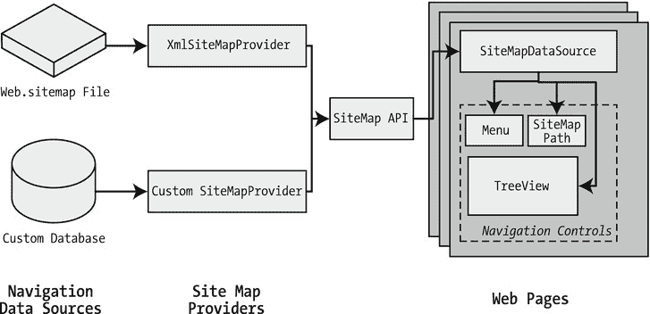

[图 13-1](#_Fig1) 。带站点地图的 ASP.NET 导航

定义站点地图

在 基于站点地图的导航中，起点是站点地图提供者。ASP.NET 附带了一个名为 XmlSiteMapProvider 的站点地图提供程序，它能够从 XML 文件中检索站点地图信息。如果您想从其他位置或以自定义格式检索站点地图，您需要创建自己的站点地图提供程序或在网上寻找第三方解决方案。

XmlSiteMapProvider 在虚拟目录的根目录中查找名为 Web.sitemap 的文件。与所有站点地图提供程序一样，XmlSiteMapProvider 的任务是提取站点地图数据并创建相应的站点地图对象。然后，这个 SiteMap 对象可用于 SiteMapDataSource，您可以将它放在每个使用导航的页面上。SiteMapDataSource 向导航控件提供站点地图信息，导航控件是链中的最后一个链接。

 **提示**为了简化给网站添加导航的任务，你可以使用母版页，如第 12 章中的[所述。这样，您只需将 SiteMapDataSource 和导航控件放在母版页上，而不是放在网站中的所有单个页面上。您将在本章中使用这种技术。](12.html)

您可以使用文本编辑器(如记事本)创建站点地图，也可以在 Visual Studio 中通过选择网站添加新项目，然后选择站点地图选项来创建站点地图。无论哪种方式，都是由您来手工输入所有的站点地图信息。唯一的区别是，如果您在 Visual Studio 中创建站点地图，它将从一个由三个站点地图节点组成的基本结构开始。

在填充站点地图文件中的内容之前，您需要了解所有 ASP.NET 站点地图必须遵循的规则。下面几节将一条一条地分解这些规则。

 **注意**在开始创建站点地图之前，对 XML 有一个基本的了解是有帮助的，XML 是用于站点地图文件的格式。您应该了解什么是元素，如何开始和结束元素，以及为什么准确的大小写如此重要。如果你是 XML 新手，你可能会发现在阅读本章之前参考第 18 章的快速介绍会有所帮助。

规则 1:站点地图以<sitemap>元素 开始</sitemap>

每个 Web.sitemap 文件都以声明<sitemap>元素开始，以关闭该元素结束。您将实际的站点地图信息放在开始和结束标记之间(此处显示了三个点):</sitemap>

```cs
<siteMap >
    ...
</siteMap>
```

xmlns 属性是必需的，并且必须完全按照此处所示输入。这告诉 ASP.NET，XML 文件使用 ASP.NET 站点地图标准。

规则 2:每个页面由一个<sitemapnode>元素 表示</sitemapnode>

那么，站点地图内容是什么样子的呢？本质上，每个站点地图都定义了网页的组织。要将页面插入到站点地图中，您需要添加带有一些基本信息的<sitemapnode>元素。也就是说，您需要提供页面的标题(出现在导航控件中)、描述(您可以选择使用也可以不使用)和 URL (页面的链接)。您可以通过使用三个属性(名为 title、description 和 url)来添加这三条信息，如下所示:</sitemapnode>

```cs
<siteMapNode title="Home" description="Home" url="∼/default.aspx" />
```

注意，这个元素以字符/>结束。这表明它是一个空元素,表示一个开始标签和一个结束标签。空元素(在[第 18 章](18.html)中描述的一个 XML 概念)从不包含其他节点。

下面是一个完整有效的站点地图文件，它使用此页面定义一个只有一个页面的网站:

```cs
<siteMap >
    <siteMapNode title="Home" description="Home" url="∼/default.aspx" />
</siteMap>
```

请注意，每个页面的 URL 都是以{/字符序列开始的。这一点相当重要。字符代表 web 应用的根文件夹。换句话说，URL∾/default.aspx 指向根文件夹中的 default . aspx 文件。这种风格的 URL 不是必需的，但是强烈推荐，因为它可以确保你总是得到正确的页面。如果你只是输入没有前缀的 URL default.aspx，ASP.NET 会在当前的文件夹中寻找 default.aspx 页面。如果您的 web 应用的页面位于多个文件夹中，您将会遇到问题。

例如，如果用户浏览到一个子文件夹并单击 default.aspx 链接，ASP.NET 将在该子文件夹而不是根文件夹中查找 default.aspx 页面。因为 default.aspx 页不在此文件夹中，所以导航尝试将失败，并显示 404 Not Found 错误。

规则 3:一个<sitemapnode>元素可以包含其他的<sitemapnode>元素</sitemapnode></sitemapnode>

站点地图不是由简单的页面列表组成的。相反，他们将页面分成组。为了在站点地图文件中表示这一点，您将一个<sitemapnode>放在另一个里面。您需要将<sitemapnode>元素分成一个开始标记和一个结束标记，而不是使用前面显示的空元素语法:</sitemapnode></sitemapnode>

```cs
<siteMapNode title="Home" description="Home" url="∼/default.aspx">
    ...
</siteMapNode>
```

现在你可以在里面放入更多的节点。以下是包含两个以上页面的主页群组的示例:

```cs
<siteMapNode title="Home" description="Home" url="∼/default.aspx">
    <siteMapNode title="Products" description="Our products"
     url="∼/products.aspx" />
    <siteMapNode title="Hardware" description="Hardware choices"
     url="∼/hardware.aspx" />
</siteMapNode>
```

本质上，这代表了图 13-2 中[所示的链接层次组。](#Fig2)

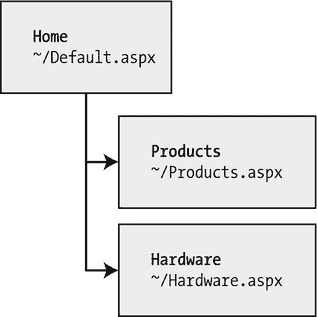

[图 13-2](#_Fig2) 。站点地图中的三个节点

在这种情况下，所有三个节点都是链接。这意味着用户可以浏览三个页面中的一个。但是，当您开始创建更复杂的组和子组时，您可能希望创建仅用于组织其他节点但本身不是链接的节点。在这种情况下，只需省略 url 属性，如下所示的产品节点:

```cs
<siteMapNode title="Products" description="Products">
    <siteMapNode title="In Stock" description="Products that are available"
     url="∼/inStock.aspx" />
    <siteMapNode title="Not In Stock" description="Products that are on order"
     url="∼/outOfStock.aspx" />
</siteMapNode>
```

当您在网页中显示站点地图的这一部分时，产品节点将显示为普通文本，而不是可点击的链接。

对于嵌套组和子组的深度没有限制。然而，只深入两三层是一个很好的规则；否则，当用户在导航控件中看到层次结构时，可能很难理解它。如果你发现你需要两个或三个以上的层次，你可能需要重新考虑如何将你的网页组织成组。

规则 4:每个站点地图都以一个 <sitemapnode>开始</sitemapnode>

另一个规则适用于所有站点地图。站点地图必须始终有一个根节点。所有其他节点都必须包含在这个根级节点中。

这意味着下面的*不是*一个有效的站点地图，因为它包含两个顶级节点:

```cs
<siteMapNode title="Products" description="Our products"
 url="∼/products.aspx" />
<siteMapNode title="Hardware" description="Hardware choices"
 url="∼/hardware.aspx" />
```

以下站点地图是有效的，因为它只有一个顶级节点(Home ),该节点包含另外两个节点:

```cs
<siteMap >
 <siteMapNode title="Home" description="Home" url="∼/default.aspx">

    <siteMapNode title="Products" description="Our products"
     url="∼/products.aspx" />
    <siteMapNode title="Hardware" description="Hardware choices"
     url="∼/hardware.aspx" />
 </sitemapNode>
</siteMap>
```

只要您只使用一个顶级节点，您就可以在任意大或任意小的组中嵌套任意深度的节点。

规则 5:不允许重复的 URL

不能用同一 URL 创建两个站点地图节点。当您希望在多个地方拥有相同的链接时，这似乎会带来一点问题——事实也确实如此。然而，这是一个必要条件，因为 ASP.NET 附带的默认 SiteMapProvider 将节点存储在一个集合中，每个项目都通过其唯一的 URL 进行索引。

这种限制并不妨碍您创建指向同一页面的多个略有不同的 URL。例如，考虑站点地图的以下部分。这两个节点是可以接受的，即使它们指向同一个页面(products.aspx ),因为这两个 URL 在末尾有不同的查询字符串参数:

```cs
<siteMapNode title="In Stock" description="Products that are available"
 url="∼/products.aspx?stock=1" />
<siteMapNode title="Not In Stock" description="Products that are on order"
 url="∼/products.aspx?stock=0" />
```

如果您有一个根据查询字符串显示不同信息的页面，那么这种方法非常有效。使用查询字符串参数，可以将页面的两个“版本”添加到站点地图中。第 8 章更详细地描述了查询字符串。

 **注意**站点地图中的 URL 不区分大小写。

查看简单的站点地图

乍一看，典型的站点地图可能有点令人不知所措。但是如果你记住了前面的五条规则，你就能弄清楚到底发生了什么。

下面是一个包含七个节点的示例。(记住，每个*节点*要么是一个单独页面的链接，要么是用来组织一组页面的标题。)该示例为一家名为 RevoTech 的公司定义了一个简单的站点地图。

```cs
<siteMap >
```

```cs
    <siteMapNode title="Home" description="Home" url="∼/default.aspx">
```

```cs
        <siteMapNode title="Information" description="Learn about our company">
            <siteMapNode title="About Us"
             description="How RevoTech was founded"
             url="∼/aboutus.aspx" />
            <siteMapNode title="Investing"
             description="Financial reports and investor analysis"
             url="∼/financial.aspx" />
        </siteMapNode>
```

```cs
        <siteMapNode title="Products" description="Learn about our products">
            <siteMapNode title="RevoStock"
             description="Investment software for stock charting"
             url="∼/product1.aspx" />
            <siteMapNode title="RevoAnalyze"
             description="Investment software for yield analysis"
             url="∼/product2.aspx" />
        </siteMapNode>
```

```cs
    </siteMapNode>
```

```cs
</siteMap>
```

在下一节中，您将把这个站点地图绑定到页面中的控件，您将看到它的结构浮现出来。

将普通页面绑定到站点地图

一旦定义了 Web.sitemap 文件，就可以在页面中使用它了。首先，最好确保您已经创建了站点地图文件中列出的所有页面，即使您将它们留空也是如此。否则，您将很难测试站点地图导航是否真正工作。

下一步是将 SiteMapDataSource 控件添加到页面中。您可以从工具箱的数据选项卡中拖放它。它创建了这样一个标签:

```cs
<asp:SiteMapDataSource ID="SiteMapDataSource1" runat="server" />
```

在 Visual Studio 中，SiteMapDataSource 控件在您的页面上显示为一个灰色框，但在您运行该页面时它是不可见的。

最后一步是添加链接到 SiteMapDataSource 的控件。尽管您可以使用第 3 部分中描述的任何数据控件，但实际上您会发现，只有使用工具箱的 Navigation 选项卡中的三个控件，您才能得到想要的结果。这是因为这些控件支持分层数据(具有多个嵌套级别的数据)，而站点地图就是分层数据的一个例子。在任何其他控件中，您一次只能看到一个级别的站点地图，这是不切实际的。

这是三个导航控件:

*   TreeView:TreeView 显示了一个由链接组成的“树”,可以一目了然地展示你的整个站点地图。
*   *菜单*:菜单显示多级菜单。默认情况下，您只能看到第一层，但是当您将鼠标移到副标题上时，其他层会弹出(多亏了一些漂亮的 JavaScript)。
*   SiteMapPath:SiteMapPath 是最简单的导航控件——它显示了你需要通过站点地图到达当前页面的完整路径。例如，如果你在 product1.aspx 页面，它可能会显示 Home > Products > RevoStock。与其他导航控件不同，SiteMapPath 只对在层次结构中向上移动有用。

要将控件连接到 SiteMapDataSource，只需设置其 DataSourceID 属性以匹配 SiteMapDataSource 的名称。例如，如果您添加了一个 TreeView，您应该调整标签，使其看起来像这样:

```cs
<asp:TreeView ID="TreeView1" runat="server" DataSourceID="SiteMapDataSource1" />
```

图 13-3 显示了结果——一个显示网站结构的树，如网站中所定义的。(底部的文本来自当前页面，在本例中是 default.aspx，它包含站点地图。)

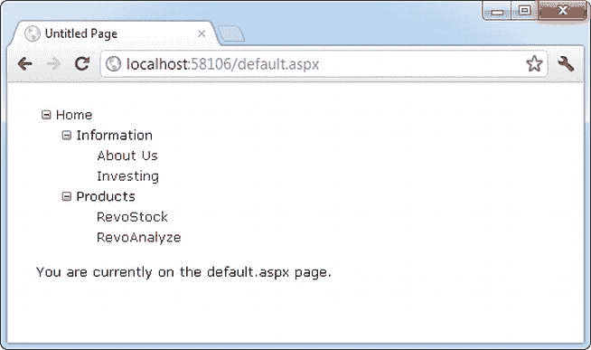

[图 13-3](#_Fig3) 。树视图中的站点地图

使用 TreeView 时，描述信息不会立即出现。相反，当您将鼠标悬停在树中的某个项目上时，它会显示为工具提示。

最棒的是，这棵树是自动创建的。只要将其链接到 SiteMapDataSource 控件，就不需要编写任何代码。

当您单击树中的一个节点时，您将自动转到您在 URL 中定义的页面。当然，除非该页面还包含一个导航控件，如 TreeView，否则站点地图将会从视野中消失。下一节将展示一种更好的方法。

将母版页绑定到站点地图

网站导航与另一个 ASP.NET 功能(母版页)结合使用时效果最佳。这是因为您通常希望在每个页面上显示相同的导航控件。最简单的方法是创建一个包含 SiteMapDataSource 和导航控件的母版页。然后，您可以在网站上的所有其他页面中重复使用该模板。

下面是如何在母版页中定义一个将导航控件放在左侧的基本结构:

```cs
<%@ Master Language="C#" AutoEventWireup="true"
 CodeFile="MasterPage.master.cs" Inherits="MasterPage" %>
<html>
<head runat="server">
 <title>Navigation Test</title>
</head>
<body>
<form id="form1" runat="server">
 <table>
    <tr>
     <td style="width: 226px;vertical-align: top;">
        <asp:TreeView ID="TreeView1" runat="server"
         DataSourceID="SiteMapDataSource1" />
     </td>
     <td style="vertical-align: top;">
        <asp:ContentPlaceHolder id="ContentPlaceHolder1" runat="server" />
     </td>
    </tr>
 </table>
 <asp:SiteMapDataSource ID="SiteMapDataSource1" runat="server" />
</form>
</body>
</html>
```

然后用一些简单的静态内容创建一个孩子。以下是本示例中 default.aspx 页面的代码:

```cs
<%@ Page Language="C#" MasterPageFile="∼/MasterPage.master"
 AutoEventWireup="true"
 CodeFile="default.aspx.cs" Inherits="_default" Title="Home Page" %>
<asp:Content ID="Content1" ContentPlaceHolderID="ContentPlaceHolder1"
 runat="Server">
    <br />
    <br />
    You are currently on the default.aspx page (Home).
</asp:Content>
```

事实上，当你在做的时候，为什么不创建第二个页面来测试两个页面之间的导航呢？

```cs
<%@ Page Language="C#" MasterPageFile="∼/MasterPage.master"
AutoEventWireup="true" CodeFile="product1.aspx.cs"
Inherits="product1" Title=" RevoStock Page" %>
<asp:Content ID="Content1" ContentPlaceHolderID="ContentPlaceHolder1"
 runat="Server">
    <br />
    <br />
    You are currently on the product1.aspx page (RevoStock).
</asp:Content>
```

现在你可以使用树形视图从一个页面跳到另一个页面(见[图 13-4](#Fig4) )。第一张图片显示了主页最初的样子，而第二张图片显示了在 TreeView 中单击 RevoStock 链接的结果。因为两个网页使用相同的母版页，并且母版页包含 TreeView，所以站点地图始终保持可见。

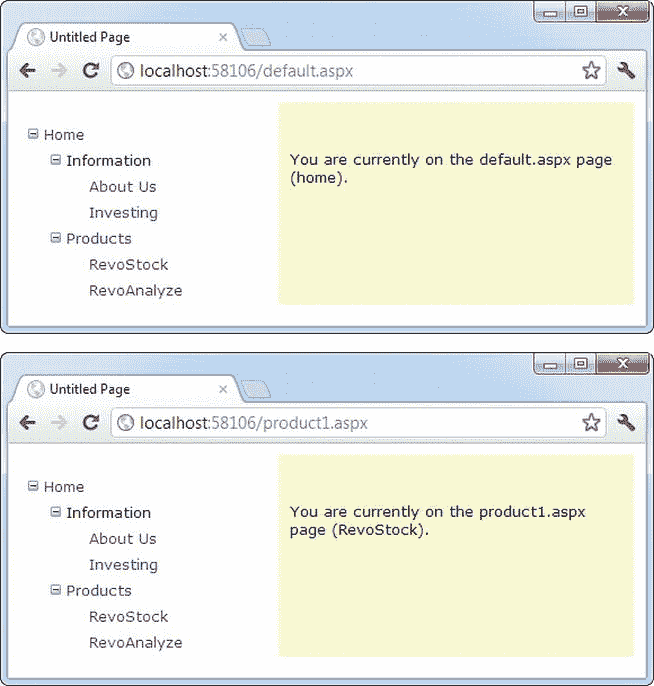

[图 13-4](#_Fig4) 。使用树形视图在页面间导航

您可以做更多的事情来定制页面和导航控件的外观。您将在接下来的部分中考虑这些主题。

站点地图的绑定部分

在前面的例子中，TreeView 显示了站点地图文件*的确切结构*。然而，这并不总是你想要的。例如，您可能不喜欢 Home 节点突出的方式，因为 XmlSiteMapProvider 规则规定每个站点地图必须以单个根开始。

解决这个问题的一种方法是配置 SiteMapDataSource 的属性。例如，可以将 ShowStartingNode 属性设置为 false 以隐藏根节点:

```cs
<asp:SiteMapDataSource ID="SiteMapDataSource1" runat="server"
 ShowStartingNode="False" />
```

图 13-5 显示了结果。

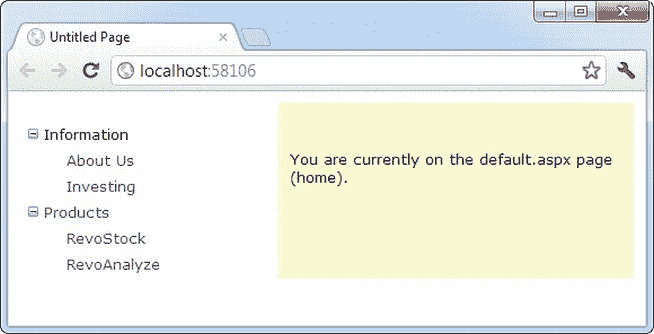

[图 13-5](#_Fig5) 。没有根节点的站点地图

这个例子展示了如何隐藏根节点。另一种选择是只显示完整站点地图的一部分，从当前节点开始。例如，您可以使用诸如 TreeView 之类的控件来显示从当前节点开始的层次结构中的所有内容。想要向上移动一级的用户可以使用另一个控件(如 SiteMapPath)。

显示子树

默认情况下，SiteMapDataSource 显示从根节点开始的完整树。但是，SiteMapDataSource 有几个属性可以帮助您配置导航树，将显示限制在特定的分支。通常，如果您有一个嵌套很深的树，这很有用。表 13-1 描述了所有的属性。

[表 13-1](#_Tab1) 。SiteMapDataSource 属性

| 财产 | 描述 |
| --- | --- |
| ShowStartingNode | 将此属性设置为 false 可以隐藏原本会出现在导航树中的第一个(顶级)节点。默认值为 true。 |
| StartingNodeUrl | 使用此属性更改起始节点。将该值设置为应该是导航树中第一个节点的节点的 URL。该值必须与站点地图文件中的 url 属性完全匹配。例如，如果您指定一个“~/home.aspx”的 StartingNodeUrl，那么树中的第一个节点就是 home 节点，您将只能看到该节点下的节点。 |
| StartFromCurrentNode | 将该属性设置为 true 可将当前页面设置为起始节点。导航树将只显示当前页面下的页面(允许用户向下移动)。如果站点地图文件中不存在当前页面，这种方法就不起作用。 |
| 开始节点偏移 | 使用此属性在层次结构中向上或向下移动起始节点。它采用一个整数来指示 SiteMapDataSource 从开始节点沿树向下移动(如果数字为正)或沿树向上移动(如果数字为负)。实际效果取决于如何将该属性与其他 SiteMapDataSource 属性结合起来。例如，如果 StartFromCurrentNode 为 false，您将使用一个正数在树中向下移动，从起始节点向当前节点移动。如果 StartFromCurrentNode 为 true，您将使用负数在树中向上移动，远离当前节点，向起始节点移动。 |

弄清楚这些属性可能需要一些工作，您可能需要做一些实验来决定您想要使用的 SiteMapDataSource 设置的正确组合。更有趣的是，您可以在同一页面上使用多个 SiteMapDataSource。这意味着您可以使用两个导航控件来显示站点地图层次结构的不同部分。

在实践中看到这一点之前，您需要将前面几个示例中使用的站点地图文件修改成稍微复杂一点的文件。目前，站点地图有三层，但是只有第一层(主节点)和第三层(单个页面)有 URL 链接。二级分组(信息和产品)只是用作标题，而不是链接。为了更好地了解 SiteMapDataSource 属性如何处理多个导航级别，请修改信息节点，如下所示:

```cs
<siteMapNode title="Information" description="Learn about our company"
 url="∼/information.aspx">
```

并更改“产品”节点:

```cs
<siteMapNode title="Products" description="Learn about our products"
 url="∼/products.aspx">
```

接下来创建 products.aspx 和 information.aspx 页面。

Products 节点的有趣特性是，它不仅是一个可导航的页面，而且在导航层次结构中，它的上方和下方都有其他页面。这使得它非常适合测试 SiteMapDataSource 属性。例如，您可以创建一个 SiteMapDataSource，仅显示当前页面及其下的页面，如下所示:

```cs
<asp:SiteMapDataSource ID="SiteMapDataSource1" runat="server"
    StartFromCurrentNode="True" />
```

您可以创建一个始终显示信息页面及其下页面的页面，如下所示:

```cs
<asp:SiteMapDataSource ID="SiteMapDataSource2" runat="server"
 StartingNodeUrl="∼/information.aspx" />
```

 **注意**为了让这项技术发挥作用，ASP.NET 必须能够在 Web.sitemap 文件中找到与当前 URL 匹配的页面。否则，ASP.NET 不会知道当前位置在哪里，也不会向绑定的控件提供任何导航信息。

现在只需绑定两个导航控件。在这种情况下，一个 TreeView 链接到母版页标记中的每个 SiteMapDataSource:

```cs
Pages under the current page:
<asp:TreeView ID="TreeView1" runat="server"
 DataSourceID="SiteMapDataSource1" />
<br />
The Information group of pages:<br />
<asp:TreeView ID="TreeView2" runat="server"
 DataSourceID="SiteMapDataSource2" />
```

[图 13-6](#Fig6) 显示了从 default.aspx 沿着树向下导航到 products1.aspx 的结果。第一个树形视图显示了当前页面下的树的一部分，第二个树形视图总是固定在信息组上。

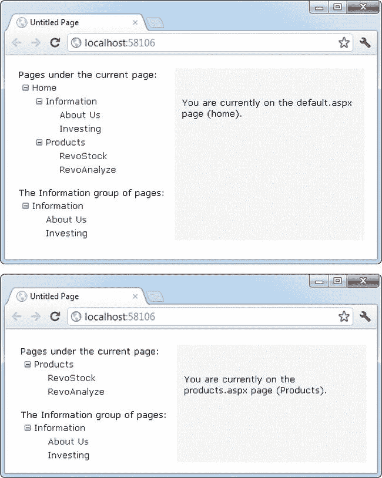

[图 13-6](#_Fig6) 。显示部分站点地图

您需要习惯 SiteMapDataSource。StartingNodeOffset 属性。它需要一个整数来指示 SiteMapDataSource 在树中向下移动(如果数字为正)或向上移动(如果数字为负)。一个经常被误解的重要细节是，当 SiteMapDataSource 沿着树向下移动时，它会将*向当前节点*移动。如果它已经在当前节点了，或者你的偏移量把它带到了当前节点之外，SiteMapDataSource 就不知道去哪里了，你最终会得到一个空白的导航控件。

为了理解这是如何工作的，考虑一个例子是有帮助的。想象你在一个网站的这个位置:

```cs
Home > Products > Software > Custom > Contact Us
```

如果 SiteMapDataSource 从 Home 节点(默认)开始，并且您应用了 startingnodefoffset 2，它将在树中向下移动两级，并绑定到从软件节点开始的页面树。

另一方面，如果您当前在“产品”节点，您将看不到任何内容。这是因为起始节点是 Home，偏移试图将其向下移动两层。然而，你只是层级中的一级。或者，从另一个角度来看，在顶层节点和两层深度的当前节点之间不存在任何节点。

现在，如果您重复相同的测试，但是将站点地图提供程序设置为在另一个节点上开始，会发生什么呢？考虑一下如果将 StartFromCurrentNode 设置为 true 并转到联系我们页面会发生什么。同样，您将看不到任何信息，因为站点地图提供者试图从当前节点向下移动两层——联系我们——但它无处可去。另一方面，如果您将 StartFromCurrentNode 设置为 true，并使用 StartingNodeOffset，则 SiteMapDataSource 将从 Contact Us 向上移动*两级*,并绑定从 Software 开始的子树。

总的来说，您不会经常使用 StartingNodeOffset 属性。但是，如果您有一个嵌套很深的站点地图，并且希望通过只显示当前位置的几个级别来保持导航显示的简单性，那么它会很有用。

 **注意**本节中的所有例子都过滤掉了比起始节点更高级别的节点。例如，如果你定位在首页>产品> RevoStock 页面，你已经看到了如何隐藏首页和产品层。你还没有看到如何过滤掉更低级别的节点。例如，如果您位于主页，您将始终看到完整的站点地图，因为您无法限制您在起始节点下看到的级别数。您无法使用 SiteMapDataSource 更改此行为；但是稍后，在“TreeView 控件”部分，你会看到 TreeView。MaxDataBindDepth 属性用于此目的。

在同一个文件中使用不同的站点地图

假设你想在你的网站上有一个经销商部分和一个员工部分。您可以将它分成两个结构，并在同一个文件的不同分支下定义它们，如下所示:

```cs
<siteMap >
 <siteMapNode title="Root" description="Root" url="~/default.aspx">
    <siteMapNode title="Dealer Home" description="Dealer Home"
     url="~/default_dealer.aspx">
     ...
    </siteMapNode>
    <siteMapNode title="Employee Home" description="Employee Home"
     url="~/default_employee.aspx">
     ...
    </siteMapNode>
 </siteMapNode>
</siteMap>
```

要将 SiteMapDataSource 绑定到经销商视图(从经销商主页开始)，只需将 StartingNodeUrl 属性设置为“~/default_dealer.aspx”。您可以通过编程来实现，或者更有可能的是，通过创建一个完全不同的母版页并在您的所有经销商页面中实现它。在员工页面中，将 StartingNodeUrl 属性设置为“~/default_employee.aspx”。这样，您将只显示站点地图的员工主页分支下的页面。

您甚至可以通过使用 siteMapFile 属性将单个站点地图拆分为单独的文件，这样会使您的工作变得更加轻松:

```cs
<siteMap >
  <siteMapNode title="Root" description="Root" url="~/default.aspx">
    <siteMapNode siteMapFile="Dealers.sitemap" />
    <siteMapNode siteMapFile="Employees.sitemap" />
 </siteMapNode>
</siteMap>
```

即使使用这种技术，您仍然被限制在单个站点地图树中，并且它总是从 Web.sitemap 文件开始。但是您可以更容易地管理站点地图，因为您可以将它的一些内容分解到单独的文件中。

然而，这种看似漂亮的技术有很大的局限性，因为站点地图提供者不允许重复的 URL。这意味着您无法在站点地图的多个分支中重用同一个页面。虽然您可以通过创建不同的等效 URL(例如，通过在末尾添加查询字符串参数)来尝试解决这个问题，但这带来了更多的麻烦。遗憾的是，这个问题在 ASP.NET 包含的默认站点地图提供程序中没有解决方案。

使用站点地图类

为了显示导航层次结构，您并不局限于无代码数据绑定。您可以通过编程方式与导航信息进行交互。这允许您检索当前节点信息，并使用它来配置页面标题等详细信息。您所需要做的就是通过 Page 类与容易获得的对象进行交互。

站点地图 API 非常简单。要使用它，您需要使用系统中的两个类。Web 命名空间。起点是 SiteMap 类，它提供静态属性 CurrentNode(表示当前页面的站点地图节点)和 RootNode(站点地图的根节点)。这两个属性都返回 SiteMapNode 对象。使用 SiteMapNode 对象，可以从站点地图中检索信息，包括标题、说明和 URL 值。您可以通过使用[表 13-2](#Tab2) 中的导航属性来考虑相关节点。

[表 13-2](#_Tab2) 。SiteMapNode 导航属性

| 财产 | 描述 |
| --- | --- |
| parent node-父节点 | 返回导航层次结构中上一级的节点，该节点包含当前节点。在根节点上，这将返回一个空引用。 |
| 子节点 | 提供所有子节点的集合。您可以检查 HasChildNodes 属性来确定子节点是否存在。 |
| 前兄弟姐妹 | 返回同一级别的上一个节点(如果不存在这样的节点，则返回空引用)。 |
| 下一个兄弟姐妹 | 返回同一级别的下一个节点(如果不存在这样的节点，则返回空引用)。 |

 **注意**您还可以使用当前 SiteMapProvider 对象的方法来搜索节点，该对象可通过 SiteMap 获得。提供程序静态属性。例如，网站地图。Provider.FindSiteMapNode()方法允许您通过 URL 搜索节点。

要了解这一点，请考虑下面的代码，该代码在页面上配置两个标签，以显示从当前节点检索的标题和描述信息:

```cs
protected void Page_Load(object sender, EventArgs e)
{
    lblHead.Text = SiteMap.CurrentNode.Title;
    lblDescription.Text = SiteMap.CurrentNode.Description;
}
```

如果您正在使用母版页，您可以将此代码放在母版页的代码隐藏中，以便从站点地图中为每个页面分配标题。

下一个例子更加雄心勃勃。它实现了下一个链接，允许用户遍历整个子节点集。代码检查是否存在兄弟节点，如果在所需的位置没有，它就隐藏链接:

```cs
protected void Page_Load(object sender, EventArgs e)
{
    if (SiteMap.CurrentNode.NextSibling != null)
    {
        lnkNext.NavigateUrl = SiteMap.CurrentNode.NextSibling.Url;
        lnkNext.Visible = true;
    }
    else
    {
        lnkNext.Visible = false;
    }
}
```

图 13-7 显示了结果。第一张图片显示了 product1.aspx 页面上的下一个链接。第二张图片显示了当您导航到 product2.aspx 时，该链接是如何消失的(通过单击 TreeView 中的 Next 链接或 RevoAnalyze 链接)。

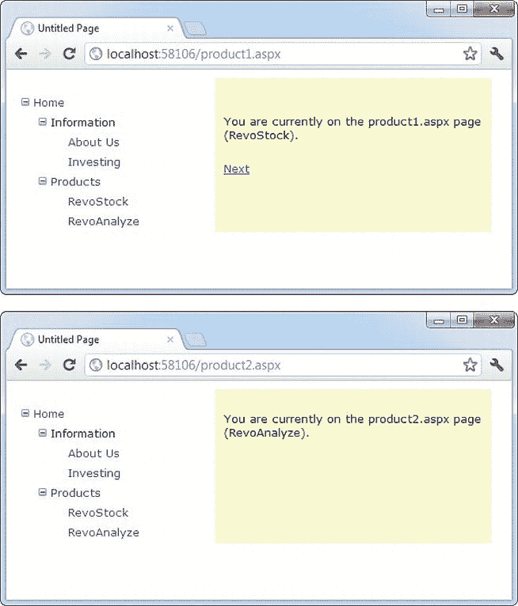

[图 13-7](#_Fig7) 。创建下一页链接

URL 映射和路由

站点地图模型是围绕一个简单的原则设计的:每个条目都有一个单独的 URL。虽然您可以通过添加查询字符串参数来区分 URL，但在许多网站中，WebForm 和站点地图条目之间是一一对应的。

当这不合适的时候，ASP.NET 有两个工具可以帮助你。首先是 URL 映射，这是一种将一个 URL 映射到另一个 URL 的干净、实用的方法。第二个是 URL 路由，这是一个稍微复杂一点但是更加灵活的系统，它执行相同的任务。URL 映射是处理“一次性”重定向的理想方式。例如，映射是一种快速处理旧页面或最近移动过的页面，或者为一些流行页面提供额外入口点的方法。另一方面，URL 路由可以作为处理更多页面的更复杂的重定向系统的基础。例如，您可以使用它来用更简单的语法替换长而复杂的产品页面 URL，并在整个网站上实现。如果你想提供更干净的网址，让搜索引擎更容易、更全面地索引你的网站，路由是特别有用的。

URL 映射

在某些情况下，您可能希望几个 URL 指向同一个页面。这种情况可能有很多原因——可能您希望在一个页面中实现您的逻辑，使用查询字符串参数，但仍然为您的网站用户提供更短、更容易记住的 URL(通常称为*友好的*URL)。或者，您可能已经重命名了一个页面，但是您希望保留旧的 URL 功能，这样它就不会破坏用户书签。尽管 web 服务器有时会提供这种功能，但 ASP.NET 包含了自己的 URL 映射功能。

ASP.NET URL 映射背后的基本思想是将一个请求 URL 映射到一个不同的 URL。映射规则存储在 web.config 文件中，在进行任何其他处理之前应用它们。当然，为了让 ASP.NET 应用重新映射，它必须处理请求，这意味着请求 URL 必须使用映射到 ASP.NET 的文件类型扩展名(例如。aspx)。

您可以在 web.config 文件的<urlmappings>部分定义 URL 映射。您提供两条信息—请求 url(作为 URL 属性)和新的目标 URL (mappedUrl)。这里有一个例子:</urlmappings>

```cs
<configuration>
 <system.web>
    <urlMappings enabled="true">
     <add url="~/category.aspx"
        mappedUrl="~/default.aspx?category=default" />
     <add url="~/software.aspx"
        mappedUrl="~/default.aspx?category=software" />
    </urlMappings>
    ...
 </system.web>
</configuration>
```

为了让 ASP.NET 进行匹配，浏览器提交的 URL 必须与 web.config 文件中指定的 URL 几乎完全匹配。然而，有两个例外。首先，匹配算法不区分大小写，所以请求 URL 的大小写总是被忽略。其次，URL 中的任何查询字符串参数都将被忽略。不幸的是，ASP.NET 不支持高级匹配规则，如通配符或正则表达式。

使用 URL 映射时，重定向的方式与服务器相同。Transfer()方法，这意味着不会发生往返，浏览器中的 URL 仍将显示原始请求 URL，而不是新页面。在您的代码中，请求。路径和请求。QueryString 属性反映新的(映射的)URL。的请求。属性返回原始的友好请求 Url。

如果将它与站点地图结合使用，这可能会带来一些复杂性—即，当在站点地图中查找当前节点时，站点地图提供程序是尝试使用原始请求 URL 还是目标 URL？答案是两者都有。它从尝试匹配请求 URL(由请求提供)开始。RawUrl 属性)，如果没有找到值，那么它就使用请求。改为 Path 属性。这是 XmlSiteMapProvider 的行为，因此如果需要，您可以在自定义提供程序中更改它。

URL 路由

URL 路由最初是作为 ASP.NET MVC 的核心部分设计的，这是一个替代框架，用于构建不使用本书中讨论的 WebForm 特性的网页。然而，ASP.NET 的创造者意识到，路由还可以帮助 WebForm 开发者驯服蔓延的网站，用更简洁的替代方法取代错综复杂的 URL(这使得人们更容易键入它们，搜索引擎也更容易索引它们)。出于所有这些原因，他们将 URL 路由特性提供给普通的 ASP.NET WebForm 应用。

 **注意**要了解更多关于 ASP.NET MVC 的信息，它呈现了一种截然不同的思考网页渲染的方式，请查看*Pro ASP.NET MVC 4*(a press)。

与 URL 映射不同，URL 路由不会发生在 web.config 文件中。相反，它是用代码实现的。通常，您将使用 global.asax 文件中的 Application_Start()方法为您的应用注册所有路由。

要注册一个路由，可以使用系统中的 RouteTable 类。Web.Routing 命名空间。为了方便起见，您可以从导入该名称空间开始:

```cs
using System.Web.Routing;
```

RouteTable 类提供了一个名为 Routes 的静态属性，该属性包含为应用定义的 Route 对象的集合。最初，这个集合是空的，但是您可以通过调用 MapPageRoute()方法来创建自定义路线，该方法有三个参数:

*   *routeName* :唯一标识路由的名称。你想要什么都可以。
*   *routeUrl* :指定浏览器将使用的 Url 格式。通常，路由 URL 由一条或多条由斜杠分隔的可变信息组成，这些信息被提取出来并提供给代码。例如，您可以通过使用诸如 */products/4312* 这样的 URL 来请求一个产品页面。
*   *physicalFile* :这是目标 WebForm——用户使用路线时将被重定向到的地方。来自原始 routeUrl 的信息将被解析，并通过页面作为集合提供给此页面。RouteData 属性。

下面是一个在 web 应用首次启动时向其添加两条路由的示例:

```cs
protected void Application_Start(object sender, EventArgs e)
{
    RouteTable.Routes.MapPageRoute("product-details",
     "product/{productID}", "~/productInfo.aspx");
    RouteTable.Routes.MapPageRoute("products-in-category",
     "products/category/{categoryID}", "~/products.aspx");
}
```

路由 URL 可以包括一个或多个参数，由花括号中的占位符表示。例如，这里显示的第一个路由包含一个名为 productID 的参数。这条信息将从 URL 中提取出来，并传递给目标页面。

下面是一个 URL，它使用这个路由请求一个 ID 为 FI_00345 的产品:

```cs
http://localhost:[PortNumber]/Routing/product/FI_00345
```

然后，ASP.NET 路由基础结构将用户重定向到 productInfo.aspx 页面。所有参数都是通过页面提供的。RouteData 属性。严格来说佩奇。RouteData 提供了一个 RouteData 对象。它最有用的属性是 Values 集合，该集合提供原始请求中的所有参数，并按名称进行索引。

以下示例显示了 productInfo.aspx 页面如何从原始 URL 中检索请求的产品 ID:

```cs
protected void Page_Load(object sender, EventArgs e)
{
    string productID = (string)Page.RouteData.Values["productID"];
    lblInfo.Text = "You requested " + productID;
}
```

同样，本例中的第二个路由接受以下形式的 URL:

```cs
http://localhost:[PortNumber]/Routing/products/category/342
```

虽然您可以硬编码这种 URL，但是有一个页面。GetRouteUrl() helper 方法，它会自动为您完成这项工作，从而避免潜在的错误。下面是一个例子，它查找一个路由(使用它的注册名)，提供参数信息，然后检索相应的 URL。

```cs
hyperLink.NavigateUrl = Page.GetRouteUrl("product-details", new {productID = "FI_00345" });
```

传递参数信息的有点奇怪的语法使用了一种叫做*匿名类型* 的语言特性。它允许您提供尽可能少或尽可能多的参数。从技术上讲，C#编译器会自动创建一个包含您提供的所有参数的类，并将该对象提交给 GetRouteUrl()方法。最终结果是一个指向 FI_00345 产品的路由 URL，如第一个示例所示。

SiteMapPath 控件

树状视图显示了可用的页面，但它并没有指出您当前所处的位置。为了解决这个问题，通常将 TreeView 与 SiteMapPath 控件结合使用。因为 SiteMapPath 总是用于显示导航信息(与 TreeView 不同，它还可以显示其他类型的数据)，所以您甚至不需要显式地将其链接到 SiteMapDataSource:

```cs
<asp:SiteMapPath ID="SiteMapPath1" runat="server" />
```

SiteMapPath 提供了*面包屑导航* ，这意味着它显示用户的当前位置，并允许用户通过使用链接在层次结构中向上导航到更高的级别。[图 13-8](#Fig8) 显示了一个当用户在 product1.aspx 页面上时 SiteMapPath 控件的例子。使用 SiteMapPath 控件，用户可以返回到 default.aspx 页。(如果为“产品”节点定义了一个 URL，那么您也可以单击该路径的一部分，以转到该页面。)同样，SiteMapPath 已被添加到母版页，因此它会出现在站点中的所有内容页上。

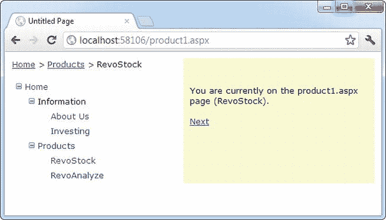

[图 13-8](#_Fig8) 。使用 SiteMapPath 进行面包屑导航

SiteMapPath 控件非常有用，因为它既提供了显示当前位置的概览视图，又提供了在层次结构中向上移动的方法。但是，您总是需要将它与允许用户在站点地图层次结构中向下移动的其他导航控件结合使用。

自定义 SiteMapPath

SiteMapPath 与其他导航控件(如 TreeView 和 Menu)有一个微妙但重要的区别。与这些控件不同，SiteMapPath 直接使用 ASP.NET 导航模型，换句话说，它不需要通过 SiteMapDataSource 获取数据。因此，您可以在没有 SiteMapDataSource 的页面上使用 SiteMapPath，并且更改 SiteMapDataSource 的属性不会影响 SiteMapPath。但是，SiteMapPath 控件提供了许多自己的属性，您可以使用它们进行自定义。表 13-3 列出了一些最常见的配置属性。

[表 13-3](#_Tab3) 。SiteMapPath 外观相关属性

| 财产 | 描述 |
| --- | --- |
| 显示工具提示 | 如果您不想在用户悬停在站点地图路径的一部分上时显示描述文本，请将此项设置为 false。 |
| 父级显示 | 这将设置当前页面上方一次显示的最大级别数。默认情况下，该设置为–1，这意味着将显示所有级别。 |
| RenderCurrentNodeAsLink | 如果为 true，则表示当前页面的页面部分将变成可点击的链接。默认情况下，这是 false，因为用户已经在当前页面。 |
| 路径方向反应 | 您有两个选择:RootToCurrent(默认值)和 CurrentToRoot(颠倒路径中的级别顺序)。 |
| 路径分隔符 | 这表示将放置在路径中每个级别之间的字符。默认值是大于号(>)。另一个常见的路径分隔符是冒号(:)。 |

使用 SiteMapPath 样式和模板

为了获得更多的控制，您可以用样式配置 SiteMapPath 控件，甚至用模板重新定义控件和 HTML。表 13-4 列出了 SiteMapPath 控件中所有可用的样式和模板；在这一节中，您将看到如何使用这两组属性。

[表 13-4](#_Tab4) 。SiteMapPath 样式和模板

| 风格 | 模板 | 适用于 |
| --- | --- | --- |
| 时尚风格 | 节点模板 | 路径的所有部分，除了根和当前节点。 |
| CurrentNodeStyle | 当前节点模板 | 表示当前页面的节点。 |
| rootmodestyle | RootNodeTemplate | 表示根的节点。如果根节点与当前节点相同，则使用当前节点模板或样式。 |
| PathSeparatorStyle | 路径分离模板 | 每个节点之间的分隔符。 |

样式很容易掌握，它们定义了应用于 SiteMapPath 控件一部分的格式设置。模板有点复杂，因为它们依赖于数据绑定表达式。从本质上讲，*模板*是一点 HTML(您创建的),将为 SiteMapPath 控件的特定部分显示。例如，如果您想要配置根节点在站点地图中的显示方式，您可以使用< RootNodeTemplate >创建一个 SiteMapPath，如下所示:

```cs
<asp:SiteMapPath ID="SiteMapPath1" runat="server">
 <RootNodeTemplate>
    <b>Root</b>
 </RootNodeTemplate>
</asp:SiteMapPath>
```

这个简单的模板不使用 sitemap 节点的根节点中的标题和 URL 信息。相反，它只是用粗体显示单词*的词根*。单击文本没有任何效果。

通常，您将使用数据绑定表达式来检索一些站点地图信息，主要是为站点地图文件中的当前节点定义的描述、文本或 URL。第 15 章详细介绍了数据绑定表达式，但这一节将给出一个简单的例子，向你展示在 SiteMapPath 中使用它们所需要知道的一切。

假设您想要更改当前节点的显示方式，使其以斜体显示。要获取当前节点的名称，您需要编写一个数据绑定表达式来检索标题。这个数据绑定表达式被括在字符之间，并使用名为 Eval()的方法从表示页面的 SiteMapNode 对象中检索信息。模板看起来是这样的:

```cs
<asp:SiteMapPath ID="SiteMapPath1" runat="server">
 <CurrentNodeTemplate>
    <i><%# Eval("Title") %></i>
 </CurrentNodeTemplate>
</asp:SiteMapPath>
```

数据绑定还使您能够从站点地图节点中检索其他信息，例如描述。考虑以下示例:

```cs
<asp:SiteMapPath ID="SiteMapPath1" runat="server">
 <PathSeparatorTemplate>
    <asp:Image ID="Image1" ImageUrl="~/arrowright.gif"
     runat="server" />
 </PathSeparatorTemplate>
 <RootNodeTemplate>
    <b>Root</b>
 </RootNodeTemplate>
 <CurrentNodeTemplate>
    <%# Eval("Title") %> <br />
    <small><i><%# Eval("Description") %></i></small>
 </CurrentNodeTemplate>
</asp:SiteMapPath>
```

这个 SiteMapPath 使用了几个模板。首先，它使用 PathSeparatorTemplate 来定义一个用于路径各部分之间的自定义箭头图像。这个模板使用一个图像控件，而不是普通的 HTML 标签，因为只有图像理解图像 URL 中的~/字符，这些字符代表应用的根文件夹。如果不包含这些字符，则当您将网页放在子文件夹中时，将无法成功检索图像。

接下来，SiteMapPath 使用 RootNodeTemplate 为站点地图路径的根部分提供一个固定的粗体文本字符串。最后，CurrentNodeTemplate 使用两个数据绑定表达式来显示两条信息——节点的标题和描述(下面较小的文本)。图 13-9 显示了最终的结果。

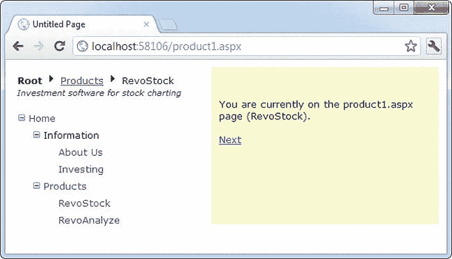

[图 13-9](#_Fig9) 。带有模板的 SiteMapPath

敏锐的眼睛会注意到，基于模板的 SiteMapPath 不仅显示更多的信息，而且更具交互性。现在，您可以单击位于根项目和当前页面之间的任何页面元素。在[图 13-9](#Fig9) 中，这意味着你可以点击产品来向上移动到 products.aspx 页面。

有趣的是，SiteMapPath 中的模板不包含任何提供这些链接的元素。相反，SiteMapPath 自动确定哪些项目应该是可点击的(通过检查它们是否链接到站点地图中的页面)。如果某项应该是可单击的，SiteMapPath 会将该项的整个 CurrentNodeTemplate 包装在一个链接中。

如果您不想要链接(或者您想以不同的方式或用不同的控件链接)，您可以更改这种行为。诀窍是修改 NodeTemplate。您将在下一节中学习如何做到这一点。

添加自定义站点地图信息

到目前为止，在您看到的站点地图中，为节点提供的唯一信息是标题、描述和 URL。这是你想要使用的最基本的信息。然而，XML 站点地图的模式是开放的，这意味着您可以自由地用自己的数据插入自定义属性。

出于多种原因，您可能希望插入额外的节点数据。这些附加信息可能是您想要显示的描述性信息，也可能是描述链接应该如何工作的上下文信息。例如，您可以添加一个属性，指定链接应该在新窗口中打开。唯一的问题是，以后根据信息采取行动是由你决定的。换句话说，您需要配置您的用户界面，以便它使用这些额外的信息。

例如，下面的代码显示了一个站点地图，它使用 target 属性来指示链接应该打开的框架。在此示例中，一个链接的目标设置为 _blank，因此它将在新的浏览器窗口中打开:

```cs
<siteMapNode title="RevoStock"
 description="Investment software for stock charting"
 url="~/product1.aspx" target="_blank" />
```

现在，在您的代码中，您有几个选项。如果在导航控件中使用模板，可以直接绑定到新属性。下面是上一节中 SiteMapPath 的一个示例:

```cs
<asp:SiteMapPath ID="SiteMapPath1" runat="server" Width="264px" Font-Size="10pt">
    <NodeTemplate>
     <a href='<%# Eval("Url") %>' target='<%# Eval("[target]") %>'>
        <%# Eval("Title") %>
     </a>
    </NodeTemplate>
</asp:SiteMapPath>
```

这将创建一个使用节点 URL(像往常一样)但也使用目标信息的链接。在这个例子中有一个稍微不同寻常的细节——[ target]一词周围的方括号。您需要使用此语法来查找添加到 Web.sitemap 文件中的任何自定义属性。这是因为该值不能直接从 SiteMapNode 类的属性中检索，而是需要使用 SiteMapNode 索引器按名称查找。

如果你的导航控件不支持模板，你需要找到另一种方法。例如，TreeView 不支持模板，但它会在每次项目绑定到树时触发 TreeNodeDataBound 事件。您可以对此事件作出反应以自定义当前项目。要应用新目标，请使用以下代码:

```cs
protected void TreeView1_TreeNodeDataBound(object sender, TreeNodeEventArgs e)
{
    SiteMapNode node = (SiteMapNode)e.Node.DataItem;
    e.Node.Target = node["target"];
}
```

与模板一样，您不能从强类型的 SiteMapNode 属性中检索自定义属性。相反，您使用 SiteMapNode 索引器按名称检索它。

树形视图控件

您已经看到了显示导航信息的树形视图 。正如您所了解的，TreeView 可以显示整个站点地图的一部分或整个站点地图。每个节点都成为一个链接，单击该链接会将用户带到新页面。如果您将鼠标悬停在某个链接上，您会在工具提示中看到相应的描述信息。

在下面几节中，您将学习如何更改 TreeView 的外观。在后面的章节中，您将学习如何使用 TreeView 完成其他任务，例如显示数据库中的数据。

 **注意**树形视图是 ASP.NET 最令人印象深刻的控件之一。它不仅允许您显示站点地图，还支持显示来自数据库的信息，并按需填充部分树(无需刷新整个页面)。但最重要的是，它支持多种可以改变其外观的样式。

树形视图属性

TreeView 有许多属性，可以让您更改它在页面上的显示方式。最重要的属性之一是 ImageSet，它允许您选择一组预定义的节点图标。(每组包括三个图标:一个用于折叠节点，一个用于展开节点，一个用于没有子节点因而无法展开或折叠的节点。)TreeView 提供了 16 个可能的 ImageSet 值，这些值由 TreeViewImageSet 枚举表示。

例如，[图 13-10](#Fig10) 显示了您之前考虑过的相同的 RevoStock 导航页面，但是这一次使用了 TreeViewImageSet.Faq 的 ImageSet 值。

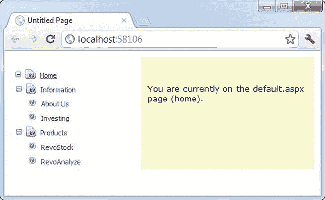

[图 13-10](#_Fig10) 。一个带有奇特节点图标的树形视图

您会注意到这个树视图又做了一个改变。它消除了不同级别的节点之间的缩进，因此所有的站点地图条目都可以放在同一个窄列中，不管它们有多深。这是通过将 TreeView 的 NodeIndent 属性设置为 0 来实现的。

下面是完整的树形视图标记:

```cs
<asp:TreeView ID="TreeView1" runat="server"
 DataSourceID="SiteMapDataSource1" ImageSet="Faq" NodeIndent="0" >
</asp:TreeView>
```

如果手头没有一组好的图像，TreeViewImageSet 值会很有用。[图 13-11](#Fig11) 显示了一个有几个树形视图的页面，每个视图代表自动格式窗口中的一个选项。

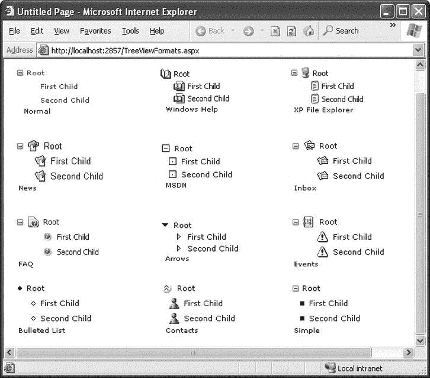

[图 13-11](#_Fig11) 。树形视图的不同外观

尽管 ImageSet 和 NodeIndent 选项本身可以产生显著的效果，但它们并不是配置 TreeView 的唯一选择。表 13-5 列出了树形视图的一些最有用的属性。

[表 13-5](#_Tab5) 。有用的 TreeView 属性

| 财产 | 描述 |
| --- | --- |
| MaxDataBindDepth | 确定树视图将显示多少层。默认情况下，MaxDataBindDepth 为–1，您将看到整个树。但是，如果您使用 2 这样的值，您将在起始节点下只看到两层。这有助于减少冗长的多层次站点地图的显示。 |
| 扩展深度 | 允许您指定最初可见的节点级别。如果使用 0，TreeView 开始完全关闭。如果使用 1，则只展开第一级，依此类推。默认情况下，ExpandDepth 设置为常量 FullyExpand (-1)，这意味着树被完全展开，所有节点在页面上都可见。 |
| 不重要 | 设置 TreeView 中每一级节点之间的像素数。将此项设置为 0 将创建非缩进的 TreeView，这样可以节省空间。非缩进的树形视图允许你模拟一个原位菜单(例如，参见[图 13-12](#Fig12) )。 |
| 数据集 | 允许您对折叠、展开和不可展开的节点使用预定义的节点图像集合。您可以在 TreeViewImageSet 枚举中指定一个值。通过设置 CollapseImageUrl、ExpandImageUrl 和 NoExpandImageUrl 属性，可以重写要更改的任何节点图像。 |
| CollapseImageUrl、展开 ImageUrl 和 noexpandimageurl | 设置显示在折叠节点(CollapseImageUrl)和展开节点(ExpandImageUrl)的节点旁边的图片。如果节点没有任何子节点，则使用 NoExpandImageUrl。如果您不想创建自己的自定义节点图像，可以使用 ImageSet 属性来使用几个内置图像集合中的一个。 |
| 节点包装 | 当设置为 true 时，允许节点在多行上换行。 |
| ShowExpandCollapse | 设置为 false 时隐藏展开/折叠框。不建议这样做，因为用户不点击就无法展开或折叠某个级别(这会导致浏览器导航到该页面)。 |
| 展示线 | 设置为 true 时，添加连接每个节点的线条。 |
| 显示复选框 | 设置为 true 时，在每个节点旁边显示一个复选框。这对于站点地图不是很有用，但是对于其他类型的树很有用。 |

属性为您提供了相当大的定制能力，但是最有趣的格式化特性之一来自 TreeView 样式，这将在下一节中描述。

树形视图样式

样式由 TreeNodeStyle 类表示，该类派生自更常规的 Style 类。与其他丰富控件一样，样式为您提供了设置背景和前景色、字体和边框的选项。此外，TreeNodeStyle 类添加了特定于节点的样式属性，如[表 13-6](#Tab6) 所示。这些属性处理节点图像和节点周围的间距。

[表 13-6](#_Tab6) 。TreeNodeStyle-添加属性

| 财产 | 描述 |
| --- | --- |
| ImageUrl | 节点旁边显示的图像的 URL。 |
| 节点间距 | 当前节点与其上下节点之间的间距(以像素为单位)。 |
| 垂直添加 | 节点文本的顶部和底部以及文本周围的边框之间的间距(以像素为单位)。 |
| 水平填充 | 节点文本和文本周围边框的左右间距(以像素为单位)。 |
| 子节点添加 | 展开的父节点的最后一个子节点和下一个节点之间的空间(以像素为单位)(例如，图 13-10 中[投资和产品节点之间的空间)。](#Fig10) |

因为 TreeView 是使用 HTML 表呈现的，所以您可以设置各种元素的填充，以控制文本周围、节点之间等的间距。另一个起作用的属性是 TreeView。NodeIndent，它设置树层次结构的每个后续级别中缩进的像素数(从左开始)。[图 13-12](#Fig12) 显示了这些设置如何应用于单个节点。

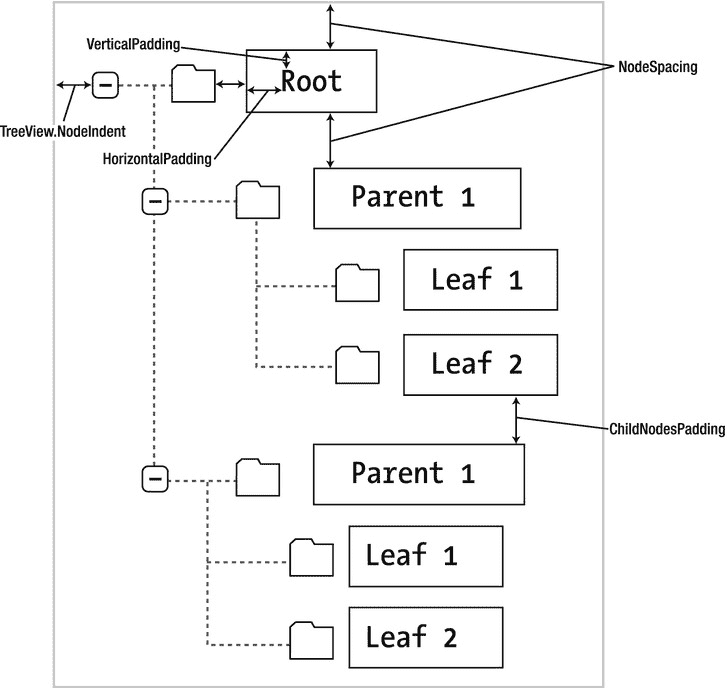

[图 13-12](#_Fig12) 。节点间距

很明显，样式给了你很多控制不同节点如何显示的方法。若要应用简单的 TreeView 改造，并对 TreeView 中的每个节点使用相同的样式设置，可以通过 TreeView 应用样式设置。NodeStyle 属性。您可以直接在控件标记中或通过使用“属性”窗口来实现这一点。

例如，下面的树形视图应用了自定义字体、字体大小、文本颜色、填充和间距:

```cs
<asp:TreeView ID="TreeView1" runat="server" DataSourceID="SiteMapDataSource1">
    <NodeStyle Font-Names="Tahoma" Font-Size="10pt" ForeColor="Blue"
     HorizontalPadding="5px" NodeSpacing="0px" VerticalPadding="0px" />
</asp:TreeView>
```

通常，这种方法不能提供足够的微调。相反，您会想要调整树的特定部分。在这种情况下，您需要找到适用于树的适当部分的样式对象，如下两节所述。

将样式应用于节点类型

TreeView 允许您单独控制节点类型的样式，例如，根节点、包含其他节点的节点、选定的节点等等。表 13-7 列出了不同的树形视图样式，并解释了它们影响的节点。

[表 13-7](#_Tab7) 。TreeView 样式属性

| 财产 | 描述 |
| --- | --- |
| 时尚风格 | 适用于所有节点。其他样式可能会覆盖 NodeStyle 属性中指定的部分或全部详细信息。 |
| rootmodestyle | 仅适用于第一级(根)节点。 |
| parentmodestyle | 适用于包含其他节点的任何节点，根节点除外。 |
| leafmodestyle | 适用于任何不包含子节点且不是根节点的节点。 |
| SelectedNodeStyle | 应用于当前选定的节点。 |
| hovermodestyle | 应用于用户用鼠标悬停的节点。这些设置仅适用于支持必要动态脚本的高级客户端。 |

下面是一个示例树视图，它首先使用 NodeStyle 属性定义一些标准样式特征，然后使用[表 13-7](#Tab7) 中的属性微调树的不同部分:

```cs
<asp:TreeView ID="TreeView1" runat="server" DataSourceID="SiteMapDataSource1">
 <NodeStyle Font-Names="Tahoma" Font-Size="10pt" ForeColor="Blue"
  HorizontalPadding="5px" NodeSpacing="0px" VerticalPadding="0px" />
 <ParentNodeStyle Font-Bold="False" />
 <HoverNodeStyle Font-Underline="True" ForeColor="#5555DD" />
 <SelectedNodeStyle Font-Underline="True" ForeColor="#5555DD" />
</asp:TreeView>
```

表 13-7 按照从最一般到最具体的顺序列出了样式。例如，这意味着 SelectedNodeStyle 设置会覆盖 RootNodeStyle 中的任何冲突设置。(如果不希望节点可选，请设置 TreeNode。选择操作为无。)但是，RootNodeStyle、ParentNodeStyle 和 LeafNodeStyle 设置从不冲突，因为根节点、父节点和叶节点的定义是互斥的。例如，一个节点不能同时是父节点和根节点 TreeView 只是将其指定为根节点。

将样式应用到节点级别

能够对不同类型的节点应用样式是很有趣的，但是通常一个更有用的特性是能够基于节点级别应用样式。这是因为许多树使用严格的等级制度。(例如，第一层节点表示类别，第二层表示产品，第三层表示订单，依此类推。)在这种情况下，确定一个节点是否有子节点就不那么重要了。相反，确定节点的深度很重要。

唯一的问题是一个树形视图理论上可以有无限数量的节点层。因此，公开 FirstLevelStyle、SecondLevelStyle 等属性是没有意义的。相反，TreeView 有一个 LevelStyles 集合，可以包含任意多的条目。级别是从集合中样式的位置推断出来的，因此第一个条目被视为根级别，第二个条目是第二个节点级别，依此类推。要使该系统正常工作，您必须遵循相同的顺序，并且如果您想跳过一个级别而不更改格式，则必须包含一个空的样式占位符。

例如，下面的树形视图通过应用不同的间距和不同的字体来区分级别:

```cs
<asp:TreeView runat="server" HoverNodeStyle-Font-Underline="True"
 ShowExpandCollapse="False" NodeIndent="3" DataSourceID="SiteMapDataSource1">
 <LevelStyles>
    <asp:TreeNodeStyle ChildNodesPadding="10" Font-Bold="True" Font-Size="12pt"
     ForeColor="DarkGreen"/>
    <asp:TreeNodeStyle ChildNodesPadding="5" Font-Bold="True" Font-Size="10pt" />
    <asp:TreeNodeStyle ChildNodesPadding="5" Font-UnderLine="True"
     Font-Size="10pt" />
 </LevelStyles>
</asp:TreeView>
```

如果你把这个应用到前面例子中显示的类别和产品列表，你会看到一个类似于图 13-13 中显示的页面。

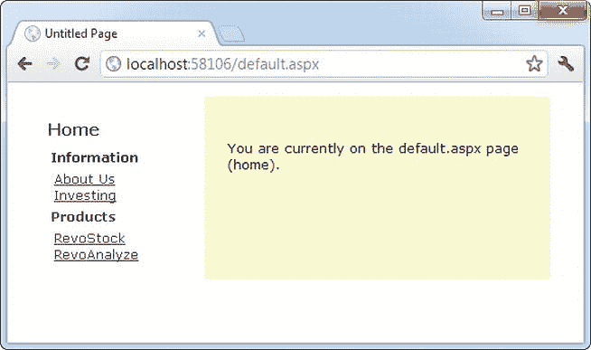

[图 13-13](#_Fig13) 。带有样式的树形视图

TREEVIEW 自动格式

使用正确的样式和图片组合可以极大地改变你的树形视图。然而，对于那些不太喜欢艺术的人来说，令人欣慰的是，微软已经通过 TreeView 的自动格式功能提供了许多经典设计。

要使用它，首先在设计图面上选择 TreeView。然后单击出现在树视图右上角旁边的箭头图标以显示其智能标记。在智能标记中，单击“自动设置格式”链接以显示“自动设置格式”对话框。在“自动设置格式”对话框中，您可以从各种预设格式中进行选择，每种格式都有一个小预览。单击“应用”在 TreeView 上试用该格式，单击“取消”退出，单击“确定”将其正式化并返回 Visual Studio。

不同的格式大致对应于不同的 TreeViewImageSet 值。然而，现实并非如此简单。当您选择 TreeView 格式时，Visual Studio 会设置 ImageSet 属性并应用一些匹配的样式设置，以帮助您获得完美的最终外观。

菜单控件

菜单控件 是另一个支持分层数据的丰富控件。与 TreeView 一样，您可以将 Menu 控件绑定到数据源，也可以使用 MenuItem 对象手动填充它。

若要尝试 Menu 控件，请从母版页中移除 TreeView，并添加以下 Menu 控件标记:

```cs
<asp:Menu ID="Menu1" runat="server" DataSourceID="SiteMapDataSource1" />
```

请注意，这不会配置任何属性—它使用默认外观。您需要执行的唯一步骤是设置 DataSourceID 属性，将菜单链接到站点地图信息。

当菜单第一次出现时，您只会看到开始节点，旁边有一个箭头。当您将鼠标移动到起始节点上时，下一级节点将弹出显示。你可以继续这个过程，向下钻取尽可能多的层级，直到找到你想点击的页面(见[图 13-14](#Fig14) )。如果你点击一个菜单项，你会被转到相应的页面，就像你在树形视图中点击一个节点一样。但与树形视图不同的是，每次你点击进入一个新页面时，菜单会自动折叠回原来的样子。它不会展开以显示当前页面。

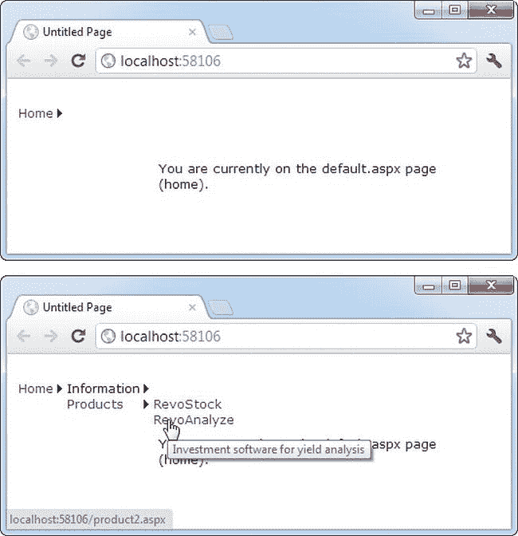

[图 13-14](#_Fig14) 。浏览菜单

总的来说，菜单和 TreeView 控件展示了惊人相似的编程模型，尽管它们呈现的方式完全不同。它们也有类似的基于样式的格式化模型 。但是存在一些值得注意的差异:

*   菜单显示单个子菜单。TreeView 可以一次展开任意数量的节点分支。
*   该菜单在页面中显示根级别的链接。所有其他项目都使用弹出菜单显示，该菜单出现在页面上任何其他内容的上方。TreeView 在页面内联显示所有项目。
*   菜单支持模板。TreeView 没有。(菜单模板将在本节稍后讨论。)
*   TreeView 支持任何节点的复选框。菜单没有。
*   菜单支持水平和垂直布局，具体取决于 Orientation 属性。TreeView 仅支持垂直布局。

菜单样式

菜单控件提供了大量的样式。与 TreeView 一样，该菜单添加了一个自定义样式类，名为 MenuItemStyle。此样式添加了间距属性，如 ItemSpacing、HorizontalPadding 和 VerticalPadding。但是，您不能通过样式设置菜单项图像，因为它没有 ImageUrl 属性。

与树形视图非常相似，菜单支持为不同的菜单级别定义不同的菜单样式。然而，菜单控件鼓励您采用的关键区别是静态的项(第一次生成时显示在页面中的根级项)和动态的*项(当用户将鼠标移动到菜单的某个部分时添加到飞出式菜单中的项)。大多数网站在这两个元素的风格上有一定的区别。为了支持这一点，Menu 类定义了两组并行的样式，一组应用于静态项目，另一组应用于动态项目，如[表 13-8](#Tab8) 所示。*

[表 13-8](#_Tab8) 。菜单样式

| 静态风格 | 动态风格 | 描述 |
| --- | --- | --- |
| 静态菜单样式 | 动态菜单样式 | 设置显示所有菜单项的整个“框”的外观。对于 StaticMenuStyle，此框出现在页面上，对于 DynamicMenuStyle，它显示为弹出窗口。 |
| StaticMenuItemStyle | 动态菜单样式 | 设置单个菜单项的外观。 |
| StaticSelectedStyle | 动态选择样式 | 设置选定项目的外观。请注意，所选项目不是当前悬停的项目；它是以前单击过的项目(并且触发了最后一次回发)。 |
| 静态 HoverStyle | DynamicHoverStyle | 设置用户用鼠标悬停的项目的外观。 |

除了这些样式，您还可以设置特定于级别的样式，以便每一级别的菜单和子菜单都是不同的。这可以通过使用 LevelMenuItemStyles 集合来实现，该集合的工作方式类似于 TreeView。前面讨论过的 LevelStyles 集合。您的样式在集合中的位置决定了菜单是否将它用于第一级、第二级、第三级等项目。还可以使用 LevelSelectedStyles 集合为选定项目设置特定于级别的格式。

在分离动态和静态风格时，似乎必须做一些不必要的工作。当您考虑菜单控件的另一个显著特性时，这种模型的原因就变得显而易见了——它允许您选择静态级别的数量。默认情况下，只存在一个静态级别，当用户将鼠标悬停在相应的父级上时，其他所有内容都显示为一个弹出菜单。但是你可以设置菜单。StaticDisplayLevels 属性来改变这一切。例如，如果将其设置为 2，则菜单的前两级将使用静态样式在页面中呈现。(您可以使用 StaticSubMenuIndent 属性来控制每个级别的缩进。)

[图 13-15](#Fig15) 显示了 StaticDisplayLevels 设置为 2 的菜单(以及一些通过自动格式链接应用的样式)。当你将鼠标悬停在菜单项上时，每个菜单项仍然会被高亮显示，就像在非静态菜单中一样，选择也将像在非静态菜单中一样工作。

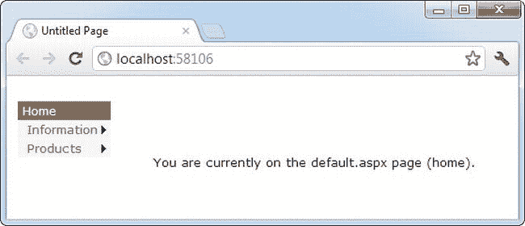

[图 13-15](#_Fig15) 。具有两个静态级别的菜单

如果您使用菜单进行导航，每次您点击进入新页面时，菜单都会返回到其原始外观，显示所有静态级别，但隐藏所有动态级别。

 **提示**菜单控件公开了更多的顶级属性，用于调整特定的渲染方面。例如，您可以设定弹出式菜单消失前的延迟时间(DisappearAfter)、用于扩展图标和分隔符的默认图像、滚动行为(当浏览器窗口太小而无法容纳弹出式菜单时，滚动行为开始起作用)等等。更多信息，可以在线阅读`http://msdn.microsoft.com/library/system.web.ui.webcontrols.menu.aspx`的菜单控制参考。

菜单模板

Menu 控件还通过 StaticItemTemplate 和 DynamicItemTemplate 属性支持模板。这些模板决定了为每个菜单项呈现的 HTML，让您可以完全控制。

您已经看到了如何为 SiteMapPath 创建模板，但是为菜单创建模板的过程有点不同。SiteMapPath 中的每个节点都直接绑定到 SiteMapNode 对象，而菜单则绑定到其他对象:专用的 MenuItem 对象。

这种微妙的怪癖会让生活变得复杂。首先，您不能依赖诸如标题、描述和 Url 等属性，这些属性是由 SiteMapNode 对象提供的。相反，您需要使用 MenuItem。属性获取需要显示的信息，如下所示:

```cs
<asp:Menu ID="Menu1" runat="server">
 <StaticItemTemplate>
    <%# Eval("Text") %>
 </StaticItemTemplate>
</asp:Menu>
```

您可能希望使用菜单的模板功能的一个原因是在一个菜单项中显示多条信息。例如，您可能希望同时显示标题*和*SiteMapNode 对该项目的描述(而不仅仅是标题)。不幸的是，这不像使用 SiteMapPath 那么容易。同样，问题是菜单直接绑定到 MenuItem 对象，而不是 SiteMapNode 对象，MenuItem 对象不能提供您需要的信息。

如果你真的很绝望，有一个使用高级数据绑定技术的解决方法。您可以绑定到在 page 类中创建的自定义方法，而不是绑定到 MenuItem 对象的属性。然后，这个自定义方法可以包含获取正确的 SiteMapNode 对象(基于当前 URL)所需的代码，并提供您需要的额外信息。在理想情况下，这种额外的工作是不必要的，但不幸的是，这是这种情况下最简单的变通方法。

例如，考虑图 13-16 中显示的更具描述性的菜单项。

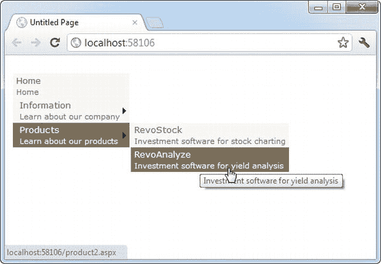

[图 13-16](#_Fig16) 。在菜单中显示节点描述

要创建这个示例，您需要构建一个使用两种类型的数据绑定表达式的模板。第一种类型只是获取 MenuItem 文本(即页面标题)。您已经知道如何编写这种数据绑定表达式:

```cs
    <%# Eval("Text") %>
```

第二种类型的数据绑定表达式更加复杂。它使用一个名为 GetDescriptionFromTitle() 的自定义方法，您需要创建该方法。该方法获取页面标题信息，并返回更有趣的内容—在本例中，是该项目的完整描述:

```cs
<%# GetDescriptionFromTitle(((MenuItem)Container.DataItem).Text) %>
```

遗憾的是，Eval()方法无法帮助您解决这种数据绑定表达式。相反，您需要显式地获取数据对象(使用容器。DataItem)，将其转换为适当的类型(MenuItem)，然后检索正确的属性(Text)。这将获得与前面的数据绑定表达式相同的页面标题，但是它允许您将它传递给 GetDescriptionFromTitle()方法。

下面是使用两种类型的数据绑定表达式来显示顶级静态菜单项和二级弹出(动态)项的完整模板:

```cs
<asp:Menu ID="Menu1" runat="server" DataSourceID="SiteMapDataSource1">
 <StaticItemTemplate>
    <%# Eval("Text") %><br />
    <small>
    <%# GetDescriptionFromTitle(((MenuItem)Container.DataItem).Text) %>
    </small>
 </StaticItemTemplate>
 <DynamicItemTemplate>
    <%# Eval("Text") %><br />
    <small>
    <%# GetDescriptionFromTitle(((MenuItem)Container.DataItem).Text) %>
    </small>
 </DynamicItemTemplate>
</asp:Menu>
```

下一步是在页面类的代码中创建 GetDescriptionFromTitle()方法。此方法属于具有 Menu 控件的页面，在本例中，该页面是母版页。GetDescriptionFromTitle()方法还必须具有受保护的(或公共的)可访问性，以便 ASP.NET 可以在数据绑定过程中调用它:

```cs
protected string GetDescriptionFromTitle(string title)
{... }
```

棘手的部分是填写您需要的代码。在这个例子中，涉及到两个定制方法。为了找到它需要的节点，GetDescriptionFromTitle()调用另一个方法，名为 SearchNodes()。SearchNodes()方法多次调用自身，在整个节点层次结构中执行递归搜索。只有当找到匹配的节点时，它才结束搜索，并将其返回给 GetDescriptionFromTitle()。最后，GetDescriptionFromTitle()提取描述信息(以及您感兴趣的任何其他信息)。

下面是使该示例工作的完整代码:

```cs
protected string GetDescriptionFromTitle(string title)
{
    // This assumes there's only one node with this title.
    SiteMapNode startingNode = SiteMap.RootNode;
    SiteMapNode matchNode = SearchNodes(startingNode, title);
    if (matchNode == null)
    {
        return null;
    }
    else
    {
        return matchNode.Description;
    }
}
```

```cs
private SiteMapNode SearchNodes(SiteMapNode node, string title)
{
    if (node.Title == title)
    {
        return node;
    }
    else
    {
        // Perform recursive search.
        foreach (SiteMapNode child in node.ChildNodes)
        {
            SiteMapNode matchNode = SearchNodes(child, title);
            // Was a match found?
            // If so, return it.
            if (matchNode != null) return matchNode;
        }
        // All the nodes were examined, but no match was found.
        return null;
    }
}
```

一旦完成了这一繁重的工作，就可以在模板中使用 GetDescriptionFromTitle()方法来获取所需的附加信息。

最后一句话

在本章中，您探索了新的导航模型，并学习了如何定义站点地图和绑定导航数据。然后，您考虑了专门为导航数据设计的三个控件:SiteMapPath、TreeView 和 Menu。使用这些控件，你可以用很少的代码在你的网站上添加非常丰富的站点地图。但是在你开始之前，确保你已经确定了网站的结构。只有这样，您才能创建完美的站点地图，并选择在导航控件中呈现站点地图信息的最佳方式。*