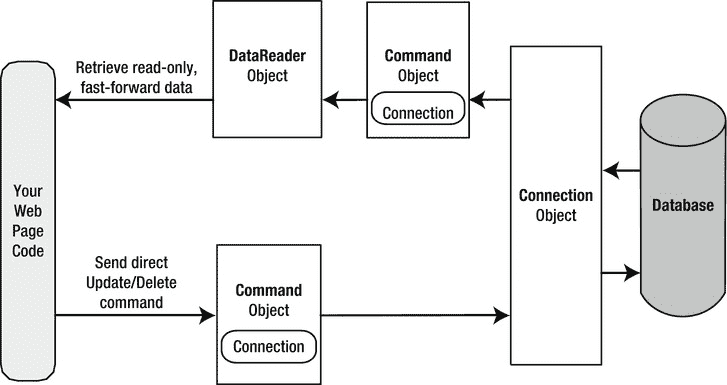

# 十四、ADO.NET 基础

在本书的开头，你了解到 ASP.NET 只是微软雄心勃勃的计划中的一个组成部分。NET 平台。如你所知，。NET 还包括现代语言和一个工具包，允许你做从处理错误到分析 XML 文档的任何事情。在本章中，您将探索。NET 框架:ADO.NET 数据访问模型。

很简单，ADO.NET 是一种技术。NET 应用用来与数据库进行交互。在本章中，您将了解 about 和提供其功能的对象系列。您还将学习如何通过创建检索和更新数据库记录的简单页面来使用这些对象。然而，您不会学到访问数据库的最有趣的方法之一——使用一种称为实体 LINQ 的代码生成和数据建模工具。尽管实体的 LINQ 是为数据库生成数据模型的一种强大而实用的方法，但它可能对应用来说是多余的，可能是不必要的复杂，或者可能无法提供您需要的所有控制(例如，如果您想执行不寻常的数据任务或实现复杂的性能优化技术)。出于这些原因，每个 ASP.NET 开发者都应该从学习本章中涉及的 ADO.NET 基础知识开始。

 **注**LINQ 到实体特征是一个*更高级别的*模型。这意味着它使用你将在本章学到的 about 类来完成它的脏活。在你掌握了 ADO.NET 的精髓之后，你就可以在第 24 章中探索 LINQ 的各个实体了。

了解数据库

几乎所有软件都是和数据一起工作的。事实上，典型的 web 应用通常只是一个位于复杂的数据驱动代码之上的瘦用户界面外壳，它从数据库中读取和写入信息。网站用户通常不知道(或不关心)显示的信息来自数据库。他们只是想能够搜索你的产品目录，下订单，或检查他们的付款记录。

管理数据最常见的方法是使用数据库。数据库技术 对于商业软件尤其有用，因为商业软件通常需要相关的信息集合。例如，销售程序的典型数据库由一个客户列表、一个产品列表和一个销售列表组成，这些列表利用了其他两个表中的信息。这种类型的信息最好用一个*关系模型* 来描述，它是所有现代数据库产品的基础，包括 SQL Server、Oracle，甚至 Microsoft Access。

您可能知道，关系模型将信息分解成最小和最简洁的单元。例如，销售记录并不存储已售出产品的所有信息。相反，它只存储一个产品 ID，该 ID 引用产品表中的一个完整记录，如图 14-1 所示。


[图 14-1](#_Fig1) 。基本表关系

尽管在技术上可以将数据组织成表，并以一个或多个文件的形式存储在硬盘上(可能使用 XML 之类的标准)，但这种方法不太灵活。相反，一个 web 应用需要一个完整的*关系数据库管理系统* (RDBMS) ，比如 SQL Server。RDBMS 处理数据基础设施，确保最佳性能和可靠性。例如，RDBMS 负责同时向多个用户提供数据，禁止无效数据，并使用事务一次提交多组操作。

在大多数 ASP.NET 应用中，你需要使用数据库来完成一些任务。以下是 web 应用中数据工作的一些基本示例:

*   电子商务网站(例如，Amazon.com)使用详细的数据库来存储产品目录。他们还在大量相关表中跟踪订单、客户、发货记录和库存信息。
*   搜索引擎(例如 Google)使用数据库来存储页面 URL、链接和关键字的索引。
*   知识库(例如，Microsoft Support)使用结构化程度较低的数据库来存储大量信息或指向各种文档和资源的链接。
*   媒体网站(例如，纽约时报)将它们的文章存储在数据库中。

在考虑 ASP.NET 应用中需要在哪里使用数据库技术时，您可能不会有任何困难。哪个 web 应用不能从记录用户评论的留言簿或使用后端数据库存储潜在客户或联系人列表的简单电子邮件地址提交表单中受益？这就是 ADO.NET 出现的原因。ADO.NET 是一种技术，旨在让 ASP.NET 程序(或任何其他。NET 程序)访问数据。

 **提示**如果你是一个完全的数据库新手，你可以通过使用`www.asp.net/sql-server/videos`的视频教程来快速掌握基本的数据库概念。在那里，您将找到九个多小时的说明，描述如何使用 SQL Server Express。(内容最初是用 SQL Server Express 2005 准备的，但它仍然适用于 SQL Server 2012。)教程从绝对基础(涵盖数据库数据类型和表关系等主题)转向更高级的主题，如全文搜索、reporting services 和网络安全。

配置您的数据库

在运行任何数据访问代码之前，您需要一个数据库服务器来接受您的命令。尽管有几十个好的选择，所有这些都同样适用于 ADO.NET(并且基本上需要相同的代码)，但是绝大多数 ASP.NET 应用都使用 Microsoft SQL Server。

本章包括适用于 SQL Server 7 或更高版本的代码，尽管您可以轻松地修改这些代码以适用于其他数据库产品。如果您没有 SQL Server 的完整版本，也不必担心，您可以使用免费的 SQL Server Express(如下一节所述)。它包括开发和测试 web 应用所需的所有数据库特性。

 **注**本章(以及接下来的两章)使用了来自 pubs 和 Northwind 数据库的例子。这些数据库没有预装在 SQL Server 的现代版本中。但是，您可以通过使用在线示例提供的脚本来轻松安装它们。有关完整说明，请参阅 readme.txt 文件，或者参阅本章后面的“使用 sqlcmd 命令行工具”一节。

使用 SQL Server Express

如果您手头没有测试数据库服务器，您可能希望使用 SQL Server 2012 Express Edition。它是 SQL Server 的缩小版，可以免费分发。SQL Server Express 有某些限制，例如，它只能使用一个 CPU、四个内部 CPU 核心和最大 1GB 的 RAM。此外，SQL Server Express 数据库不能大于 10GB。然而，它仍然非常强大，适合许多中等规模的网站。更好的是，如果以后需要更多功能，您可以轻松地从 SQL Server Express 升级到 SQL Server 的付费版本。

SQL Server 2012 Express 居然有两个版本，让生活略显混乱。你可以从 [`www.microsoft.com/express/sql`](http://www.microsoft.com/express/sql) 下载独立版，有没有数据库工具都可以。如果您将它安装在真实的 web 服务器上，这就是您想要的版本(并且您没有 SQL Server 的完整版本)。第二个版本是命名为 SQL Server 2012 Express LocalDB 的版本，它包含在 Visual Studio 的所有版本中。它具有几乎完全相同的功能，但是它只是一个用于开发目的的测试工具(它不包括任何额外的工具)。

在本章中，我们将两个版本都称为 SQL Server Express，除非我们需要强调两者之间的区别。

有关 SQL Server Express 与 SQL Server 其他版本的比较，请参见`www.microsoft.com/sqlserver/en/us/editions.aspx`。SQL Server Express 包含在 Visual Studio 安装中，但是如果您需要单独下载它或者想要下载与之配合使用的免费图形管理工具，请转到`www.microsoft.com/express/database`。

在 Visual Studio 中浏览和修改数据库

作为一名 ASP.NET 开发人员，您可能有责任创建 web 应用所需的数据库。或者，数据库可能已经存在，或者由专门的数据库管理员负责。如果您使用的是 SQL Server 的完整版本，您可能会使用 SQL Server Management Studio 之类的图形工具来创建和管理数据库。

 **提示** SQL Server Express 在您用来安装它的下载中不包括 SQL Server Management Studio。不过可以从`www.microsoft.com/express/database`单独下载。单击下载 SQL Server 2012 Express 按钮以显示可下载包的列表。然后单击 SQL Server Management Studio Express(仅工具)旁边的下载按钮。

如果您没有合适的工具来管理数据库，或者您不想离开 Visual Studio 的舒适环境，您可以使用 Visual Studio 的服务器资源管理器窗口来执行许多相同的任务。(非常容易混淆的是，在 Visual Studio Express for Web 中,“服务器资源管理器”窗口被称为“数据库资源管理器”窗口。)

您可能会在 Visual Studio 窗口的右侧看到服务器资源管理器的一个选项卡，该选项卡与工具箱分组在一起并处于折叠状态。如果有，请单击选项卡将其展开。如果没有，选择查看服务器资源管理器来显示它(或者在 Visual Studio Express for Web 中查看数据库资源管理器)。

使用服务器资源管理器中的“数据连接”节点，可以连接到现有数据库或创建新数据库。假设您已经安装了 pubs 数据库(有关说明，请参见 readme.txt 文件)，您可以通过以下步骤创建一个到它的连接:

1.  右键单击“数据连接”节点，然后选择“添加连接”。
2.  出现“选择数据源”窗口时，选择 Microsoft SQL Server，然后单击“继续”。
3.  If you’re using a full version of SQL Server, enter **localhost** as your server name. This indicates that the database server is the default instance on the local computer. (Replace this with the name of a remote computer if needed.) SQL Server Express is a bit different. If you’re using SQL Server Express LocalDB (the version that’s included with Visual Studio), you need to enter **(localdb)\v11.0** instead of **localhost**, as shown in [Figure 14-2](#Fig2). If you’ve downloaded the full edition of SQL Server Express, you need to enter **localhost\SQLEXPRESS** instead.

    

    [图 14-2。](#_Fig2)在 Visual Studio 中创建连接

4.  单击“测试连接”按钮，验证这是您的数据库的位置。如果您尚未安装数据库产品，此步骤将会失败。否则，您将知道您的数据库服务器已经安装并正在运行。
5.  In the Select or Enter a Database Name list, choose the pubs database. (In order for this to work, the pubs database must already be installed. You can install it by using the database script that’s included with the sample code, as explained in the following section.) If you want to see more than one database in Visual Studio, you’ll need to add more than one data connection.

     **提示**或者，您可以选择通过右键单击“数据连接”节点并选择“创建新的 SQL Server 数据库”来创建新的数据库。

6.  Click OK. The database connection appears in the Server Explorer window. You can now explore its groups to see and edit tables, stored procedures, and more. For example, if you right-click a table and choose Show Table Data, you’ll see a grid of records that you can browse and edit, as shown in [Figure 14-3](#Fig3).

    

    [图 14-3](#_Fig3) 。在 Visual Studio 中编辑表数据

 **提示**如果您使用 SQL Server Express，服务器资源管理器窗口会非常方便，它使您能够将数据库直接放在 web 应用的 App_Data 文件夹中(而不是将所有数据库放在单独的专用位置)。如果 Visual Studio 在 App_Data 文件夹中找到数据库，它会自动将该数据库的连接添加到数据连接组中。要了解有关此功能的更多信息，请参阅本章后面的“建立用户实例连接”一节。

使用 sqlcmd 命令行工具

SQL Server 包括一个名为*sqlcmd.exe*的方便的命令行工具，您可以使用它从 Windows 命令提示符执行数据库任务。与诸如 SQL Server Management Studio 之类的管理工具相比，sqlcmd 并没有提供很多多余的东西。这只是执行数据库任务的一种快速而不方便的方式。sqlcmd 通常在批处理文件中使用，例如，在自动安装过程中创建数据库表。

sqlcmd 工具位于目录 c:\ Program Files \ Microsoft SQL Server \ 110 \ Tools \ Binn 中。要运行它，您需要在此位置打开一个命令提示符窗口。(一种简单的方法是在 Windows 资源管理器中浏览到 version 文件夹，按住 Shift，然后右键单击 Binn 文件夹。然后，从菜单中选择“在此打开命令菜单窗口”。)一旦进入正确的文件夹，就可以使用 sqlcmd 连接到数据库并执行脚本。

运行 sqlcmd 时，由您决定是否提供正确的参数。要查看所有可能的参数，请键入以下命令:

```cs
sqlcmd -?
```

两个常用的 sqlcmd 参数是–S(指定数据库服务器的位置)和–I(提供包含要运行的 SQL 命令的脚本文件)。例如，可下载的代码示例包括一个名为 InstPubs.sql 的文件，该文件包含创建 Pubs 数据库并使用示例数据填充数据库所需的命令。如果您使用的是 SQL Server Express LocalDB，并且您已经将代码安装在名为 c:\ Beginning ASP.NET 的文件夹中，您可以像这样运行 InstPubs.sql 脚本:

```cs
sqlcmd -S (localdb)\v11.0 -i "c:\Beginning ASP.NET\InstPubs.sql"
```

如果您在本地计算机上使用 SQL Server 的完整版本，则根本不需要提供服务器名称:

```cs
sqlcmd -i "c:\Beginning ASP.NET\InstPubs.sql"
```

如果您的数据库在另一台计算机上，您需要使用–S 参数提供该计算机的名称(或者只在该计算机上运行 sqlcmd)。

 **注意**sqlcmd 使用的参数区分大小写。例如，如果使用–S 而不是–S，您将收到一条模糊的错误消息，通知您 sqlcmd 无法登录。

图 14-4 显示了使用 sqlcmd 运行 InstPubs.sql 时得到的反馈。


[图 14-4](#_Fig4) 。使用 sqlcmd.exe 运行 SQL 脚本

在本书中，您偶尔会看到有关使用 sqlcmd 执行某种数据库配置的说明。但是，通过使用 SQL Server Management Studio 等工具中的图形界面，通常可以获得相同的结果(只需更多的点击)。例如，要通过运行 SQL 脚本来安装数据库，只需启动 SQL Server Management Studio，打开 SQL 文件(使用 File  Open  File 命令)，然后运行它(使用 Query  Execute 命令)。

了解 SQL 基础知识

当您通过 ADO.NET 与数据源交互时，您使用结构化查询语言(SQL)来检索、修改和更新信息。在某些情况下，ADO.NET 会为你隐藏一些细节甚至自动生成所需的 SQL 语句 。然而，为了设计一个高效的数据库应用，您需要理解 SQL 的基本概念。

SQL 是用于与关系数据库交互的标准数据访问语言。不同的数据库在支持 SQL 或添加其他特性方面有所不同，但是用于选择、添加和修改数据的核心命令是通用的。在 SQL Server 这样的数据库产品中，可以使用 SQL 为存储过程和触发器创建相当复杂的 SQL 脚本(尽管它们不具备完全面向对象编程语言的能力)。然而，当使用 ADO.NET 时，您可能只会使用以下标准类型的 SQL 语句 :

*   Select 语句检索记录。
*   更新语句修改现有记录。
*   Insert 语句添加一条新记录。
*   Delete 语句删除现有记录。

如果您已经很好地理解了 SQL，那么您可以跳过接下来的几节。否则，请继续阅读，快速浏览 SQL 基础知识。

 **提示**要了解更多关于 SQL 的知识，可以使用互联网上的 SQL 教程，比如`www.w3schools.com/sql`中的教程。如果您正在使用 SQL Server，您可以使用其完整的联机丛书帮助来成为数据库专家。

在 Visual Studio 中运行查询

如果您以前从未使用过 SQL，那么在开始在 ASP.NET 站点中使用它之前，您可能想尝试一下并创建一些示例查询。大多数数据库产品都提供了某种测试查询的工具。如果您使用的是 SQL Server 的完整版本，可以尝试 SQL Server Management Studio。如果不想使用额外的工具，可以使用前面介绍的服务器资源管理器窗口来运行查询。只需在 Visual Studio 中遵循以下步骤:

1.  右键单击您的连接，然后选择“新建查询”。
2.  Choose the table (or tables) you want to use in your query from the Add Table dialog box (as shown in [Figure 14-5](#Fig5)). Click Add and then click Close.

    

    [图 14-5](#_Fig5) 。向查询中添加表

3.  现在您将看到一个方便的查询构建窗口。您可以通过在所需字段旁边添加复选标记来创建查询，也可以在窗口的下部手动编辑 SQL。最重要的是，如果您直接编辑 SQL，您可以键入任何内容—您不需要坚持使用您在步骤 2 中选择的表，也不需要限制自己只能使用 Select 语句。
4.  When you’re ready to run the query, choose Query Designer  Execute SQL from the menu. Assuming your query doesn’t have any errors, you’ll get one of two results. If you’re selecting records, the results will appear at the bottom of the window. If you’re deleting or updating records, a message box will appear, informing you of the number of records affected (see [Figure 14-6](#Fig6)).

    

    [图 14-6](#_Fig6) 。执行查询

 **提示**用 ADO.NET 编程时，了解你的数据库总是有帮助的。如果您手头有关于它使用的数据类型、它提供的存储过程以及您需要使用的用户帐户的信息，您将能够更快地工作，并且减少出错的机会。

使用 Select 语句

要检索一行或多行数据，可以使用 Select 语句。一个基本的 Select 语句具有以下结构:

```cs
SELECT [columns]
 FROM [tables]
 WHERE [search_condition]
 ORDER BY [order_expression ASC | DESC]
```

这种格式实际上只是触及了 SQL 的皮毛。如果需要，您可以创建更复杂的查询，使用子分组、平均和合计以及其他选项(如设置最大返回行数)。通过在查询中执行这项工作(而不是在您的应用中)，您通常可以创建更高效的应用。

接下来的几节给出了示例 Select 语句。在每个示例之后，一系列带项目符号的点分解了 SQL，以解释它的每个部分是如何工作的。

示例选择语句

下面是 pubs 数据库的一个典型的(相当低效的)Select 语句。它使用 Authors 表，该表包含作者列表:

`SELECT * FROM Authors`

*   星号(*)检索表中的所有列。如果您不需要所有的信息，这对于大型表来说不是最好的方法。它增加了必须传输的数据量，并会降低服务器的速度。
*   From 子句标识 Authors 表正用于该语句。
*   该语句没有 Where 子句。这意味着将从数据库中检索所有记录，不管它有 1000 万还是 1000 万条记录。这是一种糟糕的设计实践，因为它通常会导致应用在首次部署时看起来运行良好，但随着数据库的增长会逐渐变慢。一般来说，您应该始终包含一个 Where 子句来限制可能的行数(除非您绝对需要全部行数)。查询通常受日期字段的限制(例如，包括最近三个月的所有订单)。
*   该语句没有 Order By 子句。这是一个完全可以接受的方法，特别是如果顺序不重要，或者您打算使用 ADO.NET 提供的工具自己对数据进行排序。

一个改进的 Select 语句

下面是另一个检索作者姓名列表的示例:

`SELECT au_lname, au_fname FROM Authors WHERE State='CA' ORDER BY au_lname ASC`

*   仅检索两列(au_lname 和 au_fname)。它们对应于作者的名和姓。
*   Where 子句将结果限制为居住在指定州(加利福尼亚州)的作者。请注意，Where 子句需要在要匹配的值周围加上撇号，因为它是一个文本值。
*   Order By 子句按照作者姓氏的字母顺序对信息进行排序。ASC 部分(升序)是可选的，因为这是默认的排序顺序。

一个可选的 Select 语句

这是最后一个例子:

```cs
SELECT TOP 100 * FROM Sales ORDER BY ord_date DESC
```

此示例使用 Top 子句代替 Where 语句。数据库行将按订单日期降序排序，并将检索前 100 个匹配结果。在这种情况下，是最近的 100 个订单。您还可以使用这种类型的语句来查找您销售的最昂贵的商品或表现最佳的员工。

Where 子句

在许多方面，Where 子句是 Select 语句中最重要的部分。使用 And 关键字可以查找与多个条件匹配的记录，使用 Or 关键字可以查找与一系列条件中的任何一个条件匹配的记录。还可以通过使用大于号(>)和小于号(

下面是一个使用不同表和更复杂的 Where 语句的示例:

```cs
SELECT * FROM Sales WHERE ord_date < '2000/01/01' AND ord_date > '1987/01/01'
```

本示例使用国际日期格式来比较日期值。尽管 SQL Server 支持多种日期格式，但建议使用 yyyy/mm/dd 以避免歧义。

如果您使用的是 Microsoft Access，则需要使用美国日期格式 mm/dd/yyyy，并用数字(#)符号替换日期周围的撇号。

用 Like 运算符 进行字符串匹配

Like 运算符允许您执行部分字符串匹配来筛选记录，以便查找以某一组字符开头、结尾或包含该组字符的特定字段。例如，如果您想查看所有以 *B* 开头的商店名称，您可以使用以下语句:

```cs
SELECT * FROM Stores WHERE stor_name LIKE 'B%'
```

要查看以 *S* 结尾的所有商店*的列表，您可以将百分号*放在*S*之前，如下所示:

```cs
SELECT * FROM Stores WHERE stor_name LIKE '%S'
```

使用 Like 运算符的第三种方法是返回包含某个字符或字符序列的任何记录。例如，假设您想查看名称中某处包含单词 *book* 的所有商店。在这种情况下，您可以使用如下 SQL 语句:

```cs
SELECT * FROM Stores WHERE stor_name LIKE '%book%'
```

默认情况下，SQL 不区分大小写，所以这个语法会找到 *BOOK* 、 *book* 的实例，或者混合大小写的任何变体。

最后，通过在方括号中列出允许的字符，您可以指定一组字符中的一个，而不是任何字符。这里有一个例子:

```cs
SELECT * FROM Stores WHERE stor_name LIKE '[abcd]%'
```

该 SQL 语句将返回名称以 *A* 、 *B* 、 *C* 或 *D* 开头的商店。

聚集查询

SQL 语言还定义了特殊的*聚合函数*。聚合函数处理一组值，但只返回一个值。例如，可以使用聚合函数来计算表中的记录数或计算产品的平均价格。[表 14-1](#Tab1) 列出了最常用的聚合函数。

[表 14-1](#_Tab1) 。SQL 聚合函数

| 功能 | 描述 |
| --- | --- |
| 平均值(字段名) | 计算给定数值字段中所有值的平均值 |
| 总和(字段名) | 计算给定数值字段中所有值的总和 |
| 最小(字段名称)和最大(字段名称) | 查找数字字段中的最小值或最大值 |
| 计数(*) | 返回结果集中的行数 |
| 计数(不同的字段名) | 返回结果集中指定字段的唯一(非空)行数 |

例如，以下查询返回一个值，即 Authors 表中的记录数:

```cs
SELECT COUNT(*) FROM Authors
```

下面是如何通过将每条记录中的 qty 字段相加来计算所有销售的总数量:

```cs
SELECT SUM(qty) FROM Sales
```

使用 SQL 更新语句

SQL Update 语句选择与指定搜索表达式匹配的所有记录，然后根据更新表达式修改所有记录。最简单地说，Update 语句具有以下格式:

```cs
UPDATE [table] SET [update_expression] WHERE [search_condition]
```

通常，您将使用 Update 语句来修改单个记录。以下示例调整单个作者记录中的 phone 列。它使用唯一的作者 ID 来查找正确的行。

```cs
UPDATE Authors SET phone='408 496-2222' WHERE au_id='172-32-1176'
```

该语句返回受影响的行数，在本例中为 1。图 14-7 显示了 Visual Studio 中的这个例子。


[图 14-7](#_Fig7) 。在 Visual Studio 中执行更新查询

Update 语句不会显示您所做的更改。为此，您需要通过执行另一个 Select 语句来请求该行:

```cs
SELECT phone FROM Authors WHERE au_id='172-32-1176'
```

与 Select 语句一样，您可以使用具有多个条件的 Update 语句:

```cs
UPDATE Authors SET au_lname='Whiteson', au_fname='John'
    WHERE au_lname='White' AND au_fname='Johnson'
```

您甚至可以使用 Update 语句来更新整个范围的匹配记录。以下示例将 Titles 表中 1991 年出版的每本书的价格增加 1 美元:

```cs
UPDATE Titles SET price=price+1
    WHERE pubdate >= '1991/01/01' AND pubdate < '1992/01/01'
```

使用 SQL Insert 语句

SQL Insert 语句使用您指定的信息向表中添加新记录。它采取以下形式:

```cs
INSERT INTO [table] ([column_list]) VALUES ([value_list])
```

只要确保列名列表和值列表完全对应，就可以按任意顺序提供信息:

```cs
INSERT INTO Authors (au_id, au_lname, au_fname, zip, contract)
        VALUES ('998-72-3566', 'Khan', 'John', 84152, 0)
```

为了提供一个简单的例子，这个例子省略了一些信息，比如城市和地址。但是，它提供了在 Authors 表中创建新记录所需的最基本的信息。

请记住，数据库表通常有一些要求，这些要求会阻止您添加记录，除非您用有效信息填充了所有字段。或者，如果留空，某些字段可以配置为使用默认值。在 Authors 表中，有些字段是必需的，并且为邮政编码和作者 ID 定义了一种特殊的格式。

Authors 表没有使用的一个特性是自动递增的标识字段。大多数关系数据库产品都支持这一特性，当您执行插入操作时，它会为指定的字段分配一个唯一的值。当向具有唯一递增 ID 的表中插入记录时，不应该为 ID 指定值。相反，允许数据库自动选择一个。

自动递增字段是必不可少的

如果您正在设计一个数据库，向每个表添加一个自动递增的标识字段被认为是一个好的设计。这是为每条记录分配唯一标识号的最快、最简单、最不容易出错的方法。如果没有自动生成的身份字段，您将需要付出相当大的努力来创建和维护您自己的唯一字段。程序员经常陷入使用数据字段作为唯一标识符的陷阱，比如社会保险号(SSN)或姓名。当您需要添加一个没有 SSN 的人(例如，一个外国人)或者您需要考虑一个 SSN 或姓名的变化(这将导致其他相关表出现问题，例如通过姓名或 SSN 字段标识购买者的采购订单表)时，这几乎总是会在将来某个不方便的时候带来麻烦。更好的方法是使用唯一标识符，并让数据库引擎自动为每一行分配一个任意的唯一编号。

如果创建一个没有唯一标识列的表，当需要选择特定的行进行删除或更新时，就会遇到麻烦。如果文本字段包含特殊的嵌入字符(如撇号)，基于文本字段选择记录也会导致问题。您还会发现创建表关系极其困难。

使用 SQL 删除语句

Delete 语句甚至更容易使用。它为要删除的一行或多行指定标准。小心:删除一行后，它就永远消失了！

```cs
DELETE FROM [table] WHERE [search_condition]
```

以下示例从 Authors 表中删除一个匹配行:

```cs
DELETE FROM Authors WHERE au_id='172-32-1176'
```

 **注意**如果你试图运行这个特定的删除语句，你会遇到数据库错误。问题是这个作者记录链接到 TitleAuthor 表中的一个或多个记录。除非先删除链接的记录，否则不能删除作者记录。(毕竟，把一本书和一个不存在的作者联系起来是没有意义的。)

Delete 和 Update 命令返回一条信息:受影响记录的数量。您可以检查该值，并使用它来确定操作是成功还是按预期执行。

本章的其余部分将展示如何将 SQL 与 ADO.NET 对象结合起来，在 web 应用中检索和操作数据。

了解数据提供者模型

ADO.NET 依赖于一小部分核心类中的功能。您可以将这些类分为两组:用于包含和管理数据的类(如 DataSet、DataTable、DataRow 和 DataRelation)，以及用于连接到特定数据源的类(如 Connection、Command 和 DataReader)。

数据容器类是完全通用的。无论您使用什么数据源，在您提取数据之后，它都使用相同的数据容器存储:专用数据集类。可以把数据集想象成一个集合或数组，它是一个数据包。区别在于数据集是为关系数据定制的，这意味着它本身就理解行、列和表关系等概念。

第二组类有几种类型。每组数据交互类被称为一个 ADO.NET*数据提供者*。数据提供程序是定制的，因此每个提供程序都使用性能最佳的方式与其数据源进行交互。例如，SQL Server 数据提供程序设计用于 SQL Server。在内部，它使用 SQL Server 的表格式数据流(TDS)协议进行通信，从而保证最佳性能。如果您使用的是 Oracle，您可以使用 Oracle 数据提供者(可在`http://tinyurl.com/2wbsjp6`获得)来代替。

每个提供者为命名类指定自己的前缀。因此，SQL Server 提供程序包括 SqlConnection 和 SqlCommand 类，Oracle 提供程序包括 OracleConnection 和 OracleCommand 类。在内部，这些类的工作方式非常不同，因为它们需要使用不同的底层协议连接到不同的数据库。然而，从外表上看，这些类看起来非常相似，并且提供了一组相同的基本方法，因为它们实现了相同的公共接口。这意味着您的应用不受不同标准复杂性的影响，并且可以像 Oracle 提供程序一样使用 SQL Server 提供程序。事实上，通常只需编辑代码中的类名，就可以将与 SQL Server 数据库交互的代码块转换成特定于 Oracle 的代码块。

在本章中，您将使用 SQL Server 数据提供程序。然而，您将使用的类属于三个关键的名称空间，如[表 14-2](#Tab2) 中所概述的。

[表 14-2](#_Tab2) 。用于 SQL Server 数据访问的 ADO.NET 命名空间

| 命名空间 | 目的 |
| --- | --- |
| 系统。Data.SqlClient | 包含用于连接到 Microsoft SQL Server 数据库和执行命令(如 SqlConnection 和 SqlCommand)的类。 |
| 系统。Data.SqlTypes | 包含 SQL Server 特定数据类型(如 SqlMoney 和 SqlDateTime)的结构。您可以使用这些类型来处理 SQL Server 数据类型，而无需将它们转换为标准数据类型。净当量(如系统。十进制和系统。日期时间)。这些类型不是必需的，但是它们可以让您避免任何可能对数据产生负面影响的潜在舍入或转换问题。 |
| 系统。数据 | 包含具有核心 ADO.NET 功能的基本类。其中包括 DataSet 和 DataRelation，它们允许您操作结构化关系数据。这些类完全独立于任何特定类型的数据库或您连接到它的方式。 |

在本章的其余部分，您将考虑如何编写使用这些名称空间中的类的网页代码。首先，您将考虑最直接的方法——直接数据访问。然后，您将考虑断开连接的数据访问，它允许您检索数据集中的数据并将其缓存更长时间。这两种方法互为补充，在许多 web 应用中，您将使用这两种方法的组合。

使用直接数据访问

与数据库交互最直接的方式是使用*直接数据访问* 。当您使用直接数据访问时，您负责构建一个 SQL 命令(就像您在本章前面考虑的那样)并执行它。您可以使用命令来查询、插入、更新和删除信息。

当您使用直接数据访问来查询数据时，您不会在内存中保留信息的副本。相反，您可以在数据库连接打开时使用它一小段时间，然后尽快关闭连接。这与断开连接的数据访问不同，在断开连接的数据访问中，您在 DataSet 对象中保留数据的副本，以便在数据库连接关闭后可以使用它。

直接数据模型非常适合 ASP.NET 网页，它不需要在内存中长时间保存数据的副本。请记住，ASP.NET 网页在页面被请求时被加载，并在响应返回给用户后立即关闭。这意味着一个页面通常只有几秒钟的生命周期(如果有的话)。

 **注意**虽然 ASP.NET 网页不需要在内存中存储数据来完成普通的数据管理任务，但它们可能会使用这种技术来优化性能。例如，您可以从数据库中获取一次产品目录，并将该数据保存在 web 服务器的内存中，以便当其他人请求相同的页面时可以重用它。这项技术被称为*缓存*，你将在[第 23 章](23.html)中学习使用它。

要使用简单的数据访问来查询信息 ，请遵循以下步骤:

1.  创建连接、命令和 DataReader 对象。
2.  使用 DataReader 从数据库中检索信息，并将其显示在 web 窗体上的控件中。
3.  关闭您的连接。
4.  将页面发送给用户。此时，用户看到的信息和数据库中的信息不再有任何联系，所有 point 对象都已被销毁。

要添加或更新或信息，请遵循以下步骤:

1.  创建新的连接和命令对象。
2.  执行命令(使用适当的 SQL 语句)。

本章演示了这两种方法。图 14-8 显示了 ADO.NET 对象如何交互以实现直接数据访问的高级视图。



[图 14-8](#_Fig8) 。通过 ADO.NET 直接访问数据

在继续之前，请确保导入了 ADO.NET 名称空间。在本章中，我们假设您正在使用 SQL Server 提供程序，在这种情况下，您需要这两个名称空间导入:

```cs
using System.Data;
using System.Data.SqlClient;
```

创建连接

在检索或更新数据之前，您需要连接到数据源。通常，连接数被限制在某个固定的数量，如果超过这个数量(或者因为许可证用完，或者因为数据库服务器无法容纳用户负载)，创建新连接的尝试将会失败。因此，您应该尽可能短时间地保持连接打开。您还应该在 try/catch 错误处理结构中编写数据库代码，以便在发生错误时能够做出响应，并确保即使无法执行所有工作也能关闭连接。

创建连接对象时，需要为其 ConnectionString 属性指定一个值。这个 ConnectionString 定义了计算机查找数据源、登录和选择初始数据库所需的所有信息。在本章示例的所有细节中，ConnectionString 是您可能必须调整的一个值，然后它才能用于您想要使用的数据库。幸运的是，这很简单。下面是一个使用连接字符串连接到 SQL Server 的示例:

```cs
SqlConnection myConnection = new SqlConnection();
myConnection.ConnectionString = "Data Source=localhost;" +
 "Initial Catalog=Pubs;Integrated Security=SSPI";
```

如果您使用的是 SQL Server Express，您的连接字符串将使用实例名称，如下所示:

```cs
SqlConnection myConnection = new SqlConnection();
myConnection.ConnectionString = @"Data Source=(localdb)\v11.0;" +
 "Initial Catalog=Pubs;Integrated Security=SSPI";
```

 **注意**通常，C#编译器假设每个反斜杠都表示一个特殊字符序列的开始。当您在代码中使用连接字符串时，这可能会导致问题。处理这个问题有两种方法。您可以使用两个反斜杠而不是一个反斜杠，如(localdb)\v11.0 中所示。或者您可以将@字符放在整个字符串之前，如@"(localdb)\v11.0 中所示。但是，如果您在配置文件中定义连接字符串，如下一节所述，您不需要采取这些步骤。那是因为你不再处理纯 C#代码，所以一个反斜杠就可以了。

探索连接字符串

连接字符串实际上是由分号(；).每个单独的信息片段被称为一个*连接字符串属性* 。

下面的列表描述了一些最常用的连接字符串属性，包括前面示例中使用的三个属性:

*   *数据源*:表示数据源所在服务器的名称。如果服务器位于托管 ASP.NET 站点的同一台计算机上，那么使用 **localhost** 就足够了。但是，如果您使用的是 SQL Server Express，连接字符串会发生变化。对于 SQL Server Express local db(Visual Studio 附带的测试版本)，数据源为 **(localdb)\v11.0** 。对于 SQL Server Express 的完整版本，您可能会在已部署的应用中使用它，它是 **localhost\SQLEXPRESS** (或者 **ServerName\SQLEXPRESS** ，如果数据库运行在另一台计算机上)。你还会看到这是用句号写的，如**。\SQLEXPRESS** ，相当于。
*   *初始目录*:这是这个连接将要访问的数据库的名称。这只是“初始”数据库，因为您可以在以后通过使用连接来更改它。ChangeDatabase()方法。
*   *Integrated security* :这表示您希望使用运行网页代码的 Windows 用户帐户连接到 SQL Server，前提是您提供一个值 SSPI(代表*安全支持提供者接口*)。或者，您可以提供在数据库中为 SQL Server 身份验证定义的用户 ID 和密码，尽管这种方法不太安全，通常不推荐使用。
*   *ConnectionTimeout* :这决定了如果无法建立数据库连接，代码在生成错误之前等待的秒数。我们的示例连接字符串没有设置 ConnectionTimeout，所以使用默认值 15 秒。您可以使用 0 来指定没有限制，但这不是一个好主意。这意味着，从理论上讲，代码在试图联系服务器时可能会被无限期地挂起。

您可以为连接字符串设置一些其他不常用的选项。有关更多信息，请参考 Visual Studio 帮助。在适当的连接类(如 SqlConnection 或 OleDbConnection)下查找，因为每种类型的连接类的连接字符串属性都有细微的差别。

使用 Windows 认证

前面的例子使用了集成的 Windows 身份验证(T1)，这是新安装的 SQL Server 的默认安全标准。也可以使用 *SQL Server 认证*T4。在这种情况下，您将在连接字符串中显式放置用户 ID 和密码信息。但是，在 SQL Server 的现代版本中，默认情况下禁用 SQL Server 身份验证，因为它被认为不安全。

以下是这两种身份验证的内幕:

*   使用 SQL Server 身份验证，SQL Server 在数据库中维护自己的用户帐户信息。它使用这些信息来确定是否允许您访问数据库的特定部分。
*   使用集成的 Windows 身份验证，SQL Server 会自动将 Windows 帐户信息用于当前登录的进程。在数据库中，它存储关于每个用户应该拥有什么数据库特权的信息。

 **提示**您可以使用诸如 SQL Server Management Studio 之类的工具来设置您的 SQL Server 所使用的认证类型。只需在树中右键单击您的服务器，然后选择属性。选择“安全”选项卡以更改身份验证的类型。您可以选择仅 Windows(为了最严格的安全性)或 SQL Server 和 Windows，这允许 Windows 身份验证和 SQL Server 身份验证。该选项也称为*混合模式认证*。

为了使 Windows 身份验证有效，当前登录的 Windows 用户必须拥有访问 SQL 数据库所需的授权。当您测试网站时，这不是问题，因为 Visual Studio 通过使用您的用户帐户启动您的 web 应用。但是，当您将应用部署到运行 IIS 的 web 服务器时，您可能会遇到麻烦。在这种情况下，所有 ASP.NET 代码都由一个权限更有限的用户帐户运行，该帐户可能无权访问数据库。尽管确切的用户取决于您的 IIS 版本(参见第 26 章中的讨论)，最好的方法通常是授予 IIS_IUSRS 组访问权限。

建立用户实例连接

每个数据库服务器都存储了一个主列表，列出了您在其上安装的所有数据库。该列表包括每个数据库的名称以及保存数据的文件的位置。创建数据库时(例如，通过运行脚本或使用管理工具)，有关该数据库的信息会添加到主列表中。当连接到数据库时，通过使用连接字符串中的初始目录值来指定数据库名称。

 **注意**如果您没有对数据库配置进行任何更改，SQL Server 会悄悄地将新建数据库的文件放到一个目录中，例如 c:\ Program Files \ Microsoft SQL Server \ MSSQL 10。SQLEXPRESS\MSSQL\Data(尽管确切的路径取决于您使用的 SQL Server 版本)。每个数据库至少有两个文件——一个。mdf 文件与实际数据和一个。存储数据库日志的 ldf 文件。当然，数据库专业人员有各种管理数据库存储的技术和技巧，可以轻松地将数据库存储在不同的位置，创建多个数据文件，等等。要认识到的重要细节是，通常数据库文件是由数据库服务器存储的，它们不是 web 应用目录的一部分。

有趣的是，SQL Server Express 有一个特性，可以让您绕过主列表，直接连接到任何数据库文件，即使它不在数据库的主列表中。这个特性叫做*用户实例*。奇怪的是，这个特性在 SQL Server 的完整版中并不可用。

要使用这个特性，您需要将 User Instances 值设置为 True(在连接字符串中),并使用 AttachDBFilename 值提供要连接的数据库的文件名。您没有提供初始目录值。

下面是使用这种方法的连接字符串示例:

```cs
myConnection.ConnectionString = @"Data Source=(localdb)\v11.0;" +
 @"User Instance=True;AttachDBFilename=|DataDirectory|\Northwind.mdf;" +
 "Integrated Security=True";
```

这里还有一个技巧。文件名以|DataDirectory|开头。这将自动指向 web 应用目录中的 App_Data 文件夹。这样，您就不需要提供完整的文件路径，当您将 web 应用移动到 web 服务器时，完整的文件路径可能会失效。相反，ADO.NET 将总是在 App_Data 目录中查找名为 Northwind.mdf 的文件

如果您有一个 web 服务器，它托管许多使用数据库的不同 web 应用，并且这些数据库经常被添加和删除，那么用户实例是一个很方便的特性。但是，因为数据库不在主列表中，所以您不会在任何管理工具中看到它(尽管大多数管理工具仍然允许您通过指出正确的文件位置来手动连接到它)。但是请记住，这个古怪但有趣的特性只在 SQL Server Express 中可用，在 SQL Server 的完整版本中是找不到的。

VISUAL STUDIO 对用户实例数据数据库的支持

Visual Studio 提供了两个方便的功能，使得使用 App_Data 文件夹中的数据库更加容易。

首先，Visual Studio 为您提供了一种几乎毫不费力地创建新数据库的方法。只需选择网站添加新项目。然后从模板列表中选择 SQL Server 数据库，为您的数据库选择一个文件名，并单击确定。那个。mdf 和。新数据库的 ldf 文件将放在 App_Data 文件夹中，您将在解决方案资源管理器中看到它们。最初，它们将是空白的，所以您需要添加您想要的表。(最简单的方法是在服务器资源管理器中右键单击“表”组，然后选择“添加表”。)

Visual Studio 还通过其自动服务器资源管理器支持简化了您的生活。当您打开 web 应用时，Visual Studio 会自动为它在 App_Data 文件夹中找到的每个数据库向服务器资源管理器窗口添加一个数据连接。要快速跳转到特定的数据连接，只需双击。解决方案资源管理器中数据库的 mdf 文件。

使用服务器资源管理器，您可以创建表、编辑数据和执行命令，所有这些都无需离开 Visual Studio 的舒适环境。(有关使用服务器资源管理器执行命令的详细信息，请参阅本章前面的“了解 SQL 基础知识”一节。)

存储连接字符串

通常，应用中的所有数据库代码都将使用相同的连接字符串。因此，将连接字符串存储在类成员变量中，甚至存储在配置文件中，通常是最有意义的。

您也可以使用专用的构造函数，在一个步骤中创建一个连接对象并提供连接字符串:

```cs
SqlConnection myConnection = new SqlConnection(connectionString);
// myConnection.ConnectionString is now set to connectionString.
```

您不需要硬编码连接字符串。web.config 文件的<connectionstrings>部分是存储连接字符串的便利位置。这里有一个例子:</connectionstrings>

```cs
<configuration>
 <connectionStrings>
    <add name="Pubs" connectionString=
"Data Source=localhost;Initial Catalog=Pubs;Integrated Security=SSPI"/>
 </connectionStrings>
 . . . 
</configuration>
```

然后，您可以按名称检索连接字符串。首先导入系统。配置命名空间。然后，您可以像这样使用代码:

```cs
string connectionString =
 WebConfigurationManager.ConnectionStrings["Pubs"].ConnectionString;
```

这种方法有助于确保所有网页都使用相同的连接字符串。它还使您可以轻松地更改应用的连接字符串，而无需在多个页面中编辑代码。本章中的所有示例都以这种方式将它们的连接字符串存储在 web.config 文件中。

建立连接

创建连接后(如前一节所述)，您就可以使用它了。

在执行任何数据库操作之前，您需要显式打开您的连接:

```cs
myConnection.Open();
```

要验证是否已成功连接到数据库，可以尝试显示一些基本的连接信息。以下示例将一些基本信息写入名为 lblInfo 的标签控件(见[图 14-9](#Fig9) )。


[图 14-9](#_Fig9) 。测试您的连接

下面是基本错误处理的代码:

```cs
// Define the ADO.NET Connection object.
string connectionString =
 WebConfigurationManager.ConnectionStrings["Pubs"].ConnectionString;
SqlConnection myConnection = new SqlConnection(connectionString);
```

```cs
try
{
    // Try to open the connection.
    myConnection.Open();
    lblInfo.Text = "<b>Server Version:</b> " + myConnection.ServerVersion;
    lblInfo.Text += "<br /><b>Connection Is:</b> " +
     myConnection.State.ToString();
}
catch (Exception err)
{
    // Handle an error by displaying the information.
    lblInfo.Text = "Error reading the database. ";
    lblInfo.Text += err.Message;
}
finally
{
    // Either way, make sure the connection is properly closed.
    // (Even if the connection wasn't opened successfully,
    // calling Close() won't cause an error.)
    myConnection.Close();
    lblInfo.Text += "<br /><b>Now Connection Is:</b> ";
    lblInfo.Text += myConnection.State.ToString();
}
```

使用 Open()方法后，您就拥有了到数据库的实时连接。数据访问代码的一个最基本的原则是，您应该尽可能地减少保持连接打开的时间。想象一下，你一打开连接，你就有了一个活生生的定时炸弹。您需要尽快进入、检索您的数据并断开连接，以确保您的网站高效运行。

关闭连接也同样简单，如下所示:

```cs
myConnection.Close();
```

另一种方法是使用`using`语句。`using`语句声明您正在短时间内使用一个一次性对象。一旦您使用完该对象并且`using`块结束，公共语言运行时将通过调用 Dispose()方法立即释放它。下面是`using`区块的基本结构:

```cs
using (object)
{
    . . . 
}
```

恰好调用连接对象的 Dispose()方法相当于调用 Close()，然后从内存中丢弃连接对象。这意味着您可以在`using`块的帮助下缩短数据库代码。最好的部分是你不需要写一个`finally`块——`using`语句释放你正在使用的对象，即使你因为一个未处理的异常而退出该块。

下面是如何用一个`using`块重写前面的例子:

```cs
// Define the ADO.NET Connection object.
string connectionString =
 WebConfigurationManager.ConnectionStrings["Pubs"].ConnectionString;
SqlConnection myConnection = new SqlConnection(connectionString);
```

```cs
try
{
    using (myConnection)
    {
        // Try to open the connection.
        myConnection.Open();
        lblInfo.Text = "<b>Server Version:</b> " + myConnection.ServerVersion;
        lblInfo.Text += "<br /><b>Connection Is:</b> " +
         myConnection.State.ToString();
    }
}
catch (Exception err)
{
    // Handle an error by displaying the information.
    lblInfo.Text = "Error reading the database. ";
    lblInfo.Text += err.Message;
}
```

```cs
lblInfo.Text += "<br /><b>Now Connection Is:</b> ";
lblInfo.Text += myConnection.State.ToString();
```

与前面的示例相比，这段代码的实现方式有一个不同之处。错误处理代码包装了`using`块。因此，如果出现错误，首先关闭数据库连接，然后触发*和*异常处理代码。在第一个例子中，错误处理代码首先响应，然后`finally`块关闭连接。显然，这种重写要好一点，因为尽快关闭数据库连接总是好的。

使用选择命令

Connection 对象提供了一些基本属性，这些属性提供了有关连接的信息，但仅此而已。要实际检索数据，您还需要几个要素:

*   选择所需信息的 SQL 语句
*   执行 SQL 语句的命令对象
*   用于访问检索到的记录的 DataReader 或 DataSet 对象

命令对象代表 SQL 语句。要使用命令对象，需要定义它，指定要使用的 SQL 语句，指定可用的连接，然后执行命令。为了确保良好的数据库性能，您应该在执行命令之前打开连接，并在命令完成后立即关闭连接。

您可以使用早期的 SQL 语句之一，如下所示:

```cs
SqlCommand myCommand = new SqlCommand();
myCommand.Connection = myConnection;
myCommand.CommandText = "SELECT * FROM Authors ORDER BY au_lname ";
```

或者，您可以使用构造函数作为快捷方式:

```cs
SqlCommand myCommand = new SqlCommand(
 "SELECT * FROM Authors ORDER BY au_lname ", myConnection);
```

 **注意**当你完成时，处理掉命令对象也是一个好主意，尽管它不像关闭连接对象那样重要。

使用 DataReader

定义完命令后，您需要决定如何使用它。最简单的方法是使用 DataReader，它允许您快速检索所有结果。DataReader 使用活动连接，应该快速使用，然后关闭。DataReader 也非常简单。它支持对结果的快进只读访问，这通常是您在检索信息时所需要的。由于 DataReader 的优化特性，它提供了比 DataSet 更好的性能。它应该永远是您直接数据访问的首选。

在使用 DataReader 之前，请确保您已经打开了连接:

```cs
myConnection.Open();
```

要创建 DataReader，可以使用 command 对象的 ExecuteReader()方法 ，如下所示:

```cs
// You don't need the new keyword, as the Command will create the DataReader.
SqlDataReader myReader;
myReader = myCommand.ExecuteReader();
```

这两行代码为 DataReader 定义了一个变量，然后通过执行命令来创建它。有了读取器后，可以使用 Read()方法一次检索一行:

```cs
myReader.Read();    // The first row in the result set is now available.
```

然后，您可以通过使用相应的字段名称来访问当前行中的值。以下示例向列表框中添加一个项目，该项目包含当前行的名字和姓氏:

```cs
lstNames.Items.Add(myReader["au_lname"] + ", " + myReader["au_fname"]);
```

若要移动到下一行，请再次使用 Read()方法。如果此方法返回 True，则表示已成功检索到一行信息。如果它返回 False，则您试图读取结果集的末尾。没有办法向后移动到上一行。

阅读完所有需要的结果后，关闭 DataReader 和连接:

```cs
myReader.Close();
myConnection.Close();
```

把这一切放在一起

下一个示例演示了如何使用所有 ADO.NET 组件创建一个简单的应用，从 Authors 表中检索信息。您可以使用下拉列表框按姓氏选择作者记录，如图[图 14-10](#Fig10) 所示。


[图 14-10](#_Fig10) 。选择作者

完整的记录然后被检索并显示在一个简单的标签中，如图[图 14-11](#Fig11) 所示。


[图 14-11](#_Fig11) 。作者信息

填充列表框

首先，连接字符串被定义为 page 类的私有变量，并从连接字符串中检索:

```cs
private string connectionString =
 WebConfigurationManager.ConnectionStrings["Pubs"].ConnectionString;
```

当页面打开时，列表框被填充。发生加载事件。因为列表框被设置为保存其视图状态信息，所以该信息只需检索一次，即第一次显示页面时。所有回发都将忽略它。

下面是从数据库中填充列表的代码:

```cs
protected void Page_Load(Object sender, EventArgs e)
{
    if (!this.IsPostBack)
    {
        FillAuthorList();
    }
}
```

```cs
private void FillAuthorList()
{
    lstAuthor.Items.Clear();
```

```cs
    // Define the Select statement.
    // Three pieces of information are needed: the unique id
    // and the first and last name.
    string selectSQL = "SELECT au_lname, au_fname, au_id FROM Authors";
```

```cs
    // Define the ADO.NET objects.
    SqlConnection con = new SqlConnection(connectionString);
    SqlCommand cmd = new SqlCommand(selectSQL, con);
    SqlDataReader reader;
```

```cs
    // Try to open database and read information.
    try
    {
        con.Open();
        reader = cmd.ExecuteReader();
```

```cs
        // For each item, add the author name to the displayed
        // list box text, and store the unique ID in the Value property.
        while (reader.Read())
        {
            ListItem newItem = new ListItem();
            newItem.Text = reader["au_lname"] + ", " + reader["au_fname"];
            newItem.Value = reader["au_id"].ToString();
            lstAuthor.Items.Add(newItem);
        }
        reader.Close();
    }
    catch (Exception err)
    {
        lblResults.Text = "Error reading list of names. ";
        lblResults.Text += err.Message;
    }
    finally
    {
        con.Close();
    }
}
```

这个例子看起来比本章前面的小片段更复杂，但是它并没有引入任何新的东西。它使用标准的连接、命令和 DataReader 对象。该连接在错误处理块中打开，因此您的页面可以处理任何意外的错误并提供信息。一个`finally`块确保连接被正确关闭，即使出现错误。

读取数据的实际代码使用了一个循环。每次传递时，都会调用 Read()方法来获取另一行信息。当读取器已经读取了所有可用的信息时，该方法将返回 false，循环条件将评估为 false，并且循环将优雅地结束。

唯一 ID(au _ ID 字段中的值)存储在列表框的 value 属性中，供以后参考。这是允许再次查询相应记录所需的关键要素。如果您试图使用作者的名字构建一个查询，您将需要担心具有相同名字的作者。您还会为无效字符(如 O'Leary 中的撇号)而头疼，这些字符会使您的 SQL 语句无效。

检索记录

一旦用户更改了列表框中的选择，就会检索到该记录。为此，列表框的 AutoPostBack 属性被设置为 true，以便自动检测其更改事件。

```cs
protected void lstAuthor_SelectedIndexChanged(Object sender, EventArgs e)
{
    // Create a Select statement that searches for a record
    // matching the specific author ID from the Value property.
    string selectSQL;
    selectSQL = "SELECT * FROM Authors ";
    selectSQL += "WHERE au_id='" + lstAuthor.SelectedItem.Value + "'";
```

```cs
    // Define the ADO.NET objects.
    SqlConnection con = new SqlConnection(connectionString);
    SqlCommand cmd = new SqlCommand(selectSQL, con);
    SqlDataReader reader;
```

```cs
    // Try to open database and read information.
    try
    {
        con.Open();
        reader = cmd.ExecuteReader();
        reader.Read();
```

```cs
        // Build a string with the record information,
        // and display that in a label.
        StringBuilder sb = new StringBuilder();
        sb.Append("<b>");
        sb.Append(reader["au_lname"]);
        sb.Append(", ");
        sb.Append(reader["au_fname"]);
        sb.Append("</b><br />");
        sb.Append("Phone: ");
        sb.Append(reader["phone"]);
        sb.Append("<br />");
        sb.Append("Address: ");
        sb.Append(reader["address"]);
        sb.Append("<br />");
        sb.Append("City: ");
        sb.Append(reader["city"]);
        sb.Append("<br />");
        sb.Append("State: ");
        sb.Append(reader["state"]);
        sb.Append("<br />");
        lblResults.Text = sb.ToString();
```

```cs
        reader.Close();
    }
    catch (Exception err)
    {
        lblResults.Text = "Error getting author. ";
        lblResults.Text += err.Message;
    }
    finally
    {
        con.Close();
    }
}
```

该过程类似于用于检索姓氏的过程。只有几处不同:

*   该代码根据下拉列表框中的选定项动态创建一条 SQL 语句。它使用选定项的 Value 属性，该属性存储唯一标识符。这是一种常见(且有用)的技术。
*   仅读取一条记录。代码假设只有一个作者有匹配的 au_id，这是合理的，因为这个字段是惟一的。

这个例子展示了 ADO.NET 如何检索一个简单的结果集。当然，ADO.NET 还提供了方便的控件，超出了一般的水平，让您提供全功能的网格排序和编辑。这些控制在第 15 章的[和第 16 章](15.html)的[中描述。现在，你应该专注于理解 ADO.NET 的基本原理以及它是如何处理数据的。](16.html)

更新数据

既然您已经理解了如何检索数据，那么执行简单的插入、更新和删除操作就不会太复杂了。再次使用 Command 对象，但这次不需要 DataReader，因为不会检索到任何结果。您也不使用 SQL Select 命令。相反，您使用三个新的 SQL 命令之一:Update、Insert 或 Delete。

要执行一个更新、插入或删除语句，您需要创建一个命令对象。然后，您可以使用 ExecuteNonQuery()方法执行该命令。该方法返回受影响的行数，这允许您检查您的假设。例如，如果您尝试更新或删除一条记录，但被告知没有任何记录受到影响，则您的 Where 子句中可能有错误，导致无法选择任何记录。(另一方面，如果您的 SQL 命令有语法错误或试图从不存在的表中检索信息，将会发生异常。)

在文本框中显示数值

在更新和插入记录之前，需要对前面的示例进行更改。您需要在单独的文本框中显示每个细节，而不是在单个固定的标签中显示字段值。[图 14-12](#Fig12) 显示了修改后的页面。它包括两个新按钮，允许您更新记录(update)或删除记录(delete)，另外两个按钮允许您开始创建新记录(Create New)，然后插入记录(Insert New)。


[图 14-12](#_Fig12) 。更高级的作者管理器

从 ADO.NET 的角度来看，记录选择代码是相同的，但是它现在使用单独的文本框:

```cs
protected void lstAuthor_SelectedIndexChanged(Object sender, EventArgs e)
{
    // Define ADO.NET objects.
    string selectSQL;
    selectSQL = "SELECT * FROM Authors ";
    selectSQL += "WHERE au_id='" + lstAuthor.SelectedItem.Value + "'";
    SqlConnection con = new SqlConnection(connectionString);
    SqlCommand cmd = new SqlCommand(selectSQL, con);
    SqlDataReader reader;
```

```cs
    // Try to open database and read information.
    try
    {
        con.Open();
        reader = cmd.ExecuteReader();
        reader.Read();
```

```cs
        // Fill the controls.
        txtID.Text = reader["au_id"].ToString();
        txtFirstName.Text = reader["au_fname"].ToString();
        txtLastName.Text = reader["au_lname"].ToString();
        txtPhone.Text = reader["phone"].ToString();
        txtAddress.Text = reader["address"].ToString();
        txtCity.Text = reader["city"].ToString();
        txtState.Text = reader["state"].ToString();
        txtZip.Text = reader["zip"].ToString();
        chkContract.Checked = (bool)reader["contract"];
        reader.Close();
        lblStatus.Text = "";
    }
    catch (Exception err)
    {
        lblStatus.Text = "Error getting author. ";
        lblStatus.Text += err.Message;
    }
    finally
    {
        con.Close();
    }
}
```

要查看完整代码，请参考本章的在线示例。如果你仔细研究这个例子，你会发现它缺少一些专业网站所需要的细节。例如，在创建新记录时，最后选择的用户的姓名仍然可见，并且更新和删除按钮仍然处于活动状态，这可能会导致混淆或错误。一个更复杂的用户界面可以通过禁用不适用的控件(可能通过将它们分组在一个面板控件中)或使用单独的页面来防止这些问题。然而，在这种情况下，该页作为测试一些基本数据访问代码的快速方法是有用的。

添加记录

要开始添加新记录，请单击新建清除所有文本框。从技术上讲，这一步不是必需的，但它简化了用户的生活:

```cs
protected void cmdNew_Click(Object sender, EventArgs e)
{
    txtID.Text = "";
    txtFirstName.Text = "";
    txtLastName.Text = "";
    txtPhone.Text = "";
    txtAddress.Text = "";
    txtCity.Text = "";
    txtState.Text = "";
    txtZip.Text = "";
    chkContract.Checked = false;
```

```cs
    lblStatus.Text = "Click Insert New to add the completed record.";
}
```

“插入新记录”按钮触发 ADO.NET 代码，该代码使用动态生成的 Insert 语句来插入完成的记录:

```cs
protected void cmdInsert_Click(Object sender, EventArgs e)
{
    // Perform user-defined checks.
    // Alternatively, you could use RequiredFieldValidator controls.
    if (txtID.Text == "" || txtFirstName.Text == "" || txtLastName.Text == "")
    {
        lblStatus.Text = "Records require an ID, first name, and last name.";
        return;
    }
```

```cs
    // Define ADO.NET objects.
    string insertSQL;
    insertSQL = "INSERT INTO Authors (";
    insertSQL += "au_id, au_fname, au_lname, ";
    insertSQL += "phone, address, city, state, zip, contract) ";
    insertSQL += "VALUES ('";
    insertSQL += txtID.Text + "', '";
    insertSQL += txtFirstName.Text + "', '";
    insertSQL += txtLastName.Text + "', '";
    insertSQL += txtPhone.Text + "', '";
    insertSQL += txtAddress.Text + "', '";
    insertSQL += txtCity.Text + "', '";
    insertSQL += txtState.Text + "', '";
    insertSQL += txtZip.Text + "', '";
    insertSQL += Convert.ToInt16(chkContract.Checked) + "')";
```

```cs
    SqlConnection con = new SqlConnection(connectionString);
    SqlCommand cmd = new SqlCommand(insertSQL, con);
```

```cs
    // Try to open the database and execute the update.
    int added = 0;
    try
    {
        con.Open();
        added = cmd.ExecuteNonQuery();
        lblStatus.Text = added.ToString() + " records inserted.";
    }
    catch (Exception err)
    {
        lblStatus.Text = "Error inserting record. ";
        lblStatus.Text += err.Message;
    }
    finally
    {
        con.Close();
    }
```

```cs
    // If the insert succeeded, refresh the author list.
    if (added > 0)
    {
        FillAuthorList();
    }
}
```

如果插入失败，问题将以一种相当不友好的方式报告给用户(见[图 14-13](#Fig13) )。这通常是未指定有效值的结果。如果插入操作成功，页面将使用新的作者列表进行更新。


[图 14-13](#_Fig13) 。失败的插入

 **注意**在一个更加完美的应用中，你可以使用验证器(如[第九章](09.html)所示)并提供更有用的错误信息。你不应该显示如图 14-13 中[所示的详细的数据库错误信息，因为这可能会给恶意用户提供有价值的信息。](#Fig13)

创建更强大的命令

前面的示例通过使用动态粘贴在一起的 SQL 字符串来执行其数据库工作。这种即兴的方法非常适合快速编写数据库逻辑，并且易于理解。然而，它有两个潜在的严重缺点:

*   用户可能会意外输入会影响 SQL 语句的字符。例如，如果值包含撇号(')，则粘贴在一起的 SQL 字符串将不再有效。
*   用户可能会故意输入影响 SQL 语句的字符。示例包括使用单撇号提前结束一个值，然后在该值之后添加额外的 SQL 代码。

其中第二种被称为 *SQL 注入攻击*，它促进了范围惊人的广泛利用。狡猾的用户可以利用 SQL 注入攻击做任何事情，从返回额外的结果(如其他客户下的订单)，到甚至执行额外的 SQL 语句(如删除同一数据库中另一个表中的每条记录)。事实上，SQL Server 包括一个特殊的系统存储过程，允许用户在计算机上执行任意程序，因此该漏洞可能极其严重。

您可以通过仔细验证提供的输入并检查危险字符(如撇号)来解决这些问题。一种方法是通过将用户输入中的所有撇号加倍来净化您的输入(换句话说，将‘with’替换掉)。这里有一个例子:

```cs
string authorID = txtID.Text.Replace("'", "''");
```

一个更加健壮和方便的方法是使用一个*参数化命令*。参数化命令是用占位符替换硬编码值的命令。然后，占位符被单独添加并自动编码。

例如，以下 SQL 语句:

```cs
SELECT * FROM Customers WHERE CustomerID = 'ALFKI'
```

会变成这样:

```cs
SELECT * FROM Customers WHERE CustomerID = @CustomerID
```

然后，您需要为命令中的每个参数添加一个参数对象。参数集合。

以下示例使用参数化命令重写了 author manager 示例的插入代码:

```cs
protected void cmdInsert_Click(Object sender, EventArgs e)
{
    // Perform user-defined checks.
    if (txtID.Text == "" || txtFirstName.Text == "" || txtLastName.Text == "")
    {
        lblStatus.Text = "Records require an ID, first name, and last name.";
        return;
    }
```

```cs
    // Define ADO.NET objects.
    string insertSQL;
    insertSQL = "INSERT INTO Authors (";
    insertSQL += "au_id, au_fname, au_lname, ";
    insertSQL += "phone, address, city, state, zip, contract) ";
    insertSQL += "VALUES (";
    insertSQL += "@au_id, @au_fname, @au_lname, ";
    insertSQL += "@phone, @address, @city, @state, @zip, @contract)";

```

```cs
    SqlConnection con = new SqlConnection(connectionString);
    SqlCommand cmd = new SqlCommand(insertSQL, con);
```

```cs
    // Add the parameters.
    cmd.Parameters.AddWithValue("@au_id", txtID.Text);
    cmd.Parameters.AddWithValue("@au_fname", txtFirstName.Text);
    cmd.Parameters.AddWithValue("@au_lname", txtLastName.Text);
    cmd.Parameters.AddWithValue("@phone", txtPhone.Text);
    cmd.Parameters.AddWithValue("@address", txtAddress.Text);
    cmd.Parameters.AddWithValue("@city", txtCity.Text);
    cmd.Parameters.AddWithValue("@state", txtState.Text);
    cmd.Parameters.AddWithValue("@zip", txtZip.Text);
    cmd.Parameters.AddWithValue("@contract", chkContract.Checked);

```

```cs
    // Try to open the database and execute the update.
    int added = 0;
    try
    {
        con.Open();
        added = cmd.ExecuteNonQuery();
        lblStatus.Text = added.ToString() + " record inserted.";
    }
    catch (Exception err)
    {
        lblStatus.Text = "Error inserting record. ";
        lblStatus.Text += err.Message;
    }
    finally
    {
        con.Close();
    }
```

```cs
    // If the insert succeeded, refresh the author list.
    if (added > 0)
    {
        FillAuthorList();
    }
}
```

既然这些值已经从 SQL 命令中移出并移到了 Parameters 集合中，放错位置的撇号或 SQL 片断就不会引起问题了。

 **注意**为了基本安全，*总是*使用参数化命令。电子商务网站上许多最臭名昭著的攻击并不是由核心黑客知识推动的，而是使用简单的 SQL 注入来修改网页或查询字符串中的值。

更新记录

当用户单击“更新”按钮时，文本框中的信息将应用于数据库，如下所示:

```cs
protected void cmdUpdate_Click(Object sender, EventArgs e)
{
    // Define ADO.NET objects.
    string updateSQL;
    updateSQL = "UPDATE Authors SET ";
    updateSQL += "au_fname=@au_fname, au_lname=@au_lname, ";
    updateSQL += "phone=@phone, address=@address, city=@city, state=@state, ";
    updateSQL += "zip=@zip, contract=@contract ";
    updateSQL += "WHERE au_id=@au_id_original";
```

```cs
    SqlConnection con = new SqlConnection(connectionString);
    SqlCommand cmd = new SqlCommand(updateSQL, con);
```

```cs
    // Add the parameters.
    cmd.Parameters.AddWithValue("@au_fname", txtFirstName.Text);
    cmd.Parameters.AddWithValue("@au_lname", txtLastName.Text);
    cmd.Parameters.AddWithValue("@phone", txtPhone.Text);
    cmd.Parameters.AddWithValue("@address", txtAddress.Text);
    cmd.Parameters.AddWithValue("@city", txtCity.Text);
    cmd.Parameters.AddWithValue("@state", txtState.Text);
    cmd.Parameters.AddWithValue("@zip", txtZip.Text);
    cmd.Parameters.AddWithValue("@contract", chkContract.Checked);
    cmd.Parameters.AddWithValue("@au_id_original",
     lstAuthor.SelectedItem.Value);

```

```cs
    // Try to open database and execute the update.
    int updated = 0;
    try
    {
        con.Open();
        updated = cmd.ExecuteNonQuery();
        lblStatus.Text = updated.ToString() + " record updated.";
    }
    catch (Exception err)
    {
        lblStatus.Text = "Error updating author. ";
        lblStatus.Text += err.Message;
    }
    finally
    {
        con.Close();
    }
```

```cs
    // If the update succeeded, refresh the author list.
    if (updated > 0)
    {
        FillAuthorList();
    }
}
```

删除记录

当用户单击删除按钮时，作者信息将从数据库中删除。检查受影响记录的数量，如果删除操作成功，则调用 FillAuthorList()函数刷新页面。

```cs
protected void cmdDelete_Click(Object sender, EventArgs e)
{
    // Define ADO.NET objects.
    string deleteSQL;
    deleteSQL = "DELETE FROM Authors ";
    deleteSQL += "WHERE au_id=@au_id";
```

```cs
    SqlConnection con = new SqlConnection(connectionString);
    SqlCommand cmd = new SqlCommand(deleteSQL, con);
    cmd.Parameters.AddWithValue("@au_id ", lstAuthor.SelectedItem.Value);
```

```cs
    // Try to open the database and delete the record.
    int deleted = 0;
    try
    {
        con.Open();
        deleted = cmd.ExecuteNonQuery();
    }
    catch (Exception err)
    {
        lblStatus.Text = "Error deleting author. ";
        lblStatus.Text += err.Message;
    }
    finally
    {
        con.Close();
    }
```

```cs
    // If the delete succeeded, refresh the author list.
    if (deleted > 0)
    {
        FillAuthorList();
    }
}
```

有趣的是，对于 pubs 数据库中的记录，删除操作很少成功，因为它们在 pubs 数据库的另一个表中链接了相应的子记录。具体来说，每个作者可以有一个或多个相关的书名。除非首先从 TitleAuthor 表中删除作者的记录，否则不能删除作者。由于在前面的例子中使用了小心的错误处理，这个问题在你的应用中如实地被报告(见[图 14-14](#Fig14) )并且不会引起任何真正的问题。


[图 14-14](#_Fig14) 。失败的删除尝试

为了避免这种限制，您可以使用“新建”和“插入新记录”按钮来添加新记录，然后删除该记录。因为这个新记录不会链接到任何其他记录，所以允许删除它。

 **注意**如果您有一个需要删除记录的真实应用，并且这些记录可能在一个子表中有链接的记录，有几种可能的解决方案。一个稍微危险的选择是配置数据库使用*级联删除*来自动清除链接的记录。另一种选择是删除自己，与额外的 ADO.NET 代码。但是最好的选择通常是根本不删除记录(毕竟，您以后可能需要它来进行跟踪和报告)。相反，使用 bit 列来跟踪不应该显示的记录，例如 Products 表中的 Discontinued 列或 Authors 表中的 Removed 列。然后，您可以向您的选择查询添加一个条件，这样它就不会检索这些记录(如在`SELECT * FROM Products WHERE Discontinued=0`中)。

使用断开连接的数据访问

当您使用*断开数据访问*、和时，您使用数据集在内存中保存数据的副本。连接到数据库的时间只够获取数据并将其转储到数据集中，然后立即断开连接。

使用数据集 在内存中保存数据有各种各样的理由。以下是一些例子:

*   你需要对数据做一些耗时的工作。通过首先将其转储到数据集中，可以确保数据库连接保持打开的时间尽可能短。
*   您希望使用 ASP.NET 数据绑定用您的数据填充 web 控件(如 GridView)。尽管您可以使用 DataReader，但它并不适用于所有情况。数据集方法更简单。
*   在处理数据时，您希望在数据中向前和向后导航。这对于 DataReader 来说是不可能的，它只能朝一个方向前进。
*   您希望从一个表导航到另一个表。使用数据集，您可以存储多个信息表。您甚至可以定义允许您更有效地浏览它们的关系。
*   您希望将数据保存到文件中以备后用。数据集包括两个方法—WriteXml()和 ReadXml()—允许您将内容转储到文件中，并在以后将其转换回活动的数据库对象。
*   您需要一个方便的包来将数据从一个组件发送到另一个组件。例如，在[第 22 章](22.html)中，你将学习构建一个数据库组件，通过使用数据集向网页提供数据。DataReader 在这种情况下无法工作，因为数据库组件需要保持数据库连接打开，这是一种危险的设计。
*   您希望存储一些数据，以便将来请求时使用。第 23 章演示了如何使用数据集缓存来实现这一结果。

更新断开的数据

数据集跟踪您对其中的记录所做的更改。这允许您使用数据集来更新记录。基本原理很简单。您以常规方式填充数据集，修改一条或多条记录，然后使用 DataAdapter 应用您的更新。

但是，ADO。NET 的离线更新特性在桌面应用中比在 web 应用中更有意义。桌面应用运行很长时间，因此它们可以有效地存储一批更改，并一次全部执行。但是在 web 应用中，您需要在更改发生时提交更改。此外，检索数据的点(第一次请求页面时)和更改数据的点(回发期间)是不同的，这使得很难使用同一个 DataSet 对象，并为整个过程维护更改跟踪信息。

由于这些原因，ASP.NET web 应用经常使用数据集来存储数据，但很少使用它来进行更新。相反，他们使用直接命令来提交更改。这是你将在本书中看到的模型。

选择断开的数据

使用断开连接的数据访问，当您的代码运行时，数据的副本会保留在内存中。[图 14-15](#Fig15) 显示了数据集的一个模型。


[图 14-15](#_Fig15) 。对象的数据集家族

填充数据集的方式与连接 DataReader 的方式非常相似。但是，尽管 DataReader 保持活动连接，但数据集中的信息总是断开连接。

以下示例显示了如何重写前面示例中的 FillAuthorList()方法,以使用 DataSet 而不是 DataReader。更改以粗体突出显示。

```cs
private void FillAuthorList()
{
    lstAuthor.Items.Clear();
```

```cs
    // Define ADO.NET objects.
    string selectSQL;
    selectSQL = "SELECT au_lname, au_fname, au_id FROM Authors";
    SqlConnection con = new SqlConnection(connectionString);
    SqlCommand cmd = new SqlCommand(selectSQL, con);
    SqlDataAdapter adapter = new SqlDataAdapter(cmd);
    DataSet dsPubs = new DataSet();

```

```cs
    // Try to open database and read information.
    try
    {
        con.Open();
```

```cs
        // All the information in transferred with one command.
        // This command creates a new DataTable (named Authors)
        // inside the DataSet.
        adapter.Fill(dsPubs, "Authors");
    }
    catch (Exception err)
    {
        lblStatus.Text = "Error reading list of names. ";
        lblStatus.Text += err.Message;
    }
    finally
    {
        con.Close();
    }
```

```cs
    foreach (DataRow row in dsPubs.Tables["Authors"].Rows)
    {
        ListItem newItem = new ListItem();
        newItem.Text = row["au_lname"] + ", " +
         row["au_fname"];
        newItem.Value = row["au_id"].ToString();
        lstAuthor.Items.Add(newItem);
    }
}
```

DataAdapter。Fill()方法获取一个数据集并插入一个信息表。在本例中，表名为 Authors，但是可以使用任何名称。稍后将使用该名称来访问数据集中适当的表。

若要访问单个 DataRows，可以遍历适当表的 Rows 集合。通过使用字段名来访问每条信息，就像使用 DataReader 一样。

选择多个表格

一个数据集可以包含任意多的表，您甚至可以添加表之间的关系，以更好地模拟底层关系数据源。不幸的是，您无法根据底层数据源中的关系自动将表连接在一起。但是，您可以通过几行额外的代码来添加关系，如下例所示。

在 pubs 数据库中，通过使用三个表将作者链接到标题。这种安排(称为*多对多*关系，如图[图 14-16](#Fig16) 所示)允许几个作者与一个标题相关，几个标题与一个作者相关。如果没有中间的 TitleAuthor 表，数据库将被限制为一对多的关系，每个书名只允许有一个作者。


[图 14-16](#_Fig16) 。多对多关系

在应用中，您很少需要单独访问这些表。相反，您需要以某种方式组合来自它们的信息(例如，找出某本书的作者)。Titles 表本身只显示作者 ID。它没有提供作者姓名和地址等其他信息。要将这些信息链接在一起，可以使用一个特殊的 SQL Select 语句，称为*连接查询*。或者，您可以使用 ADO.NET 内置的特性，如本节所示。

下一个例子提供了一个简单的页面，列出了作者和他们写的标题。有趣的是，这个页面是使用 about 表链接生成的。

首先，创建标准的 ADO.NET 数据访问对象，包括一个数据集。所有这些步骤都在一个自定义的 CreateList()方法中执行，该方法从页面中调用。加载事件处理程序，以便在首次生成页面时创建输出:

```cs
// Define the ADO.NET objects.
string connectionString =
 WebConfigurationManager.ConnectionStrings["Pubs"].ConnectionString;
SqlConnection con = new SqlConnection(connectionString);
```

```cs
string selectSQL = "SELECT au_lname, au_fname, au_id FROM Authors";
SqlCommand cmd = new SqlCommand(selectSQL, con);
SqlDataAdapter adapter = new SqlDataAdapter(cmd);
DataSet dsPubs = new DataSet();
```

接下来，从数据库中提取所有三个表的信息并放入数据集中。这个任务可以用三个独立的 Command 对象来完成，但是为了使代码更简洁，这个示例只使用了一个对象，并根据需要修改了 CommandText 属性。

```cs
try
{
    con.Open();
    adapter.Fill(dsPubs, "Authors");
```

```cs
    // This command is still linked to the data adapter.
    cmd.CommandText = "SELECT au_id, title_id FROM TitleAuthor";
    adapter.Fill(dsPubs, "TitleAuthor");
```

```cs
    // This command is still linked to the data adapter.
    cmd.CommandText = "SELECT title_id, title FROM Titles";
    adapter.Fill(dsPubs, "Titles");
}
catch (Exception err)
{
    lblList.Text = "Error reading list of names. ";
    lblList.Text += err.Message;
}
finally
{
    con.Close();
}
```

定义关系

现在所有的信息都在数据集中了，您可以创建两个 DataRelation 对象来更容易地浏览链接的信息。在这种情况下，这些 DataRelation 对象与数据库中定义的外键限制相匹配。

 **注意**一个*外键*是一个约束，你可以在你的数据库中设置它来将一个表链接到另一个表。例如，TitleAuthor 表通过两个外键链接到 Titles 和 Authors 表。TitleAuthor 表中的 title_id 字段有一个外键，将它绑定到 Titles 表中的 title_id 字段。类似地，TitleAuthor 表中的 au_id 字段有一个外键，将它绑定到 Authors 表中的 au_id 字段。在这些联系建立之后，某些规则就开始起作用了。例如，您不能创建 TitleAuthor 记录来指定不存在的作者或标题记录。

要创建数据关系，需要指定两个表中的链接字段，并且需要给数据关系一个唯一的名称。链接字段的顺序很重要。第一个字段是父字段，第二个字段是子字段。(这里的想法是一个父母可以有很多孩子，但是每个孩子只能有一个父母。换句话说，*父子*关系是*一对多*关系的另一种说法。)在本例中，每本书的书名在 TitleAuthor 表中可以有多个条目。每个作者在 TitleAuthor 表中也可以有多个条目:

```cs
DataRelation Titles_TitleAuthor = new DataRelation("Titles_TitleAuthor",
 dsPubs.Tables["Titles"].Columns["title_id"],
 dsPubs.Tables["TitleAuthor"].Columns["title_id"]);
```

```cs
DataRelation Authors_TitleAuthor = new DataRelation("Authors_TitleAuthor",
 dsPubs.Tables["Authors"].Columns["au_id"],
 dsPubs.Tables["TitleAuthor"].Columns["au_id"]);
```

在您创建了这些 DataRelation 对象之后，您必须将它们添加到数据集:

```cs
dsPubs.Relations.Add(Titles_TitleAuthor);
dsPubs.Relations.Add(Authors_TitleAuthor);
```

剩余的代码在数据集内循环。但是，与在一个表中移动的上一个示例不同，本示例使用 DataRelation 对象分支到其他链接表。它是这样工作的:

1.  从 Authors 表中选择第一条记录。
2.  使用 Authors_TitleAuthor 关系，查找对应于该作者的子记录。为此，您调用 DataRow。GetChildRows()方法，并传入对 Authors 和 TitleAuthor 表之间的关系进行建模的 DataRelationship 对象。
3.  对于 TitleAuthor 中的每个匹配记录，查找相应的标题记录以获得全文标题。为此，您调用 DataRow。GetParentRows()方法并传入连接 TitleAuthor 和 Titles 表的 DataRelationship 对象。
4.  移动到下一个作者记录并重复该过程。

代码简洁而经济:

```cs
foreach (DataRow rowAuthor in dsPubs.Tables["Authors"].Rows)
{
    lblList.Text += "<br /><b>" + rowAuthor["au_fname"];
    lblList.Text += " " + rowAuthor["au_lname"] + "</b><br />";
```

```cs
    foreach (DataRow rowTitleAuthor in
     rowAuthor.GetChildRows(Authors_TitleAuthor))
    {
        DataRow rowTitle =
         rowTitleAuthor.GetParentRows(Titles_TitleAuthor)[0];
        lblList.Text += "&nbsp;&nbsp;";
        lblList.Text += rowTitle["title"] + "<br />";
    }
}
```

图 14-17 显示了最终的结果。


[图 14-17](#_Fig17) 。来自两个表的分层信息

如果作者和标题具有简单的一对多关系，您可以使用更简单的代码，如下所示:

```cs
foreach (DataRow rowAuthor in dsPubs.Tables["Authors"].Rows)
{
    // Display author.
    foreach (DataRow rowTitle in rowAuthor.GetChildRows(Authors_Titles))
    {
        // Display title.
    }
}
```

但是在看到更复杂的例子后，您已经准备好自己创建和管理多个 DataRelation 对象了。

最后一句话

这一章给了你一个关于 ADO.NET 的可靠介绍。现在，您知道了如何在网页中连接到数据库，检索所需的信息，以及执行命令来更新、插入和删除数据。

尽管您已经了解了 ADO.NET 背后的所有核心概念，但是还有很多东西需要学习。在接下来的章节中，你将学习 ASP。NET 的数据绑定系统和丰富的数据控件，您将看到如何使用它们来编写更实用的数据驱动的 web 页面。很久以后，您将了解如何通过构建 ADO 将您的技能提升到一个新的水平。NET 组件([第 22 章](22.html))和使用更高级的 LINQ 到实体框架([第 24 章](24.html))。