# 十五、数据绑定

在前一章中，您学习了如何使用 ADO.NET 从数据库中检索信息，如何将其存储在数据集中，以及如何通过使用直接命令来应用更改。这些技术灵活而强大，但它们并不总是方便的。

例如，您可以使用数据集或 DataReader 来检索信息行，分别设置它们的格式，并将它们添加到网页上的 HTML 表中。从概念上讲，这并不太难。然而，遍历数据、格式化列并以正确的顺序显示数据仍然需要大量重复的代码。重复代码可能很容易，但也容易出错，难以增强，读起来也不舒服。幸运的是，ASP.NET 增加了一个功能，允许你跳过这个过程，直接将数据弹出到 HTML 元素和完全格式化的控件中。叫做*数据绑定*。在本章中，你将学习如何使用数据绑定来更有效地显示数据。您还将学习如何使用 ASP.NET*数据源控件*从数据库中检索数据，而无需编写一行 ADO.NET 代码。

数据绑定简介

数据绑定的基本原理是这样的:你告诉一个控件在哪里可以找到你的数据，以及你希望它如何显示，控件处理其余的细节。ASP.NET 的数据绑定表面上看起来与桌面或客户机/服务器应用中的数据绑定相似，但实际上，它有着根本的不同。在这些环境中，数据绑定涉及在数据源和应用窗口中的控件之间创建直接连接。如果用户更改屏幕控制中的值，链接数据库中的数据会自动修改。类似地，如果在用户使用数据库时数据库发生了变化(例如，另一个用户提交了一个变化)，显示会自动刷新。

这种类型的数据绑定在 ASP.NET 世界是不实际的，因为你不能有效地维护互联网上的数据库连接。这种“直接”数据绑定也严重限制了可伸缩性并降低了灵活性。事实上，正是由于这些原因，数据绑定已经声名狼藉。

另一方面，ASP.NET 数据绑定与直接数据绑定没有什么共同之处。ASP.NET 数据绑定只能单向工作。信息将数据对象*的*从*移动到*的控件中。然后，数据对象被丢弃，页面被发送到客户端。如果用户修改数据绑定控件中的数据，您的程序可以更新数据库中的相应记录，但不会自动发生任何事情。

ASP.NET 数据绑定比旧式数据绑定灵活得多。许多最强大的数据绑定控件，如 GridView 和 DetailsView，为您提供了对数据显示的前所未有的控制，允许您格式化数据、更改数据布局、将数据嵌入其他 ASP.NET 控件等等。您将了解这些特性和 ASP。NET 丰富的数据控件[第 16 章](16.html)。

ASP.NET 数据绑定的类型

ASP.NET 数据绑定有两种类型:单值绑定和重复值绑定。单值数据绑定是两者中最简单的，而重复值绑定为最高级的 ASP.NET 数据控件提供了基础。

单值或“简单”数据绑定

你可以使用*单值数据绑定*在 ASP.NET 页面的任何地方添加信息。您甚至可以将信息放入控件属性中，或者作为 HTML 标记中的纯文本。单值数据绑定不一定与 ADO.NET 有任何关系。相反，单值数据绑定允许您获取变量、属性或表达式，并将其动态插入到页面中。单值绑定也帮助你为丰富的数据控件创建模板，你将在[第 16 章](16.html)中学习。

重复值或“列表”绑定

*重复值数据绑定* 允许你显示整个表格(或表格中的单个字段)。与单值数据绑定不同，这种类型的数据绑定需要支持它的特殊控件。通常，这是一个列表控件，如 CheckBoxList 或 ListBox，但它也可以是一个更复杂的控件，如 GridView(在第十六章的[中描述)。如果控件提供了 DataSource 属性，您就会知道它支持重复值数据绑定](16.html)。与单值绑定一样，重复值绑定不必使用数据库中的数据，也不必使用 ADO.NET 对象。例如，可以使用重复值绑定来绑定集合或数组中的数据。

数据绑定如何工作

根据您使用的是单值绑定还是重复值绑定，数据绑定的工作方式略有不同。若要使用单值绑定，必须将数据绑定表达式插入。aspx 文件(不是代码隐藏文件)。要使用重复值绑定，您必须设置数据控件的一个或多个属性。通常，您将在页面。加载事件触发。在本章的后面你会看到这两种技术的例子。

指定数据绑定后，您需要激活它。您可以通过调用 DataBind()方法来完成这项任务。DataBind()方法是控件类中提供的一项基本功能。它自动绑定控件及其包含的任何子控件。通过重复值绑定，您可以使用正在使用的特定列表控件的 DataBind()方法。或者，您可以通过调用当前页面对象的 DataBind()方法来一次性绑定整个页面。调用此方法后，页面中的所有数据绑定表达式都将被计算并替换为指定的值。

通常，在页面中调用 DataBind()方法。加载事件处理程序。如果您忘记使用它，ASP.NET 将忽略您的数据绑定表达式，客户端将收到一个包含空值的页面。

这是整个过程的大概描述。要真正理解发生了什么，您需要使用一些具体的示例。

使用单值数据绑定

单值数据绑定实际上只是动态文本的一种不同方法。要使用它，需要将特殊的数据绑定表达式添加到。aspx 文件。这些表达式具有以下格式:

```cs
<%# expression_goes_here %>
```

这可能看起来像一个脚本块，但它不是。如果您试图在这个标记中编写任何代码，您将会收到一个错误。唯一可以添加的是有效的数据绑定表达式。例如，如果您的页面中有一个名为 Country 的公共变量或受保护变量，您可以编写以下代码:

```cs
<%# Country %>
```

当您为页面调用 DataBind()方法时，该文本将被替换为国家的值(例如，西班牙)。同样，您可以使用属性或内置 ASP.NET 对象，如下所示:

```cs
<%# Request.Browser.Browser %>
```

这将用当前浏览器名称(例如，IE)替换一个字符串。事实上，您甚至可以调用页面上定义的函数，或者执行一个简单的表达式，只要它返回的结果可以转换为文本并显示在页面上。因此，以下数据绑定表达式都是有效的:

```cs
<%# GetUserName(ID) %>
<%# 1 + (2 * 20) %>
<%# "John " + "Smith" %>
```

请记住，您将这些数据绑定表达式放在。aspx 文件，而不是您的代码隐藏文件。

一个简单的数据绑定示例

本节展示了一个简单的单值数据绑定示例。这个例子已经被剥去了说明这个概念所需要的最少的细节。

从页面类中定义的一个变量开始，这个变量叫做 TransactionCount:

```cs
public partial class SimpleDataBinding : System.Web.UI.Page
{
    protected int TransactionCount;
```

```cs
    // (Additional code omitted.)
}
```

请注意，该变量必须被指定为 public、protected 或 internal，而不是 private。如果将变量设为私有，ASP.NET 在计算数据绑定表达式时将无法访问它。

现在，假设这个值是在页面中设置的。通过使用一些数据库查找代码来加载事件处理程序。出于测试目的，该示例跳过这一步并硬编码一个值:

```cs
protected void Page_Load(object sender, EventArgs e)
{
    // (You could use database code here
    // to look up a value for TransactionCount.)
    TransactionCount = 10;
```

```cs
    // Now convert all the data-binding expressions on the page.
    this.DataBind();
}
```

此事件处理程序中发生两个操作:TransactionCount 变量设置为 10，页面上的所有数据绑定表达式都被绑定。目前，不存在数据绑定表达式，因此该方法无效。注意，这个例子使用了 `this`关键字来引用当前页面。您可以只写 DataBind()而不写`this`关键字，因为默认对象是当前页面对象。然而，使用`this`关键字有助于澄清哪个对象正在被使用。

为了让这个数据绑定完成一些事情，您需要添加一个数据绑定表达式。通常，将该值直接添加到。aspx 文件。为此，请单击网页设计器窗口底部的源代码按钮。图 15-1 显示了一个标签控件的例子。

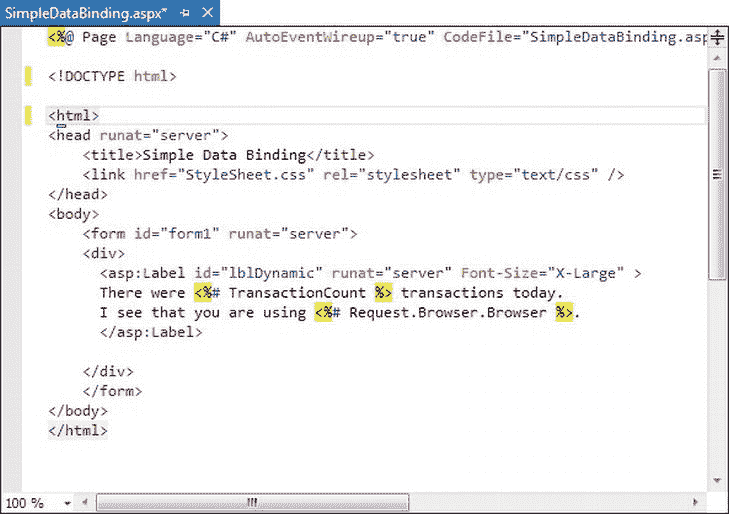

[图 15-1](#_Fig1) 。网页设计器中的源视图

若要添加表达式，请查找 Label 控件的标记。修改标签内的文本，如下所示:

```cs
<asp:Label id="lblDynamic" runat="server" Font-Size="X-Large">
There were <%# TransactionCount %> transactions today.
I see that you are using <%# Request.Browser.Browser %>.
</asp:Label>
```

此示例使用了两个单独的数据绑定表达式，它们与普通静态文本一起插入。第一个数据绑定表达式引用 TransactionCount 变量，第二个使用内置的请求对象来确定用户浏览器的一些信息。当你运行这个页面时，输出看起来像图 15-2 。

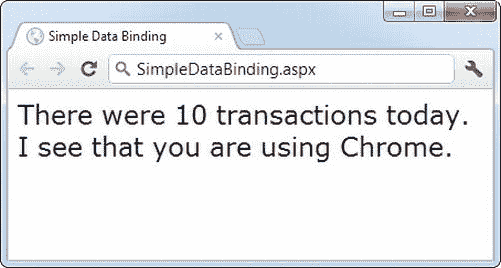

[图 15-2](#_Fig2) 。数据绑定的结果

数据绑定表达式已被自动替换为适当的值。如果页面回发，您可以使用额外的代码来修改 TransactionCount，只要您调用 DataBind()方法，该信息就会在您定义的数据绑定表达式中弹出到页面中。

然而，如果你忘记调用 DataBind()方法，数据绑定表达式将被忽略，用户将会看到一个有点混乱的窗口，类似于图 15-3 。

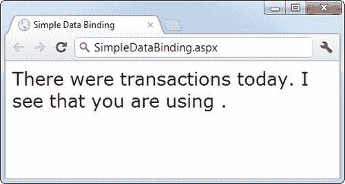

[图 15-3](#_Fig3) 。非数据绑定页面

 **注意**使用单值数据绑定时，需要考虑何时应该调用 DataBind()方法。例如，如果在设置 TransactionCount 变量之前错误地调用了它，那么相应的表达式将被转换为 0。记住，数据绑定是一条单行道。这意味着在使用 DataBind()方法后更改 TransactionCount 变量不会产生任何可见的效果。除非再次调用 DataBind()方法，否则显示的值不会更新。

带有属性的简单数据绑定

前面的示例使用数据绑定表达式来设置 label 标记内的静态文本信息。但是，您也可以使用单值数据绑定在页面上设置其他类型的信息，包括控件属性。为此，您只需知道将数据绑定表达式放在 web 页面标记中的什么位置。

例如，考虑下面的页面，它定义了一个名为 URL 的变量，并用它指向应用目录中的一张图片:

```cs
public partial class DataBindingUrl : System.Web.UI.Page
{
    protected string URL;
```

```cs
    protected void Page_Load(Object sender, EventArgs e)
    {
        URL = "img/picture.jpg";
        this.DataBind();
    }
}
```

现在，您可以使用此 URL 创建标签，如下所示:

```cs
<asp:Label id="lblDynamic" runat="server"><%# URL % ></asp:Label>
```

您还可以将它用于复选框标题:

```cs
<asp:CheckBox id="chkDynamic" Text=" <%# URL % > " runat="server" />
```

或者您可以将它用作超链接的目标:

```cs
<asp:Hyperlink id="lnkDynamic" Text="Click here!" NavigateUrl="<%# URL %>"
 runat="server" />
```

你甚至可以用它来拍照:

```cs
<asp:Image id="imgDynamic" ImageUrl=" <%# URL % > " runat="server" />
```

唯一的技巧是，您需要手动编辑这些控制标签。图 15-4 显示了一个使用了所有这些元素的页面会是什么样子。

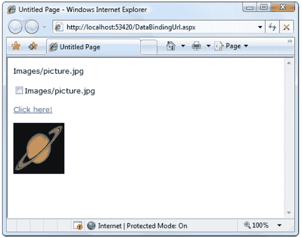

[图 15-4](#_Fig4) 。绑定相同数据的多种方式

要更详细地研究这个例子，请尝试本章的示例代码。

单值数据绑定的问题

在您开始在 ASP.NET 程序的各个方面使用单值数据绑定技术之前，您应该考虑一下这种方法可能存在的一些严重缺陷:

*   *将代码放入页面的用户界面*:ASP。NET 的巨大优势在于它允许开发人员分离用户界面代码(HTML 和控件标签在。aspx 文件)从用于数据访问和所有其他任务的实际代码中分离出来(在代码隐藏文件中)。然而，过分热情地使用单值数据绑定会鼓励您忽略这种区别，开始在页面中编写函数调用甚至操作。如果不小心管理，这可能会导致完全的混乱。
*   *分段代码*:当使用数据绑定表达式时，不同操作的功能驻留在哪里可能并不明显。如果您混合使用这两种方法，这尤其是一个问题，例如，如果您使用数据绑定来填充控件，并且还直接在代码中修改该控件。更糟糕的是，数据绑定代码可能有某些不明显的依赖关系。如果页面代码发生变化，或者变量或函数被删除或重命名，相应的数据绑定表达式可能会停止提供有效信息，而没有任何解释，甚至没有明显的错误。所有这些细节使得维护您的代码更加困难，并且使得多个开发人员在同一个项目上合作更加困难。

当然，一些开发人员喜欢单值数据绑定的灵活性，并很好地使用了它，使得他们的代码的其余部分更加经济和简化。意识到(并避免)潜在的缺点取决于你。

 **注意**在一种情况下，单值数据绑定相当有用——在构建*模板*的时候。模板声明了一个标记块，可在表中的每条记录中重复使用。但是，它们只适用于某些富数据控件，如 GridView。你将在第 16 章中了解更多关于此功能的信息。

如果您决定不使用单值数据绑定，您可以通过使用代码来完成同样的事情。例如，您可以使用以下事件处理程序来显示与第一个标签示例相同的输出:

```cs
protected void Page_Load(Object sender, EventArgs e)
{
    TransactionCount = 10;
    lblDynamic.Text = "There were " + TransactionCount.ToString();
    lblDynamic.Text += " transactions today. ";
    lblDynamic.Text += "I see that you are using " + Request.Browser.Browser;
}
```

这段代码在不使用数据绑定的情况下动态填充标签。代价是更多的代码。

当您使用数据绑定表达式时，您最终会因代码的附加细节(如代码隐藏类中变量的名称)而使标记变得复杂。当您使用纯代码方法时，您最终会做相反的事情——用关于页面标记的附加细节(例如您想要显示的文本)使您的代码变得复杂。在许多情况下，最佳方法取决于您的具体情况。数据绑定表达式非常适合将少量信息注入到详细的页面中。动态代码方法为您提供了更多的灵活性，当您需要执行更多的工作来塑造页面时(例如，与多个控件交互、更改内容和格式、从不同的源检索您想要显示的信息，等等)，这种方法非常有效。

使用重复值数据绑定

虽然使用简单的数据绑定是可选的，但是*重复值绑定*非常有用，几乎每个 ASP.NET 应用都想在某个地方使用它。

重复值数据绑定适用于 ASP.NET 列表控件(以及下一章描述的丰富数据控件)。若要使用重复值绑定，请将这些控件之一链接到数据源(如数据表中的字段)。当您调用 DataBind()时，控件会使用所有相应的值自动创建一个完整的列表。这使您不必编写循环遍历数组或数据表并手动向控件添加元素的代码。重复值绑定还可以通过支持高级格式和模板选项来简化您的工作，这些选项可以自动配置数据放入控件时的外观。

要为列表绑定创建数据表达式，您需要使用一个显式支持数据绑定的列表控件。幸运的是，ASP.NET 提供了许多列表控件，其中许多您可能已经在其他应用或示例中使用过:

*   *ListBox、DropDownList、CheckBoxList 和 RadioButtonList* :这些 web 控件为单个信息字段提供列表。
*   *HtmlSelect* :这个服务器端 HTML 控件代表了 HTML < select >元素的，其工作方式与 ListBox web 控件基本相同。一般来说，使用该控件只是为了向后兼容。
*   *GridView、DetailsView、FormView 和 ListView* : 这些丰富的 web 控件允许您提供可以一次显示多个信息域的重复列表或网格。例如，如果将这些控件之一绑定到数据集中的一个完整的表，则可以显示多个字段中的值。这些控件为数据绑定提供了最强大、最灵活的选项。

使用重复值数据绑定，您可以在。或者您可以通过设置控件属性来应用数据绑定。对于简单的列表控件，通常只需设置属性。当然，您可以通过多种方式设置属性，例如通过使用代码隐藏文件中的代码，或者通过修改。aspx 文件，可能借助于 Visual Studio 的属性窗口。你采取的方法并不重要。重要的细节是，对于简单的列表控件，不使用任何数据绑定表达式。

为了进一步了解数据绑定，将主题分成几个基本类别会有所帮助。您将从查看列表控件的数据绑定开始。

简单列表控件 的数据绑定

在某些方面，列表控件的数据绑定是最简单的数据绑定。你只需要遵循三个步骤:

1.  创建并填充某种数据对象。您有许多选择，包括数组、基本的 ArrayList 和 Hashtable 集合、强类型列表和字典集合，以及 DataTable 和 DataSet 对象。本质上，您可以使用支持 IEnumerable 接口的任何类型的集合，尽管您会发现每个类都有特定的优点和缺点。
2.  将对象链接到适当的控件。为此，您只需要设置几个属性，包括 DataSource。如果要绑定到完整的数据集，还需要设置 DataMember 属性来标识要使用的适当的表。
3.  激活绑定。与单值绑定一样，您可以使用 DataBind()方法激活数据绑定，可以是针对特定控件，也可以是通过使用当前页面的 DataBind()方法同时针对所有包含的控件。

无论您使用的是 ListBox、DropDownList、CheckBoxList、RadioButtonList 还是 HtmlSelect 控件，这个过程都是相同的。所有这些控件都提供相同的属性，并以相同的方式工作。唯一的区别是它们出现在最终网页上的方式。

一个简单的列表绑定示例

若要尝试这种类型的数据绑定，请将 ListBox 控件添加到新网页中。然后使用页面。加载事件处理程序以创建用作数据源的强类型列表集合:

```cs
List<string> fruit = new List<string>();
fruit.Add("Kiwi");
fruit.Add("Pear");
fruit.Add("Mango");
fruit.Add("Blueberry");
fruit.Add("Apricot");
fruit.Add("Banana");
fruit.Add("Peach");
fruit.Add("Plum");
```

正如您在第 3 章中了解到的，当您希望您的集合只保存单一类型的对象(例如，只保存字符串)时，像 List 这样的强类型集合是理想的。当您使用通用集合时，您选择想要使用的项目类型，并且集合对象被“锁定”在您的选择中。这意味着，如果您试图添加另一种不属于集合的对象类型，您将得到一个编译时错误警告。当您从集合中取出一个项目时，您不需要编写强制转换代码来将其转换为正确的类型，因为编译器已经知道您正在使用什么类型的对象。

现在，您可以将该集合链接到 ListBox 控件:

```cs
lstItems.DataSource=fruit;
```

若要激活绑定，请使用 DataBind()方法:

```cs
this.DataBind();
```

你也可以使用 lstItems。DataBind()仅绑定 ListBox 控件。[图 15-5](#Fig5) 显示了生成的网页。

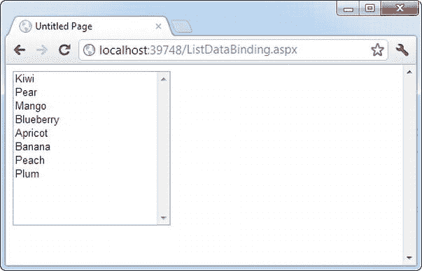

[图 15-5](#_Fig5) 。数据绑定列表

这项技术可以节省相当多的代码行。这个例子并没有提供很多节省，因为集合是在显示之前创建的。然而，在更现实的应用中，您可能会使用一个向您返回现成集合的函数:

```cs
List<string> fruit;
fruit = GetFruitsInSeason("Summer");
```

在这种情况下，添加额外的两行代码来绑定和显示窗口中的集合非常简单:

```cs
lstItems.DataSource = fruit;
this.DataBind();
```

或者，您甚至可以将其更改为以下更紧凑的代码:

```cs
lstItems.DataSource = GetFruitsInSeason("Summer");
this.DataBind();
```

另一方面，考虑一下如果不使用数据绑定将会遇到的额外麻烦。这种类型的节省会迅速增加，尤其是当您开始将数据绑定与多个控件、高级对象(如数据集)或通过模板应用格式的高级控件相结合时。

多重绑定

您可以将同一个数据列表对象绑定到多个控件。请考虑下面的示例，该示例通过加载相同的信息来比较所有类型的列表控件:

```cs
protected void Page_Load(Object sender, EventArgs e)
{
    // Create and fill the collection.
    List<string> fruit = new List<string>();
    fruit.Add("Kiwi");
    fruit.Add("Pear");
    fruit.Add("Mango");
    fruit.Add("Blueberry");
    fruit.Add("Apricot");
    fruit.Add("Banana");
    fruit.Add("Peach");
    fruit.Add("Plum");
```

```cs
    // Define the binding for the list controls.
    MyListBox.DataSource = fruit;
    MyDropDownListBox.DataSource = fruit;
    MyHtmlSelect.DataSource = fruit;
    MyCheckBoxList.DataSource = fruit;
    MyRadioButtonList.DataSource = fruit;
```

```cs
    // Activate the binding.
    this.DataBind();
}
```

[图 15-6](#Fig6) 显示了渲染后的页面。

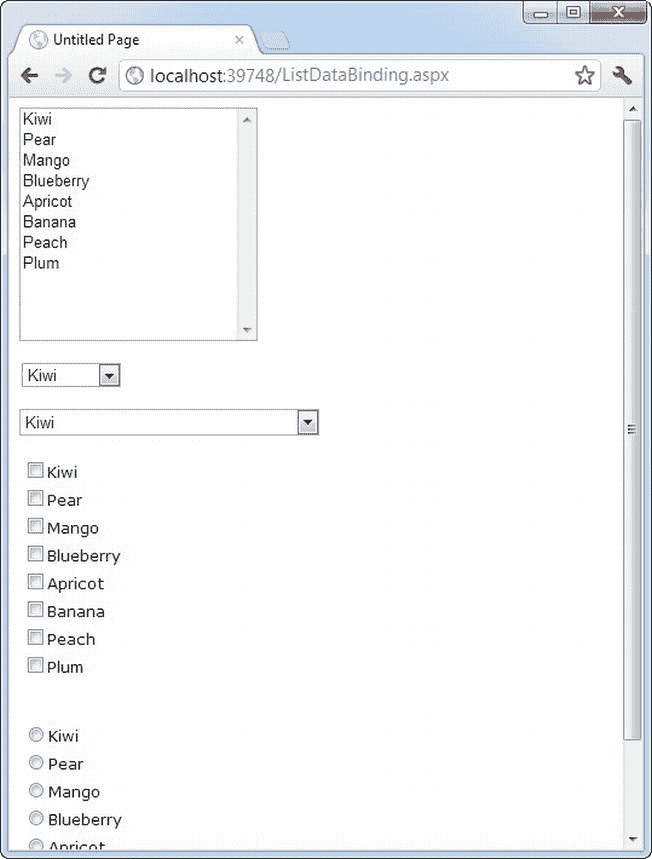

[图 15-6](#_Fig6) 。多重绑定列表

这是 ASP.NET 数据绑定与桌面应用不同的另一个方面。在传统的数据绑定中，所有不同的控件有时被视为同一数据源上的“视图”，一次只能处理数据源中的一条记录。在这种类型的数据绑定中，当您在一个列表控件中选择 Pear 时，其他列表控件会自动刷新，以便它们也选择 Pear(或同一行中的相应信息)。这不是 ASP.NET 使用数据绑定的方式。如果您想要这种效果，您需要编写自定义代码来实现它。

与字典集合的数据绑定

*字典集合*是一种特殊的集合，其中每个条目(或*定义*，使用字典类比)都用特定的关键字(或字典*单词*)进行索引。这类似于会话、应用和缓存等内置 ASP.NET 集合的工作方式。

字典集合总是需要键。这使得检索您想要的项目变得更加容易。在普通集合(如列表)中，您需要通过索引号位置来查找所需的项目，或者更常见的是，通过遍历整个集合直到找到正确的项目。使用字典集合，您可以通过使用它的键来检索您想要的项。通常，当您需要同时处理所有项目时，普通集合是有意义的，而当您经常检索单个特定项目时，字典集合是有意义的。

在. NET 中可以使用两个基本的字典式集合 。集合命名空间)允许您存储任何类型的对象，并为键值使用任何类型的对象。字典集合(在系统中。泛型命名空间)使用泛型来提供与列表集合相同的“锁定”行为。预先选择项目类型和键类型，以防止错误并减少需要编写的强制转换代码的数量。

下面的示例使用 Dictionary 集合类，该类在第一次请求页面时创建一次。创建 Dictionary 对象的方式与创建 List 集合的方式非常相似。唯一的区别是您需要为每一项提供一个唯一的键。此示例使用了为每个键分配一个序列号的简单做法:

```cs
protected void Page_Load(Object sender, EventArgs e)
{
    if (!this.IsPostBack)
    {
        // Use integers to index each item. Each item is a string.
        Dictionary<int, string> fruit = new Dictionary<int, string>();
```

```cs
        fruit.Add(1, "Kiwi");
        fruit.Add(2, "Pear");
        fruit.Add(3, "Mango");
        fruit.Add(4, "Blueberry");
        fruit.Add(5, "Apricot");
        fruit.Add(6, "Banana");
        fruit.Add(7, "Peach");
        fruit.Add(8, "Plum");
```

```cs
        // Define the binding for the list controls.
        MyListBox.DataSource = fruit;
```

```cs
        // Choose what you want to display in the list.
        MyListBox.DataTextField = "Value";
```

```cs
        // Activate the binding.
        this.DataBind();
    }
}
```

这里有一个新细节。是这一行:

```cs
MyListBox.DataTextField="Value";
```

字典样式集合中的每一项都有一个与之关联的键和值。如果不指定要显示哪个属性，ASP.NET 只需对每个集合项调用 ToString()方法。这可能会也可能不会产生你想要的结果。但是，通过插入这一行代码，您可以精确地控制列表中显示的内容。现在，页面将如预期的那样出现，并显示所有水果的名称。

 **注意**注意，需要用引号将属性名括起来。ASP.NET 使用反射来检查对象，并在运行时查找具有 name 值的属性。

您可能希望尝试可以绑定到列表控件的其他类型的集合。一个有趣的选择是使用一个内置的 ASP.NET 控件，比如 Session 对象。列表中的一项将为每个当前定义的会话变量创建，使这个技巧成为一个很好的小调试工具来快速检查当前会话信息。

使用数据值字段属性

除了 DataTextField 属性，所有支持数据绑定的列表控件还提供了一个 DataValueField 属性，,它将相应的信息添加到控件元素的 value 属性中。这允许您存储额外的(未显示的)信息，以便以后访问。例如，您可以使用这两行代码来定义与前面示例的数据绑定:

```cs
MyListBox.DataTextField = "Value";
MyListBox.DataValueField = "Key";
```

该控件将显示相同的内容，并列出集合中所有水果的名称。但是，如果您查看发送到客户端浏览器的呈现 HTML，您会看到 value 属性已经用每个项目的相应数字键进行了设置:

```cs
<select name="MyListBox" id="MyListBox" >
    <option value="1">Kiwi</option>
    <option value="2">Pear</option>
    <option value="3">Mango</option>
    <option value="4">Blueberry</option>
    <option value="5">Apricot</option>
    <option value="6">Banana</option>
    <option value="7">Peach</option>
    <option value="8">Plum</option>
</select>
```

您可以在以后通过使用 SelectedItem 属性获取附加信息来检索该值。例如，您可以将列表控件的 AutoPostBack 属性设置为 true，并添加以下代码:

```cs
protected void MyListBox_SelectedIndexChanged(Object sender,
 EventArgs e)
{
    lblMessage.Text = "You picked: " + MyListBox.SelectedItem.Text;
    lblMessage.Text += " which has the key: " + MyListBox.SelectedItem.Value;
}
```

图 15-7 展示了结果。这种技术对于数据库特别有用。您可以在 value 属性中嵌入一个唯一的 ID，并通过检查 SelectedItem 对象的值，根据用户的选择快速查找相应的记录。

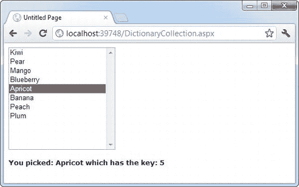

[图 15-7](#_Fig7) 。绑定到键和值属性

请注意，要做到这一点，您不能在每次回发后都重新生成列表。如果您这样做，所选项目信息将会丢失，并且会出现错误。前面的示例通过检查页面来处理这个问题。IsPostBack 属性。如果为 false(这表明该页面是第一次被请求)，则该页面将构建列表。当呈现页面时，当前的项列表存储在视图状态中。当页面回发时，项目列表已经存在，不需要重新创建。

与 ADO.NET 的数据绑定

到目前为止，本章中的例子已经处理了不涉及数据库或 ADO.NET 的任何部分的数据绑定。虽然这是一种熟悉概念的简单方法，而且本身也是一种有用的方法，但是当您将数据绑定与数据库结合使用时，您会获得最大的优势。

当您对从数据库中提取的信息使用数据绑定时，数据绑定过程会发生在相同的三个步骤中。首先创建数据源，它将是 DataReader 或 DataSet 对象。DataReader 通常提供最佳性能，但它将您的数据绑定限制到单个控件，因为它是只进读取器。当它填充一个控件时，它从头到尾遍历结果。做完了之后，就回不到开头了；因此它不能用于另一个数据绑定操作。因此，数据集是更常见的选择。

下一个示例创建一个数据集并将其绑定到一个列表。在本例中，数据集是手动填充的，但正如您在上一章中看到的那样，使用 DataAdapter 对象填充也同样容易。

要手动填充数据集，您需要遵循几个步骤:

1.  创建数据集。
2.  创建一个新的 DataTable 并将其添加到数据集中。表集合。
3.  通过将 DataColumn 对象(每个字段一个)添加到 DataTable 来定义表的结构。列集合。
4.  提供数据。通过调用 DataTable，可以获得一个与 DataTable 具有相同结构的新的空白行。NewRow()方法。然后，必须设置所有字段中的数据，并将 DataRow 添加到 DataTable 中。Rows 集合。

代码是这样展开的:

```cs
// Define a DataSet with a single DataTable.
DataSet dsInternal = new DataSet();
dsInternal.Tables.Add("Users");
```

```cs
// Define two columns for this table.
dsInternal.Tables["Users"].Columns.Add("Name");
dsInternal.Tables["Users"].Columns.Add("Country");
```

```cs
// Add some actual information into the table.
DataRow rowNew = dsInternal.Tables["Users"].NewRow();
rowNew["Name"] = "John";
rowNew["Country"] = "Uganda";
dsInternal.Tables["Users"].Rows.Add(rowNew);
```

```cs
rowNew = dsInternal.Tables["Users"].NewRow();
rowNew["Name"] = "Samantha";
rowNew["Country"] = "Belgium";
dsInternal.Tables["Users"].Rows.Add(rowNew);
```

```cs
rowNew = dsInternal.Tables["Users"].NewRow();
rowNew["Name"] = "Rico";
rowNew["Country"] = "Japan";
dsInternal.Tables["Users"].Rows.Add(rowNew);
```

接下来，将 DataSet 中的 DataTable 绑定到适当的控件。因为列表控件一次只能显示一列，所以您还需要通过设置 DataTextField 属性来选择要为每一项显示的字段:

```cs
// Define the binding.
lstUser.DataSource = dsInternal.Tables["Users"];
lstUser.DataTextField = "Name";
```

或者，您可以使用整个数据集作为数据源，而不仅仅是适当的表。在这种情况下，您必须通过设置控件的 DataMember 属性来选择一个表。这是一种等效的方法，但代码略有不同:

```cs
// Define the binding.
lstUser.DataSource = dsInternal;
lstUser.DataMember = "Users";
lstUser.DataTextField = "Name";
```

和往常一样，最后一步是激活绑定:

```cs
this.DataBind();
```

最终结果是一个包含指定数据库字段信息的列表，如图[图 15-8](#Fig8) 所示。从第一行到最后一行，列表框中的每一条记录都有一个条目，即使它出现不止一次。

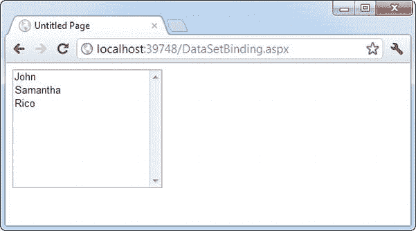

[图 15-8](#_Fig8) 。数据集绑定

 **提示**简单的列表控件要求你将它们的文本或值属性绑定到数据源对象中的单个数据字段。然而，下一章中讨论的更高级的数据绑定控件提供了更大的灵活性。它们允许字段以你能想象的任何方式组合。

创建记录编辑器

下一个例子更实际。这很好地说明了如何在完整的 ASP.NET 应用中使用数据绑定。此示例允许用户使用数据绑定列表控件选择一条记录并更新一条信息。

第一步是将连接字符串添加到 web.config 文件中。此示例使用了许多版本的 SQL Server 中包含的 Northwind 数据库中的 Products 表。以下是为 SQL Server Express LocalDB 定义连接字符串的方法:

```cs
<configuration>
 <connectionStrings>
    <add name="Northwind" connectionString=
"Data Source=(localdb)\v11.0;Initial Catalog=Northwind;Integrated
Security=SSPI" />
 </connectionStrings>
 ...
</configuration>
```

若要使用 SQL Server 的完整版本，请删除(localdb)\v11.0 部分。若要在另一台计算机上使用数据库服务器，请为“数据源连接字符串”属性提供计算机名称。(关于连接字符串的更多细节，请参考第 14 章[。)](14.html)

下一步是检索连接字符串，并将其存储在 Page 类的私有变量中，以便页面代码的每个部分都可以轻松访问它。导入系统后。Web.Configuration 命名空间中，您可以在代码隐藏类中创建一个成员变量，其定义如下:

```cs
private string connectionString =
 WebConfigurationManager.ConnectionStrings["Northwind"].ConnectionString;
```

下一步是创建一个下拉列表，允许用户选择产品进行编辑。这一页。Load 事件处理程序负责这项任务—检索数据，将其绑定到下拉列表控件，然后激活绑定。在继续之前，请确保您已经导入了系统。Data.SqlClient 命名空间，它允许您使用 SQL Server 提供程序来检索数据。

```cs
protected void Page_Load(Object sender, EventArgs e)
{
    if (!this.IsPostBack)
    {
        // Define the ADO.NET objects for selecting products from the database.
        string selectSQL = "SELECT ProductName, ProductID FROM Products";
        SqlConnection con = new SqlConnection(connectionString);
        SqlCommand cmd = new SqlCommand(selectSQL, con);
```

```cs
        // Open the connection.
        con.Open();
```

```cs
        // Define the binding.
        lstProduct.DataSource = cmd.ExecuteReader();
        lstProduct.DataTextField = "ProductName";
        lstProduct.DataValueField = "ProductID";
```

```cs
        // Activate the binding.
        this.DataBind();
```

```cs
        con.Close();
```

```cs
        // Make sure nothing is currently selected in the list box.
        lstProduct.SelectedIndex = -1;
    }
}
```

同样，列表仅在页面第一次被请求时填充(并自动存储在视图状态中)。如果页面被回发，列表将保留其当前条目。这减少了数据库的工作量，并保持页面快速有效地工作。您还应该注意到，这个页面并不试图处理错误。如果你在一个真实的应用中使用它，你需要使用在第 14 章中演示的异常处理方法。

实际的数据库代码类似于前一章中使用的代码。该示例使用了 Select 语句，但小心地将返回的信息限制在 ProductName 和 ProductID 字段，这是它将使用的唯一信息。结果窗口列出了数据库中定义的所有产品，如图[图 15-9](#Fig9) 所示。

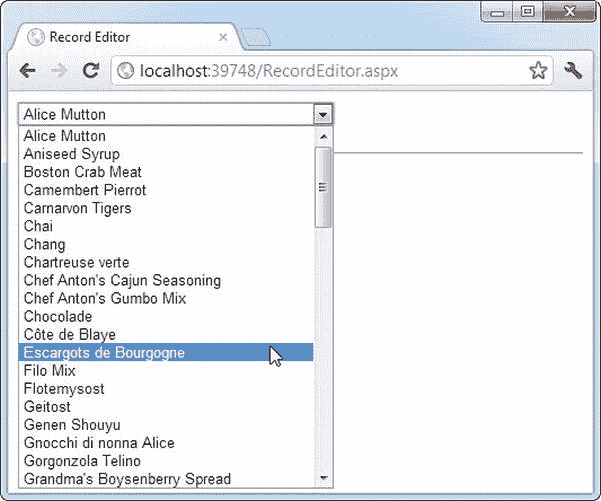

[图 15-9](#_Fig9) 。产品选择

下拉列表启用 AutoPostBack，因此一旦用户做出选择，lstProduct。SelectedItemChanged 事件将激发。此时，您的代码执行以下任务:

*   它从 Products 表中读取相应的记录，并在标签中显示关于它的附加信息。在这种情况下，联接查询链接产品和类别表中的信息。该代码还决定了当前产品的类别。这是允许用户更改的信息。
*   它从 Categories 表中读取 CategoryNames 的完整列表，并将该信息绑定到不同的列表控件。最初，该列表隐藏在面板中，其 Visible 属性设置为 false。该代码通过将 Visible 设置为 true 来显示该面板的内容。
*   它突出显示类别列表中与当前产品对应的行。例如，如果当前产品是海鲜类别，将选择列表框中的海鲜条目。

这个逻辑看起来相当复杂，但它实际上只是你在过去两章中学到的东西的应用。完整列表如下:

```cs
protected void lstProduct_SelectedIndexChanged(object sender, EventArgs e)
{
    // Create a command for selecting the matching product record.
    string selectProduct = "SELECT ProductName, QuantityPerUnit, " +
     "CategoryName FROM Products INNER JOIN Categories ON " +
     "Categories.CategoryID=Products.CategoryID " +
     "WHERE ProductID=@ProductID";
```

```cs
    // Create the Connection and Command objects.
    SqlConnection con = new SqlConnection(connectionString);
    SqlCommand cmdProducts = new SqlCommand(selectProduct, con);
    cmdProducts.Parameters.AddWithValue("@ProductID",
     lstProduct.SelectedItem.Value);
```

```cs
    // Retrieve the information for the selected product.
    using (con)
    {
        con.Open();
        SqlDataReader reader = cmdProducts.ExecuteReader();
        reader.Read();
```

```cs
        // Update the display.
        lblRecordInfo.Text = "<b>Product:</b> " +
         reader["ProductName"] + "<br />";
        lblRecordInfo.Text += "<b>Quantity:</b> " +
         reader["QuantityPerUnit"] + "<br />";
        lblRecordInfo.Text += "<b>Category:</b> " + reader["CategoryName"];
```

```cs
        // Store the corresponding CategoryName for future reference.
        string matchCategory = reader["CategoryName"].ToString();
```

```cs
        // Close the reader.
        reader.Close();
```

```cs
        // Create a new Command for selecting categories.
        string selectCategory = "SELECT CategoryName, " +
         "CategoryID FROM Categories";
        SqlCommand cmdCategories = new SqlCommand(selectCategory, con);
```

```cs
        // Retrieve the category information and bind it.
        lstCategory.DataSource = cmdCategories.ExecuteReader();
        lstCategory.DataTextField = "CategoryName";
        lstCategory.DataValueField = "CategoryID";
        lstCategory.DataBind();
```

```cs
        // Highlight the matching category in the list.
        lstCategory.Items.FindByText(matchCategory).Selected = true;
    }
```

```cs
    pnlCategory.Visible = true;
}
```

您可以从几个方面改进这段代码。从这个事件处理程序中移除这些数据访问例程并把它们放到更通用的函数中可能是最有意义的。例如，您可以使用一个函数，该函数接受 ProductID 并返回一个包含相关产品信息的 DataRow。另一个改进是使用存储过程来检索这些信息。

最终结果是一个窗口，每当选择一个新产品时，它会自动更新，如图 15-10 所示。

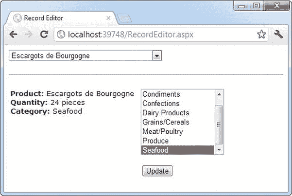

[图 15-10](#_Fig10) 。产品资料

这个例子还有一个技巧。如果用户选择一个不同的类别并单击 Update，数据库中就会发生更改。当然，这意味着创建新的连接和命令对象，如下:

```cs
protected void cmdUpdate_Click(object sender, EventArgs e)
{
    // Define the Command.
    string updateCommand = "UPDATE Products " +
     "SET CategoryID=@CategoryID WHERE ProductID=@ProductID";
```

```cs
    SqlConnection con = new SqlConnection(connectionString);
    SqlCommand cmd = new SqlCommand(updateCommand, con);
```

```cs
    cmd.Parameters.AddWithValue("@CategoryID", lstCategory.SelectedItem.Value);
    cmd.Parameters.AddWithValue("@ProductID", lstProduct.SelectedItem.Value);
```

```cs
    // Perform the update.
    using (con)
    {
        con.Open();
        cmd.ExecuteNonQuery();
    }
}
```

您可以很容易地扩展这个示例，使它允许您编辑产品记录中的所有属性。但是在您尝试之前，您可能想尝试下一章中显示的丰富的数据控件。使用这些控件，您可以创建复杂的列表和网格，为选择、编辑和删除记录提供自动功能。

使用数据源控件

在第 14 章中，您看到了如何直接连接到数据库，执行查询，遍历结果集中的记录，并在页面上显示它们。在这一章中，你已经看到了一个更简单的选择——使用数据绑定，你可以编写你的数据访问逻辑，然后在页面中显示结果，而不需要循环或控制操作。现在是时候介绍*另一个*便利:数据源控件。令人惊讶的是，数据源控件允许您创建数据绑定页面，而无需编写任何数据访问代码。

 **注意**你很快就会看到，在你*能*做的事情和你*应该*做的事情之间，往往存在着差距。在大多数专业应用中，您需要编写和微调数据访问代码，以获得最佳性能或对特定功能的访问。这就是为什么你花了这么多时间学习 ADO.NET 是如何工作的，而不是直接跳到数据源控件。

数据源控件包括实现 IDataSource 接口的任何控件。那个。NET Framework 包括下列数据源控件:

*   *SqlDataSource* : 这个数据源允许您连接到任何具有 ADO.NET 数据提供者的数据源。这包括 SQL Server、Oracle 和 OLE DB 或 ODBC 数据源。使用这个数据源时，不需要编写数据访问代码。
*   *AccessDataSource:* 这个数据源允许您在 Access 数据库文件(.mdb)。但是，不鼓励使用它，因为 Access 不能很好地适应大量用户(与 SQL Server Express 不同)。

 **注意** Access 数据库没有一个专用的服务器引擎(如 SQL Server)来协调多人的操作，并确保数据不会丢失或损坏。因此，Access 数据库最适合非常小的网站，在这些网站上很少有人需要同时操作数据。一个更好的小规模数据解决方案是 SQL Server Express，在第 14 章的[中有描述。](14.html)

*   *ObjectDataSource* : 这个数据源允许你连接到一个定制的数据访问类。这是大型专业 web 应用的首选方法，但是它迫使您编写更多的代码。你将在第 22 章中学习 ObjectDataSource。
*   *XmlDataSource* : 这个数据源允许你连接到一个 XML 文件。在第 18 章中，你会学到更多关于 XML 的知识。
*   *SiteMapDataSource* : 这个数据源允许你连接到一个描述你网站导航结构的. sitemap 文件。你在第 13 章中看到了这个数据来源。
*   *EntityDataSource* : 这个数据源允许你通过使用 LINQ 到实体的特性来查询数据库，你将在第 24 章中处理这个特性。
*   *LinqDataSource* : 这个数据源允许您使用 LINQ 到 SQL 特性来查询数据库，这是 LINQ 到实体的一个类似(但功能稍弱)的前身。

您可以在 Visual Studio 工具箱的“数据”选项卡中找到除 AccessDataSource 之外的所有数据源控件。

当您将数据源控件拖放到网页上时，它在 Visual Studio 中显示为一个灰色框。然而，当您运行您的 web 应用并请求页面时，这个框不会出现(参见[图 15-11](#Fig11) )。

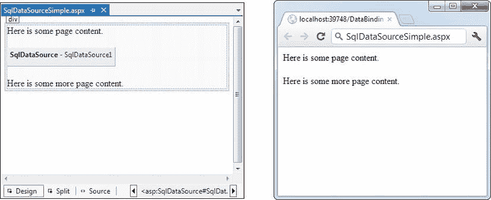

[图 15-11](#_Fig11) 。设计时和运行时的数据源控件

如果在同一页中执行多个数据访问任务(例如，需要能够查询两个不同的表)，则需要多个数据源控件。

具有数据绑定的页面生命周期

数据源控件可以执行两项关键任务:

*   它们可以从数据源中检索数据，并将其提供给绑定控件。使用此功能时，绑定控件会自动填充数据。甚至不需要调用 DataBind()。
*   他们可以在编辑发生时更新数据源。为了使用此功能，您必须使用 ASP。NET 的丰富数据控件，如 GridView 或 DetailsView。例如，如果在 GridView 中进行编辑并单击“更新”, GridView 将触发数据源控件中的更新，然后数据源控件将更新数据库。

在使用数据源控件之前，您需要了解页面生命周期。以下步骤解释了页面在其生命周期中所经历的阶段顺序。粗体显示的两个步骤(4 和 6)表示数据源控件将开始工作的点:

1.  创建页面对象(基于。aspx 文件)。
2.  页面生命周期开始，页面。初始化和页面。加载事件触发。
3.  所有其他控件事件都会触发。
4.  如果用户正在应用更改，数据源控件将立即执行更新操作。如果正在更新一行，将触发 Updating 和 updated 事件。如果正在插入一行，将触发 Inserting 和 inserted 事件。如果正在删除一行，将触发 Deleting 和 deleted 事件。
5.  这一页。PreRender 事件触发。
6.  数据源控件执行查询，并将检索到的数据插入绑定控件。第一次请求页面时和每次回发页面时都会执行此步骤，以确保您始终拥有最新的数据。Selecting 和 Selected 事件在此时触发。
7.  该页被呈现和释放。

在本章的其余部分，您将更仔细地查看 SqlDataSource 控件，并使用它来构建前面演示的记录编辑器示例—代码要少得多。

SqlDataSource

数据源控件出现在。aspx 标记部分，就像普通控件一样。这里有一个例子:

```cs
<asp:SqlDataSource ID="SqlDataSource1" runat="server" ... />
```

SqlDataSource 表示使用 ADO.NET 提供程序的数据库连接。然而，这有一个条件。SqlDataSource 需要一种通用方法来创建它所需的连接、命令和 DataReader 对象。只有当你的数据提供者包含一个叫做*数据提供者工厂*的东西时，这才有可能。工厂负责创建 SqlDataSource 访问数据源所需的特定于提供程序的对象。幸运的是。NET 为它的四个数据提供者都包含了一个数据提供者工厂:

*   系统。Data.SqlClient
*   系统。数据. Oracle 客户端
*   系统。Data.OleDb
*   系统。Data.Odbc

您可以将所有这些提供程序用于 SqlDataSource。您可以通过设置提供者名称来选择数据源。下面是一个使用 SQL Server 提供程序连接到 SQL Server 数据库的 SqlDataSource:

```cs
<asp:SqlDataSource ProviderName="System.Data.SqlClient" ... />
```

从技术上讲，你可以省略这条信息，因为系统。默认为 Data.SqlClient 提供程序工厂。

 **注意**如果您有一个最新的第三方提供者(如用于访问 Oracle 数据库的 ODP.NET)，它还将包括一个提供者工厂，允许您将它与 SqlDataSource 一起使用。

下一步是提供所需的连接字符串——没有它，您将无法建立任何连接。虽然您可以直接在 SqlDataSource 标记中硬编码连接字符串，但是将它保存在 web.config 文件的<connectionstrings>部分总是更好，这样可以保证更大的灵活性，并确保您不会无意中更改连接字符串。</connectionstrings>

引用中的连接字符串。aspx 标记，您可以使用这种格式的特殊语法:

```cs
<%$ ConnectionStrings:[NameOfConnectionString] %>
```

这看起来像一个数据绑定表达式，但略有不同。(首先，它以字符序列< %$而不是< %#开头。)

例如，如果 web.config 文件中有一个名为 Northwind 的连接字符串，如下所示:

```cs
<configuration>
 <connectionStrings>
    <add name="Northwind" connectionString=
"Data Source=(localdb)\v11.0;Initial Catalog=Northwind;Integrated
Security=SSPI" />
 </connectionStrings>
 ...
</configuration>
```

您可以使用以下语法在 SqlDataSource 中指定它:

```cs
<asp:SqlDataSource ConnectionString="<%$ ConnectionStrings:Northwind %>" ... />
```

指定提供程序名称和连接字符串后，下一步是添加 SqlDataSource 在连接到数据库时将使用的查询逻辑。

 **提示**如果在创建连接字符串时需要帮助，请选择 SqlDataSource，打开“属性”窗口，然后选择 connection string 属性。值的右侧会出现一个下拉箭头。如果单击该下拉箭头，您将看到 web.config 文件中所有连接字符串的列表。您可以选择其中一个连接，或者选择“新建连接”(在列表底部)打开“添加连接”对话框，您可以在其中选择所需的数据库。最重要的是，如果您创建一个新连接，Visual Studio 会将该连接字符串复制到您的 web.config 文件中，这样您就可以在其他 SqlDataSource 对象中重用它。

选择记录

您可以使用创建的每个 SqlDataSource 控件来检索单个查询。或者，您还可以添加相应的命令来删除、插入和更新行。例如，一个 SqlDataSource 足以查询和更新 Northwind 数据库中的 Customers 表。但是，如果需要独立检索或更新客户和订单信息，则需要两个 SqlDataSource 控件。

SqlDataSource 命令逻辑是通过四个属性(SelectCommand、InsertCommand、UpdateCommand 和 DeleteCommand)提供的，每个属性都需要一个字符串。您提供的字符串可以是内联 SQL(在这种情况下，相应的 SelectCommandType、InsertCommandType、UpdateCommandType 或 DeleteCommandType 属性应该是默认的文本)或存储过程的名称(在这种情况下，命令类型是 stored procedure)。您只需要为想要执行的操作类型定义命令。换句话说，如果您使用数据源对一组记录进行只读访问，则只需定义 SelectCommand 属性。

 **注意**如果你在属性窗口中配置一个命令，你会看到一个名为 SelectQuery 的属性，而不是 SelectCommand。SelectQuery 是一个虚拟属性，在设计时方便显示。编辑 SelectQuery 时(通过单击属性名旁边的省略号)，可以使用特殊的设计器编写命令文本(SelectCommand)并同时添加命令参数(SelectParameters)。但是，在您阅读了本节中的示例，并且理解了 SelectCommand 和 SelectParameters 属性的实际工作方式之后，此工具才能发挥最佳作用。

下面是一个完整的 SqlDataSource，它定义了一个用于从 Products 表中检索产品信息的 Select 命令:

```cs
<asp:SqlDataSource ID="sourceProducts" runat="server"
 ConnectionString="<%$ ConnectionStrings:Northwind %>"
 SelectCommand="SELECT ProductName, ProductID FROM Products"
/>
```

 **提示**您可以手动编写数据源逻辑，也可以使用设计时向导来创建连接，并在图形查询生成器中创建命令逻辑。您甚至可以在构建查询时测试它，以确保它返回您想要的记录。若要启动此工具，请在页面的设计图面上选择数据源控件，然后单击智能标记中的“配置数据源”链接。

这足以构建前面显示的记录编辑器示例的第一阶段，即显示所有产品的下拉列表框。您所需要做的就是设置 DataSourceID 属性指向您已经创建的 SqlDataSource。最简单的方法是使用“属性”窗口，该窗口提供当前网页上所有数据源的下拉列表。同时，请确保设置了 DataTextField 和 DataValueField 属性。完成这些更改后，您将得到这样一个控制标记:

```cs
<asp:DropDownList ID="lstProduct" runat="server" AutoPostBack="True"
 DataSourceID="sourceProducts" DataTextField="ProductName"
 DataValueField="ProductID" />
```

这个例子最大的好处是你不需要写任何代码。当您运行该页时，DropDownList 控件向 SqlDataSource 请求它需要的数据。此时，SqlDataSource 执行您定义的查询，获取信息，并将其绑定到 DropDownList。整个过程自动展开。

数据源控件如何工作

正如您在本章前面所学的，您可以绑定到 DataReader 或 DataSet。因此，值得一问 SqlDataSource 控件使用哪种方法？这实际上是你的选择，取决于你是否将 DataSourceMode 设置为 SqlDataSourceMode。数据集模式几乎总是更好，因为它支持依赖于数据集的高级排序、筛选和缓存设置。在 DataReader 模式下，所有这些功能都被禁用。但是，您可以对非常大的网格使用 DataReader 模式，因为它更节省内存。这是因为 DataReader 一次只能在内存中保存一条记录，时间刚好足以将记录的信息复制到链接的控件中。

关于数据源控件，需要理解的另一个重要事实是，当您将多个控件绑定到同一个数据源时，会导致查询执行多次。例如，如果两个控件绑定到同一个数据源，数据源控件将执行两次查询，每个控件一次。这有点低效——毕竟，如果您自己手工编写数据绑定代码，您可能会选择执行一次查询，然后绑定两次返回的数据集。幸运的是，这个设计并不像看起来那么糟糕。

首先，您可以通过使用缓存来避免这种多次查询的开销，缓存允许您将检索到的数据存储在一个临时内存位置，以便自动重用。如果将 EnableCaching 设置为 true，则 SqlDataSource 支持自动缓存。第 23 章提供了关于缓存如何工作以及如何在 SqlDataSource 中使用缓存的完整讨论。

第二，与您的预期相反，大多数时候您*不会*将多个控件绑定到一个数据源。这是因为你将在[第 16 章](16.html)中了解到的丰富数据控件 GridView、DetailsView 和 FormsView——能够以灵活的布局呈现多条数据。如果您使用这些控件，您将只需要绑定一个控件，这允许您避开这一限制。

同样重要的是要记住，数据绑定是在网页处理结束时执行的，就在呈现页面之前。这意味着页面。Load 事件将被激发，然后是任何控件事件，最后是页面。先决条件事件。只有这样，数据绑定才会发生。

参数化命令

在前面的示例中(使用 SqlDataSource 检索产品列表)，完整的查询是硬编码的。通常你不会有这种灵活性。相反，您会希望检索数据的子集，例如给定类别中的所有产品或特定城市中的所有雇员。

您之前考虑的记录编辑器提供了一个理想的例子。选择产品后，您希望执行另一个命令来获取该产品的完整详细信息。(您可以轻松地执行另一个命令来获取与该产品相关的记录。)要做到这一点，您需要两个数据源。您已经创建了第一个 SqlDataSource，它获取关于每个产品的有限信息。下面是第二个 SqlDataSource，它获取关于单个产品的更广泛的信息(下面的查询被分成几行以适应打印的页面):

```cs
<asp:SqlDataSource ID="sourceProductDetails" runat="server"
 ProviderName="System.Data.SqlClient"
 ConnectionString="<%$ ConnectionStrings:Northwind %>"
 SelectCommand="SELECT * FROM Products WHERE ProductID=@ProductID"
/>
```

但是这个例子有一个问题。它定义了一个参数(@ProductID)，该参数标识您想要检索的产品的 ID。你如何填写这条信息？事实证明，您需要向 SqlDataSource 标记添加一个<selectparameters>部分。在这个部分中，必须定义 SelectCommand 引用的每个参数，并告诉 SqlDataSource 在哪里找到它应该使用的值。你可以通过*将参数映射*到控件中的一个值来实现。</selectparameters>

以下是更正后的命令:

```cs
<asp:SqlDataSource ID="sourceProductDetails" runat="server"
 ProviderName="System.Data.SqlClient"
 ConnectionString="<%$ ConnectionStrings:Northwind %>"
 SelectCommand="SELECT * FROM Products WHERE ProductID=@ProductID"
 <SelectParameters>
    <asp:ControlParameter ControlID="lstProduct" Name="ProductID"
     PropertyName="SelectedValue" />
 </SelectParameters>
</asp:SqlDataSource>
```

您总是用@符号表示参数，如@City。您可以定义任意数量的参数，但必须使用 SelectParameters 集合中的单独元素将每个参数映射到一个值。在此示例中，@ProductID 参数的值来自 lstProduct。SelectedValue 属性。换句话说，您正在绑定一个当前在控件中的值，以将其放入数据库命令中。(还可以使用 SelectedText 属性获取当前显示的文本，在本例中是 ProductName。)

现在您需要做的就是将 SqlDataSource 绑定到您想要显示信息的其余控件。这就是这个例子稍微不同的地方。在以前版本的记录编辑器中，您获取信息并使用值的组合来填充标签和列表控件中的细节。这种方法不适用于数据源控件。首先，您只能将单个数据字段绑定到最简单的控件，如列表。其次，每个绑定控件向 SqlDataSource 发出一个单独的请求，触发一个单独的数据库查询。这意味着，如果您绑定了十几个控件，您将执行十几次相同的查询，性能非常糟糕。你可以用数据源缓存来缓解这个问题(参见第 23 章)，但是这表明你没有以一种很好地适应数据源控制模型的方式来设计你的应用。

解决方案是使用一种富数据控件，如 GridView、DetailsView 或 FormView。这些控件能够以高度灵活的布局一次显示多个字段。您将在下一章详细了解这三个控件，但下面的示例简单演示了如何使用 DetailsView。

DetailsView 是一个丰富的数据控件，旨在显示数据源中的多个字段。只要它的 AutoGenerateRows 为 true(默认值)，它就会为每个字段创建一个单独的行，并带有字段标题和值。[图 15-12](#Fig12) 显示了结果。

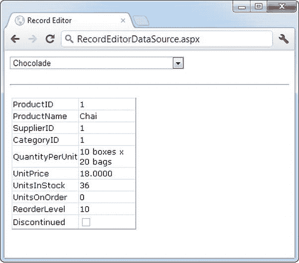

[图 15-12](#_Fig12) 。在 DetailsView 中显示完整的产品信息

下面是实现这一点的基本 DetailsView 标记:

```cs
<asp:DetailsView ID="detailsProduct" runat="server"
 DataSourceID="sourceProductDetails" />
```

如您所见，您需要设置的唯一属性是 DataSourceID。它将 DetailsView 绑定到您之前创建的 SqlDataSource。此 SqlDataSource 根据列表控件中的选择获取单行的完整产品信息。最棒的是，整个例子仍然不需要一行代码。

其他类型的参数

在前面的示例中，第二个 SqlDataSource 中的@ProductID 参数是根据下拉列表中的选择进行配置的。这种类型的参数链接到另一个控件中的属性，称为*控件参数*。但是参数值不一定来自其他控件。您可以将一个参数映射到[表 15-1](#Tab1) 中定义的任何参数类型。

[表 15-1](#_Tab1) 。参数类型

| 来源 | 控制标签 | 描述 |
| --- | --- | --- |
| 控制属性 | <controlparameter></controlparameter> | 页面上另一个控件的属性。 |
| 查询字符串值 | <querystringparameter></querystringparameter> | 当前查询字符串中的值。 |
| 会话状态值 | <sessionparameter></sessionparameter> | 存储在当前用户会话中的值。 |
| Cookie 值 | <cookieparameter></cookieparameter> | 附加到当前请求的任何 cookie 中的值。 |
| 轮廓值 | <profileparameter></profileparameter> | 当前用户档案中的一个值(见[第 21 章](21.html)关于档案的更多信息)。 |
| 路由的 URL 值 | <routeparameter></routeparameter> | 来自路由 URL 的值。路由 URL 是一种高级技术，允许您将任何 URL 映射到不同的页面(例如，像`http://www.mysite.com/products/112`这样的请求会重定向到页面`www.mysite.com/productdetails.aspx?id=112`)。要了解更多关于 URL 路由的信息，请参考 Visual Studio 帮助或 C# 中的*Pro ASP.NET 4.5。* |
| 表单变量 | <formparameter></formparameter> | 从输入控件发布到页面的值。通常，您将使用控件属性来代替，但是如果您已经禁用了相应控件的视图状态，您可能需要直接从 Forms 集合中获取一个值。 |

例如，您可以将前面的示例分成两页。在第一页中，定义一个显示所有可用产品的列表控件:

```cs
<asp:SqlDataSource ID="sourceProducts" runat="server"
 ProviderName="System.Data.SqlClient"
 ConnectionString="<%$ ConnectionStrings:Northwind %>"
 SelectCommand="SELECT ProductName, ProductID FROM Products"
/>
<asp:DropDownList ID="lstProduct" runat="server" AutoPostBack="True"
 DataSourceID="sourceProducts" DataTextField="ProductName"
 DataValueField="ProductID" />
```

现在，您需要一点额外的代码来将所选产品复制到查询字符串中，并重定向页面。这里有一个按钮可以做到这一点:

```cs
protected void cmdGo_Click(object sender, EventArgs e)
{
    if (lstProduct.SelectedIndex != -1)
    {
        Response.Redirect(
         "QueryParameter2.aspx?prodID=" + lstProduct.SelectedValue);
    }
}
```

最后，第二个页面可以根据查询字符串中提供的 ProductID 值绑定 DetailsView:

```cs
<asp:SqlDataSource ID="sourceProductDetails" runat="server"
 ProviderName="System.Data.SqlClient"
 ConnectionString="<%$ ConnectionStrings:Northwind %>"
 SelectCommand="SELECT * FROM Products WHERE ProductID=@ProductID">
 <SelectParameters>
    <asp:QueryStringParameter Name="ProductID" QueryStringField="prodID" />
 </SelectParameters>
</asp:SqlDataSource>
```

```cs
<asp:DetailsView ID="detailsProduct" runat="server"
 DataSourceID="sourceProductDetails" />
```

在代码中设置参数值

有时你需要设置一个参数值，该值不在[表 15-1](#Tab1) 中的任何参数类中。或者您可能希望在使用参数值之前手动修改它。在这两种情况下，您都需要在数据库操作发生之前使用代码来设置参数值。

例如，考虑图 15-13 中[所示的页面。它包括两个数据绑定控件。第一个是数据库中所有客户的列表。以下是定义列表及其数据源的标记:](#Fig13)

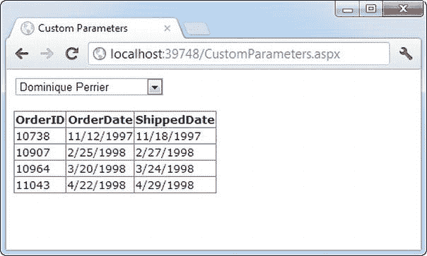

[图 15-13](#_Fig13) 。在主-详细信息页中使用参数

```cs
<asp:SqlDataSource ID="sourceCustomers" runat="server"
 ProviderName="System.Data.SqlClient"
 ConnectionString="<%$ ConnectionStrings:Northwind %>"
 SelectCommand="SELECT CustomerID, ContactName FROM Customers
OrderBy ContactName" />
 <asp:DropDownList ID="lstCustomers" runat="server"
 DataSourceID="sourceCustomers" DataTextField="ContactName"
 DataValueField="CustomerID" AutoPostBack="True">
</asp:DropDownList>
```

当用户从列表中选择一个客户时，页面被回发(因为 AutoPostBack 被设置为

true ),匹配的订单显示在下面的 GridView 中，使用第二个数据源。此数据源通过使用 ControlParameter 从下拉列表中提取当前所选客户的 CustomerID:

```cs
<asp:SqlDataSource ID="sourceCustomers" runat="server"
 ProviderName="System.Data.SqlClient"
 ConnectionString="<%$ ConnectionStrings:Northwind %>"
 SelectCommand="SELECT OrderID,OrderDate,ShippedDate FROM Orders WHERE
CustomerID=@CustomerID"> 
<SelectParameters>
    <asp:ControlParameter Name="CustomerID"
    ControlID="lstCustomers" PropertyName="
SelectedValue" />
</SelectParameters>
</asp:SqlDataSource>

<asp:GridView ID="gridOrders" runat="server" DataSourceID="sourceOrders">
</asp:GridView>
```

现在假设您想限制订单列表，使其只显示上周的订单。这很容易通过检查 OrderDate 字段的 Where 子句来完成。但是有一个问题。在查询本身中硬编码 OrderDate 值是没有意义的，因为范围是基于当前日期设置的。而且没有一个参数能准确地提供您需要的信息。解决这个问题的最简单的方法是添加一个新的参数——一个您自己负责设置的参数:

```cs
<asp:SqlDataSource ID="sourceOrders" runat="server"
 ProviderName="System.Data.SqlClient"
 ConnectionString="<%$ ConnectionStrings:Northwind %>"
 SelectCommand="SELECT OrderID,OrderDate,ShippedDate FROM Orders WHERE
CustomerID=@CustomerID AND OrderDate>=@EarliestOrderDate"
 OnSelecting="sourceOrders_Selecting">
 <SelectParameters>
    <asp:ControlParameter Name="CustomerID"
     ControlID="lstCustomers" PropertyName="SelectedValue" />
    <asp:Parameter Name="EarliestOrderDate" Type="DateTime"
     DefaultValue="1900/01/01" />
 </SelectParameters>
</asp:SqlDataSource>
```

虽然你可以修改任何参数的值，但是如果你不打算从[表 15-1](#Tab1) 中列出的任何地方提取值，使用一个普通的参数对象是有意义的，就像由< asp:Parameter >元素表示的那样。您可以设置数据类型(如果需要)和默认值(如本例所示)。

现在您已经创建了参数，您需要在命令执行之前设置它的值。SqlDataSource 有许多非常适合设置参数值的事件。您可以通过对选择事件做出反应来填充选择操作的参数。同样，在更新、删除或插入记录时，可以使用 update、delete 和 Inserting 事件。在这些事件处理程序中，您可以使用自定义 EventArgs 对象的 command 属性(例如，sqldata source selecting EventArgs)来访问将要执行的命令。命令)。然后，您可以手动修改其参数值。SqlDataSource 还提供了类似命名的 Selected、Updated、Deleted 和 Inserted 事件，但这些事件发生在操作完成之后，因此更改参数值为时已晚。

下面是将参数值设置为过去七天的日期所需的代码，以确保您看到一周的记录:

```cs
protected void sourceOrders_Selecting(object sender,
 SqlDataSourceSelectingEventArgs e)
{
    e.Command.Parameters["@EarliestOrderDate"].Value =
     DateTime.Today.AddDays(-7);
}
```

 **注意**如果你要在标准的 Northwind 数据库中使用这段代码，你需要稍微修改一下。Northwind 数据库中的数据是历史数据，大多数订单的日期都在 1997 年左右。因此，前面的代码实际上不会检索任何记录。但是如果您使用 AddYears()方法而不是 AddDays()，您可以轻松地回到 13 年或更久以前，回到您需要的地方。

处理错误

当您处理外部资源(如数据库)时，您需要用基本的错误处理逻辑来保护您的代码。即使你已经避免了每一个可能的编码错误，你仍然需要防范你无法控制的因素——例如，如果数据库服务器没有运行或者网络连接中断。

如果发生错误，您可以依靠 SqlDataSource 来正确地释放任何资源(如连接)。然而，底层异常不会被处理。相反，它会出现在页面上，影响你的处理。与任何其他未处理的异常一样，用户将收到一条含糊的错误消息或错误页面。这种设计是不可避免的——如果 SqlDataSource 禁止异常，它可能会隐藏潜在的问题，使调试变得极其困难。然而，在您的网页中处理问题并显示更合适的错误消息是一个好主意。

为此，您需要处理在错误发生后立即发生的数据源事件。如果您正在执行查询，那就是选定的事件。如果您正在执行更新、删除或插入操作，您应该改为处理 Updated、Deleted 或 insert 事件。(如果您不想提供定制的错误消息，您可以用同一个事件处理程序来处理所有这些事件。)

在事件处理程序中，可以通过 SqlDataSourceStatusEventArgs 访问异常对象。异常属性。如果希望防止错误进一步传播，只需设置 SqlDataSourceStatusEventArgs。ExceptionHandled 属性为 true。然后，确保在网页上显示适当的错误消息，通知用户命令没有完成。

这里有一个例子:

```cs
protected void sourceProducts_Selected(object sender,
 SqlDataSourceStatusEventArgs e)
{
    if (e.Exception != null)
    {
        lblError.Text = "An exception occurred performing the query.";
```

```cs
        // Consider the error handled.
        e.ExceptionHandled = true;
    }
}
```

更新记录

选择数据只是等式的一半。SqlDataSource 也可以应用更改。唯一的问题是并非所有的控件都支持更新。例如，humble ListBox 没有为用户提供任何编辑值、删除现有项或插入新项的方法。好在 ASP。NET 丰富的数据控件(包括 GridView、DetailsView 和 FormView)都有可以打开的编辑功能。

在打开给定控件中的编辑功能之前，需要为要在数据源中执行的操作定义合适的命令。这意味着提供用于插入 (InsertCommand)、删除(DeleteCommand)和更新(UpdateCommand)的命令。如果您知道您将只允许用户执行某些操作(比如更新)，而不允许其他操作(比如插入和删除)，那么您可以安全地忽略您不需要的命令。

定义 InsertCommand、DeleteCommand 和 UpdateCommand 的方式与定义用于 SelectCommand 属性的命令的方式相同，即使用参数化查询。例如，下面是产品信息的 SqlDataSource 的修订版，它定义了一个基本的更新命令来更新每个字段:

```cs
<asp:SqlDataSource ID="sourceProductDetails" runat="server"
 ProviderName="System.Data.SqlClient"
 ConnectionString="<%$ ConnectionStrings:Northwind %>"
 SelectCommand="SELECT ProductID, ProductName, UnitPrice, UnitsInStock,
UnitsOnOrder, ReorderLevel, Discontinued FROM Products WHERE ProductID=@ProductID"
 UpdateCommand="UPDATE Products SET ProductName=@ProductName, UnitPrice=@UnitPrice,
UnitsInStock=@UnitsInStock, UnitsOnOrder=@UnitsOnOrder, ReorderLevel=@ReorderLevel,
Discontinued=@Discontinued WHERE ProductID=@ProductID">
 <SelectParameters>
    <asp:ControlParameter ControlID="lstProduct" Name="ProductID"
     PropertyName="SelectedValue" />
 </SelectParameters>
</asp:SqlDataSource>
```

在这个例子中，参数名不是随意选择的。只要为每个参数指定与其影响的字段相同的名称，并在前面加上@符号(因此 ProductName 变成了@ProductName)，就不需要定义参数。这是因为 ASP.NET 数据控件在触发更新之前会自动提交一个包含新值的参数集合。集合中的每个参数都使用这种命名约定，这样可以节省大量时间。

您还需要为用户提供一种输入新值的方法。大多数富数据控件使这变得相当容易，对于 DetailsView，只需将 AutoGenerateEditButton 属性设置为 true，如下所示:

```cs
<asp:DetailsView ID="DetailsView1" runat="server"
 DataSourceID="sourceProductDetails" AutoGenerateEditButton="True" />
```

现在，当您运行该页面时，您将看到一个编辑链接。单击时，此链接会将 DetailsView 切换到编辑模式。所有字段都变成编辑控件(通常是文本框)，编辑链接被更新链接和取消链接所取代(见[图 15-14](#Fig14) )。

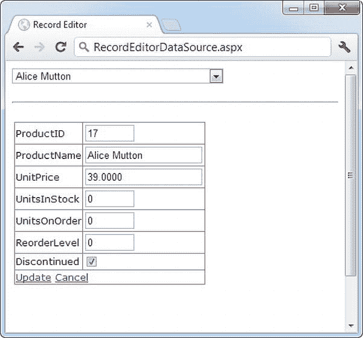

[图 15-14](#_Fig14) 。使用 DetailsView 编辑

单击取消链接会将该行返回到其初始状态。单击更新链接会触发更新。DetailsView 提取字段值，用它们来设置 SqlDataSource 中的参数。UpdateParameters 集合，然后触发 SqlDataSource。UpdateCommand 将更改应用到数据库。再说一次，你不需要写任何代码。

您可以为 DeleteCommand 和 InsertCommand 创建类似的参数化命令。若要启用删除和插入，需要将 DetailsView 的 AutoGenerateDeleteButton 和 AutoGenerateInsertButton 属性设置为 true。若要查看允许更新、删除和插入的示例页面，请参考本章的可下载示例中包含的 UpdateDeleteInsert.aspx 页面。

严格并发检查

上例中的 update 命令根据 ID 匹配记录。您可以通过检查 Where 子句来判断这一点:

```cs
UpdateCommand="UPDATE Products SET ProductName=@ProductName, UnitPrice=@UnitPrice,
 UnitsInStock=@UnitsInStock, UnitsOnOrder=@UnitsOnOrder, ReorderLevel=@ReorderLevel,
 Discontinued=@Discontinued WHERE ProductID=@ProductID"
```

这种方法的问题是，如果这些更改是在页面被请求和页面提交更新之间进行的，那么它就为覆盖另一个用户的更改的更新打开了大门。

例如，假设 Chen 和 Lucy 正在查看同一张产品记录表。Lucy 提交了一个产品价格的更改。几秒钟后，Chen 提交了对同一产品记录的名称更改。Chen 的 update 命令不仅应用了新名称，还用 Chen 页面中的值覆盖了所有其他字段——用原始页面中的价格替换 Lucy 输入的价格。

解决这个问题的一个方法是使用一种叫做 *match-all-values* 并发的方法。在这种情况下，您的更新命令试图匹配每个字段。因此，如果原始记录已经更改，update 命令将找不到它，并且根本不会执行更新。因此，在前面描述的场景中，使用匹配所有值策略，Chen 在尝试应用新产品名称时会收到一个错误，他需要编辑记录并再次应用更改。

要使用这种方法，您需要添加一个 Where 子句，尝试匹配每个字段。修改后的命令如下所示:

```cs
UpdateCommand="UPDATE Products SET ProductName=@ProductName, UnitPrice=@UnitPrice,
 UnitsInStock=@UnitsInStock, UnitsOnOrder=@UnitsOnOrder, ReorderLevel=@ReorderLevel,
 Discontinued=@Discontinued WHERE ProductID=@ProductID AND
 ProductName=@original_ProductName AND UnitPrice=@original_UnitPrice AND
 UnitsInStock=@original_UnitsInStock AND UnitsOnOrder=@original_UnitsOnOrder AND
 ReorderLevel=@original_ReorderLevel AND Discontinued=@original_Discontinued"
```

虽然这在概念上是有意义的，但是你还没有完成。在这个命令生效之前，您需要告诉 SqlDataSource 保持数据源中的旧值，并为它们提供以 original_ 开头的参数名。通过设置两个属性可以做到这一点。首先，设置 SqlDataSource。ConflictOptions 的 ConflictDetection 属性。CompareAllValues 代替 ConflictOptions。覆盖更改(默认)。接下来，将冗长的 OldValuesParameterFormatString 属性设置为文本“original_{0}”。这告诉 SqlDataSource 在字段名前插入文本 *original_* ，以创建存储旧值的参数。现在你的命令会按照写好的执行。

如果没有执行更新，SqlDataSource 不会引发异常来通知您。因此，如果您使用本例中显示的命令，您需要处理 SqlDataSource。更新事件并检查 SqlDataSourceStatusEventArgs。AffectedRows 属性。如果为 0，则没有记录被更新，您应该通知用户并发问题，以便可以再次尝试更新，如下所示:

```cs
protected void sourceProductDetails_Updated(object sender,
 SqlDataSourceStatusEventArgs e)
{
    if (e.AffectedRows == 0)
    {
        lblInfo.Text = "No update was performed. " +
"A concurrency error is likely, or the command is incorrectly written.";
    }
    else
    {
        lblInfo.Text = "Record successfully updated.";
    }
}
```

图 15-15 显示了如果你在两个不同的浏览器窗口中运行该页面的两个副本，开始在两个窗口中编辑，然后尝试提交两个更新，你将得到的结果。

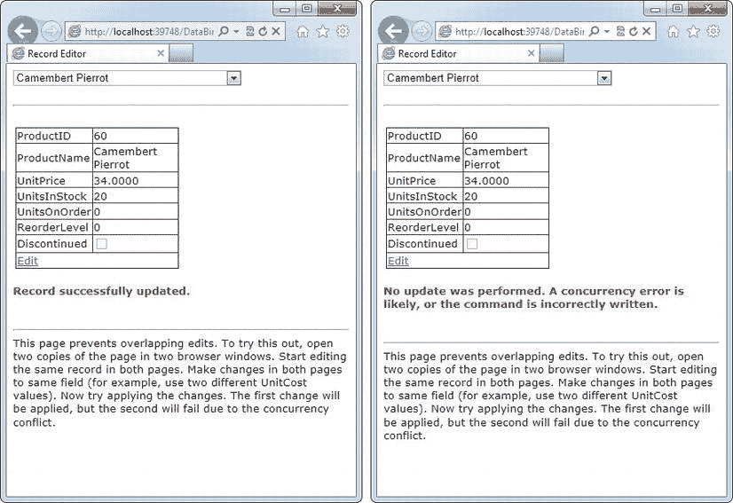

[图 15-15](#_Fig15) 。操作中的并发错误

对于小记录来说，匹配每个字段是一种可以接受的方法，但是如果表中有大量数据，这就不是最有效的策略。在这种情况下，您有两种可能的解决方案:您可以匹配一些字段(忽略值非常大的字段)或者您可以向数据库表添加一个时间戳字段，并使用它进行并发检查。

*时间戳* 是数据库用来跟踪记录状态的特殊字段。每当对记录进行任何更改时，数据库引擎都会更新时间戳字段，为其自动生成一个新值。时间戳字段的目的是使严格的并发检查更容易。当您尝试对包含时间戳字段的表执行更新时，可以使用一个 Where 子句来匹配适当的唯一 ID 值(例如，ProductID)和时间戳字段:

```cs
UpdateCommand="UPDATE Products SET ProductName=@ProductName, UnitPrice=@UnitPrice,
 UnitsInStock=@UnitsInStock, UnitsOnOrder=@UnitsOnOrder,
 ReorderLevel=@ReorderLevel, Discontinued=@Discontinued
WHERE ProductID=@ProductID AND RowTimestamp=@RowTimestamp"
```

数据库引擎使用 ProductID 来查找匹配的记录。然后，它尝试匹配时间戳，以便更新记录。如果时间戳匹配，您就知道记录没有被更改。时间戳的实际*值*并不重要，因为这是由数据库控制的。你只需要知道它是否改变了。

创建时间戳很容易。在 SQL Server 中，通过使用时间戳数据类型创建时间戳字段。在其他数据库产品中，时间戳有时被称为*行版本*。

最后一句话

本章全面介绍了 ASP.NET 的数据绑定。首先，您学习了用简单的数据绑定创建动态文本的有趣方法。尽管这是一种将信息放入页面的合理方法，但它并没有超越您已经可以用纯代码完成的事情。您还了解了 ASP.NET 如何在此基础上构建更多有用的功能，包括在列表控件中快速方便地显示数据的重复值绑定，以及允许您创建无代码绑定页面的数据源控件。

使用本章中的技术，您可以创建各种各样的数据绑定页。但是，如果您想创建一个包含记录编辑、排序和其他更高级技巧的页面，那么到目前为止您所了解的数据绑定特性只是第一步。您还需要求助于专门的控件，如 DetailsView 和 GridView，它们构建在这些数据绑定功能之上。你将在下一章学习如何掌握这些控制。在第 22 章中，您将学习如何扩展您的数据绑定技能来处理数据访问组件。