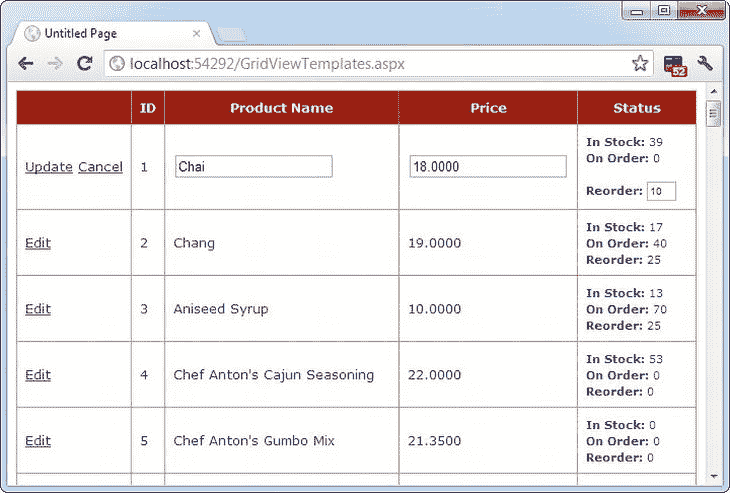

# 十六、数据控制

说到数据绑定，并不是所有的 ASP.NET 控件都是一样的。在上一章中，您看到了数据绑定如何帮助您自动将单个值和列表插入到各种常见控件中。在本章中，您将集中讨论三个更高级的控件—GridView、DetailsView 和 FormView—它们允许您绑定整个数据表。

丰富的数据控件与简单的列表控件有很大的不同。首先，它们是专门为数据绑定而设计的。它们还能够一次显示多个字段，通常是基于表格的布局或根据您的定义。它们还支持更高级的功能，比如选择、编辑和排序。

丰富的数据控件包括以下内容:

*   GridView:GridView 是一个通用的网格控件，用于显示大型信息表格。GridView 是 ASP.NET 数据控件的重量级。
*   *DetailsView*:DetailsView 非常适合在每个字段占一行的表格中一次显示一条记录。DetailsView 也支持编辑。
*   *FormView* :和 DetailsView 一样，FormView 一次显示一条记录，并支持编辑。不同之处在于 FormView 是基于模板的，它允许您在不需要基于表格的灵活布局中组合字段。
*   ListView:ListView 的作用和 GridView 一样——它允许你显示多条记录。区别在于 ListView 是基于模板的。因此，使用 ListView 需要更多的工作，并为您提供更多的布局灵活性。本书中没有描述 ListView，尽管你可以在 Visual Studio 帮助中了解更多，或者在《C# 中的*Pro ASP.NET 4.5》一书中了解更多。*

在本章中，您将详细探索丰富的数据控件。

**GridView**T3】

GridView 是一个非常灵活的网格控件，可以显示多列表格。数据源中的每条记录都成为网格中单独的一行。记录中的每个字段都成为网格中的一个单独的列。

GridView 是您将在本章中学习的最强大的富数据控件，因为它配备了最现成的功能。该功能包括自动分页、排序、选择和编辑的特性。GridView 也是你在本章中考虑的唯一一个可以一次显示多条记录的数据控件。

自动生成列

GridView 为你想要显示的数据对象提供了一个 DataSource 属性，很像你在第 15 章中看到的列表控件。一旦设置了 DataSource 属性，就调用 DataBind()方法来执行数据绑定，并在 GridView 中显示每条记录。但是，GridView 不提供允许您选择要显示的列的属性，如 DataTextField 和 DataValueField。这是因为只要 AutoGenerateColumns 属性为 true(这是默认值)，GridView 就会自动为每个字段生成一个*列。*

下面是创建每个字段一列的基本网格所需的全部内容:

```cs
<asp:GridView ID = "GridView1" runat = "server" />
```

一旦将这个 GridView 标记添加到页面中，就可以用数据填充它。下面是一个使用 ADO.NET 对象执行查询并绑定检索到的数据集的示例:

```cs
protected void Page_Load(object sender, EventArgs e)
{
    // Define the ADO.NET objects.
    string connectionString =
     WebConfigurationManager.ConnectionStrings["Northwind"].ConnectionString;
    string selectSQL = "SELECT ProductID, ProductName, UnitPrice FROM Products";
    SqlConnection con = new SqlConnection(connectionString);
    SqlCommand cmd = new SqlCommand(selectSQL, con);
    SqlDataAdapter adapter = new SqlDataAdapter(cmd);

    // Fill the DataSet.
    DataSet ds = new DataSet();
    adapter.Fill(ds, "Products");

    // Perform the binding.
    GridView1.DataSource = ds;
    GridView1.DataBind();
}
```

请记住，为了使这段代码能够运行，在 web.config 文件中必须有一个名为 Northwind 的连接字符串(就像您在前两章的示例中所做的那样)。

图 16-1 显示了这段代码创建的 GridView。


[图 16-1](#_Fig00161) 。最基本的 GridView

当然，您不需要手工编写这个数据访问代码。正如您在上一章中了解到的，您可以使用 SqlDataSource 控件来定义您的查询。然后，您可以将该查询直接链接到您的数据控件，ASP.NET 将负责整个数据绑定过程。

下面是如何定义一个 SqlDataSource 来执行前面示例中显示的查询:

```cs
<asp:SqlDataSource ID = "sourceProducts" runat = "server"
 ConnectionString = " < %$ ConnectionStrings:Northwind % > "
 SelectCommand = "SELECT ProductID, ProductName, UnitPrice FROM Products" />
```

接下来，设置 GridView。将数据源链接到网格的 DataSourceID 属性:

```cs
<asp:GridView ID = "GridView1" runat = "server"
DataSourceID = "sourceProducts" />
```

这两个标签复制了图 16-1 中的例子，但工作量明显减少。现在，您不必编写任何代码来执行查询和绑定数据集。

使用 SqlDataSource 有积极的一面，也有消极的一面。尽管它给你的控制更少，但它大大简化了你的代码，并且它允许你从你的代码隐藏类中删除所有的数据库细节。在本章中，您将重点关注数据源方法，因为在创建支持编辑等功能的复杂数据绑定页面时，这种方法要简单得多。在第 22 章中，你将学习如何修改这些例子来使用 ObjectDataSource 而不是 SqlDataSource。ObjectDataSource 是一个很好的折衷方案:它允许您在数据库组件中编写自定义的数据访问代码，而不会放弃数据源控件的方便的设计时功能。

定义列

默认情况下，GridView。AutoGenerateColumns 属性为 true，GridView 为绑定的 DataTable 中的每个字段创建一列。这种自动的列生成对于创建快速的测试页面来说是很好的，但是它没有给你通常想要的灵活性。例如，假设您想要隐藏列、更改它们的顺序或配置它们显示的某些方面，如格式或标题文本。在所有这些情况下，您需要将 AutoGenerateColumns 设置为 false，并在 GridView 控件标记的<列>部分定义列。

 **提示**可以将 AutoGenerateColumns 设置为 true，并在<列>部分定义列。在这种情况下，显式定义的列将在自动生成的列之前添加。然而，为了获得最大的灵活性，您通常希望显式定义每一列。

每列可以是几种列类型中的任何一种，如[表 16-1](#Tab00161) 所述。列标记的顺序决定了 GridView 中列从左到右的顺序。

[表 16-1](#_Tab00161) 。列类型

| 班级 | 描述 |
| --- | --- |
| 本菲尔德 | 此栏显示数据源中某个字段的文本。 |
| 按钮字段 | 此列在此网格列中显示一个按钮。 |
| 复选框字段 | 此列在此网格列中显示一个复选框。它自动用于真/假字段(在 SQL Server 中，这些字段使用 bit 数据类型)。 |
| CommandField | 该列提供选择或编辑按钮。 |
| 超链接字段 | 此栏将其内容(数据源中的字段或静态文本)显示为超链接。 |
| ImageField(图像字段) | 此列显示来自二进制字段的图像数据(前提是它可以被成功解释为受支持的图像格式)。 |
| 列 | 此栏允许您使用自定义模板指定多个字段、自定义控件和任意 HTML。它给你最高程度的控制，但需要最大的努力。 |

最基本的列类型是 BoundField，它绑定到数据对象中的一个字段。例如，下面是显示 ProductID 字段的单个数据绑定列的定义:

```cs
<asp:BoundField DataField = "ProductID" HeaderText = "ID" />
```

这个标记演示了如何将列顶部的标题文本从 ProductID 更改为 just ID。

下面是一个带有显式列的完整 GridView 声明:

```cs
<asp:GridView ID = "GridView1" runat = "server" DataSourceID = "sourceProducts"
 AutoGenerateColumns = "False">
 <Columns>
    <asp:BoundField DataField = "ProductID" HeaderText = "ID" />
    <asp:BoundField DataField = "ProductName" HeaderText = "Product Name" />
    <asp:BoundField DataField = "UnitPrice" HeaderText = "Price" />
 </Columns>
</asp:GridView>
```

显式定义列有几个优点 :

*   通过调整 column 对象的属性，可以轻松地微调列顺序、列标题和其他细节。
*   您可以通过移除列标签来隐藏不想显示的列。(不要过度使用这种技术，因为如果不打算显示数据，最好减少要检索的数据量。)
*   您将在设计环境(在 Visual Studio 中)中看到您的列。对于自动生成的列，GridView 只显示一些通用的占位符列。
*   您可以向组合中添加额外的列，用于选择、编辑等。

这个例子展示了如何使用这种方法来改变标题文本。但是，HeaderText 属性并不是列中唯一可以更改的列属性。在下一节中，您将了解更多。

**配置列**

当您显式声明绑定字段时，您有机会设置其他属性。表 16-2 列出了这些属性。

[表 16-2](#_Tab00162) 。边界字段属性

| 财产 | 描述 |
| --- | --- |
| 数据字段 | 标识要在该列中显示的字段(按名称)。 |
| 数据格式字符串 | 格式化字段。这对于获得数字和日期的正确表示非常有用。 |
| ApplyFormatInEditMode | 如果为 true，DataFormat 字符串用于格式化该值，即使该值出现在编辑模式下的文本框中。默认值为 false，这意味着将使用基础值(如 1143.02 而不是$1，143.02)。 |
| FooterText、HeaderText 和 HeaderImageUrl | 如果网格有页眉(GridView ),则设置该网格的页眉和页脚区域中的文本。ShowHeader 为 true)和 footer (GridView。ShowFooter 为真)。标题通常用于描述性标签，如字段名；页脚可以包含动态计算的值，如摘要。要在标题*而不是文本*中显示图像，请设置 HeaderImageUrl 属性。 |
| 只读的 | 如果为 true，则禁止在编辑模式下更改此列的值。将不提供编辑控件。主键字段通常是只读的。 |
| 插入可见 | 如果为 true，则禁止在插入模式下设置该列的值。如果希望以编程方式或基于数据库中定义的默认值设置列值，可以使用此功能。 |
| 看得见的 | 如果为 false，则该列在页面中不可见(并且不会为其呈现 HTML)。这为您提供了一种以编程方式隐藏或显示特定列的便捷方式，从而更改数据的整体视图。 |
| 排序表达式 | 基于一列或多列对结果进行排序。你将在本章的“GridView 的排序和分页”一节中学习排序。 |
| HtmlEncode | 如果为真(默认)，所有文本将被 HTML 编码，以防止特殊字符篡改页面。如果您想嵌入一个有效的 HTML 标签(比如一个超链接)，您可以禁用 HTML 编码，但是这种方法并不安全。最好对所有值使用 HTML 编码，并通过响应 GridView 选择事件来提供其他功能。 |
| NullDisplayText | 显示将为空值显示的文本。默认值是一个空字符串，尽管您可以将其更改为硬编码的值，例如“(未指定)”。 |
| ConvertEmptyStringToNull | 如果为 true，则将所有空字符串转换为空值(并使用 NullDisplayText 显示它们)。 |
| ControlStyle、HeaderStyle、FooterStyle 和 ItemStyle | 仅配置此列的外观，覆盖行的样式。在本章中，你会学到更多关于样式的知识。 |

**用 Visual Studio 生成栏目**

正如您已经了解到的，您可以通过将 AutoGenerateColumns 属性设置为 true 来创建显示所有字段的 GridView。不幸的是，当您使用这种方法时，您将无法控制关于列的任何细节，包括它们的顺序、格式、排序等等。要配置这些细节，您需要将 AutoGenerateColumns 设置为 false，并显式定义您的列。这需要更多的工作，而且有点繁琐。

然而，有一个巧妙的技巧可以解决这个问题。您可以使用显式列，但让 Visual Studio 自动为您创建列标记。工作原理如下:选择 GridView 控件，然后单击智能标记中的“刷新架构”。此时，Visual Studio 将从数据源中检索基本的模式信息(例如，每列的名称和数据类型)，然后为每个字段添加一个< BoundField >元素。

 **提示**如果您修改数据源，使其返回一组不同的列，您可以重新生成 GridView 列。只需选择 GridView，然后单击智能标记中的刷新架构链接。这一步将清除您添加的任何自定义列(如编辑控件)。

一旦创建了列，还可以使用一些有用的设计时支持来配置每个列的属性(而不是手动编辑列标记)。为此，请选择 GridView 并单击省略号(。。。)位于“属性”窗口中的“列”属性旁边。你会看到一个字段对话框，允许你添加、删除和细化你的列(见[图 16-2](#Fig00162) )。


[图 16-2](#_Fig00162) 。在 Visual Studio 中配置列

既然您已经理解了 GridView 的基础，那么您已经开始探索它的一些高级特性了。在以下几节中，您将讨论这些主题:

*   *格式化:*如何格式化行和数据值
*   *选择:*如何让用户在 GridView 中选择一行并做出相应的响应
*   *编辑:* 如何让用户提交记录更新、插入和删除
*   *排序:* 如何动态地重新排序 GridView 以响应对列标题的点击
*   *分页:* 如何将一个大的结果集分成多页数据
*   *模板:* 如何通过定义模板来完全控制设计、格式化和编辑

**格式化 GridView**

格式化由几个相关的任务组成。首先，您希望确保日期、货币和其他数值以适当的方式显示。您可以使用 DataFormatString 属性来处理这项工作。接下来，您需要将颜色、字体、边框和对齐选项的完美组合应用到网格的各个方面，从标题到数据项。GridView 通过样式支持这些特性。最后，您可以截获事件，检查行数据，并以编程方式将格式应用于特定值。在接下来的几节中，您将考虑这些技术。

GridView 还公开了几个不言自明的格式化属性 ，这里没有介绍。其中包括网格线(用于添加或隐藏表格边框)、单元格填充和单元格间距(用于控制单元格之间的整体间距)，以及标题和标题对齐(用于在网格顶部添加标题)。

 **提示**想创建一个在网页内滚动的 GridView 吗？很简单。只需将 GridView 放入面板控件中，为面板设置适当的大小，然后设置面板。属性设置为自动、垂直或两者兼有。

格式化字段

每个 BoundField 列都提供了一个 DataFormatString 属性，您可以使用一个*格式字符串* 来配置数字和日期的外观。

格式字符串通常由一个占位符和一个格式指示符组成，它们被包在花括号内。典型的格式字符串如下所示:

{0:C}

在这种情况下，0 表示将被格式化的值，字母表示预定的格式样式。在这里，C 表示货币格式，它将一个数字格式化为金额(所以 3400.34 变成了$3，400.34，假设 web 服务器设置为使用美国区域设置)。下面是一个使用此格式字符串的列:

```cs
<asp:BoundField DataField = "UnitPrice" HeaderText = "Price"
 DataFormatString = "{0:C}" />
```

表 16-3 显示了数值的一些其他格式选项。

[表 16-3](#_Tab00163) 。数字格式字符串

| 类型 | 格式字符串 | 例子 |
| --- | --- | --- |
| 货币 | {0:C} | $1,234.50.括号表示负值:($ 1 234.50)。货币符号是特定于地区的。 |
| 科学(指数) | {0:E} | 1.234500E + 003 |
| 百分率 | {0:P} | 45.6 % |
| 固定小数 | {0:F？} | 取决于您设置的小数位数。{0:F3}将是 123.400。{0:F0}应该是 123。 |

您可以在 MSDN 帮助中找到其他示例。对于日期或时间值，您会发现一个很长的列表。例如，如果要以月/日/年的格式书写出生日期值(如 12/30/12)，则使用以下列:

```cs
<asp:BoundField DataField = "BirthDate" HeaderText = "Birth Date"
 DataFormatString = "{0:MM/dd/yy}" />
```

表 16-4 显示了更多的例子。

[表 16-4](#_Tab00164) 。时间和日期格式字符串

| 类型 | 格式字符串 | 句法 | 例子 |
| --- | --- | --- | --- |
| 短期的 | {0:d} | 年月日 | 10/30/2012 |
| 漫长的约会 | {0:D} | MMMM dd，yyyy | 2012 年 1 月 30 日星期一 |
| 长日期和短时间 | {0:f} | dddd，MMMM dd，yyyy HH:mm aa | 2012 年 1 月 30 日星期一上午 10 点 |
| 长日期和长时间 | {0:F} | dddd，MMMM dd，yyyy HH:mm:ss aa | 2012 年 1 月 30 日星期一上午 10:00:23 |
| ISO 可分类标准 | {0:s} | yyyy-MM-ddTHH：mm：ss | 2012 年 1 月 30 日 10 时 00 分 23 秒 |
| 月和日 | {0:M} | MMMM dd | 1 月 30 日 |
| 一般 | {0:G} | M/d/yyyy HH:mm:ss aa(取决于特定于区域设置的设置) | 2012 年 10 月 30 日上午 10 时 23 分 |

格式字符不是特定于 GridView 的。您可以将它们用于其他控件、模板中的数据绑定表达式(您将在“使用 GridView 模板”一节中看到)，以及作为许多方法的参数。例如，Decimal 和 DateTime 类型公开它们自己的 ToString()方法，这些方法接受格式字符串，允许您手动设置值的格式。

使用样式

GridView 公开了基于*样式*的丰富格式模型。总共可以设置八种 GridView 样式，如[表 16-5](#Tab00165) 所述。

[表 16-5](#_Tab00165) 。GridView 样式

| 风格 | 描述 |
| --- | --- |
| 头部样式 | 配置包含列标题的标题行的外观，如果您选择显示它(如果 ShowHeader 为 true)。 |
| 行样式 | 配置每个数据行的外观。 |
| 另类风格 | 如果设置，则每隔一行应用附加格式。此格式是对 RowStyle 格式的补充。例如，如果您使用 RowStyle 设置字体，它也会应用于交替行，除非您通过 AlternatingRowStyle 显式设置不同的字体。 |
| 选择行式 | 配置当前选定行的外观。此格式是对 RowStyle 格式的补充。 |
| 编辑样式 | 配置处于编辑模式的行的外观。此格式是对 RowStyle 格式的补充。 |
| EmptyDataRowStyle | 配置在绑定数据对象不包含行的特殊情况下用于单个空行的样式。 |
| 足球风格 | 配置 GridView 底部脚注行的外观，如果您选择显示它(如果 ShowFooter 为 true)。 |
| 寻呼机样式 | 如果启用了分页(将 AllowPaging 设置为 true)，则配置带有页面链接的行的外观。 |

样式不是简单的单值属性。相反，每个样式都公开一个 style 对象，该对象包含用于选择颜色(ForeColor 和 BackColor)、添加边框(BorderColor、BorderStyle 和 BorderWidth)、调整行大小(高度和宽度)、对齐行(HorizontalAlign 和 VerticalAlign)以及配置文本外观(字体和换行)的属性。这些样式属性允许您改进项目外观的几乎每个方面。

下面是一个更改 GridView 中行和标题样式的示例:

```cs
<asp:GridView ID = "GridView1" runat = "server" DataSourceID = "sourceProducts"
 AutoGenerateColumns = "False">
    <RowStyle BackColor = "#E7E7FF" ForeColor = "#4A3C8C" />
    <HeaderStyle BackColor = "#4A3C8C" Font-Bold = "True" ForeColor = "#F7F7F7" />
    <Columns>
     <asp:BoundField DataField = "ProductID" HeaderText = "ID" />
     <asp:BoundField DataField = "ProductName" HeaderText = "Product Name" />
     <asp:BoundField DataField = "UnitPrice" HeaderText = "Price" />
    </Columns>
    </asp:GridView>
```

在本例中，每一列都受到格式更改的影响。但是，您也可以定义特定于列的样式。要创建特定于列的样式，只需重新排列控制标签，使格式化标签成为适当的列标签内的嵌套标签*。下面是一个仅格式化 ProductName 列的示例:*

```cs
<asp:GridView ID = "GridView2" runat = "server" DataSourceID = "sourceProducts"
 AutoGenerateColumns = "False" >
    <Columns>
     <asp:BoundField DataField = "ProductID" HeaderText = "ID" />
     <asp:BoundField DataField = "ProductName" HeaderText = "Product Name">
        <ItemStyle BackColor = "#E7E7FF" ForeColor = "#4A3C8C" />
        <HeaderStyle BackColor = "#4A3C8C" Font-Bold = "True" ForeColor = "#F7F7F7" />
     </asp:BoundField>
     <asp:BoundField DataField = "UnitPrice" HeaderText = "Price" />
    </Columns>
    </asp:GridView>
```

[图 16-3](#Fig00163) 比较了这两个例子。您可以结合使用普通样式设置和特定于列的样式设置(如果普通样式设置发生冲突，它们将覆盖普通样式设置)。


[图 16-3](#_Fig00163) 。格式化 GridView

使用特定于列的格式的一个原因是定义特定的列宽。如果您没有定义特定的列宽，ASP.NET 会使每一列的宽度刚好适合它所包含的数据(或者，如果启用了换行，则适合文本，而不在换行符上拆分单词)。如果值在大小范围内，则宽度由最大值或列标题的宽度决定，以较大者为准。但是，如果网格足够宽，您可能希望扩展一列，这样它就不会与相邻的列拥挤在一起。在这种情况下，您需要显式定义一个更大的宽度。

**用 Visual Studio 配置样式**

没有理由在 GridView 控件标记中手工编写样式属性，因为 GridView 提供了丰富的设计时支持。若要设置样式属性，可以使用“属性”窗口修改样式属性。例如，若要配置标题的字体，请展开 HeaderStyle 属性以显示嵌套的 font 属性，并设置该属性。这种方法的唯一限制是它不允许您为单个列设置样式；如果你需要这个技巧，你必须首先通过编辑列属性来调用字段对话框(如图[图 16-2](#Fig00162) 所示)。然后，选择适当的列，并相应地设置样式属性。

您甚至可以通过单击 GridView 智能标记中的“自动设置格式”链接，使用预设主题来设置样式组合。[图 16-4](#Fig00164) 显示了自动格式对话框，其中有一些你可以选择的预置样式。选择“删除格式”以清除所有样式设置。


[图 16-4](#_Fig00164) 。自动格式化 GridView

一旦选择了样式并将其插入到 GridView 标记中，就可以手动或使用属性窗口来调整它们。

格式特定值

到目前为止，您所学的格式还不够精细。最具体地说，这种格式适用于单个值列。但是，如果您想要更改特定行甚至是单个单元格的格式，该怎么办呢？

解决方案是对 GridView 做出反应。RowDataBound 事件。在每行填充数据后，该事件会针对每一行引发。此时，您可以将当前行作为 GridViewRow 对象进行访问。GridViewRow。DataItem 属性为给定行和 GridViewRow 提供数据对象。单元格集合允许您检索行内容。您可以使用 GridViewRow 更改颜色和对齐方式，添加或移除子控件，等等。

下面的示例处理 RowDataBound 事件，并更改背景色以突出显示高价格(高于$50 的价格):

```cs
protected void GridView1_RowDataBound(object sender, GridViewRowEventArgs e)
{
    if (e.Row.RowType == DataControlRowType.DataRow)
    {
        // Get the price for this row.
        decimal price = (decimal)DataBinder.Eval(e.Row.DataItem, "UnitPrice");
        if (price > 50)
        {
            e.Row.BackColor = System.Drawing.Color.Maroon;
            e.Row.ForeColor = System.Drawing.Color.White;
            e.Row.Font.Bold = true;
        }
    }
}
```

首先，代码检查正在创建的项是行还是替换行。如果都不是，则意味着该项是另一个界面元素，如页导航、页脚或页眉，并且该过程不执行任何操作。如果该项的类型正确，代码将从数据绑定项中提取单价字段。

从绑定的数据对象中获取值(通过 GridViewRowEventArgs 提供。Row.DataItem 属性)，您需要将数据对象转换为正确的类型。诀窍在于类型取决于您执行数据绑定的方式。在本例中，您在 DataSet 模式下绑定到 SqlDataSource，这意味着每个数据项都将是 DataRowView 对象。(如果要在 DataReader 模式下绑定，则用 DbDataRecord 表示每一项。)为了避免对这些细节进行编码，从而使更改数据访问代码变得更加困难，您可以依赖 DataBinder。Eval() helper 方法，它理解所有这些类型的数据对象。这就是本例中使用的技术。

图 16-5 显示了结果页面。


[图 16-5](#_Fig00165) 。基于值格式化单个行

**选择一个 GridView 行**

*选择*一个项目指的是点击一行并使其改变颜色(或变得突出显示)以指示用户当前正在处理该记录的能力。同时，您可能希望在另一个控件中显示有关记录的附加信息。有了 GridView，一旦你设置了一些基础，选择几乎自动发生。

在使用项目选择之前，必须为选定的项目定义不同的样式。SelectedRowStyle 决定所选行或单元格的显示方式。如果不设置该样式，它将默认为与 RowStyle 相同的值，这意味着用户将无法判断当前选择的是哪一行。通常，选中的行将有不同的 BackColor 属性。

要找出当前选择的项目(或更改选择)，可以使用 GridView。SelectedIndex 属性。如果当前没有选择任何项目，则为-1。此外，您可以对 SelectedIndexChanged 事件做出反应，以处理任何其他相关任务。例如，您可能希望用有关选定记录的附加信息更新另一个控件。

添加选择按钮

GridView 为选择提供了内置支持。您只需添加一个 CommandField 列，并将 ShowSelectButton 属性设置为 true。ASP.NET 可以将 CommandField 呈现为超链接、按钮或固定图像。使用 ButtonType 属性选择类型。然后，您可以通过 SelectText 属性指定文本，或者通过 SelectImageUrl 属性指定到图像的链接。

下面是一个显示选择按钮的示例:

```cs
<asp:CommandField ShowSelectButton = "True" ButtonType = "Button"
 SelectText = "Select" />
```

这里有一个例子，展示了一个小的可点击图标:

```cs
<asp:CommandField ShowSelectButton = "True" ButtonType = "Image"
 SelectImageUrl = "select.gif" />
```

[图 16-6](#Fig00166) 显示了一个带有文本选择按钮的页面(选择了产品 14)。


[图 16-6](#_Fig00166) 。GridView 选择

当您单击一个选择按钮时，页面被回发，一系列步骤展开。首先是 GridView。SelectedIndexChanging 事件触发，您可以拦截该事件以取消操作。接下来是 GridView。SelectedIndex 属性被调整为指向选定的行。最后是 GridView。如果要手动更新其他控件以反映新的选择，可以处理 SelectedIndexChanged 事件。当呈现页面时，选定的行被赋予选定的行样式。

 **提示**不用自己添加选择按钮，您可以从 GridView 的智能标记中选择启用选择，它为您添加了一个基本的选择按钮。

**使用数据字段** **作为选择按钮**

您不需要创建新的列来支持行选择。相反，您可以将现有的列转换为链接。这种技术通常实现为允许用户通过唯一的 ID 值选择表中的行。

若要使用此技术，请移除 CommandField 列，并添加一个 ButtonField 列。然后，将 DataTextField 设置为要使用的字段的名称。

```cs
<asp:ButtonField ButtonType = "Button" DataTextField = "ProductID" />
```

该字段将被加下划线并变成一个按钮，单击该按钮将回发页面并触发 GridView。RowCommand 事件。您可以处理此事件，确定单击了哪一行，并以编程方式设置 GridView 的 SelectedIndex 属性。但是，您可以使用更简单的方法。相反，只需通过指定带有文本 *Select* 的 CommandName 来配置链接以引发 SelectedIndexChanged 事件，如下所示:

```cs
<asp:ButtonField CommandName = "Select" ButtonType = "Button"
 DataTextField = "ProductID" />
```

现在，单击数据字段会自动选择记录。

使用选择创建主-详细页

如前一章所述，您可以从控件中提取一个值，并使用它在数据源中执行查询。例如，您可以获取列表中当前选定的项，并将该值提供给 SqlDataSource，后者获取相应记录的更多信息。

这个技巧是构建*主从页面*——让你在数据库中导航关系的页面的好方法。典型的 master-details 页有两个 GridView 控件。第一个 GridView 显示主(或父)表。当用户在第一个 GridView 中选择一个项目时，第二个 GridView 将填充来自 details(或父)表的相关记录。例如，这种技术的典型实现可能在第一个 GridView 中有一个 Customers 表。选择一个客户，第二个 GridView 将填充该客户的订单列表。

要创建主从页面，需要从第一个 GridView 中提取 SelectedIndex 属性，并使用该属性为第二个 GridView 创建一个查询。然而，这种方法有一个问题。SelectedIndex 返回一个从零开始的索引号，表示行在网格中出现的位置。这不是您需要插入到获取相关记录的查询中的信息。相反，您需要相应行中的唯一键字段。例如，如果您有一个产品表，您需要能够获得所选行的 ProductID。为了获得这些信息，您需要告诉 GridView 跟踪关键字段值。

方法是为 GridView 设置 DataKeyNames 属性。此属性要求一个或多个关键字字段的逗号分隔列表。您提供的每个名称必须与绑定数据源中的一个字段匹配。通常，您只有一个关键字段。下面的示例告诉 GridView 跟踪产品类别列表中的 CategoryID 值:

```cs
<asp:GridView ID = "gridCategories" runat = "server"
DataKeyNames = "CategoryID" . . . >
```

一旦建立了这个链接，GridView 就可以很好地跟踪所选记录的关键字段。它允许您通过 SelectedDataKey 属性随时检索此信息。

下面的例子将所有这些放在一起。它定义了两个 GridView 控件。第一个显示了类别列表。第二个显示属于当前所选类别的产品(或者，如果没有选择类别，这个 GridView 根本不会出现)。

以下是该示例的页面标记:

```cs
Categories:<br />
<asp:GridView ID = "gridCategories" runat = "server" DataSourceID = "sourceCategories"
 DataKeyNames = "CategoryID">
    <Columns>
     <asp:CommandField ShowSelectButton = "True" />
    </Columns>
    <SelectedRowStyle BackColor = "#FFCC66" Font-Bold = "True"
    ForeColor = "#663399" />
</asp:GridView>
<asp:SqlDataSource ID = "sourceCategories" runat = "server"
 ConnectionString = " < %$ ConnectionStrings:Northwind % > "
 SelectCommand = "SELECT * FROM Categories" > </asp:SqlDataSource>
<br />

Products in this category:<br />
<asp:GridView ID = "gridProducts" runat = "server" DataSourceID = "sourceProducts">
 <SelectedRowStyle BackColor = "#FFCC66" Font-Bold = "True" ForeColor = "#663399" />
</asp:GridView>
<asp:SqlDataSource ID = "sourceProducts" runat = "server"
 ConnectionString = " < %$ ConnectionStrings:Northwind % > "
 SelectCommand = "SELECT ProductID, ProductName, UnitPrice FROM Products WHERE
CategoryID = @CategoryID">
    <SelectParameters>
     <asp:ControlParameter Name = "CategoryID" ControlID = "gridCategories"
        PropertyName = "SelectedDataKey.Value" />
    </SelectParameters>
</asp:SqlDataSource>
```

如您所见，您需要两个数据源，每个 GridView 一个。第二个数据源使用 ControlParameter 将其链接到第一个 GridView 的 SelectedDataKey 属性。最棒的是，您仍然不需要自己编写任何代码或处理 SelectedIndexChanged 事件。

图 16-7 显示了这个例子的作用。


[图 16-7](#_Fig00167) 。主-详细信息页面

**用 GridView 编辑**

 **GridView 对编辑的支持几乎和对选择的支持一样方便。要将一行切换到选择模式，只需将 SelectedIndex 属性设置为相应的行号。要将一行切换到编辑模式，可以用同样的方式设置 EditIndex 属性。

当然，如果您使用专门的按钮类型，这两个任务都可以自动发生。对于选择，使用 ShowSelectButton 属性设置为 true 的 CommandField 列。要添加编辑控件，遵循几乎相同的步骤—再次使用 CommandField 列，但是现在将 ShowEditButton 设置为 true。

下面是一个支持编辑的 GridView 示例:

```cs
<asp:GridView ID = "gridProducts" runat = "server" DataSourceID = "sourceProducts"
 AutoGenerateColumns = "False" DataKeyNames = "ProductID">
    <Columns>
     <asp:BoundField DataField = "ProductID" HeaderText = "ID" ReadOnly = "True" />
     <asp:BoundField DataField = "ProductName" HeaderText = "Product Name"/>
     <asp:BoundField DataField = "UnitPrice" HeaderText = "Price" />
     <asp:CommandField ShowEditButton = "True" />
    </Columns>
    </asp:GridView>
```

下面是一个经过修改的数据源控件，它可以提交您的更改:

```cs
<asp:SqlDataSource id = “sourceProducts” runat = “server”
 ConnectionString = " < %$ ConnectionStrings:Northwind % > "
 SelectCommand = "SELECT ProductID, ProductName, UnitPrice FROM Products"
 UpdateCommand = "UPDATE Products SET ProductName = @ProductName,
UnitPrice = @UnitPrice WHERE ProductID = @ProductID" />
```

 **注意**如果你收到一个 SqlException 说“必须声明标量变量@ProductID”，最有可能的问题是你还没有设置 GridView。DataKeyNames 属性。因为不能修改 ProductID 字段，所以 GridView 不会将 ProductID 值传递给 SqlDataSource，除非它被指定为键字段。

请记住，您不需要定义更新参数，只要您确保它们匹配字段名(在开头的符号[@]处有一个*)。[第 15 章](15.html)有更多关于使用 SqlDataSource 控件更新命令的信息。*

当添加一个 ShowEditButton 属性设置为 true 的 CommandField 时，GridView 编辑控件会出现在另一列中。当您运行页面并且 GridView 被绑定和显示时，编辑列在每条记录旁边显示一个编辑链接(参见[图 16-8](#Fig00168) )。


[图 16-8](#_Fig00168) 。编辑控件

单击时，此链接会将相应的行切换到编辑模式。除了只读字段(不可编辑)和真/假位字段(显示为复选框)之外，所有字段都被更改为文本框。编辑链接被更新链接和取消链接取代(见[图 16-9](#Fig00169) )。


[图 16-9](#_Fig00169) 。编辑记录

取消链接将行返回到其初始状态。更新链接将值传递给 SqlDataSource。UpdateParameters 集合(使用字段名)，然后触发 SqlDataSource。Update()方法将更改应用到数据库。同样，如果您已经为链接的数据源控件填写了 UpdateCommand ,您就不必编写任何代码。

您可以使用类似的方法来添加对记录删除的支持。若要启用删除，需要向 GridView 添加一个列，该列的 ShowDeleteButton 属性设置为 true。只要链接的 SqlDataSource 填充了 DeleteCommand 属性，这些操作就会自动运行。如果您想编写自己的代码插入到该流程中(例如，更新标签以通知用户更新已经完成)，请考虑对提交更新操作后触发的 GridView 事件做出反应，例如 RowDeleted 和 RowUpdated。还可以通过对 RowDeleting 和 RowUpdating 事件作出反应并在事件参数中设置 cancel 标志来阻止不喜欢的更改。

GridView 不支持插入记录。如果您需要这种能力，可以使用本章后面介绍的单记录显示控件之一，如 DetailsView 或 FormView。例如，用于数据输入的典型 ASP.NET 页面可能会显示 GridView 中的记录列表，并提供允许用户添加新记录的 DetailsView。

 **注意**GridView 的基本内置更新特性没有给你很大的灵活性。您不能更改用于编辑的控件类型、格式化这些控件或添加验证。但是，您可以通过构建自己的编辑模板来添加所有这些功能，这个主题将在“使用 GridView 模板”一节中介绍。

**对 GridView 进行排序和分页**

GridView 是显示各种数据的优秀的一体化解决方案，但是随着数据源中字段和行数的增加，它变得有些笨拙。密集的网格会导致大页面在网络上传输缓慢，用户很难浏览。GridView 有两个特性 可以解决这些问题并使数据更易于管理:排序和分页。

只要您使用 Order By 和 Where 子句构建正确的 SQL，排序和分页都可以由数据库服务器执行。事实上，有时这是性能的最佳方法。然而，GridView 和 SqlDataSource 提供的排序和分页很容易实现，而且非常灵活。如果您需要以多种方式显示相同的数据，并且希望让用户决定数据应该如何排序，这些技术特别有用。

排序

GridView 排序功能允许用户通过单击列标题对 GridView 中的结果进行重新排序。这很方便，也很容易实现。

虽然您可能没有意识到，但是当您绑定到 DataTable 时，您实际上使用了另一个名为 DataView 的对象。数据视图位于 ASP.NET 网页绑定和您的数据表之间。通常，除了提供相关数据表中的信息之外，它没有什么作用。但是，您可以自定义数据视图，使其应用自己的排序顺序。这样，您还可以自定义网页中显示的数据，而无需实际修改数据。

您可以手动创建新的 DataView 对象，并将 DataView 直接绑定到 GridView 等数据控件。但是，GridView 和 SqlDataSource 控件使这变得更加容易。它们提供了几个属性，您可以设置这些属性来控制排序。一旦您配置了这些属性，排序就是自动的，您仍然不需要在您的页面类中编写任何代码。

若要启用排序，必须设置 GridView。允许将属性排序为 true。接下来，您需要为每个可以排序的列定义一个 SortExpression。理论上，排序表达式采用 SQL 查询的 ORDER BY 子句中使用的形式，并且可以使用数据源控件可以理解的任何语法。在实践中，您几乎总是使用单个字段名称来使用该列中的数据对网格进行排序。例如，下面是如何定义 ProductName 列，使其按字母顺序对行进行排序:

```cs
<asp:BoundField DataField = "ProductName" HeaderText = "Product Name"
 SortExpression = "ProductName" />
```

请注意，如果您不希望一个列支持排序，只需不设置它的 SortExpression 属性。[图 16-10](#Fig001610) 显示了一个网格的例子，这个网格有所有三列的排序表达式，并且当前是按照产品名称排序的。


[图 16-10](#_Fig001610) 。对 GridView 排序

一旦你将一个排序表达式与列相关联，并将 AllowSorting 属性设置为 true，GridView 将呈现带有可点击链接的标题，如图[图 16-10](#Fig001610) 所示。但是，实现实际的排序逻辑取决于数据源控件。排序的实现方式取决于您使用的数据源。

并非所有数据源都支持排序，但如果 DataSourceMode 属性设置为 DataSet(默认值)，而不是 DataReader，则 SqlDataSource 支持排序。在 DataReader 模式下，一次检索一条记录，在 SqlDataSource 移动到下一条记录之前，将每条记录都填充到绑定控件(如 GridView)中。在数据集模式下，所有结果都放在数据集中，然后记录从数据集中复制到绑定控件中。如果需要对数据进行排序，排序发生在这两个步骤之间——在检索到记录之后，但在将记录绑定到 web 页面之前。

 **注意**排序是根据列的数据类型。数字和日期列 从最小到最大排序。字符串列按字母数字排序，不考虑大小写。不能对包含二进制数据的列进行排序。然而，如果你点击一个列标题两次，第二次点击*反转*排序顺序，将记录按降序排列。(第三次单击可将其切换回升序。)

**排序和选择**

如果你同时使用排序和选择，你会发现另一个问题。要查看这个问题，请选择一行，然后按任意列对数据进行排序。您会看到选择将会保留，但它将转移到一个新项目，该项目与前一个项目具有相同的索引。换句话说，如果您选择第二行并执行排序，第二行在新页面中仍将被选中，即使这不是您选择的记录。

要解决这个问题，您必须简单地设置 GridView。EnablePersistedSelection 属性为 true。现在，ASP.NET 将确保选定的项目是由它的数据键识别。因此，选定项将保持选中状态，即使它在排序后移动到 GridView 中的新位置。

分页

通常，数据库搜索会返回太多的行，以至于无法真实地显示在一个页面中。如果客户端使用的是慢速连接，那么一个非常大的 GridView 可能需要很长时间才能到达。一旦检索到数据，用户可能会发现它们不包含正确的内容，或者搜索范围太广，他们无法轻松地浏览所有结果以找到重要信息。

GridView 通过自动分页特性来处理这种情况。使用自动分页时，将从数据源中检索完整的结果，并将其放入数据集中。然而，一旦数据集被绑定到 GridView，数据就被细分成更小的分组(例如，每个分组有 20 行)，并且只有一批数据被发送给用户。当页面完成处理时，其他组将被放弃。当用户移动到下一页时，重复相同的过程—换句话说，再次执行完整的查询。GridView 只提取一组行，然后呈现页面。

为了允许用户从一页跳到另一页，GridView 在网格的底部显示一组页导航控件。这些页面控件可以是上一个/下一个链接(通常显示为< and >)或数字链接(1，2，3，4，5，...。。。)引导到特定页面。如果你曾经使用过搜索引擎，你会在工作中看到分页。

通过设置一些属性，可以让 GridView 控件为您管理分页。表 16-6 描述了关键属性。

[表 16-6](#_Tab00166) 。GridView 的分页成员

| 财产 | 描述 |
| --- | --- |
| 允许分页 | 启用或禁用绑定记录的分页。默认情况下，它为 false。 |
| 页面大小 | 获取或设置要在网格的单页上显示的项数。默认值为 10。 |
| PageIndex(页面索引) | 如果启用了分页，则获取或设置当前显示页的从零开始的索引。 |
| 页面设置 | 提供一个 PagerSettings 对象，该对象包装了页导航控件的各种格式选项。这些选项决定了分页控件的显示位置以及它们包含的文本或图像。您可以设置这些属性来微调页导航控件的外观，也可以使用默认值。 |
| 寻呼机样式 | 提供一个样式对象，您可以用它来配置分页控件的字体、颜色和文本对齐方式。 |
| PageIndexChanging 和 PageIndexChanged 事件 | 在单击其中一个页面选择元素时发生，刚好在 PageIndex 更改(PageIndexChanging)之前和(PageIndexChanged)之后。 |

要使用自动分页，需要将 AllowPaging 设置为 true(显示页面控件)，并且需要设置 PageSize 来确定每页允许多少行。

下面是设置这些属性的 GridView 控件声明的示例:

```cs
<asp:GridView ID = "GridView1" runat = "server" DataSourceID = "sourceProducts"
 PageSize = "10" AllowPaging = "True" . . .>
 . . .
</asp:GridView>
```

这足以开始使用分页。[图 16-11](#Fig001611) 显示了一个每页十条记录的例子(总共八页)。


[图 16-11](#_Fig001611) 。GridView 分页

**分页和选择**

默认情况下，分页和选择不能很好地配合。如果您为 GridView 启用了这两个选项，您会注意到当您从一个页面移动到另一个页面时，相同的行位置会保持选中状态。例如，如果您选择第一页上的第一行，然后移动到第二页，第二页上的第一行将被选中。要解决这个问题，请设置 GridView。将 EnablePersistedSelection 属性设置为 true。现在，当您从一页移动到另一页时，所选内容将自动从 GridView 中移除(SelectedIndex 属性将被设置为-1)。但是，如果您返回到最初选择的行所在的页面，该行将被重新选择。这种行为是直观的，它巧妙地确保了您的代码不会被当前不可见的选定行所混淆。

分页和性能

使用分页时，每次请求新页面时，都会从数据库中查询完整的数据集。这意味着分页不会减少查询数据库所需的时间。事实上，因为信息被分割成多个页面，并且每次用户移动到新页面时都需要重复查询，所以数据库负载实际上*增加了*。但是，因为任何给定的页面只包含全部数据的子集，所以页面大小更小，传输速度更快，从而减少了客户端的等待时间。最终结果是一个响应更快、更易管理的页面。

您可以通过某些方式使用分页，而不会增加数据库需要执行的工作量。一种选择是在服务器内存中缓存整个数据集。这样，每次用户移动到不同的页面时，您只需从内存中检索数据并重新绑定它，完全避免使用数据库。你将在第 23 章中学习如何使用这项技术。

**使用 GridView 模板**

到目前为止，这些示例都使用 GridView 控件来显示数据，为每个字段使用单独的绑定列。如果您想要在同一个单元格中放置多个值，或者您想要通过添加 HTML 标签和服务器控件来无限制地定制单元格中的内容，您需要使用 TemplateField 。

TemplateField 允许您为列定义一个完全定制的*模板*。在模板内部，您可以添加控制标签、任意 HTML 元素和数据绑定表达式。你有完全的自由按照你想要的方式安排一切。

例如，假设您想要创建一个列，该列结合了产品的库存、订购和再订购级别信息。要完成这个技巧，您可以像这样构造一个 ItemTemplate:

```cs
<asp:TemplateField HeaderText = "Status">
 <ItemTemplate>
    <b > In Stock:</b>
    <%# Eval("UnitsInStock") % > <br />
    <b > On Order:</b>
    <%# Eval("UnitsOnOrder") % > <br />
    <b > Reorder:</b>
    <%# Eval("ReorderLevel") %>
 </ItemTemplate>
</asp:TemplateField>
```

 **注意**你的模板只能访问绑定数据对象中的字段。因此，如果您希望显示 UnitsInStock、UnitsOnOrder 和 ReorderLevel 字段，您需要确保 SqlDataSource 查询返回此信息。

为了创建数据绑定表达式，模板使用 Eval()方法，这是系统的一个静态方法。Web.UI.DataBinder 类。Eval()是一种不可或缺的便利:它自动检索绑定到当前行的数据项，使用反射来查找匹配的字段，并检索值。

 **提示**Eval()方法还增加了非常有用的动态格式化数据字段的能力。若要使用此功能，必须调用接受附加格式字符串参数的 Eval()方法的重载版本。这里有一个例子:

```cs
<%# Eval("BirthDate", "{0:MM/dd/yy}") %>
```

通过 Eval()方法，可以使用[表 16-3](#Tab00163) 和[表 16-4](#Tab00164) 中定义的任何格式字符串。

您会注意到这个示例模板包括三个数据绑定表达式。这些表达式从当前行获取实际信息。模板中的其余内容定义静态文本、标签和控件。

您还需要确保数据源提供这三条信息。如果试图绑定结果集中不存在的字段，将会收到运行时错误。如果您检索从未绑定到任何模板的附加字段，将不会出现任何问题。

以下是包含这些字段的修订后的数据源:

```cs
<asp:SqlDataSource ID = "sourceProducts" runat = "server"
 ConnectionString = " < %$ ConnectionStrings:Northwind % > "
 SelectCommand = "SELECT ProductID, ProductName, UnitPrice, UnitsInStock,
UnitsOnOrder,ReorderLevel FROM Products"
 UpdateCommand = "UPDATE Products SET ProductName = @ProductName,
UnitPrice = @UnitPrice WHERE ProductID = @ProductID">
</asp:SqlDataSource>
```

当您绑定 GridView 时，它从数据源获取数据并遍历项目集合。它处理每个项的 ItemTemplate，计算数据绑定表达式，并将呈现的 HTML 添加到表中。您可以自由地将模板列与其他列类型混合使用。[图 16-12](#Fig001612) 显示了一个有几个普通列和最后一个模板列的例子。


[图 16-12](#_Fig001612) 。带有模板列的 GridView

使用多个模板

前面的示例使用单个模板来配置数据项的外观。然而，ItemTemplate 并不是 TemplateField 提供的唯一模板。事实上，TemplateField 允许您使用许多模板来配置其外观的各个方面。在每个模板列中，您可以使用[表 16-7](#Tab00167) 中列出的模板。

[表 16-7](#_Tab00167) 。模板字段模板

| 方式 | 描述 |
| --- | --- |
| 模板 | 确定标题单元格的外观和内容。 |
| 页尾样板 | 确定页脚单元格的外观和内容(如果将 ShowFooter 设置为 true)。 |
| 模板列 | 确定每个数据单元格的外观和内容。 |
| 模板 | 确定偶数行的外观和内容。例如，如果将 AlternatingItemTemplate 设置为带有底纹的背景色，GridView 会将此底纹应用于每隔一行。 |
| 编辑模板 | 确定编辑模式中使用的外观和控件。 |
| 插入项模板 | 确定编辑模式中使用的外观和控件。GridView 不支持该模板，但 DetailsView 和 FormView 控件(将在本章后面介绍)支持该模板。 |

在[表 16-7](#Tab00167) 中列出的模板中，EditItemTemplate 是最有用的一个，因为它使你能够控制字段的编辑体验。如果你不使用模板字段，你就被限制在普通的文本框中，你不会有任何验证。GridView 还定义了两个可以在任何列之外使用的模板。这两个模板是 PagerTemplate 和 EmptyDataTemplate，前者允许您自定义页导航控件的外观，后者允许您设置当 GridView 绑定到空数据对象时应该显示的内容。

在 Visual Studio 中编辑模板

Visual Studio 包括对在网页设计器中编辑模板的可靠支持。要尝试这种方法，请遵循以下步骤:

1.  创建至少包含一个模板列的 GridView。
2.  选择 GridView，然后单击智能标记中的“编辑模板”。这将 GridView 切换到模板编辑模式。
3.  In the smart tag, use the Display drop-down list to choose the template you want to edit (see [Figure 16-13](#Fig001613)). You can choose either of the two templates that apply to the whole GridView (EmptyDataTemplate or PagerTemplate), or you can choose a specific template for one of the template columns.

    

    [图 16-13](#_Fig001613) 。在 Visual Studio 中编辑模板

4.  在控件中输入内容。您可以输入静态内容、拖放控件等等。
5.  完成后，从智能标记中选择“结束模板编辑”。

在模板中处理事件

在某些情况下，您可能需要处理由添加到模板列的控件引发的事件。例如，假设您想通过包含 ImageButton 控件来添加一个可单击的图像链接。这很容易实现:

```cs
<asp:TemplateField HeaderText = "Status">
 <ItemTemplate>
    <asp:ImageButton ID = "ImageButton1" runat = "server"
     ImageUrl = "statuspic.gif" />
 </ItemTemplate>
</asp:TemplateField>
```

问题是，如果向模板中添加一个控件，GridView 会创建该控件的多个副本，每个数据项一个。当单击 ImageButton 时，您需要一种方法来确定哪个图像被单击以及它属于哪一行。

解决这个问题的方法是使用 GridView 中的事件，*而不是*包含的按钮。网格视图。RowCommand 事件用于此目的，因为每当在任何模板中单击任何按钮时都会触发该事件。模板中的控件事件转化为包含控件中的事件的过程称为*事件冒泡*。

当然，您仍然需要一种方法来将信息传递给 RowCommand 事件，以标识发生操作的行。秘密在于所有按钮控件都提供的两个字符串属性:CommandName 和 CommandArgument。CommandName 设置一个描述性名称，您可以使用该名称来区分对 ImageButton 的单击和对 GridView 中其他按钮控件的单击。CommandArgument 提供了一段特定于行的数据，您可以使用这些数据来标识被单击的行。您可以使用数据绑定表达式来提供此信息。

下面是一个包含修改后的 ImageButton 标记的模板字段:

```cs
<asp:TemplateField HeaderText = "Status">
 <ItemTemplate>
    <asp:ImageButton ID = "ImageButton1" runat = "server"
     ImageUrl = "statuspic.gif"
     CommandName = "StatusClick" CommandArgument = ' < %# Eval("ProductID") % > ' />
 </ItemTemplate>
</asp:TemplateField>
```

下面是您需要的代码，以便在单击 ImageButton 时做出响应:

```cs
protected void GridView1_RowCommand(object sender, GridViewCommandEventArgs e)
{
    if (e.CommandName == "StatusClick")
     lblInfo.Text = "You clicked product #" + e.CommandArgument.ToString();
}
```

此示例在标签中显示一条带有 ProductID 的简单消息。

用模板编辑

使用模板的最好理由之一是提供更好的编辑体验。在前一章中，您看到了 GridView 如何提供自动编辑功能——您所需要做的就是通过设置 GridView 将一行切换到编辑模式。EditIndex 属性。实现这一点的最简单方法是添加一个 CommandField 列，并将 ShowEditButton 设置为 true。然后，用户只需单击相应行中的链接就可以开始编辑它。此时，每列中的每个标签都被一个文本框替换(除非该字段是只读的)。

标准编辑支持有几个限制:

*   使用文本框编辑值并不总是合适的:某些类型的数据最好使用其他控件(如下拉列表)来处理。大字段需要多行文本框，等等*。*
*   没有验证:限制编辑的可能性会很好，例如，货币数字不能作为负数输入。您可以通过向 EditItemTemplate *添加验证器控件来实现这一点。*
*   视觉外观往往很难看:一排文本框横跨一个网格，占用了太多空间，很少显得专业。

在模板专栏中，你不会有这些问题。相反，您可以使用 EditItemTemplate 显式定义编辑控件及其布局。这可能是一个有些费力的过程。

下面是之前使用编辑模板为股票信息使用的模板列:

```cs
<asp:TemplateField HeaderText = "Status">
 <ItemStyle Width = "100px" />
 <ItemTemplate>
     <b > In Stock:</b > <%# Eval("UnitsInStock") % > <br />
     <b > On Order:</b > <%# Eval("UnitsOnOrder") % > <br />
     <b > Reorder:</b > <%# Eval("ReorderLevel") %>
 </ItemTemplate>
 <EditItemTemplate>
 <b > In Stock:</b > <%# Eval("UnitsInStock") % > <br />
 <b > On Order:</b > <%# Eval("UnitsOnOrder") % > <br /> < br />
 <b > Reorder:</b>
 <asp:TextBox Text = ' < %# Bind("ReorderLevel") % > ' Width = "25px" 
 runat = "server" id = "txtReorder" />
 </EditItemTemplate>
</asp:TemplateField>
```

[图 16-14](#Fig001614) 显示了编辑模式下的行。



[图 16-14](#_Fig001614) 。使用编辑模板

将可编辑值绑定到控件时，必须在数据绑定表达式中使用 Bind()方法，而不是普通的 Eval()方法。与可以放在页面中任何位置的 Eval()方法不同，Bind()方法必须用于设置控件属性。只有 Bind()方法创建双向链接，确保更新后的值将返回给服务器。

这里一个有趣的细节是，尽管条目模板显示了三个字段，但是编辑模板只允许更改其中的一个。当 GridView 提交更新时，它将只提交绑定的、可编辑的参数。在前面的例子中，这意味着 GridView 将传回一个@ReorderLevel 参数，但*不是*一个@UnitsInStock 或@UnitsOnOrder 参数。这很重要，因为当您编写参数化更新命令时，它必须只使用您可用的参数。下面是带有正确命令的修改后的 SqlDataSource 控件:

```cs
<asp:SqlDataSource ID = "sourceProducts" runat = "server"
 ConnectionString = " < %$ ConnectionStrings:Northwind % > "
 SelectCommand = "SELECT ProductID, ProductName, UnitPrice, UnitsInStock,
UnitsOnOrder,ReorderLevel FROM Products"
 UpdateCommand = "UPDATE Products SET ProductName = @ProductName, UnitPrice = @UnitPrice,
ReorderLevel = @ReorderLevel WHERE ProductID = @ProductID">
</asp:SqlDataSource>
```

**编辑与验证**

既然您已经准备好了模板，为什么不添加一个 frill，比如一个验证器，来捕捉编辑错误呢？在下面的示例中，RangeValidator 阻止将 ReorderLevel 设置为小于 0 或大于 100 的更改:

```cs
<asp:TemplateField HeaderText = "Status">
 <ItemStyle Width = "100px" />
    <ItemTemplate>
     <b > In Stock:</b > <%# Eval("UnitsInStock") % > <br />
     <b > On Order:</b > <%# Eval("UnitsOnOrder") % > <br />
     <b > Reorder:</b > <%# Eval("ReorderLevel") %>
    </ItemTemplate>
 <EditItemTemplate>
    <b > In Stock:</b > <%# Eval("UnitsInStock") % > <br />
    <b > On Order:</b > <%# Eval("UnitsOnOrder") % > <br /> < br />
    <b > Reorder:</b>
    <asp:TextBox Text = ' < %# Bind("ReorderLevel") % > ' Width = "25px"
     runat = "server" id = "txtReorder" />
    <asp:RangeValidator id = "rngValidator" MinimumValue = "0" MaximumValue = "100"
     ControlToValidate = "txtReorder" runat = "server"
     ErrorMessage = "Value out of range." Type = "Integer"/>
 </EditItemTemplate>
</asp:TemplateField>
```

[图 16-15](#Fig001615) 显示了工作中的验证。如果该值无效，浏览器不允许回发页面，也不会运行任何数据库代码。


[图 16-15](#_Fig001615) 。创建带验证的编辑模板

 **注意**sqldata source 足够智能，即使您禁用了客户端验证(或者浏览器不支持)，也能正确处理验证。在这种情况下，页面被回发，但是 SqlDataSource 注意到它包含无效数据(通过检查页面。IsValid 属性)，并且不尝试执行其更新。有关客户端和服务器端验证的更多信息，请参考[第 9 章](09.html)。

**编辑无命令栏**

到目前为止，您看到的所有示例都使用了自动生成编辑控件的 CommandField。然而，现在您已经过渡到基于模板的方法，值得考虑如何添加您自己的编辑控件。

其实挺容易的。您所需要做的就是向项目模板添加一个按钮控件，并将 CommandName 设置为 Edit。这将自动触发编辑过程，从而触发适当的事件并将行切换到编辑模式。

```cs
<ItemTemplate>
 <b > In Stock:</b > <%# Eval("UnitsInStock") % > <br />
 <b > On Order:</b > <%# Eval("UnitsOnOrder") % > <br />
 <b > Reorder:</b > <%# Eval("ReorderLevel") %>
 <br /> < br />
 <asp:LinkButton runat = "server" Text = "Edit"
    CommandName = "Edit" ID = "LinkButton1" />
</ItemTemplate>
```

在编辑项模板中，您还需要两个 CommandName 值为 Update 和 Cancel 的按钮:

```cs
<EditItemTemplate>
 <b > In Stock:</b > <%# Eval("UnitsInStock") % > <br />
 <b > On Order:</b > <%# Eval("UnitsOnOrder") % > <br /> < br />
 <b > Reorder:</b>
 <asp:TextBox Text = ' < %# Bind("ReorderLevel") % > ' Width = "25px"
    runat = "server" id = "txtReorder" />
 <br /> < br />
 <asp:LinkButton runat = "server" Text = "Update"
    CommandName = "Update" ID = "LinkButton1" />
 <asp:LinkButton runat = "server" Text = "Cancel"
    CommandName = "Cancel" ID = "LinkButton2" CausesValidation = "False" />
</EditItemTemplate>
```

请注意，Cancel 按钮必须将其 CausesValidation 属性设置为 false 才能绕过验证。这样，即使当前数据无效，您也可以取消编辑。

只要您使用这些名称，GridView 编辑事件就会触发，数据源控件的反应就像您使用自动生成的编辑控件一样。[图 16-16](#Fig001616) 显示了自定义编辑按钮。


[图 16-16](#_Fig001616) 。自定义编辑控件

**DetailsView 和 FormView**T3】

GridView 擅长显示包含多行信息的密集表格。但是，有时您希望提供单个记录的详细信息。您可以使用 GridView 中的模板列来制定解决方案，但是 ASP.NET 包含了两个专门用于此目的的控件:DetailsView 和 FormView。两者都一次显示一条记录，但可以包括可选的分页按钮，让您浏览一系列记录(每页显示一条)。两者都为您提供了插入新记录的简单方法，而 GridView 不允许这样做。并且两者都支持模板，但是 FormView *需要*它们。这是两个控件之间的主要区别。

另一个不同点 是 DetailsView 在表格中呈现内容，而 FormView 让您可以灵活地在没有表格的情况下显示内容。因此，如果您计划使用模板，FormView 将为您提供最大的灵活性。但是如果您想避免模板的复杂性，DetailsView 为您提供了一个更简单的模型，允许您用字段对象构建多行数据显示，就像用列对象构建 GridView 一样。

既然您已经理解了 GridView 的特性，那么您就可以很快熟悉 DetailsView 和 FormView 了。这是因为两者都借用了 GridView 模型的一部分。

DetailsView

DetailsView 一次显示一条记录。它将每个字段放在表中单独的一行。

你在第 15 章中看到了如何创建一个基本的 DetailsView 来显示当前选中的记录。如果您将 AllowPaging 属性设置为 true，DetailsView 还允许您使用分页控件从一条记录移动到下一条记录。可以使用 PagerStyle 和 PagerSettings 属性配置分页控件，方法与调整 GridView 的页导航相同。

[图 16-17](#Fig001617) 显示了 DetailsView 绑定到一组产品记录时的情况，其中包含完整的产品信息。


[图 16-17](#_Fig001617) 。带有分页的 DetailsView

使用 DetailsView 页面控件 来制作一个方便的记录浏览器是很有诱惑力的。不幸的是，这种方法效率很低。一个问题是，每次用户从一条记录移动到另一条记录时，都需要单独的回发(而网格控件可以在同一页面上显示多条记录)。但是真正的缺点是，每次页面回发时，都要检索完整的记录集，即使只显示一条记录。这导致数据库服务器不必要的额外工作。如果你选择用 DetailsView 实现一个记录浏览器页面，至少你必须启用缓存来减少数据库工作(见[第 23 章](23.html))。

 **提示**使用另一个控件让用户选择一个特定的记录(例如，从列表框中选择一个 ID ),然后使用只匹配所选记录的参数化命令在 DetailsView 中显示完整的记录，这几乎总是一个更好的主意。第 15 章展示了这一技巧。

**定义字段**

DetailsView 使用反射来生成它所显示的字段 。这意味着它检查数据对象，并为找到的每个字段创建一个单独的行，就像 GridView 一样。通过将 AutoGenerateRows 设置为 false，可以禁用这种自动行生成。然后由您来声明您想要显示的信息。

有趣的是，您使用与设计 GridView 相同的字段标记来构建 DetailsView。例如，数据项中的字段用 BoundField 标记表示，按钮可以用 ButtonField 创建，等等。完整列表请参考之前的[表 16-1](#Tab00161) 。

下面的代码定义了一个显示产品信息的 DetailsView。当 AutoGenerateRows 设置为 true 时，该标签创建与图 16-17 中[所示相同的信息网格。](#Fig001617)

```cs
<asp:DetailsView ID = "DetailsView1" runat = "server" AutoGenerateRows = "False"
 DataSourceID = "sourceProducts">
 <Fields>
    <asp:BoundField DataField = "ProductID" HeaderText = "ProductID"
     ReadOnly = "True" />
    <asp:BoundField DataField = "ProductName" HeaderText = "ProductName" />
    <asp:BoundField DataField = "SupplierID" HeaderText = "SupplierID" />
    <asp:BoundField DataField = "CategoryID" HeaderText = "CategoryID" />
    <asp:BoundField DataField = "QuantityPerUnit" HeaderText = "QuantityPerUnit" />
    <asp:BoundField DataField = "UnitPrice" HeaderText = "UnitPrice" />
    <asp:BoundField DataField = "UnitsInStock" HeaderText = "UnitsInStock" />
    <asp:BoundField DataField = "UnitsOnOrder" HeaderText = "UnitsOnOrder" />
    <asp:BoundField DataField = "ReorderLevel" HeaderText = "ReorderLevel" />
    <asp:CheckBoxField DataField = "Discontinued" HeaderText = "Discontinued" />
 </Fields>
 . . .
</asp:DetailsView>
```

您可以使用 BoundField 标签来设置诸如标题文本、格式字符串、编辑行为等属性(参见[表 16-2](#Tab00162) )。此外，您可以使用 ShowHeader 属性。当它为 false 时，标题文本被排除在该行之外，并且字段数据占据两个单元格。

 **提示**你可以使用与 GridView 相同的快捷方式，而不是手工编码每个字段。只需在设计时选择控件，然后从智能标记中选择刷新架构。

字段模型不是 DetailsView 控件采用的 GridView 的唯一部分。它还使用了一组相似的样式、一组相似的事件和一个相似的编辑模型。唯一的区别是，您只需设置 DetailsView 的布尔属性 之一，如 AutoGenerateDeleteButton、AutoGenerateEditButton 和 AutoGenerateInsertButton，而不是创建一个用于编辑控件的专用列。这些任务的链接被添加到 DetailsView 的底部。当您添加或编辑记录时，DetailsView 使用标准的文本框控件(参见[图 16-18](#Fig001618) )，就像 GridView 一样。为了获得更大的编辑灵活性，您可能希望将模板用于 DetailsView(通过添加 TemplateField 而不是 BoundField)或 FormView 控件(如下所述)。


[图 16-18](#_Fig001618) 。在 DetailsView 中编辑

表单视图

如果您需要模板的最大灵活性，FormView 提供了一个只显示和编辑单个记录的模板控件。

FormView 模板模型的美妙之处在于它与 GridView 中的 TemplateField 模型非常匹配。这意味着您可以使用以下模板 :

*   模板列
*   编辑模板
*   插入项模板
*   页尾样板
*   模板
*   EmptyDataTemplate
*   分页模板

 **注意**与 GridView 和 DetailsView 不同，它们允许你添加任意多的 TemplateField 对象，而 FormView 只允许每个模板有一个副本。如果要显示多个值，必须向同一个 ItemTemplate 添加多个绑定表达式。

您可以在 FormView 的 GridView 中使用与 TemplateField 相同的模板内容。在本章的前面，你看到了如何使用一个模板字段将一个产品的库存信息合并到一列中(如图[图 16-12](#Fig001612) 所示)。下面是如何在 FormView 中使用相同的模板:

```cs
<asp:FormView ID = "FormView1" runat = "server" DataSourceID = "sourceProducts">
 <ItemTemplate>
    <b > In Stock:</b>
    <%# Eval("UnitsInStock") %>
    <br />
    <b > On Order:</b>
    <%# Eval("UnitsOnOrder") %>
    <br />
    <b > Reorder:</b>
    <%# Eval("ReorderLevel") %>
    <br />
 </ItemTemplate>
</asp:FormView>
```

与 DetailsView 一样，FormView 一次可以显示一条记录。(如果数据源有多条记录，您将只能看到第一条。)您可以通过将 AllowPaging 属性设置为 true 来处理此问题，以便自动创建分页链接。这些链接允许用户从一条记录移动到下一条记录，就像前面的 DetailsView 示例一样。

另一种选择是绑定到只返回一条记录的数据源。[图 16-19](#Fig001619) 显示了一个例子，下拉列表控件让你选择一个产品，第二个数据源在 FormView 控件中显示匹配的记录。


[图 16-19](#_Fig001619) 。显示单个记录的 FormView

下面是定义下拉列表 及其数据源所需的标记:

```cs
<asp:SqlDataSource ID = "sourceProducts" runat = "server"
 ConnectionString = " < %$ ConnectionStrings:Northwind % > "
 SelectCommand = "SELECT ProductID, ProductName FROM Products">
</asp:SqlDataSource>
<asp:DropDownList ID = "lstProducts" runat = "server"
 AutoPostBack = "True" DataSourceID = "sourceProducts"
 DataTextField = "ProductName" DataValueField = "ProductID" Width = "184px">
</asp:DropDownList>
```

FormView 使用前一个示例中的模板(页面上的阴影区域)。下面是 FormView 的标记(不包括模板)和获取所选产品 的全部细节的数据源。

```cs
<asp:SqlDataSource ID = "sourceProductFull" runat = "server"
 ConnectionString = " < %$ ConnectionStrings:Northwind % > "
 SelectCommand = "SELECT * FROM Products WHERE ProductID = @ProductID">
    <SelectParameters>
        <asp:ControlParameter Name = "ProductID"
         ControlID = "lstProducts" PropertyName = "SelectedValue" />
    </SelectParameters>
</asp:SqlDataSource>
<asp:FormView ID = "formProductDetails" runat = "server"
 DataSourceID = "sourceProductFull"
 BackColor = "#FFE0C0" CellPadding = "5">
    <ItemTemplate>
        . . .
    </ItemTemplate>
</asp:FormView>
```

 **注意**如果您想支持 FormView 的编辑，您需要添加触发编辑和更新过程的按钮控件，如“使用模板编辑”一节所述。

**最后一个字**

在本章中，您考虑了构建丰富的数据绑定页面所需的一切。您详细浏览了 GridView，并考虑了它对格式化、选择、排序、分页、使用模板和编辑的支持。您还考虑了 DetailsView 和 FormView，它们允许您显示和编辑单个记录。使用这三个控件，您可以构建显示和编辑数据的一体化页面，而无需编写 ADO.NET 代码。最重要的是，每个数据控件都是完全可配置的，这意味着您可以定制它以适应任何 web 应用。**