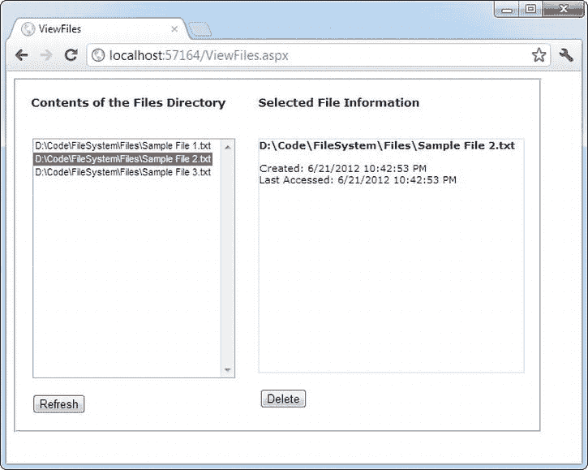
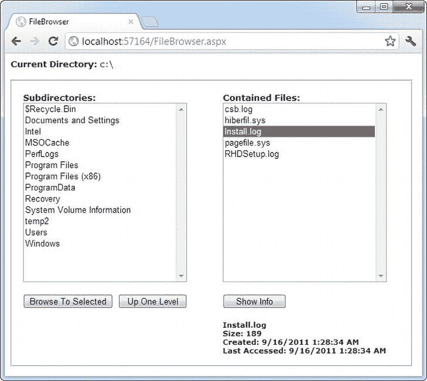
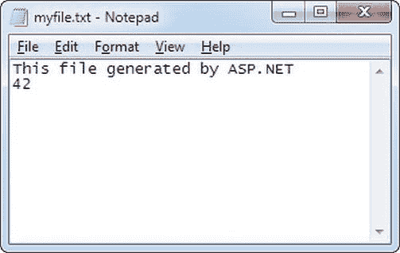
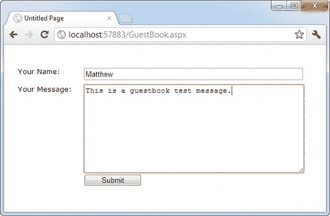
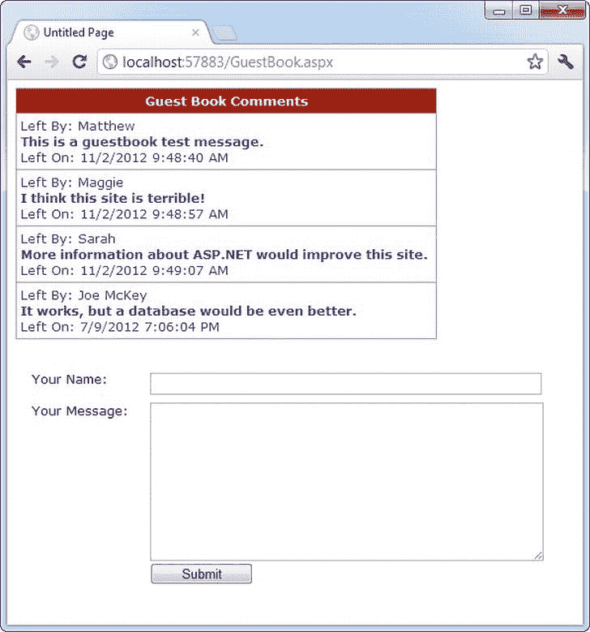
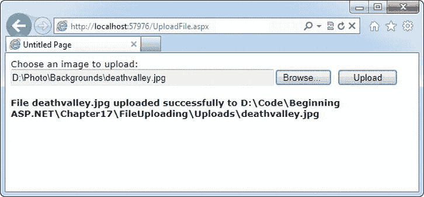

# 十七、文件和流

这本书在讨论更简单的数据访问技术(比如读写普通文件)之前先讨论了 ADO.NET，这是有充分理由的。传统的文件访问在 web 应用中通常没有在桌面程序中有用。另一方面，数据库是从头开始设计的，以快速、安全和高效地支持大量并发用户。大多数 web 应用的某些特性依赖于数据库，但是许多应用没有任何理由使用直接文件访问。

当然，有事业心的 ASP.NET 开发者几乎可以找到任何技术的用途。如果这本书没有涵盖文件访问，毫无疑问，许多开发人员在设计合法(和创新)使用普通文件的 web 应用时会感到沮丧。事实上，文件访问在。NET，它可能是不需要像 SQL Server 这样成熟的数据库产品的简单、小规模解决方案的完美选择。

本章解释了如何使用中的类。NET 来读取和更改文件系统信息，甚至构建一个简单的文件浏览器。您还将学习如何创建自己的简单文本和二进制文件。最后，您将考虑如何允许用户将他们自己的文件上传到您的 web 服务器。

文件和网络应用

为什么大部分 web 应用都不用文件？文件有几个限制:

*   *文件命名限制* : 当你创建一个新文件时，它显然不能与同一目录中已经存在的文件同名。这意味着您可能需要依靠某个系统来随机生成文件名。例如，您可以基于与当前日期和时间相结合的随机数来创建文件名，或者创建包含全局唯一标识符(GUID)的文件名。使用这两种方法，文件名在统计上是唯一的，这意味着重复的可能性微乎其微。然而，文件名没有什么意义。在数据库中，自动增量数据类型可以更灵活地解决这个问题，当您创建记录时，它会自动用一个唯一的数字填充特定的字段。
*   *多用户限制* : 关系数据库提供了锁和事务等特性，以防止不一致，并确保多人可以同时使用相同的数据。相比之下，web 服务器的文件系统落后得可怜。尽管您可以允许多个用户同时读取一个文件，但是让多个用户同时更新同一个文件而不遇到麻烦几乎是不可能的。
*   *可伸缩性问题* : 文件操作遭受一些开销。在一个简单的场景中，文件访问可能比连接到数据库并执行查询更快。但是在大型 web 应用中的累积效果是非常不同的。当多个用户同时处理文件时，您的 web 服务器可能会显著变慢。
*   *安全风险* : 如果你允许用户指定一个文件或路径名，用户可能会设计出一种方法来欺骗你的应用访问或覆盖一个受保护的系统文件。即使没有这种能力，恶意或粗心的用户也可能使用创建或上传文件的 ASP.NET 页面来填满您的 web 服务器的硬盘并导致其停止工作。所有这些问题都是可以预防的，但是它们比数据库支持的解决方案需要更多的工作。

当然，文件访问确实有它的用处。也许您需要访问另一个应用存储在文件中的信息。或者，您可能需要将您的信息存储在一个文件中，以便其他应用可以访问它。例如，您可能正在创建一个 intranet 应用，它允许一小组受信任的员工上传和管理文档。您可以将他们的文档存储在数据库表的二进制字段中，但是如果不使用 web 前端，浏览和打开这些文件会变得更加困难。

在这种情况下，你会很高兴地知道，ASP.NET 可以使用的所有文件访问功能。NET 框架。这意味着您的 web 应用可以自由地探索文件系统、管理文件以及创建带有自定义内容的新文件。

文件系统信息

最简单的文件访问级别只包括检索现有文件和目录的信息，以及执行典型的文件系统操作，如复制文件和创建目录。

。NET 为检索这类信息提供了五个基本类。它们都位于系统中。IO 名称空间(顺便提一下，可以像在 web 应用中一样在桌面应用中使用)。它们包括以下内容:

*   目录和文件类，它们提供了静态方法，允许您检索服务器上可见的任何文件和目录的信息
*   DirectoryInfo 和 FileInfo 类，它们使用相似的实例方法和属性来检索同类信息
*   DriveInfo 类，,它提供了静态方法，允许您检索有关驱动器及其提供的可用空间量的信息

在第 3 章中，你看到了一个类如何提供两种类型的成员。静态成员总是可用的——您只需使用类名。但是实例成员只有在您拥有活动对象时才可用。

使用 file 访问类，静态方法使用起来更方便，因为它们不需要您创建类的实例。这意味着您可以使用快速的一行代码语句来执行简单的任务，例如检查文件是否存在。另一方面，如果需要从同一个文件或目录中检索几条信息，使用实例成员会更容易。这样，您不需要在每次调用方法时都指定目录或文件的名称。在这种情况下，实例方法也要快一些。这是因为 FileInfo 和 DirectoryInfo 类只在创建对象实例时执行一次安全检查。每次调用方法时，目录和文件类都会执行安全检查，这会增加更多的开销。

在这一章中，你会学到所有这些课程。但是首先，有必要绕道看看另一个可以简化处理文件系统的代码的类:Path 类。

路径类

以及上一节中概述的五个类。NET 在同一个系统中还包含一个名为 Path 的助手类。IO 命名空间。Path 类不包括任何真正的文件管理功能。它只是提供了一些静态方法，这些方法在处理包含文件和目录路径的字符串时非常有用。

例如，Path 类包含一个 GetFileName()方法，该方法从完整的字符串中提取文件名。这里有一个例子:

```cs
string file = Path.GetFileName(
 @"c:\Documents\Upload\Users\JamesX\resume.doc");
// file now contains "resume.doc"
```

字符串形式的文件路径

在 C#中，创建保存文件路径或目录路径的字符串时需要特别小心。这是因为在 C#中，目录分隔字符(\)还有另一种含义，它表示特殊字符序列的开始。为了表明你真的想要一个反斜杠而不是一个特殊的字符序列，你需要两个斜杠，如下所示:

```cs
string myDirectory  = "c:\\Temp\\MyFiles";
```

另一种选择是在字符串前面加上“at”符号(@)。这告诉 C#完全按照编写的内容来解释字符串。以下是该语法的一个示例:

```cs
string myDirectory = @"c:\Temp\MyFiles";
```

您使用的方法完全由您决定，尽管@语法更容易读取长路径(也更容易避免输入错误)。

Path 类还包括一个 Combine()方法,它可以在绝对路径的末尾添加一个相对路径。它在工作，融合两根弦:

```cs
string absolutePath = @"c:\Users\MyDocuments";
string subPath = @"Sarah\worksheet.xls";
string combined = Path.Combine(absolutePath, subPath);
// combined now contains "c:\Users\MyDocuments\Sarah\worksheet.xls"
```

您可以自己执行所有这些任务，但是 Path 类是避免错误的好方法。表 17-1 列出了路径类的方法。

[表 17-1](#_Tab1) 。路径方法

| 方法 | 描述 |
| --- | --- |
| 结合 | 将路径与文件名或子目录相结合。 |
| ChangeExtension() | 返回一个修改了扩展名的字符串副本。如果不指定扩展名，当前扩展名将被删除。 |
| GetDirectoryName() | 返回所有目录信息，即第一个和最后一个目录分隔符(\)之间的文本。 |
| GetFileName() | 仅返回路径的文件名部分，即最后一个目录分隔符之后的部分。 |
| getfilenamewithoutxtendex() | 仅返回路径的文件名部分，但省略末尾的文件扩展名。 |
| GetFullPath() | 使用当前目录将相对路径更改为绝对路径。例如，如果 c:\Temp\是当前目录，则对 test.txt 等文件名调用 GetFullPath()会返回 c:\Temp\test.txt。此方法对绝对路径没有影响。 |
| GetPathRoot() | 检索带有根驱动器的字符串(例如，“c:\”)，前提是信息在字符串中。对于相对路径，它返回一个空引用。 |
| HasExtension() | 如果路径以扩展名结尾，则返回 true。 |
| IsPathRooted() | 如果路径是绝对路径，则返回 true，如果是相对路径，则返回 false。 |

目录和文件类

目录和文件类提供了许多有用的静态方法。表 17-2 和[表 17-3](#Tab3) 显示了最重要方法的概述。这些方法中的大多数都采用相同的参数:一个完全限定的路径名，标识您希望操作作用的目录或文件。一些方法，如 Delete()和 Move()，需要额外的参数。

[表 17-2](#_Tab2) 。目录类成员

| 方法 | 描述 |
| --- | --- |
| 创建目录() | 创建新目录。如果你在另一个不存在的目录中指定一个目录，ASP.NET 会仔细地创建所有需要的目录。 |
| 删除() | 删除相应的空目录。要删除一个目录及其内容(子目录和文件)，请添加可选的第二个参数 true。 |
| 存在() | 返回 true 或 false 以指示指定的目录是否存在。 |
| GetCreationTime()、GetLastAccessTime()和 GetLastWriteTime() | 返回一个 DateTime 对象，该对象表示创建、访问或写入目录的时间。每个 Get *Xxx* ()方法都有一个对应的 Set *Xxx* ()方法，这个表中没有显示。 |
| GetDirectories()和 GetFiles() | 返回一个字符串数组，指定目录中的每个子目录或文件(取决于您使用的方法)一个字符串数组。这些方法可以接受指定搜索表达式的第二个参数(例如 ASP*。*). |
| GetLogicalDrives() | 返回一个字符串数组，每个字符串对应当前计算机上的一个驱动器。驱动器号采用以下格式:“c:\”。 |
| getparent() | 解析提供的目录字符串并告诉你父目录是什么。您可以通过搜索\字符(或者更一般地说，路径)自己完成这项工作。DirectorySeparatorChar)，但是这个函数让生活稍微轻松了一些。 |
| GetCurrentDirectory()和 SetCurrentDirectory() | 允许您设置或检索当前目录，这在您需要使用相对路径而不是完整路径时非常有用。通常，这些函数不是必需的。 |
| 移动() | 接受两个参数:源路径和目标路径。该目录及其所有内容可以移动到任何路径，只要它位于同一个驱动器上。(如果您需要将文件从一个驱动器移动到另一个驱动器，您需要将复制操作和删除操作配对。) |

[表 17-3](#_Tab3) 。文件类成员

| 方法 | 描述 |
| --- | --- |
| 复制() | 接受两个参数:完全限定的源文件名和完全限定的目标文件名。要允许覆盖，请使用接受第三个布尔参数并将其设置为 true 的版本。 |
| 删除() | 删除指定的文件，但如果找不到该文件，不会引发异常。 |
| 存在() | 指示关于指定文件是否存在的 true 或 false。 |
| GetAttributes()和 SetAttributes() | 检索或设置一个枚举值，该值可以包括 FileAttributes 枚举值的任意组合。 |
| GetCreationTime()、GetLastAccessTime()和 GetLastWriteTime() | 返回一个 DateTime 对象，该对象表示文件的创建、访问或上次写入时间。每个 Get *Xxx* ()方法都有一个对应的 Set *Xxx* ()方法，这个表中没有显示。 |
| 移动() | 接受两个参数:完全限定的源文件名和完全限定的目标文件名。您可以跨驱动器移动文件，甚至可以在移动时重命名文件(或在不移动的情况下重命名文件)。 |

File 类还包括一些方法，允许您创建和打开流形式的文件。你将在本章的“用流读写”一节中探索这些特性。File 类唯一缺少的特性(FileInfo 类提供的特性)是检索指定文件大小的能力。

文件和目录方法非常直观。例如，考虑显示特定目录中文件的一些信息的简单页面的代码。您可以使用这段代码创建一个简单的管理页面，允许您查看 web 服务器上存储文件的目录的内容(见[图 17-1](#Fig1) )。客户可以使用该页面查看上传的文档并删除不需要的文件。以下示例使用在 web 应用目录中创建的名为 Files 的文件夹来测试此内容。



[图 17-1](#_Fig1) 。包含文件信息的管理页面

您应该从导入包含 IO 类的名称空间开始:

```cs
using System.IO;
```

该页面的代码如下:

```cs
public partial class ViewFiles : System.Web.UI.Page
{
    private string filesDirectory;
```

```cs
    protected void Page_Load(Object sender, EventArgs e)
    {
        filesDirectory = Path.Combine(Request.PhysicalApplicationPath, "Files");
        if (!this.IsPostBack)
        {
            CreateFileList();
        }
    }
```

```cs
    private void CreateFileList()
    {
        // Retrieve the list of files, and display it in the page.
        // This code also disables the delete button, ensuring the
        // user must view the file information before deleting it.
        string[] fileList = Directory.GetFiles(filesDirectory);
        lstFiles.DataSource = fileList;
        lstFiles.DataBind();
        lblFileInfo.Text = "";
        cmdDelete.Enabled = false;
    }
```

```cs
    protected void cmdRefresh_Click(Object sender, EventArgs e)
    {
        CreateFileList();
    }
```

```cs
    protected void lstFiles_SelectedIndexChanged(Object sender,
     EventArgs e)
    {
        // Display the selected file information.
        // Use the StringBuilder for the fastest way to build the string.
        string fileName = lstFiles.SelectedItem.Text;
        System.Text.StringBuilder displayText = new System.Text.StringBuilder();
        displayText.Append("<b>");
        displayText.Append(fileName);
        displayText.Append("</b><br /><br />");
        displayText.Append("Created: ");
        displayText.Append(File.GetCreationTime(fileName).ToString());
        displayText.Append("<br />Last Accessed: ");
        displayText.Append(File.GetLastAccessTime(fileName).ToString());
        displayText.Append("<br />");
```

```cs
        // Show attribute information. GetAttributes() can return a combination
        // of enumerated values, so you need to evaluate it with the
        // bitwise and (&) operator.
        FileAttributes attributes = File.GetAttributes(fileName);
        if ((attributes & FileAttributes.Hidden) == FileAttributes.Hidden)
        {
            displayText.Append("This is a hidden file.<br />");
        }
        if ((attributes & FileAttributes.ReadOnly) == FileAttributes.ReadOnly)
        {
            displayText.Append("This is a read-only file.<br />");
            cmdDelete.Enabled = false;
        }
        else
        {
            cmdDelete.Enabled = true;
        }
```

```cs
        // Show the generated text in a label.
        lblFileInfo.Text = displayText.ToString();
    }
```

```cs
    protected void cmdDelete_Click(Object sender, EventArgs e)
    {
        File.Delete(lstFiles.SelectedItem.Text);
        CreateFileList();
    }
}
```

剖析代码。。。

*   每次页面加载时，它都会设置 filesDirectory 字符串。该路径被设置为当前 web 应用目录(由请求提供)中的 Files 子文件夹。PhysicalApplicationPath 属性)。这两个细节(当前 web 应用目录和 Files 子文件夹)使用 path 类的 Combine()方法合并成一个路径字符串。
*   CreateFileList()过程很容易编写，因为它使用了 ListBox 的数据绑定功能。从 GetFiles()方法返回的数组可以放在列表中，只需要几行代码。
*   ListBox 的 AutoPostBack 属性设置为 true。这样，当用户选择列表中的一项时，ListBox 会立即回发页面，以便代码可以读取文件信息并刷新页面上的文件详细信息。
*   在评估 FileAttributes 枚举时，需要使用&运算符来执行*逐位算术*。这是因为从 GetAttributes()返回的值实际上可以包含多个属性的组合。使用按位算术，您可以提取出您感兴趣的属性，然后确定它是否已设置。
*   获取文件信息的代码构建了一长串文本，然后显示在一个标签中。为了获得最佳性能，此代码使用系统。StringBuilder 类。如果没有 StringBuilder，您需要使用字符串连接将字符串连接在一起。这要慢得多，因为每次代码向字符串中添加一段文本时。NET 在幕后创建了一个全新的字符串对象。
*   显示文件信息的代码可以通过切换到 FileInfo 类而受益(如下一节所示)。事实上，每个方法都需要指定相同的文件名。这有点繁琐，也有点慢，因为每种方法都需要单独的安全检查。

这段代码缺少的一个要素是错误处理。当使用任何外部资源(包括文件)时，使用 try/catch 块保护自己是非常重要的。这样，您可以处理超出您控制范围的不可预测的事件，例如，如果文件因为已经在另一个程序中打开而无法访问，或者运行代码的帐户没有所需的权限。本例中的代码很容易纠正——只需将所有文件操作打包到一个 try/catch 块中。(您需要三个——一个用于读取当前目录中文件的代码，一个用于从所选文件中检索信息的代码，一个用于删除文件的代码。)要查看添加了错误处理逻辑的代码，请参考本章的可下载示例。

文件权限

当您在 Visual Studio 中测试应用时，您不太可能遇到文件权限错误。然而，当您部署应用时，生活变得更加复杂。在一个已部署的网站中，ASP.NET 运行在一个权限非常有限的帐户下。尽管确切的帐户取决于 IIS 的版本(参见[第 26 章](26.html)了解全部细节)，但它几乎总是 IIS_IUSRS 组的成员。

如果您试图使用没有所需权限的帐户访问文件，将会收到 SecurityException。要解决这样的问题，您可以修改文件或整个目录的权限。为此，右键单击文件或目录，选择属性，然后选择安全选项卡。在这里，您可以添加或删除用户和组，并配置允许他们执行的操作。或者，您可能会发现修改 ASP.NET 使用的帐户或更改其群组成员更容易。更多信息，请参考第 26 章。

DirectoryInfo 和 FileInfo 类

DirectoryInfo 和 FileInfo 类反映了 Directory 和 File 类中的功能。此外，它们使遍历目录和文件关系变得容易。例如，您可以轻松地检索由 DirectoryInfo 对象表示的目录中的文件的 FileInfo 对象。

请注意，虽然 Directory 和 File 类只公开方法，但 DirectoryInfo 和 FileInfo 提供了属性和方法的组合。例如，虽然 File 类有单独的 GetAttributes()和 SetAttributes()方法，但 FileInfo 类包括 Attributes 属性。

DirectoryInfo 和 FileInfo 类的另一个优点是，它们共享一组公共的属性和方法，因为它们是从公共的 FileSystemInfo 基类派生的。表 17-4 描述了它们共有的成员。

[表 17-4](#_Tab4) 。DirectoryInfo 和 FileInfo 成员

| 成员 | 描述 |
| --- | --- |
| 属性 | 允许您使用 FileAttributes 枚举中的值组合来检索或设置属性。 |
| CreationTime、LastAccessTime 和 LastWriteTime | 允许您使用 DateTime 对象设置或检索创建时间、上次访问时间和上次写入时间。 |
| 存在 | 根据文件或目录是否存在，返回 true 或 false。换句话说，您可以创建实际上不对应于当前物理目录的 FileInfo 和 DirectoryInfo 对象，尽管您显然不能使用 CreationTime 等属性和 MoveTo()等方法。 |
| 全名、名称和扩展名 | 返回一个 string 类型的值，该值代表完全限定名、目录或文件名(带扩展名)或扩展名本身，具体取决于您使用的属性。 |
| 删除() | 删除文件或目录(如果存在)。删除目录时，它必须为空，或者您必须将可选参数设置为 true。 |
| 刷新() | 更新对象，使其与同时发生的任何文件系统更改保持同步(例如，如果使用 Windows 资源管理器手动更改了属性)。 |
| 创建() | 创建指定的目录或文件。 |
| 已移动() | 复制目录及其内容或文件。对于 DirectoryInfo 对象，需要指定新路径；对于 FileInfo 对象，需要指定路径和文件名。 |

此外，FileInfo 和 DirectoryInfo 类有一些唯一的成员，如[表 17-5](#Tab5) 和[表 17-6](#Tab6) 所示。

[表 17-5。](#_Tab5)唯一董事信息成员

| 成员 | 描述 |
| --- | --- |
| 父和根 | 返回代表父目录或根目录的 DirectoryInfo 对象。对于 c:\temp\myfiles 这样的目录，父目录是 c:\temp，根目录是 c:\。 |
| 创建子目录() | 在 DirectoryInfo 对象表示的目录中创建具有指定名称的目录。它还返回一个表示子目录的新 DirectoryInfo 对象。 |
| GetDirectories() | 返回 DirectoryInfo 对象的数组，这些对象表示此目录中包含的所有子目录。 |
| GetFiles() | 返回一个 FileInfo 对象数组，这些对象代表这个目录中包含的所有文件。 |

[表 17-6](#_Tab6) 。唯一 FileInfo 成员

| 成员 | 描述 |
| --- | --- |
| 目录 | 返回代表父目录的 DirectoryInfo 对象。 |
| 目录名 | 返回标识父目录名称的字符串。 |
| 长度 | 返回一个长整型值(64 位整数),文件大小以字节为单位。 |
| CopyTo() | 将文件复制到参数指定的新路径和文件名。它还返回一个新的 FileInfo 对象，表示新的(复制的)文件。您可以提供一个可选的附加参数 true 来允许覆盖。 |

创建 DirectoryInfo 或 FileInfo 对象时，在构造函数中指定完整路径:

```cs
DirectoryInfo myDirectory = new DirectoryInfo(@"c:\Temp");
FileInfo myFile = new FileInfo(@"c:\Temp\readme.txt");
```

该路径可能对应于也可能不对应于真实的物理文件或目录。如果没有，您可以使用 Create()方法创建相应的文件或目录:

```cs
// Define the new directory and file.
DirectoryInfo myDirectory = new DirectoryInfo(@"c:\Temp\Test");
FileInfo myFile = new FileInfo(@"c:\Temp\Test\readme.txt");
```

```cs
// Now create them. Order here is important.
// You can't create a file in a directory that doesn't exist yet.
myDirectory.Create();
myFile.Create();
```

DriveInfo 类

DriveInfo 类允许您检索计算机上某个驱动器的信息。只有几条信息会让你感兴趣。通常，DriveInfo 类仅用于检索已用空间和可用空间的总量。

[表 17-7](#Tab7) 显示了驱动信息成员。与 FileInfo 和 DriveInfo 类不同，没有包含这些方法的实例版本的 Drive 类。

[表 17-7](#_Tab7) 。DriveInfo 成员

| 成员 | 描述 |
| --- | --- |
| TotalSize(总大小) | 获取驱动器的总大小，以字节为单位。这包括已分配空间和可用空间。 |
| 总可用空间 | 获取可用空间的总量，以字节为单位。 |
| 可用自由空间 | 获取可用空间的总量，以字节为单位。如果您应用了磁盘配额来限制 ASP.NET 进程可以使用的空间，可用空间可能会小于总可用空间。 |
| 驱动格式 | 以字符串形式返回驱动器上使用的文件系统的名称(如 NTFS 或 FAT32)。 |
| 驱动类型 | 从 DriveType 枚举返回一个值，该值指示驱动器是固定驱动器、网络驱动器、CDRom 驱动器、Ram 驱动器还是可移动驱动器(如果无法确定驱动器的类型，则为 Unknown)。 |
| 否可以使用 | 返回驱动器是否准备好进行读写操作。如果可移动驱动器没有任何介质，则被视为“未就绪”。例如，如果 CD 驱动器中没有 CD，IsReady 将返回 false。在这种情况下，查询其他 DriveInfo 属性是不安全的。固定驱动器总是可读的。 |
| 名字 | 返回驱动器的驱动器号名称(如 C:或 E:)。 |
| 卷标 | 获取或设置驱动器的描述性卷标。在 NTFS 格式的驱动器中，卷标最多可包含 32 个字符。如果未设置，此属性将返回一个空引用(Nothing)。 |
| 根目录 | 返回该驱动器中根目录的 DirectoryInfo 对象。 |
| GetDrives（） | 检索表示当前计算机上所有逻辑驱动器的 DriveInfo 对象数组。 |

 **提示**试图从未准备好的驱动器(例如，其中没有 CD 的 CD 驱动器)中读取将会抛出异常。要避免此问题，请检查 DriveInfo。IsReady 属性，并且仅当它返回 true 时才尝试读取其他属性。

一个示例文件浏览器

可以使用 DirectoryInfo 之类的方法。GetFiles()和 DirectoryInfo。GetDirectories()创建一个简单的文件浏览器。以下示例向您展示了如何操作。请注意，尽管这段代码是如何使用 DirectoryInfo 和 FileInfo 类的一个很好的例子，但它不是一个很好的安全性例子。一般来说，你不希望用户能够在你的 web 服务器上找到这么多关于文件的信息。

样本文件浏览器程序允许用户查看当前驱动器中任何目录下任何文件的信息，如图[图 17-2](#Fig2) 所示。



[图 17-2](#_Fig2) 。web 服务器文件浏览器

文件浏览器页面的代码如下:

```cs
public partial class FileBrowser : System.Web.UI.Page
{
    protected void Page_Load(object sender, EventArgs e)
    {
        if (!this.IsPostBack)
        {
            string startingDir = @"c:\";
            lblCurrentDir.Text = startingDir;
            ShowFilesIn(startingDir);
            ShowDirectoriesIn(startingDir);
        }
    }
```

```cs
    private void ShowFilesIn(string dir)
    {
        lblFileInfo.Text = "";
        lstFiles.Items.Clear();
        try
        {
            DirectoryInfo dirInfo = new DirectoryInfo(dir);
            foreach (FileInfo fileItem in dirInfo.GetFiles())
            {
                lstFiles.Items.Add(fileItem.Name);
            }
        }
        catch (Exception err)
        {
            // Ignore the error and leave the list box empty.
        }
    }
```

```cs
    private void ShowDirectoriesIn(string dir)
    {
        lstDirs.Items.Clear();
        try
        {
            DirectoryInfo dirInfo = new DirectoryInfo(dir);
            foreach (DirectoryInfo dirItem in dirInfo.GetDirectories())
            {
                lstDirs.Items.Add(dirItem.Name);
            }
        }
        catch (Exception err)
        {
            // Ignore the error and leave the list box empty.
        }
    }
```

```cs
    protected void cmdBrowse_Click(Object sender, EventArgs e)
    {
        // Browse to the currently selected subdirectory.
        if (lstDirs.SelectedIndex != -1)
        {
            string newDir = Path.Combine(lblCurrentDir.Text,
             lstDirs.SelectedItem.Text);
            lblCurrentDir.Text = newDir;
            ShowFilesIn(newDir);
            ShowDirectoriesIn(newDir);
        }
    }
```

```cs
    protected void cmdParent_Click(object sender, EventArgs e)
    {
        // Browse up to the current directory's parent.
        // The Directory.GetParent() method helps us out.
        if (Directory.GetParent(lblCurrentDir.Text) == null)
        {
            // This is the root directory; there are no more levels.
        }
        else
        {
            string newDir = Directory.GetParent(lblCurrentDir.Text).FullName;
            lblCurrentDir.Text = newDir;
            ShowFilesIn(newDir);
            ShowDirectoriesIn(newDir);
        }
    }
```

```cs
    protected void cmdShowInfo_Click(object sender, EventArgs e)
    {
        // Show information for the currently selected file.
        if (lstFiles.SelectedIndex != -1)
        {
            string fileName = Path.Combine(lblCurrentDir.Text,
             lstFiles.SelectedItem.Text);
```

```cs
            StringBuilder displayText = new StringBuilder();
            try
            {
                FileInfo selectedFile = new FileInfo(fileName);
                displayText.Append("<b>");
                displayText.Append(selectedFile.Name);
                displayText.Append("</b><br />Size: ");
                displayText.Append(selectedFile.Length);
                displayText.Append("<br />");
                displayText.Append("Created: ");
                displayText.Append(selectedFile.CreationTime.ToString());
                displayText.Append("<br />Last Accessed: ");
                displayText.Append(selectedFile.LastAccessTime.ToString());
            }
            catch (Exception err)
            {
                displayText.Append(err.Message);
            }
```

```cs
            lblFileInfo.Text = displayText.ToString();
        }
    }
}
```

剖析代码。。。

*   本例中的列表控件不会立即回发。相反，网页依赖于“浏览到选定项”、“上一级”和“显示信息”按钮。
*   默认情况下，目录名不以反斜杠(\)字符结尾(例如，使用 c:\Temp 而不是 c:\Temp\)。但是，当提到根驱动器时，需要一个斜杠。这是因为一个有趣的不一致，可以追溯到 DOS 时代。使用目录名时，c:\指的是根驱动器，但 c:指的是当前目录，不管它是什么。当您操作包含文件名的字符串时，这种怪癖可能会导致问题，因为您不想在路径中添加额外的尾随斜杠(例如无效路径 c:\\myfile.txt)。为了解决这个问题，页面使用了 Path 类的 Combine()方法。该方法正确地将任何文件和路径名连接在一起，需要时添加\
*   该代码包括所有必要的错误处理代码。如果您试图读取您无权检查的文件的信息，将显示错误消息，而不是文件详细信息部分。如果调用 DirectoryInfo 时出错。GetFiles()或 DirectoryInfo。GetDirectories()，错误被忽略，文件或子目录不显示。如果运行您的代码的帐户无权读取该目录的内容，就会发生此错误。例如，如果您尝试访问 Windows 中的 c:\System 卷信息目录，并且您不是管理员，就会出现这种情况。
*   ShowFilesIn()和 ShowDirectoriesIn()方法遍历文件和目录集合来构建列表。另一种方法是使用数据绑定，如下面的代码示例所示:

    ```cs
    // Another way to fill lstFiles.
    DirectoryInfo dirInfo = new DirectoryInfo(dir);
    ```

    ```cs
    lstFiles.DataSource = dirInfo.GetFiles();
    lstFiles.DataMember = "Name";
    lstFiles.DataBind();
    ```

*   请记住，当您绑定一个对象集合时，您需要指定哪个属性将用于列表。在这种情况下，它是 DirectoryInfo。名称或文件信息。名称属性。

用流读写

那个。NET Framework 使得以文本或二进制格式创建简单的“平面”文件变得很容易。与数据库不同，这些文件没有任何内部结构(这就是它们被称为平面文件的原因)。相反，这些文件实际上只是您想要存储的任何信息的列表。

文本文件

您可以使用 StreamWriter 和 StreamReader(抽象出文件交互过程的专用类)写入文件和读取文件。真的没什么大不了的。您可以自己创建 StreamWriter 和 StreamReader 类，也可以使用 File 类中包含的一个有用的静态方法，如 CreateText()或 OpenText()。

下面是一个示例，它获取一个 StreamWriter，用于将数据写入文件 c:\Temp\myfile.txt:

```cs
// Define a StreamWriter (which is designed for writing text files).
StreamWriter w;
```

```cs
// Create the file, and get a StreamWriter for it.
w = File.CreateText(@"c:\Temp\myfile.txt");
```

当您调用 CreateText()方法时，您创建文件并接收 StreamWriter 对象。此时，文件已经打开，可以接收内容了。您需要将数据写入文件，然后尽快关闭它。

使用 StreamWriter，可以调用 WriteLine()方法向文件中添加信息。WriteLine()方法被重载，因此它可以编写许多简单的数据类型，包括字符串、整数和其他数字。这些值在写入文件时基本上都被转换为字符串，并且在读取文件时必须手动转换回适当的类型。

```cs
w.WriteLine("This file generated by ASP.NET"); // Write a string.
w.WriteLine(42);                                // Write a number.
```

当您处理完该文件时，您必须确保通过调用 close()或 Dispose()方法来关闭它。否则，更改可能无法正确写入磁盘，并且文件可能被锁定打开。

```cs
w.Close();
```

最后，当您调试一个写入文件的应用时，使用记事本之类的文本编辑器查看您所写的内容总是一个好主意。[图 17-3](#Fig3) 显示了用你考虑过的简单代码在 c:\myfile.txt 中创建的内容。



[图 17-3](#_Fig3) 。示例文本文件

要读取信息，可以使用相应的 StreamReader 类。它提供了一个 ReadLine()方法，该方法获取下一个可用值并将其作为字符串返回。ReadLine()从第一行开始，将位置推进到文件的末尾，一次一行。

```cs
StreamReader r = File.OpenText(@"c:\myfile.txt");
string inputString;
inputString = r.ReadLine();    // = "This file generated by ASP.NET"
inputString = r.ReadLine();    // = "42"
```

当文件中没有更多的数据时，ReadLine()返回一个空引用。这意味着您可以使用如下代码读取文件中的所有数据:

```cs
// Read and display the lines from the file until the end
// of the file is reached.
string line;
do
{
    line = r.ReadLine();
    if (line != null)
    {
        // (Process the line here.)
    }
} while (line != null);
```

与写入文件时一样，完成后必须关闭文件:

```cs
r.Close();
```

到目前为止，您看到的代码以单用户模式打开一个文件。如果第二个用户试图同时访问同一个文件，将会发生异常。使用更通用的四参数版本的文件打开文件时，可以减少这个问题。Open()方法而不是 File。OpenText()。您必须指定文件共享。读取最后一个参数。与 OpenText()方法不同，Open()方法返回 FileStream 对象，您必须手动创建包装它的 StreamReader。

下面是创建多用户友好的 StreamReader 所需的代码:

```cs
FileStream fs = File.Open(@"c:\myfile.txt", FileMode.Open, FileAccess.Read,
 FileShare.Read);
StreamReader r = new StreamReader(fs);
```

 **提示**在[第八章](08.html)中，您看到了如何为当前用户创建一个 cookie，它可以作为一个简单的文本文件存储在计算机上。这是一种在 web 应用中存储信息的常用技术，但是它与你在本章中看到的文件访问代码有很大的不同。Cookies 是在客户端而不是服务器端创建的。这意味着您的 ASP.NET 代码可能能够在来自同一用户的后续请求中使用它们，但当存储您需要稍后查看的信息、更永久的信息或影响多个用户的信息时，它们就不合适了。

二进制文件

您还可以读写二进制文件。二进制数据能更有效地利用空间，但也会产生人类不可读的文件。如果你在记事本中打开一个文件，你会看到很多扩展的 ASCII 字符(礼貌地称为*乱码* )。

要打开文件进行二进制写入，需要创建一个新的 BinaryWriter 对象。构造函数接受一个流，您可以使用文件检索该流。OpenWrite()方法。下面是打开文件 c:\binaryfile.bin 进行二进制写入的代码:

```cs
FileStream fs = File.OpenWrite(@"c:\binaryfile.bin");
BinaryWriter w = new BinaryWriter(fs);
```

。NET 专注于流对象，而不是数据源或目的地。这意味着您可以使用相同的代码将二进制数据写入任何类型的流，无论它表示文件还是其他类型的存储位置。此外，写入二进制文件几乎与写入文本文件一样。

```cs
string str = "ASP.NET Binary File Test";
int integer = 42;
w.Write(str);
w.Write(integer);
w.Close();
```

从二进制文件中读取数据很容易，但不像从文本文件中读取数据那么容易。问题是您需要知道您想要检索的数据的类型。要检索一个字符串，可以使用 ReadString()方法。要检索一个整数，必须使用 ReadInt32()。这就是前面的代码示例编写变量而不是文本值的原因。如果值 42 被硬编码为 Write()方法的参数，则不清楚该值是写成 16 位整数、32 位整数、十进制还是其他形式。不幸的是，您可能需要以这种方式微观管理二进制文件以防止错误。

```cs
BinaryReader r = new BinaryReader(File.OpenRead(@"c:\binaryfile.bin"));
string str;
int integer;
str = r.ReadString();
integer = r.ReadInt32();
```

```cs
r.Close();
```

同样，如果你想使用文件共享，你需要使用文件。打开()而不是文件。OpenRead()。然后，您可以手动创建一个二进制阅读器，如下所示:

```cs
FileStream fs = File.Open(@"c:\binaryfile.bin", FileMode.Open,
 FileAccess.Read, FileShare.Read);
BinaryReader r = new BinaryReader(fs);
```

 **注意**如果不按顺序通读所有信息，你就没有办法跳到文本或二进制文件中的某个位置。尽管您可以在基础流上使用 Seek()之类的方法，但是您需要指定一个以字节为单位的偏移量，这涉及到一些基于数据类型大小的相当复杂的计算。如果您需要存储大量信息并快速浏览，您需要一个专用数据库，而不是二进制文件。

读写文件的快捷方式

。NET 包含加速文件读写的功能。此功能来自 File 类中的几个静态方法，这些方法允许您在一行代码中读取或写入整个文件。

例如，下面是一个简短的代码片段，它编写了一个三行文件，然后将其检索为一个字符串:

```cs
string[] lines = new string[]{"This is the first line of the file.",
 "This is the second line of the file.",
 "This is the third line of the file."};
```

```cs
// Write the file in one shot.
File.WriteAllLines(@"c:\testfile.txt", lines);
```

```cs
// Read the file in one shot (into a variable named content).
string content = File.ReadAllText(@"c:\testfile.txt");
```

表 17-8 描述了一整套快速文件访问方法。所有这些都是静态方法。

[表 17-8](#_Tab8) 。快速输入/输出的文件方法

| 方法 | 描述 |
| --- | --- |
| ReadAllText() | 读取文件的全部内容，并将其作为单个字符串返回。 |
| ReadAllLines() | 读取文件的全部内容，并以字符串数组的形式返回，每行一个字符串。 |
| ReadAllBytes() | 读取整个文件，并将其内容作为字节数组返回。 |
| WriteAllText() | 创建一个文件，将提供的字符串写入该文件，然后关闭该文件。如果文件已经存在，它将被覆盖。 |
| WriteAllLines() | 创建一个文件，将提供的字符串数组写入文件(用硬回车分隔每一行)，并关闭文件。如果文件已经存在，它将被覆盖。 |
| WriteAllBytes() | 创建一个文件，将提供的字节数组写入该文件，并关闭它。如果文件已经存在，它将被覆盖。 |

快速文件访问方法对于创建小文件当然很方便。它们还确保文件只保留尽可能短的时间，这总是最小化并发问题的最佳方法。但是它们真的实用吗？这完全取决于文件的大小。如果你有一个很大的文件(比如说，几兆字节)，一次将全部内容读入内存是一个糟糕的主意。一次读取一条数据，一点一点地处理信息要好得多。即使您正在处理中等大小的文件(比如，几百千字节)，您也可能希望避开快速文件访问方法。这是因为在一个受欢迎的网站中，您可能会有多个请求同时处理文件，将每个用户的文件数据保存在内存中的总开销可能会降低应用的性能。

一本简单的留言簿

下一个示例演示了前面几节中描述的文件访问技术，以创建一个简单的留言簿。该页面实际上有两个部分。如果没有当前的访客条目，客户端将只能看到用于添加新条目的控件，如图[图 17-4](#Fig4) 所示。



[图 17-4](#_Fig4) 。初始留言簿页面

当用户单击提交时，将为新的留言簿条目创建一个文件。只要至少有一个留言簿条目存在，页面顶部就会出现一个 GridView 控件，如图[图 17-5](#Fig5) 所示。



[图 17-5](#_Fig5) 。完整留言簿页面

表示来宾簿的 GridView 是使用数据绑定构建的，您已经在[第 15 章](15.html)和[第 16 章](16.html)中探索过了。从技术上讲，GridView 被绑定到包含 BookEntry 类实例的集合。BookEntry 类定义包含在网页的代码隐藏文件中，如下所示:

```cs
public class BookEntry
{
    private string author;
    public string Author
    {
        get { return author; }
        set { author = value; }
    }
```

```cs
    private DateTime submitted;
    public DateTime Submitted
    {
        get { return submitted; }
        set { submitted = value; }
    }
```

```cs
    private string message;
    public string Message
    {
        get { return message; }
        set { message = value; }
    }
}
```

GridView 使用单个模板列，从中找出需要显示的值。下面是它的样子(没有样式细节):

```cs
<asp:GridView ID="GuestBookList" runat="server" AutoGenerateColumns="False">
 <Columns>
     <asp:TemplateField HeaderText="Guest Book Comments">
        <ItemTemplate>
         Left By:
         <%# Eval("Author") %>
         <br />
         <b><%# Eval("Message") %></b>
         <br />
         Left On:
         <%# Eval("Submitted") %>
     </ItemTemplate>
    </asp:TemplateField>
 </Columns>
</asp:GridView>
```

它还添加了一些这里没有包括的样式信息(因为理解程序的逻辑没有必要)。事实上，这些样式是在 Visual Studio 中使用 GridView 的自动格式功能应用的。

至于条目，留言簿页面使用子文件夹(App_Data\GuestBook)来存储文件集合。每个文件都代表了来宾簿中的一个单独的条目。通过将留言簿文件夹放在 App_Data 文件夹中，web 应用确保用户不能直接访问任何留言簿文件，因为 web 服务器不允许这样做。然而，更好的方法通常是在数据库中创建一个留言簿表，并使每个条目成为一个单独的记录。

网页的代码如下:

```cs
public partial class GuestBook : System.Web.UI.Page
{
    private string guestBookName;
```

```cs
    protected void Page_Load(Object sender, EventArgs e)
    {
        guestBookName = Server.MapPath("∼/App_Data/GuestBook");
        if (!this.IsPostBack)
        {
            GuestBookList.DataSource = GetAllEntries();
            GuestBookList.DataBind();
        }
    }
```

```cs
    protected void cmdSubmit_Click(Object sender, EventArgs e)
    {
        // Create a new BookEntry object.
        BookEntry newEntry = new BookEntry();
        newEntry.Author = txtName.Text;
        newEntry.Submitted = DateTime.Now;
        newEntry.Message = txtMessage.Text;
```

```cs
        // Let the SaveEntry procedure create the corresponding file.
        try
        {
            SaveEntry(newEntry);
        }
        catch (Exception err)
        {
            // An error occurred. Notify the user and don't clear the
            // display.
            lblError.Text = err.Message + " File not saved.";
            return;
        }
```

```cs
        // Refresh the display.
        GuestBookList.DataSource = GetAllEntries();
        GuestBookList.DataBind();
        txtName.Text = "";
        txtMessage.Text = "";
    }
```

```cs
    private List<BookEntry> GetAllEntries()
    {
        // Return an ArrayList that contains BookEntry objects
        // for each file in the GuestBook directory.
        // This method relies on the GetEntryFromFile() method.
        List<BookEntry> entries = new List<BookEntry>();
```

```cs
        try
        {
            DirectoryInfo guestBookDir = new DirectoryInfo(guestBookName);
            foreach (FileInfo fileItem in guestBookDir.GetFiles())
            {
                try
                {
                    entries.Add(GetEntryFromFile(fileItem));
                }
                catch (Exception err)
                {
                     // An error occurred when calling GetEntryFromFile().
                    // Ignore this file because it can't be read.
                }
            }
        }
        catch (Exception err)
        {
            // An error occurred when calling GetFiles().
            // Ignore this error and leave the entries collection empty.
        }
        return entries;
    }
```

```cs
    private BookEntry GetEntryFromFile(FileInfo entryFile)
    {
        // Turn the file information into a Book Entry object.
        BookEntry newEntry = new BookEntry();
        StreamReader r = entryFile.OpenText();
        newEntry.Author = r.ReadLine();
        newEntry.Submitted = DateTime.Parse(r.ReadLine());
        newEntry.Message = r.ReadToEnd();
        r.Close();
        return newEntry;
    }
```

```cs
    private void SaveEntry(BookEntry entry)
    {
        // Create a new file for this entry, with a file name that should
        // be statistically unique.
        Random random = new Random();
        string fileName = guestBookName + @"\";
        fileName += DateTime.Now.Ticks.ToString() + random.Next(100).ToString();
        FileInfo newFile = new FileInfo(fileName);
        StreamWriter w = newFile.CreateText();
```

```cs
        // Write the information to the file.
        w.WriteLine(entry.Author);
        w.WriteLine(entry.Submitted.ToString());
        w.WriteLine(entry.Message);
        w.Close();
    }
}
```

剖析代码。。。

*   该代码使用文本文件，因此您可以使用记事本轻松地查看自己的信息。您可以轻松地使用二进制文件，这将节省少量空间。
*   每个条目的文件名是使用当前日期和时间(以刻度为单位)以及一个随机数的组合生成的。实际上，这使得不可能生成具有重复文件名的文件。
*   当读取消息文本时，代码使用 ReadToEnd()方法而不是 ReadLine()。这将获取所有剩余的文本，如果用户输入了不止一行，这一点很重要。然而，代码不保留换行符——如果你想允许，你需要一次读取一行，并在每一行之前添加一个 HTML < br >元素。
*   这个程序使用错误处理来防止可能出现的问题。但是，根据错误发生的时间，处理错误的方式会有所不同。如果在 cmdSubmit_Click()方法中保存新条目时出现错误，将向用户发出问题警告，但显示不会更新。相反，用户提供的信息保留在控件中，以便可以重试保存操作。在 cmdGetAllEntries_Click()方法中读取现有文件时，可能会出现两个问题，这两个问题通过使用单独的异常块来解决。当代码调用 GetFiles()来检索文件列表时，可能会出现问题。在这种情况下，问题会被忽略，但找不到任何文件，因此不会显示任何留言簿条目。如果这一步成功，在 GetEntryFromFile()方法中读取每个文件时仍然会出现问题。在这种情况下，导致问题的文件会被忽略，但代码会继续并尝试读取剩余的文件。

 **注意**这个例子中的错误处理代码很好地从灾难的边缘恢复过来，并允许用户在可能的情况下继续工作。然而，错误处理代码可能不足以提醒您存在问题。如果问题是反常现象，这种行为是正常的。但是如果这个问题是您的 web 应用中更深层次问题的征兆，您应该知道它。

为了确保问题不会被忽略，您可以选择在发生异常时在页面上显示一条错误消息。更好的是，您的代码可以在事件日志中悄悄地创建一个记录问题的条目(如第 7 章中所解释的)。这样，您就可以发现已经发生的问题，并在以后纠正它们。

*   精心的设计确保这个程序将文件写入和读取代码隔离在不同的函数中，如 SaveEntry()、GetAllEntries()和 GetEntryFromFile()。为了更好地组织，您可以将这些例程转移到一个单独的类中，甚至是一个单独的组件中。这将允许您使用 ObjectDataSource 来减少数据绑定代码。更多信息，请阅读第 22 章。

允许文件上传

尽管您已经看到了如何在 web 服务器上处理文件和目录的详细示例，但是您还没有考虑如何允许文件上传的问题。文件上传的问题是，您需要某种方式从客户端获取文件数据——正如您已经知道的，所有 ASP.NET 代码都在服务器上执行。

文件上传控件

幸运的是，ASP.NET 包括一个允许网站用户上传文件到网络服务器的控件。一旦 web 服务器接收到提交的文件数据，就由您的应用来检查它、忽略它或将其保存到 web 服务器上的后端数据库或文件中。FileUpload 控件完成这项工作，它代表了< input type = "file" > HTML 标签。

声明 FileUpload 控件很容易。它没有公开任何可以通过 control 标记使用的新属性或事件:

```cs
 < asp:FileUpload ID = "Uploader" runat = "server" />
```

就用户界面而言,< input type = "file" >标签并没有给你太多的选择(它仅限于一个包含文件名和浏览按钮的文本框)。当用户单击“浏览”时，浏览器会显示一个打开对话框，并允许用户选择文件。这部分是硬连线到浏览器中的，你不能改变这个行为。一旦用户选择了一个文件，文件名就被填入相应的文本框中。但是，文件还没有上传，这发生在稍后页面回发的时候。此时，来自所有输入控件的所有数据(包括文件数据)都被发送到服务器。因此，通常会添加一个按钮来回发页面。

要获得关于已发布文件内容的信息，您可以访问 FileUpload。PostedFile 对象。您可以通过调用 PostedFile 来保存内容。SaveAs()方法:

```cs
Uploader.PostedFile.SaveAs(@"c:\Uploads\newfile");
```

[图 17-6](#Fig6) 显示了一个完整的网页，演示了如何上传用户指定的文件。这个例子引入了一个变化——它只允许上传那些带有扩展名的文件。bmp，。gif 和. jpg。



[图 17-6](#_Fig6) 。简单的文件上传程序

以下是上传页面的代码:

```cs
public partial class UploadFile : System.Web.UI.Page
{
    private string uploadDirectory;
```

```cs
    protected void Page_Load(object sender, EventArgs e)
    {
        // Place files in a website subfolder named Uploads.
        uploadDirectory = Path.Combine(
         Request.PhysicalApplicationPath, "Uploads");
    }
```

```cs
    protected void cmdUpload_Click(object sender, EventArgs e)
    {
        // Check that a file is actually being submitted.
        if (Uploader.PostedFile.FileName == "")
        {
            lblInfo.Text = "No file specified.";
        }
        else
        {
            // Check the extension.
            string extension = Path.GetExtension(Uploader.PostedFile.FileName);
```

```cs
            switch (extension.ToLower())
            {
                case ".bmp":
                case ".gif":
                case ".jpg":
                    break;
                default:
                    lblInfo.Text = "This file type is not allowed.";
                    return;
            }
```

```cs
            // Using this code, the saved file will retain its original
            // file name when it's placed on the server.
            string serverFileName = Path.GetFileName(
             Uploader.PostedFile.FileName);
            string fullUploadPath = Path.Combine(uploadDirectory,
             serverFileName);
```

```cs
            try
            {
                Uploader.PostedFile.SaveAs(fullUploadPath);
                lblInfo.Text = "File " + serverFileName;
                lblInfo.Text += " uploaded successfully to";
                lblInfo.Text += fullUploadPath;
            }
            catch (Exception err)
            {
                lblInfo.Text = err.Message;
            }
        }
    }
}
```

剖析代码。。。

*   保存的文件保持其原始(客户端)名称。代码使用路径。GetFileName()静态方法来转换 FileUpload 提供的完全限定名。只检索文件，不包括路径。
*   文件上传。PostedFile 对象只包含几个属性。一个有趣的属性是 ContentLength，它以字节为单位返回文件的大小。您可以检查这些细节，防止用户上传过大的文件。

文件上载的最大大小

默认情况下，ASP.NET 会拒绝大于 4 MB 的请求。但是，您可以通过修改 web.config 文件中的 maxRequestLength 设置来更改此最大值。这将设置允许的最大文件，单位为千字节。web 服务器将拒绝处理更大的请求。

以下示例设置将服务器配置为接受最大 8MB 的文件:

```cs
<configuration>
<system.web>
    . . .
    <httpRuntime maxRequestLength="8192" />
 </system.web>
</configuration>
```

不过，要小心。当您允许 8MB 上传时，您的代码将不会运行，直到收到完整的请求。这意味着恶意用户可以通过向您的应用发送大量请求消息来削弱您的服务器。即使您的应用最终拒绝了这些消息，ASP.NET 工作进程线程仍然会被占用，等待请求完成。这种类型的攻击被称为*拒绝服务攻击*，你允许的请求规模越大，你的网站就越容易受到攻击。

最后一句话

尽管数据库和网站非常适合，但是没有什么可以阻止您使用。NET Framework 访问其他类型的数据，包括文件。事实上，您用来与文件系统交互的代码与您在桌面应用或任何应用中使用的代码是一样的。NET 程序。多亏了。NET Framework，您最终可以用同样的方式解决常见的编程问题，而不管您创建的是什么类型的应用。