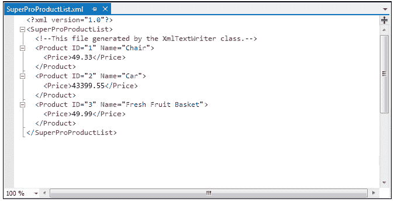
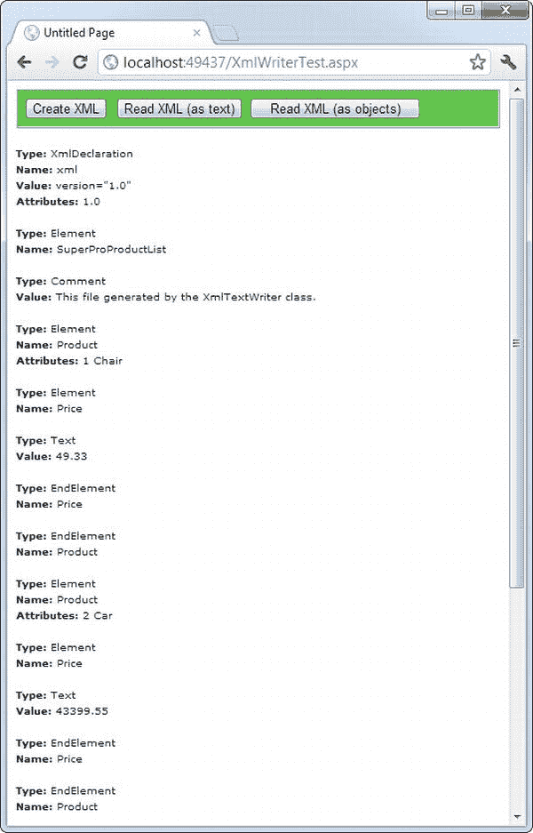
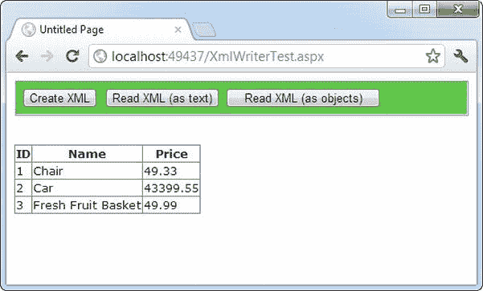
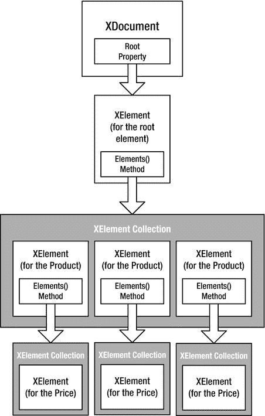
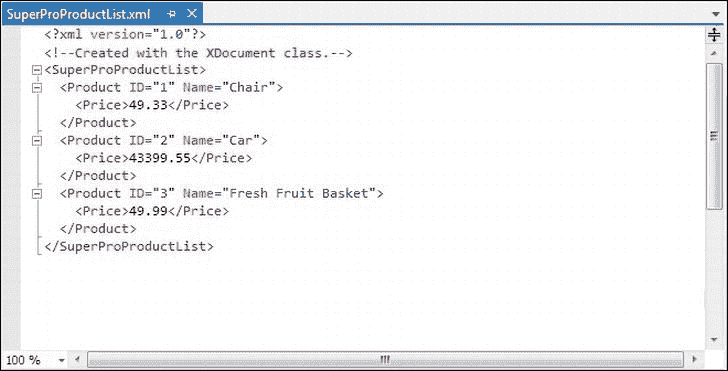
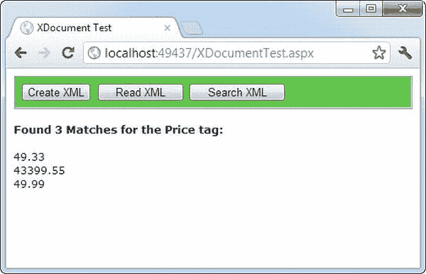
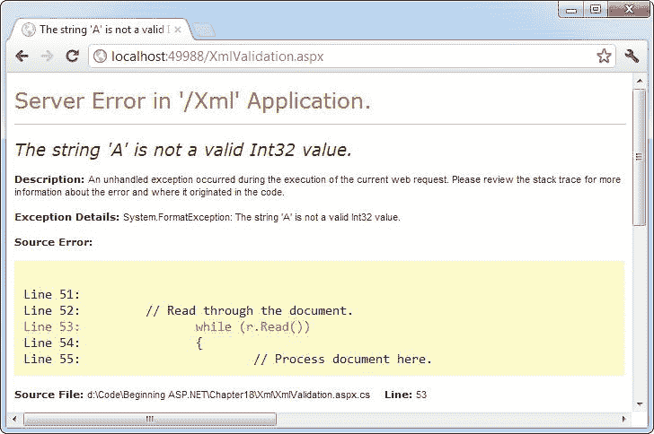
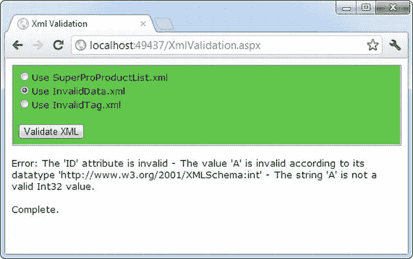
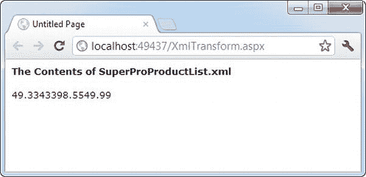
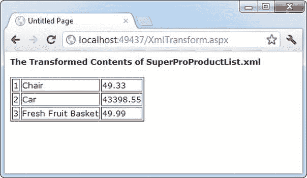

# 十八、XML

XML 被设计成一种组织数据的通用格式。在许多情况下，当您决定使用 XML 时，您决定以一种标准化的方式存储数据，而不是创建您自己的新的(对其他开发人员来说是不熟悉的)格式约定。这些数据在内存、文件或网络流中的实际位置无关紧要。

在这一章中，你将学习 XML 标准的基本规则。类来读取 XML 内容。NET 库以及如何创建和读取自己的 XML 文档。您还将学习其他一些支持和扩展 XML 基本规则的标准，包括 XML 名称空间、XML 模式和 XSLT。

XML 解释

理解 XML 所扮演角色的最佳方式是考虑一个简单文件格式*在没有* XML 的情况下的演变。例如，考虑一个简单的程序，它将产品项目作为列表存储在一个文件中。比方说，当您第一次创建这个程序时，您决定它将存储三条产品信息(ID、名称和价格)，并且您将使用简单的文本文件格式以便于调试和测试。您使用的文件格式如下所示:

```cs
1
Chair
49.33
2
Car
43399.55
3
Fresh Fruit Basket
49.99
```

这是您可以使用。NET 类来写文件(比如你在[第 17 章](17.html)中学到的 StreamWriter)。这种格式很容易使用，你只需要按照从上到下的顺序写下所有的信息。当然，这是一种相当脆弱的格式。如果您决定在文件中存储一条额外的信息(比如表示某个项目是否可用的标志)，那么您的旧代码将不起作用。相反，您可能需要添加一个文件头来指示文件的版本:

```cs
SuperProProductList
Version 2.0
1
Chair
49.33
True
2
Car
43399.55
True
3
Fresh Fruit Basket
49.99
False
```

现在，您可以在打开文件时检查文件版本，并适当地使用不同的文件读取代码。不幸的是，随着您添加越来越多的可能版本，文件读取代码将变得令人难以置信地混乱，您可能会无意中破坏与早期文件格式之一的兼容性，而没有意识到这一点。更好的方法是创建一种文件格式，指明每个产品记录的开始和结束位置。如果您的代码在旧的文件格式中发现丢失的信息，那么它将设置一些适当的默认值。

这里有一个相对粗糙的解决方案，它通过添加一个特殊的字符序列(##Start##)来显示每个新记录的开始位置，从而改进了 SuperProProductList :

```cs
SuperProProductList
Version 3.0
##Start##
1
Chair
49.33
True
##Start##
2
Car
43399.55
True
##Start##
3
Fresh Fruit Basket
49.99
False
```

总而言之，这是一个不错的努力。不幸的是，此时您还可以使用二进制文件格式——文本文件变得难以阅读，并且更难猜测每个值代表什么信息。在代码方面，您还需要一些自己的基本错误检查能力。例如，您应该使您的代码能够跳过意外输入的空行，检测丢失的##Start##标记等等，只是为了提供基本的保护。

这种本土解决方案的核心问题是，你在重新发明轮子。当您试图编写基本的文件访问代码并为一个简单的任务创建一个相当灵活的文件格式时，世界上的其他程序员正在创建他们自己的专用解决方案。即使你的程序运行得很好，你能理解，其他程序员也肯定不会觉得容易。

用 XML 改进列表

这就是 XML 的用武之地。XML 是一种使用*元素* 识别任何类型数据的通用方法。这些元素使用与 HTML 文件相同的格式，但是 HTML 元素表示格式，XML 元素表示内容。(因为 XML 文件只是关于数据的，所以没有标准化的方法在浏览器中显示它，尽管 Internet Explorer 显示了一个可折叠的视图，允许您显示和隐藏文档的不同部分。)

SuperProProductList 可以使用以下更清晰的 XML 语法:

```cs
<?xml version="1.0"?>
<SuperProProductList>
    <Product>
        <ID>1</ID>
        <Name>Chair</Name>
        <Price>49.33</Price>
        <Available>True</Available>
        <Status>3</Status>
    </Product>
    <Product>
        <ID>2</ID>
        <Name>Car</Name>
        <Price>43399.55</Price>
        <Available>True</Available>
        <Status>3</Status>
    </Product>
    <Product>
        <ID>3</ID>
        <Name>Fresh Fruit Basket</Name>
        <Price>49.99</Price>
        <Available>False</Available>
        <Status>4</Status>
    </Product>
</SuperProProductList>
```

这种格式显然是可以理解的。每个产品项目都包含在一个<product>元素中，每条信息都有自己的元素和适当的名称。元素嵌套了几层以显示关系。本质上，XML 提供了基本的元素语法，您(程序员)定义了想要使用的元素。这就是为什么 XML 经常被描述为*元语言* 的原因——它是一种你用来创造自己语言的语言。在 SuperProProductList 示例中，这个定制 XML 语言定义了诸如<产品>、< ID >、<名称>等元素。</product>

最棒的是，当您用大多数编程语言(包括。NET Framework)，您可以使用 XML 解析器来简化您的工作。换句话说，您不需要担心检测元素的开始和结束位置、折叠空白等等(尽管您确实需要担心大小写，因为 XML 是区分大小写的)。相反，您可以将文件读入一些有用的 XML 数据对象，这样可以更容易地浏览整个文档。类似地，您现在可以使用附加元素用更多信息扩展 SuperProProductList，并且您已经编写的任何代码都将顺利地继续工作。

 **注**虽然本章中的例子使用 XML 来存储数据，但 XML 更常用于传输数据——例如，让运行在不同平台上的两个应用进行通信。一个例子是 *web 服务——你可以通过互联网调用的*小代码例程。当应用向 web 服务请求一些数据时，web 服务以 XML 文档的形式发回信息。这样，任何程序都可以读取数据，不管是用什么应用框架创建的。你会在第 25 章中看到一个非常简单的 web 服务例子。

XML 文件与数据库

您可以用 XML 执行许多任务——也许包括一些它从未被设计过的事情。这本书的目的不是教你 XML 编程，而是教你优秀的 ASP.NET 应用设计。对于大多数 ASP.NET 程序员来说，XML 文件处理是定制文件访问例程的理想替代品，最适合需要为相对简单的任务存储少量数据的情况。

XML 文件不是数据库的好替代品，因为它们与任何其他类型的文件访问具有相同的限制。在 web 应用中，无论文件包含 XML 文档还是二进制内容，一次只有一个用户可以更新文件，而不会引起严重的问题。数据库产品为管理多用户并发和提供优化的性能提供了更丰富的功能。当然，没有什么能阻止您将 XML 数据存储在数据库中，这是许多数据库产品积极鼓励的。事实上，领先数据库产品的最新版本，如 SQL Server 和 Oracle，甚至包括扩展的 XML 特性，支持您将在本章中看到的一些标准。

XML 基础知识

XML 流行的部分原因是它的简单性。创建自己的 XML 文档时，您只需要记住几条规则:

*   XML 元素由一个开始标签(如<name>)和一个结束标签(如</name>)组成。内容放在开始和结束标记之间。如果你包含一个开始标签，你*必须*也包含一个相应的结束标签。唯一的另一种选择是通过创建一个空元素将两者结合起来，该元素在末尾包含一个正斜杠，并且没有内容(就像< Name / >)。这类似于 ASP.NET 控件的语法。
*   元素之间的空白被忽略。这意味着你可以自由地使用制表符和硬回车来恰当地排列你的信息。
*   在元素的内容中只能使用有效字符。不能输入特殊字符作为内容，例如尖括号(< >)和&符号(&)。相反，您必须使用实体等价物(比如用<和>表示尖括号，用&表示&符号)。当您使用适当的将这些等效字符读入您的程序时，它们将自动转换为原始字符。NET 类。
*   XML 元素是区分大小写的，所以<id>和<id>是完全不同的元素。</id></id>
*   所有元素都必须嵌套在根元素中。在 SuperProProductList 示例中，根元素是<superproproductlist>。一旦根元素被关闭，文档就完成了，您不能在它之后添加任何东西。换句话说，如果您省略了<superproproductlist>元素并以<product>元素开始，您将只能输入一个产品的信息；这是因为一旦添加了结束的</product>，文档就完成了。(HTML 有一个类似的规则，要求所有页面内容都嵌套在一个根元素中，但是大多数浏览器没有遵循这个规则。)</superproproductlist></superproproductlist>
*   每个元素都必须完全封闭。换句话说，当您打开一个子元素时，您需要在关闭父元素之前关闭它。有效，但无效。一般来说，当你打开一个新的元素时要缩进，因为这样可以让你看到文档的结构，并注意到你是否意外地先关闭了错误的元素。
*   XML 文档通常以类似于的 XML 声明开始。这表明文档包含 XML 并指示任何特殊的文本编码。然而，即使省略了这个细节，许多 XML 解析器也能很好地工作。

只要满足这些要求，XML 文档就可以被解析并显示为基本树。这意味着您的文档是格式良好的，但并不意味着它是有效的。例如，您可能仍然有顺序错误的元素(例如，)，或者您可能在给定字段中有错误类型的数据(例如，<id>椅子</id> <name>2</name>

元素是在 XML 中组织信息的基本单位(如 SuperProProductList 示例所示)，但它们不是唯一的选择。也可以使用*属性*。

属性

属性向元素添加额外的信息。您可以使用属性，而不是将信息放入子元素中。在 XML 社区中，决定是使用子元素还是属性——以及属性中应该包含什么信息——是一个争论很大的问题，没有明确的共识。

下面是使用 ID 和 Name 属性而不是 ID 和 Name 子元素的 SuperProProductList 示例:

```cs
<?xml version="1.0"?>
<SuperProProductList>
    <Product ID="1" Name="Chair">
        <Price>49.33</Price>
        <Available>True</Available>
        <Status>3</Status>
    </Product>
    <Product ID="2" Name="Car">
        <Price>43399.55</Price>
        <Available>True</Available>
        <Status>3</Status>
    </Product>
    <Product ID="3" Name="Fresh Fruit Basket">
        <Price>49.99</Price>
        <Available>False</Available>
        <Status>4</Status>
    </Product>
</SuperProProductList>
```

当然，您已经看到了 HTML 元素和 ASP.NET 服务器控件的这种语法:

```cs
<asp:DropDownList ID="lstBackColor" AutoPostBack="True"
 Width="194px" Height="22px" runat="server" />
```

属性在配置文件中也很常见:

```cs
<sessionState mode="InProc" cookieless="false" timeout="20" />
```

XML 比 HTML 有更严格的属性规则。在 XML 中，属性必须总是有值，并且这些值必须使用引号。例如，<product name="Chair">是可以接受的，但是<product name="Chair">或者<product name="">就不行。但是，您确实有一点灵活性——您可以在任何属性值周围使用单引号或双引号。如果您知道里面的文本值将包含双引号，那么使用单引号会很方便(如<product name="Red &quot;Sizzle&quot; Chair">)。如果您的文本值既有单引号又有双引号，请在值两边使用双引号，并将值内的双引号替换为等同的"实体。</product></product></product></product>

 **提示**处理属性时顺序并不重要。XML 解析器将属性视为与元素相关的无序信息的集合。另一方面，元素的顺序通常*是*重要的。因此，如果您需要一种安排信息并保持其顺序的方法，或者如果您有一个同名的项目列表，那么就使用元素，而不是属性。

评论

您还可以向 XML 文档添加注释。注释可以放在任何地方，在数据处理时会被忽略。注释用字符序列括起来。下面的清单包括三个有效的注释:

```cs
<?xml version="1.0"?>
<SuperProProductList>
    <!-- This is a test file. -->
    <Product ID="1" Name="Chair">
        <Price>49.33<!-- Why so expensive? --></Price>
        <Available>True</Available>
        <Status>3</Status>
    </Product>
    <!-- Other products omitted for clarity. -->
</SuperProProductList>
```

唯一不能放置注释的地方是嵌入在开始或结束标签中(如`<myData <!-- A comment should not go here --> </myData>`)。

XML 类

。NET 在以 System.Xml 开头的几个名称空间中提供了一组丰富的 XML 操作类。NET 正在决定你应该使用哪种类的组合。它们中的许多以略微不同的方式提供类似的功能，并针对特定场景或特定标准的兼容性进行了优化。

您将探索的大多数示例都使用核心系统中的类型。Xml 命名空间。这里的类允许您读写 XML 文件，操作内存中的 XML 数据，甚至验证 XML 文档。

在这一章中，您将看到以下用于处理 XML 数据的选项:

*   直接读写 XML，就像使用 XmlTextWriter 和 XmlTextReader 读写文本文件一样。就速度和效率而言，这是最好的方法。
*   使用 XDocument 类将 XML 作为内存中对象的集合来处理。如果您需要比 XmlTextWriter 和 XmlTextReader 提供的更大的灵活性，或者您只是想要一个更简单、更直接的模型(并且您不需要挤出最后一滴性能)，这是一个不错的选择。
*   使用 XML 控件将 Xml 内容转换为可显示的 HTML。在正确的情况下——当您只想使用预构建的 XSLT 样式表显示 XML 内容时——这种方法提供了一种有用的捷径。

 **注**说到 XML，微软有点精神分裂。那个。NET Framework 包含了至少十几种读取和操作 XML 的方法，其中许多方法过于专业或过于局限，无法在本章中介绍。在下面几节中，您将花大部分时间探索使用 XML 的两种最实用的方法。首先，您将学习使用基本的 XmlTextWriter 和 XmlTextReader 类，它们保证了良好的性能。其次，您将探索 XDocument 类，它可以简化复杂的 XML 处理。

XML TextWriter

创建或读取任何 XML 文档的最简单方法之一是使用基本的 XmlTextWriter 和 XmlTextReader 类。这些类的工作方式类似于它们的 StreamWriter 和 StreamReader 亲戚，只是它们编写和读取 XML 文档，而不是普通的文本文件。这意味着你按照你在第 17 章中看到的相同过程来创建一个文件。首先，创建或打开文件。然后，你从上到下写或读它。最后，您关闭它，并以您喜欢的任何方式使用检索到的数据开始工作。

在开始这个例子之前，您需要导入名称空间 用于文件处理和 XML 处理:

```cs
using System.IO;
using System.Xml;
```

下面是一个创建 SuperProProductList 文档的简单版本的示例:

```cs
// Place the file in the App_Data subfolder of the current website.
// The System.IO.Path class makes it easy to build the full file name.
string file = Path.Combine(Request.PhysicalApplicationPath,
 @"App_Data\SuperProProductList.xml");
```

```cs
FileStream fs = new FileStream(file, FileMode.Create);
XmlTextWriter w = new XmlTextWriter(fs, null);
```

```cs
w.WriteStartDocument();
w.WriteStartElement("SuperProProductList");
w.WriteComment("This file generated by the XmlTextWriter class.");
```

```cs
// Write the first product.
w.WriteStartElement("Product");
w.WriteAttributeString("ID", "1");
w.WriteAttributeString("Name", "Chair");
```

```cs
w.WriteStartElement("Price");
w.WriteString("49.33");
w.WriteEndElement();
```

```cs
w.WriteEndElement();
```

```cs
// Write the second product.
w.WriteStartElement("Product");
w.WriteAttributeString("ID", "2");
w.WriteAttributeString("Name", "Car");
```

```cs
w.WriteStartElement("Price");
w.WriteString("43399.55");
```

```cs
w.WriteEndElement();
```

```cs
w.WriteEndElement();
```

```cs
// Write the third product.
w.WriteStartElement("Product");
w.WriteAttributeString("ID", "3");
w.WriteAttributeString("Name", "Fresh Fruit Basket");
```

```cs
w.WriteStartElement("Price");
w.WriteString("49.99");
w.WriteEndElement();
```

```cs
w.WriteEndElement();
```

```cs
// Close the root element.
w.WriteEndElement();
w.WriteEndDocument();
w.Close();
```

剖析代码。。。

*   通过按照正确的顺序调用 XmlTextWriter 的方法，可以创建整个 XML 文档。要开始一个文档，您总是通过调用 WriteStartDocument()开始。要结束它，您需要调用 WriteEndDocument()。
*   你可以分三步写出你需要的元素。首先，通过调用 WriteStartElement()来编写开始标记(类似于<product>)。然后在里面编写属性、元素和文本内容。最后，通过调用 WriteEndElement()来编写结束标记(类似于</product>)。
*   您使用的方法总是与当前元素一起工作。因此，如果您调用 WriteStartElement()并随后调用 WriteAttributeString()，那么您就为那个元素的*添加了一个属性。类似地，如果使用 WriteString()，则在当前元素内插入文本内容，如果再次使用 WriteStartElement()，则编写另一个元素，嵌套在当前元素内。*

在某些方面，这段代码类似于您用来编写基本文本文件的代码。然而，它也有一些优点。您可以快速准确地关闭元素，尖括号(< >)会自动包含在内，一些错误(比如过早关闭根元素)会被自动捕获，从而确保最终结果是一个结构良好的 XML 文档。

当这段代码运行时，它会在您网站的 App_Data 文件夹中创建一个名为 SuperProProductList.xml 的文件。如果希望在解决方案资源管理器中看到该文件，需要刷新显示。为此，右键单击 App_Data 文件夹，然后选择刷新文件夹。

为了检查你的代码是否有效，在 Visual Studio 中双击解决方案浏览器中的文件打开它(参见[图 18-1](#Fig1) )。



图 18-1 。superpropproductlist . XML

格式化您的 XML

默认情况下，XmlTextWriter 将创建一个 XML 文件，将所有元素集中在一行中，没有任何有用的回车或缩进。你在图 18-1 中看不到这种限制，因为 Internet Explorer 使用一个样式表来给 XML 一个更易读(和更多彩)的外观。但是，如果您在记事本中打开 XML 文档，您会看到不同之处。

虽然不需要额外的格式(并且不会改变数据的处理方式)，但是如果您想在 Visual Studio 、记事本或其他文本编辑器中阅读 XML 文件，这可能会有很大的不同。好在 XmlTextWriter 支持格式化；您只需要启用它，如下所示:

```cs
// Set it to indent output.
w.Formatting = Formatting.Indented;
// Set the number of indent spaces.
w.Indentation = 5;
```

XML 文本阅读器

使用相应的 XmlTextReader 类读取代码中的 XML 文档同样简单。XmlTextReader 从上到下遍历文档，一次一个节点。您调用 Read()方法来移动到下一个节点。如果还有更多的节点需要读取，此方法将返回 true 如果读取完最后一个节点，此方法将返回 false。当前节点是通过 XmlTextReader 类的属性提供的，如 NodeType 和 Name。

一个*节点* 是一个标志，包括注释、空白、开始标签、结束标签、内容，甚至是文件顶部的 XML 声明。为了快速理解节点，可以使用 XmlTextReader 从头到尾遍历整个文档，并显示遇到的每个节点。该任务的代码 如下:

```cs
string file = Path.Combine(Request.PhysicalApplicationPath,
 @"App_Data\SuperProProductList.xml");
FileStream fs = new FileStream(file, FileMode.Open);
XmlTextReader r = new XmlTextReader(fs);
```

```cs
// Use a StringWriter to build up a string of HTML that
// describes the information read from the XML document.
StringWriter writer = new StringWriter();
```

```cs
// Parse the file, and read each node.
while (r.Read())
{
    // Skip whitespace.
    if (r.NodeType == XmlNodeType.Whitespace) continue;
```

```cs
    writer.Write("<b>Type:</b> ");
    writer.Write(r.NodeType.ToString());
    writer.Write("<br>");
```

```cs
    // The name is available when reading the opening and closing tags
    // for an element. It’s not available when reading the inner content.
    if (r.Name != "")
    {
        writer.Write("<b>Name:</b> ");
        writer.Write(r.Name);
        writer.Write("<br>");
    }
```

```cs
    // The value is when reading the inner content.
    if (r.Value != "")
    {
        writer.Write("<b>Value:</b> ");
        writer.Write(r.Value);
        writer.Write("<br>");
    }
```

```cs
    if (r.AttributeCount > 0)
    {
        writer.Write("<b>Attributes:</b> ");
        for (int i = 0; i < r.AttributeCount; i++)
        {
            writer.Write(" ");
            writer.Write(r.GetAttribute(i));
            writer.Write(" ");
        }
        writer.Write("<br>");
    }
    writer.Write("<br>");
}
fs.Close();
```

```cs
// Copy the string content into a label to display it.
lblXml.Text = writer.ToString();
```

要对此进行测试，请尝试在线示例中包含的 XmlText.aspx 页面。它产生如图 18-2 所示的结果。



[图 18-2](#_Fig2) 。读取 XML 结构

以下是找到的所有节点的列表，缩短为仅包含一个产品:

```cs
Type: XmlDeclaration
Name: xml
Value: version="1.0"
Attributes: 1.0
```

```cs
Type: Element
Name: SuperProProductList
```

```cs
Type: Comment
Value: This file generated by the XmlTextWriter class.
```

```cs
Type: Element
Name: Product
Attributes: 1 Chair
```

```cs
Type: Element
Name: Price
```

```cs
Type: Text
Value: 49.33
```

```cs
Type: EndElement
Name: Price
```

```cs
Type: EndElement
Name: Product
```

```cs
Type: EndElement
Name: SuperProProductList
```

如果您使用前面描述的缩进技巧(在“格式化 XML”侧栏中)，您将看到表示元素之间的空白位的附加节点。

在一个典型的应用中，您需要寻找您感兴趣的元素。例如，您可以从诸如 SuperProProductList.xml 之类的 XML 文件中读取信息，并使用它来基于此处显示的产品类创建产品对象 :

```cs
public class Product
{
    public int ID {get; set;}
    public string Name {get; set;}
    public decimal Price {get; set;}
}
```

这个类没有什么特别之处——它只允许您存储三条相关的信息(价格、姓名和 ID)。请注意，该类使用自动属性而不是公共成员变量，因此它的信息可以显示在具有 ASP.NET 数据绑定的网页中。

典型的应用可能从 XML 文件中读取数据，并将其直接放入相应的对象中。下一个示例(也是 XmlWriterTest.aspx 页面的一部分)展示了如何基于 SuperProProductList.xml 文件轻松创建一组产品对象。这个例子使用了通用的列表集合 ，所以你需要导入系统。集合。通用命名空间。

```cs
// Open a stream to the file.
string file = Path.Combine(Request.PhysicalApplicationPath,
 @"App_Data\SuperProProductList.xml");
FileStream fs = new FileStream(file, FileMode.Open);
XmlTextReader r = new XmlTextReader(fs);
```

```cs
// Create a generic collection of products.
List<Product> products = new List<Product>();
```

```cs
// Loop through the products.
while (r.Read())
{
    if (r.NodeType == XmlNodeType.Element && r.Name == "Product")
    {
        Product newProduct = new Product();
        newProduct.ID = Int32.Parse(r.GetAttribute("ID"));
        newProduct.Name = r.GetAttribute("Name");
```

```cs
        // Get the rest of the subtags for this product.
        while (r.NodeType != XmlNodeType.EndElement)
        {
            r.Read();
```

```cs
            // Look for Price subtags.
            if (r.Name == "Price")
            {
                while (r.NodeType != XmlNodeType.EndElement)
                {
                    r.Read();
                    if (r.NodeType == XmlNodeType.Text)
                    {
                        newProduct.Price = Decimal.Parse(r.Value);
                    }
                }
            }
```

```cs
            // You could check for other Product nodes
            // (such as Available, Status, etc.) here.
        }
```

```cs
        // Add the product to the list.
        products.Add(newProduct);
    }
}
```

```cs
fs.Close();
```

```cs
// Display the retrieved document.
gridResults.DataSource = products;
gridResults.DataBind();
```

剖析代码。。。

*   这段代码使用了嵌套循环结构。外部循环遍历所有产品，内部循环搜索<product>的所有子元素。(在本例中，代码处理<price>元素，忽略其他所有内容。)循环结构使代码组织良好。</price></product>
*   当一个节点完成并且循环可以结束时，EndElement 节点会向您发出警报。一旦读取了产品的所有信息，相应的对象就被添加到集合中。
*   所有信息都以字符串形式从 XML 文件中检索。因此，您需要使用像 Int32 这样的方法。Parse()将其转换为正确的数据类型。
*   Data binding is used to display the contents of the collection. A GridView set to generate columns automatically creates the table shown in [Figure 18-3](#Fig3).

    

    [图 18-3](#_Fig3) 。读取 XML 内容

 **注意**XmlTextReader 提供了更多的属性和方法。这些额外的成员不会增加功能；它们允许增加灵活性。例如，可以使用 ReadString()、ReadInnerXml()和 ReadOuterXml()等方法将 XML 文档的一部分读入字符串。这些成员都记录在 Visual Studio 帮助的类库参考中。

在内存中处理 XML 文档

XmlTextReader 和 XmlTextWriter 类经过了简化，可以快速地将 XML 数据导入和导出文件(或其他源)。使用这些类时，打开 XML 文件，检索所需的数据，并使用该数据创建适当的对象或填充适当的控件。你的目标是*将*XML 翻译成更加实用和有用的东西。您的代码的其余部分无法知道数据最初是从 XML 文档中提取的——它也不在乎。

 **注意**记住，术语 *XML 文档*和 *XML 文件*是不同的。XML 文档是根据 XML 规则构造的元素集合。XML 文档几乎可以以你想要的任何方式存储——它可以放在文件中、字段中或数据库中，或者它可以简单地存在于内存中。XML 文件就是包含 XML 文档的文件。

这种方法非常适合存储简单的数据块。例如，您可以修改前一章中的留言簿页面，以 XML 格式存储留言簿条目，这将提供更大的标准化，但不会改变应用的工作方式。用于序列化和反序列化 XML 数据的代码会发生变化，但应用的其余部分将保持不变。

XDocument 类提供了一种不同的处理 XML 数据的方法。它提供了整个 XML 文档的内存模型。然后，您可以浏览整个文档，在任何位置读取、插入或删除节点。(您可以在系统中找到 XDocument 和所有相关的类。Linq 命名空间。)

使用这种方法时，首先将 XML 内容从一个文件(或其他来源)加载到一个 XDocument 对象中。XDocument 一次保存整个文档，所以如果您的 XML 内容有几兆字节，这不是一个实用的方法。(如果您有一个巨大的 XML 文档，XmlTextReader 和 XmlTextWriter 类提供了最好的方法。)然而，XDocument 在编辑功能方面确实非常出色。使用 XDocument 对象，可以操作 XML 文档任何部分的内容或结构。完成后，您可以将内容保存回文件。与 XmlTextReader 和 XmlTextWriter 不同，XDocument 类不保持与文件的直接连接。

使用 XDocument 类时，XML 文档被创建为一系列链接的。内存中的. NET 对象。[图 18-4](#Fig4) 显示了对象模型。(该图比您开始使用 XDocument 类时看到的稍微简化了一些——也就是说，它没有显示属性，每个属性都由一个 XAttribute 对象表示。)



[图 18-4](#_Fig4) 。内存中的 XML 文档

要开始构建下一个 XML 文档，需要创建构成它的 XDocument、XElement 和 XAttribute 对象。所有这些类都有有用的构造函数，允许您一步创建和初始化它们。例如，您可以使用如下代码创建一个元素并提供应该放在其中的文本内容:

```cs
XElement element = new XElement("Price", 23.99);
```

这已经比 XmlTextWriter 好了，xmltext writer 强迫您启动一个元素，插入它的内容，然后用三个单独的语句关闭它。但是当您考虑 XDocument 和 XElement 类的另一个特性时，代码节省会变得更加显著——它们能够在一条代码语句中创建一个嵌套的节点树。

它是这样工作的。XDocument 和 XElement 类都包含一个构造函数，该构造函数接受一个参数数组作为最后一个参数。该参数数组保存嵌套节点的列表。

 **注意**一个*参数数组* 是一个前面带有 params 关键字的参数。这个参数总是最后一个参数，并且总是一个数组。好处是用户不需要声明数组；相反，它们可以简单地添加任意数量的参数，这些参数会自动分组到一个数组中。

下面的例子创建了一个包含三个嵌套元素及其内容的元素:

```cs
XElement element = new XElement("Product",
 new XElement("ID", 3),
 new XElement("Name", "Fresh Fruit Basket"),
 new XElement("Price", 49.99)
);
```

下面是这段代码创建的 XML 片段:

```cs
<Product>
    <ID>3</ID>
    <Name>Fresh Fruit Basket</Name>
    <Price>49.99</Price>
</Product>
```

您可以扩展这种技术来创建一个完整的 XML 文档，包括元素、文本内容、属性和注释。例如，下面是在内存中创建 SuperProProductList.xml 文档的完整代码。当文档构建完成后，代码使用 XDocument 将其保存到一个文件中。Save()方法。(虽然这里没有指定文件名，但是您可以使用前面所示的相同代码来设置文件变量，将其放在 App_Data 文件夹中。)

```cs
// Build the XML content in memory.
XDocument doc = new XDocument(
 new XDeclaration("1.0", null, "yes"),
 new XComment("Created with the XDocument class."),
 new XElement("SuperProProductList",
    new XElement("Product",
     new XAttribute("ID", 1),
     new XAttribute("Name", "Chair"),
     new XElement("Price", 49.33)
    ),
    new XElement("Product",
     new XAttribute("ID", 2),
     new XAttribute("Name", "Car"),
     new XElement("Price", 43399.55)
    ),
    new XElement("Product",
     new XAttribute("ID", 3),
     new XAttribute("Name", "Fresh Fruit Basket"),
     new XElement("Price", 49.99)
    )
 )
);
```

```cs
// Save the document.
doc.Save(file);
```

这段代码创建了与您之前考虑的 XmlTextWriter 代码相同的 XML 内容。然而，这段代码更短，更容易阅读。

剖析代码。。。

*   XML 文档的每个独立部分都是作为一个对象创建的。元素创建为 XElement 对象，注释创建为 XComment 对象，属性表示为 XAttribute 对象。
*   与使用 XmlTextWriter 的代码不同，不需要显式关闭元素。
*   另一个细节是代码语句的缩进反映了 XML 文档中元素的嵌套。如果一个元素后面跟着另一个元素，并且两个元素都有相同的缩进，那么这两个元素在同一级别(例如，一个<product>元素在另一个之后)。如果一个元素后面跟着另一个元素，并且第二个元素有更大的缩进，那么它将被放在前一个元素的内部(例如，<product>元素中的<price>元素)。这同样适用于其他类型的节点，比如注释和属性。这种缩进允许您查看代码并快速了解 XML 文档的整体形状。</price></product></product>
*   XDocument 类最好的特性之一是它不依赖于任何底层文件。当您使用 Save()方法时，创建文件、打开流、写入信息和关闭文件都在一行代码中完成。这意味着这可能是您需要放入 try/catch 错误处理块中的唯一一行。

图 18-5 显示了这段代码编写的文件(由 Visual Studio 显示)。



[图 18-5](#_Fig5) 。XML 文件

读取 XML 文档

XDocument 使得读取和导航 XML 内容变得很容易。您可以使用静态 XDocument。Load()方法从文件、URI 或流中读取 XML 文档，并且可以使用静态 XDocument。Parse()方法从字符串中加载 XML 内容。

一旦在内存中有了包含内容的 XDocument，就可以使用 XElement 和 XDocument 类的一些关键属性和方法来深入研究节点树。表 18-1 列出了最有用的方法。

[表 18-1](#_Tab1) 。XElement 和 XDocument 的有用方法

| 方法 | 描述 |
| --- | --- |
| 属性() | 获取此元素的 XAttribute 对象的集合。 |
| 属性() | 获取具有特定名称的 XAttribute。 |
| 元素() | 获取此元素包含的 XElement 对象的集合。(这只是顶层，这些元素可能包含更多的元素。)或者，您可以指定一个元素名称，并且只检索那些元素。 |
| 元素() | 获取此元素包含的具有特定名称的单个 XElement(如果没有匹配项，则为 null)。如果有多个匹配元素，此方法只获取第一个。 |
| 后代() | 获取此元素包含的 XElement 对象的集合，这些对象(可选)具有您指定的名称。与 Elements()方法不同，该方法遍历文档的所有层，并在层次结构的任何级别查找元素。 |
| 节点() | 获取此元素包含的所有 XNode 对象。这包括元素和其他内容，如注释。然而，与 XmlTextReader 类不同，XDocument 不认为属性是节点。 |
| 后代节点() | 获取此元素包含的所有 XNode 对象。这个方法类似于 Descendants()，因为它向下钻取嵌套元素的所有层。 |

这些方法为您提供了额外的灵活性，只过滤出您感兴趣的元素。例如，当使用 Elements()方法时，有两个重载可供选择。您可以获取所有子元素(在这种情况下，您不需要提供任何参数)，或者只获取那些具有特定元素名称的子元素(在这种情况下，您可以将元素名称指定为字符串)。例如，下面是如何从包含完整 SuperProProductList.xml 的 XDocument 中获取根<superproproductlist>元素:</superproproductlist>

```cs
// Use the Element() method, because there is just one matching element.
XElement superProProductListElement = doc.Element("SuperProProductList");
```

然后，您可以使用该元素作为起点，更深入地研究文档。例如，如果您想在<superproproductlist>中找到子<product>元素，您可以添加以下代码:</product></superproproductlist>

```cs
// Use the Elements() method, because there are several matching elements.
var productElements = superProProductListElement.Elements("Product");
```

这里，代码使用 var 语句来简化代码行。(从技术上讲，Elements()方法返回一个 IEnumerable <xelement>集合。这种设计给了 XDocument 更多的灵活性。这意味着 Elements()方法可以返回它想要的任何集合，只要该集合支持 IEnumerable <t>接口。)</t></xelement>

你现在可以使用一个循环遍历所有的<product>元素，或者只是通过索引号抓取一个元素，就像这样:</product>

```cs
XElement productElement = productElements.ElementAt(0);
```

在 XElement 中获取文本很容易。您只需将元素转换为适当的数据类型，如下所示:

```cs
XElement priceElement = productElement.Element("Price");
decimal price = (decimal)priceElement;
```

这是因为 XElement 类定义了专门的转换操作符。例如，当您将 XElement 转换为十进制值时，XElement 会自动检索其内部值，并尝试将其转换为十进制值。

在元素中设置文本内容几乎同样简单。您只需将新内容分配给 Value 属性，如下所示:

```cs
decimal newValue = (decimal)priceElement * 2;
priceElement.Value = newValue.ToString();
```

您可以使用相同的方法来读取和设置 XAttribute 类的属性。

这里有一个简单的代码例程，它模拟了您之前在 XmlTextReader 中看到的 XML 处理代码。它扫描所有可用的元素，创建一个产品列表，并在网格中显示出来。

```cs
// Load the document.
XDocument doc = XDocument.Load(file);
```

```cs
// Loop through all the nodes, and create the list of Product objects.
List<Product> products = new List<Product>();
```

```cs
foreach (XElement element in doc.Element("SuperProProductList").Elements("Product"))
{
    Product newProduct = new Product();
    newProduct.ID = (int)element.Attribute("ID");
    newProduct.Name = (string)element.Attribute("Name");
```

```cs
    newProduct.Price = (decimal) element.Element("Price");
```

```cs
    products.Add(newProduct);
}
```

```cs
// Display the results.
gridResults.DataSource = products;
gridResults.DataBind();
```

XElement 类提供了更多的成员。例如，您将找到用于快速从一个节点跳到下一个节点的成员(FirstNode、LastNode、NextNode、PreviousNode 和 Parent)、用于测试是否存在子节点(HasElements)、属性(HasAttributes)、内容(IsEmpty)的属性，以及用于插入、删除和操作 XML 节点树的方法。例如，使用 Add()在当前元素内放置一个新的子元素(在任何现有内容之后)；使用 AddFirst()在当前元素内放置一个新的子元素(在任何现有内容之前)；使用 AddAfterSelf()在当前元素之后插入同一级别的元素；使用 AddBeforeSelf()在当前元素之前插入同一级别的元素；等等。还可以使用 Remove()、RemoveNodes()、ReplaceWith()和 ReplaceNodes()来删除或替换元素和其他节点。

以下示例显示了如何向 XDocument 添加新产品:

```cs
// Create the element for the new product.
XElement newProduct = new XElement ("Product",
 new XAttribute("ID", 4),
 new XAttribute("Name", "Magic Lantern"),
 new XElement("Price", "76.95")
);
```

```cs
// Add the element to the end of the current product list.
doc.Element("SuperProProductList").Add(newProduct);
```

 **提示**使用 XDocument 还是 XmlTextReader 类取决于许多因素。通常，当您想要直接处理 XML 时，而不是仅仅将 XML 作为一种持久化某些信息的方式时，您可以使用 XDocument。它还使您能够修改 XML 文档的结构，并允许您以更灵活的方式浏览 XML 信息(不仅仅是从头到尾)。另一方面，XmlTextReader 最适合处理大型 XML 文件，因为它不会试图一次将整个文档加载到内存中。

搜索 XML 文档

XDocument 最好的特性之一是支持搜索，当您知道节点在某个地方，但不确定有多少匹配或元素在哪里时，它允许您找到节点。

要搜索 XDocument，您需要做的就是使用 Descendants()或 DescendantNodes()方法。这两种方法都允许您一步搜索整个文档树。例如，下面是如何在整个 SuperProProductList.xml 文档中使用 Descendants()来获取价格列表:

```cs
XDocument doc = XDocument.Load(file);
```

```cs
// Find the matches.
var results = doc.Descendants("Price");
```

```cs
// Display the results.
lblXml.Text = "<b>Found " + results.Count().ToString() + " Matches ";
lblXml.Text += " for the Price tag: </b><br /><br />";
foreach (XElement result in results)
{
    lblXml.Text += result.Value + "<br />";
}
```

图 18-6 显示了结果。



[图 18-6](#_Fig6) 。搜索 XML 文档

如果您想根据名称查找元素，Descendants()方法非常有用。如果您想使用更复杂的搜索，只匹配名称的一部分，或者只检查文档的一部分，您有两种选择。首先，您可以编写代码，遍历 XDocument 中的所有节点并检查每个节点。其次，可以使用 LINQ 到 XML 特性执行查询，从 XDocument 中提取匹配的 XElement 对象。这是很自然的选择，因为 XDocument 类最初是作为 LINQ 特性的一部分引入的。净 3.5。在第 24 章中，你会学到更多关于 LINQ 的知识，包括如何使用它进行搜索。

XML 验证

XML 有一套丰富的支持标准，其中许多远远超出了本书的范围。这一系列标准中最有用的一个是 XML Schema。XML Schema 定义了特定 XML 文档应该遵循的规则，例如允许的元素和属性、元素的顺序以及每个元素的数据类型。您在 XML 模式文档(XSD)中定义这些需求 。

当您自己创建 XML 文件时，您不需要创建相应的 XSD 文件；相反，您可能只需要依赖代码的正常运行能力。尽管这对于严格控制的环境来说已经足够了，但是如果您希望向其他程序员开放您的应用，或者允许它与其他应用进行互操作，那么您应该创建一个 XSD。请这样想:XML 允许您创建一种存储数据的定制语言，而 XSD 允许您定义自己创建的语言的语法。

XML 名称空间

在创建 XSD 之前，您需要理解另一个 XML 标准，称为 *XML 名称空间。*

XML 名称空间背后的核心思想是，每种 XML 标记语言都有自己的名称空间，用于唯一标识所有相关元素。从技术上来说，名称空间*通过明确*元素 所属的标记语言来消除它们的歧义。例如，您可以区分 SuperProProductList 标准和另一个组织的产品目录，因为这两种 XML 语言使用不同的名称空间。

名称空间在复合文档中特别有用，复合文档包含单独的部分，每个部分都有不同类型的 XML。在这种情况下，名称空间确保一个名称空间中的元素不会与另一个名称空间中的元素混淆，即使它具有相同的元素名称。名称空间对于支持不同类型 XML 文档的应用也很有用。通过检查名称空间，您的代码可以确定它正在处理什么类型的 XML 文档，然后可以相应地处理它。

 **注意** XML 名称空间与。NET 命名空间。XML 命名空间标识不同的 XML 语言；NET 命名空间是一种用于组织类型的代码构造。

在将 XML 元素 放入名称空间之前，需要为该名称空间选择一个标识名。大多数 XML 名称空间使用统一资源标识符 (URIs)。通常，这些 URIs 看起来像网页 URL。例如，`http://www.mycompany.com/mystandard`是一个名称空间的典型名称。尽管名称空间看起来指向 Web 上的一个有效位置，但这不是必需的(也不应该假设)。

将 URIs 用于 XML 名称空间的原因是它们更有可能是唯一的。通常，如果您创建一个新的 XML 标记，您将使用一个指向您控制的域或网站的 URI。这样，您可以确保没有其他人可能会使用 URI。例如，如果您拥有域`www.SuperProProducts.com`，那么名称空间`http://www.SuperProProducts.com/SuperProProductList`更有可能是惟一的，而不仅仅是 SuperProProductList。

 **提示**名称空间名称必须完全匹配。如果您更改了名称空间的一部分的大小写，添加了尾随/字符，或者修改了任何其他细节，XML 解析器会将其解释为不同的名称空间。

要指定一个元素属于一个特定的名称空间，只需在开始标记中添加 xmlns 属性并指明名称空间。例如，这里显示的<price>元素是`http://www.SuperProProducts.com/SuperProProductList`名称空间的一部分:</price>

```cs
<Price >
49.33
</Price>
```

如果不执行这一步，元素将不会成为任何名称空间的一部分。

如果每次在 XML 文档中编写元素时都需要键入完整的名称空间 URI，那就太麻烦了。幸运的是，当您以这种方式分配名称空间时，它成为所有子元素的默认名称空间。例如，在这里显示的 XML 文档中，<superproductlist>元素及其包含的所有元素都放在`http://www.SuperProProducts.com/SuperProProductList`名称空间中:

```cs
<?xml version="1.0"?>
<SuperProProductList
 >
    <Product>
        <ID>1</ID>
        <Name>Chair</Name>
        <Price>49.33</Price>
        <Available>True</Available>
        <Status>3</Status>
    </Product>
```

```cs
    <!-- Other products omitted. -->
</SuperProProductList>
```

在复合文档中，您将拥有来自多种 XML 语言的标记，并且需要将不同的部分放入不同的名称空间中。在这种情况下，您可以使用名称空间前缀来区分不同的名称空间。

*名称空间前缀* 是短字符序列，您可以将其插入到标记名之前，以表示其名称空间。您可以在 xmlns 属性中定义前缀，方法是插入一个冒号(:)，后跟要用作前缀的字符。下面是使用前缀 *super* 重写的 SuperProProductList 文档:

```cs
<?xml version="1.0"?>
<super:SuperProProductList
 xmlns:super="http://www.SuperProProducts.com/SuperProProductList">
    <super:Product>
        <super:ID>1</super:ID>
        <super:Name>Chair</super:Name>
        <super:Price>49.33</super:Price>
        <super:Available>True</super:Available>
        <super:Status>3</super:Status>
    </super:Product>
```

```cs
    <!-- Other products omitted. -->
</super:SuperProProductList>
```

名称空间前缀只是用来将元素映射到名称空间。只要在整个文档中保持一致，实际使用的前缀并不重要。按照惯例，定义 XML 名称空间前缀的属性通常被添加到 XML 文档的根元素中。

虽然 xmlns 属性 看起来像普通的 XML 属性，但它不是。XML 解析器将其解释为名称空间声明。(XML 名称空间使用 XML 属性是有历史原因的。这种设计确保了不理解名称空间的旧 XML 解析器仍然可以读取使用名称空间的新 XML 文档。)

 **注意**在名称空间方面，属性的行为与元素稍有不同。元素和属性都可以使用命名空间前缀；然而，属性并不关注文档的默认名称空间。这意味着如果你没有给一个属性添加名称空间前缀，这个属性将*而不是*被放置在默认的名称空间中。相反，它没有名称空间。

用名称空间编写 XML 内容

您可以使用已经学习过的 XmlTextWriter 和 XDocument 类来创建使用名称空间的 XML 内容。

XmlTextWriter 包含 WriteStartElement()方法的重载版本，该方法接受命名空间 URI。以下是它的工作原理:

```cs
string ns = "http://www.SuperProProducts.com/SuperProProductList";
w.WriteStartDocument();
w.WriteStartElement("SuperProProductList", ns);
```

```cs
// Write the first product.
w.WriteStartElement("Product" , ns);
. . .
```

唯一的技巧是记住对每个元素使用名称空间。

XDocument 类使用类似的方法处理名称空间。首先，定义一个 XNamespace 对象。然后，每次创建要放入该名称空间的 XElement(或 XAttribute)时，将这个 XNamespace 对象添加到元素名称的开头。这里有一个例子:

```cs
XNamespace ns = "http://www.SuperProProducts.com/SuperProProductList";
XDocument doc = new XDocument(
 new XDeclaration("1.0", null, "yes"),
 new XComment("Created with the XDocument class."),
 new XElement(ns + "SuperProProductList",
    new XElement(ns + "Product",
     new XAttribute("ID", 1),
     new XAttribute("Name", "Chair"),
     new XElement(ns + "Price", "49.33")
    ),
. . .
```

您可能还需要更改 XML 读取代码。如果您使用的是简单的 XmlTextReader，那么生活很简单，您的代码无需任何更改就可以工作。如有必要，可以使用 XmlTextReader。NamespaceURI 属性来获取当前元素的名称空间(如果您有一个融合了来自不同名称空间的元素的复合文档，这很重要)。

如果使用 XDocument 类，在搜索文档时需要考虑 XML 名称空间。例如，当使用 XmlElement 时。Element()方法时，必须通过将适当的 XNamespace 对象添加到具有元素名称的字符串中来提供完全限定的元素名称:

```cs
XNamespace ns = "http://www.SuperProProducts.com/SuperProProductList";
. . .
XElement superProProductListElement = doc.Element(ns + "SuperProProductList");
```

 **注意**从技术上来说，你不需要使用 XNamespace 类，虽然它让你的代码更清晰。当您将 XNamespace 添加到元素名称字符串中时，名称空间只是用花括号括起来。换句话说，当您将名称空间`http://www.somecompany.com/DVDList`与元素名称`Title`结合起来时，它相当于字符串`{http://www.somecompany.com/DVDList}Title`。这种语法是可行的，因为普通的元素名称中不允许使用花括号字符，所以不会产生混淆。

XML 模式定义

XSD，或者说*模式*，定义了文档应该包含哪些元素和属性，以及这些节点的组织方式(结构)。它还可以识别所有内容的适当数据类型。模式文档是使用带有特定元素名称的 XML 语法编写的。所有的 XSD 元素都放在`http://www.w3.org/2001/XMLSchema`名称空间中。通常，这个名称空间使用前缀 *xsd:* 或 *xs:* 。(虽然真的无所谓)。

完整的 XSD 规范超出了本章的范围，但是您可以从一个简单的例子中学到很多东西。下面是一个略显简略的 SuperProProductList.xsd 文件，它定义了 SuperProProductList 文档的规则:

```cs
<?xml version="1.0"?>
<xs:schema
    targetNamespace="http://www.SuperProProducts.com/SuperProProductList"
    xmlns:xs="http://www.w3.org/2001/XMLSchema" elementFormDefault="qualified" >
 <xs:element name="SuperProProductList">
    <xs:complexType>
     <xs:sequence maxOccurs="unbounded">
        <xs:element name="Product">
         <xs:complexType>
            <xs:sequence>
             <xs:element name="Price" Type="xs:double" />
            </xs:sequence>
            <xs:attribute name="ID" use="required" Type="xs:int" />
            <xs:attribute name="Name" use="required" Type="xs:string" />
         </xs:complexType>
        </xs:element>
     </xs:sequence>
    </xs:complexType>
 </xs:element>
</xs:schema>
```

乍一看，这个标记看起来有点吓人。然而，实际上并没有看起来那么复杂。本质上，这个模式表明 SuperProProductList 文档由一系列<product>元素组成。每个<product>元素都是一个复杂类型，由一个字符串(名称)、一个十进制值(价格)和一个整数(ID)组成。这个例子使用 SuperProProductList 文档的第二个版本来演示如何在模式文件中使用属性。</product></product>

剖析代码。。。

*   通过检查 SuperProProductList.xsd 模式，您可以了解一些要点:
*   模式文档使用自己的 XML 标记形式。在前面的例子中，使用名称空间前缀 *xs* 将元素放在名称空间`http://www.w3.org/2001/XMLSchema`中。
*   每个模式文档都以根元素<schema>开始。</schema>
*   模式文档必须指定它可以验证的文档的名称空间。它用根元素<schema>上的 targetNamespace 属性指定了这个细节。</schema>
*   元素内的元素描述了目标文档的结构。<element>元素代表一个元素，而<attribute>元素代表一个属性。要了解元素或属性的名称，请查看 name 属性。例如，您可以很容易地看出第一个<element>的名称是 SuperProProductList。这表明已验证文档中的第一个元素必须是<superproproductlist>。</superproproductlist></element></attribute></element>
*   如果一个元素可以包含其他元素或者有属性，它被认为是一个复杂类型。复杂类型在模式中由< complexType >元素表示。最简单的复杂类型是*序列*，它在模式中由<序列>元素表示。它要求元素总是按照相同的顺序——模式文档中设置的顺序。
*   定义元素时，您可以定义元素*可以*出现的最大次数(使用 maxOccurs 属性)和它*必须*出现的最小次数(使用 minOccurs 属性)。如果忽略这些细节，两者的缺省值都是 1，这意味着每个元素在目标文档中必须恰好出现一次。如果你想允许一个无限制的列表，使用一个 maxOccurs 值 *unbounded* 。例如，这允许 SuperProProductList 目录中无限数量的<产品>元素。然而，<价格>元素必须在每个<产品>中出现一次。
*   当定义一个属性时，您可以使用值为*必需的*的*使用*属性，使该属性成为强制属性。
*   定义元素和属性时，可以使用 type 属性指定数据类型。XSD 标准定义了 44 种数据类型，它们与。NET，包括本例中使用的 double、int 和 string 数据类型。

验证 XML 文档

下面的示例说明如何使用内置了验证功能的 XmlReader 根据架构验证 XML 文档。

执行验证的第一步是导入系统。Xml.Schema 命名空间，包含 XmlSchema 和 XmlSchemaCollection 等类型 :

```cs
using System.Xml.Schema;
```

您必须执行两个步骤来创建验证读取器。首先，创建一个 XmlReaderSettings 对象，该对象特别指明您想要执行验证。您可以通过设置 ValidationType 属性并将 XSD 模式文件加载到 Schemas 集合 中来实现这一点，如下所示:

```cs
// Configure the reader to use validation.
XmlReaderSettings settings = new XmlReaderSettings();
settings.ValidationType = ValidationType.Schema;
```

```cs
// Create the path for the schema file.
string schemaFile = Path.Combine(Request.PhysicalApplicationPath,
 @"App_Data\SuperProProductList.xsd");
```

```cs
// Indicate that elements in the namespace
// http://www.SuperProProducts.com/SuperProProductList should be
// validated using the schema file.
settings.Schemas.Add("http://www.SuperProProducts.com/SuperProProductList",
 schemaFile);
```

其次，您需要使用静态 XmlReader 创建验证读取器。Create()方法 。此方法有几个重载，但此处使用的版本需要 FileStream(带有 XML 文档)和具有您的验证设置的 XmlReaderSettings 对象:

```cs
// Open the XML file.
FileStream fs = new FileStream(file, FileMode.Open);
```

```cs
// Create the validating reader.
XmlReader r = XmlReader.Create(fs, settings);
```

本例中的 XmlReader 与您到目前为止一直使用的 XmlTextReader 的工作方式相同，但是它增加了验证 XML 文档是否遵循模式规则的能力。当您在 XML 文件中移动时，此读取器会引发异常(或引发事件)来指示错误。

以下示例显示了如何创建一个验证读取器，该读取器使用 SuperProProductList.xsd 文件来验证 SuperProProductList.xml 中的 XML 是否有效:

```cs
// Set the validation settings.
XmlReaderSettings settings = new XmlReaderSettings();
settings.Schemas.Add("http://www.SuperProProducts.com/SuperProProductList",
 schemaFile);
settings.ValidationType = ValidationType.Schema;
```

```cs
// Open the XML file.
FileStream fs = new FileStream(file, FileMode.Open);
```

```cs
// Create the validating reader.
XmlReader r = XmlReader.Create(fs, settings);
```

```cs
// Read through the document.
while (r.Read())
{
    // Process document here.
    // If an error is found, an exception will be thrown.
}
fs.Close();
```

使用当前文件，该代码将成功，并且您将能够访问文档中的每个节点。但是，请考虑如果您进行如下所示的小修改会发生什么:

```cs
<Product ID="A" Name="Chair">
```

现在，当您尝试验证文档时，一个 XmlSchemaException (来自系统。Xml.Schema namespace)将被抛出，警告你无效的数据类型，如图[图 18-7](#Fig7) 所示。



[图 18-7](#_Fig7) 。XML schema 异常

您可以对 XmlReaderSettings 做出反应，而不是捕捉错误。ValidationEventHandler 事件。如果对这个事件做出反应，将会向您提供关于错误的信息，但是不会抛出异常。若要将事件处理程序连接到此事件，可以在创建 XmlReader 之前附加一个事件处理程序:

```cs
// Connect to the method named ValidateHandler.
settings.ValidationEventHandler += new ValidationEventHandler(ValidateHandler);
```

事件处理程序 接收 ValidationEventArgs 对象作为参数，其中包含异常、消息和表示严重性的数字:

```cs
public void ValidateHandler(Object sender, ValidationEventArgs e)
{
    lblStatus.Text += "Error: " + e.Message + "<br>";
}
```

若要测试验证，可以使用联机示例中的 XmlValidation.aspx 页。它允许您验证一个有效的 SuperProProductList 和两个其他版本，一个包含不正确的数据，另一个包含不正确的元素(参见[图 18-8](#Fig8) )。



[图 18-8](#_Fig8) 。验证测试页面

 **提示**因为所有 XmlReader 对象一次处理一行 XML，所以这种验证方法性能最好，使用的内存最少。但是如果内存中已经有一个 XDocument，那么可以使用 XDocument 以类似的方式验证它。验证()方法。

XML 显示和转换

另一个与 XML 相关的标准是 XSL 转换(XSLT) 。XSLT 允许您创建能够提取大型 XML 文档的一部分或将一个 XML 文档转换成另一种类型的 XML 文档的样式表。XSLT 的一个更流行的用途是将 XML 文档转换成可以在浏览器中显示的 HTML 文档。

 **注**可扩展样式表语言(XSL) 是一系列用于搜索、格式化和转换 XML 文档的标准。XSLT 是处理转换步骤的特定标准。

从。NET 类库。您需要理解的只是如何创建一个 XslCompiledTransform 对象(在系统中可以找到。Xml.Xsl 名称空间)。您使用它的 Load()方法来指定一个样式表，并使用它的 Transform()方法将结果输出到一个文件或流:

```cs
// Define the file paths this code uses. The XSLT file and the
// XML source file already exist, but the XML result file
// will be created by this code.
string xsltFile = Path.Combine(Request.PhysicalApplicationPath,
 @"App_Data\SuperProProductList.xsl");
string xmlSourceFile = Path.Combine(Request.PhysicalApplicationPath,
 @"App_Data\SuperProProductList.xml");
string xmlResultFile = Path.Combine(Request.PhysicalApplicationPath,
 @"App_Data\TransformedFile.xml");
```

```cs
// Load the XSLT style sheet.
XslCompiledTransform transformer = new XslCompiledTransform();
transformer.Load(xsltFile);
```

```cs
// Create a transformed XML file.
// SuperProProductList.xml is the starting point.
transformer.Transform(xmlSourceFile, xmlResultFile);
```

然而，这并不能免除您学习 XSLT 语法的需要。同样，XSLT 的复杂性与核心 ASP.NET 编程没有直接关系，因此它们超出了本书的范围。然而，为了开始使用 XSLT，回顾一个简单样式表的例子是有帮助的。下面显示了一个 XSLT 样式表，它将 SuperProProductList 文档的无名称空间版本转换成一个格式化的 HTML 表:

```cs
<?xml version="1.0" encoding="UTF-8" ?>
<xsl:stylesheet xmlns:xsl="http://www.w3.org/1999/XSL/Transform"
    version="1.0" >
```

```cs
 <xsl:template match="SuperProProductList">
    <html>
     <body>
        <table border="1">
         <xsl:apply-templates select="Product"/>
        </table>
     </body>
    </html>
 </xsl:template>
```

```cs
 <xsl:template match="Product">
    <tr>
     <td><xsl:value-of select="@ID"/></td>
     <td><xsl:value-of select="@Name"/></td>
     <td><xsl:value-of select="Price"/></td>
    </tr>
 </xsl:template>
```

```cs
</xsl:stylesheet>
```

每个 XSLT 文档都有一个根 xsl:stylesheet 元素。样式表可以包含一个或多个模板(样本文件 SuperProProductList.xsl 有两个)。在本例中，第一个模板搜索根 SuperProProductList 元素。当找到它时，它输出启动一个 HTML 表所必需的标记，然后使用 xsl:apply-templates 命令对任何包含的产品元素进行分支和执行处理。

```cs
<xsl:template match="SuperProProductList">
 <html>
    <body>
     <table border="1">
        <xsl:apply-templates select="Product"/>
```

当该过程完成时，表末尾的 HTML 标记将被写入:

```cs
     </table>
    </body>
 </html>
</xsl:template>
```

当处理每个<product>元素时，使用 xsl:value-of 命令从嵌套的 ID 属性、Name 属性和<price>元素中提取值并写入输出。at 符号(@)表示该值是从属性中提取的，而不是从子元素中提取的。每一条信息都写在表格的一行里。</price></product>

```cs
<xsl:template match="Product">
 <tr>
    <td><xsl:value-of select="@ID"/></td>
    <td><xsl:value-of select="@Name"/></td>
    <td><xsl:value-of select="Price"/></td>
 </tr>
</xsl:template>
```

对于更高级的格式，您可以使用额外的 HTML 元素将一些文本格式化为粗体或斜体。

这个过程的最终结果是如下所示的 HTML 文件:

```cs
<html>
 <body>
    <table border="1">
     <tr>
        <td>1</td>
        <td>Chair</td>
        <td>49.33</td>
     </tr>
     <tr>
        <td>2</td>
        <td>Car</td>
        <td>43398.55</td>
     </tr>
     <tr>
        <td>3</td>
        <td>Fresh Fruit Basket</td>
        <td>49.99</td>
     </tr>
    </table>
 </body>
</html>
```

在下一节中，您将看到这个输出如何出现在 Internet 浏览器中。

一般来说，如果您不确定是否需要 XSLT，您可能不需要。那个。NET Framework 提供了一组丰富的工具，用于使用对象和代码搜索和操作 XML 文件，这是小规模使用 XML 的最佳方法。

 **提示**要了解更多关于 XSLT 的知识，可以考虑林洋·坦尼森的【XSLT 2.0 入门:从新手到专业人员(2005 年出版)。

Xml Web 控件

如果您使用一个 XLST 样式表，比如上一个例子中演示的样式表，您可能想知道您的代码应该如何处理生成的 HTML。您可以尝试将它直接写入浏览器或保存到硬盘上，但是这些方法都很笨拙，尤其是当您想要在包含其他控件的普通 ASP.NET 网页中显示生成的 HTML 时。XslCompiledTransform 对象只转换 XML 文件，它不提供任何将输出插入网页的方法。

ASP.NET 包含了一个 Xml web 控件，它填补了这个空白，并且可以显示 Xml 内容。可以用几种方法指定该控件的 XML 内容。例如，可以将包含 XML 内容的字符串分配给 DocumentContent 属性，也可以使用 DocumentSource 属性指定一个引用 XML 文件的字符串。

```cs
// Display the information from an XML file in the Xml control.
XmlProducts.DocumentSource = Path.Combine(Request.PhysicalApplicationPath,
 @"App_Data\SuperProProductList.xml");
```

如果您将 SuperProProductList.xml 文件分配给 xml 控件，您可能会失望。结果只是一串内部文本(每件产品的价格)，没有空格地组合在一起(见[图 18-9](#Fig9) )。



[图 18-9](#_Fig9) 。未格式化的 XML 内容

但是，您也可以应用 XSLT 样式表，方法是将 XslCompiledTransform 对象分配给 Transform 属性，或者使用一个字符串来引用带有 TransformSource 属性的 XSLT 文件:

```cs
// Specify a XSLT file.
XmlProducts.TransformSource = Path.Combine(Request.PhysicalApplicationPath,
 @"App_Data\SuperProProductList.xsl");
```

现在输出会根据你的样式表自动格式化(见[图 18-10](#Fig10) )。



[图 18-10](#_Fig10) 。转换的 XML 内容

最后一句话

既然您的 XML 和 ASP.NET 之旅已经接近尾声，那么您应该对什么是 XML、它的外观以及为什么要在 web 页面中使用它有了基本的了解。XML 是打破商业和平台之间壁垒的一个有价值的工具——它不亚于一个存储和交流所有类型信息的通用模型。

XML 本身就是一项非凡的创新。然而，为了充分利用 XML，您需要接受其他标准，这些标准允许您验证 XML、转换 XML 并搜索特定信息。那个。NET Framework 在系统下的命名空间中为所有这些任务提供了类。Xml 分支。为了继续您的探索，从全面回顾 XML 标准(比如在`http://www.w3schools.com/xml`中提供的)开始，然后深入类库。