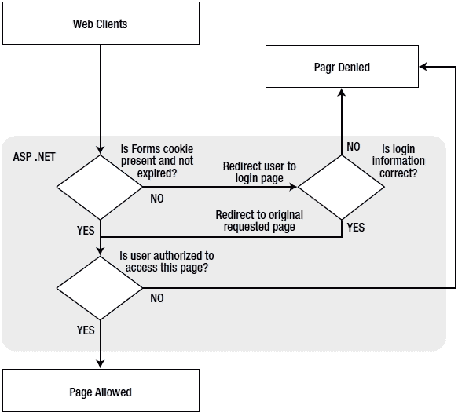
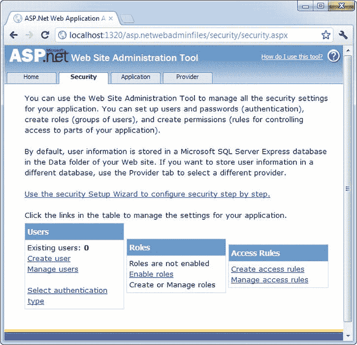
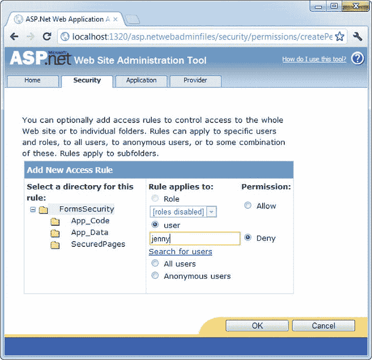
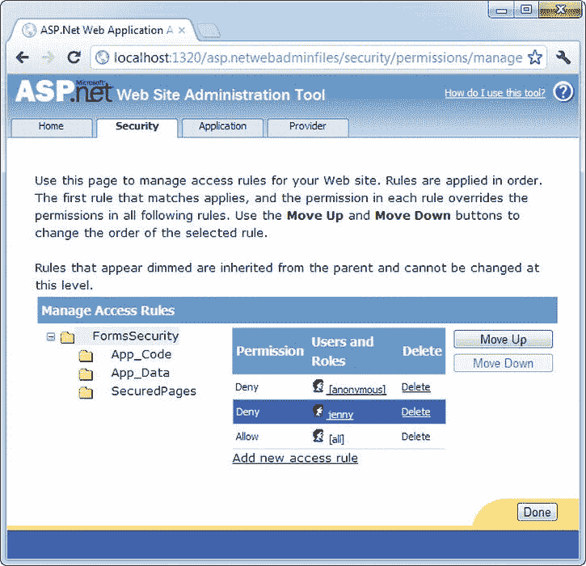
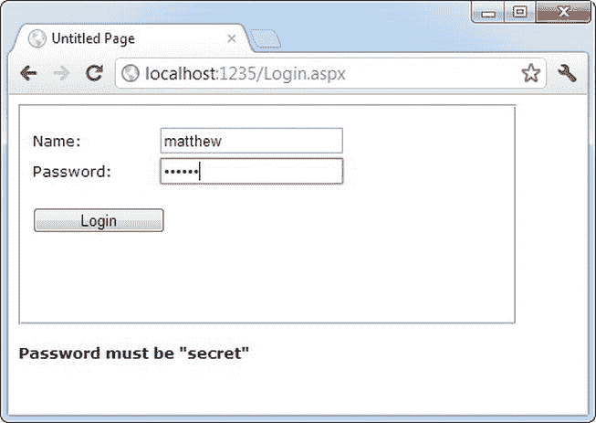
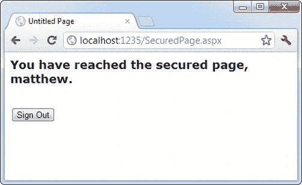
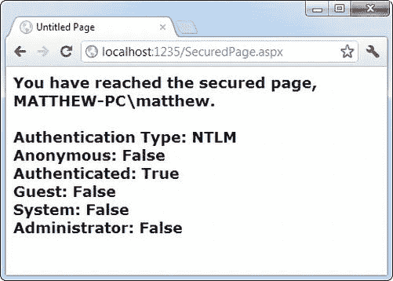

# 十九、安全基础

通常，连接到您的 web 服务器的任何人都可以访问您的 ASP.NET 网站，无论是通过本地网络还是互联网。尽管这对于许多 web 应用来说是理想的(并且符合互联网的原始精神)，但它并不总是一个合适的设计选择。例如，电子商务网站需要提供安全的购物体验来吸引客户。基于订阅的网站需要限制内容来收取费用。甚至一个完全开放的公共网站也可能提供一些不应该对所有用户开放的资源或功能。

ASP.NET 提供了广泛的安全模型，使保护您的 web 应用变得容易。尽管这种安全模型功能强大且非常灵活，但由于它包含许多不同的层，因此可能会让人感到困惑。保护应用的大部分工作不是编写代码，而是确定实现安全策略的适当位置。

在这一章中，你将理清错综复杂的 ASP.NET 安全模型。您将学习两种验证用户身份的方法——第一种是使用*表单验证* (这是使用自定义数据库的公共网站的理想选择),第二种是使用 *Windows 验证*(这是公司网络上的内部网应用的理想选择)。

了解安全需求

保护您的应用的第一步是决定您在哪里需要安全性以及它应该保护什么。例如，为了保护私人信息，您可能需要阻止访问。或者，也许你只是想实施付费内容系统。也许您根本不需要任何类型的安全性，但是您想要一个可选的登录特性来为经常访问的人提供个性化。这些要求将决定您使用的方法。

安全不一定要复杂，但必须是广泛和多层次的。例如，考虑一个电子商务网站，它允许用户查看他们最近下的订单的报告。你可能已经知道这个网站应该使用的第一道防线:一个迫使用户在看到任何个人信息之前表明身份的登录页面。在本章中，您将学习如何使用这种认证系统。然而，重要的是要认识到，就其本身而言，这层保护不足以真正保护您的系统。您还需要用强密码保护后端数据库，甚至可以选择在存储敏感信息之前对其进行加密(对其进行加密，以便在没有正确的密钥解密的情况下无法读取)。像这样的步骤可以保护你的网站免受超出你的认证系统的攻击。例如，它们可以阻止在本地网络上拥有帐户的心怀不满的员工、通过公司防火墙进入您的网络的黑客，或者丢弃用于数据存储的硬盘而不先擦除它的粗心技术人员。

此外，你需要仔细寻找你写的代码中的弱点。数量惊人的网站成为相对简单的攻击的牺牲品，在这些攻击中，恶意用户篡改查询字符串参数或呈现页面中的一点 HTML。在电子商务的例子中，你需要确保一个成功登录的用户不能查看另一个用户最近的订单。假设您创建了一个 ViewOrders.aspx 页面，该页面采用一个名为 userID 的查询字符串参数，如下所示:

```cs
http://localhost/InsecureStore/ViewOrders.aspx?userID=4191
```

这个例子是一个安全噩梦，因为任何用户都可以通过编辑 URL 来查看另一个用户的信息，从而轻松地修改 userID 参数。更好的解决方案是设计 ViewOrders.aspx 页面，使其从当前登录的用户身份中获取用户 ID(您将在本章中学习到这一技巧),然后使用它来构造正确的数据库命令。

 **注意**另一个由糟糕的编码引入的安全漏洞的例子是经常发生的 SQL 注入攻击。您在第 14 章中学习了通过使用参数化数据库命令来防止这种攻击。

在考虑安全性的情况下进行设计时，考虑不同的攻击途径非常重要。然而，你不能总是预见到潜在的问题。因此，对您的安全性进行分层是非常有意义的。安全架构师的口头禅可以总结如下:*不要强迫攻击者做一件不可能的事情来闯入你的系统——强迫攻击者做几件*。

测试和部署安全设置

正如你已经知道的，ASP.NET 网站使用 IIS 网站托管软件。但是当您开始构建和测试 web 应用时，您需要依赖内置的 Visual Studio web 服务器。这种差异对网站安全性有两个影响:

*   *网站用户帐户*:当您在 Visual Studio 中运行网站时，测试 web 服务器使用您的 Windows 用户帐户。因此，您的代码可以执行活动 web 服务器上不允许执行的任务(读取文件、写入日志、连接到数据库等)。为了确保在你部署你的网络应用时一切正常，你需要多了解一点关于 IIS 和 ASP.NET 如何使用 Windows 账户的知识——这个话题你将在第 26 章的[中讨论。](26.html)
*   *安全配置*:您可以配置不同的安全设置，包括您的 web 应用使用的身份验证类型和控制谁可以访问不同页面的授权规则。在一个测试站点中，你可以通过两种方式应用这些设置:通过编辑 web.config 文件或者通过运行网站管理工具(WAT)，这是你在[第五章](05.html)中第一次遇到的。在已部署的应用中，您可以继续使用您在开发过程中设置的安全设置，可以手动编辑 web.config，也可以使用方便的 IIS 管理器配置工具。

此外，有些安全设置只有在配置已部署的网站时才会发挥作用。例如，您可以使用 IIS 管理器打开安全套接字层(SSL)，这是一种加密标准，可确保恶意黑客无法窃听用户和您的 web 服务器之间发送的消息。您还可以配置 IIS 用于 Windows 身份验证的特定协议(换句话说，就是用于传输用户信息和某人登录的确切安全标准)。

本章解释了如何在开发过程中对网站应用安全性。您将学到的概念和细节同样适用于已部署的应用。但是，如果您想在部署应用后调整安全配置，或者如果您想获得更高级的 SSL 和 Windows 身份验证设置，则有必要了解 IIS 管理器。[第 26 章](26.html)有全部细节。

认证和授权

两个概念构成了任何关于安全性讨论的基础:

*   *认证*:这是一个确定用户身份并迫使这些用户证明他们就是他们所声称的那个人的过程。通常，这涉及到在某种登录页面或窗口中输入凭证(通常是用户名和密码)。然后，根据计算机上的 Windows 用户帐户、文件中的用户列表或后端数据库对这些凭据进行身份验证。
*   *授权*:一旦用户通过身份验证，授权就是确定该用户是否有足够的权限执行给定的操作(比如查看页面或从数据库中检索信息)的过程。Windows 会强制执行一些授权检查(例如，当您打开文件时)，但您的代码可能会强制执行自己的检查(例如，当用户在您的 web 应用中执行任务时，如提交订单、分配项目或进行促销)。

认证和授权 是基于用户的安全网站的基石。Windows 操作系统提供了一个很好的类比。当您第一次启动计算机时，您需要提供用户 ID 和密码，从而向系统验证您自己。之后，每次您与受限资源(如文件、数据库、注册表项等)交互时，Windows 都会悄悄地执行授权检查，以确保您的用户帐户拥有必要的权限。

您可以使用两种类型的鉴定来保护 ASP.NET 网站:

*   *表单认证* :通过表单认证，ASP.NET 负责对用户进行认证、跟踪并授权每个请求。通常，表单身份验证与存储用户信息(如用户名和密码)的数据库结合使用，但是您有完全的灵活性。您甚至可以将用户信息存储在纯文本文件中，或者编写调用远程服务的定制登录代码。表单身份验证是运行订阅站点或电子商务商店的最佳和最灵活的方式。
*   *Windows 认证* :通过 Windows 认证，web 服务器强制每个用户以 Windows 用户身份登录。(根据您使用的特定配置，此登录过程可能会自动进行，就像在 Visual Studio 测试 web 服务器中一样，或者可能需要用户在登录对话框中键入名称和密码。)该系统要求所有用户在服务器上拥有 Windows 用户帐户(尽管用户可以共享帐户)。这种场景不太适合公共 web 应用，但是对于为有限的用户提供资源的内部网或公司特定的站点来说，这种场景通常是理想的。

在本章中，您将集中讨论这两种方法。首先，您将探索窗体身份验证模型，然后，您将考虑 Windows 身份验证。

表单认证

在老式的 ASP 编程中，开发人员必须创建自己的安全系统。一种常见的方法是在每个安全页面的开头插入一小段代码。这段代码将检查自定义 cookie 的存在。如果 cookie 不存在，用户将被重定向到登录页面，在成功登录后，将在该页面创建 cookie。

ASP.NET 在其表单身份验证模型中使用了相同的方法。您仍然负责创建登录页面(尽管您可以使用一组专门设计的控件来帮助您，如第 20 章中所述)。但是，您不需要手动创建安全 cookie，或者在安全页面中检查它，因为 ASP.NET 会自动处理这些任务。你也从 ASP 中受益。NET 对复杂验证算法的支持，这使得用户几乎不可能伪造自己的 cookies 或尝试其他黑客技巧来欺骗您的应用让他们访问。

[图 19-1](#Fig1) 显示了 ASP.NETT3 的表单认证模型的简化安全图。



[图 19-1](#_Fig1) 。ASP.NET 表单身份验证

要实现基于表单的安全性，请遵循以下三个步骤 :

1.  在 web.config 文件中将身份验证模式设置为 forms authentication。(如果您喜欢图形工具，可以在开发期间使用 WAT，或者在部署后使用 IIS 管理器。)
2.  限制匿名用户访问应用中的特定页面或目录。
3.  创建登录页面。

在接下来的部分中，您将逐步完成这些步骤。

Web.config 设置

您可以使用<authentication>标签在 web.config 文件中定义安全性的类型。</authentication>

以下示例通过使用<authentication>标记将应用配置为使用 forms 身份验证。它还使用嵌套的<forms>标签展示了几个最重要的设置。也就是说，它设置安全 cookie 的名称、它将被视为有效的时间长度(以分钟为单位)以及允许用户登录的页面。</forms></authentication>

```cs
<configuration>
    . . .
    <system.web>
        . . .
        <authentication mode="Forms">
            <forms name="MyAppCookie"
                    loginUrl="∼/Login.aspx"
                    protection="All"
                    timeout="30" path="/" />
        </authentication>
    </system.web>
</configuration>
```

 **注意**和往常一样，web.config 代码文件列表中的省略号(…)代表您可能在 web.config 文件中使用的其他设置，这些设置与安全性无关。这些设置包括创建 web.config 文件时 Visual Studio 自动添加的设置，以及为使用特定功能而添加的任何附加设置。

表 19-1 描述了这些设置。它们都提供默认值，所以您不需要显式设置它们。有关受支持属性的完整列表，请参考 Visual Studio 帮助。

[表 19-1](#_Tab1) 。表单身份验证设置

| 属性 | 描述 |
| --- | --- |
| 名字 | 用于身份验证的 HTTP cookie 的名称(默认为。ASPXAUTH)。如果多个应用在同一台 web 服务器上运行，您应该为每个应用的安全 cookie 指定一个唯一的名称。 |
| 登录网址 | 您的自定义登录页面，如果找不到有效的身份验证 cookie，用户将被重定向到该页面。默认值是 Login.aspx。 |
| 保护 | 用于安全 cookie 的加密和验证类型(可以是全部、无、加密或验证)。验证确保 cookie 在传输过程中不被更改，并使用加密(通常是 Triple-DES)对其内容进行编码。默认值为 All。 |
| 超时 | cookie 过期前的空闲分钟数。每次收到请求时，ASP.NET 都会刷新 cookie。默认值为 30。 |
| 小路 | 应用发出的 cookies 的路径。建议使用默认值(/)，因为大小写不匹配会阻止 cookie 随请求一起发送。 |

授权规则

如果您对应用的 web.config 文件进行这些更改并请求一个页面，您会注意到没有什么不寻常的事情发生，并且该网页以正常方式提供服务。这是因为尽管您已经为应用启用了表单身份验证，但并没有限制匿名用户。换句话说，您已经选择了想要用于身份验证的系统，但是目前您的页面都不需要身份验证。

为了控制谁可以和不可以访问您的网站，您需要将访问控制规则添加到 web.config 文件的<授权>部分。下面是一个复制默认行为的示例:

```cs
<configuration>
    . . .
    <system.web>
        . . .
        <authentication mode="Forms">
            <forms loginUrl="∼/Login.aspx" />
        </authentication>
```

```cs
        <authorization>
            <allow users="*" />
        </authorization>
    </system.web>
</configuration>
```

星号(*) 是一个通配符，它明确允许所有用户使用该应用——甚至是那些没有经过身份验证的用户。但是，即使您没有在应用的 web.config 文件中包含这一行，您仍然会看到这种行为，因为 ASP。NET 的默认设置允许所有用户。(从技术上讲，发生这种行为是因为在根 web.config 文件中有一个< allow users = "*" >规则。如果你很好奇，你可以在 c:\Windows\Microsoft 这样的目录下找到这个文件。NET\Framework\[Version]\Config，其中[Version]是安装的 ASP.NET 版本，如 v4.0.30319。)

要改变这种行为，您需要显式添加一个更严格的规则，如下所示:

```cs
<authorization>
    <deny users="?" />
</authorization>
```

问号(？)是匹配所有匿名用户的通配符。通过在 web.config 文件中包含此规则，可以指定不允许匿名用户。每个用户都必须经过身份验证，每个用户请求都需要安全 cookie。如果您现在请求应用目录中的一个页面，ASP.NET 将检测到该请求未通过身份验证。然后，它会将请求重定向到由 web.config 文件中的登录 URL 属性指定的登录页面。(如果您现在尝试这一步，重定向过程将导致错误，除非您已经创建了登录页面。)

现在考虑一下，如果向授权部分添加多个规则，会发生什么情况:

```cs
<authorization>
    <allow users="*" />
    <deny users="?" />
</authorization>
```

当评估规则时，ASP.NET 从上到下扫描列表，然后继续使用任何中的设置。config 文件继承自父目录，以基本 machine.config 文件中的设置结束。一旦找到适用的规则，它就停止搜索。因此，在前一种情况下，它将确定规则<allow users="*">适用于当前请求，并且不会评估第二行。这意味着这些规则将允许所有用户，包括匿名用户。</allow>

但是考虑一下如果这两条线反过来会发生什么:

```cs
<authorization>
    <deny users="?" />
    <allow users="*" />
</authorization>
```

现在，这些规则将拒绝匿名用户(通过匹配第一个规则)并允许所有其他用户(通过匹配第二个规则)。

控制对特定目录的访问

常见的应用设计是将需要身份验证的文件放在单独的目录中。使用 ASP.NET 配置文件，这种方法很简单。只需在普通父目录中保留默认的<authorization>设置，并在安全目录中添加一个指定更严格设置的 web.config 文件。这个 web.config 只需要拒绝匿名用户(所有其他设置和配置部分都可以省略)。</authorization>

```cs
<!-- This web.config file is in a subfolder. -->
<configuration>
    <system.web>
        <authorization>
            <deny users="?" />
        </authorization>
    </system.web>
</configuration>
```

 **注意**你不能在你的应用的子目录的 web.config 文件中更改<认证>标签设置。相反，应用中的所有目录必须使用相同的身份验证系统。但是，每个目录都可以有自己的授权规则。

控制对特定文件的访问

通常，按目录设置文件访问权限是最干净、最简单的方法。但是，您也可以选择通过向 web.config 文件添加<location>标记来限制特定的文件。</location>

位置标签位于主<system.web>标签之外，直接嵌套在基本<configuration>标签中，如下所示:</configuration></system.web>

```cs
<configuration>
    . . .
    <system.web>
        . . .
        <authentication mode="Forms">
            <forms loginUrl="∼/Login.aspx" />
        </authentication>
```

```cs
        <authorization>
            <allow users="*" />
        </authorization>
    </system.web>
```

```cs
    <location path="SecuredPage.aspx">
        <system.web>
            <authorization>
                <deny users="?" />
            </authorization>
        </system.web>
    </location>

```

```cs
    <location path="AnotherSecuredPage.aspx">
        <system.web>
            <authorization>
                <deny users="?" />
            </authorization>
        </system.web>
    </location>
</configuration>
```

在此示例中，除了 SecuredPage.aspx 和 AnotherSecuredPage.aspx 之外，应用中的所有文件都是允许的，这两个文件具有拒绝匿名用户的附加访问规则。注意，即使您使用多个<location>部分来提供不同的授权规则集，您仍然只包括一个<authentication>部分。这是因为 web 应用只能使用一种类型的身份验证。</authentication></location>

 **提示**你也可以使用位置标签为特定的子目录设置规则。如前一节所述，您可以决定是使用这种方法，还是为每个子目录创建单独的 web.config 文件。

控制特定用户的访问

<allow>和<deny>规则不需要使用星号或问号通配符。相反，它们可以明确地标识用户名或逗号分隔的用户名列表。例如，下面的列表明确限制了三个用户的访问。这些用户将无法访问此目录中的页面。将允许所有其他经过身份验证的用户。</deny></allow>

```cs
<authorization>
    <deny users="?" />
    <deny users="matthew,sarah" />
    <deny users="john" />
    <allow users="*" />
</authorization>
```

您会注意到本例中的第一条规则拒绝所有匿名用户。否则，以下规则将不会有任何效果，因为用户不会被强制进行身份验证。

以下规则明确允许两个用户。所有其他用户请求都将被拒绝访问，即使他们已经过身份验证。

```cs
<authorization>
    <deny users="?" />
    <allow users="matthew,sarah" />
    <deny users="*" />
</authorization>
```

不要将这些用户名与 web 服务器上配置的 Windows 用户帐户名相混淆。使用窗体身份验证时，应用的安全模型独立于 Windows 用户帐户系统。当用户通过登录页面登录时，您的应用会分配用户名。通常，您会选择与数据库中的 id 相对应的用户名。唯一的要求是您的用户名是唯一的。

河水

您有另一种方法来设置您的身份验证和授权规则。您可以从 Visual Studio 内部使用 WAT，而不是手动编辑 web.config 文件。WAT 会引导您完成整个过程，尽管您会发现理解 web.config 文件实际上发生了什么变化仍然很重要。手工输入授权规则列表通常比使用 WAT 更快。

要将 WAT 用于此类配置，请从菜单中选择网站ASP.NET 配置。接下来，单击安全选项卡。您将看到如图 19-2 所示的窗口，该窗口为您提供了设置认证类型、定义授权规则(使用访问规则部分)和启用基于角色的安全性的链接。(基于角色的安全性是一个可选的高级功能，可用于表单身份验证。在下一章中，你会学到更多关于它是如何工作的以及如何启用它。)



[图 19-2](#_Fig2) 。WAT 中的安全标签

要设置应用使用表单身份验证，请按照下列步骤操作:

1.  单击选择身份验证类型。
2.  选择从 Internet 选项。(如果您选择从本地网络，您将使用内置的 Windows 身份验证方法，这将在后面的“Windows 身份验证”一节中介绍。)
3.  单击完成。将在 web.config 文件中创建适当的<authorization>标记。</authorization>

 **提示**选择认证选项的措辞稍有误导性。确实，用户通过互联网连接的应用肯定会使用表单身份验证。但是，在本地网络上运行的应用也可能使用表单身份验证，这完全取决于它们如何连接以及您是否希望使用现有帐户中的信息。换句话说，本地内部网给了你使用 Windows 认证的*选项*，但并不要求它。

接下来，是时候定义授权规则了。为此，请单击创建访问规则链接。(您也可以通过单击“管理访问规则”链接来更改现有规则。)使用图 19-3 所示的略微复杂的页面，你可以创建一个规则，允许或限制特定用户访问整个网站或特定页面或子文件夹。例如，[图 19-3](#Fig3) 中的规则将拒绝用户 jenny 进入整个站点(一旦你点击 OK 添加了它)。



[图 19-3](#_Fig3) 。添加授权规则

要管理多个规则，您需要点击管理访问规则链接。现在你将有机会改变规则的顺序(以及优先级，如前所述)，如图 19-4 所示。如果要创建大量规则，您可能会发现手动编辑 web.config 文件更容易。你可能只是想创建一个初始规则，以确保它在正确的位置，然后复制和粘贴你的成功之路。



[图 19-4](#_Fig4) 。订购授权规则

Security 选项卡乍一看有点让人不知所措，因为它包含了一些您还没有介绍过的功能。例如，安全选项卡还允许您创建和管理用户记录和角色，只要您愿意使用 ASP.NET 要求的预建数据库结构。在下一章中，你会学到更多关于这些细节的知识，它们是一个叫做*会员*的广泛特性的一部分。现在，您将专注于身份验证和授权过程。

登录页面

一旦指定了身份验证模式和授权规则，就需要构建实际的登录页面，这是一个普通的。向用户请求信息并决定是否应该对用户进行身份验证的 aspx 页。

ASP.NET 在系统中提供了一个特殊的 FormsAuthentication 类。Web.Security 命名空间，它使用静态方法来帮助管理进程。表 19-2 描述了这个类最重要的方法。

[表 19-2](#_Tab2) 。表单认证类的成员

| 成员 | 描述 |
| --- | --- |
| FormsCookieName | 一个只读属性，提供表单身份验证 cookie 的名称。 |
| FormsCookiePath | 为 forms 身份验证 cookie 提供路径集的只读属性。 |
| 认证() | 根据可以在 web.config 文件中输入的帐户列表检查用户名和密码。 |
| RedirectFromLoginPage() | 通过创建 cookie，将其附加到当前响应，并将用户重定向到最初请求的页面，使用户登录到 ASP.NET 应用。 |
| 锁定() | 通过删除当前加密的 cookie，将用户从 ASP.NET 应用中注销。 |
| SetAuthCookie() | 通过创建并附加表单身份验证 cookie，使用户登录到 ASP.NET 应用。与 RedirectFromLoginPage()方法不同，它不会将用户带回最初请求的页面。 |
| GetRedirectUrl() | 提供最初请求的页面的 URL。您可以使用 SetAuthCookie()将用户登录到应用，并在代码中决定是重定向到请求的页面还是使用更合适的默认页面。 |
| GetAuthCookie() | 创建身份验证 cookie，但不将其附加到当前响应。您可以执行额外的 cookie 定制，然后手动将其添加到响应中，如第 8 章中所述。 |
| hashpasswordforstoringconfigfile() | 使用指定的算法(SHA1 或 MD5)加密文本字符串。这个哈希值提供了一种在文件或数据库中存储加密密码的安全方式。 |

一个简单的登录页面可以用很少的代码实现这些方法。要尝试它，首先在 web.config 中启用表单身份验证并拒绝匿名用户,如前所述:

```cs
<configuration>
    . . .
    <system.web>
        . . .
        <authentication mode="Forms">
            <forms loginUrl="∼/Login.aspx" />
        </authentication>
```

```cs
        <authorization>
            <deny users="?" />
            <allow users="*" />
        </authorization>
    </system.web>
</configuration>
```

现在，用户将被重定向到您需要创建的名为 Login.aspx 的登录页面。图 19-5 显示了一个你可能构建的简单登录页面的例子。



[图 19-5](#_Fig5) 。典型的登录页面

当用户点击登录按钮时，页面检查用户是否输入了密码*秘密*，然后使用 RedirectFromLoginPage()方法让用户登录。下面是完整的页面代码:

```cs
public partial class Login : System.Web.UI.Page
{
    protected void cmdLogin_Click(Object sender, EventArgs e)
    {
        if (txtPassword.Text == "secret")
        {
            FormsAuthentication.RedirectFromLoginPage(
             txtName.Text, false);
        }
        else
        {
            lblStatus.Text = "Try again.";
        }
    }
}
```

RedirectFromLoginPage()方法需要两个参数。第一个设置用户名。第二个是一个布尔变量，指定您是否想要创建一个持久性 cookie(在用户硬盘上保留更长时间的 cookie)。然而，为了更加安全，ASP.NET 不再以最初设计的方式来纪念这一遗产。(在“持久 cookie”一节中，您将很快了解到关于持久 cookie 的更多信息)

显然，登录页面中使用的方法并不十分安全——它只是检查用户是否提供了硬编码的密码。在实际的应用中，您可能会根据数据库中的信息检查用户名和密码，只有当信息完全匹配时才让用户登录。您可以使用在第 4 部分中学到的 ADO.NET 编程轻松地编写这段代码，尽管这需要一些繁琐的代码。在下一章中，你将考虑更实际的方法来完成这个任务。

您可以在本章的可下载代码中包含的 FormsSecurity 网站上测试该代码。如果您请求 SecuredPage.aspx 文件，您将被重定向到 Login.aspx。输入正确的密码后，您将返回到 SecuredPage.aspx。

检索用户身份

用户登录后，您可以通过内置的用户属性检索身份，如下所示:

```cs
protected void Page_Load(Object sender, EventArgs e)
{
    lblMessage.Text = "You have reached the secured page, ";
    lblMessage.Text += User.Identity.Name + ".";
}
```

您不需要将代码放在登录页面中。相反，您可以在任何需要的时候使用 User 对象来检查当前用户的身份。

图 19-6 显示了运行这段代码的结果。



[图 19-6](#_Fig6) 。访问安全页面

您可以在代码中访问 User 对象，因为它是当前 Page 对象的一个属性。用户对象提供关于当前登录用户的信息。这相当简单——事实上，用户只提供一个属性和一个方法:

*   Identity 属性允许您检索登录用户的名称和所使用的身份验证类型。
*   IsInRole()方法允许您确定用户是否是给定角色的成员(因此应该被授予某些特权)。在本章的后面，您将使用 IsInRole()。

理解身份

用户对象是标准化的，因此它可以与任何类型的身份验证系统一起工作。这种设计的一个结果是用户。Identity 属性根据您使用的身份验证类型返回不同类型的对象。

例如，使用 forms 身份验证时，Iidentity 对象是 FormsIdentity 类的一个实例。使用 Windows 身份验证时，您将获得一个 WindowsIdentity 对象。如果用户根本没有登录，你会得到一个通用标识。(所有这些类都实现了 IIdentity 接口，该接口对它们进行了标准化。)

大多数时候，你不需要担心这种花招。但是偶尔你可能想要转换用户。属性设置为更具体的类型，以访问额外的信息。例如，FormsIdentity 对象提供安全票证(在名为 ticket 的属性中)，这在标准的 IIdentity 接口中是不可用的。该票证是 FormsAuthenticationTicket 类的一个实例，它提供了一些杂项细节，比如用户登录的时间以及票证将于何时过期。同样，WindowsIdentity 对象提供与 Windows 帐户相关的附加信息(如当前用户使用的是来宾帐户还是系统帐户)。在本章后面的“Windows 身份验证”一节中，您将看到这种技术的一个示例。

注销

任何使用表单认证的 web 应用都应该有一个突出的注销按钮,它会销毁表单认证 cookie:

```cs
private void cmdSignOut_Click(Object sender, EventArgs e)
{
    FormsAuthentication.SignOut();
    Response.Redirect("∼/Login.aspx");
}
```

提示在下一章，你将学习如何用登录控件简化生活。这些控件允许您不用代码就可以构建登录页面(以及其他类型的与安全性相关的用户界面)。然而，它们需要另一个特征——成员资格——才能工作。

持久 cookie

在某些情况下，您可能使用表单身份验证登录来实现个性化，而不是安全性。在这种情况下，您可以决定允许*持久 cookie*。永久身份验证 cookie 会保留在用户的硬盘上，并使用户在数小时、数天或数周内保持登录状态，即使用户关闭并重新打开浏览器也是如此。

创建持久性 cookie 比创建标准表单身份验证 cookie 需要更多的代码。您不需要使用 RedirectFromLoginPage()方法，而是需要手动创建身份验证票，设置其过期时间，对其进行加密，将其附加到请求中，然后将用户重定向到请求的页面。所有这些任务都很简单，但重要的是要以正确的顺序执行它们。(使用非持久 cookies 时，RedirectFromLoginPage()会自动处理所有这些任务。)

永久 cookies 还存在潜在的安全风险，因为其他用户可以使用同一台计算机访问受保护的页面，而无需强制登录。如果您希望允许用户创建永久 cookie，您应该将其设为可选，因为用户可能希望从公共或共享计算机访问您的站点。通常，使用这种技术的网站包括一个带有文本的复选框，如*保持我登录*。

下面的代码检查名为 chkPersist 的复选框。如果选中它，代码将创建一个持续 20 天的持久 cookie(尽管您可以根据自己的喜好将这个细节更改为任何时间间隔)。

```cs
// Perform the authentication.
if (txtPassword.Text == "secret")
{
    if (chkPersist.Checked)
    {
        // Calculate the total number of minutes in 20 days,
        // and use that for the timeout.
        int timeout = (int)TimeSpan.FromDays(20).TotalMinutes;
```

```cs
        // Create an authentication ticket.
        FormsAuthenticationTicket ticket = new
         FormsAuthenticationTicket(txtName.Text, true, cookietimeout);
```

```cs
        // Encrypt the ticket (so people can’t steal it as it travels over
        // the Internet).
        string encryptedTicket = FormsAuthentication.Encrypt(ticket);
```

```cs
        // Create the cookie for the ticket, and put the ticket inside.
        HttpCookie cookie = new HttpCookie(FormsAuthentication.FormsCookieName,
         encryptedTicket);
        // Give the cookie and the authentication ticket the same expiration.
        cookie.Expires = ticket.Expiration;
```

```cs
        // Attach the cookie to the current response. It will now travel back to
        // the client, and then back to the web server with every new request.
        HttpContext.Current.Response.Cookies.Set(cookie);
```

```cs
        // Send the user to the originally requested page.
        string requestedPage = FormsAuthentication.GetRedirectUrl(txtName.text,
         false);
        Response.Redirect(requestedPage, true);
    }
    else
    {
        // Use the standard authentication method.
        FormsAuthentication.RedirectFromLoginPage(
         txtName.Text, false);
    }
}
```

值得注意的是表单验证。SignOut()方法将总是删除表单身份验证 cookie，不管它是普通 cookie 还是持久 cookie。

Windows 身份验证

使用 Windows 身份验证，web 服务器负责身份验证过程。ASP.NET 只是让您的代码可以使用这个身份进行安全检查。

当您使用 Windows 鉴定时，您会强制用户登录到 IIS，然后才允许他们访问您网站中的安全内容。用户登录信息可以通过多种方式传输(取决于网络环境、请求浏览器和 IIS 的配置方式)，但最终结果是用户使用本地 Windows 帐户进行身份验证。通常，这使得 Windows 身份验证最适合 intranet 方案，在 intranet 方案中，有限的一组已知用户已经在网络服务器上注册。

要对已知用户实施基于 Windows 的安全性，您需要遵循三个步骤 :

1.  在 web.config 文件中将身份验证模式设置为 Windows 身份验证。(如果您喜欢图形工具，可以在开发期间使用 WAT，或者在部署后使用 IIS 管理器。)
2.  使用授权规则禁用对目录的匿名访问。
3.  在您的 web 服务器上配置 Windows 用户帐户(如果它们还不存在)。

在接下来的部分中，您将逐步完成这些步骤。

 **注意**内置的 Visual Studio web 服务器不支持 Windows 身份验证的匿名用户。相反，Visual Studio 会使用您的 Windows 帐户自动让您登录到测试服务器。因此，没有必要使用拒绝匿名用户的授权规则。但是，添加它仍然是一个好的做法，因为在某些时候，您将把您的应用部署到 IIS，并且需要显式地拒绝匿名用户。

Web.config 设置

要使用 Windows 身份验证，您需要确保在 web.config 文件中相应地设置了<authentication>元素。以下是如何:</authentication>

```cs
<configuration>
    <system.web>
        . . .
        <authentication mode="Windows" />

```

```cs
        <authorization>
          <deny users="?" />
        </authorization>
    </system.web>
</configuration>
```

目前，只有一个授权规则，它使用问号来拒绝所有匿名用户。这一步对于 Windows 身份验证至关重要(对于表单身份验证也是如此)。如果没有这一步，用户将永远不会被强制登录。

理想情况下，您甚至不会看到登录过程发生。相反，Internet Explorer 将传递当前 Windows 用户的凭据，web 服务器会自动使用这些凭据。Visual Studio 集成 web 服务器总是以这种方式工作。IIS 也是这样工作的，前提是你已经设置了集成的 Windows 身份验证(如第 26 章所述)并且浏览器支持它。

您还可以添加<allow>和<deny>元素来明确允许或限制用户访问特定的文件或目录。与表单身份验证不同，您需要指定帐户所在的服务器或域的名称。例如，此规则允许在名为 WebServer 的计算机上定义的用户帐户 matthew:</deny></allow>

```cs
<allow users = "WebServer\matthew" />
```

作为一种快捷方式，您可以使用 localhost(或句点)来引用当前计算机上的帐户，如下所示:

```cs
<allow users = ".\matthew" />
```

您还可以使用“角色”属性来限制某些类型的用户，前提是他们的帐户是同一个 Windows 组的成员:

```cs
<authorization>
    <deny users="?" />
    <allow roles=".\SalesAdministrator,.\SalesStaff" />
    <deny users=".\matthew" />
</authorization>
```

在本例中，作为 SalesAdministrator 或 SalesStaff 组成员的所有用户都将被自动授权访问该目录中的 ASP.NET 页面。来自用户 matthew 的请求将被拒绝，除非他是 SalesAdministrator 或 SalesStaff 组的成员。请记住，ASP.NET 按规则出现的顺序检查规则，当它找到一个匹配时停止。反转这两个授权行将确保用户 matthew 总是被拒绝，无论 matthew 属于 SalesAdministrator 组还是 SalesStaff 组。

您还可以在代码中以编程方式检查用户组成员资格，如下所示。由于字符串包含一个反斜杠，您需要记住将它加倍，或者您可以在前面加上一个 at 符号(@)来关闭 C#转义。

```cs
protected void Page_Load(Object sender, EventArgs e)
{
    if (User.IsInRole(@"MyDomainName\SalesAdministrators"))
    {
        // Do nothing; the page should be accessed as normal because
        // the user has administrator privileges.
    }
    else
    {
        // Don’t allow this page. Instead, redirect to the home page.
        Response.Redirect("Default.aspx");
    }
}
```

在此示例中，代码检查名为 SalesAdministrators 的自定义 Windows 组中的成员资格。如果要检查用户是否是某个内置组的成员，不需要指定计算机或域名。相反，您可以使用以下语法:

```cs
if (User.IsInRole(@"BUILTIN\Administrators"))
{
    // (Code goes here.)
}
```

有关<allow>和<deny>规则以及配置单个文件和目录的更多信息，请参考本章前面“授权规则”一节中的讨论。</deny></allow>

请注意，您无法检索 web 服务器上可用组的列表(这将违反安全性)，但是您可以使用 system . security . principal . Windows build inrole 枚举找出默认内置 Windows 角色的名称。表 19-3 描述了这些角色。并非所有人都适用于 ASP.NET 用户，尽管管理员、访客和用户可能会适用。

表 19-3。默认 Windows 角色

| 作用 | 描述 |
| --- | --- |
| 帐户操作员 | 对管理计算机或域上的用户帐户负有特殊责任的用户。 |
| 管理人 | 对计算机或域具有完全和无限制访问权限的用户。(如果 web 服务器计算机使用用户帐户控制[UAC]，Windows 将阻止管理员帐户的管理员权限，以降低病毒和其他恶意代码的风险。) |
| 备份操作员 | 只能在备份或还原操作中覆盖某些安全限制的用户。 |
| 客人 | 类似于用户角色，但更具限制性。 |
| 超级用户 | 类似于管理员，但有一些限制。 |
| 打印操作员 | 类似用户，但具有控制打印机的额外权限。 |
| 复制器 | 类似于用户，但具有支持域中文件复制的额外权限。 |
| 系统操作员 | 类似于管理员，但有一些限制。通常，系统操作员管理一台计算机。 |
| 用户 | 用户被禁止进行系统范围的更改，只能运行*认证的应用*(更多信息见`http://www.microsoft.com/windowsserver2008/en/us/isv.aspx`)。 |

Windows 认证测试

Windows 身份验证的一个很好的特性是不需要登录页面。根据您使用的认证协议(参见[第 26 章](26.html)了解完整细节)，登录过程可能会自动进行，或者浏览器可能会显示登录对话框。无论哪种方式，您都不需要执行任何额外的工作。

您可以从用户对象中检索有关当前登录用户的信息。正如您在前面所学的，用户对象通过用户提供身份信息。身份属性。根据身份验证的类型，使用不同的身份对象，每个身份对象可以提供定制的信息。若要获取有关使用 Windows 身份验证登录的用户的身份的一些附加信息，可以将通用 IIdentity 对象转换为 WindowsIdentity 对象(在系统中定义。Security.Principal 命名空间)。

下面是一个使用 Windows 身份验证的示例测试页面(参见[图 19-7](#Fig7) )。要使用编写的代码，您需要导入系统。Security.Principal 命名空间(定义 WindowsIdentity 类的位置)。



[图 19-7](#_Fig7) 。正在检索 Windows 身份验证信息

```cs
public partial class SecuredPage : System.Web.UI.Page
{
    protected void Page_Load(Object sender, EventArgs e)
    {
        StringBuilder displayText = new System.Text.StringBuilder();
        displayText.Append("You have reached the secured page, ");
        displayText.Append(User.Identity.Name);
```

```cs
        WindowsIdentity winIdentity = (WindowsIdentity)User.Identity;
        displayText.Append(".<br /><br />Authentication Type: ");
        displayText.Append(winIdentity.AuthenticationType);
        displayText.Append("<br />Anonymous: ");
        displayText.Append(winIdentity.IsAnonymous);
        displayText.Append("<br />Authenticated: ");
        displayText.Append(winIdentity.IsAuthenticated);
        displayText.Append("<br />Guest: ");
        displayText.Append(winIdentity.IsGuest);
        displayText.Append("<br />System: ");
        displayText.Append(winIdentity.IsSystem);
        displayText.Append("<br />Administrator: ");
        displayText.Append(User.IsInRole(@"BUILTIN\Administrators"));
```

```cs
        lblMessage.Text = displayText.ToString();
    }
}
```

最后一句话

在本章中，您了解了 ASP.NET 的多层安全体系结构，以及如何通过使用自定义登录页面或 Windows 身份验证来保护您的网页和 web 服务。

在下一章中，您将通过考虑一些可以简化您的生活并增强您的安全性的附加功能来继续构建您的知识。你将学习如何让 ASP.NET 为你的网站创建一个基本的用户数据库(包括密码加密)，这样你就不用自己创建或者写任何 ADO.NET 代码了。您还将通过学习如何将经过表单验证的用户分组到逻辑组中来扩展您的授权规则，每个逻辑组都可以被分配自己的权限。总之，这些功能被称为 ASP.NET*会员*系统。