# 二十、成员资格

在上一章中，您学习了如何使用 ASP.NET 窗体身份验证作为网站安全的基础。使用表单验证，您可以识别用户并限制他们访问他们不应访问的页面。最重要的是，ASP.NET 通过创建和检查表单验证 cookie 来为您管理整个过程。

虽然表单认证很方便，但它并不是一个完整的解决方案。各种相关的任务还是要靠你来打理。例如，您需要维护一个用户列表，并在身份验证过程中检查它。您还需要创建登录页面，决定如何将公共内容与私人内容分开，并确定每个用户应该被允许做什么。这些任务不是不可完成的，但是它们可能会很乏味。这就是为什么微软在其表单验证框架中增加了另一层功能。这额外的一层被称为*成员*T4。

会员特征分为三大类 :

*   *用户记录管理*:如果您使用会员功能，ASP.NET 可以创建并维护用户信息目录，而不是创建您自己的用户数据库。它甚至可以实现高级规则(如要求电子邮件地址、询问安全问题和实现强密码)。
*   *安全控制* :每个安全的网站都需要一个登录页面。用 ASP。NET 的安全控件，你不需要自己设计；相反，您可以直接从工具箱的登录部分使用现成的版本。除了基本的登录控件之外，还有用于显示安全内容、创建新用户和更改密码的其他控件。最棒的是，你可以通过设置属性和对事件做出反应来定制每个安全控件的工作方式。
*   *基于角色的安全*:在很多网站中，你需要给不同的用户不同的权限。当然，如果您必须为每个用户维护一组不同的设置，生活将会非常复杂，因此将用户集合到定义特定权限的组中是非常有用的。这些组被称为*角色*和 ASP。NET 的成员特性包括自动创建包含角色信息的数据库的工具。

在这一章中，您将探索所有这三个特性领域，并了解如何用非常少的代码创建安全的站点。

会员数据存储

关键的成员资格特性是 ASP.NET 能够在数据库中存储用户凭据。这个想法是，您对将要存储的信息和将要使用的安全策略做出一些选择。从那时起，ASP.NET 为您管理用户数据库—添加新的用户信息，在用户尝试登录时检查凭证，等等。

显然，成员数据存储能够大大减少您需要编写的代码量。你可以用更少的代码创建一个安全的网站，从而减少工作量。您也不需要担心不可避免的错误，因为 ASP.NET 会员模块是一个众所周知的、经过仔细测试的组件。

那么，为什么*不愿意*使用会员数据存储呢？有几个可能的原因:

*   *您不希望将您的用户数据存储在数据库中*:理论上，您可以将您的用户列表存储在任何类型的数据存储中，从 XML 文件到 Oracle 数据库。从技术上讲，每个数据存储需要不同的成员资格提供者。然而，ASP.NET 只包括两个提供程序—您将在本章中使用的 SQL Server 提供程序和一个 Active Directory 提供程序。如果您想使用另一个数据存储，比如一个不同的关系数据库，您需要找到一个相应的成员资格，或者您需要完全放弃成员资格。
*   *您需要向后兼容*:如果您已经创建了一个表来存储用户信息，那么切换到成员数据存储可能会太麻烦。这是因为 SQL Server 成员资格提供程序需要特定的表结构。它不适用于现有的表，因为它们的字段和数据类型的组合略有不同。即使您不需要保留当前的表结构，您可能会发现在成员资格数据存储中重新创建所有用户记录的工作量太大了。
*   *你想在 non-ASP.NET 应用中管理用户信息*:正如你将在本章中看到的，ASP.NET 为你提供了一套与会员数据交互的强大对象。例如，您可以更新用户记录、删除用户记录、基于特定标准检索用户记录等等。您甚至可以在其他类型的。NET 应用(例如，您可以创建一个 Windows 应用来管理用户帐户)。但是，如果您在外部创建另一个应用。NET 来执行这些任务，您可能会发现这并不容易，因为您需要理解成员资格表的结构。在这种情况下，您可能会发现使用与您自己的表一起工作的直接 SQL 语句来管理用户更容易。

如果您决定不使用成员资格数据存储，那么您可以自己编写 ADO.NET 代码来检索用户记录并检查用户凭证。使用这些技术，你可以艰难地创建自己的登录页面，如第 19 章中所解释的。

在继续下一步之前，您应该通过添加<forms>标签来设置您的网站使用表单认证。以下是您需要添加的内容:</forms>

```cs
<configuration>
    <system.web>
        . . .
        <authentication mode="Forms" />
    </system.web>
</configuration>
```

可选地，您可以定义额外的细节，例如登录页面的位置和安全 cookie 超时之前的时间，如第 19 章中所述。你可能还想添加一个授权规则，防止匿名用户访问特定的页面或子文件夹，这样你就可以更好地测试你的网站安全性。

SQL Server Express 的成员资格

假设您决定使用成员资格，您需要创建成员资格数据库。如果您使用的是 SQL Server Express(Visual Studio 附带的 SQL Server 免费版本)，这个任务比您想象的要简单得多。事实上，这一切都是自动发生的。

默认情况下，您创建的每个新网站都会启用成员资格。默认成员资格提供程序做出以下假设:

*   您希望使用 SQL Server Express 存储成员资格数据库。
*   您希望使用 SQL Server Express LocalDB(包含在 Visual Studio 中)。
*   您的成员资格数据存储将是一个名为 aspnetdb.mdf 的文件，它将存储在 web 应用目录的 App_Data 子文件夹中。(这依赖于 SQL Server Express 用户实例特性，这将在第 14 章中讨论。)

这些假设很有道理。它们允许您创建任意多的 web 应用，同时仍然保持用户数据库的独立性。那是因为每个网站都会有自己的 aspnetdb.mdf 文件。这些文件从未在 SQL Server 中注册，这意味着当您在另一个应用中打开一个连接时，您不会看到几十个用户数据库。相反，连接到它们的唯一方法是在连接字符串中指定文件路径，ASP.NET 就是这样做的。

这种设置的另一个优点是它可能更容易部署您的网站。假设您将在其中部署应用的 web 服务器具有 SQL Server Express，则您不需要更改连接字符串。您也不需要执行任何额外的步骤来安装数据库—您只需将 aspnetdb.mdf 文件与您的网站一起复制即可。这对于大型虚拟主机公司来说显然是一个很大的优势，因为支持多个网站是非常复杂的，每个网站都有自己的定制数据库需要安装和维护。

要了解这是如何工作的，创建一个带有简单测试页面的新 web 项目会有所帮助。将 CreateUserWizard 控件从工具箱的登录部分拖到您的页面上。现在运行页面(如[图 20-1](#Fig1) 所示)，不添加任何代码或配置控件。

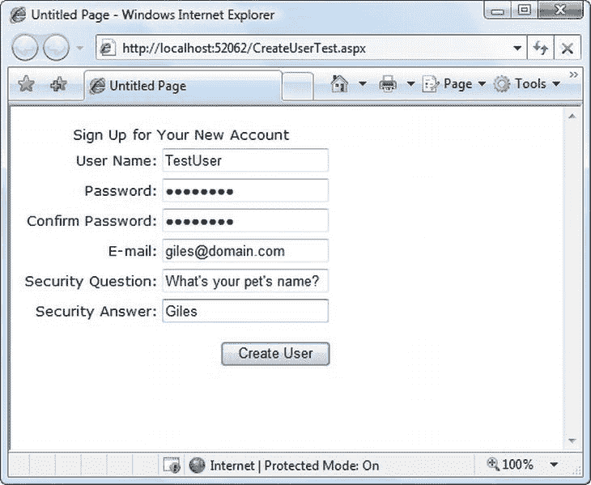

[图 20-1](#_Fig1) 。CreateUserWizard 控件

在所有文本框中填入用户信息。请注意，默认情况下，您需要提供至少包含一个不是数字或字母的字符(如下划线或星号)且长度至少为七个字符的密码。填写完所有信息后，单击创建用户。

此时，CreateUserWizard 控件在后台使用 ASP.NET 成员资格类来创建一个新用户。默认的成员资格提供程序创建 aspnetdb.mdf 文件(如果尚不存在)，然后添加新的用户记录。该过程完成后，CreateUserWizard 控件会显示一条消息，通知您用户已创建。不可思议的是，即使您没有在 web.config 文件中进行任何配置，也没有提前创建数据库文件，所有这些都会自动发生。

为了确保用户确实是被创建的，您可以检查 aspnetdb.mdf 文件。在解决方案资源管理器中，右键单击 App_Data 文件夹，然后选择“刷新文件夹”。您将看到 aspnetdb.mdf 文件立即出现。使用 Visual Studio，您甚至可以深入研究 aspnetdb.mdf 文件的内容。为此，请在解决方案资源管理器中双击该文件。Visual Studio 将配置一个新连接，并将其添加到左侧的服务器资源管理器中。使用服务器资源管理器，您可以自由地浏览数据库，检查它的表和存储过程。(请记住,“服务器资源管理器”窗口在 Visual Studio Web Developer Express 中称为“数据库资源管理器”,尽管该窗口的工作方式相同。)

您可以检查 aspnet_Users 表来查找您创建的用户记录。只需右键单击表名，然后选择显示表数据。您将看到类似于图 20-2 中所示的记录。在其他细节中，您会发现一个随机生成的 GUID，它唯一地标识了用户和用户最后一次使用您的 web 应用的日期。您不会看到密码和密码问题—它们存储在 aspnet_Membership 表中的链接记录中，并被加密以防止随意窥探。

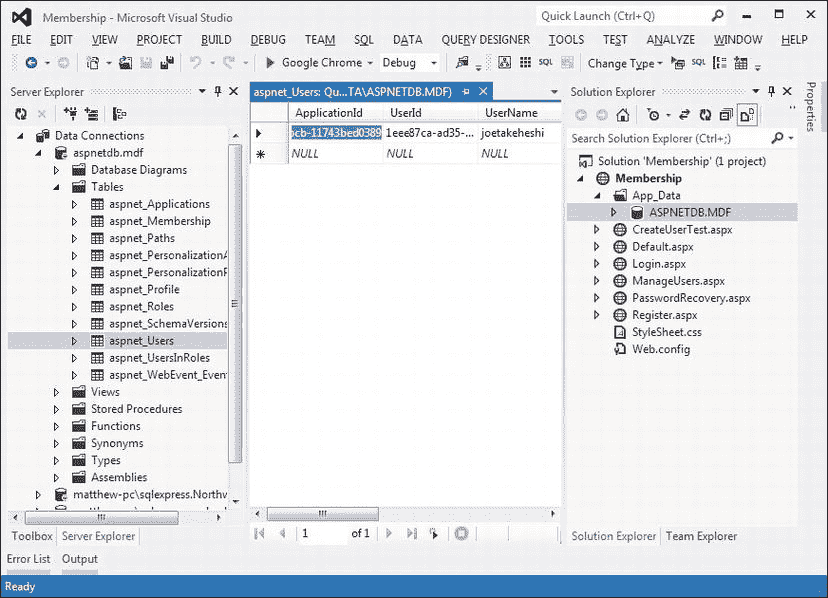

[图 20-2](#_Fig2) 。aspnetdb.mdf 数据库中的用户记录

 **注意**乍一看，你会发现会员数据库包括令人眼花缭乱的表格。其中一些表格是关于你可能使用或可能不使用的其他相关特性，比如基于角色的安全性(稍后在“基于角色的安全性”一节中讨论)和概要文件(在[第 21 章](21.html)中讨论)。

在深入 ASP 的其余部分之前。NET 的成员资格特性，重要的是要考虑如果您不想要默认的成员资格数据存储应该怎么做。例如，您可能决定将成员资格表存储在不同的数据库中，或者您可能希望为成员资格提供程序配置许多选项中的一个。在接下来的两节中，您将学习如何做到这一点。

使用 SQL Server 的完整版本

如果您使用的是 SQL Server Express 自动生成的数据库，则不需要接触 web.config 文件。在任何其他情况下，您都需要做一些配置调整。

最简单的例子是，如果您使用的是 SQL Server 的完整版本。在这种情况下，您仍然可以使用默认的成员身份设置。但是，您需要更改连接字符串。

 **提示**默认的成员设置和本地连接字符串都是在 machine.config 文件中设置的。您可以看看这个文件(甚至可以编辑它来更新您计算机上所有 web 应用的设置)。在 c:\Windows\Microsoft 中查找。NET\Framework\[Version]\Config 目录，其中[Version]是已安装的 ASP.NET 版本，例如 v4.0.30319。或者，如果您正在 64 位操作系统上使用 IIS 配置已部署的 web 应用，请在 c:\Windows\Microsoft。NET \ Framework**64**\[版本]\Config 目录。

用于成员资格的默认连接字符串名为 LocalSqlServer。您可以直接在 machine.config 中编辑该设置。但是，如果您只需要为单个应用调整它，那么最好为您的 web 应用调整 web.config 文件。首先，使用< clear >元素删除所有现有的连接字符串。然后，添加 LocalSqlServer 连接字符串，但这一次使用正确的值:

```cs
<configuration>
    <connectionStrings>
        <clear />
        <add name="LocalSqlServer" providerName="System.Data.SqlClient"
connectionString="Data Source=localhost;Integrated Security=SSPI;
Initial Catalog=aspnetdb" />
    </connectionStrings>
    . . .
</configuration>
```

这个<connectionstrings>部分删除所有连接字符串，然后创建一个新的连接字符串。这个新的连接字符串连接到本地计算机上名为 aspnetdb 的数据库。唯一的问题是 aspnetdb 数据库不会自动创建。相反，您需要使用 aspnet_regsql.exe 命令行工具来生成它。与其四处寻找这个文件，启动它最简单的方法是启动 Visual Studio 命令提示符(打开开始菜单，选择所有程序Microsoft Visual Studio 2010Visual Studio 工具 Visual Studio 命令提示符)。然后，您可以键入使用 aspnet_regsql 的命令。</connectionstrings>

可以通过两种方式使用 aspnet_regsql。如果您在没有添加任何命令行参数的情况下使用它，将会出现一个 Windows 向导，引导您完成整个过程。您将被要求提供数据库服务器的连接信息。该数据库将被命名为 aspnetdb，这是推荐的默认值。

您的另一个选择是使用命令行开关指定您想要发生的事情。这在部署应用时特别有用:您可以将 aspnet_regsql 用作安装批处理文件的一部分，该文件将自动创建成员资格数据存储。如果您想选择数据库名称或者只想安装一些数据库表，可以使用这个选项。默认情况下，aspnet_regsql 工具安装可用于用户身份验证、基于角色的授权、配置文件和 Web 部件个性化的表。这为您提供了最大的灵活性，但是如果您不打算使用其中的一些特性，您可能会觉得这有点大材小用。

表 20-1 描述了最重要的命令行选项。下面是一个命令行示例，它连接到当前计算机上未命名的 SQL Server 实例(使用-S 参数)，连接到当前 Windows 帐户(使用-E 参数)，安装所有表(使用-A *all* 参数)，并将它们全部放在名为 aspnetdb 的数据库中(这是默认设置):

[表 20-1](#_Tab1) 。aspnet_regsql.exe 的命令行开关

| 转换 | 描述 |
| --- | --- |
| -S 服务器名 | 指定要安装数据库的 SQL Server 实例的位置。 |
| -英 | 使用当前登录的 Windows 帐户，通过 Windows 身份验证连接到服务器。 |
| -U 用户名和-P 密码 | 指定连接到 SQL Server 数据库所需的用户名和密码。通常，您会使用-E 来代替。 |
| ［构成动植物的古名或拉丁化的现代名］ | 指定要使用的功能(并确定创建的数据库表)。此开关的有效选项为:all、m(成员资格)、r(基于角色的安全性)、p(配置文件)、c (Web 部件个性化)和 w(对于 SQL Server 2000 的数据库缓存依赖项)。 |
| -右 | 删除支持由 *-A* 开关指定的特性的数据库。 |
| -d 数据库 | 允许您指定将在其中创建表的数据库的名称。如果不指定此参数，将自动创建一个名为 aspnetdb 的数据库。 |
| -sqlexportonly | 创建用于向数据库添加或移除指定要素的 SQL 脚本，但并不实际创建数据库中的表。相反，您可以稍后运行该脚本。在部署应用时，这可能是一项有用的技术。 |

```cs
aspnet_regsql -S (local) -E -A all
```

如果要使用不同的数据库，必须使用-d 参数指定数据库名称。

 **提示**一次安装所有的表是个好主意(使用–A*all*选项)。这样，您的数据库将为下一章讨论的配置文件特性做好准备。一旦您完成了对应用的测试，并准备好创建最终的数据库，您就可以设置一个只包含您决定使用的选项的数据库。(例如，使用–A*Mr*来使用成员资格和角色管理，而不是其他。)

 **注意**如果你将你的网站部署到一家虚拟主机公司，你可能不被允许在网络服务器上运行 aspnet_regsql。相反，您可能需要使用 SQL Server Express。在这种情况下，您的数据库将作为 web 应用的一部分部署在 App_Data 文件夹中，不需要额外的配置步骤。如果您的 web 主机不支持 SQL Server Express，您将需要使用类似 SQL Server Management Studio 的工具来准备一个安装数据库的. SQL 脚本文件。然后，虚拟主机公司的管理员可以运行您的脚本文件来创建您需要的数据库。

配置成员资格提供者

在设置成员资格数据存储时，配置连接字符串是最简单的更改。但是，您可能还想调整其他成员设置。例如，您可以更改默认密码策略。

 **注意**与连接字符串一样，默认的成员资格提供程序是在 machine.config 文件中定义的。您可以编辑 machine.config 文件来更改计算机上所有应用的这些默认值，但您不应该这样做，因为这会使您部署应用时的生活变得复杂。相反，您应该通过在应用的 web.config 文件中配置新的成员资格提供程序来进行更改。

要配置您的成员资格提供者，您需要将<membership>元素添加到您的 web 应用中。在<membership>元素中，您用自己的自定义设置定义了一个新的成员资格提供者。然后设置<membership>元素的 defaultProvider 属性，使它通过名称引用您的成员资格提供者。</membership></membership></membership>

以下是您需要遵循的基本结构:

```cs
<configuration>
    . . .
    <system.web>
        . . .
        <membership defaultProvider="MyMembershipProvider">
            <providers>
                <!-- Clear any existing providers. -->
                <clear />
```

```cs
                <!-- Define your provider, with custom settings. -->
                <add name="MyMembershipProvider" . . . />
            </providers>
        </membership>
    </system.web>
</configuration>
```

当然，有趣的部分是您在<add>标签中用来配置您的成员资格提供者的属性。下面是一个使用宽松的密码设置定义成员资格提供者的示例。前三个属性提供必需的设置(成员资格提供程序的名称、类型和连接字符串)。其余设置取消了对安全问题的要求，并允许密码短至一个字符，仅包含字母和数字:</add>

```cs
<membership defaultProvider="MyMembershipProvider">
    <providers>
        <clear/>
        <add
         name="MyMembershipProvider"
         Type="System.Web.Security.SqlMembershipProvider"
         connectionStringName="LocalSqlServer"
         requiresQuestionAndAnswer="false"
         minRequiredPasswordLength="1"
         minRequiredNonalphanumericCharacters="0" />
     </providers>
</membership>
```

[表 20-2](#Tab2) 描述了最常用的会员设置。

[表 20-2](#_Tab2) 。配置成员资格提供商的属性

| 属性 | 描述 |
| --- | --- |
| 名称 [*](#_Tabnote2) | 指定成员资格提供程序的名称。你可以选择任何你想要的名字。这是您稍后用来引用提供程序的名称(例如，当您设置 defaultProvider 属性时)。您还可以使用它以编程方式获取提供者信息。 |
| 键入 [*](#_Tabnote2) | 指定成员资格提供程序的类型。在本章中，您将始终使用 system . web . security . sqlmembershipprovider。ASP.NET 还包括一个 ActiveDirectoryMembershipProvider，它允许您通过 Active Directory 服务器将成员资格功能与 Windows 身份验证结合使用。(有关此主题的更多信息，请参考 Visual Studio 帮助。)最后，您可以使用您或第三方开发人员创建的自定义成员资格提供程序。 |
| 应用名称 | 指定 web 应用的名称。如果有几个 web 应用使用同一个成员资格数据库，此设置非常有用。如果您给每个应用一个单独的名称，所有的信息(包括用户、配置文件等等)都是完全分离的，所以它只能在适当的应用中使用。 |
| connectionStringName* | 指定连接字符串设置的名称。这必须对应于 web.config 或 machine.config 的<connectionstrings>部分中定义的连接字符串。</connectionstrings> |
| 描述 | 允许成员资格提供程序的可选说明。 |
| 密码格式 | 设置密码在数据库中的存储方式。您可以使用明文(密码按原样存储，不进行加密)、加密(密码使用计算机专用密钥加密)或哈希(密码经过哈希处理，哈希值存储在数据库中)。散列密码提供了与加密密码类似的保护(也就是说，如果您查看散列，您将很难逆向工程密码)。但是，当密码被散列后，它们将永远无法恢复，只能重置。 |
| minRequiredPasswordLength | 指定密码的最小长度。如果用户在创建帐户时输入较少的字符，尝试将被拒绝，并显示一条错误消息。 |
| minRequiredNonalphanumericCharacters | 指定密码需要包含的非字母数字字符(数字和字母以外的字符)的数量。如果用户在创建帐户时输入较少的字符，尝试将被拒绝，并显示一条错误消息。尽管要求非字母数字字符有助于提高密码的强度(更不易被猜到)，但这也会让用户感到困惑，导致他们更容易忘记密码，或者(更糟糕的是)将密码写在显眼的地方，这样密码可能会被盗。 |
| maxInvalidPasswordAttempts | 指定在锁定用户帐户并使其无法访问之前，允许用户输入无效登录密码的次数。默认为五次尝试。 |
| passwordattemptwinsow | 设置测量 maxInvalidPasswordAttempts 的内部时间。例如，如果您设置 30 分钟的窗口，30 分钟后，无效密码尝试的次数将被重置。如果用户在 passwordAttemptWindow 内超过 maxInvalidPasswordAttempts，则帐户被锁定。 |
| enablePasswordReset | 确定密码是否可以重置，这在忘记密码时很有用。 |
| enablePasswordRetrieval | 确定是否可以请求密码(并通过电子邮件发送给用户)，这在用户忘记密码时非常有用。如果 passwordFormat 设置为 Hashed，则永远不支持此功能，因为在这种情况下，不会存储密码。 |
| 要求问题和答案 | 确定当您请求或重置用户密码时，是否需要成员身份安全答案。 |
| requiresUniqueEmail | 如果为 false，则允许多个用户拥有相同的电子邮件地址。电子邮件地址信息始终是可选的。(但是，除非将 RequireEmail 设置为 false，否则 CreateUserWizard 控件需要电子邮件地址。) |

[*](#Tabnote2) *This setting is required.*

既然您已经看到了可以调整的设置，那么有必要问一下默认值是什么。如果您查看 machine.config 文件中的<membership>部分，您会发现:</membership>

```cs
<membership>
    <providers>
        <add name="AspNetSqlMembershipProvider"
             Type="System.Web.Security.SqlMembershipProvider . . ."
             connectionStringName="LocalSqlServer"
             enablePasswordRetrieval="false"
             enablePasswordReset="true"
             requiresQuestionAndAnswer="true"
             applicationName="/"
             requiresUniqueEmail="false"
             passwordFormat="Hashed"
             maxInvalidPasswordAttempts="5"
             minRequiredPasswordLength="7"
             minRequiredNonalphanumericCharacters="1"
             passwordAttemptWindow="10" />
    </providers>
</membership>
```

如您所见，默认的成员资格提供程序是 AspNetSqlMembershipProvider。它使用 LocalSqlServer 连接字符串进行连接，并支持密码重置，但不支持密码检索。帐户需要安全问题，但不需要唯一的电子邮件。为了安全起见，密码本身在数据库中被散列，所以它们不能被检索。密码必须至少有七个字符，并且至少有一个非字母数字字符。最后，如果用户在 10 分钟内输入 5 次无效密码，该帐户将被禁用。

用 WAT 创建用户

一旦创建了成员资格数据存储并(可选地)配置了成员资格提供程序，就可以在 web 应用中使用成员资格支持的安全性了。正如您已经看到的，您可以使用 CreateUserWizard 控件创建新用户。您将在本章的后面考虑 CreateUserWizard 控件和其他安全控件。首先，值得考虑一下设置用户列表的其他选项。

一种选择是使用 WAT。选择网站ASP.NET 配置来启动该工具。接下来，单击安全选项卡。在左下角，一个方框显示数据库中当前有多少用户(见[图 20-3](#Fig3) )。该框还提供了允许您检查现有用户记录或添加新记录的链接。

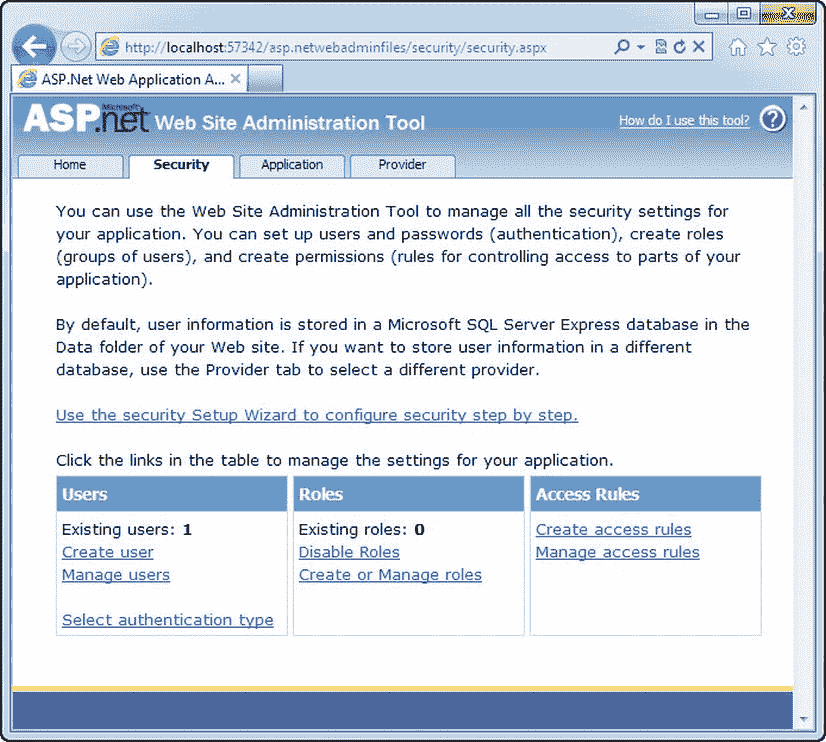

[图 20-3](#_Fig3) 。使用 WAT 管理网站安全

如果要浏览当前用户列表或更新现有用户记录，请单击管理用户链接。要添加新用户，请单击创建用户。你会看到一组控件，类似于之前测试页面中使用的 CreateUserWizard 控件(见[图 20-4](#Fig4) )。在创建了几个用户之后，您可能想再看一下数据库中的 aspnet_Users 和 aspnet_Membership 表，看看用户记录是什么样子的。

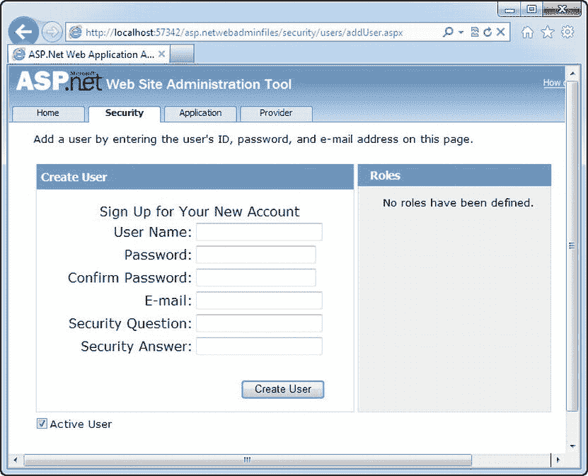

[图 20-4](#_Fig4) 。创建新用户

尽管 WAT 是添加用户记录的一种非常明智的方式，但是如果要创建大量用户，您可能会发现 web 界面有点慢。另一种选择是使用成员资格类，如下所示:

```cs
// Create a user record based with user name, password, and e-mail information.
Membership.CreateUser(userName, password, email);
```

下面是一个硬编码值的示例:

```cs
Membership.CreateUser("joes", "ignreto12__", "joes@domains.com");
```

这只用一行代码就创建了一个新用户。当然，CreateUser()方法有多个重载，您可以使用它们来提供细节，比如密码问题和答案。如果您没有更改默认成员设置，您将无法创建帐户，除非您提供这些详细信息。相反，您需要使用这个更复杂的重载:

```cs
MembershipCreateStatus createStatus;
Membership.CreateUser("joes", "ignreto12__", "joes@domains.com",
 "What is your favorite restaurant?", "Saigon", true, out createStatus);
```

前几个参数不言自明:它们接受用户名、密码、电子邮件地址、密码问题和密码答案。倒数第二个参数采用一个布尔值，该值确定帐户是否被赋予 IsApproved 标志。如果您提供 false，帐户将不会被批准，因此在您使用成员资格修改它之前，它将不会是活动的(和可用的)。UpdateUser()方法。在不包含此参数的简单重载中，帐户总是被标记为已批准。

最后一个参数*返回*一个来自 MembershipCreateStatus 枚举的值。如果该值不是 MembershipCreateStatus。成功，创建记录时出错。该值指示确切的错误情况(例如，密码不够强，当您的成员资格提供商不允许重复时，电子邮件地址重复，等等)。在不包含 MembershipCreateStatus 的简单重载中，任何错误都会导致引发具有相同信息的异常对象。

 **提示**显然，如果您需要将大量用户帐户从自定义数据库转移到成员资格数据存储中，最快的方法是编写一个例程，循环遍历现有记录，并使用 CreateUser()方法插入新记录。

Membership 和 MembershipUser 类

如果您仍然需要编写手工制作的 point 代码来检索或修改用户信息，那么使用成员资格数据存储就没有什么意义了。这就是为什么 ASP.NET 提供了一个更方便，更高层次的会员级别的模型。

Membership 是一个有用的类，它充满了实用的静态方法，比如 CreateUser()。你可以在系统里找到它。安全命名空间。表 20-3 提供了它最有用的静态方法的快照。

[表 20-3](#_Tab3) 。会员方式

| 方法 | 描述 |
| --- | --- |
| CreateUser() | 向数据库添加新用户。 |
| DeleteUser() | 从数据库中删除现有用户。您可以通过用户名指定用户。您还可以选择是否要删除其他表中的所有相关数据(默认是删除)。 |
| UpdateUser() | 用特定用户的新信息更新数据库。 |
| GetUser（） | 按用户名从数据库中获取特定用户。 |
| GetUserNameByEmail() | 检索与给定电子邮件地址匹配的用户的用户名。请记住，默认情况下允许重复的电子邮件地址，在这种情况下，该方法将只查找第一个匹配项。 |
| FindUsersByName() | 从成员资格数据库中获取与给定用户名匹配的用户。这支持部分匹配，因此用户将匹配 TestUser、User001 等等。 |
| FindUsersByEmail() | 从成员资格数据库中获取与特定电子邮件地址匹配的用户。您还可以提供电子邮件地址的一部分(如域名)，在这种情况下，您将获得电子邮件地址包含此文本的每个用户。 |
| GetAllUsers() | 获取表示数据库中所有用户的集合。这个方法的重载版本允许您只获取完整用户列表的一部分(基于起始索引和长度的单个用户页面)。 |
| GetNumberOfUsersOnline() | 获取当前访问应用的登录用户数。如果用户的最后活动时间戳在设定的时间限制(如 20 分钟)内，则此计算假设用户在线。 |
| GeneratePassword() | 生成指定长度的随机密码。这在以编程方式创建新用户记录时非常有用。 |
| ValidateUser() | 检查数据库中是否存在提供的用户名和密码。您可以使用此方法在登录页面中编写身份验证逻辑。 |

Membership 类还提供静态只读属性，使您可以检索有关成员资格提供程序配置的信息，如配置文件中所设置的那样。例如，您可以检索所需的密码长度、密码尝试的最大次数以及[表 20-2](#Tab2) 中描述的所有其他详细信息。

这些方法中有许多使用 MembershipUser 类，它表示一条用户记录。例如，当您调用 GetUser()时，您将收到作为 MembershipUser 对象的信息。如果您想要更新该用户，您可以更改其属性，然后调用 Membership。使用修改后的 MembershipUser 对象更新 User()。

 **注意**Membership user 对象组合了 aspnet_Users 表和链接的 aspnet_Membership 表中的详细信息。例如，它包括密码问题。但是，密码答案和密码本身不可用。

MembershipUser 类还提供了自己的一组较小的实例方法。最重要的在[表 20-4](#Tab4) 中有详细说明。

[表 20-4](#_Tab4) 。成员资格用户方法

| 方法 | 描述 |
| --- | --- |
| 解锁用户() | 重新激活因无效登录尝试次数过多而被锁定的用户帐户。 |
| GetPassword() | 检索用户密码。如果在成员资格配置中 requiresQuestionAndAnswer 为 true(这是默认设置)，您必须提供密码问题的答案才能检索密码。请注意，如果 passwordFormat 设置是散列的，或者 enablePasswordRetrieval 设置为 false(这也是默认设置),则该方法根本不起作用。 |
| ResetPassword() | 使用此方法返回的新的随机生成的密码重置用户密码。如果在成员资格配置中 requiresQuestionAndAnswer 为 true(这是默认设置)，您必须提供密码问题的答案才能重置密码。您可以为用户显示新密码，或者通过电子邮件发送。 |
| 更改密码() | 更改用户密码。您必须提供当前密码才能应用新密码。 |
| ChangePasswordQuestionAndAnswer() | 更改用户密码问题和答案。您必须提供当前密码才能更改安全问题。 |

为了了解 Membership 类是如何工作的，您可以创建一个简单的测试页面，显示成员数据库中所有用户的列表。[图 20-5](#Fig5) 显示了这个页面。

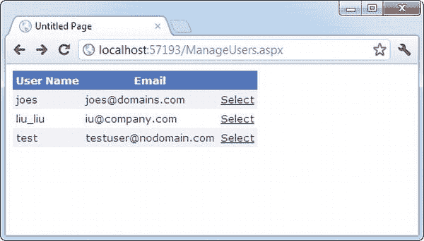

[图 20-5](#_Fig5) 。获取用户列表

要创建这个页面，只需从定义 GridView 开始。GridView 将显示 MembershipUser 对象的列表。对于每个用户，它显示用户名和电子邮件属性的值，以及一个选择链接。下面是创建 GridView 的标记(没有格式细节):

```cs
<asp:GridView ID="gridUsers" runat="server"
 OnSelectedIndexChanged="gridUsers_SelectedIndexChanged"
 AutoGenerateColumns="False" DataKeyNames="UserName" >
        <Columns>
        <asp:BoundField DataField="UserName" HeaderText="User Name" />
        <asp:BoundField DataField="Email" HeaderText="Email" />
        <asp:CommandField ShowSelectButton="True" />
    </Columns>
</asp:GridView>
```

当页面第一次加载时，它调用成员。GetAllUsers()方法并将结果绑定到 GridView，如下所示:

```cs
protected void Page_Load(object sender, EventArgs e)
{
    gridUsers.DataSource = Membership.GetAllUsers();
    gridUsers.DataBind();
}
```

为了使示例更有趣，当选择一条记录时，将检索相应的 MembershipUser 对象。然后将该对象添加到一个集合中，这样它就可以绑定到 DetailsView 进行自动显示:

```cs
protected void gridUsers_SelectedIndexChanged(object sender, EventArgs e)
{
    List<MembershipUser> list = new List<MembershipUser>();
    list.Add(Membership.GetUser(gridUsers.SelectedValue.ToString()));
    detailsUser.DataSource = list;
    detailsUser.DataBind();
}
```

下面是完成这项工作的 DetailsView(同样，没有格式细节):

```cs
<asp:DetailsView ID="detailsUser" runat="server"></asp:DetailsView>
```

此 DetailsView 使用自动行创建(因为 AutoGenerateRows 默认为 true)。因此，DetailsView 显示了所有的 MembershipUser 属性。

[图 20-6](#Fig6) 显示了单个记录中可用的信息。在其他细节中，您可以使用 MembershipUser 对象来检查用户是否在线、用户上次访问系统的时间以及用户的电子邮件地址。

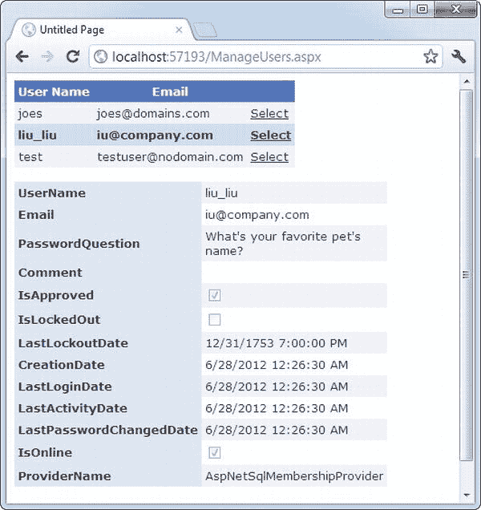

[图 20-6](#_Fig6) 。MembershipUser 对象中的信息

会员身份认证

既然您已经切换到成员资格，并且您的所有用户都存储在成员资格数据存储中，那么您需要更改登录页面的工作方式。生活现在变得简单多了；与其创建 ADO.NET 对象来查询数据库并查看是否存在匹配的用户记录，不如让成员资格类为您执行所有工作。你需要的方法是会员制。ValidateUser()。它接受用户名和密码，如果数据库中有有效的匹配，则返回 true。

以下是您登录页面所需的新代码:

```cs
protected void cmdLogin_Click(object sender, EventArgs e)
{
    if (Membership.ValidateUser(txtName.Text, txtPassword.Text))
    {
        FormsAuthentication.RedirectFromLoginPage(txtName.Text, false);
    }
    else
    {
        lblStatus.Text = "Invalid username or password.";
    }
}
```

实际上，相当多的工作正在幕后进行。如果您使用默认的成员资格提供程序设置，密码将被哈希处理。这意味着当您调用 ValidateUser()时，ASP.NET 使用相同的哈希算法对新提供的密码进行哈希处理，然后将其与存储在数据库中的哈希密码进行比较。

禁用账户

有两种方法可以在成员资格数据库中禁用帐户:

*   *帐户未被批准*:如果您以编程方式创建一个帐户，并为 isApproved 参数提供 false，就会出现这种情况。如果您想自动创建一个帐户，但允许管理员在帐户生效前对其进行检查，您可以执行此步骤。要激活此帐户，您需要为相应的用户记录获取一个 MembershipUser 对象，设置 MembershipUser。被批准为 true，并调用成员资格。UpdateUser()。
*   *帐户被锁定*:如果用户多次尝试(默认为五次)使用无效密码访问用户帐户，就会出现这种情况。在这种情况下，您需要为用户获取一个 MembershipUser 对象，并调用 MembershipUser。解锁用户()。你也可以打电话给会员用户。ResetPassword()以防止再次锁定。

为了帮助你完成这些任务，你可能需要创建一个管理页面，如图 20-6 所示。例如，您可以允许用户查看所有尚未批准的帐户，并通过点按按钮来批准它们。

同样，如果希望随时禁用某个帐户，可以检索该用户的 MembershipUser 对象，并将 IsApproved 属性设置为 false。但是，您无法以编程方式锁定用户帐户。

您可能已经在考虑使用 Membership 和 MembershipUser 类创建各种各样的页面。例如，您可以构建允许用户请求密码重置或检查他们是否被锁定的页面。但是，您可能不需要创建所有这些页面，因为 ASP.NET 包含一组丰富的安全控件，可以自动执行许多常见任务。在下一节中，您将了解更多关于安全控制的内容。

安全控件

基本会员特征 是一个显著的时间节省器。它们允许您专注于 web 应用的编程，而无需担心管理安全性和创建完美的数据库或用户信息。相反，您可以使用更高级别的 Membership 和 MembershipUser 类来做您需要的任何事情。

然而，ASP.NET 会员功能并不止于此。成员类不仅简化了常见的安全任务，还将它们标准化了。因此，其他组件和控件可以使用 Membership 类将自己与 ASP.NET 安全模型集成在一起，而不用担心每个 web 应用的细节。你可以在 ASP 中找到这种新的灵活性的最好例子。NET 的安全控制。这些控件使用 membership 和 MembershipUser 类的方法与成员资格提供程序进行交互，以实现用户界面的公共部分，如登录页、一组用户创建控件和密码恢复向导。

[表 20-5](#Tab5) 列出了 所有与成员资格相关的 ASP.NET 安全控制。在 Visual Studio 中，可以在工具箱的登录部分找到这些控件。

[表 20-5](#_Tab5) 。安全控制

| 控制 | 描述 |
| --- | --- |
| 注册 | 显示熟悉的用户名和密码文本框，以及登录按钮。 |
| 控件 | 如果用户尚未登录，则显示一个登录按钮，将用户重定向到已配置的登录页面。否则，它会显示一个注销按钮。您可以选择用于登录和注销按钮的测试，但仅此而已。 |
| LoginName | 显示登录用户的用户名。 |
| 登录查看 | 根据用户是否登录，显示不同的内容。您甚至可以使用该控件为不同的用户组或*角色*显示不同的内容。 |
| 密码恢复 | 允许用户通过电子邮件请求密码或重置密码。通常，用户必须提供安全问题的答案才能获得密码。 |
| 修改口令 | 允许用户设置新密码(只要用户可以提供当前密码)。 |
| 用户控件 | 允许用户创建新记录，包括电子邮件地址和密码问题及答案。 |

使用这些控件有一种简单的方法和一种复杂的方法。最简单的方法是，您只需将控件放到页面上，无需编写任何代码。(在本章开始时，您已经看到了 CreateUserWizard 控件的这种方法。)您还可以修改属性、处理事件，甚至创建模板来自定义这些控件。

在接下来的几节中，您将进一步了解 Login、PasswordRecovery 和 CreateUserWizard 控件。稍后，在“基于角色的安全性”一节中，您将使用 LoginView 控件向不同角色的用户显示不同的内容。

登录控件

到目前为止，你所看到的安全网站都使用手工制作的登录页面。在许多网站中，这就是你想要的——毕竟，它给了你完全的控制来调整你想要的用户界面。然而，登录页面是标准的，所以 ASP.NET 给开发者一些额外的快捷方式来节省他们的工作是有意义的。

按照这些思路，ASP.NET 包含了一个登录控件，它将用户名和密码文本框与登录按钮配对。登录控件还增加了一些特性:

*   它包括验证器控件，可以防止页面在输入用户名和密码之前被回发。如果浏览器(借助一点 JavaScript)和服务器端验证支持，这些验证器使用客户端验证，如第 9 章中所述。
*   当用户成功登录时，它会自动处理登录和重定向过程。如果输入无效的登录凭据，它会显示一条错误消息。
*   它提供了一个“记住我”复选框，如果选中该复选框，将在用户的计算机上存储一个永久的 cookie 因此，用户不需要在每次访问开始时重新登录。

换句话说，如果基本的登录控件符合您的需求(它提供了您想要的用户界面)，您就不需要编写一行代码。

要尝试这样做，请将 Login 控件放到一个新页面上。确保该页面被命名为 Login.aspx，以便用作表单身份验证的默认登录页面(或者编辑<forms>标记以选择不同的登录页面，如前一章所述)。然后，运行页面。你会看到如图[图 20-7](#Fig7) 所示的基本界面。</forms>

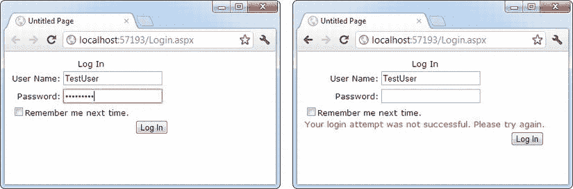

[图 20-7](#_Fig7) 。登录控件和失败的登录尝试

尽管 Login 控件会自动处理登录过程，但您可以使用自定义代码进行干预。为此，您必须对其中一个登录控制事件做出反应，如[表 20-6](#Tab6) 中所列。

[表 20-6](#_Tab6) 。登录控件的事件

| 事件 | 描述 |
| --- | --- |
| 您的日志 | 在用户通过身份验证之前引发。 |
| 登录 | 在用户通过控件的身份验证后引发。 |
| 登录错误 | 当登录尝试失败时引发(例如，如果用户输入了错误的密码)。 |
| 鉴定 | 引发以验证用户。如果您处理此事件，则由您来提供登录代码—登录控件不会执行任何操作。 |

如果要更新其他控件以显示基于登录过程的某些信息，login、LoggedIn 和 LoginError 事件非常有用。例如，在第一次登录失败后，您可以选择显示一个链接，将用户重定向到一个密码检索页面:

```cs
protected void Login1_LoginError(object sender, EventArgs e)
{
    lblStatus.Text = "Have you forgotten your password?";
    lnkRedirectToPasswordRetrieval.Visible = true;
}
```

认证事件是最重要的事件。它允许您编写自己的认证逻辑，就像您在上一章中所做的那样。这通常在两种情况下有用。首先，您可能希望用其他要求来补充 Login 控件中的默认检查(例如，防止任何用户在一天中的特定时间登录，仅允许用户在另一个控件中输入信息时登录，等等)。您可能处理 Authenticate 事件的另一个原因是，如果您根本没有使用成员资格提供程序。在这种情况下，只要您提供了身份验证逻辑，您仍然可以使用登录控件。

在 Authenticate 事件处理程序中，您可以使用登录控件的用户名和密码属性来检查用户名和密码。然后将 AuthenticateEventArgs 的 Authenticated 属性设置为 true 或 false。如果为 true，接下来将引发 LoggedIn 事件，然后用户被重定向到登录名。DestinationPageUrl(如果未设置 DestinationPageUrl 属性，则为用户来自的原始页面)。如果将 Authenticated 设置为 false，接下来将引发 LoginError 事件，控件将显示由登录名定义的错误信息。FailureText 属性

这里有一个直接使用成员类的认证事件的事件处理程序:

```cs
protected void Login1_Authenticate(object sender, AuthenticateEventArgs e)
{
    if (Membership.ValidateUser(Login1.UserName, Login1.Password))
    {
        e.Authenticated = true;
    }
    else
    {
        e.Authenticated = false;
    }
}
```

这涵盖了您需要了解的与登录控件交互的所有内容，但是您可以调整许多属性来配置登录控件的外观。甚至还有一个自动格式化链接，您可以从“属性”窗口(或智能标记)中选择，只需单击一下，就可以让登录控件焕然一新。

Login 控件最强大的格式属性是样式属性，它允许您调整控件各个部分的字体、颜色和对齐方式。你已经看到了其他几个控件的工作方式，包括日历([第 10 章](10.html))和 GridView ( [第 16 章](16.html))，它们与安全控件的工作方式相同。[表 20-7](#Tab7) 详述了登录控件的样式属性。

[表 20-7](#_Tab7) 。Login 控件的样式属性

| 风格 | 描述 |
| --- | --- |
| titlatextstyle | 定义 Login 控件标题文本的样式。 |
| 标签样式 | 定义用户名和密码标签的样式。 |
| TextBoxStyle | 定义用户名和密码文本框的样式。 |
| LoginButtonStyle | 定义登录按钮的样式。 |
| 失败文本样式 | 定义登录尝试失败时显示的文本样式。 |
| 复选框样式 | 定义“记住我”复选框的样式属性。 |
| ValidatorTextStyle | 定义验证用户名和密码信息的 RequiredFieldValidator 控件的样式。这些样式属性调整了错误文本的外观。(默认情况下，错误文本只是出现在空文本框旁边的一个星号。) |
| 超链接样式 | 配置 Login 控件显示的所有链接。这包括允许您创建新用户记录、检索密码等的链接。只有在设置了 CreateUserUrl 和 PasswordRecoveryUrl 属性后，这些链接才会出现。 |
| 指令文本样式 | 格式化登录。InstructionText，这是可以在登录控件下添加的帮助说明文本。默认情况下，Login 控件没有说明文本。 |

当然，样式不是登录控件中唯一可以更改的特性。您可以调整几个属性来更改它使用的文本和添加链接。例如，Login 控件的以下标记调整格式，并使用 CreateUserUrl 和 PasswordRecoveryUrl 属性将链接添加到用于注册新用户的页面和用于找回丢失的密码的页面。(显然，为了使链接正常工作，您需要创建这两个页面。)

```cs
<asp:Login ID="Login1" runat="server" BackColor="#EFF3FB" BorderColor="#B5C7DE"
 BorderPadding="4" BorderStyle="Solid" BorderWidth="1px" Font-Names="Verdana"
 ForeColor="#333333" Height="256px" Width="368px"
 CreateUserText="Register for the first time"
 CreateUserUrl="Register.aspx"
 PasswordRecoveryText="Forgot your password?"
 PasswordRecoveryUrl="PasswordRecovery.aspx"
 InstructionText=
    "Please enter your username and password for logging into the system.">
```

```cs
    <TitleTextStyle BackColor="#507CD1" Font-Bold="True" Font-Size="Large"
     ForeColor="White" Height="35px" />
    <InstructionTextStyle Font-Italic="True" ForeColor="Black" />
    <LoginButtonStyle BackColor="White" BorderColor="#507CD1"
     BorderStyle="Solid" BorderWidth="1px" Font-Names="Verdana"
     ForeColor="#284E98" />
```

```cs
</asp:Login>
```

[图 20-8](#Fig8) 显示了修改后的登录控件。[表 20-8](#Tab8) 解释了登录控件的其他属性。

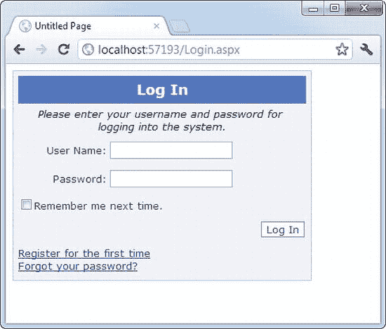

[图 20-8](#_Fig8) 。格式化的登录控件

[表 20-8](#_Tab8) 。登录控件的有用属性

| 财产 | 描述 |
| --- | --- |
| 标题文本 | 显示在控件标题中的文本。 |
| 说明文本 | 显示在标题下方、登录控件上方的文本。默认情况下，Login 控件没有说明文本。 |
| 失败文本 | 登录尝试失败时显示的文本。 |
| UserNameLabelText | 显示在用户名文本框前的文本。 |
| PasswordLabelText | 显示在密码文本框前的文本。 |
| UsernameRequiredErrorMessage | 如果用户没有键入用户名，RequiredFieldValidator 将显示错误信息。默认情况下，这只是一个星号(*)。 |
| 密码要求错误消息 | 如果用户没有键入密码，RequiredFieldValidator 将显示错误消息。默认情况下，这只是一个星号(*)。 |
| 登录按钮文本 | 为登录按钮显示的文本。 |
| 登录按钮类型 | 用作登录按钮的按钮控件的类型。它可以显示为链接、按钮或图像。 |
| 登录按钮图像 Url | 指向要为登录按钮显示的图像的 URL。若要使用此属性，必须将 LoginButtonStyle 属性设置为 Image。 |
| 目标页面 Url | 如果登录尝试成功，用户将被重定向到的页面。默认情况下，此属性为空，这意味着 Login 控件使用窗体基础结构并将用户重定向到最初请求的页面(或 web.config 文件中配置的 defaultUrl)。 |
| 显示记忆我 | 确定是否显示“记住我”复选框。您可能想要移除此选项以确保更严格的安全性，这样恶意用户就无法通过其他用户的电脑访问您的网站。 |
| RememberMeSet | 设置“记住我”复选框的默认值。默认情况下，该选项设置为 false，这意味着该复选框最初未被选中。 |
| VisibleWhenLoggedIn | 如果设置为 false，则当用户已经登录时，登录控件会自动隐藏自己。如果设置为 true(默认值)，则即使用户已经登录，也会显示登录控件。 |
| CreateUserUrl | 向用户注册页提供 URL。此属性与 CreateUserText 一起使用。 |
| 创建用户文本 | 设置指向用户注册页面的链接的文本。如果未提供此文本，则此链接不会显示在 Login 控件中。 |
| CreateUserIconUrl | 提供一个图像的 URL，该图像将显示在用户注册链接的 CreateUserText 旁边。 |
| 帮助页面 Url | 为包含帮助信息的页面提供 URL。 |
| 帮助页面文本 | 设置指向帮助页面的链接的文本。如果未提供此文本，则此链接不会显示在 Login 控件中。 |
| 帮助页面图标 Url | 提供图像的 URL，该图像将显示在帮助页链接的 HelpPageText 旁边。 |
| PasswordRecoveryUrl | 提供密码恢复页面的 URL。 |
| PasswordRecoveryText | 设置密码恢复页面链接的文本。如果未提供此文本，则此链接不会显示在 Login 控件中。 |
| PasswordRecoveryIconUrl | 提供图像的 URL，该图像将显示在密码恢复页面链接的 PasswordRecoveryText 旁边。 |

为了完成图 20-8 中的例子，你必须创建 Register.aspx 和 PasswordRecovery.aspx 页面。在接下来的几节中，您将了解如何使用另外两个 ASP.NET 安全控件轻松实现这一点。

CreateUserWizard 控件

在本章开始时，您已经使用 CreateUserWizard 控件创建了一个基本的用户记录。既然您已经看到了 Login 控件的灵活性，那么了解到您有同样多的选项来调整 CreateUserWizard 控件的外观和行为就不足为奇了。

CreateUserWizard 控件分两步操作。第一步是收集生成用户记录所需的用户信息。创建帐户后，第二步会显示一条确认消息。

总的来说，CreateUserWizard 提供了大量可以调整的属性。然而，它有助于理解实际上只存在三种类型的属性:

*   仅格式化控件的一部分的样式属性:例如，TitleTextStyle 配置如何格式化文本标题。
*   *设置控件*文本的属性:例如，您可以配置每个标签、成功文本以及不同错误情况下显示的消息。您还可以检索或设置每个文本框中的值。
*   *隐藏或显示控件*的一部分的属性:例如，您可以使用 DisplaySideBar、DisplayCancelButton 和 RequireEmail 分别显示或隐藏侧栏、取消按钮和电子邮件文本框。

CreateUserWizard 控件还提供了一组熟悉的事件，包括 CreatingUser、CreatedUser 和 CreateUserError。同样，如果您决定不使用成员资格功能，这些事件对于同步页面上的其他控件或重写用户创建过程非常方便。

 **提示**默认情况下，新创建的用户会自动登录。您可以通过设置 CreateUserWizard 来更改此行为。LoginCreatedUser 属性设置为 false。还可以设置 ContinueDestinationPageUrl 属性，以设置创建新记录后用户将被重定向到的 Url。

有趣的是，CreateUserWizard 控件继承了你在第 10 章中探索的向导控件。因此，您可以根据需要添加任意多的额外步骤，就像使用向导控件一样。这些步骤可能会执行其他任务，比如让用户注册接收定期新闻简报。然而，实际的用户创建过程必须始终在一个步骤中完成。

例如，考虑基本 CreateUserWizard 的标记:

```cs
<asp:CreateUserWizard ID="CreateUserWizard1" runat="server">
    <WizardSteps>
        <asp:CreateUserWizardStep runat="server">
        </asp:CreateUserWizardStep>
        <asp:CompleteWizardStep runat="server">
        </asp:CompleteWizardStep>
    </WizardSteps>
</asp:CreateUserWizard>
```

实际上，CreateUserWizard 是一个向导控件，它支持两种专门的步骤类型:CreateUserWizardStep，在这里收集用户信息并创建用户记录；和 CompleteWizardStep，其中显示了确认消息。

以下示例显示了如何将普通的 WizardStep 添加到该序列中。在这种情况下，额外的步骤只是为新创建的用户提供一些额外的选项(即，选择订阅自动电子邮件时事通讯)。

```cs
<asp:CreateUserWizard ID="CreateUserWizard1" runat="server"
 DisplaySideBar="True" . . . >
    <WizardSteps>
        <asp:CreateUserWizardStep runat="server" Title="Create User">
        </asp:CreateUserWizardStep>
```

```cs
        <asp:WizardStep runat="server" Title="Subscribe">
            Would you like to sign up for the following newsletters?<br />
            <br />
            <asp:CheckBoxList ID="chkSubscription" runat="server">
                <asp:ListItem>MSN Today</asp:ListItem>
                <asp:ListItem>VB Planet</asp:ListItem>
                <asp:ListItem>The High-Tech Herald</asp:ListItem>
            </asp:CheckBoxList>
        </asp:WizardStep>
```

```cs
        <asp:CompleteWizardStep runat="server">
        </asp:CompleteWizardStep>
    </WizardSteps>
</asp:CreateUserWizard>
```

图 20-9 显示了前两个步骤。注意侧栏出现了(因为 CreateUserWizard。DisplaySidebar 属性设置为 true)来显示步骤的顺序。

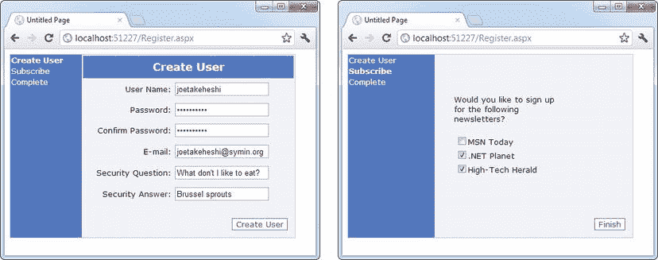

[图 20-9](#_Fig9) 。带有自定义步骤的 CreateUserWizard】

通过响应 CreateUserWizard 事件之一，在代码中采取适当的操作仍然取决于您。在这种情况下，您使用 FinishButtonClick 事件，因为它发生在完成消息之前的最后一步。如果您将步骤放在序列的前面，您将需要对 NextButtonClick 做出反应。在当前示例中，您可能希望将此信息添加到用户的配置文件表中。你将在下一章学习如何使用概要文件。

为了获得完整的布局和格式功能，您可以将 CreateUserWizard 步骤之一转换为模板。然后，您可以自由地重新排列现有的内容，并添加新的控件和 HTML 内容。但是，注意不要删除任何必需的元素。如果您尝试使用 CreateUserWizard，但缺少一个必需的帐户信息文本框，它将抛出异常。

将步骤转换为模板的最简单方法是使用智能标记链接。首先，在 Visual Studio 中选择网页设计图面上的 CreateUserControl。接下来，单击右上角旁边出现的箭头图标以显示智能标记。然后，根据要修改的步骤，选择定制创建用户步骤链接或定制完成步骤链接。然后，ASP.NET 会将控件插入到模板的 CreateUserWizard 控件标签中。

例如，假设您想要在最终摘要中显示用户在您的定制步骤中选择的选项。在这种情况下，您可能想要添加一个新的标签控件，如下所示:

```cs
<asp:CompleteWizardStep ID="CompleteWizardStep1" runat="server">
    <ContentTemplate>
        <table border="0" style=". . .">
            <tr>
                <td align="center" colspan="2" style=". . .">
                    Complete
                </td>
            </tr>
            <tr>
                <td>
                    Your account has been successfully created.<br /><br />
                    You subscribed to:
                    <asp:Label ID="lblSubscriptionList" runat="server">
                    </asp:Label>
                </td>
            </tr>
            <tr>
                <td align="right" colspan="2">
                    <asp:Button ID="ContinueButton" runat="server"
                     BackColor="White" BorderColor="#507CD1"
                     BorderStyle="Solid" BorderWidth="1px"
                     CausesValidation="False" CommandName="Continue"
                     Font-Names="Verdana" ForeColor="#284E98" Text="Continue"
                     ValidationGroup="CreateUserWizard1" />
                </td>
            </tr>
        </table>
    </ContentTemplate>
</asp:CompleteWizardStep>
```

现在，当用户移动到最后一步时，您可以用来自 CheckBoxList 控件的信息填充标签。但是，因为 Label 和 CheckBoxList 控件放在模板中，所以不能通过名称直接访问它们。相反，您需要从 CreateUserWizard 控件中提取它们。要获得标签，您需要访问完整的步骤，获取它包含的第一个控件(即内容模板)，然后使用 FindControl()方法搜索标签。要获取 CheckBoxList，您需要执行类似的操作，只是您可以使用 CreateWizardControl 本身的 FindControl()方法，该方法搜索所有普通步骤。

以下是执行此任务的代码:

```cs
protected void CreateUserWizard1_FinishButtonClick(object sender,
 WizardNavigationEventArgs e)
{
    Label lbl = (Label)CreateUserWizard1.CompleteStep.Controls[0].FindControl(
     "lblSubscriptionList");
    CheckBoxList chk = (CheckBoxList)CreateUserWizard1.FindControl( _
     "chkSubscription");
```

```cs
    string selection = "";
    foreach (ListItem item in chkSubscription.Items)
    {
        if (item.Selected)
         selection += "<br />" + item.Text;
    }
    lbl.Text = selection;
}
```

[图 20-10](#Fig10) 显示了最后一步。

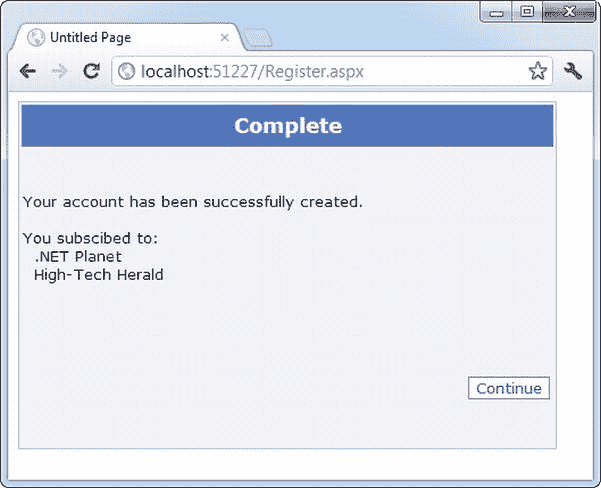

[图 20-10](#_Fig10) 。用额外的内容增强完整的步骤

密码恢复控制

当用户忘记密码时，PasswordRecovery 控件就派上了用场。它允许他们使用一个简短的向导找回他们的密码。

PasswordRecovery 控件引导用户完成三个步骤。首先，它请求用户名。接下来，它显示安全问题并请求答案(除非您已经在 web.config 文件中将 requiresQuestionAndAnswer 设置设置为 false，在这种情况下，PasswordRecovery 控件会完全跳过这一步)。最后，PasswordRecovery 控件向用户的电子邮件地址发送一封电子邮件。如果使用加密或明文的密码格式(参见[表 20-2](#Tab2) )，电子邮件包含原始密码。如果您使用的是默认的哈希密码格式，则会生成一个新的随机密码，并通过电子邮件发送该密码。无论哪种方式，最后一步都会显示一条确认消息，通知您电子邮件已发送。[图 20-11](#Fig11) 显示了运行中的 PasswordRecovery 控件。

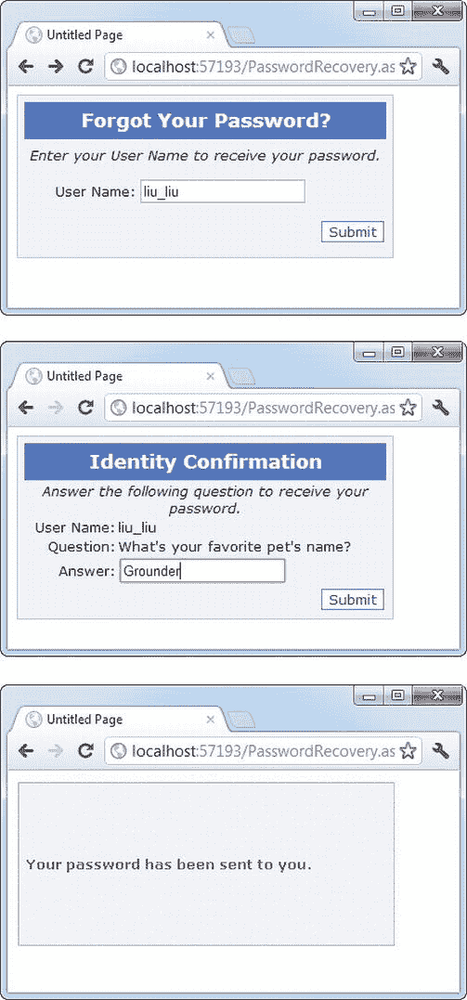

[图 20-11](#_Fig11) 。请求密码

要使 PasswordRecovery 控件正常工作，您的计算机必须有正确配置的 SMTP 服务器，并且用户必须在用户记录中有电子邮件地址。

 **注意**您可以通过选择 PasswordRecovery 控件并从智能标记中选择“管理网站”来配置您的 SMTP 服务器。然后选择应用选项卡，并单击配置 SMTP 电子邮件设置链接。

如果您的应用不满足这两个要求—您不能发送电子邮件，也不能存储用户电子邮件地址—您可以直接在页面上显示新密码。最简单的方法是处理 PasswordRecovery。发送邮件事件。首先，设置 MailMessageEventArgs。将 Cancel 属性设置为 true 以阻止发送消息。接下来，从 MailMessageEventArgs 中检索消息内容。消息对象并将其显示在页面上。这里有一个例子:

```cs
protected void PasswordRecovery1_SendingMail(object sender, MailMessageEventArgs e)
{
    e.Cancel = true;
    PasswordRecovery1.SuccessText = e.Message.Body;
}
```

当你使用这个事件处理器时，你会看到最后一个步骤，如图 20-12 所示。

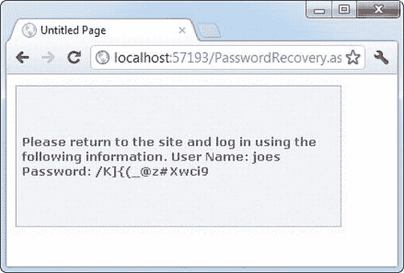

[图 20-12](#_Fig12) 。显示检索或重新生成的密码

当然，为了获得完全的灵活性，您可以创建自己的页面来重置密码。您只需要使用前面描述的 Membership 和 MembershipUser 类的方法。

基于角色的安全性

到目前为止，您所研究的身份验证示例提供了一种要么全有要么全无的方法，要么禁止要么允许用户。然而，在许多情况下，应用需要识别不同级别的用户。一些用户将被提供有限的功能，而其他用户可能被允许执行潜在的危险更改或使用网站的管理部分。

为了允许这种类型的多层访问，您需要 ASP。NET 基于角色的授权特性。与成员资格一样，ASP.NET 负责存储角色信息，并使其对您的代码可用。您需要做的就是创建角色，为每个角色分配用户，然后在代码中测试角色成员资格。

在使用基于角色的授权之前，您需要启用它。虽然您可以使用 WAT 来执行这个步骤(只需单击 Security 选项卡中的 Enable Roles 链接)，但是只需将所需的行直接添加到 web.config 文件 中就足够简单了:

```cs
<configuration>
    . . .
    <system.web>
        . . .
        <roleManager enabled="true" />
    </system.web>
</configuration>
```

与成员资格数据存储一样，ASP.NET 将使用 SQL Server Express 在 aspnetdb.mdf 文件中自动创建角色信息。如果要使用不同的数据库，需要按照本章前面讨论的步骤，使用 aspnet_regsql.exe 创建数据库并修改连接字符串。

创建和分配角色

启用 角色管理后，需要创建一组基本的角色(例如，用户、管理员、访客等)。然后，您可以将用户分配到一个或多个组。

您可以通过两种方式创建角色:编程方式或手动方式，使用 WAT。

要使用 WAT，请遵循以下步骤:

1.  通过选择网站ASP.NET 配置启动 WAT。
2.  单击安全选项卡。
3.  单击创建或管理角色链接。
4.  To add a new role, type it into the provided text box and click Add Role (see [Figure 20-13](#Fig13)). Or use the Manage and Delete links in the role list to modify or delete an existing role record.

    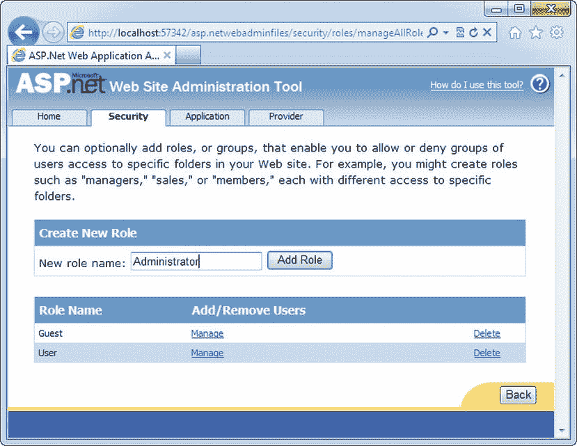

    [图 20-13](#_Fig13) 。创建角色

要将用户置于角色中，您需要返回到主安全页面(单击角色管理页面中的后退按钮)。然后按照以下步骤操作:

1.  从安全性选项卡中选择管理用户。您将看到您的网站的完整用户列表(细分为页面)。
2.  找到要更改的用户，然后单击该用户旁边的“编辑角色”链接。
3.  填写您要分配给该用户的每个角色的复选框。

[图 20-14](#Fig14) 显示了用户 joes 被赋予用户角色的例子。

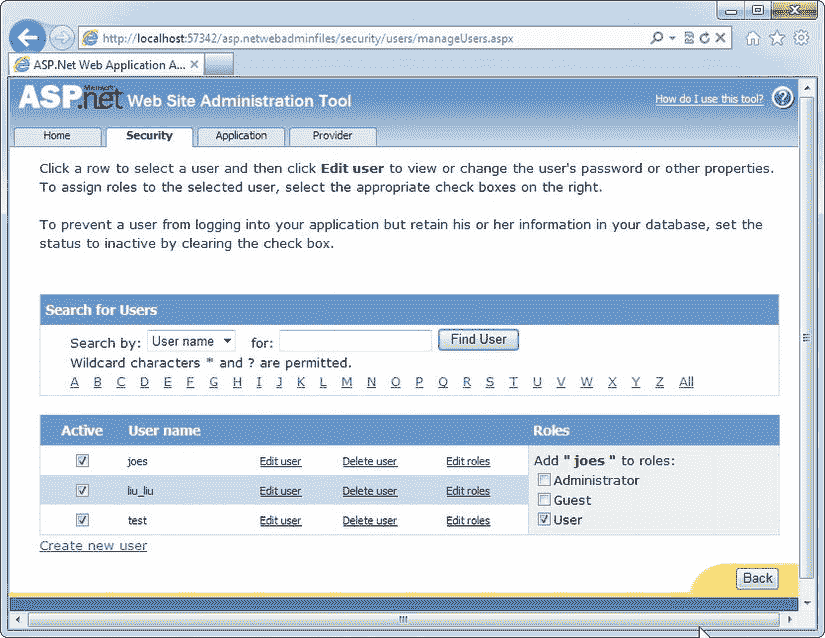

[图 20-14](#_Fig14) 。应用角色

当然，你不需要使用厕所。您也可以使用 Roles 类。Roles 类用于角色管理的目的与 Membership 类用于成员资格的目的相同:它提供了许多静态实用程序方法，允许您修改角色信息。表 20-9 列出了您可以使用的方法。

[表 20-9](#_Tab9) 。Roles 类的方法

| 方法 | 描述 |
| --- | --- |
| CreateRole() | 向数据库添加新角色。 |
| 删除角色() | 从数据库中删除现有角色。如果要删除当前已分配了成员的角色，可以先从角色中删除用户，或者使用接受 throwOnPopulatedRole 参数(必须设置为 false)的 DeleteRole()的重载版本。 |
| 角色存在() | 检查数据库中是否存在特定的角色名称。 |
| GetAllRoles() | 检索此应用的所有角色列表。 |
| AddUserToRole（）、AddUserToRoles（）、AddUsersToRole（） 和 AddUsersToRoles（） | 将一个角色分配给一个用户，一次将多个角色分配给一个用户，将一个角色分配给多个用户，或将多个角色分配给多个用户。如果要将一个角色分配给大量用户，最快的方法是使用 Membership 类检索相应的用户名(如果需要)，然后使用 Roles 类的 AddUsersToRole()或 AddUsersToRole()方法将更改一次应用到每个人。 |
| RemoveUserFromRole()、RemoveUserFromRoles()、RemoveUsersFromRole()和 RemoveUsersFromRoles() | 允许您从角色中删除用户。您可以一次对多个用户执行此操作，也可以一次从多个角色中删除一个用户，具体取决于您使用的方法。 |
| IsUserInRole() | 检查用户是否属于特定角色。 |
| GetRolesForUser() | 检索特定用户的所有角色。 |
| GetUsersInRole() | 检索属于特定角色的所有用户。 |
| FindUsersInRole() | 检索属于特定角色的所有用户(很像 GetUsersInRole())。但是，它允许您将结果限制为用户名中包含特定文本的用户。 |

例如，可以对 CreateUserWizard 控件使用以下事件处理程序，将新创建的用户分配到特定角色:

```cs
protected void CreateUserWizard1_CreatedUser(object sender, EventArgs e)
{
    Roles.AddUserToRole(CreateUserWizard1.UserName, "User");
}
```

基于角色的 限制访问

一旦创建并分配了角色，就需要调整应用以考虑角色信息。您可以使用几种技术:

*   您可以编写授权规则，明确拒绝特定页面或子文件夹中的特定角色。您可以通过将<authorization>部分添加到 web.config 文件中来手动编写这些规则，或者您可以通过单击 Manage Access Rules 链接在 WAT 的帮助下定义它们。</authorization>
*   您可以使用用户。IsInRole()方法来测试用户是否属于特定角色，然后决定是否允许某个操作或相应地显示某些内容。
*   您可以使用 LoginView 控件为不同的角色设置不同的内容。

在上一章中，你已经学会了如何使用前两种技术。例如，您已经知道如何编写限制特定组的 web.config 规则，如下所示:

```cs
<authorization>
    <deny users="?" />
    <deny roles="Guest" />
    <allow users="*" />
</authorization>
```

这些规则拒绝所有匿名用户和任何来宾角色的用户。记住，一个用户可能是多个角色的一部分，所以<deny>标签的顺序很重要。第一个匹配的规则决定是允许还是拒绝用户。</deny>

同样，你知道如何使用用户。IsInRole()方法进行编程授权决策:

```cs
private void Page_Load(Object sender, EventArgs e)
{
    lblMessage.Text = "You have reached the secured page, ";
    lblMessage.Text += User.Identity.Name + ".";
```

```cs
    if (User.IsInRole("Administrator"))
    {
        lblMessage.Text += "<br /><br />Congratulations:";
        lblMessage.Text += "you are an administrator.";
    }
}
```

唯一需要考虑的技术是 LoginView 控件。

LoginView 控件

LoginView 是一个视图控件，就像你在[第 10 章](10.html)中了解到的面板或多视图控件。区别在于用户不能选择使用哪个视图。相反，视图是基于用户的身份验证状态设置的。

使用 LoginView 最简单的方法是为经过身份验证的用户和匿名用户显示不同的内容。要使用这种设计，只需在控件的<anonymoustemplate>和<loggedintemplate>部分填充一些内容。这里有一个例子:</loggedintemplate></anonymoustemplate>

```cs
<asp:LoginView ID="LoginView1" runat="server">
    <AnonymousTemplate>
        <h1>You are anonymous</h1>
         Why don’t you <a href="Login.aspx">log in</a>?
    </AnonymousTemplate>
    <LoggedInTemplate>
        <h1>You are logged in</h1>
        <p>You are now ready to see this super-secret content.</p>
    </LoggedInTemplate>
</asp:LoginView>
```

[图 20-15](#Fig15) 显示了该控件出现的两种方式，这取决于用户当前是否登录。

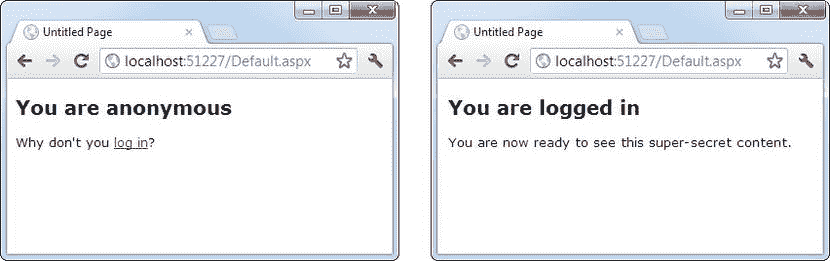

[图 20-15](#_Fig15) 。使用 LoginView 显示不同的内容

LoginView 还支持另一个标记 RoleGroups 标记。在 RoleGroups 标记内，添加一个或多个 RoleGroup 控件。每个角色组都专门映射到一个或多个角色。换句话说，当您使用 RoleGroups 模板时，您可以根据经过身份验证的用户所属的角色，为他们显示不同的内容。

这里有一个例子:

```cs
<asp:LoginView ID="LoginView1" runat="server">
    <AnonymousTemplate>
        <h1>You are anonymous</h1>
         Why don't you <a href="Login.aspx">log in</a>?
    </AnonymousTemplate>
    <RoleGroups>
        <asp:RoleGroup Roles="User, Guest">
            <ContentTemplate>
                <p>If you can see this, you are a member of the
                    User or Guest roles.</p>
            </ContentTemplate>
        </asp:RoleGroup>
        <asp:RoleGroup Roles="Administrator">
            <ContentTemplate>
                <p>Congratulations, you are an administrator.</p>
            </ContentTemplate>
        </asp:RoleGroup>
    </RoleGroups>
</asp:LoginView>
```

请记住，一个用户可以属于多个角色。但是，一次只能显示一个模板。将角色与 RoleGroup 匹配时，LoginView 控件按顺序遍历 RoleGroup 标记，并使用第一个匹配项。如果它找不到匹配，就使用普通的<loggedintemplate>。</loggedintemplate>

LoginView 是一个相当强大的控件。它为您提供了一种以声明方式将安全内容与普通内容分开的有效方法，也就是说，无需编写自定义代码来隐藏和显示标签。这种方法更清晰、更简洁，并且不容易出错。

最后一句话

ASP。NET 的成员特性给了你几个高级服务，这些服务与你在第 19 章中学到的基本表单认证和 Windows 认证系统一起工作。

在本章中，您了解了如何使用成员资格来维护用户数据库，无论是使用免费的 SQL Server Express Edition 还是其他版本的 SQL Server。您还了解了如何使用预构建的安全控件，这些控件为您提供了一种方便灵活的方式来添加用户管理功能和组织安全内容。最后，您考虑了如何将角色管理与成员资格结合使用，以准确地确定在您的应用中允许或不允许用户执行哪些操作。