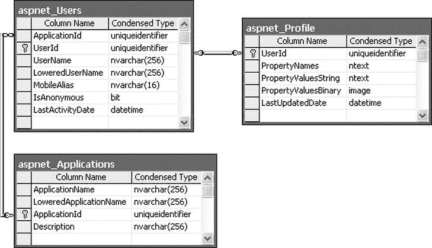
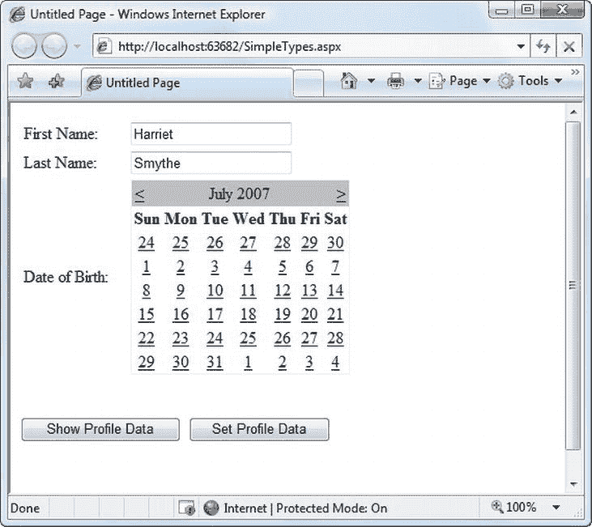
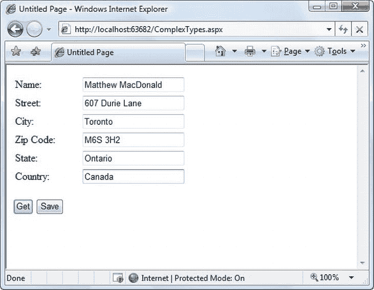
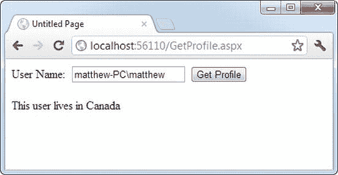
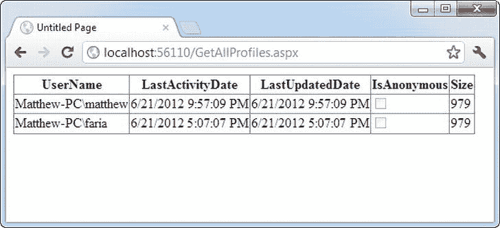

# 二十一、配置文件

您可以用多种方式为网站用户存储信息。在第 8 章中，您学习了如何使用视图状态、会话状态和 cookies 等技术在短时间内跟踪信息。但是如果您需要在两次访问之间存储信息，唯一现实的选择是服务器端数据库。使用您到目前为止所学的 ADO.NET 技巧，将客户地址和用户偏好等信息保存在数据库中并在以后检索是相当容易的。

数据库方法的唯一问题是，检索信息和更新记录的所有代码都由您来编写。这段代码并不十分复杂— [第 14 章](14.html)涵盖了你需要知道的一切——但是可能会很乏味。ASP.NET 包括一个功能，如果你能够在一定的限制范围内工作，它可以让你避免这种乏味。这个功能被称为*档案*，它被设计成自动跟踪用户特定的信息。

当您使用概要文件时，ASP.NET 处理检索您需要的信息并在数据库发生变化时更新数据库的单调工作。您不需要编写任何 ADO.NET 代码，甚至不需要设计适当的数据库表，因为 ASP.NET 会处理所有细节。最重要的是，配置文件功能集成了 ASP.NET 认证，因此当前登录用户的信息(称为该用户的*配置文件*)始终可用于您的网页代码。

profiles 特性的唯一缺点是它强迫你使用一个预置的数据库结构。这使您无法使用已经创建的表来存储特定于用户的详细信息，如果您想在其他应用或报告工具中使用相同的信息，这将带来新的挑战。如果锁定的结构太受限制，您唯一的选择是创建一个自定义的概要文件提供程序来扩展概要文件特性(这是一个更具挑战性的任务，超出了本书的范围),或者完全放弃概要文件，手动编写您自己的 ADO.NET 代码。

在这一章中，你将学习如何使用概要文件，概要文件系统如何工作，以及什么时候概要文件最有意义。

了解配置文件

概要文件和其他类型的状态管理之间最重要的区别 之一是概要文件被设计成永久存储信息，使用后端数据源，如数据库。大多数其他类型的状态管理旨在维护在相对较短的时间内(如会话状态)或在当前浏览器会话中(如视图状态和非持久 cookies)发生的一系列请求的信息，或者将信息从一个页面传输到另一个页面(如查询字符串和跨页发布)。如果您需要在数据库中长期存储信息，概要文件只是提供了一个方便的模型，为您管理这些信息的检索和持久性。

在您开始使用概要文件之前，您需要仔细地评估它们。在接下来的部分中，您将了解它们是如何叠加的。

概要性能

ASP 的目标。NET 的 profiles 特性提供了一种透明的方式来管理用户特定的信息，而不必强迫您使用 ADO.NET 数据类编写自定义的数据访问代码。不幸的是，许多看起来很方便的特性却面临着糟糕的性能或可伸缩性。对于概要文件来说，这是一个特别的问题，因为它们涉及到数据库访问，而数据库访问很容易成为任何 web 应用的可伸缩性瓶颈。

那么，概要文件会遇到可伸缩性问题吗？这个问题没有简单的答案。这完全取决于您需要存储多少数据以及您计划访问这些数据的频率。为了做出明智的决定，您需要对档案的工作原理有更多的了解。

概要文件以两种方式插入页面生命周期:

*   第一次在代码中访问 Profile 对象时，ASP.NET 会从数据库中检索当前用户的完整配置文件数据。如果您在同一个请求中多次读取配置文件信息，ASP.NET 会读取一次，然后重用它，从而避免您的数据库做不必要的额外工作。
*   如果更改任何配置文件数据，更新将推迟到页面处理完成后进行。此时(在页面的 PreRender、PreRenderComplete 和 Unload 事件触发之后)，配置文件被写回数据库。通过这种方式，多个更改被批处理到一个操作中。如果不更改概要文件数据，就不会产生额外的数据库工作。

总的来说，profiles 特性可能会导致每个请求两次额外的数据库访问(在读写场景中)，或者一次额外的数据库访问(如果您只是读取 profile 数据)。配置文件特性没有与缓存集成，所以每个使用配置文件数据的请求都需要一个数据库连接。

从性能的角度来看，当满足以下条件时，配置文件工作得最好:

*   访问配置文件数据的页面相对较少。
*   您存储了少量数据。

当下列情况成立时，它们往往不太好用:

*   您有大量的页面需要使用配置文件信息。
*   您存储了大量数据。如果您只需要在一个给定的请求中使用其中的一些数据，那么它们的效率会特别低(因为概要文件模型总是检索整个概要文件数据块)。

当然，您可以将概要文件与另一种类型的状态管理结合起来。例如，假设您的网站包含一个订单向导，它会引导用户完成几个步骤。在这个过程的开始，您可以检索配置文件信息并将其存储在会话状态中。然后，您可以在该过程的剩余部分使用会话集合。假设您使用进程内或进程外状态服务器来维护会话数据，这种方法更有效，因为它使您不必重复连接数据库。

配置文件如何存储数据

使用概要文件时最大的限制与性能没有任何关系；相反，它限制了概要文件的序列化方式。ASP.NET 附带的默认配置文件提供程序将配置文件信息序列化为数据块，该数据块插入到数据库记录的单个字段中。例如，如果您序列化地址信息，您将得到如下结果:

```cs
Marty Soren315 Southpart DriveLompocCalifornia93436U.S.A.
```

另一个字段指示每个值的开始和结束位置，格式如下:

```cs
Name:S:0:11:Street:S:11:19:City:S:30:6:State:S:36:10:ZipCode:S:46:5:Country:S:51:6
```

本质上，这个字符串标识了值(名称、街道、城市等)、存储方式(S 表示字符串)、起始位置和长度。所以这根弦的第一部分

```cs
Name:S:0:11
```

指示第一个配置文件属性是 Name，它存储为字符串，从位置 0 开始，长度为 11 个字符。

虽然这种方法使您能够灵活地存储几乎任何数据组合，但它使在其他应用中使用这些数据变得更加困难。您可以编写自定义代码来解析配置文件数据以找到您想要的信息，但是根据数据量和您使用的数据类型，这可能是一个非常繁琐的过程。即使你这样做了，你在重用这些信息的方式上仍然受到限制。例如，假设您使用配置文件来存储客户地址信息。由于这种专有格式，在 Microsoft Word 等应用中生成客户列表或使用这种配置文件数据执行过滤或排序记录的查询已不再可能。(例如，您不能轻松地执行查询来查找居住在特定城市的所有客户。)

这个问题有两种解决方案:

*   使用您自己的自定义 ADO.NET 代码，而不是配置文件。
*   创建一个定制的配置文件提供程序，用于使用您的数据库模式存储信息。

在这两个选项中，创建自定义数据访问组件更容易，并且它为您提供了更多的灵活性。您可以将您数据组件设计成具有您想要的任何接口，然后您可以将该组件与其他组件一起重用。NET 应用。

第二个选项很有趣，因为它允许您的页面继续使用概要文件模型。事实上，您可以通过 SqlProfileProvider 创建一个使用标准配置文件序列化的应用，然后在以后切换到使用自定义提供程序。要实现这种转换，您不需要更改任何代码。相反，您只需修改 web.config 文件中的配置文件设置。随着网站使用配置文件功能变得越来越普遍，自定义配置文件提供商将变得越来越有吸引力。

 **注意**考虑哪种类型的数据最适合一个概要文件也很重要。与许多其他类型的状态管理一样，您可以将任何可序列化的类型存储到配置文件中，包括简单类型和自定义类。

配置文件与其他类型的状态管理之间的一个重要区别是，配置文件存储为单独的记录，每个记录都由用户名唯一标识。这意味着概要文件要求您使用某种认证系统。使用什么类型的身份验证系统(Windows、forms 或自定义身份验证系统)没有任何区别；唯一的要求是为经过身份验证的用户分配一个唯一的用户名。该用户名用于在数据库中查找匹配的配置文件记录。

 **注**在本章后面的“匿名配置文件”一节中，您将了解匿名识别功能如何让您临时存储未登录用户的配置文件信息。

当决定是否使用概要文件时，很自然地要将概要文件的特性与你在第 14 章[中编写的自定义数据访问代码进行比较(以及你将在第 22 章](14.html)[中学习构建的数据库组件)。显然，编写自己的 ADO.NET 代码要灵活得多。它允许您存储其他类型的信息，并执行更复杂的业务任务。例如，一个电子商务网站实际上可以使用配置文件来维护客户地址信息(有上一节讨论的限制)。但是，您不会使用配置文件来存储以前订单的信息。它不仅信息太多，无法有效存储，而且操作起来也很笨拙。](22.html)

使用 SqlProfileProvider

SqlProfileProvider 允许您将配置文件信息存储在 SQL Server 数据库中。您可以选择在任何数据库中创建配置文件表。但是，您不能更改任何其他数据库模式细节，这意味着您被限制在特定的表名、列名和序列化格式中。

从开始到结束，您需要执行以下步骤 来使用概要文件:

1.  为网站的一部分启用鉴定。
2.  配置配置文件提供程序。(如果您使用的是 SQL Server Express，此步骤是可选的。默认情况下，配置文件处于启用状态。)
3.  创建配置文件表。(如果您使用的是 SQL Server Express，则不需要此步骤。)
4.  定义一些配置文件属性。
5.  在网页代码中使用配置文件属性。

您将在接下来的部分中处理这些步骤。

启用认证

因为配置文件存储在特定于用户的记录中，所以在读取或写入配置文件信息之前，您需要对当前用户进行身份验证。您可以使用任何类型的身份验证系统，包括基于 Windows 的身份验证和基于窗体的身份验证。配置文件系统并不关心——它只是将特定于用户的信息存储在基于用户名识别的记录中。由于每个身份验证系统都通过用户名唯一地标识用户，因此任何身份验证系统都可以工作。

以下 web.config 文件使用 Windows 身份验证:

```cs
<configuration>
 . . .
 <system.web>
    . . .
    <authentication mode="Windows"/>
    <authorization>
     <deny users="?"/>
    </authorization>
 </system.web>
</configuration>
```

因为此示例使用 Windows 身份验证，所以不需要为每个用户创建记录。相反，您可以使用在 web 服务器上定义的现有 Windows 用户帐户。这种方法还使您不必创建登录页面，因为浏览器会处理登录过程。(有关 Windows 认证的更多信息，请参考[第 19 章](19.html)。)

如果您决定使用表单验证，您需要决定是使用您自己的自定义用户列表([第 19 章](19.html))还是结合成员资格特性([第 20 章](20.html))来执行验证。在大多数情况下，成员资格和配置文件特性是结合使用的——毕竟，如果您使用配置文件特性来自动存储特定于用户的信息，为什么不将用户凭证列表(用户名和密码)自动存储在同一个数据库中呢？

 **提示**本章的可下载示例展示了在一个使用表单身份验证的站点和另一个使用 Windows 身份验证的站点中运行的概要文件。

一旦您选择了您的身份验证系统(并处理了任何其他必要的杂务，如创建用户列表和生成您的登录页面)，您就可以使用配置文件了。请记住，配置文件存储用户特定的信息，因此用户需要在他们的配置文件可用之前进行身份验证。在前面显示的 web.config 文件中，授权规则通过拒绝所有匿名用户来确保这一点。

使用 SQL Server Express

在前一章中，您了解到配置 web 应用以使用 SQL Server Express(Visual Studio 附带的 SQL Server 免费版本)的成员资格不需要任何特殊步骤。侧面也是如此。

使用 SQL Server Express 时，ASP.NET 将配置文件信息存储在自动生成的名为 aspnetdb.mdf 的数据库文件中。如果该文件不存在，则会在您首次使用任何成员资格或配置文件功能时创建该文件，并将其放在 web 应用的 App_Data 子目录中。最棒的是，您不需要完成任何额外的配置步骤，因为默认情况下，ASP.NET 被配置为使用 SQL Server 和配置文件。

使用 SQL Server 的完整版本

这种自动创建数据库的功能依赖于 SQL Server Express。如果您使用 SQL Server 的非 Express 版本 ，您必须手动创建所需的数据库，并在 web.config 文件中显式配置 profiles 特性。

默认情况下，用于配置文件的连接字符串名为 LocalSqlServer。您可以直接在 machine.config 文件中编辑此连接字符串。但是，如果您只需要调整一个应用，那么最好为您的 web 应用调整 web.config 文件。

为此，您需要使用 web 应用的 web.config 文件中的<clear>元素删除所有现有的连接字符串。然后，再次添加 LocalSqlServer 连接字符串，但这次使用正确的值:</clear>

```cs
<configuration>
    <connectionStrings>
        <clear />
        <add name="LocalSqlServer" providerName="System.Data.SqlClient"
connectionString="Data Source=localhost;Integrated Security=SSPI;
Initial Catalog=aspnetdb" />
    </connectionStrings>
    . . .
</configuration>
```

这与您在第 20 章中使用的过程相同，因为成员资格特性和配置文件特性都使用 LocalSqlServer 连接字符串。在此示例中，新的连接字符串用于 SQL Server 的完整版本。它使用本地计算机上名为 aspnetdb 的数据库。

然后，您需要使用 aspnet_regsql.exe 命令行实用工具创建 aspnetdb 数据库。该工具允许您为其他 ASP.NET 功能生成数据库，如基于 SQL Server 的会话状态、成员资格、角色、数据库缓存依赖项和 Web 部件个性化。您可以在 c:\Windows\Microsoft 中找到 aspnet_regsql.exe 工具。NET\Framework\[Version]文件夹(其中[Version]是安装的 ASP.NET 版本，如 v4.0.30319)。

要创建概要文件所需的表、视图和存储过程，可以使用-A p 命令行选项。您可能需要提供的其他详细信息包括服务器位置(-S)、数据库名称(-d)和连接到数据库的身份验证信息(使用-U 和-P 提供密码和用户名，或使用-E 使用当前的 Windows 帐户)。如果省略服务器位置和数据库名称，aspnet_regsql.exe 将使用当前计算机上的默认实例，并创建一个名为 aspnetdb 的数据库。

使用 aspnet_regsql 最简单的方法是打开 Visual Studio 命令提示符。为此，打开开始菜单，选择所有程序Microsoft Visual Studio 2010Visual Studio 工具 Visual Studio 命令提示符。以下示例在当前计算机上的 SQL Server 数据库服务器中创建一个名为 aspnetdb 的数据库。它添加了所有 ASP.NET 表，包括用于成员资格、基于角色的身份验证和配置文件的表:

```cs
aspnet_regsql.exe -S (local) -E -A all
```

如果要使用不同的数据库，必须使用-d 参数指定数据库名称。无论哪种方式，您都应该使用一个不包含任何其他自定义表的新的空白数据库。这是因为 aspnet_regsql.exe 为概要文件创建了几个表(见下一节中的[表 21-1](#Tab1) ),您不应该冒险将它们与业务数据混淆。

[表 21-1](#_Tab1) 。用于配置文件的数据库表

| 表名 | 描述 |
| --- | --- |
| aspnet _ 应用 | 列出在此数据库中有记录的所有 web 应用。几个 aspnetdb 应用可以使用同一个 aspnetdb 数据库。在这种情况下，您可以选择分离配置文件信息，使每个应用都不同(通过在注册配置文件提供程序时给每个应用一个不同的应用名称)或共享它(通过给每个应用相同的应用名称)。 |
| aspnet_Profile | 存储用户特定的配置文件信息。每个记录包含单个用户的完整配置文件信息。PropertyNames 字段列出了属性名称，PropertyValuesString 和 PropertyValuesBinary 字段列出了所有属性数据，但是如果您希望解析这些信息以便在其他 non-ASP.NET 程序中使用，您还需要做一些工作。每个记录还包括上次更新的日期和时间(LastUpdatedDate)。 |
| aspnet_SchemaVersions | 列出了存储配置文件信息所支持的架构。在未来，这将允许新版本的 ASP.NET 提供新的方式来存储配置文件信息，而不会中断对仍在使用的旧配置文件数据库的支持。 |
| aspnet _ 用户 | 列出用户名并将它们映射到 aspnet_Applications 中的某个应用。还记录最后一次请求的日期和时间(LastActivityDate)以及该记录是否是为匿名用户自动生成的(IsAnonymous)。您将在本章的后面部分(在“匿名配置文件”一节中)了解更多关于匿名用户支持的信息。 |

 **注意**这个命令行使用-A *all* 选项为所有 ASP。NET 的数据库特性，包括配置文件和成员资格。您也可以选择一次只为一个要素添加表。有关-A 和其他可用于 aspnet_regsql 的命令行参数的更多信息，请参考第 20 章中的表 20-2。

配置文件数据库

无论您是使用 aspnet_regsql 自己创建配置文件数据库，还是使用 SQL Server Express 并让 aspnet 自动创建它们，您最终都会得到相同的表。表 21-1 简要描述了它们。(相当无趣的观点不包括在内。)

如果您想查看这些表中的数据，您可以像查看第 20 章中的会员数据库一样查看这个数据库。然而，内容并没有太多的兴趣，因为 ASP.NET 自动管理它们。存储在配置文件中的所有信息都被合并到一条记录中，并悄悄地放在名为 aspnet_Profile 的表中名为 PropertyValuesString 的字段中。

[图 21-1](#Fig1) 显示了最重要的轮廓表之间的关系。



[图 21-1](#_Fig1) 。概况表

定义轮廓属性

在存储任何配置文件信息之前，您需要明确定义要存储的内容。您可以通过在 web.config 文件的<profile>部分添加<properties>元素来实现这一点。在<properties>元素中，为您想要存储的每条特定于用户的信息放置一个<add>标记。至少，<add>元素为属性提供名称，如下所示:</add></add></properties></properties></profile>

```cs
<configuration>
 . . .
 <system.web>
    . . .
    <profile>
     <properties>
        <add name="FirstName"/>
        <add name="LastName"/>
     </properties>
    </profile>
 </system.web>
</configuration>
```

通常，您还需要提供数据类型。(如果没有，该属性将被视为字符串。)可以指定任何可序列化的。NET 数据类型，如下所示:

```cs
<add name="FirstName" type="System.String"/>
<add name="LastName" type="System.String"/>
<add name="DateOfBirth" type="System.DateTime"/>
```

您可以设置更多的属性属性来创建更多的高级属性，如[表 21-2](#Tab2) 所示。

[表 21-2](#_Tab2) 。个人资料属性

| 属性(用于<add>元素)</add> | 描述 |
| --- | --- |
| 名字 | 属性的名称。 |
| 类型 | 表示此属性的数据类型的完全限定类名。默认情况下，这是 System.String。 |
| 序列化 a | 序列化此值时使用的格式(字符串、二进制、Xml 或 ProviderSpecific)。在“概要文件序列化”一节中，您将更详细地了解序列化模型 |
| 只读的 | 一个布尔值，它决定一个值是否是可变的。如果为 true，则可以读取该属性，但不能更改。(试图更改属性将导致编译时错误。)默认情况下，这是 false。 |
| 缺省值 | 如果配置文件不存在或不包含此特定信息，将使用默认值。默认值对序列化没有影响—如果设置了配置文件属性，ASP.NET 会将当前值提交给数据库，即使它们与默认值匹配。 |
| 是否允许匿名 | 一个布尔值，它指示该属性是否可用于本章后面讨论的匿名配置文件功能。默认情况下，这是假的。 |
| 供应者 | 应该用于管理此属性的配置文件提供程序。默认情况下，所有属性都使用在<profile>元素中指定的提供者进行管理，但是您可以为不同的提供者分配不同的属性。</profile> |

使用轮廓属性

有了这些详细信息，就可以使用当前页面的 profile 属性访问配置文件信息了。当您运行您的应用时，ASP.NET 创建了一个新的类，通过从系统派生来表示概要文件。Web.Profile.ProfileBase，它包装了配置文件设置的集合。ASP.NET 为您在 web.config 文件中定义的每个配置文件属性添加了一个强类型属性。这些强类型属性只需调用 ProfileBase 基类的 GetPropertyValue()和 SetPropertyValue()方法来检索和设置相应的配置文件值。

例如，如果您定义了一个名为 FirstName 的字符串属性，您可以在页面中像这样设置它:

```cs
Profile.FirstName = "Henry";
```

[图 21-2](#Fig2) 展示了一个完整的测试页面，允许用户显示当前用户的档案信息或设置新的档案信息。



[图 21-2](#_Fig2) 。测试配置文件功能

第一次运行该页面时，不会检索任何配置文件信息，也不会使用任何数据库连接。但是，如果单击“显示概要文件数据”按钮，将检索概要文件信息并显示在页面上:

```cs
protected void cmdShow_Click(object sender, EventArgs e)
{
    lbl.Text = "First Name: " + Profile.FirstName + "<br />" +
     "Last Name: " + Profile.LastName + "<br />" +
     "Date of Birth: " + Profile.DateOfBirth.ToString("D");
}
```

此时，如果配置文件数据库丢失或连接无法打开，将会出现错误。否则，您的页面将顺利运行，并且您将看到新检索的配置文件信息。从技术上讲，当您的代码访问概要文件时，会检索到完整的概要文件。FirstName 属性放在第一行，用于后续的代码语句。

 **注意**配置文件属性的行为类似于任何其他类成员变量。这意味着如果您读取一个尚未设置的配置文件值，您将获得一个默认的初始化值(比如一个空字符串或 0)。

如果单击设置配置文件数据按钮，将根据当前控制值设置配置文件信息:

```cs
protected void cmdSet_Click(object sender, EventArgs e)
{
    Profile.FirstName = txtFirst.Text;
    Profile.LastName = txtLast.Text;
    Profile.DateOfBirth = Calendar1.SelectedDate;
}
```

现在，当页面请求完成时，配置文件信息被提交给数据库。如果您想更早地提交部分或全部信息(可能会导致多次数据库访问)，只需调用概要文件。Save()方法。正如您所看到的，概要文件功能的简单性是无与伦比的。

 **提示**概要文件对象不仅仅包括你已经定义的属性。它还使用从数据库中提取的信息，提供属性 LastActivityDate(上次使用该配置文件的时间)和 LastUpdatedDate(上次更改该配置文件的时间)。

档案序列化

前面，您学习了如何将属性序列化为单个字符串。例如，如果您将名字保存为 Harriet，姓氏保存为 Smythe，则这两个值会一起出现在数据库中 aspnet_Profile 表的 PropertyValuesString 字段中，如下所示:

```cs
HarrietSmythe
```

PropertyNames 字段(也在 aspnet_Profile 表中)提供了解析 PropertyValuesString 字段中的每个值所需的信息。在本例中，您将在 PropertyNames 字段中看到以下内容:

```cs
FirstName:S:0:7:LastName:S:7:6:
```

冒号(:)用作分隔符。基本格式如下:

```cs
PropertyName:StringOrBinarySerialization:StartingCharacterIndex:Length:
```

如果创建一个 DateTime 数据类型的配置文件，会发生一些有趣的事情，如下所示:

```cs
<add name="DateOfBirth" type="System.DateTime" serializeAs="String"/>
<add name="FirstName" type="System.String" serializeAs="Xml"/>
<add name="LastName" type="System.String" serializeAs="Xml"/>
```

现在，当您查看 PropertyValuesString 字段时，您会看到类似这样的内容:

```cs
<?xml version="1.0" encoding="utf-16"?><dateTime>2007-07-12T00:00:00-04:00
</dateTime>HarrietSmythe
```

最初，看起来配置文件数据被序列化为 XML，但是 PropertyValuesString 显然不包含有效的 XML 文档(因为末尾有文本)。实际发生的情况是，第一条信息 DateTime 被序列化(默认情况下)为 XML。以下两个配置文件属性被序列化为普通字符串。

PropertyNames 字段使它稍微清楚一些:

```cs
DateOfBirth:S:0:81:FirstName:S:87:7:LastName:S:94:6:
```

有趣的是，通过将 serializeAs 属性添加到 web.config 文件中的声明中，您可以更改任何配置文件属性的序列化格式。表 21-3 列出了你的选择。

[表 21-3](#_Tab3) 。序列化选项

| 序列化 a | 描述 |
| --- | --- |
| 线 | 将类型转换为字符串表示形式。需要可以处理该作业的类型转换器。 |
| 可扩展标记语言 | 使用系统将类型转换为存储在字符串中的 XML 表示形式。XML . XML serialization . XML serializer(与 web 服务使用的类相同)。 |
| 二进制的 | 将类型转换为专有的二进制表示形式。NET 理解使用 system . runtime . serialization . formatters . binary . binary formatter。这是最紧凑的选项，但最不灵活。二进制数据存储在 PropertyValuesBinary 字段中，而不是 PropertyValues 字段中。 |
| 特定于提供者 | 执行在自定义提供程序中实现的自定义序列化。 |

例如，以下是如何更改配置文件设置的序列化:

```cs
<add name="DateOfBirth" type="System.DateTime" serializeAs="String"/>
<add name="FirstName" type="System.String" serializeAs="Xml"/>
<add name="LastName" type="System.String" serializeAs="Xml"/>
```

现在，下次设置配置文件时，PropertyValuesString 字段中的序列化表示将存储 FirstName 和 LastName 的信息。它采取这种形式:

```cs
2007-06-27<?xml version="1.0" encoding="utf-16"?><string>Harriet</string>
<?xml version="1.0" encoding="utf-16"?><string>Smythe</string>
```

如果使用二进制序列化模式，属性值将放在 PropertyValuesBinary 字段中，而不是 PropertyValuesString 字段中。以下是 FirstName 属性在 PropertyValuesBinary 字段中序列化的示例:

```cs
<add name="DateOfBirth" type="System.DateTime" serializeAs="String"/>
<add name="FirstName" type="System.String" serializeAs="Binary"/>
<add name="LastName" type="System.String" serializeAs="String"/>
```

这种变化的唯一迹象是在 PropertyNames 字段中使用字母 *B* 而不是 *S* (以及需要更少字节的事实):

```cs
DateOfBirth:S:0:9:FirstName:B:0:31:LastName:S:9:64:
```

所有这些序列化细节都提出了一个重要的问题:当您更改概要文件属性或它们的序列化方式时会发生什么？配置文件属性不支持版本控制。但是，您可以添加或删除属性，而不会产生太大的影响。例如，aspnet 将忽略出现在 aspnet_Profile 表中但未在 web.config 文件中定义的属性。下次修改部分配置文件时，这些属性将被新的配置文件信息替换。类似地，如果您在 web.config 文件中定义了一个在序列化概要文件信息中不存在的概要文件，ASP.NET 将只使用默认值。但是，当您尝试读取配置文件信息时，更剧烈的更改(如重命名属性、更改其数据类型等)可能会导致异常。更糟糕的是，因为概要文件信息的序列化格式是专有的，所以您没有简单的方法将现有的概要文件数据迁移到新的概要文件结构中。

 **提示**不是所有的类型在所有方面都是可序列化的。例如，不提供无参数构造函数的类不能在 Xml 模式下序列化。没有 Serializable 属性的类不能在二进制模式下序列化。当您考虑如何将自定义类型与概要文件一起使用时，您将会考虑到这种区别(请参见“概要文件和自定义数据类型”一节)，但是现在请记住，您可能会遇到只有在选择不同的序列化模式时才能序列化的类型。

配置文件组

如果您有大量的配置文件设置，并且有些设置在逻辑上相互关联，您可能希望使用配置文件组来实现更好的组织。

例如，您可能有一些处理用户首选项的属性和一些处理运输信息的属性。下面是如何使用<group>元素组织这些配置文件属性:</group>

```cs
<profile>
 <properties>
    <group name="Preferences">
     <add name="LongDisplayMode" defaultValue="true" type="Boolean" />
     <add name="ShowSummary" defaultValue="true" type="Boolean" />
    </group>
    <group name="Address">
     <add name="Name" type="String" />
     <add name="Street" type="String" />
     <add name="City" type="String" />
     <add name="ZipCode" type="String" />
     <add name="State" type="String" />
     <add name="Country" type="String" />
    </group>
 </properties>
</profile>
```

现在，您可以通过代码中的组名来访问这些属性。例如，以下是检索国家信息的方式:

```cs
lblCountry.Text = Profile.Address.Country;
```

团体实际上只是一个穷人对成熟的习俗结构或阶级的替代。例如，您可以通过声明一个自定义地址类来实现与上一个示例相同的效果。您还可以添加其他特性(比如属性过程中的验证)。下一节将展示如何操作。

配置文件和自定义数据类型

使用带有概要文件的自定义类很容易。您需要从创建包装您需要的信息的类开始。在您的类中，您可以使用公共成员变量或成熟的属性过程。后一种选择虽然较长，但却是首选，因为它确保您的类支持数据绑定，并使您可以灵活地在以后添加属性过程代码。

这里有一个地址类，它使用自动属性来减少代码量，将您在前一个示例中看到的相同信息联系在一起:

```cs
[Serializable()]
public class Address
{
    public string Name {get; set;}
    public string Street {get; set;}
    public string City {get; set;}
    public string ZipCode { get; set; }
    public string State {get; set;}
    public string Country {get; set;}
```

```cs
    public Address(string name, string street, string city,
     string zipCode, string state, string country)
    {
        Name = name;
        Street = street;
        City = city;
        ZipCode = zipCode;
        State = state;
        Country = country;
    }
```

```cs
    public Address()
    { }
}
```

您可以将这个类放在 App_Code 目录中。最后一步是添加使用它的属性:

```cs
<properties>
 <add name="Address" type="Address" />
</properties>
```

现在您可以创建一个使用 Address 类的测试页面。[图 21-3](#Fig3) 显示了一个简单的例子，允许你加载、改变和保存地址信息。



[图 21-3](#_Fig3) 。编辑个人资料中的复杂信息

下面是使这成为可能的页面类:

```cs
public partial class ComplexTypes : System.Web.UI.Page
{
    protected void Page_Load(object sender, EventArgs e)
    {
        if (!Page.IsPostBack)
         LoadProfile();
    }
```

```cs
    protected void cmdGet_Click(object sender, EventArgs e)
    {
        LoadProfile();
    }
```

```cs
    private void LoadProfile()
    {
        txtName.Text = Profile.Address.Name;
        txtStreet.Text = Profile.Address.Street;
        txtCity.Text = Profile.Address.City;
        txtZip.Text = Profile.Address.ZipCode;
        txtState.Text = Profile.Address.State;
        txtCountry.Text = Profile.Address.Country;
    }
```

```cs
    protected void cmdSave_Click(object sender, EventArgs e)
    {
        Profile.Address = new Address(txtName.Text,
                         txtStreet.Text, txtCity.Text, txtZip.Text,
                         txtState.Text, txtCountry.Text);
    }
```

```cs
}
```

剖析代码。。。

*   当页面加载时(以及当用户单击 Get 按钮时)，概要文件信息从概要文件中复制。地址对象添加到各个文本框中。一个私有的 LoadProfile()方法处理这个任务。
*   用户可以更改文本框中的地址值。但是，直到用户单击保存按钮，更改才会被提交。
*   当单击 Save 按钮时，使用接受姓名、街道、城市、邮政编码、州和国家信息的构造函数创建一个新的 Address 对象。然后将该对象指定给该配置文件。地址属性。您可以修改当前概要文件的每个属性，而不是使用这种方法。地址对象来匹配文本值。
*   当请求结束时，配置文件对象的内容会自动保存到数据库中。不需要额外的工作。

自定义类型序列化

您需要记住几点，这取决于您决定如何序列化您的自定义类。默认情况下，所有自定义数据类型都使用 XmlSerializer 进行 XML 序列化。该类的序列化能力相对有限。它只是将每个公共属性或成员变量的值复制到一个简单的 XML 格式中，如下所示:

```cs
<Address>
 <Name>. . .</Name>
 <Street>. . .</Street>
 <City>. . .</City>
 <ZipCode>. . .</ZipCode>
 <State>. . .</State>
 <Country>. . .</Country>
</Address>
```

反序列化类时，XmlSerializer 需要能够找到无参数的公共构造函数。此外，您的所有属性都不能是只读的。如果您违反了这些规则中的任何一条，反序列化过程将会失败。

如果您决定使用二进制序列化而不是 XmlSerialization，。NET 使用完全不同的方法:

```cs
<add name="Address" type="Address" serializeAs="Binary"/>
```

在这种情况下，ASP.NET 寻求二进制格式化程序的帮助。BinaryFormatter 可以序列化任何类的完整公共和私有内容，只要该类是用<serializable>属性修饰的。此外，它所派生或引用的任何类也必须是可序列化的。</serializable>

自动保存

profiles 特性不能检测复杂数据类型(除了字符串、简单数字类型、布尔值等之外的任何数据类型)的变化。这意味着，如果您的配置文件包含复杂的数据类型，ASP.NET 会在每次访问配置文件对象的请求结束时保存完整的配置文件信息。

这种行为显然增加了不必要的开销。要在处理复杂类型时优化性能，您有几种选择。一种方法是在 web.config 文件中将相应的配置文件属性设置为只读(如果您知道该属性从不更改)。另一种方法是通过在<profile>元素上添加 automaticSaveEnabled 属性并将其设置为 false 来完全禁用 autosave 行为，如下所示:</profile>

```cs
<profile defaultProvider="SqlProvider" automaticSaveEnabled="false">. . .</profile>
```

如果您选择这种方法，则由您来调用 Profile。Save()显式提交更改。通常，这种方法是最方便的，因为很容易发现代码中修改概要文件的地方。只需添加个人资料。Save()调用结束:

```cs
Profile.Address = new Address(txtName.Text, txtStreet.Text, txtCity.Text,
 txtZip.Text, txtState.Text, txtCountry.Text);
Profile.Save();
```

例如，你可以修改前面的例子(如图 21-3 中的[所示),只在地址信息改变时保存它。最简单的方法是禁用自动保存，但调用配置文件。单击 Save 按钮时的 Save()。你也可以处理文本框。TextChanged 事件来确定何时进行更改，并在此时立即保存配置文件。](#Fig3)

配置文件 API

尽管您的页面会自动获取当前用户的配置文件信息，但这并不妨碍您检索和修改其他用户的配置文件。事实上，您有两个工具可以帮助您:ProfileBase 类和 ProfileManager 类。

配置文件对象(由页面提供。Profile 属性)包含一个有用的 GetProfile()方法，该方法通过用户名检索特定用户的配置文件信息。图 21-4 显示了一个 Windows 认证用户的例子。



[图 21-4](#_Fig4) 。手动检索配置文件

下面是获取概要文件的代码:

```cs
protected void cmdGet_Click(object sender, EventArgs e)
{
    ProfileCommon profile = Profile.GetProfile(txtUserName.Text);
    lbl.Text = "This user lives in " + profile.Address.Country;
}
```

GetProfile()返回一个 ProfileCommon 对象。但是，您不会在。NET 类库。这是因为 ProfileCommon 是一个动态生成的类，ASP.NET 创建它来保存 web 应用的配置文件信息。在这个例子中，配置文件定义了一个名为 Address 的属性，这样您就可以使用 ProfileCommon 来检索这个信息。地址属性。

注意，一旦有了 ProfileCommon 对象，就可以像与当前用户的配置文件交互一样与它交互(毕竟，它是相同的对象类型)。你甚至可以做出改变。唯一的区别是更改不会自动保存。如果要保存更改，需要调用 ProfileCommon 对象的 save()方法。ProfileCommon 还添加了 LastActivityDate 和 LastUpdatedDate 属性，您可以使用它们来确定上次访问和修改特定配置文件的时间。

如果您试图检索一个不存在的概要文件，您不会得到一个错误。相反，您只会得到空白数据(例如，空字符串)。如果您更改并保存配置文件，将创建一个新的配置文件记录。

您可以通过检查 ProfileCommon 来测试这种情况。LastUpdatedDate 属性。如果还没有创建概要文件，这个值将是一个零日期值(换句话说，0001 年第 1 个月的第 1 天)。下面是您应该使用的代码:

```cs
protected void cmdGet_Click(object sender, EventArgs e)
{
    ProfileCommon profile = Profile.GetProfile(txtUserName.Text);
    if (profile.LastUpdatedDate == DateTime.MinValue)
    {
        lbl.Text = "No user match found.";
    }
    else
    {
        lbl.Text = "This user lives in " + profile.Address.Country;
    }
}
```

如果您需要使用概要文件执行其他任务，您可以使用系统中的 ProfileManager 类。Web.Profile 名称空间，它公开了[表 21-4](#Tab4) 中描述的有用的静态方法。这些方法中的许多都使用 ProfileInfo 类，该类提供有关配置文件的信息。ProfileInfo 包括用户名(user name)、上次更新和上次活动日期(LastUpdatedDate 和 LastActivityDate)、以字节为单位的配置文件大小(size)以及该配置文件是否用于匿名用户(IsAnonymous)。它不提供实际的配置文件值。

[表 21-4](#_Tab4) 。ProfileManager 方法

| 方法 | 描述 |
| --- | --- |
| 删除配置文件() | 删除您指定的用户的配置文件。 |
| 删除配置文件() | 一次删除多个配置文件。您提供了一个用户名集合。 |
| DeleteInactiveProfiles() | 删除自您指定的时间以来未使用过的配置文件。您还必须提供 ProfileAuthenticationOption 枚举中的值，以指示要删除的配置文件类型(全部、匿名或已验证)。 |
| GetNumberOfProfiles() | 返回数据源中的配置文件记录数。您必须提供 ProfileAuthenticationOption 枚举中的一个值，该值指示您是否还希望查看已验证的配置文件(已验证)、匿名配置文件(匿名)或两者(全部)。 |
| GetNumberOfInactiveProfiles() | 返回自您指定的时间以来未被使用的配置文件的数量。您必须提供 ProfileAuthenticationOption 枚举中的值。 |
| GetAllInactiveProfiles() | 检索自您指定的时间以来尚未使用的配置文件的配置文件信息。您必须提供 ProfileAuthenticationOption 枚举中的值。配置文件作为 ProfileInfo 对象返回。 |
| GetAllProfiles() | 将数据源中的所有配置文件数据作为 ProfileInfo 对象的集合进行检索。您可以选择要检索的配置文件类型(全部、匿名或已验证)。您也可以使用此方法的重载版本，该版本使用分页，并根据您请求的起始索引和页面大小仅检索完整记录集的一部分。 |
| FindProfilesByUserName() | 检索与特定用户名匹配的 ProfileInfo 对象的集合。SqlProfileProvider 在尝试匹配用户名时使用 LIKE 子句，这意味着您可以使用通配符，如%符号。例如，如果您搜索用户名 user%，您将返回诸如 user1、user2、user_guest 等值。您可以使用此方法的重载版本，该版本使用分页。 |
| FindInactiveProfilesByUserName() | 检索自您指定的时间以来尚未使用的配置文件的配置文件信息。您还可以过滤掉某些类型的配置文件(全部、匿名或已验证)或查找特定的用户名(使用通配符匹配)。返回值是 ProfileInfo 对象的集合。 |

例如，如果您想要删除当前用户的配置文件，您只需要一行代码:

```cs
ProfileManager.DeleteProfile(User.Identity.Name);
```

如果您想在网页中显示完整的用户列表(不包括匿名用户)，只需添加一个将 AutoGenerateColumns 设置为 true 的 GridView，并使用以下代码:

```cs
protected void Page_Load(object sender, EventArgs e)
{
    gridProfiles.DataSource = ProfileManager.GetAllProfiles(
     ProfileAuthenticationOption.Authenticated);
    gridProfiles.DataBind();
}Figure 21-5 shows the result.
```



[图 21-5](#_Fig5) 。检索有关数据源中所有配置文件的信息

匿名档案

到目前为止，所有示例都假设在访问或存储任何配置文件信息之前，用户已经过身份验证。通常情况下，都是这样。但是，有时为一个新的未知用户创建一个临时配置文件是很有用的。例如，大多数电子商务网站允许新用户在注册前开始向购物车添加商品。如果您希望提供这种类型的行为，并且选择将购物车中的商品存储在一个配置文件中，那么您将需要某种方法来唯一地标识匿名用户。

 **注意**将购物车存储在配置文件中是否有意义值得一问。这是一个合理的、可行的设计，但是许多开发人员发现使用定制的 ADO.NET 代码而不是 profile 特性更容易显式地控制这种类型的信息如何存储在他们的数据库中。

ASP.NET 提供了一个匿名识别特征 来填补这个空白。基本思想是匿名识别特性自动为任何匿名用户生成一个随机标识符。这个随机标识符将配置文件信息存储在数据库中，即使没有可用的用户名。使用 cookie 在客户端跟踪用户名(或者在 URL 中，如果您启用了无 cookie 模式)。一旦这个 cookie 消失(例如，如果匿名用户关闭并重新打开浏览器)，匿名会话就会丢失，并创建一个新的匿名会话。

匿名识别有可能留下大量被抛弃的配置文件，这浪费了数据库中的空间。因此，默认情况下，匿名识别是禁用的。但是，您可以使用 web.config 文件中的<anonymousidentification>元素来启用它，如下所示:</anonymousidentification>

```cs
<configuration>
 . . .
 <system.web>
    <anonymousIdentification enabled="true" />
    . . .
 </system.web>
</configuration>
```

您还需要通过添加 allowAnonymous 属性并将其设置为 true 来标记将为匿名用户保留的每个配置文件属性。这允许您只存储一些基本信息，并将较大的对象限制为经过身份验证的用户。

```cs
<properties>
 <add name="Address" Type="Address" allowAnonymous="true" />
 . . .
</properties>
```

如果使用复杂类型，allowAnonymous 属性是全有或全无的设置。您可以将整个对象配置为支持匿名存储或不支持匿名存储。

<anonymousidentification>元素还支持许多可选属性，这些属性允许您设置 cookie 名称和超时，指定 cookie 是否仅通过 SSL 连接发布，控制 cookie 保护(验证和加密)是否用于防止篡改和窃听，以及配置对无 cookie ID 跟踪的支持。这里有一个例子:</anonymousidentification>

```cs
<anonymousIdentification enabled="true" cookieName=".ASPXANONYMOUS"
 cookieTimeout="43200" cookiePath="/" cookieRequireSSL="false"
 cookieSlidingExpiration="true" cookieProtection="All"
 cookieless="UseCookies"/>
```

有关更多信息，请参考 MSDN 网站上对<anonymousidentification>元素的描述(`http://msdn.microsoft.com/library/91ka2e6a.aspx`)。</anonymousidentification>

 **提示**如果您使用匿名标识，最好使用 aspnet _ Profile _ DeleteInactiveProfiles 存储过程定期删除旧的匿名会话，您可以使用 SQL Server 代理按预定的时间间隔运行该存储过程。还可以使用 ProfileManager 类删除旧的配置文件，如前一节所述。

迁移匿名配置文件

匿名配置文件带来的一个挑战是，当以前的匿名用户登录时，如何处理配置文件信息。例如，在电子商务网站中，用户可能会选择几个项目，然后注册或登录以完成交易。此时，您需要确保购物车信息从匿名用户的配置文件复制到适当的经过身份验证的(用户)配置文件。

幸运的是，ASP.NET 通过 ProfileModule 提供了一个解决方案。migrate 匿名事件。每当匿名标识符可用时(无论是作为 cookie 还是在 URL 中，如果您使用的是无 cookie 模式)*和*当前用户已通过身份验证，就会触发此事件。为了利用 MigrateAnonymous 事件，您需要向包含所有应用事件的文件 Global.asax 文件——添加一个事件处理程序，您在[第 5 章](05.html)中已经了解到了这一点。

处理 MigrateAnonymous 事件的基本技巧是通过调用 profile 来加载匿名用户的配置文件。GetProfile()并传入匿名 ID，该 ID 通过 ProfileMigrateEventArgs 提供给事件处理程序。

一旦您加载了这些数据，您就可以手动将设置转移到新的配置文件中。您可以根据需要选择传输尽可能少或尽可能多的设置，并且可以执行所需的任何其他处理。最后，您的代码应该从数据库中删除匿名配置文件数据，并清除匿名标识符，这样 MigrateAnonymous 事件就不会再次触发。例如:

```cs
void Profile_MigrateAnonymous(Object sender, ProfileMigrateEventArgs pe)
{
    // Get the anonymous profile.
    ProfileCommon anonProfile = Profile.GetProfile(pe.AnonymousID);
```

```cs
    // Copy information to the authenticated profile
    // (but only if there's information there).
    if (!anonProfile.IsNullOrEmpty())
    {
        Profile.Address = anonProfile.Address;
    }
```

```cs
    // Delete the anonymous profile from the database.
    // (You could decide to skip this step to increase performance
    // if you have a dedicated job scheduled on the database server
    // to remove old anonymous profiles.)
    System.Web.Profile.ProfileManager.DeleteProfile(pe.AnonymousID);
```

```cs
    // Remove the anonymous identifier.
    AnonymousIdentificationModule.ClearAnonymousIdentifier();
}
```

你需要小心处理这项任务。如果启用了匿名识别，则每次用户登录时都会触发 MigrateAnonymous 事件，即使用户没有在匿名配置文件中输入任何信息。这是一个问题——如果您不小心，您可能很容易用空白的匿名配置文件覆盖用户的真实(保存的)配置文件。复杂类型(比如地址对象)是由 ASP.NET 自动创建的，所以你不能只检查一个空引用来确定用户是否有匿名地址信息，这一事实加剧了这个问题。

在前面的示例中，代码测试 Address 对象中是否缺少 Name 属性。如果此信息不是匿名配置文件的一部分，则不会迁移任何信息。一个更复杂的例子可能单独测试单个属性，或者可能仅当用户配置文件中的信息丢失或过期时才迁移匿名配置文件。

最后一句话

在本章中，您学习了如何使用配置文件以及它们如何在数据库中存储信息。许多 ASP.NET 开发人员喜欢编写自己的 ADO.NET 代码来检索和存储用户特定的信息。这不仅允许您使用自己的数据库结构，还允许您添加自己的功能，如缓存、日志、验证和加密。但是概要文件对于快速构建适度的应用是很方便的，这些应用不会存储大量用户特定的信息，并且对如何存储这些信息没有特殊的要求。