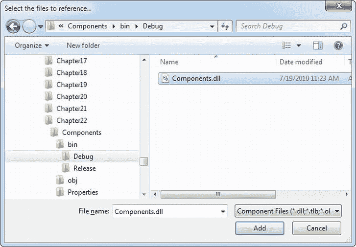

# 二十二、基于组件的编程

基于组件的编程是一个简单、优雅的想法。如果使用得当，它可以让您的代码更有组织性、一致性和可重用性。在. NET 应用中实现它也非常容易，因为您永远不需要使用 Windows 注册表或执行任何特殊的配置。

最简单地说，组件是一个或多个编译到单独的 DLL 程序集文件中的类。这些类提供了一些逻辑相关的功能单元。您可以在单个应用中访问一个组件，也可以在多个应用之间共享该组件。您的网页(或任何其他。NET 应用)可以像使用任何其他类一样使用组件中的类。NET 类。最棒的是，你的组件被*封装了* ，这意味着它提供了你的代码所需要的特性，并且隐藏了所有其他混乱的细节。

当与精心组织相结合时，基于组件的编程是良好的 ASP.NET 应用设计的基础。在本章中，您将研究如何创建组件(以及为什么应该创建)，并考虑一些示例，展示如何用一个编写良好的业务对象来封装数据库功能。您还将学习如何使用 ObjectDataSource 将数据库组件绑定到页面上的 web 控件。

为什么要使用组件？

要掌握 ASP.NET 开发，您需要成为。NET 类库。到目前为止，您已经学会了如何使用。NET 组件，用于读取文件、与数据库通信、调用 web 服务和存储用户信息。尽管这些类库成分很强大，但是它们是不可定制的，这既是优点也是缺点。

例如，如果您想从 SQL Server 数据库中检索数据，您需要将数据库细节(比如 SQL 查询)直接编织到您的 web 应用中。最坏的情况是，将它放在代码隐藏类中，或者(如果使用 SqlDataSource)放在。网页文件的 aspx 标记部分。无论哪种方式，如果数据库的结构发生了微小的变化，您可能需要更新和重新测试几十个页面。要解决这些问题，您需要在网页代码和数据库之间创建一个额外的层。这个额外的层采用自定义组件的形式。

这种数据库场景只是您想要创建自己的组件的原因之一。基于组件的编程实际上只是良好的代码组织原则的逻辑延伸，它提供了一长串的优势:

*   安全性:因为源代码不在你的网页中，所以你不能修改它。相反，您受限于组件提供的功能。例如，您可以配置一个数据库组件，只允许对特定的表、字段或行进行某些操作。这通常比在数据库中设置复杂的权限更容易。因为应用必须通过组件，所以它需要按其规则运行。
*   更好的组织:组件让你的网页代码不再杂乱。当应用被分解成单独的组件时，其他程序员也更容易理解应用的逻辑。如果没有组件，通常使用的代码必须在整个应用中复制和粘贴，这使得更改和同步变得非常困难。
*   *更简单的故障排除*:在测试和调试应用时，不可能过分夸大组件的优势。基于组件的程序被分解成更小、更紧凑的代码块，从而更容易准确地隔离问题发生的位置。与 web 应用的其余部分分开测试各个组件也更容易。
*   更多可管理性:基于组件的程序更容易增强和修改，因为组件和 web 应用代码可以分别修改。在极端情况下，这种方法允许一个开发团队开发组件，另一个团队编写使用该组件的网站。
*   代码重用:组件可以与任何需要组件功能的 ASP.NET 应用共享。更好的是，任何。NET 应用可以使用组件，这意味着您可以创建一个 web 应用和普通 Windows 应用使用的公共逻辑“主干”。
*   *简单性*:组件可以为单个客户端请求提供多个相关的任务(向数据库写入多条记录，一步打开和读取一个文件，甚至启动和管理一个数据库事务)。类似地，组件隐藏了细节——应用程序员可以使用数据库组件，而不必担心数据库名称、服务器位置或连接所需的用户帐户。更好的是，您可以使用特定的标准执行搜索，组件本身可以决定是使用动态生成的 SQL 语句还是存储过程。

组件术语

基于组件的编程有时被专业术语所掩盖。理解这些术语有助于理清一个组件应该做什么，它还允许您理解关于应用设计的其他文章。如果您已经熟悉了组件的基础知识，请随意跳过。

三层设计

*三层*设计的思想是大多数完整应用的功能可以分为三个主要层次(见[图 22-1](#Fig1) )。第一层是用户界面(或表示层)，它显示控件并接收和验证用户输入。网页中的所有事件处理程序都在第一层。第二层是业务层，在这里发生特定于应用的逻辑。对于电子商务网站，特定于应用的逻辑包括一些规则，如如何将运费应用于订单、某些促销活动何时有效，以及应该记录哪些客户活动。不涉及通用。NET 详细信息，如如何打开文件或连接到数据库。第三层是数据层，在这里您可以放置将信息存储在文件、数据库或其他数据存储中的逻辑。第三层包含关于如何检索和更新数据的逻辑，如 SQL 查询或存储过程。


[图 22-1](#_Fig1) 。三层设计

关于三层设计的重要细节是，信息只从一层传递到相邻层。换句话说，您的网页代码不应该直接连接到数据库来检索信息。相反，它应该通过业务层中连接到数据库并返回数据的组件。

三层设计是 ASP.NET WebForm 应用的可靠模型。当你创建一个组件时，它几乎总是被用在第二层，以弥补数据和用户界面之间的差距。换句话说，如果您想要填充列表框中的产品类别列表，您的用户界面代码会调用一个组件，该组件从数据库中获取列表，然后将其返回给您的代码。您的网页代码与数据库是隔离的——如果数据库结构发生变化，您需要更改一个简洁的组件，而不是站点上的每个页面。

封装

如果三层设计是基于组件编程的总体目标，那么*封装*就是最好的经验法则。封装的原则是，您应该从隐藏信息的“黑盒”中创建应用。因此，如果您有一个在电子商务网站上记录购买的组件，该组件处理所有的细节并只允许指定必要的变量。

例如，该组件可能接受一个用户 ID 和一个订单项 ID，然后处理所有其他细节。调用代码不需要担心组件如何工作或者数据来自哪里——它只需要理解如何使用组件。(这个原理有很多绘声绘色的描述。例如，你知道如何驾驶一辆汽车，因为你了解它的部件接口——方向盘和踏板——而不是因为你了解关于内燃机和发动机的底层细节。因此，你能够将你的知识转移到许多不同类型的汽车上，即使它们的内部工作原理有很大的不同。)

业务对象

术语*业务对象*通常对不同的人有不同的含义。通常，业务对象是应用第二层中的组件，在代码和数据源之间提供额外的层。它们被称为业务对象，因为它们执行*业务规则*。例如，如果您试图提交一个没有任何项目的采购订单，相应的业务对象将抛出一个异常并拒绝继续。在这种情况下，没有。出现网络错误；相反，您已经检测到根据应用的逻辑不应该允许的条件的存在。

在本章的例子中，业务对象也将包含数据访问代码。在一个极其复杂、庞大和多变的系统中，您可能希望进一步细分组件，并且实际上让您的用户界面代码与一个业务对象对话，而业务对象又与另一组与数据源交互的对象对话。然而，对于大多数程序员来说，这个额外的步骤是多余的，特别是随着 ADO.NET 提供的复杂程度的增加。

数据对象

术语*数据对象*也以多种方式使用。在本书中，数据对象只是用来在网页和业务对象之间发送信息的数据包。例如，您可以创建一个名为 Employee 的数据类，该数据类表示 Employees 表中一条记录的信息，并包含 FirstName、LastName 和 DateOfBirth 等属性。典型的数据对象填充有属性，但不提供方法。

组件和类别

从技术上讲，一个组件只是一个或多个类(也可能是其他的)。NET 类型，如结构和枚举)编译成一个单元。例如，微软的 System.Web 是一个单一(但非常大)的组件，它提供了许多以 System.Web 开头的命名空间中的类型

到目前为止，本书中的代码示例只使用了几种类——主要是从 System 继承的自定义网页类。并且主要包含事件处理过程。另一方面，组件类通常不包含任何用户界面逻辑(这会不必要地限制它们的使用)，也不需要从现有的类继承。

创建组件

要创建一个组件，您需要在 Visual Studio 中创建一个新的类库项目。首先，选择文件新建项目，显示新建项目对话框。然后，选择左边的 Visual C#组(不是 Web 组)，选择类库项目模板(见[图 22-2](#Fig2) )。您还需要指定文件位置和项目名称。


[图 22-2](#_Fig2) 。在 Visual Studio 中创建组件

除了选择 File  New  New Project 来创建类库之外，您还可以将它添加到与您的网站相同的解决方案中。这使得在用网页测试组件时，调试组件中的代码变得容易。(就其本身而言，没有办法运行一个组件，所以没有办法测试它。)要在现有的 web 解决方案中创建新的类库，首先打开您的网站，然后选择 File  Add  New Project。在“添加新项目”对话框中指定目录和项目名称。

图 22-3 显示了一个既有网站又有类库组件的解决方案。该网站在解决方案资源管理器中以粗体显示，表示它在启动时运行(当您单击“开始”按钮时)。


[图 22-3](#_Fig3) 。一个网站和类库项目的解决方案

为了便于打开此解决方案，您可能需要花一些时间来保存它。在解决方案浏览器中点击项目名称(图 22-3 中的“组件”)。然后选择文件将【解决方案名称】另存为。你可以打开这个。sln 文件来加载网站和类库项目。

通过在解决方案资源管理器中右击项目并选择"生成",可以随时编译类库。这将创建一个 DLL 程序集文件(Components.dll)。您不能直接运行该文件，因为它不是一个应用，也不提供任何用户界面。

类别和名称空间

一旦创建了类库项目，就可以在. vb 中添加类了。cs 文件。类库项目以一个名为 Class1.vb Class1.cs 的文件开始，您可以使用、删除或重命名该文件。您还可以添加更多的类文件，只需在解决方案资源管理器中右键单击项目并选择 Add  Class。类库项目和 web 应用之间的唯一区别是，您的类文件不会放在 App_Code 子目录中。

下面的例子创建了一个名为 SimpleTest 的类:

```cs
Public Class SimpleTest
    ' (Code goes here, inside one or more methods.)
End Class
public class SimpleTest
{
    // (Code goes here, inside one or more methods.)
}
```

记住，一个组件可以包含多个类。您可以在同一个文件中创建这些类，也可以使用不同的文件来更好地组织。在任一情况下，所有的类和源代码文件都被编译成一个程序集:

```cs
Public Class SimpleTest
    ' (Class code omitted.) Component-based programming:component creation:
End Class
```

```cs
Public Class SimpleTest2
    ' (Class code omitted.)
End Class
public class SimpleTest
{
    // Class code omitted.
}
```

```cs
public class SimpleTest2
{
    // Class code omitted.
}
```

通常，类放在命名空间块中。这意味着您的代码实际上将如下所示:

```cs
namespace Components
{
    public class SimpleTest
    {
        // (Class code omitted.)
    }
```

```cs
    public class SimpleTest2
    {
        // (Class code omitted.)
    }
}
```

当您向类库添加新的类文件时，C#会使用项目的默认命名空间自动添加一个命名空间块。组件中的类被自动组织到一个以项目命名的名称空间中。这个名称空间被称为根名称空间 。例如，如果您创建了一个名为 Components 的项目，SimpleTest 和 SimpleTest2 类将位于 Components 名称空间中(如此处所示)，它们的完全限定名将是 Components。SimpleTest 和 Components.SimpleTest2 .您需要知道在另一个应用中使用您的类的完全限定名，因为其他应用不会共享相同的名称空间。

如果不喜欢默认的命名空间，可以在所有代码文件中编辑命名空间名称。但是，如果您刚刚开始一个新项目，有一种更简单的方法:您可以简单地要求 Visual Studio 更改项目的默认命名空间。这样，每当您向项目中添加新的类文件时，Visual Studio 都会插入一个使用所需命名空间名称的命名空间块。(现有文件的命名空间不变。)若要更改默认命名空间，请在解决方案资源管理器中右击该项目，然后选择“属性”。如果您决定要更改根名称空间，您可以很容易地更改它。首先，在解决方案资源管理器中右击该项目，然后选择“属性”。您将看到应用设置的多选项卡显示。选择应用选项卡，然后在根命名空间默认命名空间文本框中编辑命名空间。您也可以使用此窗口中的“程序集名称”文本框来配置为已编译的程序集文件指定的名称。

如果您有一个复杂的组件，您可以选择将它细分成嵌套的名称空间。例如，您可能有一个名为 Components 的命名空间。要在默认项目命名空间内创建嵌套的命名空间,可以使用如下命名空间块:

```cs
namespace Components
{
    namespace Database
    {
        public class SimpleDatabaseTest
        {
            // (Class code omitted.)
        }
    }
}
Namespace Database
```

```cs
    Public Class SimpleDatabaseTest
        ' (Class code omitted.)
    End Class
```

```cs
End Namespace
```

现在这个类有了完全限定名 components . database . simpledatabasetest。

 **提示**命名命名空间的一般规则是使用公司名称，后跟技术名称，并且可以选择后跟特定于功能的部分，如 company name . technology name . feature。Media 和 Microsoft.Media.Audio。这些命名空间约定极大地降低了多个公司在同一命名空间中发布组件的可能性，这种可能性会导致命名冲突。命名准则的唯一例外是属于. NET 一部分的基程序集。

班级成员

若要向类中添加功能，请添加公共方法或属性。然后，网页代码可以调用这些成员来检索信息或执行任务。

下面的示例显示了一个最简单的组件，它只不过向调用代码返回一个字符串:

```cs
public class SimpleTest
{
    public string GetInfo(string param)
    {
        return "You invoked SimpleTest.GetInfo() with '" +
         param + "'";
    }
}
```

```cs
public class SimpleTest2
{
    public string GetInfo(string param)
    {
        return "You invoked SimpleTest2.GetInfo() with '" +
         param + "'";
    }
}
```

在下面几节中，您将学习如何在 web 应用中使用这个组件。稍后，您将学习更复杂、更实用的组件。

向组件添加引用

在实际的 ASP.NET 页面中使用该组件很容易。本质上，您的网站需要在 Bin 目录中有一个组件的副本。ASP.NET 自动监控这个目录，并使它的所有类对应用中的任何网页都可用。要创建这个副本，您需要使用一个名为*引用*的 Visual Studio 特性。

它是这样工作的:首先，在解决方案浏览器中选择你的网站。然后，从菜单中选择网站添加参考。这将把您带到"添加引用"对话框。(不要选择 Add Service Reference，它用于将应用连接到 web 服务，与名称相似的 Add Reference 命令没有什么共同之处。)

在“添加引用”对话框中，您可以采用两种方法之一:

*   *添加项目引用*:如果你的类库项目在同一个解决方案中，在左边的树中选择解决方案项目。这显示了你当前解决方案中所有类库项目的列表(见[图 22-4](#Fig4) )。单击“类库”旁边的复选标记，然后单击“确定”。


[图 22-4](#_Fig4) 。添加项目参考

*   *添加汇编引用*:如果你的类库在不同的解决方案中，或者你只有编译后的 DLL 文件(可能组件是由另一个开发者创建的)，点击窗口底部的浏览按钮。这将打开一个新窗口，你可以在其中搜寻你的 DLL 文件(见[图 22-5](#Fig5) )。浏览目录，直到找到 DLL 文件，选择它，然后单击 OK。



[图 22-5](#_Fig5) 。添加一个汇编引用

 **注意**如果你使用的是汇编引用，你需要先编译你的组件(从 Visual Studio 菜单中选择 Build  Build Solution)然后才能添加引用。

不管怎样。NET 将编译后的 DLL 文件复制到你的 web 应用的 Bin 子目录中(见[图 22-6](#Fig6) )。您还会看到一个包含 Visual Studio 调试信息的. PDB 文件。


[图 22-6](#_Fig6) 。Bin 目录中的一个组件

Visual Studio 还特别注意确保您一直使用组件的最新版本。如果您更改组件并重新编译它，Visual Studio 会注意到这一更改。下次运行 web 应用时，Visual Studio 会自动将新组件复制到 Bin 子目录中。

如果您使用的是项目引用，Visual Studio 会更进一步。每次运行网站项目时，Visual Studio 都会检查组件源代码文件中的任何更改。如果这些文件中的任何一个发生了更改，Visual Studio 会自动重新编译该组件，并将新版本复制到 web 应用的 Bin 子目录中。

当您添加对某个组件的引用时，Visual Studio 还允许您在代码中使用该组件的类，并进行常规的语法检查和智能感知。如果不添加引用，您将无法使用组件类(如果您尝试，Visual Studio 会将您使用该类的尝试解释为错误，并拒绝编译您的代码)。

 **注意**删除一个引用有点棘手。最简单的方法是右键单击 web 项目，然后选择“属性页”。然后，从列表中选择引用。您将看到所有引用的列表(包括程序集和项目引用)。要删除一个，请选择它并单击删除。

使用组件

一旦添加了引用，就可以通过创建 SimpleTest 或 SimpleTest2 类的实例来使用该组件，如下所示:

```cs
using Components;
```

```cs
public partial class TestPage : System.Web.UI.Page
{
    protected void Page_Load(Object sender, EventArgs e)
    {
        SimpleTest testComponent = new SimpleTest();
        SimpleTest2 testComponent2 = new SimpleTest2();
        lblResult.Text = testComponent.GetInfo("Hello") + "<br><br>";
        lblResult.Text += testComponent2.GetInfo("Bye");
    }
}
```

这个页面的输出，如图 22-7 所示，结合了两个 GetInfo()方法的返回值。


[图 22-7](#_Fig7) 。简单测试组件输出

为了使这段代码稍微简单一点，您可以选择在 component 类中使用静态方法，这样您就不需要在使用这些方法之前创建一个实例。静态 GetInfo()方法如下所示:

```cs
public class SimpleTest
{
    public static string GetInfo(string param)
    {
        return "You invoked SimpleTest.GetInfo() with '" +
                param + "'";
    }
}
```

在这种情况下，网页通过类名访问静态 GetInfo()方法，不需要创建对象:

```cs
protected void Page_Load(Object sender, EventArgs e)
{
    lblResult.Text = SimpleTest.GetInfo("Hello");
}
```

 **提示**记住，如果你正在使用汇编引用，而你的组件和 web 应用*不在同一个解决方案中*，你不会马上看到你的改变的效果。相反，您需要重新编译组件程序集(选择 Build  Build Solution ),然后重新构建您的 web 应用。如果您正在使用项目引用，这是不必要的—Visual Studio 会注意到您所做的每一个更改，并自动重新编译您的组件。

决定什么时候使用实例方法，什么时候使用静态方法是面向对象设计艺术的一部分，这需要经验。静态方法强加了额外的考虑——也就是说，你的类必须是*无状态的* (这个概念将在下一节描述)，这意味着它不能在成员变量中保存任何额外的信息。如果是这样的话，如果多个代码同时使用该组件，就会有潜在冲突的风险。

根据经验，如果需要能够同时创建类的几个实例，请使用实例方法。例如，实例方法对 SqlConnection 类有意义，因为您可能选择为一个操作打开到几个不同数据库的连接。如果您希望一次配置一个对象并多次使用它，实例方法也是最佳选择。例如，SqlConnection 类允许您设置连接字符串，然后根据需要打开和关闭连接。另一方面，如果您的方法执行不需要任何初始化的单个离散任务，请考虑静态方法。示例包括数学类中的计算和高级业务组件中的业务任务(如注册新客户)。

属性和状态

SimpleTest 类通过公共方法提供功能。如果你熟悉基于类的编程(如第 3 章所述)，你会记得类也可以在私有成员变量中存储信息，并提供允许调用代码修改这些信息的属性过程。例如，Person 类可能有 FirstName 属性。

当您使用属性并将信息存储在成员变量中时，您正在使用*有状态设计*。在有状态设计中，类负责维护某些信息。在无状态设计中，方法调用之间不保留任何信息。将早期使用无状态设计的 SimpleTest 类与这里所示的有状态 SimpleTest 类进行比较:

```cs
public class SimpleTest
{
    private string data;
    public string Data
    {
        get
        { return data; }
        set
        { data = value; }
    }
```

```cs
    public string GetInfo()
    {
        return "You invoked SimpleTest.GetInfo()," +
         "and data is '" + data + "'";
    }
}
```

设计大规模应用(如 web 应用)的程序员有时会争论有状态编程还是无状态编程最好。有状态编程是最自然的面向对象的方法，但是它也有一些缺点。要完成一项常见任务，您可能需要在调用方法之前设置几个属性。每一步都会增加一点不必要的开销。另一方面，无状态设计通常在一次方法调用中完成所有工作。但是，因为状态中不保留任何信息，所以您可能需要指定几个参数，这可能会导致冗长的编程。FileInfo 和 File 类展示了有状态和无状态对象的一个很好的例子，在第 17 章中有描述。

关于有状态设计还是无状态设计是最好的，没有简单的答案，它通常取决于手头的任务。高性能、使用事务、使用有限资源(如数据库连接)或需要远程调用的组件通常使用无状态设计，这是最简单、最可靠的方法。下一个例子说明了设计 Account 类的两种方法的区别。

有状态帐户类

考虑表示单个客户帐户的有状态帐户类。当在构造函数方法中第一次创建信息时，从数据库中读取信息，并且可以使用 Update()方法更新该信息。

```cs
public class CustomerAccount
{
    private int accountNumber;
    private decimal balance;
```

```cs
    public decimal Balance
    {
        get
        { return balance; }
        set
        { balance = value; }
    }
```

```cs
    public CustomerAccount(int accountNumber)
    {
        // (Code to read account record from database goes here.)
    }
```

```cs
    public void Update()
    {
        // (Code to update database record goes here.)
    }
}
```

如果您有两个公开 Balance 属性的 CustomerAccount 对象，则需要执行两个单独的步骤将资金从一个帐户转移到另一个帐户。从概念上讲，该过程是这样工作的:

```cs
// Create an account object for each account,
// using the account number.
CustomerAccount accountOne = new CustomerAccount(122415);
CustomerAccount accountTwo = new CustomerAccount(123447);
decimal amount = 1000;
```

```cs
// Withdraw money from one account.
accountOne.Balance -= amount;
```

```cs
// Deposit money in the other account.
accountTwo.Balance += amount;
```

```cs
// Update the underlying database records using an Update method.
accountOne.Update();
accountTwo.Update();
```

这里的问题是，如果这项任务由于一个错误而中途中断，您将会以至少一个不满意的客户而告终。

无状态的 AccountUtility 类

无状态对象可能只公开一个名为 FundTransfer() 的静态方法，它在一个方法中执行所有工作:

```cs
public class AccountUtility
{
    public static void FundTransfer(int accountOne,
     int accountTwo, decimal amount)
    {
        // (The code here retrieves the two database records,
        // changes them, and updates them.)
    }
}
```

调用代码不能使用相同的优雅的 CustomerAccount 对象，但是可以确保帐户转帐不会出错。因为所有的数据库操作都是一次执行的，所以它们可以使用数据库存储过程来获得更好的性能，并且可以使用事务来确保整个取款和存款要么成功，要么失败。

```cs
// Set the account and transfer details.
decimal amount = 1000;
int accountIDOne = 122415;
int accountIDTwo = 123447;
```

```cs
AccountUtility.FundTransfer(accountIDOne, accountIDTwo,
 amount);
```

在关键任务系统中，经常需要事务。出于这个原因，保留很少状态信息的类通常是最好的设计方法，尽管从面向对象的角度来看它们不太令人满意。

 **提示**有一种潜在的妥协。您可以创建有状态类来表示常见项目，如帐户、客户等，而无需添加任何功能。然后，您可以使用这些类作为数据包，在无状态实用程序类之间来回发送信息。(这些是本章开始时描述的数据对象。)

数据访问组件

显然，组件非常有用。但是，如果您正在开始一个大型的编程项目，您可能不确定哪些特性最适合作为单独的组件。学习如何将应用分解成组件和类是编程的伟大艺术之一，这需要大量的实践和微调。

最常见的组件类型之一是数据访问组件。数据访问组件是基于组件编程的理想应用 ，原因如下:

*   *数据库需要无关的细节*:这些细节包括连接字符串、字段名等等，所有这些都会分散应用逻辑的注意力，并且很容易被编写良好的组件封装。
*   *数据库随时间演变*:即使底层表结构保持不变，从不需要额外的信息(这一点还远未确定)，查询也可能被存储过程取代，存储过程也可能被重新设计。
*   *数据库有特殊的连接需求*:你甚至可能因为与应用无关的原因而需要更改数据库访问代码。例如，在对数据库进行分析和测试之后，您可能会发现可以用两个查询或更有效的存储过程来替换一个查询。在这两种情况下，返回的数据保持不变，但是数据访问代码有很大的不同。
*   *数据库以有限的方式重复使用*:换句话说，一个普通的数据库例程只需编写一次，就一定会被多次使用。

一个简单的数据访问组件

为了研究创建数据访问组件的最佳方式，我们将考虑一个简单的应用 ，它提供了一个分类页面，列出了不同个人出售的商品。该数据库使用两个表:一个是 Items 表，列出特定销售项目的说明和价格，另一个是 Categories 表，列出可用于对项目进行分类的不同组。[图 22-8](#Fig8) 显示了这种关系。


[图 22-8](#_Fig8) 。AdBoard 数据库关系

在本例中，您使用 ADO.NET 连接到一个 SQL Server 数据库。您可以自己创建这个数据库，也可以参考在线示例，其中包含一个自动生成它的 SQL 脚本。首先，Categories 表预加载了一组标准的允许类别。

数据访问组件很简单。它是一个单独的类(名为 DBUtil)，位于名为 DatabaseComponent 的名称空间中(这是项目的默认名称空间)。DBUtil 类使用实例方法并保留一些基本信息(比如要使用的连接字符串)，但它不允许客户端更改这些信息。所以不需要任何物业手续。相反，它在 GetCategories()和 GetItems()等方法中执行大部分工作。这些方法返回带有适当数据库记录的数据集。这种类型的设计在数据库上创建了一个相当薄的层——它处理一些细节，但是客户端仍然负责处理熟悉的 ADO.NET 类,比如数据集。

 **注**要使用这个例子，你需要在类库中添加一个对 System.Configuration.dll 和 System.Web.dll 程序集的引用。否则，您无法使用 WebConfigurationManager 挖掘出您需要的连接字符串。要添加这些引用，选择 Project  Add Reference，并在。网络标签。

```cs
using System;
using System.Data;
using System.Data.SqlClient;
using System.Web.Configuration;
```

```cs
namespace DatabaseComponent
{
    public class DBUtil
    {
        private string connectionString;
```

```cs
        public DBUtil()
        {
            connectionString =
             WebConfigurationManager.ConnectionStrings[
             "AdBoard"].ConnectionString;
        }
```

```cs
        public DataSet GetCategories()
        {
            string query = "SELECT * FROM Categories";
            SqlCommand cmd = new SqlCommand(query);
            return FillDataSet(cmd, "Categories");
        }
```

```cs
        public DataSet GetItems()
        {
            string query = "SELECT * FROM Items";
            SqlCommand cmd = new SqlCommand(query);
            return FillDataSet(cmd, "Items");
        }
```

```cs
        public DataSet GetItems(int categoryID)
        {
            // Create the Command.
            string query = "SELECT * FROM Items WHERE Category_ID=@CategoryID";
            SqlCommand cmd = new SqlCommand(query);
            cmd.Parameters.AddWithValue("@CategoryID", categoryID);
```

```cs
            // Fill the DataSet.
            return FillDataSet(cmd, "Items");
        }
```

```cs
        public void AddCategory(string name)
        {
            SqlConnection con = new SqlConnection(connectionString);
```

```cs
            // Create the Command.
            string insertSQL = "INSERT INTO Categories ";
            insertSQL += "(Name) VALUES @Name";
            SqlCommand cmd = new SqlCommand(insertSQL, con);
            cmd.Parameters.AddWithValue("@Name", name);
```

```cs
            try
            {
                con.Open();
                cmd.ExecuteNonQuery();
            }
            finally
            {
                con.Close();
            }
        }
```

```cs
        public void AddItem(string title, string description,
         decimal price, int categoryID)
        {
            SqlConnection con = new SqlConnection(connectionString);
```

```cs
            // Create the Command.
            string insertSQL = "INSERT INTO Items ";
            insertSQL += "(Title, Description, Price, Category_ID)";
            insertSQL += "VALUES (@Title, @Description, @Price, @CategoryID)";
            SqlCommand cmd = new SqlCommand(insertSQL, con);
            cmd.Parameters.AddWithValue("@Title", title);
            cmd.Parameters.AddWithValue("@Description", description);
            cmd.Parameters.AddWithValue("@Price", price);
            cmd.Parameters.AddWithValue("@CategoryID", categoryID);
```

```cs
            try
            {
                con.Open();
                cmd.ExecuteNonQuery();
            }
            finally
            {
                con.Close();
            }
        }
```

```cs
        private DataSet FillDataSet(SqlCommand cmd, string tableName)
        {
            SqlConnection con = new SqlConnection(connectionString);
            cmd.Connection = con;
            SqlDataAdapter adapter = new SqlDataAdapter(cmd);
```

```cs
            DataSet ds = new DataSet();
            try
            {
                con.Open();
                adapter.Fill(ds, tableName);
            }
            finally
            {
                con.Close();
            }
            return ds;
        }
    }
}
```

剖析代码。。。

*   当代码创建一个 DBUtil 对象时，它的构造函数自动从 web.config 文件中检索连接字符串，使用[第 5 章](05.html)中描述的技术。但是，需要注意的是，这是 web 应用的 web.config 文件(因为组件没有配置文件)。这是一个很好的设计，因为它允许网站在任何数据库服务器上使用数据库组件。但是，如果客户端 web 应用没有适当的配置设置，数据库组件将无法工作。
*   代码包括检索数据的方法(以 Get 开头的方法)和更新数据的方法(以 Add 开头的方法)。
*   该类包含一个名为 GetItems()的重载方法。这意味着客户端可以不带参数调用 GetItems()来返回完整的列表，或者带一个指示适当类别的参数。([第 2 章](02.html)提供了重载方法的介绍。)
*   每个访问数据库的方法都会打开和关闭连接。这是一种比试图在类的生存期内保持连接打开好得多的方法，这种方法在多用户的情况下肯定会导致性能下降。

 **提示**你的网络服务器可以频繁地打开和关闭连接而不会导致任何速度下降。这是因为 ADO.NET 使用连接池来保持一小部分开放的连接随时可用。只要您不更改连接字符串，并且只要池中有可用的连接，当您调用 SqlConnection 时。Open()，您将接收到这些连接中的一个，从而避免了建立新连接的开销。

*   代码使用自己的私有 FillDataSet()函数使代码更加简洁。这是不对客户开放的。相反，GetItems()和 GetCategories()方法使用 FillDataSet()函数。

使用数据访问组件

要在 web 应用中使用这个组件，首先必须确保在 web.config 文件中配置了适当的连接字符串，如下所示:

```cs
<configuration>
```

```cs
 <connectionStrings>
    <add name="AdBoard" connectionString=
"Data Source=(localdb)\v11.0;Initial Catalog=AdBoard;Integrated Security=SSPI" />
 </connectionStrings>
 . . .
</configuration>
```

接下来，编译并复制组件 DLL 文件，或者如果使用 Visual Studio，则添加对它的引用。剩下的唯一任务是为使用该组件的网页添加用户界面。

为了测试这个组件，您可以创建一个简单的测试页面。在[图 22-9](#Fig9) 所示的示例中，该页面允许用户按类别浏览当前列表并添加新项目。当用户第一次访问该页面时，它会提示用户选择一个类别。


[图 22-9](#_Fig9) 。广告板列表

一旦选择了类别，就会显示匹配的项目，并出现一个控制面板，允许用户在当前类别下向 AdBoard 添加一个新条目，如图[图 22-10](#Fig10) 所示。


[图 22-10](#_Fig10) 。广告板列表

为了更容易地访问组件，网页导入其名称空间:

```cs
using DatabaseComponent;
```

页面代码创建组件以从数据库中检索信息，并通过将数据集绑定到下拉列表或 GridView 控件来显示信息:

```cs
public partial class AdBoard : System.Web.UI.Page
{
    protected void Page_Load(Object sender, EventArgs e)
    {
        if (!this.IsPostBack)
        {
            DBUtil DB = new DBUtil();
```

```cs
            lstCategories.DataSource = DB.GetCategories();
            lstCategories.DataTextField = "Name";
            lstCategories.DataValueField = "ID";
            lstCategories.DataBind();
            pnlNew.Visible = false;
        }
    }
```

```cs
    protected void cmdDisplay_Click(Object sender, EventArgs e)
    {
        DBUtil DB = new DBUtil();
```

```cs
        gridItems.DataSource = DB.GetItems(
         Int32.Parse(lstCategories.SelectedItem.Value));
        gridItems.DataBind();
        pnlNew.Visible = true;
    }
```

```cs
    protected void cmdAdd_Click(Object sender, EventArgs e)
    {
        DBUtil DB = new DBUtil();
```

```cs
        try
        {
            DB.AddItem(txtTitle.Text, txtDescription.Text,
             Decimal.Parse(txtPrice.Text),
             Int32.Parse(lstCategories.SelectedItem.Value));
```

```cs
            gridItems.DataSource = DB.GetItems(
             Int32.Parse(lstCategories.SelectedItem.Value));
            gridItems.DataBind();
        }
        catch (FormatException err)
        {
            // An error occurs if the user has entered an
            // invalid price (non-numeric characters).
            // In this case, take no action.
            // Another option is to add a validator control
            // for the price text box to prevent invalid input.
        }
    }
}
```

剖析代码。。。

*   此页面并未使用组件的所有功能。例如，页面不使用 AddCategory()方法或不需要类别号的 GetItems()版本。这是完全正常的。其他页面可能使用该组件的不同功能。
*   网页的代码没有数据访问代码。但是，它确实需要了解如何使用数据集，并且需要知道特定的字段名称，以便使用自定义模板创建更有吸引力的 GridView 进行布局(而不是自动生成的列)。
*   可以使用错误处理代码或验证控件来改进该页面。实际上，没有执行任何验证来确保价格是数字，甚至没有确保提供了所需的值。

 **提示**如果你在 Visual Studio 中调试你的代码，你会发现你可以从你的网页代码单步进入组件的代码，即使它不是同一个解决方案的一部分。适当的源代码文件会自动加载到您的编辑器中，只要它可用(并且您已经在调试模式下编译了该组件)。

用错误处理增强组件

增强组件的一种方法是更好地支持错误报告。事实上，发生的任何数据库错误都会立即返回给调用代码。在某些情况下(例如，如果有一个合法的数据库问题)，这是一个合理的方法，因为组件不能处理这个问题。

然而，该组件未能正确处理一个常见问题。如果在 web.config 文件中找不到连接字符串，就会出现此问题。尽管组件试图在连接字符串创建后立即读取它，但调用代码直到尝试使用数据库方法时才意识到问题的存在。

更好的方法是在检测到问题时立即通知客户端，如下面的代码示例所示:

```cs
public class DBUtil
{
    private string connectionString;
```

```cs
    public DBUtil()
    {
        if (WebConfigurationManager.ConnectionStrings["AdBoard"] == null)
        {
            throw new ApplicationException(
             "Missing ConnectionString variable in web.config.");
        }
        else
        {
            connectionString =
             WebConfigurationManager.ConnectionStrings[
             "AdBoard"].ConnectionString;
        }
    }
```

```cs
    // (Other class code omitted.)
}
```

此代码引发一个 ApplicationException，并带有一条指示问题的自定义错误消息。为了提供更好的报告，您可以创建自己的从 ApplicationException 继承的异常类，如第 7 章中所述。

 **提示**组件经常捕捉低级任务中发生的异常(如读取文件或与数据库交互)，然后抛出不太详细的异常(如 ApplicationException)来通知网页。这样，用户就没有机会看到技术错误信息。这一点很重要，因为详细的错误消息会给黑客提供线索，让他们知道你的代码是如何工作的，以及如何破坏它。

用集合信息增强组件

该组件不必限制它提供给数据集的信息类型。其他信息也是有用的。例如，您可以提供一个名为 ItemFields 的只读属性，该属性返回一个表示 Items 表中字段名称的字符串数组。或者，您可以添加另一个方法来检索整个表的聚合信息，例如数据库中商品的平均价格或当前列出的商品总数，如下所示:

```cs
public class DBUtil
{
    // (Other class code omitted.)
```

```cs
    public decimal GetAveragePrice()
    {
        string query = "SELECT AVG(Price) FROM Items";
```

```cs
        SqlConnection con = new SqlConnection(connectionString);
        SqlCommand cmd = new SqlCommand(query, con);
```

```cs
        con.Open();
        decimal average = (decimal)cmd.ExecuteScalar();
        con.Close();
```

```cs
        return average;
    }
```

```cs
    public int GetTotalItems()
    {
        string query = "SELECT Count(*) FROM Items";
```

```cs
        SqlConnection con = new SqlConnection(connectionString);
        SqlCommand cmd = new SqlCommand(query, con);
```

```cs
        con.Open();
        int count = (int)cmd.ExecuteScalar();
        con.Close();
```

```cs
        return count;
    }
}
```

这些查询使用了一些您可能不熟悉的 SQL 语句(即 COUNT 和 AVG 聚合函数)。然而，从客户端的角度来看，这些方法与 GetItems()和 GetCategories() 一样易于使用:

```cs
DBUtil DB = new DBUtil();
decimal averagePrice = DB.GetAveragePrice();
int totalItems = DB.GetTotalItems();
```

您可能想到可以通过只读属性过程(如 TotalItems)而不是方法(在本例中为 GetTotalItems)来返回诸如项目总数之类的信息。尽管这样做是可行的，但是属性过程最好留给用类维护的信息(在私有变量中)或者易于重构的信息。在这种情况下，需要一个数据库操作来计算行数，如果频繁使用，该数据库操作可能会导致异常问题或降低性能。为了帮助强调这一事实，使用了方法而不是属性。

对象数据源

使用专用的数据库组件是保持代码高效和组织良好的一个好方法。这也便于您以后应用更改。然而，这有一个 的缺点——也就是说，你需要写相当多的代码来创建一个网页*和*一个单独的数据访问组件。在[第 15 章](15.html)中，您看到了通过使用诸如 SqlDataSource 之类的组件来封装所有数据访问细节，可以简化您的生活。不幸的是，如果您使用一个单独的组件，这种无代码的方法就行不通了——是吗？

原来有一种方法可以两全其美，使用独立的数据访问组件和更简单的 web 页面数据绑定。不使用 SqlDataSource，而是使用 ObjectDataSource，它定义网页和组件之间的链接。这不会让您不必在组件中编写实际的数据访问代码，但会让您不必在网页中编写繁琐的代码来调用组件中的方法、提取数据、格式化数据并在页面中显示数据。

 **注意**objectdata source 允许你创建无代码的网页，但是你仍然需要在你的组件中编写代码。您不应该认为这是一个缺点——毕竟，您需要编写这些代码来精确地控制正在发生的事情，从而优化您的数据访问策略的性能。

在接下来的小节中，您将学习如何获取前面介绍的现有 DBUtil 类，并在数据绑定 web 页面中使用它。你将学习如何在不编写任何网页代码的情况下复制图 22-9 和图 22-10 中的例子。

制作 ObjectDataSource 可以理解的类

本质上，ObjectDataSource 允许您在网页控件和查询和更新数据的数据访问组件之间创建声明性链接。尽管 ObjectDataSource 非常灵活，但它不能支持您可以创建的所有组件。事实上，要使您的数据组件可用于 ObjectDataSource，您需要遵守一些规则:

*   你的类必须是无状态的。这是因为 ObjectDataSource 只会在需要时创建一个实例，并在每个请求结束时销毁它。
*   您的类必须有一个默认的无参数构造函数。
*   所有的逻辑必须包含在一个类中。(如果您想使用不同的类来选择和更新您的数据，您需要将它们包装在另一个更高级别的类中。)
*   查询结果必须以数据集、数据表或某种对象集合的形式提供。(如果您决定使用对象集合，每个数据对象都需要将所有数据字段公开为公共属性。)

幸运的是，这些规则中有许多是您应该已经遵循的最佳实践。尽管 DBUtil 类不是专门为 ObjectDataSource 设计的，但它符合所有这些标准。

选择记录

通过构建图 22-10 中所示的页面，您可以了解很多关于 ObjectDataSource 的信息。在接下来的部分中，您将应对这一挑战。

第一步是创建包含类别列表的列表框。对于这个列表，您需要一个 ObjectDataSource，它链接到 DBUtil 类并调用 GetCategories()方法来检索类别记录的完整列表。

要向列表框提供数据，您需要定义一个 ObjectDataSource 并指明包含数据访问方法的类的名称。通过用 TypeName 属性指定完全限定的类名，可以做到这一点，如下所示:

```cs
<asp:ObjectDataSource ID="sourceCategories" runat="server"
 TypeName="DatabaseComponent.DBUtil" . . . />
```

一旦将 ObjectDataSource 附加到一个类，下一步就是将它指向可以用来选择和更新记录的方法。

ObjectDataSource 定义用于将数据访问类链接到各种任务的 SelectMethod、DeleteMethod、UpdateMethod 和 InsertMethod 属性。每个属性都采用数据访问类中方法的名称。在本例中，您只需启用查询，因此需要设置 SelectMethod 属性，以便它调用 GetCategories()方法:

```cs
<asp:ObjectDataSource ID="sourceCategories" runat="server"
 TypeName="DatabaseComponent.DBUtil" SelectMethod="GetCategories" />
```

一旦设置了 ObjectDataSource，就可以用与 SqlDataSource 相同的方式绑定网页控件。这是列表框需要的标签:

```cs
<asp:DropDownList ID="lstCategories" runat="server"
 DataSourceID="sourceCategories" DataTextField="Name" DataValueField="ID">
</asp:DropDownList>
```

这个标签显示了类别名称的列表(由于 DataTextField 属性),并跟踪类别 ID(使用 DataValueField 属性)。

这个例子到目前为止运行良好。可以运行测试网页，看到列表中的类别列表(如图[图 22-9](#Fig9) )。

使用方法参数

下一步是在下面的 GridView 中显示当前类别中的项目列表。与 SqlDataSource 一样，ObjectDataSource 只能用于单个查询。这意味着您需要创建第二个 ObjectDataSource，它能够通过调用 GetItems()来检索条目列表。

这里的技巧是 GetItems()方法需要一个参数(名为 categoryID)。这意味着您需要创建一个包含单个参数的 ObjectDataSource。您可以使用与 SqlDataSource 使用的所有相同类型的参数从查询字符串、其他控件等中获取值。在这种情况下，类别 ID 由列表框的 SelectedValue 属性提供，因此您可以使用指向该属性的控件参数。

下面是您需要的 ObjectDataSource 定义:

```cs
<asp:ObjectDataSource ID="sourceItems" runat="server" SelectMethod="GetItems"
 TypeName="DatabaseComponent.DBUtil" >
 <SelectParameters>
     <asp:ControlParameter ControlID="lstCategories" Name="categoryID"
        PropertyName="SelectedValue" Type="Int32" />
 </SelectParameters>
</asp:ObjectDataSource>
```

同样，您使用 DBUtil 类，但这次您需要的是 GetItems()方法。即使 GetItems()方法有两个重载版本(一个采用 categoryID 参数，另一个不采用)，您也不必担心。ObjectDataSource 通过查看您定义的参数，自动使用正确的重载。

在这种情况下，使用单个参数从列表框中提取选定的类别 ID，并将其传递给 GetItems()方法。请注意，ControlParameter 标记中定义的名称与 GetItems()方法的参数名称相匹配。这是一个绝对的要求。ObjectDataSource 使用反射搜索 GetItems()方法，并验证任何潜在的匹配都具有您指定的参数数量、参数名称和数据类型。这个搜索过程允许 ObjectDataSource 区分同一方法的不同重载版本。如果 ObjectDataSource 找不到您指定的方法，此时会引发一个异常。

 **提示**如果你不确定在你的数据访问组件中调用了什么方法，在可能的方法上放置一个断点，并使用 Visual Studio 的调试功能(如[第 4 章](04.html)中所述)。

最后一步是使用 DataSourceID 将 GridView 链接到新的 ObjectDataSource。下面是完成这项工作的标签:

```cs
<asp:GridView ID="gridItems" runat="server" DataSourceID="sourceItems"/>
```

这是你所需要的。您应该保留显示按钮，因为它会触发页面回发并允许 ObjectDataSource 开始工作。(如果不想使用此按钮，请将列表框上的 AutoPostback 属性设置为 True，以便在您更改选择时回发。)您不需要编写任何事件处理代码来在按钮被单击时做出反应。查询是自动执行的，控件是自动绑定的。

更新记录

最后一步是为用户提供添加新项目的方法。实现这一点的最简单的方法是使用处理单个记录的富数据控件 DetailsView 或 FormsView。DetailsView 是两者中较简单的一个，因为它不需要模板。它就是下面的例子中使用的那个。

理想情况下，您应该使用这样的标记定义 DetailsView，并让它根据绑定的数据源生成它需要的所有字段:

```cs
<asp:DetailsView ID="detailsAddItem" runat="server" DataSourceID="sourceItems"/>
```

不幸的是，这在这个例子中不起作用。问题是这种方法创建了太多的字段。在本例中，您不希望用户指定项目 ID(由数据库自动设置)或类别 ID(基于当前选择的类别)。所以，这些细节都不应该出现。确保这一点的唯一方法是关闭自动字段生成，并显式定义您想要的每个字段，如下所示:

```cs
<asp:DetailsView ID="detailsAddItem" runat="server"
 DataSourceID="sourceItems" AutoGenerateRows="False">
 <Fields>
    <asp:BoundField DataField="Title" HeaderText="Title" />
    <asp:BoundField DataField="Price" HeaderText="Price"/>
    <asp:BoundField DataField="Description" HeaderText="Description" />
 </Fields>
</asp:DetailsView>
```

你需要做一些其他的改变。要允许插入，需要将 AutoGenerateInsertButton 设置为 True。这样，DetailsView 创建了允许您开始输入新记录并插入它的链接。同时，可以将 DefaultMode 属性设置为 Insert。这样，DetailsView 总是处于插入模式，专门用于添加记录(而不是显示记录)，就像前面显示的非数据绑定页面一样。

```cs
<asp:DetailsView ID="detailsAddItem" runat="server"
 DefaultMode="Insert" AutoGenerateInsertButton="True"
 DataSourceID="sourceItems" AutoGenerateRows="False">
 . . .
</asp:DetailsView>
```

ObjectDataSource 为可更新数据绑定提供与 SqlDataSource 相同类型的支持。第一步是指定 InsertMethod，它需要是同一个类中的公共方法:

```cs
<asp:ObjectDataSource ID="sourceItems" runat="server"
 TypeName="DatabaseComponent.DBUtil"
 SelectMethod="GetItems" InsertMethod="AddItem" >
</asp:ObjectDataSource>
```

挑战在于确保 InsertMethod 具有正确的签名。与 SqlDataSource 一样，更新、插入和删除会自动从链接数据控件接收参数集合。这些参数与相应的字段名同名。所以在这种情况下，字段是 Title、Price 和 Description，它们与 AddItem()方法中的参数名称完全匹配。(大小写不一样，但是 ObjectDataSource 不区分大小写，所以这不是问题。)

然而，这仍然有一个问题。当用户提交编辑时，DetailsView 提交您所期望的三个参数(标题、价格和描述)。但是，AddItem()方法需要一个第四个参数——CategoryID。我们没有在 DetailsView 字段中设置该参数，因为您不希望用户能够设置类别 ID。但是，您仍然需要将它提供给方法。

那么，从哪里可以获得当前的类别 ID 呢？最简单的选择是从列表框中提取它，就像您对 GetItems()方法所做的那样。您只需添加一个 ControlParameter 标记，该标记定义一个名为 CategoryID 的参数，并将其绑定到列表框的 SelectedValue 属性。下面是修改后的 ObjectDataSource 标记:

```cs
<asp:ObjectDataSource ID="sourceItems" runat="server" SelectMethod="GetItems"
 TypeName="DatabaseComponent.DBUtil" InsertMethod="AddItem" >
 <SelectParameters>
    . . .
 </SelectParameters>
 <InsertParameters>
    <asp:ControlParameter ControlID="lstCategories" Name="categoryID"
     PropertyName="SelectedValue" Type="Int32" />
 </InsertParameters>
</asp:ObjectDataSource>
```

现在您已经拥有了所需的所有参数 DetailsView 中的三个参数和列表框中的一个额外参数。当用户尝试插入新记录时，ObjectDataSource 收集这四个参数，确保它们与 AddItem()方法的签名匹配，将它们按顺序排列，然后调用该方法。

[图 22-11](#Fig11) 显示了一个正在进行的插入。


[图 22-11](#_Fig11) 。使用 DetailsView 插入

当您单击“插入”按钮时，后台会发生很多事情。下面是实际发生情况的分析:

1.  DetailsView 收集所有新值并将它们传递给 ObjectDataSource。
2.  ObjectDataSource 调用 DBUtil。AddItem()方法，在正确的位置传递它从 DetailsView 接收的所有值(通过匹配字段名和参数名)以及从 lstCategories 列表框中选择的值。
3.  DBUtil。AddItem()方法构建一个参数化的 SQL 命令。然后，它打开一个数据库连接，并执行插入新记录的命令。(此时，ASP.NET 数据绑定系统暂停，让其他事件发生，比如 Page.Load。)
4.  就在呈现页面之前，数据绑定过程开始。DropDownList 向第一个 ObjectDataSource 请求类别列表(这会触发对 DBUtil 的调用。GetCategories()方法)，GridView 从第二个 ObjectDataSource 请求项目列表(这将触发 DBUtil。GetItems()方法)。

因为页面总是在任何插入和更新操作完成后被反弹*，你将总是在你的 web 控件中看到最新的信息。例如，如果您添加一个新项目，您将看到它立即出现，并带有数据库服务器自动生成的唯一 ID 值。*

 **注意**在某些情况下，你可能需要提供一个额外的参数，这个参数必须通过编程来设置。在这种情况下，您需要定义一个普通的参数标记(而不是 ControlParameter 标记)，有名称和数据类型，但没有值。然后，您可以响应适当的 ObjectDataSource 事件(如插入、更新或删除),及时填充您需要的值。它有点乱(而且它迫使你在你的网页中写代码)，但是它有时是必要的。第 15 章用 SqlDataSource 控件演示了这种技术。

最后一句话

本章中的例子展示了创建组件并将它们集成到你的网站中的安全可靠的方法。如您所见，这些对象遵守封装规则，这意味着它们执行特定的业务任务，但不参与为应用生成用户界面。例如，DBUtil 类使用 ADO.NET 代码来检索记录或更新数据库。由其他控件(如 GridView 和 DetailsView)来提供表示。