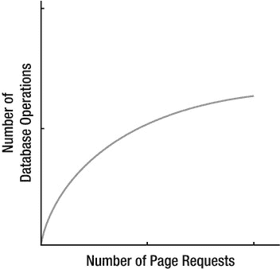
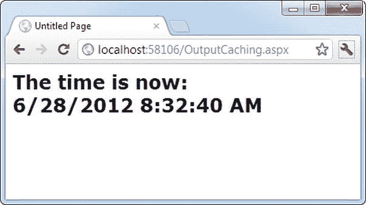
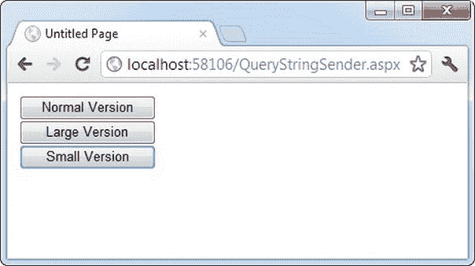
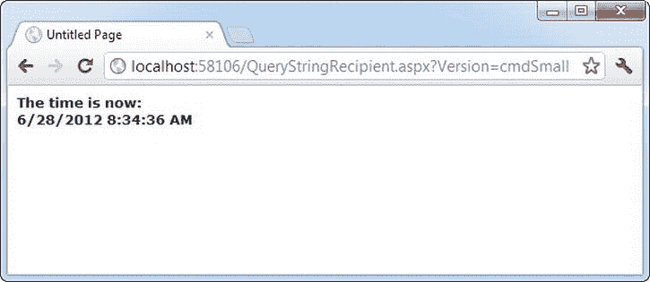
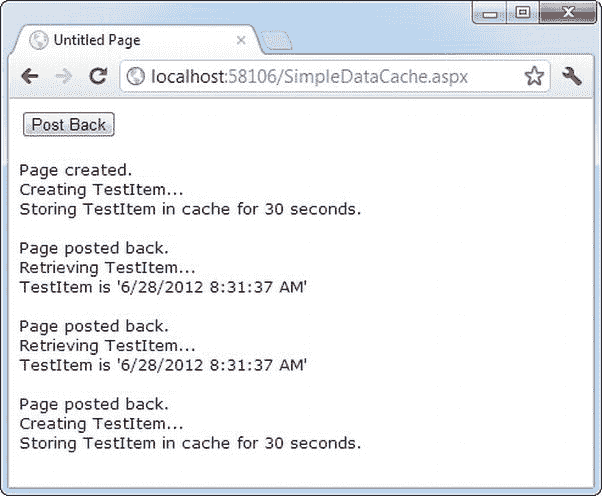
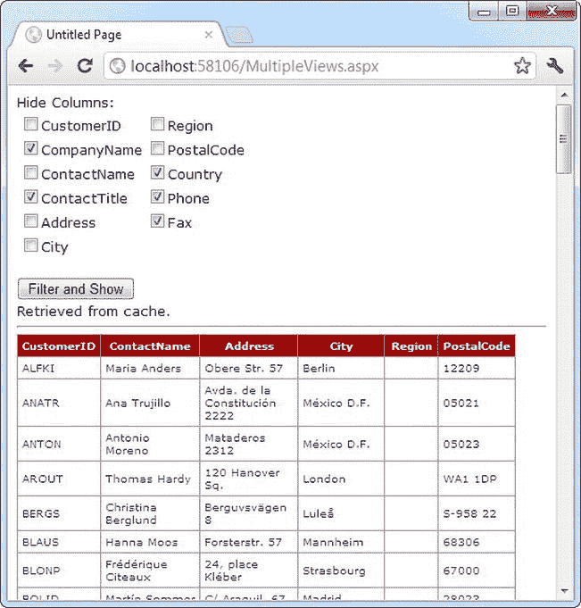
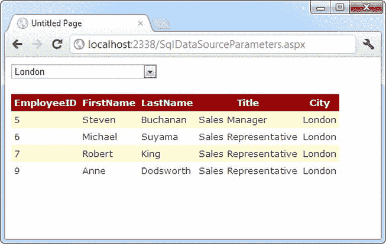
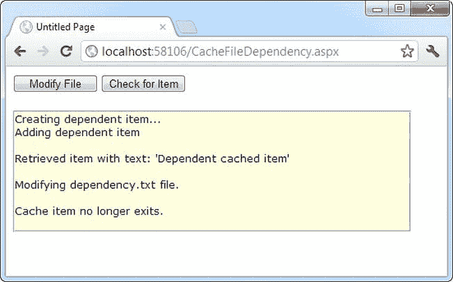
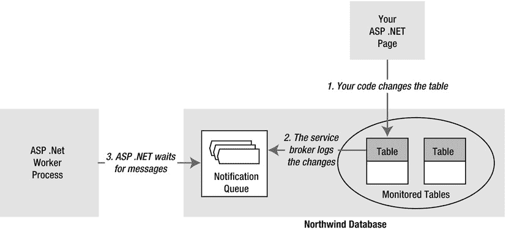

# 二十三、缓存

ASP.NET 的申请有点矛盾。一方面，因为它们托管在互联网上，所以它们有独特的需求——也就是说，它们需要能够像处理单个用户一样方便快捷地服务数百个客户端。另一方面，ASP.NET 包含了一些非凡的技巧，让你可以像设计桌面应用一样设计和编写 web 应用。这些技巧很有用，但是会给开发人员带来麻烦。问题在于，ASP.NET 让人们很容易忘记自己正在创建一个 web 应用——如此简单，以至于你可能会引入一些编程实践，当现实世界中有大量用户使用你的应用时，这些编程实践会使你的应用变慢或瘫痪。

幸运的是，中间地带是存在的。您可以使用前 20 多章学习的视图状态、web 控件和会话状态等非常省时的特性，仍然可以创建健壮的 web 应用。但是要正确地完成这项工作，你需要投入一些额外的时间来描述和优化你的网站的性能。提高性能最简单的方法之一是使用*缓存*，这是一种将有价值的信息临时存储在服务器内存中以便重用的技术。与你在第 8 章中了解到的其他类型的状态管理不同，缓存包括一些确保良好性能的内置特性。

了解缓存

ASP.NET 已经在缓存方面迈出了巨大的步伐。许多第一次了解缓存的开发人员认为它有点华而不实，但事实并非如此。如果使用得当，通过将重要数据仅保留一小段时间，缓存可以提供两倍、三倍甚至十倍的性能提升。

缓存通常用于存储从数据库中检索到的信息。这是有道理的——毕竟，从数据库中检索信息需要时间。通过仔细的优化，您可以减少时间并在一定程度上减轻数据库的负担，但您永远无法消除这种负担。但是对于使用缓存的系统，一些数据请求不需要数据库连接和查询。相反，他们将直接从服务器内存中检索信息，这是一个更快的提议。

当然，将信息存储在内存中并不总是一个好主意。服务器内存是一种有限的资源；如果您试图存储太多，一些信息将被分页到磁盘，可能会降低整个系统的速度。这就是为什么 ASP.NET 的缓存是*自限* 。当您将信息存储在缓存中时，大多数情况下，您可以在将来的请求中找到它。但是，该信息的生命周期由服务器决定。如果缓存变满或其他应用消耗大量内存，数据将有选择地从缓存中清除，以确保应用继续正常运行。正是这种自给自足使缓存变得如此强大(并且会使自己的实现变得极其复杂)。

何时使用 缓存

充分利用缓存的秘密在于选择正确的时间来使用它。一个好的缓存策略可以识别最常用的数据，这些数据在创建和存储时是最耗时的。如果您存储了太多的信息，就有可能用相对不重要的数据填满缓存，并挤出您真正想要保留的内容。

这里有两个缓存指南，可以帮助您保持正确的方向:

*   *缓存昂贵的数据(或网页)*:换句话说，缓存创建耗时的信息。数据库查询的结果或文件的内容就是很好的例子。不仅打开数据库连接或文件需要时间，而且还会延迟或锁定同时试图做同样事情的其他用户。
*   *缓存经常使用的数据(或网页)*:没有必要为永远不再需要的信息留出内存。例如，您可能选择不缓存产品详细信息页面，因为有数百种不同的产品，每种产品都有自己的页面。但是缓存产品类别列表更有意义，因为该信息将被重用以服务于许多不同的请求。

如果您记住这两条规则，您可以同时从缓存中获得两个好处:您可以同时提高性能和可伸缩性。

*性能* 是衡量一个网页对单个用户工作速度的指标。缓存提高了性能，因为它绕过了像数据库这样的瓶颈。结果，网页被更快地处理并发送回客户机。

*可伸缩性* 测量当越来越多的人同时使用你的 web 应用时，它的性能是如何下降的。缓存提高了可伸缩性，因为它允许您为快速连续发生的请求重用相同的信息。有了缓存，越来越多的人可以使用你的网站，但是访问数据库的次数不会有太大的变化。因此，系统的总体负担将保持相对恒定，如图[图 23-1](#Fig1) 所示。



[图 23-1](#_Fig1) 。良好缓存的效果

许多优化技术以牺牲性能为代价来增强可伸缩性，反之亦然。缓存是非凡的，因为它让你两全其美。

ASP.NET 的缓存

ASP.NET 真的有两种类型 的缓存。您的应用可以也应该使用这两种类型，因为它们是互补的:

*   *输出缓存* :这是最简单的缓存类型。它存储发送给客户机的最终呈现的 HTML 页面的副本。提交该页面请求的下一个客户机实际上并不运行该页面。相反，最终的 HTML 输出是自动发送的。运行页面及其代码所需的时间将被完全回收。
*   *数据缓存* :这是在你的代码中手动执行的。要使用数据缓存，您需要在缓存中存储需要很长时间才能重建的重要信息(如从数据库中检索的数据集)。其他页面可以检查此信息的存在并使用它，从而绕过检索它通常需要的步骤。数据缓存在概念上与使用应用状态相同，但它对服务器更友好，因为当缓存变得太大时，项目将自动从缓存中移除，性能可能会受到影响。项目也可以设置为自动过期。

此外，两种专门类型的缓存构建于这些模型之上:

*   *片段缓存*:这是一种特殊类型的输出缓存——它不是缓存整个页面的 HTML，而是允许您缓存页面的一部分。片段缓存的工作原理是将用户控件的呈现 HTML 输出存储在页面上。下一次执行该页时，将触发相同的页事件(因此您的页代码仍将运行)，但相应用户控件的代码不会执行。
*   *数据源缓存*:这是内置于数据源控件中的缓存，包括 SqlDataSource 和 ObjectDataSource。从技术上讲，数据源缓存使用数据缓存。不同之处在于，您不需要显式地处理该过程。相反，您只需配置适当的属性，数据源控件就会管理缓存存储和检索。

在本章中，您将了解所有这些类型的缓存。您将从学习输出缓存、片段缓存和数据缓存的基础开始。接下来，您将检查数据源控件中的缓存。最后，您将探索 ASP。NET 最热门的特性——使用 SQL 缓存依赖项将缓存项链接到数据库中的表。

输出缓存

使用输出缓存，页面最终呈现的 HTML 被缓存。当再次请求同一个页面时，不会创建控件对象，页面生命周期不会开始，并且不会执行任何代码。相反，会提供缓存的 HTML。显然，输出缓存在理论上获得了最大的性能提升，因为所有的代码开销都被忽略了。

要查看运行中的输出缓存，您可以创建一个显示当前时间的简单页面。[图 23-2](#Fig2) 显示了这个页面。



[图 23-2](#_Fig2) 。显示页面被服务的时间

这个任务的代码是基本的 :

```cs
public partial class OutputCaching : System.Web.UI.Page
{
    protected void Page_Load(Object sender, EventArgs e)
    {
        lblDate.Text = "The time is now:<br />";
        lblDate.Text += DateTime.Now.ToString();
    }
}
```

有两种方法可以缓存 ASP.NET 页面。最常见的方法是在。aspx 文件，就在 Page 指令下面，如下所示:

```cs
<%@ OutputCache Duration="20" VaryByParam="None" %>
```

Duration 属性指示 ASP.NET 将页面缓存 20 秒。VaryByParam 属性

当您运行测试页面时，您会发现一些有趣的行为。首次访问该页面时，您将看到显示的当前时间。但是，如果稍后刷新页面，页面将不会更新。相反，ASP.NET 会自动发送缓存的 HTML 输出给你，直到它在 20 秒内到期。如果 ASP.NET 在缓存页面过期后收到请求，ASP.NET 将再次运行页面代码，生成 HTML 输出的新缓存副本，并在接下来的 20 秒内使用它。

20 秒似乎是微不足道的时间，但在一个高流量的网站，它可以产生巨大的差异。例如，您可以缓存一个页面，该页面提供一个目录中的产品列表。通过将页面缓存 20 秒，可以将该页面的数据库访问限制为每分钟三次操作。如果没有缓存，该页面将尝试为每个客户端连接一次数据库，并且可以在 20 秒内轻松地发出几十个请求。

当然，仅仅因为你请求一个页面存储 20 秒并不意味着它真的会被存储。如果系统发现内存越来越少，就可以尽早从缓存中清除该页面。这允许您自由地使用缓存，而不必太担心由于耗尽重要内存而妨碍应用。

 **提示**当你重新编译一个缓存的页面时，ASP.NET 会自动从缓存中移除该页面。这可以防止由于使用旧的缓存版本而导致页面没有正确更新的问题。但是，在测试应用时，您可能仍然希望禁用缓存。否则，使用变量监视、断点和其他调试技术可能会有问题，因为如果页面的缓存副本可用，您的代码将不会执行。

缓存和查询字符串

缓存中的一个主要考虑因素是决定什么时候页面可以重用，什么时候信息必须精确到最新秒。热衷于即时满足(缺乏耐心)的开发人员通常会过分强调实时信息的重要性。您通常可以使用缓存来有效地重用稍微陈旧的数据，而不会出现问题，并且性能会有相当大的提高。

当然，有时信息需要是动态的。一个例子是页面使用当前用户会话中的信息来定制用户界面。在这种情况下，整页缓存并不合适，因为不同用户的请求不能重用同一个页面(尽管片段缓存可能有所帮助)。另一个例子是页面通过查询字符串从另一个页面接收信息。在这种情况下，页面太动态而无法缓存，是吗？

当前示例将 OutputCache 指令上的 VaryByParam 属性设置为 None，这实际上告诉 ASP.NET 您只需要存储缓存页面的一个副本，这适用于所有场景。如果此页面的请求向 URL 添加了查询字符串参数，则 difference—ASP.NET 将始终重用相同的输出，直到过期。您可以通过在浏览器窗口中手动添加查询字符串参数来测试这一点。比如，尝试跟踪？a=b 放在你的 URL 的末尾。仍然使用缓存的输出。

基于这个实验，您可能会认为输出缓存不适合使用查询字符串参数的页面。但 ASP.NET 实际上提供了另一种选择。您可以将 VaryByParam 属性设置为*以指示页面使用查询字符串，并指示 ASP.NET 为不同的查询字符串参数缓存页面的不同副本:

```cs
<%@ OutputCache Duration="20" VaryByParam="*" %>
```

现在，当您请求带有附加查询字符串信息的页面时，ASP.NET 将检查查询字符串。如果字符串与以前的请求匹配，并且存在该页面的缓存副本，则它将被重用。否则，将创建页面的新副本并单独缓存。

为了更好地了解这个过程是如何工作的，请考虑下面的一系列请求:

1.  您请求一个没有任何查询字符串参数的页面，并接收页面副本 a。
2.  您使用参数 ProductID=1 请求页面。你收到第二页。
3.  另一个用户使用参数 ProductID=2 请求页面。该用户接收副本 c。
4.  另一个用户请求 ProductID=1 的页面。如果缓存的输出 B 没有过期，它将被发送给用户。
5.  然后，用户请求不带查询字符串参数的页面。如果副本 A 没有过期，它将从缓存中发送。

您可以自己尝试这样做，尽管您可能希望延长缓存页面的保留时间，以便于测试。

 **注意**如果页面只依赖于服务器端数据(例如，数据库中的数据)和查询字符串中的数据，那么输出缓存可以很好地工作。但是，如果页面输出依赖于特定于用户的信息，比如会话数据或 cookies，输出缓存就不起作用，因为没有办法根据这些标准改变缓存。输出缓存也不适用于为响应控件事件而改变内容的动态页面。在这些情况下，使用片段缓存来缓存页面的一部分，或者使用数据缓存来缓存特定的信息。这两种技术将在本章后面讨论。

减慢翻页速度

当您处理一个简单的页面，并且在同一台计算机上运行 web 浏览器和 web 应用时，很难感受到缓存的效果。在这种情况下，您可能希望故意降低页面速度，以便可以看到普通页面(需要较长时间运行)和缓存页面(几乎是即时运行)之间的差异。

要降低页面速度，只需在页面中插入一些耗时的代码。加载事件处理程序 。您可以添加一个长循环，但更好的方法是使用线程。Sleep()方法强制一个定时延迟，就像你在[第 25 章](25.html)中做的那样。下面是一些将页面处理延迟 15 秒的代码:

受保护的 void Page_Load(对象发送方，EventArgs e)

{

系统。线程。线程。睡眠(时间跨度。from seconds(15))；

}

使用特定查询字符串参数 进行缓存

将 VaryByParam 设置为通配符星号(*)是不必要的模糊。通常最好通过名称来明确标识一个重要的查询字符串变量。这里有一个例子:

```cs
<%@ OutputCache Duration="20" VaryByParam="ProductID" %>
```

在这种情况下，ASP.NET 将检查查询字符串，寻找 ProductID 参数。具有不同 ProductID 参数的请求将被单独缓存，但所有其他参数将被忽略。如果可能向页面传递它不使用的附加查询字符串信息，这将特别有用。没有你的帮助，ASP.NET 没有办法区分“重要的”查询字符串参数。

只要用分号分隔，就可以指定几个参数:

```cs
<%@ OutputCache Duration="20" VaryByParam="ProductID;CurrencyType" %>
```

在这种情况下，如果查询字符串的 ProductID 或 CurrencyType 不同，ASP.NET 将缓存不同的版本。例如，这些 URL 将获得页面的相同缓存版本:

```cs
http://localhost:56315/OutputCaching.aspx
http://localhost:56315/OutputCaching.aspx?CustomerID=12
http://localhost:56315/OutputCaching.aspx?key=98534
```

但是这些 URL 将获得页面的不同缓存版本:

```cs
http://localhost:56315/OutputCaching.aspx?**ProductID=5**
http://localhost:56315/OutputCaching.aspx?**ProductID=452**
http://localhost:56315/OutputCaching.aspx?CustomerID=12&**CurrencyType=CDN**

```

一个多重缓存 的例子

以下示例使用两个网页来演示如何分别缓存网页的多个版本。第一页 QueryStringSender.aspx 没有被缓存。它提供了三个按钮，如图[图 23-3](#Fig3) 所示。



[图 23-3](#_Fig3) 。三个页面选项

一个事件处理程序处理所有三个按钮的 Click 事件。该事件处理程序导航到 QueryStringRecipient.aspx 页，并将版本参数添加到查询字符串中，以指示单击了哪个按钮 cmdNormal、cmdLarge 或 cmdSmall。

```cs
protected void cmdVersion_Click(Object sender, EventArgs e)
{
    Response.Redirect("QueryStringRecipient.aspx" + "?Version=" +
     ((Control)sender).ID);
}
```

QueryStringRecipient.aspx 目标页显示熟悉的日期消息。该页面使用 OutputCache 指令来查找单个查询字符串参数(命名版本):

```cs
<%@ OutputCache Duration="60" VaryByParam="Version" %>
```

换句话说，它有三个单独维护的 HTML 输出:一个是 Version 等于 cmdSmall，一个是 Version 等于 cmdLarge，一个是 Version 等于 cmdNormal。

尽管对于这个例子来说这不是必需的。QueryRecipient.aspx 中的 Load 事件处理程序通过相应地改变标签的字体大小来定制页面。这使得区分页面的三个版本并验证缓存是否按预期工作变得很容易。

```cs
protected void Page_Load(Object sender, EventArgs e)
{
    lblDate.Text = "The time is now:<br />" + DateTime.Now.ToString();
```

```cs
    switch (Request.QueryString["Version"])
    {
        case "cmdLarge":
            lblDate.Font.Size = FontUnit.XLarge;
            break;
        case "cmdNormal":
            lblDate.Font.Size = FontUnit.Large;
            break;
        case "cmdSmall":
            lblDate.Font.Size = FontUnit.Small;
            break;
    }
}
```

[图 23-4](#Fig4) 显示了该页面的一个缓存输出。



[图 23-4](#_Fig4) 。一个包含三个缓存输出的页面

片段 缓存

在某些情况下，您可能会发现无法缓存整个页面，但是您仍然希望缓存创建成本高且变化不频繁的部分(比如产品目录中的类别列表)。实现这种场景的一种方法是使用数据缓存来存储页面使用的底层信息。您将在下一节中研究这种技术。另一种选择是使用片段缓存。

要实现片段缓存，您需要为要缓存的页面部分创建一个用户控件。然后，可以将 OutputCache 指令添加到用户控件中。结果是页面不会被缓存，但用户控件会被缓存。

片段缓存在概念上与页面缓存相同。它只有一个缺点:如果您的页面检索用户控件的缓存版本，它就不能在代码中与之交互。例如，如果用户控件提供属性，则网页代码不能修改或访问这些属性。当使用用户控件的缓存版本时，只需在页面中插入一个 HTML 块。相应的用户控件对象不可用。为了避免代码中的潜在问题，不要试图在代码中与它交互，或者在这样做之前检查它是否不是空引用。

缓存配置文件

输出缓存的一个问题是，您需要将指令嵌入到页面中——无论是在。aspx 标记部分或类的代码中。虽然第一个选项(使用 OutputCache 指令)相对来说比较干净，但是如果创建了许多缓存页面，它仍然会产生管理问题。如果您想要更改所有这些页面的缓存(例如，将缓存持续时间从 30 秒移动到 60 秒)，您需要修改每个页面。ASP.NET 也需要重新编译这些页面。

ASP.NET 包含了一个名为*缓存配置文件*的特性，可以很容易地将相同的缓存设置应用于一组页面。使用缓存配置文件，您可以在 web.config 文件中定义一组缓存设置，将一个名称与这些设置相关联，然后使用该名称将这些设置应用于多个页面。这样，您可以自由地修改所有链接的页面，只需更改 web.config 文件中的缓存配置文件。

要定义一个缓存配置文件，可以在<outputcacheprofiles>部分使用<add>标记，如下所示。您分配一个名称和一个持续时间。</add></outputcacheprofiles>

```cs
<configuration>
 <system.web>
    <caching>
     <outputCacheSettings>
        <outputCacheProfiles>
         <add name="ProductItemCacheProfile" duration="60" />
        </outputCacheProfiles>
     </outputCacheSettings>
    </caching>
 ...
 </system.web>
</configuration>
```

现在，您可以通过 CacheProfile 属性在页面中使用该配置文件:

```cs
<%@ OutputCache CacheProfile="ProductItemCacheProfile" VaryByParam="None" %>
```

有趣的是，如果您想要应用其他缓存细节，比如 VaryByParam 行为，您可以将其设置为 OutputCache 指令中的一个属性，或者设置为 web.config 文件中概要文件的<add>标记的一个属性。(在 web.config 文件中编写属性时，请记住以小写字母开头。所以 varyByParam 属性变成了 VaryByParam 属性，依此类推。)</add>

数据缓存

数据缓存是最灵活的缓存类型，但它也迫使您在代码中采取特定的额外步骤来实现它。数据缓存的基本原理是将创建成本高昂的项目添加到一个名为 Cache 的内置集合对象中。Cache 是 Page 类的一个属性，它返回系统的一个实例。Web.Caching.Cache 类这个对象很像你在第 8 章中看到的应用对象。它对来自应用中所有客户机的所有请求都是全局可用的。但是它有三个关键的区别 :

*   *缓存对象是线程安全的*:这意味着在添加或删除项目之前，您不需要显式锁定或解锁缓存对象。然而，缓存对象中的对象本身仍然需要是线程安全的。例如，如果您创建一个自定义业务对象，多个客户端可能会同时尝试使用该对象，这可能会导致无效数据。您可以用各种方式围绕这一限制进行编码；在这一章中，你将会看到一个简单的方法，如果你需要在网页中使用这个对象，你只需要复制它。
*   *缓存对象中的项目被自动删除*:如果某个项目过期，如果它所依赖的某个对象或文件发生变化，或者如果服务器内存不足，ASP.NET 将删除该项目。这意味着你可以自由使用缓存，而不用担心浪费宝贵的服务器内存，因为 ASP.NET 会根据需要删除项目。但是因为缓存中的项可以被删除，所以在尝试使用缓存对象之前，您总是需要检查它是否存在。否则，您可能会生成空引用异常。
*   *缓存中的项目支持依赖关系*:可以将缓存的对象链接到文件、数据库表或者其他类型的资源。如果这个资源改变了，你的缓存对象会被自动视为无效并被释放。

将项目添加到缓存中

有几种方法可以将对象插入到缓存中。您可以简单地将其分配给一个新的键名(就像您对会话或应用集合所做的那样):

```cs
Cache["KeyName"]=objectToCache;
```

但是，通常不建议使用这种方法，因为它无法控制对象在缓存中保留的时间。更好的方法是使用 Insert()方法。

Insert()方法有四个重载版本。最有用的一个需要五个参数:

```cs
Cache.Insert(key, item, dependencies, absoluteExpiration, slidingExpiration);
```

表 23-1 描述了这些参数。

[表 23-1](#_Tab1) 。缓存。插入()参数

| 参数 | 描述 |
| --- | --- |
| 键 | 一个字符串，它为集合中的缓存项指定一个名称，并允许您以后进行查找。 |
| 项目 | 您想要缓存的实际对象。 |
| 依赖性 | 一个 CacheDependency 对象，允许您在缓存中为该项创建依赖关系。如果不想创建依赖项，只需为此参数指定一个空引用。 |
| 绝对呼气 | 一个 DateTime 对象，表示将从缓存中移除该项的日期和时间。 |
| 可调过期 | 一个 TimeSpan 对象，表示在移除缓存项之前，ASP.NET 在两次请求之间等待的时间。例如，如果这个值是 20 分钟，ASP.NET 将驱逐该项，如果它在 20 分钟内没有被任何代码使用。 |

通常，您不会一次使用所有这些参数。例如，缓存依赖项是一种特殊的工具，您稍后将在“依赖项缓存”一节中考虑这种工具。此外，您不能同时设置滑动过期和绝对过期策略。如果要使用绝对过期，请将 slidingExpiration 参数设置为 TimeSpan。零:

```cs
Cache.Insert("MyItem", obj, null,
 DateTime.Now.AddMinutes(60), TimeSpan.Zero);
```

当您知道给定项目中的信息仅在特定时间内有效时(如股票图表或天气预报)，绝对过期是最佳选择。另一方面，当您知道缓存项将始终保持有效(例如历史数据或产品目录)，但如果没有使用，仍应允许其过期时，滑动过期更有用。若要设置可变过期策略，请将 absoluteExpiration 参数设置为 DateTime。MaxValue，如下所示:

```cs
Cache.Insert("MyItem", obj, null,
 DateTime.MaxValue, TimeSpan.FromMinutes(10));
```

 **提示**不要害怕长期缓存。例如，微软的案例研究经常将缓存数据存储 100 分钟或更长时间。

简单的缓存测试

下一页展示了一个简单的缓存测试。一个项目被缓存 30 秒，并在这段时间内被请求重用。页面代码总是运行(因为页面本身没有被缓存)，检查缓存，并根据需要检索或构造项目。它还报告是否在缓存中找到了该项。

```cs
public partial class SimpleDataCache : System.Web.UI.Page
{
    protected void Page_Load(Object sender, EventArgs e)
    {
        if (this.IsPostBack)
        {
            lblInfo.Text += "Page posted back.<br />";
        }
        else
        {
            lblInfo.Text += "Page created.<br />";
        }
```

```cs
        if (Cache["TestItem"] == null)
        {
            lblInfo.Text += "Creating TestItem...<br />";
            DateTime testItem = DateTime.Now;
```

```cs
            lblInfo.Text += "Storing TestItem in cache ";
            lblInfo.Text += "for 30 seconds.<br />";
            Cache.Insert("TestItem", testItem, null,
             DateTime.Now.AddSeconds(30), TimeSpan.Zero);
        }
        else
        {
            lblInfo.Text += "Retrieving TestItem...<br />";
            DateTime testItem = (DateTime)Cache["TestItem"];
            lblInfo.Text += "TestItem is '" + testItem.ToString();
            lblInfo.Text += "'<br />";
        }
```

```cs
        lblInfo.Text += "<br />";
    }
}
```

[图 23-5](#Fig5) 显示了页面在 30 秒的时间内多次加载和回发后的结果。



[图 23-5](#_Fig5) 。简单的缓存测试

缓存以提供多个视图

下一个例子展示了一个更有趣的缓存演示，包括从数据库中检索信息并将其存储在数据集中。这些信息随后显示在 GridView 中。然而，web 页面的输出不能被有效地缓存，因为用户有机会通过隐藏任何列的组合来定制显示。请注意，即使只有十列，您也可以通过隐藏和显示不同的列来构建一千多个不同的视图。对于成功的输出缓存来说，这些列太多了！

[图 23-6](#Fig6) 显示了该页面。要隐藏一列，只需单击相应的复选框。



[图 23-6](#_Fig6) 。从缓存数据集中过滤信息

这个页面没有尝试使用输出缓存，而是缓存保存完整信息的 DataSet 对象。这个数据集是在这里显示的专用 RetrieveData()函数中构造的。(为了使用编写的代码，您必须导入系统。数据，系统。Data.SqlClient 和 System。网页中的 Web.Configuration 命名空间。)

```cs
private DataSet RetrieveData()
{
    string connectionString =
     WebConfigurationManager.ConnectionStrings["Northwind"].ConnectionString;
    string SQLSelect = "SELECT * FROM Customers";
    SqlConnection con = new SqlConnection(connectionString);
    SqlCommand cmd = new SqlCommand(SQLSelect, con);
    SqlDataAdapter adapter = new SqlDataAdapter(cmd);
    DataSet ds = new DataSet();
```

```cs
    try
    {
        con.Open();
        adapter.Fill(ds, "Customers");
    }
    finally
    {
        con.Close();
    }
```

```cs
    return ds;
}
```

RetrieveData()方法处理联系数据库和创建数据集的工作。您需要另一层代码来检查数据集是否在缓存中，并在需要时添加它。编写这段代码的最佳方式是添加另一个方法。这个方法叫做 GetDataSet()。

GetDataSet()方法试图从缓存中检索数据集。如果无法检索数据集，它将调用 RetrieveData()方法，然后将数据集添加到缓存中。它还在页面上报告数据集是从缓存中检索的还是手动生成的。

```cs
private DataSet GetDataSet()
{
    DataSet ds = (DataSet)Cache["Customers"];
```

```cs
    // Contact the database if necessary.
    if (ds == null)
    {
        ds = RetrieveData();
        Cache.Insert("Customers", ds, null, DateTime.MaxValue,
         TimeSpan.FromMinutes(2));
        lblCacheStatus.Text = "Created and added to cache.";
    }
    else
    {
        lblCacheStatus.Text = "Retrieved from cache.";
    }
```

```cs
    return ds;
}
```

这种方法的优点是，当你需要数据集时，你可以在网页代码中的任何事件处理程序中调用 GetDataSet()来获取数据集。您不需要担心先检查缓存并在需要时调用 retrieve dataset()—相反，GetDataSet()透明地处理整个过程。

 **提示**这种两步走的方法(一种方法创建您需要的数据对象，另一种方法管理缓存)是一种常见的、经过时间考验的设计。确保一致地处理缓存总是一个好策略。如果希望在多个 web 页面中使用同一个缓存对象，可以通过将 GetDataSet()和 RetrieveDataSet()方法移到一个单独的类中，使这种设计更进一步。在这种情况下，您可能会将 RetrieveDataSet()方法设为私有，将 GetDataSet()方法设为公共，这样，网页可以在需要时请求数据集，但不会决定何时联系数据库或是否实现了缓存。

当页面第一次加载时，它调用 GetDataSet()来检索数据集。然后，它获取包含客户记录的数据表，并绑定该数据表。Columns 集合添加到名为 chkColumns 的 CheckBoxList 控件:

```cs
protected void Page_Load(object sender, EventArgs e)
{
    if (!this.IsPostBack)
    {
        DataSet ds = GetDataSet();
        chkColumns.DataSource = ds.Tables["Customers"].Columns;
        chkColumns.DataTextField = "ColumnName";
        chkColumns.DataBind();
    }
}
```

正如你在第 14 章中所学的，数据表。Columns 集合为 DataTable 中的每一列保存一个 DataColumn 对象。每个 DataColumn 指定数据类型和列名等详细信息。在此示例中，DataColumn。ColumnName 属性用于显示每一列的名称(由 CheckBoxList 控件的 DataTextField 属性配置)。

每次单击 Filter 按钮时，该页面都会调用 GetDataSet()来检索数据集。为了提供可配置的网格，代码循环遍历数据表，删除用户选择隐藏的所有列。然后，代码通过调用 GridView 绑定数据。DataBind()。

过滤按钮的完整代码如下:

```cs
protected void cmdFilter_Click(Object sender, EventArgs e)
{
    DataSet ds = GetDataSet();
```

```cs
     // Copy the DataSet so you can remove columns without
     // changing the cached item.
     ds = ds.Copy();
```

```cs
    foreach (ListItem item in chkColumns.Items)
    {
        if (item.Selected)
        {
            ds.Tables[0].Columns.Remove(item.Text);
        }
    }
```

```cs
    gridCustomers.DataSource = ds.Tables[0];
    gridCustomers.DataBind();
}
```

这个例子展示了一个关于缓存的重要事实。当您检索一个项时，您实际上检索的是对缓存对象的引用。如果修改该对象，实际上也在修改缓存的项目。为了使页面能够删除列而不影响数据集的缓存副本，代码需要在使用数据集执行操作之前创建一个副本。Copy()方法。

使用数据源控件进行缓存

SqlDataSource ( [第 15 章](15.html))和 ObjectDataSource ( [第 22 章](22.html))支持内置数据缓存。强烈建议对这些控件使用缓存，因为它们可能比手写数据访问代码效率更低。例如，它们为每个绑定的控件查询一次数据源，因此，如果有三个控件绑定到同一个数据源，则在呈现页面之前会对数据库执行三次单独的查询。即使一点点缓存也可以显著减少这种开销。

为了支持缓存，SqlDataSource 和 ObjectDataSource 控件使用相同的属性，这些属性在[表 23-2](#Tab2) 中列出。

[表 23-2](#_Tab2) 。数据源控件的缓存属性

| 财产 | 描述 |
| --- | --- |
| 启用缓存 | 如果为真，则打开缓存。默认为假。 |
| CacheExpirationPolicy 策略 | 使用 DataSourceCacheExpiry 枚举中的值-绝对值表示绝对过期(在固定的时间间隔后超时)，滑动值表示滑动过期(每次从缓存中检索数据对象时重置时间窗口)。 |
| 缓存持续时间 | 确定缓存数据对象的秒数。如果使用滑动过期，则每次从缓存中检索对象时都会重置时间限制。默认值 0 永久保留缓存的项目。 |
| CacheKeyDependency 和 SqlCacheDependency | 允许您使缓存项依赖于数据缓存中的另一项(CacheKeyDependency)或数据库中的表(SqlCacheDependency)。依赖性在“缓存依赖性”一节中讨论。 |

使用 SqlDataSource 缓存

为 SqlDataSource 控件启用缓存时，会缓存 SelectCommand 的结果。但是，如果创建一个接受参数的选择查询，SqlDataSource 将为每组参数值缓存一个单独的结果。

例如，假设您创建了一个允许您按城市查看员工的页面。用户从列表框中选择所需的城市，您使用 SqlDataSource 控件在网格中填充匹配的雇员记录(参见[图 23-7](#Fig7) )。



[图 23-7](#_Fig7) 。从缓存中检索数据

在此示例中，有两个 SqlDataSource 控件在工作。第一个 SqlDataSource 获取下拉列表的城市列表。这些结果不经常改变，因此它们被缓存 1 小时(3600 秒):

```cs
<asp:SqlDataSource ID="sourceEmployeeCities" runat="server"
 ProviderName="System.Data.SqlClient"
 EnableCaching="True" CacheDuration="3600"
 ConnectionString="<%$ ConnectionStrings:Northwind %>"
 SelectCommand="SELECT DISTINCT City FROM Employees">
</asp:SqlDataSource>
```

```cs
<asp:DropDownList ID="lstCities" runat="server"
 DataSourceID="sourceEmployeeCities"
 DataTextField="City" AutoPostBack="True">
</asp:DropDownList>
```

第二个 SqlDataSource 获取当前所选城市的雇员。这些结果被缓存 600 秒并绑定到 GridView:

```cs
<asp:SqlDataSource ID="sourceEmployees" runat="server"
 ProviderName="System.Data.SqlClient"
 EnableCaching="True" CacheDuration="600"
 ConnectionString="<%$ ConnectionStrings:Northwind %>"
 SelectCommand="SELECT EmployeeID, FirstName, LastName, Title, City
FROM Employees WHERE City=@City">
 <SelectParameters>
    <asp:ControlParameter ControlID="lstCities" Name="City"
     PropertyName="SelectedValue" />
 </SelectParameters>
</asp:SqlDataSource>
```

```cs
<asp:GridView ID="GridView1" runat="server"
 DataSourceID="sourceEmployees" ... >
 ...
</asp:GridView>
```

这个 SqlDataSource 稍微复杂一些，因为它使用了一个参数。每次选择一个城市时，都会执行一个单独的查询，只获取该城市中匹配的雇员。该查询用于填充数据集，然后缓存该数据集长达 10 分钟(600 秒)。如果选择不同的城市，该过程将重复，新的数据集将被单独缓存。但是，如果您选择了您或其他用户已经请求的城市，则从缓存中获取适当的数据集(前提是它尚未过期)。

因此，单个 SqlDataSource 会导致数量惊人的缓存条目。如果您的列表中有 20 个不同的城市(因此有 20 个不同的可能参数值)，那么您最终可以在缓存中一次拥有多达 20 个不同的数据集对象。

 **注意**只有当 DataSourceMode 属性设置为 DataSet(默认)时，SqlDataSource 缓存才有效。当模式设置为 DataReader 时，它不起作用，因为 DataReader 对象保持与数据库的活动连接，并且不能被有效地缓存。如果试图在 DataReader 模式下使用缓存，那么在绑定网格时会收到 NotSupportedException。

另一方面，如果参数值都以相似的频率使用，这种方法就不合适。它带来的一个问题是，当缓存中的项目过期时，您将需要多个数据库查询来重新填充缓存(每个参数值组合一个)，这不如用单个查询获得组合结果高效。

如果您属于第二种情况，您可以更改 SqlDataSource，以便它检索包含所有雇员记录的数据集，并缓存。然后，SqlDataSource 可以从数据集中提取满足每个请求所需的记录。这样，包含所有记录的单个数据集被缓存，这可以满足任何参数值。

要使用这种技术，您需要重写 SqlDataSource 以使用*过滤*。首先，选择查询应该返回所有行，并且不使用任何 SelectParameters:

```cs
<asp:SqlDataSource ID="sourceEmployees" runat="server"
 SelectCommand=
"SELECT EmployeeID, FirstName, LastName, Title, City FROM Employees"
 ...>
</asp:SqlDataSource>
```

其次，您需要定义过滤器表达式。这是一个典型的 SQL 查询中 的 WHERE 子句中的部分。但是，这有一个问题—如果您从另一个源(如控件)提供筛选器值，则需要定义一个或多个占位符，使用语法{0}表示第一个占位符，{1}表示第二个占位符，依此类推。然后使用< FilterParameters >部分提供过滤值，与第一个版本中提供选择参数的方式非常相似。

下面是完整的 SqlDataSource 标记:

```cs
<asp:SqlDataSource ID="sourceEmployees" runat="server"
 ProviderName="System.Data.SqlClient"
 ConnectionString="<%$ ConnectionStrings:Northwind %>"
 SelectCommand=
"SELECT EmployeeID, FirstName, LastName, Title, City FROM Employees"
 FilterExpression="City='{0}'" EnableCaching="True">
 <FilterParameters>
    <asp:ControlParameter ControlID="lstCities" Name="City"
     PropertyName="SelectedValue" />
 </FilterParameters>
</asp:SqlDataSource>
```

 **提示**除非使用缓存，否则不要使用过滤。如果使用没有缓存的过滤，实际上每次都是检索完整的结果集，然后提取其中的一部分记录。这结合了两个世界中最糟糕的情况——您必须在每次回发时重复查询，并且每次获取的数据都远远超过您的需要。

使用对象数据源进行缓存

还可以向 ObjectDataSource 添加缓存。与 SqlDataSource 一样，ObjectDataSource 提供了 EnableCaching 和 CacheDuration 属性。ObjectDataSource 缓存处理从 SelectMethod 返回的数据对象。如果使用参数化查询，ObjectDataSource 会区分具有不同参数值的请求，并分别缓存它们。

ObjectDataSource 还支持与 SqlDataSource 相同的筛选功能。只需指示您的 ObjectDataSource 调用一个获取完整数据集的方法，并设置 FilterExpression 属性(和 FilterParameters 属性)以仅检索那些与当前视图匹配的项。

依赖关系缓存

久而久之，你的数据源中的信息可能会改变。如果您的代码使用缓存，您可能不知道这些更改，并继续使用缓存中的过期信息。为了帮助缓解这个问题，ASP.NET 支持*缓存依赖*。缓存依赖项允许您使缓存项依赖于另一个资源，以便当该资源发生变化时，缓存项会自动移除。

ASP.NET 包括三种类型的 依赖关系:

*   对文件或文件夹的依赖
*   对其他缓存项的依赖
*   对数据库查询的依赖

在下一节中，您将看到所有这些类型的依赖关系。

文件 依赖关系

要使用缓存依赖项，您需要创建一个 cache dependency 对象。然后，在添加依赖缓存项时，需要提供 CacheDependency 对象。

首先，导入系统。Web.Caching 命名空间，以便您可以轻松访问 CacheDependency 类:

```cs
using System.Web.Caching;
```

下面的代码创建了一个依赖于名为 ProductList.xml 的 xml 文件的 CacheDependency。当 XML 文件发生更改时，CacheDependency 将失效，依赖的缓存项将立即从缓存中被逐出。

```cs
// Create a dependency for the ProductList.xml file.
CacheDependency prodDependency = new CacheDependency(
 Server.MapPath("ProductList.xml"));
```

```cs
// Add a cache item that will be dependent on this file.
Cache.Insert("ProductInfo", prodInfo, prodDependency);
```

一旦创建了 CacheDependency 对象，就开始监视。如果 XML 文件在您将依赖项添加到缓存之前发生了更改，则该项将在添加后立即过期。

图 23-8 显示了一个简单的测试页面，包含在本章的示例中。它设置一个依赖项，修改文件，并允许您验证缓存的项是否已从缓存中删除。



[图 23-8](#_Fig8) 。测试缓存依赖关系

CacheDependency 对象提供了几个构造函数。您已经看到了它如何通过使用文件名构造函数来基于文件建立依赖关系。您还可以指定需要监视更改的目录，或者可以使用接受表示多个文件和目录的字符串数组的构造函数。

缓存项 的依赖关系

CacheDependency 类提供了另一个构造函数，它接受文件名数组*和缓存键数组*。使用缓存键数组，您可以创建一个依赖于缓存中另一项的缓存项。(如果您根本不想使用文件依赖，只需为第一个参数提供一个空引用。)

下面是一个示例，它使一个项目依赖于另一个缓存项目，而不使用文件依赖关系:

```cs
Cache["Key1"] = "Cache Item 1";
```

```cs
// Make Cache["Key2"] dependent on Cache["Key1"].
string[] dependencyKey = new string[1];
dependencyKey[0] = "Key1";
CacheDependency dependency = new CacheDependency(null, dependencyKey);
```

```cs
Cache.Insert("Key2", "Cache Item 2", dependency);
```

现在，当第一个缓存项更改或从缓存中删除时，第二个缓存项也将自动从缓存中删除。

SQL Server 缓存依赖关系

一种更复杂的缓存依赖是 SQL Server 缓存依赖。简而言之，当数据库中的相关数据被修改时，SQL 缓存依赖项提供了使缓存的数据对象(如数据集)自动失效的能力。

要理解数据库依赖关系是如何工作的，首先需要了解一点 SQL Server 的内置消息传递系统，它被称为 *Service Broker* 。服务代理管理*队列* ，它们是与表、存储过程或视图具有相同地位的数据库对象。

由于有了队列，您可以使用 CREATE EVENT NOTIFICATION 命令指示 SQL Server 发送特定事件的通知。但是 ASP.NET 提供了一个更方便、更高级的模型——您注册一个查询，ASP.NET 自动指示 SQL Server 发送任何会影响查询结果的操作的通知。每次执行操作时，SQL Server 都会确定您的操作是否会影响已注册的命令。如果是，SQL Server 将发送通知消息并停止通知过程。[图 23-9](#Fig9) 显示了这个缓存失效系统 如何工作的概述 。



[图 23-9](#_Fig9) 。监视数据库中 SQL Server 的更改

通知使用选择查询 和存储过程。但是，您可以使用的 SELECT 语法存在一些限制。要正确支持通知，您的命令必须遵守以下规则:

*   您必须以[Owner]的形式完全限定表名。表，如 dbo 中的。员工(不仅仅是员工)。
*   您的查询不能使用聚合函数，如 COUNT()、MAX()、MIN()或 AVERAGE()。
*   不能使用通配符*(如 SELECT * FROM Employees)选择所有列。相反，您必须专门命名每一列，以便 SQL Server 可以正确跟踪影响和不影响查询结果的更改。

下面是一个可接受的命令:

```cs
SELECT EmployeeID, FirstName, LastName, City FROM dbo.Employees
```

这些是最重要的规则，但是 SQL Server 联机丛书有一个很长的警告和例外列表。如果您违反了这些规则中的一条，您将不会收到错误。但是，一旦您注册了该命令，就会发送通知消息，并且缓存的项会立即失效。

启用服务代理

SQL Server 通常安装有精心锁定的设置，以获得最佳安全性。若要使用 SQL Server 通知，您可能必须启用当前关闭的功能。

首先，您需要启用 Service Broker，它监视数据库中的变化，并将通知传递给适当的队列。对于要使用缓存依赖项的每个数据库，必须专门启用 Service Broker。

如果您的数据库当前没有启用 Service Broker(或者如果您不确定)，有一个简单的解决方案。首先，在 c:\ Program Files \ Microsoft SQL Server \ 110 \ Tools \ Binn 目录中启动命令提示符窗口。然后，运行 sqlcmd.exe 命令行实用程序，指定–S 参数和服务器名称。这里有一个例子:

```cs
sqlcmd -S (localdb)\v11.0
```

这将连接到当前计算机上的 SQL Server Express。如果您使用的是 SQL Server 的完整版本，则不需要提供实例名(您可以只使用 localhost，而不使用 localhost\SQLEXPRESS)。如果您的数据库安装在另一台服务器上，请使用它的计算机名而不是 localhost。

SqlCmd.exe 实用程序提供了一个命令提示符，您可以在其中输入 SQL 命令。使用它来输入以下 SQL 语句:

```cs
USE Northwind
ALTER DATABASE Northwind SET ENABLE_BROKER
GO
```

当然，如果您想要为不同的数据库(除了 Northwind)启用 Service Broker，您可以相应地修改这个 SQL。您可以为任意数量的数据库启用 Service Broker。

完成后，键入 quit 退出 SqlCmd 工具。

正在初始化缓存服务

在对 SQL Server 使用 SQL 缓存依赖项之前，您需要调用共享的 SqlDependency。Start()方法。这将初始化 web 服务器上的监听服务。

```cs
string connectionString = WebConfigurationManager.ConnectionStrings[
 "Northwind"].ConnectionString;
SqlDependency.Start(connectionString);
```

在 web 应用的整个生命周期中，您只需要调用 Start()方法一次，因此将调用放在 global.asax 文件的 Application_Start()方法中通常是有意义的，这样它就会自动触发。即使侦听器已经启动，调用 Start()方法也是安全的，因为这不会导致错误。您还可以使用 Stop()方法来暂停侦听器。

创建缓存依赖关系

创建依赖对象时，需要提供用于检索数据的命令。这样，SQL Server 就知道您要监视的记录范围。

若要指定该命令，请使用接受 SqlCommand 对象的构造函数创建 SqlCacheDependency。这里有一个例子:

```cs
// Create the ADO.NET objects.
SqlConnection con = new SqlConnection(connectionString);
string query =
 "SELECT EmployeeID, FirstName, LastName, City FROM dbo.Employees";
SqlCommand cmd = new SqlCommand(query, con);
SqlDataAdapter adapter = new SqlDataAdapter(cmd);
```

```cs
// Fill the DataSet.
DataSet ds = new DataSet();
adapter.Fill(ds, "Employees");
```

```cs
// Create the dependency.
SqlCacheDependency empDependency = new SqlCacheDependency(cmd);
```

```cs
// Add a cache item that will be invalidated if one of its records changes
// (or a new record is added in the same range).
Cache.Insert("Employees", ds, empDependency);
```

现在，当您更改表中的数据时，将会发送通知，并且该项将从缓存中删除。下次创建数据集时，您需要使用新的 SqlCacheDependency 将其添加回缓存。要尝试使用这种技术的页面，请查看本章的示例代码。

失败的通知

如果您的缓存项永不过期，则 ASP.NET 轮询服务不会收到失效消息。这有几个可能的原因。最常见的是您的数据库服务器没有启用公共语言运行库。发送通知消息 的过程是一个. NET 过程，所以它需要这种支持。

要启用 CLR 支持，请在 c:\ Program Files \ Microsoft SQL Server \ 110 \ Tools \ Binn 目录中打开命令提示符窗口，然后运行 sqlcmd.exe 实用程序。以下是针对 SQL Server Express LocalDB 的操作方法:

sqlcmd -S (localdb)\v11.0

现在输入以下 SQL 语句:

EXEC sp_configure '显示高级选项'，' 1 '

去

改装

去

EXEC sp_configure 'clr enabled '，1

去

改装

去

然后键入 quit 退出 SqlCmd 工具。

另一方面，如果您的缓存项立即过期，最有可能的问题是您违反了编写通知命令的规则，如前所述。

最后一句话

大多数 web 应用中对性能最关键的领域是数据层。但是许多 ASP.NET 开发人员没有意识到，只需一点点缓存代码，就可以极大地减轻数据库的负担，提高所有 web 应用的可伸缩性。

然而，对于任何性能优化策略，衡量变更价值的最佳方式是执行压力测试和分析。如果没有这一步，您可能会花费大量的时间来完善代码，而这只会在性能或可伸缩性方面实现微小的改进，代价是更有效的更改。