# 二十四、LINQ 和实体框架

*语言集成查询(LINQ)* 是一套查询数据的语言扩展。LINQ 最早是在 1920 年被引进的。NET 3.5，在那里引起了严重的关注。然而，开发商对 LINQ 的实际价值有不同的看法。一些人认为它只不过是一个可爱的装饰，而另一些人认为它是数据编码的整个未来。

开发人员意见不一，部分原因是 LINQ 不仅仅是一个特性。简单来说，LINQ 允许开发者在集合中搜索对象，这是一个巧妙的技巧，但并不惊天动地。LINQ 的真正魅力在于它有可能用于不同的数据源，比如 XML 文件和关系数据库。毕竟，如果在内存对象集合中进行搜索和排序并不有趣，那么使用 SQL Server 数据库执行同样的操作会令人印象深刻得多——尤其是当您不需要使用传统的 ADO.NET 对象时。

在这一章中，你将从快速介绍 LINQ 开始。一旦掌握了基础知识，就可以继续学习最令人兴奋的 LINQ 扩展之一:实体的 LINQ，它允许您使用具有 ADO.NET 实体框架的代码生成特性的 LINQ 表达式。正如您将看到的，实体的 LINQ 为您提供了查询数据库、绑定数据和提交更新的能力，所有这些都无需编写一点普通的 ADO.NET 代码。如果您正在构建一个使用大型复杂数据库的 web 应用，并且您不介意牺牲一点控制(并学习一个全新的数据模型)，那么实体 LINQ 可能是完美的解决方案。

**了解 LINQ**

LINQ 定义了可用于选择、过滤、排序、分组和转换数据的关键字。LINQ 的小奇迹是不同的 LINQ 提供商允许这些关键字处理不同类型的数据。以下是附带的一些 LINQ 提供程序。NET 4.5:

*   *LINQ 对物体:*这是 LINQ 最简单的形式。它允许您查询内存中对象的集合(比如数组、数组列表、列表、字典等等)。你将在本章的第一部分开始使用这种形式的 LINQ。
*   *LINQ 到数据集:*这种形式的 LINQ 类似于 LINQ 到对象，除了它从数据表中挖掘 DataRow 对象。
*   *LINQ 到 XML:* 这种形式的 LINQ 允许您搜索 XElement 或 XDocument(您在[第 18 章](18.html)中学到的两个 XML 处理类)中包含的元素。换句话说，它允许您在处理内存中的 XML 数据时执行更强大的搜索。
*   *LINQ 到实体:* LINQ 到实体允许你用 LINQ 表达式执行数据库查询。它支持一系列数据库软件——任何有 ADO.NET 提供商的软件——并且非常灵活。你将在本章的后半部分探索 LINQ 实体。

除了这些提供商之外，第三方开发人员也创建了许多自己的提供商。例如，有用于搜索 Amazon.com 的产品目录、Active Directory、Excel 文档、Google 搜索结果、Flickr 图片等的 LINQ 提供商。

 **注** LINQ 是深深融入其中的一部分。NET 和 C#语言。然而，它不是 ASP。NET 特有的功能，它同样可以用在任何类型的。NET 应用，从命令行工具到富 Windows 客户端。

**LINQ 基础知识**

了解 LINQ 最简单的方法是考虑它如何处理内存中的集合。你用 LINQ 来表示物体——LINQ 的最简单形式。

首先，假设您有某种数据类，如下面所示的 Employee 类:

```cs
public class Employee
{
    public int EmployeeID { get; set; }
    public string FirstName { get; set; }
    public string LastName { get; set; }
    public string TitleOfCourtesy { get; set; }
    public Employee(int employeeID, string firstName, string lastName,
     string titleOfCourtesy)
    {
        EmployeeID = employeeID;
        FirstName = firstName;
        LastName = lastName;
        TitleOfCourtesy = titleOfCourtesy;
    }
}

```

这个极其简单的类只包含四个属性和一个基本的构造函数。您可以轻松地创建一个由 Employee 对象组成的集合，例如下面显示的强类型列表:

```cs
// Create the collection.
List < Employee > employees = new List < Employee > ();
// Fill the collection.
employees.Add(new Employee(1, "Nancy", "Davolio", "Ms."));
employees.Add(new Employee(2, "Andrew", "Fuller", "Dr."));
employees.Add(new Employee(3, "Janet", "Leverling", "Ms."));
...
```

在这个例子中，每个 Employee 对象的数据都是硬编码的，但是您可以很容易地从 XML 文档、数据库或其他地方读取它。关键是，当你完成时，你留下了某种包含一个或多个对象的集合。然后，您可以使用 LINQ 对象来获取集合中的数据。

在使用 LINQ 表达式之前，有必要考虑一下搜索集合的传统方法。

例如，假设您想要获得姓氏以字母 *D* 开头的所有雇员的列表。传统的方法是使用代码遍历完整的雇员集合，并将每个匹配的雇员添加到第二个集合中，如下所示:

```cs
// Create the source collection.
List < Employee > employees = new List < Employee > ();
// (Code for filling the collection omitted to save space.)
// Find the matching employees.
List < Employee > matches = new List < Employee > ();
foreach (Employee employee in employees)
{
    if (employee.LastName.StartsWith("D"))
    {
        matches.Add(employee);
    }
}
```

然后，您可以继续对匹配集合执行另一个任务，或者在网页中显示它，如下所示:

```cs
gridEmployees.DataSource = matches;
gridEmployees.DataBind();
```

本质上，对象的 LINQ 允许你用一个*声明表达式*替换*迭代逻辑*(比如一个`foreach`块)。以下示例显示了如何重写前面的示例，用查询集合的 LINQ 表达式替换`foreach`块:

```cs
// Create the source collection.
List < Employee > employees = new List < Employee > ();
// (Code for filling the collection omitted to save space.)
var matches = from employee in employees
             where employee.LastName.StartsWith("D")
             select employee;
gridEmployees.DataSource = matches;
gridEmployees.DataBind();
```

最终结果基本上是一样的——您最终得到一个名为 *matches* 的集合，其中填充了姓氏以 *D* 开头的雇员，然后显示在一个网格中(参见[图 24-1](#Fig00241) )。

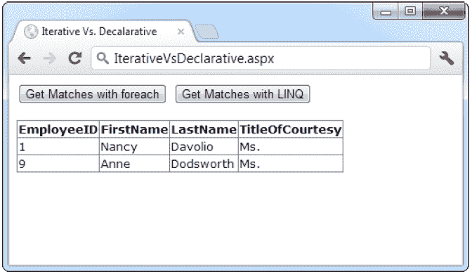

[图 24-1](#_Fig00241) 。使用 LINQ 筛选员工列表

**剖析代码。。。**

*   LINQ 表达式使用了一组新关键字，包括`from`、`in`、`where`和`select`。您可以使用这些关键字来设计您的查询。(从下一节开始，你会看到一些建立表达式的规则。)
*   LINQ 表达式返回一种常见类型的对象，称为*迭代器对象* 。(在这个例子中，迭代器对象被命名为*匹配*。)尽管迭代器对象对您的代码来说看起来像一个普通的集合，但它不包含任何信息。相反，它有能力在你需要的时候获取数据。所以当你用一个`foreach`块检查迭代器对象的内容，或者当你把它绑定到一个控件时，LINQ 会计算你的表达式，并快速获取你需要的信息。这一招叫做*延期执行* 。

 **注意** LINQ 不需要使用延迟执行，但它是一个好方法，原因有几个。在许多情况下，它允许 LINQ 使用性能优化技术，否则是不可能的。例如，当使用 LINQ 到实体的数据库关系时，可以避免加载实际上不使用的相关数据。

*   在这个例子中，迭代器对象(名为 matches)是用关键字`var`定义的。这是一个快捷方式，它告诉 C#编译器使用正确的数据类型，而不强迫您指定它。从技术上讲，迭代器对象可以是几种对象类型中的一种，这取决于您在 LINQ 表达式中使用的子句。但是所有这些对象都实现了 IEnumerable 接口的强类型版本。在本例中，这意味着您可以用 IEnumerable < Employee >替换`var`关键字，因为集合包含 Employee 对象，如果您不介意额外的复杂性的话。但是，无论哪种方式，编译的代码都是完全一样的。如果您使用`var`关键字，编译器会自动将数据类型信息添加到您编译的页面中(尽管您永远看不到这个细节)。

 **提示**你不需要知道你的代码使用的具体迭代器类，因为你通过强类型 IEnumerable 接口与结果交互。但是，如果您很好奇，可以在运行时使用 Visual Studio 调试器来确定对象类型(在中断模式下，只需将鼠标悬停在变量上)。

*   此时，您可能想知道 LINQ 是如何进行过滤的。答案取决于您正在查询的数据类型。例如，LINQ 到实体将 LINQ 表达式转换成数据库命令。因此，LINQ 到实体管道需要打开一个连接并执行一个数据库查询来获取您所请求的数据。但是，如果你使用 LINQ 对象，如前一个例子，LINQ 执行的过程要简单得多。事实上，在这种情况下，LINQ 简单地使用一个`foreach`循环来扫描你的收藏，从开始到结束按顺序行进。尽管这与您最初使用的方法没有任何不同，但是当您使用更复杂的表达式时，它确实提供了更多的可能性。

**LINQ 表情**T2】

在你能更进一步理解 LINQ 之前，你需要理解 LINQ 表达式是如何构成的。LINQ 表达式表面上与 SQL 查询相似，尽管子句的顺序被重新安排了。

所有 LINQ 表达式都必须有一个指示数据源的`from`子句和一个指示要检索的数据的`select`子句(或者一个定义数据应放入的一系列组的`group`子句)。将`from`条款放在最前面:

```cs
var matches = from employee in employees
             ...;

```

`from`子句标识两条信息。紧接在`in`后面的单词标识数据源——在本例中，是名为 employees 的集合对象保存 EmployeeDetails 实例。紧跟在`from`后面的单词指定了一个别名，代表数据源中的各个项目。对于当前表达式，每个 EmployeeDetails 对象都被命名为 employee。然后，您可以在以后构建表达式的其他部分(如筛选和选择子句)时使用此别名。

下面是最简单的 LINQ 查询。它只是从 employees 集合中检索完整的数据集:

```cs
var matches = from employee in employees
             select employee;

```

C#语言包含了更多的 LINQ 操作符，这些在本书中不会详细讨论。在接下来的几节中，您将处理最重要的操作符，包括`select`、`where`和`orderby.`。您可以在 Visual Studio 帮助中查看所有的 LINQ 操作符。你还可以在`http://msdn.microsoft.com/vcsharp/aa336746.aspx`的微软 101 LINQ 样本页面上找到各种各样的表达示例。

**预测**

您可以更改`select`子句来获取数据的子集。例如，您可以提取名字字符串的列表，如下所示:

```cs
var matches = from employee in employees
             select employee.FirstName;
```

或者包含名字和姓氏的字符串列表:

```cs
var matches = from employee in employees
             select employee.FirstName + " " + employee.LastName;
```

如此处所示，您可以在数字数据或字符串上使用标准 C#操作符来修改您选择的信息。这改变了返回的集合类型——它现在是字符串的 IEnumerable < string >集合，而不是 Employee 对象的集合。但是因为这段代码用关键字`var`定义了 matches 变量，所以这段代码可以顺利地继续工作。

更有趣的是，您可以动态定义一个新类，该类只包装您想要返回的信息。例如，如果您希望同时获取名字和姓氏，但又希望将它们存储在不同的字符串中，则可以创建一个精简版的 EmployeeDetails 类，其中只包含名字和姓氏属性。要做到这一点，你需要使用一个被称为*匿名类型*的 C#特性。基本的技术是将`new`关键字添加到`select`子句中，后跟一对花括号。然后，在大括号内，根据您选择的对象分配您想要创建的每个属性。

这里有一个例子:

```cs
var matches = from employee in employees
             selectnew {First = employee.FirstName, Last = employee.LastName};

```

该表达式在执行时返回一组使用隐式创建的类的对象。每个对象都有两个属性:First 和 Last。您永远看不到类定义，因为它是由编译器生成的，并被赋予一个无意义的自动创建的名称。(因此，您不能将自动生成的类的实例传递给代码的其他部分。)但是，您仍然可以在本地使用该类，访问第一个和最后一个属性，甚至将它用于数据绑定(在这种情况下，ASP.NET 使用反射通过属性名提取适当的值)。将您正在查询的数据转换成具有不同结构的结果的能力被称为*投影*。

图 24-2 显示了将 matches 集合绑定到 GridView 的结果。

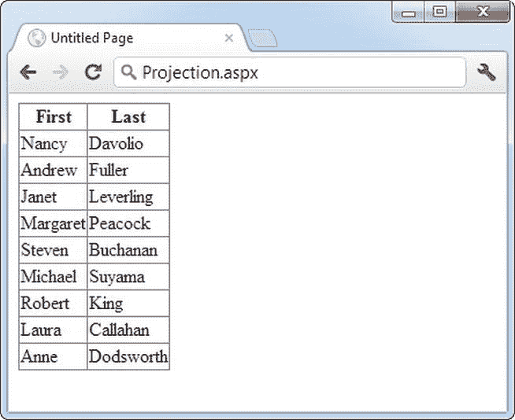

[图 24-2](#_Fig00242) 。将数据投影到新的表示中

当然，在执行投影时，不需要使用匿名类型。您可以正式定义类型，然后在表达式中使用它。例如，如果您创建了以下 EmployeeName 类:

```cs
public class EmployeeName
{
    public string FirstName { get; set; }
    public string LastName { get; set; }
}
```

您可以在查询表达式中将 EmployeeDetails 对象更改为 EmployeeName 对象，如下所示:

```cs
var matches = from employee in employees
             select new EmployeeName {FirstName = employee.FirstName,
             LastName = employee.LastName};

```

这个查询表达式是可行的，因为 FirstName 和 LastName 属性是可公开访问的，并且不是只读的。创建 EmployeeName 对象后，LINQ 设置这些属性。或者，您可以在 EmployeeName 类名后添加一组括号，并为参数化构造函数提供参数，如下所示:

```cs
var matches = from employee in employees
             select new EmployeeName(firstName, lastName);

```

**过滤和排序**

在本章的第一个 LINQ 例子中，您看到了一个`where`子句如何过滤结果，只包括那些符合特定条件的结果。例如，您可以使用此代码查找姓氏以特定字母开头的雇员:

```cs
var matches = from employee in employees
             where employee.LastName.StartsWith("D")
             select employee;

```

`where`子句采用一个条件表达式，对每一项进行评估。如果为真，该项目将包含在结果中。然而，LINQ 保留了相同的延迟执行模型，这意味着在您尝试迭代结果之前，不会计算`where`子句。

正如您可能已经预料到的那样，您可以用*和* ( & &)和*或* (||)运算符组合多个条件表达式，并且可以将关系运算符(如<、< =、>和> =)与硬编码的值或其他变量结合使用。例如，您可以创建这样的查询来筛选出高于某个价格阈值的产品:

```cs
var matches = from product in products
             where product.UnitsInStock > 0 && product.UnitPrice > 3.00 M
             select product;

```

LINQ 表达式的一个有趣的特性是，你可以轻松地内联调用自己的方法。例如，您可以创建一个名为 TestEmployee()的函数，该函数检查一名雇员，并根据您是否希望将该雇员包含在结果中来返回 true 或 false:

```cs
private bool TestEmployee(Employee employee)
{
    return employee.LastName.StartsWith("D");
}
```

然后，您可以像这样使用 TestEmployee()方法:

```cs
var matches = from employee in employees
             whereTestEmployee(employee)
             select employee;

```

操作符同样简单明了。它模仿了 SQL 中 Select 语句的语法。您只需提供一个或多个用于排序的值的列表，用逗号分隔。

下面是一个基本的排序示例:

```cs
var matches = from employee in employees
             orderby employee.LastName, employee.FirstName
             select employee;

```

您也可以在字段名后添加单词*降序*以逆序排序:

```cs
var matches = from employee in employees
             orderby employee.LastNamedescending, employee.FirstNamedescending
             select employee;

```

关于 LINQ 的表达，你可以学到更多。事实上，整本书都是关于 LINQ 的，包括全面的 *Pro LINQ:语言综合查询* (Apress)。但是你现在知道了 LINQ 表情的要领，这足以让你用另一种不同凡响的方式来使用它。NET 特性:实体框架。

**使用实体框架**

对于自己动手的数据访问，有很多东西可以说。它允许您将数据层从 web 应用的其余部分中分离出来，甚至将数据组件交给完全不同的程序员。因为所有的细节都在显式的 ADO.NET 代码中，所以你可以自由地修改它们，而不会影响到你的网页代码。这种方法允许您随着应用的发展而改变您的数据策略——无论您只是想用存储过程调用替换硬编码的查询，还是您有一个更雄心勃勃的计划，例如实现一个数据记录系统或使用数据库缓存无效(一个在第 23 章中描述的特性)。

但是尽管有这些好处，未来的趋势是越来越方便地处理数据。这种转变始于基本的数据绑定([第 15 章](15.html))，并随着丰富的数据显示控件如 GridView ( [第 16 章](16.html))和无代码数据源控件([第 15 章](15.html))而得到加强。现在，ASP.NET 的开发者拥有了微软迄今为止发明的最雄心勃勃的高级数据访问工具:实体框架。

简单来说，实体框架提供了一种基于数据库结构生成代码的方法。例如，如果您将 Visual Studio 指向 Northwind 数据库，它将使用实体框架来创建对各种类型的记录(客户、雇员、产品等)进行建模的类。它还将生成数据访问代码，您可以使用这些代码来操作这些数据，例如，当您希望在页面中显示这些数据时查询这些数据，当您需要提交用户的更改时更新这些数据。虽然实体框架在技术上是 ADO.NET 的一部分(并且它在幕后使用熟悉的 ADO.NET 类)，但是当你使用实体框架时，你不用担心这些细节。您不用编写自己的 ADO.NET 代码，而是让实体框架为您处理所有的细节。

这种自动代码生成系统并不新鲜。事实上，数百家公司和独立开发人员已经花了数年时间发明了自己的自动构建数据代码的技术。其中一些技术相当不错(有些甚至类似于实体框架)。然而，许多人受到严重的限制。虽然它们使程序员的基本数据库操作变得更容易，但它们无法处理更复杂的场景，如调用存储过程、使用不同类型的关系数据库产品、将数据转换成不同的表示、处理错误以及将多个表中的数据组合成一组对象。尽管实体框架不能完全取代传统的 ADO.NET，但它处理了所有这些问题，这使得它成为需要快速创建数据驱动应用的开发人员的一个实用选择。

实体框架并不适合所有人。如果您已经习惯于使用传统的 ADO.NET 对象，您可能会发现实体框架并没有带来什么好处，反而增加了复杂性，因为它在您的网页代码和数据库之间放置了一个全新的层。如果您需要从 web 应用中挤出每一毫秒的速度，那么实体框架也不是正确的选择，因为附加层总是会增加一些额外的开销，即使它们被设计得尽可能仔细和巧妙。

为了了解实体框架是如何工作的，您可以试一试。在接下来的小节中，您将看到如何创建一个实体数据模型，并使用它来检索和更新数据。

创建实体数据模型

使用实体框架的第一步是向您的网站添加实体数据模型。在解决方案资源管理器中右键单击您的网站，然后选择添加新项目(或从菜单中选择网站添加新项目)。选择列表中的首选 ADO.NET 实体数据模型模板，并提供一个好的名称([图 24-3](#Fig00243) )。例如，如果您正在为 Northwind 数据库创建一个模型，那么命名 Northwind.edmx 是有意义的。(分机*。edmx* 代表*e*entity*d*ATA*m*odel。)完成后，点按“添加”。

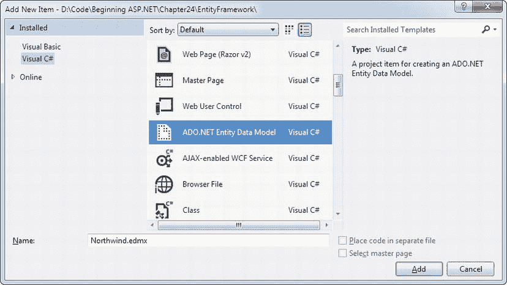

[图 24-3](#_Fig00243) 。创建实体数据模型

当您将模型添加到无项目网站(相对于 web 项目)时，Visual Studio 会通知您需要将自动生成的代码放在 App_Code 文件夹中。单击“是”允许它自动执行此操作。

接下来，Visual Studio 启动实体数据模型向导。第一步询问您是希望从现有的数据模型生成您的模型(这是最快的方法)还是手动定义您的所有实体(选择空模型)。在大多数情况下，最好的办法是让 Visual Studio 为您完成这项工作，因为您可以随时更改它创建的实体或删除您不需要的实体。选择后，单击“下一步”进入下一步。

 **注意**一个*实体*只是数据对象的另一个术语。每个实体存储关于特定数据项的信息。(在最简单的情况下，每个实体对应于表中的一条记录。)

在下一步中，您将为您的数据库选择连接。如果你已经在服务器浏览器中定义了连接(正如你在[第 14 章](14.html)中所学的)，它会自动出现在下拉连接列表中([图 24-4](#Fig00244) )。如果没有，您需要单击新建连接按钮来创建它，然后再继续。关于在 Visual Studio 中创建数据库连接的更多信息，请参考[第 14 章](14.html)。

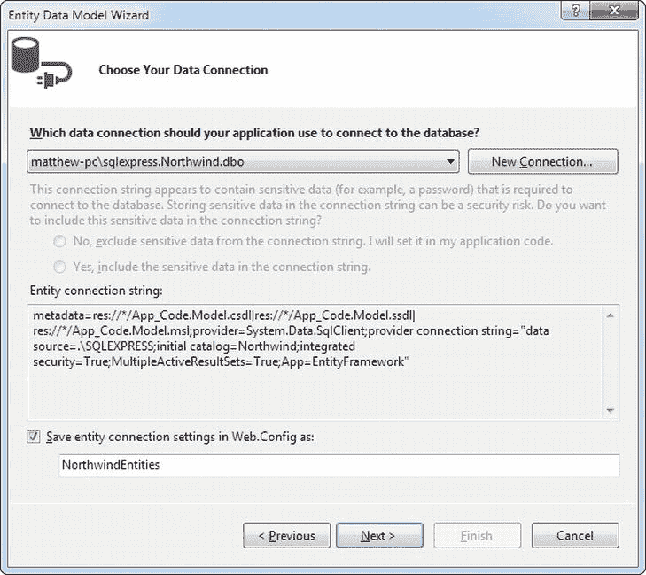

[图 24-4](#_Fig00244) 。指定你的数据库连接

Visual Studio 将您的连接的连接字符串存储在 web.config 文件的< connectionStrings >部分，这允许您在以后快速方便地更改它。默认情况下，它采用您的连接的名称，并添加单词 *Entities* 来命名您的连接字符串(如在 NorthwindEntities 中)，但是如果您愿意，您可以键入其他内容。完成后，单击“下一步”继续。

在第三步中，Visual Studio 连接到您的数据库并检索其所有表、视图和存储过程的完整目录。然后，您可以选择要在模型中包含哪些数据库项，并为其生成代码。通常，您会一次选取所有的表，这样，如果需要的话，您就可以访问所有的数据(这样，您的表之间的所有关系都会保留)。但是，您也可以选择单个表格，方法是在要包含的表格旁边放置一个复选标记。图 24-5 显示了一个例子，它包含了所有的表，但是告诉 Visual Studio 只为其中一个存储过程(十个最昂贵的产品)生成代码。

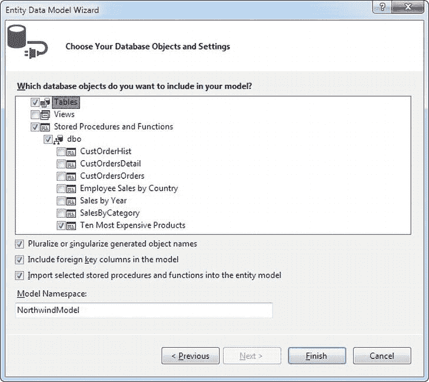

[图 24-5](#_Fig00245) 。指定您的数据库连接

向导的这一步还为您提供了两个附加选项:

*   *复数或单数对象名* *:* 这个有些令人困惑的选项告诉 Visual Studio 在创建数据类时使用非常智能的名称生成算法。如果您选择此选项(大多数人都这样做)，Visual Studio 将创建一个产品项来表示 Products 表中的每条记录。但是，它将添加一个 Product *的*属性来表示 ProductCategory 记录所引用的产品集合。简而言之，Visual Studio 自动使用最符合逻辑的名称。但是 Visual Studio 的名称生成比简单地添加和删除字母 *s* 要复杂得多。例如，Visual Studio 可以正确地将*地址*、*领地*、*人*到*地址*、*领地*、*人*等单词复数化。这是因为它依赖于一个庞大的复数词典，该词典列出了英语名词的单复数形式。
*   *包含外键列* *:* 该选项决定 Visual Studio 是否在您的数据模型中包含外键列。否则，每个实体都将是一个完全不同的对象，没有与任何其他实体的链接。如果这样做(这是最常见的方法)，您将能够通过使用属性来导航数据中的关系。例如，您将能够通过使用自动生成的导航属性(如 ProductCategory.Products)来查找特定类别中的所有产品。

完成此步骤后，单击“完成”。Visual Studio 生成模型。您将在 App_Code 项目文件夹中拥有两个新文件:您最初指定的模型文件(例如，Northwind.edmx)和包含为该模式自动生成的 C#代码的文件(例如，Northwind)。Designer.cs)。您将在下一节了解这两个文件。

探索数据模型图

的。edmx 模型文件实际上是一个冗长的 XML 文档，它详细描述了数据库的结构。例如，它列出了您选择包含的所有表、它们的数据类型、关系等等。这是您的应用操作模型所需的基本信息。的。edmx 文件不包含任何数据，这些数据安全地存储在数据库中。

虽然您可以查看。文本编辑器中的 edmx 文件，XML 过于复杂和详细，不值得手动编辑。相反，Visual Studio 提供了一个可视化设计器来表示。edmx 文件通过使用数据库表的蔓延图。要查看该设计器，只需双击您的。方案总管中的 edmx 档案。图 24-6 显示了 Northwind 数据库的部分实体数据模型。

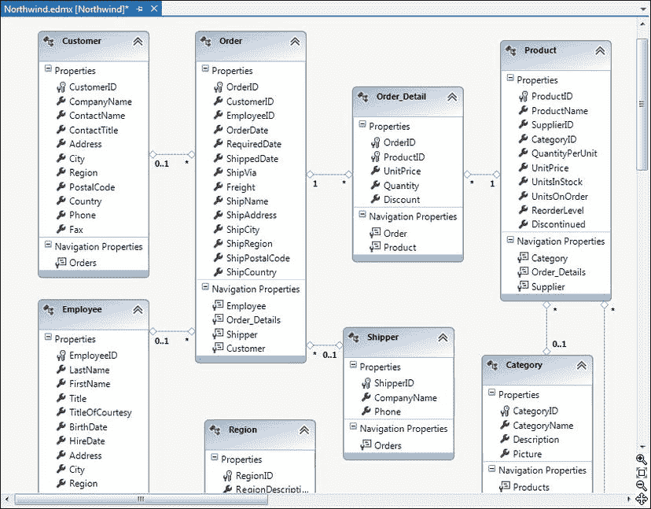

[图 24-6](#_Fig00246) 。北风实体数据模型的一部分

下面是理解数据模型图的快速指南:

*   数据模型中的每个框都是一个实体，对应于数据库中的一个表。
*   每个实体包括两种类型的属性。第一个是*数据属性*——它们对应于实际表中的字段。第二个是*导航属性*——它们是一种编码便利，允许您从一个表跳到另一个表中的相关记录(这个技巧您将在本章后面用到)。

 **提示**如果你的表塞满了属性，数据模型图会很快变得混乱。在这种情况下，您可以通过单击表格框右上角的向上箭头来隐藏表格的属性列表。这将折叠表格框，使其仅显示表格名称。再次单击右上角以展开列表。

*   表格之间的虚线表示关系。您将了解更多关于 0 的信息..1 、 *1* 和 *** 字符，详见本章后面的“导航关系”部分。

使用实体数据模型设计器，您可以优化您的数据模型。尽管您几乎可以更改每个细节，但有些定制比其他定制更容易、更有用。

以下是你可以做出的一些基本改变:

*   *重新排列实体:*大多数人从拖动图上的实体开始。这不会改变模型的工作方式，但可能会使您更容易调查数据库的整体结构。
*   *删除不需要的实体:*只需选中实体，按 Delete 键即可。(不要担心，您可以随时通过更新您的数据模型将它们添加回来。)您可以做同样的事情来删除不必要的字段，但是这样做通常不值得——而且有可能会删除应用无法触及的一些重要信息。

 **注意**当你对一个数据模型进行修改时，比如删除和重命名项目，这些修改影响的是模型，*不是*你的数据库。

*   *重命名实体:*双击实体名，输入更好的就可以了。这改变了您在代码中使用的名称，但是实体框架足够智能，可以继续查询数据库中的原始表。例如，如果您有一个像 pub_info 这样的表(在 Pubs sample 数据库中),您可以使用这个技巧给它起一个更加代码友好的名字，比如 PublicationInfo。
*   *重命名字段:*每个数据库设计者都知道，当一个数据库处于活动和使用状态时，您不能冒险重命名它的字段或对象。有时，这意味着您需要接受模糊的或不真实的字段名。但是，您可以在模型中重命名它们并简化代码，只需右键单击该字段并选择 rename。一些开发人员喜欢从不重命名，这样他们的数据模型就能与数据库的实际情况紧密匹配。这有助于避免可能的混淆(例如，您不需要查找真实的字段名称来编写存储过程)。但是，如果您疯狂地对字段进行重命名，重要的是要认识到有一种快速的方法来查看原始名称。只需右键单击一个表格并选择“表格映射”即可弹出一个窗口，列出每个属性的基础字段名称([图 24-7](#Fig00247) )。

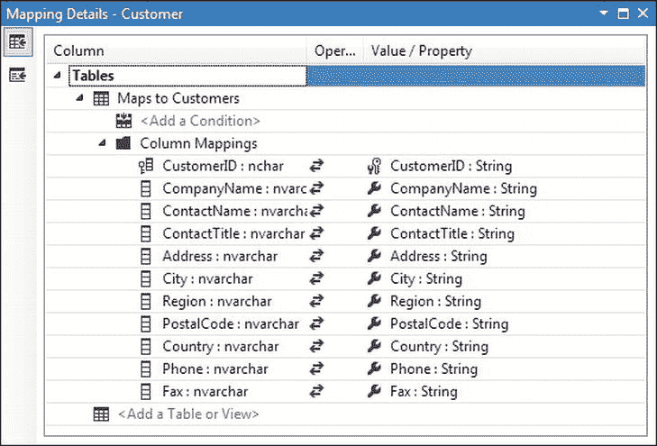

[图 24-7](#_Fig00247) 。表映射窗口中的重命名字段

*   *更改字段属性:*虽然这对于大多数开发人员来说太专业了，但是您可以使用 properties 窗口来调整细节，包括每个属性的数据类型、它的默认值、它是否有固定长度、它是否允许空值等等。通常，这些详细信息是从数据库中提取的，但要补充它们，只需右键单击一个字段并选择属性。

更新数据模型

在某些时候，您可能需要添加或刷新模型，以考虑对数据库所做的更改。幸运的是，实体框架使这项任务变得容易。只需右键单击模型中的任意位置，然后选择“从数据库更新模型”您将看到更新向导，它只有一个步骤([图 24-8](#Fig00248) )。

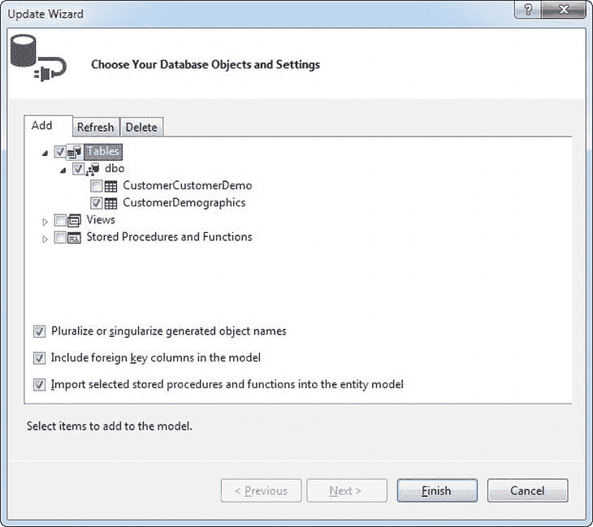

[图 24-8](#_Fig00248) 。向数据模型添加表

更新向导中有三个选项卡:

*   *Add:* 该选项卡允许您向模型添加新的数据库对象。您可以通过选择相应的复选框来选择要添加的对象，就像您第一次创建模型时所做的那样。
*   *Refresh:* 这个选项卡简单地列出了当前在您的模型中(以及在后端数据库中)的数据库对象。作为更新过程的一部分，Visual Studio 将检查所有这些对象的更改并重新生成它们。所有这些都不会干扰您所做的定制(比如字段名称映射)。
*   *删除:*该选项卡列出了您的模型中但不再在数据库中的数据库对象。当您执行更新时，Visual Studio 会将它们从您的模型中一起移除。

当您从“添加”选项卡中选择了所需的新对象并查看了“刷新”和“删除”选项卡中的信息后，单击“完成”以执行更新。

 **提示** Visual Studio 提供了一个漂亮的工具，可以让你做相反的事情，生成一个基于数据模型的数据库。您可以使用这个技巧在另一台计算机上重新创建一个数据库，或者您可以使用数据模型设计器创建一个新的数据模型，然后使用该数据模型构建一个新的数据库。要尝试此功能，请右键单击数据模型设计器上的任意位置，然后选择“从模型生成数据库”。

审核数据模型代码

数据模型设计器非常巧妙，但是要真正使用你的数据模型，你需要一些幕后代码的帮助。像数据模型 XML 一样，这段代码又长又乏味，所以你不会想从头到尾通读一遍。但是，如果回顾一下应用的基本设计和组织，您会对它的工作原理有更好的理解。

所有数据模型代码都包含在 App_Code 文件夹中的. Designer.cs 文件中。(在当前示例中，它是 Northwind.Designer.cs。)

所有代码都放在一个名称空间中，这个名称空间具有您的数据模型的名称，加上单词 *Model* ，就像在 NorthwindModel 中一样。如果您浏览代码，您会立即发现一些问题。

首先，您会注意到属性(方括号中的描述性信息)遍布各处。这些属性将各种代码连接到它们所代表的后端数据库。例如，考虑以下属性:

```cs
[EdmEntityTypeAttribute(NamespaceName = "NorthwindModel", Name = "Employee")]
```

它将下面的 Employee 类连接到数据模型中的 Employee 表。尽管像这样的属性对于实体框架的运行至关重要，但是您自己并不需要关注它们。

您将注意到的下一个设计细节是代码被分成两个区域:实体和上下文。*区域*仅仅是一个组织特性，让你可以暂时隐藏代码块。然而，数据模型中的区域强调了实体框架使用的两种类型的类。

**实体**

*实体*是数据对象——代表数据库中记录的类。实体框架为每个表使用一个单独的实体类，在 Northwind 数据库示例中，您将拥有这样的类:Customer、Product、Order、Order_Detail、Employee、Shipper、Region 等等。它们都是从一个名为 EntityObject 的基类派生的，这个基类为它们提供了对变更跟踪和其他实体框架特性的支持。

正如您在数据模型中看到的，每个实体类都有相同的基本结构。它由数据属性(也称为*原始属性*)组成，这些属性对应于让您找到相关数据的字段和导航属性。例如，Employee 类具有 FirstName、LastName 和 EmployeeID 等数据属性。它还具有导航属性，如订单和区域。

如果您更深入地研究属性过程代码，您会发现相当多的样板代码用于跟踪更改、引发事件以及与实体框架的内部机制进行通信。最后，每个实体类还包括一个静态工厂方法，它允许您创建一个新的、完全正确初始化的实体对象。例如，你可以打电话给雇员。CreateEmployee()并传递适当的参数来创建一个新的 Employee 对象，您很快就会看到这一点。

**语境**

实体负责表示数据，而*上下文*负责数据访问——代码从数据库中获取您想要的记录，并在您准备好时提交更改。每个数据库都需要一个单独的上下文类，这意味着 Northwind 数据模型示例只获得一个上下文。它被称为 NorthwindEntities，它派生自一个名为 ObjectContext 的基类。

context 类包含数据库中每个表的集合。例如，在 NorthwindEntities 类中，有一个返回雇员实体对象集合的雇员属性，一个返回产品对象集合的产品属性，等等。这些属性是使用数据模型的起点。例如，如果您通过 Products 属性检索并显示产品对象的集合(如下一节所示)，实体框架会悄悄地联系您的数据库，查询 Products 表，并创建您需要的对象。然后，它将它们缓存在内存中，这样您就不需要再次重复这个过程(至少在下一次回发之前不需要)。

 **注意**与数据模型图不同，您不应该更改任何数据模型代码，因为当数据库发生变化并且您刷新数据模型时，您的更改将被清除。通过编写添加到 Visual Studio 创建的自动生成的类中的分部类(在另一个文件中),可以*扩展*数据模型。但是，这是一种高级技术，除非您有丰富的实体框架经验和明确的目标(例如，您想为您的实体添加内置属性验证)，否则不推荐使用。

查询数据模型

现在您已经浏览了数据模型代码，可以在应用中使用它了。事实上，这非常简单。

考虑在[图 24-9](#Fig00249) 中显示的产品的简单数据绑定网格。要创建此页面，首先需要导入 NorthwindModel 命名空间:

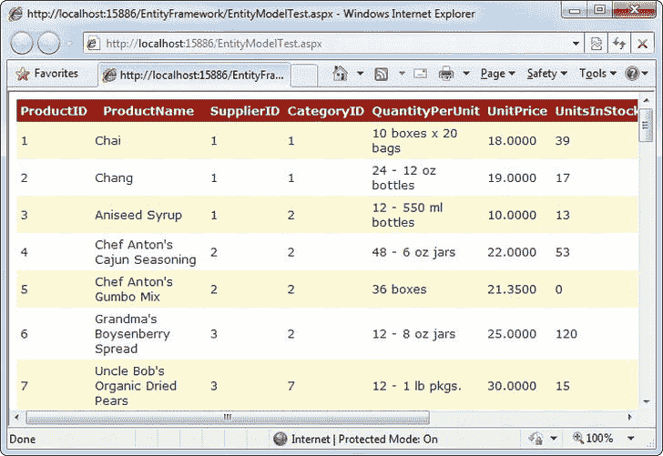

[图 24-9](#_Fig00249) 。通过数据模型检索的产品

```cs
using NorthwindModel;
```

然后，只需实例化 NorthwindEntities 类，从 Products 属性中检索集合或产品对象，并调用 DataBind():

```cs
NorthwindEntities entities = new NorthwindEntities();
  GridView1.DataSource = entities.Products;
  GridView1.DataBind();
```

与所有上下文类一样，NorthwindEntities 类有三个构造函数。如果使用无参数构造函数(如本例所示)，它将使用 web.config 文件中定义的连接字符串。或者，您可以使用一个构造函数，该构造函数允许您以 string 或 EntityConnection 对象的形式提供连接字符串。

处理错误

无论何时访问数据库，都需要使用正确的错误处理代码，实体框架也不例外。然而，实体框架很容易误导开发人员将他们的异常处理代码放在错误的地方。

如您所知，数据访问的风险部分是您执行的连接操作—例如，打开连接和执行 SQL 命令。由于各种原因，您尝试联系数据库或与之通信可能会失败。数据库服务器可能脱机，数据库服务器可能被太多的并发连接淹没，您要使用的表可能不存在，等等。基于这些考虑，您可能希望将异常处理代码放在读取产品集合的代码周围。在前面的例子中，这意味着您将把您的异常处理程序包装在这个语句周围:

```cs
GridView1.DataSource = entities.Products;
```

这似乎有道理，但不正确。虽然这一行代码看起来是访问产品集合，但它检索的是不同的东西——一个特殊的迭代器对象，只要您试图使用它，它就能获得您需要的数据。这个花招是 LINQ 的*延迟执行*特性的一部分，你在前面已经了解过了。

通常，使用实体框架的数据库操作比您预期的要晚。当您创建上下文对象或访问其属性时，它们不会发生。相反，当您迭代实体集合或访问单个实体对象时，它们会发生。在前面的示例中，数据库工作发生在您调用 GridView1 时。DataBind()，因为这告诉 GridView 迭代 Products 集合，然后触发实体框架获取您的数据。

因此，正确的错误处理解决方案如下所示:

```cs
NorthwindEntities entities = new NorthwindEntities();
GridView1.DataSource = entities.Products;
try
{
    GridView1.DataBind();
}
catch (Exception err)
{
    // (Do something here, like displaying an error message.)
 ... `}`
```

 `因为实体框架是基于 ADO.NET 的，你会看到许多你在第 14 章中看到的熟悉的异常对象，比如 SqlException。

 **注意**稍后您将会看到，您可以强制实体框架更早地加载您的数据。但是，这样做可能会损害代码的性能或灵活性。大多数时候，您将坚持延迟执行，尽管它会导致潜在的混乱。

不幸的是，使用实体框架的应用中的错误处理并不总是这么简单。在更复杂的例子中，数据库操作可能发生在几个地方。例如，在下一节中，您将看到如何使用关系来显示不同表中的相关信息。采用这种方法时，每当您开始用一个`foreach`块迭代一个新的记录集合时，就会发生一个数据库操作。

那么，有什么解决办法呢？一种方法是使用 ToList()方法，该方法将任何实体集合转换为普通的内存集合，并在此过程中触发数据库查询:

```cs
NorthwindEntities entities = new NorthwindEntities();
GridView1.DataSource = entities.Products.ToList();
GridView1.DataBind();
```

尽管这使得数据访问操作更加可预测，但这是一种危险的做法。正如您将在“用 LINQ 查询实体”一节中看到的，延迟执行允许 LINQ 和实体框架优化数据库查询。如果您养成了调用 ToList()的习惯，您就有效地规避了这种机制，这可能会损害您的应用的性能。

如果您不想担心异常可能发生的确切代码位置，您可以使用更好的解决方案——只需将所有内容包装在一个巨大的异常处理块中，该块捕获特定于数据库的异常。最直接的方法是将数据访问代码转移到另一个方法中。然后，您可以将方法调用包装在异常块中，如下所示:

```cs
try
{
    // Call the method that does all the data processing and display.
    DataBindProductGrid();
}
catch (SqlException err)
{
    ...
}
```

最后，作为最后的手段，你可以处理申请。第 5 章中描述的错误事件，用于处理任何遗漏的问题。

导航关系

实体框架有一种特别优雅的处理关系的方式。通过使用在数据模型中定义的导航属性，您可以简单地从一个记录移动到它的相关数据，而不是强迫您使用特定的方法或单独的查询。

这一切都从实体模型图开始。你会看到虚线表示每一种关系。例如，考虑图 24-10 中[所示的图表部分。](#Fig002410)

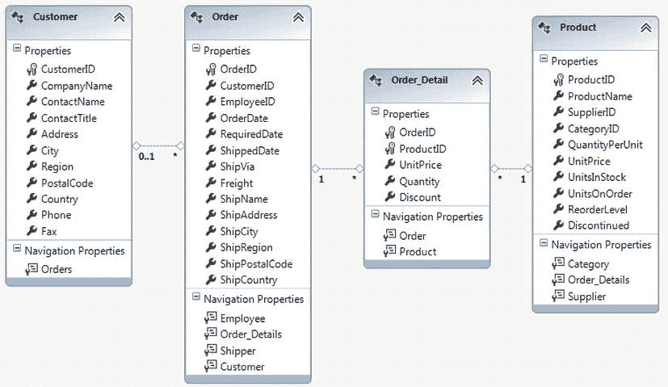

[图 24-10](#_Fig002410) 。客户、订单、Order_Detail 和产品实体之间的关系

*0..虚线两端的 1* 、 *1* 和 *** 字符为您提供关于关系的附加信息。

例如，从 1 到*(例如，在 Order 和 Order_Detail 实体之间)的关系线表示一对多关系。第一个表(Order)中显示 1 的每个父记录在显示*的子表(Order_Detail)中有一个或多个匹配项。(要找出给定关系中涉及的字段，需要双击关系线。)

从 0 开始的关系线..1 到*表示允许空值的一对多关系。换句话说， *0* 表示可能没有匹配。例如，在[图 24-10](#Fig002410) 所示的数据模型中，顺序。CustomerID 属性可以为空。这意味着对于每个订单记录，可能有一个匹配的客户实体，也可能没有。

多对多关系

从*到*的关系线表示借助连接表连接的多对多关系。例如，在 Northwind 数据库中，每个客户记录可以有一个或多个关联的 CustomerDemographic 记录，每个 CustomerDemographic 记录可以有一个或多个关联的客户记录。为了实现这种设计，数据库使用一个名为 CustomerCustomerDemo 的连接表。本质上，CustomerCustomerDemo 中的每条记录都是一对，将 Customers 中的一条记录链接到 CustomerDemographics 中的一条记录。(事实上，CustomerCustomerDemo 只有两个字段:指向 Customers 表的 CustomerID 和指向 CustomerDemographics 表的 CustomerTypeID。)

这种设置可能看起来有点笨拙，但它是数据库图表的标准部分。最棒的是，实体框架足够智能，能够识别这种关联。实体框架只生成 Customer 和 CustomerDemographic 实体，而不是将表模型准确地转换为实体类(并创建 Customer、CustomerDemographic 和 CustomerCustomerDemo 实体)。它通过使用集合的力量将它们联系在一起，为您提供了一个更自然的对象模型。

最棒的是，实体框架在幕后管理 CustomerCustomerDemo 表。例如，如果您为现有客户添加一个新的相关 CustomerDemographic(您将在本章后面学习如何操作)，实体框架会自动创建连接它们的 CustomerCustomerDemo 记录。

实体模型图中出现的关系也通过导航属性来表示。例如，如果你查看图 24-10 中[订单框的底部，你会看到四个导航属性。Customer、Employee 和 Shipper 属性返回一个链接的父记录，如果不存在父记录，则返回 null。换句话说，秩序。客户返回下订单的客户。Order_Details 属性返回链接的子记录的集合(如复数属性名所示)。换句话说，秩序。Order_Details 以 Order_Detail 对象的形式提供给定订单中所有订单项的集合。](#Fig002410)

下面是一个使用这些导航属性在页面中显示一些信息的例子，没有数据绑定。它首先检索客户列表，然后检索每个客户所下订单的一些信息:

```cs
NorthwindEntities entities = new NorthwindEntities();
// Build a string full of HTML markup.
StringBuilder sb = new StringBuilder();
foreach (Customer customer in entities.Customers)
{
    // Write out the customer information in bold.
    sb.Append(" < b > ");
    sb.Append(customer.CompanyName);
    sb.Append("</b > <br />");
    // List this customer's orders.
    foreach (Order order in customer.Orders)
    {
        sb.Append(order.OrderID.ToString());
        sb.Append(" - made on date: ");
        sb.Append(order.OrderDate.Value.ToShortDateString());
        sb.Append(" < br />");
    }
    // Add a horizontal line.
    sb.Append(" < hr /> < br />");
}
// Show the HTML in a Label control.
lblData.Text = sb.ToString();
```

图 24-11 显示了结果。

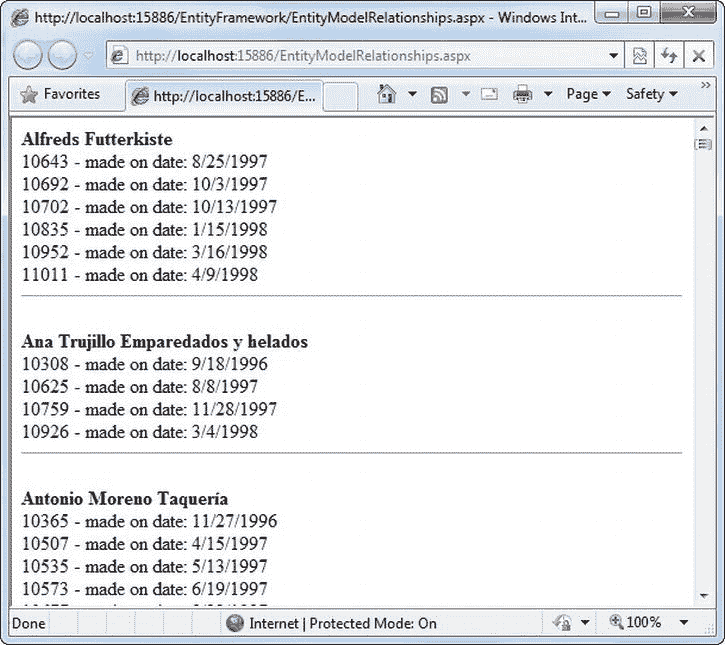

[图 24-11](#_Fig002411) 。驾驭一段关系

 **提示**为这类代码编写异常处理逻辑可能会很棘手。每当您启动一个`foreach`块时，就会发生数据库操作(要么处理客户列表，要么查看给定客户的订单)。为了防止代码陷入混乱的意大利面条式异常处理程序，最好将所有这些逻辑放在一个专用的方法中，并将方法调用包装在异常处理块中，如前一节所述。

**通过实体框架获得更高级的功能**

如果实体框架只是另一种轻松执行数据库查询的方式，那就没什么意思了。毕竟，开发人员已经有了几个非常好的替代方案，包括编写几行 ADO.NET 代码来填充数据集，以及使用 SqlDataSource 之类的数据源控件。然而，当您考虑到实体框架执行目标 LINQ 查询、跟踪变更和进行更新以及针对不同的表以不同的方式管理并发性的能力时，它就变得有趣多了。在接下来的小节中，当您对实体框架采取下一步措施时，您将考虑所有这些主题。

用 LINQ 向实体查询

正如您在本章前面所学的，LINQ 是一种通用的查询语法，适用于各种数据源。正如您可能期望的那样，有一种 LINQ 风格是为实体框架定制的，称为实体的 LINQ。使用实体 LINQ，您可以编写作用于数据库的查询。事实上，这很简单——您只需要查询由数据上下文类公开的集合，就像您在本章开始时使用对象的 LINQ 查询内存中的集合一样。使这一工作的幕后管道是完全不同的，但是语法是相同的。例如，以下代码片段获取特定客户的订单:

```cs
NorthwindEntities entities = new NorthwindEntities();
gridProducts.DataSource =    from order in entities.Orders
                             where order.CustomerID == "ALFKI"
                             select order;
GridView1.DataBind();
```

 **注**实体框架和 LINQ 到实体之间没有明确的分界线。正如您已经了解到的，即使您简单地使用了 context 对象的完整集合，您的代码仍然表现得好像在使用 LINQ 表达式一样。(例如，您仍然会得到特殊的迭代器对象和延迟执行，这优化了性能并使错误处理变得复杂。)

图 24-12 显示了一个更完整的网页示例。DropDownList 控件显示产品类别列表(取自 product categories 表)。然后，用户选择一个类别，下面的 GridView 会自动刷新，只显示该类别中的产品。

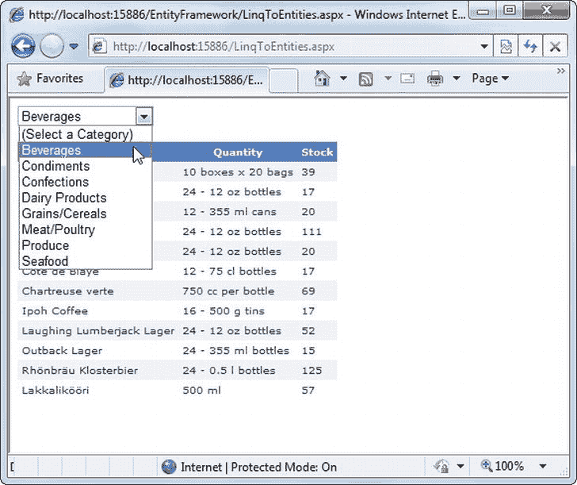

[图 24-12](#_Fig002412) 。浏览产品类别

要构建这个应用，首先需要定义标记。在这个例子中，标记有两个有趣的细节。首先，DropDownList 控件添加一个带有文本*(选择一个类别)*的列表项:

```cs
<asp:DropDownList ID = "lstCategories" runat = "server" AutoPostBack = "True"
 OnSelectedIndexChanged = "lstCategories_SelectedIndexChanged"
 AppendDataBoundItems = "True">
 <asp:ListItem Text = "(Select a Category)" Value = "-1" > </asp:ListItem>
</asp:DropDownList>
```

页面第一次出现时，*(选择一个类别)*项可见，GridView 留空。多亏了 AppendDataBoundItems 属性(该属性被设置为 true)，这个硬编码的项在列表中名列前茅。(下面将添加数据绑定产品类别。)

第二个控件是 GridView，它非常简单。它包括一些基本的样式属性(通过使用自动格式功能设置),除此之外没有什么特别之处:

```cs
<asp:GridView ID = "gridProducts" runat = "server" CellPadding = "4" GridLines = "None"
Font-Size = "X-Small" ForeColor = "#333333" AutoGenerateColumns = "True">
    ...
</asp:GridView>
```

在代码隐藏文件中，NorthwindEntities 对象被创建为页面的成员变量。这样，任何事件处理程序都可以使用该对象。当页面首次加载时，代码从 NorthwindEntities 获取产品类别信息。类别集合并将其绑定到下拉列表:

```cs
private NorthwindEntities entities = new NorthwindEntities();
protected void Page_Load(object sender, EventArgs e)
{
    if (!this.IsPostBack)
    {
        lstCategories.DataTextField = "CategoryName";
        lstCategories.DataValueField = "CategoryID";
        lstCategories.DataSource = entities.Categories;
        lstCategories.DataBind();
    }
}
```

DropDownList 将 AutoPostBack 属性设置为 true，这样一旦用户选择了一个类别，页面就会被回发。此时，SelectedIndexChanged 事件触发。事件处理程序从 NorthwindEntities 中检索匹配的产品记录。产品集合，使用如下所示的 LINQ 查询:

```cs
protected void lstCategories_SelectedIndexChanged(object sender, EventArgs e)
{
    int selectedID = Int32.Parse(lstCategories.SelectedValue);
    if (selectedID == -1)
    {
        // The "(Select a Category)" item was picked.
        // Don't show anything.
        gridProducts.DataSource = null;
    }
    else
    {
        // Query the products in the selected category.
        gridProducts.DataSource = from product in entities.Products
                                 where product.CategoryID == selectedID
                                 select new
                                 {
                                     Name = product.ProductName,
                                     Quantity = product.QuantityPerUnit,
                                     Stock = product.UnitsInStock
                                 };
    }
    gridProducts.DataBind();
}
```

这个例子使用了两个 LINQ 特征。首先，`where`子句应用过滤来查找特定类别中的产品。第二，`new`关键字使用投影特性，它用产品数据的子集创建一个新对象。这就是图 24-12 中的 GridView 只显示三个字段的原因。(另一种方法是配置 GridView。专栏集合，正如你在第 16 章中所学的那样。但是这个例子显示了 LINQ 即时重塑数据的能力。)

在这一点上，你可能想知道所有的大惊小怪是什么。毕竟，这里显示的查询看起来完全像一个普通的作用于 NorthwindEntities 的 LINQ 对象查询。产品系列。但是这段代码的工作方式有很大的不同。

在对象的 LINQ 查询中，所有信息都保存在内存中。LINQ 只是在上面循环，挑选出你想要的东西。但是在对实体的 LINQ 查询中，信息是通过使用延迟执行直接从数据库中提取的。直到您绑定数据或开始对数据进行迭代，LINQ 才会执行查询。因此，LINQ 能够把你的表达变成一个微调的数据库查询。

这种差异对性能有重要影响。如果只是简单地使用 LINQ 对象，就需要对所有产品记录执行查询，将所有数据加载到内存中，然后丢弃不需要的记录和字段。这给数据库服务器带来了额外的工作，降低了网页的速度，并占用了 web 服务器上更多的内存。但是当你使用 LINQ 实体时，你只能获取你需要的记录和字段。因此，不要像这样使用 SQL 命令:

```cs
SELECT * FROM Products
```

LINQ 给实体创建了一个更像这样的命令:

```cs
SELECT ProductName, QuantityPerUnit, UnitsInStock FROM Products WHERE CategoryID = 1
```

LINQ 表达式中的`where`子句成为 SQL Select 语句中的 Where 子句。您用于创建投影的三个字段将成为您在查询中检索的三个字段。结果是更快和更有效的查询。

顺便说一句，您可以通过使用强类型的 ToList()方法，强制实体框架将所有信息加载到内存中，然后使用对象的 LINQ。这里有一个例子:

```cs
gridProducts.DataSource = from product in entities.Products.ToList()
                         ...
```

尽管这段代码看起来与前面的例子相似，但它的工作方式却非常不同。现在，整个产品表被放入内存集合中，并使用 LINQ 搜索该集合中的对象。在这个例子中，差别很小，但是在有数千条记录的 Products 表中，缺点是显而易见的。

控制何时加载数据

实体框架的一个底层原则就是你使用它提供的对象，实体框架决定什么时候执行数据库查询。这允许实体框架优化查询，正如您在上一节中看到的。然而，在某些情况下，它会引入额外的复杂性——在其他情况下，它甚至会降低 T2 的性能。

最明显的例子是在访问相关数据时。实体框架再次等到最后一刻才执行数据库查询。考虑前面在[图 24-11](#Fig002411) 中显示的例子，其中你的代码显示了按客户分组的订单列表。当您开始在 Customers 集合中移动时，实体框架执行一个查询来选择所有的客户记录。然后，当内循环跟随客户。订单集合之后，实体框架执行第二次查询，为该客户选择订单。下一次，当你接触客户时。订单集合，实体框架执行第三次查询来选择该客户的订单。这个过程继续进行，对每个客户进行单独的订单查询。

这种方法被称为*惰性加载* ，当您需要获取少量的链接记录时(例如，一两个客户的订单)，这种方法非常完美。但是，如果您计划检查每个客户的订单(如本例所示)，这就不太方便了——事实上，这增加了数据库服务器需要做的工作。

在这种情况下，最好的解决方案是使用 Include()方法预加载数据，并指定包含相关数据的表。例如，您可以在客户订单示例中使用它来更改这一点:

```cs
NorthwindEntities entities = new NorthwindEntities();
foreach (Customer customer in entities.Customers)
{
    ...
    foreach (Order order in customer.Orders)
    {
        ...
    }
}
```

对此:

```cs
NorthwindEntities entities = new NorthwindEntities();
foreach (Customer customer in entities.Customers.Include("Orders"))
{
    ...
    foreach (Order order in customer.Orders)
    {
        ...
    }
}
```

这是因为 Customers 表包含一个名为 Orders 的属性。当执行第一个`foreach`块时，实体框架将立即执行一个查询，检索 Customers 和 Orders 表的全部内容。当到达第二个`foreach`块时，不执行任何数据库操作。相反，实体框架使用缓存在内存中的订单实体。

如果您计划使用导航级别来挖掘多个级别的相互关联的表，您可以使用点(。)语法与 Include()方法。例如，如果您知道您计划检索每个订单的 Order_Detail 记录以及每个 Order_Detail 的匹配产品名称，您可以像这样使用 Include()方法:

```cs
NorthwindEntities entities = new NorthwindEntities();
foreach (Customer customer in entities.Customers.Include(
 "Orders.Order_Details.Product"))
{
    ...
    foreach (Order order in customer.Orders)
    {
        ...
    }
}
```

当然，只有在执行遍历 Customers、Orders、Order_Details 和 Products 表的全部内容的操作时，这段代码才有意义。在普通的应用中，您将检索较小的记录集，LINQ 的延迟加载行为通常会比 Include()方法提供更好的性能。

执行更新、插入和删除

实体框架不限于查询数据。您还可以执行插入、更新和删除。最好的部分是，您通过操纵熟悉的实体对象来完成所有这些。同样，实体框架将 C#代码翻译成适当的 SQL 数据库命令。您需要做的就是调用上下文对象的 SaveChanges()方法。在当前示例中，这意味着对 NorthwindEntities 的快速调用。SaveChanges()将把最近的更改提交给数据库。

图 24-13 显示了一个将此付诸实践的网页。它包括一个产品网格和三个按钮:一个更改当前选择的记录，一个插入新记录，一个删除选择的记录。

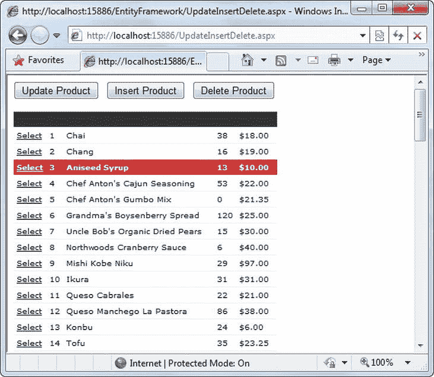

[图 24-13](#_Fig002413) 。用实体框架修改数据库

要更新记录，您需要首先检索正确的实体对象。您使用的技术取决于您正在执行的确切任务，但是您可能通过遍历集合、跟踪导航属性或执行 LINQ 表达式来获得您的对象，如下所示。

然而，有一个小技巧。所有的 LINQ 表达式都返回一个迭代器，允许你遍历一个对象集合。如果您知道有一个表达式只匹配一条记录(例如，一个对唯一键值使用了`where`关键字的表达式，如 ProductID)，那么您可以使用 Single()方法。这将执行查询并返回唯一匹配的对象。

下面的代码选择一个特定的产品(使用 LINQ 表达式)，更新股票号码，并保存更改。粗体的两个代码语句触发即时数据库操作，因此需要异常处理:

```cs
protected void cmdUpdate_Click(object sender, EventArgs e)
{
    // Only allow updating if a record is currently selected.
    if (gridProducts.SelectedIndex ! = -1)
    {
        // Use a LINQ expression to find the selected product.
        int selectedProductID = (int)gridProducts.SelectedDataKey.Value;
        var matches = from p in entities.Products
                     where p.ProductID == selectedProductID
                     select p;
        // Execute the query and return the entity object.
        Product product = matches.Single();
        // Change the entity object.
        product.UnitsInStock - = 1;
        // Commit the changes back to the database.
        entities.SaveChanges();
    }
}
```

 **提示** SaveChanges()也返回一个整数，表示更新了多少条记录。因此，如果您得到的结果为 0，您就知道没有执行任何操作。

插入新记录几乎一样容易。最好的方法是使用适当实体类的静态工厂方法。所以如果你想创造一个新产品，就叫产品。CreateProduct()。然后将新对象添加到 NorthwindEntities。Products 集合，并使用 SaveChanges()提交更新:

```cs
protected void cmdInsert_Click(object sender, EventArgs e)
{
    // The CreateProduct() method requires the three non-nullable Product fields
    // as arguments: ProductID, ProductName, and Discontinued. However, the
    // ProductName isn't actually used--when the update is finished, it's replaced
    // by the automatically generated ID that the database creates.
    Product newProduct = Product.CreateProduct(0, "Thick-As-Cement Milkshake",
     false);
    // You can now set additional properties that aren't required.
    newProduct.CategoryID = 1;
    newProduct.UnitsInStock = 10;
    newProduct.UnitPrice = 15.99 M;
    // Finally, commit the changes and insert the record in the database.
    entities.Products.AddObject(newProduct);
    entities.SaveChanges();
}
```

最后，删除操作是最简单的数据操作。您只需要调用适当集合的 DeleteObject()方法，然后调用 SaveChanges()。以下代码检索当前选定的产品对象，并使用此方法将其从数据库中删除:

```cs
protected void cmdDelete_Click(object sender, EventArgs e)
{
    // Check if a row is selected.
    if (gridProducts.SelectedIndex ! = -1)
    {
        // Use a LINQ expression to find the selected product.
        int selectedProductID = (int)gridProducts.SelectedDataKey.Value;
        var matches = from p in entities.Products
                     where p.ProductID == selectedProductID
                     select p;
        // Execute the query and return the entity object.
        Product product = matches.Single();
        // Delete the record from the database.
        entities.Products.DeleteObject(product);
        entities.SaveChanges();
        // Clear the selection (which may now be pointing to a different row.)
        gridProducts.SelectedIndex = -1;
    }
}
```

实体框架使用一个相当复杂的变更跟踪系统来使这些操作工作。

当您调用 SaveChanges() 时，上下文对象试图提交它所跟踪的数据中的所有更改，包括更新、删除和插入。如果您有相关记录，实体框架将按有意义的顺序应用更改(例如，在插入链接的父记录之前，它不会尝试插入子记录)。如果您在富桌面应用中使用实体框架，这种能力会更有趣，在富桌面应用中，您可能会将实体对象长时间保存在内存中，并定期提交一批更新。但是在 web 应用中，页面只存在几秒钟(或者更短)，您几乎总是要创建一个新的上下文对象，立即执行所有的数据库操作，然后丢弃它。

 **注意**当你调用 SaveChanges()时，所有的修改都作为单个事务的一部分执行。如果发生错误，整个过程将回滚，但对象仍保持当前状态，并带有任何新的和编辑过的信息。这意味着您可以通过编程解决问题，并再次调用 SaveChanges()。

管理并发性

所有常见的因素都可能导致更新错误—等待连接超时、网络错误等等—但是最常见的更新错误是并发问题。

您可以使用两种总体策略来处理并发问题:您可以在并发问题发生之前尝试避免它们，或者您可以在并发问题发生之后尝试解决它们。

默认情况下，实体框架使用“优胜劣汰”的更新策略。这意味着新的更新总是成功的，但是它们可能会清除另一个用户的更改。然而，这不会带来与 SqlDataSource 控件相同的问题(您在第 15 章[末尾的“严格并发检查”一节中考虑过这个问题)。那是因为实体框架没有应用旧的值。如果更改单个字段并调用 SaveChanges()，实体框架将使用更新命令来修改该字段。](15.html)

如果两个用户同时更新相同的记录，并且编辑相同的字段(或者，如果他们对不同字段所做的更改不一致)，那么实体框架的更新策略仍然会产生问题。根据您使用数据库的方式和编辑的频率，这可能不是您的应用的主要问题。(毕竟，与桌面应用不同，在 ASP.NET 应用中进行和提交编辑所需的时间非常短。)但是如果您需要捕捉涉及重叠编辑的潜在问题，您可以配置实体框架来使用更严格的并发检查。

它是这样工作的。使用数据模型设计器，您可以选择必须匹配的字段，以便更新成功。例如，您可能决定只有当 ContactName 和 CompanyName 字段在检索到记录后没有被其他用户更改时，才允许继续更新客户记录。为此，首先单击 Customer 表框中的 ContactName 字段。然后将“属性”窗口中的“并发模式”属性从“无”更改为“固定”。最后，对 CompanyName 字段重复这个过程。

现在，如果您尝试提交一个更改，并且它与另一个用户已经更改的记录重叠，编辑将失败，并出现 OptimisticConcurrencyException。此时，您可以尝试解决问题，或者让用户选择重新应用更新。

**使用实体数据源**T3】

到目前为止，本章中的实体框架示例都使用纯代码来检索、操作和绑定数据。然而，ASP.NET 还包括一个 EntityDataSource 控件 ，您可以使用它来自动执行这些任务。

与 SqlDataSource 控件非常相似，当您使用 EntityDataSource 控件时，您不需要编写任何代码。但是 EntityDataSource 控件更进一步—不仅可以避免编写 C#代码，还可以避免编写 SQL 查询来选择和更新数据的繁琐细节。这使得它成为中小型应用和不需要仔细调整就能获得最佳性能的应用的完美工具。另一方面，这也肯定会激怒那些喜欢完全控制每个细节的数据库纯化论者。如果 EntityDataSource 缺少您需要的特性、性能或灵活性，您将需要使用定制的数据访问代码(可能在 ObjectDataSource 的帮助下)，如第 22 章中所述。

显示数据

为了了解 EntityDataSource 的功能和总体目标，有必要构建一个简单的示例。在下面的例子中，你将看到如何构建如图 24-14 所示的网页，它允许你插入、删除和更新雇员表中的记录。

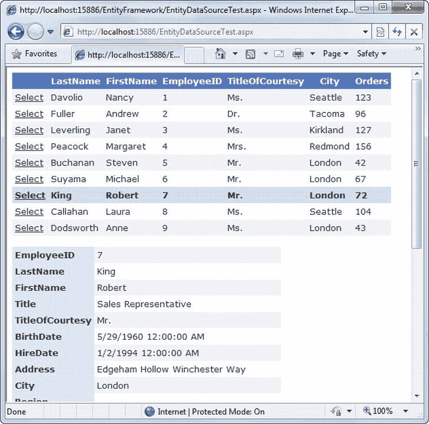

[图 24-14](#_Fig002414) 。用 EntityDataSource 管理一个表

假设您已经创建了数据模型，下一步是添加要用来显示数据的控件。在这个示例中，使用了两个控件—一个 GridView 允许您选择一个雇员，另一个 DetailsView 允许您更改、删除或创建一个新的雇员。您可以直接从工具箱添加这两个控件，并使用自动套用格式功能为它们提供一个令人愉快的配色方案。

第三个要素是将上下文对象链接到数据控件的数据源。在本例中，您需要两个数据源控件—一个检索所有雇员记录(对于 GridView ),一个检索单个雇员记录(对于 DetailsView)。后者还将执行编辑、插入和删除操作。

若要创建第一个数据源，请将 EntityDataSource 控件拖放到网页上。配置它的最快方法是使用向导(在“设计”视图中选择数据源控件，单击右上角的箭头，然后选择“配置数据源”)。向导只有两个步骤。第一步显示项目中所有派生的 ObjectContext 类(如 NorthwindEntities)并提示您选择一个。

第二步询问您想要包含哪些列。要包括全部，选择列表顶部的全选项目([图 24-15](#Fig002415) )。

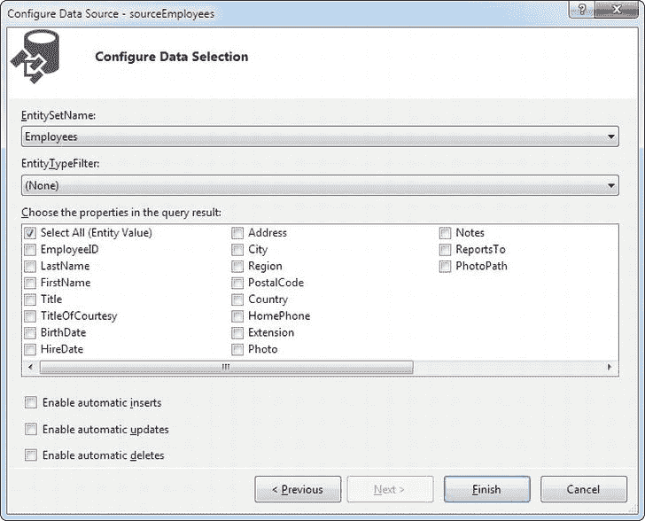

[图 24-15](#_Fig002415) 。选择栏目

完成向导后，您将得到一个相当简单的控制标记，如下所示:

```cs
<asp:EntityDataSource ID = "sourceEmployees" runat = "server"
 ConnectionString = "name = NorthwindEntities" EnableFlattening = "False"
 DefaultContainerName = "NorthwindEntities"
 EntitySetName = "Employees">
</asp:EntityDataSource>
```

ConnectionString 属性表示存储在 web.config 文件中的连接字符串的名称。DefaultContainerName 表示您正在使用的数据模型的名称，EntitySetName 表示您正在从上下文对象绑定的集合。此数据源假设您包含所有字段(尽管您不一定会显示所有这些字段，这取决于您如何配置数据显示控件)。

如果您在向导的第二步中选择了列的子集([图 24-15](#Fig002415) )，您还会看到一个定义投影的选择属性，如下所示:

```cs
<asp:EntityDataSource ID = "sourceEmployees" runat = "server"
 ConnectionString = "name = NorthwindEntities" EnableFlattening = "False"
 DefaultContainerName = "NorthwindEntities"
 EntitySetName = "Employees"
 Select = "it.[LastName], it.[FirstName]">
</asp:EntityDataSource>
```

如果语法看起来有点奇怪，只需记住 EntityDataSource 在执行投影时对数据对象使用名称 *it* 。换句话说，前面显示的 EntityDataSource 使用的表达式可以写成这样:

```cs
var matches = fromitin employees
             select new {LastName = it.LastName, FirstName = it.FirstName};
```

您可以使用 sourceEmployees 数据源来填充图 24-13 中的网格。只需设置 GridView。sourceEmployees 的 DataSourceID 属性。接下来，确保 GridView 支持选择。DataKeyNames 属性应该设置为 EmployeeID，并且选择列应该在网格中可见(要添加它，请选择 GridView 智能标记中的启用选择选项或设置 GridView。手动自动生成 SelectButton 属性)。

DetailsView 显示了网格中当前选中的雇员。您学习了如何使用 SqlDataSource 创建这种设计，但是 EntityDataSource 的工作方式略有不同，因为它不允许您直接定义 Select 命令。首先，创建一个新的 EntityDataSource，它具有与第一个相同的特征。然后，您需要通过设置 EntityDataSource 为 LINQ 表达式构建`where`操作符。财产在哪里。这将对查询进行筛选，只包括单个匹配的雇员实体。

生成此部件最简单的方法是在页面的设计图面上选择 EntityDataSource 对象，在“属性”窗口中找到 Where 属性，然后单击省略号(。。。)按钮。这将打开一个名为表达式编辑器的窗口。确保选中该窗口顶部的自动生成 Where 表达式复选框。然后单击 Add Parameter 按钮，输入您希望用于过滤条件的字段的名称(在本例中，它是 EmployeeID)。在“参数源”下拉列表(位于右下角)中，选择“控制”。在 ControlID 列表(就在下面)中，选择您的 GridView(在本例中，就是 GridView1)。[图 24-16](#Fig002416) 显示了已完成的对话框，所有信息都已就位。

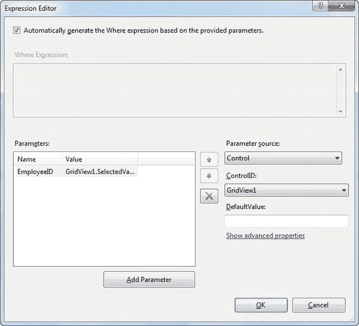

[图 24-16](#_Fig002416) 。过滤掉一个员工

此数据源尝试查找 EmployeeID 与 GridView 中的选定值相匹配的雇员。下面是生成的完整标记:

```cs
<asp:EntityDataSource ID = "sourceSingleEmployee" runat = "server"
 ConnectionString = "name = NorthwindEntities"
 DefaultContainerName = "NorthwindEntities" EnableFlattening = "False"
 EntitySetName = "Employees"
 Where = "" AutoGenerateWhereClause = "True">
 <WhereParameters>
    <asp:ControlParameter ControlID = "GridView1" Name = "EmployeeID"
     PropertyName = "SelectedValue" />
 </WhereParameters>
</asp:EntityDataSource>
```

现在，当您在 GridView 中选择一个雇员时，完整的详细信息将出现在 DetailsView 中。

**编辑数据**T3】

此示例中的最后一步是配置 DetailsView 和第二个 EntityDataSource 以支持更新、插入和删除操作。要启用这些功能，只需在页面的设计图面上选择 sourceSingleEmployee，并使用“属性”窗口将 EnableInsert、EnableDelete 和 EnableUpdate 属性设置为 true。或者，您可以使用配置数据源向导中的复选框，如图[图 24-15](#Fig002415) 所示。无论哪种方式，这只是在 EntityDataSource 控件标记中设置几个名称相似的属性:

```cs
<asp:EntityDataSource ID = "sourceSingleEmployee" runat = "server"
 ConnectionString = "name = NorthwindEntities"
 DefaultContainerName = "NorthwindEntities" EnableFlattening = "False"
 EntitySetName = "Employees"
 Where = "" AutoGenerateWhereClause = "True"
 EnableInsert = "True" EnableUpdate = "True" EnableDelete = "True">
 <WhereParameters>
    <asp:ControlParameter ControlID = "GridView1" Name = "EmployeeID"
     PropertyName = "SelectedValue" />
    </WhereParameters>
</asp:EntityDataSource>
```

值得注意的是，这是完成示例所需的全部内容。EntityDataSource 现在将自动使用 NorthwindEntities 来执行这些记录操作。删除记录时，它使用您前面考虑过的 DeleteObject()方法。添加记录时，它创建一个新的 Employee 实体对象，并调用 AddObject()将其插入到集合中。当修改记录时，它只是设置相应的属性。无论您使用哪种操作，都会通过调用 SaveChanges()应用新数据来结束。

**最后一个字**

在本章中，您了解了 LINQ，它是。NET 框架，在 C#和 Visual Basic 语言中有很强的支持。LINQ 为检索和处理数据提供了一个声明性模型，允许您对各种不同类型的数据使用相同的语法。

当您将 LINQ 与实体框架(一种无代码数据库查询和更新的新模型)结合起来时，它会大放异彩。尽管实体框架引入了自己的新的复杂性和性能考虑，如延迟执行和延迟加载，但它也将开发人员从数据访问编程的真正苦差事中解救出来，如编写许多数据对象和 ADO.NET 例程。最终，由您来决定您更喜欢哪种风格——预先的、直接的 front 方法，还是更高级的实体框架，后者增加了大量方便的工具和一些偶尔的麻烦。`